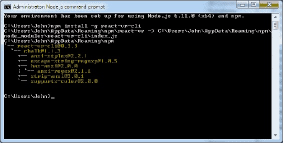
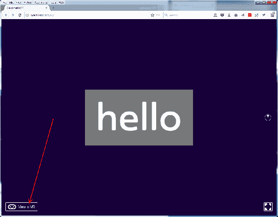

# 二、平面与超越：虚拟现实编程

在上一章中，您了解了虚拟现实是什么以及它可以是什么。程序员和开发人员（像你一样）是如何创建这些虚拟世界的？我们发现要做好这件事很难。我们必须保持快速的帧速率和适当的立体渲染。我们如何快速轻松地做到这一点？请继续阅读，并了解如何操作。

在本章中，我们将介绍以下主题：

*   HTML 和常见编程方法，如 Node.js、JavaScript 和游戏引擎
*   反应库
*   图形库，用于显示二维和三维图像
*   如何安装所有这些软件，以便我们可以开始编程

# HTML 和超越 2D internet 的方法

在 web 开发的同时，早期的 HTML 语言也发生了巨大的变化。良好的网页体验通常不仅仅涉及 HTML。添加更多交互性的方法之一是通过 JavaScript。HTML、XML 和 JavaScript 的结合是交付 web 的很大一部分，包括应用，如 Google 文档或在线 Microsoft Word（也是免费的）。

然而，这些是平的。进入第三维度传统上采用高速软件，通常是用 C++编写的。随着计算机的速度越来越快，**图形处理单元**（**GPU**）占据了实际 3D 生成的大部分，描述 3D 游戏的语言也在不断发展。

目前在虚拟现实中编程的方式有很多种。在裂谷和 VIVE 显示的分辨率下，每秒生成 90 帧是一个挑战，因此大多数 VR 编程都是用高速语言完成的，这些语言直接面向金属或低电平，例如 C 和 C++。然而，游戏引擎，如 Unity、Unreal 或 Cryengine，可以为您做很多这方面的工作。

首先，你可能会想*我为什么要使用游戏引擎？我不是在写游戏*。更一般地说，这些引擎是为游戏而构建的，但不必只构建游戏。现代游戏引擎处理渲染（我们需要的）、物理（我们需要它来构建真实世界）、地形（用于室外场景）、照明（用于复杂渲染）、人工智能（用于填充我们的世界）、网络（用于构建多用户环境）和其他代码。这些都不一定是特定于游戏的，尽管所有不同的游戏引擎都有比企业数据可视化更适合游戏的术语。例如，在 Unity 中，基本 3D 对象被称为`GameObject`。所以，即使你没有写游戏，你也会有`GameObject`s。

目前，VR 软件的主要竞争者有：

*   Unity（由 Unity3D 提供，更多信息参见[http://bit.ly/UnityForVR](http://bit.ly/UnityForVR) ）
*   虚幻（由史诗游戏、虚幻锦标赛的制作者制作；更多信息参见[http://bit.ly/UnrealForVR](http://bit.ly/UnrealForVR) ）
*   Cryengine（由游戏 Crysis 的制造商 Crytek 编写；更多信息参见[http://bit.ly/CrytekForVR](http://bit.ly/CrytekForVR) ）
*   木材厂（亚马逊提供；更多信息参见[http://bit.ly/LumberyardForVR](http://bit.ly/LumberyardForVR) ）

许多游戏引擎也可以在移动平台上运行。使用游戏引擎的好处是，你可以*写一次，在任何地方*运行，这意味着大多数游戏引擎都支持移动和 PC。基本上，您先构建一个 PC 应用，然后更改构建设置并构建一个移动应用。现在，每个平台都有两个或多个不同的应用。

游戏引擎可能会有一个相当陡峭的学习曲线，尽管这仍然比编写自己的渲染代码容易。您确实需要构建整个应用，这可能会让人望而生畏

与当前最先进的网络编程相比，人们只想描述您想要看到的内容，而不是编写服务器端代码将网页发送到手机，也不是编写自定义应用下载并显示这些信息。

那么，为什么虚拟现实会要求你这么做呢？

使用 React VR，您不必这样做。

您可以使用 JavaScript 构建自己的世界，而不是学习游戏编程引擎。您可以使用声明性组件构建 VR 世界和 UI，而不是构建渲染代码。实际上，你可以在更高的层次上描述你的虚拟现实世界，而不是一次只构建一个像素。听起来不是更有趣吗？

# Node.js 和 JavaScript 的背景

大声说 Node.js。格松海特！

js 是一个在服务器端使用 JavaScript 的开源系统。当然，这是 web 浏览器执行代码的主要方式。它早在网络的早期就被发明了，原因有几个

React 和 React VR 大量使用 JavaScript。将 React web 页面呈现到浏览器需要服务器端 JavaScript，这意味着 web 服务器不只是将文件发送到浏览器，而是在服务器端执行代码。Node.js 允许您使用与浏览器相同的语言编写服务器端代码。对于全堆栈开发人员来说，这是理想的，因为您可以沉浸在一种语言中。

# 让服务器做出反应

React VR 基于 React，该框架允许通过声明而不是编程来构建网页和交互式用户界面。您为应用中的每个状态构建视图，然后 React 将使用正确的组件来显示该应用。

声明性视图使您的代码更容易、更健壮、更易于修改和调试。

组件使用面向对象的封装概念，这意味着它们可以自给自足并管理自己的状态。然后使用这些组件来创建复杂的 UI。

React 允许开发人员创建随时间变化的应用，而无需不断刷新浏览器页面。它使用模型-视图-控制器设计模式/模板，并可与其他 JavaScript 库（如 Angular.JS）结合使用。

React 于 2011 年首次用于 Facebook 的新闻源。它于 2015 年 3 月开放源代码。

您可以在[找到关于 React 的更多详细信息 https://facebook.github.io/react/](https://facebook.github.io/react/) 。

# 图形库-OpenGL 和 WebGL

本节将介绍一般的 3D 编程，但需要对不同的内容进行一些讨论。

**OpenGL**是显示图形的标准。没有进入 PC 与工作站的政治（古代的历史现在），这是一个标准，工作站供应商（SGI）率先标准化计算机图形和程序显示图形的能力。

还有其他 API，如 DirectX，它由 Microsoft 和许多 PC 游戏开发人员、CAD 软件和其他 PC 计算机图形支持。

严格来说，OpenGL 不是开源的；然而，该软件可以在不支付版税的情况下使用，并且有文档记录并且可以免费使用（公平地说，DirectX 也是如此）。

基本上，OpenGL 是软件显示图形的一种方式。在这种情况下，软件通常是指 C++（或其他可以调用本地库和 O/S 实用程序的语言）。

Vulkan 或多或少是 OpenGL 的继承者。它的级别低于 OpenGL，提供了执行并行任务和直接利用大多数智能手机和 PC 中 GPU 功能的更多能力。由于它是一种低级格式，您将听到更多关于 Vulkan 的计算机图形讨论，而较少关于 Web 图形的讨论。与 OpenGL 一样，它通常由编译的本机模式软件（C++等）使用。

**WebGL**是一个 JavaScript API，用于在 web 浏览器中呈现 3D 图形，无需插件。由于 OpenGL 的创建者 SGI 已不再营业，OpenGL 和 WebGL 现在都由 Khronos group（一个非盈利、成员资助的财团）支持、定义和销售。WebGL 通过 JavaScript 或其他浏览器支持的语言使用。

**three.js**是一系列 JavaScript 文件，使 WebGL 更易于编程。然而，这是一个相当大的下载量。

React VR 基于 three.JS 和 React 构建。

**A-Frame**是另一个 WebGL 前端；它与 React VR 有一个类似的概念，这意味着它是声明性的、高级的，并且构建在 three.js 上。您不必创建点并将它们连接起来以形成立方体；你只需要声明一个立方体，并给它一个位置，颜色，等等。虽然本书主要介绍 React VR，但它们之间有一些区别。

*   React VR 应用是用**JSX**编写的。这是一种允许将类似 HTML 的标记混合到 JavaScript 代码中的语法。React VR 基于 React 和 React Native。如果您已经了解 React，那么您可以非常快速地学习 React VR，并且基本概念是相同的，因此您会感觉自己是本地人。
*   A-Frame 应用使用 HTML，带有自定义 HTML 标记。它是一个功能强大的框架，为 three.js 提供了一个声明性的、可组合的、可重用的实体组件结构。A-Frame 可以从 HTML 中使用，尽管开发人员仍然可以访问 JavaScript、DOM API、three.js、WebVR 和 WebGL。
*   它们都允许定制 JavaScript 代码并直接与 three.js 和 WebGL 接口

但为什么要做出决定呢？你不必这么做。两者都可以使用。让我们安装 React VR。

# 安装 Node.js 和 React VR

目前可用的大多数桌面虚拟现实硬件都使用 Windows；因此，下面的说明以及本书的大部分内容将混合使用 Windows 安装和 GearVR 查看。在撰写本文时，Linux 可能会被黑客攻击以与 HTC Vive 和 Oculus Rift 合作，但这是一条艰难的道路，有点超出了本书的范围。苹果电脑只是增加了为虚拟现实添加外部视频卡的功能，因为大多数电脑根本没有视频处理功能，无法以 Vive 和 Rift 耳机使用的分辨率呈现虚拟现实。

然而，React 不是特定于 PC 的。您可以使用 Linux 或 Mac 构建本书中的所有示例，并使用 Google Daydream、非官方硬纸板或三星 Gear VR 查看所有示例。在这种情况下，一些示例可能使用稍微不同的语法。我写这本书是为了让大多数拥有 Vive 和 Rift 的用户都能跟随我，我为平台限制提前向你们道歉。

为什么我们不能和睦相处？

如果可能，我将包括其他平台的链接和信息。

# Node.js 的安装

我们假设您知道自己所在的平台，并且有一台能够安装 Node.js 和 React VR 的计算机（台式 PC）。

首先，我们需要安装 Node.js。如果您已经安装了它，那就太好了，只需确保（在编写本书时）您至少有 4.0 版。这本书是用 LTS 版本构建的：v6.11.0 和 v8.5.0，当你阅读这本书时，它应该是稳定的和过时的。（包括`npm`3.10.10）

1.  您应该能够从：[获取 Node.jshttps://nodejs.org/en/download/](https://nodejs.org/en/download/) 。下载 64 位`.msi`预建安装程序文件。下载后，双击该文件或运行它，具体取决于您的浏览器。
    我们生活在保姆状态，因此它会警告您正在下载本机代码。再说一次，人们总是被鱼叉式网络钓鱼（让你感染自己的病毒电子邮件）弄得不知所措。这个应该是安全的。

These warnings only come up if the program you are downloading has not been digitally signed. A digital code signing certificate is not that hard to get; insist that companies and non-profit organizations sign their code.

It will make the internet safer. 

Do this for any code you release.

2.  单击下一步。

3.  我知道，但你真的应该阅读条款和条件——同意并点击下一步。
4.  默认位置很好。谢天谢地，我们不必担心 Linux 不能处理文件名中的空格（只是跟你们 Linux 的人开玩笑）。
5.  大多数安装选项都可以。它们不需要很大的空间，所以可以安装所有东西

6.  点击安装

7.  你可能（应该）得到一个警报，一个软件正在安装；告诉 Windows 没事

8.  你完成了！是时候安装 React VR 的其余部分了。点击 Finish。

Node.js for Mac:

The Node.js organization recommends using Homebrew: [https://brew.sh/](https://brew.sh/).
But, you can also install Node.js via the Node.js download page:[ https://nodejs.org/en/download/](https://nodejs.org/en/download/).
Installation should be straightforward.

Node.js for Linux:

While the source code is here: [https://nodejs.org/en/download/,](https://nodejs.org/en/download/) you can download Node.js a little easier from the package manager; instructions are here: [https://nodejs.org/en/download/package-manager/.](https://nodejs.org/en/download/package-manager/)
Installation should be straightforward; this is Linux, so I'm sure you can handle any wrinkles.

# Post Node.js 安装-安装 React VR

Node.js 软件包括一个名为`npm`的包管理器。软件包管理器安装软件以及该软件的依赖项。您将使用此选项安装 React VR。它使安装非常容易，而且是最新的。无论您的平台是什么，您都需要使用命令提示符来处理本书中的大多数示例。命令提示符被错误地称为 DOS 的窗口。在 Windows 中，这被称为 Node.js**命令行界面**（**CLI**工具），尽管实际标题是 Node.js 命令提示符。Node.js 安装程序在安装时设置了此选项。您应该使用安装中的 CLI，因为它设置了某些环境变量等。说到这里，我使用了一个名为**Take command Console**（**TCC**的替代命令行工具，在 Node.js 完成安装并注册路径变量（安装的一部分）后，我可以从我的 TCC shell 运行`npm`和其他命令

安装步骤如下：

1.  打开您首选的 CLI（启动`Node.js command prompt`
2.  键入命令：

```jsx
npm install -g react-vr-cli
```

您可以从任何位置（文件夹）执行此操作，软件包管理器（`npm`命令）将安装以下内容：



如果你再次运行这个程序，很好的一点是它会确认已经存在的内容（尽管和许多开源程序一样，它有点简洁）。

`npm` has a lot of other very useful options. For example, you can use `npm ls`, which will (just like `ls` in linux) give you a list of all objects installed. You can get exhaustive documentation by running the command `npm help npm`, which will open a web page.

3.  然后，我们希望使用相同的 CLI 来安装`WelcomeToVR`示例。首先，转到要安装示例和代码的位置（文件夹/目录）。我有第二个大硬盘，安装为 F：（您的里程、平台和磁盘配置将有所不同）。因此，在开始安装桌面或文档上的所有内容之前，我切换到了数据驱动器：

```jsx
f:
mkdir f:      2;reactVR
cd \reactVR
```

4.  然后，我继续使用 ReactCLI 安装`WelcomeToVR`演示：

```jsx
f:\reactVR>react-vr init WelcomeToVR
```

该过程将开始：


这需要很长时间。在流程结束时，它将完成并告诉您下一步要做什么：


5.  然后，进入工具刚刚创建的`WelcomeToVR`项目目录，初始化/启动本地开发服务器：

```jsx
cd WelcomeToVR 
npm start
```

这个过程需要一点时间。运行时，此命令行界面窗口将忙于运行程序。这不是一种服务。如果你关上窗户，它就会停下来。所以，不要关窗户。

当您访问各种网页时，此窗口还将显示有用的状态信息：


6.  然后，从您的桌面，打开您的浏览器到`http://localhost:8081/vr/index.html`[、](http://localhost:8081/vr/index.html)，就像 nice CLI 告诉您的那样。你完了！

与打开 web 浏览器并在 CLI 窗口中键入 URL 相比，找到此 URL 的方法更简单。您应该打开*快速编辑模式*。显示这一点的屏幕截图如下：

1.  Click on the little C:\ window in the corner of the CLI window. This is called the System Menu:

    

2.  Once you've done that, click on Properties. Once in Properties, turn on Quick Edit Mode:

    

3.  Click OK. Now, that Quick Edit Mode is turned on, you can highlight text in the window and press *Enter* to select. Then, you can paste the URL directly into your WebVR-enabled browser. Easy!

    

4.  如果像我一样，您喜欢使用与 COMMAND.COM 不同的 CLI（我使用 4nt 或 TCC），假设我们讨论过的是默认安装，那么您只需在`path`中添加以下内容，假设您在默认位置安装了 Node.js:`C:\Users\<user>\AppData\Roaming\npm;C:\Program Files\nodejs`。

# 安装 WebVR 浏览器

现在已经安装了服务器端软件，您需要安装能够显示 WebGL、OpenGL 和 WebVR 的 web 浏览器。这种情况会不断变化，所以我强烈建议您去 WebVR 查看他们的兼容性列表。

Firefox 或实验性的 Firefox Nightly 可能是最容易使用的浏览器。更多信息，请参考[http://bit.ly/WebVRInfo.](http://bit.ly/WebVRInfo)

好消息是，从版本 55 开始，Firefox 内置了常规的 WebVR 支持，所以只需确保您是 Firefox 的最新版本，就可以查看 WebVR。要查看刚刚生成的新 VR 站点，您需要执行以下步骤：

1.  确保您的浏览器可以运行 JavaScript。这是默认设置，除非您已以安全意识的方式锁定浏览器（这是一件好事）。WebVR 广泛使用 JavaScript。您还可以将 localhost 添加到白名单中。
2.  一旦打开支持 WebVR 的浏览器（在 PC 上，基本上是 Chromium、Firefox Nightly 或 IE），您将看到 hello。然而，你还没有进入虚拟现实！您需要在 VR 中单击视图。你的 VR 应用应该启动了。然后你可以戴上耳机，你会看到一个简单的问候。没有世界？你在虚拟现实世界里！



3.  你会看到一个链接，上面写着“在虚拟现实中查看”。除非你点击这个（在你的普通桌面上），否则你的 Vive/Oculus 将无法工作。
4.  一旦你在虚拟现实中点击 View，戴上耳机，你就会在虚拟现实世界中看到 hello！


祝贺你已经建立了你的第一个虚拟现实世界。我打赌这比学习统一要快得多。

您也可以使用移动 VR 进行查看，但您需要找到开发机器的 IP 地址，并从移动设备访问该网站，例如：`http://192.168.1.100/vr`。

在 URL`http://localhost:8081/vr/index.html`中，用服务器（桌面开发 PC）的 IP 地址替换`localhost`。

请注意，这几乎肯定不是正确的 IP 地址，您需要从开发机器/服务器获取 IP 地址，并将其输入移动 VR 耳机。对于 Windows，请转到网络属性，或从 CLI 类型`ipconfig`转到网络属性。如果您的台式电脑为 192.168.0.100，则您可以通过移动耳机（从虚拟键盘）键入`http://192.168.0.100:8081/vr/index.html`。

Clean your mobile screen

If you don't, any specs, fingerprints, or crud on the screen will show up sharply in focus. These specs will be distracting as they will seem to hover in front of everything.

祝贺您已经跑过并观看了您的第一个虚拟现实世界！

现在，如果你没有耳机，或者有点厌倦了打开和关闭耳机，不得不走出房间范围回到你的电脑，有一种快速预览世界的方法。在 Firefox 每晚，你只需点击小雷达显示屏，屏幕上的内容就会显示一只眼睛在 VR 耳机中看到的内容。这对像您这样的开发人员非常有用！


# 总结

在本章中，我们介绍了如何实际编程虚拟现实世界的基础知识，以及使用什么软件。我们还安装了 React VR 系统，以便开发我们自己的虚拟现实世界！在下一章中，我们将介绍构建虚拟现实世界所需的 3D 基础知识和数学知识。

不要担心数学问题；不会有弹出式测验。

现在来创造一个有趣的世界。但首先，我们需要了解世界是由什么组成的。下一节将介绍 React VR 术语来描述您的虚拟世界。