# 七、拿着（虚拟的）茶壶坐下

在上一章中，我们了解了很多关于多边形的知识以及如何在实时图形中使用它们。我们将继续多边形的工作，并了解更多有关多边形纹理的信息。

在本章中，我们将学习以下内容：

*   如何使用搅拌机的基础知识
*   如何应用基本 UV 纹理贴图
*   如何导出纹理贴图
*   如何创建 MTL 文件以正确显示实时 OBJ 纹理和材质
*   为我们的茶壶画廊做准备

Blender 只是众多多边形建模器中的一个，您可以使用它来创建虚拟对象，以便与 WebVR 一起使用。如果您已经熟悉多边形建模以及创建和编辑 UV 贴图的概念，那么您就不需要阅读本章的大部分内容。完成 UV 贴图后，我们将模型导入到世界中。我还将本章的静态文件放置在：[http://bit.ly/VR_Chap7](http://bit.ly/VR_Chap7) 所以你可以下载它们而不是构建它们。

紫外线建模可能会很乏味。如果你只是下载文件，就不会伤害我的感情。尽管如此，请浏览以下内容，当我们构建这些模型时，我们将把它们放在虚拟世界中。

# 搅拌机里的茶壶

为了学习如何绘制 UV 贴图，让我们在搅拌器中放一个茶壶。今天，这将很好地工作，但通常一个茶壶不适合在搅拌机。

您可以在[Blender.org](http://www.blender.org)下载 Blender。在那里，我强烈推荐网站上的教程[bit.ly/BlendToots](http://bit.ly/BlendToots)。Packt 也有不少关于搅拌机的好书。您可以在[找到这些 http://bit.ly/BlenderBooks](http://bit.ly/BlenderBooks) 。您可能会对基本的光标移动感到困惑或沮丧，如果您没有阅读过这些教程，请选择；看到光标移动的动画比写它更有帮助。特别是，请观看*入门*下的光标选择教程：**[http://bit.ly/BlendStart](http://bit.ly/BlendStart) 。**

为了开始制作纹理，我们将使用马丁·纽厄尔（Martin Newell）的犹他州老茶壶。它是计算机图形学中比较著名的“测试模型”之一。这是犹他州的原始茶壶，目前在加利福尼亚州山景城的计算机历史博物馆展出（由 Marshall Astor 提供）：

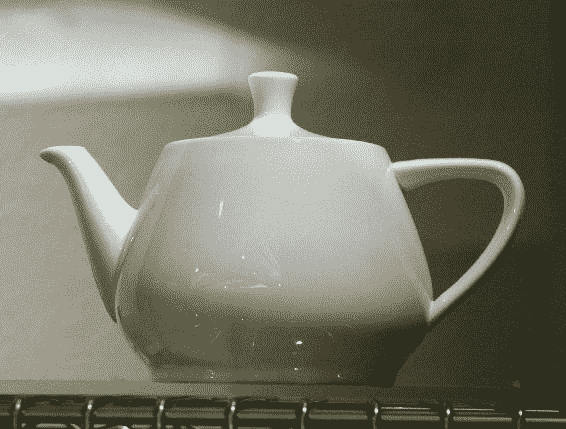

计算机图形版本在演示中被*挤压*，挤压卡住。您可以在以下网址阅读更多信息：[http://bit.ly/DrBlinn](http://bit.ly/DrBlinn) 。

这是搅拌机里的茶壶。您可以通过在“首选项”中启用“附加形状”来获得此选项：

1.  单击菜单文件，然后单击用户首选项（文件->用户首选项），然后单击其他对象：


2.  不要忘记单击屏幕底部的按钮，保存用户设置，否则下次进入时对象将不在那里。保存后，关闭搅拌机用户首选项窗口。
3.  然后，在 3D 窗口底部的菜单上，单击添加->网格->附加->茶壶+：


4.  完成此操作后，仅出于教学目的，请在左下角的窗格上选择分辨率为 3，如下所示

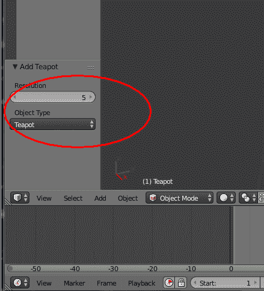

你可以提高茶壶的分辨率，这真是太好了；如果我早些时候注意到这一点的话，这本可以节省我在写这一章的时候上网一个小时的时间。我们将它改为 3，以使多边形变大，这样在做本教程时点击就容易多了。

5.  然后，您要在 3D 窗口中单击茶壶（左键单击）以将其选中；茶壶将有一个橙色的轮廓。然后单击菜单项“对象”旁边的“对象模式”一词返回编辑模式，然后选择“编辑模式”：

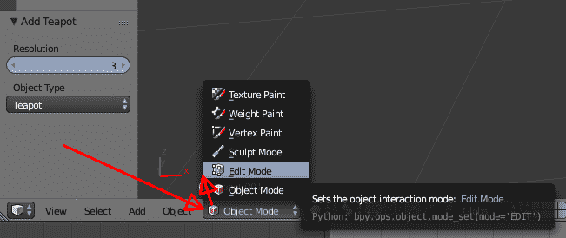

进入编辑模式后，我们需要能够在选择茶壶上的多边形时看到 UV 贴图。最初，将不会有一个 UV 地图虽然；继续跟踪，我们将创建一个。

6.  将鼠标放在时间轴窗口上方的细线上，即屏幕的底部窗口（以下屏幕截图中以红色圈出的区域），将窗口*向上拖动*。这将为窗户腾出足够的空间

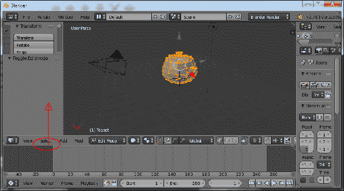

7.  我们不做动画，所以我们不需要那个窗口，我们将把它改为 UV 显示。为此，通过单击钟面小图标（哇，还记得模拟时钟吗？）上的（红色箭头），更改时间线显示以显示 UV 贴图信息，然后选择 UV/图像编辑器：


This is just one way of changing your window layouts. One of the confusing things with Blender is that you can really mess up your UI by accidentally clicking on a few things, but one of the great things is that you can make windows, subwindows, pull outs, shelves, and much more with a few clicks of the mouse. The way I just showed you is the most straightforward way for teaching, but for real work, you should customize the windows the way you want to.

更改此视图后，请注意，可以像其他搅拌机窗口一样放大、平移和移动窗口。了解如何缩放、平移等。您应该观看位于以下位置的教程视频文件：[http://bit.ly/BlendStart](http://bit.ly/BlendStart)

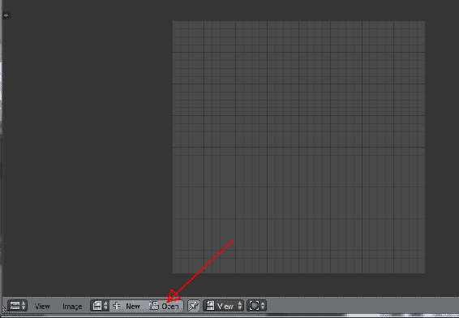

8.  因此，我们可以看到我们的纹理看起来像我们的模型；单击“打开”，找到要映射到茶壶（或模型）上的纹理文件。我用的是`ButcherTile_Lettered.jpg`。

9.  完成后，请执行第一次 UV 展开！在上部窗口的菜单中，单击网格->UV 展开->展开，如下所示：


在底部窗口中，它将显示如何展开纹理。

看起来糟透了。您的结果可能因不同型号而异

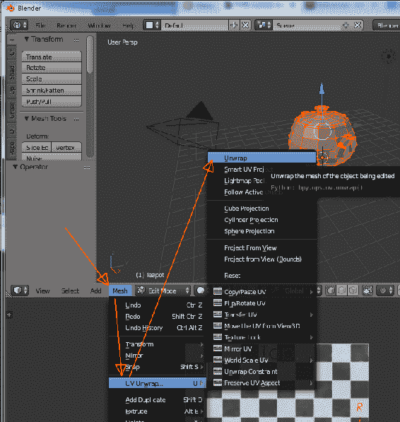

为什么这张 UV 图很糟糕？从实时图形的角度来看，它还不错；它将所有多边形打包到一个纹理贴图上，这将有助于视频卡 RAM：

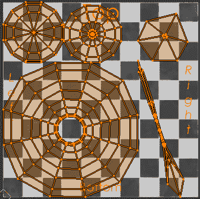

对于某些对象，这可能是好的。如果你看右上角和右下角，我们会看到喷口和把手，它们看起来很奇怪。它可能看起来有点滑稽；让我们看看它的样子。为此，我们必须指定一些纹理，然后导出茶壶。（我们将在稍后介绍出口；现在，我们只需要看到我们在 Blender 中还有其他工作要做。）

请注意，您可以通过在 Blender 内部渲染快速查看，但这可能会让您失望，因为 Blender 几乎肯定会以完全不同的方式渲染您的模型。整体颜色和纹理将是相同的，但更微妙（和重要）的纹理细节，反应 VR 和 WebGL 能够将丢失（或更好，与离线，非实时渲染器）；相反，如果您真的使用 Blender 或者看起来更好，渲染可以产生非凡的效果。

例如，在 Blender 中，使用 cycles 渲染器，我花了 11.03 秒渲染茶壶。

在 React VR 中，要保持每秒至少 60 帧，这必须在 0.016 秒内发生。Blender 花了 600 多倍的时间来生成相同的图像；看起来不是更好吗？茶壶看起来不错，但是 UV 贴图很奇怪。

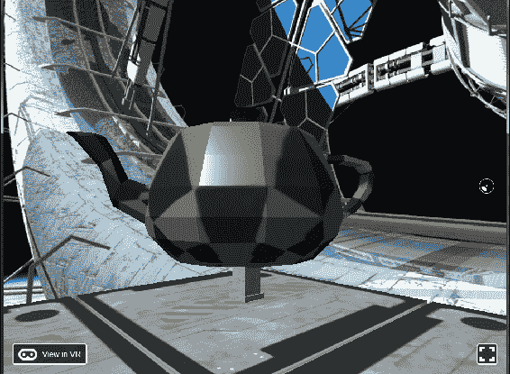

我们可以看到正方形在茶壶上有点奇怪地伸展。（如果你停下来想想我们在做什么，我们就在茶壶上放一个瓷砖图案；这是计算机图形学的奇迹。我使用棋盘格图案，这样我们可以看到茶壶上的拉伸。稍后，我将使用 Substance Designer 制作一个更好的纹理。）

您可以通过单击多边形（在编辑模式下）在 Blender 中进行实验，并查看该多边形在 UV 贴图中的位置。Blender 说，地图并不可怕，它不是我们想要的。有时（几乎所有的时间），一个人需要真正的艺术。

# 修复茶壶的 UV 贴图

要使壶的纹理更简单一些，首先让我们为壶嘴、壶柄和壶盖创建单独的材质。这将使我们的纹理贴图更大，更少“拉伸”。你也可以通过将纹理打包在一个更大的位图中来实现这一点，老实说，有时候这对 VR 来说有点好；整体方法是相同的，只是更多地被压缩到更小的区域中。

让我们为壶、把手、壶嘴和盖子创建四种材质（您仍应处于编辑模式）。

1.  点击小图标，看起来像一个闪亮的球体。然后，单击“+”键四次，如图所示，然后单击新键：


2.  单击+键四次后，将有四个插槽用于我们正在创建的材质。然后单击“新建”以实际添加材质。看起来有点笨重，但搅拌机就是这样工作的：


3.  单击“新建”时，您将得到一个 Material.001：


4.  您可以单击红色圆圈中的区域并更改名称。通过这种方式，创建四种材质，如下所示：
    1.  创建一个罐材料（将是陶瓷涂层金属）。
    2.  创建盖子材质（与壶的纹理相同）。
    3.  创建一个喷口材质（让我们制作铜）。
    4.  创建一个手柄材料（让我们制作磨损的橡胶）。

我们真的不需要创造这些材料；你可以在几个 UV 上叠加相同的纹理贴图，但我想对茶壶做一个新的拍摄（正如我们所看到的，它是一块实心陶瓷），看到不同的材质很有启发性。

现在创建了这些额外的材质，可以移动 UV 以更好地映射对象。UV 贴图是一个很大的课题，需要一定的技术和艺术技巧才能做好，或者 PC 可以自动完成。这有点超出了本书的范围，但我将向您展示一个快速而肮脏的方法来 UV 映射一些常见对象。您在 web 上找到的许多文件可能没有应用好的 UV 贴图，因此您可能会发现自己不需要学习建模师，但会使用它来更正 UV 贴图（在多边形建模方面，这是一项非常高端的活动！）。

创建四种材质后，可以将每个部分单独映射到其自己的 UV 贴图；当在我们的虚拟现实世界中呈现这一点时，我们将为每件作品使用不同的纹理贴图。如果你想制作一个陶瓷壶，你可以使用相同的纹理贴图，但是我们的破旧金属壶看起来会更好。

这是艺术；情人眼里出西施。

如上文所述建立四种材质后，选择每个主要区域中的多边形，然后单击“指定”使其成为该材质的一部分：

5.  按键盘上的“A”键（或选择->（取消）选择全部| A）以取消选择所有多边形。然后，我们将在每个区域中选择盖子、把手、壶嘴和壶（主体）。
6.  切换到“多边形选择”。混合器有不同的选择模式–点、线、多边形。为此，您希望通过单击此图标切换到选择多边形：


7.  使用*Shift 键点击主锅多边形，并点击*选择多个多边形。Blender 拥有丰富的选择工具，如 box select 和其他工具，请参见以下教程：[http://bit.ly/BlendStart](http://bit.ly/BlendStart)
8.  选择主体中的多边形后，单击“指定”按钮将该多边形指定给材质，在本例中为“Pot”材质。


9.  指定多边形后，单击“视图”->“正面”，然后单击“网格”->“UV 展开”->“圆柱体投影”。然后，您将在我们前面设置的图像编辑器中拥有一个 UV 贴图，尽管它延伸到您可以指定的图像之外。
10.  要解决此问题，请在屏幕下半部分的菜单中，选择 UV->Pack Islands:

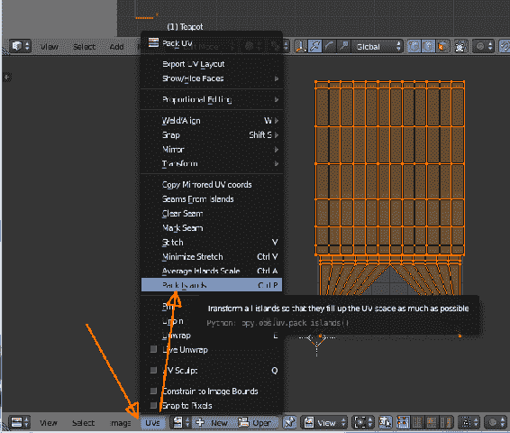

这是一个基本的纹理贴图。你可以在这方面做很多事情（这可能会令人沮丧）。Blender 有许多有用的自动 UV 分配工具；在 3D（建模）窗口中，正如我们前面看到的，网格->UV 展开->（选项）提供了许多方法来进行展开。我发现“从视图投影”和“圆柱体投影”（无论是从严格的上/下/左/右视图）都可以很好地展开 UV。说到这里，一些艺术性开始发挥作用。壶嘴、壶盖和手柄比身体小，因此，如果希望纹理与主体、壶和纹理大致对齐，则可能需要浪费一些 UV 空间并使其变小

Or you can download the `teapot2.obj` and `teapot2_Mats.mtl` from the GitHub files at: [http://bit.ly/VR_Chap7](http://bit.ly/VR_Chap7) and save yourself some sanity.

这四个 UV 映射不会很糟糕（但请随意学习、研究并做得更好！我不是艺术家！）。主体、壶材质的 UV 贴图如下所示：

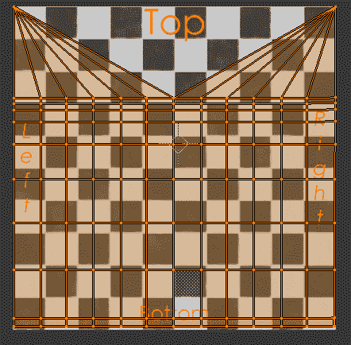

盖子材质的 UV 贴图：

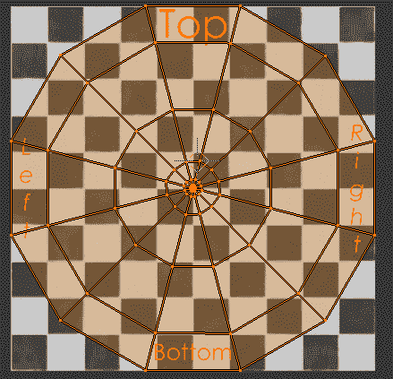

手柄材质的 UV 贴图（有意缩小，以使正方形或多或少与主罐对齐）：


喷口材质的 UV 贴图（有意缩小，使正方形或多或少与主罐对齐）：

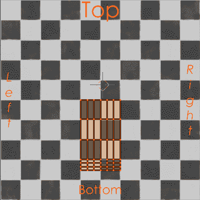

通过这些 UV 指定，我们的茶壶显示两次，在每个茶壶之间稍微旋转，看起来更好：


你可以经常摆弄 UV。在前面的屏幕截图中，如果我们在绘制一个纹理，该纹理主要是锅上的瓷砖正方形，我们可以看到，尽管把手和壶嘴与主体非常匹配，但壶盖虽然不像第一张图片那样拉伸，但看起来仍然比其他正方形小一些。修复方法是进入 3D 面板，仅选择盖子多边形（首先点击“a”直到未选择任何内容），转到“属性”选项卡中的材质并单击盖子材质，“选择”以选择所有多边形，然后转到 UV 窗口并将 UV 映射的多边形缩小一点。

然而，在我们的例子中，我们无论如何都希望为这些物品制作完全不同的材料，因此在这一点上过于担心 UV 可能是错误的。

您的里程可能会有所不同。

# 进口材料

同时，我们可以利用 VR 在材料方面提供的所有功能。不幸的是，MTL 文件并不总是具有可能的值。如果您使用的是具有基础颜色、凹凸贴图或法线贴图、高度、镜面反射（反光）或金属（类似反光）贴图的现代材质，我发现您可能需要手动编辑 MTL 文件。

你可能会认为，有了大量的计算机图形程序，我们就不会在这一点上。不幸的是，不同的渲染系统，尤其是基于节点的渲染系统，对于 OBJ 导出器来说过于复杂，无法真正理解；因此，通常，与 OBJ 文件一起使用的大多数 MTL 文件（材质）只有作为纹理贴图的基础颜色。

如果您使用的是 Quixel 或 Substance Designer 等程序，则大多数基于物理的**渲染**（**PBR**）材质由以下大部分纹理贴图（图像）组成，OBJ 文件格式也支持这些贴图：

*   **基色**：这是材料通常的外观，几乎总是在大多数 CAD 系统中以`map_Ka`的形式导出到 OBJ（MTL）文件中。
*   **漫反射贴图**：通常与底色相同，是物体的“漫反射”颜色。您也可以将其实现为`map_Ka`。
*   **凹凸贴图**：凹凸贴图是“高度”信息，但不会对多边形进行物理变形。它们看起来像是雕刻的，但如果仔细观察，多边形实际上不会移位。*这可能会导致 VR*出现问题。你的一只眼睛会说*这是凹痕*，但你的立体深度感知会说*不是*。然而，颠簸可以使事情在适当的情况下看起来非常好。这在 MTL 文件中写为*bump***。**
***   **高度贴图**：**与凹凸贴图非常相似，高度贴图通常会将多边形从曲面上物理置换掉。但是，在大多数 web 渲染中，它只会置换建模的多边形，因此它远没有脱机渲染器有用。（不过，游戏引擎可以进行微位移。）*****   **法线贴图：**法线贴图是类似事物的 RGB 表示，但比灰度的高度或凹凸贴图更复杂。法线贴图是 RGB 贴图，除了向上或向下外，还可以将多边形置换到*左侧*或*右侧*。现代游戏引擎计算从高分辨率（几十万到数百万）模型到低分辨率模型的法线贴图。它允许具有简单多边形的对象看起来像是由数百万个多边形构成的。它可能会也可能不会物理变形模型（取决于着色器）。OBJ/MTL 文件格式不直接支持它，但 WebGL 和 three.js 支持*和*，尽管实现留给读者练习。*   **镜面反射贴图**：此控件控制（使用 glTF）对象的光泽或暗度。通常为灰色贴图（无颜色信息）。更具体地说，镜面反射贴图控制纹理区域是否有光泽。这是地图。Map_Ks 也是镜面反射贴图，但控制高光的颜色。例如，这可以用于汽车上的“鬼漆”。*   **光泽度**：与镜面反射不太一样，但经常混淆。光泽度是镜面反射高光的紧密程度；它可以是宽而有光泽的，像钝橡胶，也可以是紧而有光泽的，像糖果苹果，或者是铬。基本上是应用于镜面反射贴图的*值*，通常与 PBR 一起使用，OBJ/MTL 文件格式不使用。*   **粗糙度**：非常类似于镜面反射和光泽度贴图，它通常包含在前面的贴图中。通常与 PBR 一起使用，OBJ/MTL 文件格式不使用它。*   **反射率**：一般来说，OBJ 文件格式用于离线渲染，它可以进行近似真实世界的光线跟踪反射。出于性能原因，WebGL 不能对所有对象进行光线跟踪，但可以使用反射贴图模拟反射率。在 OBJ 文件中，反射量是静态的；你不能直接做出斑驳的反射。该地图在 OBJ 文件中编码为*refl*，但在 OBJ/MTL 文件格式中不由 React VR 模拟。*   **透明度**：映射为*d*和*地图*。（d 代表原始 MTL 文件中的“密度”）这不是折射透明度；光要么通过要么不通过。它对玻璃瓶之类的东西很有用，不被 React VR 使用。*   **贴花**：这将在对象顶部应用模板，对于避免重复纹理外观和在顶部添加文字非常有用。在 MTL 中，文件编码为*贴花*。这非常有用，React VR 支持贴花。但是，我发现大多数建模者不会导出它，因此您可能需要手动编辑材质文件以包含贴花。这并不是那么糟糕，因为在您的世界中，通常会有不同模型的不同贴花（如标志、污渍等）。****

 ****# 固定甲板

现在我们已经学习了如何绘制 UV 贴图，让我们修复用于表示甲板的立方体。我们发现，在对基本 React VR 对象进行纹理处理时，立方体在立方体的所有六个面上都表示相同的纹理。因此，当我们制作一个薄立方体时，就像我们制作基座顶部和底部的立方体一样，或者制作甲板时，纹理贴图的侧面看起来“被压扁”。红色箭头表示挤压的纹理；这是因为我们有一个盒子，只有 0.1 高，5 宽，有一个正方形的纹理（双红色箭头），所以看起来像被压扁了。

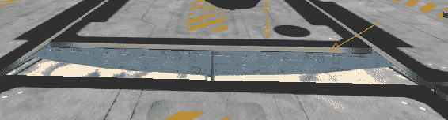

我们可以用搅拌机里的立方体来解决这个问题。我们还将添加下载的其他纹理贴图。

我有 Substance Designer，这是一个很棒的纹理工具；还有很多其他的，比如 Quixel。它将根据设置方式输出不同的纹理贴图。您还可以使用各种软件包中的任何一种来烘焙纹理。WebGL 将允许您使用着色器，但这有点复杂。它是通过 React Native 支持的，但在这一点上有点困难，所以让我们讨论不同材质值的单个纹理贴图的情况。通常在.obj 文件中都会分解为（.obj 没有现代 GPU 着色器的概念）：

1.  在 Blender 中创建一个立方体，并调整其大小（在编辑模式下），使其比宽或高的立方体短得多。这将成为我们的甲板。在我们的虚拟现实世界中，我们制作了 5x5x.1，所以让我们制作搅拌机立方体 5x5x.1。

2.  然后，我们大致对其进行纹理贴图，如下所示：


3.  将其导出到 OBJ 并选择以下参数；重要的是-Z forward、Y up（Y 是 up！）和 Strip Path（否则，它将包括您的物理磁盘位置，来自 web 服务器的资产调用显然无法提供这些位置）：

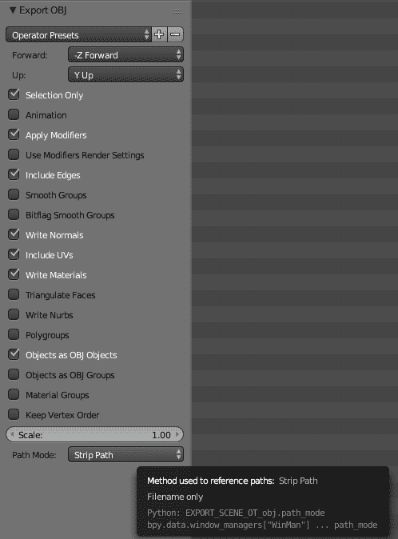

完成此操作后，我们将采用困难但直接的方法，即修改甲板的 MTL 文件，以直接包含我们想要的纹理：

```jsx
# Blender MTL File: 'DeckPlate_v1.blend'
# Material Count: 1 newmtl Deck_Plate

Ns 96.078431
Ka 1.000000 1.000000 1.000000
Kd 0.640000 0.640000 0.640000
Ks 0.500000 0.500000 0.500000
Ke 0.000000 0.000000 0.000000
Ni 1.000000
d 1.000000
illum 2
map_Kd 1_New_Graph_Base_Color.jpg
bump -bm 0.01 1_New_Graph_Height.jpg # disp will be mostly ignored, unless you have a high-polygon cube
# disp -mm .1 5 1_New_Graph_Height.png
map_Ks 1_New_Graph_Metallic.jpg
```

置换纹理有些无用；当前的渲染引擎将应用置换贴图，但不会自动细分任何多边形以实现微置换。因此，你必须生成几何体，其中包含任意多个多边形，你想置换它们。

如果要生成那么多多边形，更好的方法是在建模程序中烘焙置换，然后导出已置换的多边形。不管怎样，多边形的数量是相同的，而且你有更多的控制权。您也可以使用此方法选择性地进行抽取（减少多边形数），并仍然保留曲面细节。

当然，烘焙置换将显著增加场景中顶点和多边形的数量，因此这是一种折衷。在脱机渲染器中使用置换贴图（非虚拟现实渲染）通常是为了减少多边形数量，但并不总是适用于 VR。随着最新技术的不断发展，VR 着色器可能会进行微置换和自适应细分。

If you get a blindingly white texture, or something doesn't look like you expect, double-check the node.js console and look for a 404, like this:

`Transforming modules 100.0% (557/557), done.`
`::1 - - [20/Sep/2017:21:57:12 +0000] "GET /static_img/1_New_Graph_Metallic_Color.jpg HTTP/1.1" **404** 57 "http://localhost:8081/vr`
`/?hotreload" "Mozilla/5.0 (Windows NT 6.1; Win64; x64; rv:57.0) Gecko/20100101 Firefox/57.0"`

This means you misspelled the texture name.

然后，我们将使用面向对象的设计编码来修改我们创建的类，它将更新所有的甲板！将平台调用更改为新的甲板板 OBJ 文件，而不是长方体。

# 完成的虚拟现实世界

您的完整代码应如下所示：

```jsx
import React, {Component } from 'react';

import {
  AppRegistry,
  asset,
  AmbientLight,
  Box,
  DirectionalLight,
  Div,
  Model,
  Pano,
  Plane,
  Text,
  Vector,
  View,
  } from 'react-vr';

class Pedestal extends Component {
    render() {
        return (
          <View>
          <Box 
          dimWidth={.4}
          dimDepth={.4}
          dimHeight={.5}
          lit
          texture={asset('travertine_striata_vein_cut_honed_filled_Base_Color.jpg')}
          style={{
            transform: [ { translate: [ this.props.MyX, -1.4, this.props.MyZ] } ]
            }}
        />
          <Box 
          dimWidth={.5}
          dimDepth={.5}
          dimHeight={.1}
          lit
          texture={asset('travertine_striata_vein_cut_honed_filled_Base_Color.jpg')}
          style={{
            transform: [ { translate: [ this.props.MyX, -1.1, this.props.MyZ] } ]
            }}
        />
          <Box 
          dimWidth={.5}
          dimDepth={.5}
          dimHeight={.1}
          lit
          texture={asset('travertine_striata_vein_cut_honed_filled_Base_Color.jpg')}
          style={{
            transform: [ { translate: [ this.props.MyX, -1.7, this.props.MyZ] } ]
            }}
          />
     </View>
    )
     }
     }

         class Platform extends Component {
             render() {
                 return ( 
                    <Model
                    source={{
                        obj: asset('DeckPlate_v1.obj'),
                        mtl: asset('DeckPlate_v1_AllMats.mtl'),
                        }}
                        lit
                        style={{
                            transform: [ {
                            translate: [ this.props.MyX, -1.8, this.props.MyZ]
                        }] }}
                    /> 

        );
          }
         }

export default class SpaceGallery extends React.Component {
    render() {
        return (
          <View>
            <Pano source={asset('BabbageStation_v6_r5.jpg')}/>
            <AmbientLight

    intensity = {.3}

    />
    <DirectionalLight
    intensity = {.7}
    style={{
        transform:[{
            rotateZ: -45
        }]
    }}
         /> 
         <Platform MyX={ 0.0} MyZ={-5.1}/>
         <Platform MyX={ 0.0} MyZ={ 0.0}/>
         <Platform MyX={ 0.0} MyZ={ 5.1}/>
         <Platform MyX={ 5.1} MyZ={-5.1}/>
         <Platform MyX={ 5.1} MyZ={ 0.0}/>
         <Platform MyX={ 5.1} MyZ={ 5.1}/>
         <Platform MyX={-5.1} MyZ={-5.1}/>
         <Platform MyX={-5.1} MyZ={ 0.0}/>
         <Platform MyX={-5.1} MyZ={ 5.1}/>

         <Pedestal MyX={ 0.0} MyZ={-5.1}/>
         <Pedestal MyX={ 0.0} MyZ={ 0.0}/>
         <Pedestal MyX={ 0.0} MyZ={ 5.1}/>
         <Pedestal MyX={ 5.1} MyZ={-5.1}/>
         <Pedestal MyX={ 5.1} MyZ={ 0.0}/>
         <Pedestal MyX={ 5.1} MyZ={ 5.1}/>
         <Pedestal MyX={-5.1} MyZ={-5.1}/>
         <Pedestal MyX={-5.1} MyZ={ 0.0}/>
         <Pedestal MyX={-5.1} MyZ={ 5.1}/>

         <Model
            source={{
                obj: asset('teapot2.obj'),
                mtl: asset('teapot2.mtl'),
                }}
                lit
                style={{
                    transform: [{ translate: [ -5.1, -1, -5.1 ] }]
                    }}
            />
            <Model
            source={{
                obj: asset('Teapot2_NotSmooth.obj'),
                mtl: asset('teapot2.mtl'),
                }}
                lit
                style={{
                    transform: [{ translate: [ -5.1, -1, 0 ] },
                    { rotateY: -30 },
                    { scale: 0.5} ]

                    }}
            />

            <Model
            source={{
                obj: asset('Chap6_Teapot_V2.obj'),
                mtl: asset('Chap6_Teapot_V2.mtl'),
                }}
                lit
                style={{
                    transform: [{ translate: [ -5.1, -1, 5.2 ] },
                    { rotateY: -30 },
                    { scale: 0.5} ]
                }}
            />

            <Model
            source={{
                obj: asset('Chap6_Teapot_V5_SpoutDone.obj'),
                mtl: asset('Chap6_Teapot_V5_SpoutDone.mtl'),
                }}
                lit
                style={{
                    transform: [{ translate: [ 5.1, -1, 0 ] },
                    { rotateY: -30 },
                    { rotateX: 45 },
                    { scale: 0.5} ]

                    }}
            />

            <Model
            source={{
                obj: asset('Chap6_Teapot_V5_SpoutDone.obj'),
                mtl: asset('Chap6_Teapot_V5_SpoutDone.mtl'),
                }}
                lit
                style={{
                    transform: [{ translate: [ 5.1, -1, 5.1 ] },
                    { rotateY: 46 },
                    { scale: 0.5} ]

                    }}
            />
        <Text
            style={{
                backgroundColor: '#777879',
                fontSize: 0.1,
                fontWeight: '400',
                layoutOrigin: [0.0, 0.5],
                paddingLeft: 0.2,
                paddingRight: 0.2,
                textAlign: 'center',
                textAlignVertical: 'center',
                transform: [ 
                    {translate: [-5.2, -1.4, -4.6] }]
                    }}>
            Utah teapot
        </Text>
        <Text
            style={{
                backgroundColor: '#777879',
                fontSize: 0.1,
                fontWeight: '400',
                layoutOrigin: [0.0, 0.5],
                paddingLeft: 0.2,
                paddingRight: 0.2,
                textAlign: 'center',
                textAlignVertical: 'center',
                transform: [ 
                    {translate: [0, -1.3, -4.6] }]
                    }}>
            One Tri
        </Text>

        &amp;amp;lt;Model
        lit
        source={{
            obj: asset('OneTriSkinnyWUVTexture_1.obj'),
            mtl: asset('OneTriSkinnyWUVTexture_1.mtl'),
            }}
            style={{
                transform: [
                    { translate: [ -0, -.8, -5.2 ] },
                    { rotateY: 10 },
                    { scale: .2 },
]
                }}
        />

         <Text
         style={{
             backgroundColor: '#777879',
             fontSize: 0.2,
             fontWeight: '400',
             layoutOrigin: [0.0, 0.5],
             paddingLeft: 0.2,
             paddingRight: 0.2,
             textAlign: 'center',
             textAlignVertical: 'center',
             transform: [ 
                {translate: [0, 1, -6] }]
         }}>
    Space Gallery
  </Text>
</View>
);
    }
};

AppRegistry.registerComponent('SpaceGallery', () => SpaceGallery);
```

这需要大量的打字和大量的 UV 建模。您可以在以下位置下载所有这些文件：[http://bit.ly/VR_Chap7](http://bit.ly/VR_Chap7)

In the preceding code, I make use of this:

`<Platform MyX='0' MyZ='-5.1'/>`

This will work, but it is more correct to do this:

`<Platform MyX={0} MyZ={-5.1}/>`

如果你知道 JSX 并做出反应，这将是一个明显的问题，但不是每个人都会理解它（老实说，作为一个 C++程序员，我一开始就忽略了它）。`{}`大括号内的任何内容都是*代码*，引用的任何内容都是文本。文件上说：

*Props - Components can take arguments such as a name in* `<Greeting name='Rexxar'/>`*. Such arguments are known as properties or props and are accessed through the this.props variable. Name, from this example, is accessible as `{this.props.name}`. You can read more about this interaction under Components, Props, and State.*

关于这个论点的提及只适用于文字道具。对于数字道具，使用引用的语法（如`'0.5*'*`）似乎有效，但会产生奇怪的后果。我们将在[第 11 章](11.html)中看到更多内容，*在野外散步*，但基本上，对于数值变量，您*应该*使用`{0.5}`（大括号）。

# 总结

在本章中，我们学习了如何使用 Blender 进行多边形建模，以及如何覆盖纹理指定和围绕模型包裹纹理。我们学会了制作能让你的世界看起来更真实的纹理。

然而，世界仍然是静止的。在下一章中，你将学习如何使事物移动，从而真正使你的世界充满活力。****