# 一、TypeScript 基础

Facebook 已经成为一个非常受欢迎的应用程序。随着它的普及，对新功能的需求也在增长。React 是 Facebook 帮助更多人使用代码库并更快交付功能的答案。React 在 Facebook 上运行得非常好，最终他们将其开源。今天，React 是一个成熟的库，用于构建基于组件的前端，非常流行，并且拥有大量的社区和生态系统。

TypeScript 也是一个受欢迎的成熟库，由一家大公司（即微软）维护。它允许用户向 JavaScript 代码中添加强类型，帮助他们提高工作效率，特别是在大型代码库中。

本书将教你如何使用这两个很棒的库来构建易于维护的健壮前端。这本书的前几章只关注 TypeScript 稿。然后，您将开始学习 React，以及如何使用具有强类型的 Typescript 组件组成健壮的前端。

在本章中，我们将介绍 TypeScript 与 JavaScript 的关系及其带来的好处。因此，需要对 JavaScript 有基本的了解。我们还将介绍在为浏览器编写代码时常用的 TypeScript 的基础知识。

您将了解使用 TypeScript 构建前端的必要性，以及 TypeScript 真正适合的项目类型。您还将看到如何将 TypeScript 代码转换为 JavaScript，以便它可以在浏览器中运行。最后但并非最不重要的一点是，您将了解如何对 TypeScript 代码执行额外的检查，以使其可读性和可维护性。

到本章结束时，您将准备开始学习如何使用 TypeScript 使用 React 构建前端。

在本章中，我们将介绍以下主题：

*   了解 TypeScript 的好处
*   理解基本类型
*   创建接口、类型、别名和类
*   将代码结构化为模块
*   配置编译
*   TypeScript 脱毛
*   代码格式

# 技术要求

在本章中，我们将使用以下技术：

*   **TypeScript 游戏场**：这是一个在线网站 [https://www.typescriptlang.org/play/](https://www.typescriptlang.org/play/) 无需安装，即可轻松使用和理解 TypeScript 中的功能。
*   **Node.js 和**`npm`：TypeScript 和 React 依赖于这些。您可以安装在：[https://nodejs.org/en/download/](https://nodejs.org/en/download/) 。如果您已经安装了这些，请确保 Node.js 至少是版本 8.2，`npm`至少是版本 5.2。
*   **类型脚本**：可通过`npm`安装，在终端中输入以下命令：

```jsx
npm install -g typescript
```

*   **Visual Studio 代码**：我们需要一个编辑器来编写 TypeScript 代码。这个可以从[安装 https://code.visualstudio.com/](https://code.visualstudio.com/) 。可以使用的其他编辑器可在[找到 https://github.com/Microsoft/TypeScript/wiki/TypeScript-Editor-Support](https://github.com/Microsoft/TypeScript/wiki/TypeScript-Editor-Support) 。

All the code snippets in this chapter can be found online at: [https://github.com/carlrip/LearnReact17WithTypeScript/tree/master/01-TypeScriptBasics](https://github.com/carlrip/LearnReact17WithTypeScript/tree/master/01-TypeScriptBasics)

# 了解 TypeScript 的好处

当 JavaScript 代码库增长时，它可能变得难以读取和维护。TypeScript 是 JavaScript 的扩展，添加了静态类型。TypeScript 编译器读入包含类型信息的 TypeScript 代码，并生成干净、可读的 JavaScript，其中包含转换和删除的类型信息。编译后的代码可以在我们喜欢的浏览器和 Node.js 中运行。

与 JavaScript 相比，TypeScript 提供了几个好处：

*   编码错误可以在开发过程中更早地发现
*   静态类型允许构建提高开发人员体验和生产力的工具
*   尚未在所有浏览器中实现的 JavaScript 功能实际上可以在针对这些浏览器的应用程序中使用

我们将在以下章节中详细介绍这些要点。

# 尽早捕获编码错误

类型信息有助于 TypeScript 编译器在用户遇到 bug 和 TypeScript 错误之前捕获它们。在代码编辑器（如 Visual Studio 代码）中，在用户出错后，错误会立即以红色下划线显示。例如，创建一个名为`utils.js`的文件并粘贴以下代码，该代码计算订单行的总价：

```jsx
function calculateTotalPrice(product, quantity, discount) {
  var priceWithoutDiscount = product.price * quantity;
  var discountAmount = priceWithoutDiscount * discount;
  return priceWithoutDiscount - discountAmount;
}
```

代码中有一个 bug，我们可能很难发现。如果在 Visual Studio 代码中打开该文件，则不会突出显示任何错误。如果我们将文件的扩展名更改为`.ts`，Visual Studio 代码会立即在需要我们注意的代码位下面加上红色下划线：


大多数错误都是 TypeScript 请求一些类型信息。因此，让我们向代码中添加一些类型：

```jsx
interface IProduct {
 name: string;
 unitPrice: number;
}

function calculateTotalPrice(product: IProduct, quantity: number, discount: number): number {
  var priceWithoutDiscount: number = product.price * quantity;
  var discountAmount: number = priceWithoutDiscount * discount;
  return priceWithoutDiscount - discountAmount;
}
```

如果您不理解我们刚才添加的内容，请不要担心；我们将在下一节介绍类型。关键的一点是，我们现在有一个突出显示的错误，这实际上就是错误：

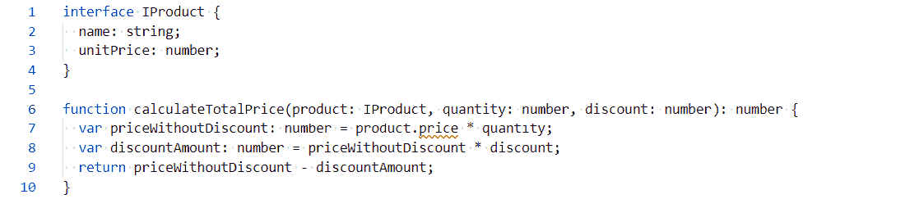

错误在于我们的函数引用了产品对象中不存在的`price`属性。我们应该参考的属性是`unitPrice`。

# 更好的开发人员经验和生产力

让我们通过将`price`重命名为`unitPrice`来修复上一节中的错误。请注意 Visual Studio 代码如何将 IntelliSense 列表`unitPrice`作为选项提供给我们，因为它查看的是我们的类型定义：


这里，TypeScript 和 VisualStudio 代码使用这些类型为我们提供更好的创作体验。除了 IntelliSense，我们还提供了代码导航功能，以及跨多个文件安全重命名函数和变量。这些特性提高了我们的工作效率，特别是当代码库很大并且有一个团队在工作时。

# 使用未来的 JavaScript 功能

TypeScript 还有另一个需要理解的优点。TypeScript 允许我们在 JavaScript 中使用一些尚未被所有浏览器采用但仍以这些浏览器为目标的功能。TypeScript 通过将这些特性的使用向下转换为目标浏览器确实支持的 JavaScript 代码来实现这一点。

例如，让我们看看 ES7 中的求幂运算符（`**`，IE 不支持它。让我们创建一个名为`future.ts`的文件，并输入以下代码：

```jsx
var threeSquared: number = 3 ** 2;
console.log(threeSquared);
```

当我们在浏览器中运行程序时，它应该将`9`放入控制台。在此之前，让我们对 TypeScript 编译器运行代码，以获得传输的 JavaScript。在与`future.ts`相同目录的终端中运行以下命令：

```jsx
tsc future
```

这将生成一个名为`future.js`的文件，其内容如下：

```jsx
var threeSquared = Math.pow(3, 2);
console.log(threeSquared);
```

因此，TypeScript 将求幂运算符转换为对`Math.pow`函数的调用，这在 IE 中是受支持的。要确认这一点，请将生成的 JavaScript 代码粘贴到 IE 中的控制台中，输出应为`9`。

这个例子非常简单，但可能没有那么有用。`Async/await`、**扩展**运算符、**rest**参数和**箭头函数**是 IE 不支持但 TypeScript 允许使用的更有用的功能。如果你不知道最后一句话的特点是什么，不要担心，因为我们会在需要的时候在书中介绍它们。

# 理解基本类型

我们在最后一节中谈到了类型。在本节中，我们将介绍 TypeScript 中常用的基本类型，以便开始了解在每种类型中应该使用哪些情况。我们将大量使用在线 TypeScript 游戏，所以一定要准备好。

# 基本类型

在理解如何使用 TypeScript 中的类型声明变量和函数之前，让我们先简单地看一下基本类型，它们是最基本的类型。基元类型是没有属性的简单值。TypeScript 与 JavaScript 共享以下基本类型：

*   `string`：表示一个 Unicode 字符序列
*   `number`：表示整数和浮点数
*   `boolean`：表示逻辑正确或错误
*   `undefined`：表示一个尚未初始化的值
*   `null`：表示无值

# 类型注解

JavaScript 变量的类型在运行时确定。JavaScript 变量的类型也可以在运行时更改。例如，保存数字的变量可以稍后替换为字符串。通常，这是不必要的行为，可能会导致我们的应用程序出现错误。

TypeScript 注释允许我们在编写代码时声明具有特定类型的变量。这允许 TypeScript 编译器在代码在运行时执行之前检查代码是否符合这些类型。简言之，类型注释允许 TypeScript 在代码使用错误类型时捕获 bug，这比我们使用 JavaScript 编写代码时要早得多。

TypeScript 注释允许我们使用`:Type`语法声明类型变量。

1.  让我们浏览到 TypeScript Played，并在左侧窗格中输入以下变量声明：

```jsx
let unitPrice: number;
```

2.  传输的 JavaScript 将显示在右侧，如下所示：

```jsx
var unitPrice;
```

That `let` has been converted to `var`. This is because the compiler that the playground uses is set to target a wide range of browsers, some of which don't support `let`. Also, notice that the type annotation has disappeared. This is because type annotations don't exist in JavaScript.

3.  让我们在程序中添加第二行：

```jsx
unitPrice = "Table";
```

请注意，`unitPrice`下方会出现一条红线，如果您将鼠标悬停在该红线上方，则会正确告知您存在类型错误：


4.  您还可以使用相同的`:Type`语法为返回值的函数参数添加类型注释。让我们在操场上输入以下功能：

```jsx
function getTotal(unitPrice: number, quantity: number, discount: number): number {
  const priceWithoutDiscount = unitPrice * quantity;
  const discountAmount = priceWithoutDiscount * discount;
  return priceWithoutDiscount - discountAmount;
}
```

我们已经声明了`unitPrice`、`quantity`和`discount`参数，都是数字。`return`类型注释位于函数的括号之后，在前面的示例中，括号也是一个数字。

We have used both `const` and `let` to declare variables in different examples. `let` will allow the variable to change the value after the declaration, whereas `const` variables can't change. In the preceding function, `priceWithoutDiscount` and `discountAmount` never change the value after the initial assignment, so we have used `const`.

5.  让我们用不正确的类型为`quantity`调用函数，并将结果分配给类型不正确的变量：

```jsx
let total: string = getTotal(500, "one", 0.1);
```

我们发现`one`以红色下划线，强调存在类型错误：


6.  如果我们随后将`one`更正为`1`，则`total`应以红色下划线，强调存在类型问题：


TypeScript 编译器使用类型注释检查分配给变量和函数参数的值是否对其类型有效。

这种强大的类型检查是 JavaScript 中没有的，它在大型代码库中非常有用，因为它可以帮助我们立即检测类型错误。

# 类型推断

我们已经了解了类型注释的真正价值，但它们涉及到大量额外的类型。幸运的是，TypeScript 强大的类型推断系统意味着我们不必一直提供注释。我们可以在立即设置变量值时使用类型推断。

让我们看一个例子：

1.  让我们在 TypeScript 中添加以下变量赋值：

```jsx
let flag = false;
```

2.  如果将鼠标悬停在`flag`变量上，我们可以看到 TypeScript 已将类型推断为`boolean`：


3.  如果我们在此下方添加另一行，将`flag`错误地设置为`Table`，我们会得到一个类型错误：


因此，当我们声明一个变量并立即设置它的类型时，我们可以使用类型推断来保存一些击键。

# 任何

如果我们声明了一个没有类型注释和值的变量呢？TypeScript 推断的类型是什么？让我们在 TypeScript 中输入以下代码并找出：

```jsx
let flag;
```

如果我们将鼠标悬停在`flag`上，我们会看到它被赋予了`any`类型：


因此，TypeScript 编译器给出了一个没有类型注释和没有立即赋值的变量，`any`类型。`any`类型特定于 TypeScript；它不存在于 JavaScript 中。这是一种在特定变量上选择不进行类型检查的方法。它通常用于第三方库中的动态内容或值。然而，TypeScript 日益强大的类型系统意味着我们现在需要更少地使用`any`。

# 无效的

`void`是 JavaScript 中不存在的另一种类型。它通常用于表示非返回函数。

让我们看一个例子：

1.  让我们在 TypeScript 中输入以下函数：

```jsx
function logText(text: string): void {
  console.log(text);
}
```

该函数只将一些文本记录到控制台中，不返回任何内容。因此，我们将返回类型标记为`void`。

2.  如果我们删除返回类型注释并将鼠标悬停在函数名`logText`上，我们将看到 TypeScript 已将类型推断为`void`：

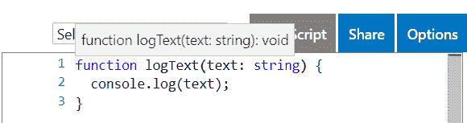

这为我们在编写不返回任何内容的函数时节省了一些击键次数。

# 从不

`never`类型表示永远不会发生的事情，通常用于指定代码的不可访问区域。同样，这在 JavaScript 中并不存在。

举个例子：

1.  在 TypeScript 中键入以下代码：

```jsx
function foreverTask(taskName: string): never {
  while (true) {
    console.log(`Doing ${taskName} over and over again ...`);
  }
}
```

该函数调用一个无限循环并且从不返回，因此我们给它一个类型注释`never`。这与`void`不同，因为 void 意味着它将返回，但没有值。

In the preceding example, we used a JavaScript template literal to construct the string to log to the console. Template literals are enclosed by back-ticks (```jsx`) and can include a JavaScript expression in curly braces prefixed with a dollar sign (`${expression}`). Template literals are great when we need to merge static text with variables.

2.  让我们更改`foreverTask`函数以打破循环：

```jsx
function foreverTask(taskName: string): never {
  while (true) {
    console.log(`Doing ${taskName} over and over again ...`);
    break;
  }
}
```

TypeScript 编译器正确地抱怨：


3.  现在让我们删除`break`语句和`never`类型注释。如果我们用鼠标悬停在`foreverTask`函数名上，我们会看到 TypeScript 已将类型推断为`void`，这不是我们在本例中想要的：

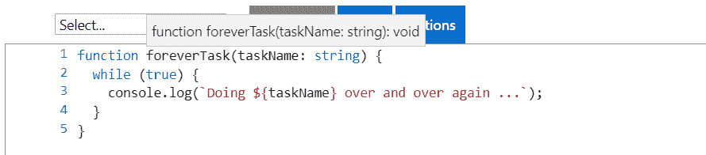

在代码永远不会返回的地方，`never`类型很有用。然而，我们可能需要显式定义`never`类型注释，因为 TypeScript 编译器还没有足够的智能来推断这一点。

# 枚举

枚举允许我们声明变量可以设置为的一组有意义的友好名称。我们使用`enum`关键字，后面是我们想要给它的名称，后面是大括号中可能的值。

下面是一个例子：

1.  让我们为 TypeScript 中的订单状态声明一个`enum`：

```jsx
enum OrderStatus {
  Paid, 
  Shipped, 
  Completed, 
  Cancelled 
}
```

2.  如果我们看一下传输的 JavaScript，就会发现它看起来非常不同：

```jsx
var OrderStatus;
(function (OrderStatus) {
    OrderStatus[OrderStatus["Paid"] = 1] = "Paid";
    OrderStatus[OrderStatus["Shipped"] = 2] = "Shipped";
    OrderStatus[OrderStatus["Completed"] = 3] = "Completed";
    OrderStatus[OrderStatus["Cancelled"] = 4] = "Cancelled";
})(OrderStatus || (OrderStatus = {}));
```

这是因为 JavaScript 中不存在枚举，因此 TypeScript 编译器正在将代码转换为确实存在的内容。

3.  让我们声明一个`status`变量，将值设置为`shipped`状态：

```jsx
let status = OrderStatus.Shipped; 
```

请注意，在键入值时，我们是如何获得良好的 IntelliSense 的：

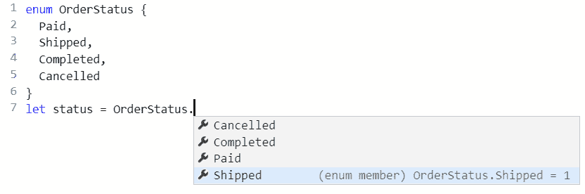

4.  默认情况下，数值从`0`开始递增。但是，起始值可以在`enum`中显式声明，如下面的示例中，我们将`Paid`设置为`1`：

```jsx
enum OrderStatus {
  Paid = 1, 
  Shipped, 
  Completed, 
  Cancelled 
}
```

5.  让我们将`status`变量设置为 shipped 状态，并将其记录到控制台：

```jsx
let status = OrderStatus.Shipped;
console.log(status);
```

如果我们运行该程序，我们将在控制台中看到 2 个输出：


6.  此外，可以显式声明所有值，如下例所示：

```jsx
enum OrderStatus {
  Paid = 1, 
  Shipped = 2, 
  Completed = 3, 
  Cancelled = 0 
}
```

枚举对于存储为特定整数集但实际上具有某些业务意义的状态等数据非常有用。它们使我们的代码更具可读性，更不容易出错。

# 物体

对象类型与 JavaScript 共享，并表示非基本类型。对象可以包含类型化属性以保存信息位。

让我们来看一个例子：

1.  让我们将以下代码输入 TypeScript Played，它创建了一个具有多个信息属性的对象：

```jsx
const customer = {
  name: "Lamps Ltd", 
  turnover: 2000134, 
  active: true 
};
```

如果我们将鼠标悬停在`name`、`turnover`和`active`上方，我们将看到 TypeScript 已经巧妙地将类型分别推断为`string`、`number`和`boolean`。

2.  如果我们将鼠标悬停在`customer`变量名上，我们会看到一些有趣的东西：


3.  该类型不是`object`，而是具有`name`、`turnover`和`active`属性的特定类型。在下一行中，我们将`turnover`属性设置为其他值：

```jsx
customer.turnover = 500000;
```

键入营业额属性时，IntelliSense 会提供对象上可用的属性：


We used `const` to declare the `customer` variable and then was able to change one of its property values later in the program. Shouldn't this have thrown an error? Well, the customer variable reference hasn't changed — just some properties within it. So, this is fine with the TypeScript compiler.

4.  这行代码非常好，因此我们没有收到编译器的任何抱怨。如果我们将`turnover`设置为一个类型不正确的值，我们将收到预期的警告：


5.  现在让我们在`customer`上设置一个尚不存在的属性：

```jsx
customer.profit = 10000;
```

我们将看到 TypeScript 抱怨：


如果我们仔细想想，这是有道理的。我们已经用`name`、`turnover`和`active`属性声明了`customer`，所以设置`profit`属性应该会导致错误。如果我们想要`profit`财产，我们应该在原始声明中声明。

总之，`object`类型是灵活的，因为我们可以定义所需的任何属性，但 TypeScript 将缩小类型范围，以防止我们错误地键入属性名称。

# 阵列

数组是 TypeScript 从 JavaScript 继承的结构。我们像往常一样将类型注释添加到数组中，但最后用方括号表示这是一种数组类型。

让我们来看一个例子：

1.  让我们在 TypeScript 中声明以下数字数组：

```jsx
const numbers: number[] = [];
```

这里，我们已将数组初始化为空。

2.  我们可以使用数组的`push`函数向数组中添加一个项。让我们将数字`1`添加到我们的数组中：

```jsx
numbers.push(1);
```

We used `const` to declare the `numbers` variable and was able to change its array elements later in the program. The array reference hasn't changed – just the elements within it. So, this is fine with the TypeScript compiler.

3.  如果我们添加了一个类型不正确的元素，TypeScript 编译器会抱怨，正如我们所预期的：


4.  如果我们用一些初始值声明一个数组，我们可以使用类型推断来保存一些击键。例如，如果我们键入以下声明并将鼠标悬停在`numbers`变量上，我们将看到该类型已被推断为`number[]`。

```jsx
const numbers = [1, 3, 5];
```

5.  我们可以使用方括号中的元素号访问数组中的元素。元件编号从`0`开始。

让我们举一个例子：

1.  让我们注销 numbers 变量声明下的元素数，如下所示：

```jsx
console.log(numbers[0]); 
console.log(numbers[1]); 
console.log(numbers[2]); 
```

2.  现在，让我们单击 TypeScript 操场右侧的 Run 选项来运行我们的程序。新的浏览器选项卡应以空白页打开。如果我们按*F12*打开开发者工具并转到控制台部分，我们将看到 1、3 和 5 输出到控制台。

3.  有几种方法可以迭代数组中的元素。一种选择是使用`for`循环，如下所示：

```jsx
for (let i in numbers) {
  console.log(numbers[i]); 
}
```

如果我们运行该程序，我们将再次看到 1、3 和 5 输出到控制台。

4.  数组还有一个有用的函数，用于迭代元素，称为`forEach`。我们可以按如下方式使用此功能：

```jsx
numbers.forEach(function (num) {
  console.log(num);
});
```

5.  `forEach`为每个数组元素调用嵌套函数，传入数组元素。如果我们将鼠标悬停在`num`变量上，我们将看到它被正确地推断为`number`。我们本可以在这里添加一个类型注释，但我们节省了一些击键：


数组是我们用来构造数据结构的最常见类型之一。在前面的示例中，我们只使用了具有数字类型的元素的数组，但任何类型都可以用于元素，包括对象，而对象又有自己的属性。

# 创建接口、类型、别名和类

在*理解基本类型*一节中，我们介绍了对象，这些类型可以有自己的属性。接口、类型别名和类是在开始使用对象结构之前定义对象结构的方法。

下面是我们使用的`customer`对象，其中我们使用初始对象值声明了`customer`变量：

```jsx
const customer = {
  name: "Lamps Ltd", 
  turnover: 2000134, 
  active: true 
};
```

1.  让我们尝试声明 customer 变量并在后续行中设置其值：

```jsx
let customer: object;
customer = {
  name: "Lamps Ltd", 
  turnover: 2000134, 
  active: true 
};
```

2.  到目前为止，一切顺利。但是，让我们看看当我们试图改变客户`turnover`价值时会发生什么：

```jsx
customer.turnover = 2000200;
```

3.  我们 TypeScript 时缺乏智能感不是我们习惯的。当我们完成输入行时，会出现一个编译器错误：

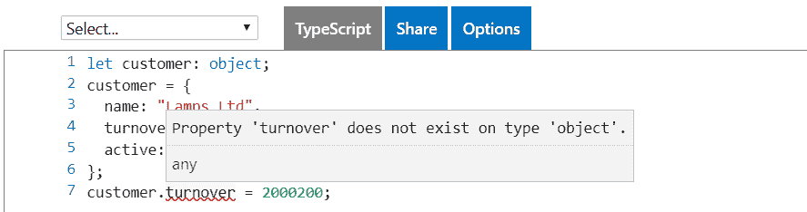

TypeScript 编译器不知道`customer`对象中的属性，因此认为存在问题。

因此，我们需要另一种定义对象结构的方法，该方法能够在程序中稍后设置属性值。这就是接口、类型别名和类的作用所在；它们让我们通过定义自己的类型来定义对象的结构。

# 接口

接口是一种契约，它定义了一个类型，该类型包含属性和方法定义的集合，而没有任何实现。JavaScript 中不存在接口，因此 TypeScript 编译器纯粹使用接口通过类型检查强制执行契约。

我们用`interface`关键字创建一个接口，后面是它的名称，后面是组成`interface`的位（用大括号括起来）：

```jsx
interface Product {
  ...
}
```

# 性质

属性是可以作为接口一部分的元素之一。属性可以保存与对象关联的值。因此，当我们在接口中定义属性时，我们是说实现接口的对象必须具有我们定义的属性。

让我们开始在 TypeScript 游戏场中使用一个界面：

1.  进入以下界面：

```jsx
interface Product {
  name: string;
  unitPrice: number;
}
```

2.  前面的示例创建了一个具有`name`和`unitPrice`属性的`Product`接口。让我们继续使用此接口，将其用作`table`变量的类型：

```jsx
const table: Product = {
  name: "Table",
  unitPrice: 500
}
```

3.  让我们尝试设置接口中不存在的属性：

```jsx
const chair: Product = {
  productName: "Table",
  price: 70
}
```

正如所料，我们得到一个类型错误：

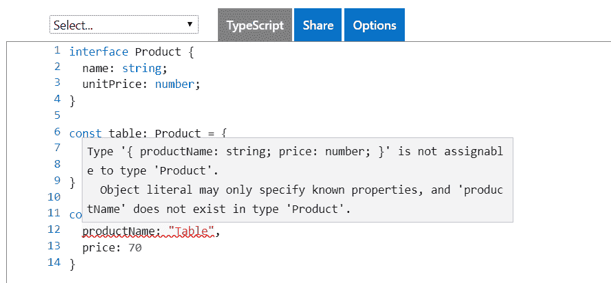

4.  接口上的属性可以引用另一个接口，因为接口只是一个类型。以下示例显示了使用`Product`接口的`OrderDetail`接口：

```jsx
interface Product {
  name: string;
  unitPrice: number;
}

interface OrderDetail {
  product: Product; 
  quantity: number;
}

const table: Product = {
  name: "Table",
  unitPrice: 500
}

const tableOrder: OrderDetail = {
  product: table,
  quantity: 1
};
```

这为我们提供了创建复杂对象结构的灵活性，这在编写大型复杂应用程序时至关重要。

# 方法签名

接口也可以包含方法签名。这些不包含方法的实现；它们定义了在实现中使用接口时的契约。

让我们看一个例子：

1.  让我们向刚刚创建的`OrderDetail`接口添加一个方法。我们的方法称为`getTotal`，它有一个`number`类型的`discount`参数，并返回一个`number`：

```jsx
interface OrderDetail {
  product: Product; 
  quantity: number;
  getTotal(discount: number): number; 
}
```

请注意，接口上的`getTotal`方法没有指定如何计算总计的任何内容—它只指定了应该使用的方法签名。

2.  在调整了我们的`OrderDetail`接口后，实现该接口的`tableOrder`对象现在将给出一个编译错误。那么，让我们通过实现`getTotal`来解决这个错误：

```jsx
const tableOrder: OrderDetail = {
  product: table,
  quantity: 1,
  getTotal(discount: number): number {
 const priceWithoutDiscount = this.product.unitPrice *  
    this.quantity;
 const discountAmount = priceWithoutDiscount * discount;
 return priceWithoutDiscount - discountAmount;
 }
};
```

请注意，实现的方法具有与`OrderDetail`接口中相同的签名。

The method implementation uses the `this` keyword to get access to properties on the object. If we simply referenced `product.unitPrice` and `quantity` without `this`, we would get a compilation error, because TypeScript would assume these variables are local within the method.

3.  让我们调整方法签名以发现我们能做什么和不能做什么。我们将首先更改参数名称：

```jsx
getTotal(discountPercentage: number): number {
  const priceWithoutDiscount = this.product.unitPrice *   
   this.quantity;
  const discountAmount = priceWithoutDiscount * 
  discountPercentage;
  return priceWithoutDiscount - discountAmount;
}
```

4.  我们将确保不会出现编译错误。现在让我们更改方法名称：

```jsx
total(discountPercentage: number): number {
  const priceWithoutDiscount = this.product.unitPrice * this.quantity;
  const discountAmount = priceWithoutDiscount * discountPercentage;
  return priceWithoutDiscount - discountAmount;
} 
```

5.  这确实会导致错误，因为`OrderDetail`接口上不存在`total`方法：


6.  我们可以尝试更改返回类型：

```jsx
const tableOrder: OrderDetail = {
  product: table,
  quantity: 1,
  getTotal(discountPercentage: number): string {
    const priceWithoutDiscount = this.product.unitPrice * this.quantity;
    const discountAmount = priceWithoutDiscount * discountPercentage;
    return (priceWithoutDiscount - discountAmount).toString();
  }
};
```

这实际上不会在 TypeScript 操场中产生编译错误，但应该会！

7.  因此，让我们使用 VisualStudio 代码来实现这个示例。在我们选择的文件夹中打开 Visual Studio 代码后，让我们创建一个名为`interfaces.ts`的文件，并粘贴`Product`和`OrderDetail`接口的接口定义以及`table`变量声明。
8.  然后我们可以进入前面的`OrderDetail`接口实现。正如所料，我们得到一个编译错误：


9.  更改参数类型也会导致编译错误：

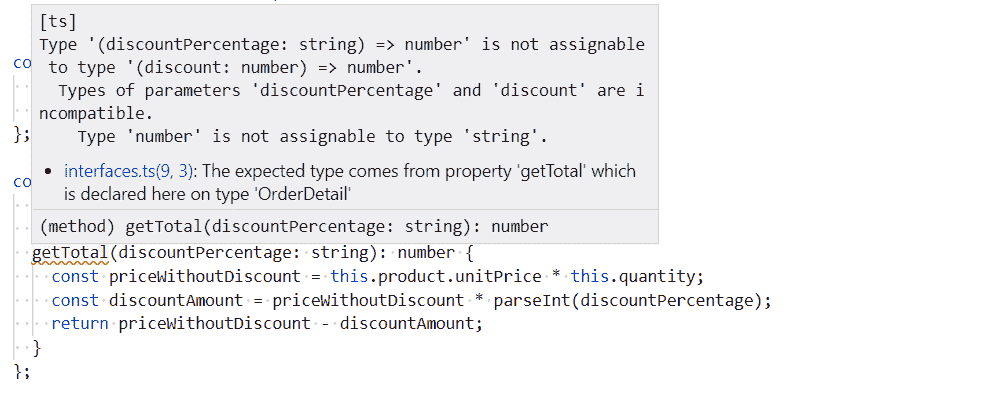

TypeScript 提供的错误非常棒，它们非常具体地说明了问题所在，允许我们快速纠正错误。

10.  因此，当从接口实现方法时，参数名称并不重要，但签名的其他部分却很重要。事实上，我们甚至不需要在接口中声明参数名称：

```jsx
interface OrderDetail {
  ...
 getTotal(number): number;
}
```

然而，省略参数名可能会使接口更难理解，我们如何确切地知道参数的用途？

# 可选属性和参数

我们可能希望使属性成为可选的，因为并不是每个实现接口的情况都需要它。让我们在`OrderDetail`界面中执行以下步骤：

1.  让我们为添加日期创建一个可选属性。我们通过在属性名称末尾但在类型注释之前放置一个`?`来指定一个可选值：

```jsx
interface OrderDetail {
  product: Product;
  quantity: number;
  dateAdded?: Date,
  getTotal(discount: number): number;
}
```

我们将看到这个接口`tableOrder`的实现没有中断。我们可以选择将`dateAdded`添加到`tableOrder`，但这不是必需的。

2.  我们可能还希望使方法参数成为可选的。我们以类似的方式在参数名后面加上一个`?`。在我们的示例中，让我们在`OrderDetail`界面中选择`discount`：

```jsx
interface OrderDetail {
  product: Product;
  quantity: number;
  dateAdded?: Date,
  getTotal(discount?: number): number;
}
```

3.  我们还可以更改方法实现签名：

```jsx
getTotal(discount?: number): number {
  const priceWithoutDiscount = this.product.unitPrice * this.quantity;
  const discountAmount = priceWithoutDiscount * (discount || 0);
  return priceWithoutDiscount - discountAmount;
}
```

我们还通过在`discountAmount`变量赋值中使用`(discount || 0)`处理了折扣未传递到方法中的情况。

`x || y` is shorthand for *if x is* truthy *then use x, otherwise, use y*. The following values are falsy values: `false`, `0`, `""`, `null`, `undefined`, and `NaN`. All other values are truthy.

4.  有了可选参数，我们可以调用`getTotal`，而无需传递折扣参数的值：

```jsx
tableOrder.getTotal()
```

前一行没有打乱 TypeScript 编译器。

# 只读属性

我们可以通过在属性名称之前使用`readonly`关键字来阻止在初始设置属性后对其进行更改。

1.  让我们通过制作`name`属性`readonly`来尝试一下我们的`Product`接口：

```jsx
interface Product {
  readonly name: string;
  unitPrice: number;
}
```

2.  我们还要确保有一个`Product`接口的实例：

```jsx
const table: Product = {
  name: "Table",
  unitPrice: 500
};
```

3.  现在我们在下一行更改`name`属性`table`：

```jsx
table.name = "Better Table";
```

正如所料，我们得到一个编译错误：

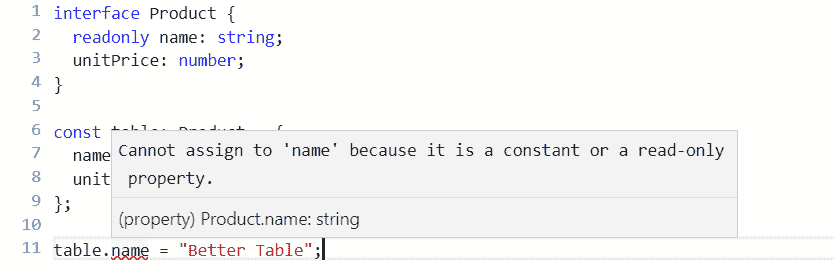

`readonly`属性是在初始设置后冻结其值的简单方法。一个常见的用例是，当您希望以功能方式编码并防止属性发生意外的突变时。

# 扩展接口

接口可以*扩展*其他接口，以便继承其父接口的所有属性和方法。我们在新接口名称之后和正在扩展的接口名称之前使用`extends`关键字来完成此操作。

让我们看一下以下示例：

1.  我们以`Product`为基础新建了一个界面，增加了折扣码信息：

```jsx
interface Product {
  name: string;
  unitPrice: number;
}

interface DiscountCode {
  code: string;
  percentage: number;
}

interface ProductWithDiscountCodes extends Product {
  discountCodes: DiscountCode[];
}
```

2.  我们可以用通常的方式创建接口的实例，从基本接口和子接口填充属性：

```jsx
const table: ProductWithDiscountCodes = {
  name: "Table",
  unitPrice: 500,
  discountCodes: [
    { code: "SUMMER10", percentage: 0.1 },
    { code: "BFRI", percentage: 0.2 }
  ]
};
```

接口允许我们创建复杂但灵活的结构化类型，供 TypeScript 程序使用。它们是一个非常重要的特性，我们可以使用它来创建一个健壮的、强类型的 TypeScript 程序。

# 类型别名

简单来说，类型别名为类型创建新名称。为了定义一个类型别名，我们使用`type`关键字，后跟别名，后跟我们想要别名的类型。

我们将通过以下示例对此进行探讨：

1.  让我们在一直使用的`OrderDetail`接口中为`getTotal`方法创建一个类型别名。让我们在 TypeScript 操场上试试这个：

```jsx
type GetTotal = (discount: number) => number;

interface OrderDetail {
  product: Product;
  quantity: number;
  getTotal: GetTotal;
}
```

实现此接口的对象不会发生任何变化——这纯粹是我们构建代码的一种方式。它可以使代码更具可读性。

2.  类型别名还可以定义对象的形状。我们可以为之前使用接口定义的`Product`和`OrderDetail`类型使用类型别名：

```jsx
type Product = {
  name: string;
  unitPrice: number;
};

type OrderDetail = {
  product: Product;
  quantity: number;
  getTotal: (discount: number) => number;
};
```

3.  我们使用这些类型的方式与使用基于接口的类型的方式完全相同：

```jsx
const table: Product = {
  name: "Table",
  unitPrice: 500
};

const orderDetail: OrderDetail = {
  product: table,
  quantity: 1,
  getTotal(discount: number): number {
    const priceWithoutDiscount = this.product.unitPrice * this.quantity;
    const discountAmount = priceWithoutDiscount * discount;
    return priceWithoutDiscount - discountAmount;
  } 
};
```

因此，类型别名似乎与接口非常相似。类型别名和接口之间有什么区别？主要区别在于类型别名不能像使用接口那样从扩展或实现。因此，对于不需要继承的简单结构，我们应该使用接口还是使用类型别名？没有强有力的理由选择这两种方法。然而，无论我们选择哪种方法来提高代码的可读性，我们都应该保持一致。

# 班级

类在许多编程语言中都具有功能，包括 JavaScript。它们让我们以类似于接口和类型别名的方式使用类型注释来塑造对象。但是，类比接口和类型别名有更多的特性，我们将在下面的部分中探讨这些特性。

# 基本类

类有很多特性。因此，在本节中，我们将了解类的基本特性。我们使用`class`关键字，后跟类名，后跟类的定义。

让我们通过以下示例更深入地了解这一点：

1.  我们可以使用一个类来定义之前定义为接口和类型别名的`Product`类型：

```jsx
class Product {
  name: string;
  unitPrice: number;
}
```

2.  我们使用`new`关键字后跟类名和括号来创建`Product`类的实例。然后，我们继续与类交互，设置属性值或调用方法：

```jsx
const table = new Product();
table.name = "Table"; 
table.unitPrice = 500;
```

注意，当我们使用这种方法时，我们不需要表变量的类型注释，因为可以推断类型。

但是类比类型别名和接口有更多的特性。这些特性之一是能够定义类中方法的实现。

让我们用一个例子来探讨这一点：

1.  让我们将前面几节中使用的`OrderDetail`类型更改为类。我们可以在这个类中定义`getTotal`方法的实现：

```jsx
class OrderDetail {
  product: Product;
  quantity: number;

  getTotal(discount: number): number {
    const priceWithoutDiscount = this.product.unitPrice * this.quantity;
    const discountAmount = priceWithoutDiscount * discount;
    return priceWithoutDiscount - discountAmount;
  }
}
```

2.  我们可以创建一个`OrderDetail`实例，指定一个`product`和`quantity`，然后用一个`discount`调用`getTotal`方法得到总价：

```jsx
const table = new Product();
table.name = "Table"; 
table.unitPrice = 500; 

const orderDetail = new OrderDetail();
orderDetail.product = table;
orderDetail.quantity = 2;

const total = orderDetail.getTotal(0.1);

console.log(total);
```

如果我们运行这个程序并查看控制台，我们应该会看到一个输出`900`。

# 实现接口

通过在接口中定义契约，然后根据接口实现类，我们可以一起使用类和接口。我们使用`implements`关键字指定一个类正在实现一个特定的接口。

例如，我们可以为订单详细信息定义一个接口，然后定义一个实现该接口的类：

```jsx
interface IOrderDetail {
  product: Product;
  quantity: number;
  getTotal(discount: number): number;
}

class OrderDetail implements IOrderDetail {
  product: Product;
  quantity: number;

  getTotal(discount: number): number {
    const priceWithoutDiscount = this.product.unitPrice *  
     this.quantity;
    const discountAmount = priceWithoutDiscount * discount;
    return priceWithoutDiscount - discountAmount;
  }
}
```

在前面的示例中，我们在接口前面加了`I`前缀，这样代码的读者可以在引用接口时快速看到。

我们为什么要使用这种方法？它似乎比我们需要编写的代码还要多。那么，有什么好处呢？这种方法允许我们有一个接口的多个实现，这在某些情况下很有用。

# 建设者

构造函数是执行类的新实例初始化的函数。为了实现构造函数，我们实现了一个名为`constructor`的函数。在构造函数中设置属性值以简化类的使用是很常见的。

让我们看一下以下示例：

1.  让我们在`OrderDetail`类中创建一个构造函数，它允许我们设置`product`和`quantity`：

```jsx
class OrderDetail implements IOrderDetail {
  product: Product;
  quantity: number;

  constructor(product: Product, quantity: number) {
 this.product = product;
 this.quantity = quantity;
 }

  getTotal(discount: number): number {
    ...
  }
}
```

2.  如果我们创建了该类的实例，我们将被迫传入`product`和`quantity`：

```jsx
const orderDetail = new OrderDetail(table, 2);
```

3.  这很好，因为我们已经将三行代码缩减为一行。但是，如果没有传入任何内容，我们可以通过设置默认的`quantity`参数`1`使我们的类更易于使用：

```jsx
constructor(product: Product, quantity: number = 1) {
  this.product = product;
  this.quantity = quantity;
}
```

4.  如果是`1`，我们现在不必通过`quantity`：

```jsx
const orderDetail = new OrderDetail(table);
```

5.  我们可以通过在构造函数中的参数之前使用`public`关键字来节省一些击键，并让 TypeScript 编译器实现`product`和`quantity`属性：

```jsx
class OrderDetail implements IOrderDetail {
  constructor(public product: Product, public quantity: number = 1) {
    this.product = product;
    this.quantity = quantity;
  }

  getTotal(discount: number): number {
    ...
  }
}
```

# 扩展类

类可以扩展其他类。这与扩展其他接口的接口的概念相同，我们在*扩展接口*一节中介绍了这一概念。这是一种与子类共享类属性和方法的方法。

与接口一样，我们使用`extends`关键字，后跟我们正在扩展的类。让我们看一个例子：

1.  让我们从`Product`类中创建一个`ProductWithDiscountCodes`：

```jsx
class Product {
  name: string;
  unitPrice: number;
}

interface DiscountCode {
  code: string;
  percentage: number;
}

class ProductWithDiscountCodes extends Product {
  discountCodes: DiscountCode[];
}
```

2.  然后，我们可以如下使用`ProductWithDiscountCodes`类，利用基类和子类的属性：

```jsx
const table = new ProductWithDiscountCodes();
table.name = "Table";
table.unitPrice = 500;
table.discountCodes = [
  { code: "SUMMER10", percentage: 0.1 },
  { code: "BFRI", percentage: 0.2 }
];
```

3.  如果父类有构造函数，则子类需要使用名为`super`的函数传递构造函数参数：

```jsx
class Product {
  constructor(public name: string, public unitPrice: number) {
  }
}

interface DiscountCode {
  code: string;
  percentage: number;
}

class ProductWithDiscountCodes extends Product {
  constructor(public name: string, public unitPrice: number) {
    super(name, unitPrice);
  }
  discountCodes: DiscountCode[];
}
```

# 抽象类

抽象类是一种特殊类型的类，只能从继承而不能实例化。它们是用`abstract`关键字声明的，如下例所示：

1.  我们可以定义一个基本`Product`类，如下所示：

```jsx
abstract class Product {
  name: string;
  unitPrice: number;
}
```

2.  如果我们试图创建此实例，编译器会抱怨，正如我们所料：

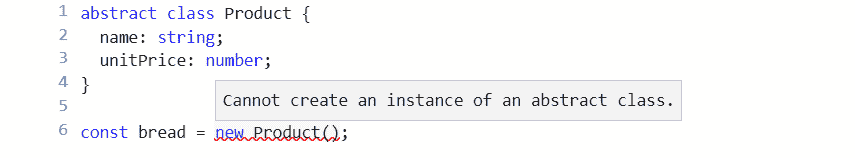

3.  我们可以通过扩展`Product`为食品创建更具体的可用类：

```jsx
class Food extends Product {
  constructor(public bestBefore: Date) {
    super();
  }
}
```

4.  在这里，我们在`Food`类中添加`bestBefore`日期。然后我们可以创建一个`Food`实例，传递`bestBefore`日期：

```jsx
const bread = new Food(new Date(2019, 6, 1));
```

抽象类可以有子类必须实现的`abstract`方法。抽象方法的声明前面带有`abstract`关键字，如下例所示：

1.  让我们在基础`Product`类中添加一个`abstract`方法：

```jsx
abstract class Product {
  name: string;
  unitPrice: number;
  abstract delete(): void;
}
```

2.  在我们添加`abstract`方法后，编译器立即抱怨我们的`Food`类没有实现`delete`方法：

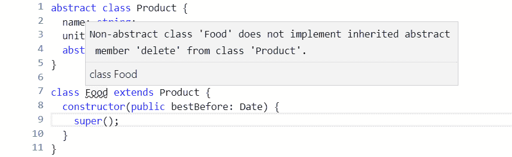

3.  那么，让我们解决这个问题并实现`delete`方法：

```jsx
class Food extends Product {
  deleted: boolean;

  constructor(public bestBefore: Date) {
    super();
  }

  delete() {
 this.deleted = false;
 }
}
```

# 访问修饰符

到目前为止，我们所有的类属性和方法都自动具有`public`访问修饰符。这意味着它们可以与类实例和子类交互。我们可以在类属性和方法的属性或方法名称之前显式设置`public`关键字：

```jsx
class OrderDetail {
  public product: Product;
  public quantity: number;

  public getTotal(discount: number): number {
    const priceWithoutDiscount = this.product.unitPrice * this.quantity;
    const discountAmount = priceWithoutDiscount * discount;
    return priceWithoutDiscount - discountAmount;
  }
}
```

正如您可能已经猜到的，还有另一个访问修饰符，称为`private`**，它允许成员只能在类内部进行交互，而不能在类实例或子类上进行交互。**

 **让我们看一个例子：

1.  让我们在`OrderDetail`类中添加一个`delete`方法，该方法设置一个私有`deleted`属性：

```jsx
class OrderDetail {
  public product: Product;
  public quantity: number;
  private deleted: boolean;

  public delete(): void {
 this.deleted = true;
 }
  ...
}
```

2.  让我们创建一个`OrderDetail`实例并尝试访问`deleted`属性：

```jsx
const orderDetail = new OrderDetail();
orderDetail.deleted = true;
```

正如所料，编译器会抱怨：


还有第三个访问修饰符`protected`，它允许成员在类内部和子类上进行交互，但不允许在类实例上进行交互。

# 属性设置器和获取器

到目前为止，我们的类都有简单的属性声明。但是，对于更复杂的场景，我们可以使用`getter`和`setter`实现属性。在实现`getters`和`setters`时，通常需要一个私有属性来保存属性值：

*   `getter`是一个函数，开头有属性名和`get`关键字，没有参数。通常，这将返回相关私有财产的价值。
*   `setter`是一个名称相同的函数，开头有`set`关键字，值只有一个参数。这将设置关联私有属性的值。
*   `private`属性通常与`getter`和`setter`名称相同，前面带有下划线。

让我们来看一个例子：

1.  让我们为`Product`类中的`unitPrice`属性创建`getters`和`setters`。`setter`确保该值不小于`0`。`getter`确保`null`或`undefined`永不返回：

```jsx
class Product {
  name: string;

  private _unitPrice: number;
  get unitPrice(): number {
    return this._unitPrice || 0;
  }
  set unitPrice(value: number) {
    if (value < 0) {
      value = 0;
    }
    this._unitPrice = value;
  }
}
```

2.  让我们使用`Product`类并尝试一下：

```jsx
const table = new Product();
table.name = "Table";
console.log(table.unitPrice); 
table.unitPrice = -10;
console.log(table.unitPrice); 
```

如果我们运行这个，我们应该在控制台中看到两个 0。

# 静止的

静态属性和方法保存在类本身中，而不是类实例中。可以在属性或方法名称之前使用`static`关键字声明它们。

让我们看一下以下示例：

1.  让我们在我们一直使用的`OrderDetail`类上将`getTotal`方法设为静态：

```jsx
class OrderDetail {
  product: Product;
  quantity: number;

  static getTotal(discount: number): number {
    const priceWithoutDiscount = this.product.unitPrice * this.quantity;
    const discountAmount = priceWithoutDiscount * discount;
    return priceWithoutDiscount - discountAmount;
  }
}
```

2.  当我们试图引用类上的属性时，会出现编译错误。这是因为`static`方法不在类实例中，因此无法访问这些属性：

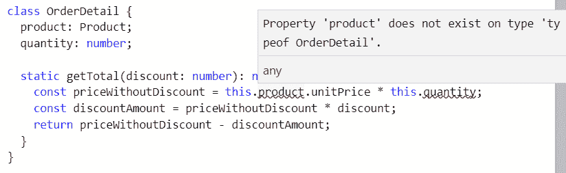

3.  为了使`static`方法工作，我们可以将其对类实例的依赖关系移动到函数中的参数：

```jsx
static getTotal(unitPrice: number, quantity: number, discount: number): number {
  const priceWithoutDiscount = unitPrice * quantity;
  const discountAmount = priceWithoutDiscount * discount;
  return priceWithoutDiscount - discountAmount;
}
```

4.  我们现在可以调用类类型本身的静态方法，传入所有参数值：

```jsx
const total = OrderDetail.getTotal(500, 2, 0.1);
console.log(total);
```

如果我们运行前面的程序，我们应该在控制台中得到一个输出`900`。

# 将代码结构化为模块

默认情况下，TypeScript 生成的 JavaScript 代码在所谓的全局范围内执行。这意味着一个文件中的代码在另一个文件中自动可用。这反过来意味着，如果名称相同，我们实现的函数可以覆盖其他文件中的函数，这可能导致我们的应用程序中断。

让我们看一下 Visual Studio 代码中的一个示例：

1.  我们创建一个名为`product.ts`的文件，为一个产品进入以下界面：

```jsx
interface Product {
  name: string;
  unitPrice: number;
}
```

2.  让我们创建另一个名为`orderDetail.ts`的文件，其内容如下：

```jsx
class OrderDetail {
  product: Product;
  quantity: number;
  getTotal(discount: number): number {
    const priceWithoutDiscount = this.product.unitPrice * this.quantity;
    const discountAmount = priceWithoutDiscount * discount;
    return priceWithoutDiscount - discountAmount;
  }
}
```

编译器没有给我们任何抱怨。特别是，`OrderDetail`类中对`Product`接口的引用是可以解析的，即使它位于不同的文件中。这是因为`Product`和`OrderDetail`都在全球范围内。

在全局范围内操作是有问题的，因为项目名称可能会在不同的文件之间发生冲突，并且随着代码库的增长，这将很难避免。模块解决了这个问题，并帮助我们编写组织良好、可重用的代码。

# 模块格式

模块以 JavaScript 作为 ES6 的一部分，这很好。然而，许多代码存在于本标准化之前的其他流行模块格式中。TypeScript 允许我们使用 ES6 模块编写代码，如果指定，可以将 ES6 模块转换为另一种模块格式。

以下是 TypeScript 可以传输到的不同模块格式的简要说明：

*   **异步模块定义**（**AMD**）：这是针对浏览器的代码中常用的，使用`define`函数定义模块。
*   **CommonJS**：此格式用于 Node.js 程序。它使用`module.exports`定义模块，`require`定义依赖项。
*   **通用模块定义**（**UMD**）：可以在浏览器应用程序和 Node.js 程序中使用。
*   **ES6**：这是本机 JavaScript 模块格式，使用`export`关键字定义模块，`import`定义依赖项。

在下面的部分（事实上，在这本书中），我们将使用 ES6 模块编写代码。

# 出口

从模块导出代码允许其他模块使用它。为了从模块导出，我们使用了`export`关键字。我们可以指定在项目定义之前直接使用`export`导出项目。导出可以应用于接口、类型别名、类、函数、常量等。

让我们开始调整上一节中的示例代码，使其在模块中而不是在全局范围内运行：

1.  首先，我们导出`Product`接口：

```jsx
export interface Product {
  name: string;
  unitPrice: number;
}
```

2.  在我们进行此更改后，编译器将抱怨对`OrderDetail`类中`Product`接口的引用：


这是因为`Product`不再在全球范围内，但`OrderDetail`仍然在全球范围内。我们将在下一节中解决这个问题，但让我们先看看导出`Product`接口的其他方法。

3.  我们可以在项目声明下面使用`export`语句。我们使用`export`关键字，后跟逗号分隔的项目名称列表，以大括号形式导出：

```jsx
interface Product {
  name: string;
  unitPrice: number;
}

export { Product }
```

4.  通过这种方法，我们还可以使用`as`关键字重命名导出的项目：

```jsx
interface Product {
  name: string;
  unitPrice: number;
}

export { Product as Stock }
```

# 进口

导入允许我们从导出的模块导入项目。我们使用一个`import`语句来实现这一点，该语句包括要导入的项目名称（用大括号括起来）和从中获取项目的文件路径（不包括`ts`扩展名）。我们只能导入在其他模块文件中导出的项目。

1.  我们通过导入`Product`接口来解决`OrderDetail`类的问题：

```jsx
import { Product } from "./product";

class OrderDetail {
  product: Product;
  quantity: number;
  getTotal(discount: number): number {
    const priceWithoutDiscount = this.product.unitPrice * this.quantity;
    const discountAmount = priceWithoutDiscount * discount;
    return priceWithoutDiscount - discountAmount;
  }
}
```

2.  我们可以在`import`语句中使用`as`关键字重命名导入的项目。然后，我们使用新名称引用代码中的项目：

```jsx
import { Product as Stock } from "./product";

class OrderDetail {
  product: Stock;
  quantity: number;
  getTotal(discount: number): number {
    const priceWithoutDiscount = this.product.unitPrice * this.quantity;
    const discountAmount = priceWithoutDiscount * discount;
    return priceWithoutDiscount - discountAmount;
  }
}
```

# 默认导出

我们可以使用`default`关键字指定默认可导出的单个项目：

```jsx
export default interface {
  name: string;
  unitPrice: number;
}
```

请注意，我们不需要命名接口。然后，我们可以使用不带大括号的`import`语句导入默认导出项，并选择一个名称：

```jsx
import Product from "./product";
```

# 配置编译

我们需要先编译 TypeScript 代码，然后才能在浏览器中执行它。我们通过在要编译的文件上运行 TypeScript 编译器`tsc`来实现这一点。TypeScript 非常流行，在许多不同的情况下使用：

*   它通常被引入到现有的大型 JavaScript 代码库中
*   默认情况下，它出现在角度项目中
*   它通常用于向 React 项目添加强类型
*   它甚至可以在 Node.js 项目中使用

所有这些情况对 TypeScript 编译器的要求都略有不同。因此，编译器为我们提供了许多不同的选项，希望能够满足我们特定情况的要求。

1.  让我们尝试一下，在一个新文件夹中打开 Visual Studio 代码并创建一个名为`orderDetail.ts`的新文件，其中包含以下内容：

```jsx
export interface Product {
  name: string;
  unitPrice: number;
}

export class OrderDetail {
  product: Product;
  quantity: number;
  getTotal(discount: number): number {
    const priceWithoutDiscount = this.product.unitPrice * this.quantity;
    const discountAmount = priceWithoutDiscount * discount;
    return priceWithoutDiscount - discountAmount;
  }
}

```

2.  我们可以在 VisualStudio 代码中打开终端，方法是转到“视图”菜单并选择“终端”。让我们在终端中输入以下命令：

```jsx
tsc orderDetail
```

3.  希望编译器不会输出任何错误，并且应该生成一个名为`orderDetail.js`的文件，其中包含以下传输的 JavaScript：

```jsx
"use strict";
exports.__esModule = true;
var OrderDetail = (function () {
    function OrderDetail() {
    }
    OrderDetail.prototype.getTotal = function (discount) {
        var priceWithoutDiscount = this.product.unitPrice * this.quantity;
        var discountAmount = priceWithoutDiscount * discount;
        return priceWithoutDiscount - discountAmount;
    };
    return OrderDetail;
}());
exports.OrderDetail = OrderDetail;
```

在接下来的部分中，我们将继续使用`orderDetail.ts`，探索如何配置编译器。

# 共同选择

如前所述，TypeScript 编译器有很多配置选项。所有配置选项可在[找到 https://www.typescriptlang.org/docs/handbook/compiler-options.html](https://www.typescriptlang.org/docs/handbook/compiler-options.html) 。以下各节详细介绍了使用的一些更常见的选项。

# --目标

这决定了将在其中生成传输代码的 ECMAScript 版本。

默认值为`ES3`，这将确保代码在各种浏览器及其不同版本中工作。但是，此编译目标将生成最多的代码，因为编译器将为`ES3`中不支持的功能生成 polyfill 代码。

`ESNext`选项是另一个极端，它编译到最新支持的建议 ES 功能。这将生成最少的代码，但只适用于实现了我们使用的功能的浏览器。

例如，让我们编译针对`ES6`浏览器的`orderDetail.ts`。在终端中输入以下内容：

```jsx
tsc orderDetail --target es6
```

我们传输的 JavaScript 将与上次编译非常不同，并且更接近我们的源 TypeScript，因为`es6`中支持类：

```jsx
export class OrderDetail {
    getTotal(discount) {
        const priceWithoutDiscount = this.product.unitPrice * this.quantity;
        const discountAmount = priceWithoutDiscount * discount;
        return priceWithoutDiscount - discountAmount;
    }
}
```

# --奥特迪尔

默认情况下，传输的 JavaScript 文件在与 TypeScript 文件相同的目录中创建。`--outDir`可用于将这些文件放在不同的目录中。

让我们尝试一下，并将传输的`orderDetail.js`输出到名为`dist`的文件夹中。让我们在终端中输入以下内容：

```jsx
tsc orderDetail --outDir dist
```

将创建一个包含生成的`orderDetail.js`文件的`dist`文件夹。

# --模块

这指定生成的 JavaScript 应使用的模块格式。如果以 ES3 或 ES5 为目标，则默认为**CommonJS**模块格式。`ES6`和`ESNext`是当今创建新项目时的常见选项。

# --允许

此选项告诉 TypeScript 编译器处理 JavaScript 文件和 TypeScript 文件。如果我们已经用 JavaScript 编写了一些代码，并且使用了尚未在所有浏览器中实现的功能，那么这将非常有用。在这种情况下，我们可以使用 TypeScript 编译器将我们的 JavaScript 转换成可以在更广泛的浏览器中使用的东西。

# --监视

此选项使 TypeScript 编译器无限期运行。每当源文件发生更改时，编译过程将自动触发以生成新版本。在我们的开发过程中，这是一个有用的选项：

1.  让我们通过在终端中输入以下内容来尝试一下：

```jsx
tsc orderDetail --watch
```

2.  编译器应该运行，完成后，给出消息`Watching for file changes`。让我们更改`OrderDetail`类中的`getTotal`方法来处理`discount`未定义的情况：

```jsx
getTotal(discount: number): number {
  const priceWithoutDiscount = this.product.unitPrice * this.quantity;
  const discountAmount = priceWithoutDiscount * (discount || 0);
  return priceWithoutDiscount - discountAmount;
}
```

3.  当我们保存`orderDetail.ts`时，编译器会说`File change detected. Starting incremental compilation...`并执行编译。

要退出监视模式，我们可以通过单击终端中的 bin 图标来终止终端。

# --无 mplicitany

这迫使我们明确指定要使用它的`any`类型。这迫使我们思考我们对`any`的使用以及我们是否真的需要它。

让我们用一个例子来探讨这一点：

1.  让我们为我们的`OrderDetail`类添加一个`doSomething`方法，该方法有一个名为`input`的参数，没有类型注释：

```jsx
export class OrderDetail {
  ...
  doSomething(input) {
    input.something();
    return input.result;
  }
}
```

2.  让我们用终端中的`--noImplicitAny`标志进行编译：

```jsx
tsc orderDetail --noImplicitAny
```

编译器输出以下错误消息，因为我们没有明确说明`input`参数的类型：

```jsx
orderDetail.ts(14,15): error TS7006: Parameter 'input' implicitly has an 'any' type.
```

3.  我们可以通过添加一个带有`any`的类型注释来解决这个问题，或者更好的是，添加一个更具体的类型注释：

```jsx
doSomething(input: {something: () => void, result: string}) {
  input.something();
  return input.result;
}
```

如果我们再次使用`--noImplicitAny`进行编译，编译器会很高兴。

# --无 mplicitreturns

这确保了如果返回类型不是`void`，我们在函数的所有分支中返回一个值。

让我们用一个例子来说明这一点：

1.  在我们的`OrderDetail`类中，假设我们的`getTotal`方法有以下实现：

```jsx
getTotal(discount: number): number {
  if (discount) {
    const priceWithoutDiscount = this.product.unitPrice * this.quantity;
    const discountAmount = priceWithoutDiscount * discount;
    return priceWithoutDiscount - discountAmount;
  } else {
    // We forgot about this branch!
  }
}
```

2.  我们忘记了实现处理没有折扣的情况的代码分支。如果我们编译没有`--noImplicitReturns`标志的代码，它编译得很好：

```jsx
tsc orderDetail
```

3.  但是，让我们看看如果我们使用`--noImplicitReturns`标志编译代码会发生什么：

```jsx
tsc orderDetail --noImplicitReturns
```

正如预期的那样，我们得到了以下错误：

```jsx
orderDetail.ts(9,31): error TS7030: Not all code paths return a value.
```

# --源地图

设置此选项后，将在透明过程中生成`*.map`文件。这将允许我们调试程序的 TypeScript 版本（而不是传输的 JavaScript）。因此，这通常在开发过程中打开。

# --模溶液

这将告诉 TypeScript 编译器如何解析模块。可设置为`classic`或`node`。如果我们使用的是 ES6 模块，则默认为`classic`，这意味着 TypeScript 编译器很难找到第三方软件包，如 Axios。因此，我们可以显式地将其设置为`node`，告诉编译器在`"node_modules"`中查找模块。

# tsconfig.json

正如我们所看到的，有许多不同的开关可以应用于编译过程，在命令行上重复指定这些开关有点笨拙。幸运的是，我们可以在名为`tsconfig.json`的文件中指定这些选项。我们在前面几节中看到的编译器选项是在一个不带`"--"`前缀的`compilerOptions`字段中定义的。

让我们来看一个例子：

1.  让我们创建一个包含以下内容的`tsconfig.json`文件：

```json
{
  "compilerOptions": {
    "target": "esnext",
    "outDir": "dist",
    "module": "es6",
    "moduleResolution": "node",
    "sourceMap": true,
    "noImplicitReturns": true,
    "noImplicitAny": true
  }
}
```

2.  让我们在不指定源文件和任何标志的情况下运行编译：

```jsx
tsc
```

编译将正常运行，传输的 JavaScript 将与源映射文件一起输出到`dist`文件夹。

# 指定要编译的文件

有几种方法可以告诉 TypeScript 编译器要处理哪些文件。最简单的方法是在`files`字段中显式列出文件：

```json
{
  "compilerOptions": {
    ...
  },
  "files": ["product.ts", "orderDetail.ts"]
}
```

然而，随着代码库的增长，这种方法很难维护。一种更易于维护的方法是为`include`和`exclude`字段中包含和排除的内容定义文件模式。

以下示例介绍这些字段的使用：

1.  让我们添加以下`include`字段，告诉编译器编译`src`文件夹及其子文件夹中的 TypeScript 文件：

```json
{
  "compilerOptions": {
    ...
  },
  "include": ["src/**/*"]
}
```

2.  目前，我们的源文件不在名为`src`的文件夹中，但让我们运行编译：

```jsx
tsc
```

3.  正如预期的那样，我们从编译器得到了`No inputs were found in the config file...`。

让我们创建一个`src`文件夹并将`orderDetail.ts`移动到此文件夹中。如果我们再次编译，它将成功地找到文件并进行编译。

因此，我们有很多选择来调整 TypeScript 编译器以适应我们的特殊情况。一些选项，例如`--noImplicitAny`，迫使我们编写好的 TypeScript 代码。通过在项目中引入 linting，我们可以将对代码的检查提升到下一个级别，我们将在下一节中介绍。

# TypeScript 脱毛

正如我们所看到的，编译器对我们的 TypeScript 代码进行了大量有用的检查，以帮助我们编写无错误的代码。我们可以更进一步，对代码进行精简，以帮助我们使代码更具可读性和可维护性。TSLint 是一种在 TypeScript 项目中非常流行的 linter，我们将在本节中探讨它。

TSLint 的主页位于[https://palantir.github.io/tslint/](https://palantir.github.io/tslint/) 。

我们将在下一节中安装 TSLint。

# 安装 TSLint

我们将在本节中安装 TSLint，以及一个 Visual Studio 代码扩展，该扩展将突出显示代码中的 linting 问题：

1.  让我们通过`npm`全局安装 TSLint，如下所示：

```shell
npm install -g tslint
```

2.  现在，我们可以打开 Visual Studio 代码，进入扩展区（*Ctrl+Shift+X*并在左上角的搜索框中键入`tslint`。该扩展名为 TSLint，由 egamma 发布：


3.  我们需要单击安装选项来安装扩展。
4.  安装后，我们需要重新加载 Visual Studio 代码以启用扩展。

现在已经安装了这个扩展，并且全局安装了 TSLint，linting 错误将在我们的代码中突出显示，我们将在下面的部分中看到。

# 配置规则

`tslint`在检查代码时使用的规则可在名为`tslint.json`的文件中配置。为了探索一些规则，我们首先需要一个 TypeScript 文件：

1.  因此，让我们创建一个名为`orderDetail.ts`的文件，在 Visual Studio 代码中包含以下内容：

```jsx
export interface Product {
  name: string;
  unitPrice: number;
}

export class OrderDetail {
  product: Product;
  quantity: number;
  getTotal(discount: number): number {
    const priceWithoutDiscount = this.product.unitPrice * this.quantity;
    const discountAmount = priceWithoutDiscount * discount;
    return priceWithoutDiscount - discountAmount;
  }
}
```

2.  现在我们创建一个`tslint.json`文件。我们在`rules`字段中定义要实现的规则。让我们添加以下规则：

```json
{
  "rules": {
    "member-access": true
  }
}
```

3.  有关规则的完整列表，请访问：[https://palantir.github.io/tslint/rules/](https://palantir.github.io/tslint/rules/) 。`member-access`规则强制我们显式声明类的访问修饰符。我们没有在`OrderDetail`类中明确定义属性和方法访问修饰符，因为它们默认为`public`。因此，有了 linting 规则，Visual Studio 代码将向我们强调缺少访问修饰符：


4.  当我们在属性和方法前面放置一个`public`访问修饰符时，警告消失了：

```jsx
export class OrderDetail {
  public product: Product;
  public quantity: number;
  public getTotal(discount: number): number {
    const priceWithoutDiscount = this.product.unitPrice * this.quantity;
    const discountAmount = priceWithoutDiscount * discount;
    return priceWithoutDiscount - discountAmount;
  }
}
```

`member-access`规则迫使我们编写更多的代码——这怎么可能是件好事？如果您正在阅读代码，但对 TypeScript 了解不够，无法理解没有访问修饰符的类成员是公共的，那么该规则非常有用。所以，如果我们的团队由对 TypeScript 还不太了解的开发人员组成，但不一定是经验丰富的 TypeScript 开发人员团队，那就太好了。

很多`tslint`规则就像`member-access`——在一些团队中，它们会很好地工作，而在其他团队中，它们并没有真正增加价值。这就是为什么规则是可配置的！

# 内在规则

`tslint`有一个方便的内置规则集集合，可以使用。我们可以通过在`extends`字段中指定规则集名称来使用它们。通过将多个规则集的所有名称放入数组中，我们可以使用多个规则集：

1.  让我们采用`tslint`附带的一套固执己见的规则，称为`"tslint:recommended"`。因此，在我们的`tslint.json`文件中，让我们删除`rules`字段并添加一个`extends`字段，如下所示：

```json
{
  "extends": ["tslint:recommended"]
}
```

当`tslint.json`被保存时，我们立即得到 lint 错误。错误在于我们的`Product`接口缺少`I`前缀。规则背后的逻辑是，在读取代码时，如果类型以`I`开头，我们立即知道它是一个接口。

2.  让我们假装这条规则对我们没有价值。我们可以在`"rules"`字段中从`"tslint:recommended"`重写此规则。该规则称为`"interface-name"`。那么，让我们将其覆盖到`false`：

```json
{
  "extends": ["tslint:recommended"],
  "rules": {
    "interface-name": false
  }
}
```

保存`tslint.json`后，起毛错误立即消失。

# 排除文件

我们可以从 linting 过程中排除文件。这对于排除第三方代码非常有用。为此，我们在`linterOptions`字段的`exclude`字段中指定一个文件数组：

```json
{
 "extends": ["tslint:recommended"],
 "linterOptions": {
 "exclude": ["node_modules/**/*.ts"]
 }
}
```

上述配置将第三方`node`包排除在脱毛过程之外。

现在我们已经将 TSLint 添加到工具带中，我们将添加另一个工具，它将自动为我们格式化代码。这将有助于我们的代码遵守一些代码格式化 TSLint 规则。

# 代码格式

在本节中，我们将在 VisualStudio 代码中安装另一个名为 Prettier 的扩展，它将自动格式化代码。除了停止所有正在进行的关于风格的辩论外，它还将帮助我们遵守 TSLint 的一些规则：

1.  让我们打开 VisualStudio 代码，转到 Extensions 区域，然后在搜索框中键入 prettier。该扩展名为 Prettier-Code formatter，由 Esben Petersen 发布：


2.  我们需要单击安装选项来安装扩展。
3.  安装后，我们需要重新加载 Visual Studio 代码以启用扩展。
4.  最后一步是确保在用户设置中勾选了“保存格式”选项。按*Ctrl*+*、*（逗号）打开设置屏幕，并在搜索框中键入 Format On Save 以查找设置。如果未勾选设置，则勾选它：


现在安装了这个扩展，当我们保存我们的 TypeScript 代码时，它将自动为我们很好地格式化。

# 总结

在本章的开头，有一节介绍了我们为什么要使用 TypeScript 构建前端。我们现在有了 TypeScript 早期捕捉错误的第一手经验，并为我们提供了诸如 IntelliSense 之类的高效功能。我们了解到 TypeScript 只是 JavaScript 的一个扩展。因此，我们可以使用 JavaScript 中的所有功能以及 TypeScript 中的其他内容。其中一个附加功能是类型注释，它可以帮助编译器发现错误，并在代码编辑器中显示代码导航等功能。

我们还没有涵盖所有关于类型的知识，但是我们现在有足够的知识来构建相当复杂的类型脚本程序。特别是类，使我们能够很好地对复杂的现实世界对象建模。我们学习了模块以及它们如何使我们远离危险的全球范围。模块允许我们很好地构造代码并使其可重用。如果我们需要支持 IE，我们甚至可以使用它们，因为它有神奇的 TypeScript 编译器。

我们了解了 TypeScript 编译器，以及它如何在不同的用例中工作，因为它是非常可配置的。这对于我们在本书后面开始使用带有 React 的 TypeScript 非常重要。

`TSLint`和`Prettier`是蛋糕上的冰。这取决于我们和我们的团队来讨论和决定我们应该遵循的 TSLint 规则。这两种工具的好处是，它们强制我们的代码库保持一致性，从而使代码更具可读性。

现在我们已经了解了 TypeScript 的基本知识，我们将深入了解 TypeScript 3 中添加的新功能。

# 问题

这里有一些问题来测试你在第一章学到的东西。答案见附录。

祝你好运

1.  5 种基本类型是什么？
2.  在下面的代码中，`flag`变量的推断类型是什么？

```jsx
 const flag = false;
```

3.  接口和类型别名之间有什么区别？
4.  以下代码有什么问题？如何解决这一问题？

```jsx
class Product {
  constructor(public name: string, public unitPrice: number) {}
}

let table = new Product();
table.name = "Table";
table.unitPrice = 700;
```

5.  如果我们希望我们的 TypeScript 程序支持 IE11，那么编译器`--target`选项应该是什么？
6.  可以让 TypeScript 编译器传输 ES6`.js`文件吗？如果是，怎么做？
7.  我们如何防止`console.log()`语句进入我们的代码？

# 进一步阅读

[http://www.typescriptlang.org](http://www.typescriptlang.org) 有大量关于 TypeScript 的文档。值得浏览本网站的以下页面以巩固您的知识，或将其用作快速参考指南：

*   **基本类型**：[https://www.typescriptlang.org/docs/handbook/basic-types.html](https://www.typescriptlang.org/docs/handbook/basic-types.html)
*   **接口**：[https://www.typescriptlang.org/docs/handbook/interfaces.html](https://www.typescriptlang.org/docs/handbook/interfaces.html)
*   **类别**：[https://www.typescriptlang.org/docs/handbook/classes.html](https://www.typescriptlang.org/docs/handbook/classes.html)
*   **模块**：[https://www.typescriptlang.org/docs/handbook/modules.html](https://www.typescriptlang.org/docs/handbook/modules.html)
*   **编译器选项**：[https://www.typescriptlang.org/docs/handbook/compiler-options.html](https://www.typescriptlang.org/docs/handbook/compiler-options.html)

`tslint`规则的完整列表可在[中找到 https://palantir.github.io/tslint/rules/](https://palantir.github.io/tslint/rules/) 。**
