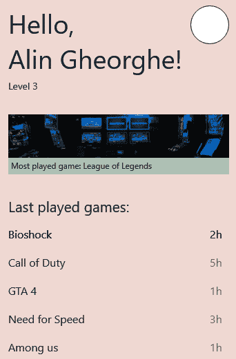

# 六、移动 UI 构建基础

现在，我们了解了 Galio 如何帮助我们构建跨平台移动应用，是时候学习一些设计规则了，以便我们能够最大限度地利用框架的潜力。

本章将简要介绍一些设计概念和指导原则，这些概念和指导原则至少可以帮助我们对设计技能更有信心。我希望这一章将给你带来信心，并推动你构建/创建一个漂亮的**用户界面**（**用户界面**。

我们将首先探讨干净设计的重要性，以及我们应该遵循的一些基本准则，以确保我们的设计尽可能干净和简约，同时向用户提供最有用的信息。在那之后，我们将慢慢地进入一个关于**用户体验**（**UX**的基本解释，以及如何找到最适合我们用户的方法。

一旦我们讨论了所有这些，我们将了解如何最小化用户输入，这样我们的用户就不会想在完成它时丢弃一个表单。我们将讨论到底是什么阻碍了用户完成表单，以及如何改进表单，从而提高完成率。

在那之后，我们将看到如何整理我们的设计思想通常是最好的方式，以确保我们的应用将看起来干净和良好。我们将了解如何做到这一点的指导原则，以及创建呼吸空间的最合适方式。我们还将回顾我的创作过程，从第一个设计草稿到我认为值得实施的最终屏幕。

在分离之后，是时候讨论一致性了。我们将了解一致性在移动应用中的重要性及其原因。我们还将介绍三种不同的 UI 设计工具的主要思想，以便您至少能够知道要研究什么，并形成自己的观点，选择哪种工具来构建自己的应用原型。

本章将介绍以下主题：

*   探索清洁设计的重要性
*   最小化用户输入
*   分离以实现更好的应用组织
*   保持应用的一致性

# 探索清洁设计的重要性

现在我们已经到了这一步，是时候学习一些关于如何为我们的应用创建美观设计的规则和指南了。现在，*美丽是主观的*，我们都知道，但有一些规则可能会在你的手机应用甚至网站中创造更好的流量。

我们并不是试图通过客观的镜头来观察美是什么，但美的某些方面与我们的大脑以及大脑是如何构建的直接相关。例如，*颜色在不同的文化中可能意味着不同的东西*，这没关系，因为我们不会选择黄色而不是黑色。

同时，我们可以采用*三分法则*，这是一种创造视觉艺术（如电影、绘画或照片）的经验法则。关于三分法则的一点是，我们发现由于某种原因，当我们将屏幕分为三分之二（水平和垂直）后，当照片位于两条线的交点时，我们的眼睛会更加关注照片的主体。你现在可以自己试试。你的手机很可能已经在你的照相应用中内置了这一功能，所以试着在拍摄对象位于中心，然后在线条相交的位置拍摄。

当然，这并不意味着我们所有的照片都必须按照三分法拍摄，但在大多数情况下，这会有所帮助。问题是还有其他因素需要考虑，比如阴影、对比度、亮度等等。

解释这一点的全部目的是让您了解，设计的某些方面可以向用户体现“美”的理念。

其中之一实际上是干净设计的重要性，以及它通常如何帮助我们以直截了当的方式传达移动应用的目的。我并不是想建立一个热爱极简主义的团体，但我确实觉得在这个时代，极简主义变得更加重要。在一个有这么多选择的世界里，用户喜欢信息直截了当，他们不必在信息的大屏幕上滚动，也不必分心就可以进入你的网站。

“设计不仅仅是它的外观和感觉。设计是它的工作方式”

——史蒂夫·乔布斯

那么，干净的设计到底意味着什么？还记得 21 世纪，甚至 2010 年代的那些网站吗，它们充斥着不必要的信息，比如随机放在屏幕右角的时钟？人们不想看到你的应用或网站挤满了…东西。实际上，他们更喜欢一种更简单的方法，让它看起来更时尚、更酷，避免让用户为了达到他们的目标而浏览多页废话，这可能只是为了找到你的公司所在地。

让我们实现一些规则，这样我们就不必处理那种噩梦般的应用。

## 要素

专注于要点可以让我们把事情做得简明扼要。我们可以通过限制视觉元素和菜单的数量来做到这一点。如果你想在你的移动应用里面有一个下拉菜单，你最好现在就停止想它，也许你可以开始考虑如何将你的应用划分为一些类别，比如底部标签导航器。

## 配色方案

老实说吧。我们都喜欢颜色！是的！它们很漂亮，无论什么时候我们和朋友出去玩，或者只是玩得开心，我们总是在强调我们应该穿什么。嗯，那是因为不是所有的颜色都能协同工作，有时如果你选择 10 种以上的颜色，人们就不知道该把目光集中在什么上。

网站和移动应用也是如此。当然，我们应该将我们的颜色使用限制为三种颜色，同时在必要时应用不同的色调，但在我们的应用中只有三种主颜色，我们可以在应用中创建某种连续性。

假设一个屏幕上有一个绿色的**提交**按钮。另一个有一个紫色的**提交**按钮。一旦用户看到这一点，他们会立即想：“这是正确的按钮吗？”一旦你为某些东西的外观创建了规则，就要坚持下去！

## 可用性和可访问性

这真的很关键。您的移动应用的设计必须能够在您的目标受众感兴趣的所有分发平台上运行。我想说的是，现在，在当今的市场上，你的产品必须至少安装在 iOS 和 Android 上。

问题是，因为这些平台的构建方式不同，具有不同的用户体验，所以您必须针对每个平台调整您的产品。你做得越好，就会有更多的人喜欢使用你的应用。

此外，我们在 2021 年，所以您应该实现对屏幕阅读器的支持，例如 iOS 的**画外音**或 Android 的**对讲**。这将让你对自己感觉更好，因为你不仅为每个人创造了一个更好的数字世界，而且，通过允许更多的用户使用你的应用，你将有更好的机会将你的想法发展成一个成功的想法。

## 简单

我怎么强调都不过分，但你需要把重点放在重要的事情上。你不需要在一个屏幕上列出你的应用可以做的每一件事。尽量简短。没有人有时间真正阅读页面上的所有信息，因此尽可能少的信息，但同时尽可能使其有意义是简单的关键。

## 信息架构

每一个与你的应用交互的用户都有一个预先构建的行为模式，当他们第一次使用你的应用时就会展示出来。研究您的竞争对手，确保在制作应用时，您的行为不会妨碍您的创作过程。例如，他们可能希望一个特定的按钮，例如启动屏幕中的**开始**按钮，始终位于屏幕底部。你的工作是确保你会使用这些对你有利的行为，如果你想为你的用户创建某种新的用户体验，花点时间教他们如何使用你的应用。

## 一致性

确保您的设计和信息在整个应用中保持一致。通过保持的一致性，你可以确保你的用户永远不会有不了解正在发生什么或如何使用你的应用的时刻。通过保持一致性，我们实际上教会了用户使用我们平台的最佳方式，而不需要额外的无聊文本。

## 用户体验

您可能已经注意到短语**用户体验**（**用户体验**），但我们还没有真正定义它。UX 指产品（网站或移动应用）满足用户需求的程度。

我们应该*区分 UX 和可用性*，因为后者是 UI 的一个质量属性，包括系统的易学性和使用效率。

在设计移动用户体验设计时，我们可以记住的一个好的经验法则是问自己以下问题：*移动应用有用吗？*

 ***如果没有，我们可以说对最终用户没有价值。*

*如果答案是肯定的，但不够直观，最终用户不会花时间学习。*

移动用户体验设计包含三个重要方面：可访问性、可发现性和效率。这将带来快速、积极和经验驱动的最终结果。

*Net Solutions《B2B 商务 2020 年状况》*报告称*65.8%的企业将在未来 12 个月内投资于改进移动用户体验设计。*

基于这些数据，我们应该认识到用户体验是一门永无止境的科学。我们永远不会有完美的用户体验，它会随着用户的变化而变化。随着时间的推移，我们可能会在使用手机时改变我们的行为，因此，您的设计师需要为您的最终用户设计一种出色的体验，以满足特定用户在特定时间的期望。

现在的自然问题应该是：*我们应该如何处理这个问题，以便始终能够为用户提供高质量的用户体验？*我想说，为了构建一个伟大的用户体验，下面几节中提到的方法将为您带来最好的结果。

#### 研究

与最终用户共度多日时光。了解他们的需求以及他们对当前工作方式的确切感受。听取他们的意见，因为他们的反馈是整个过程中最重要的部分之一。

例如，如果你看一看你的一位家庭成员在使用应用时，你会注意到他们很容易对应用的某些部分感到沮丧。观察他们并检查他们的期望。他们可能会说“为什么通过这个应用点东西这么难？”然后继续紧张地随机点击屏幕，因为事情并不是他们所期望的那样。你周围的人，尤其是那些被应用锁定的人，可以为你提供最有价值的信息。

#### 移情

在与用户讨论并了解他们的需求之后，是时候为他们的问题找到解决方案了。使用最能帮助你的方法来组织这些想法，并尝试找到解决方案，以消除用户遇到的问题。你需要注意，这样你就不会产生更多的问题，所以在找到解决方案后测试你的应用。

#### 建筑

这是不言自明的。一旦一切都经过了测试，你找到了所有问题的解决方案，就到了构建应用的时候了。问题是…通过你的研究，你应该能够意识到你的应用真正需要什么类型的技术。有时候，即使 React Native 也无法解决这个问题，所以您可能需要进行一些更改。这是成为一名优秀程序员的一部分，所以不要担心！一旦你了解了编程语言和框架，你就能学到任何东西。

既然我们已经了解了这一点，并且我们已经了解了为什么干净的设计对我们的应用以及 UX 如何工作非常重要，那么我们应该有一个非常好的想法，为什么某些应用会采取极简主义路线，并为其所有用户提供一条直接的学习路径。

现在，让我们来讨论为什么最小化用户输入很重要，这是确保我们有一个干净设计的另一部分，以及我们如何做到这一点。

# 尽量减少用户输入

许多人在填写表格时犹豫不决，特别是当表格很长，充满了个人信息时，他们不得不搜索物理文档，并且填写了看起来不相关的必要步骤。

知道了这一点，我们有义务为用户创建一个好的表单，这样他们在完成表单时就不会觉得这是件烦人的事情。任何形式的首要目标都是**完成**。为此，我们首先要知道有效形式的基本概念是什么。这些都包括在这里：

*   **复杂性感知**：每次我们看到一个表单，我们首先要做的就是对它进行视觉扫描，这样我们就可以估计到达终点需要多少时间。知道了这一点，我们几乎可以立即意识到，对复杂性的感知在完成表单中起着至关重要的作用。它看起来越复杂，用户实际完成它的可能性就越小。
*   **交互成本**：这是完成表单所付出的所有努力的总和。用户投入的精力越多，完成任务的可能性就越小。想象一下，一个表单有一个 bug，您无法添加您的生日，或者这样做不直观。你可能会失去注意力，对表单和它的使用难度感到愤怒。最终，你将永远无法真正完成它。这种类型的错误交互会让用户对应用和表单本身考虑较少。这类缺陷会让用户忘记设计有多漂亮，或者应用的其他部分有多有用。

现在我们知道了用户对表单的实际想法，让我们看看应该遵循哪些准则，以便创建一个高效的表单设计，这是所有用户都能够遵循和完成的。考虑以下几点：

*   **Remove user effort by asking the right questions**: Questions inside the form should be kept in an intuitive sequence and they should seem logically sorted from the user's point of view. When thinking about the sequence of asking questions, we always start with name, birthplace, and personal information. That's because this functions just like a conversation. Don't compromise only because your database or application logic has a different order of asking questions—the user comes first. Our job as programmers shines best when the user has no understanding of how the app actually works.

    一个很好的经验法则可能是不断地问自己为什么以及如何使用您所请求的信息。

*   **单列布局**：我们表单的两列布局最大的问题是您不知道用户将如何阅读信息。为了让这更容易，只有一列应该足够直观，让用户理解他们首先必须完成屏幕顶部的任何问题。
*   **Use as few input fields as possible**: Imagine this—you want to book a flight and it's asking you for information regarding everything that's going to happen in your journey. You just want to check the prices and see if you can afford next month's flight to the Bahamas, but you're seeing a form just as big as your entire screen. You'll look at the screen and think that maybe you don't really want to go to the Bahamas, at least not with this booking company.

    使用尽可能少的输入字段不仅意味着从表单中删除不必要的问题，还应该考虑提出这些问题的不同方式。与其有三个输入字段作为出发日期（日、月、年），不如有一个带有单个输入字段的日期选择器。使用其他类型表单元素的另一个很好的例子是，我们可以使用一个**+**和**-**按钮，而不是乘客数量的下拉列表。这将使内容更具交互性，并减少对试图快速浏览表单的用户的威胁。

*   **输入的正确宽度**：这种情况经常发生。我在网上订购一些东西，然后他们问我街道地址和街道号码。这显然意味着我应该在一个输入字段中写入街道名称，然后在另一个字段中写入街道编号。问题是街道的面积非常大。这让我感到困惑，问自己：“除了街道名称，我还应该写些什么吗？”这不应该发生；如果您知道用户应该编写邮政编码，请尝试将邮政编码输入字段设置为所需的大小。将其放大可能会让用户感到困惑，我们不想让用户感到困惑。
*   **标签在顶部**：将输入标签放在文本输入的顶部可以更容易地遵循表单。假设它们在屏幕的左侧；这将使你的眼睛呈之字形，这似乎不需要做太多的工作，但我们正在尝试尽可能采用最干净、最直观的设计，因此所有能够帮助我们的用户感觉我们的表单不会太难的东西都将对我们有利。
*   **可选字段和必填字段**：我们知道，我们应该尽量避免表单中的可选字段，因为它们会使表单比必须的长，但在某些情况下，如果我们试图为营销团队获取更多信息，则需要一些可选字段，或者我们只需要第二个地址就可以结账了。如果它们是我们实现所必需的，那么我们不妨让它们变得非常明显，它们是可选的，而不是必需的。您只需在标签旁边写上**可选**，就可以做到这一点，但要确保它是可见的，而不是隐藏的消息。
*   **Highly visible error messages**: I actually hate it (and I'm not the only one) when I get something wrong in a form but I have no idea what it is. Everything becomes a puzzle: "Is it the password?" "Is it the email?" "What did I get wrong?" Avoid this by having clear visible error messages for each input form.

    只要用眼睛扫描屏幕，信息就必须可见。为此，您可以随意使用任何东西，无论是图标、颜色还是文本。

    在完成表单后*是通知用户错误的正确时间。不要打断他们的表单完成过程，告诉他们他们出错了，因为这可能会让一些用户非常恼火。*

使用这些指南应该确保我们有一个真正好的形式。但这还不止于此。每种情况都是不同的，所以不要害怕打破规则或想法。设计应用最酷的一点是，你的想法和任何人的想法一样重要。当你试图与众不同时，最好的办法是总是问自己：“这如何改善我的用户体验？”如果你找不到答案，最好还是坚持这些主要观点，或者从设计书籍或心理学书籍中找到新的观点。

所以，到目前为止，我们已经讨论过为我们的用户提供一个干净的设计和一个好看的表单。我们应该开始思考创造我们的设计的另一个方面——分离。

# 为更好的应用组织进行清理

在向用户显示相关信息和保持 UI 尽可能干净和最小化之间，始终存在一个问题。当我们说分离时，我们指的是设计的视觉和可读性方面。

桌面网站上的杂乱无章是很可怕的，但在手机应用上更糟糕，因为屏幕尺寸要小得多。清除任何并非绝对必要的信息是至关重要的。

那么，让我们看看如何用我们的应用做到这一点。我们可以参考[*第 4 章*](04.html#_idTextAnchor070)中创建的第一个屏幕*您的第一个跨平台应用*，复制如下：

图 6.1–我们创建的第一个屏幕

正如你所看到的，我们的应用已经为我们的用户填充了一条重要的信息：最近玩过的游戏、玩得最多的游戏、他们的名字和级别。但当我第一次开始发展我对这个屏幕的想法时，我实际上是从一个充满信息的屏幕开始的。我的屏幕上看起来真的充斥着不必要的信息，但出于某种原因，我认为这可能与我们的用户有关。

让我们看看它以前是什么样子，然后试着注意我是如何将它分解成最终形式的，如下所示：

图 6.2-分离前的屏幕

我知道你的第一反应是“恶心”，这是完全可以理解的。这个屏幕看起来充满了太多的东西。除此之外，感觉上没有呼吸的空间，信息占据了所有可用的空间。

让我们一步一步来看看我从最初的想法（*图 6.2*）到最终的产品都做了些什么，以便我们编码（*图 6.1*。我们将努力了解我的创作过程中到底发生了什么，以及我们是如何将屏幕分割开来的。以下是它的演变过程：

1.  **Whitespace**

    屏幕边缘和主要内容区域之间的空间在排版中称为*边距*。即使你写 Word 文档，也总是有一个空白；我们不是从纸的一边到另一边写东西。知道了这一点，尽管我有 8**像素**（px）的边距，但感觉还是不对。我觉得需要更多的空间，所以我将边距增加到 32px。

    这限制了我们的内容，使我们的工作空间减少，但一切看起来都有了更多的喘息空间。这是公平的交换；信息少并不总是坏事，尤其是在评估了屏幕内容之后。

2.  **Removing unnecessary information**

    一旦我们在这个特定的屏幕上确定了哪些信息不是用户绝对需要的，就应该删除它们了。起初，我认为一个漂亮的小图表会很酷，但看到它占用了多少空间让我意识到，对于我假设的应用来说，最好将该图表视为用户可以通过点击他们感兴趣的游戏看到的东西。

    同样的道理也适用于他们最后一次玩这些游戏的日子。第一眼就不需要这些，因为一旦他们真正对该游戏的统计数据感兴趣，他们就可以在另一个屏幕上看到它们。所有这些信息都可以在另一个屏幕上轻松实现，那么我们为什么要将其放在第一个屏幕上呢？

3.  **Alignment**

    现在我们已经删除了一些元素，并选择了从屏幕边缘到内容区域的 32px 边距，是时候创建一些对齐规则了。首先，我对自己说，我们应该让所有东西都对准屏幕的左侧。如果我们打破这一规则，突然在屏幕中央出现一个标题文本，我们的用户可能会认为有什么不对劲。

    现在我们已经选择了文本对齐的位置，是时候在整个应用中保持这一点了。

4.  **Consistency**

    例如，在*图 6.1*中，我们的三个主要类别（标题、最常玩的游戏和最后玩的游戏）之间有相等的空间，而**最后玩的游戏**标题下显示的游戏之间有相等的空间。因此，我们选择了两种不同的尺寸，赋予它们意义，然后在需要时使用它们。想象一下，有一个游戏的标题只有 2 倍的底部；也许你不会马上注意到，但你会觉得好像有什么事情发生了。

    同样的道理也可以用在颜色上。我们选择了三种主要颜色，赋予它们意义，然后与它们保持一致。这将适用于其他屏幕以及相同的边距、颜色和对齐方式。这就是我们如何确保我们的屏幕不会让人觉得奇怪。

在我完成一个创作过程后，我会看一看前后的版本，试着自己判断一个版本是否比另一个更好。另一个好的评判者可能是你的亲戚或朋友，所以不要害怕与其他人分享你的工作，看看他们的想法。

我最初的设计总是与我实际实现的不同，这是因为在我看来，你对某件事情的最初想法总是受到你周围特定时刻发生的事情的影响。最好退一步，让所有的信息围绕着你。之后，你可以更准确地判断你的工作。

一旦我们确定了设计，就应该能够维护整个应用的规则。这叫做始终如一，这是我收到的最好的建议之一。

# 保持应用的一致性

一致性是一种非常有用的东西，无论我们谈论的是设计还是我们的个人生活。我明白了坚持是健康、成功生活的关键。始终如一是让我从 A 点走到 B 点的原因，我相信这一点适用于生活的方方面面。一致性是关于体验的。

从主屏幕到移动应用的最后一个屏幕的缓慢进展是我们的用户需要享受的体验。只有避免混淆并减少用户的学习量，才能享受这种体验。

让我们看看如何在设计中实现一致性，以及处理一致性问题的适当方法。

## 设备 UI 指南和行为

iOS 和 Android 有不同的 UI 和不同的可用性准则。熟悉他们对你有好处。通过识别平台之间的差异，我们可以确保我们的应用在每个特定平台上正常运行。尽管设计必须相似，但用户实际使用这些平台的方式存在差异，因此，您希望确保您的应用不会让用户了解不同的使用模式。

## 意义

我们不想改变应用的某些方面。想象一下，在结账过程中有一个蓝色的**提交**按钮，然后在登记表中有一个红色的**提交**按钮。这会造成混乱。

一旦我们赋予颜色和按钮以意义，无论用户使用什么屏幕或平台，保持相同的意义都很重要。如果你来自网络开发行业，你可能会了解 Bootstrap。**Bootstrap**是 Twitter 创建的一个用户界面库，包含颜色、**层叠样式表**（**CSS**类）和 web 设计指南。例如，他们已经确定了一种蓝色作为信息的颜色。这就是它们保持一致性的方式。

另一个很好的例子是，在我们在[*第 4 章*](04.html#_idTextAnchor070)*中开发的屏幕上，您的第一个跨平台应用*中，我在屏幕边缘和主要内容之间选择了 32px 的边距。如果我们要开发另一个屏幕，我们必须保持相同的约束条件。

## 语言

我很确定我们都知道收件箱、提交、垃圾邮件和删除这些词的含义。这些词被所有应用用户普遍接受和知晓。仅仅为了它而改变单词需要用户发展另一层的理解和学习这些新词。为了保持一致，我们将确保所有这些词在我们的应用中具有相同的含义。

当然，单词列表远不止这些，但一个好的经验法则是问自己以下问题：“我有没有在其他应用中看到这个单词或图标在不同的上下文中使用？”如果答案是“是”，你可能需要重新思考你设计应用的方式，或者至少是它的语言方面。

在讨论了所有这些一致性和简洁设计的指导原则之后，我认为我们应该探索不同的软件产品，它们可能会帮助您设计完美的移动应用。众所周知，Adobe Photoshop 在设计的各个方面都得到了广泛的应用，无论是网络、手机还是独立游戏的像素艺术。但我们不会讨论为什么 Photoshop 如此之大，因为我们可以使用其他更简单易学、更便宜的产品。

### 肥姑妈

Figma 是一个与几乎所有浏览器兼容的工具。这使得它成为一个独特的设计工具，因为它是基于浏览器的。您无需担心安装其最新版本，也无需处理兼容性问题或版本问题。它也是一个协作工具，因此您可以加入设计项目的团队。

价格是免费的，但为了更好的功能，每月都要付费。这是一个非常好的工具，很多人都喜欢使用它。

### Adobe XD

**Adobe 体验设计****XD**是 Sketch 的直接竞争对手。因为 Sketch 只在 macOS 上工作，所以 XD 是 Windows 用户的替代品。当然，它在 macOS 上也能像在 Windows 上一样工作。对于初学者来说，它真的很快也很容易使用。它具有 Sketch 的所有功能，如线框、原型等。

这是一个免费的工具，但它也适用于公司使用的基于订阅的模型。

### 素描

Sketch 对于设计师来说是一个非常轻量级的 UI/UX 设计工具。它被视为一种用于原型制作的行业标准工具，一旦您正在寻找有关设计的更深入的教程，您将看到草图比您想要的更多。它与 Photoshop 非常相似，但它的重点是平面设计。

Sketch 目前售价为**美元**（**美元**）99，免费试用 30 天。我强烈建议尝试这个工具，因为它是整个行业使用的标准工具。

我不得不说我个人最喜欢的是素描，但在不得不在 Windows 上进行设计之后，我开始使用 AdobeXD。现在，我什么都用 XD。我甚至在本书中的屏幕和示例图像中使用了它。我喜欢你在上面制作原型的方式，我完全建议你在选择你最喜欢的工具之前先尝试一下所有的方法。

# 总结

本章充满了关于如何为我们的移动应用保持良好干净设计的信息。我希望到最后，你至少理解了其中的一些，因为毕竟，我们不是设计师，我们是程序员。不过，我确实认为，至少对其他人使用的工具和一些基本规则和指导方针有一点了解，这将大大有助于你成为一名更好、更有准备的程序员。

我们已经了解了如何最大限度地减少用户输入，并为出色的用户体验创建具有更高完成率的优秀表单。我们还学习了一些关于如何以更合理的方式创建这些表单的规则，这样我们就不会混淆用户。

在那之后，我们学习了如何整理我们的设计，使它们看起来有更多的喘息空间，我们看到了我的创作过程，从屏幕设计的初稿到最终结果。

在了解了一致性以及一致性到底是什么之后，我们探讨了每个设计工具的主要思想，以便您能够选择最适合您的工具。

我希望你对下一章感到兴奋，因为我们正在接近理解和创建真正酷的小应用。我们将开始了解应用的状态，以及如何使用它在整个应用中动态更改信息。**