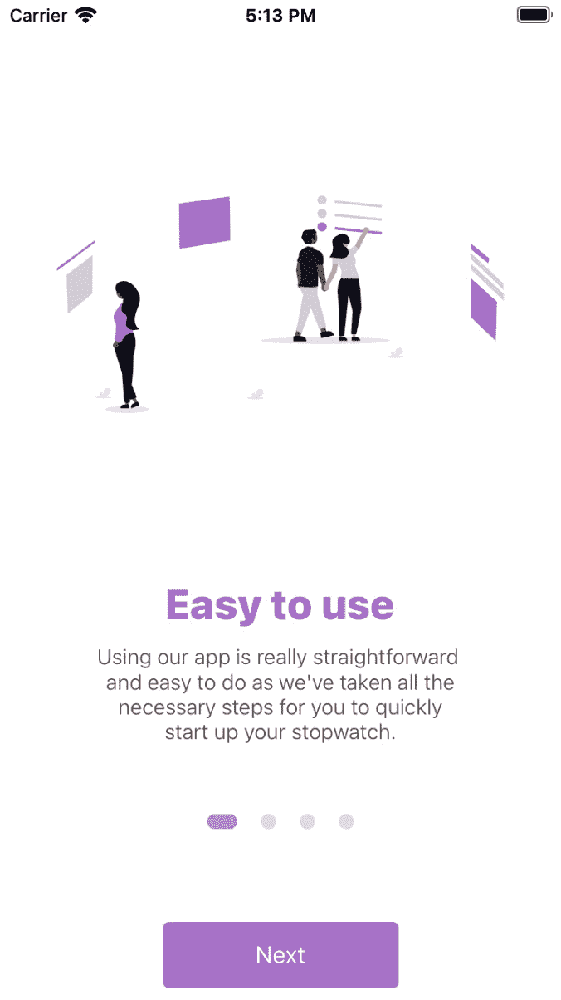
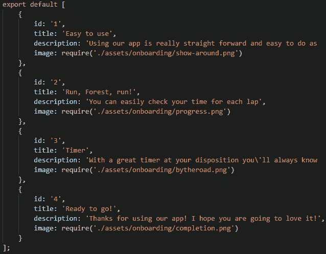
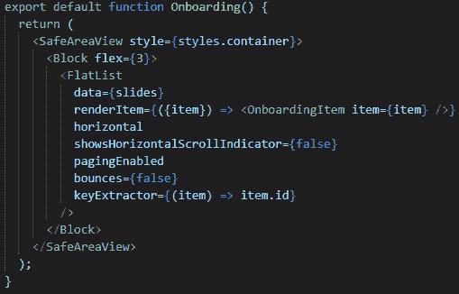
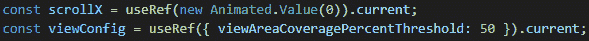
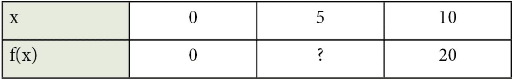
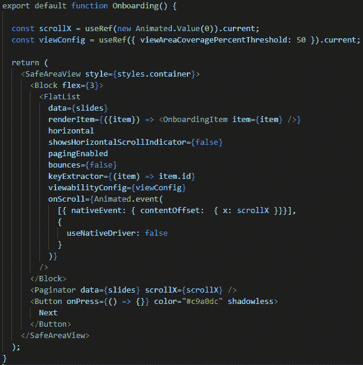

# 十、搭建启动屏幕

我们已经经历了这么多，我们可以说，现在终于是开始构建不仅仅是组件的时候了。我们将从创建任何应用的一个非常重要的部分开始，这就是启动屏幕。

我们将讨论什么是启动屏幕以及它在应用中的用途。我们将了解有许多类型的启动屏幕，但我们将重点创建其中一种类型。

通过学习如何创建这种类型的屏幕，我们将学习到许多到目前为止我们还没有接触过的很酷的新概念。这些新概念将有助于您在未来构建大量不同类型的屏幕。通过学习许多新事物，我们可以超越我们的创造性限制，为未来的挑战做好更多准备。

我们将学习动画以及如何为我们的屏幕创建一个很酷的动画。这将为我们的客户创造更流畅的用户体验打开大门。我们将了解插值和外推的含义，以及如何使用它们构建动画。

我们还将更深入地介绍挂钩以及如何使用`useRef`。是的，我们还将学习一种新的惊喜挂钩，它将帮助我们更快地找到屏幕的大小。

最后但并非最不重要的一点是，我们将学习如何使用一个比我们迄今为止使用的任何工具都更出色的酷组件。这个很酷的组件被称为`FlatList`，它将帮助我们为我们和我们的用户创造一个很酷的入职体验。

在本章结束时，我们将有一个很棒的启动屏幕，我们将使用它作为下一章应用项目的主开场屏幕。

本章将涵盖以下主题：

*   什么是启动屏幕？我们可以在哪里使用？
*   创建新项目
*   分页器
*   添加自动滚动功能

# 技术要求

您可以通过访问 GitHub[查看本章的代码 https://github.com/PacktPublishing/Lightning-Fast-Mobile-App-Development-with-Galio](https://github.com/PacktPublishing/Lightning-Fast-Mobile-App-Development-with-Galio) 。您将发现一个名为`Chapter 10`的文件夹，其中包含我们在本章中编写的所有代码。要使用该项目，请按照`README.md`文件中的说明进行操作。

# 什么是登机屏幕？我们可以在哪里使用？

我们应该从理解启动屏幕的确切含义开始本章。启动屏幕就像是在应用使用前对其进行的简短介绍。这是第一个欢迎用户的屏幕。

你的应用的上线应该有一个特定的目标来欢迎用户。你必须确保你的入职培训将帮助用户了解他们应该如何使用该应用，同时让他们对能够使用的功能感到兴奋。

如果你已经确定了启动屏幕对你的用户来说将是一个很好的体验，那么在他们使用应用的最初几天里，你可以期待他们更多的参与。高参与度意味着用户快乐，这意味着你的应用正在创造一个非常好的用户体验。

启动屏幕应仅对首次用户显示。我们都知道在游戏中重做教程是多么烦人。即使只需要 30 秒到 1 分钟就可以完成，但这仍然会让返回的用户对体验感到恼火。

我建议通过谷歌的材料网站阅读更多关于登船的信息，他们在那里为 Android 手机推荐不同的设计理念和指导方针：[https://material.io/design/communication/onboarding.html](https://material.io/design/communication/onboarding.html) 。当然，大多数相同的规则也适用于 iOS。

现在我们已经弄清楚了什么是登机屏幕，以及在哪里和什么时候使用登机屏幕，现在是时候让我们弄清楚我们的应用的登机屏幕到底是什么样子了。此外，这是一个很好的时间，让我们谈谈这将是什么类型的应用。

下一章将只关注我们应用的逻辑部分，而本章将重点关注创建我们应用所需的入职培训。有问题的应用将是秒表/计时器应用。知道了这一点，我决定让用户体验一下应用的实用性。

让我们来看看我们的应用屏幕上的屏幕将是什么样子：



图 10.1–我们将要创建的启动屏幕

这看起来很酷，对吧？它将由四个不同的屏幕组成，每个屏幕都有不同的图像、标题和描述。我们将能够向左/向右滑动以前进并读取所有屏幕，同时按下**下一个**按钮，该按钮将为我们滑动。文本后面的小四点将被动画化，以显示我们在哪个屏幕上。

我真的很喜欢它的外观，我迫不及待地想完成这个屏幕，这样我们就可以开始创建完整的应用了。本章结束时，您将准备好开始创建启动屏幕。

现在，让我们开始在屏幕上工作。

# 创建新项目

现在，我们知道了我们的项目将是什么样子，以及为什么我们需要这个屏幕，是时候开始工作了。

在编码之前，让我们收集我们将用于此项目的图像。我使用了来自[的图像 https://undraw.co](https://undraw.co) ，提供开源`.svg`和`.png`图像。我下载了四张不同的`.png`图片，并将它们放在`img/onboarding`文件夹中。`onboarding`文件夹是我在`assets`文件夹中专门为此屏幕创建的新文件夹。

让我们首先打开 terminal 窗口并移动到通常用于项目的目录。现在，让我们编写通常的命令并直接开始：

```jsx
expo init chapter10
```

现在我们有了一个新项目，让我们安装 Galio。我们可以使用以下终端命令执行此操作：

```jsx
npm i galio-framework
```

现在我们已经设置好了一切，让我们打开项目并开始编码。

首先，我们将开始做我们一直做的老把戏，那就是进入我们的`App.js`文件并删除`App()`函数中`View`内的所有内容。我省略了`<StatusBar />`组件只是为了它，因为您可能希望设置样式或隐藏它。

现在，在我们的主文件夹中，让我们创建一个名为`components`的文件夹。这就是我们将要为这个漂亮的应用创建的每个组件的位置。到本章结束时，此文件夹中将有三个文件。

现在已经创建了我们的文件夹，在其中创建一个名为`Onboarding.js`的新文件。这将作为我们的主屏幕。现在，让我们快速创建并导出此组件，以便将其导入到主`App.js`文件中。

我们已经做了很多次了，但这次我们将使用`SafeAreaView`而不是`Block`或`View`组件作为屏幕的父组件。我们之所以使用这个手机，是因为我们希望确保一切都得到妥善处理，以防我们应用的用户拥有一部带有缺口的手机：


图 10.2–准备导入的入职组件

现在我们已经完成了这个函数的编码，让我们继续将它导入到`App.js`中。一旦导入，我们就可以在主函数中使用它。现在，主函数应该如下所示：


图 10.3–导入 Onboard 的主要应用功能

现在，我们准备继续开发我们的应用。因为我们已经在`App`函数中导入了`Onboarding`组件，所以每次保存文件时，我们都可以看到要修改和添加的组件。

让我们回到`Onboarding.js`并思考我们应该如何开始在启动屏幕上工作。

通过查看*图 10.1*，我们知道该屏幕有三个主要的可识别部分。还记得我们讨论过，在开始编码之前，我们需要始终以更大的容器来查看屏幕，以了解如何创建布局吗？嗯，这是同一件事，所以让我们将屏幕分为以下三个主要部分：

*   **上车项目**：此区域为屏幕的上部，在四个点之前。它将包括一张图片、一个标题和一个描述。这个区域需要设置为一个大区域，因为它会随着每次滑动而改变。
*   **分页**：四个小点显示在这个大滑块中我们所处的位置。这样，我们总是知道还有多少东西要读，直到最后一张幻灯片。
*   **下一步按钮**：该按钮将移动幻灯片，而无需滑动，同时也是从登机屏幕移动到主屏幕所需的最后一个按钮。

知道有三个部分应该使事情更容易写生。首先，我们应该从主要区域开始，这也是最大的区域。让我们转到`components`文件夹，创建一个名为`OnboardingItem.js`的新文件。

## 装船项目

正如我们前面提到的，这个组件应该呈现屏幕的顶部，其中包含图片、一些文本和描述。我们就这么做吧。继续从`'galio-framework'`和`Image`导入`Block`和`Text`组件，从`'react-native'`导入`StyleSheet`组件。

一旦我们导入了所需的一切，就可以开始构建组件了。首先，我们将有一个主`<Block />`组件，它将托管在我们的`<Image />`中，还有一个`<Block />`组件。第二个`<Block />`组件将有两个`<Text />`组件作为子组件—一个用于标题，一个用于说明。第二个`<Block />`组件将用于将屏幕分割为主区域，这将占用更多空间，因为它将是一个图像；第二个区域应该更小，因为它只包含文本：


图 10.4–车载项目组件

正如你所看到的，这里有一个小小的惊喜。首先，我引进了`useWindowDimensions`。这是一个返回屏幕宽度或高度的`hook`函数。这是确保组件宽度等于屏幕宽度的简单方法。

我还导入了一个名为`item`的道具。因为这是一个启动屏幕，我们将至少有四个屏幕具有不同类型的文本或图像。我们将通过名为`item`的道具传递一个对象以及所有必要的信息。通过这种方式，我们可以确保所有东西都能准确地到达我们想要的位置，并且我们不必一直浪费时间为组件的每个部分编写道具。

所有的样式都已经应用了，但是我们还没有对它们进行太多的讨论。那么，让我们看一下这些样式：


图 10.5–我们的 OnboardingItem 组件的样式

正如我们所看到的，容器有一个属性`flex: 1`，它告诉我们的主要`<Block />`组件尽可能多地占用空间。我们给了我们的`image`一个`flex: 0.7`房产，因为我们希望它占据 70%的空间，而`title`和`description`只需要占据 30%的空间。其他样式只是我们设置`fontSize`和`fontWeight`的常用文本样式。

每日要闻

我再怎么强调看图片理解代码的重要性也不为过。我认为你应该先看看这张图片，试着在你的大脑中建立所有的联系，然后看看你是否得到了*幸运*。不过，我不认为这是运气；我认为这更像是一个有根据的猜测。

现在我们的`OnboardingItem`组件已经创建，我们准备将其导入到我们的`Onboarding.js`文件中，这是我们的主屏幕所在的文件。我们都知道如何导入组件，但为了确保这一点，我们必须为此编写一行代码，如下所示：

```jsx
import OnboardingItem from './OnboardingItem';
```

现在我们已经完成了，我们可以开始使用`FlatList`在屏幕上呈现所有项目。

## 平面列表

正如我们前面提到的，我们不想重复我们自己，所以我们不会在我们的主 Onboard 组件中编写相同的代码四次。你想到的第一件事就是使用`.map()`功能。这是一个很好的猜测，但是 React Native 有一个组件，由于其更好的性能，通常被使用。它还内置了一些道具，在这种情况下可以救命。该组件称为`FlatList`。

要使用这个组件，我们需要用一组元素来证明它，这些元素必须映射到我们一直在创建的组件。前面，我提到我们的`OnboardingItem`组件将接受一个名为`item`的道具。此道具将成为此阵列中的一个对象。

如果我们看*图 10.4*，我们可以从我们在组件中使用对象的方式来确定对象的外观。我们知道它需要一个`title`、`description`和`image`，但它也需要一个`id`。

让我们在根（主）文件夹中创建一个名为`slides.js`的新文件。这是包含提供我们入职需求信息的所有对象的阵列所在位置，如以下屏幕截图所示：



图 10.6–包含 FlatList 组件所需所有信息的阵列

别忘了，你可以得到你想要的任何类型的信息。标题、描述或图像不必与我的相同。记得当我们开始创建应用时，我告诉过你下载一些图片并将它们放在`./img/onboarding`文件夹中。这些是我选择的图像，我使用`require`关键字导入它们。

`require`关键字的用法与`import`相同，因为它告诉 JavaScript 引擎它需要将文件定位在指定的目标位置。

现在我们已经准备好了带有`FlatList`数据的数组，现在是时候返回到我们的`Onboarding.js`文件并像这样导入这个新文件了：

```jsx
import slides from '../slides';
```

现在，让我们确保我们准备好了其余的导入，以便在需要时使用，因为我们需要更多的组件。首先，我们将删除`Text`导入，我们将从`'galio-framework'`导入`Block`和`Button`组件。其次，我们将`FlatList`添加到进口部件清单中：


图 10.7–添加到 Onboarding.js 文件的新导入

现在所有的东西都导入了，我们准备开始开发屏幕。我们将从`<SafeAreaView />`组件中删除我们的`<Text />`组件，并将`<Block />`组件与`flex={3}`道具一起使用。

在这个`<Block />`组件中，我们的`<FlatList />`组件将开始它自己的生命。让我们看一下我是如何解释这个组件的工作原理的：



图 10.8–在我们的启动屏幕中实现的平面列表

正如您所看到的，实现这一点似乎非常简单。顺便说一句，如果你现在就把这段代码复制到你的编辑器中（假设你也一直在关注其他东西），并尝试在模拟器上查看你的应用，你会看到一个完全工作的加载屏幕。是的，它看起来不像我们在本章开头展示的那样好，但它起作用了——我们可以左右滑动，检查我们在`slides.js`文件中写入的所有信息。

现在，让我们看看这个组件是如何工作的：

1.  首先，我们从`data`道具开始。这就是我们为`FlatList`组件提供开始渲染每个元素所需的数组的地方。
2.  Then, we have the `renderItem` prop, which is where we use a function to render the item we need. In this case, we need multiple instances of `<OnboardingItem />`.

    还记得我说过我们要通过这个叫做`item`的组件吗？这是因为我们只需要从数组中传递一个对象。我们的`FlatList`组件将把每个对象传递给不同的`<OnboardingItem />`组件。一旦我们做到了这一点，我们就可以捕获该对象并以任何我们认为合适的方式使用它。

3.  The `keyExtractor` prop is used to extract a unique key for a specific item at the respective index.

    这些键用于缓存，以便 React 可以单独跟踪每个项目，并且仅重新播放必须重新播放的项目。你还记得我们在使用`.map()`功能渲染项目时是如何使用`key`道具的吗？这是相同的，但所有的工作都是由这个道具完成的。这就是为什么我们需要在`slides`数组的对象中使用`id`键的原因。

4.  其余道具主要用于布局目的。我强烈鼓励你通过打开和关闭这些道具来玩弄它们。例如，`horizontal`道具使我们的列表水平。

现在，我们已经成功地构建了元素列表，这是创建一个优秀的登录体验的第一步，让我们开始构建 paginator。

# 分页器

分页器通过这四个小点显示在屏幕上。它的主要目的是向用户展示他们当前正在观看的幻灯片，同时也展示一种进步感。这个小组件并不难实现，但是我们将要使用的确保它正常工作的特性对我们来说是新的。

对于这个组件，我们要处理的最重要的对象之一是`Animated`对象。这是必要的，因为我们正在为点的宽度和不透明度设置动画。这也很重要，因为我们希望确保动画在正确的时刻发生。当然，当用户与`FlatList`交互时，正确的时机是。如果您的手指从右向左移动，我们希望动画也以与手指相同的速度移动。

我们还将使用一个名为`useRef`的很酷的新钩子。当我们需要一个可变的对象，并且该对象在组件的整个生命周期内都保持不变时，可以使用这个钩子。`useRef`不会导致组件在其值更改时重新渲染，因为它不是状态变量，但这确实是一种很好的方法，可以确保您在每次渲染时获得相同的`ref`对象。

所以，让我们开始讨论这个很酷的小组件，我相信您会发现它对未来的应用很有帮助并且可以重用。我们将从`Onboarding.js`开始。我们先从`'react'`导入`useState`和`useRef`。我们还将从`'react-native'`进口`Animated`。导入所有这些内容后，我们准备继续：


图 10.9–我们的入职组件的新进口

现在，让我们开始实现`Paginator`组件所需的一切。首先，我们将创建两个新的 ref 对象，它们将在`FlatList`组件中实现：



图 10.10–我们新创建的参考文献

让我们解释一下它是如何工作的。首先，我们从`scrollX`开始。这个变量有很多变化，所以让我们从头开始。我们正在使用`useRef`钩子创建一个新的 ref 对象，并使用`Animated.Value(0)`初始化这个新变量。

`Animated.Value`创建一个可以设置动画的值。如果我们用一个数字来初始化这个变量，比如`0`，React Native 就不知道如何处理动画。

`useRef`钩子返回一个如下所示的对象：

```jsx
{ current: … }
```

要访问存储在`current`中的值，必须写入`scrollX.current`。一种解决方法是让 JavaScript 知道我们想通过将`.current`链接到`useRef`钩子来访问该值。

`viewConfig`变量的工作原理与您预期的一样。在这里，我们必须创建一个新的 ref 对象，并使用*图 10.10*、`{ viewAreaCoveragePercentThreshold: 50 }`中所示的对象对其进行初始化。现在，让我们将这两个新变量用于我们的`FlatList`组件：


图 10.11–在 FlatList 中实现我们的新变量

事情现在看起来可能有点复杂，但比看起来容易多了。有了这些，我们在`<FlatList />`组件中添加了两个新道具，分别为`onScroll`和`viewabilityConfig`。

`viewabilityConfig`道具是用来支持我们的`pagingEnabled`道具的，它告诉我们的组件列表根据用户刷卡的距离移动到下一张或上一张幻灯片。通过将`viewAreaCoveragePercentThreshold`值`viewabilityConfig`设置为 50，我们告诉我们的组件，如果用户已经刷卡超过或等于当前幻灯片的 50%，则只能转到下一张幻灯片。

`onScroll`道具在用户每次滚动启动屏幕的幻灯片时都会启动一个功能。你可能想知道`Animated.event`是什么意思？它将动画值映射到事件值。我同意，这个函数看起来很混乱，但如果我们学会如何阅读它，就很容易理解。所以，我们将我们的`scrollX`值映射到`nativeEvent.contentOffset.x`事件值。此事件值通常传递给`onScroll`回调，因此请记住，您可能会比您想象的更频繁地看到或使用此事件值。

`Animated.event`函数接受两个参数。第一个参数是要映射到**动画**值的值数组。此`event()`函数通过调用映射输出上的`setValue()`函数来实现这一点；在本例中，在`scrollX`上。第二个参数是一个`configuration`对象，我们用它告诉 React Native 我们不想在动画中使用本机驱动程序。

您可能会认为，通过使用本机驱动程序，我们可能会有更好的性能，这是正确的。我们不想在这个特定的用例中使用本机驱动程序的原因是因为我们要设置点的宽度动画，而现在，React native 通常不能使用本机驱动程序设置宽度或布局属性的动画。

既然我们知道了为什么我们需要`scrollX`和`viewConfig`，我们应该开始构建我们的新组件。在名为`Paginator.js`的`components/`文件夹中创建一个新文件。现在我们已经创建了一个新文件，我们应该开始构建我们的功能组件。

我们将从`'react-native'`开始导入所有必要的内容；即，`StyleSheet`、`View`、`Animated`和`useWindowDimensions`。下一步是构建 g 我们的功能：


图 10.12–分页器组件几乎完成

这里有一大堆新的东西，所以让我们开始从上到下解释一切。

这个组件，我们称之为`Paginator`，接受两个称为`data`和`scrollX`的道具。`data`是我们传递给`FlatList`的对象数组，`scrollX`是我们在`Onboarding.js`文件（我们的父组件）中定义的`Animated`值。

我们已经讨论过，`useWindowDimensions()`钩子返回屏幕的`width`和`height`属性，因此应该很容易理解。

我们为我们的`<View />`组件提供了`flexDirection: 'row'`和`64px`的`height`样式，其中包含了我们组件的*灵魂*。我们这样做是为了确保我们将要创建的点能够很好地排成一行。

之后，我们使用`.map()`函数对数组进行映射。如您所见，`map()`函数接受一个包含两个参数的回调函数。第一个元素`_`将是我们的元素，而第二个元素`i`将为我们提供该元素的索引。

因此，对于数组中的每个元素，我们创建一个点。我们怎么做？让我们直接跳到我们的`return`声明来找出答案。在这里，我们返回一个应用了`styles.dot`的`<View />`组件。我们之所以称之为`<Animated.View />`是因为我们想给这个组件设置动画。但在我们开始制作动画之前，这可能只是一个正常的`<View />`组件：


图 10.13–我们的圆点样式

这些是我们用来制作圆点的样式。正如你所看到的，没有`width`，这是因为我们想要设置圆点宽度的动画。然而，如果我们从来没有给它设置动画，我们可以直接给它一个`width`的`10px`。

那么，让我们回到如何设置圆点宽度的动画。如您所见，我们有一个名为`inputRange`的变量，它是一个基于屏幕宽度和点索引的值数组。正如我们所知，幻灯片占据了整个屏幕的宽度。知道了这一点，我们可以理解，当`contentOffset.x`等于屏幕宽度时，幻灯片发生了变化。它被称为`contentOffset`，因为它给出了两个元素之间的偏移量。当第一张幻灯片出现在屏幕上时，它从`0`开始。一旦该幻灯片移出屏幕，下一张幻灯片进入，上一张幻灯片和下一张幻灯片之间的差值等于屏幕的宽度。了解`contentOffset`的工作原理使我们能够想出一种开始制作动画的方法。

*动画究竟是由什么构成的？*我觉得这是一个很好的地方，我们可以在这里定义动画的具体工作方式。让我们想象一下，屏幕上有一个框，每当有人按下按钮时，我们都希望该框出现。当然，它可能会突然出现在屏幕上，但这看起来不太好。这就是动画的用武之地。与突然出现在屏幕上不同，如果我们有一个更平滑的过渡呢？如果盒子在一段时间内转变为存在会怎样？那看起来更像是一部动画，对吧？

这与我们在这里应用的概念相同：我们希望点的运动与幻灯片的运动完全同步。因此，当我们在屏幕上移动手指的同时，我们需要点的宽度增加，因为这为我们的用户创造了一个更平滑的体验。

记住这一点，我们已经将`scrollX`的动画值映射到`nativeEvent.contentOffset.x`事件值。现在，我们可以通过`scrollx`访问水平列表中两个元素之间的确切变化量。基于这个数量，我们需要改变宽度。

但是有一个*问题*：我们的点的`height`是`10px`，所以如果我们想让我们的点成为`width`也是`10px`。问题是我们的`scrollX`将远远超过`10px`，因为我们的屏幕宽度更大，所以我们如何让我们的用户知道我们希望当前的点具有更大的宽度，而其余的点具有`10px`的宽度？使用**插值**。

## 插值

那么，让我们回顾一下。我们希望与我们正在观看的幻灯片相对应的点的宽度（比如说，`20px`）比与我们看不见的幻灯片相对应的点的宽度大。我们能做到这一点的唯一方法是插值。

插值是我们根据所提供的输入估算函数输出的方法。

假设我们有一个函数，我们所知道的就是`f(0) = 0`和`f(10) = 20`。你能猜出`f(5)`等于什么吗？



根据此表，我们可以建议将`10`作为我们问题的答案，因为`5`在`0`和`10`之间，我们知道答案应该在`0`和`20`之间。这种直观的方法就是插值的作用。

现在我们知道了值的行为，我们可以看看点宽度的插值函数：


图 10.14–插值函数

因此，我们希望此函数根据用户的当前位置返回一个介于`10`和`20`之间的值。正如我们前面提到的，我们的`inputRange`变量是由特定幻灯片的索引和屏幕的宽度定义的。我们的`inputRange`变量中的第一个值由上一张幻灯片表示，第二个值由当前幻灯片表示，第三个值由下一张幻灯片表示。基于该输入，我们创建了一个`outputRange`，其中我们知道上一张幻灯片的点宽度应为`10px`，当前幻灯片的点宽度应为`20px`，下一张幻灯片的点宽度应为`10px`。

根据`inputRange`猜测应该返回哪个值是 React Native 的工作，但我们真正感兴趣的是值本身。现在，我们可以转到我们的`<Animated.View />`分量，让每个点的宽度等于`dotWidth`，这是通过插值给我们的值。现在，宽度将在用户滑动手指的同时改变。

## 外推

我们这里还有一个很酷的小东西叫`extrapolate`。所以，我们知道我们的`inputRange`只考虑了上一张幻灯片、当前幻灯片和下一张幻灯片，但第四张幻灯片呢？因为我们没有为第四个值指定任何值，所以 React Native 可以开始猜测其自身的宽度。

如果我们在没有外推帮助的情况下运行代码，我们可能会看到一些奇怪的结果。我鼓励您删除`extrapolate`行，看看会发生什么。

我们可以通过在`interpolate`函数中添加`extrapolate`来解决这些奇怪的结果。这将告诉 React Native*在我们提供的*范围之外应该发生什么，以及外部值应该遵循什么样的模式。这是伟大的，当我们不知道我们的范围是什么边界。在这种情况下，解决方案将是**钳制**您的量程。这意味着无论在该范围之前或之后出现什么，我们都将保留最后一个给定值。

通过使用`extrapolate: 'clamp'`，您将从两侧夹紧量程，但如果特定情况需要，您始终可以仅夹紧所需量程的一侧。这意味着您可以夹紧范围的左侧或右侧。

提示

外推的默认模式为`extend`，即猜测我们范围的值。

伟大的现在我们已经解释了如何插值和外推，我们已经了解了`dotWidth`变量是如何变化的（以及基于什么变化的）。因为这都是通过`scrollX`动画值完成的，所以我们将`dotWidth`变量放在`<Animated.View />`中。现在，我们的宽度根据滚动行为而改变。

还剩下什么？嗯，我觉得看到不透明度也在改变会很酷。当前点的不透明度应等于`1`，而其他点的不透明度应为`0.4`。根据这些信息，试着自己做这件事。

如果你做不到，别担心！这比看起来容易得多。让我给你看看！


图 10.15–设置点的不透明度动画

看起来没那么难吧？我们对`dotWidth`做了同样的事情，但这次我们创建了一个名为`opacity`的新变量。我们知道一个元素的不透明度在`0`和`1`之间，所以我们修改了`outputRange`以满足我们的需要。

之后，我们在`<Animated.View />`组件的`style`道具中引入了不透明度值。

现在我们已经完成了`Paginator`组件，我们应该在`Onboarding.js`文件中实现它。我们已经知道怎么做了：导入组件，然后将其放在`<Block />`组件下面，该组件应用了`flex`的`3`。别忘了给它必要的道具。

通过构建这个`Paginator`组件，我们已经学到了很多关于动画应该如何工作的知识，为此，我必须祝贺你们！我们在这一章中取得了一些令人印象深刻的进展。现在，是时候开始在屏幕上添加一些功能了。让我们学习如何做到这一点。

# 自动滚动

为了完成这个项目，我们必须创建一个按钮，每当我们按下它时，它就会移动幻灯片。我们已经从`'galio-framework'`导入了`<Button />`组件，所以让我们在`<Paginator />`组件下面实现它：



图 10.16–添加到启动屏幕的按钮组件

如您所见，我已经实现了下面的`<Paginator />`中的`Button`。我已经添加了相同颜色的图像和点，并通过`shadowless`道具去除阴影。现在我们知道每当我们按下按钮时都需要调用我们的函数，我们需要创建一个函数，然后将它链接到我们的`onPress`道具。

但在我们这么做之前，我们需要确保我们的按钮在需要的时候能够正常工作。

首先，我们需要思考如何在不浏览幻灯片列表的情况下进入下一张幻灯片。好的，我们需要一个对`FlatList`组件的引用。拥有对该对象的引用允许我们随时从外部函数控制它。

第二，我们需要跟踪我们的幻灯片，因为我们需要知道我们一直在看哪一张幻灯片。我们可以使用状态变量来跟踪屏幕上当前显示的索引。

现在，让我们先开始解决这些问题，然后再看看我们还需要做些什么来确保这一点。

让我们使用已经导入的`useState`钩子创建一个状态变量：

```jsx
const [currentIndex, setCurrentIndex] = useState(0);
```

这里是我们将要存储当前显示的幻灯片索引的位置。

现在，让我们创建一个 ref 变量：

```jsx
const slidesRef = useRef(null);
```

一旦我们完成了 ref 变量的创建，我们应该将它应用到`<FlatList />`组件。我们可以使用`ref={slidesRef}`来实现这一点。

接下来，我们将使用一个从`FlatList`开始就可以使用的道具，名为`onViewableItemsChange`。当您滚动浏览`FlatList`时，`FlatList`上的项目也会发生变化。当这些项目发生变化时，将调用此函数，告诉您当前可用的`viewableItems`。此道具应始终与`viewabilityConfig`配合使用。只要满足`viewabilityConfig`的相应条件，就会调用`onViewableItemsChange`函数。

这将帮助我们确保始终为显示的幻灯片提供正确的索引。因此，在函数内部，我们必须确保将当前索引设置为正在显示的索引：

```jsx
const viewableItemsChanged = useRef(({ viewableItems }) => {
    setCurrentIndex(viewableItems[0].index);
}).current;
```

看这个可能有点奇怪，但正如我们前面讨论的，该函数将返回当前的`viewableItems`值。

问题是……一次只能显示一个项目，所以`viewableItems`的数组中只有一个元素。因为我们感兴趣的是元素的索引，所以我们设置`currentIndex`状态变量，使其等于`viewableItems[0].index`。

现在我们知道了当前显示的幻灯片，下一步就是滚动到`currentIndex + 1`。例如，如果我们正在观看第一张幻灯片，这意味着我们的`currentIndex`应该等于`0`。当然，下一张幻灯片是`currentIndex + 1`，意思是`1`：


图 10.17–最终入职部分

现在我们已经用`viewableItemsChanged`完成了，并且我们已经用`onViewableItemsChange`道具使用了变量，让我们解释一下`scrollTo`函数是如何工作的。

如您所见，我们创建了一个名为`scrollTo`的函数，每当我们按下按钮时都会调用该函数。此函数检查`currentIndex`，因为我们需要基于是否显示最后一张幻灯片的不同类型的行为。如果这是最后一张幻灯片，我们还不会做任何事情，但是如果这是前三张幻灯片，我们希望它滚动到下一张。

正如您所看到的，滚动到下一张幻灯片非常容易–我们所要做的就是使用对`<FlatList />`组件的引用，并使用`scrollToIndex`函数。这个函数需要一个参数，在这个参数中我们告诉它要跳转到哪个索引。

现在，我们可以点击**保存**，重新加载我们的应用，我们就拥有了它——一个漂亮的带一些酷的小动画的登录屏幕和一个很好的功能，它可以滚动幻灯片，而我们只需触摸按钮。这是一个漫长的旅程，但我相信你认为这是值得的，现在我们已经看到了我们的能力。

在下一章中，我们将构建应用的其余部分，但为了获得良好的体验，我们将在应用中使用此登录屏幕。这将确保在幻灯片结束时，我们的按钮将直接跳转到应用。

# 总结

这一章是我们迄今为止克服的最艰难的挑战之一。我们已经经历了很多新概念，但最后，我们可以高兴地说，我们已经成功地为用户创造了一个伟大的入职体验。更棒的是，我们已经创造了一个很好的登录体验，无论何时我们吹嘘我们的应用，我们都会享受它。

我们从发现这个应用的外观开始，然后通过所有必要的步骤来制作这个应用。我们看到了如何创建一个漂亮的元素列表，这让我们来到了`FlatList`。我们在启动屏幕的核心部分使用了这个组件，将来当您遇到大量元素时，您肯定会继续使用它。

我们还学习了如何创建动画以及插值的精确工作原理。通过这样做，我们成功地创建了一个很酷的小分页器，用于显示用户看到的当前幻灯片。

最后，我们甚至发现，只需按下一个按钮，我们就可以在不向左或向右滑动的情况下工作。为此，我们使用了一个引用对象，每当我们按下该按钮时，它都会从另一个函数调用。

这一章可能很多，但我觉得你已经准备好了。我希望你也为下一章做好了准备，因为我们将完成这个移动应用！