# 十一、让我们来构建——秒表应用

在上一章中，我们创建了一个登录屏幕，以此开始我们的酷秒表应用。现在，是时候通过构建用户将要使用的其他功能来完成我们的应用了。

我们将学到很多新东西，因此在本章结束时，我们将有一个非常酷的应用，我希望它将激励您为世界其他地区创建更多有用的应用。到目前为止，我们已经学到并将继续学习的内容将为您提供创建简单小型应用所需的所有工具，而无需另一个教程。即便如此，你有时会发现自己在互联网上到处寻找解决问题的方法，这没关系。我们都是这样做的，所以只要你找到了解决方案，你就可以让它发挥作用。

要构建这个 React 原生移动应用，我们将首先使用 React 导航库将我们的启动屏幕链接到实际应用。这将帮助我们几乎不费吹灰之力地构建屏幕导航。

之后，我们将开始开发应用的秒表部分。创建秒表功能非常简单，但不像您想象的那样直观。

创建秒表屏幕后，我们将开始处理应用的另一部分，即计时器屏幕。这将教会我们如何播放声音，以及如何使用我们通过创建秒表应用所学的内容，但只需轻轻旋转一下。

最后，我们将了解本地存储以及如何使用它来确保我们的登录屏幕不会在每次打开应用时都显示出来，因为它有点违背了拥有登录屏幕的目的。所以，让我们准备好，并有一些有趣的编码！

本章将涵盖以下主题：

*   链接到 React 导航
*   创建秒表
*   创建计时器
*   完成我们的应用

# 技术要求

您可以通过访问 GitHub[查看本章的代码 https://github.com/PacktPublishing/Lightning-Fast-Mobile-App-Development-with-Galio](https://github.com/PacktPublishing/Lightning-Fast-Mobile-App-Development-with-Galio) 。您将发现一个名为`Chapter 11`的文件夹，其中包含我们在本章中编写的所有代码。要使用该项目，请按照`README.md`文件中的说明进行操作。

# 链接到 React 导航

我们将使用之前在[*第 10 章*](10.html#_idTextAnchor128)*构建启动屏幕*中使用的相同项目开始这项挑战。为什么，你问？嗯，那是因为创建启动屏幕的目的正是为了对我们的主应用进行某种介绍。

因此，打开文件夹，准备编写代码。我们将从导入所有必要的软件包开始，我们需要将启动屏幕连接到我们将要创建的任何新屏幕。让我们打开终端并移动到项目文件夹。在这里，我们将首先编写以下命令：

```jsx
npm install @react-navigation/native
```

这将安装我们导航系统的基础。我们还需要安装此软件包所需的所有依赖项，这可以通过以下命令完成：

```jsx
expo install react-native-gesture-handler react-native-reanimated react-native-screens react-native-safe-area-context @react-native-community/masked-view
```

既然我们所有的依赖项都已经安装好了，让我们来谈谈**React Navigation**库。

对于尝试使用 React-Native 创建导航系统的用户，有几种选择，但最常用的是 React-navigation。你可能想知道为什么会这样，我的答案是，这是所有功能中维护和打包最多的功能库。我强烈建议您深入了解他们的文档，您可以在[上找到这些文档 https://reactnavigation.org/](https://reactnavigation.org/) 。

它不仅是 React Native 的一个很好的导航库，而且还提供了一种非常简单直接的路线设置方法，我们将在本章后面介绍。因此，除了易于使用之外，它还可以完全定制，并具有对 iOS 和 Android 的本机支持。您还可以向导航库要求什么？

让我们继续使用我们的应用，思考一下每件事情都应该是什么样子。我在想，一旦用户完成了我们的登机屏幕，他们最后一次点击**下一个**按钮，我们的用户将被传送到另一个屏幕，直接进入**秒表**屏幕。此屏幕将有两个选项卡：一个用于秒表，这是我们应用的主要用例，另一个用于**计时器**屏幕。

为了实现这一点，我们需要来自`@react-navigation`的两个新组件：`stack`和`bottom-tabs`。让我们使用以下命令导入它们：

```jsx
npm install @react-navigation/stack
```

现在，是时候安装我们将使用的下一个软件包了：

```jsx
npm install @react-navigation/bottom-tabs
```

现在所有的东西都安装好了，是时候对我们的项目进行重组了，这样我们就可以更好地控制文件的去向了。

我们将在项目的根目录中创建一个名为`screens`的新文件夹。接下来，我们必须复制并粘贴`components`文件夹中的`Onboarding.js`文件。

一旦您将该文件移动到正确的目录中，就应该检查我们的文件，确保它们都链接到我们的启动屏幕的新路径。我们还需要查看`Onboarding.js`内是否有需要修改的进口。

我们从`Onboarding.js`内部导入的需要更改的是我们在此屏幕内使用的组件：`OnboardingItem`和`Paginator`。由于这些组件不再位于同一文件夹中，我们必须确保它们以正确的路径导入。在本例中，路径更改为`"../components/OnboardingItem"`：

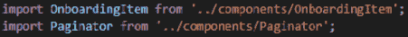

图 11.1–我们新导入的启动屏幕

因为我们已经在这里了，只需进入`scrollTo()`功能。写下以下几行，而不是我们在`else`语句中的`console.log()`行：

```jsx
navigation.navigate('Tab Navigator');
```

这告诉`Button`一旦到达启动屏幕的末尾，下一步就是导航到下一个屏幕，称为`'Tab Navigator'`。我们将在创建路由系统时介绍此屏幕。因为我们使用了一个名为`navigation`的变量，所以我们还应该让组件知道从哪里获取它。在我们定义`Onboarding`函数的正上方和括号之间，我们将允许函数接收这个称为`navigation`的道具，如下所示：

```jsx
export default function Onboarding({ navigation }) {
```

现在，如果我们想要有一个可用的应用，我们必须转到`App.js`并将启动屏幕的导入更改为正确的路径。使用正确的导入完成更改后，我们可以保存并运行应用。什么都不应该改变；我们所做的只是添加一个新目录，这样我们就有了一个更好的文件夹结构。一些文本编辑器或 IDE 会自动为您更改导入，因此请确保您始终阅读可能弹出的任何消息。

每日要闻

我经常刷新我的应用并检查更改或错误消息，尤其是当应用中的所有更改都不应该在视觉上改变任何内容时。通过这种方式，我可以确保在应用重新发布时，我始终了解应用内部发生的任何事情。

现在我们有了一个新的文件夹结构，我们可以开始创建应用运行所需的路由。但是首先，我们需要为我们将要使用的屏幕设置一些占位符。那么，让我们在`screens`文件夹中创建两个新文件：`Stopwatch.js`和`Timer.js`。

对于这两个函数，除了函数名之外，我们还有相同的代码，这些代码将写在`<Text />`组件中。在我们开始深入应用的功能之前，我们需要这些文件来测试路由是否正常工作。

让我们看看占位符屏幕是什么样子：


图 11.2–用于测试路线的占位符屏幕

这个例子是专门为`Stopwatch.js`文件创建的。您还必须为`Timer.js`创建第二个。正如我已经指出的，这个函数和计时器之间的区别在于函数名和`<Text />`组件中写入的内容。其余部分应该与我们只使用这些文件来测试我们的路由相同。

现在我们在`screens`文件夹中有了这两个新文件，我们可以继续在根目录中创建一个名为`routes.js`的新文件。这就是我们要为我们的酷小应用创建路由系统的地方。

创建新文件后，我们可以打开它并开始编码。我们将首先导入这个路由系统所需的所有必要的包和文件。通过查看以下屏幕截图，您可以看到我正在导入哪些软件包：


图 11.3–routes.js 的导入

现在，正如你所看到的，我们已经从`@react-navigation`导入了所有的主要软件包。我们通过导入 React 开始，因为我们需要它来创建这个基于组件的路由系统。接下来是从`@react-navigation/native`导入的`NavigationContainer`组件。此组件负责管理应用的导航状态，并在顶级导航器和应用环境之间创建连接。

在此之后，我们进口了`createStackNavigator`和`createBottomTabNavigator`。为了理解**堆栈导航器**的工作原理，我们必须开始将屏幕视为一副卡片中的卡片。你总是把一张新卡放在一张旧卡的上面，这样你就可以创建一堆卡。这就是 React 导航的基本工作原理，总是将一个新屏幕放在另一个屏幕上。

**底部选项卡导航器**创建了一个常见的底部栏，每当应用希望您更轻松地访问主要功能时，您通常会遇到该栏。这样，我们可以让我们的用户在计时器和秒表之间快速切换，每个屏幕都可以从底部栏轻松访问。

一旦我们导入了为我们的应用创建路由系统所需的依赖项，就可以导入我们将在该系统中使用的屏幕了。当然，登机屏幕非常重要，因为这必须是用户看到的第一个屏幕，之后我们需要秒表和计时器屏幕。

现在我们已经完成了导入，是时候看看如何使用 React 导航来创建路由系统了。我们将使用`createStackNavigator`和`createBottomTabNavigator`来创建变量，我们将使用这些变量作为组件来定义屏幕和导航器，现在让我们这样做：


图 11.4–从导航功能中创建变量

拥有这些变量使我们能够创建易于阅读的路由系统。

让我们从为主屏幕编写函数开始；也就是说，秒表和计时器。这应该是一个正常的 React 函数，返回系统的底部选项卡导航器。因此，我们将使用`Tab`变量来实现这一点。让我们看看我们的函数是什么样子的：

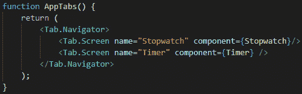

图 11.5–秒表和计时器屏幕的主屏幕布线

这看起来很容易理解，对吧？我们有一个`<Tab.Navigator />`组件，它有两个屏幕，子屏幕使用`<Tab.Screen />`组件。`Navigator`组件就像胶水一样，让 React Native 知道这两个屏幕需要成为底部选项卡导航器的一部分。

对于每一个这样的路由系统，我们需要一个`Navigator`组件，然后是一些`Screen`组件，让`Navigator`知道哪些屏幕是它的一部分。

我觉得这是非常简单的，因为任何人都可以开始为他们的应用创建路由系统。我鼓励您尽可能多地在应用中使用路由，只是为了看看您可以更改多少选项和内容。React 导航是非常可定制的，所以我敢肯定您会对使用此库的可能性感到惊讶。

现在，下一步是设置我们的主屏幕堆栈。我们将以与设置`AppTabs()`功能组件相同的方式进行设置，但这一次，我们还将使用`<NavigationContainer />`组件，因为这将是我们的主要路由组件：

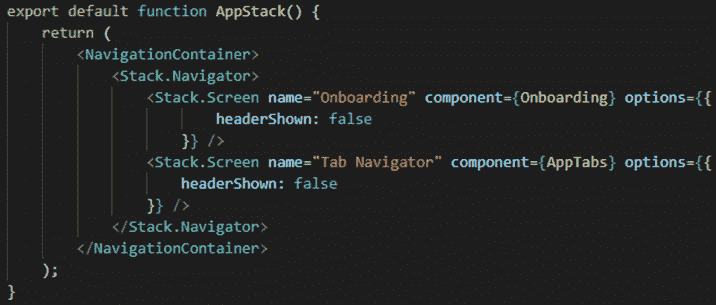

图 11.6–我们应用的主要路由系统

看看我们路由系统主要功能的代码，你可能会问自己这里发生了什么。不要害怕——这并不难理解。因为这将是我们的主要路由系统，所以我们使用了`<NavigationContainer />`组件。在它里面，我们有一个`<Stack.Navigator />`组件，它创建了一组屏幕，可以一个接一个地应用，就像一副牌。在这里，我们有两个屏幕：`Onboarding`屏幕和`AppTabs`屏幕。

如前所述，我们将`AppTabs`屏幕组件定义为一个底部选项卡导航器屏幕，其中包含两个主屏幕：`Stopwatch`和`Timer`。

我们的两个`<Stack.Screen />`组件上都应用了一个名为`options`的`prop`。此道具允许 us 将自定义特征应用于我们的屏幕。因为 React Native 在默认情况下在堆栈中的每个屏幕上启用标题栏，所以我们必须去掉它，所以我们给它一个值`false`。如果我们没有指定这一点，那么每次您转到这个屏幕时，您都会在屏幕顶部看到默认的平台标题。

现在我们已经导出了这个函数，我们可以进入我们的`App.js`文件并应用我们的路由系统。但是这个文件里装满了很多我们不需要的东西，所以让我们把它清理干净。删除`App.js`中的所有内容，这样我们就可以开始以最适合我们用例的方式重写它。

从文件中删除所有内容后，我们可以从导入 React 开始。之后，导入前面在`routes.js`文件中定义的`AppStack`组件。现在，我们所要做的就是创建一个名为`App()`的函数，返回我们的`<AppStack />`组件，如下面的屏幕截图所示：

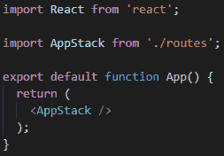

图 11.7–进行所有必要修改后的 App.js 文件

现在，我们的`App.js`文件看起来干净多了，我们已经成功地将路由系统连接到 React 本机应用。你应该测试你的应用！保存所有内容，启动 Expo 服务器，并打开您首选的模拟器或物理设备。

因为我们已经通过`navigation.navigate()`功能将启动屏幕链接到`scrollTo()`功能中的 Tab Navigator 屏幕，所以我们现在有了一个功能齐全的路由系统。

您现在应该能够首先看到启动屏幕。点击**下一个**按钮，直到进入最后一个屏幕。一旦你到了那里，再按一次**下一个**，砰的一声！您现在在`AppTabs()`选项卡导航器中。这就是我们在`routes.js`文件中定义的组件。您可以单击**底部选项卡导航器**按钮，在秒表和计时器应用之间快速切换。

我们的 React 导航实现非常成功！现在，是我们开始编码秒表屏幕功能的时候了。

# 制作秒表

有些已经使用过 JavaScript 的人可能会认为创建秒表就像调用`setInterval()`函数并在每次迭代中减去一个数字一样简单。好吧，不是真的，但不要担心——我们会让每个人都尽可能地轻松，不管你有没有使用 JavaScript 的经验。

那么，让我们首先打开我们的`Stopwatch.js`文件，我们可以在`screens`文件夹中找到它。现在，只有一些文本里面有 Stopwatch 这个词，它居中，因为我们设计了主`<View />`组件的样式。

老实说，我只是从删除这个文件中的所有内容开始，然后重新开始导入。我们首先从`'react'`导入`React`、`useState`和`useEffect`。之后，我们将从`'react-native'`进口`StyleSheet`和`SafeAreaView`。最后，我们将从“`galio-framework'`导入`Text`、`Block`和`Button`组件。

导入我们将用于创建此屏幕的组件后，是时候构建一个静态屏幕作为起点了。让我们看看下面的代码，并试图解释它，因为这将是我们的主要布局骨架：


图 11.8–秒表组件的基本布局

好吧，这是一大块代码，所以让我们开始解释一下。因此，在导入我们需要的所有内容之后，我们将开始编写我们的`Stopwatch()`功能组件。在它里面，我们可以看到有一个大的`<Block/>`分量，然后是`<SafeAreaView />`分量。这些都是在这里，以采取一切，并确保不会有任何问题，如果我们遇到一个缺口的手机。

到目前为止，一切都很简单，接下来会发生什么？我们必须将屏幕分为两个`<Block />`元素，一个`flex`属性为`0.32`，另一个`flex`属性为`0.68`。这样我们就可以确保屏幕的上部包含所有按钮和功能，然后屏幕的下部显示所有圈数。

在屏幕的上方，我们可以看到一个大字体的`<Text />`元素。这将是我们的时代，当我们添加所有功能时，这一时代将会改变。在此之后，我们有另一个启用了 row prop 的`<Block />`元素。这里面有两个按钮。我们将使用这些按钮启动/停止秒表，并在某人完成一圈时创建圈数。

在那之后，我们还有另一个`<Block />`元素，其目的是让我们的布局对用户更直观。它将指出圈数将显示在该线下。我们已经为您可以在`divideLine`下的样式对象中找到的线条创建了一些样式。

以下屏幕截图显示了这在我们的设备上的外观：


图 11.9–秒表屏幕的基本布局

美好的现在我们已经完成了基本布局的编码，是时候开始我们的屏幕的功能了。我们应该从定义一些状态变量开始，我们将在整个屏幕上使用这些变量。但是在那之前，让我们回到开头，想一想为什么我说我们不能用`setInterval()`函数增加时间。

### 使用 setInterval

所以，`setInterval`是一个函数，它的功能完全符合您的期望。您设置了一个时间间隔，比如 1000 毫秒，也就是 1 秒，对于每秒钟，您将要定义的函数将被调用。您可能会认为，从理论上讲，我们可以为秒表屏幕的功能提供如下功能：

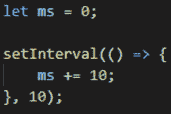

图 11.10–基本示例中使用的设置间隔

这将非常有效。这里，每 10 毫秒，我们启动一个函数，将变量增加 10。从理论上讲，这非常有效，因为我们现在有一个基本的秒表，由五行代码组成。但问题是，`setInterval()`没有那么可靠。

我为什么这么说？如果你看前面的函数，我们可以看到我们已经指定了 10ms 作为计时参数，所以我们的函数应该每 10ms 启动一次。但是，它不会在指定的时间执行代码。相反，它将在执行之前等待*至少*10 毫秒。因此，我们不能说我们的时间函数是精确的。

我尝试了一种不同的解决方法，我发现处理时间的最佳方法是使用`Date`对象。

现在我们已经解决了这个问题，让我们编写状态变量：

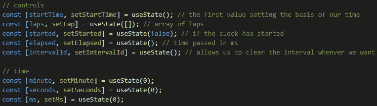

图 11.11–秒表组件内部使用的状态变量

我已经解释了每一个，但基本上，我们将有五个控制状态变量，分别称为`startTime`、`laps`、`started`、`elapsed`和`intervalId`。然后，我们有时间状态变量，我们将使用它在屏幕上查看时间变化。这些被称为`minute`、`seconds`和`ms`。

现在，让我们使用时间状态变量并使它们在屏幕上可见。在应用时间状态变量后，让我们看看`<Text />`组件现在是什么样子：

```jsx
<Text style={{ fontSize: 72, marginTop: 32 }}>{minute < 10 ? `0${minute}` : minute}:{seconds < 10 ? `0${seconds}`: seconds}.{ms}</Text>
```

因为我们可能在某个时间点上有个位数，通过这样写变量，我们可以确保如果它们是个位数，我们将在开始处添加一个`0`。我们将对`minutes`和`seconds`变量执行此操作。

保存文件和刷新屏幕应该不会显示任何更改。这很好，因为这意味着我们已经正确地实现了`Stopwatch`组件中的时间状态变量。

现在这些变量已经就位，让我们构建一个函数，一旦按下屏幕上的**开始**按钮，就会调用该函数。这个按钮需要做几件事；首先，它需要起到**启动**和**停止**按钮的作用。其次，它需要初始化我们刚刚用一个新的`Date`对象定义的`startTime`控制状态变量。现在让我们来看看这个函数：

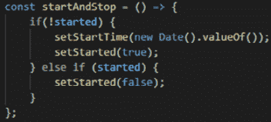

图 11.12–startAndStop（）函数

所以，这个函数可以做两件事。首先，如果我们的`started`状态变量是`false`，我们将其设置为`true`来宣布秒表的启动，然后将`startTime`变量设置为`new Date()`对象。通过在开始时设置日期，我们可以在以后使用它来计算每次迭代之间经过了多少时间，从而使我们能够显示更精确的时间。

现在，一旦启动变量被更改，我们需要启动`setInterval()`函数。让我们来看看下面的函数，并讨论它是如何工作的：


图 11.13–启动 setInterval（）函数的 useEffect（）实现

我们实现了这个`useEffect()`函数，因为 React 给了我们这个很酷的小函数，每次组件重新加载时都会调用它。最酷的是，我们只能在第二个参数中的状态变量发生变化的情况下使其工作。每次更改`started`变量时，都会调用此函数。

该函数在`started`变量更改后调用，它将是秒表功能的核心。此功能将位于`setInterval()`功能内。在该函数中，我们每 10 毫秒将经过的变量设置为`new Date()`*。之后，我们将获取我们的`setInterval()`函数，并将其应用于`intervalId`状态变量变量。*

`useEffect()`功能中的`return`功能会在出现副作用后进行清理。这意味着每次`started`变量更改时都会调用此函数，只是为了在上一次渲染后清理。组件卸载时也会调用它。因为我们使用的是`setInterval()`，所以我想特别确保每次`started`变量设置为`false`（秒表停止）时，我们的间隔都会被清除，这样就不会对用户的 CPU 造成太大的负担。

如您所见，清除间隔就像调用`clearInterval()`函数并将我们想要清除的间隔传递给它一样简单。

现在我们已经有了经过变量中的最新时间，我们所要做的就是检查`elapsed`时间和`startTime`时间之间的差异。我们可以用`useEffect()`来做这件事。每次改变`elapsed`状态变量时，将触发另一个`useEffect()`功能。然后，我们可以在那里做所有的数学题。让我们来看看我是如何做到这一点的：

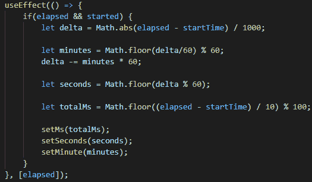

图 11.14–第二个 useEffect（）函数，取决于运行时间

所以，每当`elapsed`改变时，也就是每 10 毫秒，就会调用这个`useEffect()`函数。我们在这里做的是检查`elapsed`是否存在（未定义），并且`started`是否为`true`。如果这两个条件都是真的，我们可以使用包含最新的`Date`值的`elapsed`来计算差异，并以毫秒为单位。向前看，我们计算每分每秒。一旦我们有了所有这些值，我们就可以将它们设置为我们之前定义的时间状态变量：`minute`、`seconds`和`ms`。

等等，我们结束了吗？有点，但不是真的。让我们转到我们的**启动**按钮，稍微更改一下，以便可以使用。我们将这样更改它：

```jsx
<Button size="small" color={started ? "#6c757d" : "#c9a0dc" } onPress={() => startAndStop()} shadowless>{started ? "Stop" : "Start"}</Button>
```

这样，我们可以有不同的颜色和我们的按钮将显示一个不同的文本的基础上，它可以做什么，在那一刻。这都是基于我们的`started`状态变量，它告诉我们秒表是否已经启动。我选择这些颜色是因为我们在启动屏幕上也使用了它们，我认为它们很合适，但是你可以使用任何你想要的颜色。

现在，我们可以保存并重新加载我们的 JavaScript，并查看我们所创建的内容。按下**开始**按钮，您将看到它将文本更改为**停止**按钮的文本，并且它的颜色现在为灰色。时间开始加快，我们的秒表工作正常，但如果我们连圈数都记不起来，这是什么类型的秒表呢？

让我们创建一个函数，它将忙于注册圈数。我们还需要一种显示这些圈数的方法，一旦完成了该功能，我们就会这样做。我在想，我们可以像使用`startAndStop()`功能一样使用这个功能，因为我们应该能够注册圈数并用同一个按钮清除所有圈数。让我们看看我是如何做到这一点的：


图 11.15–用于登记和清除所有重叠的设置重叠功能

这是一个简单的函数；我们的函数可以根据启动状态变量值做两件不同的事情。如果秒表启动，我们可以记录新的圈数，但如果秒表不再工作，我们应该能够清除所有圈数并为新的会话做好准备。

现在我们有了这个功能，让我们把它链接到我们的**圈**按钮，就像我们使用**开始**按钮一样：

```jsx
<Button size="small" color="#f4d1dc" onPress={() => lap()} shadowless>{started ? "Lap" : "Clear laps"}</Button>
```

现在，让我们在屏幕上显示圈数。我们将通过从`'react-native'`导入`FlatList`来实现这一点，因此只需向上滚动到文件的导入部分并添加`FlatList`。我们的新进口应如下所示：

```jsx
import { StyleSheet, SafeAreaView, FlatList } from 'react-native';
```

### 显示圈数

我们应该使用`<Block flex={0.68} />`组件中的`FlatList`组件，而不是目前居住在那里的`<Text />`组件中的。因此，删除`<Text />`组件并查看我对`<FlatList />`的实现：

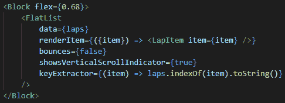

图 11.16–代替文本组件实现的平面列表

这里没有什么新鲜事。我们已经使用了一个`FlatList`组件来构建启动屏幕，您可能已经注意到，我们在那里有一个名为`<LapItem />`的新组件。我已经在主秒表组件下定义了这个组件。你可以随时移动它并在`components`文件夹下为它创建一个单独的文件，但我觉得让它靠近主组件更容易让我总是签出。让我们看看这个组件：


图 11.17–扁平列表中使用的 LapItem 组件

该组件采用一个名为`item`的`prop`，该数组包含显示圈数所需的信息。

这样，我们就完成了这个美丽的屏幕。保存并重新加载 JavaScript，然后进行尝试。下面的屏幕截图显示了我们的应用现在应该是什么样子：


图 11.18–完成的秒表组件

它起作用了！它看起来很酷，我们在建造它时玩得很开心。现在，让我们开始在计时器屏幕上工作。

# 创建计时器

现在我们已经完成了秒表屏幕的，现在是打开`Timer.js`文件并在计时器屏幕上工作的时候了。我们应该立即投入，移除所有东西，并开始导入我们需要的所有东西。

首先，我们都知道，在计时器周期结束时，总会有声音播放，让你知道已经停止。为此，我们需要一个名为`expo-av`的新包。这是一个处理音频的世博套餐。它非常易于使用，因此让我们首先使用以下命令将其安装到项目中：

```jsx
expo install expo-av
```

现在我们已经安装了它，我们可以开始导入构建该组件所需的所有内容。我们需要一个与秒表非常相似的计时器组件。我们还需要使用 interval 和 date 对象来计算所有内容，因此在我们的屏幕上，`useEffect`和`useState`是必不可少的。

不同之处在于，我们需要让用户准确输入他们希望计时器工作的时间。我们可以使用`'react-native'`中的`<TextInput />`组件来实现这一点。因为我们使用的是输入，所以我们还需要一个`<KeyboardAvoidingView />`组件来帮助我们重新组织布局，这样我们的输入就不会因为打开键盘而被隐藏。让我们看看我们的进口：


图 11.19–计时器屏幕的导入

如您所见，`import`语句与秒表屏幕非常相似。这是因为这些屏幕是相似的。然而，通过让他们做同样的事情，我们可以学会通过回顾我们过去所做的事情来激励自己。您编写的所有代码都将帮助您解决可能遇到的其他问题。因为我们已经创建了秒表屏幕，我们现在知道了`setInterval()`的不准确性，以及如何解决这个问题。

现在，让我们开始创建计时器屏幕的基本功能，并使用一个可以使用的布局。对于布局，我们将以启动秒表屏幕的方式启动所有内容；也就是说，有一个连接有`styles.container`的`<Block />`组件。在这之后，我们将使用`<SafeAreaView />`和`<KeyboardAvoidingView />`，并应用`flex: 1`样式。

在`<KeyboardAvoidingView />`组件内部，我们将有两个`<Block />`元素。第一个将有一个`<TextInput />`组件作为子组件，它将成为计时器的标题。我们在这里使用`<TextInput />`是因为您可能希望更改计时器的标题；这只是一个很酷的小功能。第二个将有两个`<TextInput />`元素——一个用于分钟，一个用于秒。通过这种方式，用户可以输入计时器所需的任何数字。第二个`<Block />`元素还将包含计时器的**启动/停止**按钮。让我们看看这是什么样子：

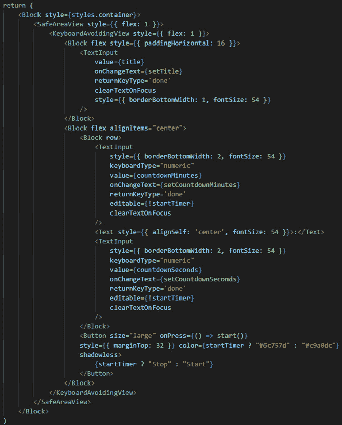

图 11.20–为计时器屏幕创建的布局

正如我们前面所解释的，这并不复杂，但您会注意到，我已经为我们的`<TextInput />`组件填充了值道具。我还确保我们的**启动/停止**按钮有一个状态变量。这只是因为我们已经通过了秒表屏幕，这意味着我们已经经历了一个事实，即我们需要某些状态变量，以便我们可以更改按钮内的文本。

如您所见，我们在`<TextInput />`组件上也使用了`editable`道具，因为我们只希望在计时器不工作时这些值是**可编辑的**。我们还可以看到另一个新道具，叫做`returnKeyType`。此道具允许我们告诉设备我们希望用户使用哪种密钥。我选择了`done`键，因为一旦他们添加了想要的号码，他们就可以按下该键继续前进。

从前面的章节中我们还知道，`<TextInput />`是一个受控组件，这意味着它需要`value`道具的状态变量，同时也需要通过`onChangeText`道具来改变该状态。了解所有这些，我建议您将该代码读几遍，看看您是否能理解它。我们将不再对其进行任何更改，因为这足以让我们直接进入计时器的功能。

让我们看看我们为这个计时器定义的状态变量：


图 11.21–为计时器屏幕创建的状态变量

因此，在计时器屏幕的功能组件开始时，我们将编写所有这些状态变量。就像以前一样，我们有一些时间状态变量和一些控件的状态变量。我们已经看到了`intervalId`和`startTimer`（我们在秒表屏幕中称之为`started`。

让我们简要地解释一下我们正在使用的其他状态变量。`countdownMinutes`和`countdownSeconds`变量严格用于显示计时器的分钟和秒数。`final`变量存在，因为我们将根据用户的输入知道我们希望计时器持续多长时间。一旦我们启动计时器，我们将使用它来计算时间量。

如您所见，我们还有`timer`和`timeDisplay`变量。`timer`变量的作用与我们使用秒表屏幕时`elapsed`变量的作用一样。`timeDisplay`变量用于我们始终以秒为单位计算计时器的值。这样，我们就可以确保在它碰到`0`时停止它。

我们的`title`变量用于屏幕标题，用户可以随时更改标题。声音变量存在，因为我们需要知道声音何时加载到屏幕上。这将有助于我们使用另一个`useEffect()`功能，以便我们可以自己清理。

伟大的我喜欢现在秒表屏幕已经完成，我们可以走得更快。这意味着我们在学习，经验是最好的老师！让我们来看一下，当我们按下 OutT1 开始 St2 T2 按钮时，我们将调用的函数：

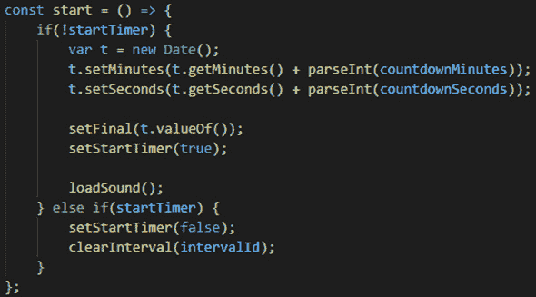

图 11.22–用于启动或停止计时器的 start（）函数

正如我们所看到的，我们正在遵循我们在秒表屏幕上使用的相同模式。这使我们能够使用此功能作为按钮的启动或停止功能。因此，如果`startTimer`状态变量是`false`，那么我们将使用`Date`对象初始化一个新变量。然后，我们将使用从屏幕上的两个`<TextInput />`组件中抓取的分和秒设置该日期，并将其添加到当前日期的分和秒中。这意味着我们已经使用了当前日期并添加了用户输入的时间。这是我们试图达到的最终日期，所以下一步是用我们刚刚计算的日期设置我们的`final`状态变量。

然后，我们必须将`startTimer`变量设置为 true，这将通知我们的组件计时器已经启动。此时，我们还将加载声音。让我们为此定义`loadSound()`函数：

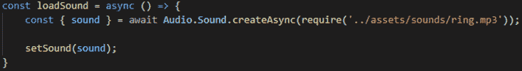

图 11.23–带有新关键字 async 的 loadSound（）函数

正如您现在可能已经知道的，这个函数有一个名为`async`的新关键字。不用担心–这是为了确保我们的函数在加载声音时不会停止整个应用。如果您没有可以使用的声音，您可以在 GitHub 上的项目文件中找到我创建的声音。你也可以创建自己的声音，甚至在网上使用不受版权保护的东西。我按照`'expo-av'`文档加载声音。这就是为什么我总是强调这样一个事实，即当您不理解某些东西时，第一步应该是查看特定包/库的文档。

现在我们已经加载了声音并启动了计时器，我们应该能够看到屏幕后面的所有逻辑存在于何处。正如我们之前所做的，我们使用`useEffect()`函数来确保它们只在某个状态变量发生变化时被触发。我们要使用的第一个`useEffect()`函数将取决于`final`状态变量。这是因为所有的数学都需要这个变量，所以，很自然，我们要在做任何其他事情之前检查它：

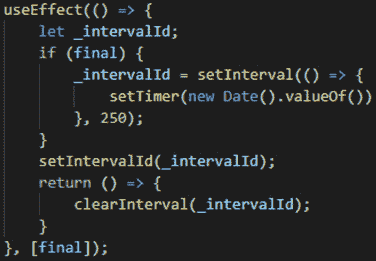

图 11.24–取决于最终变量的第一个 useEffect（）函数

所以，这和我们之前做的完全一样。在这里，我们有一个`setInterval()`函数被调用——这次是每 250ms 调用一次——但前提是最终变量已经初始化。这意味着如果用户按下了**启动**/**停止**按钮。这里没有什么奇怪的事情发生，所以我认为我们应该能够继续并检查以下`useEffect()`功能：


图 11.25–第二个 useEffect（）函数取决于计时器变量

因为我们在第一个`useEffect()`函数中设置`timer`状态变量，它将作为第二个`useEffect()`函数的触发器，以便调用它。这是一个函数，我们正在做定时器工作所需的所有数学运算。我们正在计算从`timer`变量接收到的最终日期和新日期之间的秒差。

在以秒为单位计算差值后，下一步是检查`timeDisplay`变量是否与新计算的差值不同。如果不同，我们将`timeDisplay`设置为这个新值。我们这样做是为了确保我们总是用一个新的值来计算一切。

在那之后，我们只做通常的数学计算分和秒。接下来，我们必须通过`countdownMinutes`和`countdownSeconds`变量将`<TextInput />`组件设置为新计算的值。我们在这里使用`toString()`的原因是`<TextInput />`组件只接受字符串作为值，因此使用此函数，我们将值从数字转换为字符串。

现在，让我们看看下面的`useEffect()`函数，它取决于`timeDisplay`状态变量：

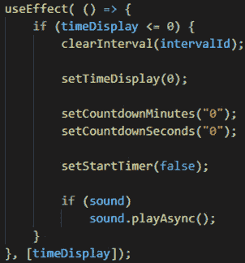

图 11.26–第三个 useEffect（）函数，取决于 timeDisplay 变量

只有当`timeDisplay`等于或小于`0`时，此选项才有效。一旦我们点击`0`，我们应该停止并重置所有我们一直使用到现在的变量。这就是我们确保我们的间隔被清除的地方，`timeDisplay`变量返回到`0`，倒计时变量返回到 0。这也是我们播放声音的地方，因此我们必须检查声音是否已加载，然后使用`playAsync()`功能启动它。

因为我们已经在计时器应用启动时加载了声音，所以我们也应该在屏幕卸载时卸载它。实际上，如果我们不使用设备，我们没有理由在设备内存中保留声音。我们将通过在另一个`useEffect()`函数中使用清理函数来实现这一点。让我们看看这是什么样子：


图 11.27–第四个 useffect（）函数仅用于 cleanup 函数

因此，这又一次受到了他们文档的直接启发。组件卸载后，我们必须调用此函数，该函数检查声音是否已加载。如果有，那么我们必须调用`sound`状态变量上的`unloadAsync()`函数。

祝贺我们已经完成了计时器屏幕！让我们检查一下它的外观以及是否有效：


图 11.28–完成的计时器屏幕

看起来很棒！在这里，我们可以更改标题；我们还可以更改计时器的值，一旦我们点击开始，它就会工作。等待 30 秒后，将播放一个很酷的小声音！

这样，我们就完成了这个应用！等等…不是真的-底部选项卡导航器看起来有点空，所以我们应该添加一些图标。我们还可以做一些小事情来增强用户体验。让我们继续并开始添加所有这些小增强。

# 完成我们的应用

此时，我们需要向底部选项卡导航器添加一些图标。。但是我们应该怎么做呢？幸运的是，React Navigation 有一种非常简单的方法来修改其默认组件。

因为我们已经在这里了，我们也应该改变我们现在使用的选项卡的焦点颜色。

那么，让我们回到我们的`routes.js`文件。因为我们想在选项卡中添加图标，所以应该从`'galio-framework'`导入`Icon`组件。在所有导入之后，我们应该写以下内容：

```jsx
import { Icon } from 'galio-framework';
```

现在我们已经导入了用于显示图标的组件，让我们看看应该如何做到这一点。搜索您的`AppTabs()`函数并找到`<Tab.Navigator />`组件。在这里，我们将添加两个名为`screenOptions`和`tabBarOptions`的新道具。让我们快速查看它们，看看我们是如何使用它们在底部选项卡导航器中实现图标的：

重要提示

截至 2021 年 8 月 14 日，React 导航已更新为 v6，而`tabBarOptions`已被弃用，取而代之的是`options`道具，该道具可按屏幕运行。有关版本控制和 React 导航库的更多信息，我建议阅读文档，可以在[中找到 https://reactnavigation.org/](https://reactnavigation.org/) 。


图 11.29–实现了图标的全新 AppTabs（）功能组件

因此，正如我们所看到的，`screenOptions`道具与一个函数一起工作，该函数为每个屏幕接受`navigation`和`route`道具。现在，我们正在使用`route`，因为我们想检查哪个屏幕与每条路线相等。这样，我们就可以在底部选项卡导航器中为每个屏幕设置一个案例。该函数返回一个对象，该对象带有一个名为`tabBarIcon`的键，该键的值设置为一个函数，该函数收集了大量有关用户当前关注的屏幕的信息。

这是我们检查用户是否专注于特定屏幕的地方。根据这一点，我们可以渲染不同类型的图标。因此，如果用户聚焦在秒表屏幕上，那么我们将显示一个填充图标，而如果用户没有聚焦，我们将只显示该图标的轮廓。这是一个小细节，可以帮助用户知道他们何时在屏幕上，他们认为自己在屏幕上。

现在，设置图标的颜色要容易得多。为此，我们将使用`tabBarOptions`道具。我们将向其传递一个包含两个键的对象：`activeTintColor`表示用户当前关注该特定屏幕的时间，`inactiveTintColor`表示用户*未*关注该特定屏幕的时间。

让我们保存此内容并查看我们的应用！我想我们都同意，现在看起来好了 10 倍：


图 11.30–将图标添加到底部选项卡导航器后的最终应用布局

不要关闭`routes.js`文件！我们还有一件事要做。正如我们在[*第 10 章*](10.html#_idTextAnchor128)*构建启动屏幕*中所讨论的，启动屏幕只应在您第一次打开应用时出现。没有理由总是看到启动屏幕。你的很多用户会说，*好吧，我们明白了，这是一个秒表应用，让我来看看秒表部分！*

但是我们怎么能做到呢？这就是`AsyncStorage`派上用场的地方！为了让我们能够使用这个软件包，我们需要安装它。让我们再次打开终端并编写以下命令：

```jsx
expo install @react-native-async-storage/async-storage
```

现在我们已经安装了这个很酷的小软件包，让我们将它导入`routes.js`文件中。在我们`Icon`导入后立即执行此操作，如下所示：

```jsx
import AsyncStorage from '@react-native-async-storage/async-storage';
```

现在，我们可以在`AppStack()`函数中使用这个`Icon`导入。找到该函数后，我们应该创建一个名为`viewedOnboarding`的状态变量。这个变量将帮助我们知道用户是否已经看到启动屏幕。

定义该变量后，我们需要在移动应用的开头运行一个函数。你还记得我们应该怎么做吗？没错–另一个`useEffect()`功能。我打赌你已经厌倦了这些功能，但它们太棒了！

此`useEffect()`函数应调用另一个名为`checkOnboarding()`的函数，其目的是检查用户是否看到启动屏幕。根据这一点，我们将把状态变量`viewedOnboarding`设置为`true`或`false`：

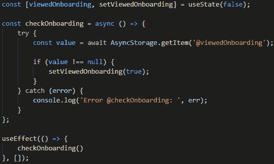

图 11.31–为 AppStack（）函数编写的逻辑

现在，我们需要另一个`async`函数。但我们只能使用带有`async`功能的软件包。我们将尝试查看本地存储是否存储了该项，如果存储了，则将`viewedOnboarding`状态变量设置为`true`。

您可能会想知道我们什么时候会将该项目添加到本地存储中。那么，当我们的用户最后一次在启动屏幕内按下**下一步**时，我们应该这样做。那么，让我们转到`Onboarding.js`文件并实现它。

现在我们在`Onboarding.js`文件中，我们应该再次导入`AsyncStorage`包。在这之后，我们应该直接跳到`scrollTo()`函数。首先，我们要做这个函数`async`。之后，我们有一份`if-else`声明。我们将改变*的其他*部分，在那里我们没有真正的理由过着`console.log()`生活，取而代之的是`navigation.navigate()`功能。让我们看看我们将如何改变这一点：


图 11.32–我们修改的 scrollTo（）函数

在这里，我们将再次尝试使用 try-catch。如您所见，我们正在使用`setItem`在本地存储中将该项设置为`true`。这就是此库如何知道此项已在存储器中设置为 true。

现在，让我们回到`routes.js`文件。我们都准备好了，但我们需要确保只有当我们的用户还没有看到登机屏幕时，我们才会显示该路线。我们将使用**条件渲染**，这是我们从本章开始就使用的一种技术。让我们看看这是什么样子：

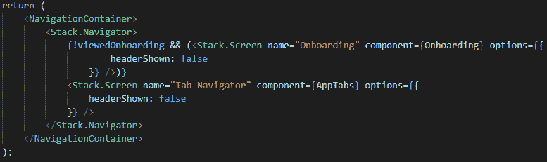

图 11.33–应用于<stack.screen>入职组件的条件呈现</stack.screen>

如您所见，我们正在检查状态变量`viewedOnboarding`。如果设置为`false`，则表示我们的用户尚未看到登机屏幕，因此我们的路线应该显示为。如果设置为`true`，这意味着我们将不显示任何路线，实际上使登机不存在。

这样，我们就完成了这个应用！保存所有文件，重新加载 JavaScript，并查看应用。首先，您将看到启动屏幕。点击“下一步”直到它消失，然后在秒表和 Timer 屏幕上玩。之后，再次打开该应用，您将看到一些令人惊奇的东西–不再显示启动屏幕！相反，您将直接进入秒表屏幕–更确切地说，是 Tab Navigator 屏幕。

祝贺你现在有了一个非常酷且功能强大的应用供你使用。继续向你的朋友和家人吹嘘吧；让他们看看你进步了多少！

# 总结

这一章对我们来说都是一段漫长的旅程。不要害怕！挑战越大，回报就越好。你已经到达了一段漫长而有趣的旅程的终点。你现在有了一个功能齐全的应用，可以向朋友展示。这些是您成为优秀本地开发人员的第一步。

我们在本章的开头介绍了 React 导航。创建路线并将其链接到登机屏幕是我们做过的最酷的事情之一。这也是难以置信的简单，这再次证明了土著社区是多么伟大。

将应用链接到 React 导航库后，我们开始在秒表屏幕上工作。我们了解到`setInterval()`函数并没有那么精确，因此我们开始使用日期对象，事实证明这对于保持时间更为有效。

完成秒表屏幕感觉像是一个巨大的胜利，因此，创建我们的计时器屏幕变得更加平滑。但是，我们又学到了一些新的东西，那就是如何在计时器运行完后播放声音。我希望这样做能为你打开许多创造力之门。

在本章的最后，我们重点介绍了用户体验，并确保用户在查看底部选项卡导航器时会看到一些图标。除此之外，我们还与一个名为`AsyncStorage`的库合作，这样我们就可以使登录屏幕远离已有经验的用户。

学这么多东西真是新鲜空气。是的，这是很多信息，但我希望你们认识到，尽可能多地应对挑战是多么重要。就像在现实生活中一样，他们帮助我们积累经验，帮助我们成为伟大的程序员。

现在，让我们为下一章做好准备，在这一章中，我们将讨论作为 React 本地开发人员，您可以采取哪些其他途径成为一名优秀的程序员。