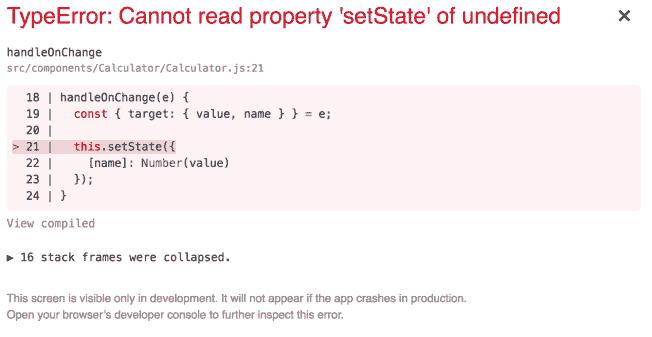
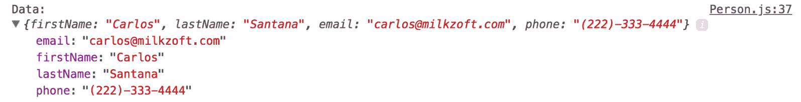
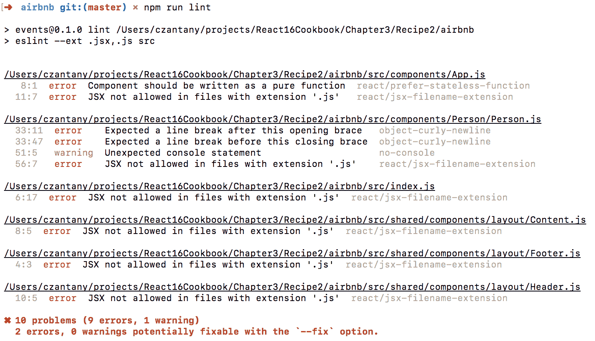
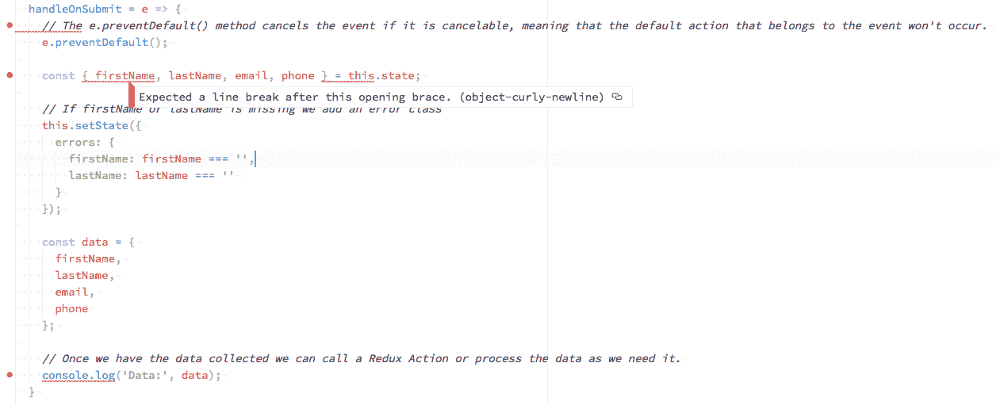
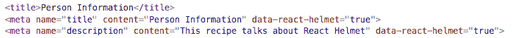

# 三、处理事件、绑定和有用的 React 包

本章将介绍以下配方：

*   使用构造函数与使用箭头函数的绑定方法
*   使用事件创建表单元素
*   使用 react 弹出窗口以模式显示信息
*   实施 Airbnb React/JSX 风格指南
*   使用 React 头盔更新标题和元标记

# 介绍

本章包含与处理事件相关的配方，React 中的绑定方法，我们将实现一些最有用的 React 包。

# 使用构造函数与使用箭头函数的绑定方法

在这个配方中，我们将学习 React 中绑定方法的两种方法：使用构造函数和使用箭头函数。

# 怎么做。。。

这个方法很简单，目标是使用类构造函数和箭头函数绑定一个方法：

1.  让我们创建一个名为`Calculator`的新组件。我们将创建一个具有两个输入和一个按钮的基本计算器。我们的组件框架如下所示：

```jsx
  import React, { Component } from 'react';
  import './Calculator.css';

  class Calculator extends Component {
    constructor() {
      super();

      this.state = {
        number1: 0,
        number2: 0,
        result: 0
      };
    }

    render() {
      return (
        <div className="Calculator">
          <input 
            name="number1" 
            type="text" 
            value={this.state.number1} 
          />
          {' + '}
          <input 
            name="number2" 
            type="text" 
            value={this.state.number2} 
          />

          <p><button>=</button></p>
          <p className="result">{this.state.result}</p>
        </div>
      );
    }
  }

  export default Calculator;
```

File: src/components/Calculator/Calculator.js

2.  现在我们将添加两个新方法，一个用于处理输入（`onChange`事件），另一个用于管理结果按钮（`onClick`。我们可以对两个输入使用相同的`handleOnChange`方法。由于我们有字段的名称（与状态相同），我们可以动态更新每个状态，在`handleResult`方法中，我们只需将两个数字相加：

```jsx
    handleOnChange(e) {
      const { target: { value, name } } = e;

      this.setState({
        [name]: Number(value)
      });
    }

    handleResult(e) {
      this.setState({
        result: this.state.number1 + this.state.number2
      });
    }
```

3.  现在在我们的`render`方法中，我们需要将事件添加到输入和按钮中：

```jsx
    render() {
      return (
        <div className="Calculator">
          <input 
 onChange={this.handleOnChange} 
            name="number1" 
            type="text" 
            value={this.state.number1} 
          />
          {' + '}
          <input 
 onChange={this.handleOnChange} 
            name="number2" 
            type="text" 
            value={this.state.number2}
          />
          <p>
            <button onClick={this.handleResult}>=</button>
          </p>
          <p className="result">{this.state.result}</p>
        </div>
      );
    }
```

4.  我们的 CSS 代码如下所示：

```jsx
  .Calculator {
    margin: 0 auto;
    padding: 50px;
  }

  .Calculator input {
    border: 1px solid #eee;
    font-size: 16px;
    text-align: center;
    height: 50px;
    width: 100px;
  }

  .Calculator button {
    background: #0072ff;
    border: none;
    color: #fff;
    font-size: 16px;
    height: 54px;
    width: 150px;
  }

  .Calculator .result {
    border: 10px solid red;
    background: #eee;
    margin: 0 auto;
    font-size: 24px;
    line-height: 100px;
    height: 100px;
    width: 100px;
  }
```

File: src/components/Calculator/Calculator.css

5.  如果您现在运行应用，您将看到，如果您尝试在输入中写入内容或单击按钮，您将得到如下错误：



6.  原因是我们需要将这些方法绑定到类才能访问它。让我们首先使用构造函数绑定方法：

```jsx
    constructor() {
      super();

      this.state = {
        number1: 0,
        number2: 0,
        result: 0
      };

      // Binding methods
      this.handleOnChange = this.handleOnChange.bind(this);
      this.handleResult = this.handleResult.bind(this);
    }
```

7.  如果希望在组件顶部列出所有方法，那么使用构造函数绑定这些方法是很好的。如果你看`Calculator`组件，它应该是这样的：


8.  现在让我们使用箭头函数来自动绑定方法，而不是在构造函数上进行绑定。为此，您需要删除构造函数中的绑定方法，并将`handleOnChange`和`handleResult`方法更改为箭头函数：

```jsx
    constructor() {
      super();

      this.state = {
        number1: 0,
        number2: 0,
        result: 0
      };
    }

    // Changing this method to be an arrow function
    handleOnChange = e => {
      const { target: { value, name } } = e;

      this.setState({
        [name]: Number(value)
      });
    }

    // Changing this method to be an arrow function
    handleResult = e => {
      this.setState({
        result: this.state.number1 + this.state.number2
      });
    }
```

9.  你会得到同样的结果。我更喜欢使用箭头函数来绑定方法，因为您使用的代码更少，并且不需要手动将方法添加到构造函数中。

# 它是如何工作的。。。

如您所见，您有两个选项来绑定 React 组件中的方法。构造函数选项目前最常用，但箭头函数越来越流行。您可以决定最喜欢哪个绑定选项。

# 使用事件创建表单元素

您可能已经注意到，在上一章中，我们使用了一些简单的事件形式，但在本食谱中，我们将更深入地了解这个主题。在[第 6 章](06.html)*使用 Redux 表单创建表单*中，我们将学习如何使用 Redux 表单处理表单。

# 怎么做。。。

让我们创建一个名为`Person`的新组件：

1.  我们将用于此组件的框架如下所示：

```jsx
 import React, { Component } from 'react';
  import './Person.css';

  class Person extends Component {
    constructor() {
      super();

      this.state = {
        firstName: '',
        lastName: '',
        email: '',
        phone: ''
      };
    }

    render() {
      return (
        <div className="Person">

        </div>
      );
    }
  }

  export default Person;
```

File: src/components/Person/Person.js

2.  让我们在表单中添加`firstName`、`lastName`、`email`和`phone`字段。`render`方法应如下所示：

```jsx
  render() {
    return (
      <div className="Person">
        <form>
          <div>
            <p><strong>First Name:</strong></p>
            <p><input name="firstName" type="text" /></p>
          </div>

          <div>
            <p><strong>Last Name:</strong></p>
            <p><input name="lastName" type="text" /></p>
          </div>

          <div>
            <p><strong>Email:</strong></p>
            <p><input name="email" type="email" /></p>
          </div>

          <div>
            <p><strong>Phone:</strong></p>
            <p><input name="phone" type="tel" /></p>
          </div>

          <p>
            <button>Save Information</button>
          </p>
        </form>
      </div>
    );
  }
```

3.  让我们在表单中使用以下 CSS 样式：

```jsx
  .Person {
    margin: 0 auto;
  }

  .Person form input {
    font-size: 16px;
    height: 50px;
    width: 300px;
  }

  .Person form button {
    background: #0072ff;
    border: none;
    color: #fff;
    font-size: 16px;
    height: 50px;
    width: 300px;
  }
```

File: src/components/Person/Person.css

4.  如果运行应用，则应看到以下视图：


5.  让我们在输入中使用本地状态。从 React 中的输入检索值的唯一方法是将每个字段的值连接到特定的局部状态，如下所示：

```jsx
  render() {
    return (
      <div className="Person">
        <form>
          <div>
            <p><strong>First Name:</strong></p>
            <p>
              <input 
                name="firstName" 
                type="text" 
 value={this.state.firstName} 
              />
            </p>
          </div>

          <div>
            <p><strong>Last Name:</strong></p>
            <p>
              <input 
                name="lastName" 
                type="text" 
 value={this.state.lastName} 
              />
            </p>
          </div>

          <div>
            <p><strong>Email:</strong></p>
            <p>
              <input 
                name="email" 
                type="email" 
 value={this.state.email} 
              />
            </p>
          </div>

          <div>
            <p><strong>Phone:</strong></p>
            <p>
              <input 
                name="phone" 
                type="tel" 
 value={this.state.phone} 
              />
            </p>
          </div>

          <p>
            <button>Save Information</button>
          </p>
        </form>
      </div>
    );
  }
```

If you try to type something, you will notice that you are not allowed to write anything, and this is because all the inputs are connected to the local state, and the only way we can re-render the typed text is by updating the local state.

6.  正如您所想象的，我们更新本地状态的唯一方法是检测输入的变化，而这将在用户输入某些内容时发生。让我们为`onChange`事件添加一个方法：

```jsx
  handleOnChange = e => {
    const { target: { value } } = e;

    this.setState({
      firstName: value
    });
  }
```

Like I mentioned in the last recipe when we use an arrow function in our methods we are automatically binding the class to the method. Otherwise, you will need to bind the method in the constructor. In our `firstName` input, we need to call this method on the `onChange` method:

```jsx
    <input 
      name="firstName" 
      type="text" 
      value={this.state.firstName} 
 onChange={this.handleOnChange} 
    />
```

7.  但这里有个问题。如果我们有四个字段，那么您可能会认为需要创建四个不同的方法（每个状态一个），但有更好的方法来解决这个问题：获取`e (e.target.name)`对象中输入名称的值。这样，我们可以用相同的方法更新所有状态。我们的`handleOnChange`方法现在应该是这样的：

```jsx
    handleOnChange = e => {
      const { target: { value, name } } = e;

      this.setState({
        [name]: value
      });
    }
```

8.  通过对象中的`([name])`语法，我们可以动态更新表单中的所有状态。现在我们需要将此方法添加到所有输入的`onChange`中。在此之后，您将能够在输入中写入：

```jsx
    render() {
      return (
        <div className="Person">
          <form>
            <div>
              <p><strong>First Name:</strong></p>
              <p>
                <input 
                  name="firstName" 
                  type="text" 
                  value={this.state.firstName} 
 onChange={this.handleOnChange} 
                />
              </p>
            </div>

            <div>
              <p><strong>Last Name:</strong></p>
              <p>
                <input 
                  name="lastName" 
                  type="text" 
                  value={this.state.lastName} 
 onChange={this.handleOnChange} 
                />
              </p>
            </div>

            <div>
              <p><strong>Email:</strong></p>
              <p>
                <input 
                  name="email" 
                  type="email" 
                  value={this.state.email} 
 onChange={this.handleOnChange} 
                />
              </p>
            </div>

            <div>
              <p><strong>Phone:</strong></p>
              <p>
                <input 
                  name="phone" 
                  type="tel" 
                  value={this.state.phone} 
 onChange={this.handleOnChange} 
                />
              </p>
            </div>

            <p>
              <button>Save Information</button>
            </p>
          </form>
        </div>
      );
    }
```

9.  所有表单都需要提交从用户处收集的信息。我们需要使用表单中的`onSubmit`事件并调用`handleOnSubmit`方法通过本地状态检索所有输入值：

```jsx
  handleOnSubmit = e => {
    // The e.preventDefault() method cancels the event if it is                            
    // cancelable, meaning that the default action that belongs to  
    // the event won't occur.
    e.preventDefault();

    const { firstName, lastName, email, phone } = this.state;
    const data = {
      firstName,
      lastName,
      email,
      phone
    };

    // Once we have the data collected we can call a Redux Action  
    // or process the data as we need it.
    console.log('Data:', data);
  }
```

10.  创建此方法后，我们需要在`form`标记的`onSubmit`事件上调用它：

```jsx
  <form onSubmit={this.handleOnSubmit}>
```

11.  现在你可以测试这个了。打开浏览器控制台，当您在输入中写入一些值时，您将能够看到数据：



12.  我们需要验证所需的字段。假设`firstName`和`lastName`字段是必填字段。如果用户没有在字段中写入值，我们希望添加一个错误类，在输入周围显示一个红色边框。您需要做的第一件事是为错误添加新的本地状态：

```jsx
      this.state = {
        firstName: '',
        lastName: '',
        email: '',
        phone: '',
        errors: {
          firstName: false,
          lastName: false
        }
      };
```

13.  您可以在此处添加任何要验证的字段，该值为布尔值（`true`表示有错误，`false`表示没有问题）。然后，在`handleOnSubmit`方法中，如果出现错误，我们需要更新状态：

```jsx
    handleOnSubmit = e => {
     // The e.preventDefault() method cancels the event if it is   
     // cancelable, meaning that the default action that belongs to  
     // event won't occur.
    e.preventDefault();

      const { firstName, lastName, email, phone } = this.state;

      // If firstName or lastName is missing then we update the   
      // local state with true
      this.setState({
 errors: {
 firstName: firstName === '',
 lastName: lastName === ''
 }
 });

      const data = {
        firstName,
        lastName,
        email,
        phone
      };

      // Once we have the data collected we can call a Redux Action  
      // or process the data as we need it.
      console.log('Data:', data);
    }
```

14.  现在，在您的`render`方法中，您需要在`firstName`和`lastName`字段的`className`属性中添加一个三元验证，如果您想更有趣，还可以在输入下面添加一条错误消息：

```jsx
    render() {
      return (
        <div className="Person">
          <form onSubmit={this.handleOnSubmit}>
            <div>
              <p><strong>First Name:</strong></p>
              <p>
                <input
                  name="firstName"
                  type="text"
                  value={this.state.firstName}
                  onChange={this.handleOnChange}
                  className={
                    this.state.errors.firstName ? 'error' : ''
                  }                
                />
                {this.state.errors.firstName 
                  && (<div className="errorMessage">Required 
                field</div>)}
              </p>
            </div>

            <div>
              <p><strong>Last Name:</strong></p>
              <p>
                <input
                  name="lastName"
                  type="text"
                  value={this.state.lastName}
                  onChange={this.handleOnChange}
                  className={
                    this.state.errors.lastName ? 'error' : ''
                  }
                />
                {this.state.errors.lastName 
                  && <div className="errorMessage">Required 
                field</div>}
              </p>
            </div>

            <div>
              <p><strong>Email:</strong></p>
              <p>
                <input 
                  name="email" 
                  type="email" 
                  value={this.state.email} 
                  onChange={this.handleOnChange} 
                />
              </p>
            </div>

            <div>
              <p><strong>Phone:</strong></p>
              <p>
                <input name="phone" type="tel" value=
                {this.state.phone} 
                 onChange={this.handleOnChange} />
              </p>
            </div>

            <p>
              <button>Save Information</button>
            </p>
          </form>
        </div>
      );
    }
```

15.  最后一步是添加错误类`.error`和`.errorMessage`：

```jsx
    .Person .error {
      border: 1px solid red;
    }

    .Person .errorMessage {
      color: red;
      font-size: 10px;
    }
```

16.  如果您现在提交表单时没有`firstName`或`lastName`，您将获得以下视图：


17.  完整的`Person`组件应如下所示：

```jsx
  import React, { Component } from 'react';
  import './Person.css';

  class Person extends Component {
    constructor() {
      super();

      this.state = {
        firstName: '',
        lastName: '',
        email: '',
        phone: '',
        errors: {
          firstName: false,
          lastName: false
        }
      };
    }

    handleOnChange = e => {
      const { target: { value, name } } = e;

      this.setState({
        [name]: value
      });
    }

    handleOnSubmit = e => {
 // The e.preventDefault() method cancels the event if it is 
      // cancelable, meaning that the default action that belongs 
      // to the event won't occur.
      e.preventDefault();

      const { firstName, lastName, email, phone } = this.state;

      // If firstName or lastName is missing we add an error class
      this.setState({
        errors: {
          firstName: firstName === '',
          lastName: lastName === ''
        }
      });

      const data = {
        firstName,
        lastName,
        email,
        phone
      };

      // Once we have the data collected we can call a Redux Action     
      // or process the data as we need it.
      console.log('Data:', data);
    }

    render() {
      return (
        <div className="Person">
          <form onSubmit={this.handleOnSubmit}>
            <div>
              <p><strong>First Name:</strong></p>
              <p>
                <input
                  name="firstName"
                  type="text"
                  value={this.state.firstName}
                  onChange={this.handleOnChange}
                  className={
                    this.state.errors.firstName ? 'error' : ''
                  }
                />
                {this.state.errors.firstName 
 && <div className="errorMessage">Required 
                field</div>}
              </p>
            </div>

            <div>
              <p><strong>Last Name:</strong></p>
              <p>
                <input
                  name="lastName"
                  type="text"
                  value={this.state.lastName}
                  onChange={this.handleOnChange}
                  className={
                    this.state.errors.lastName ? 'error' : ''
                  }
                />
                {this.state.errors.lastName 
 && <div className="errorMessage">Required 
                field</div>}
              </p>
            </div>

            <div>
              <p><strong>Email:</strong></p>
              <p>
                <input 
                  name="email" 
                  type="email" 
 value={this.state.email} 
 onChange={this.handleOnChange} 
                />
              </p>
            </div>

            <div>
              <p><strong>Phone:</strong></p>
              <p>
                <input 
                  name="phone" 
                  type="tel" 
 value={this.state.phone} 
 onChange={this.handleOnChange} 
                />
              </p>
            </div>

            <p>
              <button>Save Information</button>
            </p>
          </form>
        </div>
      );
    }
  }

  export default Person;
```

File: src/components/Person/Person.js

# 它是如何工作的。。。

表单对于任何 web 应用都是必不可少的，使用 React 处理表单很容易使用本地状态，但这不是管理表单的唯一方法。如果表单很复杂，包含多个步骤（通常用于用户注册），则可能需要在整个过程中保留这些值。在这个场景中，使用 Redux 表单处理表单是毫无痛苦的，我们将在[第 6 章](06.html)*中学习，使用 Redux 表单*创建表单。

# 还有更多。。。

您可以在 React 中使用更多事件：

**键盘事件**：

*   按键时执行`onKeyDown`
*   `onKeyPress`在钥匙释放后，但在`onKeyUp`触发前执行
*   按键后最后执行`onKeyUp`

**焦点事件**：

*   当控件接收焦点时，执行**`onFocus`**
*   当控件失去焦点时执行`onBlur`

**形成事件**：

*   当用户更改表单控件中的值时执行`onChange`
*   `onSubmit`是`<form>`的一个特殊道具，当按下按钮时，或当用户点击字段中的`return`键时，会调用该道具

**鼠标事件**：

*   `onClick`是按下并释放鼠标按钮的时间
*   `onContextMenu`为按下右键时
*   `onDoubleClick`是用户双击的时候
*   `onMouseDown`是当按下鼠标按钮时
*   `onMouseEnter`是当鼠标移动到元素或其子元素上时
*   `onMouseLeave`是当鼠标离开一个元素时
*   `onMouseMove`是鼠标移动的时候
*   `onMouseOut`是指鼠标离开某个元素或移动到其子元素上
*   `onMouseOver`是当鼠标移动到某个元素上时
*   `onMouseUp`是释放鼠标按钮的时间

**拖放事件**：

*   `onDrag`
*   `onDragEnd`
*   `onDragEnter`
*   `onDragExit`
*   `onDragLeave`
*   `onDragOver`
*   `onDragStart`
*   `onDrop`

对于拖放事件，我建议使用`react-dnd`（[https://github.com/react-dnd/react-dnd](https://github.com/react-dnd/react-dnd) 图书馆。

# 使用 react 弹出窗口以模式显示信息

模式是显示在当前窗口上的对话框/弹出窗口，适用于几乎所有项目。在本食谱中，我们将学习如何使用`react-popup`包实现基本模式。

# 准备

对于此配方，您需要安装`react-popup`。让我们使用以下命令执行此操作：

```jsx
npm install react-popup
```

# 怎么做。。。

使用上一个配方的代码，我们将添加一个基本弹出窗口，以显示我们在表单中注册的人员的信息：

1.  打开您的`App.jsx`文件，从`react-popup`导入`Popup`对象。现在，我们将导入`Popup.css`（代码太大，无法放在这里，但您可以从该项目的代码库复制并粘贴 CSS 演示代码：`Chapter03/Recipe3/popup/src/components/Popup.css`。然后，在`<Footer />`之后添加`<Popup />`组件：

```jsx
  import React from 'react';
  import Popup from 'react-popup';
  import Person from './Person/Person';
  import Header from '../shared/components/layout/Header';
  import Content from '../shared/components/layout/Content';
  import Footer from '../shared/components/layout/Footer';
  import './App.css';
  import './Popup.css';

  const App = () => (
    <div className="App">
      <Header title="Personal Information" />

      <Content>
        <Person />
      </Content>

      <Footer />

      <Popup />
    </div>
  );

 export default App;
```

File: src/components/App.js

2.  现在，在我们的`Person.js`文件中，我们还需要包括弹出窗口：

```jsx
import React, { Component } from 'react';
import Popup from 'react-popup';
import './Person.css';
```

3.  让我们修改`handleOnSubmit`方法来实现弹出窗口。首先，我们需要确认我们至少收到了`firstName`、`lastName`和`email`（电话是可选的）。如果我们获得了所有必要的信息，那么我们将创建一个弹出窗口并显示用户的信息。关于`react-popup`我喜欢的一点是，它允许我们在内容中使用 JSX 代码：

```jsx
  handleOnSubmit = e => {
    e.preventDefault();

    const {
      firstName,
      lastName,
      email,
      phone
    } = this.state;

    // If firstName or lastName is missing we add an error class
    this.setState({
      errors: {
        firstName: firstName === '',
        lastName: lastName === ''
      }
    });

    // We will display the popup just if the data is received...
    if (firstName !== '' && lastName !== '' && email !== '') {
      Popup.create({
        title: 'Person Information',
        content: (
          <div>
            <p><strong>Name:</strong> {firstName} {lastName}</p>
            <p><strong>Email:</strong> {email}</p>
            {phone && <p><strong>Phone:</strong> {phone}</p>}
          </div>
        ),
        buttons: {
          right: [{
            text: 'Close',
             action: popup => popup.close() // Closes the popup                                                                                                       
          }],
        },
      });
    }
  }
```

# 它是如何工作的。。。

如果所有操作都正确，您应该能够看到如下弹出窗口：


正如您在代码中看到的，手机是可选的，因此如果我们不包括它，我们将不会渲染它：


# 还有更多。。。

`react-popup`提供执行动作的配置。在我们的示例中，当用户按下`Close`按钮时，我们使用该操作关闭弹出窗口，但我们可以传递 Redux 操作来执行其他操作，例如发送一些信息，甚至在弹出窗口中添加表单。

# 实施 Airbnb React/JSX 风格指南

Airbnb React/JSX 样式指南是 React 中最流行的编码样式指南。在此配方中，我们将使用 Airbnb React/JSX 样式的指导规则实现 ESLint。

# 准备

为了实现 Airbnb React/JSX 风格的指南，我们需要安装一些软件包，例如`eslint`、`eslint-config-airbnb`、`eslint-plugin-babel`和`eslint-plugin-react`。

我不想强迫任何人使用特定的 IDE，但我想推荐一些最好的编辑器来使用 React。

*   **原子**-[https://atom.io](https://atom.io)
    *   在我个人看来，Atom 是使用 React 的最佳 IDE。对于这个配方，我们将使用 Atom。
    *   **赞成**：
        *   麻省理工学院许可证（开源）
        *   易于安装和配置
        *   有很多插件和主题
        *   与 React 完美配合
        *   对 Mac、Linux 和 Windows 的支持
        *   你可以用核素反应(https://nuclide.io)
    *   **缺点**：
        *   与其他 IDE 相比，它的速度很慢（如果您有 8GB 的 RAM，那么应该可以）
*   **Visual Studio 代码**（VSC）[https://code.visualstudio.com](https://code.visualstudio.com)
    *   VSC 是使用 React 的另一个很好的 IDE。
    *   **赞成**：
        *   麻省理工学院许可证（开源）
        *   易于安装
        *   它有很多插件和主题。
        *   与 React 完美配合
        *   对 Mac、Linux 和 Windows 的支持
    *   **缺点**：
        *   微软（我不是微软的超级粉丝）
        *   配置在开始时可能会令人困惑
*   **崇高文本——**[https://www.sublimetext.com](https://www.sublimetext.com)
    *   崇高的文字是我的初恋，但我不得不接受原子已经取代了它的位置。
    *   **赞成**：
        *   易于安装
        *   有很多插件和主题
        *   对 Mac、Linux 和 Windows 的支持
    *   **缺点**：
        *   不是免费的（每张许可证 80 美元）。
        *   还不够成熟，无法与 React 合作。
        *   有些插件很难配置。

安装所有必要的软件包：

```jsx
npm install eslint eslint-config-airbnb eslint-plugin-react eslint-plugin-jsx-a11y
```

There are some rules of Airbnb React/JSX Style Guide that I prefer not to use or change the default values a little bit, but it depends whether you keep them or remove them.

您可以在官网（[上查看所有 ESLint 规则 https://eslint.org/docs/rules](https://eslint.org/docs/rules) 和[的所有特殊反应 ESLint 规则 https://github.com/yannickcr/eslint-plugin-react/tree/master/docs/rules](https://github.com/yannickcr/eslint-plugin-react/tree/master/docs/rules) 。

我不喜欢使用或喜欢更改的默认值的规则如下：

*   `comma-dangle`：关
*   `arrow-parens`：关
*   `max-len`：120
*   `no-param-reassign`：关
*   `function-paren-newline`：关
*   `react/require-default-props`：关

# 怎么做。。。

要启用 ESLint，我们需要创建一个`.eslintrc`文件，并添加要关闭的规则：

1.  正在创建`.eslintrc`文件。您需要在根级别创建一个名为`.eslintrc`的新文件：

```jsx
  {
    "parser": "babel-eslint",
    "extends": "airbnb",
    "rules": {
      "arrow-parens": "off",
      "comma-dangle": "off",
      "function-paren-newline": "off",
      "max-len": [1, 120],
      "no-param-reassign": "off",
      "react/require-default-props": "off"
    }
  }
```

2.  添加脚本以运行过梁。在您的`package.json`文件中，您需要添加一个新脚本来运行 linter：

```jsx
  {
    "name": "airbnb",
    "version": "0.1.0",
    "private": true,
    "engines": { 
      "node": ">= 10.8"  
    },
    "dependencies": {
      "eslint": "^4.18.2",
      "eslint-config-airbnb": "^16.1.0",
      "eslint-plugin-babel": "^4.1.2",
      "eslint-plugin-react": "^7.7.0",
      "prop-types": "^15.6.1",
      "react": "^16.2.0",
      "react-dom": "^16.2.0",
      "react-scripts": "1.1.0"
    },
    "scripts": {
      "start": "react-scripts start",
      "build": "react-scripts build",
      "test": "react-scripts test --env=jsdom",
      "eject": "react-scripts eject",
      "lint": "eslint --ext .jsx,.js src"
    }
  }
```

3.  添加`lint`脚本后，可以使用以下命令运行 linter 验证：

```jsx
 npm run lint
```

4.  现在，您可以看到项目中的过梁错误：



5.  现在，我们需要修复过梁错误。第一个错误是组件应该作为纯函数`react/prefer-stateless-function`*编写。*这意味着我们的`App`组件可以写在功能组件中，因为我们不使用任何本地状态：

```jsx
  import React from 'react';
  import Person from './Person/Person';
  import Header from '../shared/components/layout/Header';
  import Content from '../shared/components/layout/Content';
  import Footer from '../shared/components/layout/Footer';
  import './App.css';

  const App = () => (
    <div className="App">
      <Header title="Personal Information" />

      <Content>
        <Person />
      </Content>

      <Footer />
    </div>
  );

  export default App;
```

File: src/components/App.js

6.  接下来，我们有一个错误：扩展名为“`.js``/react/jsx-filename-extension`的文件中不允许使用 JSX。这个错误意味着在使用 JSX 代码的文件中，我们需要使用`.jsx`扩展名而不是`.js`。我们有六个文件有这个问题（`App.js`、`Person.js`、`index.js`、`Content.js`、`Footer.js`和`Header.js`）。我们只需重命名文件并将扩展名更改为`.jsx`（`App.jsx`、`Person.jsx`、`Content.jsx`、`Footer.jsx`和`Header.jsx`）。由于`react-scripts`的原因，我们暂时不将`index.js`改为`index.jsx`。否则，我们将得到如下错误：


In [Chapter 10](10.html)*, Mastering Webpack 4.x*, we will be able to rename all our JSX files with the `.jsx` extension.

7.  我们需要抑制 lint 错误。我们必须在`index.js`文件的顶部写下此评论：

```jsx
/* eslint react/jsx-filename-extension: "off" */
import React from 'react';
...
```

8.  让我们看看这个错误：*预期在这个开始括号*/`object-curly-newline`之后会断线，而这个错误：*预期在这个结束括号*/`object-curly-newline`之前会断线。在我们的`Person.jsx`文件中，我们在`handleOnChange`方法中有这个对象：

```jsx
  const { firstName, lastName, email, phone } = this.state;
```

9.  规则说我们需要在对象前后添加一条打断线：

```jsx
    const {
      firstName,
      lastName,
      email,
      phone
    } = this.state;
```

10.  现在让我们看一看警告：意外的控制台语句/no console。console.log 在我们的 linter 中生成了一个不会影响我们的警告，但是如果您需要一个控制台，并且希望避免该警告，您可以添加一个带有 ESLint 注释的异常，如下所示：

```jsx
console.log('Data:', data); // eslint-disable-line no-console 
```

11.  更多的 ESLint 注释会做同样的事情：

```jsx
 // eslint-disable-next-line no-console
    console.log('Data:', data);
```

12.  如果要在整个文件中禁用控制台，则可以在文件开头执行以下操作：

```jsx
/* eslint no-console: "off" */
import React, { Component } from 'react';
...
```

13.  *错误**或：**未定义‘单据’/无未定义。*在我们使用全局对象文档的`index.jsx`中，有两种方法可以修复此错误。第一个是添加特殊注释，以指定文档对象是全局变量：

```jsx
/* global document */
import React from 'react';
import ReactDOM from 'react-dom';
...
```

14.  我不喜欢这样。我更喜欢在我们的`.eslintrc`文件中添加一个`globals`节点：

```jsx
{
  "parser": "babel-eslint",
  "extends": "airbnb",
 "globals": {
 "document": "true"
 },
  "rules": {
    "arrow-parens": "off",
    "comma-dangle": "off",
    "function-paren-newline": "off",
    "max-len": [1, 120],
    "no-param-reassign": "off",
    "react/require-default-props": "off"
  }
}
```

# 它是如何工作的。。。

linter 验证对于任何项目都至关重要。有时，这是一个讨论的话题，因为大多数开发人员不喜欢遵循标准，但一旦每个人都熟悉了这个样式指南，一切都会变得更舒适，您将交付更高质量的代码。

到目前为止，我们知道如何在终端中运行 linter 验证，但是您也可以将 ESLint 验证程序添加到 IDE（Atom 和 VSC）。在这个例子中，我们将使用 Atom。

**安装 Atom 插件**

在 Atom（Mac 电脑上）中，您可以转到 Preferences |+Install，然后可以找到 Atom 插件。我将向您提供一个用于改进 IDE 和提高生产率的插件列表：

*   `linter-eslint`：正在使用 ESLint 的 Lint JS
*   `editorconfig`：帮助开发人员在不同编辑器之间保持一致的编码风格
*   `language-babel`：支持 React 语法
*   `minimap`：完整源代码的预览
*   `pigments`：用于在项目和文件中显示颜色的包
*   `sort-lines`：整理你的台词
*   `teletype`：与团队成员共享您的工作空间，并允许他们实时协作编写代码

一旦安装了这些软件包，如果您转到有 lint 错误的文件，您将能够看到它们：



**配置编辑器配置**

当团队中的人员使用不同的编辑器时，EditorConfig 对于保持一致的编码样式也非常有用。许多编辑器都支持 EditorConfig。您可以在官方网站[上查看您的编辑器是否受支持 http://editorconfig.org](http://editorconfig.org) 。

我使用的配置就是这个；您需要在`root`目录中创建一个名为`.editorconfig`的文件：

```jsx
 root = true

 [*]
 indent_style = space
 indent_size = 2
 end_of_line = lf
 charset = utf-8
 trim_trailing_whitespace = true
 insert_final_newline = true

 [*.html]
 indent_size = 4

 [*.css]
 indent_size = 4

 [*.md]
 trim_trailing_whitespace = false
```

您可以影响具有[*]的所有文件，以及具有[*.扩展名]**的特定文件。**

# 还有更多。。。

在 IDE 中或使用终端运行 linter 验证不足以确保我们将 100%验证代码，并且我们不会将任何 linter 错误注入 Git 存储库。要 100%确定我们正在向 Git 存储库发送经过验证的代码，最有效的方法是使用 Git 挂钩。这意味着您在执行提交（预提交）或推送（预推送）之前运行 linter 验证器。我更喜欢在预提交上运行 linter，在预推上运行单元测试（我们将在[第 12 章](12.html)、*测试和调试**中介绍单元测试）。*

Husky 是我们用来修改 Git 钩子的包；您可以使用以下命令安装它：

```jsx
 npm install husky
```

一旦我们添加了这个包，我们需要修改我们的`package.json`并添加新的脚本：

```jsx
{
  "name": "airbnb",
  "version": "0.1.0",
  "private": true,
  "dependencies": {
    "eslint": "^4.18.2",
    "eslint-config-airbnb": "^16.1.0",
    "eslint-plugin-babel": "^4.1.2",
    "eslint-plugin-jsx-a11y": "^6.0.3",
    "eslint-plugin-react": "^7.7.0",
    "husky": "^0.14.3",
    "prop-types": "^15.6.1",
    "react": "^16.2.0",
    "react-dom": "^16.2.0",
    "react-scripts": "1.1.0"
  },
  "scripts": {
    "start": "react-scripts start",
    "build": "react-scripts build",
    "test": "react-scripts test --env=jsdom",
    "eject": "react-scripts eject",
    "lint": "eslint --ext .jsx,.js src",
    "precommit": "npm run lint",
    "postmerge": "npm install", 
    "postrewrite": "npm install",
  }
}
```

我们使用四种脚本：

*   `precommit`：在执行提交之前运行。
*   `postmerge`：执行合并后运行。
*   `postrewrite`：这个钩子由重写提交的命令调用（git commit`--amend`、`git-rebase`；目前，`git-filter-branch`不调用它！）。
*   `*prepush`：我现在没有添加这个 Git 钩子，但是这对运行我们的单元测试非常有用（`"prepush": "npm test"`），我们将在[第 12 章](12.html)、*测试和调试*中添加这个 Git 钩子，当我们讨论单元测试主题时。

在这种情况下，在我们的`precommit`中，我们将运行 linter 验证器，如果验证器失败，在您修复所有 linter 错误之前，不会执行提交。postmerge 和 postrewrite 钩子帮助我们同步 npm 包，因此，例如，如果用户 A 添加了新的 npm 包，那么用户 B 将提取新代码并自动运行`npm install`命令，以便在用户 B 本地计算机中安装新包。

# 使用 React 头盔更新标题和元标记

在所有项目中，它是至关重要的，能够改变我们的网站标题和我们的元标签与信息在每个特定的网页是搜索引擎优化友好。

# 准备

对于这个配方，我们需要安装一个名为`react-helmet`的包：

```jsx
npm install react-helmet
```

# 怎么做。。。

React 头盔是处理标题和元标签的最佳方式，以提高我们网站的 SEO：

1.  一旦我们使用`App.jsx`的相同组件安装`react-helmet`包，我们需要导入：

```jsx
 import Helmet from 'react-helmet';
```

2.  我们可以通过向`Helmet`组件添加标题道具来更改页面标题，如下所示：

```jsx
      <Helmet title="Person Information" />
```

3.  如果启动应用，您将在浏览器中看到标题：


4.  如果您想更改元标记，可以这样做：

```jsx
    <Helmet
      title="Person Information"
      meta={[
        { name: 'title', content: 'Person Information' },
        { name: 'description', content: 'This recipe talks about React 
 Helmet' }
      ]}
    />
```

# 它是如何工作的。。。

使用该代码，我们将获得以下输出：



如果要将 HTML 代码直接添加到`Helmet`组件中，也可以这样做：

```jsx
    <Helmet>
      <title>Person Information</title>
      <meta name="title" content="Person Information" />
      <meta name="description" content="This recipe talks about React Helmet" />
    </Helmet>
```

您可能已经注意到，在页面的第一次加载中，标题有一个闪烁的变化，这是因为在我们的`index.html`文件中，默认情况下标题为*React App*。您可以通过编辑此文件来更改：

```jsx
  <head>
    <meta charset="utf-8">
    <meta name="viewport" content="width=device-width, initial-scale=1, 
    shrink-to-fit=no">
    <meta name="theme-color" content="#000000">
    <link rel="manifest" href="%PUBLIC_URL%/manifest.json">
    <link rel="shortcut icon" href="%PUBLIC_URL%/favicon.ico">
    <title>Personal Information</title>
  </head>
```

File: public/index.html

# 还有更多。。。

到目前为止，我们只更改了主组件（`<App />`中的标题，但在[第 4 章](04.html)*中，通过 React Router V4*将路由添加到我们的应用中，我们将能够基于路由更改不同组件中的标题和元标记。

另外，在[第 11 章](11.html)*实现服务器端**渲染*中，我们将学习如何在我们的应用中实现服务器端渲染。也可以将 React 头盔用于服务器端渲染，但需要进行一些更改。

首先，在您的`index.html`（注意：此文件将在[第 11 章](11.html)*中更改为 JavaScript 文件，实现服务器端渲染；*不要尝试将此添加到您当前的`index.html`文件中）您将需要添加如下内容：

```jsx
 return `
    <head>
      <meta charset="utf-8">
      <title>Personal Information</title>
      ${helmet.title.toString()}
      ${helmet.meta.toString()}
      <link rel="shortcut icon" href="images/favicon.png" 
      type="image/x-icon">
    </head>
  `;
```

有了这个，我们将能够使用服务器端呈现更新标题和元标记。