# 十、掌握 Webpack 4.x

本章将介绍以下配方：

*   Webpack 4 零配置
*   将 React 添加到网页 4
*   使用 React 添加 Webpack 开发服务器和 Sass、手写笔或 LESSCS
*   Webpack 4 优化-拆分捆绑包
*   使用 React/Redux 和 Webpack 4 实现 Node.js

# 介绍

来自第 4 页官网（[https://webpack.js.org](https://webpack.js.org) ：

"Webpack is a *static module bundler* for modern JavaScript applications. When webpack processes your application, it internally builds a dependency graph which maps every module your project needs and generates one or more bundles. Since version 4, webpack does not require a configuration file to bundle your project. Nevertheless, it is incredibly configurable to fit your needs better."

# Webpack 4 零配置

默认情况下，Webpack 4 不需要配置文件。在旧版本中，必须有一个配置文件。如果您需要根据项目的需要自定义 Webpack4，您仍然可以创建一个配置文件，这将更易于配置。

# 准备

对于此配方，您需要创建一个新文件夹并安装以下软件包：

```jsx
mkdir webpack-zero-configuration
cd webpack-zero-configuration
npm install --save-dev webpack webpack-cli
```

在您的 Webpack 文件夹中，您需要创建一个`package.json`文件，为此，您可以使用以下命令：

```jsx
npm init -y
```

# 怎么做。。。

现在让我们开始配置：

1.  打开`package.json`，新增`build`脚本：

```jsx
  {
    "name": "webpack-zero-configuration",
    "version": "1.0.0",
    "description": "Webpack 4 Zero Configuration",
    "main": "index.js",
    "scripts": {
      "build": "webpack"
    },
    "author": "Carlos Santana",
    "license": "MIT",
    "devDependencies": {
      "webpack": "^4.6.0",
      "webpack-cli": "^2.0.15"
    }
  }
```

File: package.json

2.  在终端中运行生成脚本：

```jsx
    npm run build
```

3.  您将看到以下错误：


*The error you get in the terminal will look like this***:** *ERROR in Entry module not found: Error: Can't resolver'./src' in '/Users/czantany/projects/React16Cookbook/Chapter9/Recipe1/webpack-zero-configuration'*

4.  因为我们现在在 Webpack 4 中，默认情况下，主要入口点是`src/index.js`。让我们创建此文件，以便能够构建第一个捆绑包：

```jsx
    console.log('Index file...');
```

File: src/index.js

5.  如果重新运行构建脚本，您将看到 Webpack 在`dist`文件夹中创建了一个名为`main.js`io 的新捆绑文件（默认情况下也是这样）：

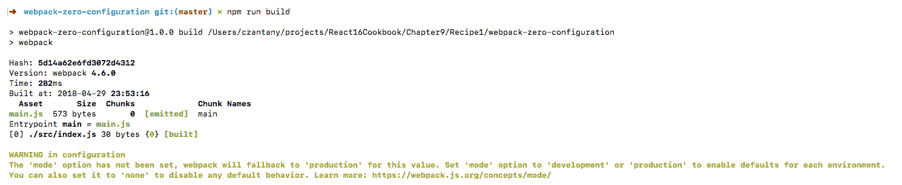

The warning let us know that we can choose the mode between production or development

6.  终端中有一条警告消息：`mode`选项尚未设置，webpack 将为此值返回生产。将`mode`设置为`development`或`production`为每个环境启用默认值。您还可以将其设置为`none`以禁用任何默认行为。你可以在 https://webpack.js.org/concepts/mode/ *。*默认情况下，生产模式处于启用状态，这就是为什么我们的捆绑包（`dist/main.js`被缩小和模糊化的原因，如下所示：

```jsx
    !function(e){var n={};function r(t){if(n[t])return n[t].exports;var o=n[t]={i:t,l:!1,exports:{}};return e[t].call(o.exports,o,o.exports,r),o.l=!0,o.exports}r.m=e,r.c=n,r.d=function(e,n,t){r.o(e,n)||Object.defineProperty(e,n,{configurable:!1,enumerable:!0,get:t})},r.r=function(e){Object.defineProperty(e,"__esModule",{value:!0})},r.n=function(e){var n=e&&e.__esModule?function(){return e.default}:function(){return e};return r.d(n,"a",n),n},r.o=function(e,n){return Object.prototype.hasOwnProperty.call(e,n)},r.p="",r(r.s=0)}([function(e,n){console.log("Index file...")}]);
```

File: dist/main.js

# 它是如何工作的。。。

Webpack4 有两种模式：生产和开发。在 Webpack3 中，您需要为每个文件创建一个配置文件；现在你只需要一行就可以得到同样的结果。让我们添加一个脚本，让应用开始使用开发模式：

```jsx
  {
    "name": "webpack-zero-configuration",
    "version": "1.0.0",
    "description": "Webpack 4 Zero Configuration",
    "main": "index.js",
    "scripts": {
      "build-development": "webpack --mode development",
      "build": "webpack --mode production"
    },
    "author": "Carlos Santana",
    "license": "MIT",
    "devDependencies": {
      "webpack": "^4.6.0",
      "webpack-cli": "^2.0.15"
    }
  }
```

File: package.json

如果您运行`npm run build-development`命令，现在您将看到捆绑包根本没有被压缩：


File: dist/main.js

正如您所看到的，默认情况下，Webpack 4 使用 production 缩小代码并为此环境执行一些优化，在 Webpack 3 中，此配置必须在配置文件中手动完成

# 还有更多。。。

如果您想用 Webpack 4 实现 Babel 来传输 ES6 代码，您需要使用`babel-loader`，您可能需要安装以下软件包：

```jsx
npm install --save-dev babel-loader babel-core babel-preset-env
```

1.  在项目的根目录下创建.babelrc 文件，然后添加以下代码：

```jsx
    {
      "presets": ["env"]
    }
```

File: .babelrc

2.  使用`webpack.config.js`文件添加我们的`babel-loader`：

```jsx
  const webpackConfig = {
    module: {
      rules: [
        {
          test: /\.js$/,
          exclude: /node_modules/,
          use: 'babel-loader'
        }
      ]
    }
  };

  module.exports = webpackConfig;
```

File: webpack.config.js

3.  创建一个名为`src/numbers.js`的文件，并将其导入我们的`src/index.js`以测试我们的`babel-loader`：

```jsx
    export const numbers = ['one', 'two', 'three'];
```

File: src/numbers.js

4.  在我们的`index.js`文件中，执行以下操作：

```jsx
  import { numbers } from './numbers';
  numbers.forEach(number => console.log(number));
```

File: src/index.js

5.  运行`npm run build`脚本，如果一切正常，应该会得到以下结果：


6.  也可以在终端中直接使用`babel-loader`而无需配置文件，为此，我们需要使用`--module-bind`标志将扩展绑定到加载程序：

```jsx
  {
    "name": "webpack-zero-configuration",
    "version": "1.0.0",
    "description": "Webpack 4 Zero Configuration",
    "main": "index.js",
    "scripts": {
      "build-development": "webpack --mode development --module-bind 
     js=babel-loader",
      "build": "webpack --mode production --module-bind js=babel-
       loader"
    },
    "author": "Carlos Santana",
    "license": "MIT",
    "devDependencies": {
      "babel-core": "^6.26.3",
      "babel-loader": "^7.1.4",
      "babel-preset-env": "^1.6.1",
      "webpack": "^4.6.0",
      "webpack-cli": "^2.0.15"
    }
  }
```

7.  有更多的标志用于绑定模块（如果您想了解更多关于 Webpack CLI 的信息，可以访问官方网站[https://webpack.js.org/api/cli/](https://webpack.js.org/api/cli/) ：
    *   `--module-bind-post`：将扩展绑定到后期加载程序
    *   `--module-bind-pre`：将扩展绑定到预加载程序

# 将 React 添加到网页 4

在此配方中，我们将使用 Webpack4 实现 React，但我们将使用名为`html-webpack-plugin`的插件生成`index.html`文件来呈现 React 应用。在下一步中，我们将集成 Node.js，以便在呈现 HTML 代码之前在服务器端具有更大的灵活性。

# 准备

对于此配方，您需要安装以下软件包：

```jsx
    npm install react react-dom babel-preset-react
```

# 怎么做。。。

以下是将 React 添加到 Webpack 4 的步骤：

1.  使用上一个配方的相同代码，创建一个`.babelrc`文件并添加一些预设：

```jsx
  {
    "presets": [
      "env",
      "react"
    ]
  }
```

File: .babelrc

2.  在我们的`webpack.config.js`文件中，我们有`babel-loader`，我们需要在`.js`扩展名旁边添加`.jsx`扩展名，以便能够将`babel-loader`应用于我们的组件：

```jsx
  const webpackConfig = {
    module: {
      rules: [
        {
          test: /\.(js|jsx)$/,
          exclude: /node_modules/,
          use: 'babel-loader'
        }
      ]
    }
  };

  module.exports = webpackConfig;
```

File: webpack.config.js

3.  在我们将`.jsx`扩展名添加到`babel-loader`之后，我们需要创建`src/components/App.jsx`文件：

```jsx
  // Dependencies
  import React from 'react';

  // Components
  import Home from './Home';

  const App = props => (
    <div>
      <Home />
    </div>
  );

  export default App;
```

File: src/components/App.jsx

4.  创建`Home`组件：

```jsx
  import React from 'react';

  const Home = () => <h1>Home</h1>;

  export default Home;
```

File: src/components/Home/index.jsx

5.  在我们的主`index.js`文件中，我们需要包括`react`、`react-dom`中的`render`方法和我们的`App`组件，并呈现应用：

```jsx
  // Dependencies
  import React from 'react';
  import { render } from 'react-dom';

  // Components
  import App from './components/App';

  render(<App />, document.querySelector('#root'));
```

File: src/index.jsx

6.  您可能想知道`#root`div 在哪里，因为我们还没有创建`index.html`。在这个特定的配方中，我们将使用`html-webpack-plugin`插件来处理我们的 HTML：

```jsx
    npm install --save-dev html-webpack-plugin
```

7.  打开你的`webpack.config.js`文件。我们需要添加我们的`html-webpack-plugin`并在配置文件中创建一个插件节点：

```jsx
  const HtmlWebPackPlugin = require('html-webpack-plugin');

  const webpackConfig = {
    module: {
      rules: [
        {
          test: /\.(js|jsx)$/,
          exclude: /node_modules/,
          use: 'babel-loader'
        }
      ]
    },
    plugins: [
      new HtmlWebPackPlugin({
        title: 'Codejobs',
        template: './src/index.html',
        filename: './index.html'
      })
    ]
  };

  module.exports = webpackConfig;
```

File: webpack.config.js

8.  在`src`目录级别创建`index.html`模板：

```jsx
  <!DOCTYPE html>
  <html>
    <head>
      <meta charset="UTF-8">
      <title><%= htmlWebpackPlugin.options.title %></title>
    </head>
    <body>
      <div id="root"></div>
    </body>
  </html>
```

File: src/index.html

# 它是如何工作的。。。

如您所见，我们可以使用`<%=`和`%>`分隔符之间的`htmlWebpackPlugin.options`对象从插件中注入变量。现在是时候测试我们的应用了，试着运行`npm run build`命令：

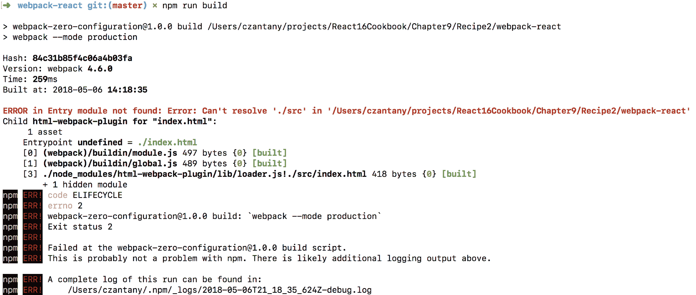

**红色大错误：**无法解析`./src`目录，但这是什么意思？你还记得我们是如何在文件中使用`.jsx`扩展名的吗？甚至我们在`babel-loader`规则中添加了这个扩展，那么为什么它不起作用呢？这是因为我们必须在配置中添加解析节点，并指定要支持的文件扩展名。否则，我们只能使用`.js`扩展：

```jsx
  const HtmlWebPackPlugin = require('html-webpack-plugin');

  const webpackConfig = {
    module: {
      rules: [
        {
          test: /\.(js|jsx)$/,
          exclude: /node_modules/,
          use: 'babel-loader'
        }
      ]
    },
    plugins: [
      new HtmlWebPackPlugin({
        title: 'Codejobs',
        template: './src/index.html',
        filename: './index.html'
      })
    ],
    resolve: {
      extensions: ['.js', '.jsx']
    }
  };

 module.exports = webpackConfig;
```

File: webpack.config.js

如果您再次运行`npm run build`，现在应该可以工作了：


运行该命令后，您将看到 dist 目录中有两个文件：`index.html`和`main.js`。如果你用 Chrome 打开你的`index.html`文件，你会看到以下结果：


我们可以构建捆绑包，但它是 100%静态的。在下一个配方中，我们将添加 Webpack Dev Server，以便在实际服务器中运行 React 应用，并在每次进行更改时刷新服务器。

# 还有更多。。。

我更喜欢在我的所有项目中使用 ES6 代码，甚至在配置中，我喜欢将我的网页配置分解为单独的文件，以便更好地组织和更容易地理解配置。如果您以前使用过 Webpack，那么您知道`webpack.config.js`文件可能非常大，并且很难维护，因此让我解释一下如何做到这一点：

1.  将`webpack.config.js`文件重命名为`webpack.config.babel.js`。当您在`.js`文件上添加`.babel`后缀时，这将由巴贝尔自动处理。
2.  让我们将当前的 ES5 代码迁移到 ES6：

```jsx
  import HtmlWebPackPlugin from 'html-webpack-plugin';

  export default {
    module: {
      rules: [
        {
          test: /\.(js|jsx)$/,
          exclude: /node_modules/,
          use: 'babel-loader'
        }
      ]
    },
    plugins: [
      new HtmlWebPackPlugin({
        title: 'Codejobs',
        template: './src/index.html',
        filename: './index.html'
      })
    ],
    resolve: {
      extensions: ['.js', '.jsx']
    }
  };
```

File: webpack.config.babel.js

3.  创建一个名为`webpack`的文件夹，在另一个文件夹中创建一个名为`configuration`的文件夹。
4.  为我们的 Web 包配置的每个节点创建一个单独的文件并将其导出。例如，我们首先为节点模块创建一个文件，因此您应该调用`module.js`：

```jsx
  export default {
    rules: [
      {
        test: /\.(js|jsx)$/,
        exclude: /node_modules/,
        use: 'babel-loader'
      }
    ]
  };
```

File: webpack/configuration/module.js

5.  让我们为我们的插件创建一个文件（`plugins.js`：

```jsx
  import HtmlWebPackPlugin from 'html-webpack-plugin';

 const plugins = [
    new HtmlWebPackPlugin({
      title: 'Codejobs',
      template: './src/index.html',
      filename: './index.html'
    })
  ];

  export default plugins;
```

File: webpack/configuration/plugins.js

6.  将我们的插件数组添加到一个常量中是非常有用的，因为这样我们就可以根据环境（开发或生产）添加更多插件，所以现在您可以有条件地添加插件（使用 push）。
7.  最后一个节点是 resolve：

```jsx
  export default {
    extensions: ['.js', '.jsx']
  }
```

File: webpack/configuration/resolve.js

8.  我们可以直接导入文件，但我更喜欢使用`index.js`文件并导出所有文件。这样，我们只需将需要的对象导入我们的`webpack.config.babel.js`文件：

```jsx
 // Configuration
  import module from './module';
  import plugins from './plugins';
  import resolve from './resolve';

  export {
    module,
    plugins,
    resolve
  };
```

File: webpack/configuration/index.js

9.  我们的`webpack.config.babel.js`将非常干净：

```jsx
  import {
    module,
    plugins,
    resolve
  } from './webpack/configuration';

  export default {
    module,
    plugins,
    resolve
  };
```

File: webpack.config.babel.js

# 使用 React 添加 Webpack 开发服务器和 Sass、手写笔或 LESSCS

在上一个配方中，我们将 React 添加到 Webpack 4，并拆分了我们的 Webpack 配置，但最终，我们只能构建捆绑包并将应用作为静态页面运行。在此配方中，我们将添加 Webpack Dev 服务器，以便在实际服务器中运行 React 应用，并在每次进行更改时重新启动服务器。此外，我们还将实现 CSS 预处理器，如 Sass、Stylus 和 LessCSS。

# 准备

对于此配方，您需要安装以下软件包：

```jsx
    npm install webpack-dev-server css-loader extract-text-webpack-plugin@v4.0.0-beta.0 style-loader
```

如果要在项目中使用 Sass，必须安装：

```jsx
    npm install sass-loader node-sass 
```

如果您更喜欢触控笔，则需要以下各项：

```jsx
    npm install stylus-loader stylus
```

或者，如果您喜欢 LESSCS，请安装此：

```jsx
    npm install less-loader less
```

# 怎么做。。。

我们将首先添加 Web 包开发服务器：

1.  一旦您安装了`webpack-dev-server`依赖项，我们需要在`package.json`中添加一个新脚本来启动应用：

```jsx
    "scripts": {
      "start": "webpack-dev-server --mode development --open",
      "build-development": "webpack --mode development",
      "build": "webpack --mode production"
    }
```

File: package.json

2.  正如您所知，`--mode`标志指定了我们想要的模式（默认为生产模式），`--open`标志在启动应用时打开浏览器。现在您可以使用`npm start`命令运行应用：


3.  您的应用是使用端口 8080 打开的，该端口是`webpack-dev-server`的默认端口。如果要更改，可以使用`--port`标志指定要使用的端口：

```jsx
"start": "webpack-dev-server --mode development --open --port 9999"
```

4.  `webpack-dev-server`最酷的一点是，如果你更新任何组件，你都会看到即时反映的变化。例如，让我们修改`Home`组件：

```jsx
  import React from 'react';

  const Home = () => <h1>Updated Home</h1>;

  export default Home;
```

File: src/components/Home/index.jsx

5.  您可以在同一页面中看到反映的更改，而无需手动刷新页面：


6.  让我们将 Sass、Stylus 或 lesscs 添加到项目中，以便在应用中使用一些样式。您必须编辑位于`webpack/configuration/module.js`的文件，并添加`style-loader`、`css-loader`以及我们想要用于 sass（`sass-loader`）、手写笔（`stylus-loader`）或更少（`less-loader`）的加载程序：

```jsx
  export default {
    rules: [
      {
        test: /\.(js|jsx)$/,
        exclude: /node_modules/,
        use: 'babel-loader'
      },
      {
        test: /\.scss$/, // Can be: .scss or .styl or .less
        use: [
          {
            loader: 'style-loader'
          },
          {
            loader: 'css-loader',
            options: {
              // Enables CSS Modules
              modules: true, 
              // Number of loaders applied before CSS loader
              importLoaders: 1, 
              // Formatting CSS Class name
              localIdentName: '[name]_[local]_[hash:base64]', // Enable/disable sourcemaps
              sourceMap: true, 
              // Enable/disable minification
              minimize: true 
            }
          },
          {
            loader: 'sass-loader' // sass-loader or stylus-loader
                                  // or less-loader
          }
        ]
      }
    ]
  };
```

File: webpack/configuration/module.js

7.  使用 Sass，我们可以创建 Home.scss 文件来添加一些样式：

```jsx
  $color: red;
  .Home {
    color: $color;
  }
```

File: src/components/Home/Home.scss

8.  在 Home 组件中，可以按如下方式导入 Sass 文件：

```jsx
  import React from 'react';
  import styles from './Home.scss'; // For Sass
  // import styles from './Home.styl'; // For Stylus
  // import styles from './Home.less'; // For Less

  const Home = () => <h1 className={styles.Home}>Updated Home</h1>;

 export default Home;
```

File: src/component/Home/index.jsx

9.  每个导入行用于不同的预处理器。使用您想要的线路并删除其他线路。Sass 生成此样式：

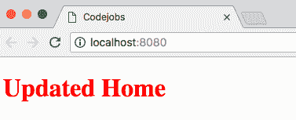

10.  如果要使用手写笔，请创建`Home.styl`文件，并从网页配置更改`module.js`文件中的配置：

```jsx
  $color = green

  .Home
    color: $color
```

File: src/components/Home/Home.styl

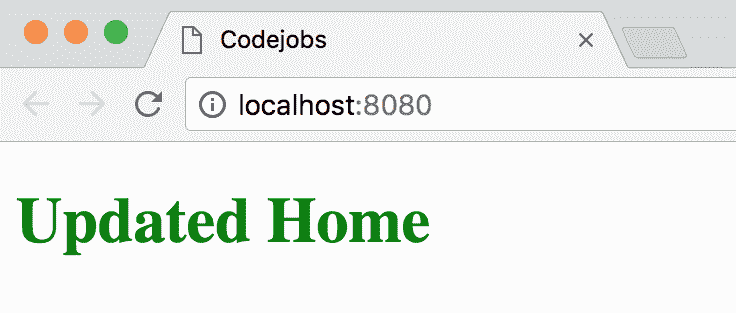

11.  如果要使用较少的 CSS，请对 Webpack 配置进行必要的更改，然后使用此文件：

```jsx
 @color: blue;

 .Home {
    color: @color;
  }
```

File: src/components/Home/Home.less

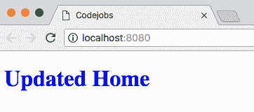

# 它是如何工作的。。。

如果您好奇的话，您可能已经尝试过查看它是如何呈现样式表的，以及类名在 HTML 中是如何呈现的。如果您检查该站点，您将看到如下内容：

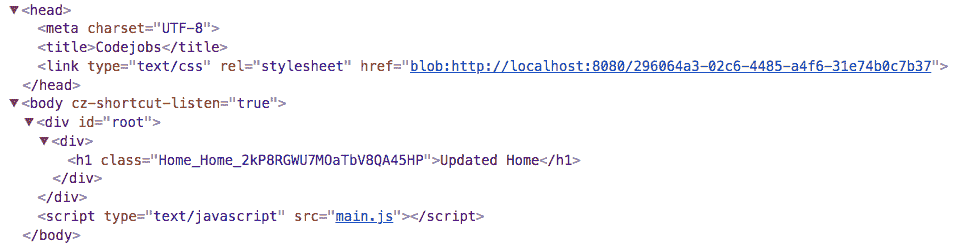

动态地注入一个带有临时 URL 的`<link>`标记，该 URL 包含我们编译的 css，然后我们的类名是“Home\u Home\u 2kP…”，这是因为我们的配置：`localIdentName: '[name]_[local]_[hash:base64]'`。这样，我们就创建了独立的样式，这意味着如果我们使用相同的名称，我们将永远不会影响任何其他类

# 还有更多。。。

让我们实现 CSS 预处理器，如 Sass、Stylus 和 LessCSS：

1.  如果您想将 CSS 代码提取到一个`style.css`文件并压缩用于生产模式的代码，您可以使用`extract-text-webpack-plugin`包：

```jsx
   npm install extract-text-webpack-plugin@v4.0.0-beta.0
```

2.  我们需要将此添加到我们的 Webpack 插件中：

```jsx
  import HtmlWebPackPlugin from 'html-webpack-plugin';
  import ExtractTextPlugin from 'extract-text-webpack-plugin';

  const isProduction = process.env.NODE_ENV === 'production';

  const plugins = [
    new HtmlWebPackPlugin({
      title: 'Codejobs',
      template: './src/index.html',
      filename: './index.html'
    })
  ];

  if (isProduction) {
    plugins.push(
      new ExtractTextPlugin({
        allChunks: true,
        filename: './css/[name].css'
      })
    );
  }

 export default plugins;
```

File: webpack/configuration/plugins.js

3.  正如您所看到的，只有在生产环境下，我才会使用插件阵列。这意味着我们需要在 package.json 中创建一个新脚本，以指定何时使用生产：

```jsx
    "scripts": {
      "start": "webpack-dev-server --mode development --open",
      "start-production": "NODE_ENV=production webpack-dev-server --
      mode production",
      "build-development": "webpack --mode development",
      "build": "webpack --mode production"
    }
```

4.  在终端中运行`npm run start-production`，您将能够以生产模式启动。
5.  您可能会遇到一些错误，因为我们还需要将提取文本插件的规则添加到模块节点：

```jsx
  import ExtractTextPlugin from 'extract-text-webpack-plugin';

  const isProduction = process.env.NODE_ENV === 'production';

  const rules = [
    {
      test: /\.(js|jsx)$/,
      exclude: /node_modules/,
      use: 'babel-loader'
    }
  ];

  if (isProduction) {
    rules.push({
      test: /\.scss/,
      use: ExtractTextPlugin.extract({
        fallback: 'style-loader',
        use: [
          'css-loader?minimize=true&modules=true&localIdentName=
          [name]_[local]_[hash:base64]',
          'sass-loader'
        ]
      })
    });
  } else {
    rules.push({
      test: /\.scss$/, // .scss - .styl - .less
      use: [
        {
          loader: 'style-loader'
        },
        {
          loader: 'css-loader',
          options: {
            modules: true,
            importLoaders: 1,
            localIdentName: '[name]_[local]_[hash:base64]',
            sourceMap: true,
            minimize: true
          }
        },
        {
          loader: 'sass-loader' // sass-loader, stylus-loader or 
                                //less-loader
        }
      ]
    });
  }

  export default {
    rules
  };
```

6.  我们使用提取文本插件只是为了生产。对于任何其他环境，我们都像以前一样直接使用`style-loader`、`css-loader`和`sass-loader`。这就是为什么我喜欢将 Webpack 配置拆分成更小的文件，正如您所看到的，有些文件可能很大，因此这有助于我们更有序地组织。如果您使用`npm run start-production`启动生产模式，您将看到以下 CSS：


# Webpack 4 优化-拆分捆绑包

Webpack4 已经对生产模式进行了一些优化预设，例如代码缩小（在使用 UglifyJS 之前），但是我们可以使用更多的东西来提高应用的性能。在本教程中，我们将学习如何拆分捆绑包（供应商和应用捆绑包），添加源映射，并实现*BundleAnalyzerPlugin*。

# 准备

对于此配方，我们需要安装以下软件包：

```jsx
npm install webpack-bundle-analyzer webpack-notifier
```

# 怎么做。。。

让我们将源地图添加到我们的网页：

1.  创建`webpack/configuration/devtool.js`文件：

```jsx
  const isProduction = process.env.NODE_ENV === 'production';

  export default !isProduction ? 'cheap-module-source-map' : 'eval';
```

File: webpack/configuration/devtool.js

2.  拆分捆绑包（使用新的“优化”Webpack 节点）：一个用于我们的`/node_modules/`，这将是最大的捆绑包，另一个用于我们的 React 应用。您需要创建`optimization.js`文件并添加以下代码：

```jsx
 export default {
    splitChunks: {
      cacheGroups: {
        default: false,
        commons: {
          test: /node_modules/,
          name: 'vendor',
          chunks: 'all'
        }
      }
    }
  }
```

File: webpack/configuration/optimization.js

3.  请记住，您需要将这些新文件添加到`index.js`中：

```jsx
  // Configuration
  import devtool from './devtool';
  import module from './module';
  import optimization from './optimization';
  import plugins from './plugins';
  import resolve from './resolve';

  export {
    devtool,
    module,
    optimization,
    plugins,
    resolve
  };
```

File: webpack/configuration/index.js

4.  将节点添加到`webpack.config.babel.js`：

```jsx
  import {
    devtool,
    module,
    optimization,
    plugins,
    resolve
  } from './webpack/configuration';

  export default {
    devtool,
    module,
    plugins,
    optimization,
    resolve
  };
```

File: webpack.config.babel.js

# 它是如何工作的。。。

让我们测试一下：

1.  只需使用`npm start`运行应用。如果您查看 HTML，您将看到它正在自动注入到`vendor.js`和`main.js`捆绑包中：


2.  如果查看“网络”选项卡，可以看到文件的大小：


3.  如果以生产模式运行应用，您会注意到捆绑包更小。运行`npm run start-production`命令：


4.  通过此优化，我们将捆绑大小减少了 40%。在下一个配方中，我们将使用 Webpack 和 React 实现 Node.js，我们将能够应用 GZip 压缩，这将帮助我们进一步减少包的大小。
5.  `BundleAnalyzer`插件可以帮助我们查看所有的包（`node_modules`和我们的组件大小；这将给我们一个按大小组织束的图像（大正方形表示大尺寸，小正方形表示小尺寸）。我们还可以实现`WebpackNotifierPlugin`插件，这只是一个通知，我们可以在每次网页生成时显示：

```jsx
  import HtmlWebPackPlugin from 'html-webpack-plugin';
  import ExtractTextPlugin from 'extract-text-webpack-plugin';
  import WebpackNotifierPlugin from 'webpack-notifier';
 import { BundleAnalyzerPlugin } from 'webpack-bundle-analyzer';

  const isProduction = process.env.NODE_ENV === 'production';

  const plugins = [
    new HtmlWebPackPlugin({
      title: 'Codejobs',
      template: './src/index.html',
      filename: './index.html'
    })
  ];

  if (isProduction) {
    plugins.push(
      new ExtractTextPlugin({
        allChunks: true,
        filename: './css/[name].css'
      })
    );
  } else {
    plugins.push(
      new BundleAnalyzerPlugin(),
 new WebpackNotifierPlugin({
 title: 'CodeJobs'
 })
    );
  }

 export default plugins;
```

File: webpack/configuration/plugins.js

6.  `BundleAnalyzerPlugin`仅在开发模式下执行；如果启动应用（`npm start`，您将看到一个新页面打开，并显示所有已安装的软件包，并指定每个软件包的大小：

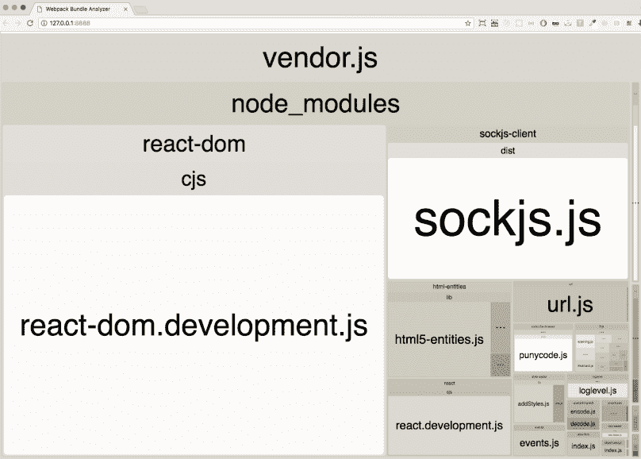

The purpose of this image is to show the sizes of the installed packages

7.  当然，最大的是 vendor.js 文件，但我们也可以看到我们的主要.js 组件：

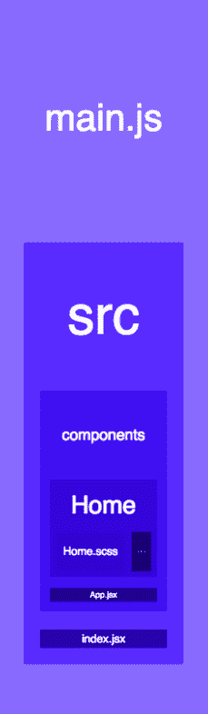

8.  启动应用时，您可以看到奇特的通知：


# 使用 React/Redux 和 Webpack 4 实现 Node.js

到目前为止，在所有配方中，我们都使用了直接与`create-react-app`或网页 4 反应。在这个配方中，我们将使用 Node.js 和 webpack4 实现 React 和 Redux；这将有助于我们拥有更强大的应用。

# 准备

使用上一个配方的相同代码，您将需要安装以下所有软件包：

```jsx
npm install babel-cli express nodemon react-hot-loader react-router-dom webpack-hot-middleware compression-webpack-plugin react-redux redux
```

# 怎么做。。。

让我们从实现开始：

1.  在我们的`.babelrc`文件中包含`react-hot-loader`插件，仅用于开发环境：

```jsx
  {
    "presets": ["env", "react"],
    "env": {
      "development": {
        "plugins": [
          "react-hot-loader/babel"
        ]
      }
    }
  }
```

File: .babelrc

2.  创建 Express 服务器；您需要在`src/server/index.js`处创建一个文件：

```jsx
  // Dependencies
  import express from 'express';
  import path from 'path';
  import webpackDevMiddleware from 'webpack-dev-middleware';
  import webpackHotMiddleware from 'webpack-hot-middleware';
  import webpack from 'webpack';

  // Webpack Configuration
  import webpackConfig from '../../webpack.config.babel';

  // Client Render
  import clientRender from './render/clientRender';

 // Utils
  import { isMobile } from '../shared/utils/device';

  // Environment
  const isProduction = process.env.NODE_ENV === 'production';

  // Express Application
  const app = express();

  // Webpack Compiler
  const compiler = webpack(webpackConfig);

  // Webpack Middleware
  if (!isProduction) {
    // Hot Module Replacement
    app.use(webpackDevMiddleware(compiler));
    app.use(webpackHotMiddleware(compiler));
  } else {
    // Public directory
    app.use(express.static(path.join(__dirname, '../../public')));

    // GZip Compression just for Production
    app.get('*.js', (req, res, next) => {
      req.url = `${req.url}.gz`;
      res.set('Content-Encoding', 'gzip');
      next();
    });
  }

  // Device Detection
  app.use((req, res, next) => {
    req.isMobile = isMobile(req.headers['user-agent']);
    next();
  });

  // Client Side Rendering
  app.use(clientRender());

  // Disabling x-powered-by
  app.disable('x-powered-by');

  // Listen Port 3000...
  app.listen(3000);
```

File: src/server/index.js

3.  我们在`initialState`中为 Redux 添加了一个 Node.js 设备检测。我们可以为此目的创建此 util 文件：

```jsx
  export function getCurrentDevice(ua) {
    return /mobile/i.test(ua) ? 'mobile' : 'desktop';
  }
  export function isDesktop(ua) {
    return !/mobile/i.test(ua);
  }
  export function isMobile(ua) {
    return /mobile/i.test(ua);
  }
```

File: src/shared/utils/device.js

4.  您还需要设备减速器：

```jsx
  export default function deviceReducer(state = {}) {
    return state;
  }
```

File: src/shared/reducers/deviceReducer.js

5.  我们需要在我们的减速机文件夹中创建`index.js`，在我们要合并减速机的地方：

```jsx
  // Dependencies
  import { combineReducers } from 'redux';

  // Shared Reducers
  import device from './deviceReducer';

  const rootReducer = combineReducers({
    device
  });

 export default rootReducer;
```

File: src/shared/reducers/index.js

6.  让我们创建 initialState 文件。这是我们从`req`对象获取设备信息的地方：

```jsx
  export default req => ({
    device: {
      isMobile: req.isMobile
    }
  });
```

7.  Redux 需要一个商店来保存我们所有的减速机和我们的`initialState`；这将是我们的`configureStore`：

```jsx
 // Dependencies
  import { createStore } from 'redux';

  // Root Reducer
  import rootReducer from '../reducers';

 export default function configureStore(initialState) {
    return createStore(
      rootReducer,
      initialState
    );
  }
```

File: src/shared/redux/configureStore.js

8.  在上一个配方中，我们使用`html-webpack-plugin`包呈现初始 HTML 模板；现在我们必须在 Node 中执行此操作。为此，您需要创建`src/server/render/html.js`文件：

```jsx
 // Dependencies
  import serialize from 'serialize-javascript';

  // Environment
  const isProduction = process.env.NODE_ENV === 'production';

  export default function html(options) {
    const { title, initialState } = options;
    let path = '/';
    let link = '';

    if (isProduction) {
      path = '/app/';
      link = `<link rel="stylesheet" href="${path}css/main.css" />`;
    }

    return `
      <!DOCTYPE html>
      <html>
        <head>
          <meta charset="utf-8">
          <title>${title}</title>
          ${link}
        </head>
        <body>
          <div id="root"></div>

          <script>
            window.initialState = ${serialize(initialState)};
          </script>
          <script src="${path}vendor.js"></script>
          <script src="${path}main.js"></script>
        </body>
      </html>
    `;
  }
```

File: src/server/render/html.js

9.  创建一个函数来呈现 HTML；我称之为`clientRender.js`文件：

```jsx
 // HTML
  import html from './html';

 // Initial State
  import initialState from './initialState';

  export default function clientRender() {
    return (req, res) => res.send(html({
      title: 'Codejobs',
      initialState: initialState(req)
    }));
  }
```

File: src/server/render/clientRender.js

10.  创建服务器文件后，需要为客户端添加主条目文件。在这个文件中，我们将把我们的主`App`组件包装在 React Hot Loader 应用容器中：

```jsx
  // Dependencies
  import React from 'react';
  import { render } from 'react-dom';
  import { Provider } from 'react-redux';
  import { AppContainer } from 'react-hot-loader';

 // Redux Store
  import configureStore from './shared/redux/configureStore';

  // Components
  import App from './client/App';

  // Configuring Redux Store
  const store = configureStore(window.initialState);

  // Root element
  const rootElement = document.querySelector('#root');

  // App Wrapper
  const renderApp = Component => {
    render(
      <AppContainer>
        <Provider store={store}>
          <Component />
        </Provider>
      </AppContainer>,
      rootElement
    );
  };

  // Rendering app
  renderApp(App);

  // Hot Module Replacement
  if (module.hot) {
    module.hot.accept('./client/App', () => {
      renderApp(require('./client/App').default);
    });
  }
```

File: src/index.jsx

11.  让我们为客户端文件创建一个目录。我们需要创建的第一个文件是`App.jsx`，我们将在其中包括组件的路由：

```jsx
  // Dependencies
  import React from 'react';
  import { BrowserRouter, Switch, Route } from 'react-router-dom';

  // Components
  import About from './components/About';
  import Home from './components/Home';

  const App = () => (
    <BrowserRouter>
      <Switch>
        <Route exact path="/" component={Home} />
        <Route exact path="/about" component={About} />
      </Switch>
    </BrowserRouter>
  );

  export default App;
```

File: src/client/App.jsx

12.  为了测试我们的路由和 Redux 状态（`isMobile`，让我们创建`About`组件：

```jsx
  import React from 'react';
  import { bool } from 'prop-types';
  import { connect } from 'react-redux';
  import styles from './About.scss';

  const About = ({ isMobile }) => (
    <h1 className={styles.About}>About - {isMobile ? 'mobile' : 'desktop'}</h1>
  );

  About.propTypes = {
    isMobile: bool
  };

 export default connect(({ device }) => ({
    isMobile: device.isMobile
  }))(About);
```

File: src/client/components/About/index.jsx

13.  为该组件添加基本样式：

```jsx
  $color: green;

  .About {
    color: $color;
  }
```

File: src/client/components/About/About.scss

14.  当我们想在每次更改时使用 React 热加载程序刷新页面时，我们需要为我们的`webpack-hot-middleware`和`react-hot-loader`添加一个条目以连接到**HMR**（**热模块更换**：

```jsx
  const isProduction = process.env.NODE_ENV === 'production';
  const entry = [];

  if (!isProduction) {
    entry.push(
      'webpack-hot-middleware/client?
       path=http://localhost:3000/__webpack_hmr&reload=true',
      'react-hot-loader/patch',
      './src/index.jsx'
    );
  } else {
    entry.push('./src/index.jsx');
  }

  export default entry;
```

File: webpack/configuration/entry.js

15.  创建`output.js`文件以指定我们的网页应保存文件的位置：

```jsx
 // Dependencies
  import path from 'path';

  export default {
    filename: '[name].js',
    path: path.resolve(__dirname, '../../public/app'),
    publicPath: '/'
  };
```

16.  您需要将这些文件导入我们的`index.js`：

```jsx
  // Configuration
  import devtool from './devtool';
  import entry from './entry';
 import mode from './mode';
  import module from './module';
  import optimization from './optimization';
  import output from './output';
  import plugins from './plugins';
  import resolve from './resolve';

  export {
    devtool,
 entry,
 mode,
    module,
    optimization,
    output,
    plugins,
    resolve
  };
```

File: webpack/configuration/index.js

17.  我们还需要创建一个`mode.js`文件，并从我们的 JS 文件处理环境模式，因为我们将更改我们的开始脚本，我们将不再直接指定模式：

```jsx
  const isProduction = process.env.NODE_ENV === 'production';

  export default !isProduction ? 'development' : 'production';
```

File: webpack/configuration/mode.js

18.  将`HotModuleReplacementPlugin`添加到我们的插件文件中用于开发，`CompressionPlugin`用于生产：

```jsx
  import ExtractTextPlugin from 'extract-text-webpack-plugin';
  import WebpackNotifierPlugin from 'webpack-notifier';
  import { BundleAnalyzerPlugin } from 'webpack-bundle-analyzer';
  import CompressionPlugin from 'compression-webpack-plugin';
  import webpack from 'webpack';
  const isProduction = process.env.NODE_ENV === 'production';
  const plugins = [];
  if (isProduction) {
    plugins.push(
      new ExtractTextPlugin({
        allChunks: true,
        filename: './css/[name].css'
      }),
      new CompressionPlugin({
        asset: '[path].gz[query]',
        algorithm: 'gzip',
        test: /\.js$/,
        threshold: 10240,
        minRatio: 0.8
      })
    );
  } else {
    plugins.push(
      new webpack.HotModuleReplacementPlugin(),
      new BundleAnalyzerPlugin(),
      new WebpackNotifierPlugin({
        title: 'CodeJobs'
      })
    );
  }
 export default plugins;
```

File: webpack/configuration/plugins.js

19.  在`package.json`中，新的开始脚本应该如下所示：

```jsx
    "scripts": {
      "build": "NODE_ENV=production webpack",
      "clean": "rm -rf public/app",
      "start": "npm run clean && NODE_ENV=development nodemon src/server --watch src/server --exec babel-node --presets es2015",
      "start-production": "npm run clean && npm run build && NODE_ENV=production babel-node src/server --presets es2015"
    }
```

File: package.json If you use Windows, you have to use the `SET` keyword to specify `NODE_ENV`. For example, `*SET NODE_ENV=development*` or *`SET NODE_ENV=production`* otherwise won't work in your machine.

# 它是如何工作的。。。

现在我们来看看它是如何工作的：

1.  使用`npm start`启动应用。
2.  您应该看到此页面：


3.  如果打开浏览器的控制台，您将看到 HMR 现在已连接：


4.  您可以在`Home`组件中进行更改，以查看内容在不刷新的情况下是如何更新的：


5.  正如您在控制台中看到的，HMR 指定每个正在发生的事件，并为您提供更新的模块。如果打开网络选项卡，您将看到我们的捆绑包的巨大规模（*vendor.js=1MB*和*main.js=46.3KB*：


6.  如果点击`http://localhost:3000/about`URL，您将看到连接了 Redux 状态的`About`组件（`isMobile`：

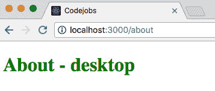

7.  如果要在生产模式下运行应用，请执行`npm run start-production`。如果一切正常，您应该看到相同的站点，但捆绑包较小（vendor.js:262KB-74%和 main.js:5.2KB-88%）：


# 还有更多。。。

我不喜欢在导入中使用相对路径，有时很难计算某些文件的深度。`babel-plugin-module-resolver`包可以帮助我们为目录添加自定义别名。例如：

```jsx
    // Instead of importing like this 
 import { isMobile } from '../../../shared/utils/device';

    // Using module resolver you can use an alias like:
    import { isMobile } from '@utils/device';
```

正如您所看到的，使用别名更为一致，无论您在哪个路径导入 util，都将始终是使用别名的相同路径，这很酷，不是吗？

首先，我们需要安装软件包：

```jsx
    npm install babel-plugin-module-resolver
```

然后在我们的`.babelrc`中，我们可以为我们想要的每个路径添加别名：

```jsx
  {
    "presets": ["env", "react"],
    "env": {
      "development": {
        "plugins": [
          "react-hot-loader/babel"
        ]
      }
    },
    "plugins": [
     ["module-resolver", {
       "root": ["./"],
       "alias": {
         "@App": "./src/client/App.jsx",
         "@client": "./src/client/",
         "@components": "./src/client/components",
         "@configureStore": "./src/shared/redux/configureStore.js",
         "@reducers": "./src/shared/reducers",
         "@server": "./src/server/",
         "@utils": "./src/shared/utils",
         "@webpack": "./webpack.config.babel.js"
       }
     }]
   ],
  }
```

`*@*`字符不是必需的，但我喜欢用它来快速识别我是否使用了别名。现在，您可以修改我们在此配方中创建的一些文件，并用新别名替换路径：

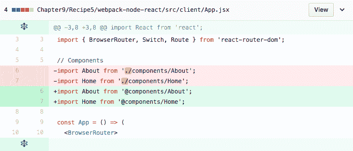

File: src/client/App.jsx


File: src/index.jsx

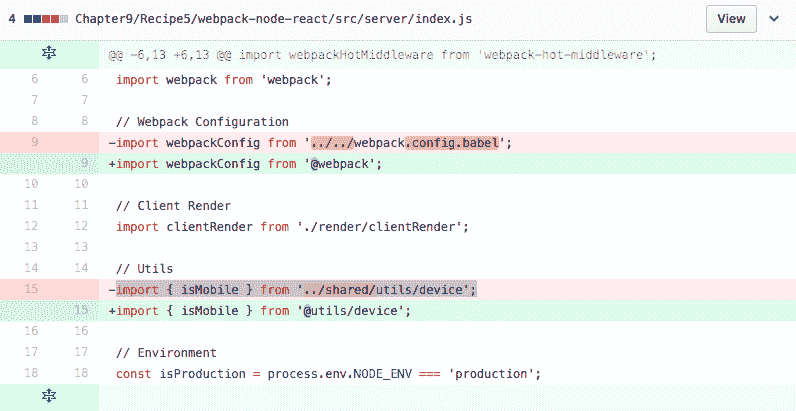

File: src/server/index.js


File: src/shared/redux/configureStore.js