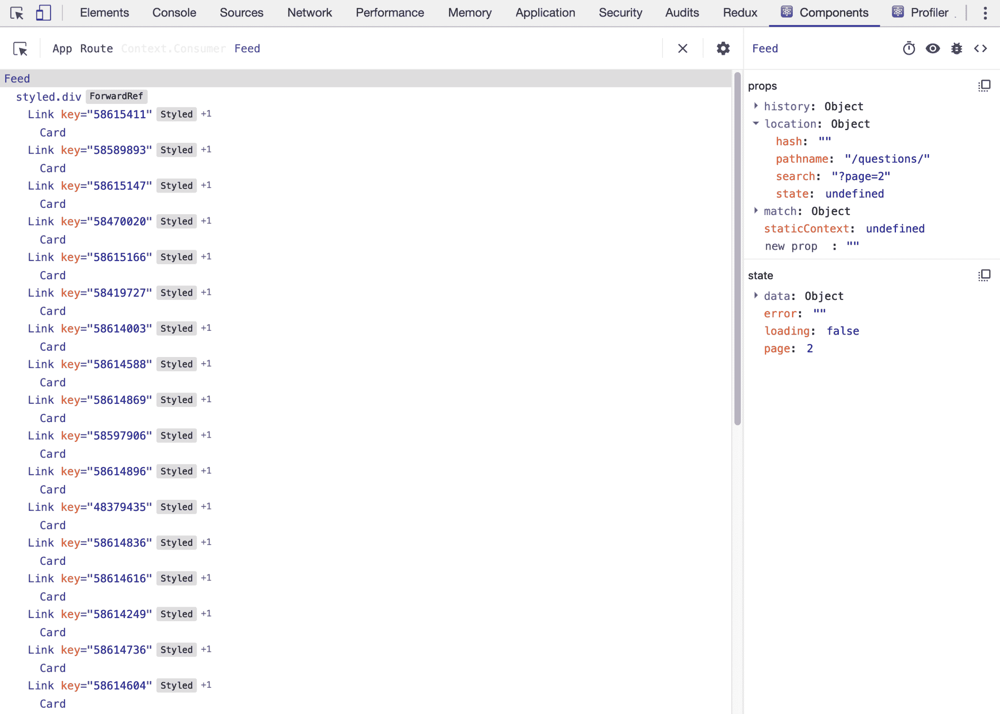

# 四、使用 React 路由构建基于 SSR 的社区订阅

到目前为止，您已经了解了 React 应用通常是**单页应用**（**SPA**），可以用作**渐进式 Web 应用**（**PWA**）。这意味着应用在客户端呈现，当用户访问应用时，将其加载到浏览器中。但是您知道 React 还支持**服务器端呈现**（**SSR**），您可能还记得过去代码仅从服务器呈现时的情形？

在本章中，您将使用`react-router`向 CreateReact 应用添加声明性路由，并从服务器而不是浏览器动态加载组件。为了启用 SSR，React 功能 Suspense 将与`ReactDOMServer`一起使用。如果您对**搜索引擎优化**（**SEO**）感兴趣，本章将使用 React 头盔向页面添加元数据，以便您的应用可以更好地被搜索引擎索引。

本章将介绍以下主题：

*   声明式路由
*   服务器端渲染
*   SEO 中的 React

# 项目概述

在本章中，我们将使用支持 SSR 的`react-router`创建一个带有声明式路由的 PWA，因此它是从服务器而不是浏览器加载的。此外，该应用还针对使用 React 头盔的搜索引擎进行了优化。

构建时间为 2 小时。

# 开始

我们将在本章中创建的项目建立在您可以在 GitHub 上找到的初始版本之上：[https://github.com/PacktPublishing/React-Projects/tree/ch4-initial](https://github.com/PacktPublishing/React-Projects/tree/ch4-initial) 。完整的源代码也可以在 GitHub 上找到：[https://github.com/PacktPublishing/React-Projects/tree/ch4](https://github.com/PacktPublishing/React-Projects/tree/ch4) 。此外，该项目使用公开可用的堆栈溢出 API 向应用填充数据。这是通过获取发布到堆栈溢出的问题来完成的。有关此 API 的更多信息，请访问：[https://api.stackexchange.com/docs/questions#order=desc &排序=热&标记=反应 JS&过滤器=默认&站点=堆栈溢出&运行=真](https://api.stackexchange.com/docs/questions#order=desc&sort=hot&tagged=reactjs&filter=default&site=stackoverflow&run=true)。

从 GitHub 下载初始项目后，需要移动到此项目的根目录并运行`npm install`。由于此项目构建在 Create React App 之上，因此运行此命令将安装`react`、`react-dom`和`react-scripts`。此外，`styled-components`用于处理应用中所有组件的样式。安装过程完成后，您可以执行`npm`命令 start，以便能够在`http://localhost:3000`浏览器中访问项目。

由于该项目被设置为 PWA，因此服务人员进行了注册，以便在没有互联网连接的情况下也可以访问该应用。您可以通过先运行`npm run build`，然后在构建过程完成后运行`serve -s build`来检查这一点。现在可以在`http://localhost:5000`处访问应用的构建版本。如前一章所述，您可以通过访问浏览器“开发人员工具”中的“应用”选项卡来检查在没有 internet 连接时应用是否仍然可用。在此选项卡内，您可以在左侧的菜单中找到服务人员；单击此链接后，您可以在显示的页面上选择脱机复选框。

You may see a different application than when you ran the project locally if you've built and served a Create React App PWA before. You can delete any previous application from the browser cache by opening the browser's Developer Tools and open the Application tab where you can click on the Clear site data button on the Clear Storage section.

`http://localhost:3000`提供的初始应用包括一个简单的标题和一个卡片列表，如下面的屏幕截图所示。这些卡片具有标题和元信息，例如查看次数、回答次数以及询问此问题的用户的信息：


如果查看项目的结构，它将使用与您以前创建的项目相同的结构。此应用的入口点是一个名为`src/index.js`的文件，它呈现一个名为`App`的容器组件，其中包含`Header`和`Feed`组件。`Header`组件只显示项目的标题，`Feed`是一个类组件，具有生命周期方法，调用堆栈溢出 API，呈现包含堆栈溢出问题的`Card`组件：

```jsx
community-feed
|-- node_modules
|-- public
    |-- favicon.ico
    |-- index.html
    |-- manifest.json
|-- src
    |-- components
        |-- Header
            |-- Header.js
        |-- Card
            |-- Card.js
        |-- Owner
            |-- Owner.js
    |-- containers
        |-- App.js
        |-- Feed.js
    |-- index.js
    |-- serviceWorker.js
.gitignore
package.json
```

# 社区饲料应用

在本节中，您将构建一个社区订阅应用，该应用使用已启用 SSR 的声明式路由。对于 SEO，将使用一个名为 React 头盔的包。在这个社区订阅中，您可以看到最近有关堆栈溢出的问题的概述，这些问题带有`reactjs`标记，单击它们可以查看更多信息和答案。起点将是使用 Create React App 创建的项目。

# 声明式路由

使用`react-router`包，您可以向 React 应用添加声明性路由，只需添加组件。这些组件可以分为三种类型：路由组件、路由匹配组件和导航组件。

使用`react-router`设置路由包括多个步骤：

1.  要使用这些组件，您需要通过执行以下操作来安装名为`react-router-dom`的`react-router`web 包：

```jsx
npm install react-router-dom
```

2.  安装`react-router-dom`后，下一步是将此包中的路由和路由匹配组件导入作为应用入口点的组件中。在本例中，即`App`组件，位于`src/containers`目录中：

```jsx
import React, { Component } from 'react';
import styled, { createGlobalStyle } from 'styled-components';
+ import { BrowserRouter as Router, Route } from 'react-router-dom';
import Header from '../components/Header/Header';
import Feed from './Feed';

const GlobalStyle = createGlobalStyle`...`;

const AppWrapper = styled.div`...`;

class App extends Component {
    ...
```

3.  实际路由必须添加到此组件的`return`功能中，其中所有路由匹配组件（`Route`必须包装在路由组件`Router`中。当您的 URL 与`Route`的任何迭代中定义的路由匹配时，此组件将呈现添加为`component`道具的 JSX 组件：

```jsx
...
class App extends Component {
  render() {
    return (
        <>
          <GlobalStyle />
          <AppWrapper>
            <Header />
+           <Router>
+             <Route path='/' component={Feed} />
+           </Router>
          </AppWrapper>
        </>
    );
  }
}

export default App;
```

4.  如果您现在在`http://localhost:3000`再次访问浏览器中的项目，`Feed`组件将显示所有问题。此外，如果在浏览器中键入`http://localhost:3000/feed`，则仍将呈现`Feed`组件。这是因为`/`路由匹配所有可能的 URL，因为您没有定义应该进行精确匹配。因此，将`exact`属性添加到`Route`：

```jsx
...
class App extends Component {
  render() {
    return (
        <>
          <GlobalStyle />
          <AppWrapper>
            <Header />
            <Router>
-             <Route path='/' component={Feed} />
+             <Route exact path='/' component={Feed} />
            </Router>
          </AppWrapper>
        </>
    );
  }
}

export default App;
```

现在，如果访问除`/`之外的任何路由，您应该无法看到正在呈现的`Feed`组件。

例如，如果希望这些路由显示特定问题，则需要向路由发送参数。本节下一部分将介绍如何做到这一点。

# 带参数的路由

第一条路由就位后，可以将其他路由添加到路由组件。一个合理的方法是为单个问题提供一个路径，该路径有一个额外的参数，指定应该显示哪个问题。因此，必须创建一个名为`Question`的新容器组件，其中包含从堆栈溢出 API 获取问题的逻辑。当路径匹配`/question/:id`时呈现此组件，其中`id`表示从订阅中单击的问题的 ID：

1.  在`src/containers`目录中新建一个名为`Question`的类组件，并在此文件中添加`constructor`和`render`方法：

```jsx
import React, { Component } from 'react';
import styled from 'styled-components';

const QuestionWrapper = styled.div`
  display: flex;
  justify-content: space-between;
  flex-direction: column;
  margin: 5%;
`;

const Alert = styled.div`
  text-align: center;
`;

class Question extends Component {
  constructor() {
    super();
    this.state = {
      data: [],
      loading: true,
      error: '',
    };
  }

  render() {
    const { data, loading, error } = this.state;

    if (loading || error) {
      return <Alert>{loading ? 'Loading...' : error}</Alert>;
    }

    return (
      <QuestionWrapper></QuestionWrapper>
    );
  }
}

export default Question;
```

2.  要使此路由可用，您需要在`App`组件内导入此组件并为其定义路由：

```jsx
import React, { Component } from 'react';
import styled, { createGlobalStyle } from 'styled-components';
import { BrowserRouter as Router, Route } from 'react-router-dom';
import Header from '../components/Header/Header';
import Feed from './Feed';
+ import Question from './Question';
...
class App extends Component {
  render() {
    return (
        <>
          <GlobalStyle />
          <AppWrapper>
            <Header />
            <Router>
              <Route exact path='/' component={Feed} />
+             <Route path='/questions/:id' component={Question} />
            </Router>
          </AppWrapper>
        </>
    );
  }
}

export default App;
```

如果您现在访问`http://localhost:3000/questions/55366474`，则`Loading...`消息将显示为尚未执行数据提取。`Route`组件向其呈现的组件传递道具，在本例中为`Question`；这些道具分别是`match`、`location`和`history`，打开 React 开发者工具并搜索`Question`组件可以看到这一点，该组件将返回以下结果：


`match`道具是最有趣的，因为它包含`id`参数的值。`location`和`history`道具包含有关应用当前和过去位置的信息。

You can also access the `react-router` props by using the `withRouter` **Higher-Order Component** (**HOC**), which passes the `match`, `location`, and `history` props to the wrapped component each time it renders. That way, you can use methods such as `history.goBack` or `history.push` from anywhere in your application. In [Chapter 3](03.html), *Build a Dynamic Project Management Board with React and Suspense*, you've seen an example of using a HOC; the `withRouter` HOC is implemented in the same manner.

要在`Question`组件上实现数据提取，需要检查`id`参数，并从堆栈溢出 API 中提取相应的问题：

1.  因此，需要在`Question`中增加`componentDidMount`方法，该方法使用此参数获取 API：

```jsx
...

+ const ROOT_API = 'https://api.stackexchange.com/2.2/';

class Question extends Component {
  constructor(props) { ... }

+ async componentDidMount() {
+   const { match } = this.props;
+   try {
+     const data = await fetch(
+       `${ROOT_API}questions/${match.params.id}?site=stackoverflow`,
+     );
+     const dataJSON = await data.json();

+     if (dataJSON) {
+       this.setState({
+         data: dataJSON,
+         loading: false,
+       });
+     }
+   } catch(error) {
+     this.setState({
+       loading: true,
+       error: error.message,
+     });
+   }
+ }

  render() {
    ...
```

2.  然后可以在`Card`组件中显示正在提取的数据。请记住，发出此请求时，堆栈溢出 API 将返回一个数组而不是单个对象：

```jsx
import React, { Component } from 'react';
import styled from 'styled-components';
+ import Card from '../components/Card/Card';

...

class Question extends Component {
  ...
  render() {
    const { data, loading, error } = this.state;

    if (loading || error) {
      return <Alert>{loading ? 'Loading...' : error}</Alert>;
    }

    return (
      <QuestionWrapper>
+       <Card key={data.items[0].question_id} data={data.items[0]} />
      </QuestionWrapper>
    );
  }
}

export default Question;
```

3.  如果您现在刷新`http://localhost:3000/questions/55366474`，将显示一个`Card`组件，其中显示有关此特定问题的信息。为了能够从`Feed`组件导航到此页面，应在包装`Card`中添加`Link`导航：

```jsx
import React, { Component } from 'react';
import styled from 'styled-components';
+ import { Link } from 'react-router-dom';
import Card from '../components/Card/Card';

...

class Feed extends Component {
  ...
  render() {
    const { data, loading, error } = this.state;

    if (loading || error) {
      return <Alert>{loading ? 'Loading...' : error}</Alert>;
    }

    return (
      <FeedWrapper>   
        {data.items.map(item =>
+         <Link key={item.question_id} to={`/questions/${item.question_id}`}>
-            <Card key={item.question_id} data={item} />
+            <Card data={item} />
+          </Link>
+ )}
       </FeedWrapper>
     );
   }
}

export default Feed;
```

4.  正如您在访问`http://localhost:3000/`时可能注意到的，`Card`组件现在可以单击，并链接到一个新页面，显示您刚才单击的问题。`Card`组件的样式也发生了变化，因为`Link`导航组件是`a`元素；它添加下划线并更改填充。必须进行以下更改才能修复这些样式更改：

```jsx
...
+ const CardLink = styled(Link)`
+  text-decoration: none;
+  color: inherit;
+ `; 
const ROOT_API = 'https://api.stackexchange.com/2.2/';

class Feed extends Component {
  ...
  render() {
    const { data, loading, error } = this.state;

    if (loading || error) {
      return <Alert>{loading ? 'Loading...' : error}</Alert>;
    }

    return (
      <FeedWrapper>
        {data.items.map(item => (
-         <Link key={item.question_id} to={`/questions/${item.question_id}`}>
+         <CardLink key={item.question_id} to={`/questions/${item.question_id}`}>
            <Card data={item} />
-         </Link>
+         </CardLink>
        ))}
      </FeedWrapper>
    );
  }
}

export default Feed;
```

现在，应该恢复样式，您可以导航到问题路径以查看单个问题。但除了参数之外，还有其他方法可以使用路由进行过滤或向其传递数据，这些方法是查询字符串。本章下一部分将对这些问题进行研究。

# 处理查询字符串

当您想要添加项目路线时，能够导航到单个问题只是小菜一碟，分页可以是另一个。为此，最好将所有问题的概览移动到另一个称为`/questions`的路线。为此，您需要在`App`组件中添加另一个`Route`引用`Router`中的`Feed`组件：

```jsx
...
class App extends Component {
  render() {
    return (
       <>
         <GlobalStyle />
         <AppWrapper>
           <Header />
           <Router>
             <Route exact path='/' component={Feed} />
+            <Route path='/questions' component={Feed} />
             <Route path='/questions/:id' component={Question} />
           </Router>
          </AppWrapper>
        </>
     );
   }
 }

 export default App;
```

但是，如果您现在访问该项目并尝试单击任何问题，您将看到呈现的组件和 URL 都没有更改。由于`react-router`的设置方式，它将导航到与当前 URL 匹配的任何路由。要解决这个问题，您需要添加一个`Switch`路由匹配组件，它作为一个 switch 语句，将呈现与当前位置匹配的第一个`Route`：

1.  您可以从`scr/containers/App.js`文件中的`react-router-dom`包导入`Switch`：

```jsx
import React, { Component } from 'react';
import styled, { createGlobalStyle } from 'styled-components';
- import { BrowserRouter as Router, Route } from 'react-router-dom';
+ import { BrowserRouter as Router, Route, Switch } from 'react-router-dom'; 
...
```

2.  并将此`Switch`放置在`Router`内，其中必须更改路由顺序，以确保每当有`id`参数时，首先呈现此路由：

```jsx
...
class App extends Component {
  render() {
    return (
      <>
        <GlobalStyle />
        <AppWrapper>
          <Header />
          <Router>
+         <Switch>
            <Route exact path='/' component={Feed} />
-           <Route path='/questions' component={Feed} />
            <Route path='/questions/:id' component={Question} />
+           <Route path='/questions' component={Feed} />
+         </Switch>
          </Router>
        </AppWrapper>
       </>
     );
   }
 }

 export default App;
```

`/questions`和`/questions/:id`路由现在都将返回正确的组件，即`Feed`或`Question`组件。有了它，下一步就是添加分页。如果查看 API 响应，则返回的对象有一个名为`has_more`的字段。如果此字段的值为`true`，这意味着您可以通过向 API 请求中添加`page`查询字符串来请求更多问题

您可以通过访问`http://localhost:3000/questions?page=2`尝试将此查询字符串添加到浏览器中的 URL。这个查询字符串现在可以作为`search`字段下`location`对象中`Feed`组件的道具使用，您可以在 React Developer Tools 的输出中看到：



不幸的是，`react-router`没有标准的解决方案来轻松掌握`location.search`道具的价值。因此，您需要使用`npm`安装`query-string`包：

```jsx
npm install query-string
```

创建此包是为了将查询字符串（在本例中为`location.search`）解析为可在应用中使用的对象：

1.  您可以通过导入`Feed`组件中的包来完成此操作：

```jsx
import React, { Component } from 'react';
import styled from 'styled-components';
+ import queryString from 'query-string';

...
```

2.  现在，您可以在`constructor`方法中解析`page`查询字符串的值，并将解析后的值添加到`state`。确保使用 JavaScript`parseInt`函数，这样页面将变成整数而不是字符串。如果没有可用的页面查询字符串，则假定您正在访问第一个页面：

```jsx
...
class Feed extends Component {
- constructor() {
-   super();
+ constructor(props) {
+   super(props);
+   const query = queryString.parse(props.location.search);
    this.state = {
      data: [],
+     page: (query.page) ? parseInt(query.page) : 1,
      loading: true,
      error: '',
    };
}
...
```

3.  如果`state`中的`page`查询字符串有值，您可以将其发送给 API，以获取您指定页码的问题：

```jsx
...
async componentDidMount() {
+ const { page } = this.state;
  try {
-   const data = await fetch(
-     `${ROOT_API}questions/${match.params.id}?site=stackoverflow`,
-   );
+   const data = await fetch(
+     `${ROOT_API}questions?order=desc&sort=activity&tagged=reactjs&site=stackoverflow${(page) ? `&page=${page}` : ''}`,
+   );
    const dataJSON = await data.json();

    if (dataJSON) {
      this.setState({
        data: dataJSON,
        loading: false,
      });
    }
  } catch(error) {
    this.setState({
      loading: false,
      error: error.message,
    });
  }
}
...
```

您可以通过使用不同的数字更改`page`的查询字符串，例如`http://localhost:3000/questions?page=1`或`http://localhost:3000/questions?page=3`，来测试这是否有效。为了使应用更加用户友好，让我们在页面底部添加分页按钮

4.  创建`PaginationBar`组件，其中包含两个`Button`组件，这两个组件的样式为`react-router`中的`Link`组件：

```jsx
...
 + const PaginationBar = styled.div`
+  width: 100%;
+  display: flex;
+  justify-content: space-between;
+ `;

+ const PaginationLink = styled(Link)`
+  padding: 1%;
+  background: lightBlue;
+  color: white;
+  text-decoration: none
+  border-radius: 5px;
+ `;

const ROOT_API = 'https://api.stackexchange.com/2.2/';

class Feed extends Component {
  ...
```

5.  您现在可以将这些添加到`FeedWrapper`的底部：

```jsx
...
render() {
  const { data, loading, error } = this.state;

    if (loading || error) {
      return <Alert>{loading ? 'Loading...' : error}</Alert>;
    }

    return (
      <FeedWrapper>
        {data.items.map(item => (
          <CardLink key={item.question_id} to={`/questions/${item.question_id}`}>
            <Card data={item} />
          </CardLink>
        ))} +       <PaginationBar>
+         <PaginationLink>Previous</PaginationLink>
+         <PaginationLink>Next</PaginationLink>
+       </PaginationBar>
      </FeedWrapper>
    );
  }
}

export default Feed;
```

6.  这些`PaginationLink`组件应该链接到某个地方，以便用户能够导航到不同的页面。为此，当前 URL 可以从`match`道具中获取，当前页码在`state`中可用。请注意，只有当页码大于 1 时，才应显示“上一步”按钮；只有当 API 响应表明返回的结果多于返回的结果时，才应显示“下一步”按钮：

```jsx
...

render() {
- const { data, loading } = this.state; 
+ const { data, page, loading } = this.state;
+ const { match } = this.props;

  if (loading || error) {
    return <Alert>{loading ? 'Loading...' : error}</Alert>;
  }

  return (
    <FeedWrapper>
      {data.items.map(item => (
        <CardLink key={item.question_id} to={`/questions/${item.question_id}`}>
          <Card data={item} />
        </CardLink>
      ))}
      <PaginationBar>
-       <PaginationLink>Previous</PaginationLink>
-       <PaginationLink>Next</PaginationLink>
+       {page > 1 && <PaginationLink to={`${match.url}?page=${page - 1}`}>Previous</PaginationLink>}
+       {data.has_more && <PaginationLink to={`${match.url}?page=${page + 1}`}>Next</PaginationLink>}
      </PaginationBar>
     </FeedWrapper>
    );
  }
}

export default Feed;
```

但是，如果您现在尝试并单击下一个（或上一个）按钮，URL 将更改，显示的问题不会更改。通过使用`componentDidMount`方法，只有在应用首次装载后才会调用 API。若要在应用已装入时观察对`props`或`state`的任何更改，您需要使用另一种称为`componentDidUpdate`的生命周期方法。此方法可以监视对`props`或`state`的更改，因为它可以在更新之前访问`props`和`state`的值。它们被限定在`componendDidUpdate`方法的范围内，作为`prevProps`和`prevState`参数，您可以对其进行比较，以检查在`props`或`state`发生任何变化时是否需要再次获取 API。

7.  实现这一点的第一步是创建一个获取 API 的函数，该函数也可以在`componentDidMount`方法之外使用。此函数应以`page`号为参数，以获取正确的页面：

```jsx
...
+ async fetchAPI(page) {
+   try {
+     const data = await fetch(`${ROOT_API}questions?order=desc&sort=activity&tagged=reactjs&site=stackoverflow${(page) ? `&page=${page}` : ''}`);
+     const dataJSON = await data.json();
+
+     if (dataJSON) {
+       this.setState({
+         data: dataJSON,
+         loading: false,
+       });
+     }
+   } catch(error) {
+     this.setState({
+      loading: false,
+      error: error.message,
+    });
+  }
+ }

async componentDidMount() {
  ...
```

8.  创建此函数后，可以在`componentDidMount`方法中调用，该方法不再需要是异步函数，因为新的`fetchAPI`函数已经处理了此函数。因此，可以删除该方法并替换为以下内容：

```jsx
...
 - async componentDidMount() { ... }

+ componentDidMount() {
+  const { page } = this.state;
+  this.fetchAPI(page);
+ } render() {
  ...
```

9.  直接在`componentDidMount`方法之后，您需要添加新的`componentDidUpdate`生命周期方法。如前所述，这可以使用`prevProps`和`prevState`作为参数，但由于导航到新 URL 只会更改`props`，因此使用了之前的参数。这里，您需要检查查询字符串是否已更改。如果已更改，则需要使用新解析的`page`查询字符串值更新`state`，并调用`fetchAPI`函数获取此页面的结果：

```jsx
...  
componentDidMount() {
  const { page } = this.state;
  this.fetchAPI(page);
}

+ componentDidUpdate(prevProps) {
+  if (prevProps.location.search !== this.props.location.search) {
+    const query = queryString.parse(this.props.location.search);
+    this.setState({ page: parseInt(query.page) }, () => 
+      this.fetchAPI(this.state.page),
+    );
+  }
+ }

render() {
...
```

When using the `componentDidUpdate` life cycle method, you should always make sure to compare either `prevProps` or `prevState` to the current `props` or `state`. The `componentDidUpdate` method is invoked continuously and when you don't compare any values, you could end up with an infinite loop that crashes your application.

现在，您已经实现了对查询字符串的解析，以动态更改应用的路由。在下一节中，您将探索 React 可以做的另一件事，即 SRR，它使您能够从服务器为应用提供服务，而不是在运行时呈现应用。

# 启用 SSR

如果您正在构建一个需要快速呈现的应用，或者您希望在网页可见之前加载某些信息，那么使用 SSR 会很有帮助。尽管大多数搜索引擎现在都可以呈现 SPA，但如果您希望用户在社交媒体上共享您的页面，这仍然是一个改进

# 使用 react 路由创建 express 服务器

没有为 React 应用启用 SSR 的标准模式，但起点是创建一个 Node.js 服务器，该服务器为运行应用构建版本的条目提供服务。为此，您将为 Node.js 使用一个名为`express`的最小 API 框架。此外，您已经使用的数据包，如`react-router`和`styled-components`，也可以与 SSR 一起使用：

1.  您可以通过运行以下程序安装`express`开始：

```jsx
npm install express
```

2.  现在，您必须在项目的根目录中创建一个名为`server`的新目录，并在其中放置一个名为`server.js`的新文件。在此文件中，您可以放置以下代码块来导入运行 Node.js 服务器所需的包、`react`和`react-dom/server`——用于从服务器呈现应用：

```jsx
import path from 'path';
import fs from 'fs';
import express from 'express';
import React from 'react';
import ReactDOMServer from 'react-dom/server';
```

3.  在这些导入的正下方，您需要导入应由服务器呈现的应用的入口点：

```jsx
import path from 'path';
import fs from 'fs';
import express from 'express';
import React from 'react';
import ReactDOMServer from 'react-dom/server';

+ import App from '../src/containers/App';
```

4.  在定义了入口点之后，可以添加使用`express`设置 Node.js 服务器并让它监听服务器上所有端点的代码。首先，您需要设置`express`将在其上运行的端口，在此之后，您定义所有匹配`/*`通配符的路由都应该返回`ReactDOMServer`作为字符串呈现的应用的静态版本。这是通过获取`index.html`构建文件的内容并用包含`App`组件的服务器呈现版本的新标记替换`<div id="root"></div>`标记来完成的：

```jsx
...
const PORT = 8080;
const app = express();

app.get('/*', (req, res) => {
  const context = {};
  const app = ReactDOMServer.renderToString(<App />);

  const indexFile = path.resolve('./build/index.html');
  fs.readFile(indexFile, 'utf8', (err, data) => {
    if (err) {
      console.error('Something went wrong:', err);
      return res.status(500).send('Oops, better luck next time!');
    }

    data = data.replace('<div id="root"></div>', `<div id="root">${app}</div>`);

    return res.send(data);
  });
});
```

5.  通过将此代码块添加到此文件底部，让此`express`服务器侦听您定义的`8080`端口：

```jsx
...
app.listen(PORT, () => {
  console.log(`Server-Side Rendered application running on port ${PORT}`);
});
```

6.  最后，您需要更改从`src/index.js`中的应用入口点呈现`App`组件的方式。在该文件中，`ReactDOM.render`需要替换为`ReactDOM.hydrate`，因为 Node.js 服务器试图通过注入服务器呈现的版本来更改`index.html`构建文件的标记：

```jsx
import React from 'react';
import ReactDOM from 'react-dom';
import App from './containers/App';
import * as serviceWorker from './serviceWorker';

+ ReactDOM.hydrate(<App />, document.getElementById('root'));

...
```

但是，此 Node.js 服务器无法使用 React 应用正在使用的任何网页包配置，因为其代码未放在`src`目录中。为了能够运行 Node.js 服务器，您需要为`server`目录配置 Babel，并安装一些 Babel 软件包。这是您之前在第一章中所做的：

1.  需要安装的 Babel 软件包是`@babel/polyfill`，它编译了`async`/`await`等功能；`@babel/register`告诉巴贝尔应该转换扩展名为`.js`的文件；以及`@babel/preset-env`和`@babel/preset-react`配置 Babel 与 React 一起工作：

```jsx
npm install @babel/polyfill @babel/register @babel/preset-env @babel/preset-react
```

2.  在`server`目录中名为`index.js`的新文件中，您现在可以需要这些包，并将此文件用作`server.js`文件的入口点：

```jsx
require('@babel/polyfill');

require('@babel/register')({
 presets: ['@babel/preset-env', '@babel/preset-react'],
});

require('./server');
```

3.  通过执行`node server/index.js`命令，您应该能够使用 Node.js 运行`server/index.js`文件。那么，让我们在脚本字段的`package.json`中为该命令创建一个快捷方式：

```jsx
...  
"scripts": {
  "start": "react-scripts start",
  "build": "react-scripts build",
  "test": "react-scripts test",
  "eject": "react-scripts eject",
+  "ssr": "node server/index.js"
},
```

在运行`npm run ssr`命令之前，您应该始终执行`npm run build`，因为 Node.js 服务器正在使用构建版本。但是，如果您现在运行`npm run ssr`命令，您将收到一个错误，提示为`BrowserRouter needs to a DOM to render`。由于`react-router`的设置方式，使用 SSR 时需要使用`StaticRouter`组件，而不是`BrowserRouter`：

1.  当应用运行客户端（使用`npm start`时，仍然需要使用`BrowserRouter`，因此`Route`组件的包装应该从`App`移动到`src/index.js`文件：

```jsx
import React from 'react';
import ReactDOM from 'react-dom';
+ import { BrowserRouter as Router } from 'react-router-dom';
import App from './containers/App';
import * as serviceWorker from './serviceWorker';

ReactDOM.hydrate(
+  <Router>
     <App />
+  </Router>,
  document.getElementById('root'),
);
```

2.  当然，它是从`App`组件中删除的：

```jsx
import React, { Component } from 'react';
import styled, { createGlobalStyle } from 'styled-components';
- import { BrowserRouter as Router, Route, Switch } from 'react-router-dom';
+ import { Route, Switch } from 'react-router-dom';
import Header from '../components/Header/Header';
import Feed from './Feed';
import Question from './Question';

...

class App extends Component {
  render() {
    return (
       <>
        <GlobalStyle />
        <AppWrapper>
          <Header />
-         <Router>
          <Switch>
            <Route exact path='/' component={Feed} />
            <Route path='/questions/:id' component={Question} />
            <Route path='/questions' component={Feed} />
          </Switch>
-         </Router>
        </AppWrapper>
      </>
    );
  }
}

export default App;
```

3.  要让 Node.js 服务器现在使用`react-router`中的`StaticRouter`组件，您需要将其添加到`server/index.js`中，并将`ReactDOMServer`正在渲染的`App`组件包装为`StaticRouter`。为了让`react-router`知道要加载哪个路由，您必须将当前 URL 作为`location`道具传递，并且（在本例中）作为`StaticRouter`的空`context`道具应始终具有此属性以处理重定向：

```jsx
import path from 'path';
import fs from 'fs';
import express from 'express';
import React from 'react';
import ReactDOMServer from 'react-dom/server';
+ import { StaticRouter } from 'react-router-dom';

import App from '../src/containers/App';

const PORT = 8080;
const app = express();

app.get('/*', (req, res) => {
  const context = {};
  const app = ReactDOMServer.renderToString(
-   <Router>
+   <Router location={req.url} context={context}>
      <App />
    </Router>,
  );

  ...
```

完成最后一步后，您可以再次执行`npm run build`。构建完成后，您可以通过运行`npm run ssr`启动 Node.js 服务器，在`http://localhost:8080`上查看您的服务器呈现的 React 应用。这个应用看起来是一样的，因为 SSR 不会改变应用的外观。

SSR 的另一个优点是，搜索引擎可以更有效地发现您的应用。在本节的下一部分中，您将添加使应用可被这些引擎发现的标记。

# 使用 React 头盔添加头部标记

假设您希望您的应用被搜索引擎索引，那么您需要为爬虫程序设置头部标记以识别页面上的内容。这是您希望为每个路由动态执行的操作，因为每个路由将具有不同的内容。在 React 应用中设置这些头部标签的常用软件包是 React 头盔，它支持 SSR。您可以使用`npm`安装 React 头盔：

```jsx
npm install react-helmet
```

React 头盔可以在应用呈现的任何组件中定义头部标记，如果嵌套，将使用组件树中`Helmet`组件的最低定义。这就是为什么您可以在`Header`组件中为所有路由创建`Helmet`组件，并且在路由上呈现的每个组件中，您可以覆盖这些标记：

1.  导入`src/components/App/Header.js`文件中的`react-helmet`包，创建一个`Helmet`组件，设置`title`和元`description`：

```jsx
import React from 'react';
import styled from 'styled-components';
+ import Helmet from 'react-helmet';

...

const Header = () => (
+  <>
+    <Helmet>
+      <title>Q&A Feed</title>
+      <meta name='description' content='This is a Community Feed project build with React' />
+    </Helmet>
    <HeaderWrapper>
      <Title>Q&A Feed</Title>
    </HeaderWrapper>
+  </>
);

export default Header;
```

2.  另外，在`src/containers/Feed.js`中创建一个`Helmet`组件，该组件只为该路线设置一个标题，因此它将使用`Header`的元`description`。此组件放置在`Alert`组件之前的片段中，因为当应用首次呈现时，此组件可用：

```jsx
import React, { Component } from 'react';
import styled from 'styled-components';
import queryString from 'query-string'
import { Link } from 'react-router-dom';
+ import Helmet from 'react-helmet';
import Card from '../components/Card/Card';

  ...

  render() {
    const { data, page, loading, error } = this.state;
    const { match } = this.props;

    if (loading || error) {
      return 
+       <>
+         <Helmet>
+           <title>Q&A Feed - Questions</title>
+         </Helmet>
          <Alert>{loading ? 'Loading...' : error}</Alert>
+       </>
    }
    ...
```

3.  对`src/containers/Question.js`文件也可以这样做，您还可以从`match`道具中获取问题的 ID，以使页面标题更具动态性：

```jsx
import React, { Component } from 'react';
import styled from 'styled-components';
+ import Helmet from 'react-helmet';
import Card from '../components/Card/Card';

  ...

  render() {
+   const { match } = this.props;
    const { data, loading, error } = this.state;

    if (loading || error) {
      return 
+       <>
+         <Helmet>
+           <title>{`Q&A Feed - Question #${match.params.id}`}</title>
+         </Helmet>
          <Alert>{loading ? 'Loading...' : error}</Alert>
+       </>
    }

    ...
```

4.  现在，当您通过执行`npm start`命令在客户端运行应用时，将使用这些头标记。但是为了支持 SSR，还应该在 Node.js 服务器上配置 React 头盔。为此，您可以使用`Helmet.renderStatic`方法，该方法对代码中的`Helmet`组件进行转换，就像`ReactDOMserver.renderToString`对其他组件进行转换一样。打开`server/server.js`文件，添加以下代码行：

```jsx
import path from 'path';
import fs from 'fs';
import express from 'express';
import React from 'react';
import ReactDOMServer from 'react-dom/server';
import { StaticRouter as Router } from 'react-router-dom';
+ import Helmet from 'react-helmet';

...

app.get('/*', (req, res) => {
  const context = {};
  const app = ReactDOMServer.renderToString(
    <Router location={req.url} context={context}>
      <App />
    </Router>,
  );
+  const helmet = Helmet.renderStatic();

  const indexFile = path.resolve('./build/index.html');
  fs.readFile(indexFile, 'utf8', (err, data) => {
    if (err) {
      console.error('Something went wrong:', err);
      return res.status(500).send('Oops, better luck next time!');
    }

    data = data.replace('<div id="root"></div>', `<div id="root">${app}</div>`);
+   data = data.replace('<meta name="helmet"/>', `${helmet.title.toString()}${helmet.meta.toString()}`);

    return res.send(data);
  });
});

...
```

5.  在这个文件的最后一行中，您已经定义了`<meta name="helmet" />`元素应该被 React 创建的`title`和`meta`标记替换。要使用这些标记替换此元素，请将此元素添加到`public`目录中的`index.html`。此外，您必须立即删除 React 头盔已创建的`title`元素：

```jsx
<!DOCTYPE html>
<html lang="en">
  <head>
    <meta charset="utf-8" />
    <link rel="shortcut icon" href="%PUBLIC_URL%/favicon.ico" />
    <meta
      name="viewport"
      content="width=device-width, initial-scale=1, shrink-to-fit=no"
    />
    <meta name="theme-color" content="#000000" />
    <link rel="manifest" href="%PUBLIC_URL%/manifest.json" />
+   <meta name="helmet" />
-   <title>React App</title>
  </head>
...
```

通过这些最后的更改，您现在可以再次运行`npm run build`来创建应用的新构建版本。此过程完成后，您执行`npm run ssr`命令启动 Node.js 服务器，并在`http://localhost:8080`上访问浏览器中的 React SSR 应用。

# 总结

在本章中，您已使用`react-router`将动态路由添加到 Create React 应用中，使用户可以在特定页面上打开您的应用。通过使用 React 特性 Suspense，可以在客户端动态加载组件。通过这种方式，您可以减少用户第一次接触应用之前的时间。您在本章中创建的项目也支持 SSR，并且 React 头盔用于向应用添加动态头部标记以进行 SEO。

完成本章后，您一定已经觉得自己是 React 的专家了！下一章肯定会将您的技能提升到一个新的水平，因为您将学习如何使用上下文 API 处理状态管理。使用上下文 API，您可以在应用中的多个组件之间共享状态和数据，无论它们是否是父组件的直接子组件。

# 进一步阅读

*   反应头盔：[https://github.com/nfl/react-helmet](https://github.com/nfl/react-helmet)
*   ReactDOMServer:[https://reactjs.org/docs/react-dom-server.html](https://reactjs.org/docs/react-dom-server.html)