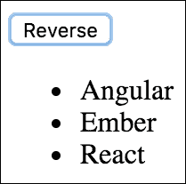
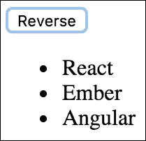
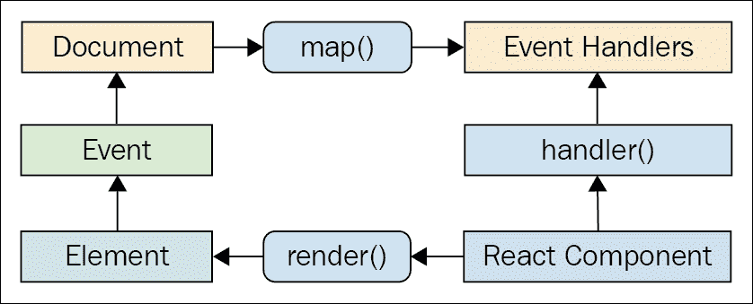
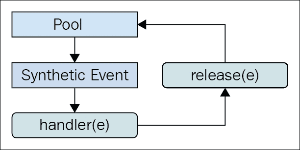

# 四、事件处理——React 的方式

本章的重点是事件处理。您可能已经看到了在 JavaScript 应用中处理事件的多种方法。React 还有另一种方法：在 JSX 中声明事件处理程序。我们将通过查看特定元素的事件处理程序是如何在 JSX 中声明的来了解情况。然后，您将了解绑定处理程序上下文和参数值。接下来，我们将在 JSX 标记中实现内联事件处理程序函数。

然后，我们将讨论 React 实际上是如何将事件处理程序映射到引擎盖下的 DOM 元素的。最后，您将了解 React 传给事件处理程序函数的合成事件，以及如何将它们合并以实现性能。

# 声明事件处理程序

React 组件中事件处理的区别在于它是**声明性**。与 jQuery 相比，jQuery 必须编写命令式代码来选择相关的 DOM 元素并将事件处理程序函数附加到它们。

JSX 标记中事件处理程序的声明性方法的优点是它们是 UI 结构的一部分。不必追踪分配事件处理程序的代码是一种精神解放。

在本节中，我们将编写一个基本的事件处理程序，以便您了解 React 应用中的声明性事件处理语法。然后，我们将介绍如何使用通用事件处理程序函数。

## 声明处理函数

让我们来看看一个基本组件，它声明一个元素的点击事件的事件处理程序：

```jsx
import React, { Component } from 'react'; 

export default class MyButton extends Component { 

  // The click event handler, there's nothing much 
  // happening here other than a log of the event. 
  onClick() { 
    console.log('clicked'); 
  } 

  // Renders a "<button>" element with the "onClick" 
  // event handler set to the "onClick()" method of 
  // this component. 
  render() { 
    return ( 
      <button onClick={this.onClick}> 
        {this.props.children} 
      </button> 
    ); 
  } 
} 

```

如您所见，事件处理程序函数`this.onClick()`被传递给`<button>`元素的`onClick`属性。通过查看此标记，可以清楚地知道单击按钮时将运行哪些代码。

有关支持的事件属性名称的完整列表，请参见官方 React 文档：[https://facebook.github.io/react/docs/](https://facebook.github.io/react/docs/) 。

## 多个事件处理程序

我真正喜欢 JSX 中的声明性事件处理程序语法的地方在于，当有多个处理程序分配给一个元素时，它很容易阅读。例如，有时一个元素有两个或三个处理程序。命令式代码很难用于单个事件处理程序，更不用说其中几个了。当一个元素需要更多的处理程序时，它只是另一个 JSX 属性。从代码可维护性的角度来看，这可以很好地扩展：

```jsx
import React, { Component } from 'react'; 

export default class MyInput extends Component { 

  // Triggered when the value of the text input changes... 
  onChange() { 
    console.log('changed'); 
  } 

  // Triggered when the text input loses focus... 
  onBlur() { 
    console.log('blured'); 
  } 

  // JSX elements can have as many event handler 
  // properties as necessary. 
  render() { 
    return ( 
      <input 
        onChange={this.onChange} 
        onBlur={this.onBlur} 
      /> 
    ); 
  } 
} 

```

这个`<input>`元素可以有多个事件处理程序，代码也同样可读。

当您不断向组件添加更多事件处理程序时，您会注意到许多事件处理程序都做相同的事情。是时候开始考虑如何在组件之间共享通用处理程序函数了。

## 导入泛型处理程序

对于不同的组件，任何 React 应用都可能具有相同的事件处理功能。例如，为了响应按钮单击，组件应该对项目列表进行排序。正是这些类型的超泛型行为属于它们自己的模块，因此多个组件可以共享它们。让我们实现一个使用通用事件处理程序函数的组件：

```jsx
import React, { Component } from 'react'; 

// Import the generic event handler that 
// manipulates the state of a component. 
import reverse from './reverse'; 

export default class MyList extends Component { 
  state = { 
    items: ['Angular', 'Ember', 'React'], 
  } 

  // Makes the generic function specific 
  // to this component by calling "bind(this)". 
  onReverseClick = reverse.bind(this) 

  render() { 
    const { 
      state: { 
        items, 
      }, 
      onReverseClick, 
    } = this; 

    return ( 
      <section> 
        { /* Now we can attach the "onReverseClick" handler 
             to the button, and the generic function will 
             work with this component's state. */} 
        <button onClick={onReverseClick}>Reverse</button> 
        <ul> 
          {items.map((v, i) => ( 
            <li key={i}>{v}</li> 
          ))} 
        </ul> 
      </section> 
    ); 
  } 
} 

```

让我们先看看这里发生了什么，从进口开始。我们正在导入一个名为`reverse()`的函数。这是我们在`<button>`元素中使用的通用事件处理函数。单击时，我们希望列表颠倒顺序。

您可以看到，我们正在这个类中创建一个`onReverseClick`属性。这是使用`bind()`创建的，用于将泛型函数的上下文绑定到此组件实例。

最后，查看 JSX 标记，您可以看到`onReverseClick()`函数被用作按钮单击的处理程序。

那么这到底是如何工作的呢？我们有一个通用函数，它会以某种方式更改此组件的状态，因为我们将上下文绑定到它？嗯，差不多，是的，就是这样。现在让我们看一下通用函数的实现：

```jsx
// Exports a generic function that changes the 
// state of a component, causing it to re-render 
// itself.
export default function reverse() { 
  this.setState(this.state.items.reverse()); 
} 

```

很简单！显然，此函数依赖于状态中的`this.state`属性和`items`数组。然而，这很简单。关键是该函数的工作状态是泛型的；一个应用可以有许多组件，其中一个`items`数组处于其状态。

下面是呈现列表的外观：



正如预期的那样，单击按钮会使用我们的通用`reverse()`事件处理程序对列表进行排序：



现在，我们将更深入地了解绑定事件处理程序函数的上下文以及绑定它们的参数。

# 事件处理程序上下文和参数

在本节中，我们将研究自动绑定其事件处理程序上下文的 React 组件，以及如何将数据传递到事件处理程序中。拥有正确的上下文对于 React 事件处理程序函数很重要，因为它们通常需要访问组件的属性或状态。能够参数化事件处理程序也很重要，因为它们不会从 DOM 元素中提取数据。

## 自动绑定上下文

到目前为止，您在本书中实现的组件都使用了**ES2015**类样式声明。在这里，您声明了一个类，该类扩展了基 React`Component`类。但是，执行此操作时，组件中的任何事件处理程序方法都需要手动绑定到组件上下文。例如，如果您需要访问`this.props`，则`this`需要是对组件的引用。

您可以使用`React.createClass()`函数声明组件，并将其方法上下文**自动绑定**到组件。换句话说，不需要对回调函数调用`bind()`。让我们看一个实际的例子：

```jsx
import React from 'react'; 

export default React.createClass({ 

  // This event handler requires access to the 
  // component properties, but it doesn't need 
  // to explicitly bind it's context, because 
  // "createClass()" components do this automatically. 
  onClick() { 
    console.log('clicked', 
      `"${this.props.children}"`); 
  }, 

  // Renders a button with a bound event handler. 
  render() { 
    return ( 
      <button onClick={this.onClick}> 
        {this.props.children} 
      </button> 
    ); 
  }, 
}); 

```

这看起来很像一个类声明。事实上，这曾经是声明 React 组件的唯一受支持的方法。该组件特别处理按钮单击事件。`onClick()`方法需要访问组件，因为它引用了`this.props.children`。

因此，如果有大量代码手动绑定事件处理程序函数的上下文，则可能需要使用此函数来声明组件。

### 注

您可以利用 ES2015 语法使事件处理程序方法在组件类声明中自动绑定其上下文。我们稍后将在本书中介绍这种方法。

## 获取组件数据

在前面的示例中，事件处理程序需要访问组件，以便能够读取`children`属性。在本节中，我们将研究一个更复杂的场景，其中处理程序需要访问组件属性以及参数值。

我们将呈现一个自定义列表组件，该组件对列表中的每个项目都有一个单击事件处理程序。我们将向组件传递一个集合，如下所示：

```jsx
import React from 'react'; 
import { render } from 'react-dom'; 

import MyList from './MyList'; 

// The items to pass to "<MyList>" as a property. 
const items = [ 
  { id: 0, name: 'First' }, 
  { id: 1, name: 'Second' }, 
  { id: 2, name: 'Third' }, 
]; 

// Renders "<MyList>" with an "items" property. 
render( 
  (<MyList items={items} />), 
  document.getElementById('app') 
); 

```

如您所见，列表中的每个项目都有一个`id`属性，用于标识该项目。我们需要能够在 UI 中单击项目时访问此 ID，以便事件处理程序可以处理该项目。以下是`MyList`组件实现的样子：

```jsx
import React, { Component } from 'react'; 

export default class MyList extends Component { 
  constructor() { 
    super(); 

    // We want to make sure that the "onClick()" 
    // handler is explicitly bound to this component 
    // as it's context. 
    this.onClick = this.onClick.bind(this); 
  } 

  // When a list item is clicked, look up the name 
  // of the item based on the "id" argument. This is 
  // why we need access to the component through "this", 
  // for the properties. 
  onClick(id) { 
    const { name } = this.props.items.find( 
      i => i.id === id 
    ); 

    console.log('clicked', `"${name}"`); 
  } 

  render() { 
    return ( 
      <ul> 
        {/* Creates a new handler function with 
            the bound "id" argument. Notice that 
            the context is left as null, since that 
            has already been bound in the 
            constructor. */} 
        {this.props.items.map(({ id, name }) => ( 
          <li 
            key={id} 
            onClick={this.onClick.bind(null, id)} 
          > 
            {name} 
          </li> 
        ))} 
      </ul> 
    ); 
  } 
}
```

以下是渲染列表的外观：


我们必须注意绑定事件处理程序上下文，这是在构造函数中完成的。如果查看`onClick()`事件处理程序，可以看到它需要访问组件，以便在`this.props.items`中查找单击的项目。此外，`onClick()`处理程序需要一个`id`参数。如果你看一下这个组件的 JSX 内容，你会发现我们正在调用`bind()`来为列表中的每个项目提供参数值。这意味着当响应单击事件调用处理程序时，已经提供了该项的`id`。

这种参数化事件处理方法与以前的方法有很大不同。例如，我过去依赖于从 DOM 元素本身获取参数数据。这很好，因为我们只需要一个事件处理程序，它可以从事件参数中提取所需的数据。这种方法也不需要通过迭代集合并调用`bind()`来设置几个新函数。

这就是取舍。React 应用避免接触 DOM，因为 DOM 实际上只是 React 组件的渲染目标。如果我们可以编写不向 DOM 元素引入显式依赖关系的代码，那么代码将是非常可移植的。这就是我们在本例中对事件处理程序所做的。

### 注

如果您担心为集合中的每个项创建新函数对性能的影响，请不要担心。您不会一次在页面上呈现数千个项目。对代码进行基准测试，如果结果表明对 React 事件处理程序的`bind()`调用是最慢的部分，那么您可能有一个非常快的应用。

# 内联事件处理程序

将处理程序函数分配给 JSX 属性的典型方法是使用名为的**函数。然而，有时我们可能需要使用一个**内联**函数。这是通过将一个**箭头**函数直接分配给 JSX 标记中的事件属性来实现的：**

```jsx
import React, { Component } from 'react'; 

export default class MyButton extends Component { 

  // Renders a button element with an "onClick()" handler. 
  // This function is declared inline with the JSX, and is 
  // useful in scenarios where you need to call another 
  // function. 
  render() { 
    return ( 
      <button 
        onClick={e => console.log('clicked', e)} 
      > 
        {this.props.children} 
      </button> 
    ); 
  } 
} 

```

像这样的内联事件处理程序的主要用途是当您有一个静态参数值要传递给另一个函数时。在本例中，我们使用`clicked`字符串调用`console.log()`。我们可以通过使用`bind()`创建一个新函数，在 JSX 标记之外为此目的设置一个特殊函数。但是，我们必须为另一个函数想出另一个名称。内联更容易。

# 将处理程序绑定到元素

将事件处理程序函数分配给 JSX 中的元素时，React 实际上不会将事件侦听器附加到底层 DOM 元素。相反，它将函数添加到函数的内部映射中。页面的文档上只有一个事件侦听器。当事件通过 DOM 树冒泡到文档时，React 处理程序检查是否有任何组件具有匹配的处理程序。流程如下所示：



你可能会问，为什么 React 会遇到这些麻烦？这与我们在过去几章中讨论的原则相同；尽可能使声明性 UI 结构与 DOM 分离。

例如，当呈现一个新组件时，它的事件处理函数只需添加到 React 维护的内部映射中。当事件被触发并命中`document`对象时，React 将事件映射到处理程序。如果找到匹配项，它将调用处理程序。最后，当 React 组件被删除时，处理程序将从处理程序列表中删除。

这些 DOM 操作实际上都没有触及 DOM。它都是由一个事件侦听器抽象的。这有利于性能和整体架构（将渲染目标与应用代码分开）。

# 合成事件对象

当您使用本机`addEventListener()`函数将事件处理程序函数附加到 DOM 元素时，回调将获得传递给它的事件参数。React 中的事件处理程序函数也传递了一个事件参数，但它不是标准的`Event`实例。它被称为`SyntheticEvent`，是本机事件实例的简单包装器。

合成事件在 React 中有两个用途：

*   提供一致的事件接口，规范浏览器在事件属性方面的不一致
*   合成事件包含传播工作所必需的信息

以下是 React 组件上下文中合成事件的图示：


在下一节中，您将看到出于性能原因如何汇集这些合成事件，以及这对异步代码的影响。

# 事件池

包装本机事件实例的一个挑战是，这可能会导致性能问题。创建的每个合成事件包装器也需要在某个时候进行垃圾收集，这在 CPU 时间方面可能非常昂贵。

### 注

当垃圾收集器运行时，您的 JavaScript 代码都无法运行。这就是为什么内存效率很重要的原因；频繁的垃圾收集意味着响应用户交互的代码的 CPU 时间更少。

例如，如果您的应用只处理几个事件，那么这并不重要。但即使按照适度的标准，应用也会响应许多事件，即使处理程序实际上没有对它们做任何处理。如果 React 必须不断地分配新的合成事件实例，这是有问题的。

React 通过分配一个**合成实例池**来处理这个问题。每当触发事件时，它都会从池中获取一个实例并填充其属性。当事件处理程序完成运行后，合成事件实例将释放回池中，如下所示：



这可以防止垃圾收集器在触发大量事件时频繁运行。池保留对合成事件实例的引用，因此它们永远不符合垃圾收集的条件。React 也不必分配新实例。

然而，有一个问题你需要注意。它涉及从事件处理程序中的异步代码访问合成事件实例。这是一个问题，因为一旦处理程序完成运行，实例就会返回到池中。当它返回到池中时，其所有属性都将被清除。下面是一个例子，说明了这可能会出现什么问题：

```jsx
import React, { Component } from 'react'; 

// Mock function, meant to simulate fetching 
// data asynchronously from an API. 
function fetchData() { 
  return new Promise((resolve) => { 
    setTimeout(() => { 
      resolve(); 
    }, 1000); 
  }); 
} 

export default class MyButton extends Component { 
  onClick(e) { 
    // This works fine, we can access the DOM element 
    // through the "currentTarget" property. 
    console.log('clicked', e.currentTarget.style); 

    fetchData().then(() => { 
      // However, trying to access "currentTarget" 
      // asynchronously fails, because it's properties 
      // have all been nullified so that the instance 
      // can be reused. 
      console.log('callback', e.currentTarget.style); 
    }); 
  } 

  render() { 
    return ( 
      <button onClick={this.onClick}> 
        {this.props.children} 
      </button> 
    ); 
  } 
} 

```

如您所见，第二个`console.log()`尝试从异步回调访问合成事件属性，该回调在事件处理程序完成之前不会运行，这会导致事件清空其属性。这将导致警告和未定义的值。

### 注

本示例的目的是说明当您编写与事件交互的异步代码时，事情是如何中断的。别这样！

# 总结

本章介绍 React 中的事件处理。React 和其他事件处理方法之间的关键区别在于处理程序是在 JSX 标记中声明的。这使得跟踪哪些元素处理哪些事件变得更加简单。

您了解到，在单个元素上拥有多个事件处理程序需要添加新的 JSX 属性。接下来，您了解到共享处理一般行为的事件处理函数是一个好主意。如果事件处理程序函数需要访问组件属性或状态，则上下文对于事件处理程序函数很重要。您了解了绑定事件处理程序函数上下文和参数值的各种方法。

然后，您了解了内联事件处理程序函数及其潜在用途，以及 React 如何将单个 DOM 事件处理程序绑定到文档对象。合成事件是一种封装本机事件的抽象，您可以了解为什么需要合成事件，以及如何将合成事件合并以实现高效的内存消耗。

在下一章中，我们将探讨如何创建可用于各种用途的可重用组件。