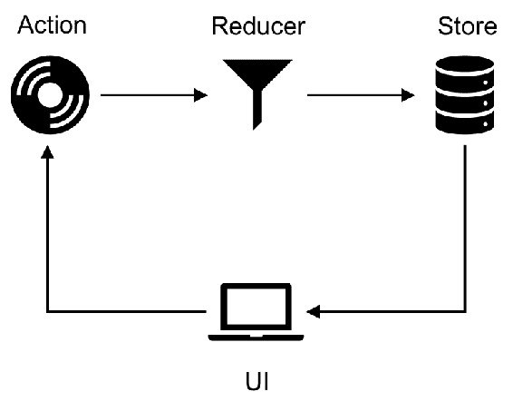

# 八、将`connected-react-router`用于 Redux 绑定

在前面的章节中，我们研究了如何使用组件的状态来存储模型数据，以及当用户操作更新模型时，React 如何更新视图。在大型应用中，此状态信息不仅应提供给当前组件及其子组件，还应提供给应用树中的其他组件。有各种状态管理库可用于帮助保持用户界面组件与应用状态同步。Redux 就是这样一个库，它使用一个中央数据存储来管理应用的状态。存储作为真相的来源，应用中的组件可以依赖于存储中维护的状态。

在本章中，我们将了解`connected-react-router`库，它为 React 路由提供 Redux 绑定。本章讨论以下主题：

*   使用 Redux 进行状态管理 Redux 概念简介
*   `connected-react-router`入门
*   从 Redux 存储读取 react 路由状态
*   通过调度操作导航到不同的路由

# 使用 Redux 进行状态管理

如前所述，Redux 使用单个存储来管理应用的状态。除了`Store`之外，还有两个构建块：`Actions`和`Reducers`

让我们来看看这些构建块是如何帮助保持“t0 t0”的，并在当 To.T2 改变时，更新视图。

# 行动

操作允许您定义用户可以执行的操作，以更新应用的状态。一个动作是一个`{ type, payload }`形状的 JavaScript 对象，其中`type`是一个提及用户动作的字符串，`payload`是应该更新状态的数据：

```jsx
let todoId = 0;
export const addTodo = text => ({
    type: 'ADD_TODO'
    payload: {
        text,
        id: todoId++,
        isCompleted: false
    }
})
```

这里，`addTodo`操作接受 TODO 文本并指示该操作用于将 TODO 添加到 TODO 列表。`payload`这里是一个包含 TODO`text`、TODO`ID`和布尔标志`isCompleted`（设置为 false）的对象。也可以有不需要包含`payload`属性的操作。例如，考虑下面的动作：

```jsx
export const increment = () => ({
    type: 'INCREMENT'
})
```

这里，`action`类型`INCREMENT`表示实体的值必须增加 1。前面的`action`不需要`payload`属性，可以根据动作类型更新实体的状态

# 还原剂

Redux 中的 Reducer 根据发送到存储的操作更改实体的状态。Reducer 是一个纯函数，它接受两个参数：`state`和`action`。然后，减速器根据`action.type`中存储的值返回更新状态。例如，考虑以下减速器：

```jsx
const todoReducer = (state = [], action) => {
    switch (action.type) {
        case 'ADD_TODO':
            return [
                ...state,
                {
                    id: action.payload.id,
                    text: action.payload.text,
                    isCompleted: action.payload.isCompleted
                }
            ];
        default:
            return state;
    }
}
```

`todoReducer`的初始状态设置为空数组（状态参数的默认值），当动作类型为`ADD_TODO`时，列表中添加 TODO。Redux 的核心原则之一不是改变状态树，而是作为组件调度的操作的结果返回一个新的状态树。这有助于保持 reducer 函数的纯粹性（即没有副作用），并有助于在 React 组件重新渲染视图元素时识别新的状态更改。

类似地，可能会有多个操作更新 TODO 状态（例如`MARK_COMPLETED`和`DELETE`），并且 reducer 可以根据发送到存储的操作类型更改 TODO 列表的状态。

# 百货商店

Store 是可以从中派生应用状态的中心数据对象。应用中的组件订阅存储状态的更改并更新视图。

以下是 Redux 中数据的流动方式：



用户执行一项操作，例如提交表单或单击按钮，从而向存储区发送操作。应用定义了用户可以执行的各种操作，并对 reducer 进行了编码，以便它可以处理这些操作并更新实体的状态。应用中各种实体的状态保存在一个中心位置：存储。例如，应用可以有各种实体，如 Todo 和用户配置文件，存储将维护这些实体的状态信息。每当 reducer 更新存储中特定实体的状态值时，用户界面组件都会从存储接收更新，更新组件的状态信息，并使用更新的状态重新呈现视图。

# 反应中的再聚合

使用`create-react-app`CLI 创建项目后，包括依赖项`redux`和`react-redux`依赖项：

```jsx
npm install --save redux react-redux 
```

`redux`库包括`createStore`、`combineReducers`、`bindActionCreators`、`applyMiddleware`和`compose`助手函数；而`react-redux`库包含 Redux 绑定，帮助您的 React 组件与 Redux 存储进行通信。

下一步是定义用户可以从用户界面启动的操作。在我们的示例中，我们将创建一个`Counter`组件，该组件可以`increment`和`decrement`计数器值。

在`actions/counter.js`中：

```jsx
export const increment = () => ({
    type:'INCREMENT'
});

export const decrement = () => ({
    type: 'DECREMENT'
});
```

为我们的反实体定义操作后，需要定义更新`counter`状态的`reducer`：

在`reducers/counter.js`中：

```jsx
const counterReducer = (state = 0, action) => {
    switch (action.type) {
        case 'INCREMENT':
            return state + 1;
        case 'DECREMENT':
            return state - 1;
        default:
            return state;
    }
}

export default counterReducer;
```

此处定义的`reducer`根据用户触发的`action`类型更新`state`值。类似地，应用中可以有各种简化程序和操作，在用户触发某个操作时更新实体的状态。

`redux`中的`combineReducers`实用程序允许您将所有减速器组合成一个减速器，然后可在`initializing`应用商店中使用。

在`reducers/index.js`中：

```jsx
import { combineReducers } from 'redux';
import counterReducer from './counter';

const rootReducer = combineReducers({
    count: counterReducer,
    todo: todoReducer
});

export default rootReducer;
```

使用`combineReducers`函数创建一个`rootReducer`，该函数接受一个对象，该对象具有实体和减缩器的键值映射。这里，`counterReducer`被分配给`count`实体，`todoReducer`被分配给具有`todo`键的实体。

然后在`createStore`函数中使用`rootReducer`创建存储。

在`index.js`中：

```jsx
import { createStore } from 'redux';

const store = createStore(
    rootReducer
);
```

使用`react-redux`库中定义的`<Provider>`组件，应用中的组件可以使用存储：

```jsx
ReactDOM.render(
    <Provider store={store}>
        <Counter />
    </Provider>,
    document.getElementById('root')
);
```

应用中的组件现在可以使用`connect`高阶函数订阅存储中实体（`count`和`todo`中的状态更改。创建一个`Counter`组件，该组件将显示`count`的当前状态值，并将分派我们在`actions/counter.js`中定义的`increment`和`decrement`动作。

在`components/counter.component.js`中：

```jsx
import { increment, decrement } from '../actions/counter';
const Counter = ({ count, increment, decrement }) => (
    <div>
        <h4>Counter</h4>
        <button onClick={decrement}>-</button>
        <span>{count}</span>
        <button onClick={increment}>+</button>
    </div>
)
```

`count`、`increment`和`decrement`道具可从`store`使用以下`connect`方法获得：

```jsx
import { connect } from 'react-redux';
import { increment, decrement } from '../actions/counter';

...

const mapStateToProps = state => ({
    count: state.count
});

const mapDispatchToProps = dispatch => ({
    increment: () => dispatch(increment()),
    decrement: () => dispatch(decrement())
})

export default connect(mapStateToProps, mapDispatchToProps)(Counter);
```

来自`react-redux`的`connect`高阶函数有助于将 Redux 状态注入 React 组件。`connect`HOC 接受两个参数：`mapStateToProps`和`mapDispathToProps`。正如所观察到的，Redux state`count`属性被分配给`mapStateToProps`中组件的 state`count`属性，类似地，组件可以使用`mapDispatchToProps`中指定的`increment`和`decrement`动作向存储区发送动作。这里，为了从 Redux 存储读取状态值，使用`mapStateToProps`，并且`connect`向组件提供整个状态树，以便组件可以从状态树中的各种对象读取。为了改变树的状态，`mapDispatchToProps`帮助分派在存储中注册的操作。`connect`HOC 提供了`dispatch`方法，以便组件可以调用存储上的操作。

# 开始使用已连接的路由

`connected-react-router`库为 React 路由提供 Redux 绑定；例如，应用的历史记录可以从 Redux 存储读取，您可以通过向存储分配操作导航到应用中的不同路由。

我们先用`npm`安装`connected-react-router`和其他库：

```jsx
npm install --save connected-react-router  react-router  react-router-dom  history
```

接下来，我们将更新存储设置

在`index.js`中：

```jsx
import { applyMiddleware, createStore, compose } from 'redux';
import { ConnectedRouter, connectRouter, routerMiddleware } from 'connected-react-router';

const history = createBrowserHistory();

const composeEnhancer = window.__REDUX_DEVTOOLS_EXTENSION_COMPOSE__ || compose;

const store = createStore(
    connectRouter(history)(rootReducer),
    composeEnhancer(applyMiddleware(routerMiddleware(history)))
);
```

`createStore`函数具有以下签名：

```jsx
createStore(reducer, preloadedState, enhancer) 
```

它接受三个参数：第一个参数是`reducer`函数，它返回给定当前状态树和要处理的操作的下一个状态树；第二个参数指定应用的初始`state`，应该是与`combineReducers`中使用的形状相同的对象；第三个参数指定存储区`enhancer`，它为存储区添加了更多功能，如时间旅行、持久性等

在我们的示例中，第一个参数如下所示：

```jsx
connectRouter(history)(rootReducer)
```

来自`connected-react-router`的`connectRouter`包裹`rootReducer`并返回一个包含`router`状态的新根还原剂。`connectRouter`减速机响应类型为`@@router/LOCATION_CHANGE`的操作以更新路由状态。注意，`connectRouter`接受`history`对象作为其参数；`connectRouter`然后使用历史对象使用`location`和`action`属性初始化路由状态。

`createStore`的第二个参数是增强子：

```jsx
composeEnhancer = window.__REDUX_DEVTOOLS_EXTENSION_COMPOSE__ || compose;
...
composeEnhancer(applyMiddleware(routerMiddleware(history)))
```

请注意，我们将`enhancer`指定为第二个参数。如果第二个参数是函数且未指定第三个参数到`createStore`，则`createStore`方法将第二个参数标记为`enhancer`。`redux`中的`compose`实用程序返回通过从右向左组合给定函数获得的函数。在前面的例子中，我们正在检查浏览器中是否有`Redux Devtools Extension`可用，这使您能够查看应用中各种实体的状态

`connected-react-router`中定义的`routerMiddleware`是一个中间件函数，用于使用提供的`history`对象重定向用户。如果调度了`'CALL_HISTORY_METHOD'`类型的操作，中间件功能将通过调用`history`对象上的其中一个方法，将用户导航到请求的路由。它还防止操作（`CALL_HISTORY_METHOD`到达应用中定义的其他还原程序以及`routerMiddleware`之后定义的中间件组件

Redux 中的`applyMiddleware`实用程序用于创建存储增强器，该增强器将中间件应用于 Redux 存储的调度方法。

下一步是使用`<Provider>`组件使应用中的组件可以使用存储（使用`createStore`创建）：

```jsx
ReactDOM.render(
    <Provider store={store}>
        <ConnectedRouter history={history}>
            <App />
        </ConnectedRouter>
    </Provider>,
document.getElementById('root'));
```

这里，我们将应用根组件包装在`<ConnectedRouter>`组件中，而`<ConnectedRouter>`组件又包装在`<Provider>`组件中。这是必需的，因为`ConnectedRouter`订阅`router`状态中的更改，以查看`location`属性是否已更改，然后调用`history.push`方法将用户导航到请求的路由。

通过这些更改，应用中的组件现在可以从存储中读取状态信息，并且还可以分派操作以导航到应用中定义的各种路由。

# 从 Redux 存储读取状态信息

为了测试前面的设置，我们首先在导航栏中创建一个`<Link>`组件和一个具有相同路径名的对应`<Route>`：

```jsx
<Link
    to={{
        pathname: '/dashboard',
        search: 'q=1',
        hash: 'test',
        state: { key: 'value' }
    }}
>
    Dashboard
</Link>
...
<Route path='/dashboard' component={Dashboard} />
```

注意，`<Link>`组件指定了具有`pathname`、`search`、`hash`和`state`属性的`to`对象。我们将从呈现组件中的 Redux 存储中读取此信息：

```jsx
const Dashboard = ({ pathname, search, hash, state, count }) => {
    return (
        <div>
            <h4>In Dashboard</h4>
            <div> Pathname   : {pathname} </div>
            <div> Search     : {search} </div>
            <div> Hash       : {hash} </div>
            <div> State-Key  : {state? state.key : null} </div>
        </div>
    )
}

const mapStateToProps = state => ({
    pathname: state.router.location.pathname,
    search: state.router.location.search,
    hash: state.router.location.hash,
    state: state.router.location.state
});

export default connect(mapStateToProps)(Dashboard);
```

从这个代码片段中，`pathname`、`search`、`location`和`hash`属性从`state.router.location`中读取。如前所述，`connectRouter`函数创建`router`状态，并在调度`LOCATION_CHANGE`类型的操作时更新该值。当您尝试使用`<Link>`组件导航时，`<ConnectRouter>`组件侦听历史对象中的更改，然后发送`LOCATION_CHANGE`操作

如果您在 Chrome 中安装了 Redux Dev 工具（可在 Chrome Web Store 中找到），则当您尝试从一条路由导航到另一条路由时，可以观察到已调度的操作：


在这个 Dev Tools 窗口中，当您尝试导航时，`@@router/LOCATION_CHANGE`操作被调度，下面部分中的操作显示了调度该操作时提供的有效负载

# 通过调度操作导航

`connected-react-router`库提供了可以从组件中分派的操作，以导航到应用中定义的路由。其中包括`push`、`replace`、`go`、`goBack`和`goForward`。这些方法调用历史对象上的相应方法以导航到指定路径。

上例中的`DashboardComponent`现在可以更新为使用`mapDispatchToProps`：

```jsx
import {push, replace} from 'connected-react-router';

const Dashboard = ({ pathname, search, hash, state, count, push, replace }) => {    
    return (
        ...
<button onClick={() => {push('/')}}>HOME</button>
        <button onClick={() => {replace('/counter')}}>COUNTER</button>
        ...
    )
}

const mapStateToProps = state => ({
...
});

const mapDispatchToProps = dispatch => ({
    push: (path) => dispatch(push(path)),
    replace: (path) => dispatch(replace(path))
});

export default connect(mapStateToProps, mapDispatchToProps)(Dashboard);
```

现在，当您分别单击 HOME 和 COUNTER 按钮时，前面的组件将发送`push`和`replace`操作。`mapDispatchToProps`函数使您能够向商店分派操作，在我们的示例中，`push`和`replace`函数接受`pathname`来分派操作。

# 总结

在本章中，我们了解了如何使用 Redux 库创建一个存储来管理应用中的各种状态实体。存储区接收动作，当动作被调度时，还原程序改变应用的状态。`connected-react-router`库为 React Router 提供 Redux 绑定，它包括一个高阶函数`connectRouter`，它包装`rootReducer`并创建`router`状态。然后在`createStore`功能中使用`connectRouter`功能，使`router`状态可用于应用中的组件。

`connected-react-router`中的`<ConnectedRouter>`组件监听`history`位置的变化，并发送`LOCATION_CHANGE`动作来更新`router`状态属性。然后，呈现的路由组件可以通过从存储中读取状态信息来读取该`router`状态属性

该库还包括`push`、`replace`、`go`、`goBack`和`goForward`动作，组件可以通过这些动作导航到应用中定义的路由。