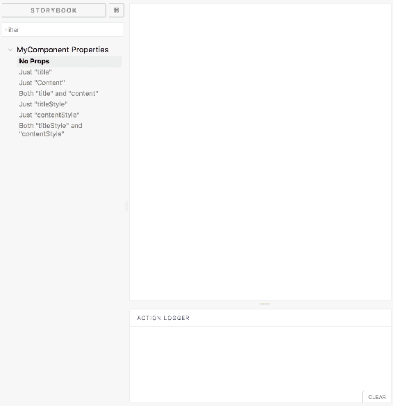
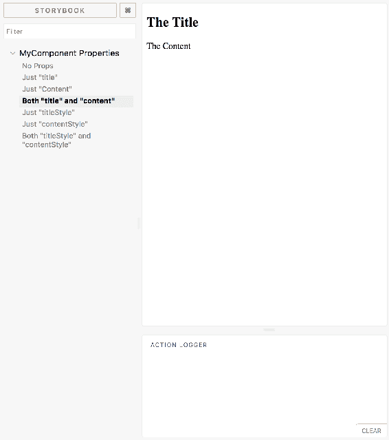
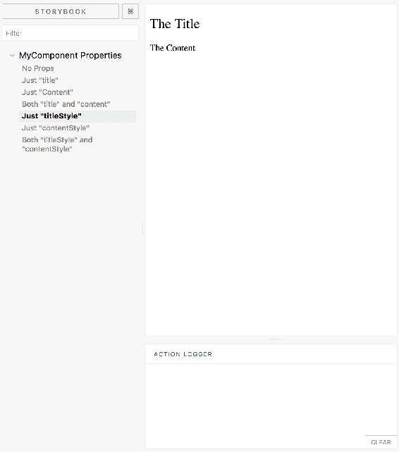
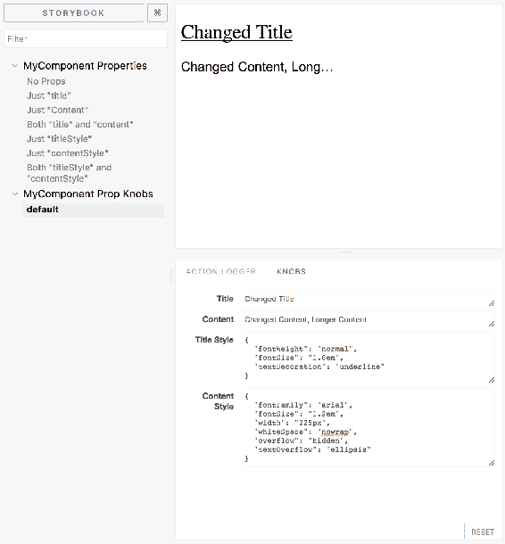
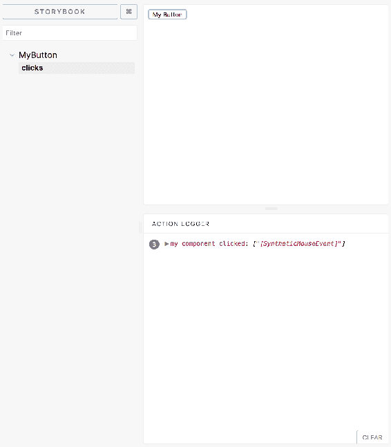
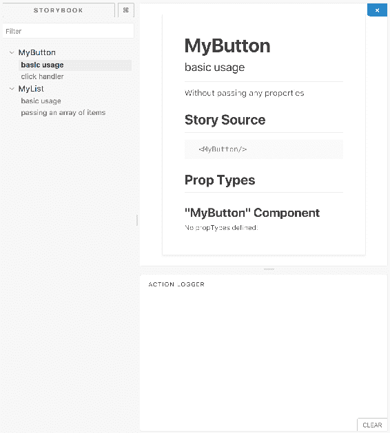
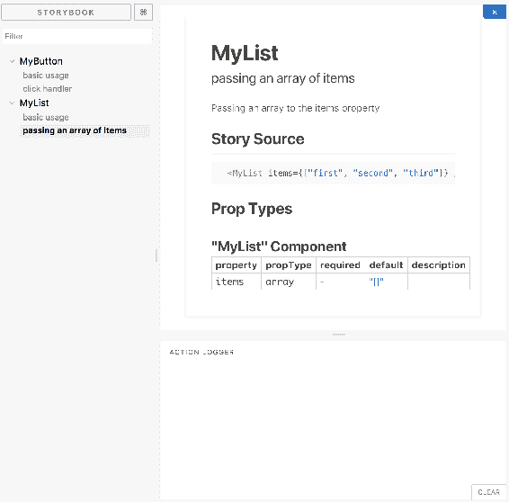

# 七、使用 Storybook 隔离组件

React 组件是较大用户界面的较小部分。当然，您希望与应用的其余部分一起开发 UI 组件。另一方面，如果您仅有的环境是在更大的 UI 中，那么对组件更改的实验可能会很棘手。本章的重点是向您展示如何利用 Storybook 工具为开发 React 组件提供一个独立的沙盒。你将学到：

*   独立组件开发的重要性
*   安装故事书并进行设置
*   使用故事开发组件
*   将组件引入应用

# 独立组件开发的需求

在开发过程中隔离 React 组件可能很困难。通常，开发人员和他们正在制作的 React 组件唯一可用的上下文是应用本身。在开发组件时，很少有事情完全按照计划进行。React 组件调试过程的一部分是使用它。

我经常发现自己在应用代码中做一些奇怪的事情，以适应我们在解决问题时对组件所做的临时更改。例如，我将更改容器元素的类型，以查看这是否是导致我看到的布局问题的原因；或者，我将更改组件内部的标记；或者，我将完全制作组件使用的一些状态或道具。

关键是，在开发组件的过程中，您需要执行一些随机实验。在您正在构建的应用中尝试这样做可能会很麻烦。这主要是因为您被迫接受组件周围的所有其他内容，当您只关心组件的功能时，这可能会分散您的注意力。

有时，我会创建一个全新的页面，或者一个全新的应用，这样我就可以看到我的组件自己做了什么。这是一个痛苦的过程，其他人也有同样的感受，这就是**故事书**存在的原因。React 工具用于为 React 开发人员实现自动化。使用 Storybook，您可以自动创建一个沙盒环境以供您使用。它还为您处理所有的构建步骤，因此您只需为组件编写一个故事并查看结果。

思考故事书的最佳方式是将其作为一个类似 JSFIDLE（[的站点 https://jsfiddle.net/](https://jsfiddle.net/) 或 JSBin（[https://jsbin.com/](https://jsbin.com/) ）。它们让您可以在不必设置和维护环境的情况下对小部分代码进行实验。Storybook 类似于 JSFIDLE for React，它作为项目的一个组成部分存在。

# 安装和配置故事书

使用 Storybook 的第一步是安装全局命令行工具。它是作为一个全局工具安装的，因为它可以同时用于许多项目，并且可以用于引导新项目。让我们从第一步开始：

```jsx
npm install @storybook/cli -g
```

安装完成后，您就可以使用命令行工具修改`package.json`依赖项并生成样板故事书文件。假设您已经使用`create-react-app`创建了一个新的应用。切换到应用目录，并使用 Storybook 命令行工具将 Storybook 添加到当前项目中：

```jsx
getstorybook
```

当您运行`getstorybook`命令时，它会为您做很多事情。以下是运行此命令时应看到的输出：

```jsx
getstorybook - the simplest way to add a storybook to your project. 
 Detecting project type. 
 Adding storybook support to your "Create React App" based project.  Preparing to install dependencies. 
```

在添加任何内容之前，它将尝试找出您拥有的项目类型，因为不同类型的项目具有不同的组织要求。`getstorybook`考虑到了这一点。然后，它将安装依赖项、样板文件，并将脚本添加到您的`package.json`：

```jsx
  Installing dependencies.
To run your storybook, type:
 npm run storybook 
```

输出告诉您必须在项目中运行 Storybook 服务器。以下是您的`package.json`的`scripts`部分在这一点上应该是什么样子：

```jsx
"scripts": { 
  "start": "react-scripts start", 
  "build": "react-scripts build", 
  "test": "react-scripts test --env=jsdom", 
  "eject": "react-scripts eject", 
  "storybook": "start-storybook -p 9009 -s public", 
  "build-storybook": "build-storybook -s public" 
} 
```

我们将在本章后面的章节中查看`build-storybook`脚本；您将更频繁地使用`storybook`脚本。

接下来，让我们看看`getstorybook`为您创建的样板文件。首先，您会注意到在项目的顶级目录中有一个新的`.storybook`目录：

```jsx
.storybook/
├── addons.js
└── config.js
```

添加的两个文件如下所示：

*   `addons.js`：此文件为 Storybook 导入附加模块。默认情况下，会使用操作和链接加载项，但如果不使用，则可以删除这些加载项。
*   `config.js`：此文件导入此项目的故事，并配置故事书以使用它们。

您还会在`src`目录中找到一个名为`stories`的新目录：

```jsx
src/
├── App.css
├── App.js
├── App.test.js
├── index.css
├── index.js
├── logo.svg
├── registerServiceWorker.js
└── stories
    └── index.js
```

还记得`getstorybook`是如何发现您在项目中使用`create-react-app`的吗？这就是它如何知道如何将`stories`目录放在`src`之下。在这里，您可以找到两个演示故事来帮助您入门：

```jsx
import React from 'react'; 

import { storiesOf } from '@storybook/react'; 
import { action } from '@storybook/addon-actions'; 
import { linkTo } from '@storybook/addon-links'; 

import { Button, Welcome } from '@storybook/react/demo'; 

storiesOf('Welcome', module).add('to Storybook', () => ( 
  <Welcome showApp={linkTo('Button')} /> 
)); 

storiesOf('Button', module) 
  .add('with text', () => ( 
    <Button onClick={action('clicked')}>Hello Button</Button> 
  )) 
  .add('with some emoji', () => ( 
    <Button onClick={action('clicked')}></Button> 
  )); 
```

现在不要担心弄清楚这个文件中发生了什么，我们会找到的。这些默认故事将替换为您为组件提供的故事。设置这些默认故事也很有帮助，这样当您第一次启动 Storybook 服务器时，您就可以看到一些东西了。让我们现在就这样做：

```jsx
npm run storybook
```

几秒钟后，您应该会看到控制台输出，它告诉您服务器运行的位置，以便您可以在浏览器中打开它：

```jsx
Storybook started on => http://localhost:9009/
```

以下是您在浏览器中查看 Storybook 应用时应该看到的内容：


以下是您所看到内容的大致分类：

*   左窗格是您可以找到所有故事的地方。这是显示两个默认故事书故事的位置。
*   在主窗格中，您将看到所选故事的渲染内容。
*   在底部的操作窗格中，您将看到已触发的操作被记录。

让我们尝试在左窗格中选择不同的故事：


只要在左窗格中更改故事选择，就会在主窗格中看到渲染组件输出。在这种情况下，它是一个基本按钮。

# 使用故事开发组件

Storybook 的价值在于，您不必设置应用来开始攻击组件。或者，如果您已经有一个正在开发的应用，那么您不必考虑如何将正在开发的组件集成到您的应用中。Storybook 是一个支持实验的工具。通过使用附加组件，您可以在担心将组件集成到应用之前测试组件的几乎任何方面。

# 试验道具

也许，在 Storybook 中开始开发组件最简单的方法就是开始试验不同的属性值。为此，您只需创建组件的不同故事，每个故事具有不同的属性值。

首先，让我们来看看你正在研究的组件：

```jsx
import React from 'react'; 

const MyComponent = ({ title, content, titleStyle, contentStyle }) => ( 
  <section> 
    <heading> 
      <h2 style={titleStyle}>{title}</h2> 
    </heading> 
    <article style={contentStyle}>{content}</article> 
  </section> 
); 

export default MyComponent; 
```

这个组件没有太多功能。它需要四个道具并呈现一些 HTML 标记。`title`和`content`属性值是简单的字符串。`titleStyle`和`contentStyle`道具是分配给相应 HTML 元素的`style`道具的对象。

让我们开始为这个组件编写故事。让我们假设使用了与前一节相同的方法：

1.  `create-react-app`用于创建 React 应用结构和安装依赖项
2.  `getstorybook`用于检查当前项目并添加适当的样板文件和依赖项

您可以打开`src/stories/index.js`并开始使用`storiesOf()`功能：

```jsx
storiesOf('MyComponent Properties', module) 
```

这是启动 Storybook UI 时将出现在左窗格中的顶级主题。在这个函数下面是添加个人故事的地方。由于您目前对测试不同的属性值感兴趣，因此添加的故事将用于反映不同的属性值：

```jsx
.add('No Props', () => <MyComponent />) 
```

这将在 Storybook 的左窗格中添加一个名为`No Props`的故事。当你点击它时，你会看到当它在没有任何道具的情况下被渲染时，`MyComponent`在主窗格中是什么样子：



这里没什么可看的，因为`title`和`content`道具都不见了。由于这两个值是唯一可见的渲染内容，因此不需要显示任何内容。让我们切换到下一个故事：


这一次，只要选择“标题”故事，您就可以看到渲染的不同 React 组件输出。正如故事标题所示，只有`title`属性被传递给`MyComponent`。下面是这个故事的代码：

```jsx
.add('Just "title"', () => <MyComponent title="The Title" />) 
```

下一层仅经过`content`属性。结果如下：


下面是只传递`content`属性的代码：

```jsx
.add('Just "Content"', () => <MyComponent content="The Content" />) 
```

下一个故事将`title`和`content`属性传递给`MyComponent`：



下面是在故事中呈现这两种道具的代码：

```jsx
.add('Both "title" and "content"', () => ( 
  <MyComponent title="The Title" content="The Content" /> 
)) 
```

现在，您的组件有三个故事，它们已经被证明是有用的。例如，您已经看到了`MyComponent`在没有内容或没有标题的情况下呈现时的外观。根据结果，您可能决定强制使用这两种道具或提供默认值。

接下来，让我们转到样式属性。首先，您将只传入`titleStyle`道具，如下所示：

```jsx
.add('Just "titleStyle"', () => ( 
  <MyComponent 
    title="The Title" 
    content="The Content" 
    titleStyle={{ fontWeight: 'normal' }} 
  /> 
)) 
```

请注意，您还传递了`title`和`content`属性。通过这种方式，您可以看到样式实际上如何影响`MyComponent`呈现的内容。结果如下：



接下来，您将只通过`contentStyle`道具：

```jsx
.add('Just "contentStyle"', () => (
  <MyComponent 
    title="The Title" 
    content="The Content" 
    contentStyle={{ fontFamily: 'arial', fontSize: '1.2em' }} 
  /> 
)) 
```

下面是它的样子：


最后，让我们将所有可能的道具传递给`MyComponent`：

```jsx
.add('Both "titleStyle" and "contentStyle"', () => ( 
  <MyComponent 
    title="The Title" 
    content="The Content"
```

```jsx
    titleStyle={{ fontWeight: 'normal' }} 
    contentStyle={{ fontFamily: 'arial', fontSize: '1.2em' }} 
  /> 
)); 
```

下面是`MyComponent`传递给它的每个道具的样子：


您刚刚为一个简单的组件创建了七个故事。使用 Storybook dev 服务器和 Storybook 用户界面，您可以轻松地在为组件创建的不同故事之间切换，以便轻松地看到它们之间的差异。正如您刚才看到的，这对于只处理道具的功能组件尤其有效。

以下是您刚刚实现的所有故事，以便您可以看到它们的外观：

```jsx
import React from 'react'; 
import { storiesOf } from '@storybook/react'; 
import MyComponent from '../MyComponent'; 

storiesOf('MyComponent Properties', module) 
  .add('No Props', () => <MyComponent />) 
  .add('Just "title"', () => <MyComponent title="The Title" />) 
  .add('Just "Content"', () => <MyComponent content="The Content" />) 
  .add('Both "title" and "content"', () => ( 
    <MyComponent title="The Title" content="The Content" /> 
  )) 
  .add('Just "titleStyle"', () => ( 
    <MyComponent 
      title="The Title" 
      content="The Content" 
      titleStyle={{ fontWeight: 'normal' }} 
    /> 
  )) 
  .add('Just "contentStyle"', () => ( 
    <MyComponent 
      title="The Title" 
      content="The Content" 
      contentStyle={{ fontFamily: 'arial', fontSize: '1.2em' }} 
    /> 
  )) 
  .add('Both "titleStyle" and "contentStyle"', () => ( 
    <MyComponent 
      title="The Title" 
      content="The Content" 
      titleStyle={{ fontWeight: 'normal' }} 
      contentStyle={{ fontFamily: 'arial', fontSize: '1.2em' }} 
    /> 
  )); 
```

在每个故事都有不同的组件道具配置的情况下，添加故事的好处在于，它就像拍摄组件的静态快照。然后，一旦您有了组件的多个故事，就可以在快照之间切换。另一方面，您可能还没有准备好以这种方式开始实现几个故事。如果你只是想摆弄道具的价值，有一个叫做**旋钮**的故事书附加组件。

旋钮附加组件允许您通过 Storybook UI 中的表单控件使用 React 组件道具值。现在让我们试用这个附加组件。第一步是在项目中安装它：

```jsx
npm install @storybook/addon-knobs --save-dev
```

然后，您必须告诉您的故事书配置您想要使用附加组件。将以下行添加到`.storybook/addons.js`：

```jsx
import '@storybook/addon-knobs/register'; 
```

现在您可以将`withKnobs`装饰器导入到您的`stories/index.js`文件中，该文件用于告诉故事书接下来的故事将使用控件来播放道具值。您还需要导入各种类型的旋钮控件。这些是简单的函数，当故事书 UI 中的值发生变化时，它们会将值传递给组件。

作为一个例子，让我们复制刚才为`MyComponent`实现的相同故事情节。这一次，您不需要构建一大堆静态故事，其中每个故事都设置特定的属性值，只需添加一个故事，该故事使用旋钮附加组件来控制道具值。以下是您需要添加为导入的内容：

```jsx
import { withKnobs, text, object } from '@storybook/addon-knobs/react';
```

以下是故事的新上下文，以及使用旋钮控件设置和更改 React 组件属性值的默认故事：

```jsx
storiesOf('MyComponent Prop Knobs', module) 
  .addDecorator(withKnobs) 
  .add('default', () => ( 
    <MyComponent 
      title={text('Title', 'The Title')} 
      content={text('Content', 'The Content')} 
      titleStyle={object('Title Style', { fontWeight: 'normal' })} 
      contentStyle={object('Content Style', { 
        fontFamily: 'arial', 
        fontSize: '1.2em' 
      })} 
    />
  )); 
```

从旋钮附加组件导入的两个功能`text()`和`object()`用于设置旋钮控件的标签和默认值。例如，`title`使用带有默认字符串值的`text()`函数，而`contentStyle`使用带有默认样式对象的`object()`函数。

下面是 Storybook 用户界面中的结果：


如果您查看底部窗格，您将看到 ACTION LOGGER 选项卡旁边有一个旋钮选项卡。基于用于声明故事的 Knobs 插件中的函数，将创建这些表单控件。现在，您可以继续使用组件道具值，并动态观察渲染内容的变化：



如果你最终找到了你喜欢的道具值，在尝试旋钮字段时，你可以将这些值硬编码到一个故事中。这就像将一个有效的组件配置添加到书签中，以便以后可以返回到它。

# 实验动作

让我们把注意力转移到另一个附加操作上。默认情况下，此加载项在您的故事书中启用。操作的思想是，一旦选择了一个故事，就可以与主窗格中呈现的页面元素进行交互。操作为您提供了一种机制，可以在 Storybook UI 中记录用户交互。此外，操作还可以作为通用工具，帮助您在数据流经组件时监控数据。

让我们从一个简单的按钮组件开始：

```jsx
import React from 'react'; 

const MyButton = ({ onClick }) => ( 
  <button onClick={onClick}>My Button</button> 
); 

export default MyButton; 
```

`MyButton`成分 re

接收一个`<button>`元素并为其分配一个`onClick`事件处理程序。处理程序实际上由`MyComponent`定义；它作为道具传入。因此，让我们为该组件创建一个故事，并向其传递一个`onClick`处理函数：

```jsx
import React from 'react'; 
import { storiesOf } from '@storybook/react'; 
import { action } from '@storybook/addon-actions'; 
import MyButton from '../MyButton'; 

storiesOf('MyButton', module).add('clicks', () => ( 
  <MyButton onClick={action('my component clicked')} /> 
)); 
```

您看到从`@storybook/addon-actions`导入的`action()`函数了吗？这是一个高阶函数——返回另一个函数的函数。当你调用`action('my component clicked')`时，你会得到一个新函数作为回报。新函数的行为类似于`console.log()`，因为您可以为它指定一个标签并记录任意值。不同之处在于，Storybook`action()`附加功能创建的函数的输出正好呈现在 Storybook UI 的操作窗格中：



通常，`<button>`元素在主窗格中呈现。您在操作窗格中看到的内容是单击按钮三次的结果。每次单击的输出都是完全相同的，因此输出都分组在分配给处理函数的`my component clicked`标签下。

在前面的示例中，`action()`创建的事件处理程序函数非常有用，可以替代传递给组件的实际事件处理程序函数。其他时候，实际上需要运行事件处理行为。例如，您有一个维护自己状态的受控表单字段，并且您希望看到在状态更改时发生的情况。

对于这样的情况，我发现最简单和最有效的方法是添加事件处理程序道具，即使您没有将它们用于其他任何事情。让我们来看一个例子：

```jsx
import React, { Component } from 'react'; 

class MyRangeInput extends Component { 
  static defaultProps = { 
    onChange() {}, 
    onRender() {} 
  }; 

  state = { value: 25 }; 

  onChange = ({ target: { value } }) => { 
    this.setState({ value }); 
    this.props.onChange(value); 
  }; 

  render() { 
    const { value } = this.state; 
    this.props.onRender(value); 
    return ( 
      <input 
        type="range" 
        min="1" 
        max="100" 
        value={value} 
        onChange={this.onChange} 
      /> 
    ); 
  } 
}
export default MyRangeInput; 
```

让我们先来看看这个组件的`defaultProps`。默认情况下，此组件有两个用于`onChange`和`onRender`的默认处理程序函数-这些函数不做任何操作，因此，如果未设置它们，仍然可以调用它们，并且不会发生任何事情。正如您可能已经猜到的，我们现在可以将`action()`处理程序传递给`MyRangeInput`组件。让我们试试这个。以下是您的`stories/index.js`现在的样子：

```jsx
import React from 'react'; 
import { storiesOf } from '@storybook/react'; 
import { action } from '@storybook/addon-actions'; 
import MyButton from '../MyButton'; 
import MyRangeInput from '../MyRangeInput'; 

storiesOf('MyButton', module).add('clicks', () => ( 
  <MyButton onClick={action('my component clicked')} /> 
)); 

storiesOf('MyRangeInput', module).add('slides', () => ( 
  <MyRangeInput 
    onChange={action('range input changed')} 
    onRender={action('range input rendered')} 
  /> 
)); 
```

现在，当您在 Storybook UI 中查看此故事时，当您滑动范围输入滑块时，应该会看到许多记录的操作：


随着滑块句柄的移动，您可以看到传递给组件的两个事件处理程序函数正在组件渲染生命周期的不同阶段记录值。最新的操作记录在窗格顶部，而浏览器开发工具将最新的值记录在底部。

让我们重温一下`MyRangeInput`代码。滑块控制柄移动时调用的第一个函数是更改处理程序：

```jsx
onChange = ({ target: { value } }) => { 
  this.setState({ value }); 
  this.props.onChange(value); 
}; 
```

此`onChange()`方法是`MyRangeInput`的内部方法。之所以需要它，是因为它呈现的`<input>`元素使用组件状态作为唯一的真相来源。这些在 React 术语中称为受控组件。首先，它使用事件参数中的`target.value`属性设置值的状态。然后，它调用`this.props.onChange()`，传递相同的值。这就是如何在 Storybook UI 中看到偶数值的方法。

请注意，这不是记录组件更新状态的正确位置。当你调用`setState()`时，你必须假设你已经处理完函数中的状态，因为它并不总是同步更新。调用`setState()`只会安排组件的状态更新和后续重新呈现。

下面是一个例子，说明这可能会导致问题。假设您没有记录事件参数中的值，而是在设置后记录了值状态：


现在这里有点问题。`onChange`处理程序记录旧状态，`onRender`处理程序记录更新状态。如果您试图将事件值跟踪到渲染的输出，那么这种日志记录输出会非常混乱，因为它们没有对齐！在调用`setState()`后，切勿记录状态值。

如果调用 noop 函数的想法让您感到不舒服，那么这种在故事书中显示动作的方法可能不适合您。另一方面，您可能会发现，在组件的生命周期的任何时候，都可以使用实用程序记录任何内容，而无需在组件内部编写大量调试代码。在这种情况下，行动才是出路。

# 将故事联系在一起

“链接故事书”附加组件允许您以与链接常规网页相同的方式将故事链接在一起。Storybook 有一个导航窗格，允许您从一个故事切换到另一个故事。这是一个有用的目录。但是当你在网上阅读内容时，你通常会在一段文字中找到几个链接。想象一下，如果在 web 上移动的唯一方法是查看每个文档的目录中的链接，那将是痛苦的。

出于同样的原因，在 web 内容中嵌入链接是有价值的，在故事书输出中嵌入链接也是有价值的：它们提供了上下文。让我们来看一个动作链接的例子。与操作一样，当您在项目中运行`getstorybook`命令时，默认情况下会启用链接加载项。以下是您将为其撰写故事的组件：

```jsx
import React from 'react'; 

const MyComponent = ({ headingText, children }) => ( 
  <section> 
    <header> 
      <h1>{headingText}</h1> 
    </header> 
    <article>{children}</article> 
  </section> 
); 

MyComponent.defaultProps = { 
  headingText: 'Heading Text' 
}; 

export default MyComponent;
```

该组件接受`headingText`和`children`属性。现在，让我们来写一些故事书故事，这些故事被链接在一起。以下是三个在“输出”窗格中相互链接的故事：

```jsx
import React from 'react'; 
import { storiesOf } from '@storybook/react'; 
import { linkTo } from '@storybook/addon-links'; 
import LinkTo from '@storybook/addon-links/react'; 
import MyComponent from '../MyComponent'; 

storiesOf('MyComponent', module) 
  .add('default', () => ( 
    <section> 
      <MyComponent /> 
      <p> 
        This is the default. You can also change the{' '} 
        <LinkTo story="heading text">heading text</LinkTo>. 
      </p> 
    </section> 
  )) 
  .add('heading text', () => ( 
    <section> 
      <MyComponent headingText="Changed Heading!" /> 
      <p> 
        This time, a custom <code>headingText</code> prop 
        changes the heading text. You can also pass{' '} 
        <LinkTo story="children">child elements</LinkTo> to{' '} 
        <code>MyComponent</code>. 
      </p> 
      <button onClick={linkTo('default')}>Default</button> 
    </section> 
  )) 
  .add('children', () => ( 
    <section> 
      <MyComponent> 
        <strong>Child Element</strong> 
      </MyComponent> 
      <p> 
        Passing a child component. You can also change the{' '} 
        <LinkTo story="headingText">heading text</LinkTo> of{' '} 
        <code>MyComponent</code>. 
      </p> 
      <button onClick={linkTo('default')}>Default</button> 
    </section> 
  )); 
```

让我们浏览这些故事中的每一个，这样您就可以看到它们是如何相互关联的。首先，有一个默认的故事：


您可以看到`MyComponent`的呈现内容，它只包含标题文本，因为您没有传递任何子项。此外，正如组件下面呈现的内容所解释的，这只是默认的标题文本。内容轻松链接到呈现不同标题文本的故事：


再次，您可以看到带有自定义`headingText`道具值的渲染组件，以及组件下方链接到另一个故事的注释。在这种情况下，链接将用户带到一个故事，该故事将子元素传递给`MyComponent`：

```jsx
<LinkTo story="children">child elements</LinkTo>
```

还有一个按钮使用`linkTo()`函数构建回调函数，将用户带到链接故事，而不是呈现链接的`<LinkTo>`组件：

```jsx
<button onClick={linkTo('default')}>Default</button>
```

这两种方法都有一个很好的论证，但这里省略了它们，因为我们是从`MyComponent`类内部链接的。像这样将故事链接在一起的功能使您离使用故事书作为记录组件的工具更近了一步。

# 作为文档的故事

Storybook 不仅仅是在开发组件时隔离组件的方便地方。使用附加组件，它也是记录组件的有效工具。随着应用的增长，像 Storybook 这样的东西变得更加引人注目。其他开发人员可能不得不使用您创建的组件。如果他们可以通过故事书故事来了解组件的各种使用方式，那不是很好吗？

我们将在本章中看到的最后一个附加组件称为 Info。除了标准的渲染组件输出外，它还以良好的格式提供有关组件的使用信息。

让我们创建两个要记录的组件。与其像你在本章中那样在`stories/index.js`中写每一个故事，不如将你的故事分成更易消费的部分：

*   `stories/MyButton.story.js`
*   `stories/MyList.story.js`

您将要实现的两个组件的故事将在它们自己的模块中分开，这将更易于维护。为支持此新文件布局，您必须进行的另一项更改位于`.storybook/config.js`。在这里，您需要分别使用两个故事模块：

```jsx
import { configure } from '@storybook/react'; 

function loadStories() { 
  require('../src/stories/MyButton.story'); 
  require('../src/stories/MyList.story'); 
}
configure(loadStories, module); 
```

现在让我们来看看组件。首先是`MyButton`：

```jsx
import React from 'react'; 
import PropTypes from 'prop-types'; 

const MyButton = ({ onClick }) => ( 
  <button onClick={onClick}>My Button</button> 
); 

MyButton.propATypes = { 
  onClick: PropTypes.func 
}; 

export default MyButton; 
```

您可以看到，`MyButton`定义了一个`propTypes`属性；稍后，您将了解为什么这对于信息故事书附加组件很重要。接下来，我们来看一下`MyList`组件：

```jsx
import React from 'react'; 
import PropTypes from 'prop-types'; 

const Empty = ({ items, children }) => 
  items.length === 0 ? children : null; 

const MyList = ({ items }) => ( 
  <section> 
    <Empty items={items}>No items found</Empty> 
    <ul>{items.map((v, i) => <li key={i}>{v}</li>)}</ul> 
  </section> 
); 

MyList.propTypes = { 
  items: PropTypes.array 
}; 

MyList.defaultProps = { 
  items: [] 
}; 
export default MyList; 
```

该组件还定义了一个`propTypes`属性。它还定义了一个`defaultProps`属性，这样当`items`属性没有提供时，默认情况下它有一个空数组，这样对`map()`的调用仍然有效。

现在，您已经准备好为这两个组件编写故事了。请记住，您还希望这些故事作为组件文档的主要来源，您将使用 Storybook 的信息附加组件为用户提供任何给定故事的更多使用信息。让我们从`MyButton.story.js`开始：

```jsx
import React from 'react'; 
import { storiesOf } from '@storybook/react'; 
import { withInfo } from '@storybook/addon-info'; 
import { action } from '@storybook/addon-actions'; 
import MyButton from '../MyButton'; 

storiesOf('MyButton', module) 
  .add( 
    'basic usage', 
    withInfo(' 
      Without passing any properties 
    ')(() => <MyButton />) 
  ) 
  .add( 
    'click handler', 
    withInfo(' 
      Passing an event handler function that's called when 
      the button is clicked 
    ')(() => <MyButton onClick={action('button clicked')} />) 
  ); 
```

在这里，您使用两个故事来记录`MyButton`，每个故事都显示了使用组件的不同方式。第一个故事展示了基本用法，第二个故事展示了如何传递 click 处理程序属性。这些故事的新增内容是对`withInfo()`的调用。此函数来自 Info Storybook 附加组件，您可以向其传递一些文本（支持降价），以了解有关故事的更多细节。换句话说，这是您记录组件的特定用途的地方。

现在让我们先看看`MyList.story.js`，然后再看看信息加载项的输出在 Storybook UI 中是什么样子的：

```jsx
import React from 'react'; 
import { storiesOf } from '@storybook/react'; 
import { withInfo } from '@storybook/addon-info'; 
import MyList from '../MyList'; 

storiesOf('MyList', module) 
  .add( 
    'basic usage', 
    withInfo(' 
      Without passing any properties
    ')(() => <MyList />) 
  ) 
  .add( 
    'passing an array of items', 
    withInfo(' 
      Passing an array to the items property 
    ')(() => <MyList items={['first', 'second', 'third']} />) 
  ); 
```

这看起来很像为`MyButton`定义的故事——不同的文档和组件，相同的总体结构和方法。

让我们看一下默认 TooTo 的使用情况：


正如预期的那样，按钮在输出窗格中呈现，以便用户可以看到他们正在使用的内容。在输出窗格的右上角，有一个信息按钮。当你点击它时，你会在你的故事中看到通过呼叫`withInfo()`提供的所有额外信息：



这将揭示关于故事的各种信息，以及您正在记录的组件。从上到下，显示内容如下：

*   组件名称
*   故事名
*   使用说明文件（作为`withInfo()`的参数提供）

*   用于渲染组件的源
*   组件可用的属性（从`propTypes`读取）

信息附加组件的好处在于，它向用户显示了用于呈现他们正在查看的输出的源，并显示了可用的属性（如果您将它们作为道具类型提供）。这意味着试图理解和使用您的组件的人可以获得他们需要的信息，而无需您，组件作者，投入大量额外的努力。

让我们看看阿纳尔 T00.组件在传递一个项目数组时的情况：


它呈现通过道具获取的项目列表。现在让我们看看这个故事的信息：



通过查看有关此故事的信息，您可以在一个地方一目了然地看到此组件接受的道具、它们的默认值以及用于生成示例的代码。我还喜欢信息窗格在默认情况下是隐藏的这一事实，这意味着你可以浏览故事，寻找你需要的最终结果，然后才担心细节。

# 构建静态故事书应用

如果您正在构建组件库，希望将其作为开放源代码项目分发，或者作为与组织内的各个团队共享的内容分发，则可以使用 Storybook 作为工具来记录如何使用组件。也就是说，您可能不想让 Storybook 服务器运行，或者您可能只想托管 Storybook 文档。

在这两种情况下，您都需要为组件库编写的故事的静态构建。当您运行`getstorybook`命令时，Storybook 为您提供了此实用程序。

让我们继续上一节中的示例，其中您使用 Storybook 记录了两个组件的使用场景。要构建静态故事书文档，只需从项目目录中运行以下命令：

```jsx
npm run build-storybook
```

您应该看到如下输出：

```jsx
info @storybook/react v3.3.13
info 
info => Loading custom addons config.
info => Using default webpack setup based on "Create React App".
info => Copying static files from: public
info Building storybook ...  
```

构建完成后，您将在项目文件夹中看到一个新的`storybook-static`目录。在里面，您将看到几个文件，包括 Webpack 创建的静态 JavaScript 包和一个`index.html`文件，您可以从任何 web 服务器提供服务，也可以直接在 web 浏览器中打开。

# 总结

本章是名为 Storybook 的工具的重点。Storybook 为 React 开发人员提供了一个沙盒环境，使他们能够轻松地自行开发 React 组件。当您仅有的环境是您正在使用的应用时，这可能会很困难。故事书提供了一定程度的开发隔离。

首先，您学习了如何安装全局 Storybook 命令行实用程序，以及如何使用此实用程序在`create-react-app`项目中设置 Storybook。接下来，您学习了如何编写展示组件不同视角的故事。

然后，您了解到 Storybook 的大部分功能来自附加组件。您了解了操作有助于日志记录，并且链接提供了一种超越默认值的导航机制。您还学习了如何使用 Storybook 为 React 组件编写文档。我们以构建静态故事书内容来结束这一章。

在下一章中，您将探索 web 浏览器中可用的 React 工具。