# 八、在浏览器中调试组件

如果您正在开发 React web 应用，则需要基于浏览器的工具来帮助您从 React 开发人员的角度查看页面上发生的事情。今天的 Web 浏览器默认安装了惊人的开发工具。如果您正在进行任何类型的 web 开发，这些都是必不可少的，因为它们揭示了 DOM、样式、性能、网络请求等方面的真实情况。

使用 React，您仍然需要所有这些工具，但您需要的不仅仅是这些。React 的核心原则是 JavaScript 组件中的声明性标记。如果开发人员所依赖的 web 浏览器工具中没有这种抽象，那么生活就比需要的困难得多。

在本章中，您将学习：

*   安装 React Developer Tools browser 附加组件
*   定位和选择反应元件
*   操纵组件道具和状态
*   分析组件性能

# 安装 React Developer Tools 附加组件

开始使用 React 工具的第一步是安装 React Developer Tools 浏览器扩展。我将在本章的示例中使用 Chrome，因为这是一个流行的选择。React 开发者工具也可以作为 Firefox（[的扩展提供 https://addons.mozilla.org/en-US/firefox/addon/react-devtools/](https://addons.mozilla.org/en-US/firefox/addon/react-devtools/) ）。

要在 Chrome 中安装扩展，请访问[https://chrome.google.com/webstore/category/extensions](https://chrome.google.com/webstore/category/extensions) 并搜索`react developer tools`：


第一个结果应该是您想要的扩展。单击“添加到 CHROME”按钮进行安装：


Chrome 可能会警告您，它可以更改您访问的网站上的数据。别担心，该扩展仅在您访问 React 应用时激活：


单击“添加扩展”按钮后，扩展将标记为已安装：


你都准备好了！安装并启用了 React Developer Tools Chrome 扩展后，您就可以开始检查页面上的 React 组件了，就像检查常规 DOM 元素一样。

# 在 React Developer 工具中使用 React 元素

在 Chrome 中安装 React Developer Tools 后，您将在浏览器地址栏右侧的工具栏中看到一个按钮。我的是这样的：


我这里有几个浏览器扩展按钮。你可以看到最右边的 RealEdvestDebug 工具按钮，其中一个是 RooLogo。当按钮像这样变灰时，表示您当前不在运行 React 应用的页面上。继续，当您在某个随机页面上时，尝试单击它：


现在，让我们使用`create-react-app`创建一个新的应用，这个过程与您在本书中一直遵循的过程相同：

```jsx
create-react-app finding-and-selecting-components
```

现在启动开发服务器：

```jsx
npm start
```

这将使您直接进入浏览器页面，并在新选项卡中加载 React 应用。现在，React Developer Tools 按钮的外观应该有所不同：

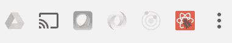

好了。因为您所在的页面正在运行 React 应用，所以 React Developer Tools 按钮会激活，让您知道它是可用的。现在尝试单击它：

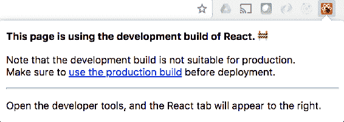

令人惊叹的 React 开发者工具可以检测到这是 React 库的开发构建。如果您意外地将 React 的开发构建部署到生产环境中，这可能会很有用。不可否认，如今使用`create-react-app`这样的工具更难做到这一点，在这里，您可以免费使用工具构建生产版本。

好的，现在您已经准备好了 React 浏览器工具，除了检测给定应用正在使用的 React 构建类型之外，它还能为您做些什么？让我们打开 Chrome 中的开发者工具窗格，了解：


您可以看到通常在“开发人员工具”窗格中看到的所有常规部分：元素、控制台等。但这与反应无关？我的“开发人员工具”窗格恰好停靠在浏览器窗口的右侧，因此您无法看到每个部分。如果您看到的是相同的内容，只需单击 Performance 旁边的箭头按钮：

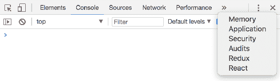

从菜单中选择 React，您将进入开发者工具面板的 React 部分。加载后，您应该会看到显示的根 React 组件：


如果您在任何浏览器中使用过 DOM inspector 工具，那么这个界面应该很熟悉。在左侧的主要部分中，有您的 React 元素树。这应该与您的 JSX 源代码非常相似。在该树的右侧，您有当前所选元素的详细信息，在本例中为`App`，它不定义任何属性。

如果展开`App`，您将看到其子 HTML 标记和其他 React 元素：


这是运行`create-react-app`后的默认源代码，因此`App`元素下没有太多的兴趣。要进一步探索 React 开发者工具，您必须在页面上引入更多组件并呈现更多 React 元素。

# 选择反应元素

使用 React Developer 工具选择 React 元素实际上有两种方法。打开“开发人员工具”窗格的“反应”部分时，将在元素树中自动选择“反应”应用的根元素。但是，可以展开此图元以显示子图元并选择它们。

让我们组合一个简单的应用，它将帮助您使用 React Developer 工具探索页面上呈现的 React 元素。从顶层开始，这里是`App`组件：

```jsx
import React from 'react'; 
import MyContainer from './MyContainer'; 
import MyChild from './MyChild'; 

const App = () => ( 
  <MyContainer>
```

```jsx
    <MyChild>child text</MyChild> 
  </MyContainer> 
); 

export default App; 
```

通过查看此源代码，您可以在页面上呈现 React 元素时，大致了解它们的总体结构。接下来，我们来看一下`MyContainer`组件：

```jsx
import React from 'react'; 
import './MyContainer.css'; 

const MyContainer = ({ children }) => ( 
  <section className="MyContainer"> 
    <header> 
      <h1>Container</h1> 
    </header> 
    <article>{children}</article> 
  </section> 
); 

export default MyContainer; 
```

该组件呈现一些标题文本以及传递给它的任何子项。在这个应用中，您将向它传递一个`MyChild`元素，下面让我们看看这个组件：

```jsx
import React from 'react'; 

const MyChild = ({ children }) => <p>{children}</p>; 

export default MyChild; 
```

现在当您运行`npm start`时，您应该会看到以下呈现的内容：

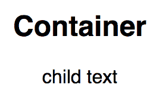

没什么可看的，但你知道一切都按预期进行。该应用足够小，您可以在 React Developer Tools 窗格的树状视图中看到每个 JSX 元素：


React 元素和其他元素类型之间存在视觉上的区别，因此在这个树状视图中更容易发现它们。例如，`<MyContainer>`元素为一种颜色，`<section>`元素为另一种颜色。让我们选择`<MyContainer>`元素，看看会发生什么：

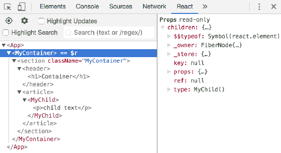

到目前为止，您只选择了`<App>`元素，因此没有任何关于该元素的显示，因为它没有道具或状态。另一方面，`<MyContainer>`元素确实有要显示的属性。在本例中，它具有`children`属性，因为`<MyChild>`元素被呈现为`<MyContainer>`的子元素。不要担心显示在所选元素右侧的细节，我们将在下一节详细介绍。

接下来，让我们激活选择工具。元素树上方的按钮中有一个目标图标。当您单击图标时，它会变为蓝色，让您知道它处于活动状态：

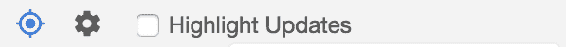

此工具的思想是允许您单击页面上的元素，并在“开发人员工具”窗格中选择相应的 React 组件。您会注意到，当该工具处于活动状态时，当您在图元上移动时，图元会高亮显示，让您知道它们是什么：


这里，鼠标指针位于页面上的`<p>`元素上，如小框所示。如果单击该元素，选择工具将在“开发人员工具”窗格中选择适当的元素，然后停用其自身。以下是选择时`<p>`元素的外观：


即使在这里选择了`<p>`元素，您也可以看到呈现它的 React 元素的道具—`<MyChild>`。如果您正在处理页面元素，并且不确定是哪个 React 元素呈现了它们，那么使用 React Developer 工具中的选择工具是一种快速查找方法。

# 搜索反应元素

当您的应用变大时，遍历页面上的元素或 React Developer Tools 面板中的元素树中的元素不会很好地工作。您需要一种搜索 React 元素的方法。幸运的是，元素树正上方有一个搜索框：

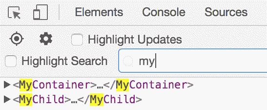

在搜索框中键入时，将在下面的元素树中过滤元素。如您所见，匹配的文本也会高亮显示。搜索只与元素的名称匹配，这意味着如果需要从 100 个相同类型的元素中筛选出来，搜索将不会帮助您。然而，即使在这些情况下，搜索也可以删除应用中的所有其他内容，这样您就可以手动查看较小的列表。

如果选中“高亮显示搜索”复选框，搜索将在主浏览器窗口中高亮显示 React 元素：

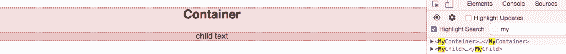

此页面上的 React 元素（`<MyContainer>`和`<MyChild>`均高亮显示，因为它们都与搜索条件`my`匹配。让我们看看当你搜索`child`时会发生什么：


这一次，您可以看到唯一与您的搜索匹配的 React 元素。它在主浏览器窗口和元素树中高亮显示。通过这样的搜索，当您在元素树中选择屏幕上的元素时，您可以确切地知道您正在使用的元素。

# 检查部件属性和状态

React 遵循一种声明性范例，因此它有助于将工具（如 React Developer 工具）放置到位，让您可以在浏览器中查看 JSX 标记。这只是 React 应用的静态方面—声明 UI 的元素并让数据控制其余部分。使用相同的工具，你可以在道具和状态流经你的应用时观看它们。为了演示这一点，让我们创建一个简单的列表，一旦挂载就会自动填充：

```jsx
import React, { Component } from 'react'; 
import MyItem from './MyItem'; 

class MyList extends Component { 
  timer = null; 
  state = { items: [] };
  componentDidMount() { 
    this.timer = setInterval(() => { 
      if (this.state.items.length === 10) { 
        clearInterval(this.timer); 
        return; 
      } 

      this.setState(state => ({ 
        ...state, 
        items: [ 
          ...state.items, 
          { 
            label: 'Item ${state.items.length + 1}', 
            strikethrough: false 
          } 
        ] 
      })); 
    }, 3000); 
  } 

  componentWillUnmount() { 
    clearInterval(this.timer); 
  } 

  onItemClick = index => () => { 
    this.setState(state => ({ 
      ...state, 
      items: state.items.map( 
        (v, i) => 
          index === i 
            ? { 
                ...v, 
                strikethrough: !v.strikethrough 
              } 
            : v 
      ) 
    })); 
  }; 

  render() { 
    return ( 
      <ul> 
        {this.state.items.map((v, i) => ( 
          <MyItem 
            key={i} 
            label={v.label} 
            strikethrough={v.strikethrough} 
            onClick={this.onItemClick(i)}

          /> 
        ))} 
      </ul> 
    ); 
  } 
} 

export default MyList; 
```

下面是该组件所做的一切的粗略分解：

*   `timer`和`state`：这些属性已初始化。该组件的主要状态是一个`items`数组。
*   `componentDidMount()`：设置一个间隔计时器，每隔三秒向`items`数组添加一个新值。一旦有十个项目，间隔将被清除。
*   `componentWillUnmount()`：确保强制清除`timer`属性。

*   `onItemClick()`：接受一个`index`参数并返回索引的事件处理程序。调用处理程序时，`strikethrough`状态被切换。
*   `render()`：呈现`<MyItem>`元素的`<ul>`列表，传递相关道具。

这里的想法是慢慢地构建列表，以便您可以在浏览器工具中观察状态的变化。然后，通过`MyList`元素，您可以观看传递给它的道具。以下是此组件的外观：

```jsx
import React from 'react'; 

const MyItem = ({ label, strikethrough, onClick }) => ( 
  <li 
    style={{ 
      cursor: 'pointer', 
      textDecoration: strikethrough ? 'line-through' : 'none' 
    }} 
    onClick={onClick} 
  > 
    {label} 
  </li> 
); 

export default MyItem; 
```

这是一个简单的列表项。`textDecoration`样式根据`strikethrough`道具的值进行更改。如果这是真的，文本将显示为删除。

让我们在浏览器中加载此应用，并在调用间隔处理程序时观察`MyList`的状态变化。加载应用后，确保已打开 React Developer Tools 窗格并准备就绪。然后，展开`<App>`元素并选择`<MyList>`。您将在右侧看到元素的状态：


左侧呈现的内容与右侧显示的选定`<MyList>`元素的状态相匹配。有一个包含 5 项的数组，页面上呈现了一个包含 5 项的列表。本例使用间隔计时器随时间更新状态（直到达到 10 项）。如果仔细观察，可以看到，随着新列表项的添加，右侧的状态值将与呈现的内容同步更改。还可以展开状态中的各个项以查看其值：

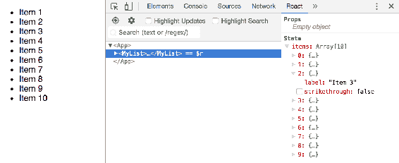

如果展开`<MyList>`元素，您将看到由于将项目添加到`items`数组状态而呈现的所有`<MyItem>`元素。从那里，你可以选择`<MyItem>`元素来查看它的道具和状态。在本例中，`<MyItem>`元素只有 props 无状态：


您可以在左边的树状视图中看到传递给给定元素的道具。但是，与右侧显示选定元素的属性值的值相比，这有点难以读取。以下道具传递给`<MyItem>`：

*   `label`：要呈现的文本
*   `onClick`：点击项目时调用的函数
*   `strikethrough`：如果为`true`，则文本以`strikethrough`样式呈现

可以在重新渲染元素时观察属性值的变化。在这个应用中，当你点击一个列表项时，handler 函数将改变`<MyList>`元素中的项目列表的状态。具体来说，单击的项目的索引将切换其`strikethrough`值。这反过来会导致`<MyItem>`元素使用新的属性值重新渲染自身。如果您将要单击的元素保留在“开发人员工具”窗格中的选中状态，则可以在道具更改时密切关注它们：


第一项的文本以`strikethrough`样式呈现。这是因为`strikethrough`属性是`true`。如果仔细查看“开发人员工具”窗格中元素树右侧的道具值，可以看到单个道具在更改时闪烁黄色，这是一个便于调试组件的视觉提示。

# 操纵元素状态值

React Developer Tools 允许您检查所选元素的当前状态。您还可以在状态更改发生时监视它们，如前一节所示，您已经设置了一个间隔计时器，该计时器随时间改变元素的状态。元素的状态也可以以有限的方式操纵。

对于下一个示例，让我们修改`MyList`组件以删除间隔计时器，并在构建它时简单地填充状态：

```jsx
import React, { Component } from 'react'; 
import MyItem from './MyItem';
class MyList extends Component { 
  timer = null; 
  state = { 
    items: new Array(10).fill(null).map((v, i) => ({ 
      label: 'Item ${i + 1}', 
      strikethrough: false
    })) 
  }; 

  onItemClick = index => () => { 
    this.setState(state => ({ 
      ...state, 
      items: state.items.map( 
        (v, i) => 
          index === i 
            ? { 
                ...v, 
                strikethrough: !v.strikethrough 
              } 
            : v 
      ) 
    })); 
  }; 

  render() { 
    return ( 
      <ul> 
        {this.state.items.map((v, i) => ( 
          <MyItem 
            key={i} 
            label={v.label} 
            strikethrough={v.strikethrough} 
            onClick={this.onItemClick(i)} 
          /> 
        ))} 
      </ul> 
    ); 
  } 
} 

export default MyList; 
```

现在，当您运行此应用时，您将看到立即呈现的 10 个项目。除此之外，没有其他变化。您仍然可以单击单个项目以切换其`strikethrough`状态。启动并运行此应用后，请确保 React Developer Tools 浏览器窗格已打开，以便您可以选择`<MyList>`元素：

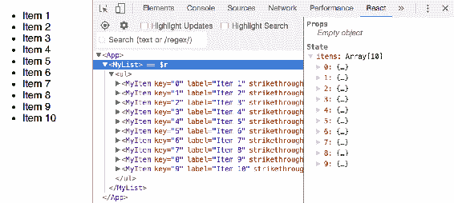

在右侧，可以看到选定图元的状态。实际上，您可以展开`items`数组中的一个对象并更改其属性值：


第一个对象在`items`数组状态下的`label`和`strikethrough`属性发生了变化。这导致`<MyList>`和第一批`<MyItem>`元素被重新渲染。正如预期的那样，更改的状态将反映在左侧的渲染输出中。当您需要对未按应有方式更新呈现内容的组件进行故障排除时，这非常方便。您不必在组件中编排一些测试代码，只需直接进入渲染元素的状态并在浏览器中对其进行操作即可。

使用 React Developer 工具编辑这种状态的一个警告是，您不能从集合中添加或删除项。例如，我不能向`items`数组添加新项，也不能向数组中的一个对象添加新属性。为此，您需要在代码中协调您的状态，正如您在前面的示例中所做的那样。

# 分析组件性能

通过 React 开发人员工具，可以更轻松地分析 React 组件的性能。这样可以更容易地发现在实际上不需要重新渲染时导致元素重新渲染的更新。它还可以更容易地收集给定组件所花费的 CPU 时间量，以及在其使用寿命期间所花费的 CPU 时间。

尽管 React Developer 工具不包括任何内存配置文件工具，但我们将研究如何使用现有的内存开发工具专门配置 React 元素。

# 取消对账工作

协调是在呈现 React 元素时发生的事情。它首先计算将呈现元素当前状态和道具的虚拟 DOM 树。然后，将此树与元素的现有树进行比较，假设它至少已经渲染过一次。React 这样做的原因是，在与 DOM 交互之前，在 JavaScript 中协调这样的更改更有效。与简单的 JavaScript 代码相比，DOM 交互相对昂贵。此外，React reconciler 还提供了一些常见的启发式方法。

React 为您处理所有这些，您只需要考虑编写声明性 React 组件。这并不意味着您永远不会遇到性能问题。JavaScript 中的协调通常比直接操作 DOM 表现更好，这并不意味着它便宜。因此，让我们将一个应用放在一起，突出显示一些与协调相关的潜在问题，然后让我们借助 React 开发人员工具解决这些问题。

我们将创建一个应用来呈现组和每个组的成员。它将具有更改组数和每个组中成员数的控件。最后，每个渲染组都有一个用于添加新组的按钮。让我们从`index.js`开始：

```jsx
import React from 'react'; 
import ReactDOM from 'react-dom'; 
import './index.css'; 
import App from './App'; 
import registerServiceWorker from './registerServiceWorker'; 

const update = () => { 
  ReactDOM.render(<App />, document.getElementById('root')); 
}; 

setInterval(update, 5000); 
update(); 

registerServiceWorker(); 
```

这几乎就像你在`create-react-app`中看到的任何`index.js`。区别在于有一个`update()`函数，它在一段时间间隔内使用`setInterval()`调用。你不会随机抛出一个间隔计时器，每隔五秒钟重新呈现你的应用到你的应用中。我在这里添加这一点，只是为了简单地说明重复的重新渲染以及这会产生什么样的和解结果。在一个真实的应用中，你可能会发现类似的行为，在这个应用中，你更新组件以保持其状态新鲜。这是这种行为的近似值。

接下来，您将看到主`App`组件。这是所有应用状态和大部分功能所在的位置。让我们来看看整个文件，然后我会把它分解给你：

```jsx
import React, { Component } from 'react'; 
import './App.css'; 
import Group from './Group';

class App extends Component { 
  state = { 
    groupCount: 10, 
    memberCount: 20, 
    groups: [] 
  }; 

  refreshGroups = (groups, members) => { 
    this.setState(state => { 
      const groupCount = 
        groups === undefined ? state.groupCount : groups; 
      const memberCount = 
        members === undefined ? state.memberCount : members; 
      return { 
        ...state, 
        groupCount, 
        memberCount, 
        groups: new Array(groupCount).fill(null).map((g, gi) => ({ 
          name: 'Group ${gi + 1}', 
          members: new Array(memberCount) 
            .fill(null) 
            .map((m, mi) => ({ name: 'Member ${mi + 1}' })) 
        })) 
      }; 
    }); 
  }; 

  onGroupCountChange = ({ target: { value } }) => { 
    // The + makes value a number. 
    this.refreshGroups(+value); 
  }; 

  onMemberCountChange = ({ target: { value } }) => { 
    this.refreshGroups(undefined, +value); 
  }; 

  onAddMemberClick = i => () => { 
    this.setState(state => ({ 
      ...state, 
      groups: state.groups.map( 
        (v, gi) => 
          i === gi 
            ? { 
                ...v, 
                members: v.members.concat({ 
                  name: 'Member ${v.members.length + 1}' 
                }) 
              }
            : v 
      ) 
    })); 
  }; 

  componentWillMount() { 
    this.refreshGroups(); 
  } 

  render() { 
    return ( 
      <section className="App"> 
        <div className="Field"> 
          <label htmlFor="groups">Groups</label> 
          <input 
            id="groups" 
            type="range" 
            value={this.state.groupCount} 
            min="1" 
            max="20" 
            onChange={this.onGroupCountChange} 
          /> 
        </div> 
        <div className="Field"> 
          <label htmlFor="members">Members</label> 
          <input 
            id="members" 
            type="range" 
            value={this.state.memberCount} 
            min="1" 
            max="20" 
            onChange={this.onMemberCountChange} 
          /> 
        </div> 
        {this.state.groups.map((g, i) => ( 
          <Group 
            key={i} 
            name={g.name} 
            members={g.members} 
            onAddMemberClick={this.onAddMemberClick(i)} 
          /> 
        ))} 
      </section> 
    ); 
  } 
} 

export default App; 
```

让我们从初始状态开始：

```jsx
state = { 
  groupCount: 10, 
  memberCount: 20, 
  groups: [] 
}; 
```

此组件管理的状态如下所示：

*   `groupCount`：需要渲染多少组
*   `memberCount`：每组有多少成员
*   `groups`：组对象数组

这些值中的每一个都存储为状态，因为它们可以更改。接下来我们来看`refreshGroups()`函数：

```jsx
refreshGroups = (groups, members) => { 
  this.setState(state => { 
    const groupCount = 
      groups === undefined ? state.groupCount : groups; 
    const memberCount = 
      members === undefined ? state.memberCount : members; 
    return { 
      ...state, 
      groupCount, 
      memberCount, 
      groups: new Array(groupCount).fill(null).map((g, gi) => ({ 
        name: 'Group ${gi + 1}', 
        members: new Array(memberCount) 
          .fill(null) 
          .map((m, mi) => ({ name: 'Member ${mi + 1}' })) 
      })) 
    }; 
  }); 
}; 
```

在这里，不要过于担心实现细节。此函数的目的是随着组数和组成员数的变化填充状态。例如，一旦调用，您的状态如下所示：

```jsx
{ 
  groupCount: 10, 
  memberCount: 20, 
  groups: [ 
    {
      Name: 'Group 1', 
      Members: [ { name: 'Member 1' }, { name: 'Member 2' } ] 
    }, 
    { 
      Name: 'Group 2', 
      Members: [ { name: 'Member 1' }, { name: 'Member 2' } ] 
    } 
  ] 
} 
```

之所以在它自己的函数中定义它，是因为您将在多个地方调用它。例如，在`componentWillMount()`中调用它，以便组件在第一次渲染之前具有初始状态。接下来，让我们看一下事件处理程序函数：

```jsx
onGroupCountChange = ({ target: { value } }) => { 
  this.refreshGroups(+value); 
}; 

onMemberCountChange = ({ target: { value } }) => { 
  this.refreshGroups(undefined, +value); 
}; 

onAddMemberClick = i => () => { 
  this.setState(state => ({ 
    ...state, 
    groups: state.groups.map( 
      (v, gi) => 
        i === gi 
          ? { 
              ...v, 
              members: v.members.concat({ 
                name: 'Member ${v.members.length + 1}' 
              }) 
            } 
          : v 
    ) 
  })); 
}; 
```

这些措施的作用如下：

*   `onGroupCountChange()`：通过调用`refreshGroups()`更新组状态，并使用新的组数
*   `onMemberCountChange()`：使用新成员数更新 groups 状态中的每个成员对象。
*   `onAddMemberClick()`：通过在给定索引处添加新成员对象来更新组状态

最后，让我们看看这个组件呈现的 JSX：

```jsx
render() { 
  return ( 
    <section className="App"> 
      <div className="Field"> 
        <label htmlFor="groups">Groups</label> 
        <input 
          id="groups" 
          type="range" 
          value={this.state.groupCount} 
          min="1" 
          max="20" 
          onChange={this.onGroupCountChange} 
        /> 
      </div> 
      <div className="Field"> 
        <label htmlFor="members">Members</label> 
        <input 
          id="members" 
          type="range" 
          value={this.state.memberCount} 
          min="1" 
          max="20" 
          onChange={this.onMemberCountChange} 
        /> 
      </div> 
      {this.state.groups.map((g, i) => ( 
        <Group 
          key={i} 
          name={g.name} 
          members={g.members} 
          onAddMemberClick={this.onAddMemberClick(i)} 
        /> 
      ))} 
    </section> 
  ); 
} 
```

该组件渲染两个滑块控件：一个控制组的数量，另一个控制每个组中成员的数量。接下来，呈现组列表。对于这个，有一个`Group`组件，它看起来像这样：

```jsx
import React from 'react';
const Group = ({ name, members, onAddMemberClick }) => ( 
  <section> 
    <h4>{name}</h4> 
    <button onClick={onAddMemberClick}>Add Member</button> 
    <ul>{members.map((m, i) => <li key={i}>{m.name}</li>)}</ul> 
  </section> 
); 

export default Group; 
```

这将呈现组的名称，后跟添加新成员的按钮，然后是成员列表。首次加载页面时，您将看到如下输出：

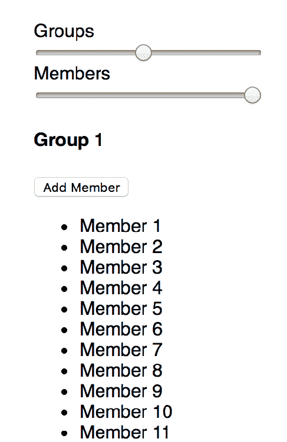

这里只显示了输出的一部分，组 1 中有更多的成员，后面有更多的组，使用相同的模式渲染。在使用本页上的任何控件之前，请打开 React Developer Tools。然后，查找突出显示更新复选框：


选中此框后，渲染元素的状态将在更新时得到视觉增强。回想一下，您将`App`组件设置为每五秒钟重新渲染一次。每次都会调用`setState()`，其结果如下：


蓝色边框在刚刚更新的元素周围短暂闪烁。虽然您无法在这个屏幕截图中看到`<App>`呈现的所有内容，但蓝色边框围绕着所有`<Group>`元素，因为它表明`<App>`组件刚刚更新。如果你观察屏幕几分钟，你会发现蓝色边框每 5 秒显示一次。这表明即使元素的状态没有任何变化，它仍在执行协调。它可能遍历数百或数千个树节点，以找到任何差异并进行适当的 DOM 更新。

虽然您无法注意到此应用中的差异，但更复杂的 React 应用的累积效应可能会成为一个问题。在这种特定情况下，由于更新频率，这是一个潜在的问题。

让我们在`App`中添加一个选项，寻找执行完全对账的快捷方式：

```jsx
shouldComponentUpdate(props, state) { 
  return ( 
    this.state.groupCount !== state.groupCount || 
    this.state.memberCount !== state.memberCount 
  ); 
} 
```

如果 React 组件类具有`shouldComponentUpdate()`方法并且返回 false，则完全避免协调，并且不会重新渲染。通过确保选中“突出显示更新”复选框，可以立即在浏览器中看到更改。如果你再坐下来观察一会儿，你会发现不再有蓝色边框出现。

更新边框有不同的颜色。您看到的蓝色表示不经常更新。根据更新的频率，这些范围一直到红色。例如，如果您积极地来回滑动“组”或“成员”滑块，则应该能够生成红色边框。

Note, however, that you can't always avoid reconciliation. What's important is that you macro-optimize for this. For example, the solution that you've just added to the `App` component addresses re-rendering a huge component with lots of children when it clearly isn't necessary. This is valuable compared to micro-optimizing the `Group` component—it's small enough that you don't save much by avoiding reconciliation here.

你的目标应该是保持高水平，保持简单。这是 bug 进入组件的入口点。事实上，您已经引入了一个 bug。尝试为不再工作的组单击“添加成员”按钮之一。这是因为您在`shouldComponentUpdate()`中使用的标准只考虑了`groupCount`和`memberCount`状态。它没有考虑向组中添加新成员。

要解决此问题，您必须使用与`shouldComponentUpdate()`中的`groupCount`和`memberState`状态相同的方法。如果所有组的成员总数发生变化，则您知道您的应用需要重新呈现。让我们在`shouldComponentUpdate()`中进行此更改：

```jsx
shouldComponentUpdate(props, state) { 
  const totalMembers = ({ groups }) => 
    groups 
      .map(group => group.members.length) 
      .reduce((result, m) => result + m); 

  return ( 
    this.state.groupCount !== state.groupCount || 
    this.state.memberCount !== state.memberCount || 
    totalMembers(this.state) !== totalMembers(state) 
  ); 
} 
```

`totalMembers()`函数将组件状态作为参数，并返回组成员的总数。使用此选项，您可以添加另一个条件，该条件使用此函数将当前状态中的成员数与新状态中的成员数进行比较：

```jsx
totalMembers(this.state) !== totalMembers(state) 
```

现在，如果您再次尝试单击 addmember 按钮，它将按预期添加成员，因为组件可以检测到状态的某些变化。再一次，您需要权衡将成员数组的长度相加并比较两者的成本，以及在 React-DOM 树中执行协调的成本。

# 查找 CPU 密集型组件

`shouldComponentUpdate()`生命周期方法可以对组件性能进行宏观优化。如果显然不需要重新渲染元素，那么让我们完全避开协调过程。其他时候，协调是无法避免的，因为元素状态经常更改，这些更改需要反映在 DOM 中，以便用户查看。

React 16 的开发版本内置了一些方便的性能工具。它调用相关的浏览器开发工具 API，以便在记录概要文件时记录相关度量。请注意，这与您先前安装的 React Developer Tools 浏览器扩展无关；这只是在开发模式下与浏览器交互的简单反应。

其目的是生成特定于 React 的计时数据，这样您就不必在心里将 20 个其他浏览器性能指标映射到您的组件，并弄清楚它们都意味着什么。一切都在等着你。

为了演示此功能，您可以使用上一节中的相同代码，并进行一些小的调整。首先，让我们在每个组中提供更多成员：

```jsx
state = { 
  groupCount: 1, 
  memberCount: 200, 
  groups: [] 
}; 
```

我们增加这个数字的原因是，当您摆弄控件时，应用的性能会下降。您希望使用性能开发工具捕获这种性能下降。接下来，让我们增加成员字段的最大滑块值：

```jsx
<div className="Field"> 
  <label htmlFor="members">Members</label> 
  <input 
    id="members" 
    type="range" 
    value={this.state.memberCount}
    min="1" 
    max="200" 
    onChange={this.onMemberCountChange} 
  /> 
</div> 
```

就这样。现在，当您在浏览器中查看此应用时，它应该如下所示：


在更改这些滑块值之前，请确保“开发人员工具”窗格已打开，并且“性能”选项卡已选中：


接下来，单击左侧的圆圈图标开始录制性能配置文件。该按钮将变为红色，您将看到出现一个状态对话框，指示分析已开始：


录制完毕后，将“组”滑块一直向右滑动。当您靠近右边时，您可能会注意到 UI 中存在一些延迟，这是一件好事，因为这正是您试图设计的。到达滑块右侧后，单击单击开始录制的红色圆圈，停止录制。您应该看到类似以下内容：

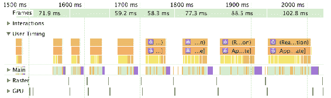

我扩展了左侧的用户计时标签，因为这是显示所有 React 特定计时的位置。在这个图表中，时间从左向右流动。事情越广泛，发生的时间就越长。您可能会注意到，当您靠近滑块右侧时，性能会恶化（这也可能与您在滑块控件中注意到的滞后相吻合）。

那么，让我们来探讨一下这些数据的含义。我们将查看最右侧的数据，因为这是性能真正下降的地方：

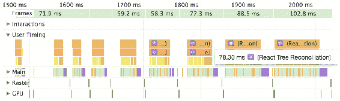

此标签告诉您，执行 React 树协调花了 78 毫秒。速度不是很慢，但足够慢，可以对用户体验产生切实的影响。当您在这些标签中向下移动时，您应该能够更好地了解为什么对账过程需要如此长的时间。让我们看下一个：


这很有趣：App[update]标签告诉您，`App`组件中的状态更新花费了 78 毫秒。此时，您知道`App`中的状态更新导致 React 对账过程耗时 78 毫秒。让我们跳到下一个层次。在这个级别上，有两种颜色。让我们看看黄色代表什么：


通过将鼠标悬停在其中一个黄色切片上，您可以看到[update]组花了 7.7 毫秒来更新`Group`组件。这是一小段时间，可能无法以任何有意义的方式加以改进。但是，看看代表`Group`更新的黄色片的数量。所有这些单位数计时片段加起来占整个对账时间的很大一部分。最后，让我们看看棕色：


这个标签，组[mount]，表示安装一个新的`Group`组件需要 6.5 毫秒。同样，这是一个很小的数字，但其中有几个部分。

此时，您已经深入到组件层次结构的底部，以检查导致性能问题的原因。这里有什么外卖？您确定 React 执行对账所花费的大部分时间发生在`Group`组件中。每次渲染一个`Group`组件时，只需一位数毫秒即可完成，但有很多组。

多亏了 browser developer tools 中的性能图，您现在知道，更改代码不会带来任何好处，您不会以任何有意义的方式在一位数毫秒的时间内提高。在这个应用中，修复向右移动滑块时感觉到的延迟的唯一方法是以某种方式减少页面上呈现的元素数量。另一方面，您可能会注意到，其中一些 React 性能指标有 50 毫秒，在某些情况下有数百毫秒。您可以轻松地修复代码以提供更好的用户体验。关键是，如果没有性能开发工具（如本节中使用的工具），您将永远不会知道什么真正起作用。

当您以用户身份与应用交互时，常常会感觉到性能问题。但验证组件是否存在性能问题的另一种方法是查看显示在绿色 React 度量上方的帧速率。它显示了在下面相应的 React 代码中渲染帧所用的时间。您刚刚构建的这个示例在滑块向左时以每秒 40 帧的速度开始，但在滑块一直向右时以每秒 10 帧的速度结束。

# 总结

在本章中，您了解了可直接通过 web 浏览器使用的 React 工具。这里选择的工具是名为 React Developer Tools 的 Chrome/Firefox 扩展。此扩展将特定于 React 的功能添加到浏览器本机开发人员工具中。安装扩展后，您学习了如何选择 React 元素以及如何按标记名搜索 React 元素。

接下来，您在 React Developer 工具中查看了所选 React 组件的属性和状态值。当应用更改这些值时，这些值会自动保持最新。然后学习了如何在浏览器中直接操作元素状态。这里的限制是不能从集合中添加或删除值。

最后，您学习了如何在浏览器中分析 React 组件的性能。这不是 React Developer Tools 功能，而是 React 16 的开发构建自动完成的功能。使用这样的配置文件可以确保在遇到性能问题时解决了正确的问题。您在本章中看到的示例表明，代码实际上没有任何问题，而是一次在屏幕上呈现太多元素的问题。

在下一章中，您将构建一个基于 Redux 的 React 应用，并使用 Redux DevTools 检测应用的状态。