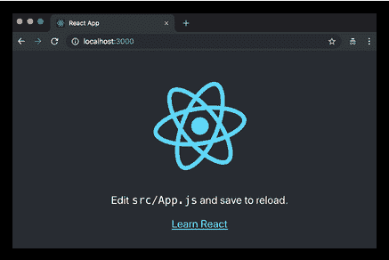
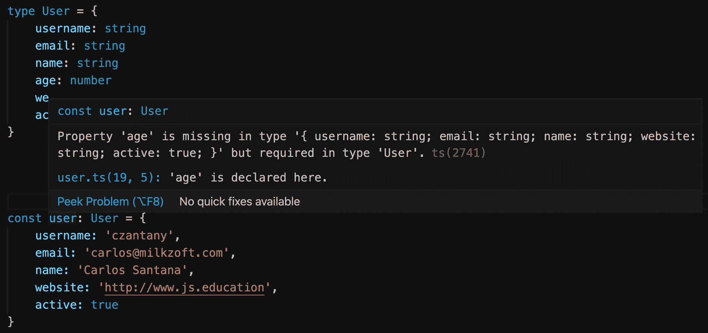
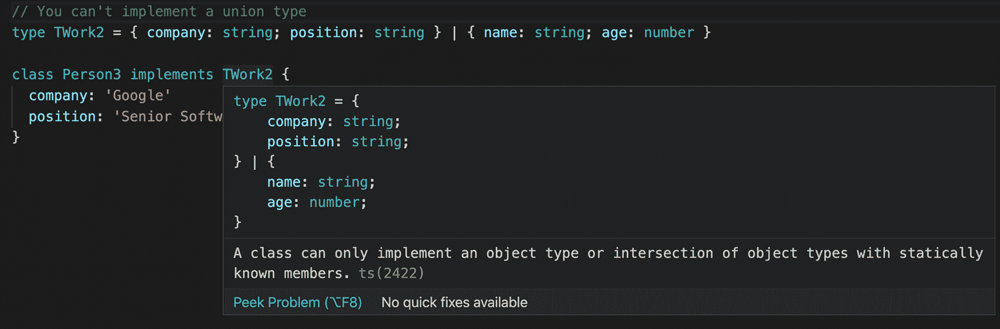

# 一、使用 React 迈出第一步

读者好!！

本书假设您已经知道 React 是什么以及它可以为您解决什么问题。您可能已经使用 React 编写了一个小型/中型应用程序，并且希望提高技能并回答所有开放性问题。您应该知道 React 是由 Facebook 的开发人员和 JavaScript 社区中的数百名贡献者维护的。React 是创建 UI 的最流行的库之一，众所周知，它的速度很快，这得益于它使用**文档对象模型**（**DOM**的智能方式）。它与 JSX 一起提供，JSX 是一种用 JavaScript 编写标记的新语法，它要求您改变关于关注点分离的想法。它有许多很酷的特性，比如服务器端渲染，这使您能够编写通用应用程序。

在第一章中，我们将介绍一些基本概念，这些概念是有效使用 React 所必须掌握的，但非常简单，初学者可以理解：

*   命令式编程和声明式编程的区别
*   React 组件及其实例，以及 React 如何使用元素控制 UI 流
*   React 如何改变了我们构建 web 应用程序的方式，实施了不同的关注点分离新概念，以及其不受欢迎的设计选择背后的原因
*   为什么人们会感到 JavaScript 疲劳，以及如何避免开发人员在接近 React 生态系统时最常见的错误
*   TypeScript 如何改变游戏

# 技术要求

为了学习本书，您需要有一些使用终端运行一些 Unix 命令的最低经验。此外，还需要安装 Node.js。你有两个选择。第一个是直接从官网[下载 Node.jshttps://nodejs.org](https://nodejs.org) ，第二个选项（推荐）是从[安装**节点版本管理器**（**NVM**）https://github.com/nvm-sh/nvm](https://github.com/nvm-sh/nvm) 。

如果您决定使用 NVM，您可以安装任意版本的 Node.js，并使用`nvm install`命令切换版本：

```jsx
# "node" is an alias for the latest version:
nvm install node

# You can also install a global version of node (will install the latest from that version):
nvm install 10
nvm install 9
nvm install 8
nvm install 7
nvm install 6

# Or you can install a very specific version:
nvm install 6.14.3
```

安装不同版本后，可以使用`nvm use`命令进行切换：

```jsx
nvm use node # for latest version
nvm use 10
nvm use 6.14.3
```

最后，您可以通过运行以下命令来指定默认的`node`版本：

```jsx
nvm alias default node
nvm alias default 10
nvm alias default 6.14.3
```

简而言之，以下是完成本章的要求列表：

*   **Node.js（12+）**：[https://nodejs.org](https://nodejs.org)
*   **NVM**：[https://github.com/nvm-sh/nvm](https://github.com/nvm-sh/nvm)
*   **VS 代码**：[https://code.visualstudio.com](https://code.visualstudio.com)
*   **打字稿**：[https://www.npmjs.com/package/typescript](https://www.npmjs.com/package/typescript)

您可以在本书的 GitHub 存储库中找到本章的代码：[https://github.com/PacktPublishing/React-17-Design-Patterns-and-Best-Practices-Third-Edition](https://github.com/PacktPublishing/React-17-Design-Patterns-and-Best-Practices-Third-Edition) 。

# 区分声明式编程和命令式编程

阅读 React 文档或关于 React 的博客文章时，您无疑会遇到术语**声明性**。React 如此强大的原因之一是它强制执行声明式编程范式。

因此，要掌握 React，必须了解声明式编程的含义以及命令式编程和声明式编程之间的主要区别。实现这一点最简单的方法是将命令式编程视为描述事物如何工作的一种方式，将声明式编程视为描述您想要实现的目标的一种方式。

在命令式世界中，进入酒吧喝啤酒是一个真实的例子，通常你会给酒保以下指示：

1.  找一个玻璃杯，从架子上拿下来。
2.  把玻璃杯放在水龙头下面。
3.  拉下把手，直到杯子装满。
4.  把杯子递给我。

在声明式的世界里，你只会说“我能喝杯啤酒吗？”

声明式方法假设调酒师已经知道如何供应啤酒，这是声明式编程工作方式的一个重要方面。

让我们进入一个 JavaScript 示例。在这里，我们将编写一个简单的函数，给定一个小写字符串数组，返回一个具有相同大写字符串的数组：

```jsx
toUpperCase(['foo', 'bar']) // ['FOO', 'BAR']
```

解决该问题的必要功能将按以下方式实施：

```jsx
const toUpperCase = input => { 
  const output = []

  for (let i = 0; i < input.length; i++) { 
    output.push(input[i].toUpperCase())
  } 

  return output
}
```

首先，创建一个包含结果的空数组。然后，函数遍历输入数组的所有元素，并将大写值推送到空数组中。最后，返回输出数组。

声明性解决方案如下所示：

```jsx
const toUpperCase = input => input.map(value => value.toUpperCase())
```

输入数组的项被传递给一个`map`函数，该函数返回一个包含大写值的新数组。有一些显著的差异需要注意：前一个例子不那么优雅，需要更多的努力才能理解。后者更简洁，更易于阅读，这在维护性至关重要的大型代码库中产生了巨大的差异。

另一个值得一提的方面是，在声明性示例中，不需要使用变量，也不需要在执行期间更新它们的值。声明式编程倾向于避免创建和改变状态。

作为最后一个示例，让我们看看 React 是声明性的意味着什么。我们将尝试解决的问题是 web 开发中的一项常见任务：创建切换按钮。

设想一个简单的 UI 组件，例如切换按钮。单击它时，如果它以前是灰色（关闭），它将变为绿色（打开）；如果它以前是绿色（打开），它将切换为灰色（关闭）。

这样做的必要方法如下：

```jsx
const toggleButton = document.querySelector('#toggle')

toogleButton.addEventListener('click', () => {
  if (toggleButton.classList.contains('on')) {
    toggleButton.classList.remove('on')
    toggleButton.classList.add('off')
  } else {
    toggleButton.classList.remove('off')
    toggleButton.classList.add('on')
  }
})
```

这是必须的，因为更改类需要所有指令。相反，使用 React 的声明性方法如下所示：

```jsx
// To turn on the Toggle
<Toggle on />

// To turn off the toggle
<Toggle />
```

在声明式编程中，开发人员只描述他们想要实现的内容，而不需要列出使其工作的所有步骤。React 提供了一种声明性的方法，这使得它易于使用，因此，生成的代码很简单，这通常会导致更少的 bug 和更高的可维护性。

在下一节中，您将了解 React 元素是如何工作的，并且您将获得更多关于`props`如何在 React 组件上传递的上下文。

# 元素如何工作

本书假设您熟悉组件及其实例，但如果您想有效地使用 React，还需要了解另一个对象，即元素。

无论何时调用`createClass`、扩展`Component`或声明无状态函数，都是在创建组件。React 在运行时管理组件的所有实例，并且在给定的时间点内存中可以有同一组件的多个实例。

如前所述，React 遵循声明性范式，不需要告诉它如何与 DOM 交互；您在屏幕上声明希望看到的内容，然后 React 为您完成任务。

正如您可能已经经历过的，大多数其他 UI 库的工作方式都是相反的：它们将保持界面更新的责任留给开发人员，开发人员必须手动管理 DOM 元素的创建和销毁。

为了控制 UI 流，React 使用一种特殊类型的对象，称为**元素**，它描述了屏幕上必须显示的内容。与组件及其实例相比，这些不可变对象要简单得多，并且只包含表示接口所严格需要的信息。

以下是一个元素示例：

```jsx
  { 
    type: Title, 
    props: { 
      color: 'red', 
      children: 'Hello, Title!' 
    } 
  }
```

元素有`type`，这是最重要的属性，还有一些属性。还有一个称为`children`的特殊属性，它是可选的，表示元素的直接后代。

`type`很重要，因为它告诉 React 如何处理元素本身。如果`type`是字符串，则元素表示 DOM 节点；如果`type`是函数，则元素表示组件。

DOM 元素和组件可以按如下方式相互嵌套，以表示渲染树：

```jsx
  { 
    type: Title, 
    props: { 
      color: 'red', 
      children: { 
        type: 'h1', 
        props: { 
          children: 'Hello, H1!' 
        } 
      } 
    } 
  }
```

当元素的类型是函数时，React 调用函数，传递`props`以返回底层元素。它继续递归地对结果执行相同的操作，直到得到可以在屏幕上呈现的 DOM 节点树。这个过程称为**协调**，React DOM 和 React Native 都使用它来创建各自平台的 UI。

React 是一个游戏规则改变者，所以在一开始，React 语法对你来说可能很奇怪，但是一旦你理解了它的工作原理，你就会喜欢它，为此，你需要忘记目前为止你所知道的一切。

# 忘却一切

第一次使用 React 通常需要开放的思维，因为它是设计 web 和移动应用程序的一种新方法。React 试图创新我们构建 UI 的方式，其路径打破了大多数著名的最佳实践。

在过去的二十年中，我们认识到关注点的分离非常重要，我们过去常常将其视为将逻辑与模板分离。我们的目标一直是在不同的文件中编写 JavaScript 和 HTML。已经创建了各种模板解决方案来帮助开发人员实现这一点。

问题是，在大多数情况下，这种分离只是一种幻觉，事实是 JavaScript 和 HTML 紧密耦合，不管它们住在哪里。

让我们看一个模板示例：

```jsx
{{#items}} 
  {{#first}} 
    <li><strong>{{name}}</strong></li> 
  {{/first}} 
 {{#link}} 
    <li><a href="{{url}}">{{name}}</a></li> 
  {{/link}} 
{{/items}}
```

前面的片段取自 Mustache 网站，它是最流行的模板系统之一。

第一行告诉 Mustach 循环遍历一组项目。在循环内部，有一些条件逻辑来检查`#first`和`#link`属性是否存在，并根据它们的值呈现不同的 HTML 片段。变量用大括号括起来。

如果您的应用程序只需要显示一些变量，那么模板库可能是一个很好的解决方案，但是当它开始使用复杂的数据结构时，情况会发生变化。模板系统及其**领域特定语言**（**DSL**）提供了一部分功能，它们试图提供真正编程语言的功能，但没有达到相同的完整性水平。如示例所示，模板高度依赖于从逻辑层接收的模型来显示信息。

另一方面，JavaScript 与模板呈现的 DOM 元素交互以更新 UI，即使它们是从单独的文件加载的。同样的问题也适用于样式–它们在不同的文件中定义，但它们在模板中引用，CSS 选择器遵循标记的结构，因此几乎不可能在不破坏另一个的情况下更改其中一个，这就是**耦合**的定义。这就是为什么传统的关注点分离最终更多的是技术分离，这当然不是一件坏事，但它不能解决任何实际问题。

React 试图通过将模板放在它们所属的位置（位于逻辑旁边）向前迈进一步。它这样做的原因是 React 建议您通过组合称为组件的小砖块来组织应用程序。框架不应该告诉您如何分离关注点，因为每个应用程序都有自己的关注点，只有开发人员应该决定如何限制其应用程序的边界。

基于组件的方法极大地改变了我们编写 web 应用程序的方式，这就是为什么关注点分离的经典概念正逐渐被更现代的结构所取代。React 实施的范例并不新鲜，也不是由其创建者发明的，但 React 有助于使概念成为主流，而且最重要的是，它以一种更容易让具有不同专业水平的开发人员理解的方式进行了普及。

React 组件的呈现如下所示：

```jsx
return ( 
  <button style={{ color: 'red' }} onClick={this.handleClick}> 
    Click me! 
  </button> 
)
```

我们都同意这在一开始似乎有点奇怪，但那只是因为我们不习惯这种语法。一旦我们了解了它，意识到它的强大，我们就了解它的潜力。将 JavaScript 用于逻辑和模板不仅可以帮助我们更好地分离关注点，还可以为我们提供更强大的功能和更高的表现力，这正是我们构建复杂 UI 所需要的。

这就是为什么即使混合 JavaScript 和 HTML 的想法在一开始听起来很奇怪，给 React 5 分钟也是至关重要的。开始使用新技术的最好方法是在一个小型项目上试用它，看看它是如何进行的。总的来说，正确的方法是随时准备放弃一切，如果长期利益值得的话，改变你的心态。

还有另一个非常有争议且难以接受的概念，React 背后的工程师正试图将其推向社区：将样式逻辑也移动到组件内部。最终目标是封装用于创建组件的每一项技术，并根据其域和功能分离关注点。

以下是取自 React 文档的样式对象示例：

```jsx
const divStyle = { 
  color: 'white', 
  backgroundImage: `url(${imgUrl})`, 
  WebkitTransition: 'all', // note the capital 'W' here 
  msTransition: 'all' // 'ms' is the only lowercase vendor prefix 
}

ReactDOM.render(<div style={divStyle}>Hello World!</div>, mountNode)
```

开发人员使用 JavaScript 编写他们的风格的这套解决方案被称为`#CSSinJS`，我们将在*第 8 章*中详细讨论它，使您的组件看起来漂亮。

在下一节中，我们将看到如何避免 JavaScript 疲劳，这是由运行 React 应用程序（主要是 Web 包）所需的大量配置造成的。

# 理解 JavaScript 疲劳

有一种流行的观点认为 React 由大量的技术和工具组成，如果您想使用它，您必须与包管理器、Transpiler、模块绑定器以及无限多的不同库打交道。这一理念在人们中非常广泛和共享，以至于已经有了明确的定义，并被命名为**JavaScript 疲劳***。*

不难理解这背后的原因。React 生态系统中的所有存储库和库都是使用闪亮的新技术、最新版本的 JavaScript 以及最先进的技术和范例创建的。

此外，GitHub 上有大量 React 样板，每个样板都有数十个依赖项，可以为任何问题提供解决方案。很容易认为，开始使用 React 时需要所有这些工具，但这与事实相去甚远。尽管有这种常见的思维方式，React 是一个非常小的库，它可以在任何页面（甚至在 JSFIDLE 中）中使用，就像每个人使用 jQuery 或主干一样，只需在页面上的结束`body`元素之前包含脚本。

有两个脚本，因为 React 被分为两个包：

*   `react`：实现库的核心功能
*   `react-dom`：包含所有与浏览器相关的功能

这背后的原因是核心包用于支持不同的目标，例如浏览器中的 React DOM 和移动设备上的 React Native。在单个 HTML 页面中运行 React 应用程序不需要任何包管理器或复杂的操作。您只需下载分发包并自己托管即可（或使用[https://unpkg.com/](https://unpkg.com/) ），您可以在几分钟内开始使用 React 及其功能。

以下是要包含在 HTML 中的 URL，以开始使用 React：

*   [https://unpkg.com/react@17.0.1/umd/react.production.min.js](https://unpkg.com/react@17.0.1/umd/react.production.min.js)
*   [https://unpkg.com/react-dom@17.0.1/umd/react-dom.production.min.js](https://unpkg.com/react-dom@17.0.1/umd/react-dom.production.min.js)

如果我们只添加 core React 库，我们就不能使用 JSX，因为它不是浏览器支持的标准语言；但关键是从最基本的功能开始，并在需要时添加更多功能。对于一个简单的 UI，我们可以只使用`createElement`（`_jsx`在 React 17 上），只有当我们开始构建更复杂的东西时，我们才能包含一个 transpiler 来启用 JSX 并将其转换为 JavaScript。一旦这个应用程序增长了一点，我们可能需要一个路由来处理不同的页面和视图，我们也可以将其包括在内。

在某些时候，我们可能希望从一些 API 端点加载数据，如果应用程序不断增长，我们将需要一些外部依赖来抽象复杂的操作。只有在那一刻，我们才应该引入包管理器。然后，是时候将我们的应用程序拆分为单独的模块，并以正确的方式组织我们的文件了。此时，我们应该开始考虑使用模块绑定器。

按照这个简单的方法，就不会有疲劳。从一个有 100 个依赖项和数十个我们一无所知的`npm`包的样板开始，是最好的迷路方式。需要注意的是，每项与编程相关的工作（尤其是前端工程）都需要不断学习。web 的本质是以极快的速度发展，并根据用户和开发人员的需求进行更改。这就是我们的环境从一开始就运作的方式，也是它非常令人兴奋的原因。

随着我们在网络上工作经验的积累，我们认识到我们不可能掌握一切，我们应该找到正确的方法让自己不断更新以避免疲劳。我们能够跟随所有的新趋势，而不必为了它而跳进新的图书馆，除非我们有时间做一个附带的项目。

令人惊讶的是，在 JavaScript 世界中，一旦发布或起草了一个规范，社区中就有人将其作为 transpiler 插件或 polyfill 实现，让其他人在浏览器供应商同意并开始支持的情况下使用它。

这使得 JavaScript 和浏览器成为与任何其他语言或平台完全不同的环境。它的缺点是事情变化很快，但这只是在押注新技术与保持安全之间找到正确平衡的问题。

无论如何，Facebook 开发者非常关心**开发者体验**（**DX**），他们认真倾听社区的意见。因此，即使要使用 React，我们需要学习数百种不同的工具，这不是真的，但他们意识到人们正感到疲劳，于是他们发布了一个 CLI 工具，使构建和运行真正的 React 应用程序变得非常容易。

唯一的要求是使用`node.js/npm`环境并按如下方式全局安装 CLI 工具：

```jsx
npm install -g create-react-app
```

安装可执行文件后，我们可以使用它创建应用程序，并传递文件夹名称：

```jsx
create-react-app hello-world --template typescript
```

最后，我们使用`cd hello-world`移动到应用程序的文件夹中，只需运行以下命令：

```jsx
npm start
```

神奇的是，我们的应用程序运行时只有一个依赖项，但具有使用最先进技术构建完整 React 应用程序所需的所有功能。以下屏幕截图显示了使用`create-react-app`创建的应用程序的默认页面：



这基本上是您的第一个 React 应用程序。

# 介绍打字稿

**TypeScript**是编译成 JavaScript 的 JavaScript 类型超集，这意味着**TypeScript**是**JavaScript**，具有一些附加功能。TypeScript 是由微软的 Anders Hejlsberg（C#的设计者）设计的，是开源的。

让我们看看 TypeScript 的功能是什么，以及如何将 JavaScript 转换为 TypeScript。

## 打字稿功能

本节将尝试总结您应该利用的最重要的功能：

*   **TypeScript 是 JavaScript**：您编写的任何 JavaScript 代码都将使用 TypeScript，这意味着如果您已经知道如何使用 JavaScript，那么基本上您就已经具备了执行 TypeScript 所需的一切；您只需要学习如何向代码中添加类型。所有的 TypeScript 代码最后都转换成 JavaScript。
*   **JavaScript 是 TypeScript**：**这只意味着您可以重命名任何具有`.ts`扩展名的有效`.js`文件，它将正常工作。**
***   **错误检查**：TypeScript 编译代码并检查错误，这有助于在运行代码之前突出显示错误。*   **强类型**：默认情况下，JavaScript 不是强类型。使用 TypeScript，您可以向所有变量和函数添加类型，甚至可以指定返回值类型。*   **支持面向对象编程**：支持类、接口、继承等概念。**

 **## 将 JavaScript 代码转换为 TypeScript

在本节中，我们将看到如何将一些 JavaScript 代码转换为 TypeScript。

让我们假设我们必须检查一个单词是否是回文。此算法的 JavaScript 代码如下所示：

```jsx
function isPalindrome(word) {
  const lowerCaseWord = word.toLowerCase()
  const reversedWord = lowerCaseWord.split('').reverse().join('')

  return lowerCaseWord === reversedWord
}
```

您可以将此文件命名为`palindrome.ts`。

如您所见，我们正在接收一个`string`变量（`word`，并返回一个`boolean`值，那么如何将其转换为 TypeScript？

```jsx
function isPalindrome(word: string): boolean {
  const lowerCaseWord = word.toLowerCase()
  const reversedWord = lowerCaseWord.split('').reverse().join('')

  return lowerCaseWord === reversedWord
}
```

您可能想得很好，我刚刚将`string`类型指定为`word`和`boolean`类型，以用于函数返回值，但是现在呢？

如果尝试使用与字符串不同的值运行函数，将出现 TypeScript 错误：

```jsx
console.log(isPalindrome('Level')) // true
console.log(isPalindrome('Anna')) // true console.log(isPalindrome('Carlos')) // false
console.log(isPalindrome(101)) // TS Error
console.log(isPalindrome(true)) // TS Error
console.log(isPalindrome(false)) // TS Error
```

因此，如果尝试向函数传递一个数字，将出现以下错误：


这就是为什么 TypeScript 非常有用，因为它将迫使您对代码更加严格和明确。

## 类型

在上一个示例中，我们看到了如何为函数参数和返回值指定一些基本类型，但您可能想知道如何用更多细节描述对象或数组。**类型**可以帮助我们更好地描述我们的对象或数组。例如，假设您想要描述一个`User`类型来将信息保存到数据库中：

```jsx
type User = {
  username: string
  email: string
  name: string
  age: number
  website: string
  active: boolean
}

const user: User = {
  username: 'czantany',
  email: 'carlos@milkzoft.com',
  name: 'Carlos Santana',
  age: 33,
  website: 'http://www.js.education',
  active: true
}

// Let's suppose you will insert this data using Sequelize...
models.User.create({ ...user }}
```

如果忘记添加其中一个节点或在其中一个节点中放入无效值，则会出现以下错误：



如果需要可选节点，可以在节点名称旁边加一个`?`，如下代码块所示：

```jsx
type User = {
  username: string
  email: string
  name: string
  age?: number
  website: string
  active: boolean
}
```

You can name `type` as you want, but a good practice to follow is to add a prefix of `T`, so, for example, the `User` type will become `TUser`. In this way, you can quickly recognize that it is `type` and you don't get confused thinking it is a class or a React component.

## 接口

**接口**与类型非常相似，有时开发人员不知道它们之间的区别。接口可以像类型一样用于描述对象或函数签名的形状，但语法不同：

```jsx
interface User {
  username: string
  email: string
  name: string
  age?: number
  website: string
  active: boolean
}
```

You can name an interface as you want, but a good practice to follow is to add a prefix of `I`, so, for example, the `User` interface will become `IUser`. In this way, you can quickly recognize that it is an interface and you don't get confused thinking it is a class or a React component.

还可以扩展、实现和合并接口。

### 延伸

接口或类型也可以扩展，但语法也会有所不同，如以下代码块所示：

```jsx
// Extending an interface
interface IWork {
  company: string
  position: string
}

interface IPerson extends IWork {
  name: string
  age: number
}

// Extending a type
type TWork = {
  company: string
  position: string
}

type TPerson = TWork & {
  name: string
  age: number
}

// Extending an interface into a type
interface IWork {
  company: string
  position: string
}

type TPerson = IWork & {
  name: string
  age: number
}
```

如您所见，通过使用`&`字符，您可以扩展类型，而使用`extends`关键字扩展接口。

### 实施

类可以以相同的方式实现接口或类型别名。但它无法实现（或扩展）命名联合类型的类型别名，例如：

```jsx
// Implementing an interface
interface IWork {
  company: string
  position: string
}

class Person implements IWork {
  name: 'Carlos'
  age: 33
}

// Implementing a type
type TWork = {
  company: string
  position: string
}

class Person2 implements TWork {
  name: 'Cristina'
  age: 32
}

// You can't implement a union type
type TWork2 = { company: string; position: string } | { name: string; age: number } class Person3 implements TWork2 {
  company: 'Google'
  position: 'Senior Software Engineer'
}
```

如果编写该代码，编辑器中将出现以下错误：



如您所见，您无法实现联合类型。

### 声明合并

与类型不同，可以多次定义接口，并将其视为单个接口（所有声明都将合并），如以下代码块所示：

```jsx
interface IUser {
  username: string
  email: string
  name: string
  age?: number
  website: string
  active: boolean
}

interface IUser {
  country: string
}

const user: IUser = {
  username: 'czantany',
  email: 'carlos@milkzoft.com',
  name: 'Carlos Santana',
  country: 'Mexico',
  age: 33,
  website: 'http://www.js.education',
  active: true
}
```

当您需要在不同的场景中通过重新定义相同的接口来扩展接口时，这非常有用。

# 总结

在本书的第一章中，我们学习了一些基本概念，这些概念对于本书的后续部分非常重要，对于每天使用 React 非常重要。我们现在知道了如何编写声明性代码，并且清楚地了解了我们创建的组件与用于在屏幕上显示其实例的元素之间的区别。

我们了解了选择将逻辑和模板放在一起的原因，以及为什么这个不受欢迎的决定是 React 的一大胜利。我们讨论了在 JavaScript 生态系统中感到疲劳的常见原因，但我们也看到了如何通过迭代方法避免这些问题。

我们学习了如何使用 TypeScript 创建一些基本类型和接口。最后，我们已经了解了新的`create-react-app`CLI 是什么，现在我们准备开始编写一些真正的代码。

在下一章中，您将学习如何使用 JSX/TSX 代码并应用非常有用的配置来改进代码样式。**