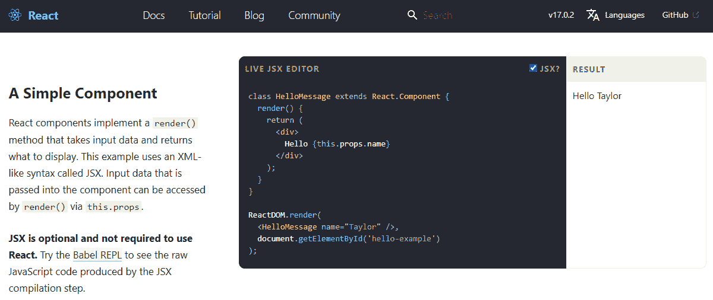
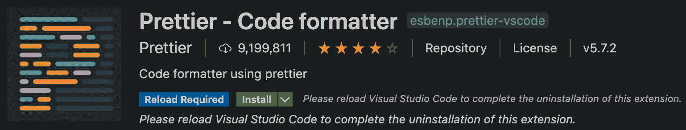
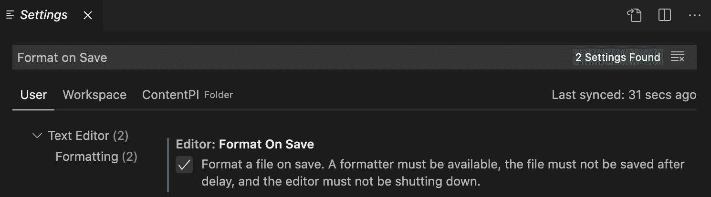

# 二、清洁你的代码

本章假设您已经有了使用 JSX 的经验，并且希望提高有效使用 JSX 的技能。要使用 JSX/TSX 而不出现任何问题或意外行为，必须了解它是如何工作的，以及为什么它是构建 UI 的有用工具。

我们的目标是编写干净的 JSX/TSX 代码，对其进行维护，并了解其来源、如何转换为 JavaScript 以及它提供了哪些功能。

在本章中，我们将介绍以下主题：

*   什么是 JSX？我们为什么要使用它？
*   什么是 Babel？我们如何使用它来编写现代 JavaScript 代码？
*   JSX 的主要特性以及 HTML 和 JSX 之间的差异
*   以优雅且可维护的方式编写 JSX 的最佳实践
*   linting，特别是 ESLint，如何使我们的 JavaScript 代码在应用程序和团队之间保持一致性
*   函数式编程的基础知识以及为什么遵循函数式范例将使我们编写更好的组件

# 技术要求

要完成本章，您需要以下内容：

*   Node.js 12+
*   Visual Studio 代码

# 使用 JSX

在前一章中，我们看到 React 如何改变关注点分离的概念，移动组件内部的边界。我们还了解了 React 如何使用组件返回的元素在屏幕上显示 UI。

现在让我们看看如何在组件中声明元素。

React 提供了两种定义元素的方法。第一种是使用 JavaScript 函数，第二种是使用 JSX，这是一种类似 XML 的可选语法。以下是 React.js 官方网站（[的示例部分截图 https://reactjs.org/#examples](https://reactjs.org/#examples) ：



首先，JSX 是人们无法接近 React 的主要原因之一，因为在主页上查看示例，第一次看到 JavaScript 与 HTML 混合在一起，对我们大多数人来说似乎都很奇怪。

一旦我们习惯了它，我们就会意识到它非常方便，正是因为它类似于 HTML，并且对于已经在 web 上创建 UI 的任何人来说都非常熟悉。开始标记和结束标记使表示嵌套的元素树变得更容易，而使用普通 JavaScript 则无法读取和维护这些元素。

让我们在下面的小节中更详细地了解 JSX。

## 巴别塔 7

要在代码中使用 JSX（以及 ES6 的一些特性），我们必须安装新的 Babel7。Babel 是 React 社区中广泛采用的流行 JavaScript 编译器。

首先，重要的是要清楚地了解它可以为我们解决的问题，以及为什么我们需要在我们的过程中增加一个步骤。原因是我们希望使用尚未添加到浏览器（我们的目标环境）中的语言功能。这些高级功能使我们的代码对开发人员来说更干净，但浏览器无法理解和执行它。

解决方案是用 JSX 和 ES6 编写脚本，当我们准备发布时，我们将源代码编译成 ES5，这是目前主要浏览器中实现的标准规范。

Babel 可以将 ES6 代码编译成 ES5JavaScript，也可以将 JSX 编译成 JavaScript 函数。这个过程被称为**transfilation**，因为它将源代码编译成一个新的源代码，而不是一个可执行文件。

在巴贝尔 6.x 的旧版本中，您安装了`babel-cli`包，得到了`babel-node`和`babel-core`，现在所有内容都被分离：`@babel/core`、`@babel/cli`、`@babel/node`等等。

要安装巴贝尔，我们需要安装`@babel/core`和`@babel/node`如下：

```jsx
npm install -g @babel/core @babel/node
```

如果您不想全局安装它（开发人员通常倾向于避免这种情况），您可以在本地将 Babel 安装到项目中，并通过`npm`脚本运行它，但在本章中，全局实例是可以的。

安装完成后，我们可以运行以下命令来编译任何 JavaScript 文件：

```jsx
babel source.js -o output.js
```

Babel 如此强大的原因之一是因为它是高度可配置的。Babel 只是一个将源文件转换为输出文件的工具，但要应用一些转换，我们需要对其进行配置。

幸运的是，我们可以轻松安装和使用一些非常有用的配置预设：

```jsx
npm install -g @babel/preset-env @babel/preset-react
```

一旦安装完成，我们将在`root`文件夹中创建一个名为`.babelrc`的配置文件，并将以下行放入其中，告诉巴贝尔使用这些预设：

```jsx
{
  "presets": [
    "@babel/preset-env",
    "@babel/preset-react"
  ]
}
```

从现在开始，我们可以在源文件中编写 ES6 和 JSX，并在浏览器中执行输出文件。

## 创建我们的第一个元素

现在我们的环境已经设置为支持 JSX，我们可以深入研究最基本的示例：生成一个`div`元素。以下是创建具有`_jsx`函数的`div`元素的方法：

```jsx
_jsx('div', {})
```

这是用于创建`div`元素的 JSX：

```jsx
<div />
```

它看起来类似于普通的 HTML。

最大的区别是我们在一个`.js`文件中编写标记，但需要注意的是，JSX 只是语法糖，在浏览器中执行之前，它会被转换成 JavaScript。

事实上，当我们运行 Babel 时，我们的`<div />`元素被转换为`_jsx('div', {})`，这是我们在编写模板时应该始终记住的。

In React 17, `React.createElement('div')` is deprecated, now internally using `react/jsx-runtime` to render the JSX, meaning that we will have something such as `_jsx('div', {})`. Basically, this means that you don't need to import the React object anymore in order to write JSX code.

## DOM 元素和 React 组件

使用 JSX，我们可以创建 HTML 元素和 React 组件；唯一的区别是它们是否以大写字母开头。

例如，要呈现 HTML 按钮，我们使用`<button />`，而要呈现`Button`组件，我们使用`<Button />`。第一个按钮被转换为以下内容：

```jsx
_jsx('button', {})
```

第二个文件被传输到以下文件中：

```jsx
_jsx(Button, {})
```

这里的区别在于，在第一次调用中，我们将 DOM 元素的类型作为字符串传递，而在第二次调用中，我们将传递组件本身，这意味着它应该存在于作用域中才能工作。

正如您可能已经注意到的，JSX 支持自动关闭标记，这非常有助于保持代码简洁，并且不需要我们重复不必要的标记。

## 道具

当 DOM 元素或 React 组件具有道具时，JSX 非常方便。使用 XML 很容易在元素上设置属性：

```jsx

```

JavaScript 中的等效代码如下所示：

```jsx
_jsx("img", { 
  src: "https://www.js.educatiimg/logo.png", 
  alt: "JS Education" 
})
```

它的可读性要差得多，即使只有几个属性，如果没有一点推理，也很难阅读。

## 儿童

JSX 允许您定义子元素来描述元素树并组成复杂的 UI。一个基本示例是包含文本的链接，如下所示：

```jsx
<a href="https://js.education">Click me!</a>
```

这将转换为以下内容：

```jsx
_jsx( 
  "a", 
  { href: "https://www.js.education" }, 
  "Click me!" 
)
```

我们的链接可以被封装在`div`元素中，以满足某些布局要求，JSX 代码片段如下所示：

```jsx
<div> 
  <a href="https://www.js.education">Click me!</a> 
</div>
```

JavaScript 等价物如下所示：

```jsx
_jsx( 
  "div", 
  null, 
  _jsx( 
    "a", 
    { href: "https://www.js.education" }, 
    "Click me!" 
  ) 
)
```

现在应该清楚了，JSX 的类似于*XML 的*语法是如何让一切变得更具可读性和可维护性的，但知道与我们的 JSX 并行的 JavaScript 能够控制元素的创建总是很重要的。好的方面是，我们不局限于将元素作为元素的子元素，而是可以使用 JavaScript 表达式，例如函数或变量。

为此，我们必须将表达式括在大括号内：

```jsx
<div> 
  Hello, {variable}. 
  I'm a {() => console.log('Function')}. 
</div> 
```

这同样适用于非字符串属性，如下所示：

```jsx
<a href={this.createLink()}>Click me!</a>
```

如您所见，任何变量或函数都应该用大括号括起来。

## 与 HTML 的区别

到目前为止，我们已经了解了 JSX 和 HTML 之间的相似之处。现在让我们看看它们之间的细微差别以及它们存在的原因。

### 属性

我们必须始终记住，JSX 不是一种标准语言，它会被转换成 JavaScript。因此，某些属性无法使用。

例如，我们必须使用`className`而不是`class`，我们必须使用`htmlFor`而不是`for`，如下所示：

```jsx
<label className="awesome-label" htmlFor="name" />
```

原因是`class`和`for`是 JavaScript 中的保留字。

### 风格

一个非常显著的区别是`style`属性的工作方式。我们将在第 8 章*中更详细地介绍如何使用它，使您的组件看起来更漂亮*，但现在我们将重点介绍它的工作方式。

`style`属性不像 HTML parallel 那样接受 CSS 字符串，但它需要一个 JavaScript 对象，其中样式名为*camelCased*：

```jsx
<div style={{ backgroundColor: 'red' }} />
```

如您所见，您可以将一个对象传递给`style`道具，这意味着您甚至可以将样式包含在单独的变量中，如果您愿意：

```jsx
const styles = {
  backgroundColor: 'red'
} 

<div style={styles} /> 
```

这是更好地控制内联样式的最佳方法。

### 根

值得一提的是，与 HTML 的一个重要区别是，由于 JSX 元素被转换为 JavaScript 函数，并且不能在 JavaScript 中返回两个函数，因此每当在同一级别上有多个元素时，就必须将它们包装在父元素中。

让我们看一个简单的例子：

```jsx
<div />
<div />
```

这给我们带来了以下错误：

```jsx
Adjacent JSX elements must be wrapped in an enclosing tag.
```

另一方面，以下工作：

```jsx
<div> 
  <div /> 
  <div /> 
</div>
```

之前，React 强制您返回一个用`<div>`元素或任何其他标记包装的元素；由于 React 16.2.0，可以按如下方式直接返回数组：

```jsx
return [
  <li key="1">First item</li>, 
  <li key="2">Second item</li>, 
  <li key="3">Third item</li>
]
```

或者您甚至可以直接返回字符串，如以下代码块所示：

```jsx
return 'Hello World!'
```

此外，React 现在有一个名为`Fragment`的新特性，它也可以作为元素的特殊包装器。可以用`React.Fragment`指定：

```jsx
import { Fragment } from 'react'

return ( 
  <Fragment>
    <h1>An h1 heading</h1> 
    Some text here. 
    <h2>An h2 heading</h2> 
    More text here.
    Even more text here.
  </Fragment>
)
```

或者您可以使用空标签（`<></>`：

```jsx
return ( 
  <>
    <ComponentA />
    <ComponentB />
    <ComponentC />
  </>
)
```

`Fragment`不会在 DOM 上呈现任何可见内容；它只是一个用于包装 React 元素或组件的辅助标记。

### 空间

有一件事在开始时可能会有点棘手，而且，这与我们应该始终记住 JSX 不是 HTML 这一事实有关，即使它具有类似 XML 的语法。JSX 处理文本和元素之间的空格的方式与 HTML 不同，这是一种违反直觉的方式。

考虑下面的片段：

```jsx
<div> 
  <span>My</span> 
  name is 
  <span>Carlos</span> 
</div>
```

在解释 HTML 的浏览器中，此代码将为您提供`My name is Carlos`，这正是我们所期望的。

在 JSX 中，相同的代码将被呈现为`MynameisCarlos`，这是因为三条嵌套行作为`div`元素的单个子元素进行传输，而不考虑空格。获得相同输出的常见解决方案是在元素之间显式放置一个空格，如下所示：

```jsx
<div> 
  <span>My</span> 
  {' '}
  name is
  {' '} 
  <span>Carlos</span> 
</div>
```

正如您可能已经注意到的，我们正在使用包装在 JavaScript 表达式中的空字符串来强制编译器在元素之间应用空格。

### 布林属性

在真正开始讨论如何在 JSX 中定义布尔属性之前，还有一些事情值得一提。如果您设置了一个没有值的属性，JSX 会假定其值为`true`，例如，遵循与 HTML`disabled`属性相同的行为。

这意味着如果我们想将属性设置为`false`，我们必须将其显式声明为 false：

```jsx
<button disabled /> 
React.createElement("button", { disabled: true })
```

以下是布尔属性的另一个示例：

```jsx
<button disabled={false} /> 
React.createElement("button", { disabled: false })
```

这在一开始可能会让人困惑，因为我们可能认为省略属性意味着`false`，但事实并非如此。对于 React，我们应该始终明确以避免混淆。

## 传播属性

一个重要的特性是**扩展属性**操作符（`...`，它来自 ECMAScript 建议的 rest/spread 属性，每当我们想要将 JavaScript 对象的所有属性传递给元素时，它都非常方便。

导致 bug 减少的一种常见做法不是通过引用将整个 JavaScript 对象传递给子对象，而是使用它们的原语值，这些原语值可以很容易地验证，从而使组件更加健壮和防错。

让我们看看它是如何工作的：

```jsx
const attrs = { 
  id: 'myId',
  className: 'myClass'
}

return <div {...attrs} />
```

前面的代码将转换为以下代码：

```jsx
var attrs = { 
  id: 'myId',
  className: 'myClass'
} 

return _jsx('div', attrs)
```

## 模板文本

**模板文本**是允许嵌入表达式的字符串文本。可以使用多行字符串和字符串插值功能。

模板文本由反勾（`` ``字符括起，而不是双引号或单引号。此外，模板文字还可以包含占位符。您可以使用美元符号和大括号（`${expression}`添加它们）：

```jsx
const name = `Carlos`
const multilineHtml = `<p>
 This is a multiline string
 </p>`
console.log(`Hi, my name is ${name}`)
```

## 常见模式

现在我们已经知道了 JSX 是如何工作的，并且能够掌握它，我们已经准备好按照一些有用的约定和技术来了解如何正确地使用它。

### 多行

让我们从一个非常简单的开始。如前所述，与 React 的`_jsx`函数相比，我们更喜欢 JSX 的一个主要原因是它类似 XML 的语法，以及平衡的开始和结束标记非常适合表示节点树。

因此，我们应该以正确的方式使用它，并最大限度地利用它。一个例子如下：；当我们有嵌套元素时，我们应该始终使用多行：

```jsx
<div> 
 <Header /> 
 <div> 
 <Main content={...} /> 
  </div> 
</div>
```

这比以下情况更可取：

```jsx
<div><Header /><div><Main content={...} /></div></div>
```

例外情况是，如果子元素不是文本或变量之类的元素。在这种情况下，保持在同一行并避免向标记添加噪声是有意义的，如下所示：

```jsx
<div> 
 <Alert>{message}</Alert> 
  <Button>Close</Button> 
</div>
```

当您在多行上书写元素时，请始终记住将它们括在括号内。JSX 总是被函数替换，而写在新行上的函数会因为自动插入分号而产生意外结果。例如，假设您正在从 render 方法返回 JSX，这就是您在 React 中创建 UI 的方式。

以下示例运行良好，因为`div`元素与`return`位于同一行上：

```jsx
return <div />
```

然而，以下情况并不正确：

```jsx
return 
  <div />
```

这样做的原因是，您将拥有以下内容：

```jsx
return
_jsx("div", null)
```

这就是为什么必须将语句用括号括起来，如下所示：

```jsx
return ( 
  <div /> 
)
```

### 多属性

当一个元素有多个属性时，编写 JSX 的一个常见问题就出现了。一种解决方案是将所有属性写在同一行上，但这会导致代码中不需要的很长的行（请参阅下面的部分了解如何强制执行编码样式指南）。

常见的解决方案是将每个属性写在新行上，并进行一级缩进，然后将结束括号与开始标记对齐：

```jsx
<button 
  foo="bar" 
  veryLongPropertyName="baz" 
  onSomething={this.handleSomething} 
/>
```

### 条件句

当我们开始使用**条件**时，事情会变得更有趣，例如，如果我们只想在某些条件匹配时渲染某些组件。我们可以在我们的条件中使用 JavaScript 这一事实是一个很大的优势，但是在 JSX 中有许多不同的表达条件的方法，理解其中每种方法的优点和问题对于编写可读性和可维护性都很重要。

假设我们只想在用户当前登录到我们的应用程序时显示注销按钮。

下面是一个简单的代码片段：

```jsx
let button

if (isLoggedIn) { 
  button = <LogoutButton />
} 

return <div>{button}</div>
```

这是可行的，但可读性不强，特别是当存在多个组件和多个条件时。

在 JSX 中，我们可以使用内联条件：

```jsx
<div> 
  {isLoggedIn && <LoginButton />} 
</div>
```

这是因为如果条件为`false`，则不会呈现任何内容，但如果条件为`true`，则会调用`LoginButton`的`createElement`函数，并返回元素以组成结果树。

如果条件有一个替代选项（经典的`if...else`语句），例如，我们希望在用户登录时显示一个注销按钮，否则显示一个登录按钮，那么我们可以使用 JavaScript 的`if...else`语句，如下所示：

```jsx
let button

if (isLoggedIn) { 
  button = <LogoutButton />
} else { 
  button = <LoginButton />
} 

return <div>{button}</div>
```

或者，更好的是，我们可以使用三元条件，使代码更紧凑：

```jsx
<div> 
  {isLoggedIn ? <LogoutButton /> : <LoginButton />} 
</div>
```

您可以找到流行存储库中使用的三元条件，例如 Redux 真实世界示例（[https://github.com/reactjs/redux/blob/master/examples/real-world/src/components/List.js#L28](https://github.com/reactjs/redux/blob/master/examples/real-world/src/components/List.js#L28) ），其中，如果组件正在获取数据，则三元值用于显示加载标签，或根据`isFetching`变量的值在按钮内加载更多：

```jsx
<button [...]> 
  {isFetching ? 'Loading...' : 'Load More'} 
</button>
```

现在，让我们看看当事情变得更复杂时的最佳解决方案，例如，我们必须检查多个变量以确定是否渲染组件：

```jsx
<div>
  {dataIsReady && (isAdmin || userHasPermissions) && 
    <SecretData />
  }
</div>
```

在这种情况下，很明显，使用内联条件是一个很好的解决方案，但可读性受到很大影响。相反，我们可以在组件内创建一个 helper 函数，并在 JSX 中使用它来验证条件：

```jsx
const canShowSecretData = () => { 
  const { dataIsReady, isAdmin, userHasPermissions } = props
  return dataIsReady && (isAdmin || userHasPermissions)
} 

return (
  <div> 
    {this.canShowSecretData() && <SecretData />} 
  </div> )
```

如您所见，此更改使代码更具可读性，条件更明确。如果您在 6 个月后查看这段代码，您仍然会发现，只需读取函数的名称就可以清楚地看到它。

这同样适用于计算属性。假设货币和价值有两个单一属性。不需要在`render`中创建价格字符串，您可以创建一个函数：

```jsx
const getPrice = () => { 
  return `${props.currency}${props.value}`
}

return <div>{getPrice()}</div>
```

这更好，因为它是隔离的，如果它包含逻辑，您可以轻松地测试它。

回到条件语句，其他解决方案需要使用外部依赖项。一个好的做法是尽可能避免外部依赖，以保持捆绑包更小，但在这种特殊情况下，这可能是值得的，因为提高模板的可读性是一个巨大的胜利。

第一个解决方案是`render-if`，我们可以通过以下方式安装：

```jsx
npm install --save render-if
```

然后，我们可以在我们的项目中轻松地使用它，如下所示：

```jsx
const { dataIsReady, isAdmin, userHasPermissions } = props

const canShowSecretData = renderIf( 
  dataIsReady && (isAdmin || userHasPermissions) 
);

return (
  <div> 
    {canShowSecretData(<SecretData />)} 
  </div> 
);
```

这里，我们将条件包装在`renderIf`函数中。

返回的实用程序函数可以用作在条件为`true`时接收要显示的 JSX 标记的函数。

一个目标是永远不要在我们的组件中添加太多的逻辑。其中一些需要一点，但我们应该尽量使它们简单，以便我们能够轻松地发现和修复错误。

我们至少应该尽可能地保持`renderIf`方法干净，为此，我们可以使用另一个名为`react-only-if`的实用程序库，通过使用**高阶组件**（**HOC**设置条件函数，我们可以像编写条件一样编写组件。

我们将在*第 4 章**中详细讨论 HOC，探索流行的组合模式*，但现在，您只需要知道它们是接收组件并通过添加一些属性或修改其行为返回增强组件的函数。

要使用该库，我们需要按如下方式安装它：

```jsx
npm install --save react-only-if
```

安装后，我们可以通过以下方式在应用程序中使用它：

```jsx
import onlyIf from 'react-only-if'

const SecretDataOnlyIf = onlyIf(
  ({ dataIsReady, isAdmin, userHasPermissions }) => dataIsReady && 
  (isAdmin || userHasPermissions)
)(SecretData)

const MyComponent = () => (
  <div>
    <SecretDataOnlyIf 
      dataIsReady={...}
      isAdmin={...}
      userHasPermissions={...}
    />
 </div>
)

export default MyComponent
```

正如您在这里看到的，组件本身内部根本没有逻辑。

我们将条件作为`onlyIf`函数的第一个参数传递，当条件匹配时，组件被渲染。

用于验证条件的函数接收组件的道具、状态和上下文。

通过这种方式，我们避免了使用条件来污染组件，以便更容易理解和推理。

### 循环

UI 开发中一个非常常见的操作是显示项目列表。在显示列表时，使用 JavaScript 作为模板语言是一个非常好的主意。

如果我们在 JSX 模板中编写一个返回数组的函数，那么数组的每个元素都会被编译成一个元素。

如前所述，我们可以在大括号内使用任何 JavaScript 表达式，并且在给定对象数组的情况下，最常用的生成元素数组的方法是使用`map`。

让我们深入到一个现实世界的例子。假设您有一个用户列表，每个用户都附带一个 name 属性。

要创建无序列表以显示用户，可以执行以下操作：

```jsx
<ul> 
  {users.map(user => <li>{user.name}</li>)} 
</ul>
```

这段代码非常简单，同时也非常强大，HTML 和 JavaScript 的强大功能汇聚在一起。

### 控制语句

条件和循环是 UI 模板中非常常见的操作，使用 JavaScript 或`map`函数来执行它们可能会让您感觉不对劲。JSX 是以这样一种方式构建的，它只抽象元素的创建，将逻辑部分留给真正的 JavaScript，这很好，只是有时代码变得不那么清晰。

一般来说，我们的目标是从组件中删除所有逻辑，尤其是从渲染方法中删除，但有时我们必须根据应用程序的状态显示和隐藏元素，而且通常我们必须在集合和数组中循环。

如果您觉得将 JSX 用于此类操作将使代码更具可读性，那么有一个 Babel 插件可以做到这一点：`jsx-control-statements`。

这与 JSX 遵循相同的理念，并且它没有为语言添加任何真正的功能；它只是被编译成 JavaScript 的语法糖。

让我们看看它是如何工作的。

首先，我们必须安装它：

```jsx
npm install --save jsx-control-statements
```

一旦安装，我们必须将其添加到`.babelrc`文件中的 Babel 插件列表中：

```jsx
"plugins": ["jsx-control-statements"]
```

从现在起，我们可以使用插件提供的语法，Babel 将把它与常见的 JSX 语法一起传输。

使用插件编写的条件语句类似于以下代码段：

```jsx
<If condition={this.canShowSecretData}> 
  <SecretData /> 
</If>
```

将其转换为三元表达式，如下所示：

```jsx
{canShowSecretData ? <SecretData /> : null}
```

`If`组件很棒，但如果出于某种原因，渲染方法中有嵌套的条件，它很容易变得凌乱和难以理解。这就是`Choose`组件派上用场的地方：

```jsx
<Choose> 
  <When condition={...}> 
    <span>if</span> 
  </When> 
 <When condition={...}> 
    <span>else if</span> 
  </When> 
 <Otherwise> 
 <span>else</span> 
 </Otherwise> 
</Choose>
```

请注意，前面的代码被传输到多个 ternaries 中。

最后，还有一个组件（请记住，我们谈论的不是真正的组件，而是语法糖）来管理循环，这也是非常方便的：

```jsx
<ul> 
 <For each="user" of={this.props.users}> 
    <li>{user.name}</li> 
  </For> 
</ul>
```

前面的代码被传输到一个`map`函数中——没有魔法。

如果您习惯于使用**linter**，您可能会想知道为什么 linter 没有抱怨该代码。`user`变量在 transfilation 之前不存在，也没有封装在函数中。为了避免这些 linting 错误，需要安装另一个插件：`eslint-plugin-jsx-control-statements`。

如果你不明白前一句话，别担心；我们将在下一节中讨论 linting。

### 子渲染

值得强调的是，我们始终希望保持组件非常小，渲染方法非常干净和简单。

然而，这不是一个容易的目标，特别是当您以迭代方式创建应用程序时，并且在第一次迭代中，您不确定如何将组件拆分为更小的组件。那么，当`render`方法变得太大而无法维护时，我们应该怎么做？一种解决方案是将其拆分为更小的函数，这样我们就可以将所有逻辑保持在同一个组件中。

让我们看一个例子：

```jsx
const renderUserMenu = () => { 
  // JSX for user menu 
} 

const renderAdminMenu = () => { 
  // JSX for admin menu 
} 

return ( 
  <div> 
 <h1>Welcome back!</h1> 
    {userExists && renderUserMenu()} 
    {userIsAdmin && renderAdminMenu()} 
  </div> 
)
```

这并不总是被认为是最佳实践，因为将组件拆分为更小的组件似乎更为明显。但是，有时它有助于保持渲染方法更干净。例如，在 Redux 真实世界示例中，使用子渲染方法渲染*加载更多*按钮。

既然我们是 JSX 的超级用户，现在是时候继续前进了，看看如何在代码中遵循样式指南，使其保持一致。

# 样式代码

在本节中，您将学习如何实现 EditorConfig 和 ESLint，通过验证代码样式来提高代码质量。在您的团队中使用标准的代码样式并避免使用不同的代码样式是很重要的。

## 编辑配置

**EditorConfig**帮助开发人员在不同 IDE 之间保持一致的编码风格。

许多编辑器都支持 EditorConfig。您可以在官方网站[上查看您的编辑器是否受支持 https://www.editorconfig.org](https://www.editorconfig.org) 。

您需要在`root`目录中创建一个名为`.editorconfig`的文件–我使用的配置如下：

```jsx
root = true

[*]
indent_style = space 
indent_size = 2
end_of_line = lf
charset = utf-8 
trim_trailing_whitespace = true 
insert_final_newline = true

[*.html] 
indent_size = 4

[*.css] 
indent_size = 4

[*.md]
trim_trailing_whitespace = false
```

您可以使用`[*]`影响所有文件，使用`[.extension]`影响特定文件。

## 漂亮的

**Prettier**是一种固执己见的代码格式化程序，由多种语言支持，可与大多数编辑器集成。这个插件非常有用，因为您可以在保存时格式化代码，而无需在代码审阅时讨论代码样式，这将为您节省大量时间和精力。

如果使用 Visual Studio 代码，则必须首先安装更漂亮的扩展：



然后，如果要在保存文件时配置格式化选项，则需要转到设置，搜索`Format on Save`，然后选中该选项：



这将影响您的所有项目，因为它是一个全局设置。如果您只想在特定项目中应用此选项，则必须在项目中创建一个`.vscode`文件夹和一个`settings.json`文件，其中包含以下代码：

```jsx
{
  "editor.defaultFormatter": "esbenp.prettier-vscode",
  "editor.formatOnSave": true
}
```

然后您可以在`.prettierrc`文件中配置所需的选项–这是我通常使用的配置：

```jsx
{
  "arrowParens": "avoid",
  "bracketSpacing": true,
  "jsxSingleQuote": false,
  "printWidth": 100,
  "quoteProps": "as-needed",
  "semi": false,
  "singleQuote": true,
  "tabWidth": 2,
  "trailingComma": "none",
  "useTabs": false
}
```

这将帮助您或您的团队标准化代码样式。

## 埃斯林特

我们总是尽可能地编写最好的代码，但有时会发生错误，花几个小时捕捉由于打字错误引起的错误是非常令人沮丧的。幸运的是，一些工具可以帮助我们在键入代码后立即检查代码的正确性。这些工具不能告诉我们我们的代码是否会做它应该做的事情，但它们可以帮助我们避免语法错误。

如果您来自静态语言，例如 C#，那么您习惯于在 IDE 中获得此类警告。几年前，Douglas Crockford 使用 JSLint（最初于 2002 年发布）使 linting 在 JavaScript 中流行起来；然后我们有了 JSHint，最后，现在 React 世界中事实上的标准是 ESLint。

**ESLint**是 2013 年发布的一个开源项目，由于其高度可配置和可扩展性而广受欢迎。

在 JavaScript 生态系统中，库和技术的变化非常快，关键是要有一个可以通过插件轻松扩展的工具，以及可以在需要时启用和禁用的规则。最重要的是，现在我们使用的 Transpiler（如 Babel）和实验功能不是 JavaScript 标准版本的一部分，因此我们需要能够告诉 linter 我们在源文件中遵循的规则。linter 不仅可以帮助我们减少错误，或者至少更快地发现错误，还可以强制执行一些常见的编码风格指南，这在拥有许多开发人员的大型团队中尤其重要，每个开发人员都有自己喜欢的编码风格。

在使用不一致样式编写不同文件甚至各种函数的代码库中读取代码是非常困难的。因此，让我们更详细地了解 ESLint。

### 安装

首先，我们必须安装 ESLint 和一些插件，如下所示：

```jsx
npm install -g eslint eslint-config-airbnb eslint-config-prettier eslint-plugin-import eslint-plugin-jsx-a11y eslint-plugin-prettier eslint-plugin-react
```

安装可执行文件后，我们可以使用以下命令运行它：

```jsx
eslint source.ts
```

输出将告诉我们文件中是否有错误。

当我们第一次安装并运行它时，我们没有看到任何错误，因为它是完全可配置的，并且没有任何默认规则。

### 配置

让我们开始配置 ESLint。可以使用项目根文件夹中的`.eslintrc`文件进行配置。要添加一些规则，让我们创建一个为 TypeScript 配置的`.eslintrc`文件，并添加一个基本规则：

```jsx
{
  "parser": "@typescript-eslint/parser",
  "plugins": ["@typescript-eslint", "prettier"],
  "extends": [
    "airbnb",
    "eslint:recommended",
    "plugin:@typescript-eslint/eslint-recommended",
    "plugin:@typescript-eslint/recommended",
    "plugin:prettier/recommended"
  ],
  "settings": {
    "import/extensions": [".js", ".jsx", ".ts", ".tsx"],
    "import/parsers": {
      "@typescript-eslint/parser": [".ts", ".tsx"]
    },
    "import/resolver": {
      "node": {
        "extensions": [".js", ".jsx", ".ts", ".tsx"]
      }
    }
  },
  "rules": {
    "semi": [2, "never"]
  }
}
```

这个配置文件需要解释一下：`"semi"`是规则的名称，`[2, "never"]`是值。第一次看到它时，它不是很直观。

ESLint 规则有三个级别可确定问题的严重性：

*   `off`（或`0`：规则被禁用。
*   `warn`（或`1`：规则为警告。
*   `error`（或`2`：规则抛出错误。

我们之所以使用`2`值，是因为我们希望每次代码不遵循规则时，ESLint 都会抛出一个错误。第二个参数告诉 ESLint，我们希望永远不要使用分号（相反的是*始终）。*ESLint 及其插件都有很好的文档记录，对于任何一条规则，您都可以找到该规则的描述以及它通过和失败的一些示例。

现在创建一个包含以下内容的`index.ts`文件：

```jsx
const foo = 'bar';
```

如果我们运行`eslint index.js`，我们会得到以下结果：

```jsx
Extra semicolon (semi) 
```

这是伟大的；我们设置了门楣，它帮助我们遵循第一条规则。

以下是我更喜欢关闭或更改的其他规则：

```jsx
"rules": {
    "semi": [2, "never"],
    "@typescript-eslint/class-name-casing": "off",
    "@typescript-eslint/interface-name-prefix": "off",
    "@typescript-eslint/member-delimiter-style": "off",
    "@typescript-eslint/no-var-requires": "off",
    "@typescript-eslint/ban-ts-ignore": "off",
    "@typescript-eslint/no-use-before-define": "off",
    "@typescript-eslint/ban-ts-comment": "off",
    "@typescript-eslint/explicit-module-boundary-types": "off",
    "no-restricted-syntax": "off",
    "no-use-before-define": "off",
    "import/extensions": "off",
    "import/prefer-default-export": "off",
    "max-len": [
      "error",
      {
        "code": 100,
        "tabWidth": 2
      }
    ],
    "no-param-reassign": "off",
    "no-underscore-dangle": "off",
    "react/jsx-filename-extension": [
      1,
      {
        "extensions": [".tsx"]
      }
    ],
    "import/no-unresolved": "off",
    "consistent-return": "off",
    "jsx-a11y/anchor-is-valid": "off",
    "sx-a11y/click-events-have-key-events": "off",
    "jsx-a11y/no-noninteractive-element-interactions": "off",
    "jsx-a11y/click-events-have-key-events": "off",
    "jsx-a11y/no-static-element-interactions": "off",
    "react/jsx-props-no-spreading": "off",
    "jsx-a11y/label-has-associated-control": "off",
    "react/jsx-one-expression-per-line": "off",
    "no-prototype-builtins": "off",
    "no-nested-ternary": "off",
    "prettier/prettier": [
      "error",
      {
        "endOfLine": "auto"
      }
    ]
  }
```

### Git 挂钩

为了避免我们的存储库中有未登录的代码，我们可以做的是使用 Git 钩子在流程的某一点添加 ESLint。例如，我们可以使用`husky`在名为`pre-commit`的 Git 钩子中运行 linter，在名为`pre-push`的钩子上运行单元测试也很有用。

要安装`husky`，需要运行以下命令：

```jsx
npm install --save-dev husky
```

然后，在我们的`package.json`文件中，我们可以添加这个节点来配置我们想要在 Git 钩子中运行的任务：

```jsx
{
  "scripts": {
    "lint": "eslint --ext .tsx,.ts src",
    "lint:fix": "eslint --ext .tsx,.ts --fix src",
    "test": "jest src"
  },
  "husky": {
    "hooks": {
      "pre-commit": "npm lint",
      "pre-push": "npm test"
    }
  }
}
```

ESlint 命令有一个名为`--fix`的特殊选项（标志）——通过此选项，ESlint 将尝试自动修复所有的 linter 错误（不是所有错误）。小心使用这个选项，因为有时候它会影响我们的代码风格。另一个有用的标志是`--ext`来指定我们要验证的文件的扩展名，在本例中，仅是`.tsx`和`.ts`文件。

在下一节中，您将了解**函数式编程**（**FP**）是如何工作的，以及诸如一流对象、纯度、不变性、咖喱和组合等主题。

# 函数式编程

除了在编写 JSX 时遵循最佳实践，并使用 linter 来加强一致性并尽早发现错误之外，我们还可以做一件事来清理代码：遵循 FP 风格。

正如在*第 1 章*中所讨论的，*使用 React*迈出了第一步，React 采用了声明式编程方法，使我们的代码更具可读性。FP 是一种声明性范例，可以避免副作用，数据被认为是不可变的，从而使代码更易于维护和推理。

不要把下面的小节当作 FP 的详尽指南；这只是一个介绍，让您了解 React 中常用的一些概念。

## **一级功能**

JavaScript 具有一流的函数，因为它们与任何其他变量一样，这意味着您可以将函数作为参数传递给其他函数，也可以由另一个函数返回并作为值分配给变量。

这允许我们引入**高阶函数**（**HoFs**的概念。HOF 是一种函数，它将函数作为参数，也可以选择其他一些参数，并返回函数。返回的函数通常通过一些特殊的行为来增强。

让我们看一个例子：

```jsx
const add = (x, y) => x + y

const log = fn => (...args) => { 
 return fn(...args)
}

const logAdd = log(add)
```

这里，一个函数添加两个数字，以增强一个函数，该函数记录所有参数，然后执行原始函数。

理解这个概念非常重要，因为在 React 世界中，一种常见的模式是使用 HOC 将组件视为函数，并使用常见的行为增强它们。我们将在*第 4 章**探索流行构图模式*中看到 HOCs 和其他模式。

## 纯洁

FP 的一个重要方面是编写纯函数。在 React 生态系统中，您会经常遇到这个概念，尤其是在查看诸如 Redux 之类的库时。

函数是纯函数意味着什么？

当没有副作用时，函数是纯函数，这意味着函数不会改变任何非函数本身局部的内容。

例如，更改应用程序状态的函数，或修改在上限范围中定义的变量的函数，或接触外部实体的函数，例如**文档对象模型**（**DOM**）被认为是不纯的。不纯函数更难调试，而且大多数情况下不可能多次应用它们并期望得到相同的结果。

例如，以下函数是纯函数：

```jsx
const add = (x, y) => x + y
```

它可以多次运行，总是得到相同的结果，因为任何地方都不会存储任何内容，也不会修改任何内容。

以下函数不是纯函数：

```jsx
let x = 0
const add = y => (x = x + y)
```

运行`add(1)`两次，我们得到两个不同的结果。第一次我们得到`1`，但是第二次我们得到`2`，即使我们用相同的参数调用相同的函数。我们得到这种行为的原因是，每次执行后，全局状态都会被修改。

## 不变性

我们已经看到了如何编写不改变状态的纯函数，但是如果我们需要更改变量的值呢？在 FP 中，函数不改变变量的值，而是用新值创建一个新变量并返回它。这种处理数据的方式称为**不变性**。

不可变值是不能更改的值。

让我们看一个例子：

```jsx
const add3 = arr => arr.push(3)
const myArr = [1, 2]

add3(myArr); // [1, 2, 3]
add3(myArr); // [1, 2, 3, 3]
```

前面的函数不遵循不变性，因为它更改给定数组的值。同样，如果我们调用同一个函数两次，我们会得到不同的结果。

我们可以使用`concat`更改前面的函数使其不可变，该函数返回一个新数组而不修改给定数组：

```jsx
const add3 = arr => arr.concat(3)
const myArr = [1, 2]
const result1 = add3(myArr) // [1, 2, 3]
const result2 = add3(myArr) // [1, 2, 3]
```

在我们运行了两次函数之后，`myArr`仍然有其原始值。

## 咖喱

FP 中的一种常见技术是咖喱。**Currying**是将一个接受多个参数的函数转换为一个函数的过程，一次一个参数，然后返回另一个函数。让我们看一个例子来阐明这个概念。

让我们从前面看到的`add`函数开始，将其转换为 curry 函数。

假设我们有以下代码：

```jsx
const add = (x, y) => x + y
```

我们可以将函数定义如下：

```jsx
const add = x => y => x + y
```

我们使用它的方式如下：

```jsx
const add1 = add(1)
add1(2); // 3
add1(3); // 4
```

这是一种非常方便的函数编写方法，因为第一个值是在应用第一个参数后存储的，所以我们可以多次重用第二个函数。

## 作文

最后，FP 中可用于反应的一个重要概念是**成分**。可以将函数（和组件）组合起来，以生成具有更高级功能和属性的新函数。

考虑以下功能：

```jsx
const add = (x, y) => x + y
const square = x => x * x
```

这些函数可以组合在一起，创建一个新函数，将两个数字相加，然后将结果加倍：

```jsx
const addAndSquare = (x, y) => square(add(x, y))
```

按照这个范例，我们最终得到了可以组合在一起的小型、简单、可测试的纯函数。

## FP 和 UIs

最后一步是学习如何使用 FP 构建 ui，这就是我们使用 React 的目的。

我们可以将 UI 视为应用程序状态的函数，如下所示：

```jsx
UI = f(state)
```

我们希望这个函数是幂等的，以便在应用程序处于相同状态时返回相同的 UI。

使用反应，我们使用我们可以考虑函数的组件来创建我们的 UIS，我们将在下面的章节中看到。

可以组合组件以形成最终 UI，这是 FP 的一个属性。

我们用 React 构建 UI 的方式和 FP 的原则有很多相似之处，我们对它了解得越多，代码就会越好。

# 总结

在本章中，我们学习了很多关于 JSX 如何工作以及如何在组件中正确使用它的知识。我们从语法的基础开始，创建一个坚实的知识库，使我们能够掌握 JSX 及其特性。

在第二部分中，我们研究了如何配置 Prettier，以及 ESLint 及其插件如何帮助我们更快地发现问题，并在我们的代码库中实施一致的样式指南。

最后，我们学习了 FP 的基础知识，以了解编写 React 应用程序时要使用的重要概念。

现在我们的代码已经干净了，我们准备在下一章开始深入研究 React 并学习如何编写真正可重用的组件。