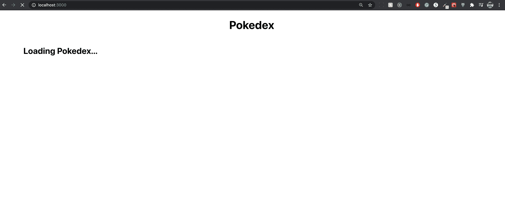
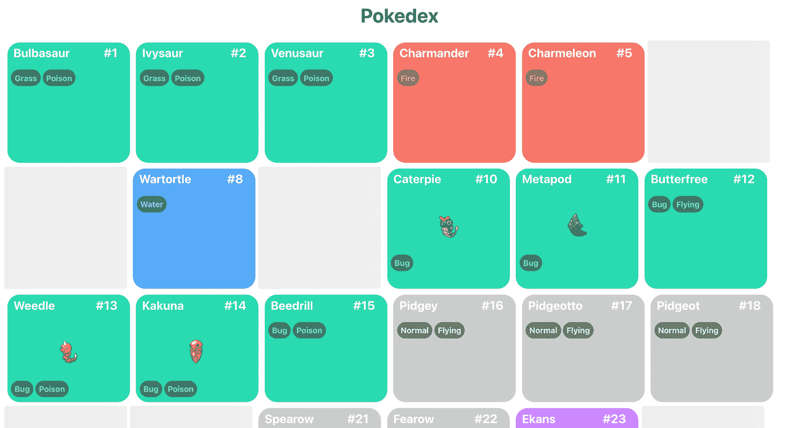
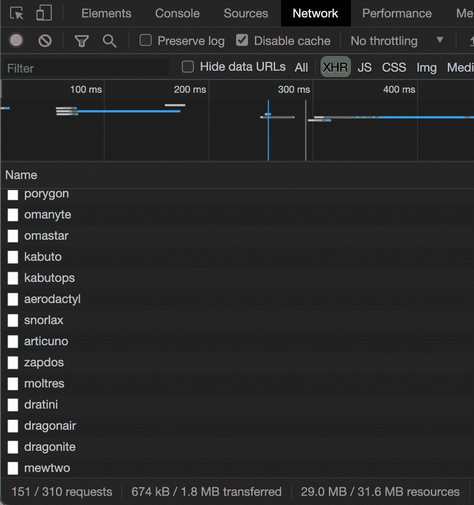

# 六、管理数据

**正确的数据获取**通过一些最常见的模式，让孩子和家长使用回调进行通信。我们将学习如何使用公共父级在未直接连接的组件之间共享数据。然后，我们将开始学习新的 React 上下文 API 和 React 悬念。

本章将介绍以下主题：

*   反应上下文 API
*   如何使用 useContext 使用上下文
*   如何使用 SWR 反应悬念

# 技术要求

要完成本章，您需要以下内容：

*   Node.js 12+
*   Visual Studio 代码

您可以在本书的 GitHub 存储库中找到本章的代码：[https://github.com/PacktPublishing/React-17-Design-Patterns-and-Best-Practices-Third-Edition/tree/main/Chapter06](https://github.com/PacktPublishing/React-17-Design-Patterns-and-Best-Practices-Third-Edition/tree/main/Chapter06) 。

# 介绍 React 上下文 API

React Context API 从 16.3.0 版开始正式添加；在它只是实验之前。新的上下文 API 改变了游戏规则。为了使用新的上下文 API，许多人正在远离 Redux。上下文提供了一种在组件之间共享数据的方法，而无需将道具传递给所有子组件。

让我们看一个可以使用新上下文 API 的基本示例。我们将使用*第 3 章中的 React Hooks*中的相同示例，在那里我们获取了一些 GitHub 问题，但现在使用了上下文 API。

## 创建第一个上下文

您需要做的第一件事是创建问题上下文。为此，您可以在`src`文件夹中创建一个名为`contexts`的文件夹，然后在该文件夹中添加`Issue.tsx`文件。

然后，您需要从 React 和`axios`导入一些函数：

```jsx
import { FC, createContext, useState, useEffect, ReactElement, useCallback } from 'react'
import axios from 'axios'
```

此时，您显然应该安装`axios`。如果仍然没有，请执行以下操作：

```jsx
npm install axios 
npm install --save-dev @types/axios
```

然后我们需要声明我们的接口：

```jsx
export type Issue = {
  number: number
  title: string
  url: string
  state: string
}

interface Issue_Context {
  issues: Issue[]
  url: string
}

interface Props {  url: string
}
```

在此之后，我们需要做的第一件事是使用`createContext`函数创建上下文，并定义要导出的值：

```jsx
export const IssueContext = createContext<Issue_Context>({
  issues: [],
  url: ''
})
```

一旦我们有了`IssueContext`，我们需要创建一个组件，在其中我们可以接收道具，设置一些状态，并使用`useEffect`执行提取，然后我们呈现`IssueContext.Provider`，在其中我们指定我们将导出的上下文（值）：

```jsx
const IssueProvider: FC<Props> = ({ children, url }) => {
  // State
  const [issues, setIssues] = useState<Issue[]>([])

  const fetchIssues = useCallback(async () => {
    const response = await axios(url)

    if (response) {
      setIssues(response.data)
    }
  }, [url])

  // Effects
  useEffect(() => {
    fetchIssues()
  }, [fetchIssues])

  const context = {
    issues,
    url
  }

  return <IssueContext.Provider value={context}>{children}</IssueContext.Provider>
}

export default IssueProvider
```

正如您所知，每次您想要使用`useEffect`钩子中的函数时，都需要使用`useCallback`钩子来包装您的函数。如果您想使用`async/await`，一个好的做法是将其放在单独的函数中，而不是直接放在`useEffect`中。

一旦我们在`issues`状态下执行 fetch 并获取数据，然后我们添加所有要导出为上下文的值，然后当我们呈现`IssueContext.Provider`时，我们在`value`属性上传递上下文，最后，我们呈现组件的子级。

## 使用提供程序包装我们的组件

您使用上下文的方式分为两部分。第一个是使用上下文提供程序包装应用程序，因此可以将此代码添加到`App.tsx`（通常所有提供程序都在父组件中定义）。

请注意，这里我们正在导入`IssueProvider`组件：

```jsx
// Providers
import IssueProvider from '../contexts/Issue'

// Components
import Issues from './Issues'

const App = () => {
  return (
    <IssueProvider url=
      "https://api.github.com/repos/ContentPI/ContentPI/issues">
      <Issues />
    </IssueProvider>
  )
}

export default App;
```

正如您所看到的，我们将`Issues`组件包装为`IssueProvider`，这意味着在`Issues`组件中，我们可以使用我们的上下文并获得问题值。

Many people get confused with this sometimes. If you forget to wrap your components with the provider, then you can't consume your context inside your components, and the hard part is that you probably won't get any error; you will just get some undefined data, which makes this hard to identify.

## 使用 useContext 消费上下文

如果您已经将`IssueProvider`放在`App.tsx`中，现在您可以使用`useContext`钩子使用`Issues`组件中的上下文。

注意，这里我们正在导入`IssueContext`上下文（在`{ }`之间）：

```jsx
// Dependencies
import { FC, useContext } from 'react'

// Contexts
import { IssueContext, Issue } from '../contexts/Issue'

const Issues: FC = () => {
  // Here you consume your Context, and you can grab the issues value.
  const { issues, url } = useContext(IssueContext)

  return (
    <>
      <h1>ContentPI Issues from Context</h1>

      {issues.map((issue: Issue) => (
        <p key={`issue-${issue.number}`}>
          <strong>#{issue.number}</strong> {' '}
          <a href={`${url}/${issue.number}`}>{issue.title}</a> {' '}
          {issue.state}
        </p>
      ))}
    </>
  )
}

export default Issues
```

如果所有操作都正确，您应该能够看到问题列表：


当您希望将应用程序与数据分离并在其中执行所有抓取时，上下文 API 非常有用。当然，上下文 API 有多种用途，也可以用于主题化或传递函数；这完全取决于你的申请。

在下一节中，我们将学习如何使用 SWR 库实现 React Suspense。

# 用 SWR 引入反应悬念

React 16.6 中引入了 React 悬念。目前（2021 年 4 月）此功能仍处于试验阶段，您不应该在生产应用程序中使用它。悬念使您可以暂停组件渲染，直到满足条件为止。您可以渲染加载组件或任何您想要的内容作为暂挂的后备。目前，这方面只有两个用例：

*   **代码拆分**：当您拆分应用程序并等待下载应用程序块时，用户希望访问它
*   **取数**取数时

在这两种情况下，您都可以呈现回退，回退通常可以是加载微调器、一些加载文本，或者更好的是，呈现占位符骨架。

**WARNING**: The new React Suspense feature is still experimental so I recommend you do not use it on production because it is not yet available in a stable release.

## 引入 SWR

**Stale While Revalidate**（**SWR**是一个用于数据获取的反应钩子；这是一种 HTTP 缓存失效策略。SWR 是一种策略，它首先从缓存（stale）返回数据，然后发送获取请求（revalidate），最后返回最新数据，由创建 Next.js 的 Vercel 公司开发。

## 建立一个 Pokedex！

我找不到比构建 Pokedex 更好的例子来解释 React 悬念和 SWR。我们将使用一个公共的口袋妖怪 API（[https://pokeapi.co](https://pokeapi.co) ；*必须抓住他们所有人*！

您需要做的第一件事是安装一些软件包：

```jsx
npm install swr react-loading-skeleton styled-components
```

对于本例，您需要在`src/components/Pokemon`处创建口袋妖怪目录。使用 SWR 需要做的第一件事是创建一个 fetcher 文件，我们将在其中执行请求。

此文件应在`src/components/Pokemon/fetcher.ts`处创建：

```jsx
const fetcher = (url: string) => {
  return fetch(url).then((response) => {
    if (response.ok) {
      return response.json()
    }

    return {
      error: true
    }
  })
}

export default fetcher
```

如果您注意到，如果响应不成功，我们将返回一个带有错误的对象。这是因为有时我们会从 API 中得到 404 错误，从而导致应用程序崩溃。

一旦您创建了抓取器，让我们修改`App.tsx`来配置`SWRConfig`并启用悬念：

```jsx
// Dependencies
import { SWRConfig } from 'swr'

// Components
import PokeContainer from './Pokemon/PokeContainer'
import fetcher from './Pokemon/fetcher'

// Styles
import { StyledPokedex, StyledTitle } from './Pokemon/Pokemon.styled'

const App = () => {
  return (
    <> 
      <StyledTitle>Pokedex</StyledTitle> 

      <SWRConfig
        value={{
          fetcher,
          suspense: true,
        }}
      >
        <StyledPokedex>
          <PokeContainer />
        </StyledPokedex>
 </SWRConfig>
    </>
  )
}

export default App
```

如您所见，我们需要将`PokeContainer`组件封装在`SWRConfig`中，以便能够获取数据。`PokeContainer`组件将是我们的父组件，我们将在其中添加第一个悬念。此文件存在于`src/components/Pokemon/PokeContainer.tsx`：

```jsx
import { FC, Suspense } from 'react'

import Pokedex from './Pokedex'

const PokeContainer: FC = () => {
  return (
    <Suspense fallback={<h2>Loading Pokedex...</h2>}>
      <Pokedex />
    </Suspense>
  )
}

export default PokeContainer
```

正如你所看到的，我们正在为我们的第一个悬念定义一个回退，它只是`Loading Pokedex...`文本。您可以在其中渲染任何您想要的内容、组件或纯文本。然后，我们有了悬念中的`Pokedex`成分。

现在让我们看一下我们的 FooT0.组件，在这里我们将使用第一次使用 HOLT T1。

```jsx
// Dependencies
import { FC, Suspense } from 'react'
import useSWR from 'swr'

// Components
import LoadingSkeleton from './LoadingSkeleton'
import Pokemon from './Pokemon'

import { StyledGrid } from './Pokemon.styled'

const Pokedex: FC = () => {
  const { data: { results } } = 
 useSWR('https://pokeapi.co/api/v2/pokemon?limit=150')

  return (
    <>
      {results.map((pokemon: { name: string }) => (
        <Suspense fallback={<StyledGrid><LoadingSkeleton /></StyledGrid>}>
          <Pokemon key={pokemon.name} pokemonName={pokemon.name} />
        </Suspense>
      ))}
    </>
  )
}

export default Pokedex
```

正如你所看到的，我们正在抓取第一个 150 个口袋妖怪，因为我是个老派，而那些是第一代。现在我不知道有多少口袋妖怪。另外，如果您注意到，我们正在获取来自数据的`results`变量（这是 API 的实际响应）。然后我们将结果映射到每个口袋妖怪，但我们在每个口袋妖怪中添加了一个悬念组件，并使用`<LoadingSkeleton />`回退（`<StyledGrid />`有一些 CSS 样式使其看起来更漂亮），最后，我们将`pokemonName`传递给`<Pokemon>`组件，这是因为第一次抓取只是给我们带来了口袋妖怪的名字，但是我们需要做另一次抓取来带来实际的口袋妖怪数据（名称、类型、电源等等）。

最后，我们的 Pokemon 组件将根据 Pokemon 名称执行特定的获取，并呈现数据：

```jsx
// Dependencies
import { FC } from 'react'
import useSWR from 'swr'

// Styles
import { StyledCard, StyledTypes, StyledType, StyledHeader } from './Pokemon.styled'

type Props = {
  pokemonName: string
}

const Pokemon: FC<Props> = ({ pokemonName }) => {
  const { data, error } = 
 useSWR(`https://pokeapi.co/api/v2/pokemon/${pokemonName}`)

  // Do you remember the error we set on the fetcher?
  if (error || data.error) {
    return <div />
  }

  if (!data) {
    return <div>Loading...</div>
  }

  const { id, name, sprites, types } = data
  const pokemonTypes = types.map((pokemonType: any) => 
    pokemonType.type.name)

  return (
    <StyledCard pokemonType={pokemonTypes[0]}>
      <StyledHeader>
        <h2>{name}</h2>
        <div>#{id}</div>
      </StyledHeader>

      

      <StyledTypes>
        {pokemonTypes.map((pokemonType: string) => (
 <StyledType key={pokemonType}>{pokemonType}</StyledType>
        ))}
      </StyledTypes>
    </StyledCard>
  )
} 

export default Pokemon
```

基本上，在这个组件中，我们将所有的口袋妖怪数据（`id`、`name`、`sprites`和`types`放在一起，并呈现信息。正如您所看到的，我使用的是`styled`组件，这非常令人惊讶，因此如果您想知道我在`Pokedex`中使用的样式，这里是`Pokemon.styled.ts`文件：

```jsx
import styled from 'styled-components'

// Type colors
const type: any = {
  bug: '#2ADAB1',
  dark: '#636363',
  dragon: '#E9B057',
  electric: '#ffeb5b',
  fairy: '#ffdbdb',
  fighting: '#90a4b5',
  fire: '#F7786B',
  flying: '#E8DCB3',
  ghost: '#755097',
  grass: '#2ADAB1',
  ground: '#dbd3a2',
  ice: '#C8DDEA',
  normal: '#ccc',
  poison: '#cc89ff',
  psychic: '#705548',
  rock: '#b7b7b7',
  steel: '#999',
  water: '#58ABF6'
}

export const StyledPokedex = styled.div`
  display: flex;
  flex-wrap: wrap;
  flex-flow: row wrap;
  margin: 0 auto;
  width: 90%;

  &::after {
    content: '';
    flex: auto;
  }
`

type Props = {
  pokemonType: string
} 

export const StyledCard = styled.div<Props>`
  position: relative;
  ${({ pokemonType }) => `
    background: ${type[pokemonType]} url(./pokeball.png) no-repeat;
    background-size: 65%;
    background-position: center;
  `}
  color: #000;
  font-size: 13px;
  border-radius: 20px;
  margin: 5px;
  width: 200px;

  img {
    margin-left: auto;
    margin-right: auto;
    display: block;
  }
`

export const StyledTypes = styled.div`
  display: flex;
  margin-left: 6px;
  margin-bottom: 8px;
`

export const StyledType = styled.span`
  display: inline-block;
  background-color: black;
  border-radius: 20px;
  font-weight: bold;
  padding: 6px;
  color: white;
  margin-right: 3px;
  opacity: 0.4;
  text-transform: capitalize;
`

export const StyledHeader = styled.div`
  display: flex;
  justify-content: space-between;
  width: 90%;

  h2 {
    margin-left: 10px;
    margin-top: 5px;
    color: white;
    text-transform: capitalize;
  }

  div {
    color: white;
    font-size: 20px;
    font-weight: bold;
    margin-top: 5px;
  }
`

export const StyledTitle = styled.h1`
  text-align: center;
`

export const StyledGrid = styled.div`
  display: flex;
  flex-wrap: wrap;
  flex-flow: row wrap;
  div {
    margin-right: 5px;
    margin-bottom: 5px;
  }
`
```

最后，我们的`LoadingSkeleton`组件应该是这样的：

```jsx
import { FC } from 'react'
import Skeleton from 'react-loading-skeleton'

const LoadingSkeleton: FC = () => (
  <div>
    <Skeleton height={200} width={200} />
  </div>
)

export default LoadingSkeleton
```

这个图书馆太棒了。它允许您创建骨架占位符以等待数据。当然，您可以构建任意数量的表单。你可能已经在 LinkedIn 或 YouTube 等网站上看到过这种影响。

## 考验我们的悬念

一旦你有了所有的代码片段，你可以做一个技巧来查看所有悬念回退。通常，如果你有一个高速连接，很难看到它，但你可以减慢你的连接速度，看看如何渲染一切。您可以在 Chrome inspector 的网络选项卡中选择慢速 3G 连接：


设置慢速 3G 预设并运行项目后，您将看到的第一个后退是加载 Pokedex…：



然后，您将看到正在为每个正在加载的口袋妖怪呈现`SkeletonLoading`的口袋妖怪回退：


通常那些加载程序都有动画，但你在这本书中看不到，当然！然后，您将开始看到数据是如何呈现的，一些图像开始出现：



如果您等待所有数据正确下载，现在应该可以看到 Pokedex 和所有 Pokemon：


很不错吧？但还有别的事要提；正如我前面提到的，SWR 将首先从缓存中获取数据，然后始终重新验证数据，以查看是否有新的更新。这意味着，无论数据何时更改，SWR 都将执行另一次提取，以重新验证旧数据是否仍然有效或是否需要用新数据替换。即使您从 Pokedex 选项卡移到另一个选项卡，然后再返回，也可以看到这种效果。您将第一次看到您的网络终端如下所示：



如您所见，我们执行了 151 个初始请求（1 个用于口袋妖怪列表，150 个用于其他，1 个用于每个口袋妖怪），但如果您更改选项卡并返回，您将看到 SWR 如何再次获取：


现在您可以看到它正在执行 302 个请求（另 151 个）。当您需要每秒或每分钟获取实时数据时，这非常有用。

目前，React Suspense 还没有定义的使用模式，这意味着您可以找到不同的方法来使用它，并且还没有为此定义一些好的实践。我发现 SWR 是玩 React Suspense 最容易理解的方式，我认为它是一个非常强大的库，即使没有悬念也可以使用。

# 总结

我真的希望您喜欢阅读本章，其中包含了大量关于 React 上下文 API 以及如何使用 SWR 实现 React 悬念的信息。

在下一章中，我们将学习如何处理表单和动画。