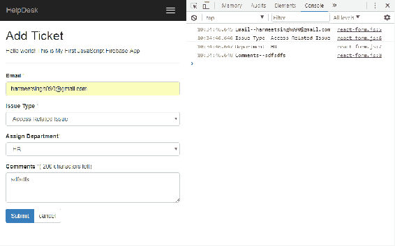
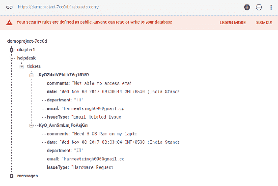

# 将 React 应用程序与 Firebase 集成

在[第 1 章](1.html)*Firebase 入门和 React*中，我们了解了如何将 Firebase 与 JavaScript 集成，并创建了我们的第一个示例应用程序，这让我们简单了解了 Firebase 的工作原理。现在，您已经使用 JavaScript 和 Firebase 完成了第一个 web 应用程序，我们将使用 React 和 Firebase 构建帮助台应用程序。

我们将首先设置 React 环境，然后快速查看 JSX 和 React 组件方法。我们还将了解如何使用 JSX 在 React 中创建表单组件，并在 Firebase 实时数据库中提交这些表单值

以下是我们将在本章中重点关注的要点列表：

*   React 环境设置
*   JSX 和 React 引导简介
*   使用 JSX 创建表单
*   Firebase 与 React 的集成
*   保存和读取实时数据库中的数据

# 建立环境

首先，我们需要创建一个类似于 Hello World 应用程序的文件夹结构，我们在[第 1 章](1.html)、*Firebase 入门和 React*中创建了该应用程序。以下屏幕截图描述了文件夹结构：


当我们开始用 ReactJS 制作应用程序时，我们需要做一些设置，其中只涉及一个 HTML 页面和`reactjs`库。创建完文件夹结构后，我们需要安装两个框架：ReactJS 和 Firebase。这就像在页面中包含 JavaScript 和 CSS 文件一样简单。我们可以通过**内容交付网络**（**CDN**）实现这一点，如谷歌或微软，但我们将在应用程序中手动获取文件，这样我们就不必依赖互联网，也可以脱机工作。

# 安装 React

首先，我们要去[https://reactjs.org/](https://reactjs.org/) 并查看我们将在应用程序中使用的最新可用版本：


在写这本书时，最新版本是 v16.0.0。在本章中，我们将使用 CDN React 软件包构建我们的应用程序：

```jsx
<script crossorigin src="https://unpkg.com/react@16/umd/react.development.js"></script>
<script crossorigin src="https://unpkg.com/react-dom@16/umd/react-dom.development.js"></script>
```

前面的版本仅用于开发，不适合生产。要使用小型化和优化的生产版本，我们需要使用以下生产包：

```jsx
<script crossorigin src="https://unpkg.com/react@16/umd/react.production.min.js"></script>
<script crossorigin src="https://unpkg.com/react-dom@16/umd/react-dom.production.min.js"></script>
```

如果您想使用其他版本，请将编号`16`替换为您想在应用程序中使用的版本。让我们在 HTML 中包含开发版本 CDN：

```jsx
<!doctype html>
<html class="no-js" lang="">
<head>
    <meta charset="utf-8">
    <title>ReactJs and Firebase - Chapter 2</title>
    <script crossorigin  
     src="https://unpkg.com/react@16/umd/react.development.js">
    </script>
    <script crossorigin src="https://unpkg.com/react-dom@16/umd/react-
     dom.development.js"></script>
</head>
<body>
    <!-- Add your site or application content here -->
    <p>Hello world! This is Our First React App with Firebase.</p>
</body>
</html>
```

# 使用 React

现在我们已经有了 ReactJS，从那里我们初始化了我们的应用程序，让我们开始使用`ReactDOM.render()`编写我们的第一个 Hello World 应用程序。`ReactDOM.render`方法的第一个参数是我们想要呈现的组件，第二个参数是它应该挂载（附加）到的 DOM 节点。遵守以下代码：

```jsx
ReactDOM.render( ReactElement element, DOMElement container,[function callback] )
```

我们需要将其转换为普通 JavaScript，因为所有浏览器都不支持 JSX 和 ES6 特性。为此，我们需要使用 transpiler Babel，它将在 React 代码运行之前将 JSX 编译成香草 JavaScript。在 head 部分中添加以下库以及 React 库：

```jsx
<script src="https://unpkg.com/babel-standalone@6.15.0/babel.min.js"></script>
```

现在，使用 React 代码添加脚本标记：

```jsx
<script type="text/babel">
ReactDOM.render(
<h1>Hello, world!</h1>,
document.getElementById('hello')
);
</script>
```

`<script type="text/babel">`标记是在浏览器中实际执行转换的标记。

JavaScript 的 XML 语法称为**JSX**。我们将对此进行更详细的探讨。让我们在浏览器中打开 HTML 页面。如果你看到你好，世界！在您的浏览器中，则我们已步入正轨。观察以下屏幕截图：


在前面的屏幕截图中，您可以看到它显示 Hello，world！在浏览器中。看起来不错。我们已经成功地完成了安装，并使用 ReactJS 构建了第一个 Hello World 应用程序。

# React 组件

React 基于模块化构建，封装组件管理其自身的状态，因此它将在数据更改时高效地更新和呈现组件。在 React 中，组件的逻辑是用 JavaScript 而不是模板编写的，因此您可以轻松地通过应用程序传递丰富的数据，并管理 DOM 之外的状态。使用`render()`方法，我们在 React 中呈现一个组件，该组件获取输入数据并返回您想要显示的内容。它可以接受 HTML 标记（字符串）或 React 组件（类）。让我们快速地看看这两个例子：

```jsx
var myReactElement = <div className="hello" />;
ReactDOM.render(myReactElement, document.getElementById('example'));
```

在本例中，我们将 HTML 作为字符串传递到创建`<Navbar>`之前使用的`render`方法中：

```jsx
var ReactComponent = React.createClass({/*...*/});
var myReactElement = <ReactComponent someProperty={true} />;
ReactDOM.render(myReactElement, document.getElementById('example'));
```

在前面的示例中，我们呈现组件只是为了创建一个以大写约定开头的局部变量。在 JSX 中使用大写惯例避免区分本地组件类和 HTML 标记，因为 JSX 是 JavaScript 的扩展。在 React 中，我们可以通过两种方式创建 React 元素或组件：或者我们可以将普通 JavaScript 与`React.createElement`一起使用，或者 React 的 JSX。那么，让我们用 JSX 创建第一个表单组件。

# React 中的 JSX 是什么？

JSX 是 JavaScript 语法的扩展，如果您观察 JSX 的语法或结构，就会发现它类似于 XML 编码。使用 JSX，您可以执行将 XML 语法添加到 JavaScript 的预处理器足迹。虽然您当然可以在不使用 JSX 的情况下使用 React，但 JSX 使 React 非常干净且易于管理。与 XML 类似，JSX 标记具有标记名、属性和子级，如果属性值包含在引号中，则该值将成为字符串。XML 使用平衡的开始和结束标记。JSX 的工作原理与此类似，它还可以帮助读取和理解比 JavaScript 函数和对象更简单的大量结构。

# 在 React 中使用 JSX 的优点

以下列出了一些优点：

*   与 JavaScript 函数相比，JSX 非常容易理解
*   非程序员更熟悉 JSX 代码语法
*   通过使用 JSX，您的标记变得更加语义化、组织化和重要

# 如何使您的代码整洁干净

正如我前面所说的，结构/语法非常容易可视化/注意到，当我们将其与 JavaScript 语法进行比较时，它旨在使 JSX 格式的代码更清晰、更易于理解。

以下是示例代码片段，可以让您清楚地了解 React JavaScript 语法和 JSX：

```jsx
render: function () {
return React.DOM.div({className:"title"},
"Page Title",
React.DOM.hr()
);
}
```

现在，请遵守以下 JSX 语法：

```jsx
render: function () {
return <div className="title">
Page Title<hr />
</div>;
}
```

因此，我们现在很清楚，对于通常不习惯于处理编码的程序员来说，JSX 非常容易理解，他们可以学习、执行和编写 HTML 语言。

# 为 React 表单使用 JSX 

在开始使用 JSX 创建表单之前，我们必须了解 JSX 表单库。通常，HTML 表单元素输入将它们的值作为显示文本/值，但在 React JSX 中，它们获取各自元素的属性值并显示它们。因为我们已经在视觉上意识到，我们不能直接改变道具的价值，所以输入值将不会有转化后的价值作为展示价值。

让我们详细讨论一下。要更改表单输入的值，您将使用 value 属性，然后将看不到任何更改。这并不意味着我们不能更改表单输入值，但为此，我们需要监听输入事件，您将看到值发生了变化。

以下例外情况不言自明，但非常重要：

标签内容将被视为 React 中的值属性。因为的**是 JavaScript 的保留关键字；属性的 HTML 应该像道具的 HTML 一样绑定。在看下一个示例时，您将有更好的理解。现在，是时候学习在输出中包含表单元素了，我们需要使用下面的脚本，还需要用以前编写的代码替换它。**

现在，让我们开始为我们的应用程序构建一个`Add Ticket form`。在根目录中创建一个`reactForm.html`文件，在<strong>js 文件夹中创建一个`react-form.js`文件。下面的代码片段只是一个包含引导 CSS 和 React 的基本 HTML 页面。

以下是我们 HTML 页面的标记：

```jsx
<!doctype html>
<html lang="en">
<head>
    <meta charset="utf-8">
    <title>Add ticket form with JSX</title>
    <link rel="stylesheet" href="css/bootstrap.min.css">
</head>
<body>
    <script crossorigin 
    src="https://unpkg.com/react@16/umd/react.development.js"></script>
    <script crossorigin src="https://unpkg.com/react-dom@16/umd/react-
    dom.development.js"></script>
    <script src="https://unpkg.com/babel-
    standalone@6.15.0/babel.min.js"></script>
</body>
</html>
```

在`<body>`标记关闭之前，将所有脚本加载到页面底部始终是一种好的做法，这将成功地在 DOM 中加载组件，因为当脚本在`<head>`节中执行时，文档元素不可用，因为脚本本身在`<head>`节中。解决此问题的最佳方法是在`<body>`标记关闭之前将脚本保留在页面底部，并在加载所有 DOM 元素后执行，这不会引发任何 JavaScript 错误。

Since JSX is similar to JavaScript, we can't use the `class` attribute in JSX because it's a reserved keyword in JavaScript. We should use `className` and `htmlFor` as property names in the ReactDOM component.

现在，让我们使用引导在这个文件中创建一些 HTML 布局

```jsx
 <div class="container">
   <div class="row">
     <nav class="navbar navbar-inverse navbar-static-top" role="navigation">
   <div class="container">
    <div class="navbar-header">
     <button type="button" class="navbar-toggle" data-toggle="collapse" data-target=".navbar-collapse">
     <span class="sr-only">Toggle navigation</span>
     <span class="icon-bar"></span>
     <span class="icon-bar"></span>
     <span class="icon-bar"></span>
 </button>
 <a class="navbar-brand" href="#">HelpDesk</a>
 </div>
 <div class="navbar-collapse collapse">
 <ul class="nav navbar-nav">
    <li class="active"><a href="#">Add Ticket</a></li>
 </ul>
 </div>
 </div>
 </nav>
 <div class="col-lg-12">
 <h2>Add Ticket</h2>
 <hr/> 
 <div id="form">
    <!-- Here we'll load load our AddTicketForm component with help of "form" id -->
 </div>
 </div>
 </div>
 </div>
```

在上面的代码中，我们创建了导航，并将其包装到引导网格类中，以实现组件的响应行为


This is how our HTML looks in the browser.

对于我们的`Add Ticket form`组件，我们需要以下表单字段以及标签：

*   电邮：`<input>`
*   发行类型：`<select>`
*   分配部门：`<select>`
*   备注：`<textarea>`
*   按钮：`<button>`

此外，以下是支持的事件列表：

*   `onChange`、`onInput`和`onSubmit`
*   `onClick`、`onContextMenu`、`onDoubleClick`、`onDrag`、`onDragEnd`
*   `onDragEnter`和`onDragExit`
*   `onDragLeave`、`onDragOver`、`onDragStart`、`onDrop`、`onMouseDown`
*   `onMouseEnter`和`onMouseLeave`
*   `onMouseMove`、`onMouseOut`、`onMouseOver`和`onMouseUp`

让我们快速查看一下表格中的组件代码：

```jsx
class AddTicketForm extends React.Component {
    constructor() {
        super();
        this.handleSubmitEvent = this.handleSubmitEvent.bind(this);
    }
    handleSubmitEvent(event) {
        event.preventDefault();
    }
    render() {
        var style = {color: "#ffaaaa"};
        return ( <form onSubmit = {this.handleSubmitEvent}>
   <div className = "form-group">
      <label htmlFor = "email"> Email <span style = {style}> * </span></label>
      <input type = "text" id = "email" className = "form-control" placeholder = "Enter your email address" required />
   </div>
   <div className = "form-group">
      <label htmlFor = "issueType"> Issue Type <span style = {style}> * </span></label>
      <select className = "form-control" id = "issueType" required>
         <option value = ""> -- -- - Select-- -- < /option> 
         <option value = "Access Related Issue"> Access Related Issue </option>
         <option value = "Email Related Issues"> Email Related Issues </option>
         <option value = "Hardware Request"> Hardware Request</option>
         <option value = "Health & Safety"> Health & Safety </option>
         <option value = "Network"> Network </option> 
         <option value = "Intranet"> Intranet </option> 
         <option value = "Other"> Other </option> 
      </select>
   </div>
   <div className = "form-group">
      <label htmlFor = "department"> Assign Department 
      <span style = {style} > * </span>
      </label>
      <select className="form-control" id="department" required>
         <option value = ""> -- -- - Select-- -- </option> 
         <option value = "Admin" > Admin </option>
         <option value = "HR"> HR </option>
         <option value = "IT"> IT </option> 
         <option value = "Development"> Development </option>
      </select>
   </div>
   <div className = "form-group">
      <label htmlFor = "comments"> Comments 
      <span style = {style}> * </span>
      </label>
      ( <span id = "maxlength"> 200 </span> characters max)
      <textarea className = "form-control" rows = "3" id = "comments" required> </textarea> 
   </div>
   <div className = "btn-group">
      <button type = "submit" className = "btn btn-primary"> Submit </button> 
      <button type = "reset" className = "btn btn-default"> cancel </button> 
   </div>
</form>
            );
        }
    });
ReactDOM.render( <AddTicketForm /> ,
    document.getElementById('form')
);
```

要在属性值中应用样式或调用`onSubmit()`函数，而不是使用引号（`""`，我们必须在 JavaScript 表达式中使用一对大括号（`{}`。这意味着您可以在 JSX 中嵌入任何 JavaScript 表达式，方法是将其包装在大括号中，甚至是一个函数中。

在 react 库之后的 HTML 页面底部添加此脚本标记

```jsx
<script src="js/react-form.js" type="text/babel"></script>
```

现在，打开你的浏览器，让我们看看 JSX 代码的输出：


看起来棒极了。我们可以像预期的那样看到我们的状态。

The first character should always be capitalized when you create a component in React. For example, our `Add Ticket form` component is `<AddTicketForm></AddTicketForm>`.

对于大规模应用，不建议采用这种方法；我们不能在每次创建表单元素时将整个 JSX 代码放在一个地方。为了使我们的代码干净且易于管理，我们应该创建一个可重用的组件，并在需要使用该组件的地方提供该组件的引用。

让我们看看如何在现有代码中实现这一点，我们将创建一个可重用的文本输入组件：

```jsx
const TextInput = ({
    type,
    name,
    label,
    onChange,
    placeholder,
    value,
    required
}) => {
    return ( <div className = "form-group">
        <label htmlFor = {name} > {label} </label> 
        <div className = "field">
        <input type = {type}  name = {name} className ="form-control" placeholder = {         placeholder} value = {value} onChange = {onChange} required = {required}/> 
</div> 
</div>
    )
}
```

在前面的代码段中，我们创建了一个对象，该对象接受一些与输入属性相关的参数，并将这些参数的值赋给属性的值：

```jsx
<TextInput
 type="email"
 name="email"
 label="Email"
 placeholder="Enter your email address"
 required={true}/>
```

现在我们只需要在我们的`render`方法中添加前面的`TextInput`组件，就像您在前面的代码中看到的那样，而不是在我们的应用程序中每次都添加标签和输入；这显示了 ReactJS 的威力。

# 使用 React 引导

React Bootstrap 是为 React 重建的开源 JavaScript 框架。它类似于引导，我们已经准备好使用组件与 React 集成。React Bootstrap 不依赖于任何其他框架，因为 Bootstrap JS 依赖于 jQuery。通过使用 React 引导，我们可以确保不会有外部 JavaScript 调用来呈现可能与`ReactDOM.render`不兼容的组件或额外的工作。然而，我们仍然可以实现与
推特引导程序相同的功能和外观，但需要更干净、更少的代码。

让我们看看如何使用 React 引导创建`Add Ticket Form`组件。

首先，按照此处提到的步骤在项目中配置 React 引导：

1.  通过运行以下命令安装 React 引导程序 npm 包
    *   npm 安装--保存 React 引导
2.  如果您使用的是 createreact 应用程序 CLI，我们不需要担心引导 CSS；它已经存在了，我们不需要包括在内。

3.  现在，通过使用 import 关键字，我们需要在 react 应用程序中添加 react 引导组件的引用。
    例如：
    *   从“react bootstrap/lib/Button”导入按钮；
        //或
        从“react bootstrap”导入{Button}；

# 使用 React 引导添加票证表单

现在，您可能会想，既然我们已经安装了 React 引导，并且在我们的项目中通过使用`import`语句添加了 React 引导的引用，那么它们是否会相互冲突？不，他们不会。React 引导与现有引导样式兼容，所以我们不需要担心任何冲突。

请看`Add Ticket`组件渲染方法的代码：

```jsx
<form>
    <FieldGroup id="formControlsEmail" type="email" label="Email 
    address" placeholder="Enter email" />
    <FormGroup controlId="formControlsSelect">
        <ControlLabel>Issue Type</ControlLabel>
        <FormControl componentClass="select" placeholder="select">
            <option value="select">select</option>
            <option value="other">...</option>
        </FormControl>
    </FormGroup>
    <FormGroup controlId="formControlsSelect">
        <ControlLabel>Assign Department</ControlLabel>
        <FormControl componentClass="select" placeholder="select">
            <option value="select">select</option>
            <option value="other">...</option>
        </FormControl>
    </FormGroup>
    <FormGroup controlId="formControlsTextarea">
        <ControlLabel>Textarea</ControlLabel>
        <FormControl componentClass="textarea" placeholder="textarea" 
        />
    </FormGroup>
</form>
```

正如您在前面的代码中所看到的，它看起来比 Twitter 引导组件更干净，因为我们可以从 React 引导导入单个组件，而不是包括整个库，例如`import { Button } from 'react-bootstrap';`。

以下是受支持的表单控件列表：

*   `<FieldGroup>`用于定制组件

*   `<FormControl>`用于`<input>`、`<textarea>`和`<select>`

*   `<Checkbox>`用于复选框

*   `<Radio>`用于无线电

*   `FormControl.Static`（用于静态文本）

*   `HelpBlock`

现在，您可以决定是使用 React 引导还是使用带有引导样式的普通 JSX 组件。

欲了解更多详情，请查看[https://react-bootstrap.github.io/components/forms/](https://react-bootstrap.github.io/components/forms/) 。

# 带 React 的火基

我们已经创建了一个 React 表单，您可以在该表单中将问题提交到帮助台并保存到 Firebase。为此，现在我们需要在现有应用程序中集成和初始化 Firebase。

下面是它的外观：

在 HTML 的底部添加了脚本标记：

```jsx
<!--Firebase Config -->
<script src="js/firebase-config.js"></script>
<!--ReactJS Form -->
<script type="text/babel" src="js/react-form.js"></script>
```

将上一章中已有的 Firebase 配置代码复制到`firebase-config.js`：

```jsx
 // Initialize Firebase
 var config = {
 apiKey: "<PROJECT API KEY>",
 authDomain: "<PROJECT AUTH DOMAIN>",
 databaseURL: "<PROJECT DATABASE AUTH URL>",
 projectId: "<PROJECT ID>",
 storageBucket: "",
 messagingSenderId: "<MESSANGING ID>"
 };
 firebase.initializeApp(config);
 var firebaseDb = firebase.database();
```

另外，将`Reactjs Form`添加到`react-form.js`中，以便我们的代码看起来干净且易于管理：

```jsx
class AddTicketForm extends React.Component {
    constructor() {
        super();
        this.handleSubmitEvent = this.handleSubmitEvent.bind(this);
    }
    handleSubmitEvent(event) {
            event.preventDefault();
            console.log("Email--" + this.refs.email.value.trim());
            console.log("Issue Type--" + 
            this.refs.issueType.value.trim());
            console.log("Department--" + 
            this.refs.department.value.trim());
            console.log("Comments--" + this.refs.comment.value.trim());
        },
        render() {
            return ();
        }
};
```

# 道具与状态

在我们进入实践之前，我们应该知道在 React 中什么是状态，什么是道具。在 ReactJs 中，组件在 JSX 的帮助下将原始数据转换为丰富的 HTML，道具和状态与原始数据一起构建，以保持 UI 的一致性。好的，让我们确定它到底是什么：

*   道具和状态都是普通的 JS 对象。

*   它们由渲染更新触发。

*   React 通过调用`setState`（数据，回调）来管理组件状态。此方法将数据合并到此状态，并重新发布组件，以使 UI 保持最新。例如，下拉菜单的状态（可见或隐藏）。

*   React 不随时间变化的组件道具（属性），例如下拉菜单项。有时组件仅使用此 props 方法获取一些数据并进行渲染，这会使组件处于无状态。

*   同时使用道具和状态有助于创建交互式应用程序。

将表单数据读写到 Firebase 实时数据库。

正如我们所知，ReactJS 组件有自己的道具和类似状态的表单，它们支持通过用户交互影响的一些道具：

`<input>`和`<textarea>`：

| **组件** | **支撑道具** |
| `<input>`和`<textarea>` | 值，默认值 |
| `<input>`复选框或收音机的类型 | 选中，默认选中 |
| `<select>` | 选中，默认值 |

In an HTML `<textarea>` component, the value is set via children, but it can be set by value in React. The `onChange` prop is supported by all native components, such as other DOM events, and can listen to all bubble change events.

如我们所见，state 和 prop 将为您提供更改组件值和处理该组件状态的控件。

好的，现在让我们在`Add Ticket form`中添加一些高级功能，可以帮助您从用户输入中获取值，在 Firebase 的帮助下，我们将这些值保存在数据库中。

# Ref 属性

React 提供`ref`非 DOM 属性来访问组件。ref 属性可以是回调函数，它将在安装组件后立即执行。因此，我们将在 form 元素中附加 ref 属性以获取值。

让我们在添加 REF 属性后快速查看我们的组件：

```jsx
<div>
   <form ref = "form" onSubmit = {this.handleSubmitEvent}>
      <div className = "form-group">
         <label htmlFor= "email"> Email <span style = {style} > * </span></label>
         <input type = "text" id = "email" className = "form-control" placeholder = "Enter your email address" required ref = "email" />
      </div>
      <div className = "form-group">
         <label htmlFor = "issueType"> Issue Type <span style = {style}> * </span></label>
         <select className = "form-control" id = "issueType" required ref = "issueType">
            <option value = "" > -- -- - Select-- -- </option>
            <option value = "Access Related Issue"> Access Related 
               Issue 
            </option>
            <option value = "Email Related Issues"> Email Related 
               Issues 
            </option>
            <option value = "Hardware Request"> Hardware Request </option>
            <option value = "Health & Safety"> Health & Safety </option>
            <option value = "Network" > Network < /option> 
            <option value = "Intranet"> Intranet </option>
            <option value = "Other"> Other </option>
         </select>
      </div>
      <div className = "form-group">
         <label htmlFor = "department"> Assign Department <span style = {style} > * </span></label>
         <select className = "form-control" id = "department" required ref = "department">
            <option value = ""> -- -- - Select-- -- </option>
            <option value = "Admin"> Admin </option> 
            <option value = "HR"> HR </option>
            <option value = "IT"> IT </option>
            <option value = "Development"> Development </option>
         </select>
      </div>
      <div className = "form-group">
         <label htmlFor = "comments"> Comments <span style = {style
            } > * </span></label>
         ( <span id = "maxlength"> 200 </span> characters max) <textarea className = "form-control" rows = "3" id = "comments" required ref = "comment"> </textarea> 
      </div>
      <div className = "btn-group"><button type = "submit" className = "btn btn-primary"> Submit </button> <button type = "reset" className = "btn btn-default"> cancel </button> </div>
   </form>
</div>
```

现在，让我们打开浏览器，看看组件的外观：



Firebase 在我们的应用程序中工作得非常好，您可以看到标题“Hello world！这是我的第一个 JavaScript Firebase 应用程序”底部显示的消息；它来自 Firebase 实时数据库

此外，在控制台中，您可以在提交表单时看到这些值。

现在我们需要将这些值保存到数据库中：

```jsx
//React form data object
var data = {
   date: Date(),
   email:this.refs.email.value.trim(),
   issueType:this.refs.issueType.value.trim(),
   department:this.refs.department.value.trim(),
   comments:this.refs.comment.value.trim()
 }
```

我们对 Firebase 实时数据库的`Write`数据对象执行此操作；`firebase.database.Reference`是从 Firebase 检索数据的异步侦听器。此侦听器将在其初始状态和数据更改时触发一次。

We can `Read` and `Write` the data from Firebase Database if we have access for that, because, by default, the database is restricted and no one can access it without setting up the authentication.

`firebaseDb.ref().child('helpdesk').child('tickets').push(data);`

在前面的代码中，我们使用`push()`方法将数据保存到 Firebase 数据库中。每次将新子级添加到指定的 Firebase 引用时，它都会生成唯一密钥。我们也可以使用`set()`方法保存数据以供指定参考；它将替换该节点路径上的现有数据：

`firebaseDb.ref().child('helpdesk').child('tickets').set(data);`

对于`Retrieve`添加数据时的更新结果，我们需要使用`on()`方法连接监听器，或者在任何情况下，如果我们想要分离特定节点上的监听器，那么我们可以调用`off()`方法：

```jsx
 firebaseDb.ref().on('child_added', function(snapshot) {
 var data = snapshot.val();
  snapshot.forEach(function(childSnap) {
    console.log(childSnap.val());
     this.refs.form.reset();
    console.log("Ticket submitted successfully");
  });
 });
```

但是，如果我们想在没有听到变化的情况下阅读一次，我们可以使用`once()`方法：

```jsx
 firebaseDb.ref().once('value').then(function(snapshot){
 });
```

当我们不希望数据发生任何变化或进行任何积极的监听时，这非常有用。例如，当用户配置文件数据在我们的应用程序中成功通过认证时，在初始加载时加载该数据。

要更新数据，我们有`update()`方法，要删除数据，我们只需要在数据所在的位置调用`delete()`方法。

Both the `update()` and `set()` methods return a Promise, so we can use that to know when the write is committed to the database.

现在，让我们提交表单并在浏览器控制台中查看输出：


看起来很棒；现在，让我们来看看我们的 Firebase database：



我们可以看到我们从 ReactJS 表单提交的数据。

现在我们将以表格格式显示这些数据；为此，我们需要创建另一个 React 组件并设置组件的初始状态：

```jsx
constructor(){
    super();
    this.state = {
      tickets:[]
    }
  }
```

现在，使用`componentDidMount()`方法，我们将通过`ref()`调用数据库，迭代对象，并使用`this.setState()`设置组件的状态：

```jsx
componentDidMount() {
 var itemsRef = firebaseDb.ref('/helpdesk/tickets');
 console.log(itemsRef);
 itemsRef.on('value', (snapshot) => {
   let tickets = snapshot.val();
   console.log(tickets);
   let newState = [];
   for (let ticket in tickets) {
     newState.push({
       id:tickets[ticket],
       email:tickets[ticket].email,
       issueType:tickets[ticket].issueType,
       department:tickets[ticket].department,
       comments:tickets[ticket].comments,
       date:tickets[ticket].date
   });
 }
 this.setState({
   tickets: newState
 });
 });
},
```

现在，我们将在 render 方法内的表中迭代票证的状态：

```jsx
render() {
  return (<table className="table">
<thead>
<tr> 
    <th>Email</th>
    <th>Issue Type</th> 
    <th>Department</th> 
    <th>Comments</th> 
    <th>Date</th> 
</tr>
</thead>
<tbody>
 {
   this.state.tickets.map((ticket) => 
    { return ( 
    <tr key={ticket.id}> 
        <td>{ticket.email}</td> 
        <td>{ticket.issueType}</td> 
        <td>{ticket.department}</td> 
        <td>{ticket.comments}</td> 
        <td>{ticket.date}</td> 
</tr> )})
 } 
</tbody>
</table>
)}
```

现在，每当向数据库中添加新票证时，用户都可以实时查看票证列表：


以下是我们 HTML 页面的标记：`viewTickets.html`：

```jsx
 <div class="col-lg-10">
 <h2>View Tickets</h2>
 <hr>
    <div id="table" class="table-responsive">
      <!-- React Component will render here -->
    </div>
 </div>
 </div>
 </div>
```

这是添加到 Firebase 实时数据库中的票证列表：


# 总结

在本章中，我们了解了 JSX 如何在 React 中创建自定义组件以及使它们非常易于可视化、理解和编写方面发挥重要作用。我们还看到了道具和状态如何在使组件交互以及在 DOM 交互中发挥重要作用，以从表单字段中获取值。在`refs`的帮助下，我们可以调用任何公共方法并向特定的子实例发送消息。

此外，我们还通过创建一个`Add Ticket form`，探索了 React 引导组件，它在所有预期的设备以及桌面浏览器上都能很好地工作。

此外，我们还看到了将 Firebase 实时数据库与 ReactJS 应用程序结合使用是多么容易。只需几行代码，我们就可以将数据保存到实时数据库中，并从数据库中实时检索票证列表，从而使我们的应用程序具有实时性。

在下一章中，我们将在 node.js 环境中进行 React 和 Firebase 设置，以及如何使用 Firebase OAuth 提供程序在应用程序中添加认证。我们还将探讨导航的 React 路由