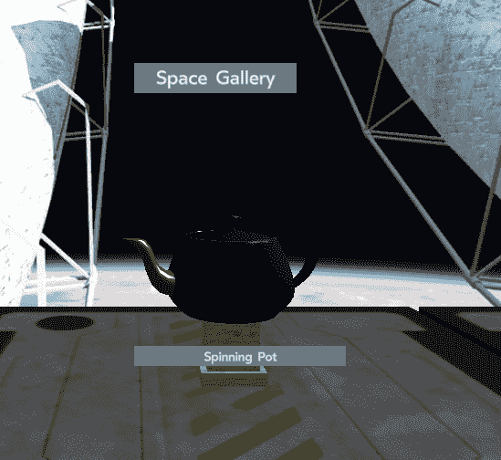

# 呼吸你世界中的生命

在最后一章中，我们使用材质使对象看起来更真实。我们知道，虚拟现实并非完全必要，正如我们在[第 1 章](01.html)、*什么是虚拟现实，实际上是*中所讨论的，但它确实有帮助。现在，我们将学习如何通过移动使事物看起来真实。这可以做两件事：移动的物体看起来更生动，它也有助于视差深度感知。

React VR 有许多 API，可以很容易地包含流畅自然的动画。在大多数传统的 CGI 中，使动画流动不是那么容易；你必须缓慢地开始一个动作，加速，然后慢慢地减速，否则这个动作看起来是假的。

我们将在本章中介绍这些主题：

*   用于设置对象动画的`Animated`API
*   一次性动画
*   连续动画
*   生命周期事件，如`componentDidMount()`
*   如何向世界注入声音

运动和声音在让世界看起来充满活力方面有很大的帮助。让我们这样做吧！

# 动画 API

React 和 React VR 使这变得简单，因为动画 API 有许多动画类型，使这变得简单，而无需像传统动画那样进行数学运算或设置关键帧。不需要设置关键帧，您可以以声明的方式缓慢爬升、反弹和暂停。这些支柱是春天、衰变和时机；有关这些的更多详细信息，请参见在线文档[http://bit.ly/ReactAnims](http://bit.ly/ReactAnims) 。

制作动画很好，但我们需要知道我们要去哪里。为此，动画 API 有两种值类型：标量值（单个值）和向量值 XY。您可能想知道，为什么在这种情况下，向量只有*X*和*Y-*ValueXY 是用于 UI 元素的，而这些元素本质上是扁平的。如果需要设置 X、Y 和 Z 位置的动画，可以使用三个标量。

首先，我们将创建一个旋转的动画茶壶。这将特别有助于了解纹理贴图是如何工作的。如果您一直遵循代码，那么您的`SpaceGallery`应用程序应该已经具备了我们开始编写本章所需的大部分内容。如果没有，您可以下载源文件开始于：[http://bit.ly/VR_Chap7](http://bit.ly/VR_Chap7) 。如果你真的不想输入所有这些，我把最后的文件放在：[http://bit.ly/VR_Chap8](http://bit.ly/VR_Chap8) 。

假设您下载或完成了最后一章，从[第 7 章](07.html)开始`index.vr.js`，*拿着一个（虚拟的）茶壶坐下来，*开始并进入以下新类，`TurningPot()`在文件顶部，但在`import`语句下（注意，我们仍然在`SpaceGallery`应用程序中）

```jsx
 class TurningPot extends React.Component {
    constructor(props) {
      super(props);
      this.state = {
        yRotation: new Animated.Value(0),
      };
    }
```

这将设置动画值/变量-`yRotation`。我们已经创建了一个标量，这是可以的，因为我们将把它映射到`rotateY`。

别忘了`import`动画关键词。

接下来，我们将使用一个名为`componentDidMount`的生命周期覆盖。生命周期覆盖是在加载和创建（渲染）虚拟现实世界期间的特定时间调用的事件；在本例中，`componentDidMount`函数在挂载后被调用（根据事件名称中的“Did”片段）。挂载意味着在 three.js 中加载、可用并创建对象；换句话说，它是在世界上。当该组件即将安装但还不存在时，调用函数`componentWillMount`；我们不使用这个选项，因为我们希望对象在实际为可见对象时移动，尽管它对于加载对象、初始化状态等非常有用。

注意，我们还没有完成声明，所以最后的结束括号`{`不在那里：

```jsx
   componentDidMount() {
        Animated.timing( 
          this.state.yRotation, // Animate variable `yRotation`
          {
            duration: 10000,    // Time
            toValue: 360,       // Spin around a full circle
          }
        ).start();              // Start the animation
      } 
```

`componentDidMount()`是一个重要的对象生命周期 API 调用，用于做我们正在做的事情；启动动画。

This event will most likely happen before the browser finishes loading everything, so you may miss the actual start. If this is a concern, you can overload some other methods to ensure that it fires at the right time, or introduces a small delay.

# 飞壶

现在，重要的是渲染本身。使用`Animated.View`关键字编写以下方法：

```jsx
    render() {
      return (
        <Animated.View // Base: Image, Text, View
          style={{
            flex: 1,
            width: 1,
            height: 1,
            transform: [ 
              {rotateY: this.state.yRotation}, // Map yRotation to rotateY
            ]
          }}
          >
          <Model
          source={{
              obj: asset('teapot2.obj'),
              mtl: asset('teapot2_Mats.mtl'),
              }}
              lit
              style={{
                  transform: [{ translate: [0, -0.7, -5.1 ] }]
                  }}
          />
      </Animated.View>
      );
    }

  }
```

现在，保存这个文件。如果您在 URL[中使用了`?hotreload`http://localhost:8081/vr/?hotreload](http://localhost:8081/vr/?hotreload) 当你打开你的世界，并正确输入所有内容时，你会看到茶壶自动在你面前旋转。否则，点击浏览器中的“刷新”按钮。

等等，什么？刚才发生了什么事？为什么罐子会飞！


茶壶围绕着*我们*旋转，也就是`<view>`的中心，而不是围绕自己的轴线旋转。为什么会这样？记住，翻译顺序很重要。在这种情况下，我们有一个单独的平移和旋转：

```jsx
 render() {
      return (
        <Animated.View 
...
          {rotateY: this.state.yRotation}, // Map yRotation to rotateY
...
          <Model
...
                  transform: [{ translate: [0, -0.7, -5.1 ] }]
...
      </Animated.View>
      );
```

这里发生的是视图正在旋转，然后模型正在变换。我们想按相反的顺序做。一种解决方案是将模型留在原来的位置，并将`render()`循环更改为此（请注意粗体部分）：

```jsx
    render() {
      return (
        <Animated.View // Base: Image, Text, View
          style={{
            transform: [ 
 {translate: [0, -0.7, -5.1 ] },
 {rotateY: this.state.yRotation}, // Map `yRotation' to rotateY 
            ]
          }}
          >
          <Model
          source={{
              obj: asset('teapot2.obj'),
              mtl: asset('teapot2_Mats.mtl'),
              }}
              lit
              // we comment this out because we translate the view above
 // style={{
              // transform: [{ translate: [0, -0.7, -5.1 ] }]
              // }}
          />
      </Animated.View>
      );
    }

```

# 永远旋转

当我们保存这个文件并在我们的 VR 浏览器中再次查看它时，我们将看到锅转一次。请注意，我们可能看不到启动，还请注意，当锅完成转动时，它会优雅地转动，而不是计算机动画的“粉碎停止”：



这真是太棒了，但是锅转了，然后停了下来。我们可能希望它继续转向。那我们就这么做吧！

修改组件创建，以执行以下操作（是的，我们可以去掉所有酷的动画关键字）：

```jsx
  class TurningPot extends React.Component {
    constructor(props) {
      super(props);
      this.state = {yRotation: 0};
      this.lastUpdate = Date.now();
      this.rotate = this.rotate.bind(this); 
    }
```

好的，在这一部分，记下一些事情。我们使用的变量称为`yRotation`；我们还使用了`rotate`这个词，它实际上是一个新功能：

```jsx
    rotate() { //custom function, called when it is time to rotate
        const now = Date.now();
        const delta = now - this.lastUpdate;
        this.lastUpdate = now;
        console.log("Spinning the pot");

        //note: the 20 is the rotation speed; bad form to
        //hard code it- this is for instructional purposes only
        this.setState({yRotation: this.state.yRotation + delta / 20} );
        //requestAnimationFrame calls the routine specified, not a variable
        this.frameHandle = requestAnimationFrame(this.rotate);
      } 
```

我们还需要更改对象加载/卸载例程，以启动旋转和结束计时器回调：

```jsx
   componentDidMount() { //do the first rotation
        this.rotate();
    } 
    componentWillUnmount() { //Important clean up functions
        if (this.frameHandle) {
          cancelAnimationFrame(this.frameHandle);
          this.frameHandle = null;
        }
      } 
```

`<View>`本身没有改变；它只是像驱动功能一样旋转物体；这一次，我们通过在每个`render()`循环中调用的自定义函数来驱动它。

检查延时非常重要，因为不同的平台会有不同的帧速率，这取决于硬件、GPU 和许多其他因素。为了确保所有类型的计算机和移动设备都能以相同的速度看到锅旋转，我们使用`now`变量并计算`now`和`this.lastUpdate`之间的差异，从而得到一个时间差。我们用 delta 表示实际的自旋速度。

# 最终代码

现在我们已经修复了所有这些，我们有了一个渲染良好的旋转茶壶。在进行编码的同时，我们还修复了一个糟糕的编程；锅的速度被硬编码为 20 左右。如果它是编程格言“永远不要在程序体中嵌入常量”中的一个`const`就更好了：

```jsx
import React, {Component } from 'react';

import {
  Animated,
  AppRegistry,
  asset,
  AmbientLight,
  Box,
  DirectionalLight,
  Div,
  Model,
  Pano,
  Plane,
  Text,
  Vector,
  View,
  } from 'react-vr';

  class TurningPot extends React.Component {
    constructor(props) {
      super(props);
      this.state = {yRotation: 0};
      this.lastUpdate = Date.now();
      this.rotate = this.rotate.bind(this); 
    }
    rotate() { //custom function, called when it is time to rotate
        const now = Date.now();
        const delta = now - this.lastUpdate;
        const potSpeed = 20;
        this.lastUpdate = now;
        this.setState({yRotation: this.state.yRotation + delta / potSpeed} );
        //requestAnimationFrame calls the routine specified, not a variable
        this.frameHandle = requestAnimationFrame(this.rotate);
      } 
    componentDidMount() { //do the first rotation
        this.rotate();
    } 
    componentWillUnmount() { //Important clean up functions
        if (this.frameHandle) {
          cancelAnimationFrame(this.frameHandle);
          this.frameHandle = null;
        }
      } 
    render() {
      return (
        <Animated.View // Base: Image, Text, View
          style={{
            transform: [ // `transform` is an ordered array
              {translate: [0, -0.5, -5.1 ] },
              {rotateY: this.state.yRotation}, // Map `yRotation' to rotateY 
            ]
          }}
          >
          <Model
          source={{
              obj: asset('teapot2.obj'),
              mtl: asset('teapot2_Mats.mtl'),
              }}
              lit
              //style={{
              // transform: [{ translate: [0, -0.7, -5.1 ] }]
              // }}
          />
      </Animated.View>
      );
    }

  }

class Pedestal extends Component {
    render() {
        return (
          <View>
          <Box 
          dimWidth={.4}
          dimDepth={.4}
          dimHeight={.5}
          lit
          texture={asset('travertine_striata_vein_cut_honed_filled_Base_Color.jpg')}
          style={{
            transform: [ { translate: [ this.props.MyX, -1.4, this.props.MyZ] } ]
            }}
        />
          <Box 
          dimWidth={.5}
          dimDepth={.5}
          dimHeight={.1}
          lit
          texture={asset('travertine_striata_vein_cut_honed_filled_Base_Color.jpg')}
          style={{
            transform: [ { translate: [ this.props.MyX, -1.1, this.props.MyZ] } ]
            }}
        />
          <Box 
          dimWidth={.5}
          dimDepth={.5}
          dimHeight={.1}
          lit
          texture={asset('travertine_striata_vein_cut_honed_filled_Base_Color.jpg')}
          style={{
            transform: [ { translate: [ this.props.MyX, -1.7, this.props.MyZ] } ]
            }}
          />
     </View>
    )
     }
     }

         class Platform extends Component {
             render() {
                 return ( 
                    <Model
                    source={{
                        obj: asset('DeckPlate_v1.obj'),
                        mtl: asset('DeckPlate_v1_AllMats.mtl'),
                        }}
                        lit
                        style={{
                            transform: [ {
                            translate: [ this.props.MyX, -1.8, this.props.MyZ]
                        }] }}
                    /> 

    );
          }
         }

export default class SpaceGallery extends React.Component {
    render() {
        return (
          <View>
            <Pano source={asset('BabbageStation_v6_r5.jpg')}/>
            <AmbientLight

    intensity = {.3}

    />
    <DirectionalLight
    intensity = {.7}
    style={{
        transform:[{
            rotateZ: -45
        }]
    }}
         /> 
         <Platform MyX='0' MyZ='-5.1'/>
         <Platform MyX='0' MyZ='0'/>
         <Platform MyX='0' MyZ='5.1'/>
         <Platform MyX='5.1' MyZ='-5.1'/>
         <Platform MyX='5.1' MyZ='0'/>
         <Platform MyX='5.1' MyZ='5.1'/>
         <Platform MyX='-5.1' MyZ='-5.1'/>
         <Platform MyX='-5.1' MyZ='0'/>
         <Platform MyX='-5.1' MyZ='5.1'/>

         <Pedestal MyX='0' MyZ='-5.1'/>
         <Pedestal MyX='0' MyZ='5.1'/>
         <Pedestal MyX='5.1' MyZ='-5.1'/>

         <Pedestal MyX='5.1' MyZ='5.1'/>
         <Pedestal MyX='-5.1' MyZ='-5.1'/>
         <Pedestal MyX='-5.1' MyZ='0'/>
         <Pedestal MyX='-5.1' MyZ='5.1'/>

         <Model
            source={{
                obj: asset('teapot2.obj'),
                mtl: asset('teapot2_Mats.mtl'),
                }}
                lit
                style={{
                    transform: [{ translate: [ -5.1, -1, -5.1 ] }]
                    }}
            />

        <Text
            style={{
                backgroundColor: '#777879',
                fontSize: 0.1,
                fontWeight: '400',
                layoutOrigin: [0.0, 0.5],
                paddingLeft: 0.2,
                paddingRight: 0.2,
                textAlign: 'center',
                textAlignVertical: 'center',
                transform: [ 
                    {translate: [-5.2, -1.4, -4.6] }]
                    }}>
            Utah Teapot
        </Text>
        <Text
            style={{
                backgroundColor: '#777879',
                fontSize: 0.1,
                fontWeight: '400',
                layoutOrigin: [0.0, 0.5],
                paddingLeft: 0.2,
                paddingRight: 0.2,
                textAlign: 'center',
                textAlignVertical: 'center',
                transform: [ 
                    {translate: [0, -1.3, -4.6] }]
                    }}>
            Spinning Pot
        </Text> 

         <Text
         style={{
             backgroundColor: '#777879',
             fontSize: 0.2,
             fontWeight: '400',
             layoutOrigin: [0.0, 0.5],
             paddingLeft: 0.2,
             paddingRight: 0.2,
             textAlign: 'center',
             textAlignVertical: 'center',
             transform: [ 
                {translate: [0, 1, -6] }]
         }}>
    Space Gallery
  </Text>
  <TurningPot/>

</View>
);
    }
};

AppRegistry.registerComponent('SpaceGallery', () => SpaceGallery);
```

# 声音

虚拟现实中的声音其实相当复杂。我们的耳朵听到的东西和别人的不同。许多虚拟现实系统都会进行简单的“如果它在右边，我的右耳会更响亮”立体声平移（立体声平移），但这并不是实际声音的工作方式。对于 VR，以及他们需要的高帧速率，就像我们的灯光效果跳过了完整的光线跟踪一样，这种声音平移是可以的。

更复杂的虚拟现实系统将使用一种称为**头部相关传递函数**（**HRTF**）的东西。HRTF 是指当你倾斜头部时声音的变化。换句话说，基于*你的*头部，声音是如何“传递”的？每个人都有自己的 HRTF；它考虑了它们耳朵的形状、头部的骨密度以及鼻子和口腔的大小和形状。我们的耳朵，加上我们被抚养的方式，在这期间我们训练我们的大脑，允许我们用 HRTF 做令人惊奇的事情。例如，人类只需从两点听到某个东西，就可以在三维空间中定位它。这就好比只用一只眼睛就能看到立体声一样！HRTF 给了我们愿景所没有的东西；它让我们对周围发生的事情有了空间意识，即使我们看不到它。

在虚拟现实中使用 HRTF 需要每个在虚拟世界中听到声音的人都将其 HRTF 加载到虚拟世界的声音系统中。此外，HRTF 必须在消声室（墙壁上有泡沫衬里以消除回声的室）中测量。这显然不是很常见。

因此，大多数 VR 声音只进行左/右平移。

这是虚拟现实可以取得重大突破的领域。声音非常重要，它让我们能够在三维空间中感知事物；这是沉浸的一个重要方面。很多人认为立体平移是 3D 的；这就是一只耳朵的声音比另一只耳朵大的地方。在音响系统中，这是*平衡*旋钮。在耳机中，这听起来很奇怪，但实际上并没有将声音本地化。在现实世界中，你的右耳会在左耳之前（或之后）的一瞬间听到一个声音，当你倾斜你的头时，你耳朵的曲线会改变延迟，你的大脑会说“啊，声音就在那里*。”*

 *立体摇摄几乎可以在没有 HRTF 测量的情况下完成，但 HRTF 明显更好。好消息是，现在的音频硬件和计算能力非常强大，使用 HRTF 或合理的软件来模拟平均 HRTF，可以实现更复杂的声音处理。查看此区域以了解未来的增强功能。

反应 VR 的力量再次拯救了我们。我们不必担心这些；我们只需要把声音放在我们的世界里。

说真的，不要因为这些谈话而太灰心，只是要知道声音是困难的（和图形渲染一样重要），但是在这一点上，你真正需要做的就是获得一个好的单声道（而不是立体声）声音并在场景文件中描述它。

这就是 React VR 的全部要点。描述你想要什么；你不需要告诉别人怎么做。不过，你还是需要知道幕后发生了什么。

# 让声音进入我们的世界

现在，让我们来制造一些噪音。[Freesound.com](http://Freesound.com)是一个提供免费游戏声音的好地方。那里的大多数声音都需要归属。给予那些帮助建立你的世界的人们荣誉是正确的做法。去这个网站下载几个你喜欢的声音文件。我在`freesound.com`找到的几个是：

*   通过 Geodylab（[http://bit.ly/BoilingPot1](http://bit.ly/BoilingPot1) ）
*   多溴化物沸水（[http://bit.ly/Boiling2](http://bit.ly/Boiling2) ）
*   abrez 的沸水（[http://bit.ly/Boiling3](http://bit.ly/Boiling3) ）

我以`.mp3`文件格式下载了这些文件；这应该是相当跨平台的。将它们复制到目录`static_assets`中一个名为`sounds`的新文件夹中。我在现实世界中只使用了其中一个，但你可以尝试其他的。有时你不知道它是否有效，直到你在世界上听到它。

声音是必须附加到视图、图像或文本组件的节点。您可能希望将其附加到长方体、模型或其他对象上；只需用一个`<View>`包裹对象，并将`sound`组件放入其中，如图所示：

```jsx
 <View>
    <Model
       source={{
        obj: asset('teapot2.obj'),
        mtl: asset('teapot2_Mats.mtl'),
        }}
        lit
        style={{
            transform: [{ translate: [ -5.1, -1, -5.1 ] }]
            }}
    >
    </Model>
 <Sound 
        loop
        source={{wav: asset('sounds/211491__abrez__boiling-water.mp3') }}
        />
    </View>
```

有一点有趣的是，声音不是从我们的茶壶所在的位置发出的（当你第一次看到这个世界时，左上角）。为什么呢？看看前面的代码；我们只是将`View`标签包裹在`Model`上；因此，它的转换与声音不同。

有些声音比其他声音效果更好；你必须自己做实验或记录。修复转换留给读者作为练习。（实际上，这很简单，但请确保不要将转换粘贴为子 XML 元素。）正确的代码如下：

```jsx
<View
    style={{
 transform: [{ translate: [-5.1, -1, -5.1] }]
 }}
>
    <Model
        source={{
            obj: asset('teapot2.obj'),
            mtl: asset('teapot2_Mats.mtl'),
        }}
        lit
    >
    </Model>
    <Sound
        loop
        source={{ wav: asset('sounds/211491__abrez__boiling-water.mp3') }} />
</View>
```

# 总结

我们学习了如何通过按程序更改对象的位置以及使用更高级的计时器和动画 API 方法来构建动画。我们戏剧性地看到了如果我们使用错误的`<View>`来制作动画会发生什么，并开发了一种让对象永远动画化的方法。能量兔会感到骄傲的。我们还添加了声音，这对于虚拟世界来说非常重要。

你可以用定时器做很多事情；我强烈建议你学习在线文档和实验！

到目前为止，我们还停留在国内。有时候，有些事情我们需要去做，但我们做不到。在下一章中，我们将使用 Native（即 Native React）！

有人能关掉那个沸腾的锅吗？*