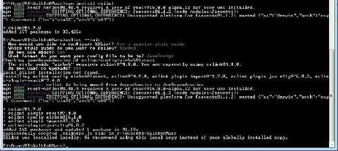
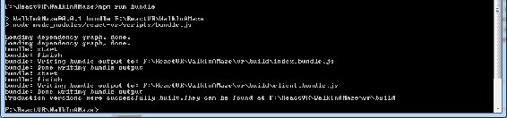

# 十二、发布你的应用，以及从这里去往哪里

在家里开发和体验虚拟世界很有趣。但最终，你希望世界看到你的世界。为此，我们需要打包并发布我们的应用。在发展过程中，可能会出现反应升级；在发布之前，您需要决定是需要“代码冻结”并附带稳定版本，还是升级到新版本。这是一个设计决策。

在某个时候，您需要升级，并且需要发布。本章将解释如何做到这两个方面，以及如何组织您的代码和检查您的烘干机，以及您的代码，为皮棉。我们将在这里介绍这些主题：

*   升级类型：翻页替换或“整容”升级或“就地升级”
*   如何确保存在正确版本的组件
*   开发与非开发版本、组件和库
*   发行许可证
*   链接和嵌入虚拟现实内容
*   发布到通用 web 主机和内容交付网络。
*   虚拟现实在未来 5 年的发展方向

# 升级反应虚拟现实

其中一件有趣的事情是 web 项目经常更新，尽管这可能会令人沮丧。在本书的编写过程中，React VR 进行了更新。有两种不同的升级方式：

*   您可以使用相同的名称安装/创建新应用
    *   然后，您将转到旧应用并复制所有内容
    *   这是**整容**升级或*撕开并替换*
*   做一个更新。通常，这是对`package.json`的更新，然后删除`node_modules`并重建它。这是一个**升级到位**。

这取决于您使用哪种方法，但主要的区别在于就地升级比较容易，没有源代码可以修改和复制，但它可能会工作，也可能不工作。整容升级还依赖于您使用正确的`react-vr-cli`。无论何时从命令提示符运行 React VR，都会出现一个通知，告诉您它是否旧：


The error or warning that comes up about an upgrade when you run React VR from a Command Prompt may fly by quickly. It takes a while to run, so you may go away for a cup of coffee.

Pay attention to red lines, seriously.

要就地进行升级，如果您订阅了该项目，通常会收到 Git 的更新通知。如果没有，您应该转到：[http://bit.ly/ReactVR](http://bit.ly/ReactVR) ，创建一个账户（如果你还没有），然后点击眼球图标加入观察列表。然后，每次升级时，您都会收到一封电子邮件。首先，我们将介绍进行就地升级的最直接的方法。

# 升级到位

您如何知道您安装了哪个版本的 React？在 Node.js 提示符中，键入以下内容：

```jsx
npm list react-vr
```

同时，检查`react-vr-web`的版本：

```jsx
npm list react-vr-web
```

检查`react-vr-cli`的版本（命令行界面，实际上只用于创建*hello world*应用）。

```jsx
npm list react-vr-cli 
```

检查`ovrui`版本（打开 VR 用户界面）：

```jsx
npm list ovrui
```

您可以对照文档上的版本检查这些。如果你已经订阅了 GitHub 上的 React VR（你应该这么做！），那么你会收到一封电子邮件，告诉你有升级。请注意，CLI 还将告诉您它是否过期，尽管这仅适用于创建新应用（文件夹/网站）时。

发行说明位于：[http://bit.ly/VRReleases](http://bit.ly/VRReleases) 。在那里，您将找到升级说明。升级说明通常要求您执行以下操作：

1.  删除您的`node_modules`目录。
2.  打开你的`package.json`文件。
3.  将`react-vr`、`react-vr-web`、`ovrui`更新为“新版本号”，如 2.0.0。
4.  将`react`更新为“a.b.c”。
5.  更新`react-native to`“~d.e.f”。
6.  将`three`更新为“^g.h.k”。
7.  运行`npm`安装或安装。

Note the ~ and ^ symbols; ~version means *approximately equivalent to version* and ^version means *compatible with version*. This is a help, as you may have other packages that may want other versions of `react-native` and `three`, specifically. To get the values of {a...k}, refer to the release notes.

我还发现您可能需要将这些模块包括在`package.json`的`devDependencies`部分：

```jsx
"react-devtools": "^2.5.2",
"react-test-renderer": "16.0.0",
```

您可能会看到以下错误：

```jsx
module.js:529
 throw err;
 ^
Error: Cannot find module './node_modules/react-native/packager/blacklist'
```

如果这样做，请在中的项目根文件夹中进行以下更改

`rncli.config.js`文件。

将`var blacklist = require('./node_modules/react-native/packager/blacklist');`线路更换为`var blacklist = require('./node_modules/metro-bundler/src/blacklist');`。

# 第三方依赖关系

如果您一直在使用`npm install <something>`进行试验并添加模块，您可能会发现，在升级后，这些功能都无法正常工作。`package.json`文件还需要了解您在实验过程中安装的所有附加软件包。这是确保 Node.js 知道我们需要特定软件的项目方式（npm 方式）。如果您有此问题，您需要使用-`save`参数重复`install`，或者编辑`package.json`文件中的`dependencies`部分。例如，当我们在上一章中试验随机数时，我们可以手动添加这一行：

```jsx
{
  "name": "WalkInAMaze",
  "version": "0.0.1",
  "private": true,
  "scripts": {
    "start": "node -e \"console.log('open browser at http://localhost:8081/vr/\\n\\n');\" && node node_modules/react-native/local-cli/cli.js start",
    "bundle": "node node_modules/react-vr/scripts/bundle.js",
    "open": "node -e \"require('xopen')('http://localhost:8081/vr/')\"",
    "devtools": "react-devtools",
    "test": "jest"
  },
  "dependencies": {
    "ovrui": "~2.0.0",
    "react": "16.0.0",
    "react-native": "~0.48.0",
    "three": "^0.87.0",
    "react-vr": "~2.0.0",
    "react-vr-web": "~2.0.0",
    "mersenne-twister": "^1.1.0"
  },
  "devDependencies": {
    "babel-jest": "^19.0.0",
    "babel-preset-react-native": "^1.9.1",
    "jest": "^19.0.2",
    "react-devtools": "^2.5.2",
    "react-test-renderer": "16.0.0",
    "xopen": "1.0.0"
  },
  "jest": {
    "preset": "react-vr"
  }
}
```

再次，这是手动方式；更好的方法是使用`npm install <package> -save`。

`-s`限定符保存您在`package.json`中安装的新软件包。如果版本不匹配，手动编辑可以很方便地确保获得正确的版本。

If you mess around with installing and removing enough packages, you will eventually mess up your modules. If you get errors even after removing `node_modules`, issue these commands:

`npm cache clean --force`

`npm start -- --reset-cache`

The cache clean won't do it by itself; you need the `reset-cache`, otherwise, the problem packages will still be saved, even if they don't physically exist!

# 真正破败的升级–撕开并替换

然而，如果在完成所有这些工作后，您的升级*仍然*不起作用，那么一切都不会丢失。我们可以进行*翻修并更换*升级。请注意，这是一种“最后手段”，但它确实工作得相当好。遵循以下步骤：

1.  确保您的`react-vr-cli`套餐在全球范围内是最新的：

```jsx
[F:\ReactVR]npm install react-vr-cli -g
C:\Users\John\AppData\Roaming\npm\react-vr -> C:\Users\John\AppData\Roaming\npm\node_modules\react-vr-cli\index.js
+ react-vr-cli@0.3.6
updated 8 packages in 2.83s
```

这一点很重要，因为当有新版本的 React 时，您可能没有最新的`react-vr-cli`。当你使用它时，它会告诉你有一个更新的版本，但这行经常滚动；如果你觉得无聊而不注意，你可以花很多时间尝试安装一个更新的版本，但没有用。

An npm generates a lot of verbiage, but it is important to read what it says, especially red formatted lines.

2.  确保关闭所有 CLI（DOS）窗口、编辑会话、运行 CLI 的 Node.js 等。（不过，您不需要重新启动；只需使用旧目录关闭所有内容即可）。
3.  将*旧*代码重命名为`MyAppName140`（在旧`react-vr`目录末尾添加版本号）。
4.  使用`react-vr init MyAppName`创建应用，换句话说，使用原始应用名称。
5.  下一步最容易使用 diff 程序（参考[http://bit.ly/WinDiff](http://bit.ly/WinDiff) ）。我用的是无与伦比的，但也有其他的。如果需要，选择一个并安装它。
6.  比较两个目录`.\MyAppName`（新）和`.\MyAppName140`，看看有哪些文件发生了变化。
7.  移动旧应用中的任何新文件，包括资产（您可能可以复制整个 static_assets 文件夹）。

8.  合并除`package.json`之外的任何已更改的文件。通常，您需要合并这些文件：
    *   `index.vr.js`
    *   `client.js`（如果您更改了）
9.  对于`package.json`，请查看添加了哪些行，并通过 npm`install <missed package> --save`在新应用中安装这些包，或者启动应用，查看缺少什么。
10.  删除*hello world*应用所植入的任何文件，例如`chess-world.jpg`（当然，除非您使用的是该背景）。
11.  通常，您不会更改`rn-cli.config.js`文件（除非您修改了种子版本）。

大多数代码将直接移动到上面。如果更改了目录名，请确保更改了应用名，但按照前面的说明，您不必更改。

如果有大量的更改来响应 VR，那么前面列出的升级步骤可能会稍微容易一些；这需要对源文件进行一些挑选。源代码非常简单，因此在实践中应该很容易实现。

我发现，如果自动升级不起作用，这些技术将最有效。

# 进行升级的最佳时间

如前所述，在发布应用之前，进行主要升级的时间可能并不合适，除非您需要一些新功能。您希望充分测试您的应用，以确保没有任何 bug。

不过，我在这里介绍了升级步骤，但这并不是因为您应该在发布之前就进行升级。

# 准备好发布代码

老实说，你永远不应该推迟整理你的衣服，直到，哦，等等，我们在谈论代码。你永远不应该把组织代码的工作推迟到你想发布代码的那天晚上。即使是你认为可以扔掉的代码，最终也可能投入生产。从一开始就学习好的编码习惯和风格。

# 良好的代码组织

好的代码从一开始就非常重要，原因有很多：

*   如果代码使用粗略的缩进，则更难阅读。许多代码编辑器，如 VisualStudioCode、Atom 和 Webstorm，都会为您格式化代码，但不依赖于这些工具。
*   糟糕的命名约定可能会隐藏问题。
*   变量的不当情况可能会隐藏问题，例如使用`this.State`而不是`this.state`。
*   花在编码上的大部分时间（高达 80%）都在维护上。如果你不能阅读代码，你就不能维护它。当你刚开始做程序员的时候，你经常会认为你总是能够阅读自己的代码，但是当你在几年后拿起一篇文章说*“这垃圾是谁写的？”*然后意识到是*你*的时候，你就会停止做 a、b、c、d 变量名之类的事情。
*   大多数软件在某种程度上是由作者以外的人维护、阅读、复制或使用的。
*   大多数程序员认为代码标准是为“另一个人”设计的，但当他们不得不很好地编写代码时，他们会抱怨。那又是谁呢？
*   大多数程序员会立即要求提供代码文档，当他们找不到时，他们会翻白眼。我通常要求查看他们为上一个项目编写的文档。我雇用的每一个程序员通常都会给我一个目不转睛的眼神。这就是为什么我通常要求代码中有好的注释。
    *   好的评论不是这样的：

```jsx
//count from 99 to 1
for (i=99; i>0; i--)
    ... 
```

```jsx
//we are counting bottles of beer
for (i=99; i>0; i--)
    ... 
```

# 清洁棉绒收集器（检查规范标准）

当你洗衣服时，棉绒会堆积起来，最终会堵塞你的洗衣机或烘干机，或者引起火灾。在 PC 世界中，旧代码、键入错误的名称以及所有这些都会累积起来。

**重构**是清理代码的一种方法。我*强烈*建议您使用某种形式的版本控制，如 Git 或 bitbucket 来检查代码；在重构过程中，很可能会完全弄乱代码，如果不使用版本控制，可能会损失很多工作。

在发布之前，对您的工作进行代码审查的一个好方法是使用**linter**。Linter 会仔细检查你的代码，指出问题（crud）、不正确的语法、可能与你预期的工作方式不同的事情，通常会像你妈妈一样，在你身后收拾房间。虽然你可能不喜欢你妈妈那样做，但这些工具是无价的。毕竟，计算机是非常挑剔的，为什么不使用机器来对抗对方呢？

让软件检查您的软件是否有 JavaScript 的最常见方法之一是一个名为**ESLint**的程序。您可以在以下网址阅读：[http://bit.ly/JSLinter](http://bit.ly/JSLinter) 。要安装 ESLint，您可以像大多数软件包一样通过 npm 进行安装-`npm install eslint --save-dev`。

`--save-dev`选项在您开发项目时为您的项目添加了一个需求。发布应用后，无需将 ESLint 信息打包到项目中！

要让 ESLint 正常工作，还需要做很多其他事情；阅读配置页面并浏览教程。很大程度上取决于您使用的 IDE。例如，您可以将 ESLint 与 VisualStudio 一起使用。

安装 ESLint 后，需要配置本地配置文件。用这个

`eslint --init`。

`--init`命令将显示提示，询问您如何配置它将遵循的规则。它将提出一系列问题，并询问使用何种风格。AirBNB 相当常见，尽管您可以使用其他；没有错误的选择。如果你在一家公司工作，他们可能已经有了标准，所以请咨询管理层。其中一个提示将询问您是否需要作出反应。

# 反应虚拟现实编码风格

**编码风格**近乎宗教化，但在 JavaScript 和 React 世界中，一些标准非常常见。AirBNB 有一个很好的、相当受好评的风格指南：[http://bit.ly/JStyle](http://bit.ly/JStyle) 。

对于 VR 的反应，需要考虑的一些样式选项如下：

*   变量名的第一个字母使用小写字母。换句话说，this.props.currentX，而不是 this.props.currentX，并且不使用下划线（这称为**camelCase**。
*   仅在命名构造函数或类时使用**PascalCase**。
*   在对文件使用 PascalCase 时，请使文件名与类匹配，以便

进口`MyClass from './MyClass'`。

*   小心 0 对{0}。一般来说，学习 JavaScript 并做出反应。
*   始终使用`const`或 let 来声明变量，以避免污染全局命名空间。
*   避免使用++和--。这是一个很难的，我是一个 C++程序员。希望在您阅读本文时，我已经在源代码示例中修复了它。如果没有，就照我说的去做，不要照我做的去做！
*   学习= =和=＝=的差异，并正确使用它们，这是 C++和 C 程序员的新事物。

总的来说，我强烈建议您在编写代码时仔细考虑这些编码样式，并使用过梁：



# 第三方依赖关系

为了使您发布的网站/应用真正可靠地工作，我们还需要更新`package.json`；这是一种“项目”方式，以确保 Node.js 知道我们需要一个特定的软件。我们将编辑`"dependencies"`部分以添加最后一行（显然，粗体强调我的，粗体不会显示在文本编辑器中！）：

```jsx
{
  "name": "WalkInAMaze",
  "version": "0.0.1",
  "private": true,
  "scripts": {
    "start": "node -e \"console.log('open browser at http://localhost:8081/vr/\\n\\n');\" && node node_modules/react-native/local-cli/cli.js start",
    "bundle": "node node_modules/react-vr/scripts/bundle.js",
    "open": "node -e \"require('xopen')('http://localhost:8081/vr/')\"",
    "devtools": "react-devtools",
    "test": "jest"
  },
  "dependencies": {
    "ovrui": "~2.0.0",
    "react": "16.0.0",
    "react-native": "~0.48.0",
    "three": "^0.87.0",
    "react-vr": "~2.0.0",
    "react-vr-web": "~2.0.0",
    "mersenne-twister": "^1.1.0"
  },
  "devDependencies": {
    "babel-jest": "^19.0.0",
    "babel-preset-react-native": "^1.9.1",
    "jest": "^19.0.2",
    "react-devtools": "^2.5.2",
    "react-test-renderer": "16.0.0",
    "xopen": "1.0.0"
  },
  "jest": {
    "preset": "react-vr"
  }
}
```

这是手动方式；更好的方法是使用`npm install <package> -s`。

`-s`限定符保存您在`package.json`中安装的新软件包。如果版本不匹配，手动编辑可以很方便地确保获得正确的版本。

If you mess around with installing and removing enough packages, you will eventually mess up your modules. If you get errors, even after removing `node_modules`, issue these commands:

`npm start -- --reset-cache`
`npm cache clean --force`

The cache clean won't do it by itself; you need the reset–cache, otherwise the problem packages will still be saved, even if they don't physically exist!

# 用于在 web 上发布的绑定

假设您已正确设置了项目依赖项，以便从 web 服务器（通常是通过 ISP 或服务提供商）运行项目，则需要将其“捆绑”起来。React VR 有一个脚本，可以将所有内容打包成几个文件。

当然，请注意，您的桌面计算机算作“web 服务器”，尽管我不建议您将开发计算机公开给 web。让其他人体验您的新虚拟现实的更好方法是将其捆绑并放到商业 web 服务上。

# 打包以在网站上发布

使用 React VR 提供的脚本，基本过程很简单：

1.  进入正常运行`npm start`的 VR 目录，运行`npm run bundle`命令：



2.  然后，您将以正常上传文件的方式访问您的网站，并创建一个名为`vr`的目录。
3.  在您的项目目录中，在我们的案例`f:\ReactVR\WalkInAMaze`中，在`.\VR\Build`中找到以下文件：

`client.bundle.js`
`index.bundle.js`

4.  把这些复制到你的网站上。
5.  制作一个名为`static_assets`的目录。
6.  将应用使用的所有文件从`AppName\static_assets`复制到新的`static_assets`文件夹。
7.  确保为所有内容设置了 MIME 映射；特别是，.obj、.mtl 和.gltf 文件可能需要新的映射。查看您的 web 服务器文档：
    *   对于 gltf 文件，使用`model/gltf-binary`
    *   gltf 使用的任何.bin 文件应为`application/octet-stream`
    *   对于.obj 文件，我使用了`application/octet-stream`
    *   官方名单位于[http://bit.ly/MimeTypes](http://bit.ly/MimeTypes)
    *   通常，`application/octet-stream`将发送与服务器上文件“完全相同”的文件，因此这是一种通用的“全面覆盖”
8.  将`index.html`从应用的根目录复制到您网站上发布应用的目录；在我们的例子中，它将是`vr`目录，因此该文件与两个.js 文件并列。
9.  以下行修改`index.html`（注意对`./index.vr`的修改）：

```jsx
<html>
  <head>
    <title>WalkInAMaze</title>
    <style>body { margin: 0; }</style>
    <meta name="viewport" content="width=device-width, initial-scale=1, user-scalable=no">
  </head>
  <body>
    <!-- When you're ready to deploy your app, update this line to point to your compiled client.bundle.js -->
 <script src="./client.bundle?platform=vr"></script>
    <script>
      // Initialize the React VR application
      ReactVR.init(
        // When you're ready to deploy your app, update this line to point to
        // your compiled index.bundle.js
 './index.vr.bundle?platform=vr&dev=false',
        // Attach it to the body tag
        document.body
      );
    </script>
  </body>
</html>
```

注意：对于生产版本，这意味着如果您指向的是静态 web 服务器上的预构建捆绑包，而不是 React 本机捆绑包，那么 dev 和 platform 标志实际上不会做任何事情，因此，`dev=true`、`dev=false`甚至`dev=foobar`之间没有区别。

# 获得释放和归属

如果您使用了 web 上任何位置的任何资产，请确保您拥有正确的版本。例如，许多 Daz3D 或 Poser 模型不包括发布几何体信息的权限；将这些文件作为 OBJ 或 glTF 文件包含在您的网站上可能违反该协议。有人可以很容易地下载模型或几乎所有的几何图形，然后将其用于其他用途。

我不是律师；您应该在获得模型的任何地方进行检查，以确保您拥有权限，并且在必要时正确地设置属性。

使用虚拟现实世界时，属性许可证有点困难，除非您将属性嵌入到某个图形中；正如我们所看到的，添加文本有时会分散注意力，并且您将始终存在规模问题。如果您在带有`<iframe>`的页面中嵌入了一个虚拟现实世界，您可以在 HTML 端提供适当的属性。然而，这并不是真正的虚拟现实。

# 检查图像大小并使用内容交付站点

您使用的一些图像，特别是`<pano>`语句中的图像，可能非常大。您可能需要优化这些，以获得适当的 web 速度和响应能力。

这是一个相当普遍的话题，但有一件事可以帮助你建立一个**内容交付网络**（**CDN**），特别是如果你的世界将是一个高容量的世界。

将 CDN 添加到 web 服务器很容易。您可以从单独的位置托管资产文件，并在`ReactVR.init()`调用中将根目录作为 AssetRot 传递。例如，如果您的文件托管在`https://cdn.example.com/vr_img/`上，您将更改`index.html`中的方法调用，以包含以下第三个参数：

```jsx
ReactVR.init(
   './index.bundle.js?platform=vr&dev=false',
   document.body,
   { assetRoot: 'https://cdn.example.com/vr_img/' }
);
```

# 优化您的模型

在[第 10 章](10.html)*引入真实生活世界*中，我们构建了一个迷宫，在迷宫的每一个正方形上重复使用相同的*灌木*模型。如果您正在观看 web 控制台，您可能已经注意到该模型被反复加载。这不一定是最有效的方式。考虑其他技术，例如将各种子组件的模型作为道具传递。

**多边形抽取**是另一种在优化 web 和 VR 模型方面非常有价值的技术。使用 glTF 文件格式，您可以使用“法线贴图”，但仍然可以使低多边形模型看起来像高分辨率模型。这方面的技术在游戏开发领域有很好的文档记录。这些技术确实很有效。

您还应该优化模型，使其不显示看不见的几何图形。例如，如果您正在显示车窗被遮住的车型，则不需要加载发动机详细信息和内部详细信息（除非车窗是透明的）。这听起来很明显，尽管我发现我用来说明照明示例的灯的多边形数量几乎是需要的三倍；玻璃灯罩具有位于模型内部的内部和外部多边形

# 现在我们已经出版了，下一步怎么办

一旦我们建立了现实，我们该怎么办？我们去哪里？

如果你没有某种虚拟现实体验的想法，你就不会读这本书。我鼓励你去玩和尝试。你甚至可以尝试一些你听说过的不好的事情（比如移动视角）。

当虚拟现实再次爆发时，我有点不满；我在虚拟现实时代所做的大部分事情似乎都被遗忘了；人们认为“VR UI 是新的！”。一直以来，虚拟现实的学术文献都有几十年的历史，讨论感知效果和虚拟现实用户界面，只是虚拟现实的一个领域。

然而，这并不是一件坏事。如果涌入虚拟现实的人们能想出一些新的想法，也许那将是每个人都在寻找的“杀手级应用”。

也许你可以做这个！我希望你会。

React VR 是一个轻量级、支持 VR 的渲染系统。还有很多东西可以补充。

# 物理学——让世界与自身互动

现实世界中的物体相互移动和交互。编程这样的交互可能会变得单调乏味；这是一个好的物理包可以超越的地方。

简单地说，如果你的物体具有真实世界的物理特性，它们会看起来更真实。

我看到的很多物理演示都是*弹跳球*类型的演示，展示物体飞来飞去并拍打物体。我认为一种更微妙的物理方法，尽管如此，仍然是准确的（基于物理引擎），将在虚拟现实世界中提供一种不应忽视的逼真感。

有两个 JavaScript 物理引擎：**Cannon.JS**和**Oimo.JS**。

Cannon.JS 是一个刚体物理引擎，包括简单的碰撞检测、各种身体形状、接触、摩擦和约束。源代码和文档位于：[http://bit.ly/CannonJS](http://bit.ly/CannonJS) 。

**碰撞检测**算法本身就是使用其中一个软件包的充分理由，即使您没有预见到编写保龄球游戏或向砖墙射击球体。例如，碰撞检测可用于确定虚拟化身是否可以导航到 VR 世界中的特定位置。

关于 React VR 和 Cannon.js 的博客帖子位于：[http://bit.ly/ReactPhysics](http://bit.ly/ReactPhysics) 。

js 是一个类似的刚体物理引擎；可在以下网址找到：[http://bit.ly/OmioPhysics](http://bit.ly/OmioPhysics) 。

请注意，Oimo.js 示例显示了*原生的*三个.js 单元，它们比 React VR（通常为 10 到 1000）小。在 React VR 中，单位大致为 1=1 米，因此 Oimo.js 将相当顺利地集成。

# 游戏引擎–让您与他人互动

有一些网站可以打包 TCP/IP 代码以支持多人游戏。只要它们使用 JavaScript，React VR 就可以很好地集成到这些应用中。一旦该发动机为**Lance.gg**，可在[处购买 http://bit.ly/Lance_gg](http://bit.ly/Lance_gg) 。

它是一个基于节点的游戏服务器。创建它是为了让 JavaScript 开发人员能够构建实时在线多人游戏，而无需担心实现网络同步代码。它致力于为开发者和玩家提供流畅的体验，而不考虑延迟。它具有以下特点：

*   Lance 负责网络代码，所以我们可以专注于 VR 部分
*   可以支持任何类型的游戏或流派
*   优化网络
    *   通过 websockets 的 TCP
    *   通信被打包并序列化为二进制
    *   通过阶跃校正自动处理网络尖峰
*   滞后处理的智能同步策略
    *   带阶跃再激活的外推（客户端预测）
    *   最优物体运动的插值方法
*   调试和跟踪工具

# 虚拟现实货币化

有几种方法可以从虚拟现实中赚钱。这是一种非常新的艺术形式，许多应用仍在探索中。和任何新领域一样，许多领域都是实验或资助的。主要硬件制造商甚至通过资助开发者建立了软件生态系统。

目前的情况是“谁先来，硬件还是杀手级应用”。耳机销售强劲，但移动耳机无疑处于领先地位，三星 GearVR、谷歌 Daydream 和纸板耳机的数量几乎是 Rift 和 Vive 等高端机型的十倍。PSVR 是一个很好的系统，但对于不属于游戏工作室的开发者来说，很难访问它。

但是，不要忘记，你甚至不需要一个虚拟现实耳机来欣赏虚拟现实。您处理的大部分代码都将在浏览器中查看，而无需进入完整的虚拟现实模式，并且您的许多观众可能会选择执行相同的操作。即使没有虚拟现实设备，在网站上嵌入虚拟现实窗口仍然会给人们带来引人注目的体验。

React VR 在虚拟现实盈利方面可能有优势，至少从广告中是如此。

通过虚拟现实赚钱的方法如下：

*   **销售应用**：**要在网站上实现这一点，您可能需要实现某种类型的付费浏览系统。大多数人不喜欢网站周围的付费墙，所以这可能是最适合成熟的虚拟现实游戏，比如用 Unity 和 Unreal 构建的游戏。但是，我们不要低估这一点。**
***   **付费打造虚拟现实体验**：大多数虚拟现实广告的网络搜索都会出现这类应用。它们几乎都是免费下载的，而且往往非常引人注目。然而，在我看来，这并不是虚拟现实制作人的成长模式；开发一款虚拟现实应用，你可以获得相当高的报酬，但一旦开发完成，你的收入流也会很高。我认为，播放与电影相关内容的虚拟现实网站的工作室发布基本上是同一个概念，我认为 React 虚拟现实非常适合这个领域。*   **在您的世界中嵌入 VR 广告**：**React VR 的一个优势是，它可以通过 React 本身访问所有布局可能性，因此 React VR 可能比任何其他 VR 系统更容易、更直接。一个挑战是沉浸在虚拟现实世界中的人们不喜欢分心，因此弹出广告可能会产生相反的效果。不过，在你的世界里，植入式广告或广告牌还是相当有效的，特别是如果你正在建设某种虚拟城市的话。*****   **从您的虚拟现实世界内部链接到产品或网站**：这对于普通网站很有效，尽管虚拟现实面临的挑战是，您可能需要摘下虚拟现实耳机才能真正与您在虚拟现实世界中点击的内容互动。一些广告公司已经讨论过在虚拟现实世界中构建广告世界，你将从虚拟现实世界中进入虚拟现实世界，尽管到目前为止，这些广告大多用于传统游戏引擎。尽管如此，我们可以期待未来在这一领域有很多发展。*   **变卖元数据**：在这种模式下，应用本身是免费的，但 VR 开发者将启用凝视跟踪。虚拟现实世界中的*热点*可以卖给广告商，就像点击或印象是用更扁平的 HTML 模型销售一样。这是新兴标准的另一个领域。*   **演示版到完整版**：您可以使用从成熟的游戏引擎中获取的模型和资产构建一个 React VR 世界，然后将其作为捆绑或免费赠品放在网页上，让人们对您的完整 VR 应用感兴趣。拥有行业标准格式，如 OBJ 和 glTF，将有助于做到这一点，尽管许多逻辑必须从头开发。一个可能更好的方法是在付费墙后面有一个免费的 web URL 和一个付费 URL。*   **应用内购买**：这将是游戏中的东西触发其外部购买的一种方式。例如，视频播放器可以请求支付特定视频的费用，然后 React VR 代码将播放该视频。由于集成 JavaScript 的简单方法，React VR 的应用内购买将相当简单。****

 ****# 未来五年虚拟现实将走向何方

如果我知道虚拟现实在未来五年的发展方向，我会在五年内变得富有，如果你投资于我的预测，你也会变得富有。让我知道结果如何。

我希望你通过开发奇妙的世界来投资虚拟现实，即使不是用虚拟现实。我真的很相信虚拟现实，希望这次它能成功。

这就引出了我这次所说的*的意思*。我至少经历过一次虚拟现实浪潮；当时，每个人都认为虚拟现实是未来的潮流。你听到的关于虚拟现实的所有伟大的事情，我以前都听说过。从 1995 年到 2000 年左右，我一直在做虚拟现实。虚拟现实死机了。创建了 HMD、数据手套和整个虚拟世界。

大多数人说当时的图形太粗糙了。这是有一定道理的，但是还没有尝试过虚拟现实的人说*“我会等到图形变得更真实”*没有意识到，正如我们所讨论和看到的，虚拟现实并不需要伟大的图形才能出现*真实*。

我们所说的虚拟现实也有点不同。那时，似乎在很久以前，PC 上的任何 3D 程序都被松散地称为 VR。当 VRML 语言被发明时（现在是 X3D），我甚至预测，我们需要做好这一切，否则人们会在美丽的 3D 环境中走向来自世界各地的陌生人，（实际上）杀死他们。

在某种程度上，我是对的；例如，在魔兽世界，这正是发生的事情。由于电脑游戏，现代虚拟现实拥有它所能做的一切。所有这些 frag 游戏都创造了对廉价、高质量视频卡的需求。你可能会认为高端视频卡并不便宜，但与第一代虚拟现实硬件相比，它们便宜得惊人。

屏幕上的 3D 电脑游戏不是我们今天所说的虚拟现实，这是非常正确的。电脑游戏，无论看起来有多棒，都不如基于 HMD 的虚拟现实体验那样让人身临其境。

我担心虚拟现实可能再次崩溃；但我认为这次不会。这次的不同之处在于，我们的口袋里都有高性能的虚拟现实设备——手机。现代手机的功能与 Silicon Graphics 公司价值 10 万美元的真人秀引擎一样强大。我们可以用一个简单、便宜的虚拟现实耳机打开一部手机，看看虚拟现实。它可能不像跟踪控制器那样具有交互性，但它可以工作。蓝牙控制器不会消失，手机也不会消失。

因此，虚拟现实将继续存在，但它将走向何方？

# 不要等待明年的技术

很久以前，当我 20 岁买第一台立体声音响时，我觉得大学暑假打工赚了很多钱，我真的很想要一台立体声音响。我花了数周的时间反复研究规范、听力测试、比较功能，并且通常有点类似于选项。

我拿着一团钱去音响店，想买些东西。

我去了一家商店，问售货员他有什么立体声系统。

*“哦，我有明年的模特，*他说。

*什么*？我想。*真的有很棒的东西出来了吗*？

*“哦，那你还在等什么？”*我问。*“会有什么结果？”*

“*哦，明年我也会等下一年，*他说。*“你看，明年总是明年，所以我从来没有过时的立体声，*他说。他根本就没买过音响。

我明白他的意思。你可能会想，*等情况好转再说。*

我的观点是，在过去的 30 年里，我听的音乐比那个推销员听的都多。

你不应该等着去买下一件很棒的虚拟现实装备，现在就开始吧。如果有新的东西出现，你会享受虚拟现实的时间比你等待的时间长得多，你会知道你更喜欢什么。现在没有任何错误的决定。

# 更好的头盔显示器

我们今天拥有的 HMD，比如 HTC Vive、Oculus Rift、PS VR，以及基于移动的 VR 设备，比如三星 Gear VR、谷歌白日梦和谷歌硬纸板，都非常不错，但它们可以做得更好。

人眼无法真正与像素显示器相比，尽管我们确信我们看到的细节比任何当前的 HMD 都要多。我们也有更广阔的视野。

当前显示在视图上大致相似；1080 x 1200 像素，视野约为 110 度。这给了我们大约每度 10 到 15 个像素。人眼在 10 英寸处每英寸可以看到 500 到 1000 个像素；这为我们提供了每度 90 到 177 个像素。这将意味着近 20000 或 40000 像素的显示器。我们谈论的不是百万像素，而是千兆像素。

我们能在 5 年内到达那里吗？这是一个相当高的分辨率，但我认为我们的分辨率至少比现在高 4 到 16 倍。

HMD 可能会更舒适。我不确定它们是否会因为光学问题而明显变小，尽管在 10 到 15 年后，我预计它们的大小将达到隐形眼镜或眼镜的大小。这是一个非常粗略的猜测。

# 更好、更逼真的图形

图形卡的速度越来越快，价格也越来越便宜。在五年内，我们将需要每一盎司的处理能力来生成一个视觉复杂度相同的显示器，因为像素的增加，我们现在没有任何更好的外观。换言之，随着显示器像素的增加，使显示器变得更好、更宽，驱动这些显示器的处理能力也随之提高，因此视觉保真度没有你预期的那么高。隧道尽头有灯光吗？或者隧道尽头的灯光是一列往另一个方向行驶的火车？有一个好消息，它被称为中心凹渲染。为此，我们需要眼球跟踪，我们将在稍后讨论。

不管眼睛跟踪和中心凹渲染，我们将看到更逼真的渲染和更逼真的人类。会有显著的改善吗？看起来是真的吗？如果你记得从我们书的开始，图形不需要看起来像真实的生活才能看起来真实，所以尽管我期待更好的图形，但我不认为虚拟现实依赖于它们。

# 更轻松的内容创建和更高端的内容

到目前为止，我们刚刚讨论了虚拟现实的技术变化。我认为将会发生更多的事情，这将对虚拟现实产生更大的影响。无论图像是如何产生的，声音，外观，甚至感觉，我们都需要所谓的“杀手应用”。现在，大多数赚钱的虚拟现实都是游戏。一旦大型游戏开发工作室看到虚拟现实的未来，他们将开发更多 AAA 级游戏（AAA 级游戏指的是预算巨大的游戏，通常为数千万或数亿美元，团队庞大，包括艺术家、开发人员、设计师、作者和项目经理）。三款 AAA 游戏计划在本书出版后不久推出：末日虚拟现实、辐射 4 虚拟现实和 Skyrim 虚拟现实。一旦我们有了数十或数百小时的大型游戏，如果它是引人注目的（我相信它将是非常引人注目的），我们将看到虚拟现实的起飞。

在未来五年，我认为这一点肯定会取得更大的进展。我希望看到大型的持久世界，**大型多人在线角色扮演游戏**（**MMORPG**）成为虚拟现实的主流。与其在魔兽世界玩游戏，不如在魔兽世界玩游戏。哇！（双关语）。

在内容方面，我们还将看到更多的高端创作软件也在虚拟现实中。目前，更复杂的创建工具，如 Max、Maya 和 Blender，可以制作出您在 VR 中看到的最佳模型，但它们本身就是传统的应用。今天，我们看到一些应用，比如*倾斜笔刷*，让我们可以在 VR 中设计对象。我期望更高端的 CAD 将拥有无处不在的虚拟现实模式。

HMD 可能会在一段时间后变得炎热、沉重和疲劳（主要是由于前面讨论的融合适应冲突）。我不认为所有的工作都是在虚拟现实中完成的，但它将有助于在初始阶段以及检查模型。

什么更快：看屏幕上的两个对象并用鼠标拖动它们，或者用手抓住它们并移动它们？想象一下，用魔法油灰雕刻，你有一个***撤销***命令。你不能用真正的粘土来做，但你可以在虚拟现实中做到。

# 眼球跟踪

我前面提到的眼球跟踪是什么？它是 HMD 内部的一个传感器，用于观察眼球的指向。这种扫描有一些优点，主要是社交和渲染。

在我看来，社会优势是巨大的。当你看一个人的头像，这是另一个人在游戏中的表现，他们可能看起来非常僵硬和没有感情。人类从他们的眼睛中察觉到大量的情感；通过眼睛跟踪，你的头像可以显示其中的一些表情。一个简单的测试显示了一个巨大的改进，只需将卡通眼球放在一个白色小球中的一个黑点上，让这些眼睛在用户观看时环视四周。阿凡达，即使是卡通，看起来更真实。

如前所述，使用眼睛跟踪的渲染改进是一种称为中心凹渲染的渲染类型。使用眼动跟踪器，我们不需要用高细节对象填充每个像素，而只需要用高细节显示您所看到的。眼睛的其余部分通常看不到你眼球指向的地方那么多细节。我们眼睛中的视杆细胞和视锥细胞紧密地分布在中心，而在眼睛的外边缘密度要小得多。中心凹渲染通过显示远离视线中心点的较少细节来利用这一点。

这确实有效，可以显著加快图形速度；您不需要计算未显示的内容。这一点在 2016 年的年度**图形**（**SIGGRAPH**）特别兴趣小组会议上首次得到证实。

# 音频改进

说到虚拟现实音频，大多数人都担心耳机工作得有多好，或者当你坐在沙发上不摘下头盔时，耳机是否能阻挡猫的尖叫声。（希望不是！）不过，VR 音频还有很多内容；我们的耳朵做了一件惊人的事情，只需两个传感器就能精确定位声音来自何处（通常，需要三个传感器来检测任何 3D 源的距离和方向）。我们的耳朵是怎么做到的？它是用一种叫做 HRTF 的东西完成的。目前，我们确实拥有实时计算 HRTF 的技术。然而，*要计算什么*HRTF 并不那么容易确定。这并不奇怪；人是独一无二的。

每个人的 HRTF 都是不同的；如果我们播放一个使用我的 HRTF 产生的声音，我会闭上眼睛听到一个噪音，就好像它是直接从设计师想要的地方发出的一样。如果你用同一个耳机听到相同的噪音，你可能会认为它听起来是假的，或者是来自不同的方向。这就是我们如何处理声音的现实。

目前有一些解决方案，或者在专门设计用于计算 HRTF 的腔室中测量 HRTF，或者可能在耳机中使用额外的扬声器。时间会告诉我们这些技术中哪一种是最好的；这仍然是一个开放的领域。

除了 HRTF 计算来定位（精确定位）声音外，我们还需要更多更好的软件方法来定位声音。

我认为在五年内，无论我们在虚拟世界中使用什么物理系统，都可能产生适当的声音效果，而不仅仅是播放罐头噪音。例如，如果你撞到一堵混凝土墙，考虑到墙的厚度和其他参数，软件可能会在正确的位置和正确的声音产生砰砰的噪音。目前，我们只是在正确的位置播放罐装噪音（这仍然令人惊讶，但需要一些改进）。这是我想看到的。

# 控制虚拟现实

今天的控制器通常由两个带多个按钮的手持设备组成。大多数有一个简单的机械方式通过软件振动。有一个巨大的创新领域是可能的。虚拟现实行业几十年来一直致力于开发先进的设备，以实现更好的触觉、更小、更精确的控制器和数据手套。当你可以伸手去抓东西的时候，为什么要用控制器呢？

*   **触觉**是任何涉及触摸的互动。这不仅仅意味着触摸或握住鼠标；它可以是任何东西，从你移动控制器时感觉到的咔哒声或震动（目前最先进的技术），但它也可能意味着当你移动控制器时，设备会向后推。这些已经被证明多年了，并且有商业现货产品可以做一些事情，比如让你感觉到表面。这些设备将变得越来越普遍，越来越多地成为大规模生产的消费级设备。
*   **数据手套**是您佩戴的设备，允许在 VR 中跟踪每个手指关节和运动。它们已经存在了几十年。甚至还有一些系统（Leap Motion 设备）可以让你用真实的手伸出手来，并在虚拟世界中进行交互。我相信这是一个在未来几年有很大潜力的领域。
*   **全身**控制器将允许您的整个虚拟身体在虚拟现实世界中可视化、精确和跟踪。这是另一个极具潜力的领域。甚至有一些原型套装可以提供全身触觉。想象一下，穿上一套西装，能够感受和触摸世界，而不仅仅是在图像中挥舞魔杖。

# 社会和法律问题及解决办法

如果你可以在公共空间中间放置一个虚拟雕像，那是破坏吗？在 AR 或 VR 中，在业务方面进行绘画怎么样？一开始，你可能认为这很好；我自己可能想在公园中间看到一些科幻的模型，人们可以与之互动。如果这个模型是一个支持奴隶制的南方战争英雄呢？如果不满的邻居几乎用诽谤性的指控来标记你的房子怎么办？

在社交虚拟现实中，我们可以用现实生活中不可能的方式骚扰人们。如果有人进入你的空间，你可以将他们推回，但在虚拟现实中，不良行为可能很容易发生。虚拟现实环境将需要考虑这些因素。

如果我们有守卫来防止虚拟亵渎，我们如何决定什么是对的，什么是错的，尤其是在公共场所？虚拟现实可以类似于现实世界中的诽谤即诽谤，但虚拟现实也提供了一些独特的可能性。如果你是一位南方绅士，你可能想看看造反者的雕像，你可以。你旁边的年轻人可能会看到乔治·华盛顿·卡弗。我们都可以相处；或者我们可以吗？如果你旁边的人想展示化学痕迹呢？

我确实认为持久的虚拟世界将蓬勃发展，我们将为上述问题提出创新和有趣的解决方案。请记住，许多不喜欢技术或害怕技术的人通常不理解技术。如果我们能创造任何我们想要的世界，我们只需要创造有价值的世界。

请做！

# 总结

在本章中，我们学习了如何将我们的现实释放到互联网上。具体来说，我们介绍了如何进行版本升级，如果需要，还介绍了如何进行*翻修和更换*升级。我们讨论了何时进行升级。我们真的应该早一点讨论编码标准，因为现在开始还为时过早，但首先我们必须了解一些 React VR 语法，所以在我们将代码发布到世界上之前，我们讨论了这一点。我们进一步讨论了如何使用 ESLint 和其他 linter 来帮助您更好地编写代码。一旦你有了好的干净代码，我们讨论了如何为 web 打包你的开发内容，以及如何通过优化和**内容交付网络**（**CDN**s）使其快速。

我们讨论了如何进一步使你的网站真实（通过物理），玩游戏以及如何赚钱。

您现在知道了在 web 上使用 React VR 所需的一切。我期待着发现你创造了什么！****