# 三、样式模式

是时候给我们的应用程序添加一些外观了。在本章中，我们将探讨独特的造型解决方案和机制。React 原生样式表可能类似于 web**级联样式表**（**CSS**）；但是，本机应用程序样式是不同的。语法上的相似之处很快就结束了，您应该花一些时间学习本章的基本样式。在本书的后面，我们将使用一个提供现成样式的外部库。了解如何自己制作这些组件对您来说至关重要，特别是如果您计划在提供定制设计的团队中专业地使用 React Native。

在本章中，我们将介绍以下主题：

*   在本机环境中设置组件的样式
*   处理有限的样式继承
*   使用与密度无关的像素
*   使用 Flexbox 定位元件
*   处理长文本问题
*   使用动画库制作动画
*   使用**每秒帧数**（**每秒帧数**度量来测量应用程序的速度

# 技术要求

在前面的章节中，我已经将每个示例分离为一个独立的应用程序，您可以在手机或模拟器上启动该应用程序。要执行这些示例，您需要以下内容：

*   模拟器或 Android/iOS 智能手机
*   Git 拉示例：[https://github.com/Ajdija/hands-on-design-patterns-with-react-native](https://github.com/Ajdija/hands-on-design-patterns-with-react-native) 。按照 GitHub 页面中的安装说明进行操作。

# 本土风格如何运作

"The core premise for React is that UIs are simply a projection of data into a different form of data. The same input gives the same output. A simple pure function."

- React library README ([https://github.com/reactjs/react-basic/blob/master/README.md](https://github.com/reactjs/react-basic/blob/master/README.md)).

您将在本书后面部分学习纯函数。查看以下示例以了解基本知识：

```jsx
// Code example from React readme. Comments added for clarity.

// JavaScript pure function
// for a given input always returns the same output
function NameBox(name) {
    return { fontWeight: 'bold', labelContent: name };
}

// Example with input
'Sebastian Markbåge' ->
{ fontWeight: 'bold', labelContent: 'Sebastian Markbåge' };
```

回到更实际的例子，让我们看看前面的前提是如何在 React Native 中实现的。

"With React Native, you don't use a special language or syntax for defining styles. You just style your application using JavaScript. All of the core components accept a prop named `style`. The style names and values usually match how CSS works on the web, except names are written using camel casing, e.g backgroundColor rather than background-color.

The style prop can be a plain old JavaScript object. (...) You can also pass an array of styles - the last style in the array has precedence, so you can use this to inherit styles.

As a component grows in complexity, it is often cleaner to use StyleSheet.create to define several styles in one place."

- React Native official documentation ([https://facebook.github.io/react-native/docs/style.html](https://facebook.github.io/react-native/docs/style.html)).

总之，我们有三种定义组件样式的方法：

*   使用样式道具并传递具有表示样式的键值对的对象。
*   使用样式道具并传递一组对象。每个对象都应该包含表示样式的键值对。数组中的最后一个样式具有优先级。使用此机制可以继承样式或对其进行阴影处理，就像对函数和变量进行阴影处理一样。
*   使用样式表组件及其`create`函数创建样式。

在以下示例中，您可以找到定义样式的所有三种方法：

```jsx
// src/ Chapter_3/ Example_1_three_ways_to_define_styles/ App.js

export default () => (
    <View>
        <Text style={{ color: 'green' }}>inline object green</Text>
        <Text style={styles.green}>styles.green green</Text>
        <Text style={[styles.green, styles.bigred]}>
            [styles.green, styles.bigred] // big red
        </Text>
        <Text style={[styles.bigred, styles.green]}>
            [styles.bigred, styles.green] // big green
        </Text>
    </View>
);

const styles = StyleSheet.create({
    green: {
        color: 'green'
    },
    bigred: {
        color: 'red',
        fontSize: 35
    }
});
```

注意对象数组的用例。您可以结合以前学习的技巧来实现条件样式：

```jsx
<View>
    <Text
        style={[
            styles.linkStyle,
            this.props.isActive && styles.activeLink
        ]}
    >
        Some link
    </Text>
</View>

```

另外，让我们讨论一下为什么我们使用`StyleSheet`组件而不是内联样式：

*   代码质量：
    *   通过将样式从渲染函数中移开，可以使代码更易于理解。
    *   命名样式是为渲染函数中的低级组件添加含义的一种好方法。
*   性能：
    *   从`style`对象生成`stylesheet`可以通过 ID 引用它，而不是每次都创建一个新的样式对象。
    *   它还允许您仅通过桥接器发送一次样式。所有后续使用都将引用一个 ID（尚未实现）。

-React 本地官方文件
[https://facebook.github.io/react-native/docs/stylesheet.html](https://facebook.github.io/react-native/docs/stylesheet.html) 。

在质量和可重用性方面，样式表将样式和组件标记解耦。您甚至可以将这些样式提取到单独的文件中。此外，正如文档中提到的，它使您的标记更容易理解。您可以看到一个有意义的名称，例如**`styles.activeLink`**，而不是一个巨大的样式对象。

If you undervalue decoupling in your applications, then try to grow your code base beyond 5,000 lines. You will likely see that some tightly-coupled code will need hacks to be reusable. Bad practices will snowball, making the code base very hard to maintain. In backend systems, it usually goes hand-in-hand with monolithic structures. The amazing idea that comes to the rescue is Microservices. Learn more at [https://en.wikipedia.org/wiki/Microservices](https://en.wikipedia.org/wiki/Microservices)[.](https://en.wikipedia.org/wiki/Microservices)

# 惊人风格传承

当我们开始使用样式时，理解 React 原生样式不能作为网站的 CSS 工作是至关重要的。特别是在继承方面。

父组件的样式不会被继承，除非它是`Text`组件。如果是`Text`组件，则仅当父组件是另一`Text`组件时，才会从父组件继承：

```jsx
// src/ Chapter_3/ Example_2_Inheritance_of_Text_component/ App.js

export default () => (
    <View style={styles.container}>
        <Text style={styles.green}>
            some green text
            <Text style={styles.big}>
                some big green text
            </Text>
        </Text>
    </View>
);

const styles = StyleSheet.create({
    container: {
        marginTop: 40
    },
    green: {
        color: 'green'
    },
    big: {
        fontSize: 35
    }
});
```

如果运行此代码，您将看到显示的文本是绿色的，后面的部分也很大。大样式的`Text`继承了父`Text`组件的绿色。还请注意，整个文本在`View`组件内呈现，该组件的页边顶部为 40 dp，与密度无关。跳转到*学习无单元维度*部分了解更多信息。

# 有限继承的变通方法

设想一种情况，您希望在整个应用程序中重用相同的字体。鉴于上述继承限制，您将如何做到这一点？

解决方案是我们已经学会的一种机制：组件组合。让我们创建一个满足我们需求的组件：

```jsx
// src/ Chapter_3/ Example_3/ src/ AppText.js

const AppText = ({ children, ...props }) => (
    <Text style={styles.appText} {...props}>
        {children}
    </Text>
);
// ... propTypes and defaultProps omitted for clarity

const styles = StyleSheet.create({
    appText: {
        fontFamily: 'Verdana'
    }
});

export default AppText;
```

`AppText`组件只是包装`Text`组件并指定其样式。在这个简单的例子中，它只是`fontFamily`。

Please note that the `fontFamily` key in `style` object accepts String values and may differ between platforms (some are accepted on Android and some are accepted on iOS). For consistency, you may need to use a custom font. The setup is rather easy but takes a while and so exceeds the design patterns topic of this book. To learn more, visit [https://docs.expo.io/versions/latest/guides/using-custom-fonts](https://docs.expo.io/versions/latest/guides/using-custom-fonts).

考虑如何编辑`AppText`以支持自定义样式，从而可以覆盖指定的键。

在这种情况下，样式对象替代是最佳解决方案吗？也许不是；您创建此构件是为了统一样式，而不是为了允许替代。但是，您可能会说，创建另一个组件可能需要它，例如`HeaderText`或类似的东西。您需要一种方法来重用现有样式，并且仍然放大文本。幸运的是，您仍然可以在这里使用`Text`继承：

```jsx
// src / Chapter 3 / Example 3 / App.js
export default () => (
    <View style={styles.container}>
 <AppText>
            some text, Verdana font
            <Text style={styles.big}>
                some big text, Verdana font
            </Text>
 </AppText>
        <Text style={styles.big}>
            some normal big text
        </Text>
    </View>
);
```

因此，`HeaderText`将非常容易实现。检查以下代码：

```jsx
// src / Chapter 3 / Example 3 / src / HeaderText.js
const HeaderText = ({ children, ...props }) => (
    <AppText>
        <Text style={styles.headerText} {...props}>
            {children}
        </Text>
    </AppText>
);
// ...
const styles = StyleSheet.create({
    headerText: {
        fontSize: 30
    }
});
```

# 学习无单位维度

在本节中，我们将学习在屏幕上测量 React 本机应用程序的维度。

"The simplest way to set the dimensions of a component is by adding a fixed width and height to style. All dimensions in React Native are unitless, and represent density-independent pixels."

- React Native official documentation
[https://facebook.github.io/react-native/docs/height-and-width.html](https://facebook.github.io/react-native/docs/height-and-width.html).

与 CSS 不同，对于样式属性，如`margin`、`bottom`、`top`、`left`、`right`、`height`和`width`，必须提供 dp 或百分比值。

这就是文档。但在使用屏幕时，您还需要了解以下关键词：

*   **像素**：这些是屏幕上可以控制的最小单个元素。每个像素通常由三个子像素组成：红色、绿色和蓝色。这些颜色通常称为 RGB。
*   **尺寸**：屏幕或窗口的宽度和高度。
*   **分辨率**：每个维度上可以显示的像素数。
*   **DPI**/**PPI**：这是每英寸可以放置的点/像素数。
*   **点**：这是 iOS 的抽象测量。
*   **密度无关像素**：这是 Android 的抽象测量。

If you want to check how these concepts are implemented in Java, have a look at: 
[https://github.com/facebook/react-native/blob/master/ReactAndroid/src/main/java/com/facebook/react/uimanager/LayoutShadowNode.java](https://github.com/facebook/react-native/blob/master/ReactAndroid/src/main/java/com/facebook/react/uimanager/LayoutShadowNode.java).

要计算这些值，我们需要`width`、`height`和`scale`。您可以从`Dimensions`对象获取此信息：

```jsx
// src/ Chapter 3/ Example 4/ App.js

export default () => {
    const { height, width } = Dimensions.get('window');
    return (
        <View style={{ marginTop: 40 }}>
            <Text>Width: {width}, Height: {height}</Text>
            <View
                style={{
                    width: width / 4,
                    height: height / 3,
                    backgroundColor: 'steelblue'
                }}
            />
            <View style={styles.powderblue} />
        </View>
    );
};

const styles = StyleSheet.create({
    powderBlueBox: {
        width: Dimensions.get('window').width / 2,
        height: Dimensions.get('window').height / 5,
        backgroundColor: 'powderblue'
    }
});
```

但是，此代码已被破坏。你知道为什么吗？如果旋转设备，它不会更新。

如果尺寸发生变化，我们需要强制重新渲染。我们可以通过使用`Dimensions.addEventListener`注册我们自己的监听器来检测维度变化。然后我们需要在此侦听器中强制重新渲染。通常人们用`state`来做这件事。React 检查`state`是否有更改，如果发生更改，则重新渲染：

```jsx
// src/ Chapter_3/ Example_5_Listening_on_dimensions_change/ App.js

export default class LogDimensionChanges extends React.Component {
    state = { window: Dimensions.get('window') };
    componentWillMount() {
        // This lifecycle hook runs before component
        // is render for the first time
        Dimensions.addEventListener('change', this.handler);
    }
    componentWillUnmount() {
        // This lifecycle hook runs after unmount
        // that is when component is removed
        // It is important to remove listener to prevent memory leaks
        Dimensions.removeEventListener('change', this.handler);
    }
    handler = dims => this.setState(dims);

    render() {
        const { width, height } = this.state.window;
        return (
            ...
                <View
                    style={{
                        width: width / 4,
                        height: height / 3,
                        backgroundColor: 'steelblue'
                    }}
                />
                <View style={styles.powderBlueBox} />
            ...
        );
    }
}

const styles = StyleSheet.create({
    powderBlueBox: {
        width: Dimensions.get('window').width / 2,
        height: Dimensions.get('window').height / 5,
        backgroundColor: 'powderblue'
    }
});
```

结果，我们有一个工作`View`可以适应尺寸变化。它是使用我们使用 React 生命周期方法（`componentWillMount`和`componentWillUnmount`注册的自定义事件侦听器完成的。然而，另一个使用了`StyleSheet`的，并没有适应。无法访问`this.state`。样式表通常是静态的，以提供优化，例如只通过桥接器向本机发送一次样式。

如果我们想让我们的`StyleSheet`风格适应呢？我们可以执行以下操作之一：

*   退出样式表并创建一个自定义函数，该函数返回一个表示样式的对象，并将其作为内联样式传递。如果这是目标，它将提供类似的解耦：

```jsx
dynamicStyles(newWidth, newHeight) {
    return {
        // calculate styles using passed newWidth, newHeight
    }
}
...
render = () => (
<View
    style={
        this.dynamicStyles(this.state.window.width, this.state.window.height)
    }
>
...
</View>
)
```

*   使用`styles`覆盖标记中的语法：

```jsx
<View
    style={[
        styles.powderBlueBox,
        {
            width: this.state.window.width / 2,
            height: this.state.window.height / 5 }
    ]}
/>
```

*   使用`StyleSheet.flatten`覆盖标记之外的`styles`：

```jsx
const powderBlueBox = StyleSheet.flatten([
    styles.powderBlueBox,
    {
        width: this.state.window.width / 4,
        height: this.state.window.height / 5
    }
]);

return (
    ...
        <View style={powderBlueBox} />
    ...
);
```

与内联样式一样，请注意性能影响。在样式缓存方面，您将失去优化。最有可能的是，在每次重新渲染时，`styles`将被重新计算并再次通过桥发送。

# 绝对和相对定位

本节是关于定位事物的基础知识。在 React Native 中，默认情况下一切都是`relative`。这意味着如果我将`View`嵌套到另一个有`marginTop: 40`的`View`中，这个定位也会影响我嵌套的`View`。

在 React Native 中，我们还可以将定位更改为`absolute`。然后，该位置将由来自父对象的固定数量的像素来计算。使用样式表中的`top`/`bottom`*+*`left`/`right`键。请记住，其他视图不会考虑此位置。如果要使视图重叠，此操作非常方便：

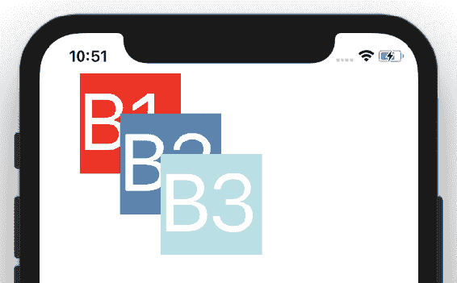

Three boxes overlap other because they are absolute-positioned to do so

查看前面三个重叠框示例的以下代码：

```jsx
// src/ Chapter 3/ Example_6/ App.js

export default () => (
    <View>
        <View style={[styles.box]}>
            <Text style={styles.text}>B1</Text>
        </View>
        <View style={[styles.box, {
            left: 80,
            top: 80,
            backgroundColor: 'steelblue'
        }]}
        >
            <Text style={styles.text}>B2</Text>
        </View>
        <View style={[styles.box, {
            left: 120,
            top: 120,
            backgroundColor: 'powderblue'
        }]}
        >
            <Text style={styles.text}>B3</Text>
        </View>
    </View>
);

const styles = StyleSheet.create({
    box: {
        position: 'absolute',
        top: 40,
        left: 40,
        width: 100,
        height: 100,
        backgroundColor: 'red'
    },
    text: {
        color: '#ffffff',
        fontSize: 80
    }
});
```

组件按照它们在标记中的顺序进行渲染，因此`B3`绘制`B2`，而`B2`绘制`B1`。

If you need to put some of the components on top, use the `zIndex` prop.
Check out the documentation for a more detailed explanation: [https://facebook.github.io/react-native/docs/layout-props.html#zindex](https://facebook.github.io/react-native/docs/layout-props.html#zindex).

因为我们有三个`absolute`框，让我们看看如果我们将`B2`更改为`relative`会发生什么：

```jsx
<View style={[styles.box, {
    position: 'relative',
    backgroundColor: 'steelblue'
}]}
>
    <Text style={styles.text}>B2</Text>
</View>
```

突然**B1**消失：

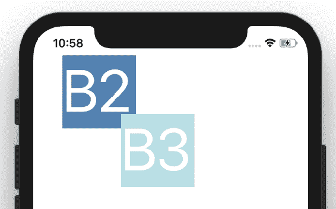

**B2**框现在是相对于其父`View`的。因此，它的位置从父位置的左上角开始（因为我们没有填充或边距）。**B1**和**B2**盒尺寸相同；**B2**与**B1**全部重叠。如果我们使用`{ width: 50, height: 50 }`稍微收缩**B2**，我们将看到下方的**B1**。为了清晰起见，我还将**B2**文本的字体大小更改为`40`。查看`src/Chapter 3/Example 7`目录中的`App.js`。结果如下：

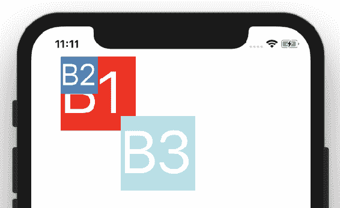

现在，我们已经了解了绝对和相对定位，是时候了解一种称为 Flexbox 的伟大模式了。

# 使用灵活的长方体模式

这是我在造型方面学到的最伟大的模式之一。**柔性包装箱**（**柔性包装箱**）让您的包装箱更具弹性。

让我们看一个小例子。目标是调整方框以填充整个屏幕宽度：

```jsx
// src/ Chapter_3/ Example_8/ App.js
export default () => (
    <View style={{ flex: 1 }}>
        <View
            style={{ backgroundColor: 'powderblue', height: 50 }}
        />
    </View>
);
```

以下是上述代码的结果：

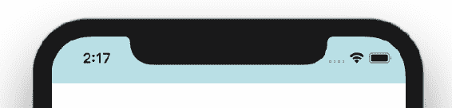

Box stretches to the whole screen width because we used flex: 1 styles

它不太花哨，但您不需要使用`Dimensions`。这显然只是一个开始。

您已经知道默认情况下视图是相对的，因此如果您想制作一些条纹，只需将三个`div`堆叠在彼此的顶部即可：

```jsx
// src/ Chapter_3/ Example_8/ App.js

export default () => (
    <View style={{ flex: 1 }}>
        <View
            style={{ backgroundColor: 'powderblue', height: 50 }}
        />
        <View
            style={{ backgroundColor: 'skyblue', height: 50 }}
        />
        <View
            style={{ backgroundColor: 'steelblue', height: 50 }}
        />
    </View>
);

```

查看以下屏幕截图，可以看到三个框延伸到整个屏幕的宽度：

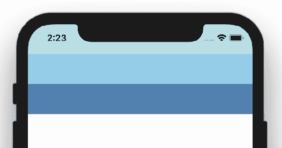

Three boxes in a sequence, each stretched with flex: 1 inherited from parent View component

现在，让我们使用这个相当简单的概念来创建页眉、主要内容和页脚组件。为了实现这一点，让我们调整中间`View`：

```jsx
<View
    style={{ backgroundColor: 'skyblue', flex: 1 }}
/>
```

现在中间的`View`延伸以填满所有可用空间，页眉`View`留下 50 dp，页脚`View`留下 50 dp。

是时候给我们的分割屏幕添加一些有用的内容了。

In the next sections, I will try to explain Flexbox using examples. But please also check out the Flexbox Froggy game to learn flexbox in different scenarios. It provides an interactive editor and your goal is to move frogs onto the respective leaves [https://github.com/thomaspark/flexboxfroggy/](https://github.com/thomaspark/flexboxfroggy/).

# 使用 Flexbox 定位项目

第一个重要的键是`flexDirection`。我们可以将其设置为`row`、`row-reverse`、`column`或`column-reverse`。Flex direction 使内容向该方向流动。默认情况下，在 React Native 中，弯曲方向设置为`column`。这就是前面示例中的框显示在列中的原因。

让我们使用`flexDirection`在页脚显示三个小部分：`Home`、`Search`和`About`：

```jsx
// src / Chapter 3 / Example 9 / App.js
...
<View
    style={{
        backgroundColor: 'steelblue',
        height: 70,
        flexDirection: 'row'
    }}
>
    <View><Text style={{ fontSize: 40 }}>Home</Text></View>
    <View><Text style={{ fontSize: 40 }}>Search</Text></View>
    <View><Text style={{ fontSize: 40 }}>About</Text></View>
</View>
...
```

好的，现在页脚中有三个单独的文本。我们将在[第 7 章](07.html)、*导航模式*中学习如何让他们切换屏幕。

我们的页脚看起来几乎没有问题：

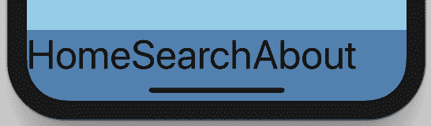

Three separate footer texts

现在是学习如何在 x 轴上均匀分布视图的时候了。如果`flexDirection`设置为`row`或`row-reverse`，我们可以使用`justifyContent`。`justifyContent`接受`flex-start`、`flex-end`、`center`、`space-between`、`space-around`和`space-evenly`值。我们稍后会和他们一起玩。现在，让我们使用`space-between`。它将以这样的方式拉伸`Home`视图、`Search`视图和`About`视图，以便在它们之间留出均匀的空间：

```jsx
...
    style={{
        backgroundColor: 'steelblue',
        height: 70,
        justifyContent: 'space-between',
        flexDirection: 'row'
    }}
...
```

结果如下：

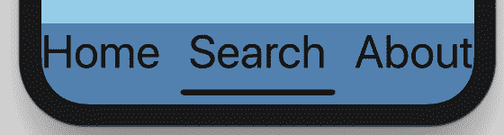

Three texts in the footer are now separated with even spaces

虽然它与 flexbox 无关，但我们可以添加一些填充物使其更美观：

```jsx
paddingLeft: 10,
paddingRight: 10
```

它使文本更易于阅读：


Padding on the right and left adds space from the screen edge

如果我们还想垂直定位呢？有一个叫做`alignItems`的钥匙。它接受`flex-start`、`flex-end`、`center`、`stretch`和`baseline`值。

现在让我们将页脚调高：100 个与密度无关的像素。此外，我们希望文本垂直居中：

```jsx
// src / Chapter 3 / Example 10 / App.js
...
    style={{
        backgroundColor: 'steelblue',
        height: 100,
        alignItems: 'center',
        justifyContent: 'space-between',
        flexDirection: 'row',
        paddingLeft: 10,
        paddingRight: 10
    }}
...
```

查看结果：


Text in the footer is now vertically centered

# 灵活项目的样式

当我们构建应用程序时，您可能会很快意识到这些样式有点难看。调色板完全是一场灾难。除非你是一名设计师，否则我建议用谷歌搜索调色板生成器。我把颜色改成了更可口的颜色：白色、黑色和蓝色。

此外，我还添加了边距和填充物。所有内容都由标题和内容之间的边框很好地分隔开。让我们看看它在 iPhone 8 和 iPhone X 上的外观：

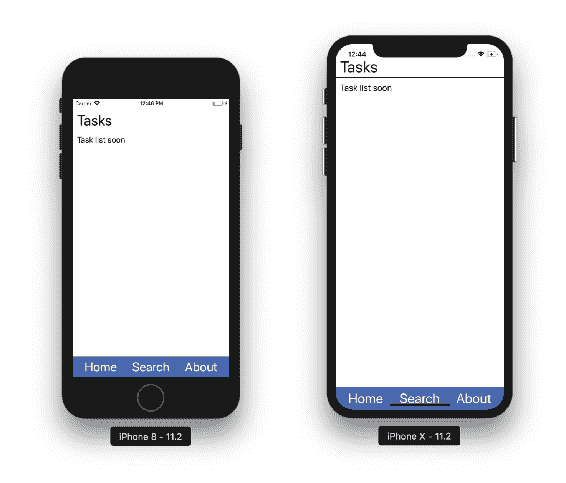

Full application look on iPhone 8 and iPhone X simulators after colour changes

你们中的一些人可能不知道样式的基本知识，所以让我们快速解释一下什么是边距和填充。**边距**用于在元素周围创建空间。该空间是从元素的边框创建的。如果只想在此处应用空间，可以选择“上”、“下”、“左”或“右”。**填充物**非常相似，但不是外部空间，而是内部空间。空间是从边界内部创建的。查看元素检查器以直观地理解这一点。我已经检查了我们的应用程序标题，以了解样式是如何工作的：


Margin and padding of the Header box

在上一个屏幕截图中，填充标记为绿色，边距标记为橙色。组件空间为浅蓝色。有关样式中指定的确切值，请查看图像的右侧部分。

To open the element inspector, shake your device and, when the menu opens, choose Toggle element inspector. If you are using the simulator, you can simulate a shake by choosing the hardware/shake gesture from the simulator menu.

以下是我用来创建`header`的样式：

```jsx
header: {
    height: 45,
    borderBottomColor: '#000000',
    borderBottomWidth: 1,
    paddingLeft: 10,
    paddingRight: 10,
    marginBottom: 10
},
// All the other styles are available in
// src/ Chapter_3/ Example_11/ App.js
```

接下来，让我们使页脚更加可重用。如果在某个时刻，我们不需要 About 链接，而是需要 Notifications 链接，该怎么办？这个词真长。它不适合我们的设计。虽然这现在是个问题，但如果我们计划添加翻译，我们也会遇到这个问题。

大多数应用程序使用图标解决这些问题。让我们试试：

1.  安装图标包：

```jsx
yarn add @expo/vector-icons
```

2.  更改页脚标记：

```jsx
// src/ Chapter_3/ Example_11/ App.js
<View style={styles.footer}>
    <Ionicons name="md-home" size={32} color="white" />
    <Ionicons name="md-search" size={32} color="white" />
    <Ionicons name="md-notifications" size={32} color="white" />
</View>

```

可以在以下屏幕截图上看到添加的图标：

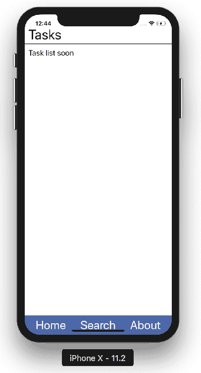

Application's footer is now made of icons

页脚现在可以重用，并且支持任何语言。如果您支持其他国家/地区的语言，请检查图标的含义。

# 样式化内容

我们使用方向行定位了页脚。现在是定位主要内容和专栏的时候了。在前面的章节中，我们创建了一个任务列表。现在是将其与我们的设计相结合的时候了。

将`TaskList`组件添加到内容框中。我还添加了`ScrollView`组件，以使内容可滚动，以防任务占用太多空间来显示所有任务：

```jsx
import data from './tasks.json';

// ... header
<ScrollView style={styles.content}>
    <TaskList tasks={data.tasks} />
</ScrollView>
// ... footer
```

JSON 文件中我的模拟任务如下所示。在本书的后面部分，我们将学习如何从后端服务器获取任务，以及如何将此类逻辑与标记分离：

```jsx
{
  "tasks": [
    {
      "name": "Task 1",
      "description": "Task 1 description...",
      "likes": 239
    },
    //... more comma separated tasks here
  ]
}
```

有了 mock，我们可以实现`TaskList`视图：

```jsx
const TaskList = ({ tasks }) => (
    <View>
        {tasks.map(task => (
            <View key={task.name}>
                <Text>{task.name}</Text>
                <Text>{task.description}</Text>
                <LikeCounter likes={task.likes} />
            </View>
        ))}
    </View>
);
// separate component for each task is not created for book clarity

```

`LikeCounter` is copy-pasted from `Chapter 2 / Example 8 / src` and tweaked to accept likes as props (replaces the default zero). Please note that it uses Flexbox too, and that `flexDirection` there is set to row.

现在，我们准备好为内容设置样式。这是我们的出发点：

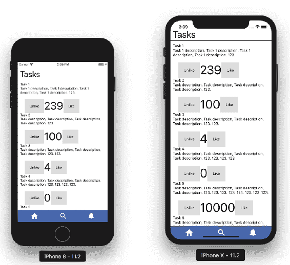

Current look at iPhone 8 and iPhone X simulators

我们想重新组织每个任务的内容。类似于和**不同于**的**小部件应该显示在任务的右侧，并且应该使用图标。任务名称应略大于描述，并应适合任务宽度的 70%。右侧带有 like/looke 小部件，应该用一个薄的灰色边框隔开。边界还应划分任务。必要时添加漂亮的填充物和边距：**


Desired look of iPhone 8 and iPhone X simulators

好的，我们怎么开始？我们需要把事情分解成可以单独实现的小块。创建以下内容：

*   具有任务容器样式和顶部边框样式的任务`View`。
*   两个内部`Views`——一个用于名称和说明，另一个用于类似计数器。这些应显示在一行中。
*   名称和说明`View`应该有两个`Views`在里面：一个是名称，一个是说明。添加样式以使`fontSize`的名称更大。
*   like 计数器`View`容器应在左侧定义边界。容器内部应该有两个`Views`：一个用于表示喜欢的数量，另一个用于表示喜欢/不喜欢的图标。这些`Views`应该使用列作为默认方向。
*   具有“喜欢/不喜欢”图标的视图应具有行方向 flexbox 样式。

如我们所知，使用`alignItems`和`justifyContent`垂直或水平定位元素。请查看检查器中的帮助器图像：


Inspector view of implemented components. Serves as a hint for implementation.

橙色高光代表`View`边距，绿色高光代表`View`填充。

试着自己实现这个。完整的解决方案可在`src/ Chapter_3/ Example_12/ src/`文件夹、`App.js`、`TaskList.js`和`LikeCounter.js`文件中找到。

# 解决文本溢出问题

最常见的问题之一是文本溢出。解决这个问题最简单的技巧是包装文本，但有时这是不可能的。示例：

*   按钮文本
*   需要显示的大数字（例如，like 计数）
*   不应该被分解的长单词

问题是：我们如何处理这个问题？有很多解决办法。让我们看几个。

# 缩小字体

现在，这在 iOS 上是可能的：

```jsx
<Text
    style={styles.text}
    numberOfLines={1}
    adjustsFontSizeToFit
>
    {this.state.likeCount}
</Text>
```

但是，结果对我们来说是一场彻底的灾难。布局感觉非常不一致，即使我们在这个缩放解决方案中做了一些工作：


Automatic font adjustment using the adjustsFontSizeToFit prop for iOS As shown earlier in the book, you could use `Dimensions` instead of relying on `adjustsFontSizeToFit`. Based on `Dimensions`, you can create a scaling function to compute `fontSize`.

# 截断文本

另一种方法称为**截断**。根据文本长度，在某个点进行剪切，然后添加三个点，`...`。然而，这种方法不适合我们的用例。我们使用喜欢的计数数字，我们想知道该数字是多少：

```jsx
<Text style={styles.text}>
    {
        this.state.likeCount.toString().length > 4
            ? `${this.state.likeCount.toString().substring(0, 4)}...`
            : this.state.likeCount
    }
</Text>
```

观察以下屏幕截图中被截断的 like 数：

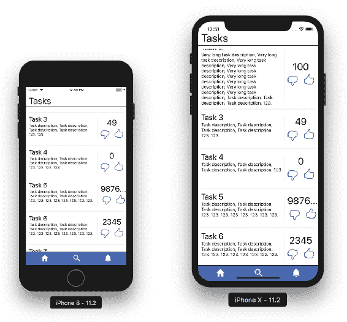

Truncated numbers are meaningless, this solution works only for text

# 使用 Kilo 社交媒体符号

你知道千克意味着 1000。社交媒体设计师将这一理念推广到了网络和手机上。当一个数字大于 1000 时，它们将最后 3 位数字替换为 K。例如，20K**表示 20000。**

 **琐碎的实现：

```jsx
const likes = this.state.likeCount.toString();
...
<Text style={styles.text}>
    {
        likes.length > 3
            ? `${likes.substring(0, likes.length - 3)}K`
            : likes
    }
</Text>
```

但是，像*9876543210*这样的数字将再次溢出。但 9876543K 仍然太长。让我们用一个简单的递归函数来解决这个问题：

```jsx
// src / Chapter 3 / Example 12 / src / LikeCounter.js

kiloText = (nr, nrK = 0) => (nr.length > 3
    ? this.kiloText(nr.substring(0, nr.length - 3), nrK + 1)
    : nr + Array(nrK).fill('K').join(''))
```

This algorithm works as follows:
The function takes a number in a string format and an optional parameter that indicates how many thousands are already stripped of the original number.
It checks whether it can strip another thousand, if so, it returns the outcome of itself with the number stripped by three numbers and the number of thousands increased by one.
If the number length is less than four, compute the text: take the number and attach the relevant number of Ks as the suffix. We compute Ks using a neat trick: create an array of size equal to the number of Ks, fill every element with the K string, and join all the elements into one long string. The JSX is now much simpler:

```jsx
<Text style={styles.text}>
    {this.kiloText(likes)}
</Text>

```

检查结果如下。长数字现在使用千表示法显示：


A big like count is now displayed using the kilo (K) notation

可以肯定的是，喜欢的人数不会超过 900000000。如果您需要支持较大的数字，请尝试使用**M**或**B**字母。

# 反应本地动画

在构建应用程序时，我们需要关注**用户体验**（**用户体验**。它的一部分是动画，使我们的屏幕更加生动，并提供即时反馈的行动。如果您自己玩我们的应用程序，您可以看到当您单击喜欢/不喜欢图标时，它会闪烁一点。这种效果是由`TouchableOpacity`产生的。现在是学习如何自己实现这些特性的时候了。

# 什么是动画？

当我第一次阅读动画库文档时，我吓了一跳。有太多的生词需要你去习惯。让我们来了解动画到底是什么，而不是直接深入其中。

动画是随时间对零部件样式的更改。

Remember: you need a style attribute, its starting value, and its end value. Animation is what you see when this value goes from start to end over time. You can combine many attributes and possibly animate many components at the same time.

存储随时间变化的变量的常用且推荐的方法是组件状态。React Native Animated 提供了一个特殊类，该类以非常高效的方式实现此功能：`Animated.Value`。例如：

```jsx
state = {
    fadeIn: new Animated.Value(0)
}
```

# 随时间改变属性

在 React Native 中，有三种创建动画的主要方法：

*   `Animated.timing()`：以毫秒为单位计算时间和所需的结束值，并将它们映射到您的`Animated.Value`。
*   `Animated.decay()`：以初始速度开始并缓慢衰减。
*   `Animated.spring()`：提供了一个简单的弹簧物理模型。

让我们看看它是如何运作的。我们的目标是在应用程序启动时淡入应用程序。为了实现淡入效果，我们将操纵 0 到 1 的不透明度。动画应花费两秒钟：

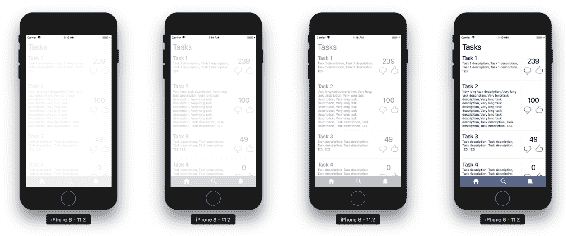

Sequence of images showing the opacity animation progress over time

`Animated.timing`需要两个参数：要操作的变量和配置对象。在 config 对象中，您需要指定`toValue`键来告诉函数在毫秒持续时间之后变量的结束值应该是什么——在我们的例子中是 2000。我选择了两秒钟只是为了让动画更容易看。玩转它：

```jsx
// src/ Chapter_3/ Example_13/ src/ App.js
class App extends React.Component {
    state = {
        fadeIn: new Animated.Value(0)
    }

    componentDidMount() {
        this.fadeInApp();
    }

    fadeInApp() {
        Animated.timing(
 this.state.fadeIn,
            {
 toValue: 1,
                duration: 2000,
                easing: Easing.linear
            }
 ).start();
    }

    render = () => (
        <Animated.View
            style={[
                styles.appContainer,
                { opacity: this.state.fadeIn }
            ]}
        >
            ... // rest of render removed for clarity
        </Animated.View>
    )
}
```

我们还引入了一个新组件：`Animated.View`。它使我们通常的`View`组件支持动画

React Native Animated 提供可设置动画的组件：`Animated.Image`、`Animated.ScrollView`、`Animated.Text`和`Animated.View`，但您也可以使用`createAnimatedComponent()`功能定义自己的组件。

另外，在 config 对象中，我们指定了**和**。缓和是动画应该如何进行的。如果该值随时间线性变化，则使用`Easing.linear`。然而，线性不是自然的。查看下一节了解有关缓解功能的更多信息。

Learning animations takes time. You can create countless different scenarios and you should play around with the API on your own. Especially when it comes to `Animated.decay` and `Animated.spring`. I'm not covering them in the book as it is not a very big pattern, it is just another API you need to learn. In the next sections, we will focus on ways to chain animations and then how to make them performant.

考虑如何使用`Animated.decay`创建一个可拖动的框。您还需要一个`PanResponder`组件。在释放触摸事件时，它应保持同一方向的速度，并在飞行一段距离后缓慢停止。
第二个练习可能是实现一个红方块，下面有一个按钮。按下按钮时，方形框的宽度和高度应再增加 15 个与密度无关的像素。所有这些都应该通过弹簧动画来完成，因此宽度应该稍微超过 15，然后再回到 15。就像春天一样。

如果这两个练习听起来很难，请进入下一节。一旦您了解了缓和功能，它们应该会变得更容易。

# 缓和作用

动画是随时间的变化。这一变化可以在许多方面得到应用。随时间确定新值的函数称为缓和函数。

为什么我们使用缓和函数而不是线性缓和？我喜欢的一个常见的例子是打开抽屉。当你在现实世界中打开抽屉时，这是一个线性过程吗？也许不是

现在让我们看看常见的缓和函数。有几个。选择一个适合您的应用程序：


Many different easing functions with a visualization of each one changes value over time. 

在图表上，灰线表示起始值和结束值。黑线表示值随时间的变化。最终，黑线到达上灰线。正如您所看到的，一些缓和函数低于起始值或超出结束值。这些可能有助于突出重要行动。

Want to see more easing functions? Check out [http://easings.net/](http://easings.net/).
Most of these functions can be implemented using the RN Easing module.

返回以响应本地的搜索。我已经为您准备了一个应用程序，供您使用缓解功能。您可以在`src/ Chapter_3/ Example_14/ App.js`找到源代码：

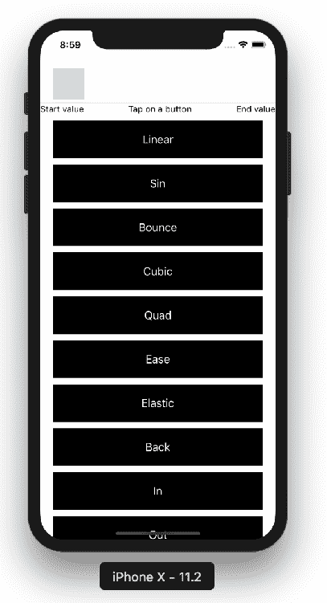

Easing functions playground application

当你点击一个按钮时，你会看到一个盒子从左到右移动，并带有相应的放松功能。

至于动画，我通过操纵盒子的`marginLeft`来实现。动画以`marginLeft`设置为 20 开始，并应用缓和功能在 2 秒内达到 300：

```jsx
// src/ Chapter_3/ Example_14/ App.js
// ...
animate(easing) {
    this.easeValue.setValue(20);
    Animated.timing(
        this.easeValue,
        {
            toValue: 300,
            duration: 2000,
            easing
        }
    ).start();
}

onPress = easingName => this.animate(Easing[easingName.toLowerCase()]);
// ...

```

# 安排活动

因为我们知道如何创建动画，现在让我们讨论如何安排它们。

简单的方法是延迟动画调度：

*   `Animated.delay()`：在给定延迟后启动动画。如果您需要延迟对用户操作的响应，这很好。但通常情况并非如此。

让我们谈谈我们想要安排的一系列事件。应调度多个事件。如果我们需要所有事件同时发生，那么这也是微不足道的：

*   `Animated.parallel()`：同时启动多个动画。但是如果我们需要一个接一个地计时呢？这是顺序。

*   `Animated.sequence()`：按顺序启动动画，等待每个动画完成后再启动下一个动画。还有一种平行的变体。它被称为交错

*   `Animated.stagger()`：按顺序并行启动动画，但连续延迟。

练习时间：在屏幕上填充一排彩色方框。行应以交错方式依次出现在屏幕上：

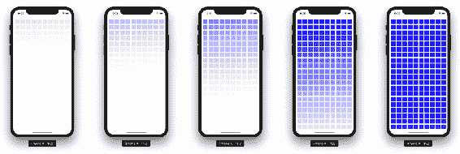

Images showing the stagger animation over time

完整的实现可在`src/ Chapter_3/ Example_15/ App.js`上获得。让我们看一个关键片段：

```jsx
// ...
getFadeInAnimation = animatedVal =>
    Animated.timing(animatedVal, { toValue: 1, duration: 5000 });

componentDidMount() {
    const animations = Boxes.map(box =>
        this.getFadeInAnimation(this.state[box]));
    Animated.stagger(10, animations).start();
}
// ...
```

第一个函数只是一个助手。它生成一个定时动画。我们使用这个辅助函数来生成所有动画，并将它们收集到`animations`变量中。helper 函数需要`animatedVal`，它将被简化为 1。在我的实现中，我在状态中为每个框创建了一个单独的`Animated.Value`。最后，我将生成的动画数组传递给 stagger 并立即开始。

很好的动画，对吗？现在，让我们谈谈性能。

# 测量 FPS

网站和移动应用程序很少使用动画。大多数情况下，这是对用户动作缓慢的反应。如果你曾经玩过动态电脑游戏，你可能还记得那是一个多么不同的世界。是的，当我们深入研究动画时，电脑游戏中有一件事你应该记住：**FPS**。

Frames per second – everything on the screen appears in motion thanks to the optical illusion created by quickly changing frames at a consistent speed. 60 FPS means 60 frames per second, which means you see a new frame every 16.67ms. JavaScript needs to deliver that frame in this short period, otherwise the frame will be dropped. If so, your FPS metric will drop below 60.

React Native 以其在大多数应用中的惊人性能而闻名：**60 FPS**。但是，当我们开始使用大量动画时，我们可以很快消除这种性能。在本节中，我想向您展示如何在应用程序中测量 FPS。

让我们检查一下我们对上一个动画的处理情况：

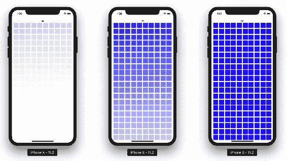

Images showing the stagger animation over time

我们将测量这个动画。在模拟器上，我得到**48**FPS，动画开始了一半。接近终点时，FPS 下降到**18**。所有动画完成后，FPS 将恢复到正常的 60。我还检查了我的真实手机（iPhone7Plus），结果也差不多。

This is just an example of the FPS drop in the development environment. However, you should test your application on real production builds instead. Learn more at [https://facebook.github.io/react-native/docs/performance.html](https://facebook.github.io/react-native/docs/performance.html).

# 如何测量 FPS

是时候学习如何检查 FPS 了。主要有两种方式：

*   使用工具，如性能监视器。它提供了这种开箱即用的功能。它还允许您测量本机环境。
*   编写自定义 JavaScript 代码来测量 FPS。这将只测量 JS 线程的性能。

通过*Create React Native*应用程序使用性能监视器非常简单，只需摇动设备并选择 Show Perf monitor（显示性能监视器）选项即可：

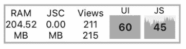

Show perf monitor. Numbers 60 and 45 represent the latest value of the FPS measure

用 JavaScript 实现您自己的解决方案应该依赖于这样一个事实：期望的 60FPS 意味着每 16.67ms（1000ms/60）一帧。我为您创建了一个简单的示例：

```jsx
// src / Chapter 3 / Example 16 / App.js
constructor() {
    // ...
    let FPScounter = 0;
 setInterval(() => FPScounter++, 16);
    setInterval(() => {
        this.setState({ fps: FPScounter });
        FPScounter = 0;
    }, 1000);
}
// ...
render = () => (
    // ...
    <Text>FPS: {this.state.fps}</Text>
    // ...
);
// makes sure these measures are only done in dev environment
// and never leak to the production app!
// Beware: This example is not really very accurate and performant
// I have made it to illustrate the idea
```

在本书努力教您设计模式的同时，我希望您也能检查您的解决方案是否有效。

# 总结

在本章中，您学习了如何设置本机应用程序的样式。我们介绍了许多不同的元素定位方法，您了解了我们的设计如何转化为实际设备。最后，我们制作了一些动画，并根据 FPS 对它们进行了测量。

到目前为止，我们知道如何使用 React 组件创建可重用代码，以及如何对它们进行样式化。我们使用存储在本地 JSON 文件中的有限数据。是时候让我们的应用程序更加复杂，并讨论影响大型应用程序的不同场景了。在下一章中，您将了解 Flux，它是一种体系结构模式。**