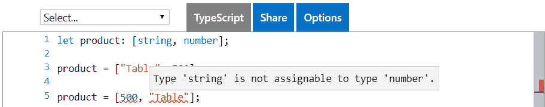
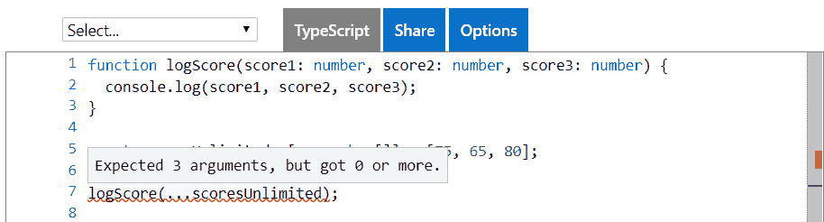
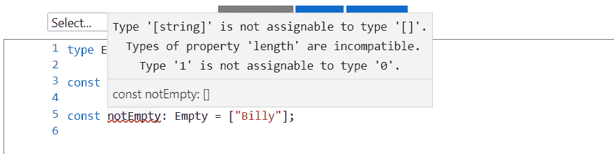
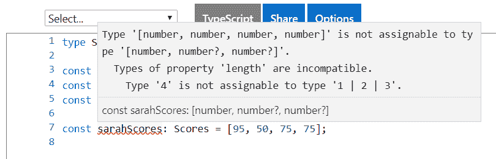
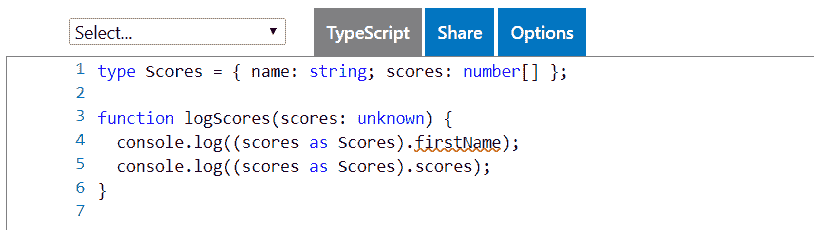

# TypeScript3 有什么新功能

TypeScript 在其存在的六年中，继续向前发展，并且非常成熟。TypeScript3 是 React 开发者的重要版本吗？在 TypeScript 3 中，我们必须向工具箱添加哪些新功能？这些问题将在本章中得到回答，首先是`tuple`类型，以及它现在如何与**rest**和**spread**JavaScript 语法一起成功使用，后者在 React 社区非常流行。然后我们将继续讨论新的`unknown`类型，以及如何将其用作`any`类型的替代品。此外，我们将使用 TypeScript 中的新项目引用将 TypeScript 项目分解为更小的项目。最后，我们将在强类型 React 组件中定义默认属性，该组件在 TypeScript 3 中得到了改进。

在本章结束时，我们将准备开始学习如何使用 TypeScript 3 使用 React 构建前端。在本章中，我们将介绍以下主题：

*   多元组
*   未知类型
*   项目参考
*   默认 JSX 属性

# 技术要求

在本章中，我们将使用与[第 1 章](01.html)、*打字基础*中相同的技术：

*   **打字游戏场**：这是一个位于[的网站 https://www.typescriptlang.org/play/](https://www.typescriptlang.org/play/) ，这使我们可以在不安装的情况下使用和理解 TypeScript 中的功能。
*   **Node.js 和**`npm`：TypeScript 和 React 依赖于这些。您可以从[安装它们 https://nodejs.org/en/download/](https://nodejs.org/en/download/) 。如果您已经安装了这些，请确保`npm`至少是 5.2 版

*   **类型脚本**：可通过`npm`安装，在终端中输入以下命令：

```jsx
npm install -g typescript
```

*   在本章中，我们使用 TypeScript 3 是很重要的。您可以在终端中使用以下命令检查 TypeScript 版本：

```jsx
tsc -v
```

如果需要升级到最新版本，可以运行以下命令：

```jsx
npm install -g typescript@latest
```

*   **Visual Studio 代码**：我们需要一个编辑器来编写 React 和 TypeScript 代码。这个可以从[安装 https://code.visualstudio.com/](https://code.visualstudio.com/) 。我们还需要在 VisualStudio 代码中安装 TSLint（由 egamma 编写）和 Prettier（由 Estben Petersen 编写）扩展。

All the code snippets in this chapter can be found at [https://github.com/carlrip/LearnReact17WithTypeScript/tree/master/02-WhatsNewInTS3](https://github.com/carlrip/LearnReact17WithTypeScript/tree/master/02-WhatsNewInTS3).

# 多元组

元组在 TypeScript 3 中有一些增强，因此它们可以与流行的`rest`和`spread`JavaScript 语法一起使用。在讨论具体的增强功能之前，我们将先了解元组是什么，以及`rest`和`spread`语法是什么。元组类似于数组，但元素的数量是固定的。这是构造数据和使用某种类型安全性的简单方法。

让我们来玩一玩元组：

1.  在 TypeScript 中，让我们输入以下元组变量示例：

```jsx
let product: [string, number];
```

我们已经将一个`product`变量初始化为具有两个元素的元组类型。第一个元素是字符串，第二个元素是数字。

2.  我们可以在下一行的`product`变量中存储产品名称及其单价，如下所示：

```jsx
product = ["Table", 500];
```

3.  让我们尝试以另一种方式存储产品名称和单价：

```jsx
product = [500, "Table"];
```

毫不奇怪，我们得到了一个编译错误。如果我们将鼠标悬停在`500`上方，编译器会正确地抱怨它需要一个字符串。如果我们将鼠标悬停在`"Table"`上方，编译器会抱怨它需要一个数字：



因此，我们得到了类型安全性，但是元组并没有告诉我们元素中应该包含什么。因此，它们适用于小结构或元素明显的结构

4.  以下示例可以说是相当可读的：

```jsx
let flag: [string, boolean];
flag = ["Active", false]

let last3Scores: [string, number, number, number]
last3Scores = ["Billy", 60, 70, 75];

let point: [number, number, number];
point = [100, 200, 100];
```

5.  但是，以下示例的可读性较差：

```jsx
let customer: [string, number, number];
customer = ["Tables Ltd", 500100, 10500];
```

最后两个数字到底代表什么？

6.  我们可以使用元素的索引以与数组相同的方式访问元组中的项。那么，让我们在 TypeScript 中的`product`变量中访问产品名称和单价：

```jsx
let product: [string, number];
product = ["Table", 500];
console.log(product[0]);
console.log(product[1]);
```

如果我们运行这个程序，我们将得到“表”和 500 个输出到控制台。

7.  使用`for`循环或数组`forEach`函数，我们可以像遍历数组一样遍历元组中的元素：

```jsx
let product: [string, number];
product = ["Table", 500];

for (let element in product) {
 console.log(product[element]); 
}

product.forEach(function(element) {
 console.log(element); 
});
```

运行程序，将向控制台输出两次`Table `和`500`，注意，我们不需要向`element`变量添加类型注释，因为 TypeScript 编译器巧妙地推断了这一点。

这是元组类型，但 TypeScript 3 中的新增功能是什么？JavaScript 的`rest`和`spread`语法的流行在很大程度上推动了这些增强，所以让我们在下一节简要介绍一下这一点。

# JavaScript rest 和 spread 语法

在 JavaScript 中，`rest`参数收集多个参数并将其压缩为单个参数。它之所以被称为`rest`，是因为它将参数的`rest`收集到一个参数中。

A `rest` parameter has nothing to do with **Representational state transfer protocol** (**REST**).

这种语法是在 ES6 中引入的，它允许我们很好地实现具有无限多个参数的函数。

我们定义一个`rest`参数，参数名称前有三个点。

让我们看一个简单的例子：

1.  让我们创建一个`logScores`函数，该函数接受一个`scores rest`参数，该参数只将参数输出到控制台：

```jsx
function logScores(...scores) {
  console.log(scores);
}
```

This is pure JavaScript - we'll introduce types to `rest` parameters when we look at the new features in TypeScript 3.

2.  我们可以调用`logScores`如下：

```jsx
logScores(50, 85, 75);
```

如果我们运行它，我们将得到一个由三个元素组成的数组，这些元素作为参数传入并输出到控制台。因此，我们的`scores`参数已将所有参数收集到一个数组中。

`spread`语法与`rest`参数相反。它允许将 iterable（如`array`）扩展为函数参数。

让我们看一个例子：

1.  让我们用特定参数重新定义我们的`logScore`函数：

```jsx
function logScore(score1, score2, score3) {
  console.log(score1, score2, score3);
}
```

请注意，这仍然是纯 JavaScript–还没有类型！ 

2.  让我们定义一个`scores`数组：

```jsx
const scores = [75, 65, 80];
```

3.  最后，让我们使用`spread`语法将`scores`变量传递到`logScore`函数中：

```jsx
logScore(...scores);
```

如果您使用的是 TypeScript，则会出现编译错误`expected 3 arguments, but got 0 or more`。尽管如此，该程序仍在运行，因为这是完全有效的 JavaScript。如果我们运行它，`75, 65, 80`将输出到控制台。

在以下几节中，我们将看到 TypeScript 3 中的新功能如何帮助编译器更好地理解我们在使用`rest`和`spread`时尝试执行的操作。这将允许我们解决前面示例中看到的编译错误。

# 开放元组

在 TypeScript3 之前，元组必须有固定数量的元素。TypeScript3 为我们提供了更大的灵活性，可以使用`rest`元素。`rest`元素与上一节描述的`rest`参数类似，但它们与元组元素类型一起工作。`rest`元素允许我们定义一个开放式元组。

是时候浏览一个示例了：

1.  在 TypeScript 平台中，让我们创建一个元组，第一个元素是字符串，后续元素是数字：

```jsx
type Scores = [string, ...number[]];
```

2.  我们应该能够使用这个结构来存储一个人的名字和无限量的分数。让我们尝试一下`Billy`和三个分数：

```jsx
const billyScores: Scores = ["Billy", 60, 70, 75];
```

3.  让我们继续尝试`Sally`和四个分数：

```jsx
const sallyScores: Scores = ["Sally", 60, 70, 75, 70];
```

正如我们所期望的，这两个变量都编译得很好，因为我们已经将这些数字定义为开放的。

# 元组函数参数

TypeScript 3 中的元组`function`参数允许我们创建强类型`rest`参数。

举个例子：

1.  当我们第一次查看`rest`参数时，我们创建了`logScores`的纯 JavaScript 版本，该版本在`scores`变量中收集了无限数量的参数：

```jsx
function logScores(...scores) {
  console.log(scores);
}
```

2.  在 TypeScript 3 中，我们现在可以使用一个 tuple`rest`参数使这个示例强类型化。让我们在 TypeScript 游戏场中尝试一下：

```jsx
function logScores(...scores: [...number[]]) {
  console.log(scores);
}
```

3.  让我们用一些分数调用函数：

```jsx
logScores(50, 85, 75);
```

我们没有得到编译器错误，如果我们运行程序，我们会在控制台中得到一个包含`50, 85, 75`输出的数组。

我们可以创建一个增强版的函数，它使用*开放式元组*部分中的`Scores`类型。

1.  `function`将包含名称，以及一组无限的分数：

```jsx
type Scores = [string, ...number[]];

function logNameAndScores(...scores: Scores) {
  console.log(scores);
}
```

2.  让我们试着用`Sally`中的一些分数调用我们的函数：

```jsx
logNameAndScores("Sally", 60, 70, 75, 70);
```

如果我们运行程序，`Sally `和她的分数数组将输出到控制台。

# 散布言论

TypeScript 3 允许我们将元组与扩展表达式一起使用。

让我们看一个例子：

1.  让我们回到使用`spread`语法时遇到问题的纯 JavaScript 示例：

```jsx
function logScore(score1, score2, score3) {
  console.log(score1 + ", " + score2 + ", " + score3);
}

const scores = [75, 65, 80];

logScore(...scores);
```

TypeScript 编译器引发了错误`Expected 3 arguments, but got 0 or more`。

2.  现在让我们用 TypeScript 3 中的增强元组来解决这个问题。我们将首先向`function`参数添加类型：

```jsx
function logScore(score1: number, score2: number, score3: number) {
  console.log(score1, score2, score3);
}
```

现在还没有什么新的东西，我们仍然会得到编译错误。

3.  让我们将`scores`变量更改为固定元组：

```jsx
 const scores: [number, number, number] = [75, 65, 80];
```

就是这样——编译错误已经消失了！我们所需要做的就是告诉编译器`scores`中有多少项才能成功地扩展到**`logScore`**函数中。

因此，在 TypeScript 3 中，我们可以将其扩展为固定元组。那么开放元组呢？让我们试一试：

```jsx
const scoresUnlimited: [...number[]] = [75, 65, 80];

logScore(...scoresUnlimited);
```

不幸的是，编译器还不够聪明，不能让我们这样做。我们得到编译错误，预期有 3 个参数，但得到 0 个或更多参数：



# 空元组

在 TypeScript 3 中，我们现在可以定义一个空的元组类型。让我们在 TypeScript 游戏场中玩一下：

1.  让我们为空元组创建以下类型别名：

```jsx
  type Empty = [];
```

2.  让我们声明此类型的变量并将其分配给空数组：

```jsx
  const empty: Empty = [];
```

3.  现在，让我们尝试声明此类型的变量并将其分配给非空数组：

```jsx
  const notEmpty: Empty = ["Billy"];
```

正如所料，我们得到一个编译错误：



为什么空元组类型有用呢？就其本身而言，它可能没有那么有用，但它可以作为联合类型的一部分使用，我们将在本书后面详细介绍。作为现在的一个快速示例，我们可以创建一个不超过三个分数的类型，其中也可以不接受任何分数：

```jsx
type Scores = [] | [number] | [number, number] | [number, number, number]

const benScores: Scores = [];
const samScores: Scores = [55];
const bobScores: Scores = [95, 75];
const jayneScores: Scores = [65, 50, 70];
const sarahScores: Scores = [95, 50, 75, 75];
```

除 Sarah 的分数外，所有分数均有效，因为`Scores`类型中不允许有四个分数。

# 可选元组元素

TypeScript 3 中的最后一个元组增强是具有可选元素的能力。可选元素在元素类型末尾使用`?`指定。

让我们看看另一个使用分数主题的示例：

1.  让我们为一到三个分数创建一个类型：

```jsx
   type Scores = [number, number?, number?];
```

2.  因此，我们应该能够创建变量来保持一到三个分数：

```jsx
const samScores: Scores = [55];
const bobScores: Scores = [95, 75];
const jayneScores: Scores = [65, 50, 70];
```

正如预期的那样，这编译得很好。

3.  那四个元素呢？让我们试一试：

```jsx
 const sarahScores: Scores = [95, 50, 75, 75];
```

我们得到了一个编译错误，正如我们所预料的：



4.  如果不尝试任何元素，则会再次出现编译错误：

```jsx
  const benScores: Scores = [];
```

在元组中定义可选元素时，它们仅限于元组的末尾。让我们尝试在可选元素之后定义一个必需元素：

```jsx
 type ProblematicScores = [number?, number?, number];
```

我们得到了一个编译错误，正如预期的那样：


可选元素也在函数`rest`参数中工作。让我们试试这个：

1.  让我们在前面几节中使用的`logScores`函数中使用`scores`类型：

```jsx
type Scores = [number, number?, number?];

function logScores(...scores: Scores) {
  console.log(scores);
}
```

2.  如果我们尝试通过两分，代码将编译得很好，因为最后一个参数是可选的：

```jsx
logScores(45, 80);
```

3.  如预期，如果我们通过了四个分数，我们将收到`Expected 1-3 arguments, but got 4`：

```jsx
logScores(45, 70, 80, 65);
```

当我们有可选参数时，函数的实现可能需要知道传递了哪些参数。我们可以使用元组的`length`属性来执行此操作：

1.  让我们创建一个名为`logScoresEnhanced`的分数记录器的增强版本，如果我们记录所有`3`分数，这将感谢我们：

```jsx
type Scores = [number, number?, number?];

function logScoresEnhanced(...scores: Scores) {
  if (scores.length === 3) {
    console.log(scores, "Thank you for logging all 3 scores");
  } else {
    console.log(scores);
  }
}
```

2.  现在，让我们使用各种参数调用此函数：

```jsx
logScoresEnhanced(60, 70, 75); 
logScoresEnhanced(45, 80); 
logScoresEnhanced(95); 
```

如果我们运行该程序，我们只有在第一次呼叫后，当我们通过所有三个分数时，才会得到感谢。

TypeScript 3 中对元组的所有增强都允许我们以强类型方式使用`rest`和`spread`语法。在本书后面的部分，当我们使用 React 组件时，我们将利用这个特性。

# 未知类型

`unknown`是 TypeScript 3 中添加的新类型。在 TypeScript 3 之前，当我们不确定来自第三方库的对象中的所有属性和方法时，我们可能使用了`any`类型。然而，当我们用`any`类型声明变量时，TypeScript 编译器不会对其进行任何类型检查。`unknown`类型可以在这些情况下使用，以使我们的代码更安全。这是因为`unknown`类型是经过类型检查的。因此，`unknown`通常可以用作`any`的替代品。

在 TypeScript 游戏场中，让我们看一个使用`any`的函数示例和一个使用`unknown`的改进版本：

1.  首先，让我们创建一个`logScores`函数，它接受一个`any`类型的参数。它将参数中的`name`和`scores`属性注销到控制台：

```jsx
function logScores(scores: any) {
  console.log(scores.firstName); 
  console.log(scores.scores); 
}
```

2.  让我们使用以下命令调用此函数：

```jsx
logScores({
  name: "Billy",
  scores: [60, 70, 75]
});
```

如果我们运行这个程序，我们会在控制台中得到`undefined`后跟`[60, 70, 75]`。我们传入了一个正确的对象参数，但是我们的函数将`firstName`而不是`name`记录到控制台。程序编译得很好，在运行时没有产生错误，但没有给出我们想要的结果。这都是因为我们告诉编译器不要检查任何具有`any`类型的类型。

3.  让我们开始用`unknown`类型创建此函数的更好版本：

```jsx
function logScoresBetter(scores: unknown) {
  console.log(scores.firstName);
  console.log(scores.scores);
}
```

我们在引用`scores`中的属性时，立即收到编译器警告：


因此，编译器现在正在检查我们的`scores`变量，这很好，甚至警告我们`firstName`属性。然而，`scores`属性也给出了一个复杂的错误，但它是有效的。那么，我们如何告诉编译器这一点呢？我们需要在代码中显式地进行一些类型检查。我们将在以下几节中介绍实现这一点的几种方法。

# 使用类型谓词进行类型检查

我们可以在函数中执行类型检查的一种方法是使用另一个函数，该函数的返回类型作为类型谓词。让我们对此进行探索，并最终创建一个新版本的`logScores`函数：

1.  首先，我们将定义一个名为`scoresCheck`的新函数来执行必要的类型检查：

```jsx
const scoresCheck = (
  scores: any
): scores is { name: string; scores: number[] } => {
  return "name" in scores && "scores" in scores;
};
```

这将引入一个具有类型谓词**`scores is { name: string; scores: number[] }`的`scores`参数，确保它包含正确类型的`name`和`scores`属性。函数只返回`scores`参数是否包含`name`和`scores`属性。**

 **2.  让我们在`logScores`函数中使用此函数：

```jsx
function logScores(scores: unknown) {
  if (scoresCheck(scores)) {
    console.log(scores.firstName);
    console.log(scores.scores);
  }
}
```

我们立即得到所需的编译错误：


类型谓词`scores is { name: string, scores: number[] }`允许 TypeScript 编译器缩小将属性记录到控制台的`if`块中的类型。这导致`scores.scores`编译很好，但`scores.firstName`给出了一个错误，这正是我们想要的。

类型谓词是关键位。没有它，TypeScript 编译器仍然会在有效的`scores.scores`引用上抛出错误。尝试删除类型谓词，然后亲自查看。

请注意，我们可以使用类型别名使谓词更具可读性：

```jsx
type Scores = { name: string; scores: number[] }

const scoresCheck = (
  scores: any
): scores is Scores => {
  return "name" in scores && "scores" in scores;
};
```

以这种方式使用类型谓词称为类型保护。还有其他实现类型保护的方法，我们将在本书后面介绍。

# 使用类型断言缩小类型

在使用`unknown`时，执行类型检查的另一种方法是使用类型断言。类型断言让我们用`as`关键字告诉编译器类型是什么。

让我们创建另一个版本的`logScores`函数作为示例：

1.  首先，让我们为希望函数参数为的结构创建一个类型别名：

```jsx
type Scores = { 
  name: string; 
  scores: number[] 
};
```

2.  在我们的`logScores`函数中，我们现在可以使用`as`关键字来告诉编译器预期的类型：

```jsx
function logScores(scores: unknown) {
  console.log((scores as Scores).firstName);
  console.log((scores as Scores).scores);
}
```

这些信息足以让编译器找出问题：



`unknown`类型允许我们减少`any`类型的使用，并创建更强类型和健壮的 TypeScript 程序。不过，在引用`unknown`类型时，我们确实需要编写更多的代码。我们需要编写的附加代码需要检查`unknown`变量的类型，以便 TypeScript 编译器能够确保我们正在访问其中的有效成员。

# 项目参考

TypeScript 3 通过允许`tsconfig.json`引用其他`tsconfig.json`文件，允许 TypeScript 项目依赖于其他 TypeScript 项目。

这使得我们更容易将代码分割成更小的项目。我们的前端代码可能是 TypeScript，而后端代码可能是 TypeScript。使用 TypeScript 3，我们可以有一个前端 TypeScript 项目、一个后端 TypeScript 项目和一个共享 TypeScript 项目，其中包含前端和后端都使用的代码。将代码拆分成更小的项目也可以加快构建速度，因为它们可以增量工作。

# 树立榜样

为了探索这一点，我们将通过一个引用 Visual Studio 代码中另一个项目的 TypeScript 项目示例：

1.  首先，我们创建一个名为`Shared`的新文件夹。这将是一个共享代码的项目，可能会在许多其他项目中使用。
2.  在我们的`Shared`文件夹中，我们创建以下`tsconfig.json`作为起点：

```jsx
{
  "compilerOptions": {
    "target": "es5",
    "outDir": "dist",
    "module": "es6",
    "sourceMap": true,
    "noImplicitReturns": true,
    "noImplicitAny": true,
    "rootDir": "src"
  },
  "include": ["src/**/*"]
}
```

3.  让我们创建一个`src`文件夹，其中包含一个名为`utils.ts`的类型脚本文件，该文件具有以下功能`randomString`：

```jsx
export function randomString() {
  return Math.floor((1 + Math.random()) * 0x10000).toString(16);
}
```

这是一个创建随机字符串的函数，顾名思义。我们将在另一个项目中使用此函数。

4.  现在，让我们开始创建第二个项目，然后返回解决方案的根目录，创建一个名为`ProjectA`的文件夹
5.  在`ProjectA`中，我们创建以下`tsconfig.json`作为起点：

```jsx
{
  "compilerOptions": {
    "target": "es5",
    "outDir": "dist",
    "module": "es6",
    "sourceMap": true,
    "noImplicitReturns": true,
    "noImplicitAny": true
  },
  "include": ["src/**/*"]
}
```

6.  让我们在`ProjectA`中创建一个名为`src`的文件夹，其中包含一个名为`person.ts`的 TypeScript 文件，代码如下：

```jsx
import { randomString } from "../../Shared/dist/utils";

class Person {
  id: string;
  name: string;
  constructor() {
    this.id = randomString();
  }
}
```

代码定义了一个简单的个人信息类。使用我们`Shared`项目中的`randomString`函数，将人员的唯一标识符设置为构造函数中的随机字符串。

7.  让我们打开终端，进入我们的`Shared`文件夹，编译我们的`Shared`项目：

```jsx
cd Shared
tsc
```

`Shared`项目编译得很好。

8.  现在我们试着编译`ProjectA`：

```jsx
cd ..
cd ProjectA
tsc
```

我们得到一个编译错误：

```jsx
error TS7016: Could not find a declaration file for module '../../Shared/dist/utils'. '.../Shared/dist/utils.js' implicitly has an 'any' type.
```

因此，我们创建了两个相关项目，但它们之间还没有正确地相互理解，这就是为什么我们会出现错误。我们将在以下部分中解决这个问题，使用 TypeScript 3 针对多个项目的新功能。

# 参考项目

设置 TypeScript 3 的多项目功能的第一步是使用`tsconfig.json`中名为`references`的新字段引用项目。该字段是指定要引用项目的对象数组。

在我们的工作示例中，让我们让`ProjectA`开始理解`Shared`项目：

1.  我们将`ProjectA`中的`tsconfig.json`改为参照`Shared`项目：

```jsx
{
  "compilerOptions": {
    ...
  },
  "references": [
 { "path": "../shared" }
 ]
}
```

If we want the dependent project's generated JavaScript code to be included in the same file as the current project, we can set `prepend` to `true` on the dependency.

```jsx
"references": [
  { "path": "../shared", "prepend": true }
]
```

不过，我们不打算在示例中使用`prepend`。

2.  如果我们再次编译`ProjectA`，则会产生不同的错误：

```jsx
error TS6306: Referenced project '.../shared' must have setting "composite": true
```

这个错误提供了一个很好的线索来说明什么是错的。我们将在下一节中使用缺少的`composite`设置来解决此问题。

# 对编译器选项的添加

仅仅引用另一个项目不足以让 TypeScript 编译器正确处理多个项目。我们需要在依赖项目中添加一些额外的编译器选项。

`compilerOptions`字段有一个名为`composite`的新字段，如果我们使用多个项目，则必须将其设置为`true`。这将确保启用某些选项，以便可以为依赖此项目的任何项目以增量方式引用和构建此项目。

当`composite`为`true`时，`declaration`也必须设置为`true`，强制生成对应的`.d.ts`文件，包含项目类型。这允许 TypeScript 仅在类型更改时生成依赖项目，而不是始终重建所有依赖项目。

让我们对工作示例进行以下更改：

1.  让我们在`Shared`项目中打开`tsconfig.json`并进行以下更改：

```jsx
{
  "compilerOptions": {
    "composite": true,
 "declaration": true,
    ...
  },
}
```

2.  在终端，我们进入`Shared`项目目录，编译我们的`Shared`项目：

```jsx
cd ..
cd Shared
tsc
```

这个项目编译得很好。现在我们在终端中再次编译`ProjectA`：

```jsx
cd ..
cd ProjectA
tsc
```

这次，`ProjectA`编译得很好。

因此，我们使用 TypeScript 3 的多项目功能成功地将两个项目绑定在一起。在下一节中，我们将进一步改进项目的设置。

# 跨项目转到定义

为了使 VisualStudio 代码中的 Go to Definition 功能能够跨项目工作，我们需要在`tsconfig.json`中设置`declarationMap`设置。

让我们继续我们的多项目示例：

1.  让我们在`ProjectA`中打开`person.ts`，右键点击`randomString`参考，选择进入定义：


我们被带到声明文件而不是源文件：


2.  我们可以通过在`Shared`项目的`tsconfig.json`中设置`declarationMap`来解决：

```jsx
{
  "compilerOptions": {
    "composite": true,
    "declaration": true,
    "declarationMap": true,
    ...
  },
}
```

如果我们编译`Shared`项目并再次尝试 Go-to-Definition 功能，我们将被带到源文件，正如我们所希望的那样。

因此，通过在依赖项目中将`declarationMap`设置为`true`，以及`composite`和`declaration`，我们获得了对多个 TypeScript 项目的强大支持。

# 构建模式

TypeScript 3 编译器包括使用`--build`标志执行智能增量构建的功能。让我们在我们的示例多项目解决方案中尝试一下：

1.  首先，让我们转到解决方案的根目录，打开终端，然后输入以下内容：

```jsx
tsc --build ProjectA --verbose
```

`--verbose`标志告诉编译器告诉我们它正在做什么的细节。该消息向我们确认，其已接收到`Shared`项目以及`ProjectA`：

```jsx
Projects in this build: 
  * Shared/tsconfig.json
  * ProjectA/tsconfig.json
```

然后，编译器检查每个项目是否是最新的。如果项目是最新的，我们会得到如下结果：

```jsx
Project 'Shared/tsconfig.json' is up to date because newest input 'Shared/src/utils.ts' is older than oldest output 'Shared/dist/utils.js'
```

2.  让我们在`Shared`项目中的`utils.ts`文件中做一个更改，在某处添加一个空格，删除它，然后保存该文件。
3.  让我们再次构建`ProjectA`：

```jsx
tsc --build ProjectA --verbose
```

正如所料，我们收到一条消息，表明`Shared`项目已过时，将重建：

```jsx
Project 'Shared/tsconfig.json' is out of date because oldest
output 'Shared/dist/utils.js' is older than newest input 'Shared/src/utils.ts

Building project '.../Shared/tsconfig.json'
```

4.  如果我们想要强制重建，即使项目是最新的，我们也可以使用`--force`标志。让我们尝试一下：

```jsx
tsc --build ProjectA --force --verbose
```

当我们这样做时，编译器仍然会检查项目是否是最新的（并告诉我们），但随后它会继续构建每个项目。

因此，除了强大的多项目支持外，我们还可以使用`--build`标志加快解决方案构建。随着时间的推移，解决方案的价值越来越大。如果我们想要强制重建项目，我们可以使用`--force`标志和`--build`。

# 默认 JSX 属性

TypeScript 3 还改进了如何使用`--strictNullChecks`在 React 组件上设置默认属性。在 TypeScript 3 之前，我们必须将具有默认值的属性设置为可选，并在引用它们时执行`null`检查。在这本书中我们还没有介绍 React，所以我们现在只简单地讨论一下。

让我们通过一个示例来了解改进：

1.  以下是在 TypeScript 2.9 中具有一些默认属性的 React 组件。该组件称为`SplitText`，它接收一些文本，将其拆分，并在列表中呈现已拆分的位：

```jsx
interface IProps {
  text: string;
  delimiter?: string;
}

class SplitText extends Component<IProps> {
  static defaultProps = {
    delimiter: ","
  };
  render() {
    const bits = this.props.text.split(this.props.delimiter!); 
    return (
      <ul>
        {bits.map((bit: string) => (
          <li key={bit}>{bit}</li>
        ))}
      </ul>
    );
  }
}

const App = () => (
  <div>
    <SplitText text="Fred,Jane,Bob" />
  </div>
);

export default App;
```

组件有一个默认为`","`的`delimiter`属性。在 TypeScript 2.9 中，我们需要将`delimiter`设置为可选属性，否则如果我们没有在调用组件中指定它，就会出现编译器错误（即使存在`default`。

还请注意，我们需要在`bits`变量声明中引用`delimiter`之后加上一个`!`。这是为了告诉编译器，这永远不会是未定义的。

2.  下面是调用`SplitText`的组件：

```jsx
const App = () => (
  <div>
    <SplitText text="Fred,Jane,Bob" />
  </div>
);
```

以下是渲染时的外观：


3.  现在，让我们看看 TypeScript 3 中的组件：

```jsx
interface IProps {
  text: string;
  delimiter: string;
}

class SplitText extends React.Component<IProps> {
  static defaultProps = {
    delimiter: ","
  };
  render() {
    const bits = this.props.text.split(this.props.delimiter);
    return (
      <ul>
        {bits.map((bit: string) => (
          <li key={bit}>{bit}</li>
        ))}
      </ul>
    );
  }
}
```

请注意，我们不需要将`delimiter`属性设置为可选。还要注意，我们不需要告诉编译器，`this.props.delimiter`不能未定义。

所以，总而言之，我们不必费心使默认属性在 TypeScript 3 中很好地工作！

这是我们第一次品尝 React。如果代码示例在这一点上没有多大意义，请不要担心。我们将在[第 3 章](03.html)*开始学习 React 和 TypeScript*中的 React 组件。

# 总结

使用`rest`和`spread`语法现在非常普遍，尤其是在构建 React 应用程序时。我们已经了解了 TypeScript 3 如何通过增强元组，允许我们以强类型方式使用`rest`和`spread`。

我们还看到了如何使用`unknown`类型来减少`any`类型的使用。`unknown`类型确实需要我们编写更多的代码，但它也允许我们创建更强类型、更可维护的代码库。

TypeScript 总是使使用大型代码库变得更容易。通过引入项目引用，我们现在可以更轻松地将解决方案拆分为更小的项目。这种方法使大型解决方案更易于维护和灵活，并且使用新的`--build`标志生成更快的构建时间。

我们简要介绍了在反应组分中使用`defaultprops`**是如何改进的。在后面的章节中，当我们开始学习如何构建强类型 React 组件时，我们将经常使用它**

 **因此，现在我们已经开始熟悉 TypeScript，在下一章中，我们将开始使用 React。我们将从学习如何创建 React 和 TypeScript 项目开始，然后继续学习如何创建 React 和 TypeScript 组件。

# 问题

为了巩固我们对 TypeScript 3 的了解，请尝试以下问题：

1.  我们有以下函数，它绘制一个点：

```jsx
function drawPoint(x: number, y: number, z: number) {
  ...
}
```

我们还有以下`point`变量：

```jsx
const point: [number, number, number] = [100, 200, 300];
```

我们如何以简洁的方式调用`drawPoint`函数？

2.  我们需要创建另一个版本的`drawPoint`函数，通过传递*x*、*y*、*z*点值作为参数调用：

```jsx
drawPoint(1, 2, 3);
```

在内部，在`drawPoint`的实现中，我们从元组类型`[number, number, number]`中提取点。我们如何用所需的元组定义方法参数？

3.  在您对`drawPoint`的实现中，您如何使`z`在该点上是可选的？

4.  我们有一个名为`getData`的函数，它调用一个 web API 来获取一些数据。不同的 API 资源的数量还在增长，所以我们选择使用`any`作为返回类型：

```jsx
function getData(resource: string): any {
  const data = ... // call the web API
  if (resource === "person") {
    data.fullName = `${data.firstName} ${data.surname}`;
  }
  return data;
}
```

如何利用`unknown`类型使`getData`更安全？

5.  我们可以使用什么`build`标志来确定哪些项目已经过时，需要在不进行重建的情况下重建？

# 进一步阅读

以下链接是有关 TypeScript 3.0 的详细信息的良好资源：

*   微软发布 TypeScript 3.0 版本的博客文章值得一读：[https://blogs.msdn.microsoft.com/typescript/2018/07/30/announcing-typescript-3-0/](https://blogs.msdn.microsoft.com/typescript/2018/07/30/announcing-typescript-3-0/)

*   TypeScript 文档已经获得了关于项目参考的良好信息，值得一看：[https://www.typescriptlang.org/docs/handbook/project-references.html](https://www.typescriptlang.org/docs/handbook/project-references.html)****