# 三、开始使用 React 和 TypeScript

React 是一个 JavaScript 库，帮助我们构建应用程序的前端。它允许我们使用功能强大且可重用的组件构建应用程序。它帮助我们以结构化的方式管理组件使用的数据及其状态。它使用一种叫做虚拟 DOM 的东西来高效地呈现前端。

TypeScript 可以与 React 完美配合，使我们能够向 React 组件添加静态类型。这些类型帮助我们的代码编辑器在编写 React 组件时暴露问题，并为我们提供安全重构它们的工具。

在本章中，我们将介绍创建 React 和 TypeScript 项目的两种不同方法。我们将创建第一个 React 组件，它将是一个确认对话框。我们将介绍的早期主题是 JSX 和强类型道具。我们将研究如何处理对话框的按钮单击事件。

然后我们将研究声明强类型状态并与之交互，强类型状态将用于隐藏和显示对话框。我们将讨论组件生命周期方法，并讨论在 React 17 中删除的方法。

最后，我们将介绍函数组件，以及何时使用这些组件。

在本章中，我们将介绍以下主题：

*   创建 React 和 TypeScript 项目
*   创建类组件
*   处理类组件事件
*   类组件状态
*   类组件生命周期方法
*   创建功能组件

# 技术要求

我们在本章中使用以下技术：

*   **Node.js 和**`npm`：TypeScript 和 React 依赖于这些。从以下链接安装它们：[https://nodejs.org/en/download/](https://nodejs.org/en/download/) 。如果您已经安装了这些，请确保`npm`至少是 5.2 版

*   **Visual Studio 代码**：我们需要一个编辑器来编写 React 和 TypeScript 代码，可以从[安装 https://code.visualstudio.com/](https://code.visualstudio.com/) 。我们还需要 TSLint 扩展（由 egamma 提供）和 Pretter 扩展（由 Estben Petersen 提供）。
*   **巴别塔回复**：我们将简要地使用这个在线工具来探索 JSX。这可以在[找到 https://babeljs.io/repl](https://babeljs.io/repl) 。

All the code snippets in this chapter can be found online at [https://github.com/carlrip/LearnReact17WithTypeScript/tree/master/03-GettingStartedWithReactAndTypeScript](https://github.com/carlrip/LearnReact17WithTypeScript/tree/master/03-GettingStartedWithReactAndTypeScript).

# 创建 React 和 TypeScript 项目

有几种方法可以创建 React 和 TypeScript 项目。首先，我们将使用一个名为`create-react-app`的流行工具快速创建一个项目。

然后，我们将以更加手动的方式创建一个项目，帮助我们理解所有不同的部分。

# 使用 CreateReact 应用程序

`create-react-app`是一个命令行工具，我们可以使用它快速创建一个包含大量有用内容的 React 和 TypeScript 应用程序。

在您选择的空文件夹中打开 Visual Studio 代码。让我们使用此工具创建应用程序：

1.  我们使用`create-react-app``npm`包通过输入以下内容来创建 React 和 TypeScript 项目：

```jsx
npx create-react-app my-react-ts-app --typescript
```

`npx`工具临时安装`create-react-app``npm`包并使用它创建我们的项目

我们选择将我们的项目命名为`my-react-ts-app`。我们还指定了`--typescript`，这是告诉工具使用 TypeScript 设置项目的位。

该工具将花费一分钟左右的时间来创建您的项目。

请注意，我们使用的 React 版本至少需要为版本`16.7.0-alpha.0`。我们可以在`package.json`文件中查看。如果`package.json`中 React 的版本小于`16.7.0-alpha.0`，那么我们可以使用以下命令安装此版本：

```jsx
npm install react@16.7.0-alpha.0
npm install react-dom@16.7.0-alpha.0
```

2.  创建项目时，添加 TSLint 作为开发依赖项，以及一些与 React 和 Prettier 配合良好的规则：

```jsx
cd my-react-ts-app
npm install tslint tslint-react tslint-config-prettier --save-dev
```

3.  现在添加一个`tslint.json`文件，包含一些规则：

```jsx
{
  "extends": ["tslint:recommended", "tslint-react", "tslint-
   config-prettier"],
  "rules": {
    "ordered-imports": false,
    "object-literal-sort-keys": false,
    "no-debugger": false,
    "no-console": false,
  },
  "linterOptions": {
    "exclude": [
      "config/**/*.js",
      "node_modules/**/*.ts",
      "coverage/lcov-report/*.js"
    ]
  }
}
```

在这里，我们将一般推荐的规则与 React 和 Prettier 的特定规则合并。我们已经启用了`debugger`和`console`语句的使用，在我们开发应用程序的过程中，这些语句会随时派上用场。

我们还取消了关于`import`语句和对象文本键顺序的规则，以便在复制本书中的代码时更轻松。

4.  现在，我们可以通过输入以下命令启动在开发服务器中运行的应用程序：

```jsx
npm start
```

几秒钟后，浏览器窗口打开，我们的应用程序正在运行：


我们的 React 代码在`src`文件夹中。

5.  在我们的应用程序仍在运行的情况下，打开`App.tsx`文件。您将立即在`render`方法上看到一个 linting 错误，因为我们没有指定修饰符：

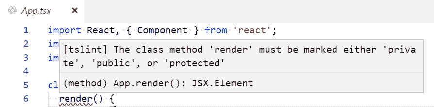

那么，让我们通过添加`public`作为修饰符来解决这个问题：

```jsx
class App extends Component {
  public render() {
    return ( ... );
  }
}
```

6.  当我们还在`App.tsx`中时，让我们将锚定标记更改为以下内容：

```jsx
<a className="App-link" href="https://reactjs.org" target="_blank" rel="noopener noreferrer">
 Learn React and TypeScript
</a>
```

7.  保存文件，然后在浏览器中返回应用程序。应用程序已自动更改，显示新内容。美好的

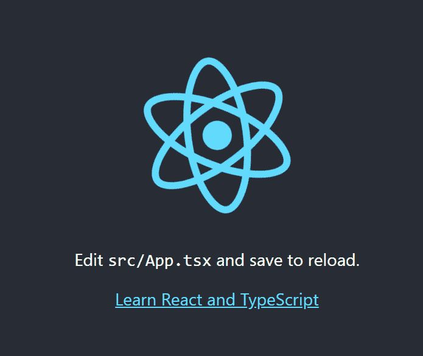

`create-react-app`在我们的项目中为我们配置了很多很棒的东西。如果我们只想快速开始学习 React，并跳过 React 和 TypeScript 代码是如何打包以从 web 服务器提供服务的，那么这非常好。

在下一节中，我们将手动执行`create-react-app`为我们自动执行的一些操作。这将开始让我们了解当 React 和 TypeScript 应用打包时需要发生什么。

# 手动创建项目

在本节中，我们将逐步手动创建 React 和 TypeScript 项目。我们将从创建文件夹结构开始。

# 创建文件夹结构

我们需要一个文件夹结构，使我们能够在项目的配置文件、源代码和分发到 web 服务器的文件之间进行适当的分离。

我们的所有配置文件都将进入我们的项目路线：

1.  在您选择的空文件夹中打开 Visual Studio 代码，并创建名为`src`的文件夹。这将保存我们的源代码。

2.  我们还要创建一个名为`dist`的文件夹。它将保存要分发到 web 服务器的文件。

# 创建 package.json

`package.json`**文件定义了我们的项目名称、描述、构建命令、相关`npm`模块等等。**

 **打开终端窗口，然后运行以下命令：

```jsx
npm init
```

这将提示您输入有关项目的各种信息，然后创建一个包含这些信息的`package.json`文件。

# 添加TypeScript

我们在[第 1 章](01.html)、*TypeScript 基础*中全局安装了 TypeScript。在本节中，我们将在项目中本地安装它。在本地使用 TypeScript 稍微简化了构建过程。

通过在终端中运行以下命令，我们可以在项目中安装 TypeScript：

```jsx
npm install typescript --save-dev
```

The `--save-dev` command marks the TypeScript dependency as being only for development purposes.

# 创建 tsconfig.json

如[第 1 章](01.html)*类型脚本基础*所述，`tsconfig.json`规定了如何编译和传输我们的类型脚本代码。

让我们在项目的根目录中创建一个名为`tsconfig.json`的新文件，并输入以下内容：

```jsx
{ 
  "compilerOptions": { 
    "target": "es5", 
    "module": "es6", 
    "moduleResolution": "node", 
    "lib": ["es6", "dom"],
    "sourceMap": true, 
    "jsx": "react", 
    "strict": true, 
    "noImplicitReturns": true,
    "rootDir": "src",
    "outDir": "dist",
  },
  "include": ["**/*.ts", "**/*.tsx"],
  "exclude": ["node_modules"]
}
```

# 添加 TSLint

在[第一章](https://cdp.packtpub.com/learn_react_17_with_typescript_3/wp-admin/post.php?post=24&action=edit#post_24)中，*字体 Linting*向我们介绍了 TSLint。将其添加到项目中，如下所示：

1.  通过在终端中输入以下命令来安装 TSLint：

```jsx
 npm install tslint --save-dev
```

2.  在我们项目的根目录下添加一个基本的`tslint.json`文件，并输入以下内容：

```jsx
{
  "extends": ["tslint:recommended", "tslint-react", "tslint-config-prettier"],
  "linterOptions": {
    "exclude": ["node_modules/**/*.ts"]
  }
}
```

# 添加 React 类型

让我们通过在终端中运行以下命令，将 React 库添加到项目中：

```jsx
npm install react react-dom
```

我们还需要 React 的 TypeScript 类型。因此，将这些作为开发依赖项添加到我们的项目中，如下所示：

```jsx
npm install @types/react @types/react-dom --save-dev
```

# 创建根网页

我们需要一个 HTML 页面，它将承载我们的 React 应用程序。在我们的`dist`文件夹中创建一个名为`index.html`的文件，并输入以下内容：

```jsx
<!DOCTYPE html>
<html>
<head>
  <meta charset="utf-8"/>
</head>
<body>
  <div id="root"></div>
  <script src="bundle.js"></script>
</body>
</html>
```

我们 React 应用程序中的 HTML 将被注入带有`id ="root"`的`div`。所有应用程序的 JavaScript 代码最终将被捆绑到一个名为`bundle.js`的文件中，该文件位于`dist`文件夹中。

当然，目前这两个都不存在，我们将在后面的部分中进行介绍。

# 创建一个简单的 React 组件

让我们创建一个非常简单的 React 组件。在您的`src`文件夹中创建一个名为`index.tsx`的文件，并输入以下内容：

```jsx
import * as React from "react";

const App: React.SFC = () => {
  return <h1>My React App!</h1>;
};
```

我们的组件只是以`h1`标记返回`My React App!`。

The `tsx` extension distinguishes TypeScript React components from vanilla JavaScript React components, which have a `jsx`extension. `React.SFC` is a TypeScript type we can use for React components that don't have any internal state. We'll learn more about these components later in this book, and we'll look at state later in this chapter.

下一步是将我们的反应组分注入`index.html`。我们可以通过使用`ReactDOM.render`函数来实现这一点。`ReactDOM.render`将我们的组件作为第一个参数，将其注入的 HTML 元素作为下一个元素

让我们将突出显示的行添加到`index.tsx`中：

```jsx
import * as React from "react";
import * as ReactDOM from "react-dom";

const App: React.SFC = () => {
  return <h1>My React App!</h1>;
};

ReactDOM.render(<App />, document.getElementById("root") as HTMLElement);
```

现在我们有了一个小应用程序，我们需要将其打包。我们将在下一节介绍这一点。

# 添加网页包

Webpack 是一个流行的工具，我们可以使用它将所有 JavaScript 代码绑定到`index.html`所期望的`bundle.js`文件中。

1.  通过在终端中输入以下命令，将 webpack 及其命令行界面作为开发依赖项安装到我们的项目中：

```jsx
npm install webpack webpack-cli --save-dev
```

2.  Webpack 还有一个方便的 web 服务器，我们可以在开发过程中使用它。那么，让我们也通过终端安装它：

```jsx
npm install webpack webpack-dev-server --save-dev
```

3.  在开始配置 webpack 之前，还有最后一项任务要完成。这是为了安装一个名为`ts-loader`的网页包插件，它将帮助加载我们的 TypeScript 代码。按如下方式安装此文件：

```jsx
npm install ts-loader --save-dev
```

4.  现在我们的项目中有了所有这些网页内容，是时候对其进行配置了。在项目根目录中创建一个名为`webpack.config.js`的文件，并在其中输入以下内容：

```jsx
const path = require("path");

module.exports = {
  entry: "./src/index.tsx",
  module: {
    rules: [
      {
        test: /\.tsx?$/,
        use: "ts-loader",
        exclude: /node_modules/
      }
    ]
  },
  resolve: {
    extensions: [".tsx", ".ts", ".js"]
  },
  output: {
    path: path.resolve(__dirname, "dist"),
    filename: "bundle.js"
  },
  devServer: {
    contentBase: path.join(__dirname, "dist"),
    compress: true,
    port: 9000
  }
};
```

这里发生了一些事情，让我们把它分解一下：

*   `module.exports`是我们的网页配置对象。
*   `entry`字段告诉 webpack 从哪里开始寻找要捆绑的模块。在我们的项目中，这是`index.tsx`。
*   `module`字段告诉 webpack 如何处理不同的模块。我们的项目告诉 webpack 使用`ts-loader`来处理扩展名为`ts`和`tsx`的文件。
*   `resolve`字段告诉 webpack 如何解析模块。在我们的项目中，我们需要处理`tsx`和`.ts`文件，以及标准`.js`文件。
*   `output`字段告诉 webpack 在哪里捆绑我们的代码。在我们的项目中，这是名为`bundle.js`的文件，位于`dist`文件夹中。
*   `devServer`字段配置网页包开发服务器。我们告诉它，web 服务器的根目录是`dist`文件夹，用于在`port 9000`上提供文件。

# 项目文件夹和文件

我们现在应该有以下文件夹，其中包含以下文件：

```jsx
├─ dist/
  ├─ bundle.js
  ├─ index.html
├─ node_modules/
├─ src/
  ├─ index.tsx 
├─ package.json
├─ tsconfig.json
├─ tslint.json
├─ webpack.config.js
```

我们几乎准备好运行我们的应用程序了，现在还有一件事要做，我们将在下一节讨论

# 创建启动和构建脚本

我们将利用`npm`脚本以开发模式启动我们的应用程序，并构建我们应用程序的生产版本：

1.  让我们打开`package.json`——现在应该有相当多的内容。我们需要找到`scripts`部分，其中可能有一个名为`test`的脚本。为`start`和`build`添加突出显示的脚本：

```jsx
{
  ...
  "scripts": {
    "test": "echo \"Error: no test specified\" && exit 1"
    "start": "webpack-dev-server --env development",
 "build": "webpack --env production"
  },
  ..
}
```

2.  运行以下命令，生成应用程序的生产版本：

```jsx
npm run build
```

现在，webpack 将开始工作。如果我们查看`dist`文件夹，最终会出现一个名为`bundle.js`的文件。该文件包含所有 JavaScript 精简代码，包括来自 React 库和简单 React 组件的代码

3.  现在，输入以下命令：

```jsx
npm start
```

网页包开发服务器将启动。

4.  如果我们浏览到`http://localhost:9000/`，我们将看到我们的 web 应用程序：


5.  我们的应用程序仍在运行，在`index.tsx`中，让我们将`App`组件更改为以下内容：

```jsx
const App: React.SFC = () => {
  return <h1>My React and TypeScript App!</h1>;
};
```

6.  如果我们保存`index.tsx`并进入浏览器，我们将看到我们的应用程序自动更新新内容：

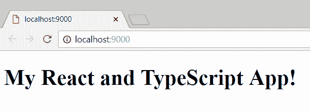

我们将把手动配置的项目留在那里。它的功能不如`create-react-app`项目，但我们已经开始了解 React 和 TypeScript 项目是如何打包的。

# 创建类组件

到目前为止，我们已经创建了一些非常简单的组件。在本节中，我们将构建一个稍微复杂一点的组件，并开始更加熟悉组件的一些不同部分。

我们将一起开始构建一个名为`Confirm`的组件，该组件将允许用户继续操作或停止操作。

完成后，我们的组件将如以下屏幕截图所示：

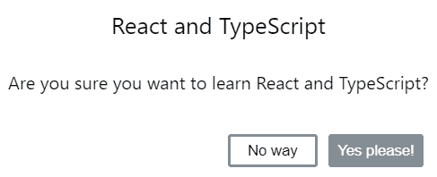

我们将使用`create-react-app`快速启动一个项目，如下所示：

1.  在您选择的文件夹中打开 Visual Studio 代码，并在终端中输入以下内容：

```jsx
npx create-react-app my-components --typescript
```

这次我们选择将我们的项目命名为`my-components`。

2.  让我们将带有一些规则的 TSLint 作为开发依赖项添加到我们的项目中：

```jsx
cd my-components
npm install tslint tslint-react tslint-config-prettier --save-dev
```

3.  现在添加一个`tslint.json`文件，包含以下规则：

```jsx
{
  "extends": ["tslint:recommended", "tslint-react", "tslint-config-prettier"],
  "rules": {
    "ordered-imports": false,
    "object-literal-sort-keys": false,
    "no-debugger": false,
    "no-console": false,
  },
  "linterOptions": {
    "exclude": [
      "config/**/*.js",
      "node_modules/**/*.ts",
      "coverage/lcov-report/*.js"
    ]
  }
}
```

4.  通过在`render`方法上添加缺少的访问修饰符，修复`App.tsx`中的 linting 错误：

```jsx
class App extends Component {
  public render() {
    return ( ... );
  }
}
```

5.  我们现在可以启动开发服务器并启动我们的应用程序：

```jsx
npm start
```

6.  接下来，我们将缩小并修复应用程序标题，以便为确认组件留出足够的空间。更改`app.css`中突出显示的行：

```jsx
.App-logo {
  animation: App-logo-spin infinite 20s linear;
  height: 80px;
}

.App-header {
  background-color: #282c34;
  height: 200px;
  display: flex;
  flex-direction: column;
  align-items: center;
  justify-content: center;
  font-size: 16px;
  color: white;
} 
```

应用程序标题现在应该稍微短一点。

在以下部分中，我们将在开发组件的同时保持应用程序的运行。

# 创建基本类组件

让我们看看`App.tsx`，它是为我们创建的。这是一个类组件的示例。我们现在要创建自己的类组件。遵循以下步骤：

1.  在`src`文件夹中创建一个名为`Confirm.tsx`的文件，并在其中输入以下内容：

```jsx
import * as React from "react";

class Confirm extends React.Component {

}

export default Confirm;
```

我们学习了[第一章](01.html)、*TypeScript基础**中的所有课程。*在这里，我们创建了一个类，它扩展了 React 的标准`Component`类。请注意，我们已经在文件顶部导入了 React，并且我们正在使用文件底部的默认导出导出类组件。

2.  现在让我们通过创建一个`render`方法来实现我们的`Confirm`类组件：

```jsx
class Confirm extends React.Component {
  public render() {
 return (
 );
 }
}
```

`render`方法确定组件需要显示的内容。我们使用 JSX 定义需要显示的内容。简单地说，JSX 是 HTML 和 JavaScript 的混合体。我们将在下一节更详细地探讨它。

3.  目前，让我们在`render`方法中输入以下内容：

```jsx
public render() {
  return (
    <div className="confirm-wrapper confirm-visible">
 <div className="confirm-container">
 <div className="confirm-title-container">
 <span>This is where our title should go</span>
 </div>
 <div className="confirm-content-container">
 <p>This is where our content should go</p>
 </div>
 <div className="confirm-buttons-container">
 <button className="confirm-cancel">Cancel</button>
 <button className="confirm-ok">Okay</button>
 </div>
 </div>
 </div>
  );
}
```

目前，我们的`render`方法看起来更像 HTML 而不是 JavaScript，除了那个有趣的`className`属性不应该是`class`吗？

我们将在下一节中更详细地介绍这一点和 JSX，但在此之前，让我们在`App`组件中使用`Confirm`组件。

4.  在`App.tsx`中，我们需要导入我们的`Confirm`组件类，如下所示：

```jsx
import Confirm from "./Confirm";
```

5.  我们的`Confirm`组件可以在 JSX 中引用为`<Confirm />`。那么，让我们将此添加到`App.tsx`中的 JSX 中：

```jsx
<div className="App">
  <header className="App-header">
    ...
  </header>
  <Confirm />
</div>
```

如果我们查看应用程序运行的浏览器页面，它现在应该如下所示：


6.  我们将使我们的组件看起来更像一个使用 CSS 的对话框。让我们创建一个名为`Confirm.css`的文件，并在其中输入以下内容：

```jsx
.confirm-wrapper {
  position: fixed;
  left: 0;
  top: 0;
  width: 100%;
  height: 100%;
  background-color: gray;
  opacity: 0;
  visibility: hidden;
  transform: scale(1.1);
  transition: visibility 0s linear 0.25s, opacity 0.25s 0s, transform 0.25s;
  z-index: 1;
}
.confirm-visible {
  opacity: 1;
  visibility: visible;
  transform: scale(1);
  transition: visibility 0s linear 0s, opacity 0.25s 0s, transform 0.25s;
}
.confirm-container {
  background-color: #fff;
  position: absolute;
  top: 50%;
  left: 50%;
  transform: translate(-50%, -50%);
  border-radius: 0.2em;
  min-width: 300px;
}
.confirm-title-container {
  font-size: 1.3em;
  padding: 10px;
  border-top-left-radius: 0.2em;
  border-top-right-radius: 0.2em;
}
.confirm-content-container {
  padding: 0px 10px 15px 10px;
}
.confirm-buttons-container {
  padding: 5px 15px 10px 15px;
  text-align: right;
}
.confirm-buttons-container button {
  margin-left: 10px;
  min-width: 80px;
  line-height: 20px;
  border-style: solid;
  border-radius: 0.2em;
  padding: 3px 6px;
  cursor: pointer;
}
.confirm-cancel {
  background-color: #fff;
  border-color: #848e97;
}
.confirm-cancel:hover {
  border-color: #6c757d;
}
.confirm-ok {
  background-color: #848e97;
  border-color: #848e97;
  color: #fff;
}
.confirm-ok:hover {
  background-color: #6c757d;
  border-color: #6c757d;
}
```

7.  现在我们将 CSS 导入我们的`Confirm.tsx`：

```jsx
import "./Confirm.css";
```

浏览器页面中的组件现在应该如下所示：

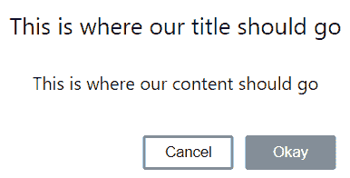

因此，React 类组件有一个名为`render`的特殊方法，我们在其中定义组件在 JSX 中显示的内容。

在下一节中，我们将从确认组件中稍作休息，同时进一步了解 JSX。

# JSX

如前一节所述，JSX 看起来有点像 HTML。我们可以在 JavaScript（或 TypeScript）代码中使用 JSX，就像我们在`render`函数的最后一节中所做的那样。JSX 不是有效的 JavaScript，尽管我们需要一个预处理器步骤将其转换为 JavaScript。

我们将使用在线 Babel REPL 来玩 JSX：

1.  打开浏览器，进入[https://babeljs.io/repl](https://babeljs.io/repl) ，并在左侧窗格中输入以下 JSX：

```jsx
<span>This is where our title should go</span>
```

右侧窗格中显示以下内容，这是我们的 JSX 编译的结果：

```jsx
React.createElement(
  "span",
  null,
  "This is where our title should go"
);
```

我们可以看到它编译成一个对`React.createElement`的调用，它有三个参数：

*   元素类型，可以是 HTML 标记名字符串（如`"span"`）、React 组件类型或 React 片段类型
*   包含要应用于元素的道具的对象
*   元素的子元素

2.  让我们通过在`span`周围放置`div`标记来扩展我们的示例：

```jsx
<div className="confirm-title-container">
  <span>This is where our title should go</span>
</div>
```

现在，这将编译为两个对`React.createElement`的调用，其中`span`作为子对象传递给`div`：

```jsx
React.createElement(
  "div",
  { className: "confirm-title-container" },
  React.createElement(
    "span",
    null,
    "This is where our title should go"
  )
);
```

3.  这开始有意义了，但到目前为止，我们的 JSX 只包含 HTML。现在让我们通过声明一个 props 对象文字来添加一些 JavaScript。让我们也使用花括号参考`span`中的`title`道具：

```jsx
const props = {
 title: "React and TypeScript"
};
<div className="confirm-title-container">
  <span>{props.title}</span>
</div>
```

现在这更有趣了。它归结为：

```jsx
var props = {
 title: "React and TypeScript"
};
React.createElement(
 "div",
 { className: "confirm-title-container" },
 React.createElement(
 "span",
 null,
 props.title
 )
);
```

关键的一点是，我们可以使用大括号将 JavaScript 注入 HTML

4.  为了进一步说明这一点，让我们清空`props`对象文字，并在`span`中使用 JavaScript 三元：

```jsx
const props = {};
<div className="confirm-title-container">
  <span>{props.title ? props.title : "React and TypeScript"}</span>
</div>
```

我们看到对`React.createElement`的嵌套调用使用我们的三元组作为`span`的子级：

```jsx
React.createElement(
  "span",
  null,
  props.title ? props.title : "React and TypeScript"
)
```

那么，为什么我们要使用`className`属性而不是`class`？好的，我们现在了解到 JSX 可以编译成 JavaScript，而`class`是 JavaScript 中的一个关键字，因此在 JSX 中使用`class`属性会发生冲突。因此，React 使用`className`代替 CSS 类引用。

现在我们对 JSX 有了更多的了解，让我们回到我们的`Confirm`组件。

# 组件道具

目前，我们的`Confirm`组件的标题和内容文本是硬编码的。让我们将这些更改为组件接受的引用属性（道具）。

1.  首先，我们需要为我们的道具定义一个 TypeScript 类型。我们将在`Confirm.tsx`中`Confirm`类前面使用一个接口：

```jsx
interface IProps {
  title: string;
  content: string;
}
```

2.  在类定义中引用`React.Component`之后，我们可以引用尖括号中的`IProps`类型：

```jsx
class Confirm extends React.Component<IProps>
```

`React.Component` is what is called a generic class. Generic classes allow types used within the class to be passed in. In our case, we have passed in our `IProps` interface. Don't worry if this doesn't make too much sense at the moment—we'll cover generic classes later in the book.

3.  我们可以使用`this.props.propName`访问我们班上的道具。在我们的 JSX 中，我们现在可以参考道具，而不是硬编码标题和内容：

```jsx
...
<div className="confirm-title-container">
  <span>{this.props.title}</span>
</div>
<div className="confirm-content-container">
  <p>{this.props.content}</p>
</div>
...
```

请注意，当我们在`App.tsx`中引用`Confirm`组件时，我们现在有一个 TypeScript 编译错误。这是因为我们的组件现在需要`title`和`content`属性，如下所示：

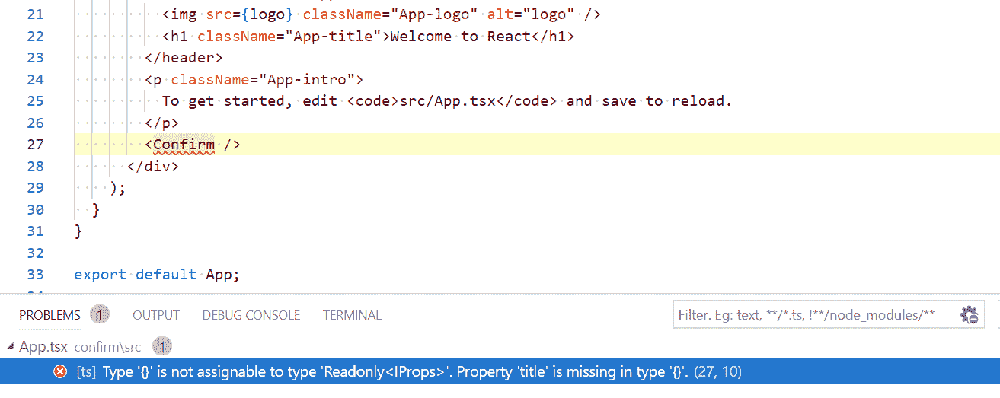

4.  让我们添加`title`和`content`属性：

```jsx
<Confirm 
 title="React and TypeScript" 
  content="Are you sure you want to learn React and TypeScript?" 
/>
```

编译错误现在消失了，如果我们查看浏览器，我们的组件呈现的与实现 props 之前完全相同。

# 可选道具

界面道具可以是可选的，正如我们在[第 1 章](01.html)、*TypeScript基础*中发现的。因此，我们还可以使用此机制向 React 组件添加可选的道具。

让我们添加一些可选道具，以允许在确认组件上配置按钮标题：

1.  在我们的界面中添加一些名为`cancelCaption`和`okCaption`的可选道具：

```jsx
interface IProps {
  title: string;
  content: string;
  cancelCaption?: string;
 okCaption?: string;
}
```

We put a `?` before the type annotation to denote that the prop is optional. Note also that we don't get a compilation error in `App.tsx`, where we reference, `Confirm` because we are not required to enter these as attributes on `Confirm`.

2.  现在让我们在 JSX 中参考这些道具，替换硬编码的标题：

```jsx
<div className="confirm-buttons-container">
  <button className="confirm-cancel">
 {this.props.cancelCaption}
 </button>
 <button className="confirm-ok">
 {this.props.okCaption}
 </button>
</div>
```

如果我们现在查看浏览器，我们的跑步应用程序中没有按钮标题：


这是因为我们在`App.tsx`中引用`Confirm`时没有提供这些值。

在下一节中，我们将通过为`cancelCaption`和`okCaption`添加一些默认值来解决这个问题。

# 默认道具值

初始化组件时，可以将默认值添加到组件道具中。这些可以使用名为`defaultProps`的静态对象文字来实现。

让我们在`Confirm`组件中使用此功能，如下所示：

1.  在我们的类中为`cancelCaption`和`okCaption`创建一些默认值：

```jsx
class Confirm extends React.Component<IProps> {
  public static defaultProps = {
 cancelCaption: "Cancel",
 okCaption: "Okay"
 };
  public render() { ... }
}
```

如果我们再看看我们的跑步应用程序，我们会再次看到按钮标题。

2.  让我们通过覆盖默认值来完成本节，并在`App.tsx`中为这些标题提供特定属性，如下所示：

```jsx
<Confirm
  title="React and TypeScript"
  content="Are you sure you want to learn React and TypeScript?"
  cancelCaption="No way"
 okCaption="Yes please!"
/>
```

我们的跑步应用程序现在应该如下所示：


带有默认值的可选道具可以使组件更易于使用，因为最常见的配置可以自动设置，而无需指定任何内容。

所以，我们的`Confirm`组件现在很好，很灵活，但是按钮还没有做任何事情。我们将在以下几节中解决这个问题。

# 处理类组件事件

事件存在于许多编程语言中。它们允许我们指定要执行的逻辑，具体取决于用户与我们的应用程序的交互方式

# 基本事件处理程序

我们可以在 JSX 中处理所有本机 JavaScript 事件。JSX 允许我们使用调用函数的道具来处理这些事件。道具名称是通过使用驼峰大小写在本机事件名称前面加上`on`来派生的。所以在 JSX 中，`click`事件的道具名称是`onClick`。

We can see a list of all the available events with their corresponding types in the `index.d.ts` file in the `node_modules/@types/react` folder. 

我们需要能够控制`Confirm`组件中的按钮的功能。遵循以下步骤：

1.  第一步是处理这些按钮上的`click`事件。我们在 OK 按钮上设置`onClick`道具，如下所示：

```jsx
<button className="confirm-ok" onClick={this.handleOkClick}>...</button>
```

因此，我们告诉按钮在点击时调用`Confirm`类中的`handleOkClick`方法。

2.  接下来，我们创建`handleOkClick`方法：

```jsx
private handleOkClick() {
  console.log("Ok clicked");
}
```

在应用程序运行的情况下切换到浏览器，然后单击“是”按钮！按钮如果我们在控制台中查看，应该会看到显示 Ok clicked（确定）：


正如我们所见，使用我们已经熟悉的机制处理事件非常简单。然而，我们的`handleOkClick`方法实际上存在一个问题。我们将在下一节深入探讨并解决此问题。

# 解决这个问题的方法

我们的事件处理程序受到 JavaScript 经典`this`问题的困扰。我们目前没有在事件处理程序中引用`this`，这就是问题尚未出现的原因

让我们用`handleOkClick`方法来揭示问题，以便更好地了解发生了什么：

1.  将组件道具记录到控制台：

```jsx
private handleOkClick() {
  console.log("Ok clicked", this.props);
}
```

现在，请尝试单击“是”按钮！再按一下按钮。出现以下错误：

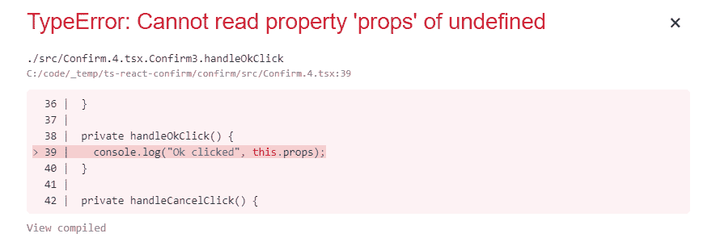

问题是`this`没有在事件处理程序中引用我们的类，而是`undefined`。

一种解决方案是将`handleOkClick`方法更改为箭头函数。

Arrow function expressions have shorter syntax than function expressions. They also don't create their own `this`—so they are a great solution to the `this` problem.

2.  让我们将方法转换为箭头函数，如下所示：

```jsx
private handleOkClick = () => {
 console.log("Ok clicked", this.props);
};
```

现在请尝试单击“是”按钮！再按一下按钮。我们应该看到道具成功地输出到控制台。

3.  接下来，让我们现在在 Cancel 按钮上实现一个 click 处理程序。首先，我们需要在 Cancel 按钮的`onClick`道具上引用一个处理程序：

```jsx
<button className="confirm-cancel" onClick={this.handleCancelClick}>...</button>
```

4.  现在我们将创建`handleCancelClick`箭头函数：

```jsx
private handleCancelClick = () => {
  console.log("Cancel clicked", this.props);
};
```

总之，为了避免`this`问题，我们可以使用箭头函数来实现事件处理程序

接下来，我们希望组件的使用者能够在单击按钮时执行一些逻辑。我们将在下一节介绍如何做到这一点。

# 功能道具

在上一节中，我们了解了如何使用`onClick`事件处理程序为函数设置道具。在本节中，我们将实现我们自己的功能道具，以便当按下 Ok 和 Cancel 按钮时，组件的使用者可以执行一些逻辑。

1.  让我们在我们的界面上实现这两个额外的道具。该函数不接受任何参数，也不返回任何内容。因此，类型为`() => void`，如下所示：

```jsx
interface IProps {
 title: string;
 content: string;
 cancelCaption?: string;
 okCaption?: string;
 onOkClick: () => void;
 onCancelClick: () => void;
}
```

道具是必需的，所以当我们引用`Confirm`组件时，`App.tsx`中立即出现编译错误。我们稍后再解决这个问题。

2.  接下来，让我们在单击按钮时调用函数道具，而不是将消息记录到控制台：

```jsx
private handleCancelClick = () => {
  this.props.onCancelClick();
};

private handleOkClick = () => {
  this.props.onOkClick();
};
```

3.  我们现在将通过在`App.tsx`中为这些道具实现箭头函数处理程序来修复编译错误。首先，让我们创建 arrow 函数处理程序：

```jsx
private handleCancelConfirmClick = () => {
 console.log("Cancel clicked");
};

private handleOkConfirmClick = () => {
 console.log("Ok clicked");
};
```

4.  现在我们可以在使用`Confirm`组件的地方引用这些函数：

```jsx
<Confirm
  ...
  onCancelClick={this.handleCancelConfirmClick}
 onOkClick={this.handleOkConfirmClick}
/>
```

如果我们返回应用程序，我们将看到编译错误已得到解决。如果单击“确定”和“取消”按钮，则会按预期将消息输出到控制台：

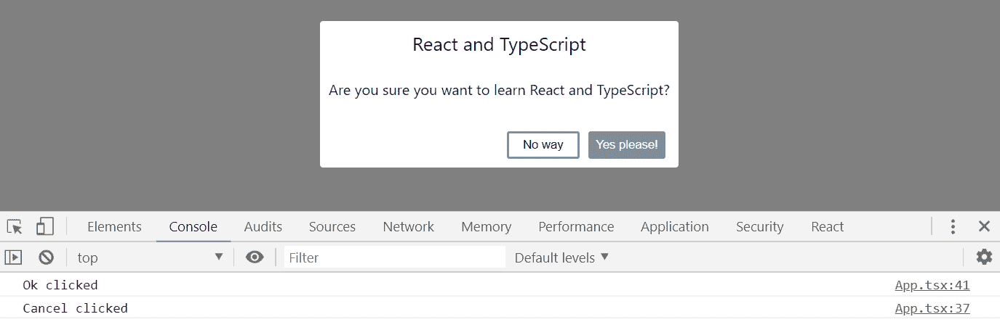

目前，我们的按钮除了将消息记录到控制台外，仍然不做任何事情。我们希望在单击任一按钮时关闭确认对话框。我们将在下一节中实现这一点。

# 类组件状态

状态是一个确定组件行为和渲染方式的对象。我们需要在应用程序中引入状态，以便管理确认对话框是打开还是关闭。

这个特定的状态将在`App`组件中存在和管理，并作为道具传递给`Confirm`组件。

1.  首先，在`Confirm`组件中创建一个`open`道具，将其添加到道具界面：

```jsx
interface IProps {
  open: boolean;
  title: string;
  content: string;
  cancelCaption?: string;
  okCaption?: string;
  onOkClick: () => void;
  onCancelClick: () => void;
}
```

2.  我们将使用`render`函数中的`open`属性来确定对话框是否可见。`confirm-visible`CSS 类使对话框可见。

因此，在最外层的`div`上，我们在`className`属性中使用一个 JavaScript 三元表达式，当`open`属性为`true`时，只包含`confirm-visible`，如下所示：

```jsx
public render() {
  return (
    <div
      className={
 this.props.open
 ? "confirm-wrapper confirm-visible"
 : "confirm-wrapper"
 }
    >
      ...
    </div>
  );
}
```

我们现在在`App.tsx`中有一个编译错误，因为我们没有指定使用`Confirm`的`open`属性。

3.  在我们开始创建和管理`App.tsx`中的状态之前，让我们先在`Confirm`中的`open`属性中传递`false`：

```jsx
<Confirm
  open={false}
  title="React and TypeScript"
  content="Are you sure you want to learn React and TypeScript?"
  cancelCaption="No way"
  okCaption="Yes please!"
  onCancelClick={this.handleCancelConfirmClick}
  onOkClick={this.handleOkConfirmClick}
/>
```

如果我们现在在浏览器中查看应用程序，编译错误将消失，我们的确认对话框将关闭。

# 定义状态类型

让我们在`App.tsx`中创建一个状态，并正确管理确认对话框是打开还是关闭：

1.  首先，让我们为`App`类上方的状态创建一个接口：

```jsx
interface IState {
 confirmOpen: boolean;
}
```

2.  然后我们将状态类型告知`App`组件，我们可以使用`React.Component`的第二个泛型参数：

```jsx
class App extends React.Component<{}, IState>
```

We have used `{}` as the props type because there are no props for this component.

# 初始化状态

现在我们已经指定了我们的组件有一个状态，我们需要初始化它。我们在类构造函数中初始化组件状态。

1.  让我们创建一个构造函数，并将`confirmOpen`状态初始化为`true`：

```jsx
constructor(props: {}) {
 super(props);
 this.state = {
  confirmOpen: true,
 };
}
```

我们调用`super`是因为我们的类扩展了`React.Component`。

状态保存在组件类中的私有属性中。在构造函数中，我们可以将状态设置为所需的对象文字，在本例中，`confirmOpen`设置为`true`。

2.  然后，我们可以在引用`Confirm`组件时使用此状态：

```jsx
<Confirm
  open={this.state.confirmOpen}
  ...
/>
```

如果我们查看我们的跑步应用程序，确认对话框应该再次打开。

因此，私有状态属性允许我们访问组件状态，我们可以在类构造函数中初始化它。

# 变化状态

单击确认对话框按钮时，我们希望关闭对话框。因此，我们希望在单击按钮时将`confirmOpen`的状态更改为 false。

我们已经为按钮单击事件提供了箭头函数处理程序，因此我们可以在其中更改状态：

1.  我们试着在`handleOkConfirmClick`中这样做，替换`console.log`：

```jsx
private handleOkConfirmClick = () => {
  this.state.confirmOpen = false;
};
```

我们得到一个编译错误，如下所示：

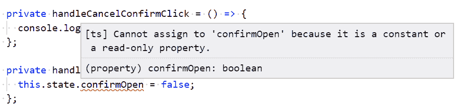

错误消息表示状态为只读！为什么会这样，我们怎样才能改变现状？

我们需要在组件类中使用名为`setState`的方法来更改状态。这有助于确保我们稳健有效地管理国家。`setState`接受一个参数，该参数是一个包含我们要更改的状态的对象文本。

2.  让我们将代码更改为使用`setState`：

```jsx
private handleOkConfirmClick = () => {
  this.setState({ confirmOpen: false });
};
```

编译错误消失，如果我们单击“是”，请！在 running 应用程序中，确认对话框现在将关闭。我们已经成功地改变了状态。

3.  更改`handleCancelConfirmClick`的实现也关闭对话框：

```jsx
private handleCancelConfirmClick = () => {
  this.setState({ confirmOpen: false });
};
```

关闭确认对话框后，我们无法打开它。

4.  那么，让我们在`App.tsx`中添加一个标记为确认**的按钮：**

```jsx
<button onClick={this.handleConfirmClick}>Confirm</button>
<Confirm ... />
```

5.  我们需要创建刚才引用的处理程序：

```jsx
private handleConfirmClick = () => {
  this.setState({ confirmOpen: true });
};
```

我们现在可以单击确认按钮，在确认对话框关闭后重新打开它。

6.  让我们在`App.tsx`中的确认按钮上方添加一段文本，该文本根据确认对话框是取消还是确定而变化。我们将定义一个附加状态来驱动此文本：

```jsx
interface IState {
  confirmOpen: boolean;
  confirmMessage: string;
}
```

7.  现在，让我们在构造函数中初始化消息：

```jsx
constructor(props: {}) {
  super(props);
  this.state = {
    confirmMessage: "Please hit the confirm button",
    confirmOpen: true,
  };
}
```

8.  当确认对话框被确定或取消时，状态现在更改：

```jsx
private handleOkConfirmClick = () => {
  this.setState({
    confirmMessage: "Cool, carry on reading!",
    confirmOpen: false
  });
};

private handleCancelConfirmClick = () => {
  this.setState({
    confirmMessage: "Take a break, I'm sure you will later ...",
    confirmOpen: false
  });
};
```

9.  最后，我们可以在确认按钮上方呈现消息：

```jsx
<p>{this.state.confirmMessage}</p>
<button onClick={this.handleConfirmClick}>Confirm</button>
<Confirm ... />
```

如果我们现在玩 running 应用程序，我们会看到应用程序中的消息根据我们是否同意或取消确认对话框而变化。

尽管我们可以在初始化构造函数时直接在构造函数中设置 state prop，但在类组件中的其他位置却不能。相反，应该通过调用组件类中的`setState`方法来更改状态。

# 类组件生命周期方法

类组件中的生命周期方法允许我们在流程中的特定点运行代码。以下是组件流程的高级图表，显示了调用不同方法的时间：

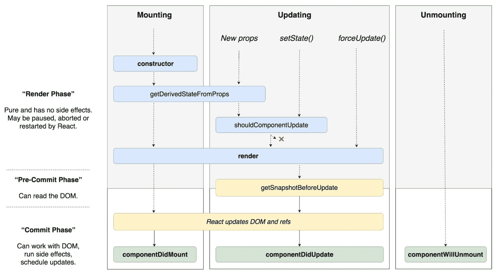

Diagram of modern React life cycle methods, from React documentation

# 组件安装

`componentDidMount`在组件插入 DOM 时调用。以下是此方法的一些常见用例：

*   调用 web 服务以获取一些数据
*   添加事件侦听器
*   初始化计时器
*   初始化第三方库

我们将改变我们一直在构建的应用程序，给用户 10 秒的时间限制，以确认他们是否想要学习 React 和 TypeScript。为此，我们需要使用`componentDidMount`方法：

1.  让我们先在`App.tsx`中加载应用程序时关闭确认对话框：

```jsx
constructor(props: {}) {
  super(props);
  this.state = {
    confirmMessage: "Please hit the confirm button",
    confirmOpen: false
  };
}
```

2.  我们将倒计时从`10`到`0`的秒数，然后在到达`0`时隐藏确认按钮。让我们在`App.tsx`中为这两个添加并初始化一个状态：

```jsx
interface IState {
  confirmOpen: boolean;
  confirmMessage: string;
 confirmVisible: boolean; countDown: number;
}

constructor(props: {}) {
  super(props);
  this.state = {
    confirmMessage: "Please hit the confirm button",
    confirmOpen: false,
    confirmVisible: true,
 countDown: 10
  };
}
```

3.  在`App`课程中，我们将使用`timer`从`10`倒数到`1`。让我们在构造函数上方创建一个名为`timer`的私有道具：

```jsx
private timer: number = 0;
```

4.  现在，让我们使用`componentDidMount`方法初始化我们的`timer`：

```jsx
public componentDidMount() {
  this.timer = window.setInterval(() => this.handleTimerTick(), 1000);
}
```

5.  计时器将每秒调用一个名为`handleTimerTick`的方法。按如下方式实施此方法：

```jsx
private handleTimerTick() {
  this.setState(
    {
      confirmMessage: `Please hit the confirm button ${
        this.state.countDown
      } secs to go`,
      countDown: this.state.countDown - 1
    }
  );
}
```

我们也在减少计数器，用这种方法更新向用户显示的消息。不过，我们需要在这里做更多的工作：我们需要停止计时器，隐藏确认按钮，并告诉用户他们太晚了！

6.  我们的本能可能是这样写：

```jsx
private handleTimerTick() {
  this.setState(
    {
      confirmMessage: `Please hit the confirm button ${
        this.state.countDown
      } secs to go`,
      countDown: this.state.countDown - 1
    }
  );
  if (this.state.countDown <= 0) {
 clearInterval(this.timer);
 this.setState({
 confirmMessage: "Too late to confirm!",
 confirmVisible: false
 });
 }
}
```

但是，这是不正确的，因为状态是异步更新的，因此在`setState`调用中更新后`this.state.countDown`不一定会更新该行。

7.  相反，我们需要将此代码移动到`setState`中的回调：

```jsx
private handleTimerTick() {
  this.setState(
    {
      confirmMessage: `Please hit the confirm button ${
        this.state.countDown
      } secs to go`,
      countDown: this.state.countDown - 1
    },
 () => {
 if (this.state.countDown <= 0) {
 clearInterval(this.timer);
 this.setState({
 confirmMessage: "Too late to confirm!",
 confirmVisible: false
 });
 }
 }
  );
}
```

8.  如果单击“确认”、“确定”或“取消”按钮，我们也可以停止计时器：

```jsx
private handleConfirmClick = () => {
  this.setState({ confirmOpen: true });
  clearInterval(this.timer);
};

private handleCancelConfirmClick = () => {
  this.setState(...);
  clearInterval(this.timer);
};

private handleOkConfirmClick = () => {
  this.setState(...;
  clearInterval(this.timer);
};
```

9.  我们的最后一项工作是在确认按钮周围放置一个条件，仅当`confirmVisible`状态为`true`时才显示：

```jsx
<p>{this.state.confirmMessage}</p>
{this.state.confirmVisible && (
 <button onClick={this.handleConfirmClick}>Confirm</button>
)}
<Confirm ... />
```

`x && y`allows us to concisely express a condition with a single branch in JSX. Basically, the right operand of `&&` isn't evaluated and rendered if the left operand is falsy.

现在，是时候尝试一下了。我们将在应用程序首次运行时看到倒计时：

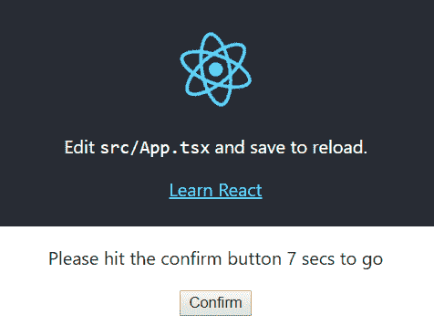

如果我们不能在十秒钟内确认，那就太晚了：

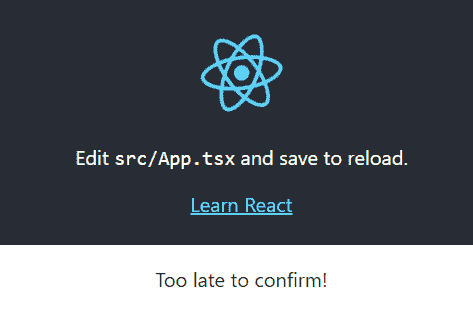

# 组件将卸载

在组件从 DOM 中移除之前调用`componentWillUnmount`。以下是此方法的一些常见用例：

*   删除事件侦听器
*   取消活动网络请求
*   移除计时器

我们将在我们的应用程序中使用`componentWillUnmount`，以确保我们的`timer`被停止并删除。让我们在`componentDidMount`方法之后的`App`类中添加以下内容：

```jsx
public componentWillUnmount() {
  clearInterval(this.timer);
}
```

# getDerivedStateFromProps

每次呈现组件时都会调用`getDerivedStateFromProps`。当某些道具改变时，它可以用来改变状态。这是组件类中的静态方法，返回更改的状态，如果状态没有更改，则返回 null。

让我们在我们的应用程序中看看这个生命周期方法。在`App`类的顶部添加以下内容：

```jsx
public static getDerivedStateFromProps(props: {}, state: IState) {
  console.log("getDerivedStateFromProps", props, state);
  return null;
}
```

如果我们在应用程序运行时查看控制台，就会发现每次倒计时递减时都会调用我们的方法：

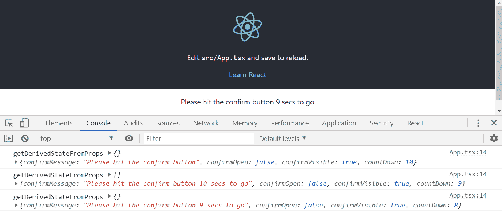

# getSnapshotBeforeUpdate 和 componentDidUpdate

在 DOM 更新之前调用`getSnapshotBeforeUpdate`，从`getSnapshotBeforeUpdate`返回的值传递给`componentDidUpdate`。

更新 DOM 后立即调用`componentDidUpdate`。在渲染期间调整窗口大小就是`getSnapshotBeforeUpdate`有用的一个例子。

让我们看看我们应用程序中的这些生命周期方法：

1.  让我们在`App`类顶部附近的`timer`变量声明下添加以下内容：

```jsx
private renderCount = 0;
```

2.  现在，让我们添加生命周期方法：

```jsx
public getSnapshotBeforeUpdate(prevProps: {}, prevState: IState) {
  this.renderCount += 1;
  console.log("getSnapshotBeforeUpdate", prevProps, prevState, {
    renderCount: this.renderCount
  });
  return this.renderCount;
}

public componentDidUpdate(prevProps: {}, prevState: IState, snapshot: number) {
  console.log("componentDidUpdate", prevProps, prevState, 
  snapshot, {
    renderCount: this.renderCount
  });
}
```

看看 running 应用程序：

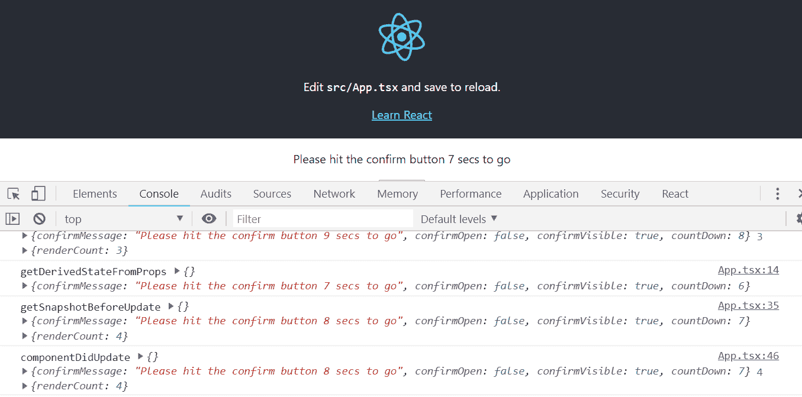

我们看到方法按照我们期望的顺序被调用，`componentDidUpdate`成功地从`getSnapshotBeforeUpdate`获取渲染计数。

# 应该更新组件吗

`shouldComponentUpdate`在渲染发生之前被调用。它返回一个布尔值，该值确定是否应进行渲染。它可用于优化性能，防止不必要的渲染周期。

1.  让我们通过添加以下方法来了解我们应用程序中的此生命周期方法：

```jsx
public shouldComponentUpdate(nextProps: {}, nextState: IState) {
  console.log("shouldComponentUpdate", nextProps, nextState);
  return true;
}
```

如果我们看一下 running 应用程序，我们会发现`shouldComponentUpdate`发生在`getDerivedStateFromProps`和`getSnapshotBeforeUpdate`之间，正如我们预期的那样。

2.  现在让我们通过返回`false`来防止渲染：

```jsx
public shouldComponentUpdate(nextProps: {}, nextState: IState) {
  console.log("shouldComponentUpdate", nextProps, nextState);
  return false;
}
```

我们看到，`getSnapshotBeforeUpdate`和`componentDidUpdate`没有被调用，因为在初始渲染之后没有渲染：

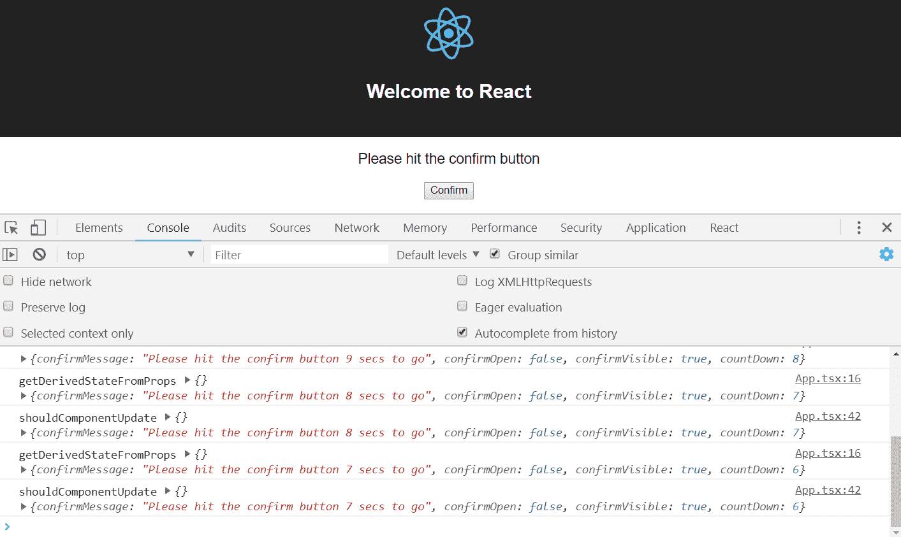

3.  在继续下一节之前，让我们通过将此标志设置回`true`来再次渲染组件：

```jsx
public shouldComponentUpdate(nextProps: {}, nextState: IState) {
  console.log("shouldComponentUpdate", nextProps, nextState);
  return true;
}
```

`shouldComponentUpdate`可以通过停止不必要的渲染来提高性能，但应小心使用。它可能会引入难以确定的 bug。此外，我们需要添加额外的代码来检查是否应该进行渲染，这实际上可能会减慢应用程序的速度

# 不推荐的生命周期方法

在 React 17 中，有一些生命周期方法已被弃用并重命名。我们不需要再使用这些了-`getDerivedStateFromProps`和`getSnapshotBeforeUpdate`基本上取代了它们。但是，以下是这些方法的简要说明，以防您在现有代码库中遇到它们：

*   `componentWillMount`（现在的`UNSAFE_componentWillMount`：在初始渲染期间将组件添加到 DOM 之前调用此函数
*   `componentWillReceiveProps`（现`UNSAFE_componentWillReceiveProps`：组件道具变更时调用
*   `componentWillUpdate`（现在为`UNSAFE_componentWillUpdate`：这是在组件更新之前调用的

# 创建功能组件

顾名思义，函数组件是使用 JavaScript 函数实现的。这些组件有时被称为*功能性无状态组件*，这可能有点令人困惑，因为它们可能包含 React 最新版本中的状态。

# 创建基本功能组件

让我们将`Confirm`组件重构为功能组件，以了解如何实现这些功能：

1.  打开`Confirm.tsx`并用以下内容替换类别签名：

```jsx
const Confirm: React.SFC<IProps> = (props) => {
...
}
```

我们使用 arrow 函数定义函数组件，将 props 类型作为泛型参数传入。

We'll learn about generic functions later in the book—so don't worry if this doesn't make perfect sense right now.

我们使用**无状态功能组件**（**SFC**`React.SFC`来表示这些类型的组件

我们的组件现在抛出了几个编译错误。我们将在接下来的步骤中解决这些问题。

2.  函数组件没有渲染方法。相反，函数本身返回应该呈现的 JSX。因此，让我们通过删除`render`签名并保留返回语句原样来更改函数的这一部分：

```jsx
return (
  <div
    className={
      this.props.open
        ? "confirm-wrapper confirm-visible"
        : "confirm-wrapper"
    }
  >
      ...
  </div>
);
```

3.  我们需要将事件处理程序更改为箭头函数常量，并直接访问道具，而不是通过`this`访问。我们还应该将这些处理程序移到`return`语句上方：

```jsx
const handleCancelClick = () => {
 props.onCancelClick();
};

const handleOkClick = () => {
 props.onOkClick();
}; 

return ( ... )
```

4.  然后我们直接引用道具和事件处理程序，而不是通过 JSX 中的`this`：

```jsx
<div
  className={
    props.open
      ? "confirm-wrapper confirm-visible"
      : "confirm-wrapper"
  }
>
  <div className="confirm-container">
    <div className="confirm-title-container">
      <span>{props.title}</span>
    </div>
    <div className="confirm-content-container">
      <p>{props.content}</p>
    </div>
    <div className="confirm-buttons-container">
      <button className="confirm-cancel" onClick=
       {handleCancelClick}>
        {props.cancelCaption}
      </button>
      <button className="confirm-ok" onClick={handleOkClick}>
        {props.okCaption}
      </button>
    </div>
  </div>
</div>
```

5.  静态`defaultProps`变量也有问题。我们将其移到函数外部，并将其作为对象文本放在函数下，如下所示：

```jsx
Confirm.defaultProps = {
  cancelCaption: "Cancel",
  okCaption: "Okay"
}
```

如果我们查看正在运行的应用程序，所有编译错误都应该得到解决，并且应用程序应该像以前一样工作。

以下代码是函数组件的模板。我们的`Confirm`组件现在应该具有类似的结构：

```jsx
import * as React from "react";

const ComponentName: React.SFC<IProps> = props => {
 const handler = () => {
 ...
 };

 return (
 <div>Our JSX</div>
 );
};
ComponentName.defaultProps = {
 ...
};

export default ComponentName;
```

因此，函数组件是创建组件的另一种方法。在下一节中，我们将研究如何向函数组件添加状态。

# 有状态函数组件

我们已经提到功能组件可以有状态。在本节中，我们将向我们的函数`Confirm`组件添加状态，强制用户在关闭之前单击两次取消按钮，如下所示：

1.  首先，我们将定义并初始化“取消”按钮单击次数的状态，添加高亮显示的行：

```jsx
const Confirm: React.SFC<IProps> = props => {

  const [cancelClickCount, setCancelClickCount] = 
  React.useState(0); 
  const handleOkClick = () => {
    props.onOkClick();
  };
  ...
}
```

这一行代码看起来有点奇怪，所以让我们将其分解：

*   `React.useState`是一个 React 函数，允许我们创建状态，并将默认值作为参数传递。在我们的例子中，我们给它传递一个默认值 0。
*   `useState`函数返回一个包含两个元素的数组：
*   第一个数组元素包含状态的当前值
*   第二个数组元素包含一个函数，用于将状态设置为不同的值
*   我们对数组进行解构，将第一个数组元素（状态值）存储在`cancelClickCount`中，将第二个数组元素（设置状态的函数）存储在`setCancelClickCount`中。
*   该函数的其余部分现在可以通过`cancelClickCount`变量访问取消单击计数。该函数还可以通过`setCancelClickCount`变量增加取消点击次数。

2.  让我们重构`handleCancelClick`arrow 函数以增加`cancelClickCount`，并且仅在计数达到`2`时调用`onCancelClick`属性：

```jsx
const handleCancelClick = () => {
  const newCount = cancelClickCount + 1;
 setCancelClickCount(newCount);
 if (newCount >= 2) {
 props.onCancelClick();
 }
};
```

现在，设置状态块的函数将新状态作为其参数。

3.  下一步，我们将更改“取消”按钮标题，在第一次单击后改为“真的吗”：

```jsx
<button className="confirm-cancel" onClick={handleCancelClick}>
  {cancelClickCount === 0 ? props.cancelCaption : "Really?"}
</button>
```

因此，我们通过定义状态时分解的变量访问 JSX 中的状态值。

如果我们在 running 应用程序中尝试一下，我们会发现第一次单击后“取消”按钮文本更改为“真的吗？”，第二次单击后确认对话框关闭。

在我们了解了定义状态所需的代码之后，访问和设置状态是相当简单和优雅的。

让我们继续下一节，看看我们如何能够钩住函数组件的生命周期事件。

# 功能组件生命周期挂钩

我们可以调用代码在函数组件生命周期的某些点执行。让我们在`Confirm`组件中探讨这一点，从组件首次渲染的时间开始，如下所示：

1.  让我们在定义状态的下方添加高亮显示的代码行：

```jsx
const [cancelClickCount, setCancelClickCount] = React.useState(0);

React.useEffect(() => {
 console.log("Confirm first rendering");
}, []);
```

*   我们使用 React 的`useEffect`函数来连接组件生命周期。
*   该函数接受一个箭头函数，该函数在第一次渲染组件时执行。
*   该函数接受第二个参数，该参数确定何时调用箭头函数。此参数是一个值数组，更改后将调用 arrow 函数。在我们的例子中，我们传入一个空数组，因此在第一次渲染后将永远不会调用 arrow 函数。
*   如果我们现在尝试运行应用程序并打开控制台，我们将看到 Confirm first rendering 只出现一次。

2.  现在我们将第二个参数删除到`useEffect`中：

```jsx
React.useEffect(() => {
  console.log("Confirm rendering");
});
```

如果我们查看正在运行的应用程序和控制台，我们将看到每次渲染`Confirm`时都会出现“确认渲染”。

3.  让我们再次将其更改为以下内容：

```jsx
React.useEffect(
  () => {
    console.log("open changed");
  },
  [props.open]
);
```

如果我们查看正在运行的应用程序和控制台，我们将看到每次`Confirm`组件的`open`道具更改值时都会出现 open changed。

4.  当一个组件被卸载时，如何连接到？让我们尝试以下方法：

```jsx
React.useEffect(() => {
  console.log("Confirm first rendering");
  return () => {
 console.log("Confirm unmounted");
 };
}, []);
```

因此，我们的 arrow 函数可以返回一个在卸载组件时执行的函数。

5.  我们的`Confirm`组件目前没有卸载，因此，在`App.tsx`中，如果倒计时达到`0`，让我们使其不呈现：

```jsx
{this.state.countDown > 0 && (
  <Confirm
    ...
  />
)}
```

如果我们查看正在运行的应用程序和控制台，我们将看到在倒计时到达`0`时出现`Confirm unmounted`。

因此，我们可以在函数组件首次呈现、其道具更改和卸载时执行逻辑。

在下一节中，我们将研究一种可用于优化函数组件渲染周期的方法。

This section on hooks is written on React v16.6.0\. We will share updated codes when new version releases.

# 优化函数组件渲染

我们的`Confirm`组件实际上被渲染得比需要的更多。在本节中，我们将对此进行优化，使其仅在道具更改时渲染：

1.  首先，让我们在函数组件的顶部添加一行，这样我们可以看到它何时呈现：

```jsx
console.log("Confirm rendering");
```

如果我们查看正在运行的应用程序和控制台，就会发现每次`App`组件倒计时时都会发生渲染。倒计时处于`App`组件状态，状态更改意味着组件将与任何子组件一起再次呈现。这就是为什么在没有任何优化的情况下，我们的`Confirm`组件会在每次倒计时时进行渲染。

2.  那就去优化吧。其实很简单：

```jsx
const ConfirmMemo = React.memo(Confirm);
export default ConfirmMemo;
```

因此，我们用 React 中的一个名为`memo`的函数来包装我们的组件。然后我们导出这个包装器函数。然后，`memo`函数仅在组件的道具发生变化时渲染组件。

如果我们查看正在运行的应用程序和控制台，就会发现我们的组件不再在每次倒计时时呈现。

那么，考虑到这是多么简单，我们不应该用`memo`来包装我们所有的功能组件吗？不当`memo`确定组件是否已更改时，存在性能成本。如果组件实际上没有执行任何不必要的渲染，则使用`memo`将导致组件速度变慢

`memo`应小心使用，且仅适用于渲染次数超过需要的组件。

鉴于类组件和函数组件的特性相似，我们应该使用哪种类型？真的，没有直截了当的答案。如果我们的团队习惯于面向对象的代码，也许基于类的组件会更容易学习。如果我们的团队习惯于更多的函数式编程技术，那么基于函数的组件可能会使他们更高效。

这两种方法都是创建 React 组件的好方法，这取决于您的选择！

# 总结

在本章中，我们学习了几种创建 React 和 TypeScript 项目的不同方法。更多的手动方式告诉我们有多少运动部件。在本书中，我们将定期使用`create-react-app`快速创建我们的应用程序。

我们了解了所有 React 类组件如何具有返回 JSX 的`render`方法，该方法告诉 React 要显示什么。JSX 非常灵活和强大，因为 JavaScript 表达式可以与 HTML 混合使用。

我们学习了如何使用道具配置组件，以及如何向道具添加 TypeScript 类型，以帮助防止在使用组件时出错。

接下来，我们学习了组件如何管理渲染内容，以及它们如何使用状态进行行为。和道具一样，React 和 TypeScript 应用程序中的状态也是强类型的。我们在构造函数中初始化状态，并通过`setState`方法更改它。

我们还了解了事件处理程序，它允许我们对用户如何与组件交互做出反应。JSX 为我们提供了方便的`onEventName`属性来处理事件。

接下来，我们了解了可以实现的各种生命周期方法，以在流程的各个点执行逻辑。最常用的生命周期方法是`componentDidMount`，它发生在组件刚刚添加到 DOM 中时。

最后，我们学习了功能组件，这是实现组件的另一种方法。在 React 的最新版本中，我们能够使用其中的状态，访问常见的生命周期挂钩，甚至优化渲染周期。

在[第 3 章](03.html)*中，我们将学习如何高效构建具有多个页面的 React 和 TypeScript 应用程序。* 

# 问题

根据我们刚刚学到的知识，回答以下问题：

1.  在开发过程中，允许调试器语句和登录到控制台的 TSLint 设置是什么？
2.  在 JSX 中，我们如何在类组件中显示带有名为`buttonLabel`的道具标签的按钮？
3.  我们如何使`buttonLabel`道具成为可选的，并默认这样做？

4.  在 JSX 中，只有当`doItVisible`状态为`true`时，我们如何才能显示此按钮？（假设我们已经声明了一个包含`doItVisible`的状态类型，并且它已经在构造函数中初始化。）
5.  我们如何为此按钮创建单击处理程序？
6.  我们声明了一个包含`doItDisabled`的状态类型。它也已在构造函数中初始化。我们将如何设置此状态以在单击后禁用“执行”按钮？
7.  如果按钮处于禁用状态时被单击，单击处理程序是否仍在执行？
8.  在类组件中，我们将使用什么生命周期方法向 React 组件中的非 React web 组件添加事件处理程序？
9.  我们将使用哪个生命周期方法删除此事件处理程序？
10.  我们有一个名为`Counter`的功能组件。它需要包含一个名为`count`的状态，以及一个名为`setCount`的更新函数。如何定义此状态并将初始计数默认为 10？
11.  在前面的`Counter`组件中，我们有一个`decrement`函数，需要将`count`减少`1`

```jsx
const decrement = () => {
  // TODO - reduce count by 1
};
```

如何实现这一点？

# 进一步阅读

*   官方介绍教程值得一读：[https://reactjs.org/tutorial/tutorial.html](https://reactjs.org/tutorial/tutorial.html)
*   `create-react-app`文档也值得添加书签：[https://facebook.github.io/create-react-app/docs/getting-started](https://facebook.github.io/create-react-app/docs/getting-started)****