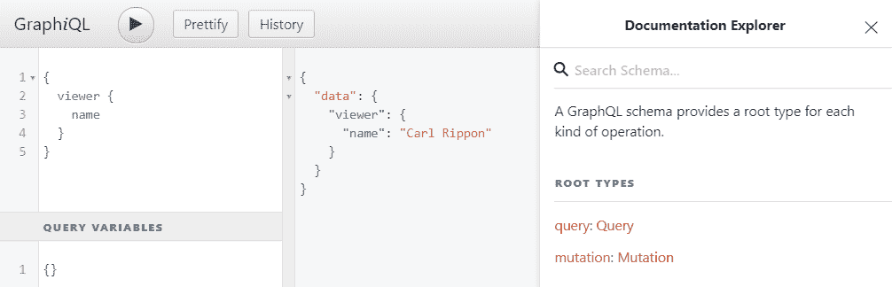
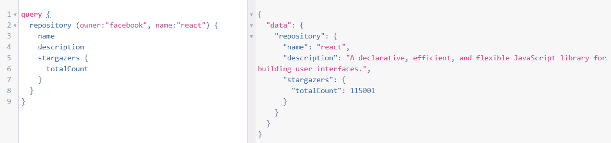
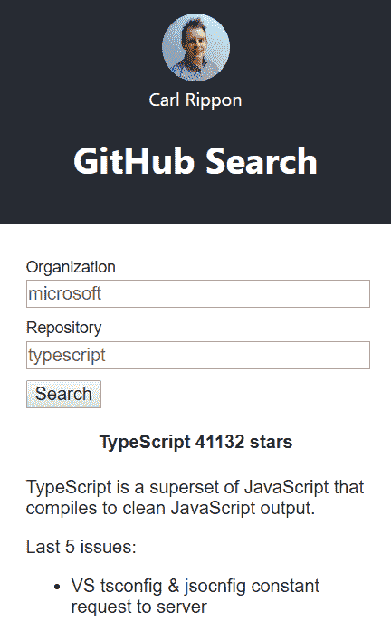
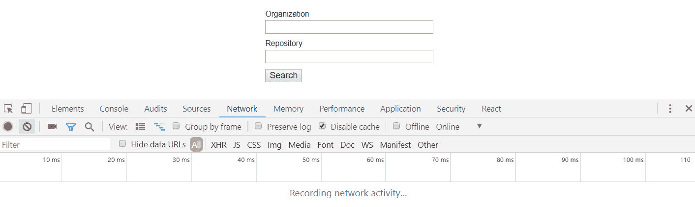
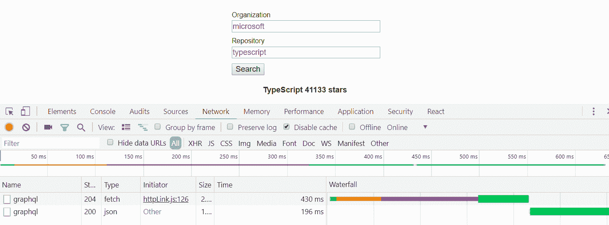

# 与 GraphQLAPI 交互

GraphQL 是一种开源 web API 语言，用于读取和写入 Facebook 维护的数据。它允许客户端精确地指定返回的数据，并在一个请求中请求多个数据区域。这种效率和灵活性使它成为 RESTAPI 的一个引人注目的替代品。GraphQL 还支持读取和写入数据。

在本章中，我们将首先对 GitHub 进行一些 GraphQL 查询实验，以通过使用*GitHub graphqlapi*资源管理器熟悉语法。我们将探讨如何读取和写入 GraphQL 数据，以及如何准确地指定在响应中返回数据的方式。

然后，我们将在 React 和 TypeScript 应用程序中使用 GitHub GraphQL 服务器来构建一个小应用程序，用于搜索 GitHub 存储库并返回有关它的一些信息。我们将使用`axios`上一章的知识与 GitHub GraphQL 服务器进行交互。然后我们将切换到使用 Apollo，这是一个客户端库，可以轻松地与 GraphQL 服务器交互。

本章将介绍以下主题：

*   GraphQL 查询和变异语法
*   将 axios 用作 GraphQL 客户端
*   使用 Apollo GraphQL 客户端
*   在 Apollo 中使用缓存数据

# 技术要求

我们在本章中使用以下技术：

*   **Node.js 和**`npm`：TypeScript 和 React 依赖于这些。我们可以从[安装它们 https://nodejs.org/en/download/](https://nodejs.org/en/download/) 。如果我们已经安装了这些，请确保`npm`至少是 5.2 版

*   **Visual Studio 代码**：我们需要一个编辑器来编写 React 和 TypeScript 代码，可以从[安装 https://code.visualstudio.com/](https://code.visualstudio.com/) 。我们还需要在 VisualStudio 代码中安装 TSLint（由 egamma 编写）和 Prettier（由 Estben Petersen 编写）扩展。

*   **GitHub**：我们需要一个 GitHub 帐户。如果我们没有帐户，可以通过以下链接注册：[https://github.com/join](https://github.com/join) 。

*   **GitHub GraphQL API Explorer**：我们将使用此工具来处理 GraphQL 查询和变体的语法。该工具位于[https://developer.github.com/v4/explorer/](https://developer.github.com/v4/explorer/) 。

All the code snippets in this chapter can be found online at [https://github.com/carlrip/LearnReact17WithTypeScript/tree/master/10-GraphAPIs](https://github.com/carlrip/LearnReact17WithTypeScript/tree/master/10-GraphAPIs).

# GraphQL 查询和变异语法

在本节中，我们将使用 GitHub GraphQL API explorer 开始熟悉与 GraphQL 服务器交互的语法，在下一节中从读取数据开始。

# 读取 GraphQL 数据

为了读取 GraphQL 数据，我们进行了所谓的查询。在本节中，我们将首先介绍基本的 GraphQL 语法，然后讨论如何在查询结果中包含嵌套对象，以及如何通过允许参数传入来创建可重用查询。

# 基本查询

在本节中，我们将使用 GitHub GraphQL API 资源管理器获取有关 GitHub 用户帐户的信息：

1.  让我们在浏览器中打开以下 URL 以打开该工具：

[https://developer.github.com/v4/explorer/](https://developer.github.com/v4/explorer/) 。

如果我们还没有登录到 GitHub 帐户，则需要登录。

2.  在左上角的面板中，让我们输入以下内容并单击执行查询按钮：

```jsx
query { 
  viewer { 
    name
  }
}
```

这是我们的第一个 GraphQL 查询。以下是一些要点：

*   我们用`query`关键字作为查询的前缀。这实际上是可选的。
*   `viewer`是我们想要获取的对象的名称。
*   `name`是`viewer`中我们想要返回的字段

查询结果将显示在右侧：


我们请求的数据作为 JSON 对象返回。JSON 包含一个`data`对象，该对象包含一个包含`name`字段的`viewer`对象。`name`值应该是我们的名称，因为这是存储在我们 GitHub 帐户中的名称。

3.  在结果窗格的右侧有一个文档链接。如果单击此链接，将显示文档资源管理器：



然后点击查询链接，会显示所有可以查询的对象，包括刚才查询的`viewer`。如果我们点击这里，我们会看到`viewer`中所有可用的字段。

4.  我们将`avatarUrl`添加到查询中，因为这是一个额外的字段：

```jsx
query { 
  viewer { 
    name
    avatarUrl
  }
}
```

因此，我们只需在`viewer`对象中添加`avatarUrl`字段，并在`name`和`avatarUrl`字段之间使用回车符。如果执行查询，我们会看到 JSON 结果中添加了`avatarUrl`。这应该是一条通往我们形象的道路。

因此，我们已经看到 GraphQL 是多么灵活，能够精确地指定我们希望在响应中返回哪些字段。在下一节中，我们将通过指定要返回的嵌套对象进一步说明这一点。

# 返回嵌套数据

让我们在本节中进行更复杂的查询。我们将搜索 GitHub 存储库，返回有关它的信息，包括它的星数以及作为嵌套数组提出的最近问题：

1.  让我们首先输入并执行以下查询：

```jsx
query { 
  repository (owner:"facebook", name:"react") {
    name
    description
  }
}
```

这次，我们请求的是`repository`对象，但传递了存储库的`owner`和`name`的两个参数。我们要求返回存储库的`name`和`description`。

我们看到返回了我们请求的存储库和字段：


2.  现在，让我们请求存储库中的星号。为此，我们请求`stargazers`嵌套对象中的`totalCount`字段：

```jsx
query { 
  repository (owner:"facebook", name:"react") {
    name
    description
    stargazers {
 totalCount
 }
  }
}
```

如果执行查询，我们会看到返回的结果：



3.  现在让我们为`stargazers`中的`totalCount`添加一个别名：

```jsx
stargazers {
  stars:totalCount
}
```

如果执行查询，我们会看到根据指定的别名返回星数：

```jsx
{
  "data": {
    "repository": {
      "name": "react",
      "description": "A declarative, efficient, and flexible JavaScript library for building user interfaces.",
      "stargazers": {
        "stars": 114998
      }
    }
  }
}
```

4.  让我们继续请求存储库中的最后一个`5`问题：

```jsx
{ 
  repository (owner:"facebook", name:"react") {
    name
    description
    stargazers {
      stars:totalCount
    }
    issues(last: 5) {
 edges {
 node {
 id
 title
 url
 publishedAt
 }
 }
 }
  }
}
```

我们通过将`5`传递到最后一个参数来请求`issues`对象。然后我们请求一个包含`node`对象的`edges`对象，该对象又包含我们感兴趣的问题字段。

那么，什么是`edges`和`node`对象？为什么我们不能直接请求所需的字段？这个结构是为了方便基于光标的分页

如果我们执行查询，我们将得到结果中包含的最后一个`5`问题。

因此，GraphQL 允许我们对不同的数据位发出一个 web 请求，返回我们所需的字段。使用 GitHub REST API 执行类似的操作可能需要多个请求，并且我们将获得比我们需要的更多的数据。正是这些类型的查询使得 GraphQL 优于 REST。

# 查询参数

我们刚才的查询是硬编码的，用于获取特定存储库的数据。在本节中，我们将在查询中定义变量，这些变量基本上允许向其中传递参数：

1.  我们可以在`query`关键字后面的括号中添加查询变量，以逗号分隔。每个参数都是通过在分号后声明其名称及其类型来定义的。这类似于在带有类型注释的 TypeScript 函数中定义参数。变量名需要加上前缀`$`。类型后面的`!`表示这是必需的。因此，在我们的例子中，这两个变量都是执行查询所必需的。然后可以在查询中引用这些变量，在本例中，查询就是我们请求存储库对象的地方：

```jsx
query ($org: String!, $repo: String!) { 
  repository (owner:$org, name:$repo) {
    ...
  }
}
```

2.  在执行查询之前，我们需要指定变量值。我们在 JSON 对象左下角的查询变量窗格中执行此操作：

```jsx
{
  "org": "facebook",
  "repo": "react"
}
```

3.  如果我们执行查询，我们将得到我们请求的存储库的结果：


我们现在已经习惯于从 GraphQL 服务器读取数据。但我们如何创建新的数据项或更新数据？我们将在下一节中找到答案。

# 写入 GraphQL 数据

现在让我们把注意力转向写入 GraphQL 服务器。我们用所谓的突变来做到这一点。在本节中，我们将创建一个`mutation`来将 GitHub 星形文件添加到存储库中：

1.  为了启动存储库，我们需要存储库`id`。因此，让我们将其添加到我们一直在处理的查询中，以获得以下结果：

```jsx
query ($org: String!, $repo: String!) { 
  repository (owner:$org, name:$repo) {
    id
    ...
  }
}
```

2.  让我们复制结果中返回的`id`。React 存储库的`id`如下所示：

```jsx
MDEwOlJlcG9zaXRvcnkxMDI3MDI1MA==
```

3.  我们现在可以写我们的第一个`mutation`：

```jsx
mutation ($repoId: ID!) {
  addStar(input: { starrableId: $repoId }) {
    starrable {
      stargazers {
        totalCount
      }
    }
  }
}
```

以下是关于`mutation`的一些要点：

*   我们用`mutation`关键字作为变异的前缀
*   我们将要传递的参数放在括号中的`mutation`关键字后面的`mutation`中。在我们的例子中，我们要启动的存储库`id`只有一个参数。
*   `addStar`是我们正在调用的`mutation`函数，它有一个名为`input`的参数，我们需要传递给它。
*   `input`实际上是一个对象，它有一个名为`starrableId`的字段，我们需要包含该字段。这个值是我们想要启动的存储库`id`，因此我们将其设置为我们的存储库`id`变量`$repoId`。
*   在`mutation`参数之后，我们可以指定我们希望在响应中返回的内容。在本例中，我们希望返回存储库中的星号

4.  我们可以在查询变量窗格中为存储库`id`指定参数值：

```jsx
{
  "repoId": "MDEwOlJlcG9zaXRvcnkxMDI3MDI1MA=="
}
```

5.  如果我们执行`mutation`，则该星号将添加到存储库中，并返回新的星号总数：


我们现在已经很好地掌握了 GraphQL 查询和突变。在下一节中，我们将开始从 React 和 TypeScript 应用程序与 GraphQL 服务器交互。

# 将 axios 用作 GraphQL 客户端

与 GraphQL 服务器的交互是通过 HTTP 完成的。我们在[第 9 章](09.html)中了解到*与 Restful API*的交互，`axios`是一个很棒的 HTTP 客户端。因此，在本章中，我们将介绍如何使用`axios`与 GraphQL 服务器交互。

为了帮助我们学习，我们将创建一个 React 和 TypeScript 应用程序来返回有关 GitHub 帐户的信息。因此，我们的首要任务是获取一个令牌，该令牌将使我们能够查询 GitHub GraphQL 服务器并构建一个 React 和 TypeScript 应用程序。

# 获取 GitHub 个人访问令牌

GitHub GraphQL 服务器需要一个承载令牌，以便我们与之交互。那么，让我们来生成一个个人访问令牌：

1.  让我们登录我们的 GitHub 帐户，打开我们的头像下的菜单并选择设置，进入我们的设置页面。
2.  在左边的菜单中，我们需要选择开发者设置选项。这将带我们到开发人员设置页面。
3.  然后，我们可以在左侧菜单中选择 Personal access tokens 选项。
4.  然后，我们将看到一个生成新令牌按钮，我们可以单击该按钮来生成我们的承载令牌。单击按钮后，可能会提示我们输入密码。
5.  在生成令牌之前，要求我们指定作用域。让我们输入一个令牌描述，勾选 repo 和 user，然后单击 Generate token 按钮。
6.  然后生成令牌并显示在页面中，供我们在 React 应用程序中复制和使用。

现在我们有了承载令牌，让我们在下一节构建一个 React 和 TypeScript 应用程序。

# 创建我们的应用程序

我们将遵循构建 React 和 TypeScript 应用程序的常规步骤：

1.  让我们在选择的文件夹中打开 Visual Studio 代码，然后打开终端。让我们输入以下命令来创建新的 React 和 TypeScript 项目：

```jsx
npx create-react-app repo-search --typescript
```

请注意，我们使用的 React 版本至少需要为版本`16.7.0-alpha.0`。我们可以在`package.json`文件中查看。如果`package.json`中 React 的版本小于`16.7.0-alpha.0`，那么我们可以使用以下命令安装此版本：

```jsx
npm install react@16.7.0-alpha.0
npm install react-dom@16.7.0-alpha.0
```

2.  创建项目后，让我们将 TSLint 作为开发依赖项添加到我们的项目中，以及一些与 React 和 Prettier 配合良好的规则：

```jsx
cd repo-search
npm install tslint tslint-react tslint-config-prettier --save-dev
```

3.  现在我们添加一个包含一些规则的`tslint.json`文件：

```jsx
{
  "extends": ["tslint:recommended", "tslint-react", "tslint-config-
   prettier"],
  "rules": {
    "ordered-imports": false,
    "object-literal-sort-keys": false,
    "jsx-no-lambda": false,
    "no-debugger": false,
    "no-console": false,
  },
  "linterOptions": {
    "exclude": [
      "config/**/*.js",
      "node_modules/**/*.ts",
      "coverage/lcov-report/*.js"
    ]
  }
}
```

4.  如果我们打开`App.tsx`，则有一个脱毛错误。那么，让我们通过在`render`方法上添加`public`作为修饰符来解决这个问题：

```jsx
class App extends Component {
  public render() {
    return ( ... );
  }
}
```

5.  现在我们可以使用`npm`安装`axios`：

```jsx
npm install axios
```

6.  在继续开发之前，让我们开始运行我们的应用程序：

```jsx
npm start
```

7.  在`axios`中进行第一次 GraphQL 查询之前，让我们在应用程序中做更多的工作。让我们在`src`目录中创建一个名为`Header.tsx`的新文件，其中包含以下`import`：

```jsx
import React from "react";
import axios from "axios";
```

这个组件最终将包含我们的名字和 GitHub 的化身。

8.  我们暂时不返回`Header`组件中的任何内容：

```jsx
export const Header: React.SFC = () => {
  return null;
}
```

9.  现在让我们回到`App.tsx`并导入我们刚刚创建的`Header`组件：

```jsx
import { Header } from "./Header";
```

10.  我们现在可以在`App.tsx`中调整 JSX，包括我们的`Header`组件：

```jsx
<div className="App">
  <header className="App-header">
    <Header />
  </header>
</div>
```

11.  作为本节的最后一项任务，让我们更改`App.css`中的`App-Header`CSS 类，使标题不那么高：

```jsx
.App-header {
  background-color: #282c34;
  min-height: 200px;
  display: flex;
  flex-direction: column;
  align-items: center;
  justify-content: center;
  font-size: 16px;
  color: white;
}
```

# 查询 GraphQL 服务器

现在我们有了 React 和 TypeScript 项目，让我们使用`axios`进行 GraphQL 查询：

1.  在`Header.tsx`中，我们将首先为 GraphQL 查询响应和其中的查看器数据创建两个接口：

```jsx
interface IViewer {
  name: string;
  avatarUrl: string;
}

interface IQueryResult {
  data: {
    viewer: IViewer;
  };
}
```

2.  让我们在`Header`组件中为`viewer`创建一些状态：

```jsx
const [viewer, setViewer]: [
  IViewer,
  (viewer: IViewer) => void
] = React.useState({name: "", avatarUrl: ""});
```

3.  现在差不多是进行 GraphQL 查询的时候了。我们将在组件刚安装好时执行此操作。我们可以使用`useEffect`功能来实现：

```jsx
React.useEffect(() => {
  // TODO - make a GraphQL query 
}, []);
```

我们传递一个空数组作为第二个参数，以便查询仅在装入组件时执行，而不是在每个渲染上执行。

4.  接下来我们使用`axios`进行 GraphQL 查询：

```jsx
React.useEffect(() => {
  axios
 .post<IQueryResult>(
 "https://api.github.com/graphql",
 {
 query: `query { 
 viewer { 
 name
 avatarUrl
 }
 }`
 }
 )
}, []);
```

请注意，我们正在执行 HTTP`POST`，即使我们正在读取数据。GraphQL 要求我们使用 HTTP`POST`，因为查询的详细信息在请求体中。

对于响应数据，我们还使用了前面使用的接口`IQueryResult`。

5.  如前所述，我们需要在 HTTP 授权头中传递承载令牌。那么，让我们这样做：

```jsx
axios
  .post<IQueryResult>(
    "https://api.github.com/graphql",
    {
      query: `query { 
        viewer { 
          name
          avatarUrl
        }
      }`
    },
    {
 headers: {
 Authorization: "bearer our-bearer-token"
 }
 }
  )
```

显然，我们需要替换之前从 GitHub 获得的真实承载令牌。

6.  我们还没有处理响应，所以让我们这样做并设置`viewer`状态变量：

```jsx
axios
  .post<IQueryResult>(
    ...
  )
  .then(response => {
```

```jsx
 setViewer(response.data.data.viewer);
 });
```

7.  现在我们有了 GraphQL 查询中的状态数据，让我们呈现我们的化身和名称以及我们的应用程序标题：

```jsx
return (
  <div>
 
 <div className="viewer">{viewer.name}</div>
 <h1>GitHub Search</h1>
 </div>
);
```

8.  让我们添加刚才引用到`App.css`中的 avatar CSS 类：

```jsx
.avatar {
  width: 60px;
  border-radius: 50%;
}
```

如果我们查看 running 应用程序，我们会在应用程序标题中看到我们的头像和名称：


因此，我们刚刚使用 HTTP 库与 GraphQL 服务器进行了交互。所有 GraphQL 请求都是使用 HTTP POST 方法发出的，即使是用于读取数据。所有 GraphQL 请求也都向同一端点发出。我们想要从中获取数据的资源不在 URL 中，它在请求正文中。因此，虽然我们可以使用 HTTP 库（如`axios`）来查询 GraphQL 服务器，但感觉有点奇怪。

在下一节中，我们将介绍一个 GraphQL 客户端，它将帮助我们以更自然的方式查询 GraphQL 服务器。

# 使用 Apollo GraphQL 客户端

Apollo 客户端是一个用于与 GraphQL 服务器交互的客户端库。与使用像`axios`这样的通用 HTTP 库相比，它有很多好处，例如能够在 JSX 中使用 React 组件以声明方式读取和写入数据，并且能够立即打开缓存

在本节中，我们将使用`axios`重构上一节中构建的应用程序，以使用 Apollo，然后进一步扩展我们的应用程序，以包括 GitHub 存储库搜索

# 安装 Apollo 客户端

我们的第一项工作是在我们的项目中安装阿波罗。

1.  要将 Apollo 客户端添加到我们的项目中，让我们通过`npm`安装以下软件包：

```jsx
npm install apollo-boost react-apollo graphql
```

*   `apollo-boost`包含设置阿波罗客户所需的一切
*   `react-apollo`包含我们将用于与 GraphQL 服务器交互的 React 组件
*   `graphql`是我们将用于解析 GraphQL 查询的核心包

2.  我们还将为`graphql`安装一些 TypeScript 类型：

```jsx
npm install @types/graphql --save-dev
```

3.  我们需要确保 TypeScript 在编译代码时包含了`es2015`和`esNext`库。那么，让我们在`tsconfig.json`中添加以下`lib`字段：

```jsx
{
  "compilerOptions": {
    "target": "es5",
    "lib": ["es2015", "dom", "esnext"],
    ...
  },
  ...
}
```

我们现在已经准备就绪，可以开始与 Apollo 的 GitHub GraphQL 服务器进行交互。

# 从 axios 迁移到 Apollo

现在我们已经安装了所有的 Apollo 部件，让我们将`axios`代码迁移到 Apollo。

# 添加 Apollo 提供者

我们将从`App.tsx`开始，在`App.tsx`中我们将定义我们的阿波罗客户机，并*将*提供给组件层次结构中`App`下的所有组件：

1.  在`App.tsx`中，我们将`apollo-boost`与`react-apollo`中的`ApolloProvider`组件一起导入：

```jsx
import ApolloClient from "apollo-boost";
import { ApolloProvider } from "react-apollo";
```

2.  在`App`类组件上方，让我们创建`ApolloClient`：

```jsx
const client = new ApolloClient({
  uri: "https://api.github.com/graphql",
  headers: {
    authorization: `Bearer our-bearer-token`
  }
});
```

显然，我们需要替换之前从 GitHub 获得的真实承载令牌。

3.  最后一步是使用`ApolloProvider`组件将我们创建的`ApolloClient`提供给我们应用程序中的所有其他组件。我们将`ApolloProvider`作为根组件，并将`ApolloClient`对象传递给它：

```jsx
public render() {
  return (
    <ApolloProvider client={client}>
      <div className="App">
        <header className="App-header">
          <Header />
        </header>
      </div>
    </ApolloProvider>
  );
}
```

既然`ApolloClient`已经设置好，我们就可以开始与 GraphQL 服务器交互了。

# 使用查询组件查询 GraphQL

我们现在将使用`Query`组件获取我们的 GitHub 名称和化身，替换`axios`代码：

1.  让我们先删除`axios`导入语句，而不是进行以下导入：

```jsx
import gql from "graphql-tag";
import { Query } from "react-apollo";
```

2.  我们的`IViewer`界面将保持不变，但我们需要稍微调整`IQueryResult`界面：

```jsx
interface IQueryResult {
  viewer: IViewer;
}
```

3.  接下来我们将定义 GraphQL 查询：

```jsx
const GET_VIEWER = gql`
  {
    viewer {
      name
      avatarUrl
    }
  }
`;
```

因此，我们将查询设置为一个`GET_VIEWER`变量，并在模板文本中定义了我们的查询。然而，模板文本前面的`gql`函数有点奇怪。模板文字不应该放在括号中吗？这实际上被称为标记的模板文本，其中核心 GraphQL 库中的`gql`函数解析它旁边的模板文本。最后我们在`GET-VIEWER`中找到了阿波罗可以使用和执行的查询。

4.  我们现在开始定义查询。我们可以使用`react-apollo`中的`Query`组件直接在 JSX 中定义查询。但是，为了增加一些类型安全性，我们将创建一个名为`GetViewerQuery`的新组件，该组件继承自`Query`，并将结果类型定义为通用参数：

```jsx
class GetViewerQuery extends Query<IQueryResult> {}
```

5.  我们不再需要任何状态，所以我们可以删除`viewer`和`setViewer`变量
6.  我们还可以删除进行`axios`查询的`useEffect`函数调用，因为我们现在要在 JSX 中进行查询。
7.  那么，让我们使用`GetViewerQuery`组件来调用我们的查询：

```jsx
return (
  <GetViewerQuery query={GET_VIEWER}>
    {({ data }) => {
      if (!data || !data.viewer) {
        return null;
      }
      return (
        <div>
          
          <div className="viewer">{data.viewer.name}</div>
          <h1>GitHub Search</h1>
        </div>
      );
    }}
  </GetViewerQuery>
);
```

*   我们传递前面在`query`属性中创建的查询的`GetViewerQuery`组件。
*   查询结果在`GetViewerQuery`的子函数中返回
*   children 函数参数包含一个对象，该对象包含`data`属性中的数据。我们将这些数据分解为一个`data`变量。
*   如果没有任何数据，我们会提前逃跑并返回`null`。
*   如果我们有数据，那么我们将返回引用`data`属性的化身和名称的 JSX。

If we look at our running app, it should look exactly the same as the `axios` version. We may need to `npm start` the app again if it's showing an error.

8.  我们还可以从 children 函数参数中获得其他信息。一条有用的信息是数据是否正在加载。让我们使用它来显示加载消息：

```jsx
return (
  <GetViewerQuery query={GET_VIEWER}>
    {({ data, loading }) => {
      if (loading) {
 return <div className="viewer">Loading ...</div>;
 }
      ...
    }}
  </GetViewerQuery>
);
```

9.  我们可以从 children 函数参数中获得的另一个有用的信息是有关已发生错误的信息。如果存在以下错误消息，我们将使用它来显示错误消息：

```jsx
return (
  <GetViewerQuery query={GET_VIEWER}>
    {({ data, loading, error }) => {
      if (error) {
 return <div className="viewer">{error.toString()}</div>;
 }
      ...
    }}
  </GetViewerQuery>
);
```

这个阿波罗的实现非常优雅。`Query`组件如何在组件生命周期的正确点发出 web 请求，并允许我们向组件树的其余部分提供数据，这一点很聪明。

在下一节中，我们将继续使用 Apollo 增强我们的应用程序。

# 添加存储库搜索组件

在本节中，我们将添加一个组件来搜索 GitHub 存储库并返回有关它的一些信息：

1.  让我们首先创建一个名为`RepoSearch.tsx`的新文件，其中包含以下导入：

```jsx
import * as React from "react";
import gql from "graphql-tag";
import { ApolloClient } from "apollo-boost";
```

2.  我们将把`ApolloClient`作为道具。因此，让我们为其添加一个接口：

```jsx
interface IProps {
  client: ApolloClient<any>;
}
```

3.  接下来，我们将为组件搭建脚手架：

```jsx
const RepoSearch: React.SFC<IProps> = props => {
  return null;
}

export default RepoSearch;
```

4.  让我们在`App`组件中引用它，现在在`App.tsx`中，首先导入它：

```jsx
import RepoSearch from "./RepoSearch";
```

5.  我们现在可以在传入`ApolloClient`的应用程序标题下添加：

```jsx
<ApolloProvider client={client}>
  <div className="App">
    <header className="App-header">
      <Header />
    </header>
    <RepoSearch client={client} />
  </div>
</ApolloProvider>
```

我们的存储库`search`组件现在设置得很好。在下一节中，我们可以实现一个搜索表单。

# 实现搜索表单

让我们实现一个搜索表单，允许用户提供组织名称和存储库名称：

1.  回到`RepoSearch.tsx`，我们开始定义搜索字段的状态，从界面开始：

```jsx
interface ISearch {
  orgName: string;
  repoName: string;
}
```

2.  现在我们可以创建一个变量来保存我们的`search`状态，以及一个函数来设置它：

```jsx
const RepoSearch: React.SFC<IProps> = props => {
  const [search, setSearch]: [
 ISearch,
 (search: ISearch) => void
 ] = React.useState({
 orgName: "",
 repoName: ""
 });

  return null;
}
```

3.  让我们在 JSX 中定义`search`表单：

```jsx
return (
  <div className="repo-search">
    <form onSubmit={handleSearch}>
      <label>Organization</label>
      <input
        type="text"
        onChange={handleOrgNameChange}
        value={search.orgName}
      />
      <label>Repository</label>
      <input
        type="text"
        onChange={handleRepoNameChange}
        value={search.repoName}
      />
      <button type="submit">Search</button>
    </form>
  </div>
);
```

我们引用了一些尚未实现的位。所以，我们将逐一实施。

4.  让我们添加我们在`App.css`中引用的`repo-search`类。我们还将设置标签和输入以及搜索按钮的样式：

```jsx
.repo-search {
  margin: 30px auto;
  width: 300px;
  font-family: Arial;
  font-size: 16px;
  text-align: left;
}

.repo-search label {
  display: block;
  margin-bottom: 3px;
  font-size: 14px;
}

.repo-search input {
  display: block;
  margin-bottom: 10px;
  font-size: 16px;
  color: #676666;
  width: 100%;
}

.repo-search button {
  display: block;
  margin-bottom: 20px;
  font-size: 16px;
}
```

5.  接下来，让我们实现只更新`search`状态的输入更改处理程序：

```jsx
const handleOrgNameChange = (e: React.ChangeEvent<HTMLInputElement>) => {
  setSearch({ ...search, orgName: e.currentTarget.value });
};

const handleRepoNameChange = (e: React.ChangeEvent<HTMLInputElement>) => {
  setSearch({ ...search, repoName: e.currentTarget.value });
};
```

6.  我们需要实现的最后一位是`search`处理程序：

```jsx
const handleSearch = (e: React.FormEvent<HTMLFormElement>) => {
  e.preventDefault();

  // TODO - make GraphQL query
};
```

我们在事件参数上调用`preventDefault`以停止发生完全回发。

这就是开始的搜索表单。我们将在下一节中实现 GraphQL 查询。

# 实现搜索查询

现在，我们需要进行 GraphQL 查询以进行实际搜索：

1.  让我们首先为我们希望从查询中获得的存储库数据创建一个接口：

```jsx
interface IRepo {
  id: string;
  name: string;
  description: string;
  viewerHasStarred: boolean;
  stargazers: {
    totalCount: number;
  };
  issues: {
    edges: [
      {
        node: {
          id: string;
          title: string;
          url: string;
        };
      }
    ];
  };
}
```

这是我们在前面一节中从 GitHub GraphQL 资源管理器获得的结构。

2.  我们需要此状态的默认值。那么，让我们定义一下：

```jsx
const defaultRepo: IRepo = {
  id: "",
  name: "",
  description: "",
  viewerHasStarred: false,
  stargazers: {
    totalCount: 0
  },
  issues: {
    edges: [
      {
        node: {
          id: "",
          title: "",
          url: ""
        }
      }
    ]
  }
};
```

3.  我们还可以为整个查询结果定义一个接口：

```jsx
interface IQueryResult {
  repository: IRepo;
}
```

4.  现在，我们可以使用标记的模板文本创建查询本身：

```jsx
const GET_REPO = gql`
  query GetRepo($orgName: String!, $repoName: String!) {
    repository(owner: $orgName, name: $repoName) {
      id
      name
      description
      viewerHasStarred
      stargazers {
        totalCount
      }
      issues(last: 5) {
        edges {
          node {
            id
            title
            url
            publishedAt
          }
        }
      }
    }
  }
`;
```

这是我们在前面一节的 GitHub GraphQL 资源管理器中进行的查询。与前面的查询不同，这个查询有一些参数，稍后执行查询时需要包含这些参数。

5.  我们需要将从查询中获得的数据存储在 state 中。那么，让我们创建一个名为`repo`的状态变量，以及一个设置它的函数：

```jsx
const [repo, setRepo]: [
    IRepo,
    (repo: IRepo) => void
  ] = React.useState(defaultRepo);
```

6.  我们还将把`search`的任何问题存储在状态中：

```jsx
const [searchError, setSearchError]: [
  string,
  (searchError: string) => void
] = React.useState("");
```

7.  在执行`search`之前，让我们更新`handleSearch`箭头函数以清除任何搜索错误状态：

```jsx
const handleSearch = (e: React.FormEvent<HTMLFormElement>) => {
  e.preventDefault();

  setSearchError("");
};
```

8.  让我们继续使用作为道具传入的`ApolloClient`进行查询：

```jsx
const handleSearch = (e: React.FormEvent<HTMLFormElement>) => {
  e.preventDefault();

  setSearchError("");

  props.client
 .query<IQueryResult>({
 query: GET_REPO
 });
};
```

9.  不过，这里还有更多的工作要做。首先，我们需要根据我们在`search`状态下的值传入组织名称和存储库名称的`query`参数：

```jsx
.query<IQueryResult>({
  query: GET_REPO,
  variables: { orgName: search.orgName, repoName: search.repoName }
})
```

10.  现在是时候用`then`方法处理响应，并将`repo`状态设置为响应中的数据：

```jsx
props.client
  .query<IQueryResult>( ... )
  .then(response => {
 setRepo(response.data.repository);
 });
```

11.  我们还将处理`catch`方法中的任何错误，并更新`searchError`状态：

```jsx
props.client
  .query<IQueryResult>(...)
  .then(...)
  .catch(error => {
 setSearchError(error.message);
 });
```

如果我们在正在运行的应用程序中尝试一个`search`，查询将正常进行，但我们尚未显示结果。让我们在下一节中这样做。

# 呈现搜索结果

让我们呈现从存储库查询中获得的数据：

1.  如果我们有搜索结果，让我们在`search`表单下呈现存储库名称及其星号和描述：

```jsx
return (
  <div className="repo-search">
    <form ...>
      ...
    </form>
    {repo.id && (
 <div className="repo-item">
 <h4>
 {repo.name}
 {repo.stargazers ? ` ${repo.stargazers.totalCount}
           stars` : ""}
 </h4>
 <p>{repo.description}</p>
 </div>
 )}
  </div>
);
```

2.  我们还将呈现最后一个`5`存储库问题：

```jsx
...
<p>{repo.description}</p>
<div>
 Last 5 issues:
 {repo.issues && repo.issues.edges ? (
 <ul>
 {repo.issues.edges.map(item => (
 <li key={item.node.id}>{item.node.title}</li>
 ))}
 </ul>
 ) : null}
</div>
```

3.  如果出现问题，让我们呈现在以下状态中捕获的错误消息：

```jsx
{repo.id && (
  ...
)}
{searchError && <div>{searchError}</div>}
```

4.  让我们在`App.css`中为搜索结果中存储库的标题添加一点 CSS：

```jsx
.repo-search h4 {
  text-align: center;
}
```

如果我们搜索存储库，现在应该可以看到有关呈现的存储库的信息：



我们现在可以轻松地使用 Apollo 查询 GraphQL 服务器。在下一节中，我们将讨论突变。

# 用阿波罗实现一个变异

让我们允许用户在我们的应用程序中启动 GitHub 存储库。这将包括通过阿波罗发送`mutation`：

1.  首先，我们从`react-apollo`导入`Mutation`组件：

```jsx
import { Mutation } from "react-apollo";
```

2.  现在让我们创建`mutation`。这与我们之前在 GitHub GraphQL 资源管理器中执行的查询相同：

```jsx
const STAR_REPO = gql`
  mutation($repoId: ID!) {
    addStar(input: { starrableId: $repoId }) {
      starrable {
        stargazers {
          totalCount
        }
      }
    }
  }
`;
```

3.  在 JSX 中，在我们呈现描述的地方，让我们放置`Mutation`组件：

```jsx
<p>{repo.description}</p>
<div>
 {!repo.viewerHasStarred && (
 <Mutation
 mutation={STAR_REPO}
 variables={{ repoId: repo.id }}
 >
 {() => (
 // render Star button that invokes the mutation when 
           clicked
 )}
 </Mutation>
 )}
</div> <div>
  Last 5 issues:
  ...
</div>
```

*   我们只在`viewer`尚未在存储库中加星号的情况下渲染`mutation`
*   `Mutation`组件接受我们刚刚定义的变异以及变量，在我们的例子中，这就是存储库`id`

4.  `Mutation`组件有一个子函数，允许我们访问`addStar`函数。那么，让我们渲染一颗星星吧！单击时调用`addStar`的按钮：

```jsx
<Mutation
    ...
  >
    {(addStar) => (
      <div>
 <button onClick={() => addStar()}>
 Star!
 </button>
 </div>
    )}
  </Mutation>
)}
```

5.  `Mutation`组件还通过子函数第二个参数中的`loading`属性告诉我们何时执行`mutation`。让我们使用此选项禁用按钮并通知用户正在添加星形：

```jsx
<Mutation
  ...
>
  {(addStar, { loading }) => (
    <div>
      <button disabled={loading} onClick={() => addStar()}>
        {loading ? "Adding ..." : "Star!"}
      </button>
    </div>
  )}
</Mutation>
```

6.  `Mutation`组件还告诉我们何时出现错误。因此，让我们使用此选项并在出现错误时渲染错误：

```jsx
<Mutation
  ...
>
  {(addStar, { loading, error }) => (
    <div>
      <button ...>
        ...
      </button>
      {error && <div>{error.toString()}</div>}
    </div>
  )}
</Mutation>
```

如果我们尝试向存储库中添加一个星形，那么应该成功添加该星形。我们可以访问[GitHub.com](http://github.com)中的 GitHub 存储库来验证这一点。

所以，现在我们已经实现了查询和`mutation`了，我们真的开始着手解决 Apollo。不过，有一件事有点奇怪，我们可能已经发现了。启用存储库后，应用程序中的星级数不会更新。即使我们再次搜索存储库，星星的数目也是我们开始之前的数目。但是，如果我们刷新浏览器并再次搜索存储库，我们会得到正确的星号。那么，这是怎么回事？我们将在下一节中找到答案。

# 在 Apollo 中使用缓存数据

我们以一点神秘感结束了最后一节。为什么我们在启动存储库`search`后，不获取存储库中最新的星星数？答案是 Apollo 在初始`search`之后缓存存储库数据。当执行相同的查询时，它从缓存中获取结果，而不是从 GraphQL 服务器获取数据。

让我们再次确认情况是否如此：

1.  让我们转到我们的应用程序，打开“网络”选项卡上的“开发人员工具”，清除以前的任何请求：



2.  让我们搜索一下。我们将看到对 GitHub GraphQL 服务器的几个请求：



3.  在开发者工具的“网络”选项卡下，让我们清除请求，然后在应用程序中再次单击搜索按钮。我们将看到，不会发出任何网络请求，但会呈现数据。因此，数据必须来自本地缓存。

因此，我们使用`apollo-boost`配置的`ApolloClient`自动将查询缓存在内存缓存中。在下一节中，我们将学习如何清除缓存，以便我们的应用程序在存储库挂起星星后显示正确的星星数。

# 使用 refetchQueries 清除缓存

我们需要一种在`mutation`发生后清除缓存查询结果的方法。一种方法是在`Mutation`组件上使用`refetchQueries`道具：

1.  让我们试一试。`refetchQueries`道具接收一个包含查询的对象数组，该查询具有应从缓存中删除的相应变量值：

```jsx
<Mutation
  mutation={STAR_REPO}
  variables={{ repoId: repo.id }}
  refetchQueries={[
 {
 query: GET_REPO,
 variables: {
 orgName: search.orgName,
 repoName: search.repoName
 }
 }
 ]}
>
  ...
</Mutation>
```

2.  如果我们现在启动存储库，则不会立即更新启动数。但是，如果按下“搜索”按钮，则会更新星号。

因此，缓存已被清除，但体验仍然不理想。理想情况下，我们希望星星的数量在星星出现后立即更新！按钮被点击。

如果我们仔细考虑一下刚才所做的事情，就会试图绕过缓存。然而，缓存已经到位，可以帮助我们的应用程序运行良好。

所以，这种方法感觉不太好。用户体验仍然不理想，我们刚刚降低了应用程序的性能。一定有更好的办法！在下一节中，我们将探讨一种不同的方法。

# 突变后更新缓存

让我们再一次思考这个问题：

*   我们在缓存中有一些关于存储库的信息，其中包括它拥有的星数。
*   当我们在存储库中设置星号时，我们希望看到星号的数量增加了一个。
*   如果我们可以将缓存中的星星数增加一个呢？这有望解决问题。

那么，让我们试一试，在`mutation`完成后更新缓存：

1.  首先，让我们移除上一节中实现的`refetchQueries`道具。
2.  在`Mutation`组件上有一个`update`道具，我们可以利用它来更新缓存。那么，让我们开始实施以下内容：

```jsx
<Mutation
  mutation={STAR_REPO}
  update={cache => {
 // Get the cached data 
 // update the cached data
 // update our state 
 }}
>
  ...
</Mutation>
```

3.  因此，我们需要实现一个箭头函数，该函数更新作为参数可用的缓存：

```jsx
<Mutation
  ...
  update={cache => {
 const data: { repository: IRepo } | null = cache.readQuery({
 query: GET_REPO,
 variables: {
 orgName: search.orgName,
 repoName: search.repoName
 }
 });
 if (data === null) {
 return;
 }
 }}
>
  ...
</Mutation>
```

因此，缓存有一个`readQuery`函数，我们可以使用它来获取缓存的数据。如果在缓存中找不到数据，那么我们可以退出该函数而不做任何其他操作。

4.  因此，现在我们有了缓存中的数据，我们可以增加星星的数量。为此，我们创建一个新对象，将缓存存储库中的道具分散到该对象中，并使用递增的星号数和查看器已在存储库中加星号的事实覆盖该对象：

```jsx
update={cache => {
  ...
  if (data === null) {
    return;
  }
  const newData = {
 ...data.repository,    viewerHasStarred: true,
 stargazers: {
 ...data.repository.stargazers,
 totalCount: data.repository.stargazers.totalCount + 1
 }
 };
}}
```

5.  然后，我们可以使用其`writeQuery`功能更新缓存。我们通过变量值和要存储在缓存中的新数据传入查询：

```jsx
update={cache => {
  ...
  const newData = {
    ...
  };
 cache.writeQuery({
 query: GET_REPO,
 variables: {
 orgName: search.orgName,
 repoName: search.repoName
 },
 data: { repository: newData }
 });
}}
```

6.  还有一项工作要做，那就是更新`repo`状态，以便屏幕上的星星数立即更新：

```jsx
update={cache => {
  ...
  cache.writeQuery(...);
  setRepo(newData);
}}
```

应该是这样。如果我们再次尝试在我们的应用程序中启动存储库，我们应该看到启动数立即增加。

缓存是 Apollo 提供给我们的开箱即用的强大功能之一。`Mutation`组件上的`update`道具为我们提供了更新缓存的精确方法。`Mutation`组件上的`refetchQueries`道具是一种更为繁重、效率更低的强制更新缓存的方法。

# 总结

GraphQL 优于 REST，因为它允许我们以所需的形式高效地获取所需的数据，而所需的工作量要少得多。GitHub GraphQL 资源管理器是熟悉语法的好工具。我们可以向 GraphQL 服务器发出两种主要类型的请求：

*   我们可以执行一个`query`来读取数据
*   我们可以执行`mutation`来写入数据

查询允许我们在响应中指定所需的对象和字段。我们可以使用别名来重命名它们。我们可以通过定义变量来参数化查询。我们可以给出变量类型，并在末尾用`!`指定是否需要每个变量。我们在本章中没有介绍一些查询功能，例如有条件地包含字段和强大的分页功能。总之，它是一种非常强大的查询语言！

突变与查询具有一些相同的特性，例如能够将参数传递给它们。我们如何控制响应中包含的数据也很好。

GraphQL 通过 HTTP 操作，HTTP`POST`请求指向单个 URL。HTTP 正文包含查询或`mutation`信息。我们可以使用 HTTP 客户机与 GraphQL 服务器交互，但是使用 Apollo 这样的库可能会更高效，它是专门为与 GraphQL 服务器交互而构建的。

React Apollo 是一组与核心 Apollo 库一起工作的 React 位和片段。它为我们提供了很好的`Query`和`Mutation`React 组件，用于在 JSX 中包含查询和突变，使我们的代码更易于阅读。在使用这些组件之前，我们需要使用指向 GraphQL 服务器的 URL 和任何凭据设置`ApolloClient`对象。我们还需要在我们的组件树中包含一个`ApolloProvider`组件，首先是需要 GraphQL 数据的所有组件。

当我们使用`apollo-boost`构建项目时，缓存是开箱即用的。`Mutation`组件为我们提供`update`和`refetchQueries`道具来管理缓存更新。

总而言之，GraphQL 是一种非常高效的与后端交互的方式，它与 React 和 TypeScript 应用程序配合得非常好。

所以，到目前为止，我们已经在这本书中学习了 React 和 TypeScript 的许多不同方面。我们还没有涉及到的一个重要话题是如何对我们构建的应用程序进行可靠的测试。我们将在下一章介绍这一点

# 问题

让我们试着回答一些问题，以测试我们对刚刚学到的知识的了解：

1.  在 GitHub GraphQL 资源管理器中，创建一个查询以返回 React 项目中最后五个打开的问题。在响应中返回问题标题和 URL。
2.  增强最后一个查询，并将返回的问题数设置为一个参数，并将此默认值设置为 5。
3.  在 GitHub GraphQL 资源管理器中创建一个`mutation`来取消星型存储库的启动。`mutation`应该将所需的存储库`id`作为参数。
4.  GraphQL 查询进入 HTTP 请求的哪一部分？
5.  GraphQL`mutation`进入 HTTP 请求的哪一部分？
6.  如何使`react-apollo``Query`组件类型的响应安全？
7.  当您使用`react-boost`构建项目时，默认情况下是启用还是禁用缓存？
8.  我们可以在`Mutation`组件上使用什么道具来更新本地缓存？

# 进一步阅读

以下链接是有关 GraphQL 以及 React 和 Apollo 的更多信息的良好资源：

*   GraphQL 文档位于[https://graphql.org/learn/](https://graphql.org/learn/)
*   阿波罗博士在[https://www.apollographql.com/docs/](https://www.apollographql.com/docs/)
*   阿波罗文件的反应部分位于[https://www.apollographql.com/docs/react/](https://www.apollographql.com/docs/react/)