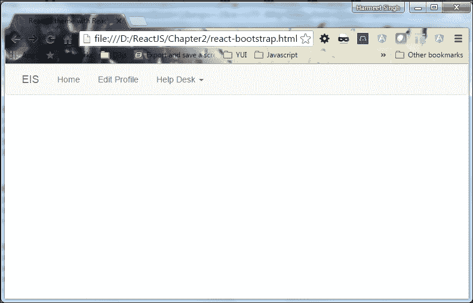
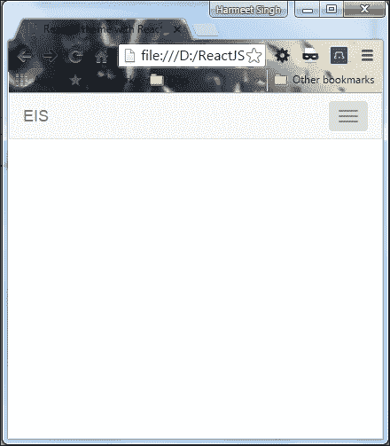
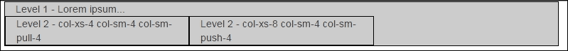

# 第二章。让我们用 React 引导和 React 构建一个响应主题

现在，您已经使用 ReactJS 和 Bootstrap 完成了第一个 web 应用程序，我们将使用这两个框架为您的应用程序构建第一个响应主题。我们还将讨论这两个框架的全部潜力。那么，让我们开始吧！

# 设置

首先，我们需要创建一个类似于我们在[第 1 章](01.html "Chapter 1. Getting Started with React and Bootstrap")*React and Bootstrap 入门*中制作的 Hello World 应用程序的文件夹结构。

以下屏幕截图描述了文件夹结构：


现在您需要将 ReactJS 和引导文件从`chapter1`复制到`Chapter2`的重要目录中，并在根目录中创建一个`index.html`文件。下面的代码片段只是一个基本 HTML 页面，其中包括引导和反应。

以下是我们 HTML 页面的标记：

```jsx
<!doctype html>
<html lang="en">
    <head>
        <meta charset="utf-8">
        <title>ReactJS theme with bootstrap</title>
        <link rel="stylesheet" href="css/bootstrap.min.css">
        <script type="text/javascript" src="js/react.min.js">
        </script>
        <script type="text/javascript" src="js/react-dom.min.js">
        </script>
        <script src="js/browser.min.js"></script>
    </head>
    <body>
    </body>
</html>

```

# 脚手架

现在我们对基本文件和文件夹结构进行了排序。下一步是开始使用引导 CSS 构建我们的应用程序。

我肯定你有一个问题：什么是脚手架？简单地说，它提供了一个支撑结构，使您的基础混凝土。

除此之外，我们将使用 React 引导 JS，其中我们为 React 重建了一组引导组件。我们可以在**员工信息系统**（**EIS**中使用这些。Bootstrap 还包括一个非常强大的响应网格系统，它帮助我们为应用程序创建响应主题布局/模板/结构。

# 导航

导航是任何静态或动态页面的一个非常重要的元素。现在我们将构建一个导航栏（用于导航）来在页面之间切换。它可以放在我们页面的顶部。

以下是引导导航的基本 HTML 结构：

```jsx
<nav className="navbar navbar-default navbar-static-top" role="navigation">
    <div className="container">
        <div className="navbar-header">
            <button type="button" className="navbar-toggle"
            data-toggle="collapse" data-target=".navbar-collapse">
            <span className="sr-only">Toggle navigation</span>
            <span className="icon-bar"></span>
            <span className="icon-bar"></span>
            <span className="icon-bar"></span>
            </button>
            <a className="navbar-brand" href="#">EIS</a>
        </div>
        <div className="navbar-collapse collapse">
            <ul className="nav navbar-nav">
                <li className="active"><a href="#">Home</a></li>
                <li><a href="#">Edit Profile</a></li>
                <li className="dropdown">
                    <a href="#" className="dropdown-toggle"
                    data-toggle="dropdown">Help Desk 
                    <b className="caret"></b></a>
                    <ul className="dropdown-menu">
                        <li><a href="#">View Tickets</a></li>
                        <li><a href="#">New Ticket</a></li>
                    </ul>
                </li>
            </ul>
        </div>
    </div>
</nav>

```

用于保存`navbar`中所有内容的`<nav>`标签被分为两部分：`navbar-header`和`navbar-collapse`，如果您看到导航结构的话。导航条是响应灵敏的组件，`navbar-header`元素专门用于移动导航，并通过`toggle`按钮控制导航的扩展和折叠。按钮上的 `data-target`属性直接对应于 `navbar-collapse`元素的`id` 属性，因此 Bootstrap 知道应该在移动设备中包装哪些元素来控制切换。

现在我们还需要在页面中包含 jQuery，因为 Bootstrap 的 JS 依赖于它。您可以从[获取最新的 jQuery 版本 http://jquery.com/](http://jquery.com/) 。现在，您需要从 Bootstrap extracted 文件夹复制`bootstrap.min.js`并将其添加到您的应用程序 `js`目录中，并将其包含在您的页面`bootstrap.min.js`之前。

请确保您的 JavaScript 文件按以下顺序包含：

```jsx
<script type="text/javascript" src="js/react.min.js"></script> 
<script type="text/javascript" src="js/react-dom.min.js"></script> 
<script src="js/browser.min.js"></script> 
<script src="js/jquery-1.10.2.min.js"></script> 
<script src="js/bootstrap.min.js"></script>
```

让我们在集成后快速查看一下 ToeT00.组件代码：

```jsx
<div id="nav"></div>
<script type="text/babel">
    var navbarHTML = 
      <nav className="navbar navbar-default navbar-static-top"
      role="navigation">
      <div className="container">
        <div className="navbar-header">
        <button type="button" className="navbar-toggle"
        data-toggle="collapse" data-target=".navbar-collapse">
          <span className="sr-only">Toggle navigation</span>
          <span className="icon-bar"></span>
          <span className="icon-bar"></span>
          <span className="icon-bar"></span>
        </button>
        <a className="navbar-brand" href="#">EIS</a>
        </div>
        <div className="navbar-collapse collapse">
        <ul className="nav navbar-nav">
          <li className="active"><a href="#">Home</a></li>
          <li><a href="#">Edit Profile</a></li>
          <li className="dropdown">
          <a href="#" className="dropdown-toggle"
          data-toggle="dropdown">Help Desk <b className="caret">
          </b></a>
          <ul className="dropdown-menu">
            <li><a href="#">View Tickets</a></li>
            <li><a href="#">New Ticket</a></li>
          </ul>
          </li>
        </ul>
        </div>
      </div>
      </nav>
      ReactDOM.render(navbarHTML,document.getElementById('nav'));
</script> 

```

在浏览器中打开`index.html`文件以查看`navbar`组件。以下屏幕截图显示了我们的导航外观：


我们在`<body>`标签中直接加入了导航功能，以覆盖整个浏览器。现在，我们将使用 React-Bootstrap JS 框架做同样的事情，以了解 Bootstrap JS 和 React-Bootstrap JS 之间的区别。

# 反应自举

React 引导 JavaScript 框架类似于为 React 重建的引导。这是 React 中引导前端可重用组件的完整重新实现。React Bootstrap 不依赖于任何其他框架，例如 Bootstrap JS 或 jQuery。这意味着，如果您使用的是 React 引导，那么您不需要将 jQuery 作为依赖项包含在项目中。使用 React 引导，我们可以确保不会有外部 JavaScript 调用来呈现可能与`ReactDOM.render`不兼容的组件。但是，您仍然可以实现与 Twitter 引导程序相同的功能、外观和感觉，但代码要干净得多。

## 安装 React 引导程序

要获得此 React 引导，我们可以直接使用 CDN，也可以从以下 URL 获取：[https://cdnjs.cloudflare.com/ajax/libs/react-bootstrap/0.29.5/react-bootstrap.min.js](https://cdnjs.cloudflare.com/ajax/libs/react-bootstrap/0.29.5/react-bootstrap.min.js) 。打开此 URL 并将其保存在本地目录中，以提高性能。下载该文件时，请确保将源映射（`react-bootstrap.min.js.map`文件与之一起下载，以便于调试。下载完成后，将该库添加到应用程序的`js`目录中，并将其包含在页面的`head`部分，如下面的代码片段所示。您的`head`部分将如下所示：

```jsx
<script type="text/javascript" src="js/react.min.js"></script> 
<script type="text/javascript" src="js/react-dom.min.js"></script> 
<script src="js/browser.min.js"></script> 
<script src="js/react-bootstrap.min.js"></script> 

```

## 使用 React 引导

现在，您可能想知道，既然我们已经有了引导文件，而且我们还添加了 React 引导 JS 文件，它们会不会相互冲突？不，他们不会。React 引导与现有引导样式兼容，所以我们不需要担心任何冲突。

现在我们将在 React 引导中创建相同的`Navbar`组件。

这里是 React Bootstrap 中`Navbar`组件的结构：

```jsx
var Nav= ReactBootstrap.Nav;
var Navbar= ReactBootstrap.Navbar;
var NavItem= ReactBootstrap.NavItem;
var NavDropdown = ReactBootstrap.NavDropdown;
var MenuItem= ReactBootstrap.MenuItem;
var navbarReact =(
<Navbar>
    <Navbar.Header>
        <Navbar.Brand>
            <a href="#">EIS</a>
        </Navbar.Brand>
        <Navbar.Toggle />
    </Navbar.Header>
    <Navbar.Collapse>
        <Nav>
            <NavItem eventKey={1} href="#">Home</NavItem>
            <NavItem eventKey={2} href="#">Edit Profile</NavItem>
            <NavDropdown eventKey={3}  id="basic-
            nav-dropdown">
                <MenuItem eventKey={3.1}>View Tickets</MenuItem>
                <MenuItem eventKey={3.2}>New Ticket</MenuItem>
            </NavDropdown>
        </Nav>
    </Navbar.Collapse>
</Navbar>
); 

```

下面是前面代码的重点部分（顺序从上面的“福利”部分下方更改）。

`<Navbar>`标签是组件的容器，分为两部分： `<Navbar.Header>`和 `<Nav>`。

对于响应行为，我们添加了控制扩展和折叠的 `<Navbar.Toggle/>`标记，并将`<Nav>`包装到 `<Navbar.Collapse>`中以显示和隐藏导航项目。

为了捕捉事件，我们使用了 `eventKey={1}`；当我们选择任何菜单项时，将触发一个回调，该回调包含两个参数，（`eventKey: any`、`event: object`=>、 `any`

## React 引导的好处

让我们看看使用 React 引导的好处。

正如您在前面的代码中所看到的，它看起来比 Twitter 引导组件更干净，因为我们可以从 React 引导导入单个组件，而不是包含整个库。

例如，如果我想用 Twitter 引导构建一个`navbar`，那么代码结构是：

```jsx
<nav class="navbar navbar-default">
    <div class="container-fluid">
        <div class="navbar-header">
            <button type="button" class="navbar-toggle collapsed"
            data-toggle="collapse" data-target="#bs-example-navbar-
            collapse-1" aria-expanded="false">
            <span class="sr-only">Toggle navigation</span>
            <span class="icon-bar"></span>
            <span class="icon-bar"></span>
            <span class="icon-bar"></span>
            </button>
            <a class="navbar-brand" href="#">EIS</a>
        </div>
        <div class="collapse navbar-collapse" id="bs-example-
        navbar-collapse-1">
            <ul class="nav navbar-nav">
                <li class="active"><a href="#">Home <span class=
                "sr-only">(current)</span></a></li>
                <li><a href="#">Edit Profile</a></li>
            </ul>
            <form class="navbar-form navbar-left" role="search">
                <div class="form-group">
                    <input type="text" class="form-control"
                    placeholder="Search">
                </div>
                <button type="submit" class="btn
                btn-default">Submit</button>
            </form>
        </div>
        <!-- /.navbar-collapse -->
    </div>
    <!-- /.container-fluid -->
</nav>
```

现在比较代码很容易，我相信，您也会同意使用 React 引导，因为它非常特定于组件，而在 Twitter 引导中，我们需要以正确的顺序维护多个元素，以获得类似的结果。

通过这样做，React Bootstrap 只提取我们想要包含的特定组件，并帮助显著减少应用程序包的大小。React Bootstrap 提供以下某些好处：

*   React 引导程序通过压缩引导程序代码节省了一点输入并减少了 bug
*   它通过压缩引导代码来减少冲突
*   我们不需要考虑 Bootstrap 和 React 采用的不同方法
*   它很容易使用
*   它封装在元素中
*   它使用 JSX 语法
*   它避免了虚拟 DOM 的反应式渲染
*   检测 DOM 更改和更新 DOM 很容易，没有任何冲突
*   它不依赖于其他库，比如 jQuery

下面是我们`Navbar`组件的完整代码视图：

```jsx
<div id="nav"></div>
<script type="text/babel">
var Nav= ReactBootstrap.Nav;
var Navbar= ReactBootstrap.Navbar;
var NavItem= ReactBootstrap.NavItem;
var NavDropdown = ReactBootstrap.NavDropdown;
var MenuItem= ReactBootstrap.MenuItem;
var navbarReact =(
    <Navbar>
        <Navbar.Header>
        <Navbar.Brand>
            <a href="#">EIS</a>
        </Navbar.Brand>
        <Navbar.Toggle />
        </Navbar.Header>
        <Navbar.Collapse>
            <Nav>
            <NavItem eventKey={1} href="#">Home</NavItem>
            <NavItem eventKey={2} href="#">Edit Profile</NavItem>
            <NavDropdown eventKey={3}  id="basic-
            nav-dropdown">
                <MenuItem eventKey={3.1}>View Tickets</MenuItem>
                <MenuItem eventKey={3.2}>New Ticket</MenuItem>
            </NavDropdown>
            </Nav>
        </Navbar.Collapse>
    </Navbar>
    );
    ReactDOM.render(navbarReact,document.getElementById('nav')); 

```

呜呼！让我们看看浏览器中的第一个反应引导组件。以下屏幕截图显示了组件的外观：



现在检查`Navbar`，如果您调整浏览器窗口的大小，您会注意到 Bootstrap 在纵向模式下显示移动标题，切换按钮低于平板电脑 768 px 的屏幕大小。但是，如果单击按钮切换导航，则可以看到移动设备的导航。

以下屏幕截图显示了移动导航的外观：



现在我们对 React Bootstrap 和 Bootstrap 有了主要的了解。React Bootstrap 在适当的位置进行了积极的开发工作，以保持其更新。

# 自举网格系统

Bootstrap 基于一个 12 列网格系统，其中包括一个强大的响应结构和一个移动的 first fluid 网格系统，该系统允许我们用很少的元素构建我们的 web 应用程序。在 Bootstrap 中，我们有一系列预定义的类来组成行和列，因此在开始之前，我们需要在`container`类中包含`<div>`标记来包装行和列。否则，框架将不会像预期的那样响应，因为 Bootstrap 已经编写了依赖于它的 CSS，我们需要将它添加到我们的`navbar`下面：

```jsx
<div class="container"><div> 

```

这将使您的 web 应用程序成为页面的中心，并控制行和列按预期的方式响应。

有四个类前缀有助于定义列的行为。所有类别都与不同的设备屏幕大小相关，并以熟悉的方式进行反应。下表摘自[http://getbootstrap.com/](http://getbootstrap.com/) 定义了所有四个类别之间的差异：

<colgroup><col> <col></colgroup> 
|   | 

**超小型设备**

**手机（<768px）**

 | 

**小型设备**

**片剂(≥768px）**

 | 

**媒体设备**

**台式机(≥992px）**

 | 

**大型设备**

**台式机(≥1200px）**

 |
| --- | --- | --- | --- | --- |
| **网格行为** | **始终水平** | **折叠开始，水平高于断点** |
| **集装箱宽度** | 无（自动） | 750 像素 | 970px | 1170px |
| **类前缀** | 上校 xs- | 山猫上校- | 上校医学博士- | L.上校- |
| **#列数** | 12 |   |   |   |
| **列宽** | 汽车 | ~62px | ~81px | ~97px |
| **天沟宽度** | 30px（柱每侧 15px） |   |   |   |
| **可嵌套** | 对 |   |   |   |
| **偏移量** | 对 |   |   |   |
| **栏目排序** | 对 |   |   |   |

在我们的应用程序中，我们需要为主要内容区域和侧边栏创建两列布局。正如我们所知，Bootstrap 有一个 12 列的网格布局，因此以覆盖整个区域的方式划分内容。

### 提示

请理解，Bootstrap 使用`col-*-1`到`col-*-12`类划分 12 列网格。

我们将把这 12 列分为两部分：一部分是 9 列的主要内容，另一部分是 3 列的侧边栏。听起来很完美。下面是我们如何实现的。

首先我们需要在我们的`container`中包含`<div>`标记，并将`class`添加为`"row"`。根据设计需要，我们可以有很多带有`row`等级的`div`标签，每个房子最多可以有 12 根柱子。

```jsx
<div class="container"> 
    <div class="row"> 
    </div> 
<div> 

```

众所周知，如果我们想在移动设备上堆叠专栏，我们应该使用`col-sm-`前缀。创建列非常简单，只需使用所需的前缀并附加希望添加到其中的列数。

让我们来看看如何创建一个双栏布局：

```jsx
<div class="container">
    <div class="row">
        <div class="col-sm-3">
            Column Size 3 for smaller devices
        </div>
        <div class="col-sm-9">
            Column Size 9 for smaller devices
        </div>
    </div>
</div>

```

如果我们希望我们的列不仅仅用于较小的设备，还可以通过在列中添加`col-md-*`和`col-xs-*`来使用额外的中小型网格类：

```jsx
<div class="container"> 
    <div class="row"> 
<div class="col-xs-12 col-md-4"> 

```

在移动视图中，此列为全宽，在平板电脑视图中，此列为四个中等网格宽度。

```jsx
</div> 
<div class="col-xs-12 col-md-8"> 
In mobile view, this column will be full width and in tablet view, it will be eight medium grid width.</div> 
</div> 
</div> 

```

因此，当它显示在比移动设备更大的屏幕上时，Bootstrap 将自动在每列（每侧 15 像素）之间添加 30 像素的间距（两个元素之间的间距）。如果我们想在列之间添加额外的空格，Bootstrap 将提供一种方法，只需向列添加额外的类：

```jsx
<div class="container"> 
<div class="row"> 
<div class="col-xs-12 col-md-7 col-md-offset-1"> 

```

移动设备中的列为一个全宽，另一个半宽，左侧有更多空间：

```jsx
        </div> 
    </div> 
</div> 

```

所以这次我们使用了`offset`关键字。该类名末尾的数字用于控制要偏移的列数。

### 提示

`offset`列计数等于行中`12`列的总数。

现在，让我们创建一些包含嵌套的其他行和列的复杂布局：

```jsx
<div class="row">
    <div class="col-sm-9">
        Level 1 - Lorem ipsum...
        <div class="row">
            <div class="col-xs-8 col-sm-4">
                Level 2 - Lorem ipsum...   
            </div>
            <div class="col-xs-4 col-sm-4">
                Level 2 - Lorem ipsum...
            </div>
        </div>
    </div>
</div>

```

如果您在浏览器中打开它，您将看到这将在我们之前创建的主内容容器`col-sm-9`中创建两列。然而，由于网格是嵌套的，我们可以创建一个新行并拥有一列或两列，无论您的布局需要什么。我添加了一些虚拟文本来演示嵌套列。

Bootstrap 还提供了通过使用`col-md-push-*`和`col-md-pull-*`类来更改网格系统中列的顺序的选项。

```jsx
<div class="row">
    <div class="col-sm-9">
        Level 1 - Lorem ipsum...
        <div class="row">
            <div class="col-xs-8 col-sm-4 col-sm-push-4">
                Level 2 - col-xs-8 col-sm-4 col-sm-push-4   
            </div>
            <div class="col-xs-4 col-sm-4 col-sm-pull-4">
                Level 2 - col-xs-8 col-sm-4 col-sm-pull4      
            </div>
        </div>
    </div>
</div>

```

观察以下屏幕截图：



Bootstrap 还包括一些预定义的类，以便能够以特定的屏幕大小显示或隐藏元素。这些类使用与引导网格相同的预定义大小。

例如，以下内容将隐藏特定屏幕大小的元素：

```jsx
<div class="hidden-md"></div> 

```

这将在中型设备上隐藏该元素，但在手机、平板电脑和大型台式机上仍然可见。要在多个设备上隐藏元素，我们需要使用多个类：

```jsx
<div class="hidden-md hidden-lg"></div> 

```

同样，可见类也是如此，它们以相反的方式工作，以特定的大小显示元素。

但是，与隐藏类不同，它们还需要我们设置显示值。这可以是`block`、`inline`或`inline-block`：

```jsx
<div class="visible-md-block"></div> 
<div class="visible-md-inline"></div> 
<div class="visible-md-inline-block"></div> 

```

当然，我们可以在一个元素中使用各种类。例如，如果我们希望在较小的屏幕上显示一个`block`级别的元素，但后来它变成了`inline-block`，我们将使用以下代码：

```jsx
<div class="visible-sm-block visible-md-inline-block"></div> 

```

如果你记不起不同的类大小，一定要再看一看*进入引导的网格*部分，了解屏幕大小。

# 助手类

Bootstrap 还包括一些帮助器类，我们可以使用它们来调整布局。让我们来看看一些例子。

## 浮动

浮动引导类将帮助您在 web 上创建一个良好的布局。这里有两个引导类可以左右拉动元素：

```jsx
<div class="pull-left">...</div> 
<div class="pull-right">...</div> 

```

当我们在元素上使用浮动时，我们需要将浮动的元素包装在`clearfix`类中。这将清除元素，您将能够看到容器元素的实际高度：

```jsx
<div class="helper-classes"> 
    <div class="pull-left">...</div> 
    <div class="pull-right">...</div> 
    <div class="clearfix"> 
</div> 

```

如果`float`类直接位于具有`row`类的元素中，那么我们的浮动将通过引导自动清除，`clearfix`类不需要手动应用。

## 中心元素

为了使其成为块级元素的中心，Bootstrap 允许使用`center-block`类：

```jsx
<div class="center-block">...</div> 

```

这会将您的元素属性`margin-left`和`margin-right`属性设置为`auto`，这将使元素居中。

## 展示和隐藏

您可能希望使用 CSS 显示和隐藏元素，Bootstrap 为您提供了几个类来实现这一点：

```jsx
<div class="show">...</div> 
<div class="hidden">...</div> 

```

### 注

`show`类将`display`属性设置为`block`，因此仅将其应用于`block-level`元素，而不应用于您希望显示的`inline`或`inline-block`元素。

# 反应组分

React 基于模块化构建，封装组件可管理其自身的状态，以便在数据更改时高效地更新和呈现组件。在 React 中，组件的逻辑是用 JavaScript 编写的，而不是模板，因此您可以轻松地通过应用程序传递丰富的数据，并管理 DOM 之外的状态。

使用`render()`方法，我们在 React 中呈现一个组件，该组件获取输入数据并返回您想要显示的内容。它可以接受 HTML 标记（字符串）或 React 组件（类）。

让我们来看看这两个例子：

```jsx
var myReactElement = <div className="hello" />; 
ReactDOM.render(myReactElement, document.getElementById('example')); 

```

在本例中，我们将 HTML 作为字符串传递到在创建`<Navbar>`之前使用的`render`方法中：

```jsx
var ReactComponent = React.createClass({/*...*/}); 
var myReactElement = <ReactComponent someProperty={true} />; 
ReactDOM.render(myReactElement, document.getElementById('example')); 

```

在前面的示例中，我们呈现组件，只是为了创建一个以大写约定开头的局部变量。在 React 的 JSX 中使用大小写约定将区分本地组件类和 HTML 标记。

因此，我们可以通过两种方式创建 React 元素或组件：或者我们可以将普通 JavaScript 与`React.createElement`一起使用，或者 React 的 JSX。

因此，让我们为应用程序创建侧边栏元素，以便更好地理解`React.createElement`。

## React.createElement（）

在 React 中使用 JSX 对于创建 React 应用程序是完全可选的。如我们所知，我们可以创建带有`React.createElement`的元素，该元素包含三个参数：标记名或组件、属性对象和数量可变的子元素（可选）。遵守以下代码：

```jsx
var profile = React.createElement('li',{className:'list-group-item'},
'Profile'); 

var profileImageLink = React.createElement('a',{className:'center-
block text-center',href:'#'},'Image'); 

    var profileImageWrapper = React.createElement('li',
    {className:'list-group-item'}, profileImageLink); 

    var sidebar = React.createElement('ul', { className: 'list-
    group' }, profile, profileImageWrapper); 

    ReactDOM.render(sidebar, document.getElementById('sidebar')); 

```

在前面的示例中，我们使用了`React.createElement`来生成`ul`-`li`结构。React 已经有了用于常见 DOM HTML 标记的内置工厂。

以下是一个例子：

```jsx
var Sidebar = React.DOM.ul({ className: 'list-group' }, 
React.DOM.li({className:'list-group-item text-muted'},'Profile'), 
React.DOM.li({className:'list-group-item'}, 
React.DOM.a({className:'center-block text-center',href:'#'},'Image') 
    ), 
React.DOM.li({className:'list-group-item text-right'},'2.13.2014', 
React.DOM.span({className:'pull-left'}, 
React.DOM.strong({className:'pull-left'},'Joining Date') 
    ), 
    React.DOM.div({className:'clearfix'}) 
));                                  
ReactDOM.render(Sidebar, document.getElementById('sidebar'));
```

让我们快速浏览一下浏览器中的代码，它应该类似下面的截图：


以下是我们迄今为止编写的包含`<Navbar>`组件的完整代码：

```jsx
<script type="text/babel">
    var Nav= ReactBootstrap.Nav;
    var Navbar= ReactBootstrap.Navbar;
    var NavItem= ReactBootstrap.NavItem;
    var NavDropdown = ReactBootstrap.NavDropdown;
    var MenuItem= ReactBootstrap.MenuItem;
    var navbarReact =(
    <Navbar>
    <Navbar.Header>
    <Navbar.Brand>
      <a href="#">EIS</a>
    </Navbar.Brand>
    <Navbar.Toggle />
    </Navbar.Header>
    <Navbar.Collapse>
    <Nav>
    <NavItem eventKey={1} href="#">Home</NavItem>
    <NavItem eventKey={2} href="#">Edit Profile</NavItem>
    <NavDropdown eventKey={3}  id="basic-
    nav-dropdown">
      <MenuItem eventKey={3.1}>View Tickets</MenuItem>
      <MenuItem eventKey={3.2}>New Ticket</MenuItem>
    </NavDropdown>
    </Nav>
    </Navbar.Collapse>
    </Navbar>
    );
    ReactDOM.render(navbarReact,document.getElementById('nav'));

    var Sidebar = React.DOM.ul({ className: 'list-group' },
     React.DOM.li({className:'list-group-item text-muted'},'Profile'),
     React.DOM.li({className:'list-group-item'},
      React.DOM.a({className:'center-block
      text-center',href:'#'},'Image')
      ),
    React.DOM.li({className:'list-group-item text-right'},
    '2.13.2014',
    React.DOM.span({className:'pull-left'},
    React.DOM.strong({className:'pull-left'},'Joining Date')
    ),
      React.DOM.div({className:'clearfix'})
    ));            
    ReactDOM.render(Sidebar, document.getElementById('sidebar'));

</script>
<div id="nav"></div>
<div class="container">
    <hr>
    <div class="row">
        <div class="col-sm-3" id="sidebar">
            <!--left col-->
        </div>
        <!--/col-3-->
        <div class="col-sm-9 profile-desc"></div>
        <!--/col-9-->
    </div>
</div>
<!--/row-->

```

我们的应用程序代码看起来很混乱。现在是时候让我们的代码干净、结构合理了。

将`navbar`代码复制到另一个文件中并保存为`navbar.js`。

现在将`sidebar`代码复制到另一个文件中并另存为`sidebar.js`。

在根目录中创建一个包含组件名称的文件夹，并在其中复制`navbar.js`和`sidebar.js`。

在你的`head`部分包括`js`文件。

`head`部分将如下所示：

```jsx
<script type="text/javascript" src="js/react.min.js"></script> 
<script type="text/javascript" src="js/react-dom.min.js"></script> 
<script src="js/browser.min.js"></script> 
<script src="js/jquery-1.10.2.min.js"></script> 
<script src="js/react-bootstrap.min.js"></script> 
<script src="components/navbar.js" type="text/babel"></script> 
<script src="components/sidebar.js" type="text/babel"></script> 

```

这是您的 HTML 代码：

```jsx
<div id="nav"></div>
<div class="container">
    <hr>
    <div class="row">
        <div class="col-sm-3" id="sidebar">
            <!--left col-->
        </div>
        <!--/col-3-->
        <div class="col-sm-9 profile-desc"></div>
        <!--col-9-->
    </div>
</div>
<!--/row--> 

```

现在我们的代码看起来更干净了。让我们快速浏览一下浏览器中的代码输出：


### 提示

当我们从外部源引用 ReactJS 文件时，我们需要一个 web 服务器或完整的堆栈应用程序，如 WAMP 或 XAMPP，因为某些浏览器（例如 Chrome）将无法加载该文件，除非它通过 HTTP 提供服务。

# 总结

从本章中，我们已经掌握了有关引导和 React 引导的大量基础知识，因此，让我们快速复习一下我们目前所学的内容。

在浏览引导和 React 引导的定义和使用时，我们发现 React 引导是一个非常强大的候选者，具有更大的灵活性和更智能的解决方案。

我们已经了解了如何通过使用 Bootstrap 和 React Bootstrap 的一些功能来创建移动导航，它们在所有预期的设备以及桌面浏览器上都能很好地工作。

我们还研究了强大的响应网格系统，包括 Bootstrap，并创建了一个简单的两列布局。在进行此操作时，我们了解了四种不同的列类前缀以及网格嵌套。

我们还看到了 Bootstrap 的一些非常好的特性，例如`offset`、`col-md-push-*`、`col-md-pull-*`、`hidden-md`、`hidden-lg`、`visible-sm-block`、`visible-md-inline-block`和`helper-classes`。

我们希望您也准备好响应布局和导航。现在让我们跳到下一章。