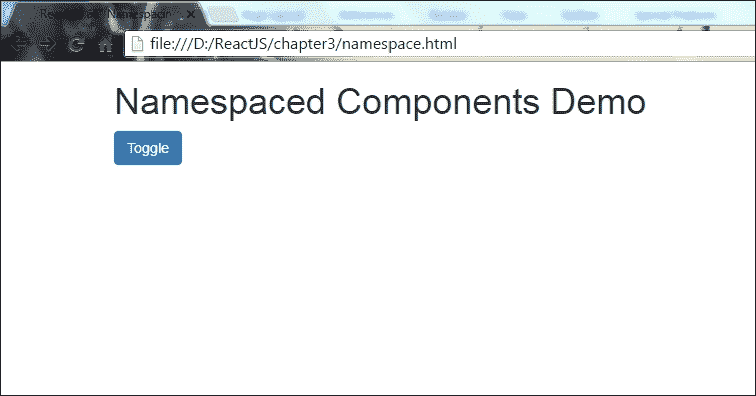
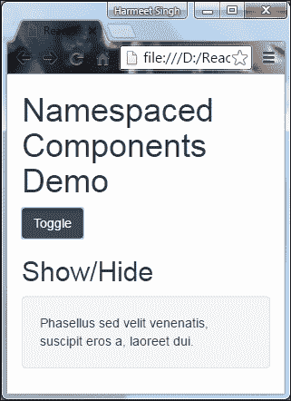

# 三、ReactJS JSX

在上一章中，我们通过 React Bootstrap和 React 完成了构建响应主题的过程。我们看到了它的例子以及 Twitter Bootstrap和 React Bootstrap之间的区别。

我现在非常激动，因为我们将研究 ReactJS 的核心，即 JSX。各位准备好了吗？让我们深入了解 ReactJS JSX。

# React中的 JSX 是什么

JSX 是 JavaScript 语法的扩展，如果您观察 JSX 的语法或结构，就会发现它类似于 XML 编码。

使用 JSX，您可以执行将 XML 语法添加到 JavaScript 的预处理器足迹。虽然您当然可以在不使用 JSX 的情况下使用 React，但 JSX 使 React 更加整洁和优雅。与 XML 类似，JSX 标记具有标记名、属性和子级，如果属性值包含在引号中，则该值将成为字符串。

XML 使用平衡的开始和结束标记。JSX 的工作原理与此类似，它也比 JavaScript 函数和对象更容易读取和理解大量结构。

## 在 React 中使用 JSX 的优点

以下列出了一些优点：

*   与 JavaScript 函数相比，JSX 非常容易理解和思考
*   JSX 的标记对于非程序员来说更为熟悉
*   通过使用 JSX，您的标记变得更加语义化、组织化和重要

## 如何让你的代码整洁干净

正如我前面所说的，结构/语法非常容易可视化/注意到，当我们将其与 JavaScript 语法进行比较时，它旨在使 JSX 格式的代码更加清晰易懂。

下面是一些简单的代码片段，它们将为您提供一个清晰的概念。让我们在呈现时查看以下 JavaScript 语法示例中的代码片段：

```jsx
render: function () {
    return React.DOM.div({className:"divider"},
        "Label Text",
        React.DOM.hr()
    );
}  

```

遵守以下 JSX 语法：

```jsx
render: function () { 
    return <div className="divider"> 
    Label Text<hr /> 
</div>; 
} 

```

我假设现在很清楚，对于通常不习惯处理编码的程序员来说，JSX 确实很容易理解，他们可以像执行 HTML 语言一样学习和执行它。

# 认识还是理解

在开发领域，UI 开发人员、用户体验设计师和质量保证人员对任何编程语言都不是很熟悉，但 JSX 提供了一个简单的语法结构，在视觉上类似于 HTML 结构，从而简化了他们的工作。

JSX 展示了一条路径，以一种坚实而简洁的方式，通过你的思维来指示和观察结构。

# 语义/结构化语法

到目前为止，我们已经看到 JSX 语法是如何容易理解和可视化的，原因是语义语法结构。

JSX 将 JavaScript 代码转换为更标准的解决方案，从而清晰地设置语义语法和重要组件。在 JSX 语法的帮助下，您可以用信息声明自定义组件的结构，就像在 HTML 语法中那样，这将提供将语法转换为 JavaScript 函数的魔力。

`React.DOM`名称空间在 ReactJS 的帮助下帮助我们使用所有 HTML 元素：这不是一个惊人的特性吗！此外，好的方面是您可以在`React.DOM`名称空间的帮助下编写自己的命名组件。

请查看以下简单 HTML 标记以及 JSX 组件如何帮助您进行语义标记：

```jsx
<div className="divider"> 
<h2>Questions</h2><hr /> 
</div> 

```

正如您在前面的示例中所看到的，我们用带有`className="divider"`的`<div>`标记来包装`<h2>Questions</h2><hr />`。因此，在 React composite 组件中，您可以创建类似的结构，这与使用语义语法进行 HTML 编码一样简单：

```jsx
 <Divider> Questions </Divider>

```

让我们详细了解复合组件是什么，以及如何构建它。

# 复合材料构件

众所周知，您可以使用 JSX 标记和 JSX 语法创建自定义组件，并将组件转换为 JavaScript 语法组件。

让我们设置 JSX：

```jsx
<script type="text/javascript" src="js/react.min.js"></script> 
<script type="text/javascript" src="js/react-dom.min.js"></script> 
<script src="js/browser.min.js"></script> 
<script src="js/divider.js" type="text/babel"></script>

```

在 HTML 中包括以下文件：

```jsx
<div>
    <Divider>...</Divider>
    <p>...</p>
</div>

```

在`<body>`部分添加此 HTML。

现在，我们都准备好使用 JSX 定义自定义组件，因为我们已经准备好处理 JSX 文件了。

要创建自定义组件，我们必须将下面提到的 HTML 标记表示为 React 自定义组件。您只需按照给定的示例执行包装的语法/代码，在呈现之后，它将返回预期的标记结果。`Divider.js`文件将包含：

```jsx
var Divider = React.createClass({ 
    render: function () { 
        return ( 
            <div className="divider"> 
                <h2>Questions</h2><hr /> 
            </div> 
        ); 
    } 
}); 

```

如果您想将子节点附加到组件中，那么可以在 React JSX 中实现。在前面的代码中，您可以看到我们创建了一个名为`divider`的变量，在 React JSX 的帮助下，我们可以将其用作 HTML 标记，就像我们使用定义的 HTML 标记一样，如`<div>`、`<span>`等等。您还记得我们在前面的示例中使用了以下标记吗？如果没有，那么请再次参考前面的主题，因为它将消除您的疑虑。

```jsx
<Divider>Questions</Divider> 

```

在 HTML 语法中，子节点在数组中的打开和关闭标记之间捕获，您可以在组件的`props`（属性）中设置。

在本例中，我们将使用`this.props.children`=`["Questions"]`，其中`this.props.children`是 React 的方法：

```jsx
var Divider = React.createClass({ 
    render: function () { 
        return ( 
            <div className="divider"> 
                <h2>{this.props.children}</h2><hr /> 
            </div> 
        ); 
    } 
}); 

```

正如我们在前面的示例中所看到的，我们可以像在任何 HTML 编码中那样创建具有打开和关闭标记的组件：

```jsx
<Divider>Questions</Divider>
```

我们将得到如下预期输出：

```jsx
<div className="divider"> 
    <h2>Questions</h2><hr /> 
</div> 

```

# 名称空间组件

命名空间组件是 React JSX 中可用的另一个特性请求。我知道您会有一个问题：什么是名称空间组件？好的，让我解释一下。

我们知道 JSX 只是 JavaScript 语法的扩展，它还提供了使用名称空间的能力，所以 React 使用的是 JSX 名称空间模式，而不是 XML 名称空间。通过使用标准 JavaScript 语法方法（即对象属性访问），此功能对于直接将组件分配为`<Namespace.Component/>`非常有用，而不是将变量分配给访问存储在对象中的组件。

让我们先看一下下面的显示/隐藏示例，以清楚了解命名空间组件：

```jsx
var MessagePanel = React.createClass({ 
    render: function() { 
        return <div className='collapse in'> {this.props.children} </div> 
  } 
}); 
var MessagePanelHeading = React.createClass({ 
  render: function() { 
    return <h2>{this.props.text}</h2>} 
}); 

var MessagePanelContent = React.createClass({ 
  render: function() { 
    return <div className='well'> {this.props.children} </div> 
  } 
}); 

```

从下面的示例中，我们将看到如何组合一个`MessagePanel`：

```jsx
<MessagePanel> 
<MessagePanelHeading text='Show/Hide' /> 
<MessagePanelContent> 
     Phasellus sed velit venenatis, suscipit eros a, laoreet dui. 
</MessagePanelContent> 
</MessagePanel> 

```

`MessagePanel`是同意在用户界面中呈现消息的组件。

它主要有两个部分：

*   `MessagePanelHeading`：显示消息的标题/标题
*   `MessagePanelContent`：这是留言的内容

有一种更健康的方式可以通过*命名*孩子来创作`MessagePanel`。这可以通过将子组件作为父组件上的属性来实现。

让我们看看如何做到这一点：

```jsx
var MessagePanel = React.createClass({ 
    render: function() { 
        return <div className='collapse in'>    
        {this.props.children} </div> 
    } 
}); 

MessagePanel.Heading = React.createClass({ 
    render: function() { 
        return <h2>{this.props.text}</h2> 
    } 
}); 

MessagePanel.Content = React.createClass({ 
    render: function() { 
        return <div className='well'> {this.props.children} </div> 
} 
}); 

```

因此，在前面的代码片段中，您可以看到我们是如何通过添加新的 React 组件`Heading`和`Content`来扩展`MessagePanel`。

现在，让我们看看当我们引入名称空间符号时，组合是如何变化的：

```jsx
<MessagePanel> 
    <MessagePanel.Heading text='Show/Hide' /> 
    <MessagePanel.Content> 
    Phasellus sed velit venenatis, suscipit eros a, laoreet dui. 
    </MessagePanel.Content> 
</MessagePanel>
```

现在，我们将看到在与Bootstrap程序集成后命名空间组件代码的实际示例：

```jsx
<!doctype html>
<html>
    <head>
        <title>React JS – Namespacing component</title>
            <link rel="stylesheet" href="css/bootstrap.min.css">
            <link rel="stylesheet" href="css/custom.css">
        <script type="text/javascript" src="js/react.min.js"></script>
        <script type="text/javascript" src="js/JSXTransformer.js">
        </script>
    </head>
    <script type="text/jsx">
    /** @jsx React.DOM */
    var MessagePanel = React.createClass({
        render: function() {
            return <div className='collapse in'> {this.props.children}
            </div>
        }
    });

    MessagePanel.Heading = React.createClass({
        render: function() {
            return <h2>{this.props.text}</h2>
        }
    });

    MessagePanel.Content = React.createClass({
        render: function() {
            return <div className='well'> {this.props.children} </div>
        }
    });

    var MyApp = React.createClass({
        getInitialState: function() {
            return {
                collapse: false
            };
        },
        handleToggle: function(evt){
            var nextState = !this.state.collapse;
            this.setState({collapse: nextState});
        },

        render: function() {
            var showhideToggle = this.state.collapse ?
            (<MessagePanel>
            <MessagePanel.Heading text='Show/Hide' />
            <MessagePanel.Content>
                Phasellus sed velit venenatis, suscipit eros a,
                laoreet dui.
            </MessagePanel.Content>
            </MessagePanel>)
            : null;
            return (<div>
                <h1>Namespaced Components Demo</h1>
                <p><button onClick={this.handleToggle} className="btn
                btn-primary">Toggle</button></p>
                {showhideToggle}
                </div>)
            }
        });

        React.render(<MyApp/>, document.getElementById('toggle-
        example'));
    </script>
    </head>
    <body>
        <div class="container">
            <div class="row">
                <div id="toggle-example" class=”col-sm-12”>
                </div>
            </div>
        </div>
    </body>
</html>

```

让我解释一下前面的代码：

*   `State`属性包含我们组件的`setState`和`getInitialState`设置的状态
*   `setState(changes)`方法将给定的更改应用于此状态并重新呈现
*   `handleToggle`函数处理组件的状态，并返回布尔值`true`或`false`

我们还使用了一些Bootstrap类来提供组件的外观：

*   `.collapse`：用于隐藏内容。
*   `.collapse.in`：用于显示内容。
*   `.well`：用于内容周围的背景、边框和间距。
*   `.btn .btn-primary`：这是按钮的外观和感觉。Bootstrap 还为您提供了一些具有不同颜色样式的不同类，帮助读者提供视觉指示：
    *   `.btn-default`、`.btn-success`、`.btn-info`、`.btn-warning`、`.btn-danger`和`.btn-link`。
*   我们可以使用`<a>`、`<button>`或`<input>`元素。
*   `.col-sm-12`：这是为了让您的组件在小屏幕上响应。

现在，让我们在浏览器中打开 HTML 并查看输出：



现在调整屏幕大小并查看其外观：



看起来太棒了！

## JSX 变压器

**JSXTTransformer**是在浏览器中编译 JSX 的另一个工具。在读取代码时，浏览器将读取您提到的`<script>`标记中的`attribute type="text/jsx"`，并且它将仅转换具有提到的`type`属性的脚本，然后它将执行您在该文件中编写的脚本或函数。代码的执行方式与服务器上执行的`react-tools`相同。访问[https://facebook.github.io/react/blog/2015/06/12/deprecating-jstransform-and-react-tools.html](https://facebook.github.io/react/blog/2015/06/12/deprecating-jstransform-and-react-tools.html) 了解更多信息。

当前版本的 React 中不推荐使用 JSXTTransformer，但您可以在任何提供的 CDN 和 Bower 上找到当前版本。根据我的意见，最好使用**巴别塔回复**（[https://babeljs.io/repl/#?babili=false &evaluate=true&lineWrap=false&presets=es2015%2Creact%2Cstage-2&代码=](https://babeljs.io/repl/#?babili=false&evaluate=true&lineWrap=false&presets=es2015%2Creact%2Cstage-2&code=)编译 JavaScript 的工具。它已经被 React 和更广泛的 JavaScript 社区采用。

### 注

此示例不适用于最新版本的 React。请使用较旧的版本，如 0.13，因为 JSXTTransformer 已被弃用，并由 Babel 取代，以便在浏览器中转换和运行 JSX 代码。浏览器只有在具有`type="text/babel"`类型属性时才会理解您的`<script>`标记，我们之前在[第 1 章、](01.html "Chapter 1. Getting Started with React and Bootstrap")*React and Bootstrap 入门*和[第 2 章](02.html "Chapter 2. Lets Build a Responsive Theme with React-Bootstrap and React")*的示例中使用了该属性，让我们使用 React Bootstrap 和 React*构建一个响应主题 .

# 属性表达式

如果查看前面的显示/隐藏示例，可以看到我们使用属性表达式来显示和隐藏消息面板。在 React 中，在编写属性值时有一个小的变化，在 JavaScript 表达式中，我们在引号（`""`中）中写入属性，但在 React 中，我们必须提供一对花括号（`{}`）：

```jsx
var showhideToggle = this.state.collapse ? (<MessagePanel>):null/>; 

```

## 布尔属性

布尔属性有两个值，它们可以是`true`或`false`，如果我们在声明属性时忽略了 JSX 中的值，那么默认情况下它会将该值作为`true`。如果我们想要有一个`false`属性值，那么我们必须使用一个属性表达式。当我们使用 HTML 表单元素时，这种情况会经常发生，例如，`disabled`属性、`required`属性、`checked`属性和`readOnly`属性。

在Bootstrap示例`aria-haspopup="true"aria-expanded="true"`中：

```jsx
// example of writing disabled attribute in JSX 
<input type="button" disabled />; 
<input type="button" disabled={true} />; 

```

## JavaScript 表达式

如前一示例所示，您可以使用任何 Handlebar 用户都习惯的语法在 JSX 中嵌入 JavaScript 表达式，例如，`style = { displayStyle }`将`displayStyle`JavaScript 变量的值分配给元素的`style`属性。

### 风格

与表达式一样，您可以通过将普通 JavaScript 对象指定给`style`属性来设置样式。真有趣。如果有人告诉您不要编写 CSS 语法，您仍然可以编写 JavaScript 代码来实现这一点，而无需额外努力。太棒了！是的。

### 事件

有一组事件处理程序，您可以以熟悉 HTML 的任何人都应该熟悉的方式绑定它们。

React 事件处理程序的一些名称如下：

*   剪贴板事件
*   组合事件
*   键盘事件
*   焦点事件
*   形成事件
*   鼠标事件
*   选择活动
*   触摸事件
*   用户界面事件
*   车轮事件
*   媒体活动
*   图像事件
*   动画事件
*   过渡事件

### 属性

JSX 的一些定义`PropTypes`如下：

*   `React.PropTypes.array`
*   `React.PropTypes.bool`
*   `React.PropTypes.func`
*   `React.PropTypes.number`
*   `React.PropTypes.object`
*   `React.PropTypes.string`
*   `React.PropTypes.symbol`

如果您提前知道所有属性，那么在 JSX 中创建组件时会很有帮助：

```jsx
var component = <Component foo={x} bar={y} />; 

```

改变`props`是不好的做法，让我们看看如何改变。

通常，根据我们的实践，我们为属性中非推荐标准的对象设置属性：

```jsx
var component = <Component />; 
component.props.foo = x; // bad 
component.props.bar = y; // also bad 

```

如前一个示例所示，您可以看到反模式，这不是最佳实践。如果您不知道 JSX 属性的属性，那么`propTypes`将不会被设置，并且它将抛出错误，您很难跟踪这些错误。

`props`是属性的一个非常敏感的部分，因此您不应该更改它们，因为每个道具都有一个预定义的方法，您应该按照其使用目的使用它，就像我们使用其他 JavaScript 方法或 HTML 标记时一样。这并不意味着不可能改变`props`。这是可能的，但它违反了 React 定义的标准。即使在 React 中，它也会抛出错误。

### 传播属性

让我们看看 JSX 特性--排列属性：

```jsx
  var props = {}; 
  props.foo = x; 
  props.bar = y; 
  var component = <Component {...props} />; 

```

正如您在前面的示例中所看到的，您声明的属性也已成为组件的`props`的一部分。

在这里，属性的可重用性也是可能的，您还可以将其与其他属性进行映射。但在声明属性时，必须非常小心地对属性进行排序，因为它将用最后一个声明的属性覆盖先前声明的属性：

```jsx
var props = { foo: 'default' }; 
var component = <Component {...props} foo={'override'} />; 
console.log(component.props.foo); // 'override' 

```

希望您现在对 JSX、JSX 表达式和属性有了清晰的了解。那么，让我们看看如何在 JSX 的帮助下动态构建简单表单。

## 使用 JSX 的动态表单示例

在使用 JSX 开始动态表单之前，我们必须了解 JSX 表单库。

通常，HTML 表单元素输入将其值作为显示文本/值，但在 React JSX 中，它们获取各自元素的属性值并显示。因为我们已经在视觉上感知到我们不能直接改变`props`值，所以输入值将不会将转换后的值作为展示值。

让我们详细讨论一下。要更改表单输入的值，您将使用`value`属性，然后您将看不到任何更改。这并不意味着我们不能更改表单输入值，但为此，我们需要监听输入事件，您将看到值发生了变化。

以下例外情况不言自明，但非常重要：

*   `Textarea`内容将被视为 React 中的`value`支柱
*   由于`For`是 JavaScript 的保留关键字，因此该属性的 HTML 应该像`htmlFor`属性一样进行绑定

现在是时候学习在输出中包含表单元素了，我们需要使用下面的脚本，还需要用以前编写的代码替换它。

现在，让我们开始为我们的应用程序构建一个 addticket 表单。

在根目录中创建一个`React-JSXform.html`文件。下面的代码片段只是一个基本 HTML 页面，其中包括Bootstrap和React。

以下是我们 HTML 页面的标记：

```jsx
<!doctype html>
<html lang="en">
    <head>
        <meta charset="utf-8">
        <title>Dynamic form with JSX</title>
        <link rel="stylesheet" href="css/bootstrap.min.css">
    </head>
    <body>
        <script type="text/javascript" src="js/react.min.js"></script>
        <script type="text/javascript" src="js/react-dom.min.js">
        </script>
        <script src="js/browser.min.js"></script>
    </body>
</html> 

```

在`<body>`标记关闭之前，最好在页面底部加载所有脚本，这样可以成功地在 DOM 中加载组件，因为当脚本在`<head>`部分执行时，文档元素不可用，因为脚本本身在`<head>`部分。解决此问题的最佳解决方案是在`<body>`标记关闭之前将脚本保留在页面底部，并在加载所有 DOM 元素后执行，这不会引发任何 JavaScript 错误。

现在让我们使用Bootstrap和 JSX 创建`<form>`元素：

```jsx
<form> 
    <div className="form-group"> 
        <label htmlFor="email">Email <span style={style}>*</span>
        </label> 
       <input type="text" id="email" className="form-control" 
       placeholder="Enter email" required/> 
    </div> 
</form>
```

在前面的代码中，我们使用了`class`作为`className`和`for`作为`htmlFor`，因为 JSX 类似于 JavaScript，`for`和`class`是 JavaScript 中的标识符。我们应该在`ReactDOM`组件中使用`className`和`htmlFor`作为属性名。

所有表单元素`<input>`、`<select>`和`<textarea>`都将使用`.form-control`类获得全局样式，并默认应用`width:100%`。因此，当我们使用带有输入的标签时，我们需要用`.form-group`类来包装它，以获得最佳间距。

对于“添加票证”表单，我们需要以下表单字段以及标签：

*   `Email: <input>`
*   `Issue type: <select>`
*   `Assign department: <select>`
*   `Comments: <textarea>`
*   `Button: <button>`

为了使它成为一个响应表单，我们将使用`*col-*`类。

让我们快速查看一下我们的表单组件代码：

```jsx
var style = {color: "#ffaaaa"};
var AddTicket = React.createClass({
    handleSubmitEvent: function (event) {
        event.preventDefault();
    },
    render: function() {
        return (
            <form onSubmit={this.handleSubmitEvent}>
                <div className="form-group">
                    <label htmlFor="email">Email <span style={style}>*
                    </span></label>
                    <input type="text" id="email" className="form-
                    control" placeholder="Enter email" required/>
                </div>
                <div className="form-group">
                    <label htmlFor="issueType">Issue Type <span style=
                    {style}>*</span></label>
                    <select className="form-control" id="issueType"
                    required>
                        <option value="">-----Select----</option>
                        <option value="Access Related Issue">Access
                        Related Issue</option>
                        <option value="Email Related Issues">Email
                        Related Issues</option>
                        <option value="Hardware Request">Hardware
                        Request</option>
                        <option value="Health & Safety">Health &
                        Safety</option>
                        <option value="Network">Network</option>
                        <option value="Intranet">Intranet</option>
                        <option value="Other">Other</option>
                    </select>
                </div>
                <div className="form-group">
                    <label htmlFor="department">Assign Department
                    <span style={style}>*</span></label>
                    <select className="form-control" id="department"
                    required>
                        <option value="">-----Select----</option>
                        <option value="Admin">Admin</option>
                        <option value="HR">HR</option>
                        <option value="IT">IT</option>
                        <option value="Development">Development
                        </option>
                    </select>
                </div>
                <div className="form-group">
                    <label htmlFor="comments">Comments <span style=
                    {style}>*</span></label>(<span id="maxlength">
                    200</span> characters left)
                <textarea className="form-control" rows="3" 
                id="comments" required></textarea>
            </div>
            <div className="btn-group">
                <button type="submit" className="btn btn-primary">
                Submit</button>
                <button type="reset" className="btn btn-link">
                cancel</button>
            </div>
        </form>
    );
}
});
ReactDOM.render(
<AddTicket />
,
    document.getElementById('form')
);

```

要在属性值中应用样式或调用`onSubmit`函数，而不是使用引号（`""`，我们必须在 JavaScript 表达式中使用一对大括号（`{}`。现在，创建一个`component`文件夹并将此文件另存为该文件夹中的`form.js`，然后将其包含在 HTML 页面中。这就是我们的页面的外观：

```jsx
<!DOCTYPE html>
<html>
    <head>
        <meta charset="UTF-8" />
        <title>Dynamic form with JSX</title>
        <link rel="stylesheet" href="css/bootstrap.min.css">
    </head>
    <body>
        <div class="container">
            <div class="row">
                <div class="col-sm-12 col-md-6">
                    <h2>Add Ticket</h2>
                    <hr/>
                    <div id="form">
                    </div>
                </div>
            </div>
        </div>
        <script type="text/javascript" src="js/react.min.js"></script>
        <script type="text/javascript" src="js/react-dom.min.js">
        </script>
        <script src="js/browser.min.js"></script>
        <script src="component/form.js" type="text/babel"></script>
    </body>
</html>

```

让我们快速浏览一下浏览器中组件的输出：


哦，酷！这看起来棒极了。

让我们在调整浏览器大小时查看表单组件的响应行为：


### 提示

在 React 中创建组件时，第一个字符应始终为大写。例如，`AddTicket`。

# 总结

在本章中，我们看到了 JSX 如何在定制组件以及如何使它们非常易于可视化、理解和编写方面发挥重要作用。

本章中显示的关键示例将帮助您理解 JSX 语法及其实现。

本章的最后一个示例介绍了使用 JSX 和Bootstrap的响应式添加票据表单，它让您了解了 JSX 语法执行以及如何创建自定义组件。您可以在使用 HTML 时轻松地使用它并对其进行处理。

如果您仍然不确定 JSX 及其行为，那么我建议您再次阅读本章，因为它也将有助于您查看未来的章节。

如果您完全理解了这一章，那么让我们转到[第 4 章](04.html "Chapter 4. DOM Interaction with ReactJS")*DOM 与 ReactJS 的交互*，这是关于 DOM 与 React 的交互，我们将在那里看到 DOM 与 ReactJS 的交互。这是一个有趣的章节，当我们讨论输入和输出之间的交互性时，我们必须考虑后端代码和 DOM 元素。您将看到一些非常有趣的主题，例如，道具和状态、受控组件、非受控组件、非 DOM 属性键和引用，以及更多示例。