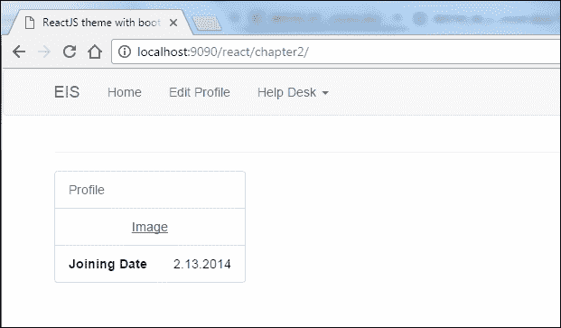
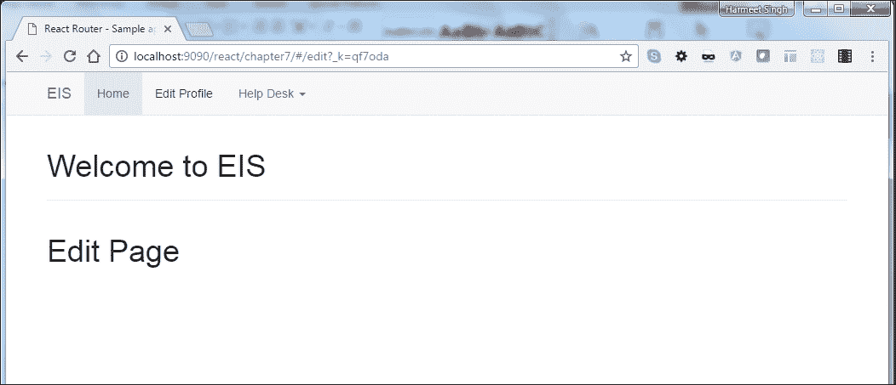

# 七、React 和路由

在前面的章节中，我们已经了解了 Redux 体系结构，以及如何处理这两种状态（数据状态和 UI 状态），以创建单页应用程序或组件。现在，如果需要，我们的应用程序 UI 将与 URL 同步，我们需要使用 React 路由使我们的应用程序 UI 同步。

# React 路由的优势

让我们看看 React 路由的一些优点：

*   在标准化结构中查看声明有助于我们立即了解什么是应用程序视图
*   惰性代码加载
*   使用 React 路由，我们可以轻松处理嵌套视图和视图的渐进解析
*   使用浏览历史记录功能，用户可以向后/向前导航并恢复视图的状态
*   动态路径匹配
*   导航时视图上的 CSS 转换
*   标准化的应用程序结构和行为，在团队中工作时非常有用

### 注

React 路由不提供任何处理数据获取的方法；我们需要使用`asyncProps`或其他 React 数据获取机制。

在本章中，我们将了解如何创建路由以及包含参数的路由。在开始之前，让我们计划一下我们的**员工信息系统**（**EIS**需要哪些路线。观察以下屏幕截图：



前面的截图来自[第 2 章](02.html "Chapter 2. Lets Build a Responsive Theme with React-Bootstrap and React")，*让我们用 React Bootstrap和 React*构建一个响应主题，供您参考。

在[第 2 章](02.html "Chapter 2. Lets Build a Responsive Theme with React-Bootstrap and React")中，*让我们用 React Bootstrap和 React 构建一个响应主题，*我们为我们的应用程序创建了响应主题布局。现在，我们将在其中添加路由以导航到每个页面。

*   **主页**：这将是我们的主页，显示员工档案信息
*   **编辑档案**：在这里，我们可以编辑员工的信息
*   **查看票证**：在此页面中，员工可以看到自己提交的票证
*   **新票**：在这里，员工可以提交票

这些都是我们的基本路线；让我们来看看我们如何创造它们。

# 安装路由

React 路由已打包为 React 库外部的不同模块。我们可以在[使用 React 路由 CDNhttps://cdnjs.cloudflare.com/ajax/libs/react-router/4.0.0-0/react-router.min.js](https://cdnjs.cloudflare.com/ajax/libs/react-router/4.0.0-0/react-router.min.js) 。

我们可以将其包括在我们的项目中，如下所示：

```jsx
var { Router, Route, IndexRoute, Link, browserHistory } = ReactRouter 

```

或者我们可以使用`npm`包进行以下操作：

```jsx
$ npm install --save react-router
```

使用 ES6 transpiler，如 Babel：

```jsx
import { Router, Route, Link } from 'react-router'
```

不使用 ES6 transpiler：

```jsx
var Router = require('react-router').Router 
var Route = require('react-router').Route 
var Link = require('react-router').Link 

```

好的，现在让我们完成项目的设置，包括 React 路由。

# 应用程序设置

React 路由看起来与其他 JS 路由不同。它使用 JSX 语法，这使它不同于其他路由。首先，为了更好地理解路由的概念，我们将在不使用`npm`包的情况下创建一个示例应用程序。

按照以下说明进行设置：

1.  将`Chapter 2`目录结构和文件复制到`Chapter 7`中。
2.  删除现有 HTML 文件并创建新的`index.html`。
3.  在 HTML 中复制此样板代码：

    ```jsx
            <!doctype html>
            <html lang="en">
                <head>
                    <meta charset="utf-8">
                    <title>React Router - Sample application with 
                    bootstrap</title>
                    <link rel="stylesheet" href="css/bootstrap.min.css">
                    <link rel="stylesheet" href="css/font-awesome.min.css">
                    <link rel="stylesheet" href="css/custom.css">
                    <script type="text/javascript" src="js/react.js"></script>
                    <script type="text/javascript" src="js/react-dom.min.js">
                    </script>
                    <script src="js/browser.min.js"></script>
                    <script src="js/jquery-1.10.2.min.js"></script>
                    <script src="js/bootstrap.min.js"></script>
                    <script src="https://unpkg.com/react-router/umd/
                    ReactRouter.min.js"></script>
                    <script src="components/bootstrap-navbar.js" type=
                    "text/babel"></script>
                    <script src="components/sidebar.js" type="text/babel">
                    </script>
                    <script src="components/sidebar.js" type="text/babel">
                    </script>
                </head>
                <body>
                    <div id="nav"></div>
                    <div class="container">
                        <h1>Welcome to EIS</h1>
                        <hr>
                        <div class="row">
                            <div class="col-sm-3" id="sidebar">
                                <!--left col-->
                            </div>
                            <!--/col-3-->
                            <div class="col-sm-9 profile-desc" id="main">
                            </div>
                            <!--/col-9-->
                        </div>
                    </div>
                    <!--/row-->
                </body>
            </html> 

    ```

4.  在浏览器中打开`index.html`。确保输出不会在控制台中显示任何错误。

# 创建路由

由于我们已经创建了 HTML，现在我们需要在前面创建的`bootstrap-navbar.js`中添加一个Bootstrap`navbar`组件。

为了配置路由，让我们在`routing.js`中创建一个与 URL 同步的组件：

```jsx
var homePage = React.createClass({ 
    render: function() { 
        return (<h1>Home Page</h1>); 
    } 
}); 
ReactDOM.render(( 
    <homePage /> 
), document.getElementById('main')); 

```

在浏览器中打开它，下面是它的外观：


让我们添加`Router`以使用 URL 呈现我们的`homePage`组件：

```jsx
ReactDOM.render(( 
    <Router> 
        <Route path="/" component={homePage} /> 
    </Router> 
), document.getElementById('main'));  

```

在前面的示例中，使用`<Route>`标记定义了一个规则，在该规则中，访问主页会将`homePage`组件呈现到`'main'`中。我们已经知道，React 路由使用 JSX 来配置路由。`<Router>`和`<Route>`都是不同的东西。`<Router>`标记应该始终是主父标记，它用`<Route>`标记包装多个 URL。我们可以使用属性组件声明多个`<Route>`标记，使您的 UI 保持同步。当历史发生变化时，`<Router>`将使用匹配的 URL 呈现组件：

```jsx
ReactDOM.render(( 
    <Router> 
        <Route path="/" component={homePage} /> 
        <Route path="/edit" component={Edit} /> 
        <Route path="/alltickets" component={allTickets} /> 
        <Route path="/newticket" component={addNewTicket} /> 
    </Router> 
), document.getElementById('main'));
```

路由将使用视图切换路由，而无需向服务器发出请求并将其呈现到 DOM 中，这看起来非常简单和清楚。

# 页面布局

让我们假设，如果每个组件（如主页）都需要不同的布局，那么应该有两列，其他页面应该有一列，但它们都共享相同的资产，如页眉和页脚。

以下是我们应用程序的布局模型：


好的，现在让我们创建主布局：

```jsx
var PageLayout = React.createClass({
    render: function() {
        return ( 
            <div className="container">
                <h1>Welcome to EIS</h1>
                <hr/>
                <div className="row">
                    <div className="col-md-12 col-lg-12">
                        {this.props.children}
                    </div>
                </div>
            </div>
        )
    }
}) 

```

在前面的代码中，我们已经为我们的应用程序创建了主布局，它使用`this.props.children`而不是硬编码的组件来处理子布局组件。现在，我们将创建在主布局组件中呈现的子组件：

```jsx
var RightSection = React.createClass({
    render: function() {
        return (
            <div className="col-sm-9 profile-desc" id="main">
                <div className="results">
                    <PageTitle/>
                    <HomePageContent/>
                </div>
            </div>
        )
    }
})
var ColumnLeft = React.createClass({
    render: function() {
        return (
            <div className="col-sm-3" id="sidebar">
                <div className="results">
                    <LeftSection/>
                </div>
            </div>
        )
    }
})

```

在前面的代码中，我们创建了两个组件，`RightSection`和`ColumnLeft`，将我们的组件包装并划分到不同的部分。

因此，我们应该很容易在响应性设计中管理布局：

```jsx
var LeftSection = React.createClass({ 
    render: function() { 
        return ( 
            React.DOM.ul({ className: 'list-group' }, 
            React.DOM.li({className:'list-group-item 
            text-muted'},'Profile'), 
            React.DOM.li({className:'list-group-item'}, 
            React.DOM.a({className:'center-block 
            text-center',href:'#'},'Image') 
        ), 
        React.DOM.li({className:'list-group-item text-right'},'2.13.2014', 
        React.DOM.span({className:'pull-left'}, 
        React.DOM.strong({className:'pull-left'},'Joining Date') 
        ), 
        React.DOM.div({className:'clearfix'}) 
        ))                                                             
      ) 
    } 
}) 
var TwoColumnLayout = React.createClass({ 
    render: function() { 
        return ( 
            <div> 
                <ColumnLeft/> 
                <RightSection/> 
            </div> 
        ) 
    } 
}) 
var PageTitle = React.createClass({ 
    render: function() { 
        return ( 
            <h2>Home</h2> 
        ); 
    } 
}); 

```

在前面的代码中，我们将组件分为两部分：`<ColumnLeft/>`和`<RightSection/>`。我们在`<TwoColumnLayout/>`部分中给出了两个组件的参考。在父组件中，我们将`this.props.children`作为一个道具，但它仅在组件嵌套时起作用，React 负责自动填充此道具。如果组件不是父组件，`this.props.children`将为空。

# 嵌套路由

好的，我们已经完成了创建特定于布局的组件的工作，但是我们仍然需要看看如何为它们创建嵌套管线，以便组件通过道具传递到父级。这一点很重要，以便在 EIS 应用程序中实现一定程度的动态性。这是我们的 HTML，显示了它现在的样子：

```jsx
<!doctype html>
<html lang="en">
    <head>
        <meta charset="utf-8">
        <title>React Router - Sample application with bootstrap</title>
        <link rel="stylesheet" href="css/bootstrap.min.css">
        <link rel="stylesheet" href="css/font-awesome.min.css">
        <link rel="stylesheet" href="css/custom.css">
    </head>
    <body>
        <div id="nav"></div>
        <div id="reactapp"></div>
        <script type="text/javascript" src="js/react.js"></script>
        <script type="text/javascript" src="js/react-dom.min.js"></script>
        <script src="js/browser.min.js"></script>
        <script src="js/jquery-1.10.2.min.js"></script>
        <script src="js/bootstrap.min.js"></script>
        <script src="https://unpkg.com/react-router/umd/
        ReactRouter.min.js"></script>
        <script src="components/bootstrap-navbar.js" 
        type="text/babel"></script>
        <script src="components/router.js" type="text/babel"></script>    
    </body>
</html>  

```

让我们再看一次我们先前创建的路由：

```jsx
ReactDOM.render((
    <Router>
        <Route path="/" component={PageLayout}>
            <IndexRoute component={TwoColumnLayout}/>
            <Route path="/edit" component={Edit} />
            <Route path="/alltickets" component={allTickets} />
            <Route path="/newticket" component={addNewTicket} />
        </Route>
    </Router>
), document.getElementById('reactapp'));

```

因此，现在我们已经将额外的元素`<IndexRoute />`添加到与父元素的映射中，将其视图设置为`{TwoColumnLayout}`组件。`IndexRoute`元素负责在我们的应用程序最初加载时显示哪个组件。

别忘了把`{PageLayout}`组件包起来。我们也可以在`<indexRoute>,`上定义与`<Route>`相同的路径规则：

```jsx
ReactDOM.render((
<Router>
    <Route component={PageLayout}>
        <IndexRoute path="/" component={TwoColumnLayout}/>
        <Route path="/edit" component={Edit} />
        <Route path="/alltickets" component={allTickets} />
        <Route path="/newticket" component={addNewTicket} />
    </Route>
</Router>
), document.getElementById('reactapp'));

```

观察以下屏幕截图：


看起来不错。正如我们在`<IndexRoute>`中提到的，它总是在加载第一页时加载 `<TwoColumnLayout>`。现在，让我们浏览并查看其他一些页面。

React 还为我们提供了使用`<IndexRedirect>`组件重定向路由的方法：

```jsx
<Route path="/" component={App}> 
    <IndexRedirect to="/welcome" /> 
    <Route path="welcome" component={Welcome} /> 
    <Route path="profile" component={profile} /> 
</Route> 

```

观察以下屏幕截图：



您会注意到，我单击了**编辑配置文件**页面，它呈现了编辑页面组件，但它没有在当前活动链接上添加活动类。为此，我们需要用 React`<Link>`标签替换`<a>`标签。

## React路由

React 路由使用了`<link>`组件，而不是我们在`nav`中使用的`<a>`元素。如果我们正在使用 React 路由，则有必要使用此选项。让我们在导航中添加`<link>`而不是`<a>`标记，并将`href`属性替换为两个。

`<a>`标签：

```jsx
<li className="active"><a href="#/">Home</a></li> 

```

将其替换为：

```jsx
<li className="active"><Link to="#/">Home</Link></li> 

```

让我们在浏览器中查看一下 OutT0}的行为：


控制台中显示错误，因为我们没有在`ReactRouter`对象中添加`Link`组件引用：

```jsx
var { Router, Route, IndexRoute, IndexLink, Link, browserHistory } = ReactRouter 

```

我们还添加了`browserHistory`对象，稍后我们将对此进行解释。

以下是我们的`PageLayout`组件的外观：

```jsx
var PageLayout = React.createClass({
render: function() {
return ( 
<main>
    <div className="navbar navbar-default navbar-static-top"
    role="navigation">
        <div className="container">
            <div className="navbar-header">
                <button type="button" className="navbar-toggle"
                data-toggle="collapse"
                data-target=".navbar-collapse">
                <span className="sr-only">Toggle navigation</span>
                <span className="icon-bar"></span>
                <span className="icon-bar"></span>
                <span className="icon-bar"></span>
                </button>
                <Link className="navbar-brand" to="/">
                EIS</Link>
            </div>
            <div className="navbar-collapse collapse">
                <ul className="nav navbar-nav">
                    <li className="active">
                        <IndexLink activeClassName="active" to="/">
                        Home</IndexLink>
                    </li>
                    <li>
                        <Link to="/edit" activeClassName="active">
                        Edit Profile</Link>
                    </li>
                    <li className="dropdown">
                        <Link to="#" className="dropdown-toggle"
                        data-toggle="dropdown">
                        Help Desk <b className="caret"></b></Link>
                        <ul className="dropdown-menu">
                            <li>
                                <Link to="/alltickets">
                                View Tickets</Link>
                            </li>
                            <li>
                                <Link to="/newticket">
                                New Ticket</Link>
                            </li>
                        </ul>
                    </li>
                </ul>
            </div>
        </div>
    </div>
    <div className="container">
        <h1>Welcome to EIS</h1>
        <hr/>
        <div className="row">
            <div className="col-md-12 col-lg-12">
                {this.props.children}
            </div>
        </div>
    </div>
</main>
)
}
})
```

要激活默认链接，我们使用了`<IndexRoute>`。这将自动定义默认链接的活动类。`activeClassName`属性将 URL 与`to`值相匹配，并向其添加活动类。如果我们不使用`activeClassName`，则无法在活动链接上自动添加类。让我们快速浏览一下浏览器：


它按预期工作。让我们看看控制台中的 DOM HTML：


我们只需要将`<li> .active`上的Bootstrap默认样式覆盖到`<a>`：

```jsx
.navbar-default .navbar-nav li>.active, .navbar-default
.navbar-nav li>.active:hover, .navbar-default 
.navbar-nav li>.active:focus { 
    color: #555; 
    background-color: #e7e7e7; 
}  

```

我们还可以在路由中传递参数以匹配、验证和呈现 UI：

```jsx
<Link to={`/tickets/${ticket.id}`}>View Tickets</Link>
```

在路由中，我们需要添加：

```jsx
<Route path="tickets/:ticketId" component={ticketDetail} /> 

```

我们可以根据需要添加任意多的参数，并且很容易在我们的组件中提取这些参数。我们可以访问所有作为对象的`route`参数。

React 路由支持 IE9+浏览器版本，但对于 IE8，您可以使用节点`npm`包`react-router-ie8`

### 未找到路线

如果路径与路由不匹配，React 路由还提供了在客户端显示 404 错误的方法：

```jsx
var NoMatch = React.createClass({ 
   render: function() { 
       return (<h1>URL not Found</h1>); 
   } 
}); 

<Route path="*" component={NoMatch}/>
```

观察以下屏幕截图：


令人惊讶的是，我们可以如此轻松地处理无与伦比的 URL。

以下是我们的路由的外观：

```jsx
ReactDOM.render(( 
    <Router> 
        <Route path="/" component={PageLayout}> 
            <IndexRoute component={TwoColumnLayout}/> 
                <Route path="/edit" component={Edit} /> 
                <Route path="/alltickets" component={allTickets} /> 
                <Route path="/newticket" component={addNewTicket} /> 
                </Route> 
        <Route path="*" component={NoMatch}/> 
    </Router> 
), document.getElementById('reactapp')); 

```

以下是我们可以使用的其他`link`属性列表：

*   `activeStyle`：我们可以将其用于自定义内联样式。例如：

```jsx
        <Link activeStyle={{color:'#53acff'}} to='/'>Home</Link>
```

*   `onlyActiveOnIndex`：我们可以在使用`activeStyle`属性添加自定义内联样式时使用此属性。它将只适用于当我们在一个确切的链接。例如：

```jsx
        <Link onlyActiveOnIndex activeStyle={{color:'#53acff'}} 
        to='/'>Home</Link>
```

### 浏览器历史记录

React 路由的一个更酷的特性是，它使用`browserHistory`API 操作 URL 并创建一个干净的 URL。

默认值为`hashHistory`：

```jsx
  http://localhost:9090/react/chapter7/#/?_k=j8dlzv
  http://localhost:9090/react/chapter7/#/edit?_k=yqdzh0 http://localhost:9090/react/chapter7/#/alltickets?_k=0zc49r
  http://localhost:9090/react/chapter7/#/newticket?_k=vx8e8c
```

当我们在应用程序中使用`browserHistory`时，URL 看起来会很干净：

```jsx
 http://localhost:9090/react/chapter7/
 http://localhost:9090/react/chapter7/edit
 http://localhost:9090/react/chapter7/alltickets
 http://localhost:9090/react/chapter7/newticket
```

URL 现在看起来干净且用户友好。

### 查询字符串参数

我们还可以将查询字符串作为`props`传递给将在特定路径上呈现的任何组件。为了访问这些属性参数，我们需要在组件中添加`props.location.query`属性。

为了了解其工作原理，让我们创建一个名为`RouteQueryString`的新组件：

```jsx
var QueryRoute = React.createClass({ 
    render: function(props) { 
        return (<h2>{this.props.location.query.message}</h2>); 
        // Using this we can read the parameters from the 
        request which are visible in the URL's
    } 
}); 
<IndexLink activeClassName='active' to= 
     {{ pathname: '/query', query: { message: 'Hello from Route Query' } }}> 
         Route Query 
</IndexLink> 

```

在路由中包括此路由路径：

```jsx
<Route path='/query' component={QueryRoute} /> 

```

让我们在浏览器中查看输出：


太好了，它按预期工作。

下面是我们的`Router`配置现在的样子：

```jsx
ReactDOM.render((
    <Router>
        <Route path="/" component={PageLayout}>
            <IndexRoute component={TwoColumnLayout}/>
            <Route path="/edit" component={Edit} />
            <Route path="/alltickets" component={allTickets} />
            <Route path="/newticket" component={addNewTicket} />
            <Route path='/query' component={QueryRoute} />
        </Route>
        <Route path="*" component={NoMatch}/>
    </Router>
), document.getElementById('reactapp'));

```

## 进一步定制您的历史记录

如果我们想要定制历史选项或使用历史中的其他增强剂，那么我们需要使用 React 的`useRouterHistory`组件。

`useRouterHistory`已经从历史工厂预增强了`useQueries`和`useBasename`来自历史。例子包括：

```jsx
import { useRouterHistory } from 'react-router' 
import { createHistory } from 'history' 
const history = useRouterHistory(createHistory)({ 
    basename: '/base-path' 
}) 

```

使用`useBeforeUnload`增强剂：

```jsx
import { useRouterHistory } from 'react-router' 
import { createHistory,useBeforeUnload } from 'history' 
const history = useRouterHistory(useBeforeUnload(createHistory))() 
history.listenBeforeUnload(function () { 
    return 'Are you sure you want to reload this page?' 
}) 

```

在使用 React 路由之前，我们必须了解 React 路由版本更新。

请访问此链接[https://github.com/ReactTraining/react-router/blob/master/upgrade-guides/v2.0.0.md](https://github.com/ReactTraining/react-router/blob/master/upgrade-guides/v2.0.0.md) 待更新。

以下是路由中不推荐使用的语法的简短列表：

```jsx
<Route name="" /> is deprecated. Use <Route path="" /> instead. 
<Route handler="" /> is deprecated. Use <Route component="" /> instead. 
<NotFoundRoute /> is deprecated. See Alternative 
<RouteHandler /> is deprecated. 
willTransitionTo is deprecated. See onEnter 
willTransitionFrom is deprecated. See onLeave 
query={{ the: 'query' }} is deprecated. Use to={{ pathname: '/foo', query: { the: 'query' } }} 

```

将`history.isActive`替换为`router.isActive`。

`RoutingContext`更名为`RouterContext`。

# 总结

在本章中，我们将应用程序从一个页面转换为多个页面，并使用一个多路径应用程序构建 EIS 应用程序。在创建组件之前，我们首先规划应用程序中的主要路线。

然后我们研究了如何使用`<Router>`和 `<Route>`方法设置路线。这是由 `var { Router, Route, IndexRoute,IndexLink, Link, browserHistory } = ReactRouter`完成的。我们还研究了其他方法：`<Link>`、`<IndexLink>`和`<IndexRoute>`。

这使我们能够设置包含参数的静态和动态路由，以使我们的应用程序 UI 与 URL 完美同步。

在下一章中，我们将讨论如何将其他 API 与 React 集成。