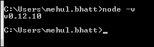
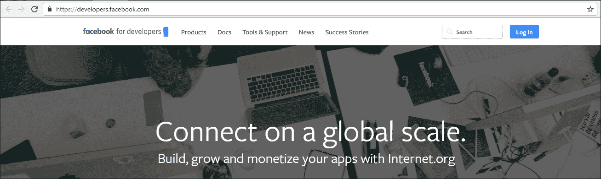
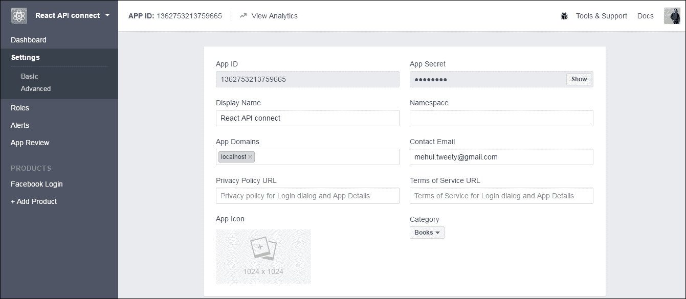
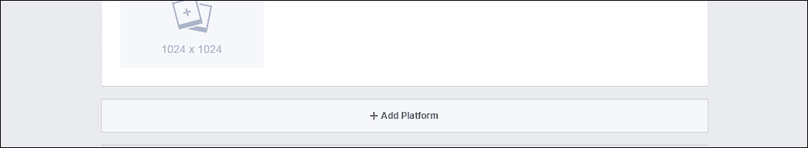
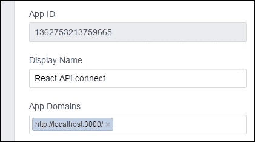
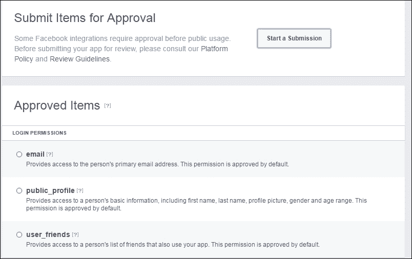
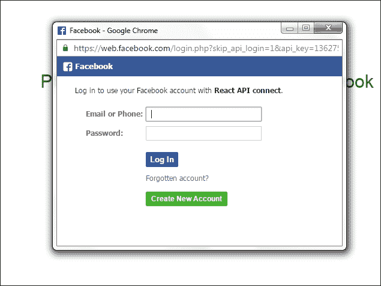
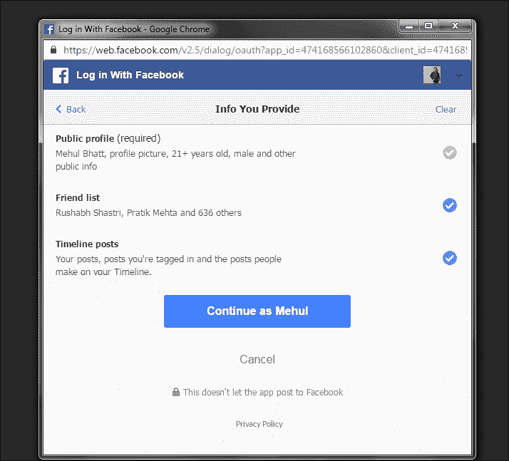

# 第 8 章反应器 API

在前面的章节中，我们了解了 React 路由器，它允许我们创建单页应用程序，并确保 UI 与 URL 同步。我们还介绍了 React 路由器的优点、动态路由匹配，以及如何配置路由器中的组件，以便在 DOM 中使用匹配的 URL 进行呈现。使用 React router 浏览器历史记录功能，用户可以向后/向前导航并恢复应用程序的以前状态。现在我们将检查如何将 React API 与其他 API（如 Facebook、Twitter 和 Git）集成。

# 反应顶级 API

当我们谈论 React API 时，这是进入 React 库的第一步。React 的不同用途将提供不同的输出。例如，使用 React`script`标记将在`React`全局上提供顶级 API，将 ES6 与 npm 一起使用将允许我们写入`import React from 'react'`，将 ES5 与 npm 一起使用将允许我们写入`var React = require('react')`，因此有多种方式使用不同的功能初始化 React。

# 反应原料药成分

通常，当我们处理 React 时，我们正在构建适合其他组件的组件，并且我们假设使用 React 构建的任何组件都是一个组件。然而，事实并非如此。需要有其他的方法来编写支持代码，用 React 连接外部世界。请遵守以下代码段：

```jsx
ReactDOM.render(reactElement, domContainerNode)
```

`render`方法用于更新组件的属性，然后我们可以声明一个新元素来再次渲染它。

另一种方法是 `unmountComponentAtNode`，用于清理代码。当我们使用 React 组件构建 SAP 时，我们必须在正确的时间插入 `unmountComponentAtNode`以启动，这将导致清理应用程序的生命周期。请遵守以下代码段：

```jsx
ReactDOM.unmountComponentAtNode(domContainerNode)
```

大多数时候，我观察到开发人员不调用 `unmountComponentAtNode`方法，这会导致他们的应用程序出现内存泄漏问题。

## 安装/卸载组件

始终建议在 API 中使用自定义包装器 API。假设您有一个根或多个根，并且它将在某个时间段被删除，这样您就不会丢失它。Facebook 有这样的设置，它会自动调用 `unmountComponentAtNode`。

我也建议不要每次都打电话给 `ReactDOM.render()`，但理想的方法是通过图书馆书写或使用它。在这种情况下，应用程序将使用装载和卸载来管理它。

创建自定义包装将帮助您在一个位置管理配置，例如国际化、路由器和用户数据。每次在不同的地方设置所有配置都是非常痛苦的。

# 面向对象编程

如果我们在声明下面再次声明一个已声明的变量，则该变量将被重写，就像 `ReactDOM.render`重写其已声明的属性一样：

```jsx
ReactDOM.render(<Applocale="en-US"userID={1}/>,container); 
// props.userID == 1
// props.locale == "en-US" 
ReactDOM.render(<AppuserID={2}/>,container); 
// props.userID == 2
// props.locale == undefined ??!?
```

如果我们只重写组件中的一个属性，那么认为面向对象编程将重写所有声明的属性可能会让人困惑。

你可能会认为我们通常使用 `setProps`作为辅助函数，以帮助覆盖选择性属性，但当我们使用 React 时，我们不能使用它；因此，建议使用自定义包装器；n 您的 API。

在以下代码中，您将看到一个样板文件，帮助您更好地理解它：

```jsx
classReactComponentRenderer{ 
    constructor(componentClass,container){ 
        this.componentClass=componentClass; 
        this.container=container; 
        this.props={}; 
        this.component=null; 
    } 

    replaceProps(props,callback){ 
        this.props={}; 
        this.setProps(props,callback); 
    } 

    setProps(partialProps,callback){ 
        if(this.componentClass==null){ 
            console.warn( 
                'setProps(...): Can only update a mounted or '+ 
                'mounting component. This usually means you called 
                setProps() on '+'an unmounted component. This is a no-op.' 
            ); 
            return; 
        } 
        Object.assign(this.props,partialProps); 
        varelement=React.createElement(this.klass,this.props); 
        this.component=ReactDOM.render(element,this.container,callback); 
    } 

    unmount(){ 
        ReactDOM.unmountComponentAtNode(this.container); 
        this.klass=null; 
    }
}
```

在前面的示例中，我们似乎仍然可以在面向对象的 API 中编写更好的代码，但为此，我们必须了解自然的面向对象 API 及其在 React 组件中的使用：

```jsx
classReactVideoPlayer{                                 
    constructor(url,container){ 
        this._container=container; 
        this._url=url; 
        this._isPlaying=false; 
        this._render(); 
    } 

    _render(){ 
        ReactDOM.render( 
            <VideoPlayerurl={this._url}playing={this._isPlaying}/>, 
            this._container 
        ); 
    } 

    geturl(){ 
        returnthis._url; 
    } 

    seturl(value){ 
        this._url=value; 
        this._render(); 
    } 

    play(){ 
        this._isPlaying=true; 
        this._render(); 
    } 

    pause(){ 
        this._isPlaying=false; 
        this._render(); 
    } 

    destroy(){ 
        ReactDOM.unmountComponentAtNode(this._container); 
    }
}
```

我们可以从前面的示例中理解，**命令式**API 和**声明式**API 之间的区别。这个例子还展示了我们如何在声明性 API 之上提供命令，反之亦然。在使用 React 创建自定义 web 组件时，我们可以使用声明式 API 作为包装器。

# React 与其他 API 的集成

React 集成只是使用 JSX、Redux 和其他 React 方法将 web 组件转换为 React 组件。

让我们看一个 React 与另一个 API 集成的实例。

## React 与 Facebook API 的集成

此应用程序将帮助您集成 Facebook API，您将可以访问您的个人资料图片以及好友列表中的好友数量。您还将看到每个朋友的列表中有多少喜欢、评论和帖子。

首先，您必须安装 Node.js 服务器并在系统中添加 npm 包。

如果您不知道如何安装 Node.js，请参阅以下说明。

### 安装节点

首先，如果我们没有在系统上安装 Node.js 版本 0.12.10，我们必须下载并安装它。我们可以从[下载 Node.jshttp://nodejs.org](http://nodejs.org) 包括 npm 包管理器。

设置完成后，我们可以检查 Node.js 是否设置正确。打开命令提示符并运行以下命令：

```jsx
node  -v 
```

或

```jsx
node --version
```

这将返回 Node.js 安装的版本，如下所示：



您应该能够看到版本信息，从而确保安装成功。

安装节点后，您将有`babel-plugin-syntax-object-rest-spread`和`babel-plugin-transform-object-rest-spread`。

这两者之间有一个基本区别：`spread`只允许您阅读语法，但`transform`允许您将语法转换回 ES5。

完成此操作后，您必须将插件存储到`.babelrc`文件中，如下所示：

```jsx
{ 
  "plugins": ["syntax-object-rest-spread", "transform-object-rest-spread"] 
} 

```

### 设置应用程序

首先，我们需要为我们的项目创建一个 `package.json`文件，其中包括项目信息和依赖项。现在，打开命令提示符/控制台并导航到已创建的目录。运行以下命令：

```jsx
Npm init
```

此命令将初始化我们的应用程序，并在创建名为`package.json`的 JSON 文件之前询问几个问题。该实用程序将询问有关项目名称、描述、入口点、版本、作者姓名、依赖项、许可证信息等的问题。一旦执行该命令，它将在项目的根目录中生成一个`package.json`文件。

我已经用我的需求创建了我的`package.json`文件，如下代码所示：

```jsx
{ 
  "name": "facebook-api-integration-with-react", 
  "version": "1.2.0", 
  "description": "Web Application to check Like, Comments and
  Post of your Facebook Friends, 

```

在前面的代码中，您可以看到应用程序的`name`、应用程序的`version`和应用程序的`description`。请遵守以下代码段：

```jsx
  "scripts": { 
    "lint": "eslint src/ server.js config/ webpack/", 
    "start": "npm run dev", 
    "build": "webpack -p --config webpack/webpack.config.babel.js
    --progress --colors --define process.env.NODE_ENV='"production"'", 
    "clean": "rimraf dist/", 
    "deploy": "npm run clean && npm run build", 
    "dev": "./node_modules/.bin/babel-node server.js" 
  }, 

```

从前面的代码中，您可以设置您的`scripts`，以详细说明如何`start`您的服务器、如何`build`、什么是`clean`、以及`deploy`和`dev`等内容。请确保在相应变量中定义的路径正确，否则应用程序将无法按预期工作。请遵守以下代码段：

```jsx
  "author": "Mehul Bhatt <mehu_multimedia@yahoo.com>", 
  "license": "MIT", 
  "keywords": [ 
    "react", 
    "babel", 
    "ES6", 
    "ES7", 
    "async", 
    "await", 
    "webpack", 
    "purecss", 
    "Facebook API" 
  ], 

```

前面的代码显示了您申请的`author`名称、`license`（如果适用）和`keywords`。请遵守以下代码段：

```jsx
  "devDependencies": { 
    "babel-cli": "^6.3.17", 
    "babel-core": "^6.3.26", 
    "babel-eslint": "^6.0.0", 
    "babel-loader": "^6.2.0", 
    "babel-plugin-react-transform": "^2.0.0-beta1", 
    "babel-plugin-transform-regenerator": "^6.5.2", 
    "babel-polyfill": "^6.5.0", 
    "babel-preset-es2015": "^6.3.13", 
    "babel-preset-react": "^6.3.13", 
    "babel-preset-stage-0": "^6.5.0", 
    "css-loader": "^0.23.0", 
    "enzyme": "^2.4.1", 
    "eslint": "^2.12.0", 
    "eslint-config-airbnb": "^9.0.1", 
    "eslint-plugin-import": "^1.8.1", 
    "eslint-plugin-jsx-a11y": "^1.5.3", 
    "eslint-plugin-react": "^5.2.0", 
    "express": "^4.13.3", 
    "file-loader": "^0.9.0", 
    "imports-loader": "^0.6.5", 
    "json-loader": "^0.5.4", 
    "lolex": "^1.4.0", 
    "react-transform-catch-errors": "^1.0.1", 
    "react-transform-hmr": "^1.0.1", 
    "redbox-react": "^1.2.0", 
    "rimraf": "^2.5.0", 
    "sinon": "^1.17.4", 
    "style-loader": "^0.13.0", 
    "url-loader": "^0.5.7", 
    "webpack": "^1.12.9", 
    "webpack-dev-middleware": "^1.4.0", 
    "webpack-hot-middleware": "^2.6.0", 
    "yargs": "^4.1.0" 
  }, 
  "dependencies": { 
    "classnames": "^2.2.5", 
    "jss": "^5.2.0", 
    "jss-camel-case": "^2.0.0", 
    "lodash.isequal": "^4.0.0", 
    "react": "^15.0.2", 
    "react-addons-shallow-compare": "^15.0.2", 
    "react-dom": "^15.0.2", 
    "reqwest": "^2.0.5", 
    "spin.js": "^2.3.2" 
  } 
} 

```

最后，您可以在前面的代码中看到应用程序的`dependencies`，它将帮助您设置所需的组件和获取数据，以及前端内容。您还可以看到已定义的`devDependencies`及其版本，它们链接到您的应用程序。

在设置了`package.json`文件之后，我们有了如下代码所示的 HTML 标记，名为`index.html`：

```jsx
<!doctype html> 
<html lang="en">
    <head>
        <meta charset="UTF-8">
        <title>React Integration with Facebook API</title>
        <meta name="viewport" content="width=device-width, 
        initial-scale=1">
    </head>
    <body>
        <div id=" Api-root"></div>
        <script src="dist/bundle.js"></script> 
    </body>
</html>

```

在`config.js`中使用唯一 ID 配置您的应用程序：

```jsx
export default { 
    appId: '1362753213759665', 
    cookie: true, 
    xfbml: false, 
    version: 'v2.5' 
}; 

```

如前面代码所示，您可以将配置保存在一个文件中。你可以把它命名为`index.js`。此文件包括您的`appId`，这对于在本地目录中运行应用程序非常重要。

要获得您的 ID，您必须在 Facebook 上的[注册您的应用程序 https://developers.facebook.com](https://developers.facebook.com) 在这里，您必须遵循以下步骤：

1.  Log in to your Facebook developer account:

    

2.  After logging in, you will see on the right-hand side a drop-down called **My apps**. Click on that and open up the list menu. There you will find **Add new app**. Clicking that will open a dialog saying, **Create a New App ID**, as shown in the following screenshot:

    

    输入所需的详细信息，然后单击**创建应用程序 ID**按钮。

3.  After creating your app ID, please jump to the **Dashboard** page and you will see a screen resembling the following:

    

4.  On the **Dashboard** page, your left-hand side navigation shows the **Settings** link. Please click on that to set the **Basic** and **Advanced** settings for your app:

    

5.  Once you are able to see the preceding screen, you will be able to see that your dynamic generated **App ID**, **Display Name**category, and **App Secret** are automatically filled in. You will also see **App Domains**. This field is very important when it comes to accessing your app as a website and notifying that we need to define the domain here. However, if you write your `localhost` as the domain straightaway, it will not be accepted and your application will have errors.

    为了让您的本地主机可以访问，我们必须定义它的平台。现在请向下滚动一点进入**+****添加平台**：

    

6.  Once you click on **+ Add Platform**, you will see the following options on the screen and you will have to select a **Website** to run your application on your local server:

    

7.  After you have selected **Website** as a platform, one more field will be added to your screen as shown in the following screenshot:

    

8.  Once you get the preceding screen, you have to define the **Site URL** as `http://localhost:3000/` and then, in a similar way, you will have to define the same domain in the **App Domains** field, as shown in the following screenshot:

    

9.  After doing the aforementioned changes, please save your changes by clicking on the **Save Changes** button at the bottom-right side:

    

现在您的 ID 已创建，您可以在`config.js`文件中使用该 ID 链接您的应用程序以在本地服务器上运行。

设置`config.js`文件后，下一步是在该应用程序中设置所需文件，并将动态内容注入 HTML ID。

您可以在`index.js`文件中导入所需的组件、UTIL 和 CSS，并将其放在不同的文件夹中，这样它就不会与您的配置 `index.js`文件冲突：

```jsx
import React from 'react'; 
import { render } from 'react-dom'; 
import App from './components/App'; 

import 'babel-polyfill'; 

// import CSS 

import '../vendor/css/base.css'; 
import '../vendor/css/bootstrap.min.css'; 

render( 
  <App />, 
  document.querySelector('#Api-root') 
); 

```

在前面的代码中，您可以看到我已经为 React 支持的文件导入了`React`并导入了所需的 CSS 文件。最后一步，`render`方法将在选择器中定义 HTML ID 后为您完成这项任务。确保 `document.querySelector`具有正确的选择器，否则应用程序将无法以正确的结构呈现。

您可以在前面的代码中看到，我创建了一个名为`App`的组件并将其导入。

在`App.js`文件中，我导入了几个组件，这些组件帮助我在 Facebook API 集成的帮助下从我的 Facebook 帐户获取数据。

遵守`App.js`文件的以下代码结构：

```jsx
/* global Facebook  */ 

import React, { Component } from 'react'; 
import Profile from './Profile'; 
import FriendList from './FriendList'; 
import ErrMsg from './ErrMsg'; 
import config from '../../config'; 
import Spinner from './Spinner'; 
import Login from './Login'; 
import emitter from '../utils/emitter'; 
import { getData } from '../utils/util'; 
import jss from 'jss';

```

前面导入的 JavaScript 文件已设置为获取数据，构建了在应用程序中如何执行数据的结构。

```jsx
const { classes } = jss.createStyleSheet({ 
  wrapper: { 
    display: 'flex' 
  }, 
  '@media (max-width: 1050px)': { 
    wrapper: { 
      'flex-wrap': 'wrap' 
    } 
  } 
}).attach(); 

```

前面的代码定义了用于创建包装器样式的常量，当页面在浏览器中呈现时将应用这些样式。

```jsx
class App extends Component { 

  state = { 
    status: 'loading' 
  }; 

  componentWillMount = () => { 
    document.body.style.backgroundColor = '#ffffff'; 
  }; 

  componentWillUnmount = () => { 
    emitter.removeListener('search'); 
  }; 

  componentDidMount = () => { 
    emitter.on('search', query => this.setState({ query })); 

    window.fbAsyncInit = () => { 
      FB.init(config); 

      // show login 
      FB.getLoginStatus( 
        response => response.status !== 'connected' && 
        this.setState({ status: response.status }) 
      ); 

      FB.Event.subscribe('auth.authResponseChange', (response) => { 
        // start spinner 
        this.setState({ status: 'loading' }); 

        (async () => { 
          try { 
            const { profile, myFriends } = await getData(); 
            this.setState({ status: response.status, profile, myFriends }); 
          } catch (e) { 
          this.setState({ status: 'err' }); 
       } 
     })(); 
   }); 
}; 

```

前面的代码扩展了组件，并提供了装载/卸载的详细信息，我们已经在前面的章节中介绍过。如果您仍然不确定此区域，请重新访问。

`window.fbAsyncInit`将 Facebook API 与登录设置同步，并验证登录状态。

它还将异步 Facebook 数据，如您的个人资料和好友列表，其中有单独的 JavaScript，本章稍后将介绍。

```jsx
    // Load the SDK asynchronously 
    (function (d, s, id) { 
      const fjs = d.getElementsByTagName(s)[0]; 
      if (d.getElementById(id)) { return; } 
      const js = d.createElement(s); js.id = id; 
      js.src = '//connect.facebook.net/en_US/sdk.js'; 
      fjs.parentNode.insertBefore(js, fjs); 
    }(document, 'script', 'facebook-jssdk')); 
  }; 

  _click = () => { 
    FB.login(() => {}, { scope: ['user_posts', 'user_friends'] }); 
  }; 

```

定义范围数组意味着我们正在访问用户的 Facebook 好友和帖子。

观察以下屏幕截图：



在前面的屏幕截图中，您可以在创建 Facebook 登录应用程序时在**应用程序查看**选项卡中看到默认登录权限访问。我们可以提交批准以访问任何其他用户信息：

```jsx
  mainRender = () => { 
    const { profile, myFriends, status, query } = this.state; 
    if (status === 'err') { 
      return (<ErrMsg />); 
    } else if (status === 'unknown' || status === 'not_authorized') { 
      return <Login fBLogin={this._click} />; 
    } else if (status === 'connected') { 
      return ( 
        <div className={classes.wrapper}> 
          <Profile {...profile} /> 
          <FriendList myFriends={myFriends} query={query} /> 
        </div> 
      ); 
    } 
    return (<Spinner />); 
  }; 

  render() { 
    return ( 
      <div> 
        {this.mainRender()} 
      </div> 
    ); 
  } 
}  
export default App; 

```

在前面的代码中， `mainRender`方法将呈现`Profile`、`myFriends`（好友列表）和`status`，并返回`render return`中的值。您可以看到，在`render`方法中，有一个 `<div>`标记；我们称之为 `{this.mainRender()}`将数据注入其中。

如您所知，这里我们讨论的是第三方 API 集成。我们不确定我们将连接到该 API 多长时间，以及加载内容需要多长时间。最好有一个内容加载器（微调器），它指示用户应该等待一段时间，因此我们使用以下微调器来显示在页面上加载内容的进度。微调器的代码也包含在`App.js`文件中。下面是微调器的一个视图：


您也可以选择自己的自定义微调器。

一旦您的应用程序页面准备就绪，您的最终输出应该如以下屏幕截图所示，您将看到基本的外观以及所需的元素：


点击本地服务器后，前面的屏幕将请求您继续登录过程。

一旦你按下**同意**按钮，它会将你重定向到 Facebook 登录页面。这可以通过以下代码（`Login.js`实现：

```jsx
import React, { PropTypes } from 'react'; 
import jss from 'jss'; 
import camelCase from 'jss-camel-case'; 
jss.use(camelCase());  

```

导入 React`PropTypes`后，在下面的代码中，您将看到我定义了一个常量来创建登录页面的样式。您还可以在这里定义样式，并将它们放入一个 CSS 文件中，并进行外部文件调用。

```jsx
const { classes } = jss.createStyleSheet({ 
  title: { 
    textAlign: 'center', 
    color: '#008000' 
  }, 
  main: { 
    textAlign: 'center', 
    backgroundColor: 'white', 
    padding: '15px 5px', 
    borderRadius: '3px' 
  },     
  wrapper: { 
    display: 'flex', 
    minHeight: '60vh', 
    alignItems: 'center', 
    justifyContent: 'center' 
  }, 
  '@media (max-width: 600px)': { 
    title: { 
      fontSize: '1em' 
    }, 
    main: { 
      fontSize: '0.9em' 
    } 
  } 
}).attach(); 

```

下面的代码显示了登录页面的 HTML 结构，并且为登录按钮定义了`Login.propTypes`：

```jsx
const Login = ({ fBLogin }) => ( 
  <div className={classes.wrapper}> 
    <div> 
      <h2 className={classes.title}>Please check your friend list 
      on Facebook</h2> 
        <div className={classes.main}> 
          <h4>Please grant Facebook to access your friend list</h4> 
          <button className="btn btn-primary" 
          onClick={fBLogin}>Agree</button> 
        </div> 
    </div> 
  </div> 
);  

Login.propTypes = { 
  fBLogin: PropTypes.func.isRequired 
}; 

export default Login; 

```

当您点击**同意**按钮时，您的应用程序将被重定向到 Facebook 登录页面。请参阅以下屏幕截图：



使用凭据登录后，它将要求您获得访问数据的权限，如以下屏幕截图所示：



一旦您提供了所需的详细信息并按下**继续**as 按钮，它将为您提供带有最终输出的最终屏幕。


出于安全考虑，我已经模糊了我朋友的个人资料图片和他们的名字，但你的 Facebook 帐户也会有同样的布局。现在您正在考虑在应用程序中获取好友列表，对吗？因此，在以下代码的帮助下，我在我的自定义应用程序中获取了一个列表。

在`App.js`文件中导入`FriendList.js`：

```jsx
import React, { PropTypes } from 'react'; 
import FriendItem from './FriendItem'; 
import { MAX_OUTPUT } from '../utils/constants'; 
import jss from 'jss'; 
import camelCase from 'jss-camel-case';  

jss.use(camelCase()); 

```

正如我们在前面的代码片段中所看到的，我们还导入了`React`、`constants`和`FriendItem`来获取数据。这里我们只是导入`FriendItem`，但它将有一个单独的文件来处理此问题：

```jsx
const { classes } = jss.createStyleSheet({ 
  nodata: { 
    fontSize: '1.5em', 
    display: 'flex', 
    justifyContent: 'center', 
    alignItems: 'center', 
    textAlign: 'center', 
    color: 'white', 
    minHeight: '100vh', 
  }, 
  wrapper: { 
    flex: '3' 
  }, 
  '@media (max-width: 1050px)': { 
    wrapper: { 
      flex: '1 1 100%' 
    }, 
    nodata: { 
      minHeight: 'auto' 
    } 
  } 
}).attach(); 

```

前面的代码定义了好友列表内容的包装器样式。正如我前面所说的，您也可以将它们放在一个单独的 CSS 文件中，并进行外部调用，以您方便的为准。

```jsx
const emptyResult = (hasFriends, query) => { 
  return ( 
    <div className={classes.nodata}> 
      {hasFriends ? `No results for: "${query}"` : 'No friends to show'} 
    </div> 
  ); 
}; 

```

在前面的代码中，您可以看到验证某人是否有朋友的条件。如果某人的 Facebook 帐户中没有好友列表，则会显示上述消息。

```jsx
const renderFriends = ({ myFriends, query }) => { 
  const result = myFriends.reduce((prev, curr, i) => { 
    if (curr.name.match(new RegExp(query, 'i'))) { 
      prev.push(<FriendItem key={i} rank={i + 1} {...curr} />); 
    } 

    return prev; 
    }, []); 
    return result.length > 0 ? result : emptyResult
    (!!myFriends.length, query); 
    }; 

    const FriendList = (props) => ( 
      <div className={classes.wrapper}> 
        {renderFriends(props)} 
      </div> 
    ); 

    FriendList.propTypes = { 
      myFriends: PropTypes.array.isRequired, 
      query: PropTypes.string 
    }; 

export default FriendList; 

```

如果您的帐户有朋友，那么您将获得一个完整的朋友列表，包括他们的个人资料图片、喜好、评论和帖子数量，因此通过这种方式，您还可以将 Facebook API 与 React 集成。

# 总结

我们已经探索了在 React 的帮助下集成 Facebook API，您也可以以类似的方式与其他 API 集成。

我们使用常量、UTIL 和扩展组件来实现集成并获得预期的输出。

本章中显示的关键示例将帮助您理解或澄清将其他 API 与 React 集成的概念。