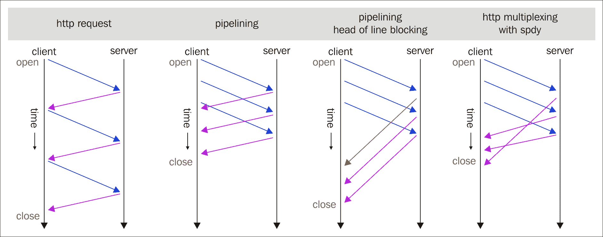
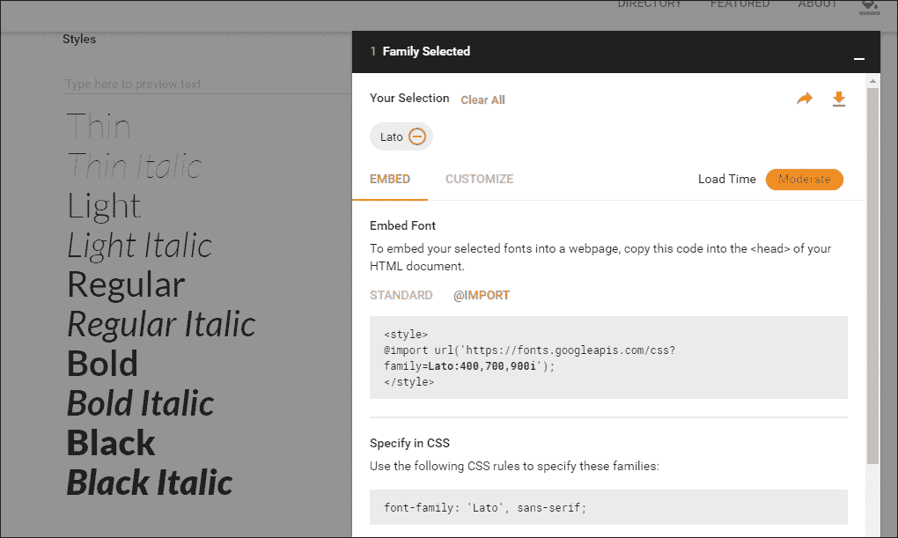
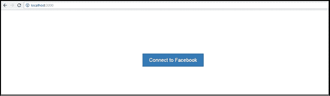
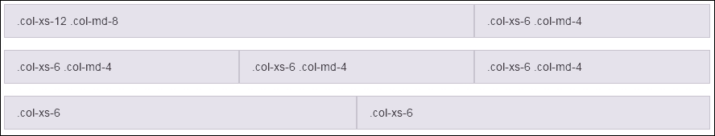
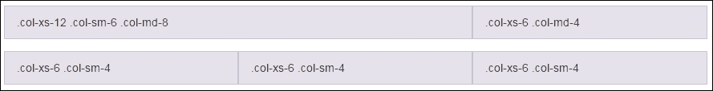

# 第 10 章最佳实践

在深入研究处理 React 时要遵循的最佳实践之前，让我们回顾一下我们在前面几章中看到的内容。

我们讨论了以下要点：

*   什么是反应
*   如何使用 React 引导和 ReactJS 构建响应主题
*   DOM 与 React 的交互
*   ReactJSJSX
*   React 引导组件集成
*   Redux 架构
*   带 React 的路由
*   React API 与其他 API 的集成
*   使用 Node.js 进行响应

通过前面的主题，您应该对 ReactJS、响应主题、定制组件、JSX、Redux、Flux 以及与其他 api 的集成有更清晰的理解。我希望你旅途愉快。现在我们知道了从何处开始以及如何编写代码，但了解如何按照最佳实践编写标准编码也很重要。

2015 年，React 在世界各地发布了许多新版本和召开了许多会议，现在我看到许多人在问我们如何在 React 中编写标准代码？

每个人都会对以下最佳实践有自己的看法。到目前为止，我已经和你们分享了我的一些观察和经验，但你们可能有不同的观点。

如果你想要更详细的资料，你可以随时访问 React 的官方网站和教程。

# React 中的数据处理

每当我们有具有动态功能的组件时，数据就会出现在画面中。这同样适用于 React；我们必须处理动态数据，这似乎很容易，但并非每次都如此。

听起来很混乱！

为什么它既容易又难？因为，在 React 组件中，传递属性很容易，并且有许多方法可以构建渲染树，但是更新视图的过程并不清晰。

2015 年，我们看到了许多 Flux 库，并发布了许多功能性和反应性解决方案。

## 使用助焊剂

根据我的经验，很多人对流量有误解，认为流量在哪里是不需要的。他们使用它是因为他们很好地掌握了这一点。

在我们的示例中，我们已经看到 Flux 有一种清晰的方法来存储和更新应用程序的状态，当需要时，它将触发渲染。

我们多次听到这样的话：“*每个硬币都有两面”*。同样，通量对代码也有好处，也有坏处。例如，为应用程序声明全局状态是有益的。假设您必须管理登录的用户，并且您正在定义路由和活动帐户的状态；当您在管理临时或本地数据时开始使用 Flux 时，这将是一件痛苦的事情。

从我的角度来看，我不建议仅仅为了管理`/items/:itemIdroute`相关数据而使用 Flux。相反，您可以在组件中声明它，并将其存储在组件中。它有什么好处？答案是，它将依赖于您的组件，因此当您的组件不存在时，它也将不存在。

例如：

```jsx
export default function users(state = initialState, action) { 
    switch (action.type) { 
        case types.ADD_USER: 
            constnewId = state.users[state.users.length-1] + 1; 
            return { 
                ...state, 
                users: state.users.concat(newId), 
                usersById: { 
                    ...state.usersById, 
                    [newId]: { 
                        id: newId, 
                        name: action.name 
                    } 
                }, 
            } 

            case types.DELETE_USER: 
            return { 
                ...state, 
                users: state.users.filter(id => id !== action.id), 
                usersById: omit(state.usersById, action.id) 
            }     

            default: 
            return state; 
    } 
} 

```

在前面基于 Redux 的 reducer 代码中，我们将应用程序的`state`作为 reducer 的一部分进行管理。它存储上一个`state`和`action`并返回下一个状态。

## 使用 Redux

正如我们所知，在水疗中心，当我们必须与国家和时间签订合同时，随着时间的推移，很难掌握国家。在这里，Redux 帮助很大。怎样因为在 JavaScript 应用程序中，Redux 处理两种状态：一种是数据状态，另一种是 UI 状态，这是 SPA 的标准选项。此外，请记住，Redux 可以与 AngularJS、jQuery 或 React JavaScript 库或框架一起使用。

## Redux 等于通量，真的吗？

Redux 是一种工具，而 Flux 只是一种模式，您无法通过即插即用或下载来使用它。我不否认 Redux 从通量模式中得到了一些影响，但我们不能说它 100%类似于通量。

让我们继续来看一些不同之处。

Redux 遵循以下三个指导原则。我们还将介绍 Redux 和 Flux 之间的一些差异。

### 单店方式

我们在前面的图中已经看到，应用程序中的所有状态修改，存储都假装是*中介*，Redux 通过存储控制两个组件之间的直接通信，并且只有一个通信点。

这里 Redux 和 Flux 的区别在于：Flux 有多个存储方法，Redux 有一个存储方法。

### 只读状态

在 React 应用程序中，组件不能直接更改状态，但必须通过`actions`将更改发送到存储区。

这里，`store`是一个对象，它有四种方法，如下所示：

*   `store.dispatch(action)`
*   `store.subscribe(listener)`
*   `store.getState()`
*   `replaceReducer(nextReducer)`

Reducer 函数用于更改状态

由于 Redux 工具不允许两个组件之间直接通信，减速器功能将处理`dispatch`动作来更改`state`；因此，它也不会更改`state`，但将针对`state`更改描述`dispatch`操作。

这里的减缩器可视为纯函数，以下是编写减缩器函数的几个特征：

*   没有外部数据库或网络呼叫
*   根据其参数返回值
*   参数是*不可变的*
*   相同的参数返回相同的值

Reducer 函数被称为纯函数，因为它们除了根据设置的参数返回一个值之外什么都不做；它们没有任何其他后果。

在 Flux 或 Redux 体系结构中，总是很难处理 API 返回的嵌套资源，因此建议在组件中使用平坦状态，例如`normalize`。

对专业人士的提示：

```jsx
const data = normalize(response,arrayOf(schema.user)) 
state= _.merge(state,data.entities) 

```

## 不可变反应状态

在平面状态下，我们有处理嵌套资源和`immutable`对象的好处，同时还有不能修改声明状态的好处。

`immutable`对象的另一个好处是，通过它们的引用级别相等检查，我们可以极大地提高渲染性能。例如，对于`immutable`对象，存在`shouldComponentUpdate`：

```jsx
shouldComponentUpdate(nexProps){ 
    // instead of object deep comparsion 
    returnthis.props.immutableFoo!==nexProps.immutableFoo 
} 

```

在 JavaScript 中，使用**不变性深度冻结**节点将帮助您在变异前冻结节点，然后验证结果。以下代码示例显示了相同的逻辑：

```jsx
return{ 
    ...state, 
    foo 
} 

return arr1.concat(arr2) 

```

我希望前面的例子已经阐明了 Immutable.js 及其优点。它也有简单的方法，但使用不多：

```jsx
import{fromJS} from 'immutable' 

const state =fromJS({ bar:'biz'}) 
constnewState=foo.set('bar','baz')  

```

从我的角度来看，这是一个非常快速和美丽的功能使用。

## 可观察到的和反应性的溶液

我经常听到人们询问 Flux 和 Redux 的替代方案，因为他们想要更多的反应式解决方案。您可以在以下列表中找到一些备选方案：

*   **Cycle.js**：这是一个用于更干净代码的功能性和反应性 JavaScript 框架。
*   **.rx 流量**：这是带有附加组件 RxJS 的流量体系结构。
*   **redux rx**：这是 RxJS 的实用程序，用于 redux。
*   **Mobservable**：它有三种不同的风格——可观察数据、反应函数和简单代码。

# 反应路由

我们必须在客户端应用程序中使用路由。对于 ReactJS，我们还需要另一个路由库，因此我建议您使用 React 社区提供的`react-router`。

React 路由的优点是：

*   在标准化结构中查看声明有助于我们立即识别应用程序视图
*   惰性代码加载
*   使用`react-router`，我们可以轻松处理嵌套视图及其视图的渐进分辨率
*   使用浏览历史记录功能，用户可以向后/向前导航并恢复视图的状态
*   动态路径匹配
*   导航时视图上的 CSS 转换
*   标准化的应用程序结构和行为，在团队中工作时非常有用

### 注

React 路由不提供任何处理数据获取的方法。我们需要使用`async-props`或其他 React 数据获取机制。

## React 如何帮助在延迟加载中拆分代码

与**webpack module bundler**打交道的开发人员很少知道如何将您的应用程序代码拆分为几个 JavaScript 文件：

```jsx
require.ensure([],()=>{ 
    const Profile = require('./Profile.js') 
    this.setState({ 
        currentComponent: Profile 
    }) 
}) 

```

为什么这种代码拆分是必要的，是因为每个代码块并不总是对每个用户有用，也不必在每个页面上加载它；这将使浏览器负担过重。因此，为了避免这种情况，我们应该将应用程序分成几个块。

现在，您可能有以下问题：如果我们有更多的代码块，那么我们是否需要有更多的 HTTP 请求，这也会影响性能？借助 HTTP/2 多路复用（[https://http2.github.io/faq/#why-is-http2-多路复用](https://http2.github.io/faq/#why-is-http2-multiplexed)，您的问题将得到解决。请遵循下图：



访问[http://stackoverflow.com/questions/10480122/difference-between-http-pipeling-and-http-multiplexing-with-spdy](http://stackoverflow.com/questions/10480122/difference-between-http-pipeling-and-http-multiplexing-with-spdy) 了解更多信息。

您还可以将分块代码与分块哈希相结合，这也将在您更改代码时优化浏览器缓存比率。

## JSX 组件

简而言之，JSX 只是 JavaScript 语法的扩展。如果您观察 JSX 的语法或结构，就会发现它类似于 XML 编码。

JSX 执行将 XML 语法添加到 JavaScript 的预处理器足迹。您当然可以在不使用 JSX 的情况下使用 React，但 JSX 使 React 更加整洁和优雅。与 XML 类似，JSX 标记具有标记名、属性和子级。JSX 也类似于 XML，因为如果属性值用引号括起来，该值就会变成字符串。

XML 与平衡的开始和结束标记一起工作；JSX 的工作原理与此类似，它有助于生成比*函数调用*或*对象文本*更易于阅读的大型树。

在 React 中使用 JSX 的优点是：

*   JSX 比 JavaScript 函数更容易理解
*   设计师和团队的其他成员更熟悉 JSX 中的标记
*   您的标记变得更加语义化、结构化和有意义

## 想象起来有多容易？

正如我所说，在 JSX 中，结构和语法非常容易可视化和注意。与 JavaScript 相比，JSX 格式更清晰易读。

下面的简单代码片段将为您提供更清晰的概念。让我们来看一个简单的 JavaScript`render`语法：

```jsx
render: function () { 
    returnReact.DOM.div({className:"divider"}, 
        "Label Text", 
        React.DOM.hr() 
    ); 
}  

```

让我们看看以下 JSX 语法：

```jsx
render: function () { 
    return<div className="divider"> 
        Label Text<hr /> 
    </div>; 
} 

```

希望您非常清楚，对于已经熟悉 HTML 的非程序员来说，使用 JSX 比使用 JavaScript 容易得多。

## 认识还是理解

在开发区域，有许多团队，如熟悉 HTML 的非开发人员、UI 开发人员和 UX 设计师，以及负责彻底测试产品的质量保证团队。

JSX 是以一种坚实而简洁的方式清楚地理解这种结构的一种很好的方式。

## 语义/结构化语法

到目前为止，我们已经看到 JSX 语法是如何易于理解和可视化的。在这背后，有一个很大的原因，有一个语义语法结构。

JSX 可以轻松地将 JavaScript 代码转换为更具语义、更有意义和结构化的标记。这使您能够使用类似 HTML 的语法声明组件结构和信息，因为您知道它将转换为简单的 JavaScript 函数。

React 概述了`React.DOM`名称空间中预期的所有 HTML 元素。好的方面是，它还允许您在标记中使用自己编写的自定义组件。

请查看以下 HTML 简单标记，并了解 JSX 组件如何帮助您进行语义标记：

```jsx
<div className="divider"> 
    <h2>Questions</h2><hr /> 
</div>

```

在将其包装在`divider`React 复合组件中后，您可以像使用任何其他 HTML 元素一样轻松地使用它，并具有更好语义标记的额外好处：

```jsx
<Divider> Questions </Divider> 

```

## 使用类

请遵守以下代码段：

```jsx
classHelloMessage extends React.Component{
    render(){ 
        return<div>Hello {this.props.name}</div> 
    } 
}
```

您可能已经注意到，在前面的代码中，`React.Component`被用来代替`creatClass`。如果您使用这两种方法中的任何一种都没有问题，但是许多开发人员对此没有明确的理解，他们错误地使用了这两种方法。

## 使用 PropType

必须具备物业知识；它将为您提供更大的灵活性来扩展您的组件并节省您的时间。请参阅以下代码段：

```jsx
MyComponent.propTypes={ 
    isLoading:PropTypes.bool.isRequired, 
    items:ImmutablePropTypes.listOf( 
        ImmutablePropTypes.contains({ 
            name:PropTypes.string.isRequired, 
        }) 
    ).isRequired 
} 

```

您还可以验证您的属性，就像我们使用 React`ImmutablePropTypes`验证 Immutable.js 的属性一样。

## 高阶组件的好处

请遵守以下代码段：

```jsx
PassData({ foo:'bar'})(MyComponent) 

```

高阶组件只是原始组件的扩展版本。

使用它们的主要好处是，我们可以在多种情况下使用它们，例如在身份验证或登录验证中：

```jsx
requireAuth({ role: 'admin' })(MyComponent)  

```

另一个好处是，使用高阶组件，您可以单独获取数据，并将逻辑设置为以简单的方式显示视图。

## Redux 架构优势

与其他框架相比，Redux 体系结构具有更多优点：

*   它可能没有任何其他副作用
*   正如我们所知，不需要绑定，因为组件不能直接交互
*   国家是全球管理的，因此管理不善的可能性较小
*   有时，对于中间件来说，很难管理其他副作用

从上面提到的几点来看，很明显 Redux 架构非常强大，并且具有可重用性。

# 为您的应用定制引导

在回顾 React 中的最佳实践时，我们怎么能忘记应用程序的外观和感觉呢？当我们谈到响应能力和出色的组件时，脑海中只想到一个名字：Bootstrap。Bootstrap 为我们提供了一根魔杖，可以用更少的努力达到最佳效果，同时也节省了资金。

如今，响应能力非常重要，或者说，这是强制性的。在制作应用程序时，您应该在包中包含引导，并且可以利用引导类、引导网格和支持引导的组件。此外，Bootstrap 的响应主题也可用；有些是免费的，有些需要付费，但它们非常有用。早些时候，我们用 CSS 编写媒体查询以实现响应能力，但 Bootstrap 通过提供出色的现成功能，为我们节省了时间、精力和客户的资金，从而真正帮助了我们。

## 引导内容-排版

您可能已经注意到，在 Bootstrap 包中，Bootstrap 使用的是 Helvetica 字体类型，这在世界范围内都很常用。因此，您只能选择使用 Helvetica，但也可以使用一些自定义字体，您可以在[找到这些字体 https://www.google.com/fonts](https://www.google.com/fonts) 。例如，如果我想从 Google 库中选择**Lato**字体，那么我可以从那里选择字体，并在软件包中选择所需的字体，如以下屏幕截图所示：


现在的问题是：如何在我的系统中使用这种字体？我应该下载吗？或者出路是什么？有一个非常简单的方法，正如我们在前面的截图中看到的；同一个对话框有一个名为**嵌入**的选项卡。


单击该按钮时，将显示以下屏幕：



如**@IMPORT**选项卡所示，您可以从`@import url()`复制该行并将其添加到所有 CSS 顶部的`bootstrap.less`文件或`bootstrap.scss`文件中。然后，您可以在应用程序中使用 Lato 字体系列。

此外，如果需要，还可以自定义其他字体属性，如字体大小、字体颜色和字体样式。

## 引导组件-导航栏

在任何应用程序中，导航流程都非常重要，引导`navbar`为您提供了一种使用多个选项构建响应导航的方法。您甚至可以通过定义其大小、颜色和类型对其进行自定义，如以下代码所示：

```jsx
@navbar-default-bg: # 962D91; 

```

正如前面的代码所示，我们可以根据`navbar`及其链接的预期外观和感觉定义我们想要的任何颜色：

```jsx
@navbar-default-color: #008bd1;  
@navbar-default-link-color: #008bd1;  
@navbar-default-link-hover-color: # 962D91;  
@navbar-default-link-active-color: #008bd1; 

```

不仅适用于台式机，也适用于移动导航，您可以根据需要自定义`navbar default`颜色设置：

```jsx
@navbar-default-toggle-hover-bg: darken(@navbar-default-bg, 10%);  
@navbar-default-toggle-icon-bar-bg: #008bd1;  
@navbar-default-toggle-border-color: #008bd1;

```

您甚至可以设置`navbar`的`height`和`border`设置，如下代码所示：

```jsx
@navbar-height: 50px;  
@navbar-border-radius: 5px; 

```

## 引导组件-表单

表单通常用于从用户获取数据，您可以使用表单元素并创建组件，如查询表单、注册表单、登录表单、联系我们表单等。Bootstrap 还提供了`form`组件，其优点在于其响应行为。它也是可定制的。

引导包中有几个文件，您可以在其中更改与表单相关的 CSS 并获得预期的输出。

例如，更改`input`字段`border-radius`CSS 属性：

```jsx
@input-border-radius: 2px;

```

更改`input`字段的`border-focus`颜色：

```jsx
@input-border-focus: #002D64; 

```

我非常喜欢 Bootstrap 的最新版本，它和 React 一样，对每个组件/元素都有单独的部分。例如，在 mixin 中，您可以看到单独的文件，这些文件仅具有各自的 CSS 属性，因此易于理解、调试和更改。

表单控件（`.form-control`是引导`form`组件的一个漂亮特性，您可以在下面的代码中看到定制更改是多么容易：

```jsx
.form-control-focus(@color: @input-border-focus) {  
    @color-rgba: rgba(red(@color), green(@color), blue(@color), .3);  
    &:focus {  
        border-color: @color;  
        outline: 1;  
        .box-shadow(~"inset 1px0 1px rgba(0,0,0,.055), 0 0 6px 
        @{color-rgba}");  
    }  
}  

```

在前面的示例中，我们已经了解了如何自定义边框颜色、轮廓和框阴影；如果不需要框阴影，则可以注释掉该特定行，并查看没有框阴影的输出，如以下代码所示：

```jsx
//.box-shadow(~"inset 1px 0 1px rgba(0,0,0,.055), 0 0 6px @{color-rgba}"); 

```

您可能已经注意到，我用`//`对代码进行了注释，我们通常在 JavaScript 中这样做，但在这里也是有效的，我们也可以使用 CSS 标准注释`/* */`对 CSS 中的一行代码或多行代码进行注释。

## 引导组件-按钮

Bootstrap 组件还有一个现成的名为`button`的组件，因此无论我们在应用程序中编写什么按钮，我们都可以使用 Bootstrap 类来增强它。Bootstrap`button`组件具有不同的大小、颜色和状态，可根据您的要求进行定制：


我们还可以通过使用 Bootstrap 的按钮类实现类似的状态外观，如下所述：

```jsx
.btn-default 
.btn-primary 
.btn-success 
.btn-info 
.btn-warning 
.btn-danger 
.btn-link 

```

在为按钮编写 HTML 代码时，您可以在应用程序的`button`标记中定义引导类：

```jsx
<button type="button" class="btnbtn-default">Default</button> 
<button type="button" class="btnbtn-primary">Primary</button> 
<button type="button" class="btnbtn-success">Success</button> 
<button type="button" class="btnbtn-info">Info</button> 
<button type="button" class="btnbtn-warning">Warning</button> 
<button type="button" class="btnbtn-danger">Danger</button> 
<button type="button" class="btnbtn-link">Link</button>

```

在前面的章节中，我们还使用了引导类来实现响应性和引导的默认组件。您可以在下面的屏幕截图中看到一个`button`示例，我在其中定义了以下代码。我们还可以更改所有已定义的`button`状态的颜色：

```jsx
<button type="button" class="btnbtn-primary">Agree</button> 

```

请参阅以下屏幕截图：



## 引导主题

正如我前面所说，Bootstrap 还提供了现成的响应主题，如果需要，我们应该使用这些主题。欲了解更多详情，请查看[http://getbootstrap.com/examples/theme/](http://getbootstrap.com/examples/theme/) 。

您还可以访问以下参考资料，了解有关引导主题的更多选项：

*   [http://www.blacktie.co/](http://www.blacktie.co/)
*   [https://wrapbootstrap.com/](https://wrapbootstrap.com/)
*   [http://startbootstrap.com/](http://startbootstrap.com/)
*   [http://bootswatch.com/](http://bootswatch.com/)

## 自举响应式网格系统

引导网格系统有一些预定义的类和行为，因此设置页面布局并在不同的设备和分辨率下为同一布局设置不同的行为非常有用。

以下屏幕截图显示了移动和桌面列的设置：



以下屏幕截图显示了 mobile、tablet 和 desktop 列的设置：



这就是如何使用预定义类设置列的方法。在中小型设备中，它们会自动调整数据以适应分辨率，而不会破坏用户界面。

最后，我想告诉你一些在处理 ReactJS 时需要记住的事情。

# 关于 ReactJS 和 Bootstrap 项目的有趣信息

ReactJS 和 Bootstrap 都被开发人员世界中的社区大量使用和遵循。在这两个框架上运行着数百万个项目，因此显然在这两个成功的框架背后有一个专门的团队。

Bootstrap 总是通过其最新版本或扩展向其核心领域发布一些新的和有用的东西。我们都知道 Bootstrap 归 Twitter Bootstrap 所有，它的成功应该归功于两位开发者：Mark Otto（`@mdo`）和 Jacob Thornton（`@fat`）

在 Bootstrap 上有许多有用的网站，值得在 searc 中访问以获取更多的知识：

*   [http://www.getbootstrap.com](http://www.getbootstrap.com) |推特：`@twbootstrap`
*   [http://expo.getbootstrap.com](http://expo.getbootstrap.com) |推特：马克·奥托（`@mdo`
*   [http://www.bootsnipp.com](http://www.bootsnipp.com) |推特：`@BootSnipp`和 Maksim Surguy（`@msurguy`）
*   [http://codeguide.co/](http://codeguide.co/)
*   [http://roots.io/](http://roots.io/) |推特：本字（`@retlehs`）
*   [http://www.shoelace.io](http://www.shoelace.io) |推特：埃里克·弗劳尔斯（`@Erik_UX`和肖恩·吉尔克里斯特
*   [https://github.com/JasonMortonNZ/bs3-sublime-plugin](https://github.com/JasonMortonNZ/bs3-sublime-plugin) |推特：杰森·莫顿（`@JasonMortonNZ`
*   [http://fortawesome.github.io/Font-Awesome/](http://fortawesome.github.io/Font-Awesome/) |推特：戴夫·甘迪（`@davegandy`
*   [http://bootstrapicons.com/](http://bootstrapicons.com/) |推特：布伦特·斯威舍（`@BrentSwisher`

# 有帮助的项目

在初学者阶段，许多开发人员发现 React 非常令人困惑，但是如果你用心学习，感兴趣，对它了如指掌，你会喜欢它的。在 ReactJS 上已经完成了许多开源项目，我在下面的列表中分享了这些项目；我希望它一定会帮助您更好地理解 React：

*   **卡利普索**：
    *   网址：[developer.wordpress.com/calypso](http://developer.wordpress.com/calypso)
    *   GitHub:Automatic/wp calypso
    *   开发者：自动化
    *   前端级技术：React-Redux wpcomjs
    *   后端级技术：Node.js ExpressJS
*   **哨兵**：
    *   网址：[getsentry.com/welcome](http://getsentry.com/welcome)
    *   GitHub:getsentry/sentry
    *   前端级技术：React
    *   后端技术：Python
*   **SoundRedux**：
    *   网址：[soundredux.io/](https://soundredux.io/)
    *   GitHub:andrewngu/sound redux
    *   开发商：Andrew Nguyen
    *   前端级技术：React Redux
    *   后端级技术：Node.js
*   **菲尼克斯崔洛**：
    *   网址：[phoenix-trello.herokuapp.com/](https://phoenix-trello.herokuapp.com/sign_in)
    *   GitHub:bigardone/phoenix trello
    *   开发商：里卡多·加西亚
    *   前端级技术：用于样式表的 React Webpack Sass React router Redux ES6/ES7 JavaScript
    *   后端级技术：Elixir Phoenix 框架 Ecto PostgreSQL
*   **风筝**：
    *   网址：[kitematic.com](https://kitematic.com/)
    *   GitHub:docker/kitematic
    *   开发者：Docker
    *   前端级技术：React
*   **谷歌地图集群示例**：
    *   URL:[istarkov.github.io/google-map-clustering-example](http://istarkov.github.io/google-map-clustering-example/)
    *   GitHub:istarkov/googlemap 集群示例
    *   开发商：伊万·斯塔科夫
    *   前端级技术：React
*   **文件**：
    *   网址：[fatiherikli.github.io/fil](http://fatiherikli.github.io/fil/)
    *   GitHub:fatiherikli/fil
    *   开发商：FatihErikli
    *   前端级技术：React Redux
*   **反应 iTunes 搜索**：
    *   网址：[leoj.js.org/react-iTunes-search](http://leoj.js.org/react-iTunes-search/)
    *   GitHub:LeoAJ/react iTunes 搜索
    *   开发商：谢国忠
    *   前端级技术：React 包装组件：网页包
*   **冲刺**：
    *   网址：[sprintly.ly](https://sprint.ly/)
    *   GitHub:sprintly/sprintly 用户界面
    *   开发者：快走
    *   前端级技术：React-Flux React 路由
    *   后端技术：Node.js
*   **一瞥**：
    *   网址：[getscape.com/](http://getglimpse.com/)
    *   GitHub：一瞥/一瞥
    *   开发者：一瞥
    *   前端级技术：React 包装组件：网页包
    *   后端级技术：Node.js

当您需要对 ReactJS 和 Bootstrap 的支持时，请访问以下站点：

对于 React：

*   [https://facebook.github.io/react/community/support.html](https://facebook.github.io/react/community/support.html)

对于引导：

*   [http://getbootstrap.com/](http://getbootstrap.com/)
*   [https://github.com/twbs/bootstrap/issues](https://github.com/twbs/bootstrap/issues)

# 需要记住的事情

遵守以下要记住的要点列表：

*   在开始使用 React 之前，请始终记住它只是一个视图库，而不是 MVC 框架。
*   建议使用较小长度的组件来处理类和模块；当涉及到代码理解、单元测试和组件的长期运行维护时，它还使生活变得简单。
*   React 在其推荐使用的 0.14 版本中引入了道具功能。它也被称为功能组件，有助于拆分组件。
*   为了避免在处理基于 React 的应用程序时经历痛苦的过程，请不要使用太多的状态。
*   正如我前面所说，React 只是一个视图库，所以要处理渲染部分，我建议使用 Redux 而不是 Flux。
*   如果您想有更多的类型安全性，那么请始终使用`PropTypes`，这也有助于尽早捕获错误并充当文档。
*   我建议使用浅层渲染方法来测试 React 组件，它允许在不接触子组件的情况下渲染单个组件。
*   在处理大型 React 应用程序时，请始终使用 webpack、NPM、ES6、JSX 和 Babel 来完成应用程序。
*   如果您想深入研究 React 的应用程序及其元素，可以使用 Redux 开发工具。

# 总结

本章中我们已经介绍了很多内容，所以在结束之前，让我们回顾一下所有内容。

当我们在 React 中处理数据时，每当我们有具有动态功能的组件时，数据就会出现在画面中。使用 React，我们必须处理动态数据，这似乎很容易，但并不总是如此。

从我个人的观点来看，我不建议仅仅使用 Flux 来管理与`/items/:itemIdroute`相关的数据。相反，您可以在组件中声明它，并将其存储在组件中。它有什么好处？答案是：它将依赖于您的组件，因此当您的组件不存在时，它也将不存在。

关于 Redux 的使用，我们知道，在单页应用程序中，当我们必须与状态和时间签订合同时，随着时间的推移很难掌握状态。在这里，Redux 帮助很大。

我们还研究了其他关键因素，如 JSX、平面状态、不变状态、可观测值、反应解决方案、反应路由、反应类、`ReactPropTypes`等，它们是 React 应用程序中最有用的元素。

我们还介绍了 Bootstrap 及其组件的用途，这将使您在处理不同的浏览器和设备时具有更大的灵活性。

最后，我们为您提供了在处理任何 React 应用程序时需要记住的内容，无论是新应用程序还是集成；这几点肯定会对你有很大帮助。