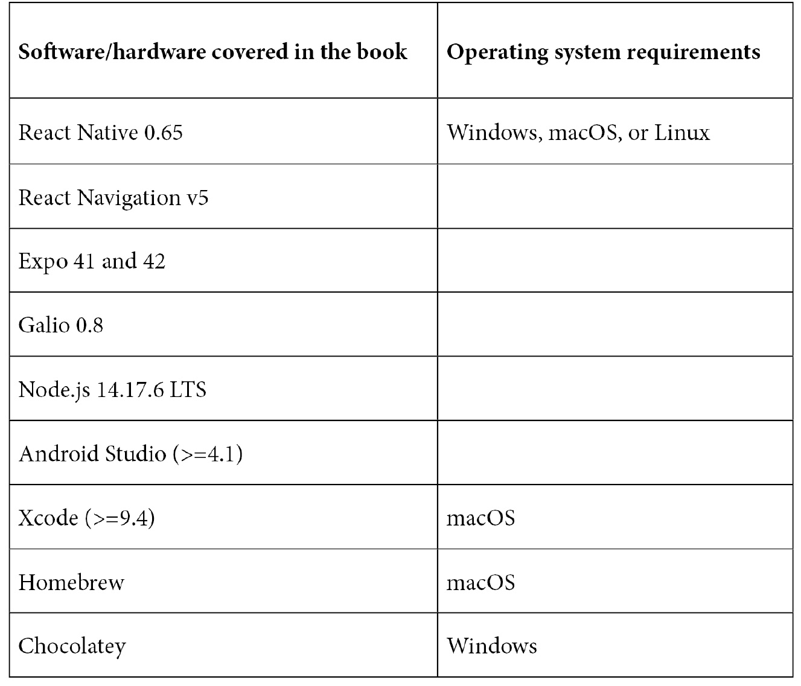

# 零、序言

本书是 Galio 移动应用开发的权威指南，向您展示了如何为自己的想法设置 React 原生项目。通过对基本概念和实例的逐步解释，本书帮助您了解 React Native 的基本知识以及 Galio 的工作原理。

# 这本书是给谁的

本书面向希望学习新技能或构建个人移动应用的开发人员。任何试图改变工作的人，以及初学者和中级 web 开发人员都会发现这本书很有用。需要对 CSS、HTML 和 JavaScript 有基本的了解，才能充分利用本书。

# 这本书涵盖的内容

在[*第一章*](01.html#_idTextAnchor015)*React Native 和 Galio 简介*中，您将了解 React Native 的力量。将有一个简单的介绍什么是 React Native，你会发现 Galio 在哪里，它如何为你节省时间和压力。

在[*第 2 章*](02.html#_idTextAnchor045)*React-Native 基础知识*中，您将了解 React-Native 的基本概念，如 JSX 以及该框架必须提供的基本组件。您还将了解有关应用的正确目录结构以及如何充分利用它的更多信息

[*第 3 章*](03.html#_idTextAnchor063)*正确的心态*处理了任何用户使用 React 时应该采取的方式。这将帮助你养成一些开发移动应用和软件的好习惯。它还可以作为基础和实际创建第一个跨平台移动应用之间的过渡。

在[*第 4 章*](04.html#_idTextAnchor070)*您的第一个跨平台应用*中，您将通过一个实践示例学习如何创建您的第一个跨平台应用。本章旨在介绍包装、如何使用`npm`以及为什么需要 Galio。

在[*第五章*](05.html#_idTextAnchor081)中*为什么是Galio？*我们将讨论 Galio 做得最好的事情，它如何帮助您，以及如何接触和帮助社区使您受益。这将激励您成为开源社区中富有成效的成员，并了解更多关于 React Native 的信息

[*第 6 章*](06.html#_idTextAnchor088)*移动 UI 构建基础*帮助您了解为应用构建基本但美观的 UI 的基础。你可能厌倦了看丑陋的应用，如果有机会，你会想创造一些美丽的东西。本章是关于如何做到这一点的。

在[*第 7 章*](07.html#_idTextAnchor104)*中探索我们的应用*的状态，您将看到这些组件是如何并排运行的，并了解如何、为什么以及在何处使用 Galio 组件。这样做将帮助你发展自己的批判性思维方式。

[*第 8 章*](08.html#_idTextAnchor111)*创建您自己的自定义组件*将教会您如何基于 Galio 构建您自己的组件。您将发现如何将那些已经存在的漂亮组件组合到应用中所需的组件中。

[*第 9 章*](09.html#_idTextAnchor118)*调试和求助*将教会您如何调试自己的应用，并在需要时寻求帮助。

在[*第 10 章*](10.html#_idTextAnchor128)*构建启动屏幕*中，您将开始创建 React 原生应用；我之所以选择启动屏幕，是因为它通常是您打开应用时看到的第一个屏幕。

在[*第 11 章*](11.html#_idTextAnchor141)*中，让我们构建—秒表应用*，您将学习如何组合您的第一个屏幕并使用 React 导航将其连接到秒表屏幕。这个屏幕将有点困难，因为它有一个真实的用例，但这将使事情更有意义。

[*第 12 章*](12.html#_idTextAnchor153)*接下来该怎么办？*在这里，您将学习更多关于 React Native、Galio 的知识，以及如何转变自己，从而成为一名伟大而成功的移动开发人员。

# 充分利用这本书

我假设您将具备 HTML、CSS 和 JavaScript 的初级知识。有一定的 React 经验肯定是一个优势，但这不是必要的。您需要安装有最新软件的 Windows/Mac 计算机。



**如果您使用的是本书的数字版本，我们建议您自己键入代码或从本书的 GitHub 存储库访问代码（下一节提供了链接）。这样做将帮助您避免与复制和粘贴代码相关的任何潜在错误。**

*读完这本书后，我想让你试着自己重做书中的所有挑战，而不看任何代码，同时在每个练习中加入自己的个人风格。*

# 下载示例代码文件

您可以从 GitHub 的[下载本书的示例代码文件 https://github.com/PacktPublishing/Lightning-Fast-Mobile-App-Development-with-Galio](https://github.com/PacktPublishing/Lightning-Fast-Mobile-App-Development-with-Galio) 。如果代码有更新，它将在 GitHub 存储库中更新。

我们的丰富书籍和视频目录中还有其他代码包，请访问[https://github.com/PacktPublishing/](https://github.com/PacktPublishing/) 。看看他们！

# 下载彩色图片

我们还提供了一个 PDF 文件，其中包含本书中使用的屏幕截图和图表的彩色图像。您可以在这里下载：[https://static.packtcdn.com/downloads/9781801073165_ColorImages.pdf](_ColorImages.pdf) 。

# 使用的约定

本书中使用了许多文本约定。

`Code in text`：表示文本中的码字、数据库表名、文件夹名、文件名、文件扩展名、路径名、虚拟 URL、用户输入和 Twitter 句柄。下面是一个示例：“现在，对于第二行，让我们进入`styles.row2`对象并添加填充。”

代码块设置如下：

```jsx
const styles = theme => StyleSheet.create({
  container: {
    flex: 1,	
    backgroundColor: theme.COLORS.FACEBOOK
  }
});
```

任何命令行输入或输出的编写方式如下：

```jsx
npm i galio-framework
```

**粗体**：表示一个新术语、一个重要单词或您在屏幕上看到的单词。例如，菜单或对话框中的文字以**粗体**显示。下面是一个例子：“在写下您的用户名和密码后，您应该得到以下响应：**成功。您现在以您的用户名**登录。”

提示或重要提示

看起来像这样。

# 联系

我们欢迎读者的反馈。

**一般反馈**：如果您对本书的任何方面有疑问，请发送电子邮件至[customercare@packtpub.com](mailto:customercare@packtpub.com)并在邮件主题中提及书名。

**勘误表**：尽管我们已尽一切努力确保内容的准确性，但还是会出现错误。如果您在本书中发现错误，如果您能向我们报告，我们将不胜感激。请访问[www.packtpub.com/support/errata](http://www.packtpub.com/support/errata)并填写表格。

**盗版**：如果您在互联网上发现我们作品的任何形式的非法复制品，请您提供我们的位置地址或网站名称，我们将不胜感激。请致电[与我们联系 copyright@packt.com](mailto:copyright@packt.com)带有指向该材料的链接。

**如果您有兴趣成为一名作家**：如果您对某个主题有专业知识，并且您有兴趣撰写或贡献一本书，请访问[authors.packtpub.com](http://authors.packtpub.com)。

# 分享你的想法

一旦您阅读了 Galio 的*闪电般快速的移动应用开发，我们很想听听您的想法！请[点击此处，直接进入本书的亚马逊评论页面](https://packt.link/r/1801073163)，并分享您的反馈。*

您的评论对我们和技术界都很重要，将帮助我们确保提供高质量的内容。