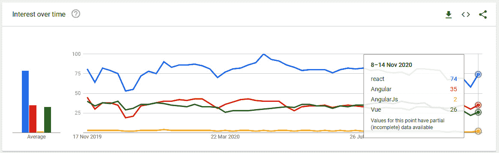
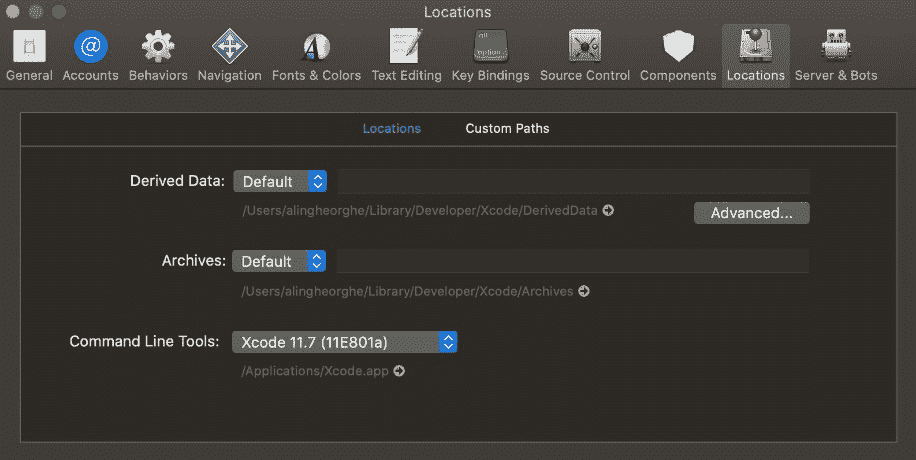
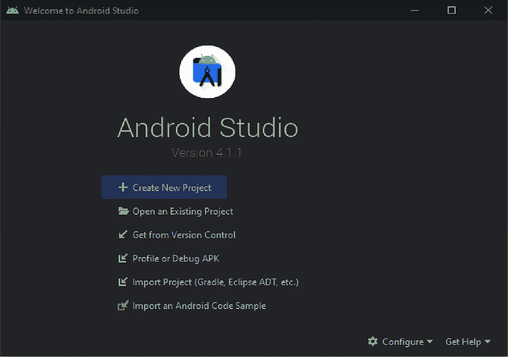
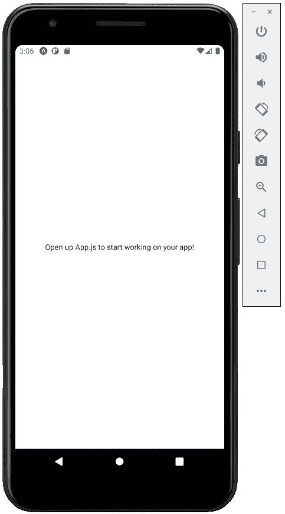

# 一、React Native 和 Galio 简介

让我们从了解这本书的内容开始，了解它如何帮助您学习如何使用 React Native 和 Galio。通过阅读本书，您将了解如何安装 React Native 以及在 macOS 和 Windows 中使用它所需的所有工具。然后，您将了解如何创建 Expo 项目以及我们使用 Expo 的原因、模板工作流之间的差异以及它们如何派上用场，以及如何在物理设备和模拟器上启动新项目。事情应该很容易理解，所以你可能会发现这种经历是有益的。

了解跨平台移动编程的世界并非易事，但肯定是可行的。您购买了本书，迈出了第一步——第二步目前正在进行中，因为您正在阅读本书，了解 React Native 是如何工作的，Galio 是如何帮助您更快地构建应用的。这本书的主要目的是让你习惯 React Native 是如何工作的，如何在你的项目中使用它，以及 Galio 是如何派上用场并可能为你节省大量时间的。

我能理解这在一开始可能不是一项容易的任务，但我强烈建议根据需要反复阅读每一部分。如果一开始有些东西可能不太容易理解，您可以在诸如堆栈溢出或不同的子 Reddit 之类的地方提问。我们将在本书后面深入了解寻求帮助的地方。

起初，包括我在内的大多数程序员认为跨平台移动编程框架可能比本地框架慢得多。这只是一个想法，因为我们将看到 React Native 是创建移动应用的一个非常好的方法，因为与本机应用相比，它们一点也不慢。

你很快就会明白，这本书与 Galio 有着紧密的联系，我相信 Galio 是最漂亮的 UI 库之一。Galio 将帮助我们更快、更具风格地构建 React 原生应用，这比我们自己所能做到的还要快。

您还将学习许多开发自己的 UI 的方法，以及如何在开发应用时开始跳出框框思考。这一点很重要，因为它可以区分成功的应用和失败的应用。

学习设计和编程的基本规则只是成为一名完整前端开发人员的第一步。学习如何打破这些规则将进一步发展你的技能。

有时，在最需要的地方会出现一些提示，遵循这些提示将有助于任何试图进入程序员思维的人。

在本书的最后，您将找到关于如何为您的移动应用开发更复杂 UI 的练习和许多提示。所有这些都有一个伟大的目的，那就是在拥有良好基础的同时发展一种编程风格。

我坚信，在本书的结尾，任何人都应该能够创建至少一个基本的跨平台移动应用，作为个人项目的良好 MVP。学习和体验本书中所写的内容不仅对您学习使用 React Native 和 Galio 起着重要作用，而且对您作为程序员也起着重要作用。

本章将涵盖以下主题：

*   为什么会有 ReactNative？
*   Galio–最佳 UI 替代方案
*   配置本机环境
*   创建第一个本地项目

# 为什么会有 ReactNative？

所以，你可能会想知道，“为什么会有 ReactNative？”。现在有很多跨平台的框架可用，比如 flatter、Xamarin 和 Cordava 等等，所以我们需要理解为什么 React Native 是移动应用开发的一个很好的选择。

你需要明白没有正确的选择。这只是基于当前的市场环境和个人欣赏。

编程框架就像画笔。画家有多种画笔，每种画笔都有不同的用途。你需要尽可能多地了解你正在使用的工具，因为画家对画笔了解得越多，他们就越能画画，并将他们的视觉带入生活。

您需要学习如何使用 React Native 快速轻松地开发跨平台应用。那么，让我们更深入地了解一下为什么 React Native 是应用开发的最佳选择。

## 你只能学一次

首先，ReactNative 基于 React，这意味着你只需学习一次，就可以在任何地方发展。这是一个扩展你技能的好方法。通过学习 React Native，您将准备为您的网站编写 React 代码。

这将使您很容易理解为什么这是一个如此伟大的选择。假设您已经创建了一个应用。你的应用很酷——人们开始从应用商店或 Google Play 下载它——但更有用的是一个登录页。因为您已经学会了 React Native，所以将您的技能用于 React 将是小菜一碟。

## 更大的人才 pool

回到以前的编程时代，当你有了一个应用的想法并想要开发它时，你必须搜索一个具有 C#或 Java 技能的后端开发人员，一个具有 Objective-C 技能的 iOS 开发人员，一个必须了解 Java 的安卓开发人员，甚至可能还有一些应用网站的 web 前端开发人员。

这需要大量的努力和相当大的预算。在项目结束时，你的想法可能在今天的市场上行不通，你会损失很多时间和金钱。

现在，所有这些特定的工作都可以由 JavaScript 工程师来处理——我们有多种本机框架的替代方案，它们工作得同样好，但它们是用 JavaScript 编写的，JavaScript 是目前使用最多的语言之一。JavaScript 开发人员在市场上甚至更容易获得，从一个框架到另一个框架的转换比以往任何时候都要容易。通过雇用一名 JavaScript 开发人员，预算减少了一半，应用的开发速度更快，即使他们有不同的工作，他们也可以互相帮助。

JavaScript 开发人员可以轻松地更换团队。后端开发人员可以帮助前端开发人员甚至移动应用团队。他们可以去任何你需要更多人力的地方帮助你更快地推动发展。当您的一位开发人员因辞职或生病而失踪时，这一点尤为重要。

对于任何应用开发来说，拥有更多的人可供选择是一个巨大的优势。

## React 的人气

你可能会认为 React 的受欢迎程度与 React-Native 无关，但实际上，React 和 React-Native 在编写代码和方法上非常接近。我的建议是始终关注谷歌趋势，因为它可以帮助我们了解框架是否流行：



图 1.1–谷歌趋势显示 React 目前的受欢迎程度

React 使开发人员能够轻松构建出色的 web UI，但基于组件的方法也使应用更易于维护。React Native 为移动应用开发领域带来了所有这些优势。

那么，这向我们展示了什么？有一个相当大的搜索 React 的社区，React Native 拥有最大、最活跃的社区之一。对于您可能遇到的几乎每一个小问题，都有人已经在 GitHub 上写了一篇文章或为它打开了一个问题。社区在 GitHub 上也非常强大，这将非常有帮助，因为你可以与更多的开发人员联系，就你可能在应用中使用的任何库寻求帮助，并就你可能有的任何开源想法获得更多帮助，这可能会帮助很多开发人员。

我建议每个人都为开源项目做出贡献，因为这将有助于发展你的技能，并像程序员一样扩展你的思维方式。社区是如此的有用和友好，你可能会发现很难切换到任何其他框架，因为这似乎是满足你大多数需求的最佳选择。

## 性能

React Native 从性能角度来看与本机应用非常接近，但您必须以正确的方式使用它。从技术上讲，您有一个 JavaScript 线程正在运行，与本机代码（如 Android 的 Kotlin 或 iOS 的 Swift）相比，这相当慢。

React Native 之所以引人注目，是因为它在 JavaScript 线程和本机线程之间建立了一座桥梁。它旨在将最昂贵和功能最强大的任务（如渲染）移动到本机端。这是异步使用的，因此 JavaScript 线程不必等待本机计算。

假设用户按下一个按钮，React Native 会将此转换为 JavaScript 可以处理的事件。之后，通过在本机平台（如 iOS 或 Android）和 JavaScript 代码库之间发送消息，React 本机网桥将本机事件转换为 React 组件可以理解并响应的事件。

这里存在某些挑战，例如默认组件（由 React Native 提供的内置元素）在两个平台上的外观或响应都不相同，因为存在太多特定于平台的事件。不过，不必担心，因为这种桥接架构允许我们使用来自平台、SDK 和 JavaScript 库的所有现有本机视图。

## 语言

JavaScript 被创建为客户端语言。它是为了使网站具有交互性而建立的。如果你想一个基本的网站布局，你有你的 HTML，它描述了基本的内容和网站的结构，然后你有你的 CSS，它的样式的 HTML，使它漂亮。这是一个静态的网站，没有做很多，所以我们需要一种编程语言，可以添加功能到我们的网站，使它的生活。这就是 JavaScript 进入游戏的地方。

随着时间的推移，人们意识到他们可以用 JavaScript 做更多的事情。JavaScript 最常用的用法是客户端，但自从 Node.js 出现在编程场景中以来，该语言已经发展得如此之快，不再是这种情况。JavaScript 现在是一种通用编程语言，这意味着您可以使用它构建几乎任何东西。您甚至可以使用 TypeScript 或 Flow 输入 JavaScript。代码编辑器内部的支持也得到了很大改善。

说到这里，React Native 使用 JavaScript 作为其主要编程语言。*随着我们了解更多，我们将看到 React Native 也可以使用本机代码运行得更快，并进行更好的计算*。

Stack Overflow（最大的程序员社区之一）每年都会进行一次调查，试图更多地了解开发人员和使用他们平台的人。你可以向任何开发者询问他们的平台，几乎任何人都可以告诉你他们至少浏览过一次。他们 2020 年的研究表明，他们近 70%的用户群是由使用 JavaScript 的专业开发人员组成的。

作为一种通用语言，为 React Native 或其他框架学习它只能帮助您扩展作为程序员的领域。React Native 使用它这一事实是一个巨大的优势，因为它显示了这使您能够在技术之间移动是多么容易。

有关 2020 年研究的堆栈溢出统计信息，请访问[https://insights.stackoverflow.com/survey/2020](https://insights.stackoverflow.com/survey/2020) 。

## 得出结论

在阅读了关于 React-Native 的所有内容后，我们需要了解，尽管 React-Native 不如本机应用快，但它几乎可以和本机应用一样快。如果我们考虑到这种语言对我们开发者来说有如此多的机会，而且社区如此强大和友好，我们可能会认为 React Native 是跨平台移动应用开发的最佳框架之一。

要选择适合你需要的图书馆，你需要考虑对你来说最重要的东西。我希望您对 React Native 了解多一点，并且相信这个框架对**您**来说是一个不错的选择。

接下来，我们将进一步了解什么是 UI 库，以及 Galio 在编写代码时如何像一个伟大的助手一样帮助我们。

# Galio–最佳 UI 替代方案

所以，你已经了解了一两件关于 React Native 如何工作的事情，现在你想知道 Galio 能如何帮助你。首先，Galio 到底是什么？

简单地说，Galio 是一个 React 本机 UI 库，因此它是一个资源集合，旨在帮助开发人员更快、更轻松地编写代码。问题是。。。React Native 没有那么多组件。我们将在本书后面回到组件的确切含义，但现在，只需将它们视为拼图。

React Native 有一定数量的拼图，每个拼图都尽可能简单。Galio 以包装的形式出现在这些拼图上，并添加了一些颜色和功能。有时，你甚至可以找到不同的部分，它们是由于特定的原因，通过将更多的基本部分组合成一个真正大的部分而构建的。

现在，让我们来看一下为什么 Galio 可能是跨平台移动开发过程中最适合您的 UI 库。

## 时效

好吧，也有很多比喻。问题是，React Native 只有基本外观的组件，这使得开发人员可以构建自己的组件。这非常耗时，因为您总是需要为新应用构建新组件。

这就是 Galio 派上用场的地方！它包含了许多已经很漂亮的组件，可以减轻您一直在创建自己的组件的痛苦。

此外，所有组件都更易于定制，并且仍然适合整个设计布局，而不会给开发人员带来太大的压力，让他们思考如何做以及从哪里开始。从 Galio 定制组件的过程很简单，通常都是围绕着使用道具进行的，这使得整个过程更具可读性。

我知道像“组件”和“道具”这样的词现在对你来说完全或者可能只是有点陌生，但重要的是它们为你节省了很多时间。我们将很快了解更多关于这些关键词的信息，但我们需要了解一点所有这些技术在总体上的意义。

使用 Galio 构建应用通常更多地是关于您选择如何创建布局，而不是实际编程 UI。它使用一种直接的方式，通过将每个组件放置在前一个组件下来创建移动屏幕。这使得我们在编码和思考最终屏幕应该是什么样子时，效率更高，浪费的时间尽可能少。

下图显示了您可以使用我们讨论的拼图片段创建的基本程序结构：


图 1.2–显示添加更多组件如何帮助构建移动屏幕

这是一种很好的思考方式，因为它能让你理解原子设计的一些最佳原则。它还创建了一个更有序的代码库，您可以将其扩展为更复杂、更完整的应用。

## 真的很美

事实上 Galio 已经考虑到了一个设计系统，这意味着所有组件都将遵循相同的设计原则，因此组件之间永远不会有任何差异。

一致的设计是使应用完整的关键。一致的设计将帮助用户更好地理解您的应用流程、您希望包含在应用中的所有符号以及如何使用。这一切都是为了与您的按钮、文本和设计保持一致。

一开始你可能不一定喜欢这些颜色，这是可以的，因为你可以在`<GalioProvider>`的帮助下轻松地改变它们。我们将在本书的后面部分讨论这个问题。

现在，我们已经了解了为什么 React Native 是一个很好的选择，为什么 Galio 是我们开始构建应用的一个很好的 UI 库。下一步是了解如何配置良好的环境，以便我们可以开始构建跨平台的移动应用。

# 配置本机环境

有两件事我们需要知道：**Expo**和**React Native CLI**。

它们都很容易安装，我们将对它们进行检查，以确保覆盖所有可能的地面。我建议不要跳过这一部分，因为它将帮助您在开始开发移动项目时做出一个好的选择。

与 Windows 相比，macOS 上的安装要容易得多，因为 macOS 是基于 UNIX 的系统，所以终端的功能要强大得多。但不用担心，我们也会为 Windows 解决这个问题。

在继续前进之前，我们必须考虑一些要求。这些将帮助我们为 Expo 和 React 本机 CLI 以及 JavaScript 编程创建一个良好的环境。

我们需要为任一系统安装以下技术：

*   自制-仅限 macOS
*   巧克力-仅限窗户
*   Node.js
*   文本编辑器
*   安卓工作室
*   Xcode–仅限 macOS

我们将首先安装 Node.js，这是 JavaScript 在浏览器之外运行所需的最重要的技术之一。Node.js 构建在 Chrome 的 V8 JavaScript 引擎上，这意味着您可以运行在最新 Chrome 版本（web 浏览器）上运行的任何 JavaScript 代码。

安装 Node.js 的推荐方式取决于您的操作系统。对于 macOS 用户，最好的方法是使用自制软件，而对于 Windows 用户，则使用巧克力。Homebrew 和 Chocolate 是软件包管理器，可让您通过命令行或终端轻松、快速地安装不同的软件包，如 Node.js。您也可以通过官网[进行安装 https://nodejs.org](https://nodejs.org) ，但我们将在本书中使用自制或巧克力。

## 自制

对于 macOS，我们有自制软件，它易于安装。您可以在他们的官方网站[上找到更多信息 https://brew.sh](https://brew.sh) 。

要安装它，请打开**终端**并写入以下命令：

```jsx
/bin/bash -c "$(curl -fsSL https://raw.githubusercontent.com/Homebrew/install/master/install.sh)"
```

写入命令后，按*键进入*。将显示有关将要安装的所有内容的更多信息；只需再次按*回车*，您就可以出发了。

## 巧克力

对于 Windows，我们有巧克力，巧克力的安装比自制的要复杂一点，但是按照这里的步骤，您应该已经准备好了。您可以访问他们的官方网站[了解更多关于巧克力的信息 https://chocolatey.org](https://chocolatey.org) 。

首先，我们需要使用具有管理权限的 PowerShell。要访问它，只需按键盘上的*Windows 徽标+X*即可。新菜单将出现在屏幕的左下角。在此处，选择**Windows Powershell（管理）**。一个新窗口将打开。

首先，您需要验证`Get-ExecutionPolicy`是否不受限制，因此请在 PowerShell 中编写以下内容：

```jsx
Get-ExecutionPolicy
```

如果返回`Restricted`，则需要运行以下命令：

```jsx
Set-ExecutionPolicyAllSigned
```

现在，您可以运行以下命令：

```jsx
Set-ExecutionPolicy Bypass -Scope Process -Force; [System.Net.ServicePointManager]::SecurityProtocol = [System.Net.ServicePointManager]::SecurityProtocol -bor 3072; iex ((New-Object System.Net.WebClient).DownloadString('https://chocolatey.org/install.ps1'))
```

现在，请等待几分钟，以便安装所有内容。如果您在安装过程中没有遇到任何错误，只需键入`choco`即可返回您的巧克力版本。如果它确实返回了它，那么您已经准备好了，可以开始了。

我们现在需要做的就是安装 Node.js，以便了解 Expo 和 React Native CLI。安装了自制软件或巧克力后，您只需编写以下命令和 Node.js 即可开始安装：

*   在 macOS 上使用以下命令：

    ```jsx
    brew install node
    ```

*   在 Windows 上使用以下命令：

    ```jsx
    choco install -y nodejs
    ```

祝贺我们现在准备好前进了！这样，我们就安装了 Node.js。在设置我们的环境之前，让我们先讨论一下文本编辑器——我保证不会花太长时间。

我打赌你在想等等，他说我们可以在 Word 文档中编写代码吗？。嗯，不是真的。Microsoft Word 不是纯文本编辑器，但您可以使用记事本之类的工具来编写代码。仅仅因为我们可以使用记事本并不意味着我们会使用它；看起来不太专业，是吗？

我们将要使用的文本编辑器类型将具有一些很酷的特性，例如代码语法的颜色方案，以及帮助我们更快、更漂亮地编写代码的不同附加组件。

有许多不同的自由文本编辑器，包括 Sublime、Atom、VisualStudio 代码、Notepad++和括号。它们都一样好，我建议你至少下载两到三个，然后去看看。我个人的偏好是 VisualStudio 代码，我将在本书中使用它。如果您不喜欢它的外观，您不需要使用相同的文本编辑器，因为您可以使用上述任何一种编辑器来阅读本书。

您可以从[下载 Visual Studio 代码（或仅下载 VSCode）https://code.visualstudio.com/](https://code.visualstudio.com/) 。

现在我们已经准备好了一些必需品，是时候继续学习世博会和 React Native CLI 了。这两种方法都可以达到相同的效果——它们只是创建 React 原生应用的不同方法，我们将尽可能多地理解它们。了解他们的一切将有助于我们为自己和应用选择合适的应用。

## ReactNative CLI

React 原生 CLI 是官方的，也是创建 React 原生项目的第一种方法。它通常更难配置，而且比 Expo 花费更多的时间，但这是值得的。毕竟，你需要一个模拟器在不同的手机上测试你的应用。我建议不要跳过这一节。

### 马科斯

拥有 macOS 的一个好处是，你可以模拟 iPhone，看看你的项目在不同的苹果技术上是什么样子。这是在 Windows 上无法做到的，但 Android 在这两种平台上都能工作，因此 macOS 在能够模拟所有类型的平台方面具有优势。

我们应该开始安装所有必要的依赖项；打开终端并写入以下内容：

```jsx
brew install watchman
```

Watchman 是 Facebook 开发的一个工具，用于监视文件系统内部的更改。它还提供了更好的性能。

现在，您需要安装 Xcode。继续打开 Mac 应用商店，搜索 Xcode，然后点击**安装**。这还将安装 iOS 模拟器以及构建 iOS 应用所需的其他工具。您的 Xcode 版本必须至少为 9.4，React Native 才能使用它。

现在，我们需要 Xcode 命令行工具包。一旦 Xcode 完成下载和安装，打开它并进入**首选项**（在导航栏的 Xcode 菜单下；或者，只需按*Cmd+，*。应该会打开一个新窗口。通过从下拉列表中选择最新的版本，转到**位置**并安装命令行工具：



图 1.3–Xcode 中的首选项窗口

现在，转到**组件**选项卡，安装您希望使用的最新模拟器。

重要提示

苹果支持的每个 iOS 版本都有一个模拟器。您应该尝试安装最后两个主要版本，因为您的应用用户可能总是使用以前的 iOS 版本。

您现在需要做的就是在终端中写入以下内容来安装 CoCoapod：

```jsx
sudo gem install cocoapods
```

这是一个 RubyGem，用于管理 Xcode 项目的依赖项。

有了这些，你就可以在 macOS 上创建你的第一个项目了！我们将马上完成这项工作！

### 窗户

正如我们所知，我们无法在 Windows 上为 iOS 安装任何模拟器，因此我们不妨只安装 Android 模拟器。

我们已经安装了 Node.js，所以剩下要做的就是通过访问我们的管理 PowerShell 来安装 JDK（我们在前面安装 Node.js 和 chocolate 时解释了如何打开它）。打开后，写下以下内容：

```jsx
choco install -y openjdk8
```

如果您已经安装了 JDK，请确保它至少是 v8。

现在，是时候安装我们的 Android 开发环境了，这可能有点乏味。然而，这是值得的，因为我们将能够在我们的虚拟 Android 模拟器上运行我们的 React 本机应用。

点击[下载 Android Studiohttps://developer.android.com/studio](https://developer.android.com/studio) 。安装完成后，启动 Android Studio。打开后，选择您喜欢的主题和所有对您的计算机有利的首选项。此时会出现**SDK 组件设置**页面。确保您已选中了**Android SDK**、**Android SDK 平台**和**Android 虚拟设备**复选框。

一旦安装完成，是时候继续了。默认情况下，Android Studio 始终安装最新的 Android SDK。但是，使用本机 Android 代码构建 React 本机应用需要**Android 10（Q）SDK**。要安装，打开 Android Studio，点击窗口右下角的**配置**，选择**SDK 管理器**：



图 1.4–Android Studio 和按钮的位置

现在，选择**SDK 平台**选项卡中的，并选中右下角的**显示包详细信息**框。查找并展开 Android 10（Q），确保选中以下各项：

*   **安卓 SDK 平台 29**
*   **英特尔 x86 Atom_64 系统映像或谷歌 API 英特尔 x86 Atom 系统映像**

接下来您应该选择的是**SDK 工具**选项卡，并选中**显示软件包详细信息**旁边的复选框。查找**Android SDK 构建工具**并选择**29.0.2**。

点击**应用**并下载所有必要的文件。

现在，是时候配置`ANDROID_HOME`环境变量了，这样我们就可以使用本机代码了。打开**控制面板**，点击**用户账号**，再次点击**用户账号**。在左侧，您会发现**更改我的环境变量**；点击它。现在，点击**新建…**并写下以下内容：

*   **变量名**：`ANDROID_HOME`。
*   **变量值**：`C:\Users\{name}\AppData\Local\Android\Sdk`，其中`{name}`为您电脑的用户名：


图 1.5–显示我的用户变量的窗口

要检查环境变量是否已加载，请转到 PowerShell 环境并编写以下内容：

```jsx
Get-ChildItem -Path Env:\
```

你应该看到一个列表，`ANDROID_HOME`应该是其中的一部分。

之后，我们需要在**路径**中添加`platform-tools`。我们可以通过进入**控制面板**，点击**用户账号**，然后再次点击**用户账号**来实现。点击**更改我的环境变量**并查找**路径**。选择**路径**点击**编辑**。将出现一个新窗口，我们可以单击**新建**。现在，使用与我们之前相同的变量值，但这次，进入`Sdk`文件夹–更准确地说，进入`platform-tools`文件夹：

`C:\Users\{name}\AppData\Local\Android\Sdk\platform-tools`

我们现在可以开始在 Windows 上开发 React 本机应用了！

## 世博会

对于初学者来说，世博会是启动 React 本地项目最简单的方式。它附带了一大套为 React Native 构建的工具，但我们现在对此不感兴趣。我们只感兴趣的是，Expo 可以让你在几分钟内启动并运行，而不需要你安装模拟器，因此你可以在几分钟内玩你的应用。

他们还想出了一种叫做零食的东西（[https://snack.expo.io/](https://snack.expo.io/) ），如果您希望直接在浏览器中尝试不同的代码想法，这将非常有用！这是很酷的，因为如果你只想快速绘制一些东西，你甚至不需要开始一个项目。

让我们安装它，看看这是否像我想象的那样简单。打开终端或命令行并写入以下内容：

```jsx
npm install -g expo-cli
```

世博会现在准备就绪！简单，对吗？

### 准备好更进一步了吗？

现在我们已经安装了所有必要的技术，我们准备创建自己的 React 原生项目，并创建一些很棒的应用！

但首先，让我们了解 React 原生 CLI 和 Expo 之间的区别。之前，我告诉过您不要跳过 React Native CLI 部分，尽管它比 Expo CLI 大得多。这是因为我们需要安装 Xcode 或 Android Studio，以便直接从 PC 上控制我们的应用。

我们还没有使用 React Native CLI 或 Expo 创建项目，因为它们的创建方式都不同。但是，我们已经安装了这两个方面的需求。使用 React Native CLI 创建项目时，开发人员的任务是从 0 完全创建应用。你完全可以控制应用，除了你的想象力之外，没有什么可以限制你的能力。您甚至可以使用本机代码–Android 的 Kotlin/Java 或 iOS 的 Swift/Objective-C–创建自己的完全本机组件。不过，这一切都非常先进，我们不需要它。

世博会为那些想要创建一个快速而强大的应用的人们提供了很多工具，而不必考虑应用如何工作以及如何与每个特定平台连接的所有小细节。

因此，我们将使用 Expo 来创建本书中的项目。

# 创建您的第一个项目

我们准备好出发了！让我们打开一个终端，直接进入它！

终端打开后，只需移动到您的`Desktop`文件夹或您希望在其中创建项目的任何文件夹。您可以使用`cd`命令在文件夹之间移动。所以，只要写下`cd Desktop`，我们就到了**桌面**目录，我们已经准备好创建我们的世博项目。

我们可以通过编写以下内容，与 Expo 一起创建一个新的 React Native 项目：

```jsx
expo init MyFirstProject
```

按*进入*后，Expo 告诉我们可以在多种模板中进行选择。最大的两类是**托管工作流**和**裸工作流**：


图 1.6–初始化项目后将看到的内容表示

我们将在几秒钟内解释这两个都是什么。现在，在**管理的工作流**下选择**空白**。等待几秒钟，您将在终端中看到一条消息，说明以下内容：

```jsx
Your project is ready!
```

现在，我们准备好开始了。在终端中写入以下命令；这将使我们进入项目文件夹：

```jsx
cd MyFirstProject
```

现在我们来到这里，让我们了解每种类型的模板是如何工作的，这样我们就可以开始使用我们的第一个 React 本机应用了。

## 管理工作流

托管的工作流尝试处理您必须执行的几乎所有复杂操作。这通常适用于不想用 Xcode 或 Android Studio 使事情复杂化的完全初学者，这正是我们开始使用这种工作流创建项目的原因。您可以通过`app.json`更改应用的所有信息，如图标或启动屏幕，并可以直接轻松访问推送通知等不同服务。

不过，此工作流有一些限制。假设您希望使用 Expo SDK 不通过 API 提供的特定设备功能。这意味着您需要运行`eject`，而`expo-cli`将完成所有工作，并将您转移到**裸工作流**。

## 裸工作流

裸露的工作流程向开发者展示了对应用的完全控制。然而，这伴随着必须处理应用的每一个小细节的复杂性而来。现在，轻松配置`app.json`的功能已经消失，只剩下安装了 Expo SDK，没有进行预配置。

这允许您使用本机代码，并根据需要管理依赖项。您可能会想，“*嗯……这不是和使用 React Native CLI 相同吗？*。嗯，不是真的，因为您可以即时访问 Expo SDK 和 Expo 框架，这本身对开发人员来说是一个巨大的优势，因为它仍然简化了您的开发过程。

## 打开我们的项目文件

现在我们已经了解了每个模板的作用以及我们选择托管工作流的原因，让我们看看代码是什么样子的。

还记得我们讨论文本编辑器的时候吗？继续并打开您选择的文本编辑器。我将使用 VSCode，因为与其他设计相比，我更喜欢这种设计。

点击**文件****打开文件夹**，搜索项目文件夹。我的在`Desktop`文件夹里。打开它可以让我们看到项目中的所有文件和文件夹。

我很确定你对这些文件的用途感到困惑。我们将很快对此进行研究，但现在，请四处看看几分钟，看看您是否可以自己挑选任何东西。

提示

调查您找到并创建的任何代码片段是确保您正在学习您正在阅读或编码的内容的最佳方法。最好的程序员总是那些运用演绎技巧的人。

## 准备我们的物理设备进行预览

是时候准备我们的手机了，这样它就可以预览我们的应用了，因为向朋友炫耀我们的新技能总是很酷的。

所以，让我们去应用商店或谷歌播放和搜索世博会。安装它，您就可以开始了。这个应用允许我们在手机上测试我们的应用，所以让我们来测试一下吧！

如果您还没有到达终点站，请转到项目文件夹。编写以下命令：

```jsx
npm start
```

之后，按*进入*。应在默认浏览器中打开一个新窗口。服务器已经创建，现在可以在物理设备甚至模拟器上预览您的应用。侧边栏上有一个二维码，上面有一个链接和一些按钮。这是什么？我们如何利用它？


图 1.7–屏幕上显示的所有按钮预览

现在，您可以打开智能手机，扫描二维码或将二维码上方的链接粘贴到浏览器中。将出现一条消息，询问您是否同意打开与世博会的链接。按下**是**按钮，您就可以看到它了——您在物理设备上的第一个 React 本机应用。

很酷吧？

让我们看看如果我们在 Android 设备/模拟器上按**运行**或在 iOS 模拟器上按**运行**会发生什么。右上角会出现一条消息，告诉您 Expo**正试图打开模拟器**。根据启动项目的操作系统和安装的模拟器，选择相应的按钮。

对于 Android 模拟器，您必须首先打开 Android Studio。然后，您必须进入右上角，上面写着**配置**，然后选择**AVD 管理器**。现在，将出现一个新窗口，显示所有可用的虚拟设备。如果您没有看到任何虚拟设备，请转到左下角并单击**创建虚拟设备**。

此时，您将看到 Android 设备的列表。我选择了像素 3a，但是如果你的 CPU 不是很强，你可以选择一个旧的。然后点击**下一步**；系统将要求您选择一个系统映像。找到**推荐**旁边的**x86 图片**标签，选择不需要下载的图片**Q**。如果所有这些都需要下载，那么您需要返回到 Android Studio 安装部分并重复该过程。选择图像后，点击**下一步**并命名 AVD；它可以被称为任何东西，所以要有创造力。点击**完成**；您应该可以在**AVD 管理器**列表中看到您的设备。在同一行的右边，你会发现一个小的绿色按钮，看起来像是**播放**符号。点击它。

一个新的 Android 模拟器将打开，让我们回到浏览器选项卡，在那里运行 Expo 服务器，然后单击**在 Android 设备/模拟器上运行**。如果你看看终端内部，你会看到一些文字出现了。我们只需等待一秒钟，Expo 客户端就可以下载并安装到我们的模拟器上。应该这样说：

```jsx
Downloading the Expo client app [================================================================] 100% 0.0s
Installing Expo client on device
Opening exp://192.168.1.111:19000 on Pixel_3a_API_30_x86
```

现在，您的 Android 模拟器应该显示您的第一个 React 本机应用的预览。感觉如何？您已经经历了很多，但最终，能够正确初始化项目是非常有益的：



图 1.8–Android 模拟器显示了一个全新的 React 原生项目

在我们继续之前，我认为我们应该学习如何在终端/命令行中关闭项目。返回终端窗口并单击它，使其处于焦点位置。现在，如果您按下*Ctrl+C*，服务器应该停止，您应该能够再次使用终端的该窗口。

# 总结

本章首先简要介绍 React Native 和 Galio，然后我们了解了为什么这些库适合您的下一个个人跨平台移动应用项目的主要关注点。在充分理解了为什么学习这些库将帮助它们在未来成为巨大的资产之后，我们开始建立我们的 React 原生环境，学习测试和使用我们即将创建的移动应用的所有知识。

然后，我们创建并测试了第一个 React 本机应用！对于一个新来者来说，这是一段进入这个美丽的编程世界的旅程，相信我，这一切都是值得的。你在这里学到的一切都将作为下一步的基础。这不是很令人兴奋吗？在下一章中，我们将学习 React 本机代码编写的基础知识，并创建更酷的应用。