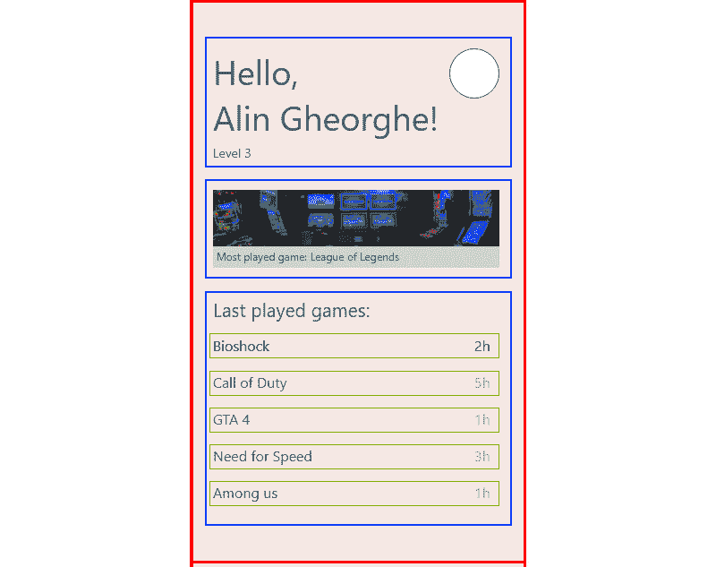
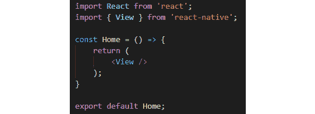
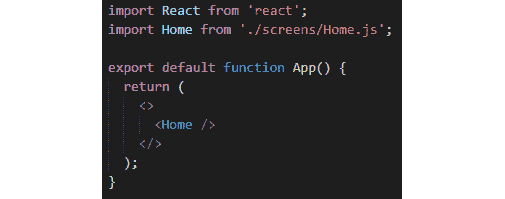
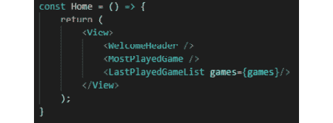
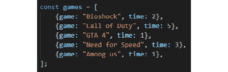
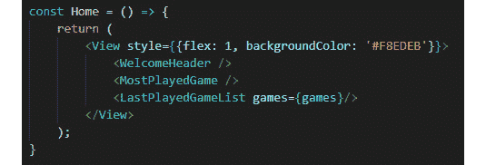
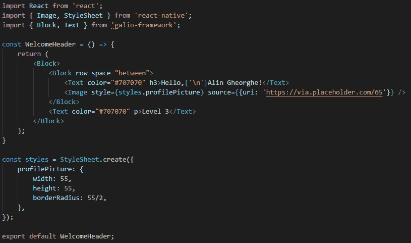
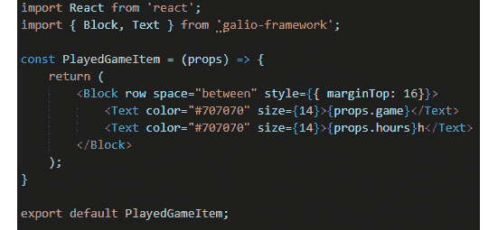

# 四、您的第一款跨平台应用

我们从学习如何设置 React 本地开发环境开始。之后，我们继续学习 JSX、组件和道具。我们已经学到了很多，我们应该对未来充满信心。但是如果你仍然觉得缺少了什么，那么你是对的。我们还没有设计任何样式，我们还没有构建真正的屏幕。

本章将围绕我不久前提出的一个应用理念展开，该理念会不断追踪你的游戏历史。我们不会开始讨论服务器和数据库，因为它们超出了我们的学习范围，特别是因为我们有更大、更重要的东西要学习。我们将从详细介绍我们的应用的所有信息开始，同时使用我们在前几章学到的一切。

之后，我们将开始创建应用的静态版本，这样您就可以在创建应用之前了解大脑需要如何思考。学习了前几章中的所有原则将有助于我们更轻松地理解第一个真正的作业，因此，如果您还有什么不确定的地方，请回到前几章，看看您认为可以改进的地方。

下一步是学习样式。我们将深入了解 React Native 的样式以及如何使用它。我们将了解什么是 flex，以及如何在我们的应用中使用它，同时也将了解我们可以用来简化开发的技巧。

在设计应用的样式之后，我们将重构代码，同时保持迄今为止构建的所有内容完好无损。这就是 Galio 的用武之地，它将帮助我们认识到，已经构建了组件供我们使用是多么有用。我们将学习如何使用最重要的组件之一构建布局，而不用担心为容器创建不同的样式。

之后，我们将在手机上安装该应用。这是一个单屏幕应用，因此我们将使用手机进行测试。我们还将学习一些基本技术，以确保我们的应用在所有屏幕大小上都能顺利运行。

一切似乎都很简单明了，对吧？让我们直接进入并开始构建我们的应用。本章将介绍以下主题：

*   构建我们的第一个应用
*   创建第一个屏幕
*   让我们来设计它！
*   超级英雄，Galio
*   让我们把它安装在手机上

# 技术要求

您可以通过访问 GitHub[查看本章的代码 https://github.com/PacktPublishing/Lightning-Fast-Mobile-App-Development-with-Galio](https://github.com/PacktPublishing/Lightning-Fast-Mobile-App-Development-with-Galio) 。您将找到一个名为`Chapter 04`的文件夹，其中包含我们在本章中编写的所有代码。要使用该项目，请按照`README.md`文件中的说明进行操作。

# 构建我们的第一个应用

让我们开始讨论我们的应用的主要思想，以及我们将如何开始构建它。我们将调用这个应用**MGA**，它是**我的游戏历史**的缩写。很聪明吧？它只有一个屏幕，一旦用户登录，它将充当欢迎屏幕。我们将假装用户已经登录到我们的应用，因此我们只对主屏幕进行编码，而不查看授权，这是一个更高级的概念。

通过对屏幕外观的清晰理解和对组件用途的描述，我们正在构建一条清晰的开发道路。最后，如果我们不做所有这些准备，我们会在编程过程中陷入困境，我们不希望这样。

我们应该先看看我们的设计，确定它的主要用途，以及如何开始将屏幕划分为组件：


图 4.1–我的游戏历史记录的主屏幕

看起来很棒，对吧？嗯，它应该是因为这一次，我们将全面实现这个屏幕中的所有内容，甚至是颜色和元素定位。毕竟，这是我们第一次完全创建屏幕。

让我们试着思考如何将所有内容分割成更小的部分，这是 UI 创建中最重要的步骤之一。请记住，这是必须的，因为如果我们只是编写所有代码，而不考虑任何策略，我们会遇到一些问题。

我们将使用正方形来容易地识别屏幕上的每个元素，所以让我们来看一看：



图 4.2–组件划分

我在这里将整个屏幕进行了分区，并对其进行了颜色编码，以便您可以更好地看到它们：

*   **主页***红色*：我们的容器组件，也称为我们的屏幕。
*   **WelcomeHeader**（*蓝色*）：包含用户的所有基本信息，如姓名、级别、个人资料图片等。
*   **MostPlayedGame**（*蓝色*）：这将是一个容器，它将接收有关最常玩的游戏的信息，但也会接收一张图片。
*   **LastPlayedGameList**（*蓝色*）：包含项目列表。
*   **PlayedGameItem**（*绿色*）：这是一个单独的项目，显示玩得最多的游戏以及每个游戏花费的时间。

正如我们所看到的，我们对三个不同的组件使用相同的颜色。为什么呢？因为这三个组成部分在我们称为`Home`的更大的主要组成部分中同样重要。在我们的组件树中，它们都位于同一级别。尽管`Home`组件是一个屏幕，但它的定义与组件的定义相同，当我们开始编码时，你会明白我的意思。

现在我们已经划分了我们的组件，我们准备继续并开始编写我们的应用。

# 创建您的第一个屏幕

一旦开发计划完成，我们知道每个组件需要去哪里以及我们的应用将是什么样子，我们就准备创建一个新项目。这个项目将为我们成为 React 本地开发人员的创造性道路奠定基础。

让我们从创建一个新项目开始：

1.  转到首选目录中的终端并运行以下命令：

    ```jsx
    expo init mga
    ```

2.  选择 Apple T0 管理的工作流 Oracle T1A.的空白模板并打开项目文件夹。
3.  As we mentioned previously, we'll have five different components, one of which will be the screen itself. So, let's create two different directories called `screens` and `components`. This will make it easier to organize when we have several different screens.

    这是一个很好的经验法则，当你开始编码时，你的头脑中总是有一个基本的结构，因为你永远不知道什么时候你可能会想要在你的应用中添加越来越多的内容。

4.  Inside our `screens` folder, let's create a file named `Home.js`. This will be our main screen, so we will begin by writing the most essential code for a component. This is just the boilerplate for a functional component. Remember how those were created? We did this in [*Chapter 2*](02.html#_idTextAnchor045), *Basics of React Native*. Now, try to do it by yourself and come back here once you've managed to do it:

    

    图 4.3–基本主屏幕，除视图组件外无需渲染

5.  Once you've done that, we must go to our main file, `App.js`.

    在这里，我们将首先删除主文件中不需要的所有内容。我们不需要所有的样式，`StatusBar`导入，甚至不需要任何从 React Native 导入的组件。

6.  After deleting everything, we can import our component right after the `React` import and place it inside our main `App` function.

    因此，我们的新组件现在应该如下所示：

    

    图 4.4–删除所有不必要代码后的 App.js 文件

    你可能会想，“那么，奇怪的`<>`语法是怎么回事？”。这是**片段**的简短语法，这是一个 React 特性。使用此选项可以避免在组件树中添加更多不必要的节点。我们本可以使用`<View />`组件，正如我们在前面的示例中所看到的，但是通过使用**片段**，我们为组件创建了一个包装器，而没有不必要的包装组件，因为我们不会在主文件中设置任何样式。

    如果这仍然会产生一些问题，您可以轻松地将`<Home />`组件包装成`<View />`组件。

    现在我们来到这里，让我们看看我们的`components`文件夹，并创建我们将要处理的所有必要文件。

7.  创建四个名为`WelcomeHeader.js`、`MostPlayedGame.js`、`LastPlayedGameList.js`和`PlayedGameItem.js`的新文件。
8.  让我们对每个新创建的文件执行与`Home.js`相同的操作。你甚至可以从`Home.js`文件中复制代码，然后粘贴到每个文件中；只是别忘了将名称从**Home**更改为组件的名称。

既然我们已经初始化了所有的文件，我们就可以开始编写代码了。我们应该看到这些组件与前一章的组件之间有一些相似之处。这几乎是一样的，所以你应该对我们如何前进有一个想法。

我们将从`WelcomeHeader.js`开始，然后查看我们的每个文件。如果你现在启动你的应用，你会看到一个空白的白色屏幕。现在我们将忽略这一点，只需用一些基本的静态代码来勾画我们的应用，这样我们就有了一些开始设计样式的基础。

打开你的文件，这样我们就可以开始添加一些新元素了。我们可以从组件内部可能需要的设计中观察到什么？首先，有很多**文本**，但我们还需要**剖面图**（组件右侧的圆圈）。知道了这一点，我们现在可以开始导入此操作所需的组件，因此继续编辑第二行，我们在其中导入`View`组件，使其看起来像这样：

```jsx
import { View, Text, Image } from 'react-native';
```

还记得我们说过，如果组件在同一条线上，我们应该对它们进行分组吗？当我们开始设计样式时，这将使事情变得更容易，因为这些组件位于同一水平线上。

所以，我首先在我们的主`View`组件中添加了另一个`View`。之后，我将添加位于同一行的组件：我们的欢迎*消息*和我们的*个人资料图片*。在这个`View`组件下面，我们将添加另一个`Text`组件，它将呈现我们的`Level`：


图 4.5–WelcomeHeader 的静态版本

在[*第 2 章*](02.html#_idTextAnchor045)*React Native*的基础知识中，我们讨论了`Image`如何需要一个源来工作。这就是我们使用`source`道具并传递占位符图像链接的原因。使用占位符更容易，因为我们不需要浪费时间搜索图像，而我们的主要目的是现在只编写静态版本的代码。

让我们继续并开始编码我们的下一个组件：`MostPlayedGame`。正如我们所看到的，在这里，我们需要与我们在前面的组件中所做的相同的事情。所以，让我们导入所有内容并在组件中使用它。完成后，我们将使用组件显示所有信息。现在，您的代码应该如下所示：


图 4.6-MostPlayedGame 的静态版本

我在占位符链接中写了`300`而不是`75`，因为这会改变图像的宽度。但除此之外，这很容易理解。

在这一点上，我们会注意到一些非常有趣的事情。我们有一个遵循我们习惯的模式的列表。这是一个项目列表，每个项目都呈现一个我们玩过的游戏以及我们玩了多少。我们可以复制以前使用过的相同模式，它将非常有效：


图 4.7–PlayedGameItem 组件

我相信您还记得将`props`从父组件传递到子组件是多么容易。如果我们已经知道某些组件应该如何编码，我们就不应该浪费时间。现在，是时候创建列表了，就像我们上次做的一样，但是现在，我们在列表中有另一个元素，`Text`组件作为我们组件的标题：


图 4.8–完成的 LastPlayedGameList 组件

我们进展很快，但那是因为我们已经经历了这一切，所以你应该了解这里发生了什么。我们的代码现在的问题是我们没有向我们的物品发送任何信息。我们没有`map`函数需要运行的数组。正如你所看到的，这个数组来自`props`，因此我们的`LastPlayedGameList`组件需要一个名为`games`的**道具**和一个数组，这样它就可以开始呈现我们的游戏列表。

让我们进入我们的**主页**屏幕组件，并设置所有内容。首先，我们将从导入屏幕所需的所有组件开始。我们只需要这四个组件中的三个，因为其中一个是`PlayedGameItem`，它已经被我们的`LastPlayedGameList`组件使用和呈现了。导入它们很容易，如下所示：

```jsx
import WelcomeHeader from '../components/WelcomeHeader';
import MostPlayedGame from '../components/MostPlayedGame';
import LastPlayedGameList from '../components/LastPlayedGameList';
```

导入我们需要的所有内容后，是时候将组件按其在屏幕上显示的顺序放置在我们的主`View`标记内：



图 4.9–我们的主组件及其内部的其他组件

如您所见，我已经传递了列表所需的`games`数组，位于组件上方。让我们创建一个数组，这样我们就可以将一些内容传递给我们的`LastPlayedGameList`。

首先，自己尝试一下——记住我们需要一个带有`game`和`time`键的**对象阵列**。一旦您自己尝试过这一点，请回到这里并查看以下代码：



图 4.10–准备发送到列表组件的游戏对象

那没那么难吧？在这里，我们对整个静态屏幕进行了编码。我敢肯定，如果你回到你的模拟器，你应该能够看到屏幕上突然出现的东西。如果没有任何错误，那么我们应该能够继续前进。如果你确实在屏幕上遇到任何错误，或者你仍然看不到任何东西，试着重新阅读所有内容，确保你没有漏掉一个单词。我想说 70%的错误都是在开发阶段抛出的，因为我们通常会在变量中丢失一些字符（不要引用我的话，这只是个人经验）。JavaScript 作为一种**松散类型语言**，意味着您不必指定将存储在变量中的信息类型，因此我们不必像**Java**或**C#**开发人员那样担心变量定义错误，但同时，变量在任何地方使用时都必须具有相同的名称。

现在，让我们开始让它变得漂亮。

# 让我们来设计一下吧！

在开始设计应用的样式之前，我们应该了解 React Native 中的样式设计是如何工作的。如果您确实有任何 React 的经验，您就会知道样式是通过 CSS 完成的。然而，在 React Native 中，我们不能使用 CSS，所以所有事情都是通过样式表完成的。

React 本地团队创建了一个样式表。在这里，您有类似于 CSS 的规则，但一切都是通过 JavaScript 完成的。

当将这些样式对象传递给我们的组件时，我们通过一个名为`style`的道具来实现。让我们从直接为**主**屏幕创建一些样式开始。

有两种方法可以将这些对象传递给组件——我们可以直接在组件中编写它们，或者通过样式表的新实例传递它们。让我们在线编写它，并更改屏幕的背景色。通过转到我们的`Home.js`文件，我们可以将`style`道具添加到`our <View />`组件，该组件封装了我们的其余组件：



图 4.11–向组件添加内嵌样式

添加并保存文件后，您应该能够看到整个背景颜色如何更改为该十六进制颜色。现在，我们的背景色与设计图像的背景色相同。这很酷，对吧？它也很容易阅读，因为这本质上是 CSS，但写的有点不同。

如果我们要写 CSS，我们会说，例如，`background-color: 'red'`，但因为所有东西都是 React-Native 中的 JavaScript，我们不能在字符之间写带破折号的变量或对象键，所以我们使用驼峰大小写。

但有一个问题是关于在线样式；我们可以很容易地拥有数千种样式，在这种情况下，我们会忘记某些东西在哪里，或者如何在我们的应用中更改某些东西。这就是为什么我们应该尝试使用更干净的写作风格。

让我们删除我们的内嵌样式，并通过在`View`旁边添加`StyleSheet`来更改导入，如下所示：

```jsx
import { View, StyleSheet } from 'react-native';
```

现在我们已经导入了`StyleSheet`，我们准备创建一些样式。为此，我们将使用`.create()`方法。此方法将返回包含所有必要样式信息的对象：


图 4.12–样式对象

现在，我们可以回到我们的`<View />`组件，使用`style={styles.container}`将样式注入到我们的样式道具中。现在，一切看起来都应该和我们使用内联样式时一样。我建议使用`.create()`方法添加样式，因为它更干净、更容易阅读。

现在，您可能有一些关于`flex`的问题。我的意思是，你已经在那里看到了，但是你还没有意识到那房子在做什么。这些问题应该扩展到“我能用驼峰大小写来使用 React Native 中的所有 CSS 规则吗？”

问题是 CSS 有两个布局选项：**网格**和**flexbox**。不过，您将无法在 React Native 中使用网格。整个布局基于 flexbox，因此您可以使用 flexbox 的所有规则。

您可以以一种或另一种形式轻松地使用 CSS 中的几乎所有规则。如果你在用驼峰格写东西的时候，你觉得有些东西不管用，那就用谷歌搜索一下吧。您将轻松了解如何使用几乎所有规则。

`flex: 1`规则意味着*让*`<View />`*组件占据尽可能多的空间*，因此我们的**主**屏幕现在是我们屏幕的全宽和全高。

让我们向容器对象添加一些新规则：

1.  Add `paddingHorizontal: 32` and `paddingVertical: 64`. This will create some beautiful breathing space for us to continue styling our components.

    让我们从`WelcomeHeader`组件开始。

2.  我们首先将`StyleSheet`添加到导入列表中，然后创建`styles`对象。
3.  之后，我们将创建`upperSide`、`profilePicture`、`welcomeText`和`levelText`样式。
4.  我们仍然看不到我们的图片，所以让我们给它一个`width`和`height`的`55`。为了使它圆，我们将给它一个`borderRadius`的`55/2`。
5.  现在，我们将通过`style`道具将`profilePicture`样式添加到图片中。
6.  For our `welcomeText` and `levelText`, we'll need to specify a `fontSize` and a color, so let's go ahead and do that too. I'll use `38` for `welcomeText` and `18` for `levelText`. The color of our text is going to be set to `'#707070'`.

    我们将继续添加规则，直到我们的`WelcomeHeader`组件看起来像在我们的设计案例中一样。最初你自己做这件事。完成此操作后，请查看以下代码，并查看是否与我这里的代码相近：


图 4.13–我们的全样式 WelcomeHeader 组件

有了这些，我们已经成功地设计了`WelcomeHeader`组件。我使用`justifyContent`将图像和文本推向相反的方向，我还指定了`flexDirection`，因为默认情况下，所有组件都以列方式呈现。但是，对于这个特定的示例，我们需要一行。

在这里，我们将不再进一步讨论样式规则，因为您可能需要通过实践自己发现它们。所以，我现在最好的建议就是继续努力，发挥创意。从你每天使用的应用中获得灵感，并创建一些与你选择的应用相似的组件。尝试重新创建尽可能多的组件，并查看哪些组件在视觉上吸引您。过一段时间，这将成为第二天性。

如果你记不住某条规则，或者你想不出一种方法来用某种方式设计某件事，不要感到沮丧。事实是，大多数程序员确实忘记了，他们中的大多数人在谷歌上查找真正基本的东西。现在对你来说最重要的事情是，如果某件事情不起作用，不要感到不安，而是要把它看作一个挑战——一个将 100%提高你作为开发人员的能力的挑战。

我们将停止样式部分，因为我们已经为一个组件完成了它，我觉得我可以向您展示一些可能会改变您查看样式的方式的东西。从现在开始，每当我们开始创建应用时，我们都会使用这个工具：Galio。

# 超级英雄，Galio

我们在本书开头谈到了Galio。我们讨论了您为什么要使用它，以及它如何为您的应用带来价值。现在，是时候使用它了，看看这个 UI 库是关于什么的。

现在，我们需要为正在使用的每个元素编写不同的样式对象。Galio 可以通过使用`props`来帮助解决这个问题，这将帮助您在开发应用时设计代码。

让我们从将 Galio 安装到应用开始。为此，我们需要转到终端并运行以下命令：

```jsx
npm i galio-framework
```

这将在我们的项目中安装 Galio 的最新可用版本。现在我们已经安装了 Galio，让我们将一些组件从 Galio 导入到我们的`WelcomeHeader`组件中。

让我们转到`import`部分，写下以下内容：

```jsx
import { Block, Text } from 'galio-framework';
```

如果您已经写下并保存了文件，则会出现错误。那是因为我们同时从`react-native`和`galio-framework`导入`Text`。将其从`react-native`中删除，一切都会再次正常工作。

哦，没什么变化。这是因为 Galio 的`Text`组件只是扩展了通常的`Text`组件。然而，它配备了新的道具，使我们能够删除某些风格。

让我们删除两个`Text`元素上的`style`道具，并添加`color="#707070"`。现在，我们的文本很小，但颜色相同，这很酷。这意味着我们的道具工作正常。如果我们想改变字体大小，我们只需要添加一个道具。对于第一个`Text`元素，我们将添加`h3`，代表*标题 3*，而对于第二个`Text`元素，我们将添加`p`，代表*段落*。

现在，如果我们点击保存，我们将看到**文本**元素突然有了不同的大小，一切看起来都很好。我们现在可以删除未使用的样式对象；也就是说，`welcomeText`和`levelText`。

让我们继续，看看我们是否可以删除更多。我们应该用`Block`组件替换包裹`Text`和`Image`元素的`<View />`组件。

现在，让我们为新实现的`Block`元素添加以下道具：`row`和`space="between"`。因此，我们可以从`styles`对象中删除`upperSide`对象。现在，一切看起来都一样，但代码要少得多，而且更容易被注意到。

`Block`组件与`View`组件相同，但它包含了许多道具，可以使我们的开发过程更容易。

一旦我们替换了它，让我们也替换另一个`View`元素。我们还将从导入中删除它，因为我们不再需要它：



图 4.14–我们的 WelcomeHeader 组件，包含 Galio 新实现的元素

我们现在了解了Galio 是如何工作的，我们将了解它将如何帮助我们进一步开发这个应用。那么，让我们开始修改其余的组件。

让我们进入`MostPlayedGame`组件，开始从 Galio 导入我们需要的任何东西。同样，我们需要使用`Block`和`Text`。导入这两个组件后，我们可以从`react-native`中删除`View`和`Text`导入，因为我们不再需要它们。不要点击 save，因为我们需要用`Block`元素替换函数内部的`View`元素，就像我们之前做的那样。现在，您可以继续保存文件，并且不会看到任何更改。这太完美了，我们现在可以开始设计这个组件了。

让我们继续为我们的`Text`组件添加以下道具：`size={15}`和`color="#707070"`。这将改变文本的字体大小和颜色。

现在，我们需要从`react-native`中导入`StyleSheet`并使用它来设置`Image`的样式，以便在屏幕上进行渲染。我们将从`StyleSheet.create`方法中创建一个新的`styles`对象，并在其中包含`image`对象。

之后，我们还将添加一个`container`对象，以便在组件之间创建一些空间。这将在我们的`Block`元素中使用。

我们的新`styles`对象应该看起来像这样，并且具有以下值：


图 4.15–MOSTPlayedName 组件使用的样式

在写了所有的之后，将我们的`styles.container`和`styles.image`对象链接到适当的元素`Block`元素和`Image`元素，我们可以看到我们的屏幕开始越来越像我们在本章开头看到的设计。

顺便说一下，我在我们的容器样式中添加了 4 倍的`paddingBottom`，只是因为我觉得我们的`Text`元素可以有一些喘息空间。我们还可以为`Text`设计一种新样式，并在其周围添加一些填充物。写作风格没有正确的方式，只要它的目的，即展示你想要展示的东西，得到尊重，那么尽情地享受乐趣和尝试吧。

别忘了我们通过`style`道具将我们的风格与每个元素联系起来。

哦，好吧，我想 Galio 和样式设计会让事情变得更容易，因为我们已经经历了这么多，所以我休息一下，让您为其余的组件设计样式。一旦你做到了，回到这本书，通过比较你的结果和我的结果，看看我们是否走了同样的道路。也许你的代码会比我的更干净，如果是这样的话，你今晚应该好好对待自己。

你做完了吗？酷-让我们继续前进！让我们跳到我们的`LastPlayedGameList`组件。这应该很简单，所以让我们从`galio-framework`进口`Block`和`Text`组件，同时也完全从`react-native`进口。没错——我们不再需要这些了。

然后我们将`View`元素更改为`Block`元素。在这里，让我们添加一些在线样式；也就是说，`style={{ marginTop: 32 }}`。我们添加了这一点，以便在组件之间创建更多的空间。

现在，让我们转到`Text`组件，添加`color="#707070"`和`size={18}`道具。这样，我们就完了。我们很快就创建了这个组件，对吗？嗯，造型并不难，特别是当 Galio 参与进来的时候。

让我们继续到最后一个组件`PlayedGameItem`。这个和前一个是一样的。我们将删除`react-native`中的导入，同时添加`galio-framework`中的`Block`和`Text`导入。

现在，让我们用新的`Block`元素替换`View`元素，并添加`row`、`space="between"`和`style={{ marginTop: 16}}`道具。之后，我们将在`Text`元素中添加`color="#707070"`和`size={14}`道具：



图 4.16–添加 Galio 和 styles 后的新组件

就这样，我们结束了。保存文件并查看模拟器。看起来正是我们想要的。在继续之前，花点时间在屏幕上添加更多字符。将图片更改为您希望在那里看到的任何图片–可能会添加个人资料图片和您喜爱的游戏的图片。

还记得我们如何使用道具将信息从**父组件**传递到**子组件**吗？您可以做同样的事情，在我们的`WelcomeHeader`甚至中更改名称，使其更加模块化，并将**主页**屏幕上的所有信息发送到您的组件。

现在我们已经完成了应用的设计，让我们看看如何在手机上使用它。

# 让我们把它安装到手机上

我们在[*第一章*](01.html#_idTextAnchor015)*介绍 React Native 和 Galio*中讨论了为什么世博会如此伟大，我认为世博会的人在创建该框架方面做了大量工作。智能手机的问题是，你不能很容易地在手机上安装应用。

与 iOS 相比，Android 的开放性要大得多，你或许可以将一个`.apk`文件导出到你的手机中，让它保存在那里。然而，iOS 不允许你这么做。

当然，我们可以使用**TestFlight**，这是一项苹果服务，允许您测试并与其他测试人员共享您的应用。但这对我们并没有帮助，因为谁会在手机上安装 TestFlight 来查看您的单屏应用，尤其是当您需要一个 Apple 开发者帐户时？

世博会为我们提供了一款很棒的小应用，名为**世博会 Go**。您可以在**应用商店**和**谷歌游戏商店**中找到它。下载并登录，如果您还没有帐户，则创建一个新帐户。在这里，您可以为您的项目创建一个构建，稍后可以对其进行测试。通过这样做，我们可以向朋友展示我们的应用，而不用担心其他障碍。

在世博会上发布项目很容易；我们只需要遵循一些步骤。让我们进入终端，按*Ctrl*+*C*关闭开发服务器；然后，键入`expo signin`并按*进入*。此时会出现一条消息，询问您的用户名和密码。如果你仍然没有账号，请跳转到世博会网站并创建一个。在写下您的用户名和密码后，您应该会得到以下响应：**成功。您现在以您的用户名**登录。

现在，如果我们想用 Expo 发布我们的应用，我们可以使用两个选项。我们将在以下部分讨论这两个问题，因为错误随时可能发生。如果遇到错误，最好尝试另一种方法。

## 通过世博会开发者工具发布

既然您已经登录，让我们在终端中键入`expo start`并点击*进入*再次打开我们的服务器。

开发服务器已启动，浏览器中应已加载包含 Expo Developer 工具的新选项卡。记得在[*第 1 章*](01.html#_idTextAnchor015)*介绍 React Native 和 Galio*时，我们展示了所有可用选项；点击**发布或重新发布项目到互联网**：


图 4.17–单击发布按钮时显示所有信息

现在，你的应用应该发布了，这意味着你可以在手机上进入你的 Expo go 应用并打开你的应用。看见容易的继续向你的朋友炫耀吧！

## 通过世博会 CLI 发布

现在，第一个选项可能不适用于您，或者您遇到了错误。有时候，错误就发生了，甚至可能不是你的错。在这种情况下，停止我们的开发服务器并在终端中写入`expo publish`命令。将出现一条大消息，说明将开始捆绑您的应用并准备发布。过了一会儿，你会看到它已经成功地发布到世博会上。

现在，你的应用已经准备好让全世界看到了。嗯，有点。您可以登录 Expo Go 应用，在“个人资料”选项卡上的“已发布项目”类别下查看您的应用。问题是。。。互联网上的其他人可能会在世博会网站上看到该应用，并将其下载到电脑上，但你的朋友将无法在手机上下载该应用。这是因为我们还没有在官方商店发布该应用。它甚至不在商店里——它保存在云中，供其他世博会用户查看，当然，您也可以随时访问它。

祝贺我们终于创建了第一个完整的屏幕。我希望你感觉很好，因为有更多的知识来，这将使发展更容易，更有趣！

# 总结

在本章中，我们体验了为应用创建屏幕的过程。我们获取了一个设计文件，查看了它，然后重新创建了没有任何功能的设计。这是任何人职业生涯中的一大步，因为这是你第一次完成应用创意。我认为你应该拍拍自己的背，并意识到你在这里做的事情并不那么容易。很多人甚至不想开始了解这一点，但你已经做到了。除此之外，您甚至还创建了一个完全样式化的屏幕。

一旦我们学会了造型，Galio就进来了。我们了解了如何与 Galio 一起构建布局，从而使我们更轻松。我们仍然没有完全摆脱造型部分，但我们永远无法不设计一些东西。毕竟，造型很有趣。通过使用 Galio，我们看到了排列元素和创建快速原型是多么容易。

在本章结束时，我们研究了两种不同的方式将我们的应用创意发布到 Expo Go，这是一种移动应用，可以帮助我们在不将项目推到商店的情况下玩我们的项目。这很酷，我敢打赌你的朋友和家人一定会为你取得的进步而欣喜若狂。

现在，是我们进入下一章的时候了，我们将讨论使用 Galio 的好处。