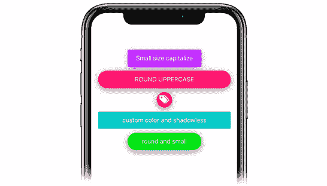
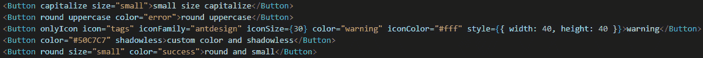
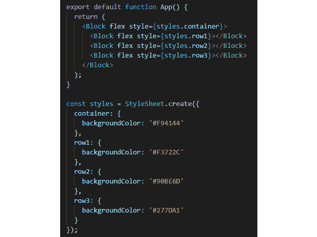
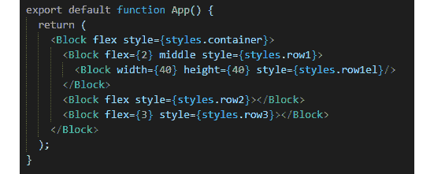
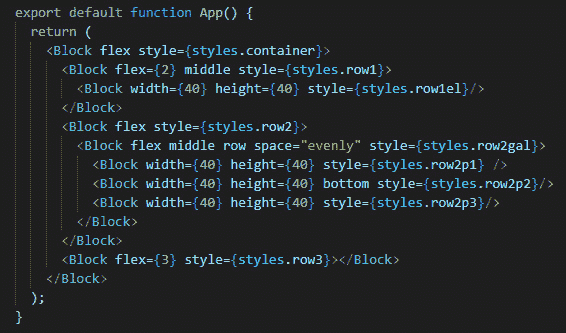
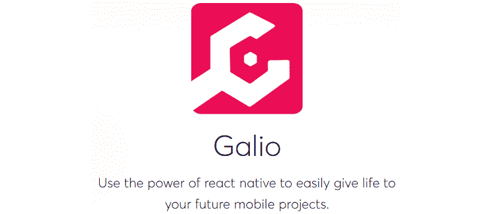

# *第5*章：为什么是加利奥？

在上一章中，我们创建了第一个屏幕。在使用纯 React 本机代码创建之后，我们继续并导入了一些 Galio 组件，这有助于我们以更简单、更容易的方式设计和创建布局。

这一章将是对加利奥更好的介绍。我们将学习如何使用它，以及为什么大多数程序员会寻找一个**用户界面**（**用户界面**）解决方案，比如 Galio 来解决他们的大部分开发过程。正如我们在上一章中所看到的，仅仅使用核心`react-native`组件就意味着代码变得非常庞大且难以维护。Galio 组件配备了许多不同的道具，使生活更加轻松。

我们还将了解使用开源库的好处，如何创建一个愿意互相帮助的社区，以及如何在您认为合适的情况下介入并为库增加价值。

这次对话将打开许多你以前从未想过会存在的新大门。它将创造某种新的思维方式，扩展您对开发人员真正是什么以及他们如何沟通的视野。

本章将介绍以下主题：

*   使用 Galio 开发漂亮的移动应用程序
*   在应用程序中使用 Galio
*   发现加利奥的好处

在本章结束时，您应该能够理解为什么人们选择 Galio 来快速开始他们的项目。您将了解如何在应用程序中安装和使用它，以及某些组件在应用程序中的作用。了解某些组件当然是有帮助的，但不要回避所有程序员都使用谷歌来发现他们问题的解决方案，如果您觉得有些事情需要进一步解释或随着时间的推移发生了变化，我强烈建议您也这样做。

# 技术要求

您可以通过访问 GitHub[查看本章的代码 https://github.com/PacktPublishing/Lightning-Fast-Mobile-App-Development-with-Galio](https://github.com/PacktPublishing/Lightning-Fast-Mobile-App-Development-with-Galio) 。您将找到一个名为`Chapter 05`的文件夹，其中包含我们在本章中编写的所有代码。为了使用该项目，请按照`README.md`文件中的说明进行操作。

# 与 Galio 一起开发美丽的移动应用程序

我们有太多的移动应用程序的例子，看起来并不太好。许多不同的社交媒体应用程序都是由随机的人创建的，他们认为自己会像 Facebook 一样中大奖。我发现这些应用程序中最常见的问题是设计问题，而在初学者的应用程序中，最常见的问题是设计问题。

布局是快速创建的，他们没有注意到**用户体验**（**UX**可能会因为他们的设计而结束。他们认为，仅仅因为他们有一个好主意，他们就不需要真正关注其他任何事情。

我不同意。我真诚地相信，只要设计时尚，用户体验一流，你就可以卖任何东西。我之所以相信这一点，主要是因为我通常使用*1 分钟规则*。这是我为自己创造的一些个人的东西。基本上，一旦我安装了一个应用程序，我只需花大约一分钟的时间就可以尝试查看该特定应用程序的运行情况。

为什么一分钟？嗯，我们使用移动应用程序是因为我们希望事情变得快速和易于使用。我们一直在寻找一款移动应用程序来替代我们与网络相关的活动，只是因为我们希望能够更轻松、更快地访问。我们希望能够检查一些信息，也许可以做一些活动。如果我无法在 1 分钟内找到如何使用你的应用程序，那么我将卸载它。

这说明了我们应该如何构建应用程序？我们应该时刻记住用户，只使用足够的信息，让他们不必考虑如何使用我们的应用程序。

Galio 很方便，因为它使用相同的过程，简单、快速、直接。你不必过多考虑按钮的宽度或应用程序中的像素大小。它预装了设计和产生最佳创意所需的所有工具。

让我们先看看按钮的外观，以及我们为它们设计的许多不同样式。我们将在应用程序中的任何情况下使用按钮，所以我认为这将是一个很好的开始。请查看以下屏幕截图：



图 5.1–应用程序内显示的按钮

正如你所看到的，我们有很多不同的按钮显示方式，从明亮的颜色和阴影到无影和普通。你可以有正方形，甚至可以是一个圆形和一个图标。

让我们来看看在我们的应用程序中这是多么容易实现。以下是*图 5.1*所示按钮的代码：



图 5.2–图 5.1 中按钮的代码

所以，就我们所见，我们什么都有道具。有些需要我们做更多或更少的工作，但同时，从组件内部编辑所有内容的简单性是值得的。就因为我们想把一个按钮大写，并且一直把它大写，所以我们可以使用`capitalize`道具。或者我们希望文本总是大写；没关系，我们也有一个道具。它真的让开发过程变得非常简单，任何人都可以访问。

我们已经讨论了一个应用程序应该如何让我们的用户感觉良好。但这也应该纳入我们的发展进程。这就是为什么我相信清晰漂亮的代码几乎总是等同于漂亮的产品。

现在，让我们看看 GALIO 包中的另一个很酷的组件：你永远不知道什么时候你需要一个漂亮的手风琴来为你的内容创造更多的空间。您可以在此处看到这一点的表示：


图 5.3–屏幕上显示的手风琴组件

这个组件非常容易使用。它需要一个具有指定高度的`View`（或`Block`组件，以及一个定义组件内内容的对象数组。以下是与此组件相关的代码：

```jsx
<Accordion dataArray={data} />
```

这对于任何人来说基本上都是非常容易配置和使用的。数组中的对象必须具有某些键，以便我们的组件能够识别和理解将内容放置在何处。对象的外观可能如下所示：

```jsx
{title: "2nd Chapter", content: "Lorem ipsum dolor sit amet"}
```

看起来没那么难吧？如果我们想使用图标，正如我们在创建第一个项目时所看到的（在[*第 1 章*](01.html#_idTextAnchor015)*、【React Native and Galio 简介】*中），我们所要做的就是在对象中添加`icon`键，其中将包含`name`、`family`和`size`要使用的指定图标的值。

这就是 Galio 所有组件的基本构建方式。它们简单、美观，可以在几秒钟内创建一个新的应用程序。

在继续之前，我们应该检查另一个组件，所以让我们看看定制和使用 Galio 复选框是多么容易。请查看以下屏幕截图：


图 5.4–屏幕上显示的复选框组件

如果要使用核心 React 本机组件创建，这看起来很复杂，但我们很幸运，因为 Galio 使编写一行代码变得简单，如下所示：

```jsx
<Checkbox color="primary" flexDirection="row-reverse" label="row-reverse checkbox" />
<Checkbox color="info" initialValue={true} label="initialValue set to true" />
<Checkbox color="error" initialValue={true} label="different icon" iconFamily="font-awesome" iconName="plane" />
<Checkbox color="warning" labelStyle={{ color: '#FF9C09' }} label="labelStyle used here" />
<Checkbox color="success" image="https://images.unsplash.com/photo-1569780655478-ecffea4c165c?ixlib=rb-1.2.1" flexDirection="column-reverse"/>
```

正如我们所见，我们可以在组件内部设置颜色、方向，甚至图标。它们在书写和显示时看起来都很漂亮，没有任何修改。这让我们为我们的图书馆感到自豪，因为我们真的为它的外观感到自豪。

现在，让我们来看看用`Block`组件创建基本布局有多容易。我们将仅在布局设计中使用此组件，我们将为每个正方形着色，以便更好地了解每个元素确切显示的内容。

# 在应用程序中使用 Galio

现在，让我们看看加利奥的行动。Galio 最大的特点之一就是我们的`Block`组件，它基本上是一个`View`组件，但具有超强的功能。我们为什么说超级大国？我们可以很容易地使用这个组件来创建布局，也可以很容易地通过使用道具来设计一切。

所以，让我们把它付诸实践，看看用`Block`组件创建一个基本布局有多容易。我将一步一步地告诉您使用`Block`的最常用方法，同时也将演示布局的最常用方法。您可以在我们的 GitHub 存储库中找到该项目，也可以与我一起编写代码。

我将从创建一个新的世博会项目开始。之后，我将通过编写以下代码，通过命令行安装 Galio：

```jsx
npm i galio-framework
```

现在我们已经安装了所有的东西，我将跳过组织文件的整个过程，因为我们正在使用它进行演示。因此，我们将把代码直接写入我们的`App.js`文件，在我们的入口点`App`函数中。

我们将通过其他导入项下的`import`函数导入我们的`Block`组件，如下所示：

```jsx
import { Block } from 'galio-framework';
```

我将删除`App`函数中的所有内容，并从创建第一个`Block`组件开始。这将用于将所有元素保存在函数中，因为我们知道，在一个函数中不能返回多个组件，因此，总之，一个组件必须封装其中的其他组件。

我们将在其上使用`flex`道具，这将使我们的`Block`具有`flex: 1`的属性，这样它将水平和垂直拉伸，覆盖整个屏幕。

现在我们已经完成了，让我们使用`style`道具。正如我们所说，每个`Block`元素都有一个`backgroundColor`属性，这样我们就可以更容易地识别哪个是哪个。在我们的`style`道具中，我们将写`styles.container`。

请记住，下面有一个`styles`对象，它具有通过`StyleSheet.create`函数可以使用的所有样式。我们将删除容器中的所有内容，我们只写`backgroundColor: '#F94144'`。

让我们保存，现在，我们的屏幕应该是某种红色。有趣的是，这种颜色被称为**红色莎莎**。

既然一切正常，让我们开始创建方框布局，看看用`Block`组件在我们的应用程序中安排元素有多容易。

顺便说一下，您还应该删除不必要的导入，例如`StatusBar`、`Text`和`View`。

现在，我们将在主`Block`组件中创建三个`Blocks`。我们知道，React Native 中的所有组件都从上到下排列在一列中，所以我们基本上要创建三行`Blocks`。

每一行上都有`style`道具，从上到下依次命名为`styles.row1`、`styles.row2`和`styles.row3`。现在，我们将进入`styles`对象并创建`row1`、`row2`和`row3`样式。每个属性都只有一个属性，即`backgroundColor`，其值的顺序为`row1`到`row3`，如下所示：`#F3722C`、`#90BE6D`、`#277DA1`。

现在，如果我们保存，我们将什么也看不到。这是因为我们的`Block`元素没有大小集，所以它不知道需要占用多少空间。还记得上次我们做了什么吗？我们使用了`flex`，所以让我们使用`flex`道具和所有三个组件，如下所示：



图 5.5–我们用来创建三行的代码

点击**保存**，我们突然从上到下看到三种颜色：橙色、绿色、蓝色；更确切地说：橙红色、开心果和 CG 蓝色。

由于使用`flex`道具时应用了`flex: 1`属性，因此它们在主`Block`组件内获得了相等的空间。现在，关于这个`flex`属性最酷的事情是，我们可以使用它来设置我们需要的空间量。

让我们继续，对于第一排，我们将其设置为`flex={2}`；对于第二个，我们将保持原样；对于第三个，我们将其设置为`flex={3}`。现在，我们可以看到，每个框都分配了不同的空间量。这都要归功于 React Native 使用**flex 系统**来创建布局；我们只是得益于与 Galio 一起使用它的便捷性。

现在，让我们看看当我们将所有这些数字设置为`flex`属性时，它是如何计算的。因为我们保留了第二个，当渲染到`flex={1}`时，它将被转换。我们将在三个屈体之间进行数学运算，最后得出以下结果：`2+1+3 = 5`。因此，简而言之，我们可以说*第一行是五个*的两个部分，*第二行是一个*部分，*第三行是三个*部分。此处使用的数字特定于我们的应用程序，但您可能有不同的数字。主要的想法是要理解这样一个事实，即这些数字正在分割他们可以支配的空间——一个更大的数字给我们更多的空间，而一个更小的数字给我们更少的空间。

现在，让我们使用第一行放置另一组`Block`组件，并使用更多道具。是的，我们有很多道具来配合。

我们先从输入一个组件开始，然后创建一个名为`row1el`的样式。将该样式应用于我们的新`Block`并使用`#577590`颜色。嗯，是的，什么都没有出现，但是让我们再使用两个道具来让它出现。我们会写`width={50}`和`height={50}`。这将以像素为单位设置`Block`组件的宽度和高度。

让我们使用父组件上的`middle`道具将此元素居中。父组件是我们的第一行。正如你现在看到的，我们的深蓝色的 T1 元素在我们的第一行中间。



图 5.6–包含最新元素的代码

现在，对于第二行，让我们进入`styles.row2`对象并添加填充。我们将添加`padding: 30`，我们可以观察第二排是如何突然变高的。这是因为我们的整个布局（三行）是用 flex 构建的，flex 没有设置像素的绝对大小；组件现在需要更多的空间。

在我们的第二排，我们将创建另一个道具为`flex`、`middle`和`style={styles.row2gal}`的`Block`。现在，对于我们的`row2gal`，我们将有`backgroundColor: '#F9844A'`。让我们在其中添加三个`Block`组件。他们每个人都将拥有以下道具：`width={30}`、`height={30}`和`style`。样式将按从上到下、`row2p1`、`row2p2`和`row2p3`的顺序命名。按照样式的确切顺序，我们将每个样式的`backgroundColor`属性设置为`'#4D908E'`、`'#43AA8B'`和`'#F94144'`。

现在，如果我们点击**保存**，我们将看到我们的`Blocks` 被放置在一列中。让我们通过在父组件中使用`row`道具来解决这个问题。现在，我们把它们排成一排，这很酷，对吧？让我们也使用`middle`道具和`space="evenly"`。保存并查看它的外观。我们的元素现在居中，它们与父组件的左右边距之间甚至有空间。

现在，让我们转到第二`Block`并使用`bottom`道具。这将使第二个元素低于第一个和第三个元素。有点滑稽它看起来像一张脸，对吗？看看你是否同意：



图 5.7–填充第二行后的代码

您可以看到仅使用`Block`创建基本布局是多么容易。现在，在继续之前，你应该慢慢来，也许可以在另一个组件上使用`top`道具，而不是`bottom`，看看它是如何工作的。或者，您可以使用`space="between"`或`space="around"`代替`space="evenly"`。

这变得非常有趣，因为我们实际上通过使用这些组件拥有完全的创造性控制。最好的部分是你可以创建一个由`Blocks`组成的全屏，然后用你想要的组件填充每个`Block`元素。老实说，光是这些特征就足以让我爱上加利奥。好在我们有更多的功能。

现在我们已经在应用程序中使用了 Galio 的一些功能，让我们向前看，看看 Galio 提供了哪些好处。

# 发现 Galio 的好处

现在，我们已经了解了使用 Galio 的一些好处，例如编写代码的简单性、它看起来有多漂亮以及使用它创建布局有多酷，我们已经准备好看到使用它的其他好处，我觉得我们应该从 GitHub 开始我们的旅程。

您可以在此处看到 Galio 图标：



图 5.8-从 Galio 的登录页截图

正如我所说，我们很幸运拥有这个伟大的社区，因为总会有人伸出援手帮助你。你也可以帮助别人，这是我们一直鼓励的。我觉得加利奥的社区最好用*集体*这个词来定义。在音乐行业，这个词主要用来定义一群志趣相投的人，他们只是一起工作，互相帮助，因为他们知道更多的人意味着每个人都能更快、更容易地发展。

让我们来看看你能帮助和成为这个社区的一部分。

首先，我们有 Discord 服务器，这是我们的大多数开发人员用来讨论随机事件的地方，但也有 bug 以及如何解决特定问题的地方。这个地方基本上是一个大聊天室，每个人都在那里玩得很开心。

任何人都可以加入它并提出问题，甚至报告一个 bug 或一些不起作用的东西。也许你觉得设计可以改进，你想给 Galio及其社区带来全新的面貌。你可以在那里做到这一点，而不用担心有人嘲笑你或不把你当回事。

在 Discord 服务器之上，我们有 GitHub 存储库和网站。GitHub 存储库是我们保存所有与代码相关的内容的地方。在这里，我们维护代码、回答问题、为未来创建新的开发计划、为某些产品创建修补程序，并处理**请求**（**PRs**）。

公关是指当有人想帮助图书馆的时候。因此，他们首先创建一个**分叉**，这是克隆某人的存储库的行为。然后，他们进行自己的修改，然后将存储库的新副本作为**PR**提交。这将由管理员验证，并根据代码是否遵守规则以及它是否是开发计划的一部分来接受或拒绝。

我们的网站主要是展示人们的应用程序和关于 Galio 的新闻。这是我们向全世界展示 Galio 的地方，也是我们保存整个图书馆中非常重要的一部分：文档的地方。

只要您想了解有关特定组件或如何使用 Galio 功能的更多信息，例如，**GalioTheme**功能，您就可以随时查阅该文档。

与 Galio 相关的所有内容，例如颜色、大小和布局规则都存储在我们的默认主题中。这可以在我们图书馆的`theme`文件夹中找到。每个组件都从该文件继承其样式规则。最酷的事情是，您实际上可以通过使用我们的主题组件，只使用您想要修改的内容重写我们的主题文件。

例如，假设您希望为`primary`使用不同的颜色代码。您可以用自己的颜色覆盖我们的原色，并将其与 Galio 一起使用，就像它一直存在一样。

要使用 GalioTheme 功能，您必须从我们的库中导入`theme`、`withGalio`和`GalioProvider`。让我们举一个小例子：

```jsx
const customTheme = {
  SIZES: { BASE: 18, } 
  // this will overwrite the Galio SIZES BASE value 16
  COLORS: { PRIMARY: 'red', } 
  // this will overwrite the Galio COLORS PRIMARY color #B23AFC
};
 <GalioProvider theme={customTheme}>
  <YourComponent />
</GalioProvider>
```

这将创建一个`customTheme`对象，该对象将包含两个键：`SIZES`和`COLORS`。如果您只想修改颜色，可以使用特定键。然后，您需要用我们的**高阶组件**（**HoC**）封装您的组件，称为`GalioProvider`。我们还需要通过`theme`道具将新的`customTheme`物体传递给加利奥。

提示

HoC 是一种高级 React 特性，可以更容易地定义为返回组件并以某种方式改进该组件的函数。假设你是托尼·斯塔克，而霍克是铁人西服。这套衣服由铁手套、靴子、盔甲和头盔制成，托尼穿着铁靴子可以飞行。

现在，`customTheme`常量将覆盖默认的 Galio 主题常量。

但是等等，也许你不想改变我们的主题，但你想在你的样式中使用我们的常量。使用我们的设计系统可能会帮助您更快地设计布局，我们总是在为客户创建的不同产品中使用 Galio 常量。

使用`withGalio`函数导出 React 组件可使组件使用 Galio 的 React 上下文，并将组件中的主题作为道具或`styles`对象的参数传递。让我们来看看这是怎么回事，我相信你会理解的：

```jsx
const styles = theme => StyleSheet.create({
  container: {
    flex: 1,
    backgroundColor: theme.COLORS.FACEBOOK
  }
});
export default withGalio(App, styles);
```

因为我们正在使用`withGalio`函数导出我们的组件，所以 Galio 将传递到我们选择的对象（在本例中，它是`styles`）库中所有的常量主题变量。所以，这就是为什么我们能够在`styles`对象中使用`theme`作为参数，并将`backgroundColor`属性更改为我们库中的 Facebook 颜色。

您可以在我们的文档网站[上找到一个包含所有常数信息的表格 https://galio.io/docs](https://galio.io/docs) 。

正如你所看到的，Galio 有很多很酷的功能，这些功能可以帮助我们非常快速地开发任何移动应用程序，并最终使其看起来非常漂亮。那么，为什么不试试呢？从现在起，我们将使用 Galio 为所有项目编写代码。这将是一个强制性的导入在每个应用程序的开始，我们将从现在开始在这本书。我们将使用更多的 Galio 的组件，而不是 React Native 的组件。

有鉴于此，我们将学习更多关于如何使用 Galio 以及如何设计优秀应用程序的知识，直到我们能够开始编写自己的想法。也许我们中的一个人真的会创造一个伟大的应用程序，它对社会有着巨大的价值，它将改变世界。

梦想着一旦我们获得了越来越多的知识，我们将能够做多少事情，这很好。这种白日梦和对目标的持续关注将证明是学习如何编码的最好武器之一。

# 总结

在这一章中，我们通过多个例子来说明为什么 Galio 是一个如此伟大的图书馆。到最后，你一定已经明白，加利奥真的应该成为你手下的一个图书馆，一个统治他们的图书馆。这就像你的主软件包一样，你可以用它创建令人难以置信的惊人应用程序，无论是对我们的用户还是那些希望帮助我们完成代码的编程伙伴来说，都是视觉上的。

不要害怕查看 Galio 的核心代码。您可能会从体验和理解 Galio 的代码中学到很多东西。您甚至可以创建自己的库。

因此，我们发现 Galio 非常酷，因为代码易于使用。我们只有一些道具，可以改变整个世界的编码速度和容易获得的具体参数。我们还看到了 Galio 在盒子外面看起来是多么伟大。我的意思是…这个图书馆太棒了。有时，我甚至不会编辑样式；我只会使用 Galio 款式，因为它们看起来很棒。

我们还看到了使用`Block`组件创建布局是多么容易，只要我们知道`Block`组件附带的一些道具，在屏幕上放置对象比我们想象的要容易得多。

之后，我们讨论了加利奥是一个多么伟大的社区，以及我们如何参与其中。我们对 GitHub 的研究还不够深入，因为这超出了本书的范围，但我们确实学到了很多关于该社区如何工作以及我们如何参与其中的知识。

最后，我们讨论了 Galio 的一些更高级的功能，或者更准确地说，使用 React 更高级功能的功能，因为如果我们想从 Galio 使用它们，它们非常容易使用。

最后，我们可以说，Galio 为每个人进入移动发展中世界创造了一条便捷的通道，我认为可以肯定地说，我们都感谢它的存在。

下一章将介绍移动用户界面的基础知识。我们将了解如何为我们的应用程序构建一个外观整洁的 UI，同时学习如何为用户提供我们可以创建的最佳用户体验的一些指导原则和规则。