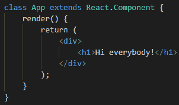
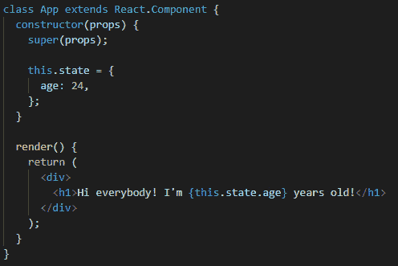
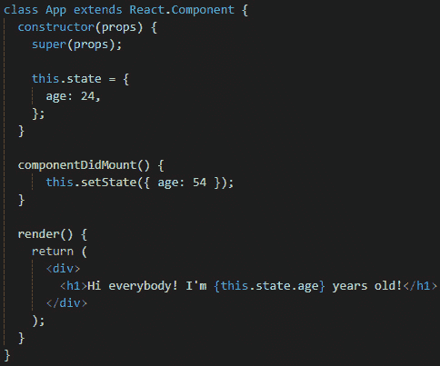
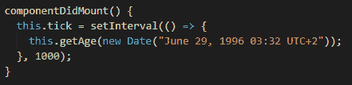
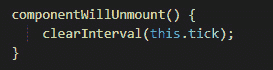

# *第 7 章*：探索我们 App 的状态

在经历了许多关于如何构建一个应用程序的不同想法之后，是时候为我们房子的地基设置最后一块石头了。在本章中，我们将了解什么是状态，最重要的是，状态如何在 React 应用程序中工作。

我们将介绍状态的基本定义，以及它在 React 应用程序中的传统用法。我们还将学习一些使用状态的新的现代方式以及它们是如何工作的。我们必须自己决定哪一个最适合在我们的具体案例中使用，但当然，我会给你我的建议。

然后，我们将把所有的新信息应用到一个实际的练习中，这将帮助我们在大脑中强化这些新概念，以便我们能够正确地理解我们所涉及的一切。

在实践练习之后，是时候看看一些不同的钩子了，它们到底是什么。我们将了解在类组件中使用状态的区别，以及钩子如何帮助我们编写更少的代码。我们还将了解另一个钩子，它处理生命周期函数。所有这些都将有助于我们继续研究，在使用 React Native 和 Galio 创建更复杂的应用程序之前，我们必须了解这些。

本章将介绍以下主题：

*   什么是国家？
*   调平屏幕
*   其他挂钩以及它们的相关性

# 技术要求

您可以通过访问 GitHub[查看本章的代码 https://github.com/PacktPublishing/Lightning-Fast-Mobile-App-Development-with-Galio](https://github.com/PacktPublishing/Lightning-Fast-Mobile-App-Development-with-Galio) 。您将找到一个名为`Chapter 07`的文件夹，其中包含我们为本章编写的所有代码。为了使用该项目，请按照`README.md`文件中的说明进行操作。

# 什么是国家？

现在我们已经到了这一点，我们必须进一步了解什么是状态以及它在 React 组件中是如何工作的。一旦我们学会了这一点，我们将完全能够运用我们的能力做出反应。这打开了我们迄今为止缺失的链接，更确切地说，它将打开使我们的移动应用程序更具活力的钥匙。

我们在[*第三章*](03.html#_idTextAnchor063)中学习了*道具*，*正确的心态*。这是我们用来将数据从一个组件传递到另一个组件的技术。将道具视为组件的第一级。我们需要提高我们的组件创建技能，因此在进入任何实际挑战之前，最合理的步骤是了解状态。

传统上，为了能够在组件内部使用状态，我们必须使用*类组件*。React 的更高版本，我们被介绍能够使用状态，甚至在功能组件中使用称为*钩子*的东西。在学习状态的基础知识之后，我们将进一步讨论钩子，为此，我们必须从类组件开始。

什么是课堂？类是用于创建对象的模板。对象通常用于**OOP**–**面向对象编程**。尽管 JavaScript 不是一种基于类的面向对象的语言，但它仍然有使用 OOP 的方法。

让我们看看如何在 JavaScript 中创建类，以及在 React/React 本机项目中正确运行需要什么：



图 7.1–React 中类组件的代码

这实际上类似于一个函数，但它没有任何*参数*，而且我们可以看到`extends`字。关键字`extends`基本上是让类知道它应该*从另一个类继承*属性；在这种情况下，另一个类是`React.Component`。所有类都需要从`React.Component`继承，以便该类可以用作 React 组件。

我们还看到了`render()`功能。React 组件需要此功能。这是我们写 JSX 的地方。现在，我们应该使用另一个函数。当使用该类创建新对象时，将调用函数。

现在我们已经了解了如何创建一个类，是时候进入状态了。让我们看看如何将*状态*添加到`App`类组件中。为此，我们需要在`App`类中创建另一个名为`constructor()`的函数：


图 7.2–添加到类中的构造函数

重要提示

在基于类的 OOP 中，构造函数是一种特殊类型的函数，每当我们创建对象时都会调用它。它通常接受参数，以我们想要的任何方式自定义初始化新对象。

如您所见，此函数接受一个参数`props`，这使我们能够使用此组件可能接收的道具。构造函数中的`super()`函数是一个关键字，用于访问和调用对象父对象上的函数。必须先使用此函数，然后才能使用`this`关键字。

正如我们所看到的，我们的状态变量前面有一个`this`关键字。此关键字指的是它所属的对象。它基本上是指`state`变量仅链接到*这个*对象，这样您就不能直接从另一个对象访问它。

现在让我们看看如何在`render`函数中使用它。这与我们使用`props`的方式完全相同：



图 7.3–渲染功能中使用的状态

如我们所见，我们仍然使用`this`关键字，以确保`state`变量在渲染时引用此特定对象。现在屏幕上应该显示的信息是**大家好！我 24 岁了！**。

这与我们一直使用的`props`非常相似，但到底有什么不同？

实际的区别是`state`是局部的，而`props`是我们从一个组件转移到另一个组件的东西。另一个区别是，因为`state`是一个局部变量，我们可以在我们的组件中更改它，唯一需要呈现的就是那个特定的组件。`props`的问题是，一旦我们更新了道具，所有使用该道具的孩子都需要重新渲染，这给我们的应用程序带来了**压力**。

什么是国家？

在计算机科学中，一个系统被称为有状态系统，只要它被设计用来记忆以前的信息。记住的信息称为系统状态。

这是**不是**说`state`比`props`好。它们都有自己的目的，在构建应用程序时，您将使用所有这些概念。有时，您需要状态，我们将查看一些使用这两种状态的示例，以便更好地了解它们是如何工作的。

那么我们如何改变这个变量呢？你们中的一些人可能会自然而然地认为“嘿，这很简单——只要像平常一样更改变量就行了”，然后你们会尝试这样的方法：

```jsx
state.age = 54;
```

但这不会真正起作用。您可以尝试在组件内部执行此操作，但不会看到任何差异。该状态将保持`24`在屏幕上，组件将不会重新渲染。应将 React 状态视为不可变。在编程世界中，不可变对象是在创建后不能修改的对象。

实际上，我们为自己实现了一个名为`setState()`的 React 函数。这有助于我们用另一个状态替换状态，这样我们就不会真正修改主变量；实际上，我们用另一个变量替换这个变量。

因此，如果我们想改变这个年龄，我们需要写这样的东西：

```jsx
this.setState({ age: 54 });
```

现在，这似乎相当容易，但我们到底在哪里改变状态呢？嗯，我们可以在很多地方更改状态，但这取决于你的应用程序以及你希望它如何工作。假设我们想更改组件在屏幕上渲染时的正确年龄。React 为我们的类组件提供了某些函数，称为*生命周期函数*。

这些函数在组件生命周期的特定时刻调用。我们将讨论其中两个：`componentDidMount()`和`componentWillUnmount()`。

这些正是这些名字所暗示的。一旦我们的组件已经挂载（呈现）到屏幕上，就会调用第一个。一旦组件必须从屏幕上移除，就会调用第二个。因此，在组件的生命周期中，我们可以插入代码，以确保组件的行为符合我们的预期。

显然，如果我们想要在组件渲染后更改年龄，我们必须使用`componentDidMount()`函数：



图 7.4–在类组件中使用 componentDidMount

现在，当我们打开应用程序时，我们将看到**大家好！我 54 岁了！**。但在渲染开始时，状态实际上是`24`，一旦渲染，状态变为`54`。这真的很酷，我们有很多不同的新函数和属性。我完全建议您阅读更多关于 JavaScript 中类如何工作的内容，如果您觉得有什么不太理解的话。您可以通过访问 Mozilla 的网站来实现这一点，该网站充满了关于 JavaScript 的有趣信息：[https://developer.mozilla.org/en-US/docs/Web/JavaScript/Reference/Classes](https://developer.mozilla.org/en-US/docs/Web/JavaScript/Reference/Classes) 。正如你所知，很多人对`this`关键字的工作原理和状态的确切工作原理有疑问或感到困惑。我觉得，一旦你对 JavaScript 的实际工作原理有了更多的了解，这种困惑就会烟消云散。

现在，让我们把我们学到的知识应用到一个很酷的小练习中。我们现在将开始使用状态，以使屏幕看起来更动态，而不仅仅是我们通常的静态屏幕。

# 调平我们的屏幕

让我们看看我们将创建什么样的应用程序。我在想，我们可以有一个屏幕，它可以显示我们当前的年龄降到几个月、几天、几小时和几分钟。我是说，这很酷，对吧？无论何时有人问你的年龄，你都可以从口袋里拿出手机，向他们展示你创建的屏幕。让我们开始：

1.  Let's open up our terminal and create a new `expo` managed project just like we always do, using the following command:

    ```jsx
    expo init RealAge
    ```

    现在，让我们打开我们的项目，开始编写一些代码！

2.  让我们直接转到`App.js`文件，删除其中除导入和样式表之外的所有内容。我总是离开样式表，因为我喜欢居中文本。
3.  Now let's rewrite the `App` component as a `class` component.

    

    图 7.5–将 App.js 重写为类组件

4.  Now let's open up our Expo app by using the following command inside our terminal:

    ```jsx
    expo r -c
    ```

    我总是使用这个命令清除缓存。因此，通过这种方式，我确保缓存永远不会干扰我的更改。

5.  现在世博会服务器已经打开，正如我们所了解的，打开您选择的模拟器。一旦你的应用程序打开，你应该能够在屏幕上看到文本`My real age is:`。
6.  Now let's integrate our age as a state inside the `App` class component.

    正如我们之前看到的一样，我们需要在类组件中编写`constructor()`函数。*别忘了*关于`super(props)`线路的事——这条线路很重要！然后我们将在`constructor`函数中创建我们的状态：


图 7.6–具有新创建状态的构造函数

我已经提到，我们要用年、月、日来显示我们的年龄，一直到秒，所以我在其中放了一个填充了零的对象，作为占位符。它可能真的是任何东西在那里，因为我们将改变它后，一些快速的数学。

现在，让我们开始讨论如何计算年龄。对于这个小技巧，我们将在 JavaScript 中使用`Date()`对象。尽管这个对象对某些人来说可能有点困惑，但在你了解了更多关于时区的知识后，它实际上变成了另一个可以玩的对象。别担心，我们不会用 JavaScript 进行那么深入的约会，因为我们有更好的东西要学。

因此，我们将创建一个名为`getAge()`的新函数，它将接收您的生日日期。此函数将取当前时间，并从中减去您的出生日期。所有这些都将在毫秒内完成。之后，我们将获取结果并用它创建一个新的`Date`对象。从这个新物体中，我们将提取所有关于我们年龄的信息。

最后，我们将使用`setState`创建一个新状态，其中包含我们从`Date`对象计算出的所有信息：


图 7.7–我们计算当前年龄的函数

现在，你可能想知道为什么我们减去`1970`几年，减去`1`几天。哦，就像我刚才说的，`Date`物体有点奇怪。我们必须减去`1970` ，因为 UTC 时间从 1970 年开始，所以为了确保我们得到了正确的年份值，这必须从等式中消失。至于天数的价值，这可能与我真的想确保考虑时区以及我的时区需要`-1`这一事实有关。问题是，即使我们有一天的假期，重要的是要看到这件事真正起作用。

现在我们有了这个函数，并且我们正在使用`setState`函数来正确地更改状态，现在是从某处调用这个函数的时候了。正如您所知，一个普通函数不会只调用自身（即使有函数可以这样做）。

那么，让我们做我们以前做过的同样的事情——让我们像这样调用`componentDidMount()`中的函数：

```jsx
this.getAge(new Date("June 29, 1996 03:32 UTC+2"));
```

如您所见，我使用了关键字`this`来确保我们的对象知道我们引用的是它的函数`getAge`。我也在函数中使用了我自己的生日，但是你可以使用你自己的生日来让它更加个人化。

我们的工作还没有完成！让我们进入我们的`render`函数并进行一些修改，以便能够正确显示所有内容：


图 7.8–实现状态后的渲染功能

对于你们中的一些人来说，`render`函数中的第一行可能有点奇怪。这叫做**对象分解**。这就是我们对进口产品所做的。这是一个非常有用的 JavaScript 特性，用于从对象中提取属性，甚至将它们绑定到变量。

例如，我们现在可以在提到`this.state.age.years`时只说`years`。它节省了我们的写作时间，而且看起来更清晰。你会看到人们总是这样分解变量——这是一个非常酷的特性！

现在我们已经确定要使用`state`中的所有变量，我们的`componentDidMount`正在调用`getAge`函数，并且`state`已设置在该函数中，一切都准备好了。运行应用程序并查看结果。你应该能够看着屏幕，看到你到底有多大了，直到最小的细节。

但有点不对劲——秒不会刷新，所以一切都保持不变。你可能认为我可以骗你，但相信我，我没有。现在，您的真实年龄没有更新，因为我们的`getAge`函数只被调用一次。正如我们所说，`componentDidMount`在组件第一次呈现在屏幕上时调用该函数。我们的组件被渲染，函数被调用，故事到此结束。

我们必须多次调用该函数；我至少每秒思考一次，这样我们才能确保秒数与实时同步。让我们现在就这么做！

在`componentDidMount`函数中，我们将调用一个很酷的小函数`setInterval()`。它接受的第一个参数是函数。这将每隔一段时间调用一次。它接受的第二个参数实际上是执行函数的频率的时间（毫秒）：



图 7.9–使用我们的 setInterval 函数的 componentDidMount

现在我们已经创建了调用`getAge()`函数的时间间隔。这是一个很好的做法，停止休息时，我们真的不需要它的工作了。现在突然出现在你脑海中的问题可能是“我们什么时候不需要运行它？”。嗯……这通常是主观的，但在我们的具体情况下，答案是在组件寿命结束时。

还记得我们说过有另一个生命周期函数叫做`componentWillUnmount()`吗？这正是我们要停止这个函数的地方：



图 7.10–我们的类组件中使用的 componentWillUnmount 函数

现在我们已经完成了，我们的应用程序应该可以正确显示我们当前的年龄了。保存所有内容，刷新模拟器，然后检查它！你的真实年龄现在显示在屏幕上。不过，不要让这些数字毁了你的一天——我们都感觉自己很年轻！

现在我们已经了解了状态在`class`组件中的行为，这更像是状态的传统用法，现在是时候看看其他使用状态的方法了。最近，React 为我们带来了一些很酷的小东西，叫做**挂钩**。让我们进一步了解它们，它们与我们的传统状态有多大的不同，以及它们带来了哪些新特性。

# 其他挂钩以及它们相关的原因

状态的主要问题是，我们只能在`class`组件中使用它。对于一些初学者来说，类组件通常被认为有点难看，很难学习，因此 React 团队尝试创建一些新的东西，承诺解决初学者和高级用户在使用传统使用状态的类组件时可能遇到的问题。这就是**钩子**的诞生方式。

在 React v16.8 和 React Native v0.59 中引入了挂钩。它们基本上允许您在不编写类的情况下使用 state 和其他React 特性。

那么，这对我们到底意味着什么？让我们看一个如何使用新的 hooks 功能编写状态的示例：


图 7.11–使用挂钩的示例

哇！那么，我们这里有什么？这真的是我们到目前为止一直在使用的状态特性吗？是的。如果你要把这段代码复制到一个新的项目中，你会发现一旦你启动了你的应用程序，每次你按下这个按钮，这个数字就会从 0 一直更新到你按下它的次数。

让我们看看我们到底写了什么。

如您所见，我们创建了一个名为`Example`的函数。名称并不重要，只要它不是您的主函数，它应该始终被称为`App`。一个函数看起来比一个类干净得多，而且显然更容易编写。

然后，我们在函数中使用钩子`useState()`定义了两个变量。这到底是怎么回事？

```jsx
const [count, setCount] = useState(0);
```

在本例中，`useState`是一个钩子。我们在函数组件内部调用此方法，以便向组件添加本地状态。此函数返回一对：*当前*状态值–`count`，以及一个允许您更新该值的函数—`setCount`。`setCount`函数与类中的`this.setState`函数非常相似，只是它没有将新旧状态合并在一起。

`useState`接受的唯一参数是`count`变量的初始状态。记住，我们的`this.state`变量必须是一个对象，所有东西都在该对象内。`count`不必是对象，即使它可以是，如果你想要的话。

现在让我们直接比较一下使用`this.state`和`useState`钩子。我们将看到使用这两个特性编写的状态相同，因此我们可以清楚地比较这两个特性。

首先我们来看看`this.state`。我们将想象一个应用程序需要有一些关于用户的信息，他们的朋友在用户的个人资料上留下的一些评论，还有这个个人资料中的喜欢人数：


图 7.12–类组件中写入的状态对象

这很容易理解，对吧？我们的`state`有以下值：`userInfo`是一个对象；`comments`是一个字符串数组；`likes`是一个数字。让我们看看使用*挂钩*时相同的东西会是什么样子：


图 7.13–我们的状态写在功能组件中

这是完全相同的东西，但我们一直在使用`useState`挂钩。所有东西的值都与前面的示例完全相同，但不同之处在于，我们的状态不是生活在一个对象中。

现在，让我们举例来说，我们想要改变喜欢的数量。也许有人点击了 like 按钮，我们想更新屏幕上显示的号码。让我们看看如何在类组件中更改它：


图 7.14–更改类组件中的状态

这看起来很复杂，对吗？最重要的是，与我们一直使用到现在的普通`setState()`函数相比，有很多新东西。问题是，因为我们只需要为 likes 值更新状态，所以我们使用了名为*previous state*的东西。这就是`prevState`的来源。一旦您需要基于前一个状态更改状态，就像我们在这里需要做的那样，因为我们需要增加喜欢的数量，必须将传递给`this.setState`函数作为参数。这为我们提供了前一状态的快照（`prevState`。到目前为止，我们一直在使用短版本，因为我们不需要根据以前的状态进行更新。

现在让我们看看如果我们使用钩子，同样的事情会是什么样子：


图 7.15–更改功能组件中的状态

这显然更干净、更容易。我们知道我们只想改变喜欢的，所以我们使用`setLikes`。在这里，我们可以取`likes`状态，只需将其增加`1`。

正如你所看到的，钩子让我们的生活轻松多了。它们使用起来非常简单，而且需要的文字也少得多。

现在，问题是，如果我们在进入**钩子**之前创建的应用程序，即显示我们真实年龄的应用程序，我们将如何准确调用`setInterval`函数，因为生命周期函数`componentDidMount`或`componentWillUnmount`仅在类组件中可用。

我们很幸运，因为 React 团队为我们提供了更多的钩子供我们使用，除了`setState`。首先，让我们看看钩子到底是什么。

正如我们所知，React 完全是关于代码的可重用性。现在，我们可以编写简单的函数，并在需要计算某些内容甚至编写组件时调用它们，以便在应用程序的任何部分重用它们，但组件的问题是它们必须呈现一些 UI。这使得组件有点不方便。React 团队得到了 hooks 的想法，因为他们希望能够共享复杂的逻辑，而不必呈现某种 UI。钩子允许您通过一个简单的函数调用使用函数中的 React 特性。我们提供的钩子涵盖了 React 最重要的部分：状态、生命周期和上下文。

那么，让我们看看我们可以使用什么类型的钩子来代替`componentDidMount`函数。

## 使用效果

`useEffect`挂钩使我们能够使用功能组件的副作用。什么是*副作用*？例如，*取数*或*订阅*都是副作用。之所以这样叫，是因为它们会影响其他组件，并且在渲染过程中无法完成。

通常，这些操作是通过类组件中的生命周期函数来执行的。你可以把`useEffect`想象成所有生命周期函数都组合在一个函数中。与`useState`一样，`useEffect`可以在同一功能部件内多次使用。

通过使用这个钩子，您基本上会告诉 React 组件在渲染后需要做一些事情。React 将记住您传递的函数，并在执行所有更新后调用它。`useEffect`在每次渲染后运行。因此，基本上，它在第一次渲染之后以及组件进行的每次更新之后运行。

好吧，那`componentWillUnmount`呢？我们如何确保我们的功能只有在移除组件时才能工作？`useEffect`足够了，我们不需要另一个钩子。如果我们确实从 effect 返回一个函数，React 将确保在卸载组件后调用该函数。

挂钩是 React 的一个重要组成部分，它们需要大量的解释，我觉得您可以从阅读文档中获得最大的收获。还有其他的钩子，例如，`useMemo`、`useRef`和`useReducer`。所以，阅读文档对所有程序员来说都是一个救命稻草，特别是因为你会在其中找到很多非常酷的信息，我可以保证你在任何一本书中都找不到这些信息。当学习一项新技术时，你的第一步应该是编写文档，然后研究其他更具体、更切中要害的方法，了解你真正想学习的内容。就像这本书一样，我们在这里学习如何构建一些 React 本机跨平台应用程序，所以让我们继续，我们将在下一章讨论使用钩子时，进一步解释钩子。

# 总结

本章回顾了我们前进所需的关于国家的大部分信息。到目前为止，我们应该能够理解状态是如何在类组件和功能组件中工作的。

在了解了状态和状态的确切含义之后，我们了解了一些生命周期函数以及它们是如何工作的。了解这一点非常重要，因为我们现在已经了解到组件经历了不同的阶段，在不同的点上，我们能够干扰一些 JavaScript 代码。

整个冒险给了我们一个想法，真实年龄的应用程序。我们现在可以创建一个动态数字随时间变化的应用程序。我们已经学会了如何实现迄今为止我们所学到的关于国家的一切，并创造出一个展示我们时代的很棒的想法。

因为类组件看起来有点像有太多的代码需要编写，所以我们开始学习挂钩。在仔细分析了它们到底有多不同之后，我们了解到了一个叫做`useEffect`的钩子。

从长远来看，学习所有这些都是非常有益的，特别是在下面的章节中，我们将学习许多技巧并创建许多不同类型的 React 本机应用程序。