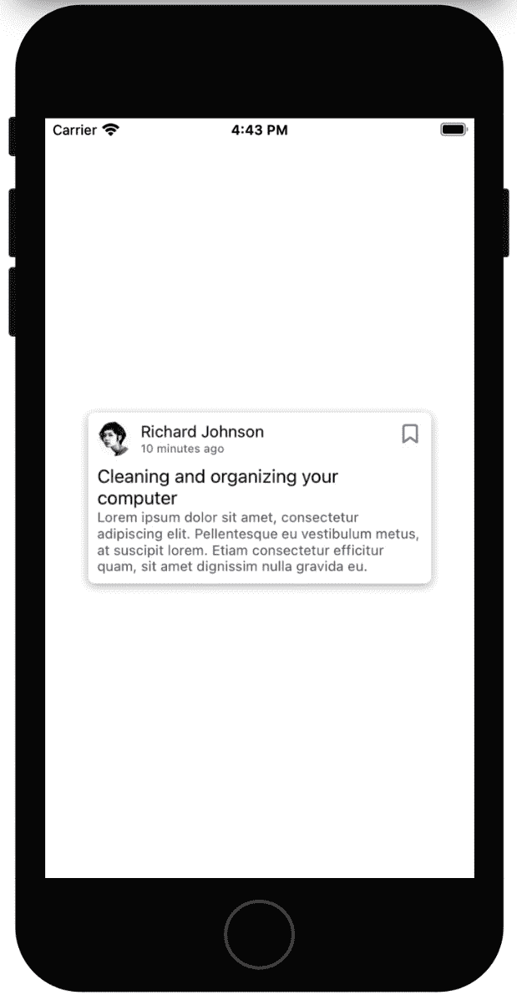
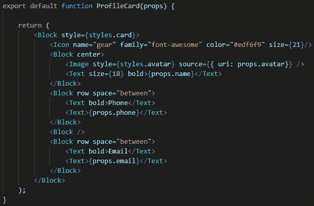
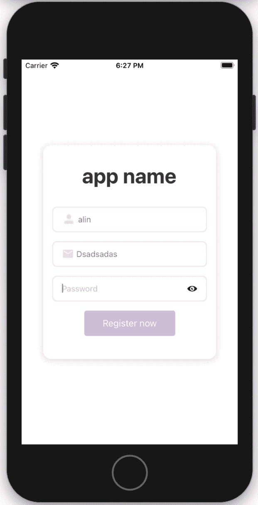
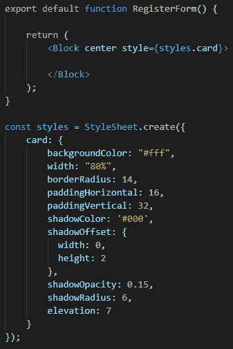
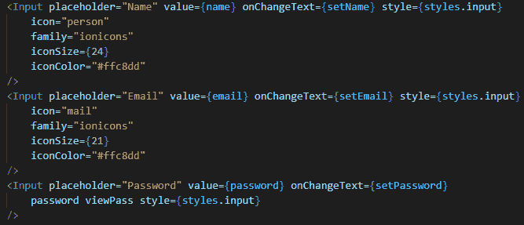
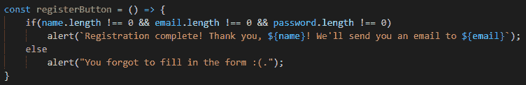
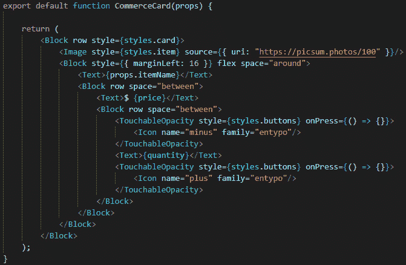
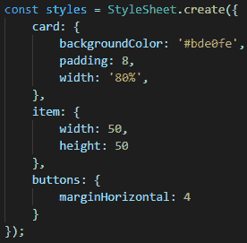
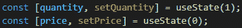
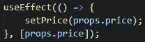

# 八、创建自己的自定义组件

在学习完所有这些课程之后，我们现在已经准备好迎接更多的实际挑战，这将使我们为创建成熟的 React 本机应用做好准备。我们已经接触了所有基本的和更高级的信息，所以我们准备迎接更困难的挑战。

在本章中，我们将进行四种不同的练习。第一个是一个简单的练习，我们将使用 Galio 的组件创建新的组件，以适合我们想象中的应用。这样做将再次向我们证明 Galio 对我们几乎所有的编程需求都有多大的帮助。

之后，我们将创建自己的个人资料卡。这个练习主要集中在布局和样式上，因为我觉得这是任何应用创建中非常重要的一部分。了解这一点将使我们离创建我们梦想中的应用更近一步，因为现在，几乎每个应用都有一个配置文件屏幕或卡片。

下一个练习将处理受控输入。除了创建一个简单的注册表单并尽我们所能设计它的样式外，我们还将了解在处理输入或表单时，状态是如何必要的。

我们面临的最后一个挑战是创建电子商务卡。这将证明，几乎任何东西都可以通过找出它与您已经创建的东西的相似性来创建。在这个时刻，我们可以理解，在一个领域拥有经验肯定会在另一个领域有所帮助。没有经验是无用的；一切都有助于我们成为一个更好的人。

本章将介绍以下主题：

*   创建您自己的组件！
*   创建自己的个人资料卡
*   创建自己的注册表格
*   构建您的电子商务卡

# 技术要求

您可以通过访问 GitHub[查看本章的代码 https://github.com/PacktPublishing/Lightning-Fast-Mobile-App-Development-with-Galio](https://github.com/PacktPublishing/Lightning-Fast-Mobile-App-Development-with-Galio) 。您将找到一个名为`Chapter 08`的文件夹，其中包含我们在本章中编写的所有代码。为了使用该项目，请按照`README.md`文件中的说明进行操作。

# 创建自己的组件！

现在我们已经掌握了所有关于 React 和 ReactNative 如何工作的基本知识，是时候通过创建许多不同的组件来测试我们的技能了。不用担心，我们还将创建一个更大、更复杂的应用。但正如您所知，React 应用由许多不同的组件组成，因此通过创建组件，我们实际上已经准备好创建应用。

我在想，对于我们的第一部分，我们应该从一张新闻卡开始。这通常会直接进入新闻提要。如果我们要创建一个新闻应用，我们会使用多个组件，比如这样的组件和不同的文本。那么，我们如何开始呢？

就像我们通常做的那样，使用以下命令创建应用：

```jsx
expo init chapter08
```

我们将在本章中的所有练习中使用相同的应用，因为这比为每个练习创建一个项目容易得多。所以，在项目创建之后，让我们打开它，然后打开我们的`App.js`文件。

现在，我们将在根文件夹中创建一个新的`components`文件夹。在这里，我们将开始开发我们自己的组件。在本章末尾，您应该在该文件夹中有四个文件。

因为我们将使用 Galio 来创建组件的布局，所以现在应该通过终端安装它。还记得我们用来安装外部软件包的命令吗？我们将使用以下命令：

```jsx
npm i galio-framework
```

现在，让我们在`components`文件夹中创建一个名为`NewsCard.js`的新文件。因为我们正在创建一个新闻提要类型的组件，所以我们需要考虑在这个组件中需要使用什么。

我们确信，我们需要`StyleSheet`用于**Galio**的样式和`Block`组件。但是我们还需要一个用于呈现文本的`Text`组件和一个`Icon`组件，这样我们就可以有某种图标。我觉得每个帖子都应该有一个头像，所以还需要一个`Image`组件。

因此，我们的进口现在应该是这样的：


图 8.1–用于我们的新闻卡组件的导入

现在我们知道了我们将在组件中使用什么，让我们开始一块一块地构建它。我们将首先创建一个名为`NewsCard`的功能组件。现在，这个函数将返回一个`Block`元素和一个`Text`元素，以便呈现一些东西。

我们还将在文件末尾创建一个`styles`对象。还记得我们应该怎么做吗？美好的让我们为主要的`Block`组件创建一个名为`card`的样式。对于样式，我想添加一些我们到目前为止还没有讨论过的新内容：阴影。

阴影其实并不难使用，但我觉得有些人可能并不真正理解阴影是如何工作的。在添加样式之后，让我们看看我们的组件现在看起来是什么样子：


图 8.2–我们第一个组件的开始

因此，在这一点上，一切都应该看起来相当简单易懂。这里的阴影是我们唯一没有真正探讨的主题，但是样式应该是不言自明的。首先，我们有`shadowColor`，我们分配了`#000`，它是黑色的。然后我们有`shadowOffset`，它告诉我们的影子如何从我们分配给它的物体上掉下来。如果事情看起来仍然有点混乱，我们应该考虑如下的`width`和`height`值：`width`是*x*轴，`height`是*y*轴。说`width: 0`意味着我们的阴影预计会直接落在物体下面的地面上，但将其与`height: 2`结合会告诉我们的阴影从中心落下 2**像素**（**px**）。然后，我们有`shadowOpacity`，它完成了你期望它做的事情：它计算阴影的不透明度。你可能已经注意到了`elevation`；这是您用来为 Android 设备设置阴影的工具，并且仅在 Android 5.0+上受支持。

现在我们已经设置了新组件的基础，让我们将其导入`App.js`，以便实时查看我们的更改。因此，让我们打开文件并删除`main`函数中除主`View`组件之外的所有内容。保持风格——我喜欢一切都以中心为中心。

现在，让我们导入新创建的组件并在屏幕上渲染它。我们将在主要导入的下面编写以下代码：

```jsx
import NewsCard from './components/NewsCard';
```

现在我们已经导入了组件，将其放置在`View`组件中，如下所示：`<NewsCard />`。启动 Expo 服务器，打开模拟器，应该可以看到上面有文本**新闻卡**的卡片。伟大的现在，我们可以处理它，保存文件并实时查看更改。

最后，我们将在`App.js`文件中添加要创建的每个组件。这应该是一个非常简单的工作流程，可以直观地测试我们的组件。

现在，让我们回到`NewsCard.js`文件，开始创建基本布局。

我们将首先用`Block`组件安排布局，因此我们将使用其中两个组件。第一个是我们卡片的标题，它将包含卡片最右边的`bookmark`图标，在左边，我们将有化身和关于作者的信息。第二部分是新闻文章的标题和文本摘要。现在，让我们将其付诸实践，看看效果如何，如下所示：


图 8.3–对基本布局进行编码

所以，据你所见，对于`title`、`summary`、`author`和`date`，我们将使用`props`。至于`Avatar`，现在我们将使用`Text`组件作为占位符。那么，让我们保存并移动到我们的`App.js`文件，以完成将所有道具发送回我们的`NewsCard`组件，如下所示：


图 8.4–为我们的新闻卡组件完成了 App.js 文件和道具

现在，我们要保存`App.js`文件并切换到我们的模拟器。我们应该能够看到我们的`NewsCard`组件正在形成。有一个标题，一个摘要，一个日期，甚至还有一个作者。是的，我使用了`lorem ipsum`作为摘要，因为它比为我们的虚拟组件创建摘要文本更简单、更快。我们甚至可以用我们的组件启动新闻提要。但是现在，让我们回到我们的`NewsCard`组件，添加我们仍然缺少的内容。

当然，我们需要用一个实际的`Image`组件替换我们一直使用的占位符。因此，让我们用以下行替换该文本：

```jsx
<Image style={styles.avatar} source={{uri: props.avatar}}/>
```

您可能还记得，为了渲染图像，需要对图像进行一些样式设置。让我们转到`styles`对象，为我们的图像做所有需要的造型。我想把`width`和`height`的值设为`30px`和`borderRadius`的值设为`15px`。

现在，我们唯一缺少的就是返回到我们的`App.js`文件，并将`avatar`道具添加到我们的组件中。在线搜索图像并将链接粘贴到其中。现在，刷新所有内容，恭喜我们已渲染图像！

我想说的是，现在我们唯一缺少的就是给文本添加一些颜色，但我会让你自己做的。如果您没有和我同时编写此代码，请不要担心，只需转到 GitHub 并搜索`Chapter 08`文件夹即可。这将包含我们到现在为止所做的所有代码，您还将看到我如何为文本着色。我还分解了`props`对象。

现在，让我们看看这在我的模拟器上是什么样子的，这样你就可以确保一旦你在 GitHub 上克隆了存储库，事情看起来和我们描述的一样。您可以在此处看到结果：



图 8.5–显示我们成品组件的模拟器

这看起来很不错，对吧？我将允许您在未来的应用中尽可能多地使用此组件，因此不要回避重用组件。下一张应该会更酷，所以让我们继续，开始制作我们的第一张个人资料卡。

# 创建自己的个人资料卡

个人资料卡是任何用户都需要在带有用户系统的应用中看到的东西。所以，我想创建一个简单的个人资料卡，为我们的用户显示一些基本信息。我觉得应该显示的主要元素是个人资料图片、用户名、电子邮件和电话号码。

这将有助于我们在一个应用中发挥巨大作用，我们可能有一个电话联系人列表，我们希望单独查看每个联系人。现在，让我们开始创建配置文件卡组件。

继续并在我们的`components`文件夹中创建一个名为`ProfileCard.js`的新文件。现在，正如您前面所读的，我已经说明了这个组件将由哪些元素组成。基于此，让我们考虑一下我们需要什么类型的进口产品。

你猜对了！我们在上一个组件中使用了相同的导入。现在我们已经确定了需要什么类型的导入，让我们编写一个基本函数，以便在开始处理组件时可以在屏幕上看到一些东西。

正如您在组件的文件名中所看到的，我们的主`Block`组件应该是一张卡片，所以让我们应用与上一个组件相同的样式。我们将更改背景颜色和一些值，但是这个`style`对象应该与上一个对象基本相同。

让我们来看看我们现在所写的内容：


图 8.6–ProfileCard 组件的开始

事情看起来非常相似，对吗？有一些值改变了，但这是因为我觉得不同的颜色可能更适合这张卡。根据我们分配给`width`属性的`"80%"`值，它应该与我们之前的组件具有相同的宽度。

现在，让我们转到我们的`App.js`文件，注释掉我们的`<NewsCard />`组件并导入我们的新组件，就像我们以前做的一样。

现在，我们应该能够在模拟器的屏幕上看到这个没有内容的小卡片。让我们回到我们的卡片，继续添加布局的其余部分。

我们应该在组件的左侧有一个图标，用户可能需要按下该图标来修改组件的内容。我们还不会创建这个功能，但是有一个指向这个功能的图标对我们来说已经足够了。

在这个图标下面，我觉得我们应该有一个头像和名片上的联系人姓名。

就在这些下方，我们可以看到电话号码和电子邮件。在这两者之间，我想划分信息的界限。为什么？在我看来，它只是看起来更好。因此，让我们继续下一步，添加此类布局所需的所有基本组件，如下所示：



图 8.7–ProfileCard 组件的基本布局

这种布局很容易用 Galio 制作原型。如您所见，我们使用的都是`Block`组件，我们已经可以居中、创建行，并定义每个组件所需的空间。同样，我们使用`props`是因为您现在的工作是返回`App.js`并将`props`传递给我们的组件，以便它能够呈现更多信息。

完成？伟大的您可能想知道我们创建的两行之间的`<Block />`组件是怎么回事。好吧，那会起到分隔的作用。那么，让我们为它和我们的`avatar`图像编写样式。在这一点上，您甚至可以继续为每个`Text`组件添加颜色，以便使其看起来更有趣。我可能会用白色作为文本，但只要你满意，任何颜色都可以。让我们看看我们的造型，如下所示：


图 8.8–分隔符和化身的样式

现在，我们已经创建了样式，让我们深入了解一下。分隔线应该是介于`Email`和`Phone`之间的一条白线。所以，我们使用了一个`Block`组件来创建一条直线。这会让你意识到你可以用多少种方式使用一个`Block`组件。但是`hairlineWidth`怎么了？React Native 将其定义为特定平台上细线的宽度。它主要用于在两个元素之间创建分隔。

现在，让我们保存所有内容，并查看它在模拟器上的外观。输出应该与我这里的类似。也许您已经更改了一些颜色，但布局应该相同：


图 8.9–我们的组件的最终渲染

这是一次真正的冒险！我们已经创建了两个不同的组件，我们不会到此为止。我希望您玩得开心，并密切关注前面的一些代码。在 2-3 天内从记忆中重现一切总是一个好主意。只是一个很酷的小练习，你可以做，以确保你正在学习的一切，你正在阅读。现在，让我们向前看，因为下一个会很酷。

# 创建自己的注册表格

注册表格几乎在你能想到的每一个应用中都有使用。您可能需要一个，所以让我们看看创建注册表表单时发生了什么。这很酷，因为在创建一个漂亮的小注册卡的基础上，我们还将学习一些关于输入的新知识。

让我们开始如何开始注释`App.js`中以前的组件，并在`components`文件夹中创建一个名为`RegisterForm.js`的新文件。

我们已经创建了两个组件，所以让我们看看您是否可以开始自己创建它。以下屏幕截图中的表单将是注册表单的最终呈现版本。我选择在你真正开始创建它之前让你看看它，因为我认为你应该能够在没有我帮助的情况下自己实现类似的结果。当然，我仍然会帮助你，但这是一个很好的机会，你可以慢慢来，合上这本书，开始自己创作。查看下面的屏幕截图，开始自己创建！



图 8.10–我们登记卡的最终呈现版本

看起来很整洁，对吧？根据我们迄今为止所做的工作，这并不难做到。所以，现在您已经了解了它，也许您已经在考虑如何开始使用这个组件。太好了！如果您仍在阅读，这也很好，因为我们将继续并开始创建此组件。

正如我们到目前为止所做的那样，我们将开始考虑我们需要什么类型的进口产品。我们不再需要图像，但我们需要一个`Input`和`Button component`。不必担心输入中的图标，您可以直接从`Input`组件进行操作。Galio 使在输入中设置样式和添加图标变得非常容易。

我觉得对于这个特定的组件，我们的输入应该是这样的：


图 8.11–用于我们登记表的进口

您是否已经考虑过我们应该如何为这个项目创建布局？这里不需要任何行，因为所有元素都直接向下排列在一列中。我们将使用的唯一`Block`元素是用于创建卡本身的元素。

让我们从编写主函数开始，就像以前一样。我们需要一个应用了卡片样式的`Block`组件，如下所示：



图 8.12–RegisterPerform 组件的开头

现在，让我们进入`App.js`文件，注释掉以前的组件，以便导入新创建的组件。我们已经做了很多次了，所以这应该很容易。

现在，让我们继续我们的组件并快速浏览布局。我们已经做了很多次了，这应该不难理解。

我们显然从一个`Text`组件开始，然后是三个`Input`组件和一个`Button`组件。那么，让我们把它写下来，如下所示：


图 8.13–我们几乎完成的组件

好吧，到目前为止，一切都是我们一直在做的。让我们来处理这里发现的新事物。所以，在我们的第三个`Input`组件中，我们可以看到两个道具：`password`和`viewPass`。第一个是确保你在写的时候看不到密码；它将你的文字转换成我们在某处键入密码时经常看到的点。第二个是在右边显示图标，用户可以按下该图标来查看他们刚刚输入的密码是否有问题，基本上将点转换为字母，反之亦然。

我们的`Button`组件也有`shadowless`道具，它完全符合您的想法：它使按钮无影无踪。

现在，有趣的部分来了。当然，我们想知道用户在输入什么；除此之外，我们如何验证信息是否正确，甚至是否按我们希望的方式键入？也许你要求用户的电子邮件，但如果键入的单词是一些随机单词，只是为了闯入应用而没有实际注册，该怎么办？因此，必须有某种方法确保我们知道用户键入的内容，并在用户按下**立即注册**或**提交**按钮后验证文本。

这种技术称为**受控元件**。受控组件通过道具获取其当前值，并通过回调发送任何更改。父组件通过处理回调并管理自己的状态，然后将新的状态值作为道具传递给受控制的组件来“控制”它。

在大多数甚至所有情况下，当我们处理表单时，应该使用受控组件。

因为我们是在一个功能组件中，所以我们将为我们的状态使用**挂钩**。不要忘记导入`useState`钩子，如下所示：


图 8.14–功能组件内部使用的挂钩

这很容易，因为我们已经了解了挂钩和组件的状态。现在，我们将状态应用于`Input`组件，如下所示：



图 8.15–应用于输入组件的状态

那么，这里到底发生了什么？例如，一旦用户按下**输入**并开始写入他们的姓名或电子邮件，我们的`onChangeText`道具就会触发我们的`setName`道具，该道具将`name`状态变量设置为我们输入的当前值。通过这种方式，我们确保我们的`RegisterForm`组件*控制*输入，并不断更新输入状态信息。

有些人可能很难理解我们为什么需要它。事实上，这就是 React 如何确保不会出现与输入状态相关的任何错误，同时让我们始终完全控制和了解输入的当前状态。

现在，让我们为表单编写一个简单的验证。我们需要至少为我们的用户弹出一条消息，以防那里没有写任何东西，并且用户按下**立即注册**按钮。

因此，我们将创建一个名为`registerButton`的函数。你可以随意命名，但我之所以这样称呼它是因为它对我来说很有意义。此函数将验证输入值的长度。现在，如果我们没有这个受控组件，我们就无法通过正常变量访问这些值。我们可能需要使用一种叫做`refs`的东西。

这基本上是离题的，因为我们不打算了解`refs`，但重要的是要知道有一种叫做`refs`的东西。让我们来看看这个 Ty2 T2 函数，如下：



图 8.16–我们的表单验证功能

现在我们有了这个函数，只要用户按下**Register Now**按钮就可以调用它，所以我们将在`Button`组件上使用`onPress`道具。继续将此道具应用于我们的`Button`组件，如下所示：

```jsx
onPress={() => registerButton()}
```

现在，保存并刷新应用，然后试用！很酷吧？当你试图在输入中没有文本的情况下按下按钮时，会弹出一条消息，同时还有另一条很酷的消息，我们正在使用输入中写入的值。

这不是一个很难创建的组件，但我们已经了解了一些非常酷的东西，那就是*受控组件*。我希望这个小练习能够成功地教会您一些新的东西，从现在起，无论何时使用表单，您都会经常使用这些新东西。

现在我们已经完成了这个组件，让我们继续前进，开始开发与电子商务移动应用相关的另一个组件。

# 打造您的电子商务卡

正如你们所知，每当你们在网上买东西时，总会有一篮子你们选择的产品。篮子里的每一件物品通常都是一张卡片，上面有关于价格、物品名称、图片以及增加或减少同类物品数量的可能性的信息。

所以，这也是我们要创造的。让我们来看看这里，因为我们已经变得如此先进，我们现在应该能够想到的方式创造功能，只有那些东西，我们学到了到现在：


图 8.17–电子商务卡的最终呈现版本

看起来很好，对吧？老实说，它甚至没有那么难构建，所以我们将快速完成布局。让我们在`components`文件夹中创建一个名为`CommerceCard.js`的新文件。

现在，让我们考虑一下，我们需要哪种类型的进口产品，一种`Block`和`Text`组件。我们还需要导入`Icon`组件，因为正如我们在*图 8.17*中看到的，我们有一个减号按钮和一个加号按钮。为了使这些按钮可点击，我们将使用一个名为`TouchableOpacity`的`react-native`组件，所以我们也将其导入。除此之外，正如我们所看到的，我们还有一个`Image`组件。让我们看看我们所有的进口产品都是什么样子，如下所示：


图 8.18–我们将用于创建 CommerceCard 组件的导入

我们还导入了`useState`，因为数字将根据我们按下的图标而变化。现在，让我们开始创建功能组件，如下所示：



图 8.19–我们的组件布局

这看起来并不难读，对吧？让我们解释一下，因为我们现在移动得更快了。但这是因为我觉得你已经进步了很多，所以你应该试着挑战自己，看看你的想法是否与我写的组件相匹配，我们在*图 8.17*中看到了。

就我们所见，我们可以有一个大的`Block`组件，包含所有内容，并将内容排成一行。行中的第一个元素是我们的图像。之后，我们有另一个`Block`组件，其道具为`flex`，基本上是告诉我们的组件尽可能多地占用空间。

在这个`Block`组件中，我们有一个`Text`组件，它以道具的形式接收项目的名称，名为`itemName`。然后，我们有另一个应用了`row`道具的`Block`组件，它将用于分离价格和数量，这两者都将是状态变量。

现在，让我们看看样式是什么样子相信我，样式是小菜一碟。这是：



图 8.20–我们的组件的样式

正如你所看到的，我们在这里使用的样式并没有那么复杂。那么，让我们继续讨论这个组件工作原理背后的逻辑。

您可能还记得，我说过我们将使用状态作为价格和数量，因此让我们初始化状态，如下所示：



图 8.21–组件的初始化状态

现在，我在想，我们可以通过道具来传递价格；这样，该组件在将来的情况下更易于重用。因为这是通过一个道具完成的，所以我们应该使用生命周期函数，就像我们正在编写一个类组件，因为这是一个功能组件，而且我们记得，我们可以使用`useEffect`而不是生命周期函数。那么，让我们在导入`useState`的同一位置导入`useEffect`。

现在，让我们看看如何编写`useEffect`函数，如下所示：



图 8.22–用于初始化价格状态变量的 useEffect 函数

因此，当调用`useEffect`时，将调用其中的`setPrice`函数，该函数将把我们的`price`状态变量设置为道具发送的任何数字。但是作为我们的`useEffect`函数的第二个参数的`[props.price]`参数是什么呢？

这告诉我们的`useEffect`函数只有在`props.price`变量发生变化时才会被调用。

现在我们已经初始化了`price`变量，让我们根据数量更改价格。我们应该怎么做？我已经编写了一个名为`quantityMath`的函数，它接收一个名为`action`的字符串变量，该变量将告诉我们的函数数量应该下降还是上升。

我们都知道，当我们在网上购物时，篮子里的每一件商品都有一个加号和一个减号，每当按下这个加号和减号时，数量要么增加一个，要么减少一个。在此基础上，我们计算该项目的总价。

现在，让我们来看看这个函数，如下：


图 8.23–用于计算最终价格的 quantityMath 函数

现在我们已经创建了这个函数，让我们确保当用户按下按钮时，这个函数被调用。`TouchableOpacity`是用于使其他部件可压的部件。那么，让我们转到其中一个`TouchableOpacity`组件，并将`onPress`道具更改为`{() => quantityMath("minus")}`。当然，我们将使用`minus`作为减号图标，`plus`作为加号图标，作为`quantityMath`函数的参数。让我们看看我们的代码中的外观，如下：


图 8.24–实现 QuantityPath 功能

现在我们的组件完成了，让我们进入`App.js`文件并测试它。注释掉前面的组件，让我们导入新创建的组件。现在，让我们将此组件添加到主函数中，如下所示：


图 8.25–主要应用功能，其中包含我们的 CommerceCard 组件

保存所有文件，刷新应用，您应该会看到我们的卡。继续，开始玩加号按钮和减号按钮，你会看到所有东西是如何根据你想要的数量准确地变化的。

这很酷，对吧？我们现在有了一个很酷的小组件，我们可以在任何时候开始为电子商务应用进行原型设计。

# 总结

在学习了很多关于 React 和 React Native 如何工作的知识之后，我们终于明白了更多的实际挑战正在迎头解决。我们从创建一个简单的组件开始，主要关注样式和布局。

这是简单的部分，进入下一个组件的第一步是我们看到了一个创建布局的不同示例，我们增强了我们的大脑肌肉，这样我们就可以更轻松地开始自己创建组件原型。

在这之后，我们进入了更为严肃的部分，这就是寄存器形式，在这里我们学习了一个新概念，称为受控输入。这真的很吸引人，因为我们学会了如何在 React Native 中真正解决表单问题。

我们的下一个组件更酷，因为我们使用`useEffect`函数用组件接收到的道具初始化一个状态变量。现在，这是一些非常酷的东西，我希望你能像我第一次发现这个函数时一样兴奋。

现在我们已经完成了更多的实际挑战，是时候考虑一下调试是如何工作的了，这样我们就可以确保知道如何正确地找出组件的错误。我们还将了解在进行本地响应时调试的一些限制。让我们继续这一酷炫的冒险，更进一步地创建我们自己的跨平台移动应用。