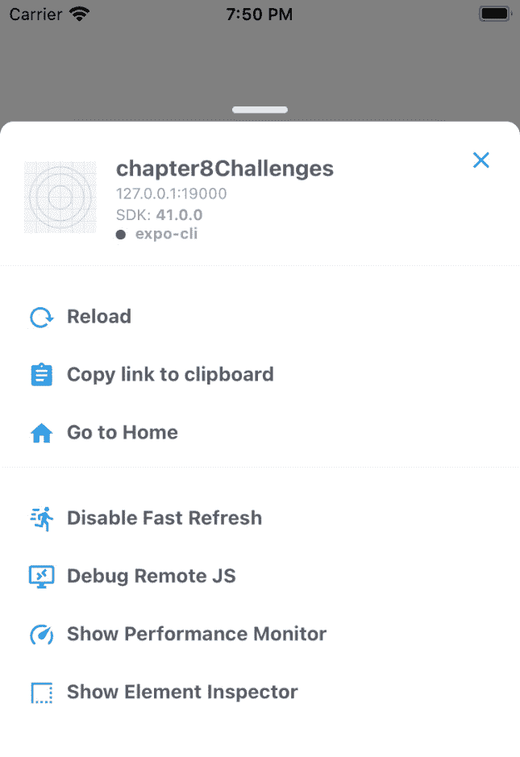
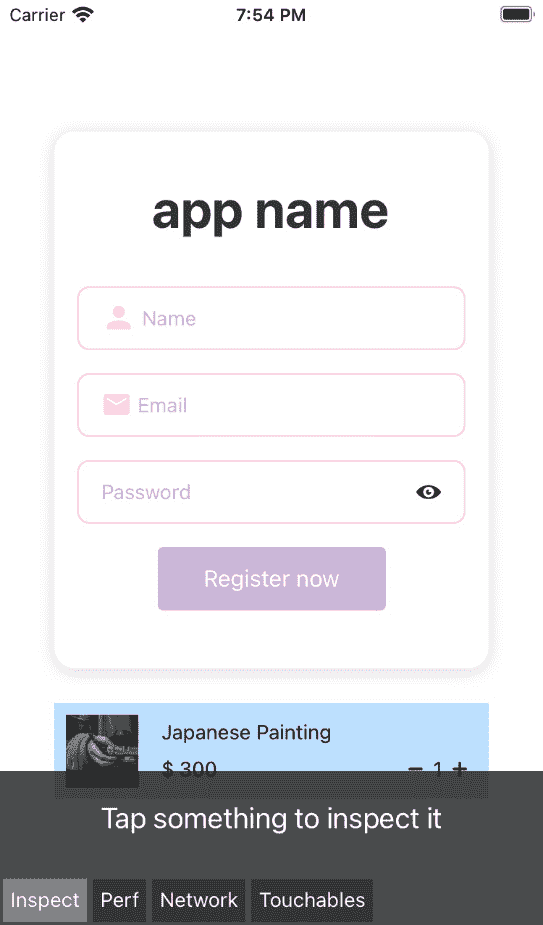
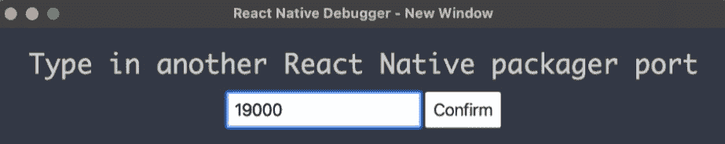
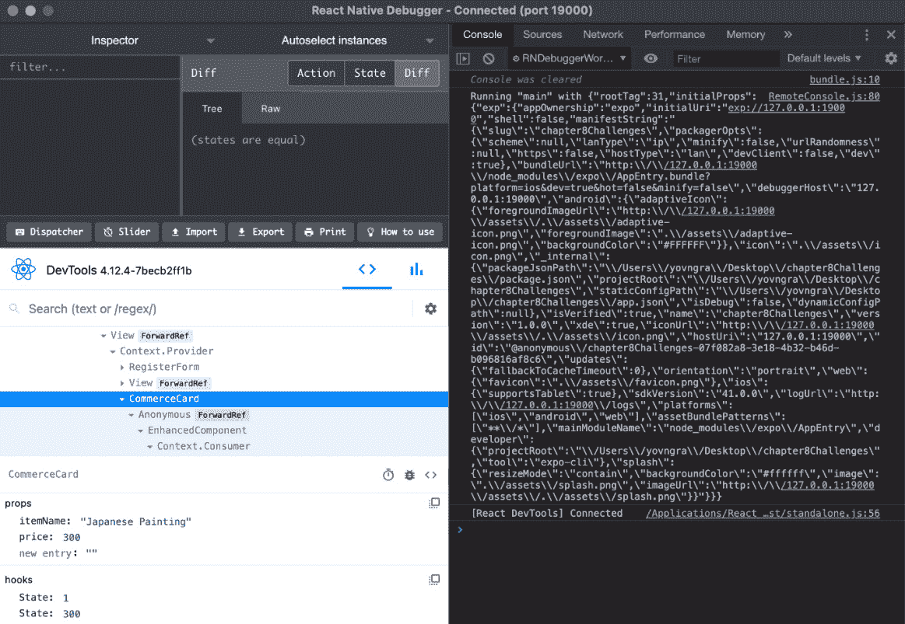
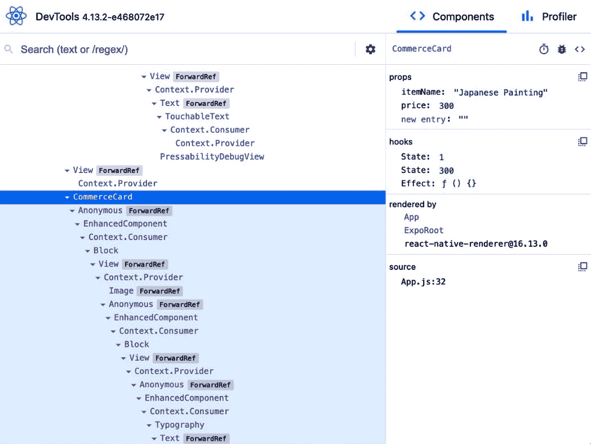

# 九、调试和求助

我们已经经历了太多。我们已经学会了如何创建不同类型的组件；我们已经了解了道具和状态，以及它们在组件创建中的重要作用。我们还学习了生命周期函数。到目前为止，我们已经获得了很多知识，但是我们仍然没有一种方法来测试我们的组件，看看它们是否具有我们期望的行为。

在本章中，我们将学习调试，并将介绍最流行的调试选项，如 React DevTools 和 React Native Debugger。我们还将学习其他一些调试方法，这样我们就可以安全地进行调试，并确保在需要时使用正确的工具进行调试。

我们将介绍一些有趣的概念，例如类型检查和 linting。我们还将了解**开发者**菜单，以及 Native 为我们快速发现应用是否存在任何类型的问题而提供的一些功能。

到本章结束时，我们应该了解一些调试方面的知识，以便在某些事情无法按预期的方式工作时做好准备。这将是创建更复杂的应用之前的最后一步。

本章将介绍以下主题：

*   不同的调试方式
*   ReactNative调试器
*   当你需要帮助时，你可以在那里寻求帮助

# 不同的调试方式

我们都知道，开发人员是人，人会犯错。老实说，我觉得软件开发人员犯的错误比普通人多得多，所以当然，必须有一些方法来解决由于我们的错误而产生的错误。

在计算机编程中发现并解决错误的过程称为*调试*。在解决 bug 时，您可以使用很多调试策略，因此我们将在本节中尝试了解其中的一些。了解它们肯定会开启我们的本土之旅的新成就。

我们将开始这个有趣的探索，找出如何确保在使用不同格式工具的开发阶段出现越来越少的错误。

## 起毛、类型检查和格式化

作为开发人员，我们主要希望将注意力集中在业务逻辑、代码模式和最佳实践等方面。您通常不想花时间确保每一行都正确缩进或检查某个函数需要接收哪种类型的参数。为了简化我们的生活和代码编写过程，我们可以确保所有的自动化工作都委托给我们的代码编辑器。我个人是 Visual Studio 代码的忠实粉丝，但是我们在前面的章节中已经讨论过，您可以使用任何您想要的代码编辑器。

### 类型检查

验证和强制执行类型约束的过程称为类型检查。这一切都是为了确保类型错误的可能性尽可能低。使用 JavaScript，我们不必指定变量中存储的信息类型，这是因为 JavaScript 是一种松散类型的语言。但是，对代码施加约束或限制将使我们编写的代码更具思想性，使我们更仔细地思考我们正在编写的代码。

在类型检查方面有两个很酷的工具：**类型脚本**和**流**。这两者之间的主要区别在于 Flow 只是一个类型检查器，而 TypeScript 是 JavaScript 的超集，这基本上意味着它将包含更多下一代 JavaScript 功能。

### 掉毛

Linting 是执行程序以分析潜在程序语法错误的过程。最著名的 JavaScript linting 插件是**ESLint**、**JSHint**和**JSLint**。我个人使用 ESLint，它现在甚至有一个官方插件用于打字脚本linting。

你会发现大多数人喜欢 ESLint，但这并不意味着它是最好的；你需要弄清楚到底什么对你有效，所以试着用几分钟的时间在谷歌上搜索它们。我通常选择拥有最大社区的工具，只是因为如果出现某些错误，更容易找到如何修复它们。

### 格式化代码

作为一名程序员，你的大部分时间都花在阅读代码上，因此你必须确保你所阅读的代码清晰易读。让我们假设我们想快速编写一个类组件；我们已经知道怎么做了，所以也许我们甚至不再看屏幕了。

正因为如此，我们并没有真正关注代码的外观，但这并不重要，因为我们已经是优秀的程序员，我们知道它是有效的。以下是未格式化代码的外观：


图 9.1–未格式化类组件

我是说…是的。这看起来不太好。但是…我们从哪里开始理解这根大香肠里发生了什么？现在，让我们看看保存文件后代码会发生什么变化：


图 9.2–格式化类组件

呸！看起来好多了 10 倍，对吧？我们可以很容易地遵循这里编写的代码。当代码看起来格式良好时，阅读和理解代码要容易得多。

有多种不同的代码格式化程序，但最常用的也是我最喜欢使用的一种是**更漂亮的**。这非常容易与您喜爱的代码编辑器集成和配置。

顺便说一句，您甚至可以配置您的 linter 来使用它格式化代码，因此，如果您真的不喜欢 Prettier，您可能会实际配置 ESLint 来为您执行此操作。

## 应用内开发者菜单

我们可以从模拟器内部访问 React Native 为我们提供的一系列不同工具。这些都很酷，所以让我们看看当我们在模拟器中测试我们的应用时，如何访问应用内开发者菜单。

访问开发者菜单的第一种方法是晃动设备或在 iOS 模拟器的**硬件**菜单中选择**晃动手势**。

第二种方法是键盘快捷键。对于 iOS 上的 Mac，快捷方式是*Cmd+D*，对于 Android，快捷方式是*Cmd+M*。对于 Windows，Android 模拟器的快捷方式是*Ctrl+M*。或者，对于 Android，我们可以运行以下命令打开 dev 菜单：

```jsx
adb shell input keyevent 82
```

使用上述方法之一后，将打开以下菜单：



图 9.3–开发者菜单

正如我们所看到的，这里有很多选择，所以让我们来讨论其中的每一个。首先，出于调试目的，我们真正感兴趣的是**调试远程 JS**、**显示性能监视器**和**显示元素检查器**。让我们从第一个开始。

### 调试远程 JS

点击此按钮将在我们的 Chrome 浏览器中打开一个新选项卡，其 URL 如下：[http://localhost:8081/debugger-ui](http://localhost:8081/debugger-ui)。

从 Chrome 菜单中选择**工具****开发者工具**打开开发者工具。React Native 还建议启用捕获异常时的**暂停**，以获得更好的调试体验。您可以通过进入**源**选项卡，在右边的某个地方，在用于断点的常用按钮旁边找到此复选框。

### 显示性能监视器

这个其实很酷。单击此按钮后，将启用性能覆盖以帮助您调试性能问题：


图 9.4–性能叠加

让我们看看在前面的屏幕截图中看到了什么。我们将从左到右开始，解释每一列：

*   **内存**-应用正在使用的内存量。
*   **JSC**——JavaScript 代码管理堆的大小。它只会在垃圾回收发生时更新。
*   **视图**-顶部数字是屏幕上的视图数，底部数字是组件中的视图总数。底部的数字通常较大，但通常表示您有可以改进/重构的地方。
*   **UI**-每秒主帧数。
*   **JS**–每秒 JavaScript 帧数。这是所有业务逻辑所在的 JavaScript 线程。如果 JavaScript 线程对某个帧没有响应，则会将其视为已删除的帧。

### 显示元素检查器

给你！开发者菜单中的最后一个选项。让我们点击它，看看会发生什么。我们的屏幕有点变了：



图 9.5–启用元素检查器后的元素检查器

现在我们已经点击了它，我们可以看到它要求我们点击一些东西，以便它可以检查它。同时，我们也可以看到下面有四个不同的标签，分别是**检查**、**性能**、**网络**和**可触摸**。

这些都可以像使用 Chrome 开发者工具一样使用，但是有更多的限制，所以你可能更喜欢使用开发者工具。让我们至少点击一个元素，看看单击后它是如何显示的：


图 9.6–单击商业卡后的元素检查器

一旦我们点击商务卡，我们可以看到它上面有一个蓝色的覆盖物，上面有一个绿色的边框。绿色边框表示填充。但是让我们把注意力集中在屏幕的上部，我们的检查员现在已经移动了。

在 inspector 的上半部分，我们可以看到组件树，它基本上告诉我们单击了什么组件。我们点击了`Block`组件中的`View`组件，它位于`Context.Consumer`组件中。我想我们可以读得更远，看到这是我们在上一章中创建的`CommerceCard`的全部内容。

在组件树下，我们将样式应用于单击的视图。在右边，我们有关于*大小*、*填充*和*边距*的信息。

实际学习如何使用 React 和 Expo 团队提供给我们的所有这些内部工具的最佳方法是实际使用它们。您可能不会像使用下面的工具那样多地使用这些工具，但我非常确定您会想尝试使用它们。下面的工具是最常用的调试工具之一。

# ReactNative调试器

React-Native调试器包含调试 React-Native 应用所需的几乎所有工具。这就是为什么我完全推荐使用这个，因为它里面有你需要的一切。

这基本上是一个基于官方**远程调试器**的独立应用，但实现了更多功能。它还包括**React Inspector**、**Redux 开发工具**和**Apollo 客户端开发工具**。我们现在对 Redux 和 Apollo 不太感兴趣，但您很可能会偶然发现*Redux*，因为它是用于州管理的最常用的库之一。

您可以通过以下命令在 macOS 上安装 React 本机调试器：

```jsx
brew install --cask react-native-debugger 
```

如果此命令不起作用，应确保已安装**自制**。Homebrew 是一个模块管理器，您肯定会继续将其与不同的编程工具一起使用。要安装自制软件，请访问[https://brew.sh](https://brew.sh) 。

要在 Windows 上安装 React 本机调试器，我们必须转到以下 URL:[https://github.com/jhen0409/react-native-debugger/releases](https://github.com/jhen0409/react-native-debugger/releases) 。下载`.exe`文件并打开它。

现在软件已打开，在 Windows 上按*Ctrl+T*，如果您在 Mac 上，则按*Cmd+T*。这将打开一个新窗口，提示您指定端口。在此处写入`19000`并点击**确认**：



图 9.7–为更改端口而打开的窗口

现在我们可以使用`expo start`或`expo r -c`来运行我们的项目。之后，打开**开发者**菜单，选择**调试远程 JS**。调试器现在应该自动连接。

现在，您应该能够看到元素树以及所选元素的道具状态和子元素。在右侧，您将看到 Chrome 控制台：



图 9.8–连接到模拟器的 React 本机调试器

如果您右键单击 React Native Debugger 中的任意位置，您将看到我们有一些很酷的小快捷方式，可以用来重新加载应用、启用元素检查器或网络检查器，同时清除**异步存储**内容。

我们甚至可以使用这个来检查我们的网络流量，所以右键单击任意位置并选择**启用网络检查**。这将启用**网络**选项卡，并允许我们检查`fetch`或`XMLHttpRequest`请求。因为使用 React 本机调试器检查网络有一些限制，所以您可能需要寻找一些替代方法。所有这些都需要代理，但以下是一些您可能需要研究的备选方案：*Charles proxy*、*mitmproxy*和*Fiddler*。

正如我们所知，React Native Debugger 在其内部实现了 React DevTools，因此您可能不想同时处理所有的工具，并且您真的希望看到具有一些属性的组件树。

尽管我们已经安装了 React Native Debugger，但我还是建议至少记住，我们也可以单独使用其中包含的每个工具。

### React工具

这个工具非常适合于检查组件树以及每个组件的道具和状态。首先，如果我们想安装它，我们需要通过`npm`使用以下命令进行安装：

```jsx
npm install -g react-devtools
```

这将在您的计算机上全局安装 React DevTools，但您可能只希望将其作为项目依赖项安装。如果是这种情况，可以通过以下命令执行此操作：

```jsx
npm install –-dev react-devtools
```

现在我们已经在计算机或项目上安装了 React DevTools，让我们用通常的`expo start`命令启动项目。打开项目后，让我们打开一个新的终端窗口并运行以下命令：

```jsx
react-devtools 
```

这将打开一个新窗口。现在我们需要打开模拟器内的开发者菜单，点击**调试远程 JS**。这与之前的过程相同，但我们不需要使用 React DevTools 设置端口，因为它将自动连接到我们的项目。通过查看以下屏幕截图，我们可以看到应用的外观：



图 9.9–用于调试远程 JS 的 DevTools 独立应用

就我们所见，这与 React Native Debugger 中的左下角窗口相同。我将主要使用它，因为它使我更容易签出我的组件，但随着应用越来越大，您可能会发现我切换到 React Native Debugger。

总而言之，这是一个非常好的工具，如果你对 Chrome 的开发工具没有太多经验，我强烈建议你使用它，因为这些工具与 web 开发人员使用的工具非常相似。

现在我们已经了解了一些用于调试 React 本机应用的工具，让我们看看如果无法使用这些工具调试问题，我们还能做些什么。或者，也许你们中的一些人甚至会认为这些工具的工作量太大，所以让我们看看其他的解决方案，以解决我们可能遇到的一些问题。

# 当你需要帮助时，你可以在那里寻求帮助

我知道一个事实几乎所有的程序员在为已经存在的产品开发产品或功能时都会在某个时候陷入困境。所以，我们应该知道当出现错误时该怎么办。

有时，您可以通过**stacktrace**来准确地判断出了什么问题，但其他错误乍一看可能更难理解。stacktrace 是一条红色的错误消息，每当代码出现问题时，它就会在模拟器上弹出。

首先，我想你应该知道，因为我们使用的是 React Native，而且社区很大，几乎所有的错误消息都可以在谷歌上搜索。总会有人为你的错误提供解决方案。

另一个好的解决方案是隔离抛出错误的代码。您可以通过发现哪一行确实抛出了错误，然后对该部分进行注释来实现这一点。通过隔离代码，我们可以开始单独试验该部分，通过反复试验，我们可以找到一个可行的解决方案。

一个你应该开始养成的好习惯是使用`console.log`。您可以使用它来发现代码是如何工作的。例如，通过在处理状态变量之前和之后使用它，我们可以通过在代码中不断跟踪它来查看变量到底是如何变化的。在调试器中使用`console.log`而不是断点的唯一问题是，当我们有任何类型的`async`代码时，我们可能没有意识到某些代码在不同的点上发生变化，这可能是我们无法控制的。

如果您能尽可能地简化代码，您可能比平时更容易跟踪错误。因此，您将看到 GitHub 上的一些存储库要求在它们的 bug 报告中提供一个*最小的可复制演示*。这使他们能够看到您正确识别并隔离了问题。因此，如果您正在使用的应用有点太大太复杂，请提取功能并尝试识别特定错误。

当然，您也可能会遇到一些生产错误。某些错误和 bug 可能仅在生产模式下出现。因此，偶尔在生产模式下运行以下命令测试应用是一件好事：

```jsx
expo start --no-dev --minify 
```

理解生产错误的最佳第一步是在本地重现它。之后，只需隔离问题并找到一个好的解决方案。

世博会团队建议使用自动错误记录系统，如 Sentry。此工具将帮助您跟踪、识别和解决生产应用中的 JavaScript 错误。它甚至还为您提供了*源地图*，这样您就可以对错误进行跟踪。此工具每月最多免费提供 5000 个事件。

让我们想想，如果我们的生产应用崩溃了，我们会怎么做。这可能是什么原因？乍一看，这是一个非常令人沮丧的场景。事实上，这很容易理解和解决。

您应该做的第一件事是访问*本机设备日志*。您可以按照您正在使用的任何平台的说明进行操作。在接下来的部分中，我们将看到如何检查这些平台上的日志。

## iPhone/iPad 的日志

按照以下步骤检查您的 iPhone 日志：

1.  打开终端并使用以下命令：

    ```jsx
    brew install --HEAD libimobiledevice -g
    ```

2.  现在已安装此软件包，请插入 iOS 设备并运行以下命令：

    ```jsx
    idevicepair pair
    ```

3.  单击设备上的**接受**按钮。
4.  返回计算机并运行以下命令：

    ```jsx
    idevicesyslog
    ```

祝贺现在你可以查看你的 iPhone 日志了。

## 安卓系统日志

确保您的 Android SDK 已安装。确保设备已启用 USB 调试。如果未启用，您应该能够在[找到如何执行此操作 https://developer.android.com](https://developer.android.com) 。您要查找的信息应在**用户指南****中，创建并运行您的应用****在硬件设备上运行应用**。

现在插入设备并在终端内运行`adb logcat`。

祝贺现在你可以查看你的 Android 日志了。

这太棒了！我们已经找到了如何检查日志的方法，这将为您的 bug 解决之旅指明正确的方向。搜索带有“致命异常”字样的日志，这会很快指出错误。现在重现错误！通过复制它们，我们可以确保我们对它们行为的假设得到证实。

好的，但如果我的应用只在特定或旧设备上崩溃怎么办？这有 90%的可能性表明存在性能问题。在这种情况下，你能做的最好的事情就是通过剖析器运行你的应用，看看到底是什么在扼杀你的应用。嗯，我们知道一个好的剖析器吗？是的，React-DevTools 或 React-Native 调试器都包含探查器。我真诚地建议你阅读[https://reactnative.dev/docs/profiling](https://reactnative.dev/docs/profiling) 因为有大量关于如何准确识别哪些进程占用大量内存并可能导致应用死机的信息。

## 还是不知道你的应用出了什么问题？

这是认真考虑休息的完美时刻。我知道这听起来很奇怪，但在某些情况下，10 分钟的休息是救命稻草。有时我甚至会在第二天才考虑这个问题，一旦我打开 VisualStudio 代码，我就会找到解决方案。

你也可以再次尝试谷歌搜索。找到解决方案的最佳途径是关于 GitHub、Stack Overflow、Reddit 和 Expo 论坛的**问题**部分。

# 总结

本章内容没有其他章节那么广泛，但我希望您能够找到所有必要的信息，帮助您快速入门，了解如何准确解决使用 React Native 和 Galio 开发时可能遇到的所有问题。

我们已经使用了一些工具来防止代码编写中的错误。我强烈建议大家仔细研究一下，做更多的研究，因为我们都知道，知识就是力量。你了解的工具越多，一旦找到最适合你的工具，你就会感觉越好。

在浏览了这些工具之后，我们了解了 React Native 用于调试和分析的内置工具。我们学习了如何使用“开发人员”菜单中的功能，我希望您理解这样一个事实，即尽管这里提供的信息很简短，但最重要的是您要尝试所有这些工具。

我们还学习了 React-DevTools 和 React-Native 调试器。既然我们知道了如何安装和启动这些工具，那么用我们的应用进行实验就应该相当容易了，以便更好地了解 React Native 是如何工作的。

我们还学习了一些找出错误来源的方法和策略。我真的希望我已经很好地解释了这些主题，因为它们通常伴随着您的编程经验。尽管我知道调试并不是最令人兴奋的经历，但它是工作的一部分，当你真正需要它时，了解它真的很酷。

现在让我们继续前进，因为是时候迎接一些实际挑战了！我们将从构建秒表应用的登录屏幕开始，我们将在本书中进一步创建该应用。我真的希望你准备好了一些巧妙的技巧，因为登录屏幕将教我们很多关于`FlatList`的知识，以及如何使用引用通过另一个组件控制一个组件。现在，准备好，出发！