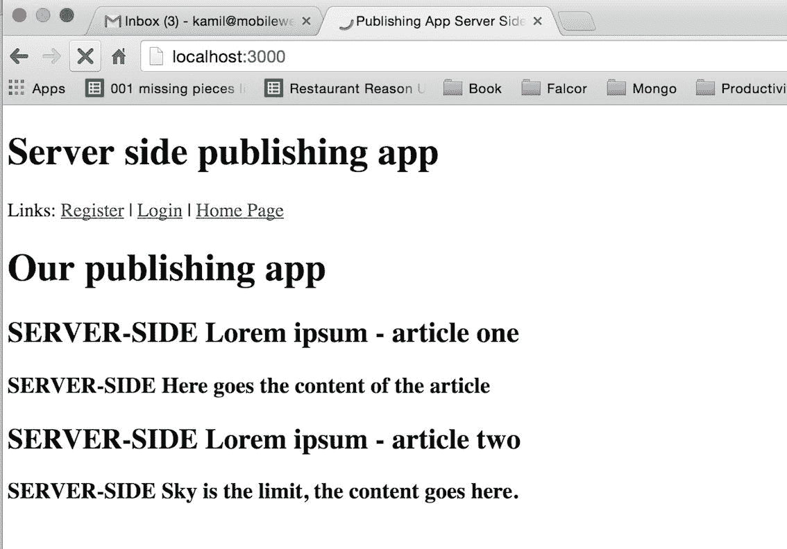

# 服务器端渲染

通用 JavaScript 或同构 JavaScript 是我们将在本章中实现的功能的不同名称。更确切地说，我们将开发我们的应用程序，并在服务器端和客户端呈现应用程序的页面。它将不同于主要在客户端呈现的**Angular1**或主干单页应用程序。我们的方法在技术方面更加复杂，因为您需要部署用于服务器端渲染的完整堆栈技能，但拥有此经验将使您成为更理想的程序员，从而可以将您的职业生涯提升到下一个水平——您将能够在市场上为您的技能收取更高的费用。

# 当服务器端值得实现时

服务器端呈现是文本内容（如新闻门户）初创企业/公司中非常有用的功能，因为它有助于通过不同的搜索引擎实现更好的索引。这是任何新闻和内容密集型网站的基本功能，因为它有助于增加有机流量。在本章中，我们还将使用服务器端渲染运行我们的应用程序。服务器端渲染可能有用的其他公司是娱乐企业，在这些企业中，用户没有那么多耐心，如果网页加载缓慢，他们可能会关闭浏览器。一般来说，所有**B2C**（面向消费者）应用程序都应该使用服务器端渲染，以改善访问其网站的用户的体验。

本章的重点将包括以下内容：

*   重新排列整个服务器端代码，为服务器端渲染做准备
*   开始使用 react dom/server 及其`renderToString`方法
*   `RoutingContext`与服务器端工作的 react 路由器匹配
*   改进客户端应用程序，使其针对同构 JavaScript 应用程序进行优化

你准备好了吗？我们的第一步是在后端模拟数据库的响应（在整个服务器端渲染在模拟数据上正常工作之后，我们将创建一个真正的 DB 查询）。

# 模拟数据库响应

首先，我们将在后端模拟数据库响应，以便准备直接进入服务器端渲染；我们将在本章后面对其进行更改：

```jsx
$ [[you are in the server directory of your project]]
$ touch fetchServerSide.js  

```

`fetchServerSide.js`文件将包含从我们的数据库中获取数据的所有函数，以便使服务器端工作。

如前所述，我们现在将模拟它，在`fetchServerSide.js`中使用以下代码：

```jsx
export default () => { 
    return { 
'article':{ 
      '0': { 
        'articleTitle': 'SERVER-SIDE Lorem ipsum - article one', 
        'articleContent':'SERVER-SIDE Here goes the content of the 
         article' 
      }, 

      '1': { 
        'articleTitle':'SERVER-SIDE Lorem ipsum - article two', 
        'articleContent':'SERVER-SIDE Sky is the limit, the 
         content goes here.' 
      } 
    } 
  } 
} 

```

制作这个模拟对象的目的是，我们将能够看到服务器端渲染在实现后是否正常工作，因为正如您可能已经注意到的，我们在每个标题和内容的开头都添加了`SERVER-SIDE`，因此它将帮助我们了解我们的应用程序是否从服务器端渲染中获取数据。稍后，此函数将替换为对 MongoDB 的查询。

下一个帮助我们实现服务器端渲染的方法是创建一个`handleServerSideRender`函数，该函数将在每次请求到达服务器时触发。

为了在前端每次调用后端时触发`handleServerSideRender`，我们需要使用使用`app.use`的 Express 中间件。到目前为止，我们使用了一些外部库，例如：

```jsx
app.use(cors()); 
app.use(bodyParser.json({extended: false})) 

```

在本书中，我们将首次编写自己的小型中间件功能，其行为方式与`cors`或`bodyParser`（外部`libs`也是中间件）类似。

在此之前，我们先导入 React 服务器端呈现（`server/server.js`中所需的依赖项：

```jsx
import React from 'react'; 
import {createStore} from 'redux'; 
import {Provider} from 'react-redux'; 
import {renderToStaticMarkup} from 'react-dom/server'; 
import ReactRouter from 'react-router'; 
import {RoutingContext, match} from 'react-router'; 
import * as hist  from 'history'; 
import rootReducer from '../src/reducers'; 
import reactRoutes from '../src/routes'; 
import fetchServerSide from './fetchServerSide'; 

```

因此，在添加所有这些导入的`server/server.js`之后，该文件将如下所示：

```jsx
import http from 'http'; 
import express from 'express'; 
import cors from 'cors'; 
import bodyParser from 'body-parser'; 
import falcor from 'falcor'; 
import falcorExpress from 'falcor-express'; 
import falcorRouter from 'falcor-router'; 
import routes from './routes.js'; 
import React from 'react' 
import { createStore } from 'redux' 
import { Provider } from 'react-redux' 
import { renderToStaticMarkup } from 'react-dom/server' 
import ReactRouter from 'react-router'; 
import { RoutingContext, match } from 'react-router'; 
import * as hist  from 'history'; 
import rootReducer from '../src/reducers'; 
import reactRoutes from '../src/routes'; 
import fetchServerSide from './fetchServerSide'; 

```

这里解释的大部分内容与前面章节中的客户端开发类似。重要的是以给定的方式导入历史，例如：`import * as hist from 'history'`。`RoutingContext`匹配是在服务器端使用`React-Router`的一种方式。`renderToStaticMarkup`函数将在服务器端为我们生成一个 HTML 标记。

添加新导入后，在 Falcor 的中间件设置下：

```jsx
// this already exists in your codebase 
app.use('/model.json', falcorExpress.dataSourceRoute((req, res) => { 
  return new falcorRouter(routes); // this already exists in your 
   codebase 
})); 

```

在该`model.json`代码下，添加以下内容：

```jsx
let handleServerSideRender = (req, res) => 
{ 
  return; 
}; 

let renderFullHtml = (html, initialState) => 
{ 
  return; 
}; 
app.use(handleServerSideRender); 

```

每当服务器端收到来自客户端应用程序的请求时，`app.use(handleServerSideRender)`事件就会被触发。然后，我们将准备要使用的空函数：

*   `handleServerSideRender`：将使用`renderToString`创建有效的服务器端 HTML 标记
*   `renderFullHtml`：这是一个帮助函数，它将把我们新 React 的 HTML 标记嵌入到一个完整的 HTML 文档中，我们将在后面看到

# handleServerSideRender 函数

首先，我们将创建一个新的 Redux 应用商店实例，该实例将在每次调用后端时创建。其主要目的是为应用程序提供初始状态信息，以便它能够基于当前请求创建有效的标记。

我们将使用我们已经在客户端应用程序中使用的`Provider`组件，该应用程序将包装`Root`组件。这将使我们的所有组件都可以使用该商店。

这里最重要的部分是`ReactDOMServer.renderToString()`在将标记发送到客户端之前，呈现应用程序的初始 HTML 标记。

下一步是使用`store.getState()`函数从 Redux 存储获取初始状态。初始状态将在我们的`renderFullHtml`函数中传递，稍后您将了解到这一点。

在我们处理两个新功能（`handleServerSideRender`和`renderFullHtml`之前，请将其替换为`server.js`：

```jsx
app.use(express.static('dist')); 

```

替换为以下内容：

```jsx
app.use('/static', express.static('dist')); 

```

这就是我们`dist`项目的全部内容。它将作为本地主机地址（`http://localhost:3000/static/app.js*`下的静态文件提供。这将有助于我们在初始服务器端呈现后制作一个单页应用程序。

同时确保`app.use('/static', express.static('dist'));`直接放在`app.use(bodyParser.urlencoded({extended: false }));`下方。否则，如果您在`server/server.js`文件中错误地放置了它，它可能无法工作。

在您完成`express.static`前面的工作后，让我们将此功能做得更完整：

```jsx
let renderFullHtml = (html, initialState) => 
{ 
  return; // this is already in your codebase 
}; 

```

将前面的空函数替换为以下改进版本：

```jsx
let renderFullPage = (html, initialState) => 
{ 
  return &grave; 
<!doctype html> 
<html> 
<head> 
<title>Publishing App Server Side Rendering</title> 
</head> 
<body> 
<h1>Server side publishing app</h1> 
<div id="publishingAppRoot">${html}</div> 
<script> 
window.__INITIAL_STATE__ = ${JSON.stringify(initialState)} 
</script> 
<script src="/static/app.js"></script> 
</body> 
</html> 
    &grave; 
}; 

```

简而言之，当用户第一次访问网站时，我们的服务器将发送此 HTML 代码，因此我们需要创建带有主体和头部的 HTML 标记，以使其正常工作。服务器端发布应用程序的标题暂时在这里，用于检查我们是否正确获取服务器端 HTML 模板。稍后您可以通过以下命令找到`$html`：

```jsx
${html}  

```

Notice that we are using ES6 templates (Google ES6 template literals) syntax with `&grave;`.

在这里，我们将在后面输入由`renderToStaticMarkup`函数生成的值。`renderFullPage`函数的最后一步是在`window.INITIAL_STATE = ${JSON.stringify(initialState)}`窗口中给出初始的服务器端渲染状态，这样当向服务器发出第一个请求时，应用程序可以在客户端正确工作，并在后端获取数据。

好的，接下来让我们通过替换以下内容来关注`handleServerSideRender`函数：

```jsx
let handleServerSideRender = (req, res) => 
{ 
  return; 
}; 

```

替换为更完整的函数版本，如下所示：

```jsx
let handleServerSideRender = (req, res, next) => { 
  try { 
    let initMOCKstore = fetchServerSide(); // mocked for now 

    // Create a new Redux store instance 
    const store = createStore(rootReducer, initMOCKstore); 
    const location = hist.createLocation(req.path); 

    match({ 
      routes: reactRoutes, 
      location: location, 
    }, (err, redirectLocation, renderProps) => { 
      if (redirectLocation) { 
        res.redirect(301, redirectLocation.pathname + 
        redirectLocation.search); 
      } else if (err) { 
        console.log(err); 
        next(err); 
        // res.send(500, error.message); 
      } else if (renderProps === null) { 
        res.status(404) 
        .send('Not found'); 
      } else { 

      if  (typeofrenderProps === 'undefined') { 
        // using handleServerSideRender middleware not required; 
        // we are not requesting HTML (probably an app.js or other 
        file) 
        return; 
      } 

        let html = renderToStaticMarkup( 
          <Provider store={store}> 
          <RoutingContext {...renderProps}/> 
          </Provider> 
        ); 

        const initialState = store.getState() 

        let fullHTML = renderFullPage(html, initialState); 
        res.send(fullHTML); 
      } 
    }); 
  } catch (err) { 
      next(err) 
  } 
} 

```

`let initMOCKstore = fetchServerSide();`表达式正在从 MongoDB 获取数据（暂时模拟，稍后改进）。接下来，我们用`store = createStore(rootReducer, initMOCKstore)`创建一个服务器端的 Redux 故事。我们还需要为我们的应用程序的用户准备一个正确的位置，供 react 路由器使用`location = hist.createLocation(req.path)`（在`req.path`中有一个简单的路径，在浏览器中；`/register`或`/login`或简单的`main page /`。react 路由器提供功能`match`，以匹配服务器端的正确路由。

在服务器端匹配路由后，我们将看到以下内容：

```jsx
// this is already added to your codebase: 
let html = renderToStaticMarkup( 
<Provider store={store}> 
<RoutingContext {...renderProps}/> 
</Provider> 
); 

const initialState = store.getState(); 

let fullHTML = renderFullPage(html, initialState); 
res.send(fullHTML); 

```

正如您在这里看到的，我们正在使用`renderToStaticMarkup`创建服务器端 HTML 标记。在这个函数中，有一个提供程序，它的存储区以前是通过`let initMOCKstore = fetchServerSide()`获取的。在 Redux 提供程序中，我们有`RoutingContext`，它只是将所有必需的道具向下传递到我们的应用程序中，这样我们就可以有一个正确创建的标记服务器端。

所有这些之后，我们只需要准备我们的 Redux 商店的`initialState`和`const initialState = store.getState();`以及更高版本的`let fullHTML = renderFullPage(html, initialState);`，就可以将我们需要的所有东西通过`res.send(fullHTML)`发送给客户。

我们已经完成了服务器端的准备工作。

# 仔细检查 server/server.js

在进行客户端开发之前，我们将仔细检查`server/server.js`，因为我们的代码顺序很重要，这是一个容易出错的文件：

```jsx

import express from 'express'; 
import cors from 'cors'; 
import bodyParser from 'body-parser'; 
import falcor from 'falcor'; 
import falcorExpress from 'falcor-express'; 
import falcorRouter from 'falcor-router'; 
import routes from './routes.js'; 
import React from 'react' 
import { createStore } from 'redux' 
import { Provider } from 'react-redux' 
import { renderToStaticMarkup } from 'react-dom/server' 
import ReactRouter from 'react-router'; 
import { RoutingContext, match } from 'react-router'; 
import * as hist from 'history'; 
import rootReducer from '../src/reducers'; 
import reactRoutes from '../src/routes'; 
import fetchServerSide from './fetchServerSide'; 

const app = express(); 

app.server = http.createServer(app); 
// CORS - 3rd party middleware 
app.use(cors()); 
// This is required by falcor-express middleware to work correctly 
 with falcor-browser 
app.use(bodyParser.json({extended: false})); 

app.use(bodyParser.urlencoded({extended: false})); 

app.use('/static', express.static('dist')); 

app.use('/model.json', falcorExpress.dataSourceRoute(function(req, res) { 
  return new falcorRouter(routes); 
})); 

let handleServerSideRender = (req, res, next) => { 
  try { 
    let initMOCKstore = fetchServerSide(); // mocked for now 
    // Create a new Redux store instance 
    const store = createStore(rootReducer, initMOCKstore); 
    const location = hist.createLocation(req.path); 
    match({ 
      routes: reactRoutes, 
      location: location, 
      }, (err, redirectLocation, renderProps) => { 
        if (redirectLocation) { 

          res.redirect(301, redirectLocation.pathname +  
          redirectLocation.search); 
        } else if (err) { 

          next(err); 
        // res.send(500, error.message); 
        } else if (renderProps === null) { 

          res.status(404) 
          .send('Not found'); 
        } else { 
            if (typeofrenderProps === 'undefined') { 
            // using handleServerSideRender middleware not 
             required; 
            // we are not requesting HTML (probably an app.js or 
             other file) 

            return; 
          } 
          let html = renderToStaticMarkup( 
            <Provider store={store}> 
            <RoutingContext {...renderProps}/> 
            </Provider> 
          ); 

          const initialState = store.getState() 
          let fullHTML = renderFullPage(html, initialState); 
          res.send(fullHTML); 
        } 
       }); 
    } catch (err) { 
    next(err) 
  } 
} 

let renderFullPage = (html, initialState) => 
{ 
return &grave; 
<!doctype html> 
<html> 
<head> 
<title>Publishing App Server Side Rendering</title> 
</head> 
<body> 
<h1>Server side publishing app</h1> 
<div id="publishingAppRoot">${html}</div> 
<script> 
window.__INITIAL_STATE__ = ${JSON.stringify(initialState)} 
</script> 
<script src="/static/app.js"></script> 
</body> 
</html> 
&grave; 
}; 

app.use(handleServerSideRender); 

app.server.listen(process.env.PORT || 3000); 
console.log(&grave;Started on port ${app.server.address().port}&grave;); 

export default app; 

```

这里提供了在后端进行服务器端渲染所需的一切。让我们继续讨论前端方面的改进。

# 前端调整以使服务器端渲染正常工作

我们需要对前端进行一些调整。首先，转到`src/layouts/CoreLayout.js`中的文件并添加以下内容：

```jsx
import React from 'react'; 
import { Link } from 'react-router'; 

import themeDecorator from 'material-ui/lib/styles/theme- 
 decorator'; 
import getMuiTheme from 'material-ui/lib/styles/getMuiTheme'; 

class CoreLayout extends React.Component { 
  static propTypes = { 
    children :React.PropTypes.element 
  } 

```

根据前面的代码，要添加的新内容是：

```jsx
import themeDecorator from 'material-ui/lib/styles/theme-decorator'; 
import getMuiTheme from 'material-ui/lib/styles/getMuiTheme'; 

```

此外，改进`render`功能，将`default`导出到：

```jsx
  render () { 
    return ( 
<div> 
<span> 
    Links:   <Link to='/register'>Register</Link> |  
      <Link to='/login'>Login</Link> |  
      <Link to='/'>Home Page</Link> 
</span> 
<br/> 
   {this.props.children} 
</div> 
    ); 
  } 

export default themeDecorator(getMuiTheme(null, { userAgent: 'all' }))(CoreLayout); 

```

我们需要在`CoreLayout`组件中进行更改，因为默认情况下，Material UI 设计正在检查您在哪个浏览器中运行它，并且正如您所预测的，服务器端没有浏览器，因此我们需要在我们的应用程序中提供`{ userAgent: 'all' }`是否设置为`all`的信息。这将有助于避免控制台中关于服务器端 HTML 标记与客户端浏览器生成的 HTML 标记不同的警告。

我们还需要改进发布应用程序组件中的组件`WillMount/_fetch`功能，因此它将只在前端启动。转到`src/layouts/PublishingApp.js`文件，然后替换此旧代码：

```jsx
componentWillMount() { 
  this._fetch(); 
} 

```

将其替换为新的改进代码：

```jsx
componentWillMount() { 
  if(typeof window !== 'undefined') { 
    this._fetch(); // we are server side rendering, no fetching 
  } 
} 

```

该`if(typeof window !== 'undefined')`语句检查是否存在窗口（在服务器端，该窗口将是未定义的）。如果是，则开始通过 Falcor（在客户端时）获取数据。

接下来，转到`containers/Root.js`文件并将其更改为以下内容：

```jsx
import React  from 'react'; 
import {Provider}  from 'react-redux'; 
import {Router}  from 'react-router'; 
import routes  from '../routes'; 
import createHashHistory  from 'history/lib/createHashHistory'; 

export default class Root extends React.Component { 
  static propTypes = { 
    history : React.PropTypes.object.isRequired, 
    store   : React.PropTypes.object.isRequired 
  } 

render () { 
    return ( 
<Provider store={this.props.store}> 
<div> 
<Router history={this.props.history}> 
{routes} 
</Router> 
</div> 
</Provider> 
    ); 
  } 
} 

```

如您所见，我们已删除代码的这一部分：

```jsx
// deleted code from Root.js 
const noQueryKeyHistory = createHashHistory({ 
  queryKey: false 
}); 

```

我们改变了这一点：

```jsx
<Router history={noQueryKeyHistory}> 

```

为此：

```jsx
<Router history={this.props.history}> 

```

我们为什么要这么做？它可以帮助我们从客户端浏览器的 URL 中去掉`/#/`符号，这样下次我们点击`http://localhost:3000/register`时，我们的`server.js`就可以通过`req.path`看到用户当前的 URL（在我们点击`http://localhost:3000/register`时，`req.path`就等于`/register`，我们在`handleServerSideRender`函数中使用。

完成所有这些操作后，您将能够在客户端浏览器中看到以下内容：



1-2 秒后，由于在`PublishingApp.js`中触发了实`this._fetch()`功能，它将变为以下内容：


当然，当您转到页面的 HTML 源时，可以看到服务器呈现的标记：


# 总结

我们已经完成了基本的服务器端渲染，如屏幕截图所示。服务器端渲染中唯一缺少的部分是从 MongoDB 中获取真实数据——这将在下一章中实现（我们将在`server/fetchServerSide.js`中解锁此获取）。

在卸载服务器端的数据库查询后，我们将开始改进应用程序的整体外观，并实现一些对我们很重要的关键功能，例如添加/编辑/删除文章。