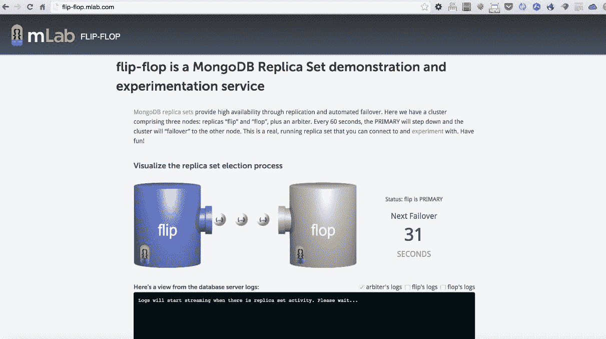
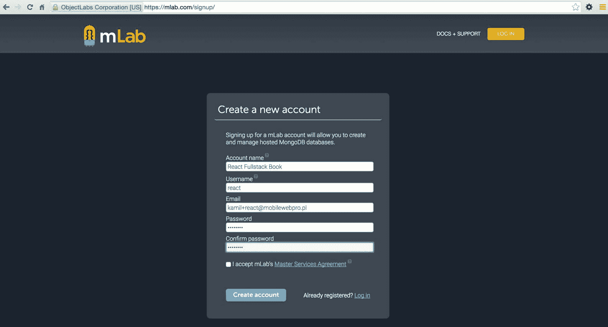
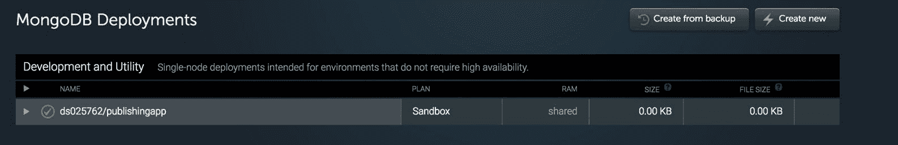
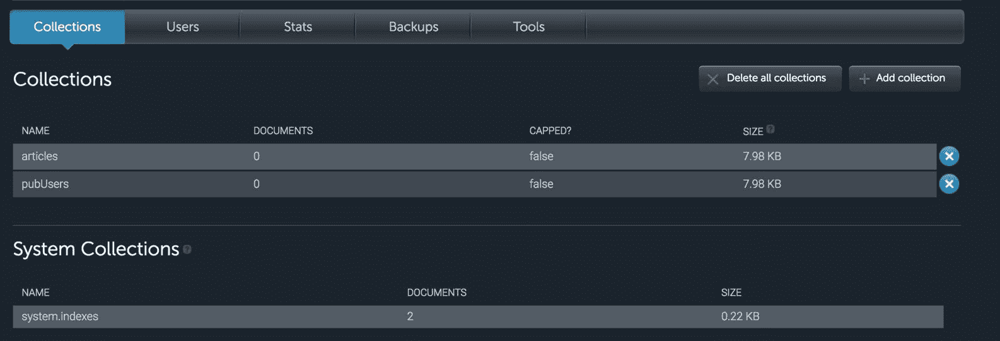
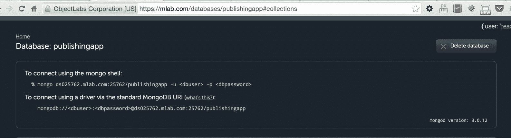

# mLab 上的 MongoDB 部署

我们已经到了需要开始规划应用程序部署的地步。我们选择 MongoDB 作为我们的数据库。有不同的方法可以使用它进行扩展--您可以使用自己的服务器（更耗时、更苛刻）自己做任何事情，也可以使用为您进行复制/扩展的服务，例如数据库即服务提供商。

在本章中，我们将介绍以下主题：

*   创建 mLab 帐户并创建新的 MongoDB 部署
*   副本集在 MongoDB 中的工作方式以及如何在 mLab 中使用它
*   在现场演示上测试副本集（mLab 的触发器）
*   设置数据库用户和密码
*   了解在 AWS EC2 上部署需要准备什么

# mLab 概述

在我们的案例中，我们将使用 mLab，以便在 MongoDB 上花费更少的时间配置底层内容，并花费更多的时间构建健壮的可扩展应用程序。

如果我们访问[www.mLab.com](http://www.mLab.com)，有一个免费 DB 计划（我们将在本章中使用）和一个付费 DB 计划：


一般来说，mLab 提供了以下几个有趣的功能：

*   **云自动化工具**：在 AWS、Azure 或 Google 上提供按需供应（准备）；副本集（本章后面将详细介绍）；和**分片簇**。它们还通过自动故障切换提供无缝、零停机扩展和高可用性。
*   **备份和恢复工具**：这些工具提供自动备份，在项目后期出现紧急情况时可以提供帮助。
*   **监控预警工具**：例如有**慢查询**工具，帮助您查找慢查询，可以通过添加索引进行优化。
*   **在线数据浏览工具**：登录 mLab 管理面板后，可以通过浏览器浏览 MongoDB 的收藏。

# 副本集连接和高可用性

在 MongoDB 中，有一个功能可以通过自动故障切换确保高可用性。简言之，故障切换是一项功能，可确保在主服务器（包含数据库最重要副本）出现故障时，如果原始主服务器不可用，则辅助成员的数据库将成为主服务器。

次要成员的数据库是一个服务器，用于保存数据库的所谓的**只读备份**。

主数据库和辅助数据库经常自我复制，以便始终保持同步。辅助服务器主要用于读取操作。

这个完整的副本集功能从零开始实现非常耗时（没有 mLab），但 mLab 提供这个功能是为了*抽象*这一部分，以便我们的整个过程更加自动化。

# MongoDB 故障切换

mLab 还提供了一个很好的工具，用于测试我们应用程序中的故障切换场景，该工具可在[上获得 http://flip-flop.mlab.com](http://flip-flop.mlab.com) 。



在这里，我们可以测试 MongoDB 副本集的自动故障切换是如何工作的。正如我们在前面的屏幕截图中所看到的，有三个节点：复制副本的**触发器**和**触发器**，以及一个仲裁器。在触发器的演示中，您可以连接到仲裁服务器，主服务器将退出，集群将故障转移到另一个节点。你可以用它来做实验——自己试试，玩得开心！

您可以在[找到更多关于如何使用触发器演示的文档 http://docs.mlab.com/connecting/#replica-设置连接](http://docs.mlab.com/connecting/#replica-set-connections)。

# mLab 中的免费与付费计划

在本书中，我们将指导您通过一个自由计划使用 mLab 的过程。在 mLab 中，副本集可以在付费计划中使用（起价为 15 美元/月），当然，您可以免费使用 flip-flop 的演示，以便使用 MongoDB 的这一非常重要的功能。

# 新 mLab 的帐户和节点

1.  转到[https://mlab.com/signup/](https://mlab.com/signup/) ，如下图截图所示：



2.  通过单击收件箱中的“确认”链接验证您的电子邮件。
3.  单击创建新按钮，如以下屏幕截图所示：


4.  您位于“创建新部署”页面上。选择单节点|沙箱（自由），如以下屏幕截图所示：


5.  当你还在[的时候 https://mlab.com/create](https://mlab.com/create) （新建部署），将数据库名称设置为`publishingapp`，点击新建 MongoDB 部署按钮，如下图所示：


6.  完成上述步骤后，您应该能够在仪表板上找到 MongoDB 部署（[https://mlab.com/home](https://mlab.com/home) ），如下图截图所示：



# 创建数据库的用户/密码和其他配置

现在，数据库已经为我们的发布应用程序做好了准备，但它仍然是空的。

为了使用它，我们需要采取以下步骤：

1.  创建用户/密码组合。我们需要单击刚刚创建的数据库并找到一个名为 Users 的选项卡。单击后，单击添加新数据库用户按钮，然后在表单上填写详细信息，如以下屏幕截图所示：


2.  让我们假设本书的细节如下：

数据库用户名：`usermlab`

数据库密码：`pwdmlab`

在我们将使用用户名和密码的地方，我将使用这些详细信息。

3.  之后，我们需要创建与本地 MongoDB 相同的集合：

Collections | Add collection | articles Collections | Add collection | pubUsers

4.  执行上述所有步骤后，您应该会看到如下屏幕截图：



5.  在此阶段，最后一件事是从以下屏幕截图中记录 Mongo 的详细信息：



# 配置总结

我们需要保存和共享 mLab 提供的所有信息以及 AWS S3 详细信息。在下一章中，在 Amazon AWS EC2 上部署我们的应用程序时，详细信息将非常有用。

在本书的这一点上，我们需要单独保存一些细节：

```jsx
AWS_ACCESS_KEY_ID=<<access-key-obtained-in-previous-chapter>>
AWS_SECRET_ACCESS_KEY=<<secret-key-obtained-in-previous-chapter>>
AWS_BUCKET_NAME=publishing-app
AWS_REGION_NAME=eu-central-1
MONGO_USER=usermlab
MONGO_PASS=pwdmlab
MONGO_PORT=<<port-from-your-mlab-node>>
MONGO_ENV=publishingapp
MONGO_HOSTNAME=<<hostname-from-your-mlab-node>>

```

确保已将端口和主机名替换为正确的端口和主机名（如前面的屏幕截图中 mLab 提供的）。

所有 Mongo`env`变量都可以从 mLab 中获得，您可以在 mLab 中找到类似于以下内容的链接（这是一个从编写本章时创建的帐户复制的示例）：

```jsx
mongo ds025762.mlab.com:25762/publishingapp -u <dbuser> -p <dbpassword>

```

# 总结

在下一章中，我们将开始在 AWS EC2 平台上的生产服务器上使用这些环境变量。将所有这些细节记录在一个容易接近、安全的地方，因为我们将很快使用它们。

最后一件事是检查应用程序是否正确运行，并使用远程 mLab MongoDB（而不是使用`mongd`命令运行的本地 MongoDB）。您可以使用`npm start`运行它，然后您将看到发布应用程序的空主页。因为我们离开了本地数据库，而远程数据库是空的，所以您需要注册一个新用户，并尝试在引擎盖下使用 mLab 发布一篇新文章来存储数据。