# Docker 和 EC2 容器服务

我们已经用 mLab 完成了所有与数据库作为后端相关的工作。发布应用程序应该在 mLab MongoDB 实例上 100%远程工作，因此您不再需要运行`mongod`命令。

现在是准备 Docker 容器并使用 ECS（EC2 容器服务）和负载平衡器将其完全部署到 EC2 上的时候了。

什么是 Docker？它是一款非常有用的开源软件，可以帮助您将任何应用程序打包、发布和运行为轻型（例如，与虚拟机相比）容器。

容器的目标类似于虚拟机——最大的区别在于 Docker 的创建考虑了软件开发，而不是虚拟机。您还需要知道，完全虚拟化的系统有自己的资源分配给它，这会导致最小的资源共享，这与 Docker 容器不同。当然，在虚拟机中，您可以获得更多的隔离，但代价是虚拟机更重（需要更多的磁盘空间、RAM 和其他资源）。Docker 的容器是轻量级的，与 VM 相比，它能够在不同的容器之间共享更多的东西。

好的方面是 Docker 的容器是独立于硬件和平台的，所以所有关于您正在处理的内容是否会到处运行的担忧都消失了。

通常，Docker 的好处在于它提高了开发人员的生产率，帮助他们更快地发布软件，帮助将软件从本地开发机器转移到 AWS 上的生产部署，等等。Docker 还允许对软件进行版本控制（类似于 Git），这在您需要在生产服务器上快速回滚时非常有用。

在本章中，您将学习以下内容：

*   在非 Linux 机器上使用 Docker Toolbox 在您的机器上安装 Docker 应用程序
*   测试 Docker 设置是否正确
*   准备发布应用程序，以便将 mLab Mongo 用于数据库
*   为发布应用程序创建新的 Docker 容器
*   创建第一个 Dockerfile，它将在 Linux CentOS 上部署发布应用程序
*   EC2 集装箱服务
*   AWS 负载平衡器
*   使用 Amazon Route 53 提供 DNS 服务
*   AWS 身份和访问管理（IAM）

# 使用 Docker 工具箱安装 Docker

安装 Docker 非常简单。访问官方安装页面[https://docs.docker.com/engine/installation/](https://docs.docker.com/engine/installation/) 因为它将根据您的操作系统为您提供最佳指导。iOS 和 Windows 的安装程序简单易懂，对于不同的 Linux 发行版有很多说明。

如果您使用的是非 Linux 机器，那么您还需要安装适用于 Windows 或 OS X 的 Docker Toolbox。安装程序非常简单，可在[上找到 https://www.docker.com/products/docker-toolbox](https://www.docker.com/products/docker-toolbox) ，如下图截图所示：

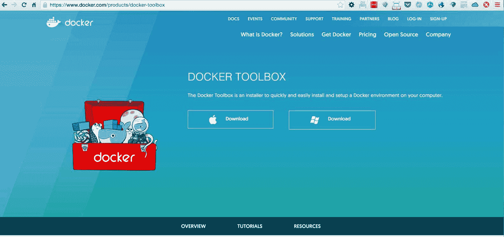

如果您使用的是 Linux，则需要执行一些额外的步骤，因为您需要在 BIOS 中启用虚拟化：

*   按照[官方文件中的说明安装 Docker 机器 https://docs.docker.com/machine/install-machine/](https://docs.docker.com/machine/install-machine/) 
*   对于 Ubuntu，您需要从[手动安装 VirtualBoxhttps://help.ubuntu.com/community/VirtualBox](https://help.ubuntu.com/community/VirtualBox) [](https://docs.docker.com/machine/install-machine/) 
*   其他 Linux 发行版请访问[https://www.virtualbox.org/wiki/Linux_Downloads](https://www.virtualbox.org/wiki/Linux_Downloads)

在本地计算机上安装 Docker（以及 OS X 和 Windows 上的工具箱）后，在终端中运行以下命令：

```jsx
$ docker info

```

运行此命令后，您将能够看到类似于以下屏幕截图的内容：

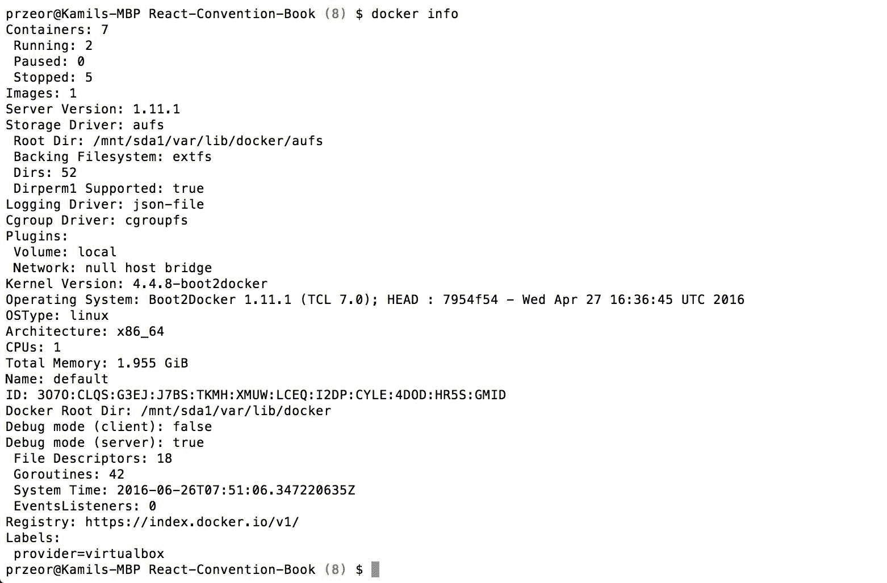

如果您能看到类似的内容，那么您的安装就成功了。让我们继续讨论 Docker。

# Docker Hub-一个 hello world 示例

在我们开始创建发布应用程序的 Docker 容器之前，让我们开始玩一个官方 Docker*hello world*示例，让您了解 Docker Hub 的工作原理。

Docker Hub 与 Docker 容器的关系就像 GitHub 与 Git 存储库的关系一样。您可以在 Docker 中使用公共和私有容器。Docker Hub 的主页面如下所示：

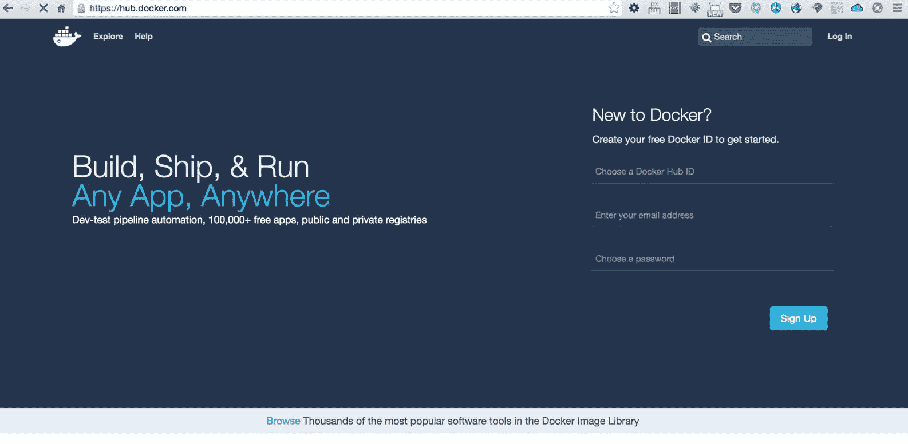

只是为了让你感受一下，如果你访问[https://hub.docker.com/explore/](https://hub.docker.com/explore/) 您可以看到不同的容器可以使用，例如：


为了进行演示，我们将使用一个名为`hello world`的容器，该容器在[上公开提供 https://hub.docker.com/r/library/hello-world/](https://hub.docker.com/r/library/hello-world/) 。

要运行此`hello-world`示例，请在终端中运行以下命令：

```jsx
$ docker run hello-world

```

运行此操作后，您将看到类似以下内容：


让我们了解一下刚才发生了什么：我们使用`docker run`命令根据图像启动容器（在我们的示例中，我们使用了 hello world 容器图像）。在这种情况下，我们将执行以下操作：

1.  运行命令，告诉 Docker 在没有额外命令的情况下启动名为`hello-world`的容器。
2.  点击回车键后，Docker 将下载 Docker Hub。
3.  然后，它将使用非 Linux 系统上的 Docker 工具箱在 VM 中启动容器。

`hello-world`图像来自前面提到的名为 Docker Hub 的公共注册中心（您可以在[访问该注册中心）https://hub.docker.com/r/library/hello-world/](https://hub.docker.com/r/library/hello-world/) 。

# Dockerfile 示例

每个图像都由一个 Dockerfile 组成。`hello-world`示例的 Dockerfile 示例如下所示：

```jsx
// source: https://github.com/docker-library/hello-world/blob/master/Dockerfile 
FROM scratch 
COPY hello / 
CMD ["/hello"]

```

Dockerfile 是告诉 Docker 如何构建容器映像的一组指令。我们将在一瞬间创造我们自己的。Dockerfile 的一个类比可以是可以在任何 Linux/Unix 机器上使用的 Bash 语言。当然，这是不同的，但编写作业说明的总体思路是相似的。

# 修改我们的代码库以创建它

目前，我们确信 Docker 应用程序的设置工作正常。

首先，我们需要对当前的代码库进行一些修改，因为有一些小的调整可以使其正常工作。

确保以下文件具有正确的内容。

`server/.env`文件的内容必须如下所示：

```jsx
AWS_ACCESS_KEY_ID=<<___AWS_ACCESS_KEY_ID__>> 
AWS_SECRET_ACCESS_KEY=<<___AWS_SECRET_ACCESS_KEY__>> 
AWS_BUCKET_NAME=publishing-app 
AWS_REGION_NAME=eu-central-1 
MONGO_USER=<<___your_mlab_mongo_user__>> 
MONGO_PASS=<<___your_mlab_mongo_pass__>> 
MONGO_PORT=<<___your_mlab_mongo_port__>> 
MONGO_ENV=publishingapp 
MONGO_HOSTNAME=<<___your_mlab_mongo_hostname__>>

```

For now, we will load the environment variables from a file, but later we will load them from the AWS panel. It's not really production-secure to keep all that secret data on the server. We use it now for the sake of brevity; later, we'll delete it in favor of a more secure approach.

关于 Mongo 环境变量，我们在上一章中学习了它们关于设置 mLab 的内容（如果您错过了此时需要的任何细节，请回到本章）。

`server/index.js`文件的内容必须如下所示：

```jsx
var env = require('node-env-file'); 
// Load any undefined ENV variables form a specified file.  
env(__dirname + '/.env'); 

require("babel-core/register"); 
require("babel-polyfill"); 
require('./server');

```

确保您正在从`server/index.js`开头的文件加载`.env`。为了从环境变量（`server/.env`中加载 mLab Mongo 详细信息，将需要该文件。

`server/configMongoose.js`文件的内容必须被替换。查找以下代码：

```jsx
// this is old code from our codebase: 
import mongoose from 'mongoose'; 
var Schema = mongoose.Schema; 

const conf = { 
  hostname: process.env.MONGO_HOSTNAME || 'localhost', 
  port: process.env.MONGO_PORT || 27017, 
  env: process.env.MONGO_ENV || 'local', 
}; 
mongoose.connect(&grave;mongodb://${conf.hostname}: 
 ${conf.port}/${conf.env}&grave;);

```

相同改进代码的新版本必须如下所示：

```jsx
import mongoose from 'mongoose'; 
var Schema = mongoose.Schema; 

const conf = { 
  hostname: process.env.MONGO_HOSTNAME || 'localhost', 
  port: process.env.MONGO_PORT || 27017, 
  env: process.env.MONGO_ENV || 'local', 
}; 

let dbUser 
if(process.env.MONGO_USER && process.env.MONGO_PASS) { 
  dbUser = {user: process.env.MONGO_USER, pass: 
   process.env.MONGO_PASS} 
} else { 
  dbUser = undefined; // on local dev not required 
} 
mongoose.connect(&grave;mongodb://${conf.hostname}:${conf.port}/${conf.env}&grave;, dbUser);

```

如您所见，我们添加了与特定 DB 用户连接的功能。我们需要它，因为我们工作的本地主机不需要任何用户，但是当我们开始使用 mLab MongoDB 时，必须指定数据库的用户。否则，我们将无法正确地进行身份验证。

从这一点来说，您不需要在系统的后台运行`mongod`进程，因为应用程序将连接到您在上一章中创建的 mLab MongoDB 节点。mLab MongoDB（免费版）全天候运行，但如果您计划将其用于生产就绪的应用程序，则需要对其进行更新，并开始使用副本集功能（在上一章中提到）。

您可以尝试使用以下命令运行项目：

```jsx
npm start

```

然后，您应该能够加载应用程序：

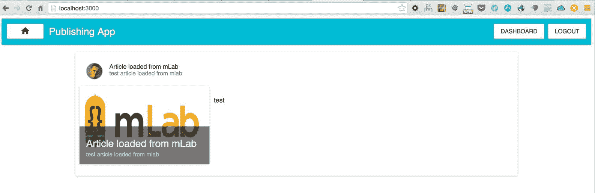

现在重要的区别是所有 CRUD 操作（通过我们的发布应用程序读/写）都是在远程 MongoDB 上完成的（而不是在本地 MongoDB 上）。

发布应用程序使用 mLab MongoDB 后，我们准备好准备 Docker 映像，然后使用 AWS 负载平衡器和 EC2 容器服务将其部署到 AWS EC2 的多个实例上。

# 正在处理发布应用程序 Docker 映像

在继续之前，您应该能够使用远程 mLab MongoDB 在本地运行项目。这是必需的，因为我们将开始在 Docker 容器中运行发布应用程序。然后，我们的应用程序将远程连接到 Mongo。我们不会在任何 Docker 容器中运行任何 MongoDB 进程。这就是为什么在以下步骤中使用 mLab 非常重要的原因。

让我们通过在终端/命令行中执行以下命令来创建 Dockerfile：

```jsx
[[your are in the project main directory]]
$ touch Dockerfile

```

在新 Dockerfile 中输入以下内容：

```jsx
FROM centos:centos7 

RUN yum update -y 
RUN yum install -y tar wget 
RUN wget -q https://nodejs.org/dist/v4.0.0/node-v4.0.0-linux-x64.tar.gz -O - | tar xzf - -C /opt/ 

RUN mv /opt/node-v* /opt/node 
RUN ln -s /opt/node/bin/node /usr/bin/node 
RUN ln -s /opt/node/bin/npm /usr/bin/npm 

COPY . /opt/publishing-app/ 

WORKDIR /opt/publishing-app 

RUN npm install 
RUN yum clean all 

EXPOSE 80 
CMD ["npm", "start"]

```

让我们一步一步地看看我们将与 Docker 一起在发布应用程序中使用的 Dockerfile：

*   `FROM centos:centos7`：这表示我们将使用[中的 CentOS 7 Linux 发行版作为起点 https://hub.docker.com/r/_/centos/](https://hub.docker.com/r/_/centos/) 公共 Docker 存储库。

您可以使用任何其他软件包作为起点，例如 Ubuntu，但我们使用 CentOS 7，因为它更轻量级，通常非常适合 web 应用部署。您可以在[上找到更多详细信息 https://www.centos.org/](https://www.centos.org/) 。

Documentation of all commands is available at [https://docs.docker.com/engine/reference/builder/](https://docs.docker.com/engine/reference/builder/).

*   `RUN yum update -y`：这将使用`yum--`标准从命令行更新适用于任何 Linux 设置的软件包。
*   `RUN yum install -y tar wget`：安装两个软件包`tar`（用于解包文件）和`wget`（用于下载文件）。
*   `RUN wget -q https://nodejs.org/dist/v4.0.0/node-v4.0.0-linux-x64.tar.gz -O - | tar xzf - -C /opt/*`：此命令将`node4.0.0`下载到我们的 CentOS 容器中，解压后，将所有文件放入`/opt/`目录。
*   `RUN mv /opt/node-v /opt/node*`：这将我们刚刚下载并解包的文件夹（带有`node`）重命名为简单的`node`，没有版本命名。
*   `RUN ln -s /opt/node/bin/node /usr/bin/node`：我们正在用`/usr/bin/node`链接`/opt/node/bin/node`位置，所以我们可以在终端中使用一个简单的`$ node`命令。这是 Linux 用户的标准配置。
*   `RUN ln -s /opt/node/bin/npm /usr/bin/npm`：与`node`相同，但与`npm`相同。我们正在链接它，以便更方便地使用，并将其链接到 CentOS 7 上的`$ npm`。
*   `COPY . /opt/publishing-app/`：复制上下文中的所有文件（开始容器构建时，`.`（点）符号是位置，我们马上就会这么做。）它将所有文件复制到我们容器中的`/opt/publishing-app/`位置。

在我们的例子中，我们已经在发布应用程序的目录中创建了 Dockerfile，因此它会将容器中的所有项目文件复制到`/opt/publishing-app/`的给定位置。

*   `WORKDIR /opt/publishing-app`：在我们的 Docker 容器中有了发布应用程序的文件后，我们需要选择工作目录。它类似于任何 Unix/Linux 机器上的`$ cd /opt/publishing-app`。
*   `RUN npm install`：当我们在工作目录`/opt/publishing-app`中时，我们运行标准的`npm install`命令。
*   `RUN yum clean all`：我们清理`yum`缓存。
*   `EXPOSE 80`：我们定义了使用发布应用程序的端口。
*   `CMD ["npm", "start"]`：然后，我们指定如何在 Docker 容器中运行应用程序。

我们还将在主项目目录中创建一个`.dockerignore`文件：

```jsx
$ [[[in the main directory]]]
$ touch .dockerignore

```

文件内容如下所示：

```jsx
.git 
node_modules 
.DS_Store

```

我们不想复制上面提到的文件`(.DS_Store`是针对 OSX 的）。

# 构建发布应用程序容器

目前，您将能够构建 Docker 的容器。

在项目的主目录中，需要运行以下操作：

```jsx
docker login

```

`login`命令将提示您插入 Docker 用户名和密码。正确验证后，可以运行`build`命令：

```jsx
docker build -t przeor/pub-app-docker .

```

Of course, the username and the container name combination has to be yours. Replace it with your details.

前面的命令将使用 Dockerfile 命令构建容器。这是您将看到的（步骤 1、步骤 2，等等）：

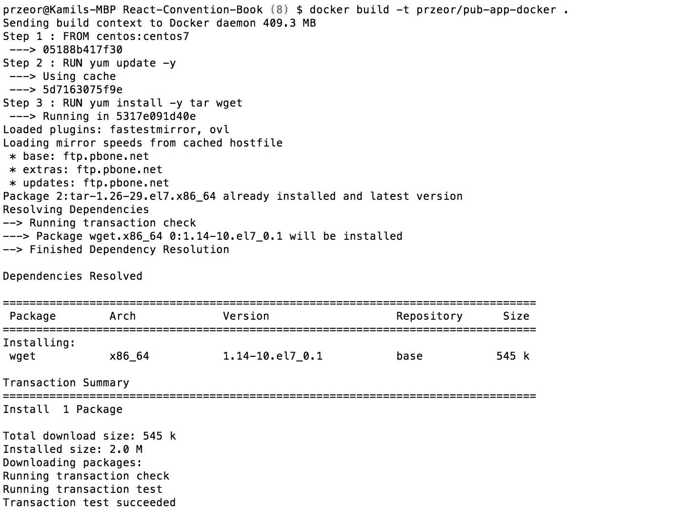

成功构建后，您将在终端/命令行中看到类似的内容：

```jsx
[[[striped from here for the sake of brevity]]]
Step 12 : EXPOSE 80
 ---> Running in 081e0359cbd5
 ---> ce0433b220a0
Removing intermediate container 081e0359cbd5
Step 13 : CMD npm start
 ---> Running in 581df04c8c81
 ---> 1970dde57fec
Removing intermediate container 581df04c8c81
Successfully built 1910dde57fec

```

从 Docker 码头可以看到，我们成功地建造了一个集装箱。下一步是在本地对其进行测试，然后学习更多 Docker 的基础知识，最后开始进行 AWS 部署。

# 在本地运行发布应用程序容器

要测试容器是否已正确构建，请执行以下步骤。

运行以下命令：

```jsx
$ docker-machine env

```

前面的命令将为您提供类似以下内容的输出：

```jsx
export DOCKER_TLS_VERIFY="1"
export DOCKER_HOST="tcp://192.168.99.100:2376"
export DOCKER_CERT_PATH="/Users/przeor/.docker/machine/machines/default"
export DOCKER_MACHINE_NAME="default"
# Run this command to configure your shell: 
# eval $(docker-machine env)

```

我们正在寻找`DOCKER_HOST`IP 地址；在这种情况下，它是`192.168.99.100`。

此 Docker 主机 IP 将用于检查应用程序是否在容器中正确运行。记下来。

下一步是使用以下命令运行本地容器：

```jsx
$ docker run -d -p 80:80  przeor/pub-app-docker npm start

```

关于标志：`d`标志代表“分离”，因此流程将在后台运行。您可以使用以下命令列出所有正在运行的 Docker 进程：

```jsx
docker ps

```

示例输出如下所示：

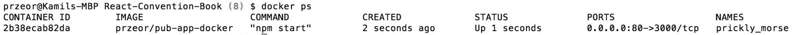

`-p`标志告诉我们集装箱的端口`80`绑定到 Docker IP 主机上的端口`80`。因此，如果我们在容器中的端口`80`上公开我们的节点应用程序，那么它将能够在 IP 上的标准端口`80`上运行（在示例中，它将是`192.168.99.100:80`；显然，端口`80`用于所有 HTTP 请求）。

`przeor/pub-app-docker`命令将指定要运行的容器的名称。

通过`npm start`，我们可以在启动后立即告诉 Docker 容器要运行哪个命令（否则，容器将立即运行并停止）。

More references about `docker run` are available at [https://docs.docker.com/engine/reference/run/](https://docs.docker.com/engine/reference/run/).

前面的命令将运行应用程序，如以下屏幕截图所示：

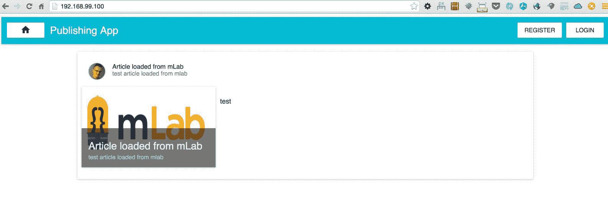

如您所见，浏览器 URL 栏中的 IP 地址是 http://192.168.99.100\. 这是我们的 Docker 主机 IP。

# 调试容器

如果容器不适合您，如以下屏幕截图所示，请使用以下命令进行调试并查找原因：

```jsx
docker run -i -t -p 80:80 przeor/pub-app-docker

```

这个带有`-i -t -p`标志的命令将向您显示终端/命令行中的所有日志，如以下屏幕截图所示（这只是一个示例，旨在向您展示本地调试 Docker 容器的能力）：


# 将 Docker 容器推送到远程存储库

如果一个容器在本地为您工作，那么它几乎可以用于 AWS 部署。

在推送容器之前，让我们将`.env`文件添加到`.dockerignore`，因为其中包含所有不会放入容器的敏感数据。因此，在`.dockerignore`文件中添加以下内容：

```jsx
.git 
node_modules 
.DS_Store 
.env

```

在您将`.env`添加到`.gitignore`之后，我们需要更改`server/index.js`文件并添加一条额外的`if`语句：

```jsx
if(!process.env.PORT) { 
  var env = require('node-env-file'); 
  // Load any undefined ENV variables form a specified file.  
  env(__dirname + '/.env'); 
}

```

这个`if`语句检查我们是在本地（使用`.env`文件）还是在 AWS 实例上远程运行应用程序（然后我们以更安全的方式传递`env`变量）。

在您将`.env`文件添加到`.dockerignore`中（并修改了`server/index.js`之后），构建准备推送的容器：

```jsx
docker build -t przeor/pub-app-docker

```

关于环境变量，我们将通过 AWS 高级选项添加它们。稍后您将了解这一点，但要了解如何在本地主机上运行它们时添加它们，请查看以下示例（命令标志中提供的假数据）：

```jsx
$ docker run -i -t -e PORT=80 -e AWS_ACCESS_KEY_ID='AKIMOCKED5JM4VUHA' -e AWS_SECRET_ACCESS_KEY='k3JxMOCKED0oRI6w3ZEmENE1I0l' -e AWS_BUCKET_NAME='publishing-app' -e AWS_REGION_NAME='eu-central-1' -e MONGO_USER='usermlab' -e MONGO_PASS='MOCKEDpassword' -e MONGO_PORT=25732 -e MONGO_ENV='publishingapp' -e MONGO_HOSTNAME='ds025761.mlab.com' -p 80:80 przeor/pub-app-docker
npm start

```

Make sure that you have provided your correct `AWS_REGION_NAME`. Mine is `eu-central-1`, but yours can be different.

如您所见，从`server/.env`文件到 Bash 终端中的 Docker run 命令，所有内容都已被移动：

```jsx
AWS_ACCESS_KEY_ID=<<___AWS_ACCESS_KEY_ID__>>
AWS_SECRET_ACCESS_KEY=<<___AWS_SECRET_ACCESS_KEY__>>
AWS_BUCKET_NAME=publishing-app
AWS_REGION_NAME=eu-central-1
MONGO_USER=<<___your_mlab_mongo_user__>>
MONGO_PASS=<<___your_mlab_mongo_pass__>>
MONGO_PORT=<<___your_mlab_mongo_port__>>
MONGO_ENV=publishingapp
MONGO_HOSTNAME=<<___your_mlab_mongo_hostname__>>
PORT=80

```

您可以在这里找到，`-e`标志用于`env`变量。最后一件事是将容器推送到 Docker Hub 托管的远程存储库：

```jsx
docker push przeor/pub-app-docker

```

然后，您将能够在 Bash/命令行中找到类似于以下内容的内容：

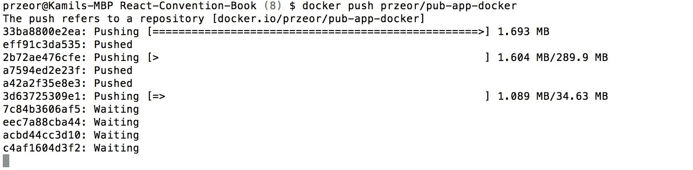

推式回购的链接与此类似：


前面的屏幕截图是从 Pushd Docker 存储库生成的。

# 有用的 Docker 命令摘要

以下是一些有用的 Docker 命令：

*   此命令将列出所有图像，`docker rm`可以从您的本地机器上删除回购，如果您想删除它：

```jsx
 docker images
 docker rm CONTAINER-ID

```

*   您可以只使用`CONTAINER-ID`中的前三个字符。您不需要写下整个容器 ID。这是一种方便。

*   此选项用于停止正在运行的 Docker 容器：

```jsx
        docker ps
docker stop CONTAINER-ID

```

*   您可以通过以下方法使用容器的版本标记：

```jsx
        docker tag przeor/pub-app-docker:latest przeor/pub-app-  
        docker:0.1
docker images

```

*   列出 Docker 图像后，您可能会注意到您有两个容器，一个带有标签`latest`，另一个带有`0.1`。这是一种跟踪更改的方法，因为如果推送容器，标记也将列在 Docker Hub 上。

*   检查容器的本地 IP：

```jsx
        $ docker-machine env

```

*   从 Dockerfile 生成容器：

```jsx
        docker build -t przeor/pub-app-docker .

```

*   以“分离”模式运行容器：

```jsx
        $ docker run -d -p 80:80 przeor/pub-app-docker npm start

```

*   运行容器以调试它，而不分离它，以便可以找到容器的 Bash 终端中发生的情况：

```jsx
        docker run -i -t -p 80:80 przeor/pub-app-docker

```

# AWS EC2 上的 Docker 简介

两章前，我们为静态图像上传实现了 AmazonAWSS3。您应该已经拥有一个 AWS 帐户，因此您可以执行以下步骤在 AWS 上创建部署。

通常，您可以使用免费 AWS 层的步骤，但在本教程中我们将使用付费版本。在开始本节之前，阅读 AWS EC2 定价，了解如何在 AWS 上部署 Docker 容器。

AWS 还拥有强大的 Docker 容器支持，其服务名为**EC2 容器服务**（**ECS**。

如果你买了这本书，可能意味着你到目前为止还没有使用 AWS。因此，我们将首先在 EC2 上手动部署 Docker，向您展示 EC2 实例是如何工作的，以便您可以从本书中获得更多知识。

我们的主要目标是使 Docker 容器的部署自动化，但现在，我们将从手动方法开始。如果您已经使用了 EC2，您可以跳过下一小节，直接转到 ECS。

# 人工进近-EC2 上的 Docker

我们使用以下命令（前几页）在本地运行 Docker 容器：

```jsx
$ docker run -d -p 80:80  przeor/pub-app-docker npm start

```

我们将做同样的事情，不是在本地，而是在 EC2 实例上，现在 100%手动；稍后，我们将使用 AWS ECS 100%自动完成此操作。

在继续之前，让我们先了解一下 EC2 是什么。它是一种位于 Amazon Web Services 云中的可扩展计算能力。在 EC2 中，您不需要预先投资购买任何硬件。您支付的所有费用都是使用 EC2 实例所花费的时间。这使您能够更快地部署应用程序。很快，您就可以添加新的虚拟服务器（当有更大的 web 流量需求时）。有一些机制可以使用**AWS CloudWatch**自动扩展 EC2 实例的数量。AmazonEC2 使您能够向上或向下扩展以处理变化的需求（如受欢迎程度的峰值）——此功能减少了预测流量的需要（并为您节省了时间和金钱）。

现在，我们将只使用一个 EC2 实例（在本书的后面，我们将看到更多带有负载平衡器和 ECS 的 EC2 实例）。

# 基础知识-启动 EC2 实例

我们将启动一个 EC2 实例，然后通过 SSH 登录到它（您可以在 Windows 操作系统上使用**Putty**。

通过访问以下链接登录 AWS 控制台：[https://eu-central-1.console.aws.amazon.com/console/home](https://eu-central-1.console.aws.amazon.com/console/home) 。

点击 EC2 链接：[https://eu-central-1.console.aws.amazon.com/ec2/v2/home](https://eu-central-1.console.aws.amazon.com/ec2/v2/home)

然后单击蓝色的启动实例按钮：

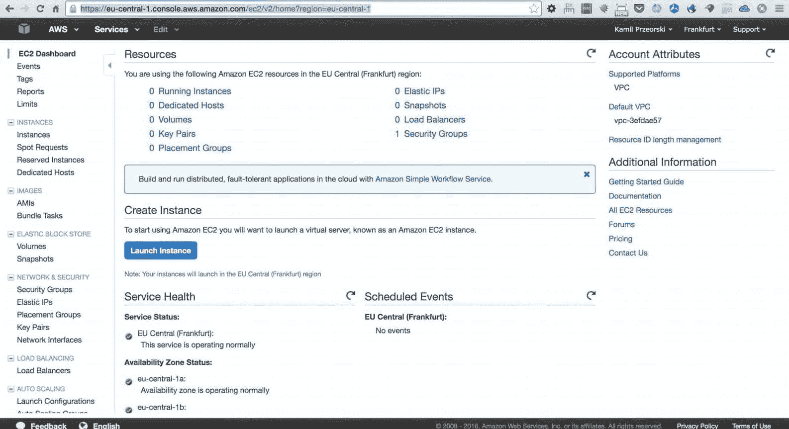

按钮如下所示：

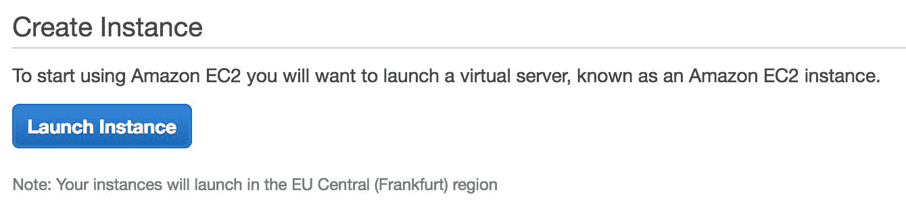

点击按钮后，您将被重定向到**亚马逊机器镜像**（**AMI**页面：


AMI 有一个可以运行 EC2 实例的映像列表。每个映像都有一个预装软件列表。例如，最标准的图像如下所示：

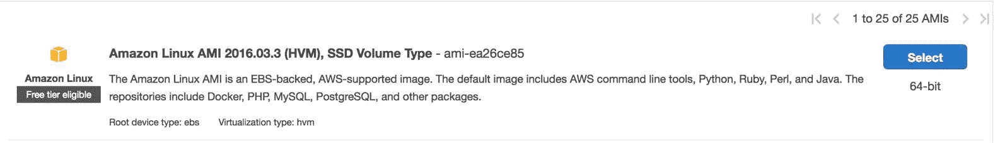

它预装了软件；例如，AmazonLinuxAMI 是一个 EBS 支持、AWS 支持的映像。默认映像包括 AWS 命令行工具、Python、Ruby、Perl 和 Java。存储库包括 Docker、PHP、MySQL、PostgreSQL 和其他软件包。

在同一页面上，您还可以找到其他 AMI 在市场上购买或由社区免费创建和共享。您还可以过滤图像，使其仅列出空闲层：

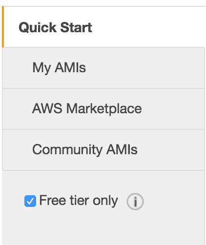

为了使本逐步指南更简单，让我们选择前面屏幕截图中的图像；其名称将类似于`Amazon Linux AMI 2016.03.3 (HVM), SSD Volume Type`。

The name of the image may slightly vary; don't worry about it.

单击蓝色的选择按钮。然后将转到步骤 2：选择实例类型页面，如以下屏幕截图所示：

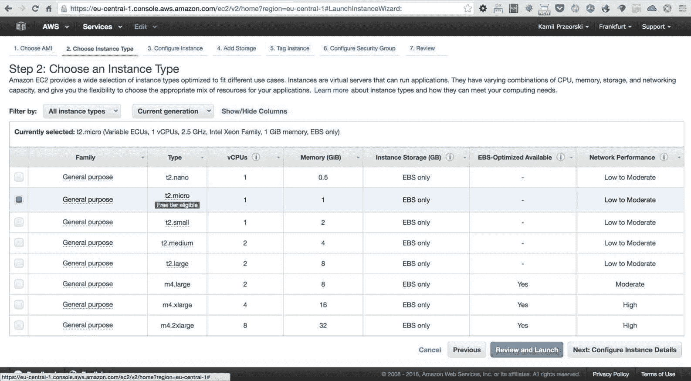

在此页面中，选择以下选项：


然后，单击此按钮：


最简单的方法是选择默认选项：

1.  回顾
2.  配置安全组（我们将在此选项卡中进行一些更改）。
3.  标记实例（保留默认选项）。
4.  添加存储（保留默认选项）。
5.  配置实例（保留默认选项）。

6.  选择一个实例类型。
7.  选择一个 AMI。
8.  通常，在进入“配置安全性”之前，请一直单击“下一步”按钮。

您可以在顶部找到的进度指标如下：


我们现在的目标是进入安全配置页面，因为我们需要稍微自定义允许的端口。安全组由控制 EC2 实例网络流量的规则组成（也称为防火墙选项）。为了安全起见，将名称设置为`ssh-and-http-security-group`：

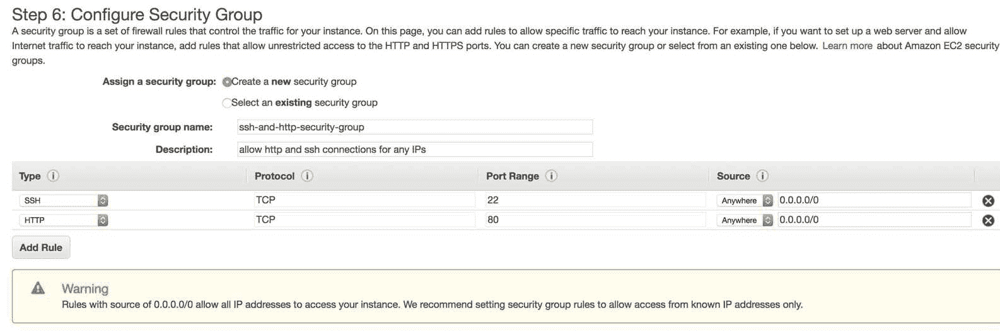

您可以在这里找到，您还需要单击 addrule 按钮并添加一个名为 HTTP 的新规则。这将允许我们的新 EC2 实例通过端口 80 可用于所有 IP。

将名称和 HTTP 端口 80 添加为新规则后，可以单击“审阅和启动”按钮：


然后，在您满意地查看该实例后，单击该视图中名为 Launch 的蓝色按钮：

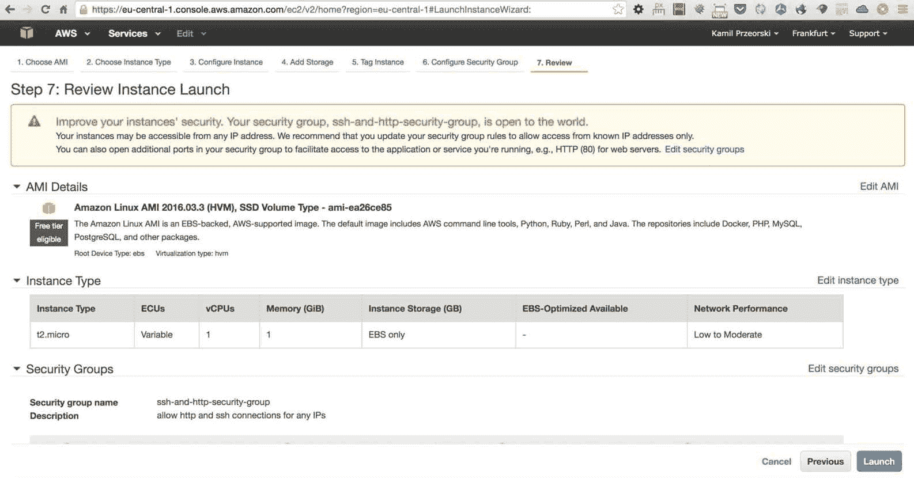

单击启动按钮后，您将看到一个模式，显示选择现有密钥对或创建新密钥对：


通常，您需要创建一个新的密钥对。将其命名为`pubapp-ec2-key-pair`，然后点击下载按钮，如下图所示：


下载`pubapp-ec2-key-pai`后，您可以点击蓝色启动按钮。接下来，您将看到以下内容：


在此屏幕上，您可以直接转到 EC2 启动日志（单击查看启动日志链接），以便能够找到列出的实例，如以下屏幕截图所示：

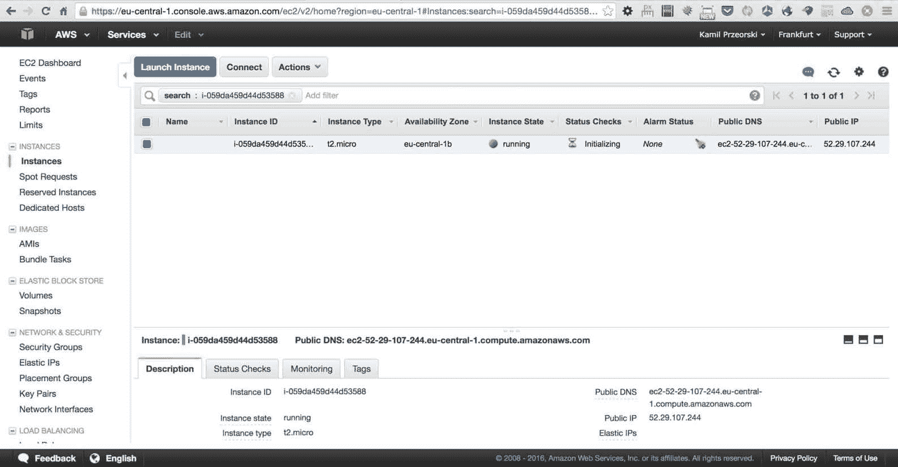

伟大的您的第一个 EC2 已成功启动！我们需要登录到它并从那里设置 Docker 容器。

保存 EC2 实例的公共 IP。在前面的启动日志中，您可以发现我们刚刚创建的机器具有公共 IP 52.29.107.244。

您的 IP 将不同（当然，这只是一个示例）。把它保存在某个地方；我们将在稍后使用它，因为您需要它通过 SSH 登录到服务器并安装 Docker 应用程序。

# 通过 PuTTy 进行 SSH 访问-仅限 Windows 用户

如果不在 Windows 上工作，可以跳过此小节。

我们将使用 PuTTy，可在[下载 http://www.chiark.greenend.org.uk/~sgtatham/putty/download.html](http://www.chiark.greenend.org.uk/~sgtatham/putty/download.html)（`putty.exe`、`pageant.exe`和`puttygen.exe`）。

下载 EC2 实例的密钥对，并使用`puttygen.exe`将其转换为`ppk`：

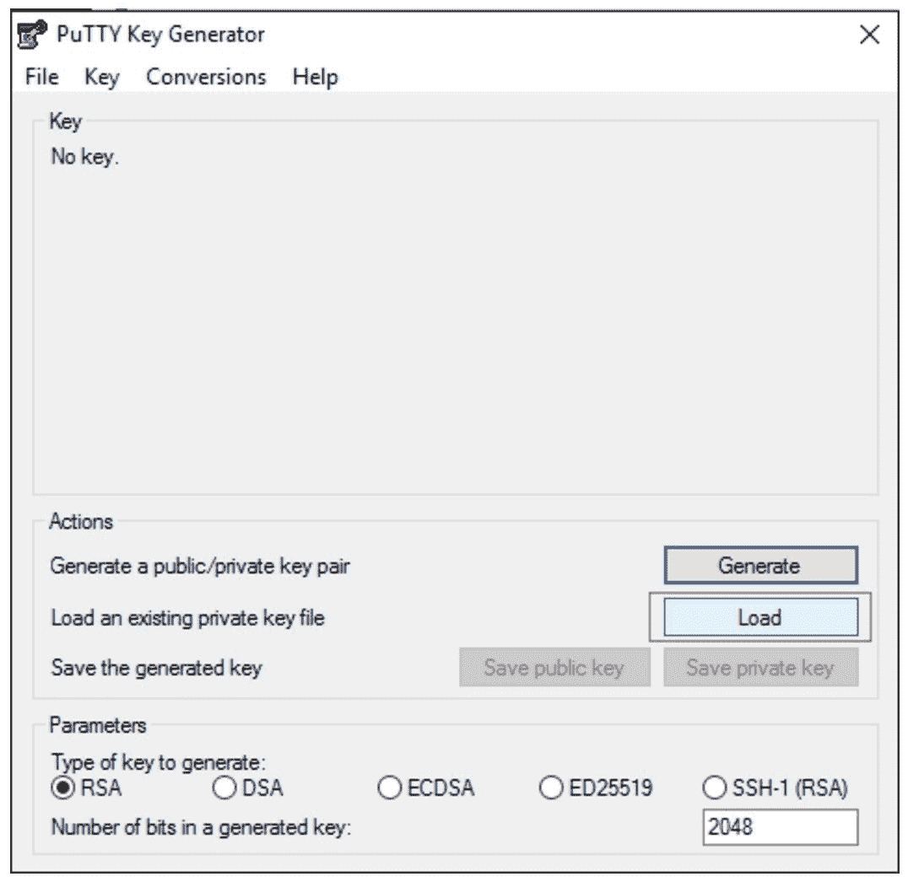

点击加载按钮并选择`pubapp-ec2-key-pair.pem`文件，然后将其转换为`ppk`。

然后您需要单击保存私钥按钮。你完了；您可以关闭`puttygen.exe`和打开`pageant.exe`。从中执行以下操作：

*   选择“添加关键点”
*   然后检查您的密钥是否已正确添加到选美密钥列表中

如果您的私钥在列表中，则您可以使用`putty.exe`。

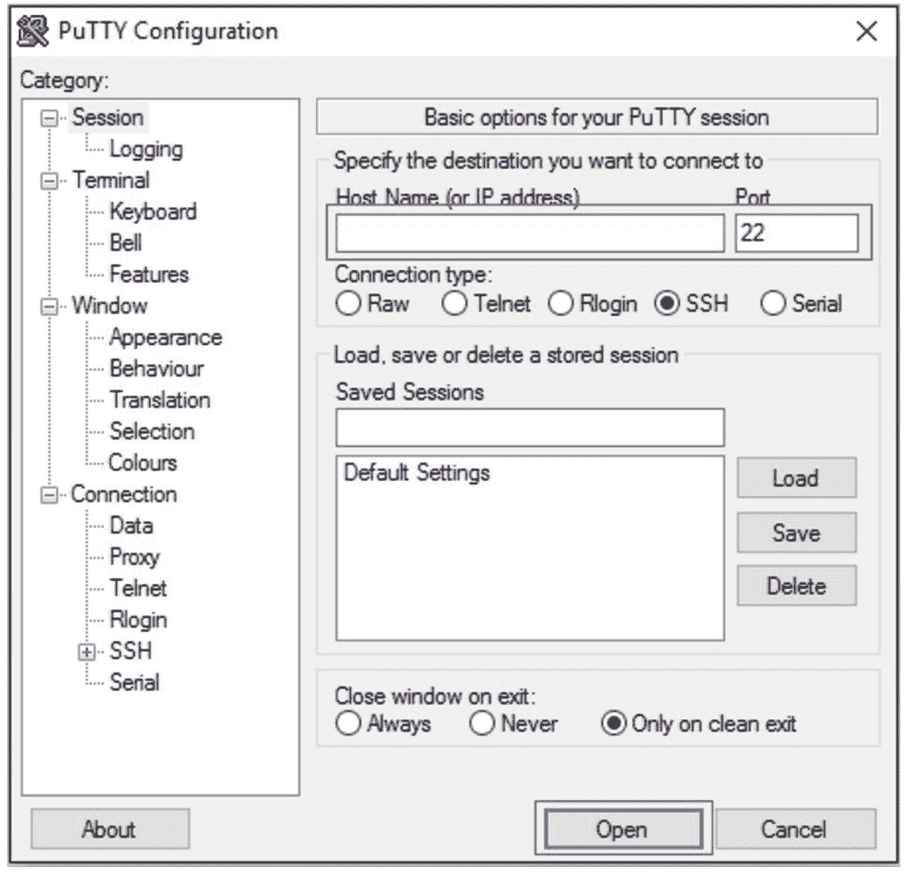

如果已经打开 PuTTy 程序，则需要通过 SSH 登录，方法是键入 EC2 实例 IP 并单击 Open 按钮，如前面的屏幕截图所示。PuTTy 允许在 Windows 上使用 SSH 连接。

# 通过 SSH 连接到 EC2 实例

在上一章中，在我们启动 EC2 实例之后，我们发现了我们的公共 IP（请记住，您的公共 IP 将不同）：`52.29.107.244`。我们需要用这个公共 IP 连接到远程 EC2 实例。

我已将`pubapp-ec2-key-pair.pem`保存在我的`Downloads`目录中，请转到您下载`.pem`文件的目录：

```jsx
$ cd ~/Downloads/
$ chmod 400 pubapp-ec2-key-pair.pem
$ ssh -i pubapp-ec2-key-pair.pem ec2-user@52.29.107.244

```

In PuTTy on Windows, it will look similar after this step. You need to provide in the PuTTy box the IP and ports in order to correctly log in to the machine. When you get a prompt to type a username, use `ec2-user`, as in the SSH example.

成功登录后，您将能够看到以下内容：

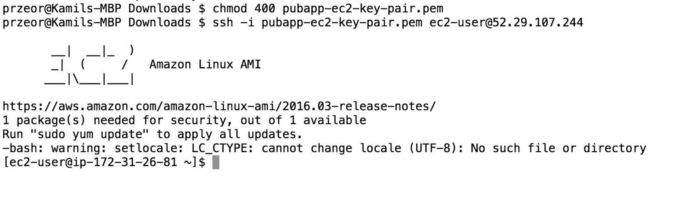

当我们通过 SSH 登录到 EC2 实例时，以下说明适用于所有 OS 用户（OS X、Linux 和 Windows）。接下来需要以下命令：

```jsx
[ec2-user@ip-172-31-26-81 ~]$ sudo yum update -y
[ec2-user@ip-172-31-26-81 ~]$ sudo yum install -y docker
[ec2-user@ip-172-31-26-81 ~]$ sudo service docker start

```

这些命令将更新`yum`软件包管理器，并在后台安装和启动 Docker 服务：

```jsx
[ec2-user@ip-172-31-26-81 ~]$ sudo usermod -a -G docker ec2-user
[ec2-user@ip-172-31-26-81 ~]$ exit

> ssh -i pubapp-ec2-key-pair.pem ec2-user@52.29.107.244
[ec2-user@ip-172-31-26-81 ~]$ docker info

```

运行`docker info`命令后，将显示类似于以下输出的内容：


如果查看前面的屏幕截图，您将看到一切正常，我们可以使用以下命令继续运行发布应用程序的 Docker 容器：

```jsx
    [ec2-user@ip-172-31-26-81 ~]$ docker run -d PORT=80 -e AWS_ACCESS_KEY_ID='AKIMOCKED5JM4VUHA' -e AWS_SECRET_ACCESS_KEY='k3JxMOCKED0oRI5w3ZEmENE1I0l' -e AWS_BUCKET_NAME='publishing-app' -e AWS_REGION_NAME='eu-central-1' -e MONGO_USER='usermlab' -e MONGO_PASS='MOCKEDpassword' -e MONGO_PORT=25732 -e MONGO_ENV='publishingapp' -e MONGO_HOSTNAME='ds025761.mlab.com' -p 80:80 przeor/pub-app-docker npm start

```

Make sure you have provided your correct `AWS_REGION_NAME`. Mine is `eu-central-1`, but yours could be different.

如您所见，从`server/.env`文件到 Bash 终端中的`docker run`命令，所有内容都已被移动：

```jsx
AWS_ACCESS_KEY_ID=<<___AWS_ACCESS_KEY_ID__>>
AWS_SECRET_ACCESS_KEY=<<___AWS_SECRET_ACCESS_KEY__>>
AWS_BUCKET_NAME=publishing-app
AWS_REGION_NAME=eu-central-1
MONGO_USER=<<___your_mlab_mongo_user__>>
MONGO_PASS=<<___your_mlab_mongo_pass__>>
MONGO_PORT=<<___your_mlab_mongo_port__>>
MONGO_ENV=publishingapp
MONGO_HOSTNAME=<<___your_mlab_mongo_hostname__>>
PORT=80

```

如果您有不同的名称（如果您的设置与前几章中的建议不同），请确保重命名`AWS_BUCKET_NAME`、`AWS_REGION_NAME`或`MONGO_ENV`。

然后，为了检查是否一切顺利，您还可以使用以下工具：

```jsx
[ec2-user@ip-172-31-26-81 ~]$ docker ps

```

此命令将显示 Docker 进程是否作为分离的容器在后台正确运行。10-30 秒后，当`npm start`将运行整个项目时，您可以使用以下方法进行测试：

```jsx
[ec2-user@ip-172-31-26-81 ~]$ curl http://localhost

```

正确引导应用程序后，您可以看到类似以下内容的输出：

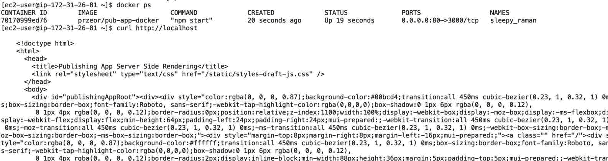

在您访问 EC2 实例的公共 IP（在我们的示例中，它是`52.29.107.244`）之后，您将能够在网上找到我们的发布应用程序，因为我们已经为我们的 EC2 实例建立了安全组，并向世界公开了端口`80`。以下是屏幕截图：

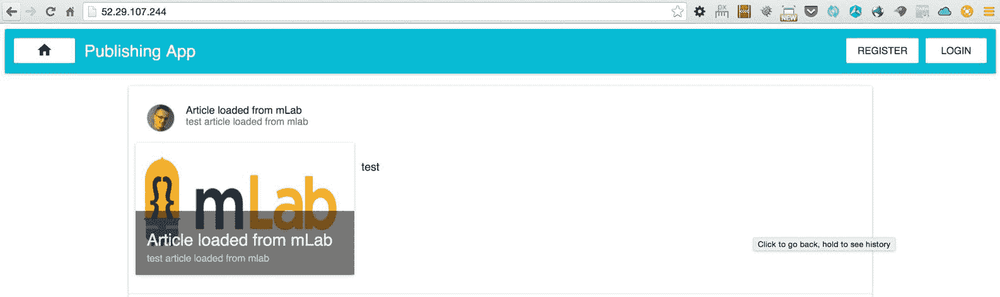

如果您在公共 IP 下看到我们的发布应用程序，那么您刚刚在 Amazon AWS EC2 上成功部署了一个 Docker 容器！

我们刚刚经历的过程非常低效，而且是手动的，但它准确地显示了当我们开始使用 ECS 时引擎盖下发生的事情。

我们目前的方法缺少以下内容：

*   与其他 Amazon 服务集成，如负载平衡、监控、警报、崩溃恢复和 route 53。
*   自动化，因为目前我们无法快速有效地部署 10 个 Docker 容器。如果您想为不同的服务部署不同的 Docker 容器，这一点也很重要，例如，您可以使用单独的容器为前端、后端甚至数据库提供服务（在我们的例子中，我们使用 mLab，所以这里不需要 mLab）。

您刚刚学习了 Amazon Web 服务的基础知识。

# ECS 基础知识-AWS EC2

EC2 容器服务帮助您创建 Docker 容器实例集群（同一容器在多个 EC2 实例上的多个副本）。每个容器都是自动部署的——这意味着您不需要像我们在上一章（手动方法）中所做的那样通过 SSH 登录到任何 EC2 实例。整个工作由 AWS 和 Docker 软件完成，您将在将来学习使用这些软件（更自动化的方法）。

例如，您设置要有五个不同的 EC2 实例——公开端口 80 中的 EC2 实例组，以便能够在`http://[[EC2_PUBLIC_IP]]`地址下找到发布应用程序。此外，我们正在所有 EC2 实例和世界其他地方之间添加一个负载平衡器，以便在流量出现任何峰值或任何 EC2 实例中断的情况下，负载平衡器将使用新实例替换中断的 EC2 实例，或根据流量缩小/增加 EC2 实例的数量。

AWS 负载平衡器的一个重要功能是，它使用端口 80 ping 每个 EC2 实例，如果 ping 实例没有使用正确的代码（200）响应，那么它将终止损坏的实例，并使用 Docker 容器打开一个新实例，该容器具有我们发布应用程序的映像。这有助于我们保持应用程序的连续可用性。

此外，我们将使用 Amazon Route 53，以获得高可用性和可扩展性的云**域名系统**（**DNS**）web 服务，从而能够建立顶级域名；在我们的例子中，我将使用我为这本书专门购买的域名：`http://reactjs.space`。

当然，这将是我们的 HTTP 地址。如果您构建了不同的服务，您需要购买自己的域名，以便按照说明操作并了解 Amazon Route 53 的工作原理。

# 使用 ECS

在开始研究 ECS 之前，让我们先了解一些基本术语：

*   **集群**：这是我们流程的主要部分，它将底层资源作为 EC2 实例和任何连接的存储进行聚合。它将许多 EC2 实例集群到一个容器化应用程序中，以实现可扩展性。
*   **任务定义**：此任务确定要在每个 EC2 实例上运行的 Docker 容器（即，`docker run`命令），并帮助您定义更高级的选项，例如要传递到容器中的环境变量。
*   **服务**：这是集群和任务定义之间的粘合剂。该服务处理集群上正在运行的任务的登录。这还包含对要运行的任务（容器及其设置的组合）的修订的管理。每次更改任务中的任何设置时，都会创建任务的新修订版。在服务中，您可以指定要在 ECS 中的 EC2 实例上运行的任务及其版本。

访问 AWS 控制台并找到 ECS。单击链接转到 EC2 容器服务控制台。在那里，您将看到一个名为“开始”的蓝色按钮：

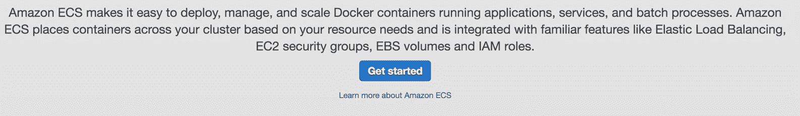

之后，您将看到一个 ECS 向导，包括以下步骤：

1.  创建任务定义。
2.  配置服务。
3.  配置群集。
4.  回顾

# 步骤 1-创建任务定义

在 ECS 中，任务定义是容器的配方。这有助于 ECS 了解您希望在 EC2 实例上运行什么 Docker 容器。这是 ECS 为成功部署发布应用程序容器而自动完成的步骤的配方或蓝图。

此步骤的详细信息显示在以下屏幕截图中：

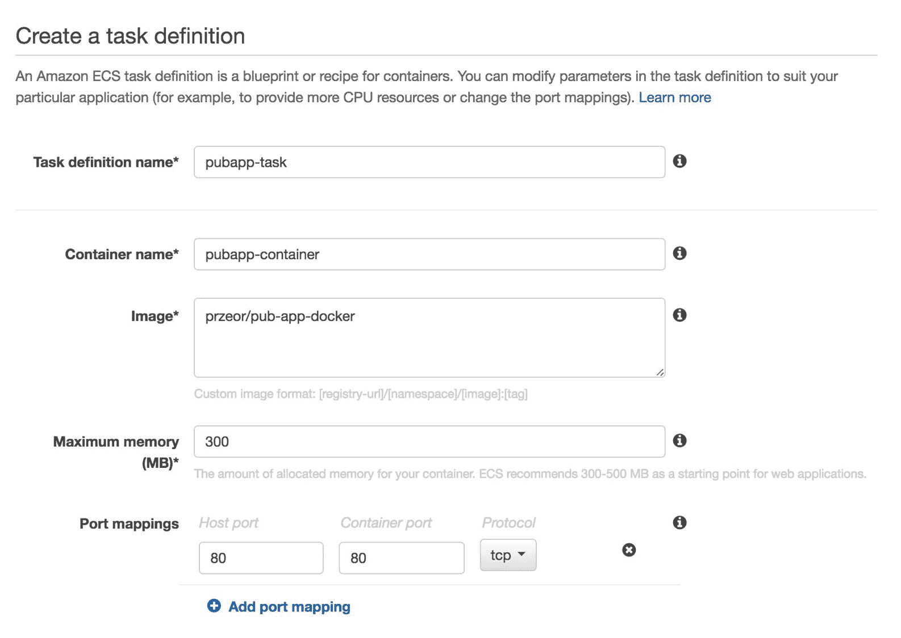

在前面的屏幕截图中，您可以发现我们的任务定义名称为`pubapp-task`。容器名称为`pubapp-container`。

对于 Image，我们使用与在本地运行带有`docker run`的容器时相同的参数。在`przeor/pub-app-docker`的情况下，ECS 会知道需要从[下载容器 https://hub.docker.com/r/przeor/pub-app-docker/](https://hub.docker.com/r/przeor/pub-app-docker/) 。

现在，让我们将最大内存保持在默认值（`300`）。将两个端口映射设置为`80`。

At the time of writing this book, there are some problems if your container doesn't expose port `80`. It's probably a bug with the ECS wizard; without the wizard, any port can be used on the container.

单击“任务定义”视图中的“高级选项”：


您将看到一个带有其他选项的幻灯片面板：


我们需要具体说明以下事项：

*   **命令**：必须用逗号分隔，所以我们使用`npm,start`。
*   **工作目录**：我们使用`/opt/publishing-app`（Dockerfile 中设置了相同的路径）。
*   **环境变量**：这里，我们指定`server/.env`文件中的所有值。这一部分是重要的设置；如果没有通过环境变量提供的正确详细信息，应用程序将无法正常工作。
*   **其余数值/输入**：保持默认值不变。

It's very important to add all the environment variables. We need to be very careful as it's easy to make a mistake here that will break the app inside an EC2 instance.

完成所有这些更改后，您可以单击“下一步”按钮。

# 步骤 2-配置服务

一般来说，服务是一种机制，在检查 EC2 实例运行状况的同时保持一定数量的 EC2 实例运行（使用**弹性负载平衡**（**ELB**）。ELB 自动在多个 AmazonEC2 实例之间分配传入的应用程序流量。如果服务器在端口 80 上没有响应（默认值，但可以更改为更高级的运行状况检查），则该服务将在关闭不正常的服务时运行新服务。这有助于保持应用程序的高可用性。

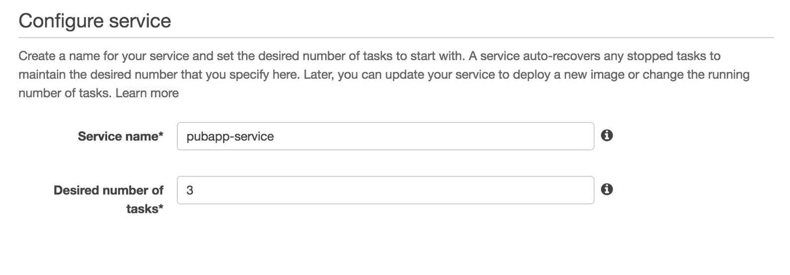

服务名称为`pubapp-service`。在本书中，我们将设置三个不同的 EC2 实例（您可以设置更少或更多；这取决于您），因此这是*所需任务数*输入的数字。

在同一步骤中，我们还需要设置**弹性负载平衡器**（**ELB**：


*   容器名称：主机端口：从下拉列表`pubapp-container:80`中选择
*   ELB 侦听器协议*：HTTP
*   ELB 侦听器端口*：`80`
*   ELB 健康检查：保留默认值；您可以在退出向导时更改它（在特定 ELB 的页面上）
*   服务 IAM 角色：向导将为我们创建此角色

完成所有这些操作后，您可以单击“下一步”按钮继续：


# 步骤 3-配置群集

现在，您将设置 ECS 容器代理（称为群集）的详细信息。在这里，您可以指定集群的名称、要使用的实例类型、实例数量（必须大于服务所需的数量）以及密钥对。


*   集群名称：我们的集群名称为`pubapp-ecs-cluster`。
*   EC2 实例类型：`t2.micro`（生产中使用较大的实例）。
*   实例数：5，这意味着服务将保持三个实例处于活动状态，另外两个实例将在工作台上等待任何致命情况。通过 bench，我的意思是一次（通过我们的设置），我们将只使用三个实例，而另外两个实例已准备好使用，但未被积极使用（流量不会重定向到它们）。
*   密钥对：我在本章前面指定了名为`pubapp-ec2-key-pair`的密钥对。始终将其保存在安全的地方，以备日后使用。

在同一页面上，您还可以找到安全组和容器实例 IAM 角色设置，但我们现在将保持默认设置：

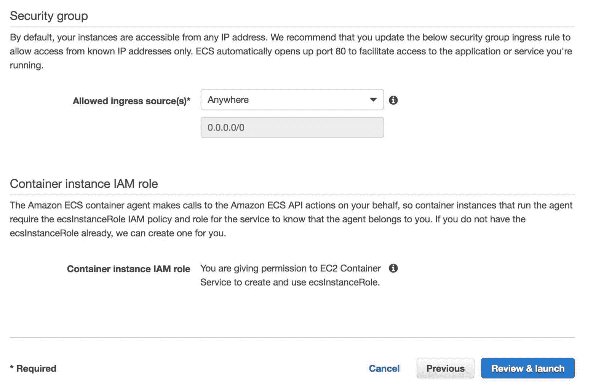

# 第 4 步-审查

最后一件事是检查是否一切看起来都很好：

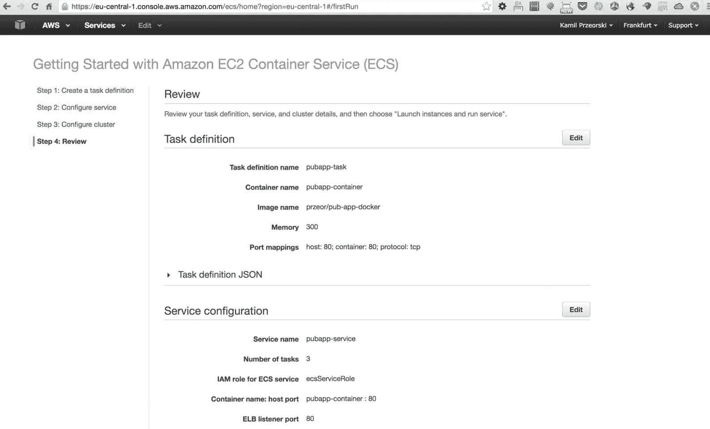

然后，选择启动实例并运行服务：


# 发射状态

单击启动按钮后，您将找到一个状态为的页面。保持打开状态，直到所有框都显示为绿色，并显示成功指示器：


以下是所有启动和运行的情况：

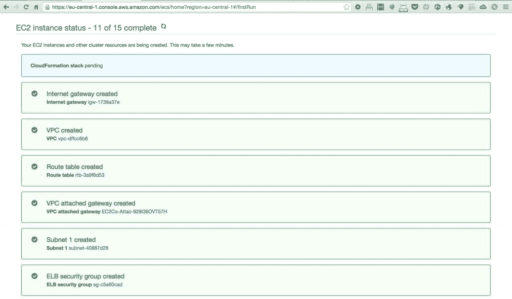

在所有框都有成功指示器后，您将能够单击顶部的查看服务按钮：


在该按钮可用后，单击该按钮（查看服务）。

# 查找负载平衡器地址

单击“查看服务”按钮后，您将看到主仪表板，其中列出了所有集群（当前只有一个）：


单击 pubapp ecs 群集，您将看到以下内容：


在前面的屏幕上，单击列表中的 pubapp 服务：

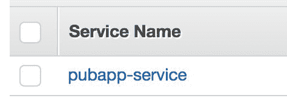

然后，您将看到以下内容：

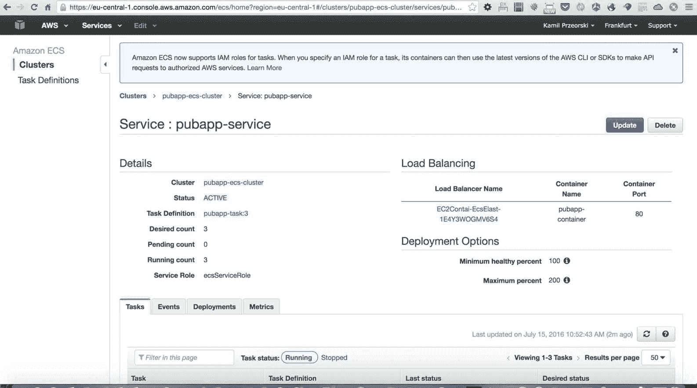

在此页面中，选择弹性平衡器：


ELB 的最终视图如下所示：


在前面的视图中，您将发现（在“描述名称”选项卡下）一个如下所示的弹性平衡器地址：

```jsx
    DNS name: 
EC2Contai-EcsElast-1E4Y3WOGMV6S4-39378274.eu-central-
    1.elb.amazonaws.com (A Record)

```

If you try to open the address and it doesn't work, then give it more time. The EC2 instances may be in progress in terms of running our Docker publishing app container. We must be patient during the initial run of our ECS cluster.

这是您的 ELB 地址，您可以将其放入浏览器并查看发布应用程序：

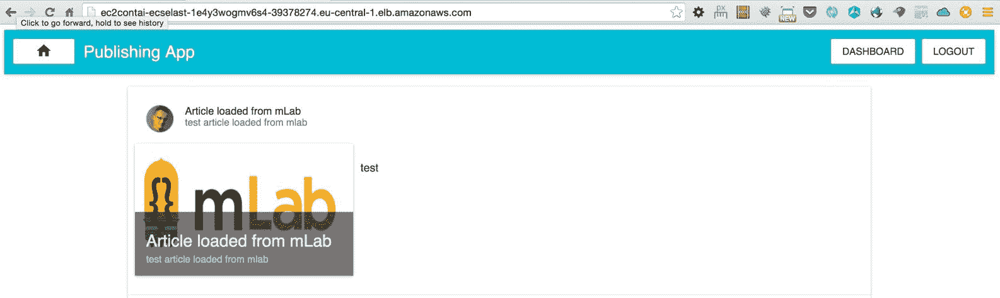

# AWS 53 号公路

本章剩下的最后一步是设置 Route 53，这是一个高度可用和可扩展的云 DNS web 服务。

对于此步骤，您有两个选项：

*   已经注册了您自己的域
*   通过路由 53 注册新域

在下面的过程中，我们将使用第一个选项，因此我们假设我们已经注册了`reactjs.space`域（当然，您需要拥有自己的域才能成功执行这些步骤）。

我们将通过将名称`http://reactjs.space`翻译成我们的 ELB 地址（`EC2Contai-EcsElast-1E4Y3WOGMV6S4-39378274.eu-central-1.elb.amazonaws.com`，将最终用户路由到发布应用程序，以便用户能够通过在浏览器的地址栏中键入`reactjs.space`以更方便用户的方式访问我们的应用程序。

从 AWS 服务列表中选择路线 53：

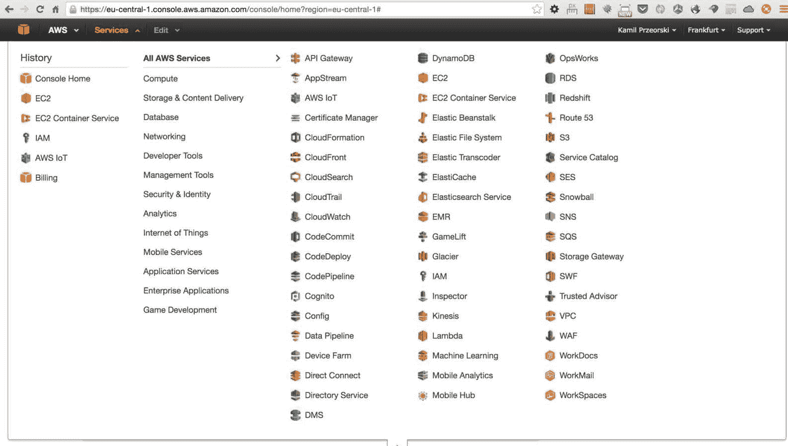

您将能够看到如下主页：


下一步是在管线 53 上创建托管分区，因此单击名为“创建托管分区”的蓝色按钮：

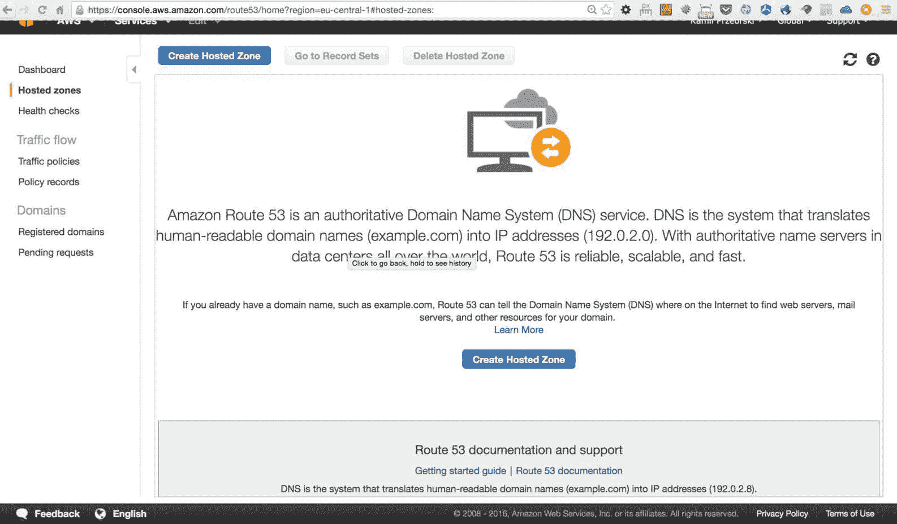

之后，您将看不到任何托管区域，因此再次单击蓝色按钮：


表单将有一个域名字段，您可以在其中输入您的域名（在我们的例子中，它是`reactjs.space`：


成功现在，您将能够看到您的 DNS 名称：


下一步是将 DNSE 停放在域的提供商上。最后一步是更改域名注册处的 DNS 设置；就我而言，它们如下所示（您的将有所不同）：

```jsx
ns-1276.awsdns-31.org.
ns-1775.awsdns-29.co.uk.
ns-763.awsdns-31.net.
ns-323.awsdns-40.com.

```

注意末尾的`.`（点）；您可以删除它们，因此我们必须更改的最终 DNSE 如下：

```jsx
ns-1276.awsdns-31.org
ns-1775.awsdns-29.co.uk
ns-763.awsdns-31.net
ns-323.awsdns-40.com

```

完成所有这些步骤后，您可以访问`http://reactjs.space`网站（DNS 更改可能需要 48 小时）。

最后一件事是创建指向我们的弹性负载平衡器的`reactjs.space`域的别名。单击以下按钮：


然后，您将看到以下视图：

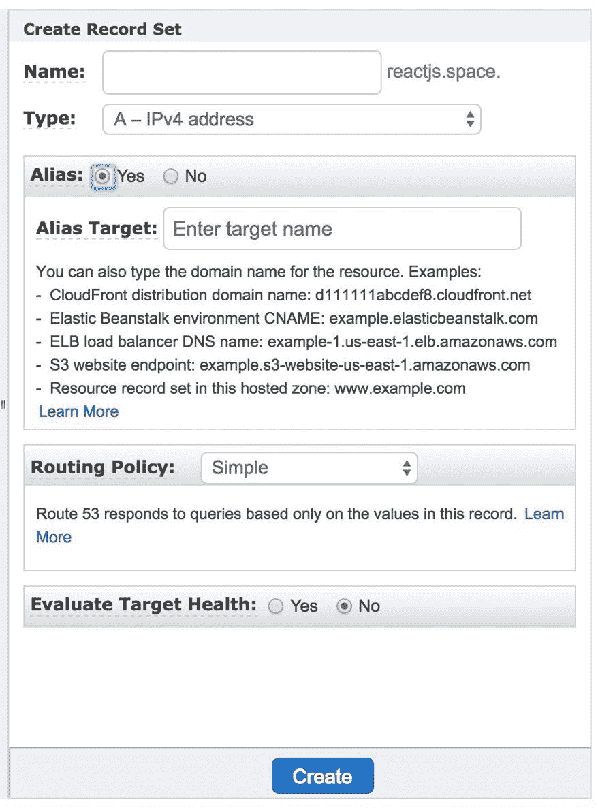

从别名的单选按钮中选择“是”，然后从列表中选择 ELB，如以下示例所示：

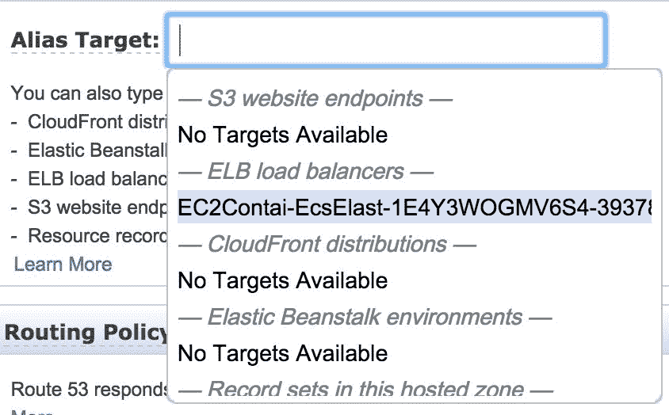

目前，在 DNS 更改完成后（可能需要 48 小时），一切都将正常工作。为了提高我们应用程序的体验，我们还将别名从`www.reactjs.space`改为`reactjs.space`，这样，如果有人在域名前键入`www.`，它将按预期工作。

再次点击“创建记录集”按钮，选择一个别名，输入`www`，之后您可以选择`www.reactjs.space`域。执行此操作并点击创建按钮：

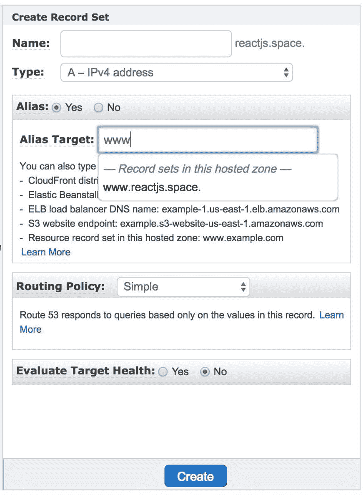

# 总结

我们已完成所有 AWS/Docker 设置。成功更改 DNS 后，您将能够在`http://reactjs.space`地址下找到我们的应用程序：


下一章将讨论持续集成的基础知识，还将帮助您在应用程序 100%投入生产之前完成应用程序中的剩余内容（到目前为止还没有实现缩小）。

让我们在下一章继续更详细地描述本书将要涉及的其余主题。