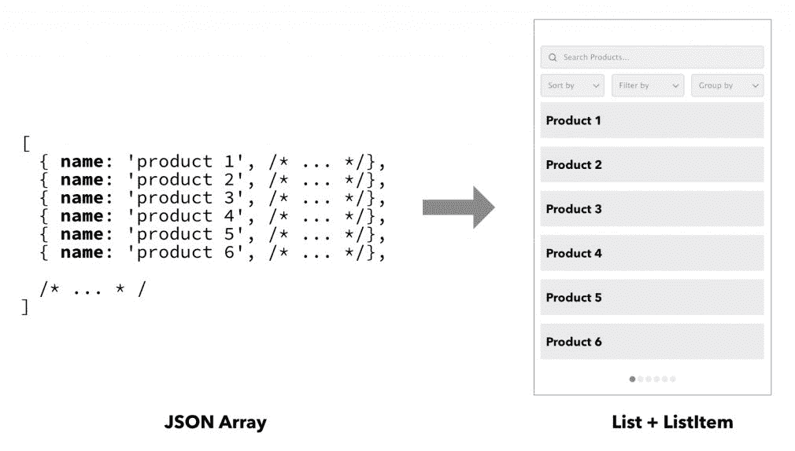
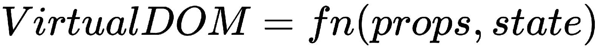
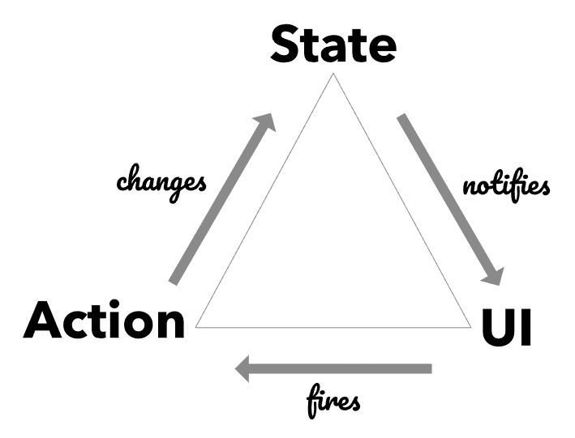
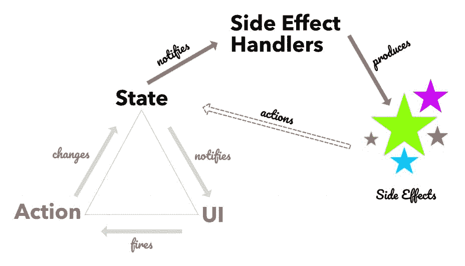
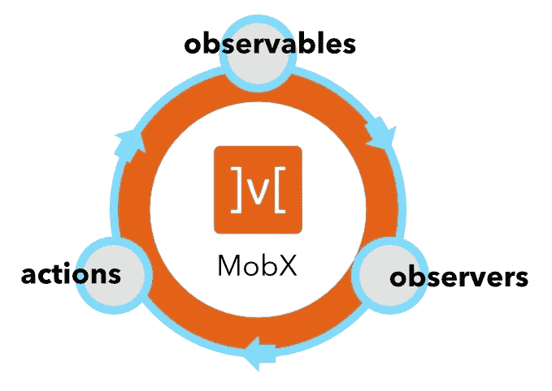

# 国家管理概论

React 应用程序的核心位于客户端状态（数据），并通过 React 组件呈现。当您处理**用户交互**（**用户界面**），执行异步操作和处理域逻辑时，管理此状态可能会变得棘手。在本章中，我们将从 UI 中状态管理的概念模型、副作用的作用和数据流开始。

然后，我们将快速浏览 MobX 并介绍其核心概念。这些概念将有助于与 Redux 进行一些比较。你会发现 MobX 是一种更具*声明性*形式的 Redux！

本章涵盖的主题如下：

*   客户机状态是什么？
*   副作用模型
*   MobX 的快速旅行

# 客户国

您可以在屏幕上看到和操作的 UI 是绘制数据可视化表示的结果。数据的形状暗示了为可视化和操作此数据而提供的控件类型。例如，如果您有一个项目列表，则可能会显示一个具有数组`ListItems`的`List`控件。操作可能包括*搜索、分页、过滤*、*排序*或*分组*列表中的项目。这些操作的状态也被捕获为数据，并通知可视化表示。

下图显示了*数组*与*列表*控件的直接关系：



简言之，*数据*在描述 UI 时起着关键作用。我们通常称之为**状态管理**，处理该数据的结构和管理可能发生的更改。状态只是 UI 上呈现的客户端数据的同义词。

State management is the act of defining the shape of data and the operations that are used to manipulate it. In the context of the UI, it is called *client-side* state management.

随着 UI 复杂性的增加，客户端上会积累更多的状态。到了一定程度，无论我们在屏幕上看到什么，状态都成为真相的最终来源。这种 UI 开发方法，我们提升了客户端状态的重要性，已经成为前端世界最大的变化之一。有一个有趣的等式可以描述 UI 和状态之间的这种关系：


`fn`是一个转换函数，应用于产生相应 UI 的状态（数据）。事实上，这里隐藏的一个微妙含义是，给定相同的状态，`fn`总是生成相同的 UI。

在 React 的上下文中，前面的等式可以写成如下：



这里唯一的区别是`fn`接受两个输入，`props`和`state`，这是反应组分的规定合同。

# 处理状态变化

然而，前面的等式只给出了 UI 的一半情况。确实，可视化表示是从状态派生的（通过转换函数`fn`），但它没有考虑 UI 上发生的*用户操作*。就像我们完全忽略了等式中的*用户*。毕竟，该接口不仅用于直观地表示数据（状态），而且还允许对该数据进行操作。

这就是我们需要引入表示这些用户操作的**操作**概念的地方，这会导致状态的变化。操作是您在触发各种输入事件后调用的命令。这些操作会导致状态发生变化，然后反映到 UI 上。

我们可以在下图中看到**状态**、**UI**和**动作**的三元组：



值得注意的是，UI 不会直接改变状态，而是通过*消息传递*系统触发*动作*来改变状态。*动作*封装了导致状态发生适当变化所需的参数。UI 负责捕获各种用户事件（点击、键盘按下、触摸、语音等），并*将其转换为一个或多个动作，然后触发这些动作以更改状态。*

当**状态**发生变化时，它会通知其所有观察者（订户）该变化。**用户界面**也是收到通知的最重要的订户之一。当这种情况发生时，它会重新呈现并更新到新状态。这个从**状态**到**UI**的数据流系统始终是单向的，已经成为现代 UI 开发中状态管理的基石。

这种方法的最大好处之一是，很容易掌握 UI 如何与不断变化的数据保持同步。它还清晰地划分了*呈现*和*数据更改*之间的职责。React 框架真正包含了这种单向数据流，您将在**MobX**中看到它的采用和扩展。

# 副作用模型

现在我们已经了解了 UI、状态和操作的角色，我们可以扩展它来构建 UI 需要如何操作的心智模型。回想一下`Action`-->`State`-->`UI`的三元组，我们可以得出一些有趣的观察结果，但没有得到明确的回答。让我们思考一下如何处理以下操作：

*   从服务器下载数据
*   将数据持久化回服务器
*   运行计时器并定期做某事
*   在某些状态更改时执行某些验证逻辑

这些都不适合我们的数据流三元组。很明显，我们遗漏了一些东西，对吗？您可能会争辩说，您可以将这些操作放在 UI 本身中，并在特定时间触发操作。然而，这将增加 UI 的额外责任，使其操作复杂化，也使其难以测试。从更学术的角度来看，这也违反了**单一责任原则**（**SRP**。SRP 声明类或模块应该只有一个更改的原因。如果我们开始在 UI 中处理额外的操作，它将有不止一个原因需要更改。

所以，这里似乎有一些对立的力量在起作用。我们希望保持数据流三元组的纯洁性，处理辅助操作，如前面列表中提到的操作，并且不向 UI 添加额外的职责。为了平衡所有这些力量，我们需要将辅助操作视为数据流三元组的*外部*。我们称之为**副作用**。

副作用是某些状态更改的结果，通过响应来自该状态的通知来调用。就像 UI 一样，有一个处理程序，我们可以称之为*副作用处理程序*，它观察（订阅）状态更改通知。当匹配状态发生更改时，会调用相应的副作用：



系统中可能有许多副作用处理程序，每个副作用处理程序都是状态的观察者。当他们观察到的状态的一部分发生变化时，他们将调用相应的副作用。现在，这些副作用还可以通过触发额外的动作来引起状态的改变。

例如，您可以从 UI 启动一个操作来下载一些数据。这将导致某个标志的状态更改，从而向所有观察者发出通知。观察标志的副作用处理程序将看到更改并触发网络调用以下载数据。下载完成后，它将启动一个操作，用新数据更新状态。

*副作用*也可以触发更新状态的操作，这是一个重要的细节，有助于完成围绕管理状态的循环。因此，不仅 UI 会导致状态更改，而且外部操作（通过副作用）也会影响状态更改。这是*副作用*的心智模型，可用于开发用户界面并管理其呈现的状态。该模型非常强大，并且随着时间的推移，其可伸缩性非常好。在本章后面以及本书中，您将看到 MobX 如何使这个*副作用*模型成为现实，并且使用起来很有趣。

考虑到这些概念，我们现在准备进入 MobX 的世界。

# MobX 的快速旅行

MobX 是一个反应式状态管理库，使采用副作用模型变得容易。MobX 中的许多概念直接反映了我们前面遇到的术语。让我们快速浏览一下这些积木。

# 可观察的状态

状态是 UI 中发生的所有事情的中心。MobX 提供了一个核心构建块，称为**可观察**，它表示应用程序的反应状态。任何 JavaScript 对象都可以用来创建可观察对象。我们可以使用恰当命名的`observable()`API，如下所示：

```jsx
import {observable} from 'mobx';

let cart = observable({
    itemCount: 0,
    modified: new Date()
});
```

在前面的示例中，我们创建了一个简单的`cart`对象，它也是一个`observable`。`observable()`API 来自***mobx***NPM 包。通过对`observable`的简单声明，我们现在有了一个反应`cart`，它可以跟踪其任何属性发生的变化：`itemCount`和`modified`。

# 观察状态变化

单凭可观测数据不能构成一个有趣的系统。我们还需要他们的对手，即**观察员**。MobX 为您提供了三种不同类型的观察者，每种观察者都是为您在应用程序中遇到的用例量身定制的。核心观察员为`autorun`、`reaction`和`when`。我们将在下一章更详细地介绍每一个，但现在让我们介绍一下`autorun`。

`autorun`API 将函数作为其输入并立即执行。它还跟踪传入函数中使用的可观察对象。当这些被跟踪的观察值发生变化时，该函数将重新执行。这个简单的设置真正漂亮和优雅的地方在于，不需要额外的工作来跟踪观测值和订阅任何更改。这一切都是自动发生的。它本身不是魔法，但肯定是一个智能系统在工作，我们将在后面的章节中介绍：

```jsx
import {observable, autorun} from 'mobx';

let cart = observable({
    itemCount: 0,
    modified: new Date()
});

autorun(() => {
    console.log(`The Cart contains ${cart.itemCount} item(s).`);
});

cart.itemCount++;

// Console output:
The Cart contains 0 item(s).
The Cart contains 1 item(s).
```

在前面的示例中，第一次执行传递到`autorun`的`arrow-function`，并且也是在`itemCount`递增时执行。这将导致打印两个控制台日志。`autorun`使传入函数（*跟踪函数*成为其引用的*可观察对象*中的*观察者*。在我们的例子中，`cart.itemCount`被观察到，当它增加时，*跟踪*功能被自动通知，导致控制台日志被打印。

# 是时候采取行动了

虽然我们正在直接变异`cart.itemCount`，但这绝对不是推荐的方法。请记住，不应直接更改状态，而应通过*操作*进行更改。*动作*的使用也为可观察状态下执行的操作增加了词汇。

在我们的例子中，我们可以将我们正在进行的状态突变称为`incrementCount`动作。让我们使用 MobX`action`API 来封装突变：

```jsx
import { observable, autorun, action } from 'mobx';

let cart = observable({
    itemCount: 0,
    modified: new Date(),
});

autorun(() => {
    console.log(`The Cart contains ${cart.itemCount} item(s).`);
});

const incrementCount = action(() => {
 cart.itemCount++;
});

incrementCount();

```

`action`API 接受一个函数，该函数将在调用操作时被调用。我们将一个函数传递到*动作*中似乎是多余的，因为我们可以将突变封装在一个普通函数中，然后调用普通函数。当然，这是一个精明的想法。这是有充分理由的。在内部，`action`不仅仅是一个简单的包装器。它确保触发所有状态更改通知，但仅在完成`action`功能之后。

当你在你的动作中修改了很多可观察的东西时，你不想马上被告知每一个微小的变化。相反，您希望能够等待所有更改完成，然后触发通知。这使系统性能更高，同时也降低了过多通知（过快）带来的噪音。

回到我们的示例，我们可以看到，将其包装到操作中也可以提高代码的可读性。通过给动作指定一个特定的名称（`incrementCount`，我们为我们的领域添加了词汇。通过这样做，我们可以抽象出实际增加计数所需的细节。

观察者、观察者和动作是 MobX 的核心。有了这些基本概念，我们可以构建一些功能最强大、最复杂的 React 应用程序。

In the MobX literature, *side effects* are also called *reactions*. Unlike *actions* that *cause* state changes, *reactions* are the ones responding to state changes.

请注意，它与我们前面看到的单向数据流非常相似。**可见项**捕获应用程序的状态。**观察者**（也称*反应*）既包括*副作用*处理者，也包括 UI。**动作**是导致可观察状态变化的动作：



# 与 Redux 的比较

如果我们在 React 中讨论状态管理，而没有提到 Redux，那将是完全的疏忽。Redux 是一个非常流行的状态管理库，它的流行源于这样一个事实，即它简化了 Facebook 提出的原始 Flux 架构。它去除了某些处于变化中的参与者*、*如*调度员*，从而将所有存储合并为一个，通常称为**单状态树**。

In this section, we will do a head-on comparison with another state management library called **Redux**. If you have *not* used Redux before, you can certainly skip this section and move on to this chapter's summary.

就数据流而言，MobX 与 Redux 在概念上有一些相似之处，但这也是相似之处的终点。MobX 采用的机制与 Redux 采用的机制截然不同。在进行更深层次的比较之前，让我们先简要概述一下 Redux。

# 简言之，重演

我们前面看到的数据流三元组也完全适用于 Redux。在*状态更新*机制中，Redux 添加了自己的扭曲。如下图所示：


当 UI 触发该操作时，它将被分派到存储上。在商店内部，动作首先通过一个或多个**中间件**，在这里动作可以被执行和吞并，而无需进一步传播。如果动作通过中间件，它将被发送到一个或多个**还原器**，在那里它可以被处理以产生存储的新状态。

商店的这个新状态会通知所有订阅者，**UI**就是其中之一。如果该状态与 UI 的上一个值不同，则会重新呈现 UI 并使其与新状态同步。

这里有几件事值得强调：

*   从操作进入存储区的点开始，直到计算出新状态，整个过程都是同步的。
*   减缩器是纯函数，在动作和前一个状态中起作用并产生新状态。因为它们是纯函数，所以您不能将*副作用*，例如网络调用，放入减速机中。
*   中间件是唯一可以执行副作用的地方，最终导致在存储上调度操作。

如果您正在使用 Redux 和 React，这是最有可能的组合，那么有一个名为`react-redux`的实用程序库，它可以使用 React 组件粘合存储。它通过一个名为`connect()`的函数来实现这一点，该函数将存储与传入的 React 组件绑定。在`connect()`内，React 组件订阅存储以获取状态更改通知。通过`connect()`绑定到存储意味着每个状态更改都会通知到每个组件。这需要添加额外的抽象，例如*状态选择器*（使用`mapStateToProps`）或实现`shouldComponentUpdate()`以仅接收相关状态更新：

```jsx
connect(mapStateToProps, mapDispatchToProps, mergeProps, options)(Component)
```

我们故意跳过了完整 React-Redux 设置所需的其他一些细节，但是为了更深入地比较 Redux 和 MobX，基本要素已经准备就绪。

# MobX 对 Redux

原则上，MobX 和 Redux 实现了提供单向数据流的相同目标。*存储*是管理所有状态更改并将状态更改通知 UI 和其他观察者的中心参与者。实现这一点的机制在 MobX 和 Redux 之间有很大不同。

Redux 依赖于*不可变*状态快照和两个状态快照之间的引用比较来检查更改。相比之下，MobX 在*可变*状态下蓬勃发展，并使用粒度通知系统跟踪状态变化。这种方法上的根本差异对使用每个框架的**开发人员体验**（**DX**有影响。我们将使用构建单个功能的 DX 来执行 MobX 与 Redux 的比较。

让我们先从 Redux 开始。以下是使用 Redux 时必须执行的操作列表：


*   定义将封装在存储中的状态树的形状。这通常称为`initialState`。
*   确定可以执行以更改此状态树的所有操作。每个动作都以`{ type: string, payload: any }`的形式定义。`type`属性用于标识动作，`payload`是随动作携带的附加数据。动作类型通常创建为`string`*常量，并从模块导出。*
**   每次需要分派原始操作时定义这些操作会变得非常冗长。相反，约定是使用一个`action-creator`函数包装动作类型的细节，并将有效负载作为参数。*   使用`connect`方法将反应组件与存储连接起来。由于每个状态更改都会通知到每个组件，因此必须小心不要不必要地重新呈现组件。仅当组件实际渲染的状态部分发生更改时（通过`mapStateToProps`进行渲染）。由于每个状态更改都会通知所有*连接的组件*，因此每次计算`mapStateToProps`可能会很昂贵。为了尽量减少这些计算，建议使用状态选择器库，如*重新选择*。这增加了正确设置 performant React 组件所需的工作量。如果不使用这些库，就必须为 React 组件编写一个高效的`shouldComponentUpdate`钩子。*   在每个 reducer 中，您必须确保在发生更改时始终返回状态的新实例。请注意，减速器通常与`initialState`定义分开，这需要来回移动，以确保在每个减速器动作中改变正确的状态。*   您想要执行的任何副作用都必须包装在中间件中。对于涉及异步操作的更复杂的副作用，最好依赖专用的中间件库，如`redux-thunk`、`redux-saga`或`redux-observables`。注意，这也使副作用的构造和执行变得复杂。前面提到的每个中间件都有自己的约定和术语。此外，发出行动的地点与处理实际副作用的地点不在同一地点。这会导致更多的文件跳转，以构建特征如何组合在一起的心智模型。*   随着特征复杂性的增加，在`actions`、`action-creators`、`middlewares`、`reducers`和`initialState`之间存在更多的碎片。不将事物放在同一位置也会增加开发一个清晰的心理模型所需的工作量，该模型描述了一个特性是如何组合在一起的。*

 *在 MobX 世界中，开发者的体验是完全不同的。当我们在本书中探索 MobX 时，您将看到更多这方面的内容，但以下是顶级独家新闻：


*   定义存储类中功能的可观察状态。可改变和应观察的各种特性用`observable`API 标记。
*   定义改变可观察状态所需的`actions`。
*   定义同一要素类中的所有副作用（`autorun`、`reaction`和`when`。动作、反应和可观察状态的共同定位使心智模型保持清晰。MobX 还支持即时的异步状态更新，因此不需要额外的中间件库来管理它。
*   使用包含`observer`API 的`mobx-react`包，该 API 允许 React 组件连接到可观察存储。您可以在 React 组件树中散布*observer*组件，这实际上是微调组件更新的推荐方法。
*   使用*观察者*的优点是，不需要额外的工作来提高组件的效率。在内部，*观察者*API 确保组件仅在呈现的可观察状态发生变化时更新。

MobX 改变了你的思维方式，让你思考可观察的状态和相应的反应组件。您不必过于关注实现这一点所需的布线。它被抽象为简单而优雅的 API，如`observable`、`action`、`autorun`和`observer`。

我们甚至可以说 MobX 支持更具*声明性的 Redux 形式*。没有操作创建者、还原器或中间件来处理操作和生成新状态。动作、副作用（反应）和可观察状态共同位于类或模块内部。没有复杂的`connect()`方法将反应组分粘合到存储区。一个简单的`observer()`不需要额外的接线就可以完成这项工作。

MobX is declarative Redux. It takes the workflow associated with Redux and simplifies it considerably. Some explicit setup is no longer needed, such as the use of `connect()` in Container components, reselect for memoized state selection, actions, reducers and of course the middleware.

# 总结

UI 是数据（状态）的视觉等价物，以及用于更改该状态的交互控件。UI 触发操作，从而导致状态的更改。*副作用*是由于某些状态变化而触发的外部操作。系统中有*观察者*观察某些状态变化并执行相应的副作用。

*动作*-->*状态*-->*UI*的数据流三位一体，再加上副作用，创建了一个简单的 UI 心理模型。MobX 强烈地坚持这种心理模型，你可以在它的 API 中看到这一点，有*可观察的*、*动作*、*反应*和*观察者*。此 API 的简单性使处理 UI 中的一些复杂交互变得容易。

如果您以前使用过 Redux，您可以看到 MobX 减少了导致状态更改和处理副作用所需的仪式。MobX 致力于为状态管理提供声明式和反应式 API，而不牺牲简单性。在本书中，我们将对 MobX 的这一理念进行探讨，并对其 API 和现实世界的用例进行更深入的研究。

在下一章中，我们将深入了解 MobX 的世界，并直接了解其核心构建块。*