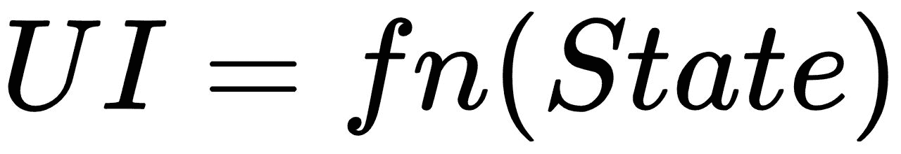
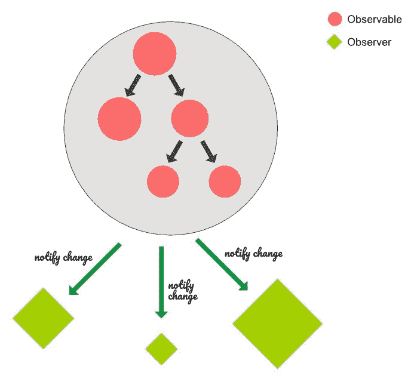
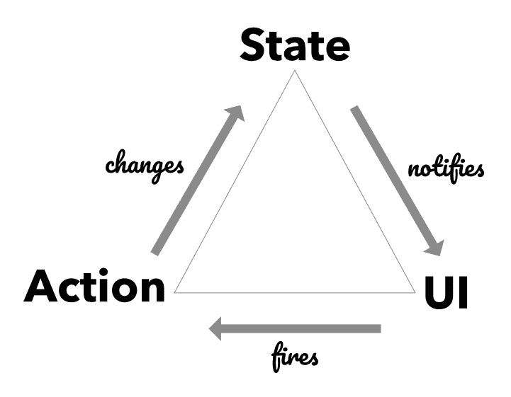

# 二、可观察对象、动作和反应

描述客户端状态的结构是 UI 开发的第一步。使用 MobX，您可以通过创建**可观察对象树**来实现这一点。当用户与应用交互时，会在您的可观察状态下调用操作，这反过来会导致反应（也称为副作用）。从[第 1 章](1.html#LTSU0-58c2559ca4304cecab9bc46f496bc070)、*状态管理导论*继续，我们现在将更深入地了解 MobX 的核心概念。

本章涵盖的主题包括：

*   创造各种各样的可观察物
*   设置改变可观察对象的操作
*   使用反应处理外部更改

# 技术要求

你需要有 JavaScript 编程语言。最后，要使用本书的 Git 存储库，用户需要安装 Git。

本章代码文件可在 GitHub 上找到：
[https://github.com/PacktPublishing/MobX-Quick-Start-Guide/tree/master/src/Chapter02](https://github.com/PacktPublishing/MobX-Quick-Start-Guide/tree/master/src/Chapter02)

查看以下视频以查看代码的运行：
[http://bit.ly/2NEww85](http://bit.ly/2NEww85)

# 可观测

数据是 UI 的命脉。回到定义数据和 UI 之间关系的等式，我们知道以下是正确的：



因此，关注*定义驱动 UI 的数据结构*是有意义的。在 MobX 中，我们使用可观察物来实现这一点。看看这个图表：



*可观察物*顾名思义，是可以观察到的实体。他们跟踪其值的变化，并通知所有的*观察者*。当您开始设计客户端状态的结构时，这种看似简单的行为具有强大的含义。在上图中，每个圆代表一个**可观察的**，每个钻石代表一个**观察者**。观察者可以观察一个或多个可观察对象，并在其中任何一个值发生变化时得到通知。

# 创建可观察对象

创建可观察对象的最简单方法是使用`observable()`函数。请看以下内容：

```jsx
const item = observable({
    name: 'Party Balloons',
    itemId: '1234',
    quantity: 2,
    price: 10,
    coupon: {
        code: 'BIGPARTY',
        discountPercent: 50
    }
});
```

`item`现在是`observable`对象，将开始跟踪其属性的更改。您可以将此对象用作常规 JavaScript 对象，而无需任何特殊 API 来*获取*或*设置*的值。在前面的代码片段中，您还可以使用`observable.object()`创建一个可观察的`item`。

在下面的代码片段中，我们可以看到对可观察对象的简单变化，就像任何常规 JavaScript 代码一样：

```jsx
// Set values
item.quantity += 3;
item.name = 'Small Balloons';

// Get values
console.log(`Buying ${item.quantity} of ${item.name}`);
```

可观测对象仅跟踪`observable()`或`observable.object()`初始值中提供的属性。这意味着如果以后添加新属性，它们将不会自动可见。这是关于可观察物体的一个重要特征。它们就像具有固定属性集的记录或类。如果你需要动态跟踪属性，你应该考虑使用 Ty2 T2。这些将在本章后面进一步介绍。

Internally, MobX takes care of transparently tracking the property changes and notifying the corresponding observers. We will look into this internal behavior in a later chapter.

`observable()`功能自动将*对象*、*数组*或*映射*转换为可观察实体。这种自动转换不适用于其他类型的数据，如 JavaScript 原语（数字、字符串、布尔值、null、未定义）、函数或类实例（具有原型的对象）。因此，如果您调用`observable(20)`，它将失败并出现错误，如下所示：

```jsx
Error: [mobx] The provided value could not be converted into an observable. If you want just create an observable reference to the object use 'observable.box(value)'
```

正如错误中所建议的，我们必须使用更专门的`observable.box()`将原始值转换为可观察值。包装*原语*、*函数*或*类实例*的观察对象称为**装箱观察对象**。看看这个：

```jsx
const count = observable.box(20);

// Get the count
console.log(`Count is ${count.get()}`);

// Change count
count.set(22);
```

我们必须使用盒装可观察物的`get()`和`set()`方法，而不是直接读取或分配给它。这些方法为我们提供了 MobX 固有的可观察性。

除了对象和奇异值之外，您还可以使用数组和贴图创建可观测值。它们具有相应的 API，如下表所示：

| 物体 | `observable.object({ })` |
| 阵列 | `observable.array([ ])` |
| 地图 | `observable.map(value)` |
| 原语、函数、类实例 | `observable.box(value)` |

正如我们前面提到的，`observable()`将自动将一个对象、数组或地图转换为一个可观察的对象。它分别是`observable.object()`、`observable.array()`或`observable.map()`的缩写。对于原语、函数和类实例，应该使用`observable.box()`API。尽管在实践中，`observable.box()`的使用相当罕见。使用`observable.object()`、`observable.array()`或`observable.map()`更为常见。

MobX applies *deep observability* when creating an observable. This means MobX will automatically observe every property, at every level, in the object-tree, array, or map. It also tracks additions or removals in the cases of arrays and maps. This behavior works well for most scenarios but could be excessive in some cases. There are special decorators that you can apply to control this observability. We will look into this in [Chapter 4](4.html#1TVKI0-58c2559ca4304cecab9bc46f496bc070), *Crafting the Observable Tree*.

# 可观测阵列

使用`observable.array()`与使用`observable()`非常相似。将数组作为初始值传递或以空数组开始。在下面的代码示例中，我们从一个空数组开始：

```jsx
const items = observable.array(); // Start with empty array

console.log(items.length); // Prints: 0

items.push({
    name: 'hats', quantity: 40,
});

// Add one in the front
items.unshift({ name: 'Ribbons', quantity: 2 });

// Add at the back
items.push({ name: 'balloons', quantity: 1 });

console.log(items.length); // Prints: 3
```

请注意，可观察数组不是真正的 JavaScript 数组，尽管它与 JS 数组具有相同的 API。当您将此数组传递给其他库或 API 时，可以通过调用`toJS()`将其转换为 JS 数组，如下所示：

```jsx
import { observable, toJS } from 'mobx';

const items = observable.array();

/* Add/remove items*/

const plainArray = toJS(items);
console.log(plainArray);
```

MobX will apply deep observability to observable arrays, which means it will track additions and removals of items from the array and also track property changes happening to each item in the array.

# 可观测地图

您可以使用`observable.map()`API 制作一个可观察地图。原则上，它的工作方式与`observable.array()`和`observable.object()`相同，但它用于 ES6 地图。observable map 实例与常规 ES6 map 共享相同的 API。可观察地图对于跟踪关键点和值的动态变化非常有用。这与可观测对象*、*形成鲜明对比，后者不跟踪创建后添加的属性。

在下面的代码示例中，我们正在创建一个 Twitter 名称句柄的动态字典。这非常适合于可观察地图，因为我们在创建后*添加了*键。看看这个代码块：

```jsx
import { observable } from 'mobx';

// Create an Observable Map
const twitterUserMap = observable.map();

console.log(twitterUserMap.size); // Prints: 0

// Add keys
twitterUserMap.set('pavanpodila', 'Pavan Podila');
twitterUserMap.set('mweststrate', 'Michel Weststrate');

console.log(twitterUserMap.get('pavanpodila')); // Prints: Pavan Podila
console.log(twitterUserMap.has('mweststrate')); // Prints: Michel Weststrate

twitterUserMap.forEach((value, key) => console.log(`${key}: ${value}`));

// Prints:
// pavanpodila: Pavan Podila
// mweststrate: Michel Weststrate

```

# 关于可观测性的注记

当您使用`observable()`API 时，MobX 将*深度可观测性*应用于可观测实例。这意味着它将跟踪可观察对象、数组或贴图发生的变化，并在每个级别对每个属性进行跟踪。对于数组和映射，它还将跟踪条目的添加和删除。数组或地图中的任何新条目也会被制作成一个深度可观察对象。这绝对是一个非常明智的违约，在大多数情况下都很有效。但是，在某些情况下，您可能不希望使用此默认值。

您可以在创建可观察对象时更改此行为。您可以使用同级 API（`observable.object()`、`observable.array()`、`observable.map()`来创建可观察对象，而不是使用`observable()`。每一个都需要一个额外的参数来设置可观察实例上的选项。看看这个：

```jsx
observable.object(value, decorators, { deep: false });
observable.map(values, { deep: false });
observable.array(values, { deep: false });
```

通过将`{ deep: false }`作为选项传入，您可以有效地*将*的可观察性修剪到第一级。这意味着：

对于可观察对象，MobX 仅观察初始属性集。如果属性的值是一个对象、一个数组或一个映射，它将不会进行任何进一步的观察。

Note that the `{ deep: false }` option is the third argument for `observable.object()`. The second argument, called **decorators**, gives you more fine-grained control over the observability. We will be covering this in a later chapter. For now, you can just pass an empty object as the second argument.

对于可观察数组，MobX 只观察数组中项目的添加和删除。如果一个项目是一个对象、一个数组或一个映射，它将不会进行任何进一步的观察。

对于可观察地图，MobX 只观察地图中项目的添加和删除。如果一个键的值是一个对象、一个数组或一个映射，它将不会进行任何进一步的观察。

现在值得一提的是，`observable()`在内部调用前面的一个 API，并将选项设置为`{ deep: true }`。这就是`observable()`具有深刻可观察性的原因。

# 计算可观测

到目前为止，我们所看到的观测值与客户机状态的形状有直接的对应关系。如果您表示一个项目列表，那么您将在客户端状态中使用一个可观察的数组。类似地，列表中的每个项目都可以是可观察对象或可观察地图。故事不止于此。MobX 提供了另一种可观察的，称为**计算属性**或**计算可观察的**。

计算属性不是客户端状态固有的可观察属性。相反，*从其他可观测值中得出其值*的可观测值。现在，*为什么它会有用*？你可以问。让我们举一个例子来看看它的好处。

考虑可观察的，可以跟踪项目列表的。看看这个：

```jsx
import { observable } from 'mobx';

const cart = observable.object({
    items: [],
    modified: new Date(),
});
```

假设您希望有一个`description`属性，该属性以这种格式描述`cart`：购物车中有`{is, are} {no, one, n} item{s}`。

对于零件物品，说明是这样的：*购物车*中没有物品。

当只有一个项目时，描述为：*购物车*中有一个项目。

对于两个或两个以上的*（n）*项目，描述应为：*推车*中有*n**项目。*

让我们思考一下如何对该属性进行建模。考虑以下事项：

*   显然，`description`不是购物车的固有属性。其值取决于`items.length`。
*   我们可以添加一个名为`description`的可观察属性，但我们必须随时更新`items`或`items.length`更改。这是额外的工作，很容易忘记。此外，我们还冒着有人从外部修改描述的风险。
*   描述应该只是一个 getter 而不是 setter。如果有人正在观察描述，则应在描述发生变化时通知他们。

从前面的分析中可以看出，我们似乎无法将此行为与前面讨论的任何可观察类型相适应。这里我们需要的是计算属性。我们可以定义一个*计算的*描述属性，只需将`get-property`添加到`cart`可观察项。它将从`items.length`导出其值。看看这个代码块：

```jsx
const cart = observable.object({
    items: [],
    modified: new Date(),

    get description() {
        switch (this.items.length) {
            case 0:
                return 'There are no items in the cart';
            case 1:
                return 'There is one item in the cart';
            default:
                return `There are ${this.items.length} items in the 
                 cart`;
        }
    },
});
```

现在，您只需阅读`cart.description`即可获得最新的描述。当`cart.description`发生变化时，观察此属性的任何人都会自动收到通知，如果您在购物车中添加或删除项目，就会发生这种情况。下面是如何使用此计算属性的示例：

```jsx
cart.items.push({ name: 'Shoes', quantity: 1 });
console.log(cart.description);
```

Note that it also satisfies all of the criteria from the previous brainstorming on the `description` property. I'll let you, the reader, confirm this is the case.

*计算属性*也称为**派生**，是 MobX 工具箱中最强大的工具之一。通过将客户机状态考虑为一组最小的可观察对象，并使用派生（计算属性）对其进行扩充，您可以轻松地对各种场景进行建模。计算属性的值来自其他可观测值。如果这些依赖的观察值中的任何一个发生变化，那么计算属性也会发生变化。

You can build a computed property out of other computed properties too. MobX internally builds a dependency tree to keep track of the observables. It also caches the value of the computed property to avoid unnecessary computation. This is an important characteristic that greatly improves the performance of the MobX reactivity system. Unlike JavaScript get properties, which are always eagerly evaluated, computed properties memoize (aka cache) the value and only evaluate when the dependent observables change.

当您开发使用 MobX 的经验时，您会意识到*计算属性*可能是您最好的可观察朋友。

# 使用 decorator 实现更好的语法

到目前为止，我们所有的示例都使用了 MobX 的*es5api*。然而，API 有一种特殊的形式，它为我们提供了一种非常方便的方式来表示可观测值。这是通过`@decorator`语法实现的。

The decorator syntax is still a pending proposal (as of this writing) for inclusion in the JavaScript language standard. But that doesn't stop us from using it, as we have **Babel** to help us out. By using the Babel plugin, `transform-decorators-legacy`, we can transpile the decorator syntax into regular ES5 code. If you are using TypeScript, you can also enable decorator support by setting your `{ experimentalDecorators: true}` compiler option in your `tsconfig.json`.

decorator 语法仅适用于类，可用于类声明、属性和方法。这里有一个等价的`Cart`可见，用修饰语表示：

```jsx
class Cart {
    @observable.shallow items = [];
    @observable modified = new Date();

    @computed get description() {
        switch (this.items.length) {
            case 0:
                return 'There are no items in the cart';
            case 1:
                return 'There is one item in the cart';
            default:
                return `There are ${this.items.length} items in the 
                cart`;
        }
    }
}
```

注意使用装饰器来装饰可观察的属性。默认的`@observable`装饰器对值的所有属性进行深入观察。它实际上是使用`@observable.deep`的简写。

类似地，我们有`@observable.shallow`装饰器，这是一个*粗略*等价于在可观察对象上设置`{ deep: false }`选项。它适用于对象、数组和贴图。我们将在[第 4 章](4.html#1TVKI0-58c2559ca4304cecab9bc46f496bc070)中介绍*制作可观察树*中更技术正确的 ES5 等价物`observable.shallow`。

下面的代码片段显示了`items`和`metadata`属性，标记为*浅可见*：

```jsx
class Cart {
    // Using decorators
    @observable.shallow items = [];
    @observable.shallow metadata = {};
}
```

我们将在后面的一章中介绍更多的装饰器，但我们不想等到那时再讨论装饰器语法。我们肯定认为，您应该选择装饰器作为声明可观察对象的首选。请注意，它们仅在类内部可用。然而，在绝大多数情况下，您将使用类来建模您的可观察树，因此装饰程序将大大有助于使其更具可读性。

# 行动

虽然您可以直接更改可观察对象，但强烈建议您使用*操作*来执行此操作。如果您还记得，在上一章中，我们看到了导致状态更改的操作。用户界面只是简单地触发操作，并期望一些观察值发生变化。行动隐藏了突变应该如何发生或观察到的应受到影响的细节。

下图提示**UI**只能通过**动作**修改**状态**：



操作将*词汇*引入 UI，并为改变状态的操作提供声明性名称。MobX 完全接受这一理念，并将行动打造成一个*一流的*概念。要创建一个动作，我们只需将 mutating 函数包装在`action()`API 中。这给了我们一个可以像原始传入函数一样调用的函数。看看这个代码块：

```jsx
import { observable, action } from 'mobx';

const cart = observable({
    items: [],
    modified: new Date(),
});

// Create the actions
const addItem = action((name, quantity) => {
    const item = cart.items.find(x => x.name === name);
    if (item) {
        item.quantity += 1;
    } else {
        cart.items.push({ name, quantity });
    }

    cart.modified = new Date();
});

const removeItem = action(name => {
    const item = cart.items.find(x => x.name === name);
    if (item) {
        item.quantity -= 1;

        if (item.quantity <= 0) {
            cart.items.remove(item);
        }

        cart.modified = new Date();
    }
});

// Invoke actions
addItem('balloons', 2);
addItem('paint', 2);
removeItem('paint');
```

在前面的代码片段中，我们介绍了两个操作：`addItem()`和`removeItem()`，它们在`cart`可观察对象中添加和删除项目。由于`action()`返回一个将参数转发给传入函数的函数，因此我们可以使用所需参数调用`addItem()`和`removeItem()`。

除了提高代码的可读性外，操作还提高了 MobX 的性能。默认情况下，当您修改一个可观察对象时，MobX 将立即发出更改通知。如果您同时修改一组可观察对象，那么您宁愿在所有可观察对象都被修改后触发更改通知。这将减少过多通知的噪音，并将更改集视为一个*原子事务*。本质上，这些是`action()`的核心职责。

# 强制使用行动

毫不奇怪，MobX 强烈建议使用*动作*来修改可观测值。事实上，可以通过配置 MobX 来强制执行此策略，也称为**严格模式**。`configure()`功能可用于将`enforceActions`选项设置为真。如果您试图修改操作外部的可观察对象，MobX 现在将抛出一个错误。

回到前面的例子`cart`，如果我们尝试在动作之外修改*，MobX 将失败并出现错误，如下面的例子所示：*

```jsx
import { observable, configure } from 'mobx';

configure({
 enforceActions: true,
});

// Modifying outside of an action
cart.items.push({ name: 'test', quantity: 1 });
cart.modified = new Date();

Error: [mobx] Since strict-mode is enabled, changing observed observable values outside actions is not allowed. Please wrap the code in an `action` if this change is intended. Tried to modify: ObservableObject@1.items
```

There is one little thing to remember regarding the use of `configure({ enforceActions: true })`: It will only throw errors if there are observers watching the observables that you are trying to mutate. If there are no observers for those observables, MobX will safely ignore it. This is because there is no risk of triggering reactions too early. However, if you do want to be strict about this, you can also set `{ enforceActions: 'strict' }`. This will throw an error even if there are no observers attached to the mutating observables.

# 装饰动作

装饰器的使用在 MobX 中非常普遍。动作还通过`@action`装饰器得到特殊处理，以将类方法标记为动作。有了 decorators，`Cart`类可以如下所示编写：

```jsx
class Cart {
    @observable modified = new Date();
    @observable.shallow items = [];

 @action    addItem(name, quantity) {
        this.items.push({ name, quantity });
        this.modified = new Date();
    }

    @action.bound
    removeItem(name) {
        const item = this.items.find(x => x.name === name);
        if (item) {
            item.quantity -= 1;

            if (item.quantity <= 0) {
                this.items.remove(item);
            }
        }
    }
}
```

在前面的代码片段中，我们使用`@action.bound`进行`removeItem()`操作。这是一种特殊形式，它将类的实例预先绑定到方法。这意味着您可以传递对`removeItem()`的引用，并确保`this`值始终指向购物车的实例。

使用预定义的`this`声明`removeItem`操作的另一种方式是使用类属性和箭头函数。这可以在以下代码中看到：

```jsx
class Cart {
    /* ... */
    @action removeItem = (name) => {
        const item = this.items.find(x => x.name === name);
        if (item) {
            item.quantity -= 1;

            if (item.quantity <= 0) {
                this.items.remove(item);
            }
        }
    }
}
```

这里，`removeItem`是一个*类属性*，其值是一个*箭头函数*。由于*箭头函数*的作用，它绑定到*词法*`this`，这是`Cart`的实例。

# 反应

**反应**确实可以改变你应用的世界。它们是引起副作用的行为，对可观察到的变化作出反应。反应完成了 MobX 的核心三元组，并充当可观察物的观察者。看看这个图表：


MobX 为您提供了三种不同的方式来表达您的反应或副作用。它们是`autorun()`、`reaction()`和`when()`。让我们依次看看这些。

# 自动运行（）

`autorun()`是以函数（`effect-function`为参数的长期运行的副作用。`effect-function`功能是应用所有副作用的地方。现在，这些副作用可能取决于一个或多个观测值。MobX 将自动跟踪这些依赖于*的*观测值发生的任何变化，并重新执行此功能以应用副作用。在代码中更容易看到这一点，如下所示：

```jsx
import { observable, action, autorun } from 'mobx';

class Cart {
    @observable modified = new Date();
    @observable.shallow items = [];

    constructor() {
        autorun(() => {
            console.log(`Items in Cart: ${this.items.length}`);
        });
    }

    @action
    addItem(name, quantity) {
        this.items.push({ name, quantity });
        this.modified = new Date();
    }
}

const cart = new Cart();
cart.addItem('Power Cable', 1);
cart.addItem('Shoes', 1);

// Prints:
// Items in Cart: 0
// Items in Cart: 1
// Items in Cart: 2
```

在前面的示例中，我们正在将一个*可观察的*（`this.items.length`）记录到控制台。记录会在*立即*发生，也会在可观察到的任何时间发生变化。这是`autorun()`的定义特征；它立即运行，并且每次对相关观测值进行更改时也会运行。

我们前面提到过，`autorun()`是一种长期的副作用，只要你不明确地停止它，它就会持续下去。但是，你怎么才能真正阻止它呢？那么，`autorun()`的返回值是一个函数，实际上是一个`disposer-function`。通过调用它，您可以取消`autorun()`的副作用。看看这个：

```jsx
import { observable, action, autorun } from 'mobx';

class Cart {
    /* ... */

    cancelAutorun = null;

    constructor() {
        this.cancelAutorun = autorun(() => {
            console.log(`Items in Cart: ${this.items.length}`);
        });
    }

    /* ... */
}

const cart = new Cart();
// 1\. Cancel the autorun side-effect
cart.cancelAutorun();

// 2\. The following will not cause any logging to happen
cart.addItem('Power Cable', 1);
cart.addItem('Shoes', 1);

// Prints:
// Items in Cart: 0
```

在前面的代码片段中，我们将返回值`autorun()`（a`disposer-function`存储在类属性`cancelAutorun`中。通过在实例化`Cart`之后调用它，我们已经取消了副作用。现在`autorun()`只打印一次，不再打印。

Quick Reader Question: Why does it print only once? Since we are cancelling immediately, shouldn't `autorun()` skip printing altogether? The answer to this is to refresh the core characteristic of `autorun`.

# 反应（）

`reaction()`是 MobX 中的另一种反应。是的，选择 API 名称是有意的。`reaction()`与`autorun()`类似，但在执行`effect-function`之前，等待观察值发生变化。`reaction()`实际上有两个参数，如下所示：

```jsx
reaction(tracker-function, effect-function): disposer-function

tracker-function: () => data, effect-function: (data) => {}
```

`tracker-function`是跟踪所有可观察物的地方。任何时候跟踪的可观测值发生变化，它都将重新执行。它应该返回一个用于将其与上一次运行的`tracker-function`进行比较的值。如果这些返回值不同，则执行`effect-function`。

通过将反应的活动分解为变化检测功能（`tracker`功能）和`effect`功能，`reaction()`为我们提供了更细粒度的控制，以确定何时应该产生副作用。它不再仅仅依赖于它在`tracker`功能中跟踪的可观察物。相反，它现在取决于跟踪器函数返回的数据。`effect`功能在其输入中接收该数据。效果函数中使用的任何观察值都不会被跟踪。

与`autorun()`一样，您也会得到一个`disposer`函数作为`reaction()`的返回值。你可以随时用它来消除副作用。

我们可以用一个例子来实践这一点。假设您希望在`Cart`中的某个项目改变价格时收到通知。毕竟，你不想购买价格突然上涨的东西。同时，你也不想错过很多东西。因此，在价格变动时收到通知是一件很有用的事情。我们可以通过`reaction()`实现，如下图：

```jsx
import { observable, action, reaction } from 'mobx';

class Cart {
    @observable modified = new Date();
    @observable items = [];

    cancelPriceTracker = null;

    trackPriceChangeForItem(name) {
        if (this.cancelPriceTracker) {
            this.cancelPriceTracker();
        }

 // 1\. Reaction to track price changes
        this.cancelPriceTracker = reaction(
            () => {
                const item = this.items.find(x => x.name === name);
                return item ? item.price : null;
            },
            price => {
                console.log(`Price changed for ${name}: ${price !== 
                null ? price : 0}`);
            },
        );
    }

    @action
    addItem(name, price) {
        this.items.push({ name, price });
        this.modified = new Date();
    }

    @action
    changePrice(name, price) {
        const item = this.items.find(x => x.name === name);
        if (item) {
            item.price = price;
        }
    }
}

const cart = new Cart();

cart.addItem('Shoes', 20);

// 2\. Now track price for "Shoes"
cart.trackPriceChangeForItem('Shoes');

// 3\. Change the price
cart.changePrice('Shoes', 100);
cart.changePrice('Shoes', 50);

// Prints:
// Price changed for Shoes: 100
// Price changed for Shoes: 50
```

在前面的片段中，我们在*注释 1*中设置了一个价格跟踪器，作为跟踪价格变化的*反应。请注意，它接受两个函数作为输入。第一个函数（`tracker-function`找到具有给定`name`的项目，并将其价格作为`tracker`函数的输出返回。任何时候更改，都会执行相应的`effect`功能。*

控制台日志也仅在价格变化时打印。这正是我们希望通过`reaction()`实现的行为。既然你已经收到了价格变动的通知，你就可以做出更好的购买决定了。

# 反应式用户界面

关于反应的话题，值得一提的是，UI 是应用中最出色的反应（或副作用）之一。正如我们在前一章中看到的，*UI*依赖于数据，并应用转换函数来生成视觉表示。在 MobX 世界中，这个 UI 也是被动的，因为它对数据的变化做出反应，并自动重新呈现自己。

MobX 提供了一个名为***MobX react***的配套库，该库具有要进行反应的绑定。通过使用`mobx-react`中的装饰函数（`observer()`*，您可以转换 react 组件以观察`render()`函数中使用的可观察值。当它们更改时，将触发 react 组件的重新渲染。在内部，`observer()`创建了一个包装器组件，该组件使用一个普通的`reaction()`来观察可观察对象，并作为副作用重新渲染。这就是为什么我们认为 UI 只是另一个副作用，尽管这是一个非常明显的副作用。*

 *下面显示使用`observer()`的一个简短示例。我们正在使用一个**无状态功能组件**，我们正在将其传递给观察者。由于我们正在读取可观察到的`item`，该组件现在将对`item`中的变化作出反应。两秒钟后，当我们更新`item`时，`ItemComponent`将自动重新渲染。看看这个：

```jsx
import { observer } from 'mobx-react';
import { observable } from 'mobx';
import ReactDOM from 'react-dom';
import React from 'react';

const item = observable.box(30);

// 1\. Create the component with observer
const ItemComponent = observer(() => {
    // 2\. Read an observable: item
    return <h1>Current Item Value = {item.get()}</h1>;
});

ReactDOM.render(<ItemComponent />, document.getElementById('root'));

// 3\. Update item
setTimeout(() => item.set(50), 2000);
```

我们将在[第 3 章](3.html#1KEEU0-58c2559ca4304cecab9bc46f496bc070)中介绍`mobx-react`，*一款带有 MobX*的 React 应用，也将贯穿本书。

# 当（）

顾名思义，`when()`只在满足条件时执行`effect-function`*，然后自动处理副作用。因此，与长期运行的`autorun()`和`reaction()`相比，`when()`是一次性副作用。`predicate`函数通常依赖于一些可观察对象进行条件检查。如果观察值发生变化，`predicate`功能将重新评估。*

`when()`取两个参数，如下：

```jsx
when(predicate-function, effect-function): disposer-function

predicate-function: () => boolean, effect-function: ()=>{}
```

`predicate`*函数应返回布尔值。当变为`true`时，执行`effect`功能，自动处理`when()`。请注意，`when()`还返回了一个`disposer`函数，您可以调用该函数来提前取消副作用。*

 *在下面的代码块中，我们监视商品的可用性，并在商品返回库存时通知用户。这是一次性效果的情况，您实际上不必持续监控。只有当库存中的项目计数超过零时，您才会执行通知用户的副作用。看看这个：

```jsx
import { observable, action, when } from 'mobx';

class Inventory {
    @observable items = [];

    cancelTracker = null;

    trackAvailability(name) {

 // 1\. Establish the tracker with when
        this.cancelTracker = when(
            () => {
                const item = this.items.find(x => x.name === name);
                return item ? item.quantity > 0 : false;
            },
            () => {
                console.log(`${name} is now available`);
            },
        );
    }

    @action
    addItem(name, quantity) {
        const item = this.items.find(x => x.name === name);
        if (item) {
            item.quantity += quantity;
        } else {
            this.items.push({ name, quantity });
        }
    }
}

const inventory = new Inventory();

inventory.addItem('Shoes', 0);
inventory.trackAvailability('Shoes');

// 2\. Add two pairs
inventory.addItem('Shoes', 2);

// 3\. Add one more pair
inventory.addItem('Shoes', 1);

// Prints:
// Shoes is now available
```

`when()`这里有两个论点。当`item.quantity`大于零时，`predicate`*函数返回 true。`effect`功能只是通知（通过`console.log`该商品在商店中可用。当谓词变为 true 时，`when()`执行副作用并自动处理自身。因此，当我们向库存中添加两双鞋时，`when()`执行并记录可用性。*

 *请注意，当我们在库存中再添加一双鞋时，不会打印任何日志。这是因为此时`when()`已被处置，不再监控*鞋*的可用性。这是`when()`的一次性效应。

# 当你带着承诺

`when()`有一个特殊版本，它只接受一个参数（`predicate`函数），并返回承诺而不是`disposer`函数。这是一个很好的技巧，您可以跳过使用`effect`函数，而是在执行效果之前等待`when()`解析。这在代码中更容易看到，如下所示：

```jsx
class Inventory {
    /* ... */

    async trackAvailability(name) {
 // 1\. Wait for availability
        await when(() => {
            const item = this.items.find(x => x.name === name);
            return item ? item.quantity > 0 : false;
        });

 // 2\. Execute side-effect
        console.log(`${name} is now available`);
    }

    /* ... */
}
```

在*注释 1*中，我们正在等待使用`when()`的项目的可用性，该项目仅使用`predicate`功能。通过使用`async-await`操作符等待承诺，我们得到了干净、可读的代码。`await`语句后面的任何代码都会自动安排在承诺解析后执行。如果您希望*而不是*传递效果回调，那么这是使用`when()`的更好形式。

`when()` is also very efficient and does not poll the `predicate` function to check for changes. Instead, it relies on the MobX reactivity system to re-evaluate the `predicate` function, when the underlying observables change.

# 快速回顾反应

MobX 提供了几种执行副作用的方法，但您必须确定哪种方法适合您的需要。下面是一个快速总结，可以帮助您做出正确的选择。

我们有三种处理副作用的方法：

1.  `autorun( effect-function: () => {} )`：对长期运行的副作用有用。`effect`函数立即执行，也可在相关观测值（在其中使用）发生变化时执行。返回一个`disposer`*函数，可以随时取消。*
**   `reaction( tracker-function: () => data, effect-function: (data) => {} )`：也用于长期服用的副作用。只有当`tracker`函数返回的数据不同时，才执行`effect`函数。换句话说，`reaction()`在出现任何副作用之前等待观察值的变化。它还返回一个`disposer`函数来提前取消效果。*

 *3.  `when( predicate-function: () => boolean, effect-function: () => {} )`：用于一次性效果。`predicate`函数在其相关观测值发生变化时进行评估。只有当`predicate`函数返回`true`***时，才执行`effect`函数。***`when()`运行`effect`功能后自动处理。`when()`有一种特殊形式，它只接受`predicate`函数并返回一个承诺。将其与`async-await`一起使用，以获得更简单的`when()`。

# 总结

MobX 的故事围绕着可观察的事物展开。行动改变了这些可观察的事物。衍生和反应观察并对这些可观察到的变化作出反应。可观察到的事物、动作和反应构成了核心三元组。

我们已经看到了几种使用对象、阵列、地图和盒装观测值来塑造观测值的方法。建议使用操作来修改观察值。它们增加了操作词汇表，并通过最小化更改通知来提高性能。反应是观察者对观察到的变化做出反应。它们是导致应用出现副作用的因素。

反应有三种味道，`autorun()`、`reaction()`和*`when()`，它们区分为长期反应或一次性反应。唯一的一次性效应器`when()`的形式更简单，只要有`predicate`功能，它就可以返回承诺。*****