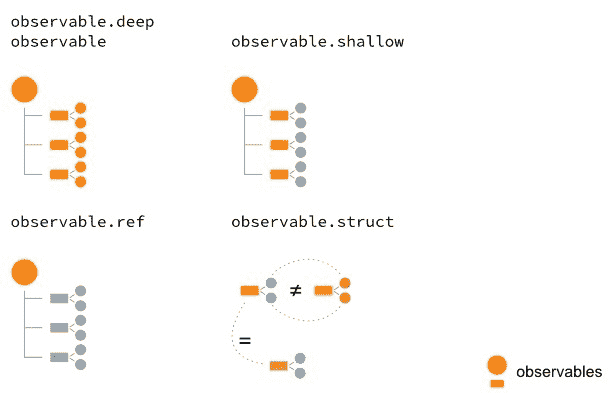
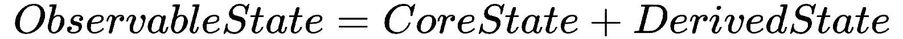

# 制作可观察的树

在使用 MobX 和 React 时，定义应用程序的反应模型通常是第一步。我们非常清楚，这一切都在以下领域：

*   表示应用程序状态的可观察项
*   使之变异的行为
*   反应，通过观察变化的可观察物产生副作用

在定义可观察状态时，MobX 为您提供了各种工具来仔细控制可观察性。在本章中，我们将探索 MobX 的这一面，并更深入地了解*制作可观察树*。

本章将涉及的主题如下：

*   数据的形状
*   使用各种装饰器控制可观测性
*   创建计算属性
*   用类建模 MobX 存储

# 技术要求

最后，要使用本书的 Git 存储库，用户需要安装 Git。

本章代码文件可在 GitHub 上找到：
[https://github.com/PacktPublishing/MobX-Quick-Start-Guide/tree/master/src/Chapter04](https://github.com/PacktPublishing/MobX-Quick-Start-Guide/tree/master/src/Chapter04)

查看以下视频以查看代码的运行：
[http://bit.ly/2uYmln9](http://bit.ly/2uYmln9)

# 数据的形状

我们在应用程序中处理的数据有各种形状和大小。但是，这些不同的形状相当有限，可以列为：

*   **奇异值**：包括数字、布尔值、字符串、空值、未定义值、日期等原语。
*   **列表**：您典型的项目列表，其中每个项目都是一种。通常，避免将不同数据类型的项放在同一个列表中是一种好的做法。这将创建易于推理的同质列表。
*   **层次结构**：我们在 UI 中看到的许多结构都是层次结构，如文件和文件夹、父子关系、组和项等的层次结构。
*   **复合**：上述部分或全部形状的组合。大多数真实世界的数据都是这种形式的。

MobX 为我们提供了对这些形状进行建模的 API，我们在前面的章节中已经看到了一些例子。然而，MobX 在奇异值和其他类型（如数组和映射）之间做了一个区别。这也反映在 API 中，其中`observable()`只能*用于创建对象、数组和贴图。从一个奇异值中创建一个可观察值需要我们用`observable.box()`API 将其框起来。*

# 控制可观测性

默认情况下，MobX 对对象、阵列和贴图应用深度可观测性。这允许您在可观察树中的任何级别上看到发生的更改。尽管这是一个很好的默认设置，但在某些时候，您必须更加注意限制可观察性。减少可观察性也可以提高性能，因为从 MobX 的角度来看，要跟踪的内容更少。

有两种不同的方法可以控制可观察性：

*   通过使用不同的`@decorators`类内部
*   通过使用`decorate()`API

# 使用@decorators

装饰器是一种语法特性，允许您将行为附加到类及其字段。我们已经在[第 3 章](3.html#1KEEU0-58c2559ca4304cecab9bc46f496bc070)中看到了这一点，*是一款带有 MobX*的 React 应用程序，所以下面的代码应该非常熟悉：

```jsx
class BookSearchStore {
    @observable term = 'javascript';
    @observable status = '';
    @observable.shallow results = [];

    @observable totalCount = 0;
}
```

使用`@observable`装饰器，您可以将类的属性设置为可观察的。这是开始建模可观察对象的推荐方法。默认情况下，`@observable`应用了深度可观察性，但有一些专门的装饰器可以让您获得更多的控制。

`@observable` is a shorter form or an alias of `@observable.deep`, which is the default decorator. It applies *deep observability* at all levels of objects, arrays, and maps. However, the deep observation stops at places where the object has a *constructor or a prototype*. Such objects are usually instances of classes and are expected to have their own *observable properties*. MobX chooses to skip such objects during deep observation.

# 使用@observable.shallow 创建浅可见光

此装饰器将可观测性修剪为数据的第一级，也称为**一级深度**观测，特别适用于可观测阵列和地图。对于数组，它将监视数组本身的引用更改（例如，分配一个新数组），以及数组中项的添加和删除。如果阵列中有具有属性的项，则在浅层观测中不会考虑这些项。类似地，对于贴图，只考虑添加和删除键，以及贴图本身的引用更改。可观察地图中键的值保持原样，不考虑用于观察。

下面的代码片段显示了`@observable.shallow`装饰器的应用程序。

```jsx
class BookSearchStore {
    @observable term = 'javascript';
    @observable status = '';
 @observable.shallow results = [];

    @observable totalCount = 0;
}
```

我们选择将此装饰器应用于`BookSearchStore`的`results`属性。很明显，我们并没有特别观察每个结果的性质。事实上，它们是只读对象，永远不会更改值，因此我们可以将可观察性删减为仅添加和删除项，并引用`results`数组中的更改。因此，`observable.shallow`在这里是正确的选择。

A subtle point to remember here is that the `length` property of the array (`size`, in the case of maps) is also observable. Can you figure out why it is observable?

# 使用@observable.ref 创建仅供参考的可观察对象

如果您*对数据结构（对象、数组、映射）内部发生的任何更改不*感兴趣，并且只对*值*的更改感兴趣，那么您需要的就是`@observable.ref`。它将只监控可观察对象的参考变化。

```jsx
import { observable, action } from 'mobx';

class FormData {
 @observable.ref validations = null;

    @observable username = '';
    @observable password = '';

    @action
    validate() {
        const { username, password } = this;
 this.validations = applyValidations({ username, password });
    }
}
```

在前面的示例中，`validations`可观测始终被分配一个新值。由于我们从不修改此对象的属性，因此最好将其标记为`@observable.ref`。这样，我们只跟踪对`validations`的引用更改，而不跟踪其他内容。

# 使用@observable.struct 创建结构观测值

MobX 有一个内置的行为来跟踪值的变化，并且对于字符串、数字、布尔等基本体工作得很好。然而，当处理*对象*时，它变得不太理想。每当一个新的物体被指定给可观察对象时，它将被视为一种变化，并且会引发反应。您真正需要的是一个*结构检查*，其中比较对象的*属性*，而不是*对象引用*，然后确定是否有更改。这就是`@observable.struct`的目的。

它基于*属性值*进行深入比较，而不是依赖顶级引用。你可以认为这是对`observable.ref`装饰师的一种改进。

让我们看看下面的代码，其中我们为`location`属性创建了一个`@observable.struct`：

```jsx
class Sphere {
 @observable.struct location = { x: 0, y: 0 };

    constructor() {
 autorun(() => {
 console.log(
 `Current location: (${this.location.x}, ${this.location.y})`,
 );
 });
    }

    @action
    moveTo(x, y) {
        this.location = { x, y };
    }
}

let x = new Sphere();

x.moveTo(0, 0);
x.moveTo(20, 30); // Prints
Current location: (0, 0)
Current location: (20, 30)
```

请注意，`autorun()`立即触发一次，然后不会对下一个位置（`{ x: 0, y: 0}`）做出反应。由于结构值与`(0, 0)`相同，因此不会将其视为更改，因此不会触发通知。只有当我们将位置设置为不同的`(x, y)`值时，才会触发`autorun()`。

我们现在可以表示装饰器的可观察性级别，如下图所示。`@observable`（在本例中，`@observable.deep`是最强大的，其次是`@observable.shallow`、`@observable.ref`，最后是`@observable.struct`。随着可观察装饰器的粒度越来越细，可以修剪表面积以跟踪可观察树。这显示为橙色的形状。观测值越多，MobX 的跟踪区域越大：



# 使用 decoration（）API

`@decorators`的使用肯定非常方便且可读，但它确实需要使用 Babel 进行一些设置（使用*Babel plugin transform decorators legacy*或打开 TypeScript 编译器选项中的`experimentalDecorators`标志）。在版本 4 中，MobX 引入了一个*ES5*API，用于装饰对象或类的可观察属性。

使用`decorate()`API，您可以有选择地针对属性并指定可观察性。下面的代码段应该清楚地说明这一点：

```jsx
import { action, computed, decorate, observable } from 'mobx';

class BookSearchStore {
 term = 'javascript';
 status = '';
 results = [];

 totalCount = 0;

 get isEmpty() {
 return this.results.length === 0;
 }

 setTerm(value) {
 this.term = value;
 }

 async search() {}
}

decorate(BookSearchStore, {
 term: observable,
 status: observable,
 results: observable.shallow,
 totalCount: observable,

 isEmpty: computed,
 setTerm: action.bound,
 search: action.bound,
});
```

```jsx
decorate(target, decorator-object)
```

`target`可以是对象原型，也可以是类类型。第二个参数是包含要装饰的目标属性的对象。

在前面的示例中，请注意我们将装饰器应用于类类型的方式。从开发人员的角度来看，当您没有`@decorators`的语法支持时，使用它们感觉很自然。事实上，`decorate()`API 也可以用于其他类型的装饰器，如`action`、`action.bound`和`computed`

# 用可观察的（）装饰

当使用`observable()`API 声明可观测值时，`decorate()`样式的 API 也起作用。

`observable(properties, decorators, options)`:Its arguments are as follows:

*   `properties`*声明可观察对象的属性*
**   `decorators`：定义属性装饰器的对象*   `options`：设置默认可观察性和调试友好名称的选项（`{ deep: false|true, name: string }`*

 *`observable()`的第二个参数是为对象中的各种属性指定装饰器。其工作原理与`decorate()`调用完全相同，如以下代码片段所示：

```jsx
import { action, computed, observable } from 'mobx';

const cart = observable(
    {
        items: [],
        modified: new Date(),
        get hasItems() {
            return this.items.length > 0;
        },
        addItem(name, quantity) {
            /* ... */
        },
        removeItem(name) {
            /* ... */
        },
    },
 {
 items: observable.shallow,
 modified: observable,

 hasItems: computed,
 addItem: action.bound,
 removeItem: action.bound,
 },
);
```

在第二个论证中，我们应用了各种装饰器来控制*可观测性*，应用*动作*并标记*计算属性*。

When using the `observable()` API, it is not required to mark the computed properties explicitly. MobX will convert any `getter` property of the passed in object into a computed property.

Similarly, for the `modified` property, there is actually no need to decorate since `observable()` by default makes everything deeply observable. We only have to specify the properties that need a different treatment. In other words, only specify decorators for the exceptional properties.

# 扩展可观测性

在对客户机状态进行建模时，最好预先定义我们在反应式系统中需要的可观测性。这将在您的域中烘焙所有可观察数据的约束和范围。然而，现实世界总是不可原谅的，有时您需要运行时能力来扩展可观察性。这就是`extendObservable()`API 的用武之地。它允许您在运行时混合其他属性，并使它们也可观察。

在以下示例中，我们扩展了`cart`对节日优惠的可观察性：

```jsx
import { observable, action, extendObservable } from 'mobx';

const cart = observable({
    /* ... */
});

function applyFestiveOffer(cart) {
    extendObservable(
        cart,
        {
            coupons: ['OFF50FORU'],
            get hasCoupons() {
                return this.coupons && this.coupons.length > 0;
            },
            addCoupon(coupon) {
                this.coupons.push(coupon);
            },
        },
        {
            coupons: observable.shallow,
            addCoupon: action,
        },
    );
}
```

```jsx
extendObservable(target, object, decorators)
```

`extendObservable()`的*第一个*参数是我们想要扩展的目标对象。第二个参数是将混合到目标对象中的可观察属性和操作的列表。第三个参数是将应用于属性的装饰器列表

在前面的示例中，我们希望向**购物车**添加更多的可观察对象，以跟踪节日优惠。这只能在基于活动节日的运行时完成。当满足该条件时，调用`applyFestiveOffers()`函数。

`extendObservable()` is in fact the superset of `observable()`, and`observable.object()`. `observable()` is really `extendObservable({}, object)`. It is no coincidence that this looks similar to `decorate()`. MobX strives to keep the API consistent and intuitive. While `extendObservable()` takes an actual object in its first argument, `decorate()` requires it to be classes and object prototypes.

*[Fun Fact]* Before the introduction of `decorate()`, `extendObservable()` was used to extend `this` inside the *class constructor*: `extendObservable(this, { })`. Of course, now the recommended approach is to use `decorate()`, which can be applied directly on a class or object prototype.

需要考虑的一点是，*可观测地图*也可以用于动态添加可观测属性。但是，它们只能是承载属性的*状态，而不能是*动作*或*计算属性*。当您想要动态添加*动作*和*计算属性*时，请选择`extendObservable()`。*

# 带有@computed 的派生状态

MobX 的核心理念之一是，可观测状态应尽可能小。其他所有内容都应通过计算属性***派生***。当我们讨论 UI 中的状态管理时，这种观点是有意义的。UI 总是在相同的可观察状态上有细微差别，并且需要根据上下文和任务的不同状态视图。这意味着在同一 UI 中有许多可能派生以视图为中心的状态（或表示）。

这种以视图为中心的状态的一个例子是相同观察列表的表视图和图表视图。两者都在相同的状态下运行，但需要不同的表示来满足 UI（视图）的需要。这种表示是状态派生的主要候选。MobX 认识到这一核心需求，并提供了***计算属性***，这些属性是从其他相关观测值中获得其价值的专门观测值。

*计算属性*非常高效，可以缓存计算。尽管在依赖观测值更改时重新计算 computed 属性，但如果新值与以前缓存的值匹配，则不会触发通知。此外，如果计算属性没有更多的观察者，那么计算属性也会被垃圾收集。这种自动清理也提高了效率。*缓存*和*自动清理*是 MobX 建议自由使用计算属性的主要原因。

使用计算属性，我们可以根据用户界面的需要创建单独的观察值。随着应用程序规模的增长，可能需要更多依赖于核心状态的派生。必要时，可使用`extendObservable()`混合这些衍生（计算属性）。

MobX 提供了三种不同的方法来创建计算属性：使用`@computed`装饰器、`decorate()`API 或`computed()`函数。这些可以在以下代码段中看到：

```jsx
import { observable, computed, decorate } from 'mobx';

// 1\. Using @computed
class Cart {
    @observable.shallow items = [];

 @computed
    get hasItems() {
 return this.items.length > 0;
 }
}

// 2\. Using decorate()
class Cart2 {
    items = [];

    get hasItems() {
        return this.items.length > 0;
    }
}
decorate(Cart2, {
    items: observable.shallow,
 hasItems: computed,
});

// 3\. Using computed()
const cart = new Cart();

const isCartEmpty = computed(() => {
 return cart.items.length === 0;
});

console.log(isCartEmpty.get());

const disposer = isCartEmpty.observe(change => console.log(change.newValue));
```

直接使用`computed()`功能有一种使用盒装观察物的感觉。您必须对返回的计算函数使用`get()`方法来检索值。

您还可以选择使用`computed()`函数的`observe()`方法。通过附加观察者，可以获得更改的值。这项技术也可用于处理副作用或反应。

在前面的代码片段中可以看到这两个 API。这种用法并不常见，但在直接处理装箱的可观察对象时可以加以利用。

# 结构平等

如果计算属性的返回值是基元，则很容易知道何时有新值。MobX 将计算属性的上一个值与新计算的值进行比较，如果它们不同，则触发通知。因此，值比较对于确保仅在*实际更改*时触发通知非常重要。

对于对象，这并不简单。默认比较基于参考检查（使用`===`运算符）进行。这会将对象视为不同的对象，即使其中的值完全相同。

在下面的示例中，`metrics`计算属性在`start`或`end`属性每次更改时生成一个新对象。由于`autorun`（在构造器中定义）依赖于`metrics`，所以每次`metrics`发生变化时都会产生副作用：

```jsx
import { observable, computed, action, autorun } from 'mobx';

class DailyPrice {
    @observable start = 0;
    @observable end = 0;

 @computed
    get metrics() {
 const { start, end } = this;
 return {
 delta: end - start,
 };
 }

    @action
    update(start, end) {
        this.start = start;
        this.end = end;
    }

    constructor() {
        autorun(() => {
            const { delta } = this.metrics;
            console.log(`Price Delta = ${delta}`);
        });
    }
}

const price = new DailyPrice();

// Changing start and end, but metrics don't change
price.update(0, 10);
price.update(10, 20);
price.update(20, 30);
```

但是，请注意，`metrics`并没有真正改变，即使`start`和`end`属性正在改变。这可以从*自动运行*的副作用中看出，它保持打印相同的增量值。发生这种情况是因为`metrics`计算属性在每次计算时都返回一个新对象：

```jsx
Price Delta = 0;
Price Delta = 10;
Price Delta = 10;
Price Delta = 10;
```

解决这个问题的方法是使用`@computed.struct`装饰器，它对对象结构进行深入比较。这样可以确保在重新评估`metrics`属性返回相同的结构时不会触发通知。

这是一种保护依赖于这种计算的可观测数据的代价高昂的反应的方法。用`computed.struct`装饰它，以确保只考虑对象结构中的实际更改进行通知。在概念上，它与我们在本章前一节中看到的`observable.struct`装饰器非常相似：

```jsx
class DailyPrice {
    @observable start = 0;
    @observable end = 0;

 @computed.struct    get metrics() {
        const { start, end } = this;
        return {
            delta: end - start,
        };
    }
    // ... 
}
```

在实践中，很少使用`computed.struct`可观测值。计算值仅在相关观测值改变时改变。当任何相关观测值发生变化时，必须创建一个新的计算值，而在大多数现实世界的应用程序中，它在大多数情况下都是不同的。因此，您实际上不需要用`computed.struct`来修饰，因为大多数计算值在连续的求值过程中会彼此非常不同。

# 为商店建模

当您开始使用 MobX 为 React 应用程序建模客户机状态时，这似乎是一项艰巨的任务。在这一过程中，一个可以帮助您的想法是简单地认识到*您的应用程序只是一个功能*的集合，组合在一起形成一个有凝聚力的单元。通过从最简单的功能开始，您可以将应用程序的其余部分串在一起，一次一个功能。

这种思维方式指导您首先对功能级存储进行建模。应用程序级存储（也称为根存储）只是这些具有共享通信通道的功能存储的组合。在 MobX 世界中，您从一个*类*开始描述功能存储。根据复杂性，您可以将要素存储拆分为多个子存储。功能存储充当所有子存储的协调器。这是建模软件的经典*分而治之*方法：


让我们举一个例子来说明这种建模被动客户端状态的方法。在上一节构建的*图书搜索*应用程序中，我们希望添加创建愿望列表的功能。愿望清单可以包含您将来想要购买的物品。你应该能够创建尽可能多的愿望列表。让我们用 MobX 来模拟愿望列表特性。我们不会担心事情的反应方面，而是只关注使用 MobX 来建模客户机状态。

**The Wishlist feature**

This adds the ability to create wishlists. A wishlist has a name and contains a list of items to be purchased in the future. One can create as many wishlists as needed. A wishlist item has the title of the item and a flag to track if it is purchased.

使用 MobX 建模的第一步是识别*可观察状态*和可使其突变的*动作*。到目前为止，我们不会担心*反应*（或*观察者*）。

# 可观测状态

我们将从*类*`WishListStore`开始，跟踪愿望列表功能的所有细节。这是我们的*功能级存储*，包含整个功能的可观察状态。根据我们前面看到的描述，让我们提取核心可观察状态：

*   一个愿望列表数组，其中每个项目都是一个`WishList`类的实例
*   `WishList`有一个*名称*，包含一个`WishListItem`实例数组
*   每个`WishListItem`都有一个*标题*和一个布尔值*购买的*属性

这里要注意的一件有趣的事情是，我们从前面的描述中提取了一些词汇。这包括`WishListStore`、`WishList`和`WishListItem`，它们构成了我们功能的主干。识别这个词汇表是很难的，需要几次迭代才能找到正确的术语。难怪*命名*被列为计算机科学的两大难题之一！

在代码中，我们现在可以捕获这种可观察状态，如下所示：

```jsx
import { observable } from 'mobx';

class WishListStore {
    @observable.shallow lists = [];
}

class WishList {
    @observable name = '';
    @observable.shallow items = [];
}

class WishListItem {
    @observable title = '';
    @observable purchased = false;
}

const store = new WishListStore();
```

注意对数组使用了`observable.shallow`装饰器。我们不需要对他们进行深入观察。单个项目（`WishListItem`有其自身的可观察属性。愿望列表功能由`WishListStore`（`store`的单例实例表示。由于我们将创建`WishList`和`WishListItem`的实例，因此我们可以添加构造函数来简化此过程：

```jsx
class WishList {
    @observable name = '';
    @observable.shallow items = [];

 constructor(name) {
 this.name = name;
 }
}

class WishListItem {
    @observable title = '';
    @observable purchased = false;

 constructor(title) {
 this.title = title;
 }
}
```

# 派生态

既然核心可观测态已经建立，我们可以考虑导出态。派生状态（派生）是依赖于其他观测值的计算属性。在核心可观察状态如何被消费的背景下思考派生是有帮助的

当您有数组时，一个常见的用例是考虑空状态。通常会有一些视觉指示，表明列表为空。与其测试非常低级的`array.length`，不如公开一个名为`isEmpty`的计算属性。这些计算属性关注于我们存储的*语义*，而不是直接处理核心可观察对象：

```jsx
class WishListStore {
    @observable.shallow lists = [];

 @computed
    get isEmpty() {
 return this.lists.length === 0;
 }
}

class WishList {
    @observable name = '';
    @observable.shallow items = [];

 @computed
    get isEmpty() {
 return this.items.length === 0;
 }

    /* ... */
}
```

同样，如果我们想从`WishList`中了解采购的物品，则无需定义任何新的可观察状态。它可以通过过滤`purchased`属性从`items`派生。这是对`purchasedItems`*计算属性*的定义。我将把它作为一个练习留给读者来定义这个计算属性。

您应该始终将*可观察状态*视为最小*核心状态*和*派生状态*的组合。考虑以下等式，以确保你不会在核心状态中投入太多。可以派生的内容应始终处于*派生状态：*



In real-world apps, it is quite possible that a property being tracked in one store may move to another due to refactoring. For example, the `purchased` property of a `WishListItem` could be tracked by a separate store (for example, `ShoppingCartStore`). In such a case, the `WishListItem` can make it a *computed property* and depend on the external store to keep track of it. Doing so does not change anything on the UI since the way you read `purchased` still stays the same. Also, MobX makes it simple to keep the `purchased` property always up-to-date because of the implicit dependency created via the computed property.

# 行动

一旦确定了可观察状态，自然会包括可使其发生变异的*动作*。这些操作将由用户调用，并由 React 接口公开。对于愿望列表功能，这包括：

*   创建新的`WishList`
*   删除愿望清单
*   重命名愿望列表
*   将项目（`WishListItem`）添加到愿望列表
*   从愿望列表中删除项目

添加或删除愿望列表的操作进入顶层`WishListStore`，而与愿望列表中的项目相关的操作将进入`WishList`类。愿望列表的重命名也可以进入`WishList`类：

```jsx
import { observable, action } from 'mobx';

class WishListStore {
    @observable.shallow lists = [];

    /* ... */

    @action
    addWishList(name) {
        this.lists.push(new WishList(name));
    }

    @action
    removeWishList(list) {
        this.lists.remove(list);
    }
}

class WishList {
    @observable name = '';
    @observable.shallow items = [];

    /* ... */

    @action
    renameWishList(newName) {
        this.name = newName;
    }

    @action
    addItem(title) {
        this.items.push(new WishListItem(title));
    }

    @action
    removeItem(item) {
        this.items.remove(item);
    }
}
```

MobX gives a convenient API on *observable arrays* to remove items. Using the `remove()` method, you can remove items that match by value or reference. The method returns *true* if the item was found and removed.

# 总结

一旦您对可观察状态进行了广泛的裁剪，就应该使用可观察装饰器对其进行进一步的裁剪。这使您能够更好地控制可观测性，并提高 MobX 反应系统的性能。我们已经看到了两种不同的方法：一种是使用`@decorator`语法，另一种是使用`decorate()`API。

还可以使用`extendObservable()`动态添加新的*可观察属性*。事实上，您甚至可以使用`extendObservable()`添加新的*操作*和*计算属性*。

*可观察状态=核心状态+派生状态*

*核心态*和*派生态*是 MobX 中*可观测态*的两个方面。这很容易用类和装饰器建模，如前几节所示。一旦您确定了功能的词汇表，它们就成为封装*可观察状态*的类名。要处理功能的复杂性，您可以将其分解为更小的类，并在*功能存储*中组合它们。这些*特征存储*然后被组成顶层*根存储*。

现在，我们对*可观察物*的定义和制作有了更深入的理解，是时候我们来看看 MobX 的其他支柱了：*动作*和*反应*。这就是我们下一章的方向。*