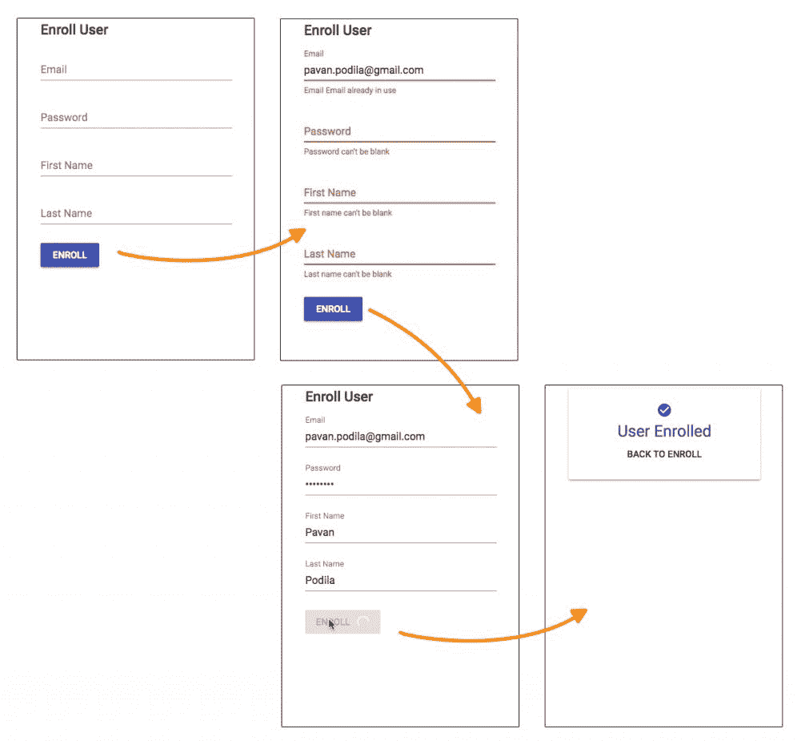
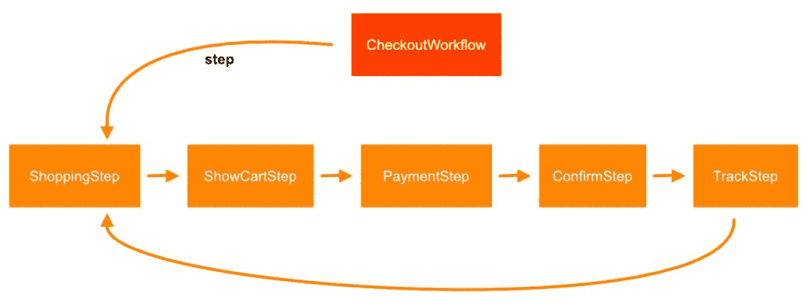
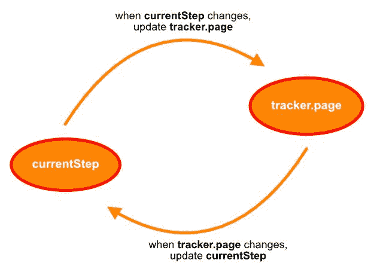

# 处理真实世界的用例

当您第一次开始使用 MobX 时，应用 MobX 的原则似乎令人望而生畏。为了帮助您完成这一过程，我们将处理两个使用 MobX 三元组*可观测动作反应*的非平凡示例。我们将介绍可观察状态的建模，然后确定跟踪可观察状态的行动和反应。通过这些示例，您应该能够在使用 MobX 处理状态管理时进行思维转变。

本章将介绍的示例包括：

*   表单验证
*   页面路由

# 技术要求

最后，要使用本书的 Git 存储库，用户需要安装 Git。

本章的代码文件可在 GitHub 上找到：

[https://github.com/PacktPublishing/Mobx-Quick-Start-Guide/tree/master/src/Chapter06](https://github.com/PacktPublishing/Mobx-Quick-Start-Guide/tree/master/src/Chapter06)

查看以下视频以查看代码的运行：
[http://bit.ly/2LDliA9](http://bit.ly/2LDliA9)

# 表单验证

填写表单和验证字段是 web 的经典用例。所以，我们从这里开始，看看 MobX 如何帮助我们简化它。对于我们的例子，我们将考虑一个用户注册表单，它包含一些标准输入，如名字、姓氏、电子邮件和密码。

下图显示了各种注册状态：



# 互动

查看前面的屏幕截图，我们可以看到一些正在进行的标准交互，例如：

*   输入各个字段的输入
*   对这些领域的确认
*   单击“注册”按钮以执行网络操作

在这里，很少有其他互动不会立即与人见面：

*   基于网络的电子邮件验证，以确保我们没有使用现有电子邮件地址注册
*   显示注册操作的进度指示器

在 MobX 中，这些交互中的许多都将使用动作和反应进行建模。当然，状态将用可观测数据建模。让我们看看 O*可观测动作反应*三元组在本例中是如何出现的。

# 可观测状态的建模

示例的可视化设计已经暗示了我们需要的核心状态。这包括`firstName`、`lastName`、`email`和`password`字段。我们可以将其建模为`UserEnrollmentData`类的*可观测属性*。

此外，我们还需要跟踪电子邮件将发生的异步验证。我们使用布尔`validating`属性来实现这一点。验证过程中发现的任何错误都将通过`errors`进行跟踪。最后，`enrollmentStatus`跟踪注册前后的网络运行情况。它是一个字符串枚举，可以有四个值之一：`none`、`pending`、`completed`或`failed`：

```jsx
class UserEnrollmentData {
    @observable email = '';
    @observable password = '';
    @observable firstName = '';
    @observable lastName = '';
    @observable validating = false;
    @observable.ref errors = null;
    @observable enrollmentStatus = 'none'; // none | pending | completed | failed
}
```

您会注意到，`errors`标记为`@observable.ref`，因为它只需要跟踪引用更改。这是因为验证输出是一个*不透明对象*，除了参考变化之外，它没有任何可见的东西。只有当`errors`有一个值时，我们才知道存在验证错误。

# 关于行动

这里的操作非常简单。我们需要一个来*根据用户的变化设置字段值*。另一个是点击注册按钮时进行*注册*。在下面的代码中可以看到这两个。

一般做法是，首先打电话到`configure({ enforceActions: 'strict' })`。这确保了你的观察值只在一个动作中发生突变，给了你我们在[第 5 章](5.html#2F4UM0-58c2559ca4304cecab9bc46f496bc070)、*衍生、动作和反应*中讨论的所有好处：

```jsx
import { action, configure, flow } from 'mobx';

configure({ enforceActions: 'strict' });

class UserEnrollmentData {
    /* ... */

    @action
    setField(field, value) {
        this[field] = value;
    }

    getFields() {
        const { firstName, lastName, password, email } = this;
        return { firstName, lastName, password, email }
    }

    enroll = flow(function*() {
        this.enrollmentStatus = 'pending';
        try {
            // Validation
            const fields = this.getFields();
 yield this.validateFields(fields);
            if (this.errors) {
                throw new Error('Invalid fields');
            }

            // Enrollment
 yield enrollUser(fields);

            this.enrollmentStatus = 'completed';
        } catch (e) {
            this.enrollmentStatus = 'failed';
        }
    });

}
```

在`enroll`动作中使用`flow()`是故意的。我们在内部处理异步操作，因此操作完成后发生的突变必须包装在`runInAction()`或`action()`中。手动执行此操作可能会很麻烦，而且还会给代码增加噪音。

使用`flow()`，您可以通过使用一个生成器函数和`promises`的`yield`语句获得外观整洁的代码。在前面的代码中，我们有两个`yield`点，一个用于`validateFields()`，另一个用于`enroll()`，它们都返回`promises`。请注意，这些语句之后没有包装器代码，因此更容易遵循逻辑。

这里隐含的另一个动作是`validateFields()`。验证实际上是一种副作用，它会在字段更改时触发，但也可以作为操作直接调用。在这里，我们再次使用`flow()`在运行异步验证后处理突变：

We are using the `validate.js` ([https://validatejs.org](https://validatejs.org)) NPM package to handle the field validations.

```jsx
import Validate from 'validate.js';

class UserEnrollmentData {

    /* ... */

    validateFields = flow(function*(fields) {
        this.validating = true;
        this.errors = null;

        try {
 yield Validate.async(fields, rules);

            this.errors = null;
        } catch (err) {
            this.errors = err;
        } finally {
            this.validating = false;
        }
    });

    /* ... */
}
```

注意`flow()`如何像常规函数一样接受参数（例如：`fields`）。由于电子邮件验证涉及异步操作，因此我们将整个验证作为异步操作进行跟踪。我们使用`validating`属性来实现这一点。当操作完成时，我们在`finally`块中将其设置回`false`。

# 用反应完成三元组

更改字段时，我们需要确保输入的值有效。因此，验证是为各个字段输入值的副作用。我们知道 MobX 提供了三种处理这种副作用的方法，它们是`autorun()`、`reaction()`和`when()`。由于验证是一种应在每次字段更改时执行的效果，因此可以排除一次性效果`when()`。这就剩下了`reaction()`和`autorun()`。通常，表单仅在字段实际更改时才进行验证。这意味着只有在更改后才需要触发效果。

这将我们的选择范围缩小到了`reaction(<tracking-function>, <effect-function>)`，因为这是确保`tracking`函数返回不同值后触发`effect`函数的唯一反应类型。另一方面，`autorun()`会立即执行，这对于执行验证来说太早了。至此，我们可以在`UserEnrollmentData`类中引入*验证*副作用：

Technically, this could also be achieved with an `autorun()`, but will require an additional boolean flag to ensure the validation is not performed the first time. Either solution would work well in this situation.

```jsx
class UserEnrollmentData {

    disposeValidation = null;

    constructor() {
        this.setupValidation();
    }

    setupValidation() {
        this.disposeValidation = reaction(
            () => {
                const { firstName, lastName, password, email } = this;
                return { firstName, lastName, password, email };
            },
            () => {
 this.validateFields(this.getFields());
            },
        );
    }

    /* ... */

    cleanup() {
        this.disposeValidation();
    }
}

```

前面的`reaction()`中的`tracking`功能拾取要监视的字段。当其中任何一个发生变化时，`tracking`函数会产生一个新值，然后触发验证。我们已经看到了`validateFields()`方法，它也是一个使用`flow()`的动作。`reaction()`设置在`UserEnrollmentData`的施工单位内，因此监控立即启动。

When `this.validateFields()` is called, it gives back a `promise`, which could be canceled prematurely using its `cancel()` method. If `validateFields()` gets called too frequently, a previous invocation of the method could still be in progress. In those cases, we could `cancel()` the previously returned promise to avoid unnecessary work.

We will leave it as a reader exercise to tackle this interesting use-case.

我们还跟踪由`reaction()`返回的`disposer`函数，我们在`cleanup()`内部调用该函数。当不再需要`UserEnrollmentData`时，这是为了清理并避免潜在的内存泄漏。在*处理器*被调用的地方，有一个反应退出点总是好的。在我们的例子中，我们从根 React 组件的`componentWillUnmount()`钩子中调用`cleanup()`。我们将在下一节中看到这一点。

现在，验证不是我们示例的唯一副作用。更宏大的副作用是以 React 组件形式出现的 UI。

# 反应组分

我们所知道的 UI 是 MobX 中的一个副作用，通过在 React 组件上使用`observer()`装饰器来识别。这些观察者可以通过`render()`方法读取观察值，从而建立跟踪。任何时候这些可观察的变化，MobX 将重新渲染组件。这种自动化的行为非常强大，可以让我们创建对细粒度可观察状态做出反应的细粒度组件。

在我们的示例中，我们确实有一些细粒度的观察者组件，即输入字段、注册按钮和应用程序组件。它们在以下组件树中由橙色框标记：


每个字段输入被分离成一个观察者组件：**InputField**。电子邮件字段有自己的组件**EmailInputField**，因为其视觉反馈还包括在验证期间显示进度条，并在检查输入的电子邮件是否已注册时禁用进度条。类似地，**注册按钮**也有一个微调器，用于显示注册操作期间的进度。

We are using **Material-UI** ([https://material-ui.com](https://material-ui.com)) as the component library. This provides an excellent set of React components styled to the Material Design guidelines by Google.

`InputField`只观察它正在渲染的字段，由`field`道具标识，该道具与`store`道具解除引用（使用`store[field]`。作为`InputField`的`value`：

```jsx
const InputField = observer(({ store, field, label, type }) => {
    const errors = store.errors && store.errors[field];
    const hasError = !!errors;

    return (
        <TextField
            fullWidth
            type={type}
 value={store[field]}            label={label}
            error={hasError}
 onChange={event => store.setField(field, 
            event.target.value)}            margin={'normal'}
            helperText={errors ? errors[0] : null}
        />
    );
});
```

用户对此输入的编辑（`onChange`事件）将通过`store.setField()`操作通知回存储区。用 React 术语来说，`InputField`是*受控组件*。

The key idea of the `InputField` component is about passing the observable (`store`) instead of the value (`store[field]`). This ensures the dereferencing of the observable property happens inside the `render()` of the component. This is important for a granular observer optimized for rendering and tracking just what it needs. You can think of it as a *design pattern* when creating MobX observer components.

# UserEnrollmentForm 组件

我们在`UserEnrollmentForm`组件中使用了其中几个`InputFields`。注意，`UserEnrollmentForm`组件*不是观察者*。其目的是通过`inject()`装饰器获得门店，并将其传递给其子*观察者组件*。此处的`inject()`使用基于*函数的*参数，比`inject('store')`基于*字符串的*参数更安全：

```jsx
import React from 'react';
import { inject } from 'mobx-react';
import { Grid, TextField, Typography, } from '@material-ui/core';

@inject(stores => ({ store: stores.store }))
class UserEnrollmentForm extends React.Component {
    render() {
        const { store } = this.props;
        return (
            <form>
                <Grid container direction={'column'}>
                    <CenteredGridItem>
                        <Typography variant={'title'}>Enroll 
                        User</Typography>
                    </CenteredGridItem>

                    <CenteredGridItem>
                        <EmailInputField store={store} />
                    </CenteredGridItem>

                    <CenteredGridItem>
                        <InputField
                            type={'password'}
                            field={'password'}
                            label={'Password'}
                            store={store}
                        />
                    </CenteredGridItem>

                    <CenteredGridItem>
                        <InputField
                            type={'text'}
                            field={'firstName'}
                            label={'First Name'}
                            store={store}
                        />
                    </CenteredGridItem>

                    <CenteredGridItem>
                        <InputField
                            type={'text'}
                            field={'lastName'}
                            label={'Last Name'}
                            store={store}
                        />
                    </CenteredGridItem>

                    <CenteredGridItem>
                        <EnrollButton store={store} />
                    </CenteredGridItem>
                </Grid>
            </form>
        );
    }
}
```

`store`是`UserEnrollmentData`的实例，通过组件树根的`Provider`组件设置传递。这是在`constructor`中为根组件创建的：

```jsx
import React from 'react';
import { UserEnrollmentData } from './store';
import { Provider } from 'mobx-react';
import { App } from './components';

export class FormValidationExample extends React.Component {
    constructor(props) {
        super(props);

 this.store = new UserEnrollmentData();
    }

    render() {
        return (
 <Provider store={this.store}>
                <App />
            </Provider>
        );
    }

 componentWillUnmount() {
 this.store.cleanup();
 this.store = null;
 }
}
```

通过`Provider`，任何组件现在都可以`inject()`和`store`并访问可观察状态。注意使用`componentWillUnmount()`钩子调用`this.store.cleanup()`。这在内部处理验证反应，如前一节所述（*“用反应完成三元组”*）。

# 其他观察员组成部分

在我们的组件树中有一些更细粒度的观察者。其中最简单的是`App`组件，它提供了一个简单的分支逻辑。如果我们仍在报名过程中，则显示`UserEnrollmentForm`。注册时，`App`显示`EnrollmentComplete`组件。此处跟踪的可观测值为`store.enrollmentStatus`：

```jsx
@inject('store')
@observer
export class App extends React.Component {
    render() {
        const { store } = this.props;
 return store.enrollmentStatus === 'completed' ? (
 <EnrollmentComplete />
 ) : (
 <UserEnrollmentForm />
 );
    }
}
```

`EmailInputField`是相当自解释的，并且重用了`InputField`组件。它还包括一个进度条，用于显示异步验证操作：

```jsx
const EmailInputField = observer(({ store }) => {
    const { validating } = store;

    return (
        <Fragment>
            <InputField
                type={'text'}
                store={store}
                field={'email'}
                label={'Email'}
            />
            {validating ? <LinearProgress variant={'query'} /> : null}
        </Fragment>
    );
});
```

最后，最后一个观察者组件是`EnrollButton`，它观察`enrollmentStatus`并对`store`触发`enroll()`动作。在注册过程中，它还会显示圆形微调器：

```jsx
const EnrollButton = observer(({ store }) => {
 const isEnrolling = store.enrollmentStatus === 'pending';
 const failed = store.enrollmentStatus === 'failed';

    return (
        <Fragment>
            <Button
                variant={'raised'}
                color={'primary'}
                style={{ marginTop: 20 }}
                disabled={isEnrolling}
                onClick={() => store.enroll()}
            >
                Enroll
                {isEnrolling ? (
                    <CircularProgress
                        style={{
                            color: 'white',
                            marginLeft: 10,
                        }}
                        size={20}
                        variant={'indeterminate'}
                    />
                ) : null}
            </Button>
            {failed ? (
                <Typography color={'secondary'} variant={'subheading'}>
                    Failed to enroll
                </Typography>
            ) : null}{' '}
        </Fragment>
    );
});
```

这些细粒度观察者的收集通过加快 React 的协调过程提高了 UI 的效率。由于更改被本地化到特定组件，React 只需协调该特定观察者组件的虚拟 DOM 更改。MobX 鼓励使用这种细粒度的观察者，并将它们散布到整个组件树中。

If you are looking for a library built specifically for form validation with MobX, look at *mobx-react-form* ([https://github.com/foxhound87/mobx-react-form](https://github.com/foxhound87/mobx-react-form)).

# 页面路由

**单页应用程序**（**SPA**）已经在我们今天看到的许多 web 应用程序中司空见惯。这些应用程序的特点是在单个页面中使用逻辑客户端路由。您可以通过修改 URL 导航到应用程序的各个部分（*路由*），而无需加载整个页面。这是由`react-router-dom`等库处理的，它与浏览器历史一起工作，以启用*URL*驱动的路由更改。

在 MobX 世界中，路线改变或导航可以被视为一种*副作用*。观测值发生某些状态变化，导致 SPA 中发生导航。在本例中，我们将构建这个可观察状态，它跟踪浏览器中显示的当前页面。结合使用`react-router-dom`和`history`包，我们将展示路由如何成为可观察状态变化的副作用。

# 购物车结帐工作流

让我们看一个用例，在这个用例中，我们可以看到路由更改（导航）是由 MobX 驱动的副作用。我们将使用典型的购物车结账工作流作为示例。如下图所示，我们从*回家路线*开始，这是工作流的入口点。从这里开始，我们进行剩下的步骤：*查看购物车*、*选择付款选项*、*查看确认*，然后*跟踪订单：*


我们故意使各个步骤在视觉上保持简单。这使我们能够更多地关注导航方面，而不是每个步骤中发生的细节。但是，在工作流的所有这些步骤中都有*共同的某些元素。*

如下面的屏幕截图所示，每个步骤都有一个加载操作，用于获取该步骤的详细信息。加载后，您可以单击按钮进入下一步。在进行导航之前，将执行一个异步操作。完成后，我们导航到工作流中的下一步。由于每个步骤都遵循此模板，我们将在下一节中对其进行建模：


# 可观测状态的建模

这个 SPA 的本质是一步一步的结帐工作流程，每一步都是一条路线。因为路由是由 URL 驱动的，所以我们需要一种监视 URL 的方法，并且能够在步骤之间移动时更改 URL。步骤之间的导航是可观察状态某些变化的副作用。我们将使用包含核心可观察状态的`CheckoutWorkflow`类对该工作流进行建模：

```jsx
const routes = {
    shopping: '/',
    cart: '/cart',
    payment: '/payment',
    confirm: '/confirm',
    track: '/track',
};

export class CheckoutWorkflow {
    static steps = [
        { name: 'shopping', stepClass: ShoppingStep },
        { name: 'cart', stepClass: ShowCartStep },
        { name: 'payment', stepClass: PaymentStep },
        { name: 'confirm', stepClass: ConfirmStep },
        { name: 'track', stepClass: TrackStep },
    ];

 tracker = new HistoryTracker();
    nextStepPromise = null;

 @observable currentStep = null;
 @observable.ref step = null;

}
```

从前面的代码中可以看出，我们用一个`name`和一个`stepClass`来表示每个步骤。`name`也是我们识别该步骤对应路由的方式，存储在 singleton`routes`对象中。`steps`的有序列表存储为`CheckoutWorkflow`类的静态属性。我们也可以从单独的 JavaScript 文件（模块）加载这些步骤，但为了简单起见，我们将其保留在这里。

核心可观察状态在这里非常简单：一个`currentStep`属性存储当前步骤的字符串名称，另一个`step`属性是`stepClass`的实例，存储为`observable.ref`属性。在步骤之间导航时，这两个属性会更改以反映当前步骤。我们将看到如何使用这些属性来处理路由更改。

# 一个台阶的路线，一个台阶的路线

您可能想知道为什么我们需要两个单独的属性来跟踪当前步骤。是的，这似乎是多余的，但这是有原因的。由于我们的工作流程将是一组 url 路由，因此也可以通过使用浏览器的“后退”按钮或直接键入 url 来更改路由。将路由与步骤关联的一种方法是使用其*名称*，这正是我们对`currentStep`属性所做的。请注意步骤的`name`如何与`routes`对象的键完全匹配。

当路由在外部更改时，我们依靠浏览器历史记录来通知 URL 更改。`tracker`属性是`HistoryTracker`的一个实例（我们将创建一个自定义类），它包含侦听*浏览器历史记录*并在浏览器中跟踪当前 URL 的逻辑。它公开了一个由`CheckoutWorkflow`跟踪的可观察属性。我们将在本章稍后介绍其实现：



`CheckoutWorkflow`中的每个步骤都是`WorkflowStep`类的子类型。`WorkflowStep`捕获步骤及其异步操作的详细信息。工作流只是在完成每个步骤中的异步操作后编排步骤流和步骤之间的转换：

```jsx
class ShowCartStep extends WorkflowStep { /* ... */}

// A mock step to simplify the representation of other steps
class MockWorkflowStep extends WorkflowStep { /* ... */ }

class PaymentStep extends MockWorkflowStep { /* ... */ }
class ConfirmStep extends MockWorkflowStep { /* ... */ }
class TrackStep extends MockWorkflowStep { /* ... */ }
```

对于大多数步骤，我们都在扩展模板`WorkflowStep`的`MockWorkflowStep`，该模板带有一些烘焙默认值。这使得步骤非常简单，因此我们可以关注步骤之间的路由。请注意，在下面的代码片段中，我们只是模拟了`load`和`main`操作的网络延迟。`delay()`函数只是一个简单的助手，它返回一个`Promise`，在给定的毫秒间隔后解析。

我们将在下一节中看到如何使用`getLoadOperation()`和`getMainOperation()`方法：

```jsx
class MockWorkflowStep extends WorkflowStep {
    getLoadOperation() {
        return delay(1000);
    }

    getMainOperation() {
        return delay(1000);
    }
}

function delay(ms) {
    return new Promise(resolve => setTimeout(resolve, ms));
}
```

# 工作流程步骤

`WorkflowStep`作为工作流中所有步骤的模板。它包含一些可观察的状态来跟踪它执行的两个异步操作：*加载详细信息*和*执行主要工作*：

```jsx
class WorkflowStep {
    workflow = null; // the parent workflow
 @observable loadState = 'none'; // pending | completed | failed
    @observable operationState = 'none'; // pending | completed | 
     failed 
    async getLoadOperation() {}
    async getMainOperation() {}

    @action.bound
 async load() {
        doAsync(
            () => this.getLoadOperation(),
            state => (this.loadState = state),
        );
    }

    @action.bound
 async perform() {
        doAsync(
            () => this.getMainOperation(),
            state => (this.operationState = state),
        );
    }
}
```

`load()`和`perform()`是`WorkflowStep`执行的两个异步操作。它们的状态分别通过`loadState`和`operationState`观察值进行跟踪。这些操作中的每一个都调用一个委托方法，该委托方法由子类重写以提供实际的承诺。`load()`调用`getLoadOperation()`和`perform()`调用`getMainOperation()`，每一个调用都产生一个承诺。

`doAsync()`是一个 helper 函数，它接受*承诺函数*并使用传入的回调（`setState`通知状态。注意这里使用的`runInAction()`确保所有突变都发生在动作内部。

`load()`和`perform()`使用`doAsync()`功能适当更新`loadState`和`operationState`观测值：

There is a different way of writing the `doAsync()` function. **Hint**: We have seen it in an earlier chapter. We'll leave that as an exercise for the reader.

```jsx
async function doAsync(getPromise, setState) {
 setState('pending');
    try {
        await getPromise();
        runInAction(() => {
 setState('completed');
        });
    } catch (e) {
        runInAction(() => {
 setState('failed');
        });
    }
}
```

我们现在可以看到，可观测状态由`CheckoutWorkflow`和`WorkflowStep`实例携带。一件可能不清楚的事情是`CheckoutWorkflow`是如何执行编排的。为此，我们必须考虑行动和反应。

# 工作流的操作和反应

我们已经看到，`WorkflowStep`有两个***动作***方法`load()`和`perform()`处理步骤的异步操作：

```jsx
class WorkflowStep {
    workflow = null;
    @observable loadState = 'none'; // pending | completed | failed
    @observable operationState = 'none'; // pending | completed | 
     failed

    async getLoadOperation() {}
    async getMainOperation() {}

    @action.bound
 async load() {
        doAsync(
            () => this.getLoadOperation(),
            state => (this.loadState = state),
        );
    }

    @action.bound
 async perform() {
        doAsync(
            () => this.getMainOperation(),
            state => (this.operationState = state),
        );
    }
}
```

`load()`操作在加载工作流的每个步骤时由`CheckoutWorkflow`调用。`perform()`是一个用户调用的操作，当用户单击步骤的 React 组件上显示的按钮时发生。一旦`perform()`完成，`operationState`将变为`completed`。`CheckoutWorkflow`将跟踪此情况并按顺序自动加载下一步。换句话说，工作流作为对当前步骤的`operationState`更改的反应（或副作用）进行。让我们在以下一组代码片段中了解所有这些内容：

```jsx
export class CheckoutWorkflow {
    /* ... */

    tracker = new HistoryTracker();
    nextStepPromise = null;

    @observable currentStep = null;
    @observable.ref step = null;

    constructor() {
        this.tracker.startListening(routes);

 this.currentStep = this.tracker.page;

 autorun(() => {
            const currentStep = this.currentStep;

            const stepIndex = CheckoutWorkflow.steps.findIndex(
                x => x.name === currentStep,
            );

            if (stepIndex !== -1) {
                this.loadStep(stepIndex);

                this.tracker.page = CheckoutWorkflow.steps[stepIndex].name;
            }
        });

 reaction(
            () => this.tracker.page,
            page => {
                this.currentStep = page;
            },
        );
    }

    @action
    async loadStep(stepIndex) {
        /* ... */
    }
}
```

`CheckoutWorkflow`的构造器设置了核心副作用。我们需要知道的第一件事是浏览器使用`this.tracker.page`提供的当前页面。请记住，我们使用共享名称将工作流的`currentStep`与当前基于 URL 的路由关联起来。

第一个副作用是使用`autorun()`执行的，正如我们所知，它会立即运行，然后在跟踪的观测值发生变化时随时运行。在`autorun()`中，我们首先确保`currentStep`是有效步骤，然后加载它。由于我们正在观察`autorun()`中的`currentStep`，因此我们必须确保`this.tracker.page`保持同步。我们在成功加载当前步骤后执行此操作。现在，只要`currentStep`改变，`tracker.page`就会自动同步，这意味着 URL 和路由会更新以反映当前步骤。稍后我们将看到`HistoryTracker`的一个实例`tracker`实际上是如何在内部处理这个问题的。

下一个副作用是`tracker.page`变化的`reaction()`。这是与之前的副作用相反的一部分。任何时候`tracker.page`改变，我们也必须改变`currentStep`。毕竟，这两个观测值必须协同工作。因为我们已经在跟踪具有单独副作用的`currentStep`（即`autorun()`，所以当前的`step`加载了`WorkflowStep`的实例。

这里引人注目的一点是，当`currentStep`改变时，`tracker.page`被更新。此外，当`tracker.page`发生变化时，`currentStep`也会更新。因此，这里似乎有一个无限循环：



然而，MobX 将看到，一旦更改向一个方向传播，就不会从另一个方向发生更新，因为两者都是同步的。这意味着两个相互依赖的值很快达到稳定，并且没有无限循环。

# 加载台阶

`WorkflowStep`是实现步骤的地方，唯一可以创建实例的是`CheckoutWorkflow`。毕竟，它是整个工作流的所有者。在`loadStep()`动作方式中：

```jsx
export class CheckoutWorkflow {
    /* ... */

    @action
    async loadStep(stepIndex) {
        if (this.nextStepPromise) {
            this.nextStepPromise.cancel();
        }

        const StepClass = CheckoutWorkflow.steps[stepIndex].stepClass;
        this.step = new StepClass();
        this.step.workflow = this;
        this.step.load();
        this.nextStepPromise = when(
            () => this.step.operationState === 'completed',
        );

        await this.nextStepPromise;

        const nextStepIndex = stepIndex + 1;
        if (nextStepIndex >= CheckoutWorkflow.steps.length) {
            return;
        }

        this.currentStep = CheckoutWorkflow.steps[nextStepIndex].name;
    }
}
```

上述代码的有趣部分概述如下：

*   我们从步骤列表中检索当前步骤索引的`stepClass`。我们创建这个`stepClass`的一个实例，它被分配给可观察的`step`属性。
*   然后触发`WorkflowStep`的`load()`。
*   可能最有趣的部分是等待`step`中`operationState`的变化。我们从前面知道，`operationState`跟踪步骤的主异步操作的状态。一旦它成为`completed`，我们知道是时候进入下一步了。
*   注意`when()`的用法带有一个承诺。这为我们提供了一种很好的方法来划分需要在`when()`解析后执行的代码。还请注意，我们正在跟踪`nextStepPromise`财产中的承诺。这是为了确保我们在当前步骤完成之前进入另一个步骤时，也能`cancel`兑现承诺。这种情况何时出现值得深思。**提示**：步骤的流程并不总是线性的。也可以通过*路线更改*来更改步骤，例如单击浏览器的“后退”按钮！

# 历史追踪器

*可观察状态拼图*的最后一块是`HistoryTracker`，一个专门监控浏览器 URL 和历史的类。它依赖于`history`NPM 包（[https://github.com/ReactTraining/history](https://github.com/ReactTraining/history) 完成大部分工作。*历史*包还为`react-router-dom`库提供动力，我们将使用该库作为我们的 React 组件。

`HistoryTracker`的核心职责是公开一个名为`page`的可观察对象，该对象跟踪浏览器中的当前 URL（路由）。它也会将 URL 与当前的`page`保持同步：

```jsx
import createHashHistory from 'history/createHashHistory';
import { observable, action, reaction } from 'mobx';

export class HistoryTracker {
    unsubscribe = null;
    history = createHashHistory();

    @observable page = null;

    constructor() {
        reaction(
            () => this.page,
            page => {
                const route = this.routes[page];
                if (route) {
                    this.history.push(route);
                }
            },
        );
    }

    /* ... */
}
```

在构造器中设置了`reaction()`之后，路由更改（URL 更改）实际上是`page`可观察到的更改的副作用。这是通过将路由（URL）推送到浏览器历史记录上实现的。

顾名思义，`HistoryTracker`的另一个重要方面是跟踪浏览器历史记录。这是通过`startListening()`方法完成的，该类的使用者可以调用该方法。`CheckoutWorkflow`在其构造函数中调用此函数来设置跟踪器。注意，`startListening()`有一张路线图，`key`指向一个 URL 路径：

```jsx
export class HistoryTracker {
    unsubscribe = null;
    history = createHashHistory();

    @observable page = null;

    startListening(routes) {
        this.routes = routes;
        this.unsubscribe = this.history.listen(location => {
            this.identifyRoute(location);
        });

        this.identifyRoute(this.history.location);
    }

    stopListening() {
        this.unsubscribe && this.unsubscribe();
    }

    @action
    setPage(key) {
        if (!this.routes[key]) {
            throw new Error(`Invalid Page: ${key}`);
        }

        this.page = key;
    }

    @action
    identifyRoute(location) {
        const { pathname } = location;
        const routes = this.routes;

        this.page = Object.keys(routes).find(key => {
            const path = routes[key];
            return path.startsWith(pathname);
        });
    }
}
```

当浏览器中的 URL 发生变化时，`page`可观察内容会相应更新。这发生在`identifyRoute()`方法中，该方法从回调调用到`history.listen()`。我们用行动装饰它，因为它*变异*可见的`page`。在内部，MobX 通知所有观察者`page`——例如`CheckoutWorkflow`，它使用`page`可观察对象更新其`currentStep`。这将保持整个路由同步，并确保更改是双向的。

下图显示了`currentStep`、`page`和*url 路由*的双向同步。请注意，与`history`软件包的交互显示在*灰色*箭头中，而可观测数据之间的相关性显示在橙色箭头中。这种颜色上的差异是有意的，表明基于*url 的路由*实际上是可观察状态变化的副作用：


# 反应组分

在本例中，可观察状态的建模比 React UI 组件更有趣。在 React 端，我们有顶层组件，它设置了`Provider`，实例`CheckoutWorkflow`为`store`。`Provider`来自`mobx-react`包装，有助于将`store`注入任何装饰有`inject()`的反应成分：

```jsx
import React from 'react';
import ReactDOM from 'react-dom';
import { Provider } from 'mobx-react';
import { CheckoutWorkflow } from './CheckoutWorkflow';

const workflow = new CheckoutWorkflow();

export function PageRoutingExample() {
    return (
        <Provider store={workflow}>
            <App />
        </Provider>
    );
}
```

`App`组件使用`react-router-dom`包简单地设置所有路由。`<Route />`组件中使用的路径与我们之前在`routes`对象上看到的 URL 匹配。请注意，`HistoryTracker`中的`history`用于`Router`。这允许在*react router*和*mobx*之间共享浏览器历史记录：

```jsx
import React from 'react';
import ReactDOM from 'react-dom';
import { Route, Router, Switch } from 'react-router-dom';
import { CheckoutWorkflow } from './CheckoutWorkflow';
import { Paper } from '@material-ui/core/es/index';
import { ShowCart } from './show-cart';
import {
    ConfirmDescription,
    PaymentDescription,
    ShoppingDescription,
    TemplateStepComponent,
    TrackOrderDescription,
} from './shared';

const workflow = new CheckoutWorkflow();

class App extends React.Component {
    render() {
        return (
            <Paper elevation={2} style={{ padding: 20 }}>
                <Router history={workflow.tracker.history}>
                    <Switch>
                        <Route
                            exact
                            path={'/'}
                            component={() => (
                                <TemplateStepComponent
                                    title={'MobX Shop'}
                                    renderDescription=
                                   {ShoppingDescription}
                                    operationTitle={'View Cart'}
                                />
                            )}
                        />
                        <Route exact path={'/cart'} component=
                            {ShowCart} />
                        <Route
                            exact
                            path={'/payment'}
                            component={() => (
                                <TemplateStepComponent
                                    title={'Choose Payment'}
                                    renderDescription=
                                    {PaymentDescription}
                                    operationTitle={'Confirm'}
                                />
                            )}
                        />
                        <Route
                            exact
                            path={'/confirm'}
                            component={() => (
                                <TemplateStepComponent
                                    title={'Your order is confirmed'}
                                    operationTitle={'Track Order'}
                                    renderDescription=
                                     {ConfirmDescription}
                                />
                            )}
                        />
                        <Route
                            exact
                            path={'/track'}
                            component={() => (
                                <TemplateStepComponent
                                    title={'Track your order'}
                                    operationTitle={'Continue 
                                      Shopping'}
                                    renderDescription=
                                     {TrackOrderDescription}
                                />
                            )}
                        />
                    </Switch>
                </Router>
            </Paper>
        );
    }
}
```

如前所述，我们特意使工作流的各个步骤非常简单。它们都遵循一个固定的模板，如`WorkflowStep`所述。其对应的 React 为`TemplateStepComponent`，呈现该步骤并显示导航到下一步的按钮。

# TemplateStepComponent

`TemplateStepComponent`给出`WorkflowStep`的视觉表示。它在加载步骤和执行主操作时呈现反馈。此外，它还显示加载步骤后的详细信息。这些细节通过`renderDetails`道具显示，该道具接受一个反应组件：

```jsx
@inject('store')
export class TemplateStepComponent extends React.Component {
    static defaultProps = {
        title: 'Step Title',
        operationTitle: 'Operation',
        renderDetails: step => 'Some Description', // A render-prop to render details of a step
    };

    render() {
        const { title, operationTitle, renderDetails } = this.props;

        return (
            <Fragment>
                <Typography
                    variant={'headline'}
                    style={{ textAlign: 'center' }}
                >
                    {title}
                </Typography>

 <Observer>
 {() => {
 const { step } = this.props.store;

 return (
 <OperationStatus
                                state={step.loadState}
                                render={() => (
 <div style={{ padding: '2rem 0' }}>
 {renderDetails(step)}
 </div>
 )}
                            />
 );
 }}
 </Observer>

                <Grid justify={'center'} container>
 <Observer>
                        {() => {
                            const { step } = this.props.store;

                            return (
                                <Button
                                    variant={'raised'}
                                    color={'primary'}
                                    disabled={step.operationState === 
                                      'pending'}
                                   onClick={step.perform}>
                                    {operationTitle}
                                    {step.operationState === 'pending'                           
                                         ? (
                                        <CircularProgress
                                            variant={'indeterminate'}
                                            size={20}
                                            style={{
                                                color: 'black',
                                                marginLeft: 10,
                                            }}
                                        />
                                    ) : null}
                                </Button>
                            );
                        }}
 </Observer>
                </Grid>
            </Fragment>
        );
    }
}
```

`Observer`组件是我们以前从未见过的。这是由`mobx-react`包提供的一个特殊组件，它简化了细粒度观察者的创建。典型的 MobX 观察者组件将要求您创建一个单独的组件，用`observer()`和/或`inject()`装饰它，并确保将适当的观测值作为道具传递到该组件中。您只需将*虚拟 dom*的一部分用`<Observer />`包装即可绕过所有仪式。

它接受一个函数作为它唯一的子函数，在这个子函数中，您可以从周围的作用域中读取可观察到的内容。MobX 将自动跟踪*功能中作为子组件*使用的观测值。仔细观察`Observer`可以发现以下细节：

```jsx
<Observer>
    {() => {
 const { step } = this.props.store;

        return (
            <OperationStatus
                state={step.loadState}
                render={() => (
                    <div style={{ padding: '2rem 0' }}>
                        {renderDetails(step)}
                    </div>
                )}
            />
        );
    }}
</Observer>
```

在前面的代码片段中，我们将一个函数作为子函数传递给`<Observer />`。在该函数中，我们使用`step.loadState`可观测值。当`step.loadState`发生变化时，MobX 自动将*功能呈现为子*组件。请注意，我们没有将任何道具传递到`Observer`或子组件。它直接从外部组件的道具读取。这是使用`Observer`的优点。您可以不费吹灰之力创建匿名观察者。

需要注意的一点是`TemplateStepComponent`本身并不是一个观察者。它只需通过`inject()`抓住`store`，然后在`<Observer />`区域内使用。

# ShowCart 组件

`ShowCart`是显示购物车中物品列表的组件。在这里，我们使用`TemplateStepComponent`和`renderDetails`道具重用购物车的插件细节。这可以在下面的代码中看到。为了简单起见，我们不展示`CartItem`和`TotalItem`组件。它们是呈现单个购物车项目的纯演示组件：

```jsx
import React from 'react';
import {
    List,
    ListItem,
    ListItemIcon,
    ListItemText,
    Typography,
} from '@material-ui/core';
import { Divider } from '@material-ui/core/es/index';
import { TemplateStepComponent } from './shared';

export class ShowCart extends React.Component {
    render() {
        return (
            <TemplateStepComponent
                title={'Your Cart'}
                operationTitle={'Checkout'}
 renderDetails={step => {
 const { items, itemTotal } = step;

 return (
 <List>
 {items.map(item => (
 <CartItem key={item.title} item={item}      
                                />
 ))}

 <Divider />

 <TotalItem total={itemTotal} />
 </List>
 );
 }}            />
        );
    }
}

function CartItem({ item }) {
    return (
        /* ... */
    );
}

function TotalItem({ total }) {
    return (
        /* ... */
    );
}
```

# 基于状态的路由

现在，您可以看到所有`WorkflowStep`实例之间的路由是如何纯粹通过基于状态的方法实现的。所有导航逻辑都位于 MobX 存储区内，在本例中为`CheckoutWorkflow`。通过一组反应连接观察对象（`tracker.page`、`currentStep`和`step`，我们创建了更新浏览器历史的*副作用*，以及`TemplateStepComponent`使用的`WorkflowStep`实例。

因为我们在`react-router-dom`和 MobX 之间共享浏览器历史记录（通过`HistoryTracker`），所以我们可以将观察到的内容与 URL 更改保持同步

这种基于状态的路由方法有助于保持工作流的清晰心智模型。特性的所有逻辑都保留在 MobX 存储中，提高了可读性。为这种基于状态的解决方案编写*单元测试*也很简单。事实上，MobX 应用程序中的大多数单元测试都围绕着*商店*和*反应*进行，这并不奇怪。许多反应成分成为可观察物的纯粹观察者，可以被视为普通的*呈现成分*。

使用 MobX，您可以灵活地将注意力集中在域逻辑上，并确保有适当的*可观察状态*可以呈现在 UI 上。通过封装存储中的所有域逻辑和状态，以及 React 组件中的所有表示，可以清晰地分离关注点。这大大改善了**开发者体验**（**DX**），并帮助您随着时间的推移更好地扩展。这是 MobX 真正的承诺。

For a more feature-rich, state-based routing solution with MobX, look at` mobx-state-router` ([https://github.com/nareshbhatia/mobx-state-router](https://github.com/nareshbhatia/mobx-state-router)).

# 总结

在本章中，我们应用了在过去几章中学习到的各种技术和概念。f*orm 验证*和 p*年龄路由*这两个例子中的每一个都提供了一套独特的建模可观察状态的方法。我们还了解了如何创建细粒度观察者组件，以实现 React 组件的高效渲染。

MobX 的实际应用总是从建模*可观测状态*开始。毕竟，这是驱动 UI 的数据。下一步是识别变异可观察物的*动作*。最后，你需要说出*副作用*，看看这些副作用依赖于哪些可观察到的结果。这是应用于真实场景的副作用模型，以 MobX triad:O*可观察动作反应*的形式表现出来。

根据我们迄今为止积累的所有知识，我们现在准备深入研究 MobX，从[第 7 章](7.html#3M85O0-58c2559ca4304cecab9bc46f496bc070)、*针对特殊情况的特殊 API*开始。