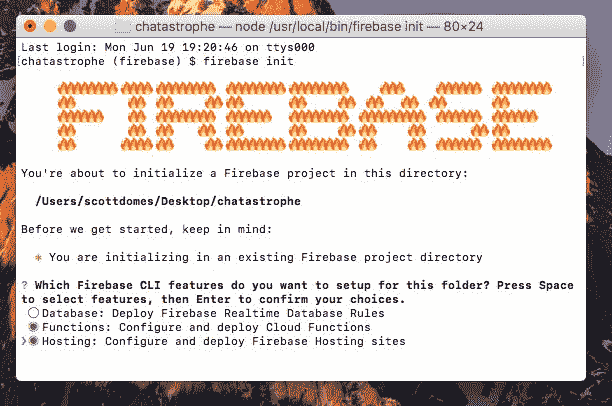
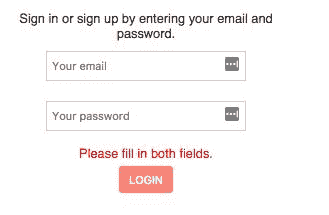

# 四、使用 Firebase 轻松建立后端

我们的应用看起来很不错，但没有那么多功能。我们有一个不允许用户实际登录的登录表单。

在本章中，我们将从应用的后端开始。在我们的例子中，这意味着建立一个数据库来保存用户及其消息。在一章中，我们将介绍让用户创建帐户和登录所需的一切。我们还将深入研究 React 和 component 状态。我们将学习以下内容：

*   什么是火基
*   要注意的陷阱和问题
*   如何部署我们的应用
*   用户身份验证（注册和登录）
*   反应生命周期法

让我们开始吧！

# 什么是 Firebase？

构建一个渐进式的 web 应用在很大程度上是一个前端过程。PWA 很少关心如何使用后端 API 中的数据（当然，除非它会影响性能）。我们希望将应用的后端设置保持在最低限度；为此，我们转向 Firebase。

**Firebase**是谷歌的一个项目，旨在帮助开发者构建应用，而无需担心后端基础设施。它基于后端必须响应的请求量以及所需的存储量，在 freemium 模型上运行。就我们的目的而言，它非常适合快速开发小型原型。当我们的应用扩展时，Chatastrophe 执行委员会向我们保证，“钱不是问题。”

Firebase 提供什么？我们感兴趣的是数据库、托管解决方案和内置身份验证。除此之外，它还提供了名为**云函数**的功能，这些功能是响应特定事件而自动运行的代码片段。一旦我们将推送通知添加到应用中，我们将使用云功能。目前，我们希望在登录表单中添加一些身份验证，以便用户可以注册并登录 Chatastrophe。

如果你有一个 Google 帐户（例如通过 Google Plus 或 Gmail），你可以使用这些凭据登录 Firebase，或者创建一个新帐户；这就是我们需要开始的一切。

# 火基戈查斯

Firebase 是一个有用的工具，但它确实有一些警告。

其中一大卖点（特别是对我们来说）是它的实时数据库。这意味着一个用户对数据的更改会自动推送到所有用户。我们不必检查是否创建了新的聊天信息；将立即通知应用的每个实例。

数据库还具有脱机持久性，这意味着我们的用户即使在脱机时也可以读取他们的消息（如果您还记得的话，这满足了我们前面概述的用户故事之一）。Firebase 使用本地缓存来实现这一点。

那么，缺点是什么？Firebase 数据库是一个 NoSQL 数据库，其特定语法对于更习惯 SQL 数据库的开发人员来说可能很奇怪。这个过程类似于 SQL 数据库（主要的**CRUD**操作--**创建**、**读取**、**更新**和**删除**--应用于数据），但可能没有那么直观。

Firebase 的另一个缺点是（在撰写本文时）它没有像 React 构建的那样针对**单页应用**（**SPA**）进行优化。我们必须做一些变通方法，才能让 React 应用顺利运行。

尽管如此，与设置我们自己的后端服务器/托管解决方案相比，Firebase 将为我们节省大量时间，并且使用 Firebase 进行个人项目是一种乐趣；这绝对是值得学习的。

# 设置

以下是我们将如何使用 Firebase：

1.  我们将转到 Firebase 控制台。
2.  从那里，我们将创建一个项目。
3.  我们将命名我们可爱的小项目。
4.  我们将获得必要的代码，将其集成到我们的应用中。
5.  我们将把该代码添加到`index.html`。
6.  我们将使 Firebase 作为全局变量可用。

如果您已经准备好开始，让我们开始：

1.  一旦您创建或登录到您的 Google 帐户，请前往[https://firebase.google.com/](https://firebase.google.com/) 。在屏幕的右上角，您应该看到一个标题为“转到控制台”的按钮：


2.  从 Firebase 控制台，我们要添加项目。单击图标：


3.  对于项目名称，选择`chatastrophe`（全部小写），然后选择您所在的国家/地区。
4.  完成后，Firebase 应直接将您带到项目页面。从那里，单击显示将 Firebase 添加到 web 应用的链接：


5.  在结束`</body>`标记之前，将其提供给您的代码复制并粘贴到您的`public/index.html`：

```jsx
<body>
  <div id="root"></div> 
  <script src="https://www.gstatic.com/firebasejs/4.1.2/firebase.js"></script> 
  <script>  
    // Initialize Firebase  
    var config = {    
      apiKey: /* API KEY HERE */,    
      authDomain: "chatastrophe-77bac.firebaseapp.com",    
      databaseURL: "https://chatastrophe-77bac.firebaseio.com",    
      projectId: "chatastrophe-77bac",    
      storageBucket: "chatastrophe-77bac.appspot.com",    
      messagingSenderId: "85734589405"  
    };  
    firebase.initializeApp(config); 
  </script> 
</body>
```

6.  最后，我们需要使 Firebase 应用可用于应用的其余部分。在脚本标记的底部，`firebase.initializeApp(config)`行之前添加以下内容：

```jsx
window.firebase = firebase;
```

这段代码将我们的 Firebase 设置存储在`window`对象上，因此我们可以在剩下的 JavaScript 中访问它。

如果您没有使用源代码管理（例如 GitHub 或 Bitbucket），或者使用私有存储库存储代码，则可以跳到下一节。对于我们其他人来说，我们需要做一些工作来确保我们不会向全世界展示我们的`config.apiKey`（恶意使用的配方）。

# 隐藏我们的 API 密钥

我们需要将 API 密钥和`messagingSenderId`移动到一个单独的文件中，然后确保该文件未签入 Git：

1.  为此，在`public/`中创建一个名为`secrets.js`的文件。在该文件中，放置以下内容：

```jsx
window.apiKey = "YOUR-API-KEY”
messagingSenderId = "YOUR-SENDER-ID"
```

同样，我们利用全局可访问的窗口对象来存储密钥。对于那些不熟悉 JavaScript 的人，请注意滥用窗口对象不是一个好的做法；仅在绝对必要时使用。

2.  要在`index.html`中使用此键，我们可以在所有其他脚本标记之上添加以下内容：

```jsx
<script src="/secrets.js"></script>
```

3.  然后，在 Firebase 初始化中：

```jsx
 <script>  
   // Initialize Firebase
   var config = {
     apiKey: window.apiKey,
     // ...rest of config
     messagingSenderId: window.messagingSenderId
   };
```

4.  最后一步，我们需要告诉 Git 忽略`secrets.js`文件。您可以在项目库中修改我们的`.gitignore`文件，添加以下行：

```jsx
/public/secrets.js
```

全部完成！我们现在可以自由地做出承诺和挺身。

# 部署火力基地

正如我前面提到的，Firebase 附带了一个内置部署解决方案。让我们启动我们的应用，在真正的实时网络上工作吧！以下是如何做到这一点：

1.  为此，我们首先需要安装 Firebase 命令行工具：

```jsx
npm install -g firebase-tools
```

别忘了`-g`。此标志在您的计算机上全局安装工具。

2.  下一步是登录我们的 Firebase 工具：

```jsx
firebase login
```

3.  为了完成我们的 Firebase 工具设置，我们现在可以将我们的应用初始化为 Firebase 项目，类似于我们对`npm`所做的操作。确保从项目文件夹的根目录运行此操作：

```jsx
firebase init
```

在第一个问题中，它会提示您使用箭头键和*空格键*选择功能和主机。稍后我们将使用 Firebase 的云功能。不要选择数据库，这是为了在本地配置数据库规则；我们将改用 Firebase 控制台。

您的选择应如下所示：



当它要求默认 Firebase 项目时，选择`chatastrophe`（或 Firebase 控制台中您命名的任何项目）。

对于是否要立即使用 npm 安装依赖项的问题，请输入 y。

接下来，它会询问您希望将哪个文件夹用作公共目录。输入`build`，而不是`public`。Firebase 询问要使用哪个文件夹部署项目；我们需要最终编译的构建，包括传输的 JavaScript，因此我们需要`build`文件夹。

现在让我们进入下一个问题！是否要将应用配置为单页应用？见鬼，是的。尽管拒绝覆盖`index.html`（但是，如果你说是的话，不用担心；我们每次运行`build`命令时都会重新生成`build/index.html`。

好的，我们都准备好部署了。让我们做一个`npm`脚本，让我们的生活更轻松。

每次部署时，我们都希望重新运行`build`命令，以确保我们拥有最新的项目构建。因此，我们的`npm`脚本将两者结合，添加到我们的`package.json`中：

```jsx
"scripts": {
  "build": "node scripts/copy_assets.js && node_modules/.bin/webpack --config webpack.config.prod.js",
  "start": "node_modules/.bin/webpack-dev-server",
  "deploy": "npm run build && firebase deploy"
},
```

使用`yarn deploy`运行脚本，然后查看它在终端中显示的 URL。如果一切顺利，你的应用应该和开发中的完全一样。打开控制台并检查警告；如果您看到任何内容，请浏览网页一章，查看您是否遗漏了我们`webpack.config.prod.js`的任何设置（您可以在此处查看分支中的最终文件：[https://github.com/scottdomes/chatastrophe/tree/chapter4](https://github.com/scottdomes/chatastrophe/tree/chapter4) ：


令人惊叹的我们已经部署了一个应用，可以与朋友共享。唯一的问题是我们在上一章末尾讨论的内容；实际上，它还没有起到多大作用。

让我们通过添加身份验证过程开始使用 Firebase。

# 使用 Firebase 进行身份验证

要允许用户登录/注册我们的应用，我们需要做三件事：

1.  在 Firebase 控制台上启用电子邮件身份验证。
2.  当用户单击按钮时，将我们表单中的电子邮件和密码提交给 Firebase。
3.  根据结果注册或登录用户。

让我们打开 Firebase 控制台（[https://console.firebase.google.com](https://console.firebase.google.com) 并着手完成任务#1：

1.  在我们的 Chatastrophe 项目页面中，单击身份验证。
2.  在“登录方法”选项卡下，您可以看到 Firebase 提供的所有选项。这些身份验证解决方案对开发人员来说是巨大的福音，因为配置身份验证可能很棘手（特别是在使用第三方 API 时，如 Twitter 或 Facebook）。有很多基础设施需要创建，以提供适当的安全性。Firebase 为我们解决了这个问题，所以我们所要担心的就是如何进入他们的系统。
3.  单击电子邮件/密码，然后单击启用和保存。我们的应用现在可以使用电子邮件和密码组合来注册和登录。如果你想让我们的应用更有趣味，可以尝试实现 Facebook 或 GitHub 登录。

回到应用，跳到`LoginContainer.js`。目前，当用户提交我们的表单时，我们只是阻止默认提交并注销我们的状态：

```jsx
handleSubmit = (event) => {
  event.preventDefault();
  console.log(this.state);
};
```

对于我们的流程，我们将把注册和登录流程合并为一个流程。首先，我们将检查电子邮件和密码字段是否已填写。如果是这样，我们将尝试将用户登录，如果 Firebase 告诉我们没有用户使用该电子邮件，我们将创建该用户并自动登录。

但是，如果用户确实存在并且我们得到了错误的密码错误，我们将通过在组件中实现更多的状态来警告用户。

计划如下：

```jsx
handleSubmit = (event) => {
 event.preventDefault();
 // Step 1\. Check if user filled out fields
 // Step 2\. If yes, try to log them in.
 // Step 3\. If login fails, sign them up.
}
```

首先，检查字段是否已填写：

```jsx
handleSubmit = (event) => {
  event.preventDefault();
  if (this.state.email && this.state.password) {
    // Try to log them in.
  } else {
    // Display an error reminding them to fill out fields.
  }
}
```

现在，我们需要一种向用户显示错误的方法，以告诉他们遗漏了一个字段。让我们在状态中添加一个错误字符串：

```jsx
state = { email: '', password: '', error: ‘’ }
```

每次他们提交表单时，我们都会将该错误重置为空字符串，但如果他们缺少字段，我们将显示以下文本：

```jsx
handleSubmit = (event) => {
  event.preventDefault();
  this.setState({ error: '' });
  if (this.state.email && this.state.password) {
    // Try to log them in.
  } else {
    this.setState({ error: 'Please fill in both fields.' });
  }
}
```

最后，为了显示错误，我们将在按钮上方添加一个`<p>`标记，带有错误的`className`：

```jsx
  <input  
    type="password"  
    onChange={this.handlePasswordChange} 
    value={this.state.password} 
    placeholder="Your password" /> 
  <p className="error">{this.state.error}</p> 
  <button className="red light" type="submit">Login</button>
```

好的，试着在没有填写字段的情况下提交我们的表单。您可以通过在本地运行应用（使用您的开发服务器）或重新部署更改来实现。您应该看到以下内容：



到目前为止还不错。下一步是尝试让用户登录。此时，我们的应用没有用户，因此 Firebase 应该返回一个错误。让我们用电子邮件和密码打电话给 Firebase，然后控制台记录结果。

我们想要使用的方法是`firebase.auth().signInWithEmailAndPassword(email, password)`。此函数返回一个 JavaScript 承诺。对于那些熟悉承诺的人，你可以跳到下一节，但如果你不确定的话，这值得一提。

# 什么是承诺？

JavaScript 的问题在于它经常处理异步操作。这些是代码必须完成的步骤，它们在时间上不遵循线性流。通常，代码逐行运行，一行接一行，但是当我们需要调用一个需要随机数秒才能响应的 API 时会发生什么呢？我们不能只是停止代码并等待，一旦调用完成，无论何时，我们仍然会有特定的代码行要执行。

以前的解决方案是**回调**。如果我们以这种方式使用`firebase.auth().signInWithEmailAndPassword`，它将如下所示：

```jsx
firebase.auth().signInWithEmailAndPassword(email, password, function() {
  // Do something when the sign in is complete.
});
```

我们将向它传递一个回调，该回调在操作完成时调用。这种方法可以很好地工作，但可能会导致一些丑陋的代码：具体来说，称为**末日金字塔**或**回调地狱**，其中嵌套回调会导致代码倾斜：

```jsx
firebase.auth().signInWithEmailAndPassword(email, password, function() {
  onLoginComplete(email, password, function() { 
    onLoginCompleteComplete('contrived example', function() {
      anotherFunction('an argument', function () {
        console.log('Help I'm in callback hell!');
      });
    });
  });
});
```

为了使异步函数的使用更加简单和干净，JavaScript 的幕后人员实现了承诺。**承诺**有一个简单的语法：当操作成功时，将一个函数传递给要调用的`.then`语句；当操作失败时，将另一个函数传递给`.catch`语句：

```jsx
firebase.auth().signInWithEmailAndPassword(email, password)
  .then(() => { // Do something on success })
  .catch(err => { // Do something on failure. })
```

现在，我们的代码是好的和可读的，我们确切地知道什么代码将在操作完成后运行。

# 返回到身份验证

由于我们希望返回错误（因为我们没有使用任何电子邮件和密码组合注册），我们可以将`then`语句留空，但在`catch`语句中添加控制台日志：

```jsx
handleSubmit = (event) => {
  event.preventDefault();
  this.setState({ error: '' });
  if (this.state.email && this.state.password) {
    firebase.auth().signInWithEmailAndPassword(this.state.email, this.state.password)
      .then(res => { console.log(res); })
      .catch(err => { console.log(err); })
  } else {
    this.setState({ error: 'Please fill in both fields.' });
  }
}
```

提交表单时，应返回以下错误：

```jsx
{code: "auth/user-not-found", message: "There is no user record corresponding to this identifier. The user may have been deleted."}
```

伟大的这正是我们想要的错误。这是我们将在启动注册过程之前检查的代码。现在，我们假设所有其他错误都是由于密码不正确造成的：

```jsx
handleSubmit = (event) => {
  event.preventDefault();
  this.setState({ error: '' });
  if (this.state.email && this.state.password) {
    firebase.auth().signInWithEmailAndPassword(this.state.email, 
     this.state.password)
      .then(res => { console.log(res); })
      .catch(err => { 
        if (error.code === 'auth/user-not-found') { 
          // Sign up here.
        } else { 
          this.setState({ error: 'Error logging in.' }) ;
        }
      })
 } else {
   this.setState({ error: 'Please fill in both fields.' });
 }
}
```

# 代码清理

我们的`handleSubmit`功能变得有点长，很难理解。在我们继续之前，让我们重新组织一下。

为了简单起见，我们首先将初始`if`语句之后的所有内容移动到一个单独的函数中，称为`login()`：

```jsx
login() {
  firebase
    .auth()
    .signInWithEmailAndPassword(this.state.email, this.state.password)
    .then(res => {
      console.log(res);
    })
    .catch(err => {
      if (err.code === 'auth/user-not-found') {
        this.signup();
      } else {
        this.setState({ error: 'Error logging in.' });
      }
    });
}
```

然后，我们的`handleSubmit`变得更小：

```jsx
handleSubmit = event => {
  event.preventDefault();
  this.setState({ error: '' });
  if (this.state.email && this.state.password) {
    this.login();
  } else {
    this.setState({ error: 'Please fill in both fields.' });
  }
};
```

现在阅读和理解起来容易多了。

# 签约

让我们开始注册过程。同样，它是一个相当简单的函数名--`firebase.auth().createUserWithEmailAndPassword(email, password)`。同样，它回报了一个承诺。让我们添加`then`和`catch`，但暂时将`then`作为控制台日志：

```jsx
signup() {
  firebase
    .auth()
    .createUserWithEmailAndPassword(this.state.email, this.state.password)
    .then(res => {
      console.log(res);
    })
    .catch(error => {
      console.log(error);
      this.setState({ error: 'Error signing up.' });
    });
}
```

尝试登录到我们的应用，你会看到控制台中显示一个复杂的用户对象。成功我们创建了第一个用户帐户。如果您尝试使用相同的帐户再次登录，您应该会看到相同的用户对象登录到控制台。

您可以使用不同的电子邮件和密码组合再试一次（就我们的目的而言，它是否是真正的电子邮件并不重要），并且应该能够顺利工作。

# 拯救我们的用户

我们收到的响应我们的`firebase.auth().signIn`的`user`对象似乎在接下来的过程中会很有用。我们可能多次希望访问当前登录用户的电子邮件。让我们继续并将其保存在`App`组件的状态中，这样我们就可以将其传递给任何`Container`组件（一旦我们制造了更多容器）。

有两种可能的方法：我们可以通过 props 通过回调将用户对象从`LoginContainer`传递到`App`，而`App`将`handleLogin`函数作为 prop 传递给`LoginContainer`，当用户登录并适当设置`App`状态时调用。

然而，Firebase 为我们提供了另一种选择。如前所述，Firebase 数据库是实时的，这意味着对数据的更改会自动推送到前端。我们所需要做的就是设置适当的侦听器函数来等待更改并对其采取行动。

# 事件侦听器

JavaScript 中的**事件监听器**基本上是这样工作的：我们定义了一个事件和一个我们希望在该事件发生时运行的回调。因此，我们可以在代码的早期声明函数，并且只有在指定事件发生时才触发它。

以下是侦听浏览器窗口大小调整的示例：

```jsx
window.addEventListener('resize', function() { // Do something about resize });
```

Firebase 为我们提供了一个名为`firebase.auth().onAuthStateChanged`的函数。此函数将回调作为参数，然后使用用户对象调用回调；这对我们的目的来说是完美的！

然而，挑战在于何时在`App`组件中声明此函数。我们希望它能做到以下几点：

```jsx
firebase.auth().onAuthStateChanged((user) => {
  // If there is a user, save it to state.
  // If there is no user, do nothing.
});
```

然而，这导致了一些限制：

*   我们只想注册监听器一次，所以不能将其放在`render`方法中（当 React 更新 DOM 时可以多次调用）
*   我们需要在注册侦听器之前完全加载`App`组件，因为如果您尝试`setState`在一个不存在的组件上运行，React 会发出抱怨

换言之，我们需要在特定时间声明`onAuthStateChanged`，即在`App`出现在屏幕上后尽快声明。

# 生命周期方法

幸运的是，像这样的情况在 React 中很常见，因此该库为我们提供了一个解决方案：一套称为**生命周期方法**的函数。这些方法是所有（基于类的）React 组件的标准方法，并且在组件出现、更新和消失时的特定时间点调用这些方法。

React 组件的生命周期如下所示：

*   应用已经启动，即将调用组件的`render`方法
*   该组件已渲染，现在已出现在屏幕上
*   该组件即将接收新道具
*   该组件已收到新的道具，并将再次调用 render 进行更新
*   组件已更新以响应新道具或状态更改
*   该组件即将从屏幕上消失

请注意，并非所有这些都会出现在每个组件中，但它们在 UI 更新和更改时都非常常见。

相应的生命周期方法如下所示：

*   `componentWillMount`
*   `componentDidMount`
*   `componentWillReceiveProps`
*   `componentWillUpdate`
*   `componentDidUpdate`
*   `componentWillUnmount`

根据前面的描述，花点时间尝试找出我们想要使用哪个生命周期方法来注册我们的`onAuthStateChanged`。

同样，我们要寻找的时间点正好在组件第一次渲染之后。这使得`componentDidMount`成为完美的选择；让我们将其添加到`App`组件中。我们还需要使用`user`键初始化我们的状态，我们马上就会使用它：

```jsx
class App extends Component {
 state = { user: null };

 componentDidMount() {

 }

  render() {
    return (
      <div id="container">
        <LoginContainer />
      </div>
    );
  }
}
```

如果您不清楚生命周期方法，请尝试将所有六种方法添加到您的应用中，每种方法中都有控制台日志（以及`render`方法中的`console.log`，并观察您的 React 组件的生命周期。

好的，我们可以添加`onAuthStateChanged`下一步：

```jsx
componentDidMount() { 
  firebase.auth().onAuthStateChanged((user) => {      
    if (user) {        
      this.setState({ user });      
    }    
  }); 
}
```

Confused about the `this.setState({ user })`? That's called the `ES6` property shorthand. Basically, when you're assigned a key to a variable, and the key and the variable should have the same name, you can save time instead of typing `this.setState({ user: user })`.

注意`if`语句。`onAuthStateChanged`在用户注销时也被调用，用户参数为空。我们可以将`this.state.user`设置为 null，但让我们保持简单，让用户保持状态，直到下一个用户出现。

Firebase 身份验证的另一个好处是它为我们提供了持久登录。这意味着用户不必每次登录我们的应用；Firebase 将自动加载他们的登录状态，直到他们单击注销（我们将在将来添加）。根据这一点，`onAuthStateChanged`将在用户每次访问我们的应用时调用，无论他们是实际登录还是已经登录。因此，如果用户登录，我们可以依靠用户对象始终保存在状态。

您可以通过`firebase.auth().signOut();`在`onAuthStateChanged`的回调中注销用户进行尝试。再次尝试登录，然后刷新页面；当您自动登录时，无论刷新多少次，都应该看到用户对象出现。

# 总结

这就是身份验证！现在，我们的用户可以登录到我们的应用。下一步是在他们登录后给他们一些事情做。为此，我们需要更多的页面，这将引导我们进入下一个主题：使用 React 进行路由。我们如何在组件之间导航？我们如何根据 URL 更改应用的内容？所有这些和更多的都将在接下来出现！