# 十三、部署到生产环境

本章将介绍以下配方：

*   部署到数字海洋上的生产
*   在我们的液滴中配置 Nginx、PM2 和一个域
*   实施 Jenkins（持续集成）

# 介绍

如果您正在阅读本章，可能是因为您已经完成了 React 应用（恭喜！）。现在是将其部署到生产环境并向世界展示的时候了。在本章中，我们将学习如何使用最好的云服务之一：Digital Ocean 部署 React 应用。

At this point, you will need to invest some money in renting the servers you will need. I will show you the cheapest way to do this, and then, if you want to increase the power of your servers, you will be able to do it without re-doing the configurations.

# 部署到数字海洋上的生产

Digital Ocean 是我最喜欢的使用虚拟服务器（droplets）的云计算平台，因为创建、配置和删除 droplets 非常容易，而且价格很低（你可以以每月 5 美元的价格获得 droplets，也就是每小时 0.007 美元）。我认为 Digital Ocean 很棒的另一个原因是，他们拥有最新的所有文档，客户服务可以快速解决您可能遇到的任何问题。

对于这个配方，我们将使用 Ubuntu18.04，因此您需要了解一些基本的 Linux 命令，以便能够配置您的水滴。如果您完全不熟悉 Linux，不要担心，我将尝试以一种简单的方式解释每个步骤。

# 准备

首先，您需要创建您的数字海洋帐户，请转至[https://www.digitalocean.com](https://www.digitalocean.com) 。你可以注册你的谷歌账户；这是推荐的方法。单击 Google 的注册链接后，您将看到“账单信息”视图：


您可以注册您的信用卡/借记卡，也可以使用贝宝支付。配置好付款信息后，您就可以创建第一个液滴：

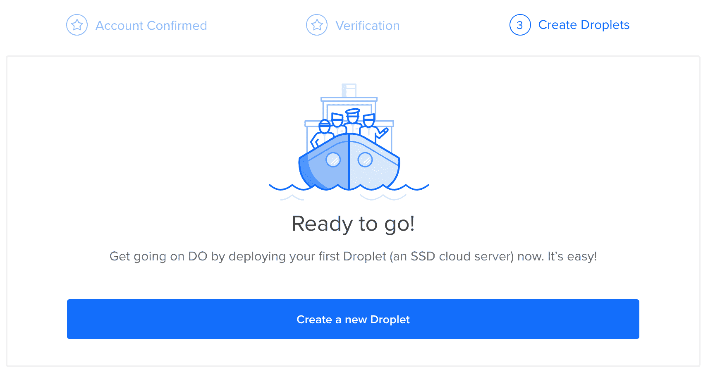

# 怎么做。。。

让我们创建第一个液滴：

1.  选择你的 Linux 发行版；正如我之前提到的，我们将使用 Ubuntu 18.04：


2.  一键式应用是预配置的液滴，但我更喜欢从头设置我的液滴，以获得控制，并能够优化我的配置。在本食谱之后，如果您想查看这些选项，如果您需要快速配置某些内容，则可以：

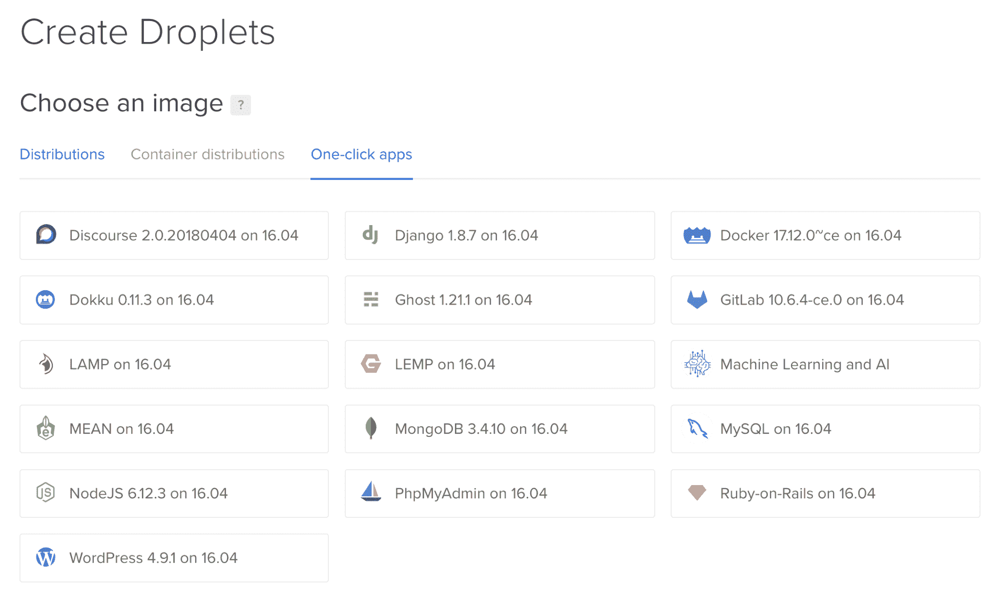

3.  选择液滴的大小。我更喜欢使用 2GB 的 RAM 内存，每个月的成本为*10 美元*。你可能想知道为什么我不选择最便宜的 1GB*RAM*版本；这是因为我尝试过使用这个版本，但我注意到*1GB RAM*不足以在安装软件包时处理 NPM。大多数情况下，这会挂断您的水滴-我知道听起来很可笑，但 NPM 会消耗大量内存。

4.  如果你选择 10 美元一滴，你不必马上付钱。Digital Ocean 最棒的一点是，他们只对你使用水滴的时间收费。这意味着，如果在您完成此配方后（假设您花 2 小时完成），您关闭（关闭）您的液滴，您将只收取 2 小时的费用，即*$0.030*。如果您在一个月内（30 天）坚持使用水滴，您将被收取 10 美元的费用，因此不要担心：


5.  选择数据中心区域；这将取决于您的位置。如果你在美国，你需要选择纽约或旧金山。您需要选择离您所在位置最近的数据中心：

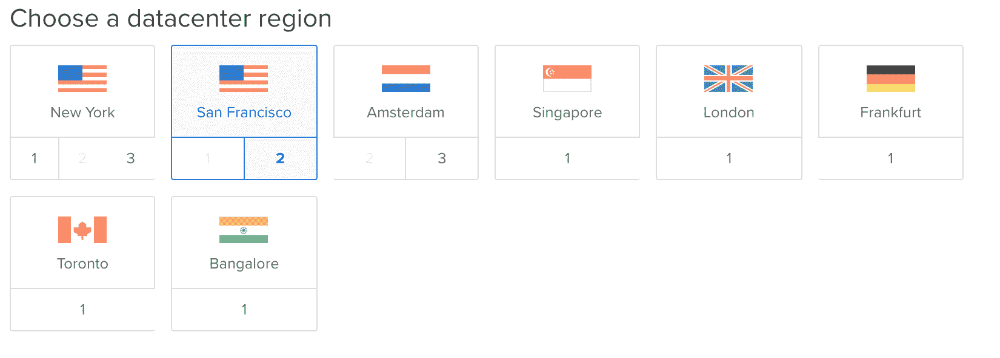

6.  说出你滴的名字。如果需要多个液滴，可在此处选择数量：


7.  单击“创建”按钮后，创建液滴需要 30-45 秒。完成后，您将看到您的液滴：


8.  此时，您应该会收到一封包含服务器凭据的电子邮件：


9.  在终端中，您可以通过`ssh root@YOUR_DROPLET_IP`命令访问您的液滴。当您第一次访问它时，您将收到一条消息，在您必须输入 Droplet 密码后，将此 IP 添加到您的已知主机：

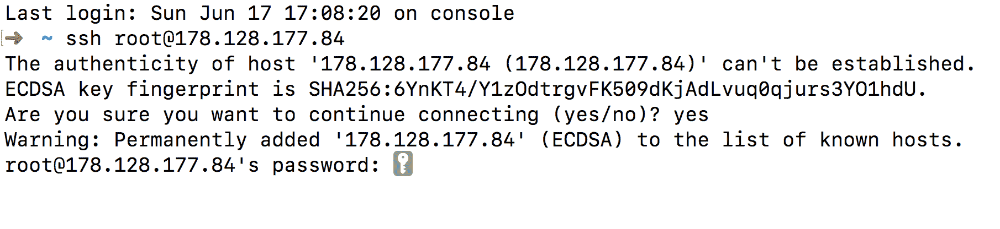

10.  如果一切正常，系统将要求您更改 UNIX 密码。您需要粘贴当前密码，然后必须写入所需的新密码，并在连接到液滴后重新键入密码：


11.  让我们开始配置我们的液滴。安装 Node.js。为此，我们将使用 PPA 安装最新版本的 Node。现在，Node 的当前版本是 10.x。如果在阅读此配方时，Node 有一个新版本，请在命令（setup_**10.x**中更改版本）：

```jsx
  cd ~
  curl -sL https://deb.nodesource.com/setup_10.x -o nodesource_setup.sh
```

12.  获取`nodesource_setup.sh`文件后，运行以下命令：

```jsx
  sudo bash nodesource_setup.sh
```

13.  要安装节点，请运行以下操作：

```jsx
  sudo apt install nodejs -y
```

14.  如果要验证刚安装的 Node 和 NPM 的版本，请运行：

```jsx
 node -v
 v10.8.0
 npm -v
 6.2.0
```

# 它是如何工作的。。。

使用我们在[第 11 章](12.html)*实现服务器端渲染*中执行的一些方法，我用这些代码创建了一个新的 GitHub 存储库，以将其推向生产。您可以在[处查看此存储库 https://github.com/csantany/production](https://github.com/csantany/production) 。

在我们的 Droplet 中，我们将克隆这个 git repo（如果您已经准备好了应用，请使用您的存储库）。生产存储库是公共的，但如果使用私有存储库，则需要在 GitHub 帐户中添加 Droplet 的 SSH 密钥。为此，您需要在您的液滴中运行`ssh-keygen`命令，然后按*Enter*三次而不写入任何密码短语：


If your terminal was inactive for more than five minutes, it's possible your connection will be closed, and you will have to connect again.

创建 SSH 密钥后，可以通过执行以下操作来查看：`vi /root/.ssh/id_rsa.pub`。您需要复制 SSH 密钥并转到您的 GitHub 帐户|设置| SSH 和 GPG 密钥（[https://github.com/settings/ssh/new](https://github.com/settings/ssh/new) 。然后将您的密钥粘贴到文本区域，并为密钥添加一些标题。当您单击添加 SSH 密钥按钮时，GitHub 将询问您的密码以确认：


现在我们可以使用`git clone git@github.com:csantany/production.git`或您的存储库克隆我们的存储库：


然后转到生产文件夹并安装 NPM 软件包：

```jsx
    cd production
 npm install
```

为了测试我们的应用，让我们运行 npm 运行开始生产脚本：

```jsx
    npm run start-production
```

如果您想验证它是否有效，请转到浏览器并打开液滴的 IP，然后在我的案例中添加端口 3000 将是`http://178.128.177.84:3000`如果一切正常，您应该查看您的应用（在我们的案例中，我们将打开我们的/todo 部分）：

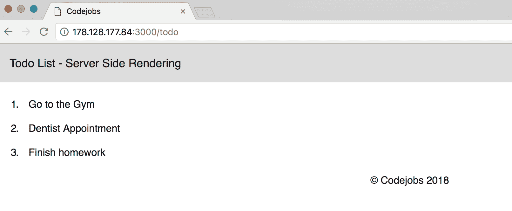

# 还有更多。。。

如果要关闭液滴，可以转到电源部分，或者使用开/关开关：

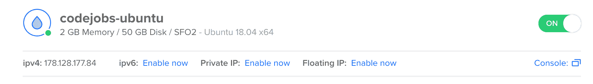

当您单击它时，您将获得以下模式：

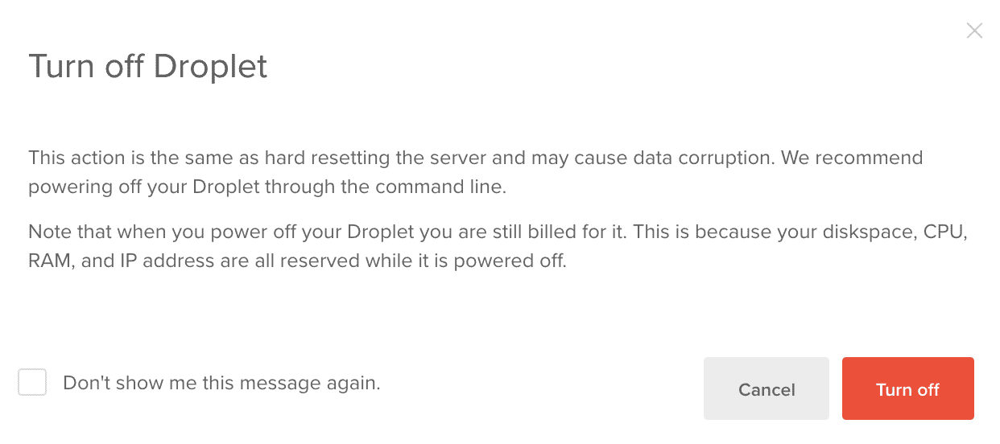

# 在我们的液滴中配置 Nginx、PM2 和一个域

此时，我们的第一个液滴已准备就绪，但我们可以看到使用端口 3000 的 React 应用。在本教程中，我们将学习如何在服务器中配置 Nginx，以及如何实现代理以将通信量从端口 80 重定向到 3000。这意味着我们不再需要直接指定端口。PM2（节点生产流程管理器）将帮助我们在生产中安全地运行节点服务器。一般情况下，如果我们直接使用`node`或`babel-node`命令运行 Node，并且我们的应用中出现错误，则会崩溃并停止工作；如果发生错误，PM2 将重新启动节点服务器

# 准备

对于此配方，我们需要在全球范围内安装 PM2：

```jsx
 npm install -g pm2
```

此外，我们还需要安装 Nginx：

```jsx
 sudo apt-get update
    sudo apt-get install nginx
```

# 怎么做。。。

让我们从配置开始：

1.  调整防火墙以允许通信量仅在端口 80 中。要列出可用的应用配置，请运行以下命令：

```jsx
   sudo ufw app list

   Available applications:
      Nginx Full
 Nginx HTTP
 Nginx HTTPS
 OpenSSH

```

2.  `Nginx Full`表示我们将允许来自端口 80（HTTP）和 443（HTTPS）的流量。目前，我们还没有为任何域配置 SSL，因此应该限制通信量仅通过端口 80（HTTP）：

```jsx
   sudo ufw allow 'Nginx HTTP'
```

3.  如果我们尝试访问我们的 IP，我们应该看到我们的 Nginx 正在工作：


4.  如果要管理 Nginx 的进程，可以使用以下命令：
    *   **启动服务器**：`sudo systemctl start nginx`
    *   **停止服务器**：`sudo systemctl stop nginx`
    *   **重启服务器**：`sudo systemctl restart nginx`
    *   **重新加载服务器**：`sudo systemctl reload nginx`
    *   **禁用服务器**：`sudo systemctl disable nginx`

5.  将 Nginx 设置为反向代理服务器，为此，我们需要打开 Nginx 配置文件：

```jsx
    sudo vi /etc/nginx/sites-available/default
```

6.  在`location /`块中，我们需要将其替换为：

```jsx
  location / {
    proxy_pass http://localhost:3000;
    proxy_http_version 1.1;
    proxy_set_header Upgrade $http_upgrade;
    proxy_set_header Connection 'upgrade';
    proxy_set_header Host $host;
    proxy_cache_bypass $http_upgrade;
  }
```

# 它是如何工作的。。。

保存并关闭文件后，我们需要验证是否存在语法错误。使用以下命令：

```jsx
    sudo nginx -t
```

如果一切正常，您应该看到：


最后，我们重新启动 Nginx 服务器：

```jsx
    sudo systemctl restart nginx
```

现在，我们可以在不使用端口的情况下访问 IP，React 应用将正常工作：

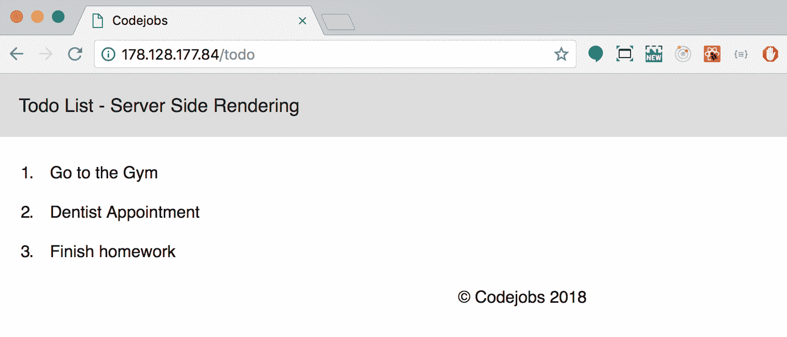

# 还有更多。。。

如果你想用你的液滴使用一个域，那真的很容易；您需要更改域的名称服务器以指向数字海洋服务器。例如，我有一个名为 educnow.com 的域，我将用它来制作我的水滴。我向 Godaddy 注册了这个域，所以我必须去域管理并选择它。您可以直接转到`https://dcc.godaddy.com/manage/YOURDOMAIN.COM/dns`URL。然后转到名称服务器：


我们必须单击更改按钮，选择自定义，指定数字海洋命名服务器，然后单击保存：

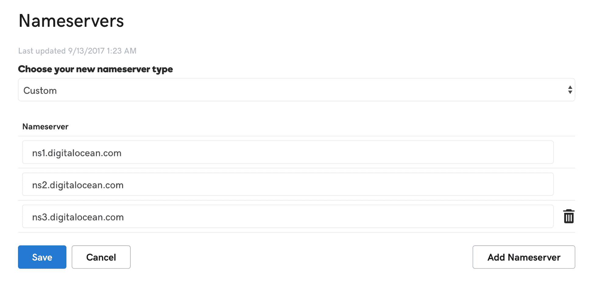

修改名称服务器后，需要转到 Droplet 仪表板并选择添加域选项：


然后介绍要链接到您的 Droplet 的域，并单击添加域：

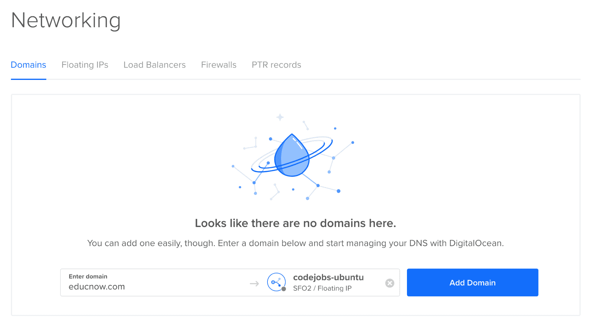

现在您需要为 CNAME 创建一个新记录。在主机名写入`www`中，在别名字段写入`@`中选择 CNAME 选项卡，默认情况下 TTL 为`43200`-这可以使用`www.yourdomain.com`前缀访问您的域：

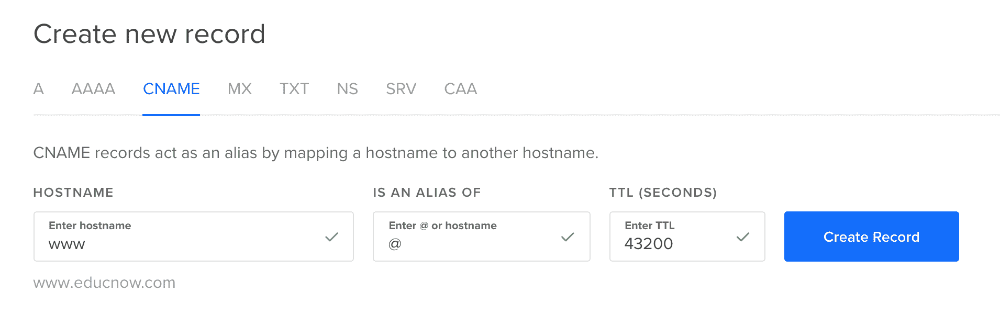

如果你做的一切都正确，你应该能够访问你的域名，并看到你的反应应用的工作；此过程可能需要 30 分钟到 24 小时，具体取决于 DNS 传播速度。

# 实施 Jenkins（持续集成）

Jenkins 是最流行的持续集成软件之一，它基于 Java，并且是开源的。

# 准备

运行 Jenkins 有一些先决条件：

*   你需要一个带有 Ubuntu18 的 droplet（服务器）。
*   您需要安装 Java8。

If you don't have Java 8 installed, you can install it with this command:

**sudo apt  install openjdk-8-jre-headless**

如果要检查安装的 Java 版本，可以使用`java -version`命令：


# 怎么做。。。

现在，让我们安装并配置 Jenkins：

1.  将存储库密钥添加到系统：

```jsx
 wget -q -O - https://pkg.jenkins.io/debian/jenkins.io.key | sudo apt-key add -
```

2.  将 Debian 软件包地址附加到`sources.list`：

```jsx
 sudo sh -c 'echo deb http://pkg.jenkins.io/debian-stable binary/ > /etc/apt/sources.list.d/jenkins.list'
```

3.  更新 apt 软件包：

```jsx
 sudo apt update
```

4.  安装 Jenkins：

```jsx
 sudo apt install jenkins
```

If you get an error when you install Jenkins, you can uninstall it with:

**sudo apt-get remove --purge** jenkins

5.  启动 Jenkins 服务：

```jsx
 sudo systemctl start jenkins
```

6.  如果要查看 Jenkins 状态，请使用以下命令：

```jsx
 sudo systemctl status jenkins
```


7.  默认情况下，Jenkins 在端口 8080 上运行，我们需要打开防火墙以允许该端口的流量：

```jsx
 sudo ufw allow 8080
```

8.  如果要验证防火墙状态，请执行以下操作：

```jsx
    sudo ufw status
```

If you see Status: inactive, you will need to run these commands to enable the firewall:

**sudo ufw allow OpenSSH**
**sudo ufw enable**

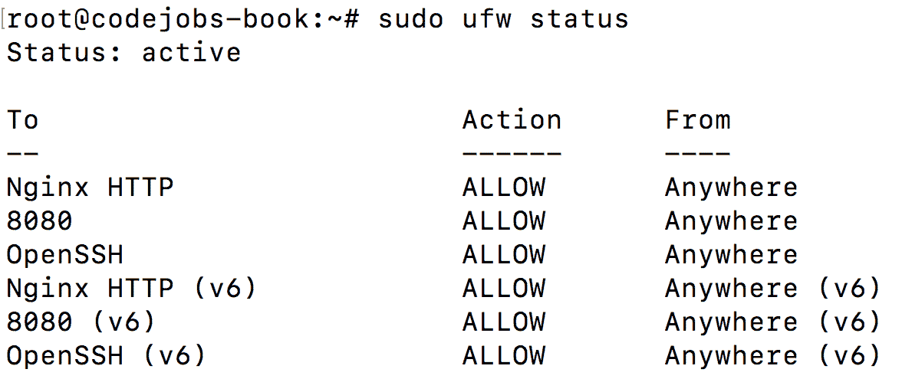

9.  是时候第一次运行我们的 Jenkins 并对其进行配置了。为此，您需要访问`http://<the_ip_or_domain_of_your_droplet>:8080`。就我而言，它是`http://142.93.28.244:8080`：


10.  要查看第一个密码，您需要运行：

```jsx
sudo cat /var/lib/jenkins/secrets/initialAdminPassword
```

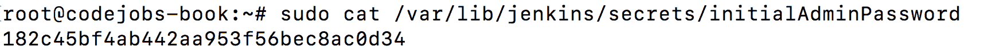

11.  您将看到欢迎来到詹金斯页面。您必须选择“安装建议插件”选项：


12.  您将看到安装过程：

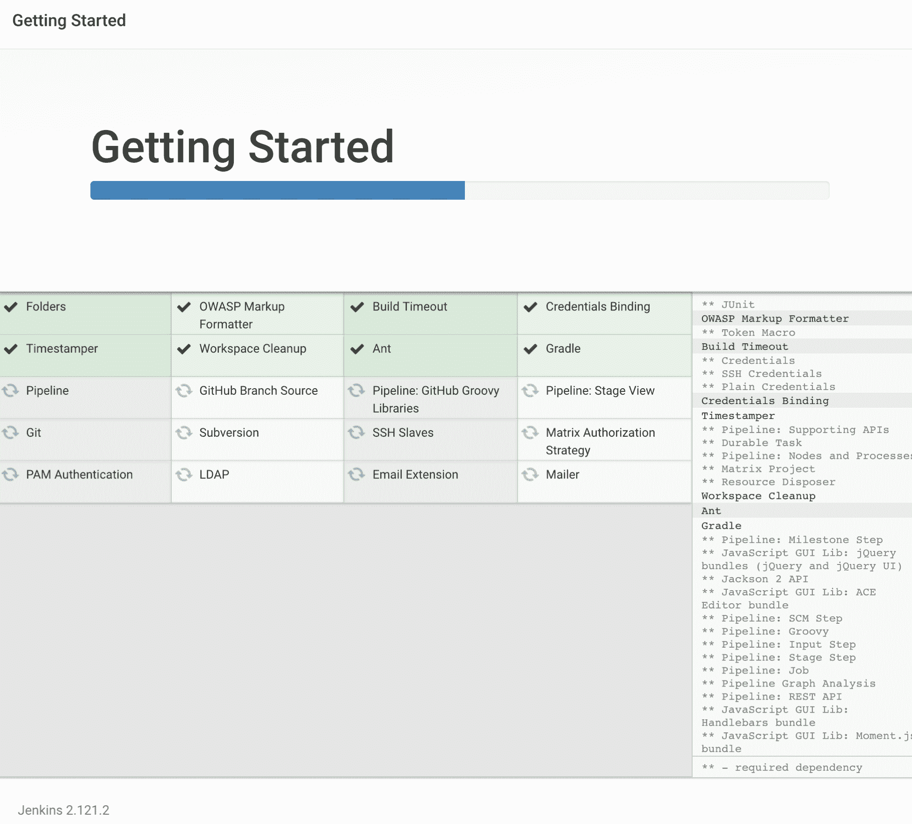

13.  安装完成后，您需要创建第一个管理员用户：

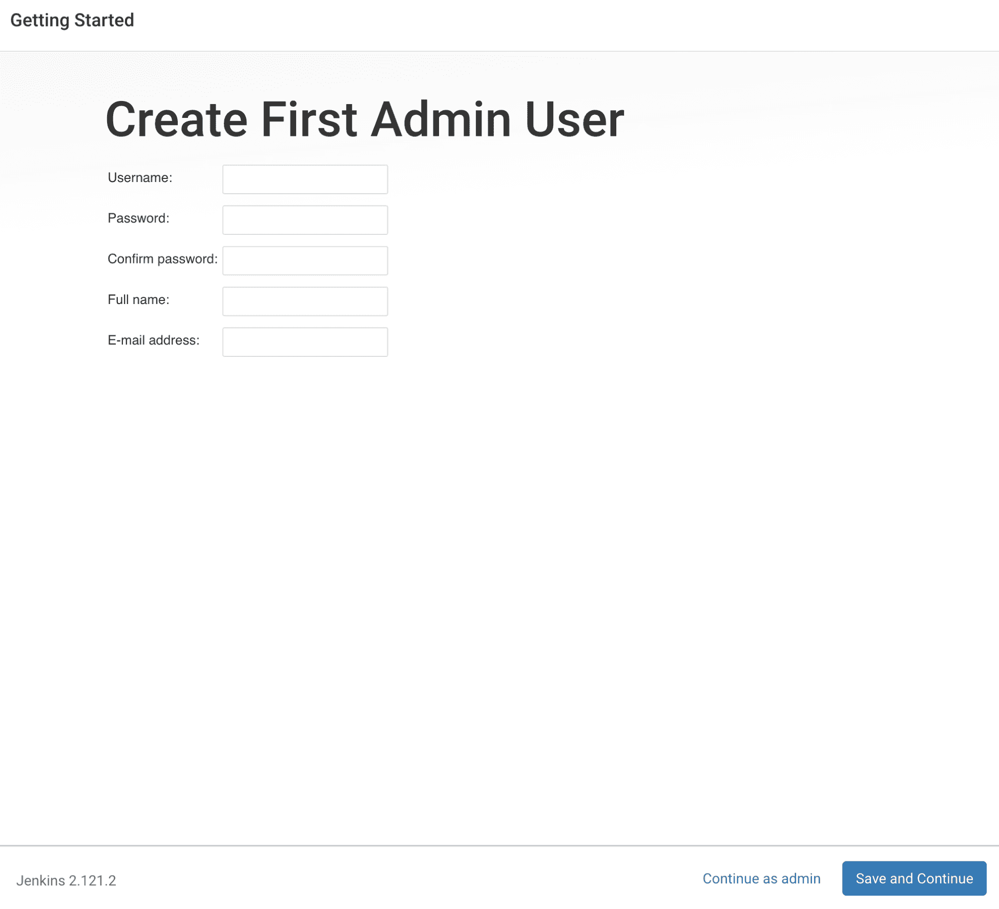

14.  如果不想更改，请确认 Jenkins URL。单击保存并完成：

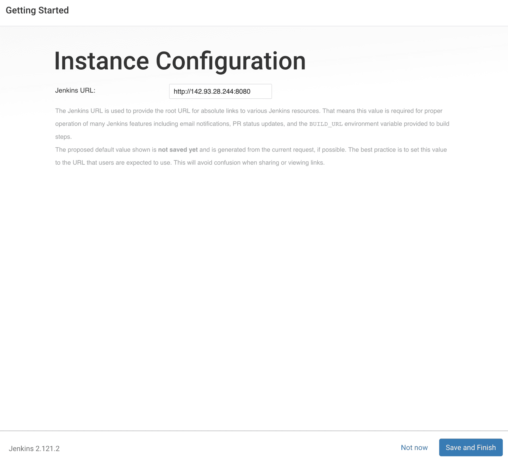

15.  詹金斯准备好了：


16.  您将在 Jenkins 中看到的第一个视图是：

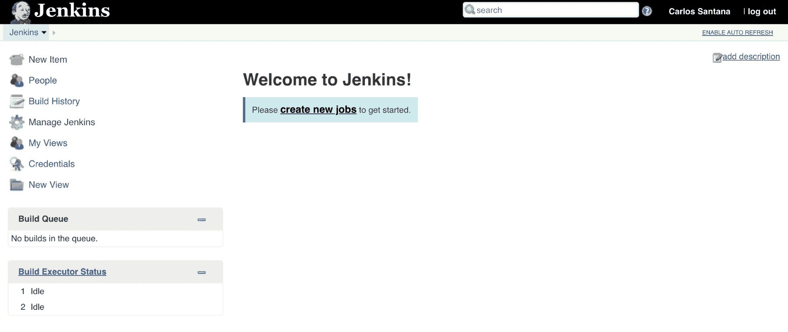

17.  转到 Manage Jenkins>Manage Plugins 以安装 GitHub 插件：

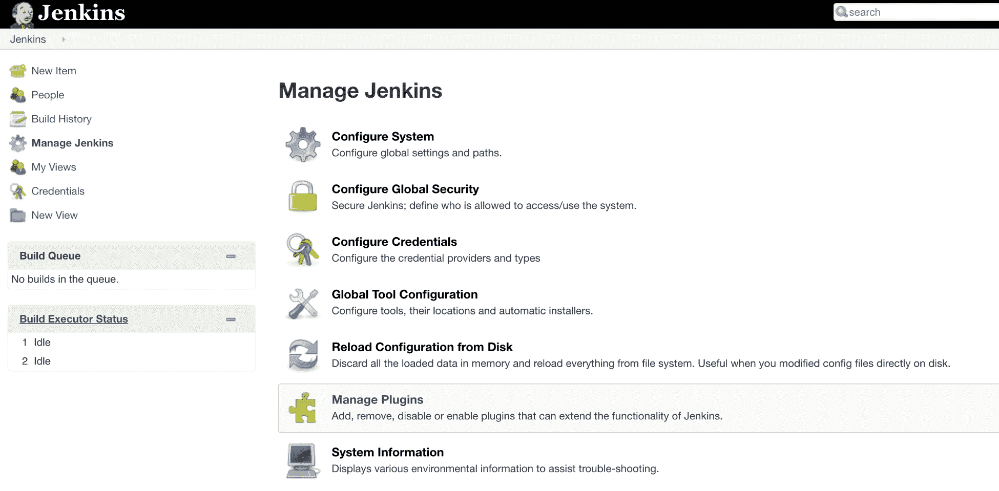

18.  选择可用选项卡，然后搜索 GitHub 集成。现在选择复选框选项并单击“立即下载并在重新启动后安装”按钮：


19.  选择安装完成且无作业运行时重新启动 Jenkins 选项：

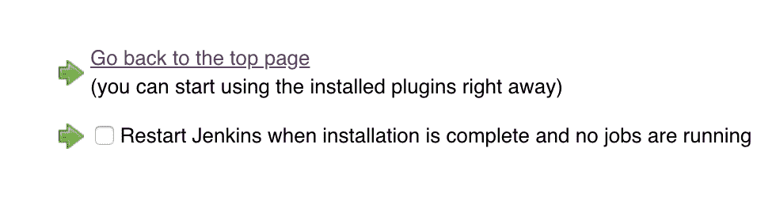

20.  您将看到以下消息：

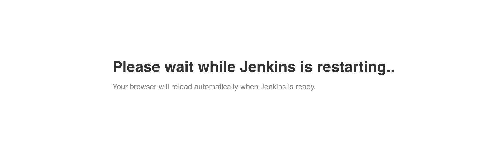

21.  等待一分钟，然后刷新页面。您可能需要再次登录。
22.  返回管理**插件**；现在您需要安装**后期构建任务插件**。

23.  我们可以通过单击主页上的“创建新工作”来创建第一份工作：


24.  写下作业名称，选择“自由式项目”选项，然后单击“确定”按钮：


25.  在常规配置中，转到源代码管理部分，选择 Git 选项，然后编写 GitHub 项目 HTTPS URL（如果选择 SSH URL，则需要在 GitHub 中为 Jenkins 添加新的 SSH 密钥）：


26.  如果您的存储库是私有的，则需要单击 Add 按钮来指定您的 GitHub 凭据（用户名和密码）：

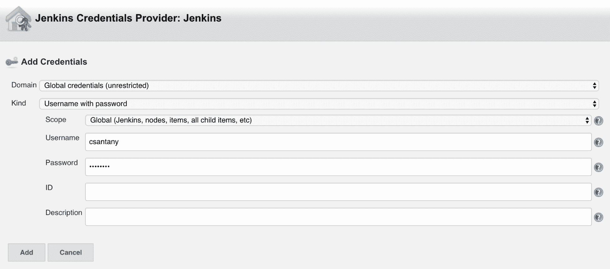

27.  选择您的凭证并确保选择`master`分支作为您的主分支（建议使用主分支而不是其他分支）：


28.  在生成后操作上选择生成后任务选项：


29.  在文本区域脚本中，添加`npm install && npm run start-production`。单击应用，然后单击保存按钮：

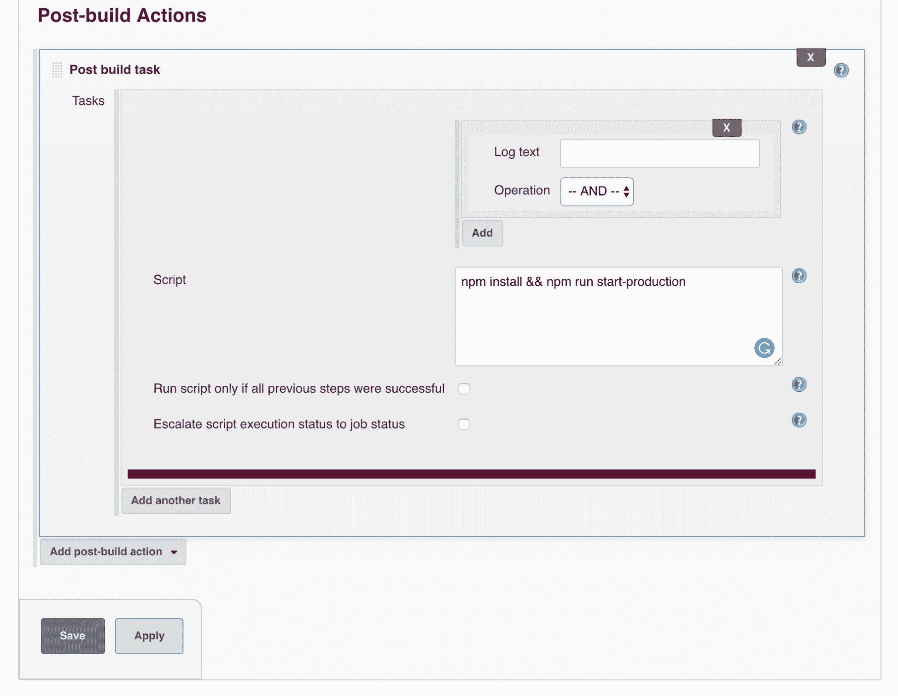

# 它是如何工作的。。。

我们已经配置了 Jenkins 作业，现在让我们测试它。我将修改一个简单的文件，以确保 Jenkins 正常工作。

At this point (if you followed the first recipe), you must stop the PM2 server with the command "**npm run stop**" and then remove the production directory that we cloned before, to avoid problems with the Jenkins job.

让我们修改我们的主组件；我将添加一个额外的文本**（詹金斯）**：

```jsx
  import React from 'react';
  import styles from './Home.scss';

  const Home = props => (
    <h1 className={styles.Home}>Hello {props.name || 'World'} (Jenkins)</h1>
  );

  export default Home;
```

File: src/client/home/index.jsx

之后，您需要提交并推送到 master。现在转到詹金斯，选择你的工作，点击`Build Now`：


在那之后，点击最新版本（在我的例子中是#5，因为我以前做过一些测试，但对你来说，它将是#1）：

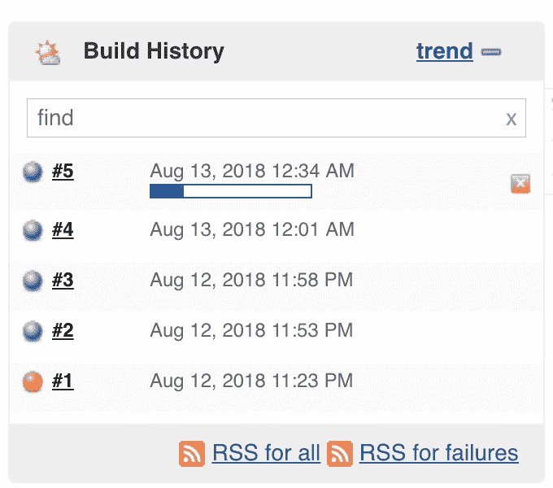

在构建中，您将看到谁（用户）启动了构建，以及哪个版本（主版本的最后一次提交）正在构建。如果要查看控制台输出，可以单击左侧菜单上的该选项：

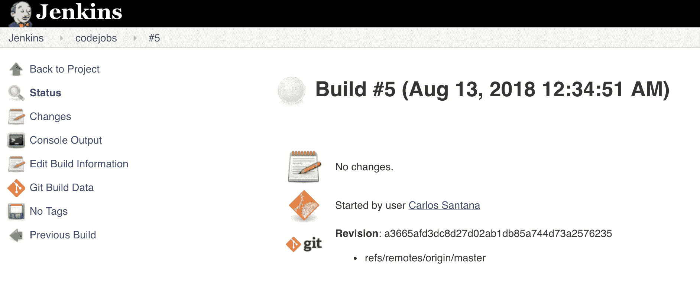

如果查看控制台输出，您将看到大量命令：

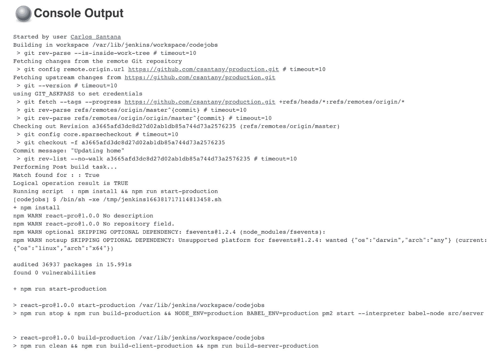

每次运行新构建时，Jenkins 都会获取存储库的最新更改：

```jsx
 git config remote.origin.url https://github.com/csantany/production.git
```

然后将获得主机的最后一次提交：

```jsx
 git rev-parse refs/remotes/origin/master^{commit}
```

最后，它将执行我们在生成后任务中指定的命令：

```jsx
 npm install && npm run start-production
```

如果一切正常，您应该在输出的末尾看到 Finished:SUCCESS：


现在等待 30 秒或 1 分钟，然后访问您的生产现场（在我的例子中为`http://142.93.28.244/`）–您将看到新的更改：

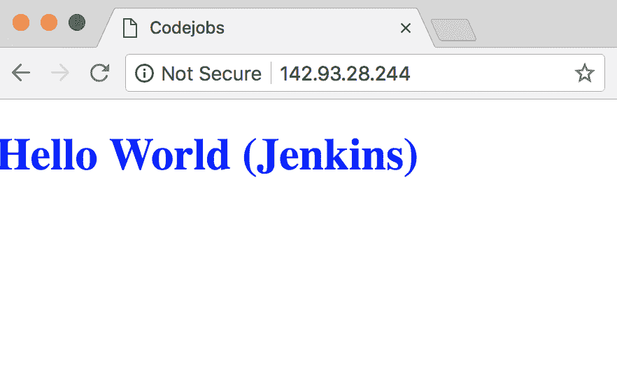

如果您想知道文件存储在哪里，您可以在`/var/lib/jenkins/workspace/<your_jenkins_job_name>`看到它们。