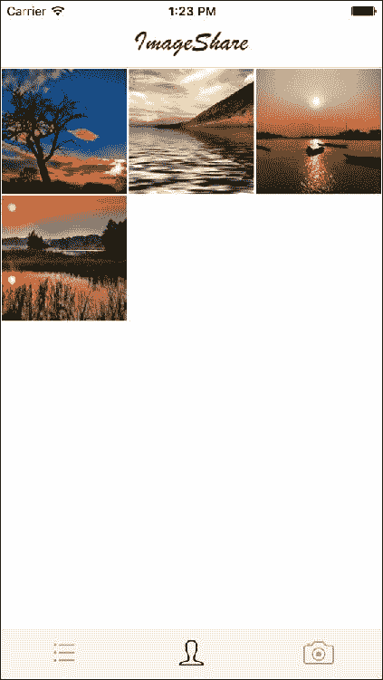
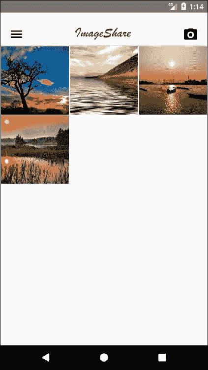
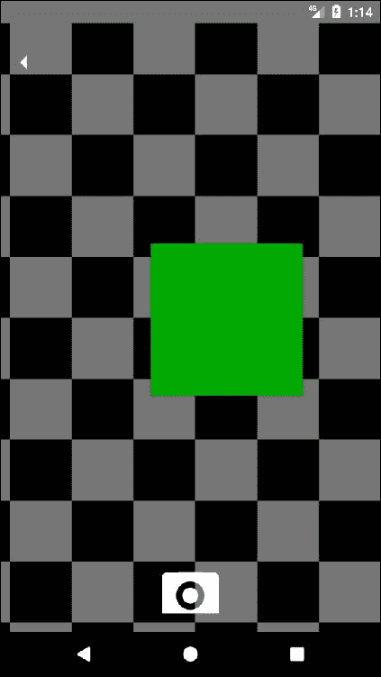

# 二、项目 2——图片分享 App

在这一点上，我们知道如何创建具有自定义界面的全功能应用程序。您甚至学习了如何添加一个状态管理库来控制我们应用程序中的共享数据，从而使代码库保持可维护性和可伸缩性。

在本课程中，我们将重点介绍使用不同的状态管理库（Redux）构建应用程序，使用摄像头功能，编写特定于平台的代码，并深入构建一个既吸引人又可用的自定义用户界面。一个图像共享应用程序将成为这些功能的一个很好的例子，也将为理解应用程序应该建立在多大的基础上奠定基础。

我们将在 iOS 和 Android 这两个平台上重复使用我们的大部分代码。虽然我们的大多数用户界面都是定制的，但我们将使用`native-base`将 UI 元素简化为图标。对于导航，我们将再次使用`react-navigation`，因为它为每个平台提供了最常用的导航：iOS 的选项卡式导航和 Android 的抽屉菜单导航。最后，我们将使用`react-native-camera`处理与设备摄像头的交互。这不仅可以降低实现的复杂性，还可以免费为我们提供大量的功能，我们可以在将来扩展我们的应用程序。

对于这个应用程序，我们将模拟一些 API 调用，这样我们就不需要构建后端。当构建连接应用程序的时候，这些调用应该很容易被真正的 API 所取代。

# 概述

构建图像共享应用程序的一个主要要求是具有吸引力的设计。我们将遵循一些最流行的图像共享应用程序的设计模式，为每个平台调整这些模式，同时尝试利用 React Native 的跨平台功能尽可能多地重用代码。

让我们首先看看 iOS 中的用户界面：


主屏幕显示一个简单的标题和图像列表，包括用户图片、名称和一个分享图像的**更多**图标。在底部，选项卡式导航显示三个代表三个主屏幕的图标：**所有图像**、**我的图像**和**摄像头**。

### 注

此示例应用程序使用的所有图像都可以以任何形式免费使用。

当用户按下特定图像的**更多**图标时，将显示**共享**菜单：


这是一个标准的 iOS 组件。在模拟器上使用它没有多大意义，它可以在实际设备上进行更好的测试。

让我们看一下第二个屏幕，我的图像



这是当前用户上传的所有图像的网格表示，可通过下一屏幕**摄像头**进行更新：


iOS 模拟器不支持任何摄像头，因此该功能在实际设备上测试效果更好，尽管`react-native-camera`完全可用，访问时会返回虚假数据。我们将使用静态图像进行测试。

这就是 iOS 的全部内容；现在让我们转到 Android 版本：


由于 Android 鼓励基于抽屉的导航，而不是标签，我们将在标题中包含一个抽屉菜单图标，还将通过一个不同的图标使相机可用。


与 iOS**共享**菜单一样，Android 有自己的控制器，因此我们将利用此功能，并在用户点击特定图像上的**或**图标时将其包括在内：


当用户点击抽屉菜单图标时，将显示菜单，显示三个可用屏幕。从这里，用户可以导航到**我的图像**屏幕：



最后，还可以通过抽屉菜单访问摄像头屏幕：



Android 模拟器包括一个由彩色移动方块组成的摄像头模拟，可用于测试。相反，出于一致性原因，我们将坚持使用 iOS 版本中使用的固定映像。

本课程中我们将介绍以下主题：

*   在 React Native 中重复使用
*   使用相机
*   平台特定代码
*   抽屉和选项卡式导航
*   与其他应用程序共享数据

# 设置文件夹结构

让我们使用 React-Native 的 CLI 初始化 React-Native 项目。该项目将命名为`imageShare`，可用于 iOS 和 Android 设备：

```jsx
react-native init --version="0.44.0" imageShare

```

为了在这个应用程序中使用一些软件包，我们将使用 React-Native 的特定版本（`0.44.0`。

我们的应用程序将使用 Redux，因此我们将创建一个文件夹结构，在其中我们可以容纳我们的`reducers`、`actions`、`components`、`screens`和`api`呼叫：

此外，我们在`img`文件夹中添加了`logo.png`。对于其余部分，我们有一个非常标准的 React 本地项目。iOS 的入口点为`index.ios.js`，Android 的入口点为`index.android.js`：

```jsx
/*** index.ios.js and index.android.js ***/ 

import { AppRegistry } from 'react-native';
import App from './src/main';

AppRegistry.registerComponent('imageShare', () => App);
```

我们对这两个文件都有相同的实现，因为我们希望使用`src/main.js`作为这两个平台的公共入口点。

让我们跳转到我们的`package.json`文件，了解我们的应用程序中会有哪些依赖项：

```jsx
/*** package.json ***/

{
        "name": "imageShare",
        "version": "0.0.1",
        "private": true,
        "scripts": {
                "start": "node node_modules/react-native/
                local-cli/cli.js start",
                "test": "jest"
        },
        "dependencies": {
                "native-base": "^2.1.5",
                "react": "16.0.0-alpha.6",
                "react-native": "0.44.0",
                "react-native-camera": "^0.8.0",
                "react-navigation": "^1.0.0-beta.9",
                "react-redux": "^5.0.5",
                "redux": "^3.6.0",
                "redux-thunk": "^2.2.0"
        },
        "devDependencies": {
                "babel-jest": "20.0.3",
                "babel-preset-react-native": "1.9.2",
                "jest": "20.0.3",
                "react-test-renderer": "16.0.0-alpha.6"
        },
        "jest": {
                "preset": "react-native"
        }
}
```

一些依赖项，例如`react-navigation`或`native-base`，是以前课程中的老熟人。本课程将首次介绍其他内容，如`react-native-camera`。其中一些与我们将用于此应用程序的状态管理库 Redux 密切相关：

*   `redux`：这是国家管理图书馆本身
*   `react-redux`：这些是 Redux 的 React 处理程序
*   `redux-thunk`：这是处理异步操作执行的 Redux 中间件

为了完成安装，我们需要链接`react-native-camera`，因为它需要对我们应用程序的本机部分进行一些更改：

```jsx
react-native link react-native-camera
```

在 iOS 10 及更高版本上，我们还需要修改我们的`ios/imageShare/Info.plist`以添加**摄像头使用说明**，应显示该说明以请求允许在应用程序中启用摄像头。我们需要在最后一个`</dict></plist>`之前添加这些行：

```jsx
<key>NSCameraUsageDescription</key>
<string>imageShare requires access to the camera on this device to perform this action</string>
<key>NSPhotoLibraryUsageDescription</key>
<string>imageShare requires access to the image library on this device to perform this action</string>
```

# 重复

Redux 是 JavaScript 应用程序的可预测状态容器，基于以下简单原则：

*   应用程序的整个状态存储在单个**存储**中的对象树中
*   改变状态树的唯一方法是发出一个**动作**，一个描述发生了什么的对象
*   要指定操作如何转换状态树，您需要编写纯**减缩器**

它的受欢迎程度来自于在任何类型的代码库（前端或后端）中使用它所获得的一致性、可测试性和开发人员经验。由于其严格的单向数据流，其推理和掌握也很简单：


由**减速器**处理的用户触发和**动作**，这些都是基于**动作**应用状态变化的纯功能。结果状态保存在单个**存储**中，我们应用程序中的**视图**使用该存储来显示应用程序的当前状态。

Redux 是一个复杂的主题，不在本书的范围内，但它将在本书的一些课程中广泛使用，因此查看他们的官方文档（[可能会有所帮助 http://redux.js.org/](http://redux.js.org/) 了解本状态管理库的基本概念。

我们的`src/main.js`文件中将使用 Redux 的一些基本概念：

```jsx
/*** src/main.js ***/

import React from 'react';
import { DrawerNavigator,TabNavigator } from 'react-navigation';
import { Platform } from 'react-native';

import { Provider } from 'react-redux';
import { createStore, combineReducers, applyMiddleware } from 'redux';
import thunk from 'redux-thunk';
import imagesReducer from './reducers/images';

import ImagesList from './screens/ImagesList.js';
import MyImages from './screens/MyImages.js';
import Camera from './screens/Camera.js';

let Navigator;
if(Platform.OS === 'ios'){
  Navigator = TabNavigator({
    ImagesList: { screen: ImagesList },
    MyImages: { screen: MyImages },
    Camera: { screen: Camera }
  }, {
    tabBarOptions: {
      inactiveTintColor: '#aaa',
      activeTintColor: '#000',
      showLabel: false
    }
  });
} else {
  Navigator = DrawerNavigator({
    ImagesList: { screen: ImagesList },
    MyImages: { screen: MyImages },
    Camera: { screen: Camera }
  });
}let store = createStore(combineReducers({ imagesReducer }), applyMiddleware(thunk));

export default class App extends React.Component {
  render() {
    return (
      <Provider store={store}>
        <Navigator/>
      </Provider>
    )
  }
}
```

让我们首先关注 Redux 仪式。`let store = createStore(combineReducers({ imagesReducer }), applyMiddleware(thunk));`通过组合导入的 reducer（我们这个应用程序只有一个 reducer，所以这只是提供信息）和应用**Thunk**中间件来建立存储，这将使我们的应用程序能够使用异步动作。我们将模拟几个将返回异步承诺的 API 调用，因此需要这个中间件来正确处理这些承诺的解析。

然后我们有我们的`render`方法：

```jsx
<Provider store={store}>
   <Navigator/>
</Provider>
```

这是大多数使用 React 的 Redux 应用程序的标准配置。我们用一个`<Provider />`组件包装根组件`(<Navigator />`（在本例中为`(<Navigator />`，以确保我们将从应用程序的根中获得`store`。在本课程中，我们可以在容器或屏幕中使用 Redux`connect`方法。

我们将使用`<Navigator />`组件作为我们应用程序的根目录，但它将根据运行的平台具有不同的性质：

```jsx
let Navigator;
if(Platform.OS === 'ios'){
  Navigator = TabNavigator({

    ...

  });
} else {
  Navigator = DrawerNavigator({

    ...

  });
}
```

`Platform`是一个 React 原生 API，主要用于识别我们的应用程序运行在哪个平台上。我们可以通过在代码中加上`if(Platform.OS === 'ios'){ ... }`来编写特定于 iOS 的代码，Android 也一样：`if(Platform.OS === 'android'){ ... }`。

在本例中，我们使用它在 iOS 上构建了一个选项卡式导航器，在 Android 上构建了一个抽屉式导航器，这是这些平台的**事实上的**导航模式。在两个导航器上，我们都将`ImagesList`、`MyImages`和`Camera`设置为我们应用程序中的三个主屏幕。

# 图像列表

我们应用程序的主屏幕是从后端检索的图像列表。我们将显示这些图像及其相应的上传者配置文件图片和名称。对于每个图像，我们将显示`More`，该图像可用于与用户设备上的其他应用共享图像，如消息传递应用或社交网络。此屏幕的大部分 UI 将源自`<Gallery />`组件，因此我们将重点关注将屏幕与 Redux store 连接，添加自定义标题和滚动视图以使画廊可滚动，并添加活动指示器以警告用户有关网络活动：

```jsx
/*** src/components/ImagesList ***/

import React from 'react';
import { View, ScrollView } from 'react-native';

import { bindActionCreators } from 'redux';
import { connect } from 'react-redux';
import * as Actions from '../actions';
import { Icon } from 'native-base';

import Header from '../components/Header';
import Gallery from '../components/Gallery';
import ActivityIndicator from '../components/ActivityIndicator';

class ImagesList extends React.Component {
  static navigationOptions = {
    tabBarIcon: ({ tintColor }) => (
      <Icon name='list' style={{fontSize: 40, color: tintColor}}/>
    ),
    drawerLabel: 'All Images'
  };

  componentWillMount() {
    this.props.fetchImages();
  }

  componentWillReceiveProps(nextProps) {
    if(!this.props.addingImage && nextProps.addingImage) {
      this.scrollable.scrollTo({y: 0});
    }
  }

  render() {
    return (
      <View style={{flex: 1}}>
        <Header onMenuButtonPress={() => 
        this.props.navigation.navigate('DrawerOpen')}
        onCameraButtonPress={() => 
        this.props.navigation.navigate('Camera')}/>
<ScrollView ref={(scrollable) => {
            this.scrollable = scrollable;
          }}>
          { this.props.addingImage && <ActivityIndicator 
            message='Adding image' /> }
          <Gallery imageList={this.props.images} loading=
          {this.props.fetchingImages}/>
        </ScrollView>
      </View>
    );
  }
}

function mapStateToProps(state) { return { images: state.imagesReducer.images, addingImage: state.imagesReducer.addingImage, fetchingImages: state.imagesReducer.fetchingImages } }
function mapStateActionsToProps(dispatch) { return bindActionCreators(Actions, dispatch) }

export default connect(mapStateToProps, mapStateActionsToProps)(ImagesList);
```

由于大多数 React 应用程序都使用 Redux，我们需要将组件与状态和操作连接起来。我们将创建两个函数（`mapStateToProps`和`mapStateActionsToProps`，用映射的动作和组件感兴趣的部分状态装饰我们的`<ImageList />`组件：

*   `images`：这是我们将在`<Gallery />`中渲染的图像列表
*   `addingImage`：这是我们上传图像时设置为`true`的标志
*   `fetchingImages`：当应用程序向后端请求图像列表以更新商店时，此标志将设置为`true`

我们在这个屏幕上需要的唯一动作是`fetchImages`，可以通过`propscomponent`访问，因为我们将`Actions`中的动作列表连接到了`<ImagesList />`组件。类似地，我们有三个状态变量（`images`、`addingImage`和`fetchingImages`）可通过`props`获得，这要感谢相同的`connect`调用：

```jsx
function mapStateToProps(state) {
  return {
    images: state.imagesReducer.images,
    addingImage: state.imagesReducer.addingImage,
    fetchingImages: state.imagesReducer.fetchingImages
  };
}
function mapStateActionsToProps(dispatch) {
  return bindActionCreators(Actions, dispatch);
}

export default connect(mapStateToProps, mapStateActionsToProps)(ImagesList);
```

这就是我们从 Redux 所需要的。我们也将在其他屏幕中看到此模式，因为它是将 React 组件与商店的部分和操作列表连接起来的常见解决方案。

在`componentWillMount`上调用`fetchImages`操作，作为要渲染的图像列表的初始检索：

```jsx
componentWillMount() { 
   this.props.fetchImages(); 
}
```

我们还添加了一种检测`addingImage`标志设置为`true`以显示活动指示器的时刻的方法：

```jsx
componentWillReceiveProps(nextProps) {
  if(!this.props.addingImage && nextProps.addingImage) {
    this.scrollable.scrollTo({y: 0});
  }
}
```

此方法将在`<Scrollview />`中调用`scrollTo`，以确保显示顶部，因此用户可以看到`<ActivityIndicator />`。这次我们使用的是一个定制的`<ActivityIndicator />`（从`src/components/ActivityIndicator`导入），因为我们不仅要显示一个微调器，还要显示一条消息。

最后，我们将添加两个组件：

*   `<Header />`：显示徽标和（在 Android 版本中）两个图标，用于导航到抽屉菜单和摄像头屏幕
*   `<Gallery />`：显示图像和上传者的格式化列表

在移动到另一个屏幕之前，让我们来看看这一个包含的三个自定义组件：AuthT0}、AuthT1、和 Ty2 T2。

# 画廊

Gallery 保存图像列表的所有渲染逻辑。它依赖于`native-base`，更具体地说，依赖于其两个组件`<List />`和`<ListItem />`：

```jsx
/*** src/components/Gallery ***/

import React from 'react';
import { List, ListItem, Text, Icon, Button, Container, Content }
 from 'native-base';
import { Image, Dimensions, View, Share, ActivityIndicator, StyleSheet } from 'react-native';

var {height, width} = Dimensions.get('window');

export default class Gallery extends React.Component {
  _share(image) {
   Share.share({message: image.src, title: 'Image from: ' + 
                image.user.name}) 
  }

  render() {
    return (
      <View>
        <List style={{margin: -15}}>
          {
            this.props.imageList && this.props.imageList.map((image) =>  
            {
              return (
                <ListItem 
                    key={image.id} 
                    style={{borderBottomWidth: 0, 
                    flexDirection: 'column', marginBottom: -20}}>
                  <View style={styles.user}>
                    <Image source={{uri: image.user.pic}} 
                     style={styles.userPic}/>
                    <Text style={{fontWeight: 'bold'}}>
                    {image.user.name}</Text>
                  </View>
                  <Image source={{uri: image.src}} 
                  style={styles.image}/>
                  <Button style={{position: 'absolute', right: 15, 
                  top: 25}} transparent 
                  onPress={this._share.bind(this, image)}>
                    <Icon name='ios-more' style={{fontSize: 20, 
                    color: 'black'}}/>
                  </Button>
                </ListItem>
              );
            })
          }
        </List>
        {
          this.props.loading &&
          <View style={styles.spinnerContainer}>
            <ActivityIndicator/>
          </View>
        }
      </View>
    );
  }
}

const styles = StyleSheet.create({
  user: {
    flexDirection: 'row',
    alignSelf: 'flex-start',
    padding: 10
  },
  userPic: {
    width: 50,
    height: 50,
    resizeMode: 'cover',
    marginRight: 10,
    borderRadius: 25
  },
  image: {
    width: width,
    height: 300,
    resizeMode: 'cover'
  },
  spinnerContainer: {
    justifyContent: 'center',
    height: (height - 50)
  }
});
```

此组件从其父组件获取两个道具：`loading`和`imageList`。

`loading`用于显示显示用户网络活动的标准`<ActivityIndicator />`。这一次，我们使用的是标准指示器，而不是自定义指示器，因为网络活动指示的内容应该足够清楚。

`imageList`是存储图像列表的数组，将在我们的`<Gallery />`中一次渲染一个`<ListenItem />`。每个`<ListItem />`都有一个带有`onPress={this._share.bind(this, image)`的`<Button />`，用于与其他应用程序共享图像。让我们看看函数 T66.函数：

```jsx
_share(image) {
  Share.share({message: image.src, title: 'Image from: ' 
               + image.user.name}) 
}
```

`Share`是用于共享文本内容的 React 原生 API。在我们的例子中，我们将与一个简单的标题一起共享图像的 URL（`img.src`。共享文本是在应用程序之间共享内容的最简单方式，因为许多应用程序都接受文本作为共享格式。

值得注意的是，我们应用于图像的样式占据了整个宽度和固定高度（`300`，因此，即使显示图像的大小不同，我们也为所有图像提供了稳定的布局。对于此设置，我们使用`resizeMode: 'cover'`以便图像不会在任何维度上拉伸。这意味着我们最终可能会剪切图像，但它会补偿均匀性。另一种选择是，如果我们不想剪切任何东西，而是想在这些边界内拟合图像，同时可能会缩小它们，则可以使用`resizeMode: contain`。

# 割台

我们希望在多个屏幕之间重用自定义标题。这就是为什么最好为其创建一个单独的组件并将其导入这些屏幕：

```jsx
/*** src/components/Header ***/

import React from 'react';
import { View, Image, StyleSheet } from 'react-native';
import { Icon, Button } from 'native-base';
import { Platform } from 'react-native';

export default class Header extends React.Component {
  render() {
    return (
      <View style={styles.container}>
        {
          Platform.OS === 'android' &&
          <Button transparent onPress={this.props.onMenuButtonPress}>
            <Icon android='md-menu' style={styles.menuIcon}/>
          </Button>
        }
        <Image source={require('../../img/logo.png')} 
          style={styles.logo} />
        {
          Platform.OS === 'android' &&
          <Button onPress={this.props.onCameraButtonPress} transparent>
            <Icon name='camera' style={styles.cameraIcon}/>
          </Button>
        }
      </View>
    );
  }
}

const styles = StyleSheet.create({
  container: {
    paddingTop: 20,
    flexDirection: 'row',
    alignItems: 'center',
    justifyContent: 'space-around',
    borderBottomWidth: 1,
    borderBottomColor: '#ccc'
  },
  menuIcon: {
    fontSize: 30,
    color: 'black'
  },
  logo: {
    height: 25,
    resizeMode: 'contain',
    margin: 10
  },
  cameraIcon: {
    fontSize: 30,
    color: 'black'
  }
});
```

我们再次使用`Platform`API 检测 Android 设备，并仅在该平台上显示抽屉菜单按钮和摄像头按钮。我们决定这样做，通过减少需要按下的按钮数量，使这些功能（应用程序的核心）对 Android 用户更加突出。按下按钮时要执行的操作由父组件通过两个道具传递：

*   `onMenuButtonPress`
*   `onCameraButtonPress`

这两个道具调用两个单独的函数，调用导航器的`navigate`方法：

*   `this.props.navigation.navigate('DrawerOpen')`
*   `this.props.navigation.navigate('Camera')`

最后要注意的是我们如何在这个组件中设置容器的布局。我们使用`justifyContent: 'space-around'`，这是我们告诉 Flexbox 在一行中均匀分布项目的方式，周围的空间相等。请注意，从视觉上看，空间并不相等，因为所有项目的两侧都有相等的空间。第一个项目相对于容器边缘有一个单位的空间，但下一个项目之间有两个单位的空间，因为下一个项目有自己的适用间距：


# 活动指示器

我们的定制`ActivityIndicator`是一个非常简单的组件：

```jsx
/*** src/components/ActivityIndicator ***/

import React from 'react';
import { ActivityIndicator, View, Text, StyleSheet } 
from 'react-native';

export default class CustomActivityIndicator extends React.Component {
  render() {
    return (
      <View style={styles.container}>
        <ActivityIndicator style={{marginRight: 10}}/>
        <Text>{this.props.message}</Text>
      </View>
    );
  }
}

const styles = StyleSheet.create({
  container: {
    flexDirection: 'row',
    justifyContent: 'center',
    padding: 10,
    backgroundColor: '#f0f0f0'
  }
});
```

它作为道具接收消息，并将其显示在标准微调器旁边。我们还添加了自定义背景色（`#f0f0f0`），以使其在白色背景上更可见。

现在让我们转到相机屏幕，将我们的图像添加到列表中。

# 摄像机

拍照时的大部分逻辑可以在使用`react-native-camera`时抽象出来，因此我们将重点在组件中使用此模块，并确保通过 Redux 操作将其连接到应用程序的状态：

```jsx
/*** src/screens/Camera ***/

import React, { Component } from 'react';
import {
  Dimensions,
  StyleSheet,
  Text,
  TouchableHighlight,
  View
} from 'react-native';
import { Button, Icon } from 'native-base';
import Camera from 'react-native-camera';
import { bindActionCreators } from 'redux';
import { connect } from 'react-redux';
import * as Actions from '../actions';

class CameraScreen extends Component {
  static navigationOptions = {
    tabBarIcon: ({ tintColor }) => (
      <Icon name='camera' style={{fontSize: 40, color: tintColor}}/>
    ),
  };

  render() {
    return (
      <View style={styles.container}>
        <Camera
          ref={(cam) => {
            this.camera = cam;
          }}
          style={styles.preview}
          aspect={Camera.constants.Aspect.fill}>
          <Button onPress={this.takePicture.bind(this)} 
          style={styles.cameraButton} transparent>
            <Icon name='camera' style={{fontSize: 70,
            color: 'white'}}/>
          </Button>
        </Camera>
        <Button onPress={() => 
         this.props.navigation.navigate('ImagesList')} 
         style={styles.backButton} transparent>
          <Icon ios='ios-arrow-dropleft' android='md-arrow-dropleft' 
           style={{fontSize: 30, color: 'white'}}/>
        </Button>
      </View>
    );
  }

  takePicture() {
    const options = {};
    this.camera.capture({metadata: options})
      .then((data) => {
        this.props.addImage(data);
        this.props.navigation.navigate('ImagesList');
      })
      .catch(err => console.error(err));
  }
}

const styles = StyleSheet.create({
  container: {
    flex: 1,
    flexDirection: 'row',
  },
  preview: {
    flex: 1,
    justifyContent: 'flex-end',
    padding: 20
  },
  capture: {
    flex: 0,
    backgroundColor: '#fff',
    borderRadius: 5,
    color: '#000',
    padding: 10,
    margin: 40
  },
  cameraButton: {
    flex: 0, 
    alignSelf: 'center'
  },
  backButton: {
    position: 'absolute',
    top:20
  }
});

function mapStateToProps(state) { return {} }
function mapStateActionsToProps(dispatch) { return bindActionCreators(Actions, dispatch) }

export default connect(mapStateToProps, mapStateActionsToProps)(CameraScreen);
```

`react-native-camera`的工作方式是提供一个可以包含在屏幕中的组件，通过引用，我们可以调用其`capture`方法，该方法返回一个承诺，我们可以使用该承诺调用`addImage`将图像上传到应用程序的后端。

让我们更仔细地看一下：

```jsx
<Camera
   ref={(cam) => {
     this.camera = cam;
   }}
   style={styles.preview}
   aspect={Camera.constants.Aspect.fill}>

...

</Camera>
```

`<Camera />`组件采用三种道具：

*   `ref`：设置父组件中`<Camera />`组件的引用，以便调用捕获方法。
*   `style`：这允许开发者在应用中指定组件的外观。
*   `aspect`：这允许您定义视图渲染器在显示相机视图时的行为。有三个选项：`fill`、`fit`和`stretch`。

当用户按下摄像头按钮时，`takePicture`功能将被调用：

```jsx
takePicture() {
    const options = {};
    this.camera.capture({metadata: options})
    .then((data) => {
      this.props.addImage(data);
      this.props.navigation.navigate('ImagesList');
    })
    .catch(err => console.error(err));
}
```

我们将使用保存的对摄影机的引用来调用其`capture`方法，我们可以将一些元数据（例如，照片拍摄的位置）传递给该方法。此方法返回一个承诺，将使用图像数据解析，因此我们将使用此数据调用`addImage`操作将此数据发送到后端，以便将图片添加到`imagesList`。在将图像发送到后端后，我们将使应用程序导航回`ImagesList`屏幕。`addImage`方法将设置`addingImages`标志，因此`ImageList`屏幕可以显示带有相应消息的活动指示器。

让我们转到应用程序中的最后一个屏幕：`MyImages`。

# 我的图片

此屏幕显示已登录用户上载的所有图像。我们正在使用此屏幕的假图像来预填充此屏幕，但可以通过摄像头屏幕添加更多图像。

大多数渲染逻辑将移动到一个名为`<ImagesGrid />`的单独组件：

```jsx
/*** src/screens/MyImages ***/

import React from 'react';
import { 
  Image,
  TouchableOpacity,
  Text,
  View,
  ActivityIndicator,
  Dimensions 
} from 'react-native';

import { bindActionCreators } from 'redux';
import { connect } from 'react-redux';
import * as Actions from '../actions';
import { Icon } from 'native-base';

import Header from '../components/Header';
import ImagesGrid from '../components/ImagesGrid';

var {height, width} = Dimensions.get('window');

class MyImages extends React.Component {
  static navigationOptions = {
    drawerLabel: 'My Images',
    tabBarIcon: ({ tintColor }) => (
      <Icon name='person' style={{fontSize: 40, color: tintColor}}/>
    )
  };

  componentWillMount() {
    this.props.fetchImages(this.props.user.name);
  }

  render() {
    return (
      <View>
        <Header onMenuButtonPress={() => 
        this.props.navigation.navigate('DrawerOpen')} 
        onCameraButtonPress={() => 
        this.props.navigation.navigate('Camera')}/>
        {
          this.props.fetchingImages &&
          <View style={{justifyContent: 'center', 
           height: (height - 50)}}>
            <ActivityIndicator/>
          </View>
        }
        <ImagesGrid images={this.props.images}/>
      </View>
    );
  }
}

function mapStateToProps(state) { return { images: state.imagesReducer.userImages, user: state.imagesReducer.user, fetchingImages: state.imagesReducer.fetchingUserImages } }
function mapStateActionsToProps(dispatch) { return bindActionCreators(Actions, dispatch) }

export default connect(mapStateToProps, mapStateActionsToProps)(MyImages);
```

该组件所做的第一件事是调用`fetchImages`操作，但与`<ImagesList />`组件不同，它传递用户名以仅检索登录用户的图片。当我们创建这个动作时，我们需要考虑到这一点，并接收一个可选的`userName`参数来过滤掉我们将检索的图像列表。

除此之外，该组件将其大部分行为委托给`<ImageGrid />`，以便我们可以为其他用户重用渲染功能。让我们转到`<ImageGrid />`。

# 图像栅格

一个简单的滚动视图和图像列表。该组件就这么简单，但其配置方式允许图像以一种简单的方式像网格一样流动：

```jsx
/*** src/components/ImageGrid ***/

import React from 'react';
import { 
  Image,
  TouchableOpacity, 
  ScrollView, 
  Dimensions, 
  View,
  StyleSheet
} from 'react-native';

var {height, width} = Dimensions.get('window');

export default class ImagesGrid extends React.Component {
  render() {
    return (
      <ScrollView>
        <View style={styles.imageContainer}>
          {
            this.props.images && 
            this.props.images.map(img => {
              return (<Image style={styles.image} 
              key={img.id} source={{uri: img.src}}/>);
            })
          }
        </View>
      </ScrollView>
    );
  }
}

const styles = StyleSheet.create({
  imageContainer: {
    flexDirection: 'row',
    alignItems: 'flex-start',
    flexWrap: 'wrap'
  },
  image: {
    width: (width/3 - 2),
    margin: 1,
    height: (width/3 - 2),
    resizeMode: 'cover'
  }
});
```

在设计容器样式时，我们使用`flexWrap`：“包裹”来确保图像不仅在`row`方向流动，而且在覆盖一行图像的设备宽度时扩散到新的行。通过将每个图像的`width`和`height`设置为`width/3 - 2`，我们可以确保容器每行可以容纳三个图像，包括两个像素，它们之间留有很小的边距。

通过`npm`还有几个网格模块可用，但我们已经决定为此构建我们自己的组件，因为我们不需要网格中的额外功能，我们可以通过这种方式获得灵活性。

这些就是我们在图像共享应用程序中需要的所有屏幕和视觉组件。让我们来看看胶水，使它们一起工作，行动和减速器。

# 行动

正如我们在屏幕上看到的，该应用程序只需要两个操作，`fetchImages`（针对所有用户或特定用户）和`addImage`：

```jsx
/*** src/actions/index ***/

import api from '../api';

export function fetchImages(userId = null) {
  let actionName, actionNameSuccess, actionNameError;
  if(userId) {
    actionName = 'FETCH_USER_IMAGES';
    actionNameSuccess = 'FETCH_USER_IMAGES_SUCCESS';
    actionNameError = 'FETCH_USER_IMAGES_ERROR';
  } else {
    actionName = 'FETCH_IMAGES';
    actionNameSuccess = 'FETCH_IMAGES_SUCCESS';
    actionNameError = 'ADD_IMAGE_ERROR';
  }

  return dispatch => {
    dispatch({ type: actionName });
    api
      .fetchImages(userId)
      .then(images => {
        dispatch({ 
          type: actionNameSuccess,
          images
        })  
      })
      .catch(error => {
        dispatch({ 
          type: actionNameError,
          error
        });  
      });
  };
}

export function addImage(data = null) {
  return dispatch => {
    dispatch({ type: 'ADD_IMAGE' });
    api
      .addImage()
      .then(imageSrc => {
        dispatch({ 
          type: 'ADD_IMAGE_SUCCESS',
          imageSrc
        });  
      })
      .catch(error => {
        dispatch({ 
          type: 'ADD_IMAGE_ERROR',
          error
        });  
      });
  };
}
```

Redux 操作只是描述事件的简单对象，包括其负载。由于我们正在使用`redux-thunk`，我们的**动作创建者**将返回一个函数，在该函数中调用 Redux`dispatch`函数，并传递动作。让我们仔细看看我们的行为：

```jsx
export function addImage(data = null) {
  return dispatch => {
    dispatch({ type: 'ADD_IMAGE' });
    api
      .addImage()
      .then(imageSrc => {
        dispatch({ 
          type: 'ADD_IMAGE_SUCCESS',
          imageSrc
        }); 
      })
      .catch(error => {
        dispatch({ 
          type: 'ADD_IMAGE_ERROR',
          error
        }); 
      });
  };
}
```

我们返回的函数首先发送一个名为`ADD_IMAGE`且没有有效负载的操作，因为我们只想让 Redux 知道我们已经准备好发出网络请求，将图像上传到后端。然后，我们使用`api`发出请求（稍后我们将模拟此调用）。此请求将返回一个承诺，因此我们可以附加`.then`和`.catch`回调来处理响应。如果响应是肯定的（图像已正确上传），我们将发送一个`ADD_IMAGE_SUCCESS`操作，传递上传图像的 URL。如果出现错误，我们将发布一个涵盖所有可能状态的`ADD_IMAGE_ERROR`行动。

在**Redux**和**Thunk**中发出网络请求时，大多数动作创建者的工作方式类似。事实上，我们的动作`fetchImages`与`addImage`非常相似，只有一个例外：它需要检查`userId`是否已通过，并发出了一组不同的动作，因此还原程序可以相应地修改状态。然后让我们看一看减速机，它将处理所有这些操作。

# 减速器

在 Redux 中，reducer 是负责在新操作发生时更新状态的函数。它们接收当前的`state`和动作（包括任何有效载荷），并返回一个新的状态对象。我们不会深入探讨减速机的工作原理，我们只需要了解其基本结构：

```jsx
/*** src/reducers/index ***/

const initialState = {
  images: null,
  userImages: null,
  error: null,
  user: {
    id: 78261,
    name: 'Sharer1',
    pic: 'https://cdn.pixabay.com/photo/2015/07/20/12/53/
          man-852762_960_720.jpg'
  }
}

export default function (state = initialState, action) {
  switch(action.type){
    case 'FETCH_IMAGES': 
      return Object.assign({}, state, {
        images: [],
        fetchingImages: true,
        error: null
      });
    case 'FETCH_IMAGES_SUCCESS': 
      return Object.assign({}, state, {
        fetchingImages: false,
        images: action.images,
        error: null
      });
    case 'FETCH_IMAGES_ERROR': 
      return Object.assign({}, state, {
        fetchingImages: false,
        images: null,
        error: action.error
      });
    case 'FETCH_USER_IMAGES': 
      return Object.assign({}, state, {
        userImages: [],
        fetchingUserImages: true,
        error: null
      });
    case 'FETCH_USER_IMAGES_SUCCESS': 
      return Object.assign({}, state, {
        fetchingUserImages: false,
        userImages: action.images,
        error: null
      });
    case 'FETCH_USER_IMAGES_ERROR': 
      return Object.assign({}, state, {
        fetchingUserImages: false,
        userImages: null,
        error: action.error
      });
    case 'ADD_IMAGE': 
      return Object.assign({}, state, {
        addingImage: true,
        error: null
      });
    case 'ADD_IMAGE_SUCCESS': 
      let image = {
        id: Math.floor(Math.random() * 99999999),
        src: action.imageSrc, 
        user: state.user
      }
      return Object.assign({}, state, {
        addingImage: false,
        images: [image].concat(state.images),
        userImages: [image].concat(state.images),
        error: null
      });
    case 'ADD_IMAGE_ERROR': 
      return Object.assign({}, state, {
        addingImage: false,
        error: action.error
      });
    default:
      return state;
  }
}
```

让我们来分析一下：

```jsx
const initialState = {
  images: null,
  userImages: null,
  error: null,
  user: {
    id: 78261,
    name: 'Sharer1',
    pic: 'https://cdn.pixabay.com/photo/2015/07/20/12/53/
          man-852762_960_720.jpg'
  }
}
```

我们从一个初始状态开始，其中除了包含模拟用户数据的`user`之外，所有属性都将设置为`null`。默认情况下，此初始状态在启动时注入到减速器中：

```jsx
export default function (state = initialState, action) {

  ...

}
```

在随后的调用中，Redux 将在应用任何操作后注入实际状态。在这个函数中，我们有`switch`评估每个触发动作的类型，以根据该动作及其有效载荷修改状态。让我们以`FETCH_IMAGES_SUCCESS`动作为例：

```jsx
case 'FETCH_IMAGES_SUCCESS': 
  return Object.assign({}, state, {
    fetchingImages: false,
    images: action.images,
    error: null
  });
```

Redux 中的一个规则是，还原程序不应该改变状态，而是在触发操作后返回一个新对象。使用`Object.assign`，我们返回一个新对象，该对象包含当前状态以及基于刚刚发生的动作所需的更改。在本例中，我们将`fetchingImages`标志设置为`false`，让组件知道它们可以隐藏与获取图像的操作相关的任何活动指示器。我们还在状态键`images`中设置接收到的图像列表（来自`actions.images`），以便可以将它们注入需要它们的组件中。最后，我们将`error`标志设置为`null`，以隐藏由于先前状态而显示的任何错误。

正如我们前面提到的，每个异步操作都应该分为三个单独的操作，以表示三种不同的状态：异步请求挂起、成功和出错。这样，我们的应用程序将有三组操作：

*   `FETCH_IMAGES`、`FETCH_IMAGES_SUCCESS`和`FETCH_IMAGES_ERROR`
*   `FETCH_USER_IMAGES`、`FETCH_USER_IMAGES_SUCCESS`和`FETCH_USER_IMAGES_ERROR`
*   `ADD_IMAGE`、`ADD_IMAGE_SUCCESS`和`ADD_IMAGE_ERROR`

需要注意的是，`FETCH_IMAGES`和`FETCH_USER_IMAGES`有单独的案例，因为我们希望同时保留两个单独的图像列表：

*   包含用户正在跟踪的所有人的图像的通用图像
*   用户已上载的图片列表

最后缺少的部分是从动作创建者调用的 API 调用。

# 空气污染指数

在现实世界的应用程序中，我们会将所有对后端的调用放在一个单独的`api`文件夹中。出于教育目的，我们刚刚模拟了两个 API 调用，它们是我们应用程序的核心，`addImage`和`fetchImages`：

```jsx
/*** src/api/index ***/

export default {
  addImage: function(image) {
    return new Promise((resolve, reject) => {
      setTimeout(()=>{
        resolve( '<imgUrl>' );
      }, 3000)
    })
  },
  fetchImages: function(user = null){
    const images = [

      {id: 1, src: '<imgUrl>', user: {pic: '<imgUrl>', name: 'Naia'}},
      {id: 2, src: '<imgUrl>', user: {pic: '<imgUrl>', 
       name: 'Mike_1982'}},
      {id: 5, src: '<imgUrl>', user: {pic: '<imgUrl>', 
       name: 'Sharer1'}},
      {id: 3, src: '<imgUrl>', user: {pic: '<imgUrl>', name: 'Naia'}},
      {id: 6, src: '<imgUrl>', user: {pic: '<imgUrl>', 
       name: 'Sharer1'}},
      {id: 4, src: '<imgUrl>', user: {pic: '<imgUrl>', 
       name: 'Sharer1'}},
      {id: 7, src: '<imgUrl>', user: {pic: '<imgUrl>', 
       name: 'Sharer1'}}

    ]
    return new Promise((resolve, reject) => {
      setTimeout(()=>{
        resolve( images.filter(img => !user || user === img.user.name)   
      );
      }, 1500);
    })
  }
}
```

为了模拟网络延迟，我们添加了一些`setTimeouts`，这将有助于测试我们设置的显示用户网络活动的活动指示器。我们还使用承诺而不是简单的回调，以使代码更易于阅读。我们还跳过了这些示例中的图像 URL，使其更加简洁。

# 总结

我们在这个应用程序中使用了 Redux，这形成了我们使用的文件夹结构。尽管使用 Redux 需要一些样板代码，但它有助于以合理的方式分解代码库，并消除容器或屏幕之间的直接依赖关系。当我们需要在屏幕之间保持共享状态时，Redux 无疑是一个很好的补充，因此我们将在本书的其余部分进一步使用它。在更复杂的应用程序中，我们需要构建更多的简化程序，并可能按域将它们分开，并使用 Redux`combineReducers`。此外，我们需要添加更多操作，并为每组操作创建单独的文件。例如，我们需要登录、注销和注册操作，我们可以将这些操作放在一个名为`src/actions/user.js`的文件夹中。然后，我们应该将与图像相关的动作（当前在`index.js`中）移动到`src/actions/images.js`，这样我们就可以修改`src/actions/index.js`将其作为用户和图像动作的组合体，以防我们想要一次性导入所有动作。

Redux 还有助于测试，因为它将应用程序的业务逻辑隔离到简化程序中，因此我们可以集中精力彻底测试它们。

模拟 API 调用使我们能够为我们的应用程序构建一个快速原型。当后端可用时，我们可以重用这些模型进行测试，并用真正的 HTTP 调用替换`src/api/index.js`。在任何情况下，最好为所有 API 调用设置一个单独的文件夹，这样，如果后端发生任何更改，我们就可以轻松地替换它们。

您还学习了如何构建特定于平台的代码（在我们的例子中是特定于 Android 的），这对于大多数应用程序来说都是非常有用的功能。一些公司更喜欢为每个平台编写单独的应用程序，并且只重用它们的业务逻辑代码，这在任何基于 Redux 的应用程序中都应该非常容易，因为它驻留在 Reducer 中。

React Native 中没有特定的 API 来控制设备的摄像头，但我们可以使用`react-native-camera`模块。这是一个库访问 iOS 和 Android 本机 API 以在 React 本机 JavaScript 世界中公开它们的示例。

在下一课中，我们将通过构建消息传递应用程序，探索并跨越 React native 应用程序中本机和 JavaScript 世界之间的桥梁。

# 评估

1.  ________;处理的操作只是将更改应用于基于该操作的状态的纯函数。
    1.  观众
    2.  还原剂
    3.  领航员
    4.  中间件
2.  Gallery 保存图像列表的所有渲染逻辑。它依赖于 uuuuuuuuuuuuuuuuuuuuuuuuuuuuuuuuuuuuuuuuuuuuuuuuuuuuuuuuuuuuuuuuuuuuuuuuuuuuuuuuuuu。
    1.  `native-base`
    2.  `base-native`
    3.  `resizeMode`
    4.  `header`
3.  说明以下语句是否正确：每次 Firebase 中存储新消息时，`this.selectedChatMessages`都将同步以反映该消息。
4.  以下哪项是当用户按下键盘上的**返回**或**下一个**按钮时将调用的`<TextInput/>`属性？
    1.  `this.refs.loginPassword.focus()`
    2.  `React.Component`
    3.  `onSubmitEditing`
    4.  `onChangeText`
5.  将登录屏幕分为两种形式：`<LoginForm />`和`<RegistrationForm />`需要传递哪三个属性组件？