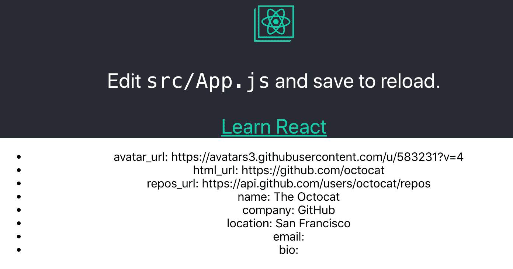
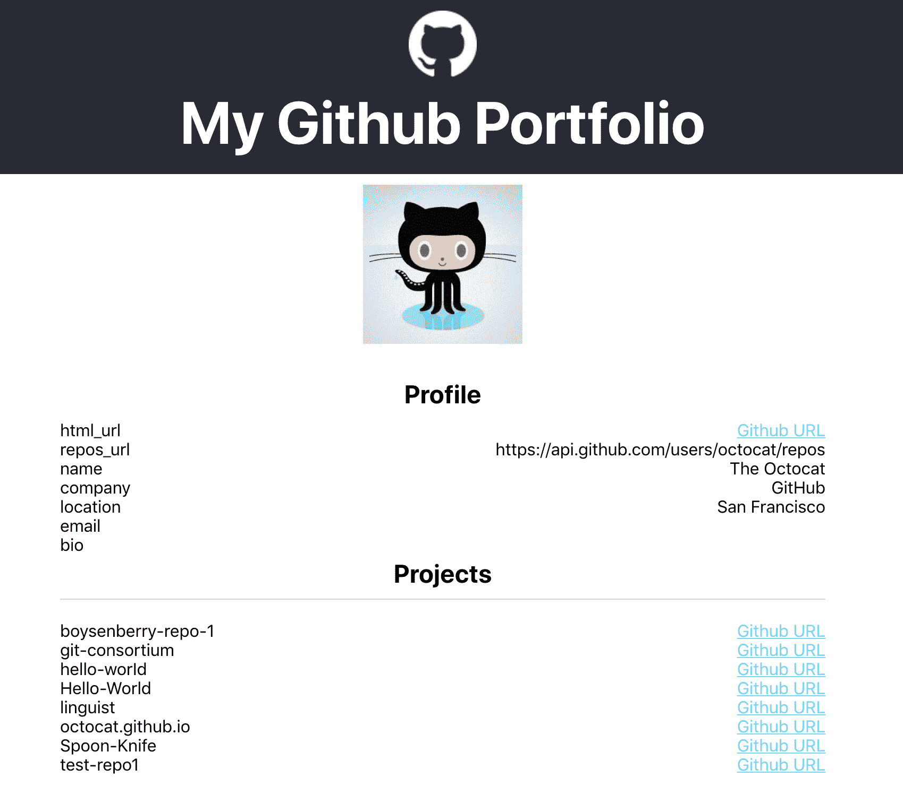

# 使用可重用的 React 组件创建渐进式 Web 应用程序

完成第一章后，您是否已经熟悉 React 的核心概念？伟大的这一章对你来说没有问题！如果没有，请不要担心–您在上一章中遇到的大多数概念都将重复。但是，如果您想获得更多关于 webpack 和 Babel 的经验，建议您尝试在[第 1 章](01.html)中创建项目，*在 React*中创建电影列表应用程序，因为本章不会涉及这些主题。

在本章中，您将使用 Create React 应用程序，这是一个入门工具包（由 React 核心团队创建，让您快速开始使用 React），可以用作**渐进式 Web 应用程序**（**PWA**）——一个行为类似于移动应用程序的 Web 应用程序。这将使模块绑定器和编译器（如 webpack 和 Babel）的配置变得不必要，因为这将在 Create React 应用程序包中处理。这意味着您可以将您的 GitHub portfolio 应用程序构建为一个 PWA，它可以重用 React 组件和样式。

除了设置 Create React 应用程序外，本章还将介绍以下主题：

*   创建渐进式 Web 应用程序
*   构建可重用的 React 组件
*   与`styled-components`反应的样式

迫不及待？让我们继续！

# 项目概述

在本章中，我们将使用 create React App 和`styled-components`创建一个 PWA，该 PWA 具有可重用的 React 组件和样式。应用程序将使用从公共 GitHub API 获取的数据。

构建时间为 1.5-2 小时。

# 开始

您将在本章中创建的项目将使用 GitHub 的公共 API，您可以在[中找到该 APIhttps://developer.github.com/v3/](https://developer.github.com/v3/) 。为了能够使用此 API，您需要有一个 GitHub 帐户，因为您需要从 GitHub 用户帐户检索信息。如果您还没有 GitHub 帐户，您可以通过在其网站上注册来创建一个。此外，您需要从此处下载 GitHub 徽标包：[https://github-media-downloads.s3.amazonaws.com/GitHub-Mark.zip](https://github-media-downloads.s3.amazonaws.com/GitHub-Mark.zip) 。此应用程序的完整源代码也可以在 GitHub 上找到：[https://github.com/PacktPublishing/React-Projects/tree/ch2](https://github.com/PacktPublishing/React-Projects/tree/ch2) 。

# GitHub 组合应用程序

在本节中，我们将学习如何使用 create React App 创建一个新的 React 项目，并将其设置为一个 PWA，该 PWA 使用`styled-components`重用 React 组件和样式。

# 使用 Create React 应用程序创建 PWA

每次我们创建一个新的 React 项目时都必须配置 webpack 和 Babel，这可能非常耗时。此外，每个项目的设置都可能发生变化，当我们想向项目中添加新功能时，很难管理所有这些配置。

因此，React 核心团队推出了名为 Create React App 的入门工具包，并于 2018 年发布了其稳定版本 2.0。通过使用 createreact 应用程序，我们不必再担心管理编译和构建配置，即使在 React 的较新版本发布时也是如此，这意味着我们可以专注于编码而不是配置。此外，它还具有我们可以用来轻松创建 PWA 的功能。

PWA 通常比常规 web 应用程序更快、更可靠，因为它侧重于离线/缓存优先的方法。这使得用户在没有连接或连接速度慢的情况下仍然可以打开我们的应用程序，因为它专注于缓存。此外，用户还可以将我们的应用程序添加到智能手机或平板电脑的主屏幕，并像本地应用程序一样打开它。

本节将向我们展示如何使用 PWA 功能创建 React 应用程序，首先使用 create React App 设置新应用程序。

# 安装 CreateReact 应用程序

Create React App 可以使用命令行安装，我们应该在命令行中全局安装，以便该软件包在本地计算机上的任何位置都可用，而不仅仅是在特定项目中：

```jsx
npm install -g create-react-app
```

既然`create-react-app`软件包已经安装，我们就准备创建我们的第一个 CreateReact 应用程序项目。建立一个新项目有多种方法，但由于我们已经熟悉了`npm`，我们只需要了解两种方法。让我们开始：

1.  第一种方法是通过运行以下命令，使用`npm`创建一个新项目：

```jsx
npm init react-app github-portfolio
```

您可以将`github-portfolio`替换为您希望用于此项目的任何其他名称。

2.  或者，我们可以使用`npx`，这是一个与`npm`（v5.2.0 或更高版本）一起预装的工具，简化了我们执行`npm`包的方式：

```jsx
npx create-react-app github-portfolio
```

这两种方法都将启动 Create React 应用程序的安装过程，这可能需要几分钟，具体取决于您的硬件。尽管我们只执行一个命令，但 createreact 应用程序的安装程序将安装运行 React 应用程序所需的软件包。因此，它将安装`react`、`react-dom`和`react-scripts`，其中最后一个包包括编译、运行和构建 React 应用程序的所有配置。

如果我们移动到以项目名称命名的项目根目录，我们将看到它具有以下结构：

```jsx
github-portfolio
|-- node_modules
|-- public
    |-- favicon.ico
    |-- index.html
    |-- manifest.json
|-- src
    |-- App.css
    |-- App.js
    |-- App.test.js
    |-- index.css
    |-- index.js
    |-- logo.svg
    |-- serviceWorker.js
.gitignore
package.json
```

这个结构看起来很像我们在第一章中建立的结构，尽管有一些细微的差别。`public`目录包含编译和构建过程中不应该包含的所有文件，该目录中的文件是`index.html`文件中唯一可以直接使用的文件。`manifest.json`文件包含 PWA 的默认配置，这是我们将在本章后面了解的内容。

在另一个名为`src`的目录中，我们将找到在执行`package.json`文件中的任何脚本时将编译和构建的所有文件。有一个名为`App`的组件，由`App.js`、`App.test.js`和`App.css`文件定义，还有一个名为`index.js`的文件，它是 Create React App 的入口点。`serviceWorker.js`文件是建立 PWA 所必需的，也是本节下一部分将讨论的内容。

如果我们打开`package.json`文件，我们会看到已经定义了三个脚本：`start`、`build`和`test`。由于目前还没有处理测试，我们现在可以忽略这个脚本。为了能够在浏览器中打开项目，我们只需在命令行中键入以下命令，该命令行在开发模式下运行`package react-scripts`：

```jsx
npm start
```

如果我们访问`http://localhost:3000/`，默认的 Create React 应用程序页面如下所示：


由于`react-scripts`默认支持热重新加载，因此我们对代码所做的任何更改都将导致页面重新加载。如果我们运行构建脚本，将在项目的根目录中创建一个名为`build`的新目录，在那里可以找到应用程序的缩小包。

创建 React 应用程序的基本安装就绪后，本节的下一部分将向我们展示如何启用将此应用程序转变为 PWA 的功能。

# 创建 PWA

CreateReact 应用程序附带了一个支持 PWA 的配置，该配置在我们启动构建脚本时生成。我们可以通过访问`src/index.js`文件并更改最后一行，将我们的 Create React App 项目设置为 PWA，这将注册`serviceWorker`：

```jsx
import React from 'react';
import ReactDOM from 'react-dom';
import './index.css';
import App from './App';
import * as serviceWorker from './serviceWorker';

ReactDOM.render(<App />, document.getElementById('root'));

// If you want your app to work offline and load faster, you can change
// unregister() to register() below. Note this comes with some pitfalls.
// Learn more about service workers: http://bit.ly/CRA-PWA
- //serviceWorker.register();
+ serviceWorker.register();
```

现在，当我们运行构建脚本时，应用程序的缩小包将使用离线/缓存优先的方法。在引擎盖下，`react-scripts`使用一个名为`workbox-webpack-plugin`的包，它与 Webpack4 一起作为 PWA 服务于我们的应用程序。它不仅缓存放置在`public`目录中的本地资产；它还缓存导航请求，以便我们的应用程序在不稳定的移动网络上运行更可靠。

在使用 Create-React-App 设置 PWA 时起作用的另一个文件是`manifest.json`。我们的 PWA 的大部分配置都放在这里，如果我们打开`public/manifest.json`文件，就可以看到。在这个 JSON 配置文件中，我们将找到操作系统和浏览器最重要的部分。让我们来分析一下：

1.  此文件包含`short_name`和`name`字段，用于描述如何向用户标识我们的应用程序：

```jsx
{
  "short_name": "React App",
  "name": "Create React App Sample",

...
```

`short_name`字段不得超过 12 个字符，并将显示在用户主屏幕上的应用程序图标下方。对于`name`字段，我们最多可以使用 45 个字符。这是应用程序的主要标识符，在将应用程序添加到主屏幕的过程中可以看到。

2.  当用户将我们的应用程序添加到主屏幕时，可以在`icons`字段中配置哪些特定图标：

```jsx
  "icons": [
    {
      "src": "favicon.ico",
      "sizes": "64x64 32x32 24x24 16x16",
      "type": "image/x-icon"
    }
  ],
```

如您所见，`favicon.ico`文件被用作唯一的图标，并以`image/x-icon`格式提供多种大小的文件。如前所述，`index.html`的相同规则适用于`manifest.json`。只能从此文件中引用放置在公用目录中的文件。

3.  最后，使用`theme_color`和`background_color`字段，我们可以在移动设备上从主屏幕打开应用程序时设置顶部栏的颜色（十六进制格式）：

```jsx
  ...
  "theme_color": "#000000",
  "background_color": "#ffffff"
}
```

不显示带有 URL 框的默认工具栏；相反，会显示一个顶部栏。此行为类似于本机移动应用程序。

Another thing we can handle with this configuration file is internalization, which is useful when our application serves content in different languages. We can also add versioning to this file if there are multiple versions of our application in production.

我们在这里所做的更改配置了应用程序，使其可以作为 PWA 使用，但目前还不能向用户提供这些功能。在本节的下一部分中，我们将学习如何提供此 PWA 并使其在浏览器中可见。

# 为工务局服务

随着 PWA 的配置就位，现在是时候看看这将如何影响应用程序了。如果您仍在运行 Create React 应用程序（如果没有，请再次执行`npm start`命令），请访问位于`http://localhost:3000/`的项目。我们将看到什么都没有改变。正如我们前面提到的，PWA 只有在应用程序的构建版本打开时才可见。为此，请在项目的根目录中执行以下命令：

```jsx
npm run build 
```

这将启动构建过程，将我们的应用程序缩小为存储在`build`目录中的包。我们的应用程序的这个构建版本可以从我们的本地机器提供服务。如果我们在命令行上查看构建过程的输出，我们将看到 Create-React 应用程序建议了我们应该如何为这个构建版本提供服务：

```jsx
npm install -g serve
serve -s build
```

`npm install`命令安装`serve`包，该包用于为构建的静态站点或 JavaScript 应用程序提供服务。安装此软件包后，我们可以使用它在我们的服务器或本地计算机上部署`build`目录，方法是运行以下程序：

```jsx
serve -s build
```

The `-s` flag is used to redirect any navigation requests that aren't found back to our `index.js` file.

如果我们在`http://localhost:5000/`浏览器中访问我们的项目，我们将看到所有内容都与我们在`http://localhost:3000/`上运行的版本一模一样。然而，有一个很大的区别：构建版本作为 PWA 运行。这意味着，如果我们的互联网连接失败，应用程序仍将显示。我们可以通过断开 internet 连接或从命令行停止`serve`包来尝试这一点。如果我们在`http://localhost:5000/`上刷新浏览器，我们将看到完全相同的应用程序

这是怎么回事？如果我们在浏览器（Chrome 或 Firefox）中打开开发者工具并访问应用程序选项卡，我们将在侧边栏中看到项目。我们应该先开的那家叫做服务工人。如果使用 Chrome 作为浏览器，结果将类似于以下屏幕截图所示：


如果单击 Service Worker 侧栏项，我们将看到正在运行的所有 Service Worker 的列表。对于`localhost`，有一名现役军人将`service-worker.js`作为其源文件——与我们项目中的文件相同。此文件确保在没有 internet 连接或 internet 连接速度较慢时提供应用程序的缓存版本。

The service worker shouldn't be active when we have a local instance of our application running with `npm start`. Since the service worker will cache our application, we won't be able to see any of the changes that we've made since the cached version will be a server.

这些缓存文件存储在浏览器缓存中，也可以在此工具栏的“缓存存储”下找到。在这里，我们可能会看到多个缓存位置，它们是在构建应用程序时由`workbox-webpack-plugin`包创建的。

与服务于我们的应用程序相关的一个被称为`workbox-precache-v2-http://localhost:5000/`，由我们的应用程序的所有缓存文件组成：


在前面的屏幕截图中，我们可以看到浏览器正在为我们的应用程序缓存哪些文件，`index.html`文件是应用程序的入口点，以`static/`开头的文件是在构建过程中创建的，代表我们应用程序的缩小包。如我们所见，它由小型化的`.js`、`.css`和`.svg`文件组成，这些文件存储在浏览器缓存中。每次用户加载我们的应用程序时，它都会先尝试提供这些文件，然后再寻找 internet 连接。

随着我们第一个 PWA 的创建和 Create React 应用程序的就位，我们将开始考虑为我们的项目创建组件并对其进行样式化。

# 构建可重用的 React 组件

上一章简要讨论了使用 JSX 创建 React 组件，但在本章中，我们将通过创建可以在整个应用程序中重用的组件来进一步探讨此主题。首先，让我们看看如何构造我们的应用程序，它建立在前一章的内容之上。

# 构建我们的应用程序

首先，我们需要以与第一章相同的方式构造应用程序。这意味着我们需要在`src`目录中创建两个名为`components`和`containers`的新目录。`App`组件的文件可以移动到`container`目录，并且`App.test.js`文件可以删除，因为测试尚未涉及。

创建目录并移动文件后，我们的应用程序结构如下所示：

```jsx
github-portfolio
|-- node_modules
|-- public
    |-- favicon.ico
    |-- index.html
    |-- manifest.json
|-- src
 |-- components
 |-- containers
 |-- App.css
 |-- App.js
    |-- index.css
    |-- index.js
    |-- serviceWorker.js
.gitignore
package.json
```

不要忘记更改`src/index.js`中`App`组件的导入位置：

```jsx
import React from 'react';
import ReactDOM from 'react-dom';
import './index.css';
- import App from './App';
+ import App from './containers/App';
import * as serviceWorker from './serviceWorker';

ReactDOM.render(<App />, document.getElementById('root'));

...
```

对`src/containers/App.js`中的 React`logo`位置执行相同操作：

```jsx
import React, { Component } from 'react';
- import logo from './logo.svg';
+ import logo from '../logo.svg';
import './App.css';

class App extends Component {

...
```

如果我们再次运行`npm start`并在浏览器中访问该项目，将不会有可见的更改，因为我们只更改了该项目的结构，而没有更改其内容

我们的项目仍然只包含一个组件，这使得它不能很好地重用。下一步是将我们的`App`组件也划分为`Components`。如果我们在`App.js`中查看该组件的源代码，我们将看到返回函数中已经有一个 CSS`header`元素。让我们将`header`元素更改为 React 组件：

1.  首先，在`components`目录中创建一个名为`Header`的新目录，并将`classNames`、`App-header`、`App-logo`和`App-link`的样式复制到一个名为`Header.css`的新文件中：

```jsx
.App-logo {
  height: 40vmin;
  pointer-events: none;
}

.App-header {
  background-color: #282c34;
  display: flex;
  flex-direction: column;
  align-items: center;
  justify-content: center;
  font-size: calc(10px + 2vmin);
  color: white;
}

.App-link {
  color: #61dafb;
}

@keyframes App-logo-spin {
  from {
    transform: rotate(0deg);
  }
  to {
    transform: rotate(360deg);
  }
}
```

2.  现在，在这个目录中创建一个名为`Header.js`的文件。此文件应返回与`<header>`元素相同的内容：

```jsx
import React from 'react';
import './Header.css';

const Header = () => (
 <header className='App-header'>
     
     <p>
       Edit <code>src/App.js</code> and save to reload.
     </p>
     <a
       className='App-link'
       href='https://reactjs.org'
       target='_blank'
       rel='noopener noreferrer'
     >
       Learn React
     </a>
 </header>
);

export default Header;
```

3.  将此`Header`组件导入您的`App`组件中，并将其添加到`return`函数中：

```jsx
import React, { Component } from 'react';
+ import Header from '../components/App/Header';
import logo from '../logo.svg';
import './App.css';

class App extends Component {
 render() {
   return (
     <div className='App'>
-      <header className='App-header'>
-        
-        <p>Edit <code>src/App.js</code> and save to reload.</p>
-        <a
-          className='App-link'
-          href='https://reactjs.org'
-          target='_blank'
-          rel='noopener noreferrer'
-        >
-          Learn React
-        </a>
-      </header>
+      <Header />
     </div>
   );
 }
}

export default App;
```

当我们再次在浏览器中访问我们的项目时，我们将看到一个错误，表示徽标的值未定义。这是因为新的`Header`组件无法达到`App`组件中定义的`logo`常量。从第一章中我们了解到，这个 logo 常量应该作为道具添加到`Header`组件中，以便显示。现在让我们这样做：

1.  将`logo`常数作为道具发送到`src/container/App.js`中的`Header`组件：

```jsx
...
class App extends Component {
 render() {
   return (
     <div className='App'>
-      <Header />
+      <Header logo={logo} />
     </div>
   );
 }
}

export default App;
```

2.  获取`logo`道具，以便`img`元素可以将其用作`src/components/App/Header.js`中的`src`属性：

```jsx
import React from 'react';

- const Header = () => (
+ const Header = ({ logo }) => (
 <header className='App-header'>
   

   ...
```

In the previous chapter, the use of the `prop-types` package was demonstrated but this is something that isn't used in this chapter. If you'd like to use `prop-types` in this chapter as well, you can install the package from `npm` using `npm install prop-types` and import it inside the files where you want to use it.

在这里，当我们在浏览器中打开项目时，将看不到任何可见的更改。但是如果我们打开 React 开发者工具，我们将看到项目现在分为`App`组件和`Header`组件。此组件以`.svg`文件的形式接收`logo`道具，如以下屏幕截图所示：


`Header`组件仍然被划分为多个元素，这些元素可以划分为单独的组件。看看`img`和`p`元素，它们看起来已经很简单了。但是，`a`元素看起来更复杂，在中使用了`url`、`title`、`className`等属性。要将此`a`元素更改为可重用的组件，需要将其移动到项目中的其他位置。

为此，在`components`目录中创建一个名为`Link`的新目录。在此目录中，创建一个名为`Link.js`的新文件。这个文件应该返回我们在`Header`组件中已经得到的相同`a`元素。此外，我们还可以将`url`和`title`作为道具发送到此组件。现在让我们这样做：

1.  从`src/components/Header/Header.css`中删除`App-link`类的样式，并将其放入名为`Link.css`的文件中：

```jsx
.App-link {
    color: #61dafb;
}
```

2.  创建一个名为`Link`的新组件，该组件使用`url`和`title`道具。此组件将这些道具作为属性添加到`src/components/Link/Link.js`中的`<a>`元素中：

```jsx
import React from 'react';
import './Link.css';

const Link = ({ url, title }) => (
  <a
    className='App-link'
    href={url}
    target='_blank'
    rel='noopener noreferrer'
  >
    {title}
  </a>
);

export default Link;
```

3.  导入此`Link`组件并将其放置在`src/components/Header/Header.js`中的`Header`组件内：

```jsx
import React from 'react';
+ import Link from '../Link/Link';

const Header = ({ logo }) => (
 <header className='App-header'>
   
   <p>Edit <code>src/App.js</code> and save to reload.</p>
-  <a
-    className='App-link'
-    href='https://reactjs.org'
-    target='_blank'
-    rel='noopener noreferrer'
-  >
-    Learn React
-  </a>
+  <Link url='https://reactjs.org' title='Learn React' />
 </header>
);

export default Header;
```

我们的代码现在应该如下所示，这意味着我们已经成功地将目录拆分为`containers`和`components`，其中组件被放置在以组件命名的单独子目录中：

```jsx
github-portfolio
|-- node_modules
|-- public
    |-- favicon.ico
    |-- index.html
    |-- manifest.json
|-- src
    |-- components
        |-- Header
            |-- Header.js
            |-- Header.css
        |-- Link
            |-- Link.js
            |-- Link.css
    |-- containers
        |-- App.css
        |-- App.js
    |-- index.css
    |-- index.js
    |-- serviceWorker.js
.gitignore
package.json
```

但是，如果我们在浏览器中查看项目，则不存在可见的更改。然而，在 React 开发者工具中，我们的应用程序的结构已经形成。`App`组件在组件树中显示为父组件，`Header`组件为子组件，子组件的`Link`为子组件。

在本节的下一部分中，我们将向该应用程序的组件树中添加更多组件，并使这些组件在整个应用程序中可重用。

# 在 React 中重用组件

我们在本章中构建的项目是一个 GitHub 投资组合页面；它将显示我们的公共信息和公共存储库列表。因此，我们需要获取官方的 GitHub REST API（v3）并从两个端点获取信息。获取数据是我们在第一章中所做的事情，但这一次，信息不会来自本地 JSON 文件。检索信息的方法几乎相同。我们将使用 fetchapi 来实现这一点。

我们可以通过执行以下命令从 GitHub 检索公共 GitHub 信息。将代码粗体部分末尾的`username`替换为您自己的`username`：

```jsx
curl 'https://api.github.com/users/username'
```

If you don't have a GitHub profile or haven't filled out all the necessary information, you can also use the `octocat` username. This is the username of the GitHub `mascotte` and is already filled with sample data.

此请求将返回以下输出：

```jsx
{
  "login": "octocat",
  "id": 1,
  "node_id": "MDQ6VXNlcjE=",
  "avatar_url": "https://github.cimg/error/octocat_happy.gif",
  "gravatar_id": "",
  "url": "https://api.github.com/users/octocat",
  "html_url": "https://github.com/octocat",
  "followers_url": "https://api.github.com/users/octocat/followers",
  "following_url": "https://api.github.com/users/octocat/following{/other_user}",
  "gists_url": "https://api.github.com/users/octocat/gists{/gist_id}",
  "starred_url": "https://api.github.com/users/octocat/starred{/owner}{/repo}",
  "subscriptions_url": "https://api.github.com/users/octocat/subscriptions",
  "organizations_url": "https://api.github.com/users/octocat/orgs",
  "repos_url": "https://api.github.com/users/octocat/repos",
  "events_url": "https://api.github.com/users/octocat/events{/privacy}",
  "received_events_url": "https://api.github.com/users/octocat/received_events",
  "type": "User",
  "site_admin": false,
  "name": "monalisa octocat",
  "company": "GitHub",
  "blog": "https://github.com/blog",
  "location": "San Francisco",
  "email": "octocat@github.com",
  "hireable": false,
  "bio": "There once was...",
  "public_repos": 2,
  "public_gists": 1,
  "followers": 20,
  "following": 0,
  "created_at": "2008-01-14T04:33:35Z",
  "updated_at": "2008-01-14T04:33:35Z"
}
```

JSON 输出中的多个字段突出显示，因为这些字段是我们将在应用程序中使用的字段。它们是`avatar_url`、`html_url`、`repos_url`、`name`、`company`、`location`、`email`和`bio`，其中`repos_url`字段的值实际上是另一个 API 端点，我们需要调用它来检索该用户的所有存储库。这是我们将在本章后面做的事情。

由于我们希望在应用程序中显示此结果，因此需要执行以下操作：

1.  要从 GitHub 检索此公共信息，请创建一个名为`Profile`的新容器，并将以下代码添加到`src/containers/Profile.js`：

```jsx
import React, { Component } from 'react';

class Profile extends Component {
  constructor() {
    super();
    this.state = {
      data: {},
      loading: true,
    }
  }

  async componentDidMount() {
    const profile = await fetch('https://api.github.com/users/octocat');
    const profileJSON = await profile.json();

    if (profileJSON) {
      this.setState({
        data: profileJSON,
        loading: false,
      })
    }
  }

  render() {
    return (
      <div></div>
    );
  }
}

export default Profile;
```

这个新组件包含一个`constructor`，其中设置了`state`的初始值，并且异步使用的`componentDidMount`生命周期方法在获取的 API 返回结果时为`state`设置了一个新值。由于我们仍然需要创建新的组件来显示数据，因此尚未呈现任何结果。

现在，将这个新组件导入到`App`组件中：

```jsx
import React, { Component } from 'react';
+ import Profile from './Profile';
import Header from '../components/Header/Header';
import logo from '../logo.svg';
import './App.css';

class App extends Component {
  render() {
    return (
      <div className='App'>
        <Header logo={logo} />
+       <Profile />
      </div>
    );
  }
}

export default App;
```

2.  快速浏览一下我们项目运行的浏览器，就会发现这个新的`Profile`组件还不可见。这是因为`Header.css`文件有一个`height`属性，其`view-height`为`100`，这意味着该组件将占据页面的整个高度。要更改此设置，请打开`scr/components/App/Header.css`文件并更改以下突出显示的行：

```jsx
.App-logo {
- height: 40vmin;
+ height: 64px;
  pointer-events: none;
}

.App-header {
  background-color: #282c34;
- min-height: 100vh;
+ height: 100%;
  display: flex;
  flex-direction: column;
  align-items: center;
  justify-content: center;
  font-size: calc(10px + 2vmin);
  color: white;
}

...
```

3.  我们的页面上应该有足够的可用空间来显示`Profile`组件，这样我们可以再次打开`scr/containers/Profile.js`文件，并显示 Github API 返回的`avatar_url`、`html_url`、`repos_url`、`name`、`company`、`location`、`email`和`bio`字段：

```jsx
...

render() {
+   const { data, loading } = this.state;

+   if (loading) {
+       return <div>Loading...</div>;
+   }

    return (
      <div>
+       <ul>
+         <li>avatar_url: {data.avatar_url}</li>
+         <li>html_url: {data.html_url}</li>
+         <li>repos_url: {data.repos_url}</li>
+         <li>name: {data.name}</li>
+         <li>company: {data.company}</li>
+         <li>location: {data.location}</li>
+         <li>email: {data.email}</li>
+         <li>bio: {data.bio}</li>
+       </ul>
      </div>
    );
  }
}

export default Profile;
```

保存此文件并在浏览器中访问项目后，我们将看到显示的 GitHub 信息的项目符号列表，如以下屏幕截图所示：



由于这看起来不太美观，并且页眉与页面内容不匹配，让我们对这两个组件的`styling`文件进行一些更改：

1.  更改`Header`组件的代码，移除 React 徽标，并将其替换为 GitHub 徽标。我们不再需要将`logo`作为`App`组件的道具。此外，`Link`组件可以从此处删除，因为我们稍后将在`Profile`组件中使用它：

```jsx
import React from 'react';
- import logo from '../logo.svg';
+ import logo from '../../GitHub-Mark-Light-64px.png';
- import Link from '../components/Link';
import './Header.css';

- const Header = ({ logo }) => (
+ const Header = () => (
  <header className='App-header'>
    
-   <p>
+   <h1>
-     Edit <code>src/App.js</code> and save to reload.
+     My Github Portfolio
-   </p>
+   </h1> -   <Link url='https://reactjs.org' title='Learn React' />
  </header>
);

export default Header;
```

2.  更改`scr/containers/Profile.js`中突出显示的行，我们将从项目符号列表中分离化身图像，并在字段名称周围添加`strong`元素。还记得我们之前创建的`Link`组件吗？这将用于在 GitHub 网站上创建指向我们个人资料的链接：

```jsx
import React, { Component } from 'react';
+ import Link from '../components/Link/Link';
+ import './Profile.css';

class Profile extends Component {

  ...

      return (
-       <div>
+       <div className='Profile-container'>
+         
-         <ul>
-           ...
-         </ul>
+         <ul>
+           <li><strong>html_url:</strong> <Link url={data.html_url} title='Github URL' /></li>
+           <li><strong>repos_url:</strong> {data.repos_url}</li>
+           <li><strong>name:</strong> {data.name}</li>
+           <li><strong>company:</strong> {data.company}</li>
+           <li><strong>location:</strong> {data.location}</li>
+           <li><strong>email:</strong> {data.email}</li>
+           <li><strong>bio:</strong> {data.bio}</li>
+         </ul>
+      </div>
    );
  }
}

export default Profile;
```

3.  不要忘记创建`src/containers/Profile.css`文件并将以下代码粘贴到其中。这定义了`Profile`组件的样式：

```jsx
.Profile-container {
  width: 50%;
  margin: 10px auto;
}

.Profile-avatar {
  width: 150px;
}

.Profile-container > ul {
 list-style: none;
 padding: 0;
 text-align: left;
}

.Profile-container > ul > li {
 display: flex;
 justify-content: space-between;
}
```

最后，我们可以看到应用程序开始看起来像一个 GitHub 公文包页面，标题显示 GitHub 徽标图标和标题，然后是我们的 GitHub 头像和公共信息列表。这将产生一个与以下屏幕截图所示类似的应用程序：


如果我们看一下`Profile`组件中的代码，我们会发现有很多重复的代码，因此我们需要将显示公共信息的列表转换为单独的组件。让我们开始：

1.  在新的`src/components/List`目录中创建一个名为`List.js`的新文件：

```jsx
import React from 'react';

const List = () => (
  <ul></ul>
);

export default List;
```

2.  在`src/containers/Profile.js`文件中可以找到的`Profile`组件中，我们可以导入这个新的`List`组件，构建一个新的数组，其中包含我们希望在该列表中显示的所有项目，并将其作为道具发送。对于`html_url`字段，我们将以值的形式发送`Link`组件，而不是从 GitHub API 返回的值：

```jsx
import React, { Component } from 'react';
import Link from '../components/Link/Link';
+ import List from '../components/List/List';

class Profile extends Component {

...

render() {
  const { data, loading } = this.state;

  if (loading) {
    return <div>Loading...</div>;
  }

+ const items = [
+   { label: 'html_url', value: <Link url={data.html_url} title='Github URL' /> },
+   { label: 'repos_url', value: data.repos_url },
+   { label: 'name', value: data.name},
+   { label: 'company', value: data.company },
+   { label: 'location', value: data.location },
+   { label: 'email', value: data.email },
+   { label: 'bio', value: data.bio }
+ ]

  return (
    <div className='Profile-container'>
      
-     <ul>
-       <li><strong>html_url:</strong> <Link url={data.html_url} title='Github URL' /></li>
-       <li><strong>repos_url:</strong> {data.repos_url}</li>
-       <li><strong>name:</strong> {data.name}</li>
-       <li><strong>company:</strong> {data.company}</li>
-       <li><strong>location:</strong> {data.location}</li>
-       <li><strong>email:</strong> {data.email}</li>
-       <li><strong>bio:</strong> {data.bio}</li>
-     </ul>
+     <List items={items} />
    </div>
   );
  }
}

export default Profile;
```

3.  在`List`组件中，我们现在可以映射`items`道具并返回带有样式的列表项：

```jsx
import React from 'react';

- const List = () => (
+ const List = ({ items }) => (
  <ul>
+   {items.map(item =>
+     <li key={item.label}>
+       <strong>{item.label}</strong>{item.value}
+     </li>
+   )}
  </ul>
);

export default List;
```

假设我们正确地执行了前面的步骤，您的应用程序不应该在美观上发生更改。但是，如果我们看看 React Developer 工具，就会看到对组件树进行了一些更改。

在下一节中，我们将使用`styled-components`而不是 CSS 来设置这些组件的样式，并添加链接到 GitHub 帐户的存储库。

# 中的样式与样式化组件进行反应

到目前为止，我们一直在使用 CSS 文件向 React 组件添加样式。然而，这迫使我们跨不同的组件导入这些文件，这使得代码的可重用性降低。因此，我们将向项目中添加`styled-components`包，它允许我们在 JavaScript 中编写 CSS（JS 中的所谓**CSS）并创建组件。**

通过这样做，我们将从组件的样式设计中获得更大的灵活性，能够防止由于`classNames`而导致的样式重复或重叠，并且我们将轻松地为组件添加动态样式。所有这些都可以使用我们用于 CSS 的相同语法来完成，就在我们的 React 组件中。

第一步是使用`npm`安装`styled-components`：

```jsx
npm install styled-components
```

If you look at the official documentation of `styled-components`, you will notice that they strongly advise you to use the Babel plugin for this package as well. But since you're using Create React App to initialize your project, you don't need to add this plugin as all the compilation your application needs has already been taken care of by `react-scripts`.

安装`styled-components`后，让我们尝试从我们的一个组件中删除 CSS 文件。`Link`组件是一个良好的开端，因为这是一个功能有限的非常小的组件：

1.  首先导入`styled-components`包并创建一个名为`InnerLink`的新样式组件。此组件扩展了一个`a`元素，并采用我们已经为`className``App-link`获取的 CSS 规则：

```jsx
import React from 'react';
+ import styled from 'styled-components'; import './Link.css';

+ const InnerLink = styled.a`
+  color: #61dafb;
+ `;

const Link = ({ url, title }) => (
  <a className='App-link'
    href={url}
    target='_blank'
    rel='noopener noreferrer'
  >
    {title}
  </a>
);

export default Link;
```

2.  一旦我们添加了这个组件，我们就可以用这个样式化的组件替换现有的`<a>`元素。此外，我们不再需要导入`Link.css`文件，因为所有样式现在都在这个 JavaScript 文件中完成：

```jsx
import React from 'react';
import styled from 'styled-components';
- import './Link.css';

const InnerLink = styled.a`
 color: #61dafb;
`;

const Link = ({ url, title }) => (
- <a className='App-link'
+ <InnerLink
    href={url}
    target='_blank'
    rel='noopener noreferrer'
  >
    {title}
- </a>
+ </InnerLink>
);

export default Link;
```

如果我们在再次运行`npm start`之后在浏览器中访问我们的项目，我们将看到我们的应用程序在删除 CSS 文件后仍然看起来一样。下一步是替换导入 CSS 文件以进行样式设置的所有其他组件：

1.  添加`styled-components`并删除`src/components/Header/Header.js`中`Header`组件的 CSS 文件：

```jsx
import React from 'react';
+ import styled from 'styled-components';
import logo from '../../GitHub-Mark-Light-64px.png';
- import './Header.css'

+ const HeaderWrapper = styled.div`
+  background-color: #282c34;
+  height: 100%;
+  display: flex;
+  flex-direction: column;
+  align-items: center;
+  justify-content: center;
+  font-size: calc(10px + 2vmin);
+  color: white;
+ `;

+ const Logo = styled.img`
+  height: 64px;
+  pointer-events: none;
+ `;

const Header = ({ logo }) => (
- <header className='App-header'>
+ <HeaderWrapper>
    <Logo src={logo} alt='logo' />
    <h1>My Github Portfolio</h1>
- </header>
+ </HeaderWrapper>
);

export default Header;
```

2.  添加`styled-components`并删除`src/containers/App.js`中`App`组件的 CSS 文件：

```jsx
import React, { Component } from 'react';
+ import styled from 'styled-components';
import Profile from './Profile';
import Header from '../components/App/Header';
- import './App.css'; 
+ const AppWrapper = styled.div`
+  text-align: center;
+ `;

class App extends Component {
 render() {
   return (
-    <div className="App">
+    <AppWrapper>
       <Header />
       <Profile />
-    </div>
+    </AppWrapper>
   );
  }
}

export default App;
```

3.  为`List`组件中的`ul`、`li`和`strong`元素添加一些样式化组件：

```jsx
import React from 'react';
+ import styled from 'styled-components';

+ const ListWrapper = styled.ul`
+  list-style: none;
+  text-align: left;
+  padding: 0;
+ `;

+ const ListItem = styled.li`
+  display: flex;
+  justify-content: space-between;
+ `;

+ const Label = styled.span`
+  font-weight: strong;
+ `;

const List = ({ items }) => (
- <ul>
+ <ListWrapper>
    {items.map(item =>
-     <li key={item.label}>
+     <ListItem key={item.label}>
-       <strong>{item.label}</strong>{item.value}
+       <Label>{item.label}</Label>{item.value}
-     </li>
+     </ListItem>
    )}
-  </ul>
+  </ListWrapper>
);

export default List;
```

4.  最后，通过将带有`classNames`的最后两个元素转换为样式化组件，从`Profile`组件中删除`Profile.css`文件：

```jsx
import React, { Component } from 'react';
+ import styled from 'styled-components';
import Link from '../components/Link/Link';
import List from '../components/List/List';
- import './Profile.css';

+ const ProfileWrapper = styled.div`
+  width: 50%;
+  margin: 10px auto;
+ `;

+ const Avatar = styled.img`
+  width: 150px;
+ `;

class Profile extends Component {

...

  return (
-   <div className='Profile-container'>
+   <ProfileWrapper>
-     
+     <Avatar src={data.avatar_url} alt='avatar' />
 <List items={items} />
-   </div>
+   </ProfileWrapper>
  );
 }
}

export default Profile;
```

现在，再次在浏览器中打开项目；我们的应用程序看起来应该还是一样的。我们的所有组件都已转换，因此它们使用`styled-components`，不再使用 CSS 文件和`classNames`进行样式设置。不要忘记删除`containers`和`components`目录和子目录中的`.css`文件。

但是，项目中仍然有一个 CSS 文件直接位于`src`目录中。此 CSS 文件包含`<body>`元素的样式，该元素存在于`public/index.html`文件中，并已导入`src/index.js`文件。为了删除这个 CSS 文件，我们可以使用`styled-components`中的`createGlobalStyle`函数将`<body>`元素的样式添加到我们的应用程序中

我们可以在`App`组件中为全局样式创建一个样式化组件，并在其中粘贴`body`元素的 CSS 样式。由于该组件在组件树中应该与我们的`AppWrapper`组件处于相同的层次结构，我们需要使用**React Fragments**，因为 JSX 组件应该包装在一个封闭的标记中：

```jsx
import React, { Component } from 'react';
- import styled from 'styled-components';
+ import styled, { createGlobalStyle } from 'styled-components';
import Profile from './Profile';
import Header from '../components/App/Header';

+ const GlobalStyle = createGlobalStyle`
+  body {
+    margin: 0;
+    padding: 0;
+    font-family: -apple-system, BlinkMacSystemFont, "Segoe UI", "Roboto", "Oxygen",
+    "Ubuntu", "Cantarell", "Fira Sans", "Droid Sans", "Helvetica Neue",
+    sans-serif;
+    -webkit-font-smoothing: antialiased;
+    -moz-osx-font-smoothing: grayscale;
+  }
+ `;

...

class App extends Component {
 render() {
   return (
+   <> 
+    <GlobalStyle />
     <AppWrapper>
       <Header />
       <Profile />
     </AppWrapper>
+   </>
  );
 }
}

export default App;
```

The `<>` tag is shorthand for `<React.Fragment>`. These React Fragments are used to list children components inside a single enclosing tag without the need to add extra nodes to the DOM. 

现在，我们应该能够删除项目中最后一个 CSS 文件，即`src/index.css`。我们可以通过在浏览器中查看项目来确认这一点。我们将看到`src/index.css`文件设置的`body`字体没有变化。

最后一步是在此 Github 公文包页面上显示 Github 概要文件中的存储库。检索这些存储库的 API 端点也由端点返回以检索我们的用户信息。要显示这些存储库，我们可以重用前面创建的`List`组件：

1.从 API 端点加载存储库列表并将其添加到`src/containers/Profile.js`中的`state`：

```jsx
...

class Profile extends Component {
  constructor() {
    super();
    this.state = {
      data: {},
+     repositories: [],
      loading: true,
    }
  }

  async componentDidMount() {
    const profile = await fetch('https://api.github.com/users/octocat');
    const profileJSON = await profile.json();

    if (profileJSON) {
+     const repositories = await fetch(profileJSON.repos_url);
+     const repositoriesJSON = await repositories.json();

      this.setState({
        data: profileJSON,
+       repositories: repositoriesJSON,
        loading: false,
      })
    }
  }

  render() {
-   const { data, loading } = this.state; 
+   const { data, loading, repositories } = this.state;

    if (loading) {
      return <div>Loading...</div>
    }

    const items = [
      ...
    ];

 +  const projects = repositories.map(repository => ({
 +    label: repository.name,
 +    value: <Link url={repository.html_url} title='Github URL' />
 +  }));

...
```

2.  接下来，为存储库返回一个`List`组件，并向该列表发送一个名为`title`的道具。我们这样做是因为我们想显示两个列表之间的差异：

```jsx
...

  render() {

  ...

    const projects = repositories.map(repository => ({
      label: repository.name,
      value: <Link url={repository.html_url} title='Github URL' />
    }));

    return (
      <ProfileWrapper>
         <Avatar src={data.avatar_url} alt='avatar' />
-       <List items={items} />
+       <List title='Profile' items={items} />
+       <List title='Projects' items={projects} />
      </ProfileWrapper>
    );
  }
}

export default Profile;
```

3.  对`src/components/List/List.js`中的`List`组件进行更改，并在每个列表的顶部显示标题。在此场景中，我们将使用 React 片段来防止不必要的节点添加到 DOM 中：

```jsx
import React from 'react';
import styled from 'styled-components';

+ const Title = styled.h2`
+  padding: 10px 0;
+  border-bottom: 1px solid lightGrey;
+ `;

...

- const List = ({ items }) => (
+ const List = ({ items, title }) => (
+  <>
+    <Title>{title}</Title>
     <ListWrapper>
       {items.map(item =>
         <ListItem key={item.label}>
           <Label>{item.label}</Label>{item.value}
         </ListItem>
       )}
     </ListWrapper>
+  </>
);

export default List;
```

现在，如果我们再次在浏览器中访问该项目，我们将看到在本章中创建的 GitHub 公文包页面。此应用程序将类似于以下屏幕截图所示，其中使用上一节中的默认 GitHub 用户获取数据：



既然我们已经使用了 createreact 应用程序并将项目设置为 PWA，那么当我们访问项目的`build`版本时，应该能够看到缓存版本。要生成项目，请运行以下命令：

```jsx
npm run build
```

然后，通过运行以下命令为`build`版本提供服务：

```jsx
serve -s build
```

我们可以通过进入`http://localhost:5000/`查看我们的应用程序的`build`版本。但是，我们可能会看到应用程序的第一个版本。这是因为项目已创建为 PWA，因此将显示应用程序的缓存版本。我们可以通过进入浏览器开发者工具中的`Application`选项卡，重新启动 Service Worker 并缓存应用程序的新版本：


在此页面上，在侧栏中选择 Service Workers。从这里，我们可以通过按下更新按钮来更新`localhost`的服务人员。`service-worker.js`文件将再次调用，当前缓存的版本将替换为新版本。我们还可以通过选中`Offline`复选框来测试应用程序在互联网连接失败时的响应。

正如我们所看到的，`Header`组件已被正确缓存，但没有显示来自 GitHub 的任何信息。相反，`Profile`组件显示一条`Loading...`消息，因为 API 请求没有返回任何信息。如果我们在浏览器中打开开发者工具并查看控制台，我们将看到一条错误消息。我们可以捕获此错误以显示应用程序不包含内容的原因：

1.  为此，我们需要更改`src/containers/Profile.js`文件，并将名为`error`的变量添加到`state`：

```jsx
...

class Profile extends Component {
  constructor() {
    super();
    this.state = {
      data: {},
      repositories: [],
      loading: false,
+     error: '',
    }
  }

  async componentDidMount() {
     ...
```

2.  此变量将为空字符串或包含由`try...catch`方法返回的错误消息：

```jsx
...

  async componentDidMount() {
+   try {
      const profile = await fetch('https://api.github.com/users/octocat');
      const profileJSON = await profile.json();

      if (profileJSON) {
        const repositories = await fetch(profileJSON.repos_url);
        const repositoriesJSON = await repositories.json();

       this.setState({
         data: profileJSON,
         repositories: repositoriesJSON,
         loading: false,
       });
     }
   }
+  catch(error) {
+    this.setState({
+      loading: false,
+      error: error.message,
+    });
+  }
+ } ...
```

3.  渲染组件时，如果发生错误，还应从状态中获取错误状态并显示，而不是加载状态：

```jsx
...

render() {
-  const { data, loading, repositories } = this.state;
+  const { data, loading, repositories, error } = this.state;

-  if (loading) {
-    return <div>Loading...</div>;
+  if (loading || error) {
+    return <div>{loading ? 'Loading...' : error}</div>;
  }

...

export default Profile;
```

通过这些更改，状态现在有了加载状态的初始值，当应用程序首次装载时，它会显示`Loading...`消息。GitHub 端点被包装在一个`try...catch`语句中，这意味着我们可以在`fetch`函数失败时捕获错误消息。如果发生这种情况，`loading`的值将替换为错误消息。

我们可以通过再次构建应用程序并在本地运行来检查这些更改是否有效，如下所示：

```jsx
npm run build
serve -s build
```

当我们在`http://localhost:5000`访问项目，并在浏览器开发工具的`Application`选项卡中将应用程序设置为脱机模式时，我们将看到显示一条`Failed to fetch`消息。现在，我们知道，如果用户在没有活动 internet 连接的情况下使用我们的应用程序，他们将看到此消息。

# 总结

在本章中，您使用 CreateReact 应用程序为 React 应用程序创建初学者项目，该应用程序附带了 Babel 和 webpack 等库的初始配置。通过这样做，您不必自己配置这些库，也不必担心 React 代码将如何在浏览器中运行。此外，CreateReact 应用程序附带了 PWA 的默认设置，您可以通过注册服务人员来使用该设置。这使您的应用程序在没有 internet 连接或位于移动设备上时能够平稳运行。还记得以前如何用 CSS 设计应用程序吗？本章向您展示了如何使用`styled-components`包创建可重用和样式化的组件，而无需导入任何 CSS 文件，因为它在 JS 原则中使用 CSS。

接下来的章节将介绍使用 CreateReact 应用程序创建的所有项目，这意味着这些项目不需要您对 webpack 或 Babel 进行更改。您喜欢在本章中使用`styled-components`吗？这本书中的大多数项目都是用这个软件包设计的，包括下一章。

在下一章中，我们将在本章的基础上创建一个动态的项目管理板，其中包含 React，它使用了**悬念**等特性。

# 进一步阅读

*   创建 React 应用程序：[https://facebook.github.io/create-react-app/](https://facebook.github.io/create-react-app/)
*   使用 npx:[https://medium.com/@maybekatz/Introduction-npx-an-npm-package-runner-55f7d4bd282b](https://medium.com/@maybekatz/introducing-npx-an-npm-package-runner-55f7d4bd282b)
*   PWA 与创建反应应用程序[https://facebook.github.io/create-react-app/docs/making-a-progressive-web-app](https://facebook.github.io/create-react-app/docs/making-a-progressive-web-app)
*   关于`manifest.json`文件：[https://developers.chrome.com/apps/manifest](https://developers.chrome.com/apps/manifest)
*   样式化组件：[https://www.styled-components.com/docs/basics](https://www.styled-components.com/docs/basics)