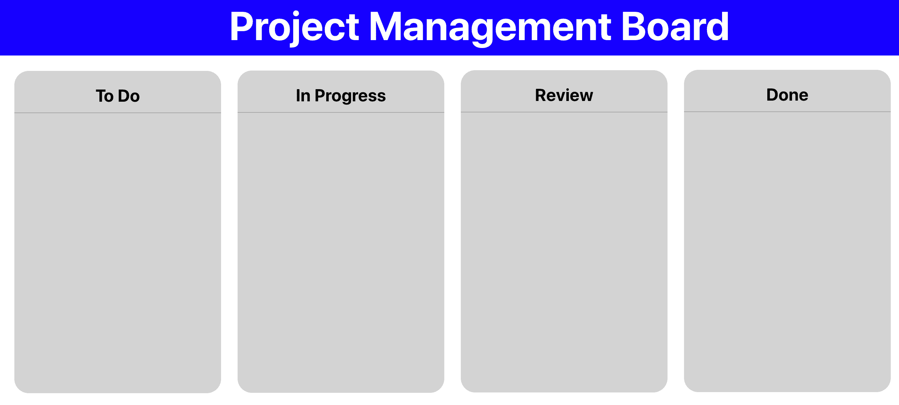
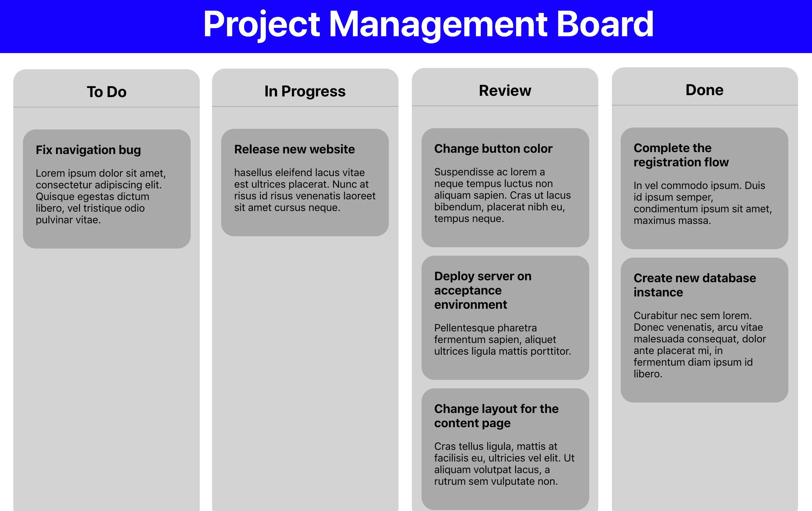

# 建立一个具有反应和悬念的动态项目管理委员会

在本书的前两章中，您已经自己创建了两个 React 项目，现在您应该已经对 React 的核心概念有了坚实的理解。到目前为止，您使用的概念也将在本章中用于创建使用 React 的第三个项目，包括一些新的和更高级的概念，这些概念将向您展示使用 React 的优势。同样，如果您觉得您可能缺乏完成本章内容所需的一些知识，您可以随时重复您到目前为止构建的内容。

本章将再次使用您在上一章中使用的 Create React 应用程序。在本章项目管理委员会应用程序的开发过程中，您将使用使用`styled-components`创建的可重用组件。接下来，您将使用更高级的 React 技术来控制整个组件中的数据流。此外，HTML5 Web API 将用于动态拖放作为**高阶组件**（**HOC**的组件）。

本章将介绍以下主题：

*   反应悬念和代码分裂
*   使用 HOC
*   动态数据流

# 项目概述

在本章中，我们将创建一个**渐进式 Web 应用程序**（**PWA**），该应用程序使用 create React App 和`styled-components`具有可重用的 React 组件和样式。该应用程序将具有一个使用 HTML5 拖放 API 的动态拖放界面。

构建时间为 1.5-2 小时。

# 开始

我们将在本章中创建的项目建立在您可以在 GitHub 上找到的初始版本之上：[https://github.com/PacktPublishing/React-Projects/tree/ch3-initial](https://github.com/PacktPublishing/React-Projects/tree/ch3-initial) 。完整的源代码也可以在 GitHub 上找到：[https://github.com/PacktPublishing/React-Projects/tree/ch3](https://github.com/PacktPublishing/React-Projects/tree/ch3) 。

从 GitHub 下载初始应用程序后，我们可以移动到它的根目录并运行`npm install`命令。这将安装 Create React App（`react`、`react-dom`和`react-scripts`中的核心软件包，安装在`styled-components`软件包旁边，我们在上一章中使用了该软件包。安装完成后，我们可以通过执行`npm start`命令启动应用程序，并通过访问`http://localhost:3000`在浏览器中访问项目。

我们也可以通过执行`npm run build`和后续的`serve -s build`来构建应用程序。现在可以通过`http://localhost:5000`访问该应用程序的缩小版。由于它被设置为 PWA，因此它也可以在没有任何互联网连接的情况下工作。

It's possible that you'll see a different application than when you ran the project locally, if you've built and served a Create React App PWA before. This is due to the service worker of the PWA that has stored a cached version of that application in the browser. You can delete any previous application from the browser cache by opening `devTools` and opening the Application tab, where you can click on the Clear site data button in the Clear storage section.

如下面的屏幕截图所示，应用程序有一个带有标题的基本标题，并分为四列。这些列是**项目管理委员会**的通道，在我们将项目连接到数据文件后，将包含单独的票据：



As we mentioned in [Chapter 2](02.html), *Creating a Progressive Web Application with Reusable React Components*, we can check whether our application is running when there is no internet connection by visiting the Service Workers section of the Application tab. On this page, we can check the Offline checkbox and try refreshing the browser.

如果我们看一下项目的结构，我们会发现它的结构与前几章中的项目相同。该应用程序的入口点是`src/index.js`文件，该文件呈现一个名为`App`的组件，其中包含两个名为`Header`和`Board`的其他组件。第一个是应用程序的实际标题，`Board`组件包含我们可以在应用程序中看到的四列。这些列由`Lane`组件表示。

此外，在`assets`目录中，我们将看到一个名为`data.json`的文件，其中包含我们可以在项目管理板上显示的数据：

```jsx
project-management-board
|-- assets
    |-- data.json
|-- node_modules
|-- public
    |-- favicon.ico
    |-- index.html
    |-- manifest.json
|-- src
    |-- components
        |-- Header
            |-- Header.js
        |-- Lane
            |-- Lane.js
    |-- containers
        |-- App.js
        |-- Board.js
    |-- index.js
    |-- serviceWorker.js
.gitignore
package.json
```

# 创建项目管理委员会应用程序

在本节中，我们将创建一个项目管理委员会 PWA，它使用 Resact API，如 Suspence 和 HTML5 拖放 API。我们将使用 createreact 应用程序，可以在本章的 GitHub 存储库中找到。

# 处理数据流

应用程序的初始版本就绪后，下一步是从数据文件中获取数据，并处理其通过组件的流。为此，我们将使用 React-Suspense 和 memo。通过 Suspense，我们可以访问 React-lazy API 来动态加载组件，通过 memo，我们可以控制哪些组件在其道具更改时应该重新加载。

本节的第一部分将向我们展示如何使用 React 生命周期方法从数据源加载数据，并在 React 组件中显示。

# 加载和显示数据

加载和显示从数据源检索的数据是我们在上一章中所做的事情。本节将进一步探讨这一点。请按照以下步骤开始：

1.  我们将首先从数据文件中获取项目数据。为此，我们需要向`Board`组件添加必要的函数。我们需要这些来访问 React 生命周期。它们是`constructor`，其中设置了初始状态；以及`componentDidMount`，其中将获取数据：

```jsx
...
class Board extends Component {
+ constructor() {
+   super();
+   this.state = {
+     data: [],
+     loading: true,
+     error: '',
+   }
+ }

+ async componentDidMount() {
+   try {
+     const tickets = await fetch('../../img/data.json');
+     const ticketsJSON = await tickets.json();

+     if (ticketsJSON) {
+       this.setState({
+         data: ticketsJSON,
+         loading: false,
+       });
+     }
+   } catch(error) {
+     this.setState({
+      loading: false,
+      error: error.message,
+    });
+   }
+ }

  render() {
    ...
  }
}

export default Board;
```

在`componentDidMount`生命周期函数中，在`try..catch`语句中获取数据。此语句捕获从数据获取过程返回的任何错误，并用此消息替换错误状态。

2.  现在，我们可以在相应的车道上分发车票：

```jsx
...
class Board extends Component {
  ...
  render() {
+   const { data, loading, error } = this.state;

    const lanes = [
      { id: 1, title: 'To Do' },
      { id: 2, title: 'In Progress' },
      { id: 3, title: 'Review' },
      { id: 4, title: 'Done' },
    ];

    return (
      <BoardWrapper>
        {lanes.map(lane =>
          <Lane
            key={lane.id}
            title={lane.title}
+           loading={loading}
+           error={error}
+           tickets={data.filter(ticket => ticket.lane === 
            lane.id)}
          />
        )}
      </BoardWrapper>
    );
  }
}

export default Board;
```

在前面的代码中，我们可以看到，在`render`内部，`data`、`loading`和`error`常量已经从状态对象中解构。在迭代`lanes`常量的函数中，这些值应作为道具传递给`Lane`组件。对于数据状态，由于`filter`功能仅用于从`data`状态返回与车道 ID 匹配的车票，因此发生了一些特殊情况

3.接下来，我们需要对`Lane`组件进行一些更改：

```jsx
import React from 'react';
import styled from 'styled-components';
+ import Ticket from '../Ticket/Ticket';

...

+ const TicketsWrapper = styled.div`
+  padding: 5%;
+ `;

+ const Alert = styled.div`
+  text-align: center;
+ `;

- const Lane = ({ title }) => (
+ const Lane = ({ tickets, loading, error, title }) => (
    <LaneWrapper>
      <Title>{title}</Title>
+     {(loading || error) && <Alert>{loading ? 'Loading...' : 
       error}</Alert>}
+     <TicketsWrapper>
+       {tickets.map(ticket => <Ticket key={ticket.id} 
         ticket={ticket} />)}
+     </TicketsWrapper>
    </LaneWrapper>
);

export default Lane;
```

4.  `Lane`组件现在使用另外三个道具，即`tickets`、`loading`和`error`，其中`tickets`包含来自`data`状态的票证数组，`loading`表示是否应该显示加载消息，`error`在有一个道具时包含错误消息。我们可以看到已经创建了一个包装器，在`map`函数中，显示票据信息的`Ticket`组件将被呈现。这个`Ticket`组件也是我们需要在`src/components`目录中创建的：

```jsx
import React from 'react';
import styled from 'styled-components';

const TicketWrapper = styled.div`
  background: darkGray;
  padding: 20px;
  border-radius: 20px;

  &:not(:last-child) {
    margin-bottom: 5%;
  }
`;

const Title = styled.h3`
  width: 100%;
  margin: 0px;
`;

const Body = styled.p`
  width: 100%;
`;

const Ticket = ({ ticket }) => (
  <TicketWrapper>
    <Title>{ticket.title}</Title>
    <Body>{ticket.body}</Body>
  </TicketWrapper>
);

export default Ticket;
```

如果我们在`http://localhost:3000`的 web 浏览器中访问我们的应用程序，我们将看到以下内容：


由于此应用程序已设置为 PWA，因此我们可以再次构建项目并重新启动服务人员。在脱机模式下，项目仍应显示标题和四列，在这些列中显示一条消息，显示“未能获取”*。*

To build and serve the PWA, we need to run `npm run` and `serve -s build` after the build process has completed. Now, we can visit the project at `http://localhost:5000`. We may need to restart the service worker, which we can do in the `devTools` on the Application tab, and select the Service Worker section. On the right-hand side of this section, next to the service worker, press Update. To check out the application in offline mode, we need to check the Offline checkbox.

从数据源获取数据是可以在整个应用程序中重用的逻辑。在下一节中，我们将探讨如何使用 HOC 跨多个组件重用此逻辑。

# 开始使用 HOC

HOC 是 React 中的高级功能，其重点是组件的可重用性。它们不是官方 React API 的一部分，但引入了一种在核心团队和许多库（如 Redux）中流行的模式

在本节的第一部分中，我们将创建第一个 HOC，它使用逻辑从上一节中创建的数据源检索数据。

# 创建 HOC

正如我们前面提到的，HOC 专注于重用组件。因此，最好描述如下：

"A HOC is a function that takes a component and returns a new component."

为了解释这在实践中意味着什么，让我们创建一个示例。我们的项目有一个`Board`组件，它获取并渲染所有车道。该组件中有一个`constructor`、一个`componentDidMount`形式的逻辑，以及关于如何呈现每个`Lane`组件的信息。如果我们只想展示一个没有车道但只有车票的看板，我们将如何处理这种情况？我们是否只向`Board`组件发送不同的道具？当然，这是可能的，但在 React 中，这就是 HOC 的用途。

没有车道的`Board`组件不会映射所有车道，并以车票作为道具渲染相应的车道。相反，它将映射所有票据并直接渲染它们。尽管呈现的组件不同，但是可以重用设置初始状态、获取数据和呈现组件的逻辑。HOC 应该能够通过发送这个组件以及一些额外的道具，将生命周期添加到`Board`组件中。

要创建 HOC，请在`src`目录中放置一个名为`withDataFetching.js`的新文件。现在，按照以下步骤操作：

1.  首先，我们需要导入 React 并为 HOC 创建一个新函数，该函数将成为默认导出。因为这个 HOC 将添加数据获取的生命周期，所以我们将其称为 HOC`withDataFetching`，并将其作为一个组件作为参数。此函数应返回另一个组件：

```jsx
+ import React from 'react';

+ export default function withDataFetching(WrappedComponent) {
+   return class extends React.Component {

+ }
```

2.  在返回的组件中，添加与`Board`组件结构几乎相同的`constructor`组件：

```jsx
...

export default function withDataFetching(WrappedComponent) {
  return class extends React.Component {
+   constructor(props) {
+     super(props);
+     this.state = {
+       data: [],
+       loading: true,
+       error: '',
+     };
+   }
...
```

3.  接下来，我们需要创建`componentDidMount`函数，在这里进行数据获取。`dataSource`道具用作从中提取的位置。此外，请注意，常量名称现在更通用，不再指定单一用途：

```jsx
export default function withDataFetching(WrappedComponent) {
  return class extends React.Component {

  ...

+ async componentDidMount() {
+   try {
+     const data = await fetch(this.props.dataSource);
+     const dataJSON = await data.json();

+     if (dataJSON) {
+       this.setState({
+         data: dataJSON,
+         loading: false,
+       });
+     }
+   } catch(error) {
+     this.setState({
+       loading: false,
+       error: error.message,
+     });
+   }
+ }

 ...
```

4.  在`render`函数中，我们可以返回插入到函数中的`WrappedComponent`并将`data`、`loading`和`error`状态作为道具传递。重要的是要了解，它还需要使用`{...this.props}`传播的任何其他道具：

```jsx
export default function withDataFetching(WrappedComponent) {
  return class extends React.Component {

    ...

+   render() {
+     const { data, loading, error } = this.state;

+     return (
+       <WrappedComponent 
+         data={data} 
+         loading={loading} 
+         error={error}
+         {...this.props} 
+       />
+     );
+   }
  };
}
```

祝贺你已经创建了你的第一个 HOC！但是，它需要一个组件来返回支持数据获取的组件。因此，我们需要将`Board`组件重构为功能组件。让我们开始：

1.  从`src/withDataFetching.js`文件导入 HOC：

```jsx
import React, { Component } from 'react';
import styled from 'styled-components';
+ import withDataFetching from '../withDataFetching';
import Lane from '../components/Lane/Lane';

const BoardWrapper = styled.div`
  display: flex;
  justify-content: space-between;
  flex-direction: row;
  margin: 5%;

  @media (max-width: 768px) {
    flex-direction: column;
  }
`;

...
```

2.  随后，我们可以从该文件中删除整个类组件，即`Board`，并创建一个新的函数组件，该组件返回我们在重构类组件的`return`函数中声明的 JSX。此功能组件将以`lanes`、`loading`、`error`、`data`为道具：

```jsx
import React, { Component } from 'react';
import styled from 'styled-components';
import withDataFetching from '../withDataFetching';
import Lane from '../components/Lane/Lane';

const BoardWrapper = ...;

+ const Board = ({ lanes, loading, error, data }) => (
+  <BoardWrapper>
+    {lanes.map(lane =>
+      <Lane
+        key={lane.id}
+        title={lane.title}
+        loading={loading}
+        error={error}
+        tickets={data.filter(ticket => ticket.lane === lane.id)}
+      />
+    )}
+  </BoardWrapper>
+ ); export default Board;
```

3.最后，将函数组件与 HOC 函数一起导出：

```jsx
...
const Board = ({ lanes, loading, error, data }) => (
  <BoardWrapper>
    {boards.map(lane =>
      <Lane
        key={lane.id}
        title={lane.title}
        loading={loading}
        error={error}
        tickets={data.filter(ticket => ticket.lane === lane.id)}
      />
    )}
  </BoardWrapper>
);

- export default Board;
+ export default withDataFetching(Board);
```

但是这些道具是从哪里来的呢？如果打开应用程序并打开浏览器，我们将看到以下错误：

```jsx
TypeError: Cannot read property 'map' of undefined
```

这是因为我们的`Board`组件试图映射`lanes`道具，但在 HOC 中，`WrappedComponent`接收`data`、`loading`和`error`道具。幸运的是，我们还添加了扩展发送到组件的任何附加道具的选项。如果我们打开打开`Board`组件的`App`组件，我们可以通过`lanes`道具，该道具带有`Board`组件中先前声明的`lane`常量：

```jsx
...

class App extends Component {
  render() {
+   const lanes = [
+     { id: 1, title: 'To Do' },
+     { id: 2, title: 'In Progress' },
+     { id: 3, title: 'Review' },
+     { id: 4, title: 'Done' },
+   ]

    return (
        <>
          <GlobalStyle />
            <AppWrapper>
            <Header />
-           <Board />
+           <Board lanes={lanes} />
          </AppWrapper>
        </>
    );
  }
}

export default App;
```

现在，如果我们在浏览器中查看我们的项目，我们将看到应用程序再次呈现。但是，它会在 HOC 中显示来自`try...catch`语句的错误消息。这个 HOC 需要`dataSource0`道具，我们还需要传递给`Board`组件：

```jsx
...
class App extends Component {
  render() {

    ...

    return (
        <>
          <GlobalStyle />
            <AppWrapper>
            <Header />
-           <Board lanes={lanes} />
+           <Board lanes={lanes} dataSource={'../../img/data.json'} />
          </AppWrapper>
        </>
    );
  }
}

export default App;
```

最后，我们可以在浏览器中看到 HOC 呈现的`Board`组件。然而，正如我们前面提到的，HOC 应该重用逻辑。在下一节中，我们将学习如何通过将 HOC 添加到不同的组件来实现这一点。

# 使用 HOC

随着第一个 HOC 的出现，是时候考虑一下可以用这个 HOC 创建的其他组件了，比如只显示票据的组件。创建此组件的过程包括两个步骤：创建实际组件和导入组件并向其传递所需的道具。让我们开始：

1.  在目录容器中，我们需要创建一个名为`Tickets.js`的新文件，并在其中放置以下代码。在我们导入 HOC 的地方，使用`styled-components`设置一些基本样式，并创建一个可以使用 HOC 导出的功能组件：

```jsx
import React from 'react';
import styled from 'styled-components';
import withDataFetching from '../withDataFetching';
import Ticket from '../components/Ticket/Ticket';

const TicketsWrapper = styled.div`
  display: flex;
  justify-content: space-between;
  flex-direction: row;
  margin: 5%;

  @media (max-width: 768px) {
    flex-direction: column;
  }
`;

const Alert = styled.div`
    text-align: center;
`;

const Tickets = ({ loading, data, error }) => (
  <TicketsWrapper>
    {(loading || error) && <Alert>{loading ? 'Loading... : 
     error}</Alert>}
    {data.map(ticket => <Ticket key={ticket.id} ticket={ticket} />)}
  </TicketsWrapper>
);

export default withDataFetching(Tickets);
```

2.  在`App`组件中，我们可以导入该组件并向其传递`dataSource`道具：

```jsx
import React, { Component } from 'react';
import styled, { createGlobalStyle } from 'styled-components';
import Board from './Board';
+ import Tickets from './Tickets';
import Header from '../components/Header/Header';

...

class App extends Component {
  render() {
    ...
    return (
        <>
          <GlobalStyle />
            <AppWrapper>
            <Header />
            <Board boards={boards} 
             dataSource={'../../img/data.json'} />
+           <Tickets dataSource={'../../img/data.json'} />                    
            </AppWrapper>
       </>
    );
  }
}

export default App;
```

似乎有点不对劲的是，这些票是如何在没有任何边距的情况下相邻显示的。我们可以在实际的`Ticket`组件中改变这一点，但这也会改变车道上显示的车票的边距。我们能做的就是将`styled-components`正在使用的道具传递给这个组件。为此，我们需要对呈现票据的`Tickets`组件和定义样式的`Ticket`组件进行更改。让我们开始：

1.  将名为`marginRight`的新道具传递给`map`函数中的`Ticket`组件。此道具只是一个布尔值，不带任何值：

```jsx
...

const Tickets = ({ loading, data, error }) => (
  <TicketsWrapper>
    {(loading || error) && <Alert>{loading ? 'Loading...' : 
      error}</Alert>}
-   {data.map(ticket => <Ticket key={ticket.id} ticket={ticket} />)}
+   {data.map(ticket => <Ticket key={ticket.id} marginRight ticket={ticket} />)}
  </TicketsWrapper>
);

export default withDataFetching(Tickets);
```

2.  在`Ticket`组件中，我们需要对该道具进行解构，并将其传递给我们使用`styled-components`创建的`TicketWrapper`：

```jsx
import React from 'react';
import styled from 'styled-components';

const TicketWrapper = styled.div`
  background: darkGray;
  padding: 20px;
  border-radius: 20px;

  &:not(:last-child) {
    margin-bottom: 5%;
+   margin-right: ${props => !!props.marginRight ? '1%' : '0'};
  }
`;

...

- const Ticket = ({ ticket }) => (
+ const Ticket = ({ marginRight, ticket }) => (
-   <TicketWrapper>
+   <TicketWrapper marginRight={marginRight}>
      <Title>{ticket.title}</Title>
      <Body>{ticket.body}</Body>
    </TicketWrapper>
);

export default Ticket;
```

现在，我们可以通过向`Ticket`组件发送道具来控制此`TicketWrapper`的`margin-right`属性。如果我们在浏览器中查看我们的应用程序，我们将看到在四车道的`Board`组件正下方，另一个呈现`Ticket`组件的组件是如何显示的：



我们可以自定义的另一件事是，React 开发人员工具如何命名 HOC 返回的组件。在浏览器中打开应用程序并查看组件树。在这里，我们可以看到我们在没有 HOC 的情况下创建的组件具有可读的命名约定，例如`App`或`Header`。由 HOC 创建的组件被命名为`<_class />`。为了使这个组件树更清晰，我们可以很容易地让我们的 HOC 将这个命名约定添加到它创建的组件中。通常，我们会使用由 HOC 创建的组件的名称。然而，在我们的例子中，HOC 被称为`withDataFetching`，当我们插入一个名为`Board`的组件时，React 开发者工具中显示的名称将是`withDataFetching(Board)`。要设置这个，我们需要对`withDataFetching.js`文件进行一些更改。让我们开始：

1.  在声明类组件之前删除`return`，并为类组件命名。为此，请使用 HOC 的名称，并将第一个字符更改为大写字母。这导致`WithDataFetching`：

```jsx
import React from 'react';

export default function withDataFetching(WrappedComponent) {
- return class extends React.Component {
+ class WithDataFetching extends React.Component {
  ...
```

2.  在这个文件的最后几行中，我们可以使用插入到 HOC 中的`WrappedComponent`的名称，通过设置返回组件的`displayName`来命名 HOC。别忘了在文件末尾返回`WithDataFetching`类组件：

```jsx
import React from 'react';

export default function withDataFetching(WrappedComponent) {
  class WithDataFetching extends React.Component {

    ...

    render() {
      const { data, loading, error } = this.state;

      return (
        <WrappedComponent 
          data={data} 
          loading={loading} 
          error={error} 
          {...this.props} 
        />
      );
    }
  };

+ WithDataFetching.displayName = `WithDataFetching(${WrappedComponent.name})`;

+ return WithDataFetching;
}
```

再次查看 React developer 工具，我们可以看到这些更改为 HOC 创建的组件带来了更具可读性的命名约定。

车道上显示的所有车票仅在应用程序的一部分中，因为我们希望能够将这些车票拖放到不同的车道上。我们将在下一节中学习如何做到这一点，在这里我们将向电路板添加动态功能。

# 使董事会充满活力

通常给项目管理板带来良好用户交互的一个因素是能够将票据从一条车道拖放到另一条车道上。这一点可以通过 HTML5 拖放 API 轻松实现，该 API 可在包括 IE11 在内的所有现代浏览器中使用。

HTML5 拖放 API 使我们能够在项目管理板上拖放元素。为了实现这一点，它使用拖动事件。`onDragStart`、`onDragOver`和`onDrop`将用于此应用程序。这些事件应放在`Lane`和`Ticket`组件上。让我们开始：

1.  首先，我们需要使`Board`组件成为类组件，而不是功能组件。我们这样做是因为需要将票据数据添加到状态中，`Board`组件是执行此操作最合理的位置，因为我们可能希望`Lane`组件在其他地方重用。我们可以通过改变`Board`常数的定义来实现这一点，如下所示：

```jsx
...
 - const Board = ({ lanes, loading, data, error }) => (
+ class Board extends React.Component {
+   render() {
+     const { lanes, loading, data, error } = this.props;

+     return (
        <BoardWrapper>
          {lanes.map(lane =>
            <Lane
              key={lane.id}
              title={lane.title}
              loading={loading}
              error={error}
              tickets={data.filter(ticket => ticket.lane ===  
              lane.id)}
            />
          )}
        </BoardWrapper>
      );
+   }
+ }

export default withDataFetching(Board);
```

2.  现在，我们可以将票证的初始值添加到状态。我们之所以这样做，是因为我们想更改它应该放置在的车道的关键点。通过将此数据添加到状态，我们可以使用`setState`函数动态地对其进行变异：

```jsx
...
class Board extends React.Component {
+ constructor() {
+   super();
+   this.state = {
+     tickets: [],
+   };
+ } 
  render() {
  ...
```

3.  由于数据需要从源代码加载，并且在应用程序首次装载时不可用，因此我们需要检查这些组件的道具是否已更改。如果他们有，我们需要将票据数据添加到状态。为此，使用`componentDidUpdate`生命周期方法，可以将之前的道具作为参数：

```jsx
...

class Board extends React.Component {
  constructor() {
    super()
    this.state = {
      tickets: [],
    };
  }

+ componentDidUpdate(prevProps) {
+   if (prevProps.data !== this.props.data) {
+     this.setState({ tickets: this.props.data });
+   }
+ } 
  render() {
  ...
```

4.  最后，展示州政府的门票：

```jsx
...  
render() {
-   const { lanes, data, loading, error } = this.props; 
+   const { lanes, loading, error } = this.props;

    return (
      <BoardWrapper>
        {lanes.map(lane =>
          <Lane
            key={lane.id}
            title={lane.title}
            loading={loading}
            error={error}
-           tickets={data.filter(ticket => ticket.lane === 
            lane.id)}
+           tickets={this.state.tickets.filter(ticket => 
            ticket.lane === lane.id)}
          />
        )}
      </BoardWrapper>
    );
  }
}

export default withDataFetching(Board);
```

如果我们现在在浏览器中查看项目，则不会出现可见的更改。唯一的区别是票证的数据现在从状态加载，而不是从道具加载。

在同一个文件中，我们添加响应 drop 事件的函数，这些函数需要发送到`Lane`和`Ticket`组件：

1.  首先，在`Board`组件中添加`onDragStart`事件的事件处理程序函数，该函数在拖动操作启动时触发。此函数需要传递给`Lane`组件，在这里可以传递给`Ticket`组件。此函数为正在拖动到元素的`dataTransfer`对象的票证设置 ID，浏览器使用该 ID 标识拖动元素：

```jsx
...
class Board extends React.Component {
  constructor() {
    super();
    this.state = {
      tickets: [],
    };
  }

  componentDidUpdate(prevProps) {
    if (prevProps.data !== this.props.data) {
        this.setState({ tickets: this.props.data });
    }
  }

+ onDragStart = (e, id) => {
+   e.dataTransfer.setData('id', id);
+ }; 
  render() {
    const { lanes, loading, error } = this.props;

    return (
      <BoardWrapper>
        {lanes.map(lane =>
          <Lane
            key={lane.id}
            title={lane.title}
            loading={loading}
            error={error}
+           onDragStart={this.onDragStart}
            tickets={this.state.tickets.filter(ticket => 
            ticket.lane === lane.id)}
          />
        )}
      </BoardWrapper>
    );
  }
}

export default withDataFetching(Board);
```

2.  在`Lane`组件中，我们需要将此事件处理函数传递给`Ticket`组件：

```jsx
...
- const Lane = ({ tickets, loading, error, title }) => (
+ const Lane = ({ tickets, loading, error, onDragStart, title }) => (
  <LaneWrapper>
    <Title>{title}</Title>
    {(loading || error) && <Alert>{loading ? 'Loading...' : 
     error}</Alert>}
    <TicketsWrapper>
-     {tickets.map(ticket => <Ticket key={ticket.id} 
       ticket={ticket} />)}
+     {tickets.map(ticket => <Ticket key={ticket.id} 
       onDragStart={onDragStart} ticket={ticket} />)}
    </TicketsWrapper>
  </LaneWrapper>
);

export default Lane;
```

3.  现在，我们可以在`Ticket`组件中调用这个函数，我们还需要在`TicketWrapper`中添加`draggable`属性。这里，我们将元素和票证 ID 作为参数发送给事件处理程序：

```jsx
...
- const Ticket = ({ marginRight, ticket }) => (
+ const Ticket = ({ marginRight, onDragStart, ticket }) => (
  <TicketWrapper
+   draggable
+   onDragStart={e => onDragStart(e, ticket.id)}
    marginRight={marginRight}
  >
    <Title>{ticket.title}</Title>
    <Body>{ticket.body}</Body>
  </TicketWrapper>
);

export default Ticket;
```

在做了这些更改之后，我们应该能够看到每张票都可以被拖动。但是不要把它们放在任何地方，还应该添加其他的丢弃事件和更新状态的事件处理程序。将车票从一条车道拖到另一条车道可以通过单击车票而不释放鼠标并将其拖到另一条车道来完成，如以下屏幕截图所示：


通过`onDragStart`事件的实现，也可以实现`onDragOver`和`onDrop`事件。让我们开始：

1.  默认情况下，不可能将元素放入另一个元素中；例如，将一个`Ticket`组件转换为`Lane`组件。这可以通过调用`onDragOver`事件的`preventDefault`方法来防止：

```jsx
...
 +  onDragOver = e => {
+   e.preventDefault();
+ };

 render() {
    const { lanes, loading, error } = this.props;

    return (
      <BoardWrapper>
        {lanes.map(lane =>
          <Lane
            key={lane.id}
            title={lane.title}
            loading={loading}
            error={error}
            onDragStart={this.onDragStart}
+           onDragOver={this.onDragOver}
            tickets={this.state.tickets.filter(ticket => 
            ticket.lane === lane.id)}
          />
        )}
      </BoardWrapper>
    );
  }
}
```

2.此事件处理程序需要放置在`Lane`组件上：

```jsx
...
- const Lane = ({ tickets, loading, error, title }) => (
+ const Lane = ({ tickets, loading, error, onDragOver, title }) => (
-   <LaneWrapper>
+   <LaneWrapper
+     onDragOver={onDragOver}
+   >
      <Title>{title}</Title>
      {(loading || error) && <Alert>{loading ? 'Loading...' : 
       error}</Alert>}
      <TicketsWrapper>
        {tickets.map(ticket => <Ticket onDragStart={onDragStart}   
         ticket={ticket} />)}
      </TicketsWrapper>
    </LaneWrapper>
);

export default Lane;
```

`onDrop`事件是事情变得有趣的地方，因为这个事件使我们有可能在完成拖动操作后改变状态。

此事件的事件处理函数应放在`Ticket`组件上，但在`Board`组件中定义，因为`setState`函数只能在与状态初始值相同的文件中调用：

```jsx
...  
+  onDrop = (e, laneId) => {
+   const id = e.dataTransfer.getData('id');
+
+   const tickets = this.state.tickets.filter(ticket => {
+     if (ticket.id === id) {
+       ticket.board = boardId;
+     }
+     return ticket;
+   });
+
+   this.setState({
+     ...this.state,
+     tickets,
+   });
+ }; 
  render() {
    const { lanes, loading, error } = this.props;

    return (
      <BoardWrapper>
        {lanes.map(lane =>
          <Lane
            key={lane.id}
+           laneId={lane.id}
            title={lane.title}
            loading={loading}
            error={error}
            onDragStart={this.onDragStart}
            onDragOver={this.onDragOver}
+           onDrop={this.onDrop}
            tickets={this.state.tickets.filter(ticket => ticket.lane === 
            lane.id)}
          />
        )}
      </BoardWrapper>
    );
  }
}

export default withDataFetching(Board);
```

此`onDrop`事件处理程序函数以元素和车道 ID 作为参数，因为它需要被拖动元素的 ID 以及它应该放置在其中的新车道。有了这些信息，该功能使用`filter`功能查找需要移动的车票，并更改车道 ID。此新信息将使用`setState`功能替换处于状态的票据的当前对象。由于`onDrop`事件是从`Lane`组件触发的，因此它作为道具传递给该组件。此外，车道 ID 被添加为道具，因为这需要从`Lane`组件传递给`onDrop`事件处理程序函数：

```jsx
...
- const Lane = ({ tickets, loading, error, onDragStart, onDragOver, title }) => (
+ const Lane = ({ laneId, tickets, loading, error, onDragStart, onDragOver, onDrop, title }) => (
  <LaneWrapper
    onDragOver={onDragOver}
+   onDrop={e => onDrop(e, laneId)}
  >
    <Title>{title}</Title>
    {(loading || error) && <Alert>{loading ? 'Loading...' : error}</Alert>}
    <TicketsWrapper>
      { tickets.map(ticket => <Ticket onDragStart={onDragStart} 
        ticket={ticket} />)}
    </TicketsWrapper>
  </LaneWrapper>
);

export default Lane;
```

有了这个，我们就可以把车票拖放到我们的棋盘上的其他车道上

# 总结

在本章中，您创建了一个项目管理板，它允许您使用 React Suspense 和 HTML5 拖放 API 从一条车道移动和拖放票据到另一条车道。此应用程序的数据流使用本地状态和生命周期进行处理，并确定在不同车道上显示哪些车票。本章还介绍了**高阶组分**（**HOCs**的高级反应模式）。使用 HOCs，您可以在应用程序中重用类组件中的状态逻辑。

此高级模式也将在下一章中使用，它将处理 React 应用程序中的路由和**服务器端渲染**（**SSR**）。您是否曾经尝试过使用堆栈溢出来解决您曾经遇到的编程问题？我有！

在下一章中，我们将构建一个社区提要，它使用堆栈溢出作为数据源，并对呈现应用程序作出反应。

# 进一步阅读

*   拖放 API:[https://developer.mozilla.org/en-US/docs/Web/API/HTML_Drag_and_Drop_API](https://developer.mozilla.org/en-US/docs/Web/API/HTML_Drag_and_Drop_API) 。
*   HOC:[https://medium.com/@dan_abramov/mixins-are-dead-long-live-higher-order-components-94a0d2f9e750](https://medium.com/@dan_abramov/mixins-are-dead-long-live-higher-order-components-94a0d2f9e750)。
*   数据传输：[https://developer.mozilla.org/en-US/docs/Web/API/DataTransfer](https://developer.mozilla.org/en-US/docs/Web/API/DataTransfer) 。
*   反应 DnD:[https://github.com/react-dnd/react-dnd](https://github.com/react-dnd/react-dnd) 。