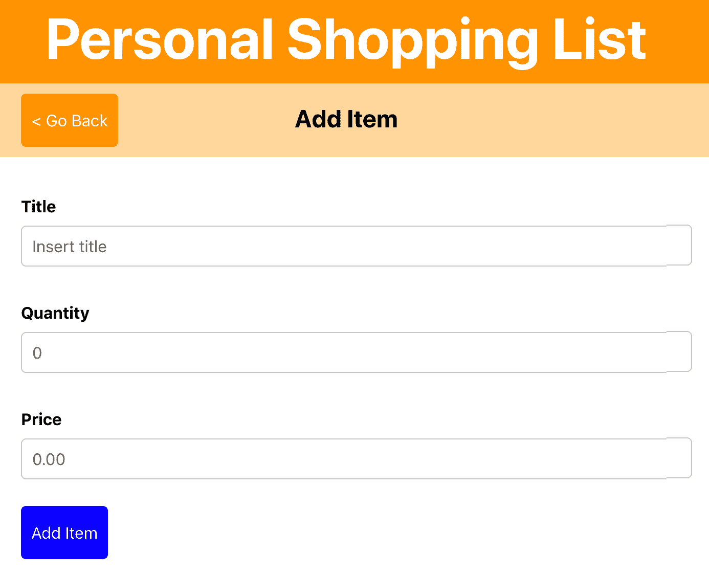

# 使用上下文 API 和挂钩构建个人购物清单应用程序

状态管理是现代 web 和移动应用程序的一个非常重要的组成部分，React 非常擅长于此。在 React 应用程序中处理状态管理可能会非常混乱，因为有多种方法可以处理应用程序的当前状态。您在本书前四章中创建的项目没有太多地关注状态管理，本章将对此进行更多的研究

本章将展示如何通过为应用程序创建可从每个组件访问的全局状态来处理 React 中的状态管理。在 React v16.3 之前，您需要第三方软件包来处理 React 中的全局状态，但在更新版本的上下文 API 中，这不再是必需的。此外，随着 React 钩子的发布，引入了更多改变这种上下文的方法。通过一个示例应用程序，演示了为应用程序处理全局状态管理的方法。

本章将介绍以下主题：

*   使用上下文 API 进行状态管理
*   **高阶组件**（**HOC**和上下文
*   用钩子改变上下文

# 项目概述

在本章中，我们将创建一个**渐进式 Web 应用程序**（**PWA**），使用`react-router`进行声明式路由，使用上下文和 React 钩子处理全局状态管理。此外，HOC 用于在整个应用程序中访问数据。

构建时间为 2.5 小时。

# 开始

我们将在本章中创建的项目建立在您可以在 GitHub 上找到的初始版本之上：[https://github.com/PacktPublishing/React-Projects/tree/ch5-initial](https://github.com/PacktPublishing/React-Projects/tree/ch5-initial) 。完整的源代码也可以在 GitHub 上找到：[https://github.com/PacktPublishing/React-Projects/tree/ch5](https://github.com/PacktPublishing/React-Projects/tree/ch5) 。

下载初始应用程序后，确保从项目的根目录运行`npm install`。此项目使用 Create React App 创建，并安装您在前面章节中已经看到的`react`、`react-dom`、`react-scripts`、`styled-components`和`react-router`包。完成安装过程后，您可以从终端的同一选项卡运行`npm start`并在浏览器中查看项目（`http://localhost:3000`。

由于该项目是使用 Create-React-App 创建的，服务人员将注册该应用程序作为 PWA 运行。您可以先运行`npm run build`并在构建过程完成后运行`serve -s build`进行检查。现在可以在`http://localhost:5000`处访问应用程序的构建版本。如果您访问此 URL 上的应用程序并看到不同的应用程序，则可能是您在前面任何一章中创建的应用程序的构建版本仍在使用中。这可能是由于服务人员创建的浏览器缓存造成的。您可以通过在浏览器上打开“开发人员工具”并打开“应用程序”选项卡，从浏览器缓存中清除以前的任何应用程序，在该选项卡中，您可以单击“清除存储”部分上的“清除站点数据”按钮。

To check whether the application is really still available when there is no internet connection, you can have the browser simulate an offline situation. The option to enable this can be found in the Application tab in the browser's Developer Tools. Inside this tab, you can find Service Workers in the menu on the left and, after clicking this link, you can select the Offline checkbox on the page that appears.

本节的初始应用程序可在`http://localhost:3000`上获得，并且比前面任何一章都要先进一些。打开应用程序时，将呈现一个显示标题、子标题和两个列表的屏幕。例如，如果您单击此处显示的第一个列表，将打开一个新页面，其中显示此列表的项目。在此页面上，您可以单击右上角的“添加列表”按钮打开一个新页面，该页面包含一个用于添加新列表的表单，如下所示：



此表单由`Form`组件呈现，目前还没有任何功能，稍后您将添加此功能。当您点击左侧按钮时，它会使用`react-router`中的`history.goBack`方法将您重定向到以前访问过的页面

When you try to submit the form to either add a new list or add a new item to a list, nothing happens yet. The functionality of these forms will be added in this section later on, for which you'll use the context API and React Hooks.

项目的结构与您以前创建的应用程序的结构相同。对`components`目录中的可重用功能组件和`containers`目录中的类组件进行了区分。类组件用一个名为`withDataFetching`的 HOC 进行包装，它向这些组件添加了数据获取和生命周期（`componentDidMount`）

The `withDataFetching` HOC is a slightly modified version of the HOC you created in [Chapter 2](02.html), *Creating a Progressive Web Application with Reusable React Components*, which was also called `withDataFetching.js`. This modified version is a curried component, meaning it takes multiple arguments at once. In the case of a HOC, this means that you can't only use a component as an argument, but you also need to use the props for this component as an argument. 

以下是项目完整结构的概述：

```jsx
shopping-list
|-- node_modules
|-- public
    |-- favicon.ico
    |-- index.html
    |-- manifest.json
|-- src
    |-- components
        |-- Button
            |-- Button.js
        |-- FormItem
            |-- FormItem.js
        |-- Header
            |-- Header.js
            |-- Subheader.js
         |-- ListItem
             |-- ListItem.js
 |-- containers
    |-- App.js
    |-- Form.js
    |-- List.js
    |-- Lists.js
 |-- index.js
 |-- serviceWorker.js
.gitignore
db.json
package.json
```

此应用程序的入口点是呈现来自`react-router`的`Router`组件中的`App`类组件的`src/index.js`文件。`App`组件包含一个`Header`组件和一个`Switch`路由器组件，定义了四条路由。这些路线如下：

*   `/`：呈现`Lists`，包含所有列表的概述
*   `/list/:id`：呈现`List`，包含特定列表中所有项目的概述
*   `/list/:id/new`：呈现`Form`，带有一个表单，用于将新项目添加到特定列表中

数据从使用免费服务 My JSON server 创建的模拟服务器获取，My JSON server 从 GitHub 中项目根目录中的`db.json`文件创建服务器。该文件由一个 JSON 对象组成，该对象有两个字段`items`和`lists`，用于在模拟服务器上创建多个端点。您将在本章中使用的选项如下：

*   `https://my-json-server.typicode.com/<your-username>/<your-repo>/items`
*   `https://my-json-server.typicode.com/<your-username>/<your-repo>/lists`

The `db.json` file must be present in the master branch (or default branch) of your GitHub repository for the My JSON Server to work. Otherwise, you'll receive a 404 Not Found message when trying to request the API endpoints.

# 个人购物清单

在本节中，您将构建一个个人购物清单应用程序，该应用程序使用上下文和 React 挂钩进行全局状态管理。使用此应用程序，您可以创建可以添加项目的购物列表，以及它们的数量和价格。本节的起点是已启用路由和本地状态管理的初始应用程序。

# 使用上下文 API 进行状态管理

状态管理非常重要，因为应用程序的当前状态包含对用户有价值的数据。在前面的章节中，您已经通过在`constructor`中设置初始状态并使用`this.setState`方法更新来使用本地状态管理。当状态中的数据仅对正在设置状态的组件重要时，此模式非常有用。由于将状态作为道具传递给多个组件可能会令人困惑，因此您需要一种在整个应用程序中访问道具的方法，即使您不是专门将道具作为道具传递。为此，您可以使用 React 中的上下文 API，在前面的章节中已经使用过的包，如`styled-components`和`react-router`也可以使用该 API。

为了在多个组件之间共享状态，将从本节的第一部分开始，探讨名为 Context 的 React 特性。

# 创建上下文

当您想要向 React 应用程序添加上下文时，可以通过使用 React 中的`createContext`方法创建新上下文来实现。这将创建一个由两个 React 组件组成的上下文对象，称为**提供者**和**使用者**。提供者是放置上下文的初始（以及随后的当前）值的地方，使用者中的组件可以访问该值。

这是在`src/containers/App.js`中的`App`组件中完成的，因为您希望列表的上下文在`Route`呈现的每个组件中都可用：

1.  让我们首先为列表创建一个上下文，并使其可导出，以便列表数据可以在任何地方使用。为此，您可以在新目录`src/Context`中创建一个名为`ListsContextProvider.js`的新文件。在此文件中，可以添加以下代码：

```jsx
import React from 'react';
import withDataFetching from '../withDataFetching';

export const ListsContext = React.createContext();
const ListsContextProvider = ({ children, data }) => (
  <ListsContext.Provider value={{ lists: data }}>
    {children}
  </ListsContext.Provider>
);

export default withDataFetching({
  dataSource: 'https://my-json-server.typicode.com/PacktPublishing/React-Projects/lists',
})(ListsContextProvider);
```

前面的代码基于作为道具传递的上下文组件创建一个提供程序，并基于从获取所有列表的`withDataFetching`HOC 返回的值设置一个值。使用`children`道具，将被包装在`ListsContextProvider`组件中的所有组件都可以从消费者处检索该值的数据。

2.  此`ListsContextProvider`组件和上下文可导入`src/containers/App.js`中的`App`组件中，随后应将其放置在`Switch`组件周围。`ListsContext`对象也被导入，因为您以后无法创建消费者：

```jsx
import React from 'react';
import styled, { createGlobalStyle } from 'styled-components';
import { Route, Switch } from 'react-router-dom';
+ import ListsContextProvider, { ListsContext } from '../Context/ListsContextProvider';

...

const App = () => (
 <>
   <GlobalStyle />
   <AppWrapper>
     <Header />
+    <ListsContextProvider>
       <Switch>
         <Route exact path='/' component={Lists} />
         <Route path='/list/:id/new' component={Form} />
         <Route path='/list/:id' component={List} />
       </Switch>
+    </ListsContextProvider>
 </AppWrapper>
 </>
);

export default App;
```

3.  这样，您现在可以为`ListsContext`添加一个消费者，该消费者嵌套在`ListsContextProvider`组件中，该组件包含`ListsContext`的提供者。此使用者从提供程序返回值，该值包含以前获取的列表数据：

```jsx
...

const App = () => (
  <>
    <GlobalStyle />
      <AppWrapper>
      <Header />
        <ListsContextProvider>
+         <ListsContext.Consumer>
+           {({ lists }) => (
              <Switch>
                <Route exact path='/' component={Lists} />
                <Route path='/list/:id/new' component={Form} />
                <Route path='/list/:id' component={List} />
              </Switch>
+           )}
+         </ListsContext.Consumer>
        </ListsContextProvider>
    </AppWrapper>
  </>
);

export default App;
```

4.  要将此列表数据实际传递给`Route`呈现的任何组件，您应该更改组件传递给`Route`组件的方式。除了告诉`Route`要渲染哪个组件外，您还可以使用`RenderProps`模式进行 React。此模式指的是使用 prop 在 React 组件之间共享代码的技术，prop 的值是返回组件的函数。在这种情况下，您希望`Route`组件呈现一个组件，并且不仅向其添加`react-router`道具，还添加`ListsContext`中的列表数据：

```jsx
...
<ListsContextProvider>                       
  <ListsContext.Consumer>
    {({ lists }) => (
      <Switch>
-       <Route exact path='/' component={Lists} />
+       <Route exact path='/' render={props => lists && <Lists lists={lists} {...props} /> } />
        <Route path='/list/:id/new' component={Form} />
        <Route path='/list/:id' component={List} />
      </Switch>
    )}
  </ListsContext.Consumer>
</ListsContextProvider>
...
```

5.  如果现在查看浏览器的开发人员工具中的“网络”选项卡，可以看到 API 被提取了两次。由于列表现在也由`ListsContextProvider`获取，`Lists`组件本身不再需要获取 API，因为它现在作为道具发送。因此，您可以对`src/containers/Lists.js`进行以下更改：

```jsx
import React from 'react';
import styled from 'styled-components';
import { Link } from 'react-router-dom';
- import withDataFetching from '../withDataFetching';
import SubHeader from '../components/SubHeader/SubHeader';

...

- const Lists = ({ data, loading, error, match, history }) => (
+ const Lists = ({ lists, loading = false, error = false, match, history }) => (
  <>
    {history && <SubHeader title='Your Lists' openForm={() => history.push('/new')} /> }
    <ListWrapper>
      {(loading || error) && <Alert>{loading ? 'Loading...' : error}</Alert>}
-     {data.lists && data.lists.map(list => (
+     {lists && lists.map(list => (
        <ListLink key={list.id} to={`list/${list.id}`}>
          <Title>{ list.title }</Title>
        </ListLink>
      ))}
    </ListWrapper>
  </>
);

- export default withDataFetching({
-   dataSource: 'https://github.com/PacktPublishing/React-Projects/lists',
})(Lists); + export default Lists;
```

现在您已经从`Lists`中删除了`withDataFetching`HOC，不再向 API 发送重复请求。列表的数据从`ListsContextProvider`获取，并通过`ListsContext.Consumer`传递给`Lists`。如果您通过进入`http://localhost:3000/`在浏览器中打开应用程序，您可以看到列表正在像以前一样呈现。

您还可以将列表数据发送到`List`组件，以便在本例中，当您从主页单击列表时，可以显示所选列表的名称：

1.  为此，您再次使用`RenderProps`模式，这次用于`Route`，它呈现`List`。这将确保`lists`可用，并在之后呈现`List`组件，该组件还包含所有`react-router`道具：

```jsx
...
<ListsContextProvider>                       
  <ListsContext.Consumer>
    {({ lists }) => (
      <Switch>
        <Route exact path='/' render={props => lists && <Lists lists={lists} {...props} /> } />
        <Route path='/list/:id/new' component={Form} />
-       <Route path='/list/:id' component={List} />
+       <Route path='/list/:id' render={props => lists && <List lists={lists} {...props} />} />
      </Switch>
    )}
  </ListsContext.Consumer>
</ListsContextProvider>
...
```

2.  在`src/containers/List.js`文件的`List`组件中，您可以从道具中检索列表。该数组需要过滤出正确的`list`，找到的对象包含`title`，可以添加到`SubHeader`组件中，在页面上显示：

```jsx
- const List = ({ data, loading, error, match, history }) => {
+ const List = ({ data, loading, error, lists, match, history }) => {
    const items = data && data.filter(item => item.listId === parseInt(match.params.id))
+   const list = lists && lists.find(list => list.id === parseInt(match.params.id));

  return (
    <>
-     {history && <SubHeader goBack={() => history.goBack()} openForm={() => history.push(`${match.url}/new`)} />}
+     {history && list && <SubHeader goBack={() => history.goBack()} title={list.title} openForm={() => history.push(`${match.url}/new`)} />}
      <ListItemWrapper>
        {items && items.map(item => <ListItem key={item.id} data={item} />)}
      </ListItemWrapper>
    </>
  )
};

export default withDataFetching({
  dataSource: 'https://my-json-server.typicode.com/PacktPublishing/React-Projects/items',
})(List);
```

通过这些添加，如果您在`http://localhost:3000/list/1`访问该项目，当前列表的`title`现在将显示。在`SubHeader`组件中，标题 Daily groceries 现在可见，它看起来类似于以下屏幕截图：


在下一节中，您还将为这些项添加一个上下文对象，因此这些项也可用于来自`react-router`的`Switch`组件中的所有组件

# 嵌套上下文

与列表数据一样，项目数据也可以存储在上下文中，并传递给需要此数据的组件。这样，数据不再从任何渲染组件中提取，而是从`src/Providers`目录中的`ContextProvider`组件中提取：

1.  同样，从创建一个新组件开始，在该组件中创建了上下文和提供程序。这次叫`ItemsContextProvider`，也可以添加到`ItemsContextProvider.js`文件中的`src/Context`目录中：

```jsx
import React from 'react';
import withDataFetching from '../withDataFetching';

export const ItemsContext = React.createContext();

const ItemsContextProvider = ({ children, data }) => (
  <ItemsContext.Provider value={{ items: data }}>
    { children }
  </ItemsContext.Provider>
);

export default withDataFetching({
  dataSource: 'https://my-json-server.typicode.com/PacktPublishing/React-Projects/items', 
})(ItemsContextProvider);
```

2.  接下来，在`src/containers/App.js`中导入这个新上下文和`ContextProvider`，您可以将其嵌套在`ListsContextProvider`组件中：

```jsx
import React from 'react';
import styled, { createGlobalStyle } from 'styled-components';
import { Route, Switch } from 'react-router-dom';
import ListsContextProvider, { ListsContext } from '../Context/ListsContextProvider';
+ import ItemsContextProvider, { ItemsContext } from '../Context/ItemsContextProvider';

...

const App = () => (
  <>
    <GlobalStyle />
    <AppWrapper>
     <Header />
     <ListsContextProvider>
+    <ItemsContextProvider>
     <ListsContext.Consumer>
        ...
```

3.  `ItemsContextProvider`现在嵌套在`ListsContextProvider`下方，这意味着`ItemsContext`的`Consumer`也可以嵌套在`ListsContext`的`Consumer`下方。这使得`ItemsContextProvider`中的值可用于使用`RenderProps`模式的`List`组件：

```jsx
<ListsContextProvider>
  <ItemsContextProvider>
    <ListsContext.Consumer>
      {({ lists }) => (
+       <ItemsContext.Consumer>
+         {({ items }) => (
            <Switch>
              <Route exact path='/' render={props => lists && <Lists lists={lists} {...props} />} />
              <Route path='/new' component={Form} />
              <Route path='/list/:id/new' component={Form} />
-             <Route path='/list/:id' render={props => lists && <List lists={lists} {...props} />
+             <Route path='/list/:id' render={props => lists && items && <List lists={lists} listItems={items} {...props} />}/>
             </Switch>
+          )}
+        </ItemsContext.Consumer>
       )}
     </ListsContext.Consumer>
   </ItemsContextProvider>
 </ListsContextProvider>
```

4.  将项目数据作为道具传递给`List`后，现在可以使用该道具替换使用`withDataFetching`HOC 已经到位的数据获取。为此，您需要对`src/containers/List.js`进行以下更改：

```jsx
import React from 'react';
import styled from 'styled-components';
- import withDataFetching from '../withDataFetching';
import SubHeader from '../components/SubHeader/SubHeader';
import ListItem from '../components/ListItem/ListItem';

...

- const List = ({ data, lists, loading, error, match, history }) => {
+ const List = ({ lists, listItems, loading = false, error = false, match, history }) => {
-   const items = data && data.filter(item => item.listId === parseInt(match.params.id))
+   const items = listItems && listItems.filter(item => item.listId === parseInt(match.params.id))

    const list = lists && lists.find(list => list.id === parseInt(match.params.id));
    return (
      <>
        {history && <SubHeader goBack={() => history.goBack()} title={list.title} openForm={() => history.push(`${match.url}/new`)} />}
        <ListItemWrapper>
          {items && items.map(item => <ListItem key={item.id} data={ item } />) }
        </ListItemWrapper>
      </>
    )
};

- export default withDataFetching({
    dataSource: 'https://my-json-server.typicode.com/PacktPublishing/React-Projects/items',
  })(List);
+ export default List;
```

所有的数据提取现在不再由`List`和`Lists`组件完成。通过嵌套这些上下文提供程序，多个组件可以使用返回值。但这仍然不理想，因为您现在在启动应用程序时正在加载所有列表和所有项目。

在下一节中，您将看到如何通过将上下文与挂钩相结合，仅获取所需的数据。

# 用钩子改变上下文

您可以通过多种方式有条件地从上下文中获取数据；其中之一是将上下文中的数据放置在本地状态中。对于较小的应用程序，这可能是一个解决方案，但对于较大的应用程序，这可能是低效的，因为您仍然需要将此状态传递到组件树中。另一种解决方案是使用 React 钩子创建一个函数，该函数被添加到上下文的值中，并且可以从嵌套在此上下文中的任何组件调用。此外，这种获取数据的方法会阻止您仅有效地加载所需的数据。

本节第一部分演示了如何将其与使用挂钩的 React 生命周期和状态管理结合使用。

# 在功能组件中使用生命周期

钩子带来的许多伟大的附加功能之一是使生命周期在功能组件中可用。在挂钩之前，只有类组件支持使用容器组件模式和迄今为止使用的`withDataFetching`HOC 的生命周期。遵循以下步骤：

1.  实现这一点的第一步是将函数从`withDataFetching`HOC 移动到`src/Context/ListsContextProvider.js`文件中列表的提供者。此函数将采用`dataSource`（可以是文件或 API）并使用`fetch`从此源检索数据：

```jsx
import React from 'react';

export const ListsContext = React.createContext();

async function fetchData(dataSource) {
 try {
 const data = await fetch(dataSource);
 const dataJSON = await data.json();

 if (dataJSON) {
 return await ({ data: dataJSON, error: false });
 }
 } catch(error) {
 return ({ data: false, error: error.message });
 }
};

....
```

2.  有了这个函数，下一步就是用`dataSource`调用它，并将数据添加到提供者。但是`dataSource`返回的数据应该存储在哪里？在此之前，您已经使用了`componentDidMount`生命周期方法，并将结果从源添加到本地状态。使用钩子，您可以在带有`useState`钩子的功能组件内使用本地状态管理。您可以将之前在`constructor`中设置的状态初始值作为参数传递给此挂钩。返回的值将是一个数组，由此状态的当前值和更新此状态的函数组成。此外，钩子应始终在本例中使用的组件内部`ListsContextProvider`内创建：

```jsx
...
async function fetchData(dataSource) {
  try {
    const data = await fetch(dataSource);
    const dataJSON = await data.json();

    if (dataJSON) {
      return await ({ data: dataJSON, error: false });
    }
  } catch(error) {
      return ({ data: false, error: error.message });
  }
};

- const ListsContextProvider = ({ children, data }) => ( + const ListsContextProvider = ({ children }) => {
+    const [lists, setLists] = React.useState([]);
+    return (
-       <ListsContext.Provider value={{ lists: data }}>
+       <ListsContext.Provider value={{ lists }}>
          {children}
        </ListsContext.Provider>
      ) + };

- export default withDataFetching({
    dataSource: 'https://my-json-server.typicode.com/PacktPublishing/React-Projects/items', 
  })(ListsContextProvider);
+ export default ListsContextProvider; 
```

3.  在前面的代码块中，您可以看到状态的初始值是空数组，它被传递给`ListsContext`的提供程序。要使用来自`dataSource`的数据填充此状态，您需要实际调用`fetchData`函数。通常情况下，这将在`componentDidMount`或`componentDidUpdate`生命周期方法中完成，但由于组件是功能组件，因此您使用的是钩子。这个钩子被称为`useEffect`，用于处理应用程序挂载或状态或道具更新时的副作用。这个钩子有两个参数，第一个是回调，第二个是包含钩子依赖的所有变量的数组。当这些更改发生时，将调用此挂钩的回调。当此数组中没有值时，仅在第一次装载时调用挂钩。从源获取数据后，将使用结果更新状态：

```jsx
...
const ListsContextProvider = ({ children }) => {
const [lists, setLists] = React.useState([]); React.useEffect(() => {
    const asyncFetchData = async dataSource => {
      const result = await fetchData(dataSource);

      setLists([...result.data]);
    };

    asyncFetchData('https://my-json-server.typicode.com/PacktPublishing/React-Projects/lists');

  }, [fetchData, setLists]);  return (    <ListsContext.Provider value={{ lists }}>
      {children}
    </ListsContext.Provider>
  )
};

export default ListsContextProvider;
```

您可以看到，`fetchData`函数不是直接调用的，而是封装在一个名为`asyncFetchData`的函数中。由于来自`fetchData`函数的`async/await`将返回`Promise`，因此您需要另一个`async/await`来检索值并解析`Promise`。但是，您不能直接用`useEffect`挂钩使用`async/await`。来自`useEffect`钩子的回调之后的数组块称为依赖数组，在这里定义了钩子中使用的值。功能`fetchData`和`setLists`是在该组件的第一个挂载上创建的，这意味着`useEffect`钩子模拟了与`componentDidMount`类似的生命周期。如果您想将这个钩子用作`componentDidUpdate`生命周期方法，那么这个数组将由所有状态变量和应该关注更新的道具组成。

通过使用其他钩子，您还可以直接将数据传递给提供者，而无需使用本地状态管理。这将在本节的下一部分中演示。

# 使用通量模式更新提供程序

另一种使用 actions 向提供者添加数据的方法是使用类似于 Flux 的模式，该模式由 Facebook 引入。Flux 模式描述了一个数据流，在该数据流中调度从存储检索数据并将其返回到视图的操作。这意味着需要在某个地方描述行动；应该有一个全局位置来存储数据，并且视图可以读取这些数据。要使用上下文 API 实现此模式，可以使用另一个名为`useReducer`的钩子。此挂钩可用于从任何数据变量返回数据，而不是从本地状态返回数据：

1.  与`useState`钩子一样，`useReducer`钩子需要添加到使用它的组件中。`useReducer`将获取一个初始值和一个函数，该函数确定应该返回哪些数据。在添加钩子之前，需要将此初始值添加到`src/Context/ListsContextProvider.js`文件中：

```jsx
import React from 'react';

export const ListsContext = React.createContext();

const initialValue = {
 lists: [],
 loading: true,
  error: '',
},

... 
```

2.  在`initialValue`旁边，`useReducer`钩子还有一个名为`reducer`的函数。还应创建此`reducer`函数，该函数根据发送给它的操作更新`initialValue`，该函数已传递并返回当前值。如果发送的操作与`reducer`中定义的任何操作不匹配，则减速机将只返回当前值，而不进行任何更改：

```jsx
import React from 'react';

export const ListsContext = React.createContext();

const initialValue = {
  lists: [],
  loading: true,
  error: '',
};

const reducer = (value, action) => {
 switch (action.type) {
 case 'GET_LISTS_SUCCESS':
 return {
 ...value,
 lists: action.payload,
 loading: false,
 };
 case 'GET_LISTS_ERROR':
 return {
        ...value,
 lists: [],
        loading: false,
 error: action.payload,
 };
 default:
 return value;
 }
};

...
```

3.  `useReducer`钩子的两个参数现在被添加到文件中，因此您需要添加实际钩子并向其传递`initialValue`和`reducer`：

```jsx
...

const ListsContextProvider = ({ children }) => { 
-    const [lists, setLists] = React.useState([]);
+    const [value, dispatch] = React.useReducer(reducer, initialValue);

...
```

4.  如您所见，`reducer`在向其发送`GET_LISTS_SUCCESS`或`GET_LISTS_ERROR`操作时更改其返回的值。前面提到过，您可以使用`useReducer`钩子返回的`dispatch`函数调用这个`reducer`。然而，由于还必须处理数据的异步获取，所以不能直接调用此函数。相反，您需要创建一个调用`fetchData`函数的`async/await`函数，然后分派正确的操作：

```jsx
...
const ListsContextProvider = ({ children }) => {
  const [value, dispatch] = React.useReducer(reducer, initialValue);

 const getListsRequest = async () => {
    const result = await fetchData('https://my-json-server.typicode.com/PacktPublishing/React-Projects/lists');

    if (result.data && result.data.length) {
      dispatch({ type: 'GET_LISTS_SUCCESS', payload: result.data });
    } else {
      dispatch({ type: 'GET_LISTS_ERROR', payload: result.error });
    }
  } ...
```

对于前面的`getListsRequest`函数，当调用该函数时，会对`fetchData`函数进行`async/await`调用。如果`dataSource`返回的数据不是空数组，`GET_LISTS_SUCCESS`动作将通过`useReducer`钩子的`dispatch`功能发送到减速器。否则，将调度`GET_LISTS_ERROR`操作，返回错误消息

5.  这个`getListsRequest`函数现在可以在应用程序挂载时从`useEffect`钩子调用，因此应用程序将填充列表数据。这应该从视图中完成，因此您需要创建一个可以添加到`Provider`的操作，以便可以从`Consumer`获取此值的任何组件中使用该操作：

```jsx
...  

-  React.useEffect(() => {
-    const asyncFetchData = async (dataSource) => {
-      const result = await fetchData(dataSource);
-
-      setLists([...result.data]);
-    }
-
-    asyncFetchData('https://my-json-server.typicode.com/PacktPublishing/React-Projects/lists');
-  }, [setLists]);

  return (
-   <ListsContext.Provider value={{ lists: state }}>               
+   <ListsContext.Provider value={{ ...value, getListsRequest }}>
      {children}
    </ListsContext.Provider>
  );
};

export default ListsContextProvider;
```

6.  在显示列表的组件`Lists`组件中，您可以使用`getListsRequest`功能检索列表的数据。因此，您需要将它从`Route`中的`RenderProps`传递到`src/containers/App.js`文件中的这个组件。此外，您还可以添加一个加载指示器，当列表数据尚未检索时将显示该指示器，或者在出现错误时显示一条错误消息：

```jsx
...
const App = () => (
  <>
    <GlobalStyle />
      <AppWrapper>
      <Header />
        <ListsContextProvider>
          <ItemsContextProvider>
            <ListsContext.Consumer>
-             {({ lists }) => (
+             {({ lists, loading: listsLoading, error: listsError, getListsRequest }) => (
                <ItemsContext.Consumer>
                  {({ items }) => (
                    <Switch>
-                     <Route exact path='/' render={props => lists && <Lists lists={lists} {...props} />} />
+                     <Route exact path='/' render={props => lists && <Lists lists={lists} loading={listsLoading} error={listsError} getListsRequest={getListsRequest} {...props} />} />
...
```

7.  最后，在`Lists`组件挂载时调用`getListsRequest`函数，并添加加载指示器或错误消息。仅当没有可用列表时，才应检索列表：

```jsx
- const Lists = ({lists, loading = false, error = '', match, history}) => !loading && !error ? (
+ const Lists = ({lists, loading, error, getListsRequest, match, history}) => {
+  React.useEffect(() => {
+    if (!lists.length) {
+      getListsRequest();
+    }
+  }, [lists, getListsRequest]);

+ return !loading && !error ? (
  <>
    {history && <SubHeader title='Your Lists' openForm={() => history.push('/new')} /> }
    <ListWrapper>
      {lists && lists.map(list => (
        <ListLink key={list.id} to={`list/${list.id}`}>
          <Title>{list.title}</Title>
        </ListLink>
      ))}
    </ListWrapper>
  </>
- );
+  ) : <Alert>{loading ? 'Loading...' : error}</Alert>;
+ } export default Lists;
```

如果现在再次在浏览器中访问项目，则可以看到列表中的数据与以前一样加载。最大的区别在于，数据是使用流量模式获取的，这意味着可以扩展到其他实例中的数据获取。在`src/Context/ItemsContextProvider.js`文件中，也可以对`ItemsContextProvider`执行同样的操作：

1.  首先为项目添加初始值，您将使用`useReducer`钩子：

```jsx
import React from 'react';
- import withDataFetching from '../withDataFetching';

+ const initialValue = {
+  items: [],
+  loading: true,
+  error: '',
+ }

export const ItemsContext = React.createContext();

- const ItemsContextProvider = ({ children, data }) => (
+ const ItemsContextProvider = ({ children }) => {
    + const [value, dispatch] = React.useReducer(reducer, initialValue);

+ return (
  <ItemsContext.Provider value={{ items: data }}>
    {children}
  </ItemsContext.Provider>
);
+ };

...
```

2.  在此之后，您可以添加 reducer，它有两个与列表 reducer 非常相似的操作。唯一的区别是，它们将向提供者添加有关项目的信息。另外，添加与您添加到`ListsContextProvider`相同的`fetchData`函数：

```jsx
import React from 'react';
import withDataFetching from '../withDataFetching';

export const ItemsContext = React.createContext();

const initialValue = {
  items: [],
  loading: true,
  error: '',
}

+ const reducer = (value, action) => {
+  switch (action.type) {
+    case 'GET_ITEMS_SUCCESS':
+      return {
+        ...value,
+        items: action.payload,
+        loading: false,
+      };
+    case 'GET_ITEMS_ERROR':
+      return {
+        ...value,
+        items: [],
+        loading: false,
+        error: action.payload,
+      };
+    default:
+      return value;
+  }
+ };

+ async function fetchData(dataSource) {
+  try {
+    const data = await fetch(dataSource);
+    const dataJSON = await data.json();
+
+    if (dataJSON) {
+      return await ({ data: dataJSON, error: false })
+    }
+  } catch(error) {
+      return ({ data: false, error: error.message })
+  }
+ };

const ItemsContextProvider = ({ children }) => {
    ...
```

3.  现在，您可以创建`async/await`函数来获取项目的`dataSource`。此函数还将接受所选列表的`id`变量，因此不会发生数据过度提取。`withDataFetching`HOC 可以移除，因为不再需要它来检索数据：

```jsx
...
const ItemsContextProvider = ({ children }) => {
  const [value, dispatch] = React.useReducer(reducer, initialValue);

+  const getItemsRequest = async (id) => {
+    const result = await fetchData(`
+      https://my-json-server.typicode.com/PacktPublishing/React-Projects/items/${id}/items
+    `);

+    if (result.data && result.data.length) {
+      dispatch({ type: 'GET_ITEMS_SUCCESS', payload: result.data });
+    } else {
+      dispatch({ type: 'GET_ITEMS_ERROR', payload: result.error });
+    }
+  }

  return (
-    <ItemsContext.Provider value={{ items: data }}>            
+    <ItemsContext.Provider value={{ ...value, getItemsRequest }}>
      {children}
    </ItemsContext.Provider>
  );
}

- export default withDataFetching({
    dataSource: 'https://my-json-server.typicode.com/PacktPublishing/React-Projects/items', 
  })(ItemsContextProvider);
+ export default ItemsContextProvider;
```

4.  由于检索项目的功能现在添加到项目的提供程序中，消费者是`src/containers/App.js`，可以将此功能传递给显示项目的`List`组件：

```jsx
...
const App = () => (
  <>
    <GlobalStyle />
      <AppWrapper>
      <Header />
        <ListsContextProvider>
          <ItemsContextProvider>
            <ListsContext.Consumer>
              {({ lists, loading: listsLoading, error: listsError, getListsRequest }) => (
                <ItemsContext.Consumer>
-                 {({ items }) => (
+                 ({ items, loading: itemsLoading, error: itemsError, getItemsRequest }) => (
                    <Switch>
                      <Route exact path='/' render={props => lists && <Lists lists={lists} loading={listsLoading} error={listsError} getListsRequest={getListsRequest} {...props} />} />
                      <Route path='/list/:id/new' component={Form} />
-                     <Route path='list/:id' render={props => lists && items && <List lists={lists} listItems={items} {...props} /> 
+                     <Route path='/list/:id' render={props => lists && items && <List lists={lists} items={items} loading={itemsLoading} error={itemsError} getItemsRequest={getItemsRequest} {...props} /> } />
                    </Switch>
                  )}
                </ItemsContext.Consumer>
              )}
           </ListsContext.Consumer>
         </ItemsContextProvider>
       </ListsContextProvider>
    </AppWrapper>
  </>
);

export default App;
```

5.  最后，从`src/containers/List.js`中的`List`组件调用此`getItemsRequest`函数。此函数将使用`match`道具，将`id`变量用于当前路线显示的列表。值得一提的是，只有当`items`的值为空时才调用此函数，以防止不必要的数据获取：

```jsx
...
- const List = ({ listItems, loading = false, error = '', lists, match, history }) => {
+ const List = ({ items, loading, error, lists, getItemsRequest, match, history }) => {
-  const items = listItems && listItems.filter(item => item.listId === parseInt(match.params.id));
  const list = lists && lists.find(list => list.id === parseInt(match.params.id));

+  React.useEffect(() => {
+   if (!items.length > 0) {
+     getItemsRequest(match.params.id);
+   };
+ }, [items, match.params.id, getItemsRequest]);

  return !loading && !error ? (
    <>
      {(history && list) && <SubHeader goBack={() => history.goBack()} title={list.title} openForm={() => history.push(`${match.url}/new`)} />}
      <ListItemWrapper>
        {items && items.map(item => <ListItem key={item.id} data={ item } />)}
      </ListItemWrapper>
    </>
) : <Alert>{loading ? 'Loading... : error}</Alert>
};

export default List;
```

您可能会注意到，刷新页面时，列表的标题将不再显示。列表信息仅在安装`Lists`组件时获取，因此您需要创建一个新函数来始终获取您当前在`List`组件中显示的列表信息：

1.  在`src/Context/ListsContextProvider.js`文件中，您需要扩展`initialValue`以同时拥有一个名为`list`的字段：

```jsx
import React from 'react';

export const ListsContext = React.createContext();

const initialValue = {
  lists: [],
+ list: {},
  loading: true,
  erorr: '',
}

const reducer = (value, action) => {
...
```

2.  在`reducer`中，您现在还必须检查两个新操作，它们要么将列表数据添加到上下文中，要么添加错误消息：

```jsx
...

const reducer = (value, action) => {
  switch (action.type) {
    case 'GET_LISTS_SUCCESS':
      return {
        ...value,
        lists: action.payload,
        loading: false,
      };
    case 'GET_LISTS_ERROR':
      return {
        ...value,
        lists: [],
        loading: false,
        error: action.payload,
      };
+   case 'GET_LIST_SUCCESS':
+     return {
+       ...value,
+       list: action.payload,
+       loading: false,
+     };
+   case 'GET_LIST_ERROR':
+     return {
+       ...value,
+       list: {},
+       loading: false,
+       error: action.payload,
+     };
    default:
      return value;
  }
};

async function fetchData(dataSource) {
...
```

3.  这些操作将从一个调用带有特定`id`的`dataSource`的`async/await`函数发出。如果成功，`GET_LIST_SUCCESS`动作将被调度；否则，`GET_LIST_ERROR`动作被调度。此外，将函数传递给提供者，以便可以从`List`组件使用该函数：

```jsx
...
const ListsContextProvider = ({ children }) => {
  const [value, dispatch] = React.useReducer(reducer, initialValue);

  const getListsRequest = async () => {
    const result = await fetchData('https://my-json-server.typicode.com/PacktPublishing/React-Projects/lists');

    if (result.data && result.data.length) {
      dispatch({ type: 'GET_LISTS_SUCCESS', payload: result.data });
    } else {
      dispatch({ type: 'GET_LISTS_ERROR', payload: result.error });
    }
  }

+  const getListRequest = async id => {
+    const result = await fetchData(`https://my-json-server.typicode.com/PacktPublishing/React-Projects/lists/${id}`);

+    if (result.data && result.data.hasOwnProperty('id')) {
+      dispatch({ type: 'GET_LIST_SUCCESS', payload: result.data });
+    } else {
+      dispatch({ type: 'GET_LIST_ERROR', payload: result.error });
+    }
+  }

  return (
-   <ListsContext.Provider value={{ ...value, getListsRequest }}>
+   <ListsContext.Provider value={{ ...value, getListsRequest, getListRequest }}>
        ...
```

4.  并通过从`ListsContext`消费者对其进行分解，将其传递给`List`组件。此外，从该消费者处获取列表数据并将其传递给`List`组件。`lists`道具可以从此组件中删除，因为过滤列表数据现在由`ListsContextProvider`完成：

```jsx
<ListsContext.Consumer>
-  {({ lists, loading: listsLoading, error: listsError, getListsRequest }) => (
+  {({ list, lists, loading: listsLoading, error: listsError, getListsRequest, getListRequest }) => (
     <ItemsContext.Consumer>
       {({ items, loading: itemsLoading, error: itemsError, getItemsRequest }) => (
         <Switch>
           <Route exact path='/' render={props => lists && <Lists lists={lists} loading={listsLoading} error={listsError} getListsRequest={getListsRequest} {...props} />} />
           <Route path='/list/:id/new' component={Form} />
-          <Route path='/list/:id' render={props => lists && items && <List lists={lists} items={items} loading={itemsLoading} error={itemsError} getItemsRequest={getItemsRequest} {...props} /> } />
+          <Route path='/list/:id' render={props => list && items && <List list={list} items={items} loading={itemsLoading} error={itemsError} getListRequest={getListRequest} getItemsRequest={getItemsRequest} {...props} /> } />
         </Switch>
       )}
     </ItemsContext.Consumer>
   )}
</ListsContext.Consumer>

...
```

5.  最后，您可以调用从`List`组件获取列表数据的`getListRequest`函数。您只想在列表信息不可用时检索列表信息；因此不再需要对`lists`道具进行过滤：

```jsx
...
- const List = ({ items, loading, error, lists, getItemsRequest, match, history }) => {
+ const List = ({ items, loading, error, list, getListRequest, getItemsRequest, match, history }) => {
-   const list = lists && lists.find(list => list.id === parseInt(match.params.id));

  React.useEffect(() => {
+   if (!list.id) {
+     getListRequest(match.params.id);
+   }

    if (!items.length > 0) {
      getItemsRequest(match.params.id);
    }
- }, [items, match.params.id, getItemsRequest]);
+ }, [items, list, match.params.id, getItemsRequest, getListRequest]);

  return !loading && !error ? (
    ...
```

应用程序中的所有数据现在都是使用提供程序加载的，这意味着它现在与视图分离。此外，`withDataFetching`HOC 被完全删除，使您的应用程序结构更具可读性。

您不仅可以将上下文 API 与此模式结合使用，使数据可供许多组件使用，还可以对数据进行变异。下一节将介绍如何变异这些数据。

# 更改提供程序中的数据

不仅可以使用此流量模式检索数据，还可以使用它更新数据。模式将保持不变：您向服务器发送一个将触发请求的操作，并且根据结果，reducer 将使用此结果对数据进行变异。根据是否成功，您可以显示成功消息或错误消息。

代码已经有了一个表单，可以向列表中添加一个新的项—一些还不起作用的项。让我们通过更新`items`的提供程序来创建添加项目的机制：

1.  第一步是创建一个可以处理`POST`请求的新函数，因为该函数在处理`fetch`请求时还应该设置方法和主体。您可以在`src/Context/ItemsContextProvider.js`文件中创建此函数：

```jsx
...
async function fetchData(dataSource) {
  try {
    const data = await fetch(dataSource);
    const dataJSON = await data.json();

    if (dataJSON) {
      return await ({ data: dataJSON, error: false });
    }
  } catch(error) {
      return ({ data: false, error: error.message });
  }
};

async function postData(dataSource, content) {
 try {
 const data = await fetch(dataSource, {
 method: 'POST',
 body: JSON.stringify(content),
 });
 const dataJSON = await data.json();

 if (dataJSON) {
 return await ({ data: dataJSON, error: false });
 }
 } catch(error) {
 return ({ data: false, error: error.message });
 }
};

const ItemsContextProvider = ({ children }) => {
    ...
```

2.  此函数不仅获取`dataSource`，还获取将发布到此源的信息。与检索项目一样，可以在`reducer`中的`switch`语句中添加一个 case。这一次，它将查找一个名为`ADD_ITEM_REQUEST`的操作，该操作的有效负载由`dataSource`和`content`组成，应添加到值中。这些操作会更改`loading`和/或`error`的值，并在其返回中传播实际的当前值。如果不执行此操作，将清除关于列表的所有可用信息：

```jsx
...
const reducer = (value, action) => {
  switch (action.type) {
    case 'GET_ITEMS_SUCCESS':
      return {
        ...value,
        items: action.payload,
        loading: false,
      };
    case 'GET_ITEMS_ERROR':
      return {
        ...value,
        items: [],
        loading: action.payload,
      };
+   case 'ADD_ITEM_SUCCESS':
+     return {
+       ...value,
+       items: [
+         ...value.items,
+         action.payload,
+       ],
+       loading: false,
+     };
+   case 'ADD_ITEM_ERROR':
+     return {
+       ...value,
+       loading: false,
+       error: 'Something went wrong...',
+     };
    default:
      return value;
  }
};

async function fetchData(dataSource) {
...

```

The mock API from My JSON Server doesn't persist data once it is added, updated, or deleted with a request. However, you can see whether the request was successful by checking the request in the Network tab in the Developer Tools of your browser. That's why the input content is spread over the value for `items`, so this data is available from the Consumer.

3.  另外，创建一个处理`POST`请求的`async/await`函数。如果此请求成功，将返回的数据有一个名为`id`的字段。因此，在这种情况下，`ADD_ITEM_SUCCESS`动作可以被调度。否则，将发送一个`ADD_ITEM_ERROR`操作。这些操作将此提供程序的值从`reducer`更改为：

```jsx
...
const ItemsContextProvider = ({ children }) => {
  const [value, dispatch] = React.useReducer(reducer, initialValue);

  const getItemsRequest = async (id) => {
    const result = await fetchData(`
      https://my-json-server.typicode.com/PacktPublishing/React-Projects/items/${id}/items
    `);

    if (result.data && result.data.length) {
      dispatch({ type: 'GET_ITEMS_SUCCESS', payload: result.data });
    } else {
      dispatch({ type: 'GET_ITEMS_ERROR', payload: result.error });
    }
  }

+  const addItemRequest = async (content) => {
+    const result = await postData('https://my-json-server.typicode.com/PacktPublishing/React-Projects/items', content);

+    if (result.data && result.data.hasOwnProperty('id')) {
+      dispatch({ type: 'ADD_ITEM_SUCCESS', payload: content });
+    } else {
+      dispatch({ type: 'ADD_ITEM_ERROR' });
+    }
+  }

  return (
-   <ItemsContext.Provider value={{ ...value, getItemsRequest }}>
+   <ItemsContext.Provider value={{ ...value, getItemsRequest, addItemRequest }}>
    ...
```

4.  与检索列表一样，添加列表的`actionDispatch`函数也可以封装在 helper 函数中。此函数将获取稍后从表单返回的内容。另外，将此函数传递给提供程序，以便它可以在使用此提供程序的任何组件中使用：

```jsx
...
  const getListsRequest = () => {
    actionDispatch({ 
      type: 'GET_LISTS_REQUEST', 
      payload: 'https://my-json-server.typicode.com/PacktPublishing/React-Projects/items',
    });
  };

+  const addListRequest = (content) => {
+    actionDispatch({
+      type: 'ADD_LIST_REQUEST',
+      payload: { 
+        dataSource: 'https://my-json-server.typicode.com/PacktPublishing/React-Projects/items', 
+        content, 
+       } 
+     });
+  };

  return (
-    <ListsContext.Provider value={{ ...value, getListsRequest }}>
+    <ListsContext.Provider value={{ ...value, getListsRequest, addListRequest }}>
      {children}
    </ListsContext.Provider>
  )
};

export default ListsContextProvider;
```

5.  由于提供程序现在提供了添加列表的功能，您可以使用`Route`中的`RenderProps`将其传递给`Form`组件。这可以在`src/containers/App.js`文件中完成。确保您不会忘记发送`match`和`history`道具，因为`Form`组件使用这些道具：

```jsx
...
<ListsContext.Consumer>
  {({ list, lists, loading: listsLoading, error: listsError, getListsRequest, getListRequest }) => (
    <ItemsContext.Consumer>
-     {({ items, loading: itemsLoading, error: itemsError, getItemsRequest }) => (
+     {({ items, loading: itemsLoading, error: itemsError, getItemsRequest, addItemRequest }) => (
        <Switch>
          <Route exact path='/' render={props => lists && <Lists lists={lists} loading={listsLoading} error={listsError} getListsRequest={getListsRequest} {...props} />} />
-         <Route path='/list/:id/new' component={Form} />
+         <Route path='/list/:id/new' render={props => <Form addItemRequest={addItemRequest} {...props} />} />
          <Route path='/list/:id' render={props => list && items && <List list={list} items={items} loading={itemsLoading} error={itemsError} getListRequest={getListRequest} getItemsRequest={getItemsRequest} {...props} /> } />
        </Switch>
      )}
    </ItemsContext.Consumer>
  )}
</ListsContext.Consumer>

...
```

`Form`组件现在能够使用`addListRequest`功能，该功能将发送触发`POST`请求的操作，该请求将向`dataSource`添加一个项目。此功能需要在用户提交表单时触发。

但是，需要首先确定表单中输入字段的值。因此，输入字段需要是受控组件，这意味着它们的值由封装该值的本地状态控制：

1.  为此，您可以使用`useState`钩子，并为您想要创建的每个`state`值调用它。钩子将返回此`state`值的当前值和更新此值的函数，并且必须添加到`src/containers/Form.js`中：

```jsx
...
- const Form = ({ match, history }) => (
+ const Form = ({ addItemRequest, match, history }) => {  
+  const [title, setTitle] = React.useState('');
+  const [quantity, setQuantity] = React.useState('');
+  const [price, setPrice] = React.useState('');

+  return (
  <>
    {history && <SubHeader goBack={() => history.goBack()} title='Add Item' />}
    <FormWrapper>
      <form>
        <FormItem id='title' label='Title' placeholder='Insert title' />
        <FormItem id='quantity' label='Quantity' type='number' placeholder='0' />
        <FormItem id='price' label='Price' type='number' placeholder='0.00' />
        <SubmitButton>Add Item</SubmitButton>
      </form>
    </FormWrapper>
  </>
);
+ }

export default Form;
```

2.  必须将本地状态值和触发本地`state`值更新的函数设置为`FormItem`组件上的道具：

```jsx
...

  return (
    <>
      {history && <SubHeader goBack={() => history.goBack()} title='Add item' /> }
      <FormWrapper>
        <form>
-         <FormItem id='title' label='Title' placeholder='Insert title' />
+         <FormItem id='title' label='Title' placeholder='Insert title' value={title} handleOnChange={setTitle} />
-         <FormItem id='quantity' label='Quantity' type='number' placeholder='0' />
+         <FormItem id='quantity' label='Quantity' type='number' placeholder='0' value={quantity} handleOnChange={setQuantity} />
-         <FormItem id='price' label='Price' type='number' placeholder='0.00' />
+         <FormItem id='price' label='Price' type='number' placeholder='0.00' value={price} handleOnChange={setPrice} />
          <SubmitButton>Add Item</SubmitButton>
        </form>
      </FormWrapper>
    </>
  )
};

export default Form;

```

3.  `src/components/FormItem.js`文件中的`FormItem`组件可以使用这些道具，并让输入字段调用`handleOnChange`函数。元件的电流`target`值必须用作此功能的参数：

```jsx
...
- const FormItem = ({ id, label, type = 'text', placeholder = '' }) => (
+ const FormItem = ({ id, label, type = 'text', placeholder = '', value, handleOnChange }) => (
  <FormItemWrapper>
    <Label htmlFor={id}>{label}</Label>
-    <Input type={type} name={id} id={id} placeholder={placeholder} />
+    <Input type={type} name={id} id={id} placeholder={placeholder} value={value} onChange={e => handleOnChange(e.target.value)} />
  </FormItemWrapper>
);

export default FormItem;
```

4.  您现在需要做的最后一件事是添加一个函数，通过单击 submit 按钮在提交表单时发送该函数。该函数取本地`state`的`value`，添加列表信息和随机生成的`id`，并以此调用`addItemRequest`函数。调用此函数后，调用`history`道具中的`goBack`函数：

```jsx
...
const Form = ({ addItemRequest, match, history }) => {
  ...

+ const handleOnSubmit = e => {
+    e.preventDefault();
+    addItemRequest({
+      title, 
+      quantity,
+      price,
+      id: Math.floor(Math.random() * 100), 
+      listId: parseInt(match.params.id) 
+    });
+    history.goBack();
+  };

  return (
    <>
      {history && <SubHeader goBack={() => history.goBack()} title={title} />}
      <FormWrapper>
-        <form>
+        <form onSubmit={handleOnSubmit}>

...
```

当您现在提交表单时，将向模拟服务器发送一个`POST`请求。您将返回到上一页，在那里可以看到结果。如果成功，`GET_LIST_SUCCESS`操作被调度，您插入的项目被添加到列表中。

到目前为止，上下文中的信息仅通过使用提供者单独使用，但也可以组合到一个全局上下文中，如下一节所示。

# 创建全球环境

如果您查看`App`组件中路由的当前结构，您可以想象，如果您向应用程序添加更多的提供者和使用者，这将变得混乱。状态管理包（如 Redux）倾向于具有全局状态，其中存储应用程序的所有数据。使用上下文时，可以创建一个全局上下文，可以使用`useContext`钩子访问该上下文。这个钩子充当使用者，可以从传递给它的上下文的提供者检索值。让我们重构当前应用程序以获得全局上下文：

1.  首先在`src/Context`目录中创建一个名为`GlobalContext.js`的文件。该文件将同时导入`ListsContextProvider`和`ItemsContextProvider`，嵌套它们，并让它们包装将作为`children`道具传递给它的任何组件：

```jsx
import React from 'react';
import ListsContextProvider from './ListsContextProvider';
import ItemsContextProvider from './ItemsContextProvider';

const GlobalContext = ({ children }) => {
  return (
    <ListsContextProvider>
      <ItemsContextProvider>
        {children}
      </ItemsContextProvider>
    </ListsContextProvider>
  );
};

export default GlobalContext;
```

2.  在`src/containers/App.js`文件中，您现在可以导入此`GlobalContext`文件，以支持列表和项目的提供者：

```jsx
import React from 'react';
import styled, { createGlobalStyle } from 'styled-components';
import { Route, Switch } from 'react-router-dom';
- import ListsContextProvider, { ListsContext } from '../Context/ListsContextProvider';
- import ItemsContextProvider, { ItemsContext } from '../Context/ItemsContextProvider';
+ import GlobalContext from '../Context/GlobalContext';
...
```

3.  您可以将`ListsContextProvider`和`ItemsContextProvider`替换为`GlobalContext`。如果您仍然导入数据，消费者仍然能够从`ListsContext`和`ItemsContext`检索数据：

```jsx
const App = () => (
  <>
    <GlobalStyle />
      <AppWrapper>
      <Header />
+      <GlobalContext>
-      <ListsContextProvider>
-        <ItemsContextProvider>
          <ListsContext.Consumer>
            {({ list, lists, loading: listsLoading, error: listsErorr, getListsRequest, getListRequest }) => (
              <ItemsContext.Consumer>
                {({ items, loading: itemsLoading, error: itemsError, getItemsRequest, addItemRequest }) => (
                  <Switch>
                    <Route exact path='/' render={props => lists && <Lists lists={lists} loading={listsLoading} error={listsError} getListsRequest={getListsRequest} {...props} />} />
                    <Route path='/list/:id/new' render={props => <Form addItemRequest={addItemRequest} {...props} />} />
                    <Route path='/list/:id' render={props => list && items && <List list={list} items={items} loading={itemsLoading} error={itemsError} getListRequest={getListRequest} getItemsRequest={getItemsRequest} {...props} /> } />
                  </Switch>
                )}
              </ItemsContext.Consumer>
            )}
          </ListsContext.Consumer>
-       </ItemsContextProvider>
-     </ListsContextProvider>
+     </GlobalContext>
    </AppWrapper>
  </>
);

export default App;
```

4.  接下来，您可以从路由中删除消费者和`RenderProps`模式。上下文中的值将不再从两个使用者传递，而是通过使用每个路由中的`useContext`钩子进行检索：

```jsx
...
        <GlobalContext>
-         <ListsContext.Consumer>
-           {({ list, lists, loading: listsLoading, error: listsError, getListsRequest, getListRequest }) => (
-             <ItemsContext.Consumer>
-               {({ items, loading: itemsLoading, error: itemsError, getItemsRequest, addItemRequest }) => (
                  <Switch>
-                   <Route exact path='/' render={props => lists && <Lists lists={lists} loading={listsLoading} error={listsError} getListsRequest={getListsRequest} {...props} />} />
+                   <Route exact path='/' component={Lists} />
-                   <Route path='/list/:id/new' render={props => <Form addItemRequest={addItemRequest} {...props} />} />
+                   <Route path='/list/:id/new' component={Form} />
-                   <Route path='/list/:id' render={props => list && items && <List list={list} items={items} loading={itemsLoading} error={itemsError} getListRequest={getListRequest} getItemsRequest={getItemsRequest} {...props} /> } />
+                   <Route path='/list/:id' component={List} />
                  </Switch>
-               )}
-             </ItemsContext.Consumer>
-           )}
-        </ListsContext.Consumer>
       </GlobalContext>
...
```

5.  在`Route`呈现的每个组件中，都应该导入您想要使用的上下文。然后，`useContext`钩子可以从这个上下文中检索值。您可以首先将此挂钩添加到`src/containers/Lists.js`中的`Lists`组件：

```jsx
import React from 'react';
import styled from 'styled-components';
import { Link } from 'react-router-dom';
+ import { ListsContext } from '../Context/ListsContextProvider';
import SubHeader from '../components/Header/SubHeader';

...

- const Lists = ({lists, loading, error, getListsRequest, match, history}) => {
+ const Lists = ({ match, history }) => {
+  const { lists, loading, error, getListsRequest } =    React.useContext(ListsContext);
  React.useEffect(() => {
    if (!lists.length) {
      getListsRequest();
    }
  }, [lists, getListsRequest]);

  return !loading && !error ? (
    <>
      {history && <SubHeader title='Your Lists' />}
      <ListWrapper>
        {lists && lists.map((list) => (
          <ListLink key={list.id} to={`list/${list.id}`}>
            <Title>{list.title}</Title>
          </ListLink>
        ))}
      </ListWrapper>
    </>
  ) : <Alert>{loading ? 'Loading...' : error}</Alert>;
}
export default Lists;
```

6.  如您所见，`useContext`只接受您想要用作参数的上下文。要在`List`组件中实现这一点，您需要在`src/containers/List.js`文件中同时导入`ListsContext`和`ItemsContext`：

```jsx
import React from 'react';
import styled from 'styled-components';
import { ListsContext } from '../Context/ListsContextProvider';
import { ItemsContext } from '../Context/ItemsContextProvider';
import SubHeader from '../components/Header/SubHeader';
import ListItem from '../components/ListItem/ListItem';

...

- const List = ({ items, loading, error, list, getListRequest, getItemsRequest, match, history }) => {
+ const List = ({ match, history }) => {
+  const { list, getListRequest } = React.useContext(ListsContext);
+  const { loading, error, items, getItemsRequest } = React.useContext(ItemsContext);

  React.useEffect(() => {
    ...
```

7.  并对`src/containers/Form.js`文件中的`Form`组件执行相同操作，其中您仅使用`ItemsContext`：

```jsx
import React from 'react';
import styled from 'styled-components';
+ import { ItemsContext } from '../Context/ItemsContextProvider';
import SubHeader from '../components/Header/SubHeader';
import FormItem from '../components/FormItem/FormItem';
import Button from '../components/Button/Button';

...

- const Form = ({ addItemRequest, match, history }) => {
+ const Form = ({ match, history }) => {
+  const { addItemRequest } = React.useContext(ItemsContext);

...
```

现在，您可以看到应用程序的结构更加清晰，而数据仍然由提供者检索。

# 总结

在本章中，您创建了一个购物清单应用程序，它使用上下文 API 和钩子来传递和检索数据，而不是 HOC。上下文用于存储数据，挂钩用于检索和修改数据。通过上下文 API，您可以使用`useReducer`钩子为状态管理创建更高级的场景。此外，您还重新创建了一种情况，即所有数据都是全局存储的，并且可以通过创建共享上下文从任何组件进行访问。

下一章也将使用上下文 API，它将向您展示如何使用诸如 Jest 和 Ezyme 之类的库构建具有自动测试功能的 hotel review 应用程序。它将向您介绍测试使用 React 创建的 UI 组件的多种方法，还将向您展示如何使用上下文 API 测试应用程序中的状态管理。

# 进一步阅读

正在使用多个上下文对象：[https://reactjs.org/docs/Context.html#consuming-多上下文](https://reactjs.org/docs/Context.html#consuming-multiple-Contexts)