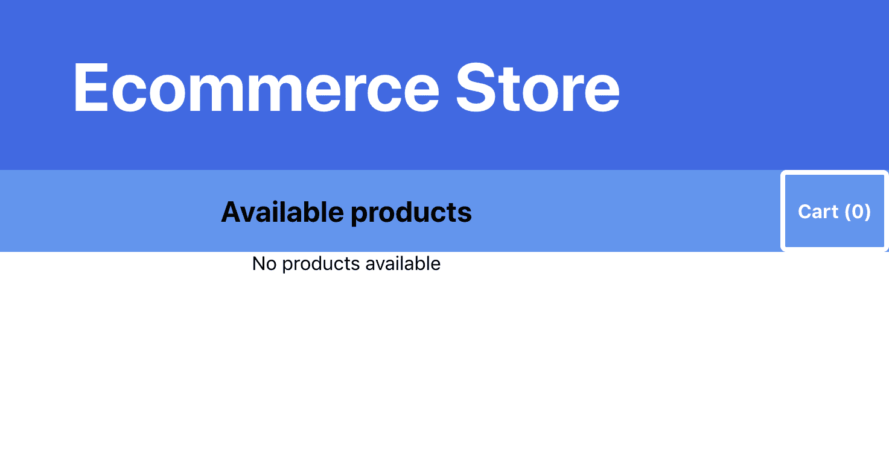
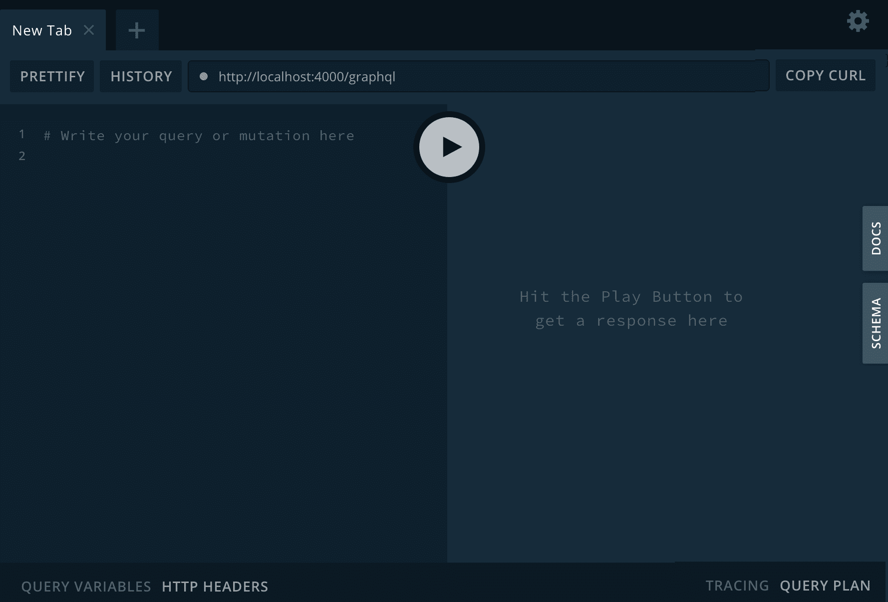
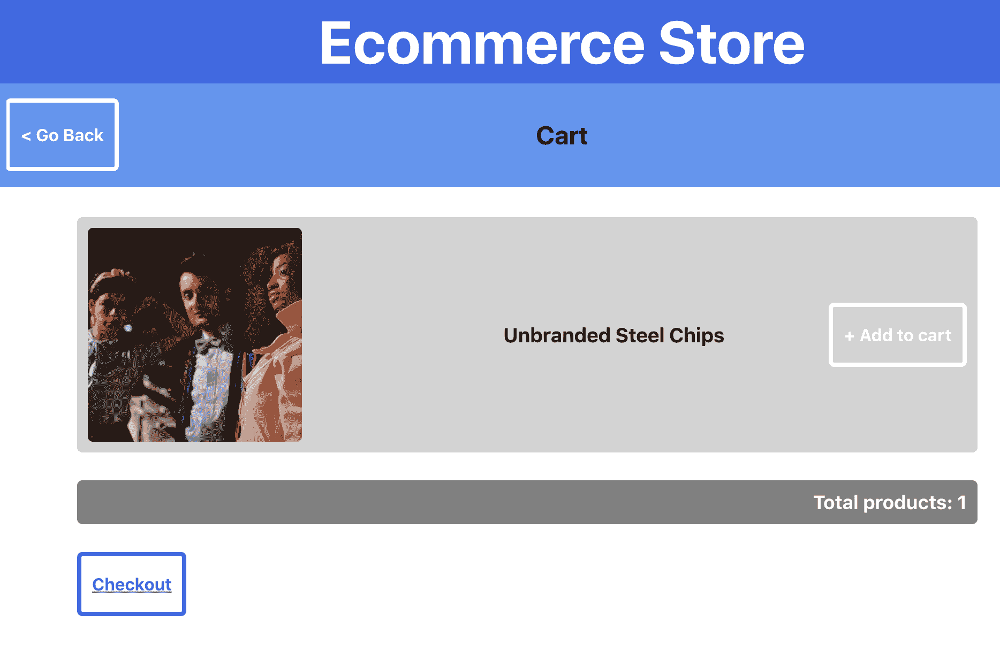

# 使用 React Native 和 GraphQL 构建全栈电子商务应用程序

如果您正在阅读本书，这意味着您已经阅读了本书的最后一部分，该部分使用 React 构建 web 应用程序。在前面的章节中，您已经使用了 React 的核心功能，例如呈现组件、使用上下文的状态管理和挂钩。您已经学习了如何创建 PWA 和 SSR 应用程序，以及如何向 React 应用程序添加路由。此外，您还知道如何使用 Jest 和酶将测试添加到 React 应用程序中。让我们将 GraphQL 添加到您迄今所了解的内容列表中。

在本章中，您不仅要构建应用程序的前端，还要构建后端。为此，将使用 GraphQL，最好将其定义为 API 的查询语言。使用模拟数据和 Apollo 服务器，您将扩展一个 GraphQL 服务器，该服务器为您的 React 应用程序公开一个端点。在前端，将使用 Apollo 客户端使用该端点，该客户端可帮助您处理向服务器发送请求以及该数据的状态管理。

本章将介绍以下主题：

*   用 GraphQL 查询和变异数据
*   使用 Apollo 客户端使用 GraphQL
*   使用 GraphQL 处理状态管理

# 项目概述

在本章中，我们将创建一个全栈电子商务应用程序，该应用程序以 GraphQL 服务器作为后端，并使用 Apollo 客户端在 React 中使用该服务器。对于后端和前端，都可以使用初始应用程序快速启动。

构建时间为 3 小时。

# 开始

我们将在本章中创建的项目建立在您可以在 GitHub 上找到的初始版本之上：[https://github.com/PacktPublishing/React-Projects/tree/ch7-initial](https://github.com/PacktPublishing/React-Projects/tree/ch7-initial) 。完整的源代码也可以在 GitHub 上找到：[https://github.com/PacktPublishing/React-Projects/tree/ch7](https://github.com/PacktPublishing/React-Projects/tree/ch7) 。

最初的项目包括一个基于 createreact 应用程序的样板应用程序（用于快速启动）和一个可以在本地运行的 GraphQL 服务器。您可以在`client`目录中找到应用程序，在`server`目录中可以找到 GraphQL 服务器。初始应用程序和 GraphQL 服务器都需要安装依赖项，并且需要在开发过程中始终运行，这可以通过在`client`和`server`目录中运行以下命令来实现：

```jsx
npm install && npm start
```

此命令将安装运行 React 应用程序和 GraphQL 服务器所需的所有依赖项，包括`react`、`react-scripts`、`graphql`和`apollo-server`。如果您想了解已安装的所有依赖项，请查看`client`和`server`目录中的`package.json`文件。

安装过程完成后，GraphQL 服务器和 React 应用程序都将启动。

# 开始使用初始 React 应用程序

由于 React 应用程序是由 Create React App 创建的，因此它将在您的浏览器中的`http://localhost:3000/`处自动启动。这个初始应用程序不显示任何数据，因为它仍然需要连接到 GraphQL 服务器，这将在本章后面介绍。因此，此时应用程序将仅呈现标题为“电子商务商店”的标题以及子标题，如下所示：



该初始 React 应用程序的结构如下所示：

```jsx
ecommerce-store
|-- client
    |-- node_modules
    |-- public
        |-- favicon.ico
        |-- index.html
        |-- manifest.json
    |-- src
        |-- components
            |-- Button
                |-- Button.js
            |-- Cart
                |-- Cart.js
                |-- CartButton.js
                |-- Totals.js
            |-- Header
                |-- Header.js
                |-- SubHeader.js
            |-- Products
                |-- ProductItem.js
                |-- Products.js
            |-- App.js
        |-- index.js
        |-- serviceWorker.js
    |-- package.json
```

在`client/src`目录中，您将找到应用程序的入口点，即`index.js`。此文件将引用`App.js`中的`App`组件。`App`组件有一个`Router`组件，根据用户访问的 URL 呈现`Products`或`Cart`组件。当未指定具体路线时，将呈现`Products`组件，该组件由一个`SubHeader`组件和一个`Button`到`Cart`组件，以及一个`map`函数组成，该函数返回显示产品信息的`ProductItem`组件列表。`/cart`路由将呈现同样有`SubHeader`的`Cart`组件，这次使用`Button`返回上一页。同样，return 将返回一个产品列表，`Totals`组件将显示购物车中的产品总数。

# GraphQL 服务器入门

尽管您不会对 GraphQL 服务器进行任何代码更改，但了解服务器的工作方式以及 GraphQL 的基本概念是很重要的。

GraphQL 最好描述为 API 的查询语言，并定义为从 API 检索数据的约定。通常，GraphQL API 与 RESTful API 进行比较，RESTful API 是一种众所周知的协议，用于发送依赖于多个端点的 HTTP 请求，这些端点都将返回单独的数据收集。与众所周知的 RESTful API 相反，GraphQLAPI 将提供一个端点，允许您查询和/或改变数据源，如数据库。您可以通过向 GraphQL 服务器发送包含查询或变异操作的文档来查询或变异数据。任何可用的数据都可以在 GraphQL 服务器的模式中找到，该服务器由定义可以查询或修改哪些数据的类型组成。

GraphQL 服务器可以在`server`目录中找到，并为您将在本章中构建的前端 React 应用程序提供后端。此服务器是使用 Express 和 Apollo server 创建的，其中 Express 是使用 JavaScript 创建 API 的框架，Apollo server 是一个开源软件包，可以帮助您使用有限的代码创建 GraphQL 服务器。在确保您已经运行了`server`目录中的`npm install`和`npm start`命令后，`http://localhost:4000/graphql`阿波罗服务器上的 GraphQL API 将变为可用，默认情况下，您的 GraphQL 服务器将在端口`4000`上运行。在浏览器的此页面上，将显示 GraphQL 游乐场，在这里，您可以使用和浏览 GraphQL 服务器。此游乐场的示例可在以下屏幕截图中看到：



有了这个平台，您可以将查询和变化发送到 GraphQL 服务器，您可以在页面的左侧键入该服务器。可以在这个 GraphQL 服务器的模式中找到您能够发送的查询和突变，您可以通过单击标记为 SCHEMA 的绿色按钮来找到它。此按钮将打开模式概述，其中显示 GraphQL 服务器的所有可能返回值：


每当您在此页面左侧描述查询或变异时，服务器返回的输出将显示在页面右侧。GraphQL 查询的构造方式将决定返回数据的结构，因为 GraphQL 遵循的原则是*询问您需要什么，准确地获取*。由于 GraphQL 查询总是返回可预测的结果，这意味着我们可以有一个如下所示的查询：

```jsx
query {
  products {
    id
    title
    thumbnail
  }
}
```

这将返回一个输出，该输出将遵循发送到 GraphQL 服务器的文档中定义的相同查询结构，并具有以下格式：

```jsx
{
  "data": {
    "products": [
      {
        "id": 16608,
        "title": "Awesome Rubber Shoes",
        "thumbnail": "http://lorempixel.com/400/400/technics"
      },
      {
        "id": 20684,
        "title": "Refined Soft Table",
        "thumbnail": "http://lorempixel.com/400/400/fashion"
      }
    ]
  }
}
```

使用 GraphQL 的应用程序通常是快速和稳定的，因为它们控制获取的数据，而不是服务器。

在下一节中，您将使用 Apollo 将 GraphQL 服务器连接到 React web 应用程序，并从应用程序向服务器发送文档。

# 使用 React、Apollo 和 GraphQL 构建全栈电子商务应用程序

在本节中，您将把 React web 应用程序连接到 GraphQL 服务器。Apollo Server 用于创建单个 GraphQL 端点，该端点使用动态模拟数据作为源。React 使用 Apollo 客户端使用此端点并处理应用程序的状态管理。

# 将 GraphQL 添加到 React 应用程序

GraphQL 服务器就绪后，让我们继续讨论从 React 应用程序向该服务器发出请求的部分。为此，您将使用 Apollo 包来帮助您在应用程序和服务器之间添加抽象层。这样，您就不必担心自己使用`fetch`将文档发送到 GraphQL 端点，并且可以直接从组件发送文档。

如前所述，您可以使用 Apollo 连接到 GraphQL 服务器；为此，将使用 Apollo 客户端。使用 Apollo Client，您可以设置与服务器的连接，处理查询和突变，并为从 GraphQL 服务器检索的数据启用缓存，等等。Apollo 客户端通过以下步骤添加到您的应用程序中：

1.  要安装 Apollo 客户端及其相关软件包，您需要从 React 应用程序初始化的`client`目录运行以下命令：

```jsx
npm install apollo-client apollo-link-http react-apollo graphql graphql-tag
```

这将不仅安装 Apollo 客户端，还将安装在 React 应用程序中使用 Apollo 客户端和 GraphQL 所需的其他依赖项：

*   `apollo-link-http`将连接 GraphQL 服务器
*   `react-apollo`将提供您需要发送查询和处理数据流的组件
*   `graphql`和`graphql-tag`将处理 GraphQL 并使用查询语言编写

2.  这些包应该导入到您想要创建 Apollo 客户端的文件中，在本例中，该文件将为`client/src/App.js`：

```jsx
import React from 'react';
import styled, { createGlobalStyle } from 'styled-components';
import { Route, Switch } from 'react-router-dom';
import Header from './Header/Header';
import Products from './Products/Products';
import Cart from './Cart/Cart';

import ApolloClient from 'apollo-client';
import { HttpLink } from 'apollo-link-http';
import { ApolloProvider } from 'react-apollo';

const GlobalStyle = createGlobalStyle`
    ...
```

3.  现在您可以使用`ApolloClient`类定义`client`常量，并使用`HttpLink`与 GraphQL 服务器建立连接；因此，创建一个如下的`client`常量：

```jsx
import React from 'react';
import styled, { createGlobalStyle } from 'styled-components';
import { Route, Switch } from 'react-router-dom';
import Header from './Header/Header';
import Products from './Products/Products';
import Cart from './Cart/Cart';

import ApolloClient from 'apollo-client';
import { InMemoryCache } from 'apollo-cache-inmemory';
import { HttpLink } from 'apollo-link-http';
import { ApolloProvider } from 'react-apollo';

const client = () => new ApolloClient({
 link: new HttpLink({
 uri: 'http://localhost:6000',
 }),
});

const GlobalStyle = createGlobalStyle`
    ...
```

4.  在`App`组件的`return`函数中，您需要添加`ApolloProvider`并传递您刚刚创建为道具的`client`：

```jsx
...
const App = () => (
-  <>
+  <ApolloProvider client={client}>
     <GlobalStyle />
       <AppWrapper>
       <Header />
       <Switch>
         <Route exact path='/' component={Products} />
         <Route path='/cart' component={Cart} />
       </Switch>
     </AppWrapper>
-  </>
+  </ApolloProvider>
);

export default App;
```

完成这些步骤后，`ApolloProvider`中嵌套的所有组件都可以访问该`client`并将带有查询和/或突变的文档发送到 GraphQL 服务器。从`ApolloProvider`获取数据的方法类似于上下文 API 如何与上下文值交互，将在本节的下一部分中演示。

# 使用 React 发送 GraphQL 查询

`react-apollo`包不仅导出提供程序，还导出使用该提供程序的值的方法。这样，您可以使用添加到提供程序的客户端轻松获得任何值。其中一种方法是`Query`，它可以帮助您将包含查询的文档发送到 GraphQL 服务器，而无需使用`fetch`函数。

由于`Query`组件应始终嵌套在`ApolloProvider`组件中，因此它们可以放置在`App`中渲染的任何组件中。其中之一是`client/src/components/Product/Products.js`中的`Products`成分。此组件为`/`路线呈现，应显示电子商务商店中提供的产品。

要从`Products`组件发送文档，请遵循以下步骤，这些步骤将指导您使用`react-apollo`发送文档的过程：

1.  从 GraphQL 服务器获取产品的查询可以使用操场中的内省方法或从`server/typeDefs.js`文件中找到，如下所示：

```jsx
query {
  products {
    id
    title
    thumbnail
  }
}
```

将此文档连同查询一起发送到 GraphQL 服务器将返回一个由包含产品信息的对象组成的数组，默认情况下，该数组最多只能包含 10 个产品。结果将以 JSON 格式返回，并在每次发送请求时由不同的产品组成，因为数据由 GraphQL 服务器模拟。

2.  在`Products`组件中，您可以从`react-apollo`导入`Query`组件，并为命名的`getProducts`查询定义一个常量。此外，您还需要从`graphql-tag`导入`gql`，以便在 React 文件中使用 GraphQL 查询语言，如下所示：

```jsx
import React from 'react';
import styled from 'styled-components';
import { Query } from 'react-apollo';
import gql from 'graphql-tag';
import SubHeader from '../Header/SubHeader';
import ProductItem from './ProductItem';

const GET_PRODUCTS = gql`
 query getProducts {
 products {
 id
 title
 thumbnail
 }
 }
`;

export const ProductItemsWrapper = styled.div`
    ...
```

3.  导入的`Query`组件可以从`Products`返回，并根据作为道具传递给它的查询处理数据获取过程。与上下文 API 相同，`Query`可以通过返回一个`data`变量来使用来自提供者的数据。您可以从该对象遍历`products`字段，并通过添加`Query`组件返回`ProductItem`组件列表：

```jsx
...
const Products = ({ match, history, loading, error, products }) => {
-  const isEmpty = products.length === 0 ? 'No products available' : false;

  return (
    <>
      {history && (
        <SubHeader title='Available products' goToCart={() => history.push('/cart')} />
      )} -      {!loading && !error && !isEmpty ? (
+      <Query query={GET_PRODUCTS}>
+        {({ data }) => {
+          return (             <ProductItemsWrapper>
               {data.products && data.products.map(product => (
                 <ProductItem key={product.id} data={product} />
               ))}
             </ProductItemsWrapper> +          );
+        }}
+      </Query>
-      ) : (
-        <Alert>{loading ? 'Loading...' : error || isEmpty}</Alert>
-      )}
    </>
  );
};
...
```

4.  `Query`组件不仅返回`data`对象，还将返回`loading`和`error`变量。因此，您可以使用此值并返回加载消息（如果其值为`true`，而不是为`loading`属性设置默认值。对于`error`变量，应用相同的方法。此外，`Products`道具的默认值在此不再使用，可以删除：

```jsx
- const Products = ({ match, history, loading, error, products }) => {
-   return (
+ const Products = ({ match, history }) => (
  <>
    {history && (
      <SubHeader title='Available products' goToCart={() => history.push('/cart')} />
    )}
    <Query query={GET_PRODUCTS}>
-       {({ data }) => {
+       {({ loading, error, data }) => {
+         if (loading || error) {
+           return <Alert>{loading ? 'Loading...' : error}</Alert>;
+         }
          return (
            <ProductItemsWrapper>
              {data.products && data.products.map(product => (
                <ProductItem key={product.id} data={product} />
              ))}
            </ProductItemsWrapper>
          );
        }}
      </Query>
  </>
);
- };

- Products.defaultProps = {
-   loading: false,
-   error: '',
-   products: [],
- }
```

当您的应用程序装载时，这将向 GraphQL 服务器发送带有`GET_PRODUCTS`查询的文档，并随后在`ProductItem`组件列表中显示产品信息。添加从 GraphQL 服务器检索产品信息的逻辑后，您的应用程序将类似于以下内容：


由于`/cart`路由上的`Cart`组件也需要从 GraphQL 服务器查询数据，因此也需要对`src/components/Cart/Cart.js`文件进行更改。就像我们对`Products`所做的一样，应该添加`Query`组件来从服务器检索数据，可以通过以下步骤完成：

1.  首先导入将查询发送到 GraphQL 服务器所需的依赖项，这些依赖项是`react-apollo`获取`Query`组件和`graphql-tag`使用 GraphQL 查询语言定义要发送到 GraphQL 的查询：

```jsx
import React from 'react';
import styled from 'styled-components';
+ import { Query } from 'react-apollo';
+ import gql from 'graphql-tag';
import SubHeader from '../Header/SubHeader';
import ProductItem from '../Products/ProductItem';
import Totals from './Totals';

const CartWrapper = styled.div`
    ...
```

2.  之后可以定义`query`，应该在单据中发送。这将检索`cart`的信息，包括`cart`中可能存在的任何`products`：

```jsx
import React from 'react';
import styled from 'styled-components';
import { Query } from 'react-apollo';
import gql from 'graphql-tag';
import SubHeader from '../Header/SubHeader';
import ProductItem from '../Products/ProductItem';
import Totals from './Totals';

+ const GET_CART = gql`
+  query getCart {
+    cart {
+      total
+      products {
+        id
+        title
+        thumbnail
+      }
+    }
+  } + `; const CartWrapper = styled.div`
    ...
```

3.  将`Cart`组件的现有代码替换为以下代码，其中`Query`组件被实现，`Cart`组件只接收`match`和`history`道具。因此，您需要将此组件的代码替换为以下代码：

```jsx
...

- const Cart = ...

+ const Cart = ({ match, history }) => (
+  <>
+    {history && (
+      <SubHeader goBack={() => history.goBack()} title='Cart' />
+    )}
+    <Query query={GET_CART}>
+      {({ loading, error, data }) => {
+        if (loading || error) {
+          return <Alert>{loading ? 'Loading...' : error}</Alert>;
+        }
+        return (
+          <CartWrapper>
+            <CartItemsWrapper>
+              {data.cart && data.cart.products.map(product => (
+                <ProductItem key={product.id} data={product} />
+              ))}
+            </CartItemsWrapper>
+            <Totals count={data.cart.total} />
+          </CartWrapper>
+        );
+      }}
+    </Query>
+  </>
+ );

export default Cart;

...
```

4.  这将不会显示任何产品，因为购物车是空的；购物车将在下一节中装满产品。但是，让我们继续添加一个`Query`组件到购物车的按钮，并在`SubHeader`中为`/`路线添加一个占位符计数器。因此，可以在`client/src/components/Cart`目录中创建一个名为`CartButton.js`的新文件。在此文件中，`Query`组件将从请求购物车中产品总数的查询返回数据。此外，我们还可以通过将以下代码添加到此文件，向`Button`组件添加一个值：

```jsx
import React from 'react'
import { Query } from 'react-apollo';
import gql from 'graphql-tag';
import Button from '../Button/Button';

const GET_CART_TOTAL = gql`
  query getCartTotal {
    cart {
      total
    }
  }
`;

const CartButton = ({ onClick }) => (
  <Query query={GET_CART_TOTAL}>
    {({ data, loading, error }) => (
      <Button onClick={onClick}>
        {`Cart (${(loading || error) ? 0 : data && data.cart.total})`}
      </Button>
    )}
  </Query>
);

export default CartButton
```

5.  此`CartButton`组件替换`Button`，该组件现在显示为`client/src/components/Header/SubHeader.js`文件中购物车中产品数量的占位符计数：

```jsx
import React from 'react';
import styled from 'styled-components';
import Button from '../Button/Button';
+ import CartButton from '../Cart/CartButton'; ...

const SubHeader = ({ goBack, title, goToCart = false }) => (
  <SubHeaderWrapper>
    {goBack && <SubHeaderButton onClick={goBack}>{`< Go Back`}</SubHeaderButton>}
    <Title>{ title }</Title>
-    {goToCart && <SubHeaderButton onClick={goToCart}>{`Cart (0)`}</SubHeaderButton>}
+    {goToCart && <CartButton onClick={goToCart} />}
  </SubHeaderWrapper>
);

export default SubHeader;
```

所有显示产品或购物车信息的组件都连接到 GraphQL 客户端，您可以通过添加将产品添加到购物车的突变来继续。本节的最后一部分将介绍如何向应用程序添加变体以及如何将文档容器变体发送到 GraphQL 服务器。

# 使用 Apollo 客户端处理突变

变异数据使使用 GraphQL 变得更有趣，因为当数据变异时，应该执行一些副作用。例如，当用户向购物车添加产品时，购物车的数据也应该在整个组件中更新。这在使用 Apollo 客户端时非常容易，因为提供者以与上下文 API 相同的方式处理此问题。

在编写第一个变体之前，应该将购物车的可执行查询的定义移动到常量文件中。这样，您就可以轻松地将它们导入到其他组件中，作为副作用重用和执行它们。创建新的常量文件并将所有 GraphQL 查询和突变移动到该文件需要进行以下更改：

1.  在`client/src`目录中，您应该创建一个名为`constants.js`的新文件，并将两个已经定义的查询放在这里，可以在`Cart`和`CartButton`组件中找到。此外，您还需要导入`graphql-tag`以使用 GraphQL 查询语言，方法是将以下代码块添加到新创建的文件中：

```jsx
import gql from 'graphql-tag';

export const GET_CART_TOTAL = gql`
  query getCartTotal {
    cart {
      total
    }
  }
`;

const GET_CART = gql`
  query getCart {
    cart {
      total
      products {
        id
        title
        thumbnail
      }
    }
  }
`;

export default GET_CART
```

2.  在`Cart`组件中，您可以将定义删除到`GET_CART`，然后从`client/src/components/Cart/Cart.js`文件中的`client/src/constants.js`导入该定义：

```jsx
import React from 'react';
import styled from 'styled-components';
import { Query } from 'react-apollo';
- import gql from 'graphql-tag';
import SubHeader from '../Header/SubHeader';
import ProductItem from '../Products/ProductItem';
import Totals from './Totals';
+ import { GET_CART } from '../../constants';

- const GET_CART = gql`
-  query getCart {
-    cart {
-      total
-      products {
-        id
-        title
-        thumbnail
-      }
-    }
-  }
- `;

const CartWrapper = styled.div`
  ...
```

3.  对于`CartButton.js`中的`CartButton`组件，您应该应用相同的更改，但这次对于`GET_CART_TOTAL`查询，也可以从`constants`文件导入，从`CartButton.js`文件删除：

```jsx
import React from 'react'
import { Query } from 'react-apollo';
- import gql from 'graphql-tag';
import Button from '../Button/Button';
+ import { GET_CART_TOTAL } from '../../constants';

- const GET_CART_TOTAL = gql`
-   query getCartTotal {
-    cart {
-      total
-    }
-  }
- `;

const CartButton = ({ onClick }) => (
  ...
```

从现在起，与目录中的组件相关的查询或变异的任何新定义都应放在该文件中。

由于您希望您的用户能够将产品添加到购物车中，因此可以在此文件中添加变异的定义。将产品添加到购物车的变异如下所示，它使用`productId`参数将产品添加到购物车。以下变异可以返回购物车的字段，就像查询一样：

```jsx
mutation addToCart($productId: Int!) {
    addToCart(input: { productId: $productId }) {
        total
    }
  }
```

你已经可以在`http://localhost:4000/graphql`提供的 GraphQL 游乐场上测试这种突变。在这里，您需要在页面左上角的框中添加突变。您想要包含在`productId`的这个变异中的变量必须放在这个页面的左下角的框中，称为查询变量。这将产生以下输出：


为了能够从 React 应用程序中使用此变体，您需要对某些文件进行以下更改：

1.  在`client/src/constants.js`文件中创建一个新的导出常量，并向其中添加变异：

```jsx
import gql from 'graphql-tag';

+ export const ADD_TO_CART = gql`
+  mutation addToCart($productId: Int!) {
+    addToCart(input: { productId: $productId }) {
+        total
+    }
+  }
+ `;

export const GET_CART_TOTAL = gql`
    ...
```

2.  目前还没有将产品添加到购物车的按钮，因此您可以在`Cart`目录中创建一个新文件，并将其命名为`AddToCartButton.js`。在此文件中，可以添加以下代码：

```jsx
import React from 'react'
import { Mutation } from 'react-apollo';
import Button from '../Button/Button';
import { ADD_TO_CART } from '../../constants';

const AddToCartButton = ({ productId }) => (
  <Mutation mutation={ADD_TO_CART}>
    {addToCart => (
      <Button onClick={() => addToCart({ variables: { productId }})}>
        {`+ Add to cart`}
      </Button>
    )}
  </Mutation>
);

export default AddToCartButton;
```

这个新的`AddToCartButton`将`productId`作为道具，并且有一个`react-apollo`中的`Mutation`组件，它使用了您在`client/src/constants.js`中创建的`Mutation`。`Mutation`的输出是调用此变异的实际函数，它将包含输入的对象作为参数。点击`Button`组件将执行突变。

3.  此按钮应显示在`Products`组件中列表中的产品旁边，每个产品显示在`ProductItem`组件中。这意味着您需要在`'src/components/Products/ProductItem.js'`中导入`AddCartButton`并使用以下代码向其传递`productId`道具：

```jsx
import React from 'react';
import styled from 'styled-components';
+ import AddToCartButton from '../Cart/AddToCartButton';

...

const ProductItem = ({ data }) => (
  <ProductItemWrapper>
    <Thumbnail src={data.thumbnail} width={200} />
    <Title>{data.title}</Title>
+   <AddToCartButton productId={data.id} />
  </ProductItemWrapper>
);

export default ProductItem;
```

现在，当您在浏览器中打开 React 应用程序时，产品标题旁边将显示一个按钮。如果单击此按钮，将向 GraphQL 服务器发送变异，并将产品添加到购物车。但是，您不会看到对`SubHeader`组件中显示购物车（0）的按钮的任何更改

4.  要更新`CartButton`，您需要指定，当购物车发生变异时，应再次执行其他查询。这可以通过在`client/src/components/Cart/AddToCartButton.js`中的`Mutation`组件上设置`refetchQueries`道具来实现。此道具获取一个对象数组，其中包含有关应请求的查询的信息。这些查询是由`CartButton`执行的`GET_CART_TOTAL`查询和来自`Cart`组件的`GET_CART`查询。要执行此操作，请进行以下更改：

```jsx
import React from 'react'
import { Mutation } from 'react-apollo';
import Button from '../Button/Button';
- import { ADD_TO_CART, GET_CART_TOTAL } from '../../constants';
+ import { GET_CART, ADD_TO_CART, GET_CART_TOTAL } from '../../constants';

const AddToCartButton = ({ productId }) => (
-  <Mutation mutation={ADD_TO_CART}>
+  <Mutation mutation={ADD_TO_CART} refetchQueries={[{ query: GET_CART }, { query: GET_CART_TOTAL }]}>
    {addToCart => (
      <Button onClick={() => addToCart({ variables: { productId }})}>
        {`+ Add to cart`}
      </Button>
    )}
  </Mutation>
);

export default AddToCartButton;
```

现在，每次您从该组件向 GraphQL 服务器发送文档中的变异时，`GET_CART`和`GET_CART_TOTAL`查询也将被发送。如果结果已更改，`CartButton`和`Cart`组件将使用此新输出进行渲染。

在本节中，您添加了一些逻辑，通过使用 Apollo 的 GraphQL 客户端将查询和突变发送到 GraphQL 服务器。该客户端还具有其他功能，如本地状态管理，您将在下一节中了解这些功能。

# 管理地方政府

您不仅可以使用 Apollo Client 来管理从 GraphQL 服务器获取的数据，还可以使用它来管理本地状态。使用 Apollo，将本地状态与来自 GraphQL 服务器的数据结合起来变得很容易，因为您还可以使用查询和突变来处理本地状态。

您可能希望将此电子商务商店的信息放入本地州的一个很好的示例是应从 GraphQL 服务器请求的产品数量。在本章的第一部分中，您已经创建了一个查询，该查询使用一个名为`limit`的参数，该参数定义将返回多少产品。

要向应用程序添加本地状态，需要对 Apollo 客户端的设置进行一些更改，然后还需要进行以下更改：

1.  在`client/src/App.js`文件中，需要分离`cache`常量；这样，您可以使用`writeData`方法向`cache`添加新值。此外，您还需要将本地`resolvers`和`typeDefs`添加到`client`，这将在 GraphQL 服务器的`resolvers`和`typeDefs`旁边使用。为此，请更改以下代码：

```jsx
+ const cache = new InMemoryCache();

const client = new ApolloClient({
   link: new HttpLink({
     uri: 'http://localhost:4000/',
   }),
-  cache,
+  resolvers: {},
+  typeDefs: `
+    extend type Query {
+        limit: Int!
+    }
+  `,
});

+ cache.writeData({
+  data: {
+      limit: 5,
+  },
+ });
```

在前面的代码块中，模式被扩展为一个`Query`类型，该类型有一个`limit`字段，这意味着您可以查询`client`以获取该值。此外，`limit`的初始值被写入`cache`。这意味着当应用程序首次装载时，`limit`的值将始终为`5`。

2.  我们还将所有与产品相关的查询添加到`client/src/constants.js`文件中，通过向文件中添加以下代码，可以将其添加到`client/src/components/Products`目录中：

```jsx
import gql from 'graphql-tag';

...

+ export const GET_LIMIT = gql`
+  query getLimit {
+    limit @client
+  }
+ `;

+ export const GET_PRODUCTS = gql`
+  query getProducts {
+    products {
+      id
+      title
+      thumbnail
+    }
+  }
+ `;
```

3.  对于使用本地状态的`products`查询`limit`，需要对`GET_PRODUCTS`查询做一个小的修改：

```jsx
...

const GET_PRODUCTS = gql`
- query getProducts { + query getProducts($limit: Int) { -   products {
+   products(limit: $limit) {
      id
      title
      thumbnail
    }
  }
`;

export default GET_PRODUCTS;
```

此`query`现在将使用`limit`变量来请求产品数量，而不是 GraphQL 服务器中预定义的`10`值。通过添加`@client`，阿波罗客户机将知道从`cache`获取该值，即本地状态。

4.  在`Products`组件中，这些查询应该从`constants.js`文件导入，`limit`的值应该通过`react-apollo`中的`Query`组件请求。另外，在请求`GET_PRODUCTS`查询时，`Query`返回的`limit`值应该在`variables`属性中发送。因此，进行以下更改以使用更新的查询并将变量传递给它：

```jsx
import React from 'react';
import styled from 'styled-components';
import {Query} from 'react-apollo';
- import gql from 'graphql-tag';
import SubHeader from '../Header/SubHeader';
import ProductItem from './ProductItem';
+ import { GET_PRODUCTS, GET_LIMIT } from '../../constants';

- const GET_PRODUCTS = gql`
- query getProducts {
-    products {
- id
- title
-       thumbnail
-    }
- }
- `;

...

const Products = ({ match, history }) => (
  <>
    {history && (
      <SubHeader title='Available products' goToCart={() => history.push('/cart')} />
    )}
    <Query query={GET_LIMIT}>
      {({ loading, error, data }) => (
-       <Query query={GET_PRODUCTS}>
+       <Query query={GET_PRODUCTS} variables={{ limit: parseInt(data.limit) }}>
          {({ loading, error, data }) => {
            if (loading || error) {
              return <Alert>{loading ? 'Loading...' : error}</Alert>;
            }
            return (
              <ProductItemsWrapper>
                {data.products && data.products.map(product => (
                  <ProductItem key={product.id} data={product} />
                ))}
              </ProductItemsWrapper>
            );
          }}
        </Query>
      )}
    </Query>
  </>
);

export default Products;
```

在前面的更改中，`GET_LIMIT`查询返回的值将作为变量发送到`GET_PRODUCTS`查询，您需要使用`parseInt`确保该值为整数。如果您现在在浏览器中查看应用程序，将显示 5 种产品。

5.  接下来，为了获得`limit`的初始值，还可以动态设置该值。因此，您可以再次使用`writeData`方法更新缓存。这应该从可以访问客户端的不同组件完成。为此，您需要在新的`Filter.js`文件的`client/src/components/Products`目录中创建一个组件。在此文件中，可以放置以下代码：

```jsx
import React from 'react';
import { ApolloConsumer } from 'react-apollo';

const Filters = ({ limit }) => (
  <ApolloConsumer>
      {client => (
        <>
        <label for='limit'>Number of products: </label>
        <select id='limit' value={limit} onChange={e => client.writeData({ data: { limit: e.target.value } })}>
          <option value={5}>5</option>
          <option value={10}>10</option>
          <option value={20}>20</option>
        </select>
        </>
      )}
    </ApolloConsumer>
);

export default Filters;
```

此`Filter`组件使用`ApolloConsumer`从`ApolloProvider`获取客户端的值，这与 React 上下文 API 的工作方式类似。从嵌套在`ApolloProvider`中的任何组件中，您将能够使用`react-apollo`中的消费者获取客户机值。客户机将用于将数据写入缓存，该数据将从选择下拉菜单的值中检索。

6.  `Filter`组件也应添加到`Products`组件中，以便它可以实际用于更改`limit`的值：

```jsx
import React from 'react';
import styled from 'styled-components';
import { Query } from 'react-apollo';
import SubHeader from '../Header/SubHeader';
import ProductItem from './ProductItem';
+ import Filters from './Filters';
import { GET_PRODUCTS, GET_LIMIT } from '../../constants';

...

const Products = ({ match, history }) => (
  <>
    {history && (
      <SubHeader title='Available products' goToCart={() => history.push('/cart')} />
    )}
    <Query query={GET_LIMIT}>
      {({ loading, error, data }) => (
+       <>
+         <Filters limit={parseInt(data.limit)} />
          <Query query={GET_PRODUCTS} variables={{ limit: parseInt(data.limit) }}>
            {({ loading, error, data }) => {
              if (loading || error) {
                return <Alert>{loading ? 'Loading...' : error}</Alert>;
              }
              return (
                <ProductItemsWrapper>
                  {data.products && data.products.map(product => (
                    <ProductItem key={product.id} data={product} />
                  ))}
                </ProductItemsWrapper>
              );
            }}
          </Query>
+       </>
      )}
    </Query>
  </>
);

export default Products;
```

由于`GET_PRODUCTS`的`Query`组件嵌套在`GET_LIMIT`的`Query`组件中，所以无论何时发送`GET_LIMIT`查询，都会发送该查询。因此，当您使用选择下拉菜单更改`limit`时，将发送`GET_PRODUCTS`查询，并且显示的产品数量将发生更改。

通过这些更改，应用程序使用 Apollo 客户端从 GraphQL 服务器获取数据并处理本地状态管理。此外，用户现在可以过滤他们将在您的应用程序中看到的产品数量，这将使您的应用程序看起来类似于以下内容：


将产品添加到购物车的按钮已在上一节中添加，而购物车的功能将在下一节（向项目添加身份验证）中处理。

# 通过 React 和 GraphQL 使用身份验证

当用户将产品添加到购物车中时，您希望他们能够结帐，但在此之前，应该对用户进行身份验证，因为您希望知道谁在购买产品。在 React 中处理身份验证还需要与后端交互，因为您需要将用户的信息存储在某个位置或检查用户是否存在。

对于前端应用程序中的身份验证，大多数情况下使用**JSON Web 令牌**（**JWTs**），这些令牌是加密的令牌，可轻松用于与后端共享用户信息。当用户成功通过身份验证时，后端将返回 JWT，并且通常，此令牌将有一个过期日期。对于每个应该对用户进行身份验证的请求，都应该发送令牌，以便后端服务器可以确定用户是否经过身份验证并允许其执行此操作。虽然 JWT 可以用于身份验证，因为它们是加密的，但是不应该向它们添加私有信息，因为令牌应该只用于对用户进行身份验证。只有在发送了具有正确 JWT 的文档后，才能从服务器发送私人信息。

# React 路由与认证

此项目的 GraphQL 服务器已设置为处理身份验证，并将在向其发送正确的用户信息时返回 JWT 令牌。当用户想要签出购物车时，应用程序将在本地或会话存储中查找 JWT 令牌，并将用户重定向到签出页面或登录页面。为此，应在`react-router`中添加专用路由，该路由只有在用户通过身份验证后才可用

添加专用路由需要进行以下更改：

1.  签出和登录页面的新路由必须添加到`client/src/components/App.js`文件中的`Router`组件中，用户可以在其中签出或登录。为此，您必须从`react-router-dom`导入已经创建的`Checkout`和`Login`组件以及`Redirect`组件：

```jsx
import React from 'react';
import styled, { createGlobalStyle } from 'styled-components';
- import { Route, Switch } from 'react-router-dom';
+ import { Route, Switch, Redirect } from 'react-router-dom';
import Header from './Header/Header';
import Products from './Products/Products';
import Cart from './Cart/Cart';
+ import Login from './Checkout/Login';
+ import Checkout from './Checkout/Checkout';

...
```

2.  导入这些路由后，必须将路由添加到`Router`中的`Switch`中，使其可供用户使用：

```jsx
const App = () => (
  <ApolloProvider client={client}>
    <GlobalStyle />
    <AppWrapper>
      <Header />
      <Switch>
        <Route exact path='/' component={Products} />
        <Route path='/cart' component={Cart} />
+       <Route path='/checkout' component={Checkout} />
+       <Route path='/login/ component={Login} />
      </Switch>
    </AppWrapper>
  </ApolloProvider>
);

export default App;
```

3.  在当前情况下，用户可以导航到`login`和`checkout`页面，而无需验证。要检查用户是否经过身份验证，可以使用`Route`组件的 render props 方法。在此方法中，必须检查此用户的会话存储中是否存储了 JWT。当前，会话存储中未存储令牌，因为稍后将添加令牌。但您仍然可以通过添加以下函数来创建函数以检查它：

```jsx
...

+ const isAuthenticated = sessionStorage.getItem('token');

const cache = new InMemoryCache();

const client = new ApolloClient({

  ...
```

There are many ways to store a JWT, such as using the local storage, session storage, cookies, or a local state in the form of the `apollo-link-state` package. As long as you follow the protocol of JWT, encrypt no private information in the token, and add an expiration date to it, all of these places can be considered as a safe place to store the token.

4.  在此之后，render props 方法用于签出路由，以检查用户是否经过身份验证。如果没有，用户将使用`Redirect`组件重定向到登录页面。否则，用户将看到`Checkout`组件，该组件将接收 render props 方法返回的路由道具。要实现此目的，请进行以下更改：

```jsx
const App = () => (
  <ApolloProvider client={client}>
    <GlobalStyle />
    <AppWrapper>
      <Header />
      <Switch>
        <Route exact path='/' component={Products} />
        <Route path='/cart' component={Cart} />
-       <Route path='/checkout' component={Checkout} />
+       <Route 
+         path='/checkout' 
+         render={props => 
+           isAuthenticated() 
+             ? <Checkout /> 
+             : <Redirect to='/login' />
+         } 
+       />
        <Route path='/login' component={Login} />
      </Switch>
    <AppWrapper>
  </ApolloProvider>
);

export default App;
```

当您尝试在浏览器中访问`http://localhost:3000/checkout`路由时，您将始终被重定向到`/login`路由，因为会话存储中尚未存储 JWT。在本节的下一部分中，您将添加逻辑，通过发送带有登录信息的变体从 GraphQL 服务器检索 JWT。

# 从 GraphQL 服务器接收 JWT

GraphQL 服务器已经设置为处理身份验证，因为我们向它发送了一个包含带有登录信息的变异的文档。当您发送正确的用户名和密码时，服务器将返回一个包含您的用户名和过期日期的 JWT。向 GraphQL 服务器发送查询可以通过使用`react-apollo`中的`Mutation`组件或使用 React Apollo 挂钩来完成，这为您提供了更大的灵活性。可以从`Login`组件进行登录，您可以在`client/src/components/Checkout/Login.js`文件中找到该组件，其中需要进行以下更改以验证用户身份：

1.  突变的 React Apollo 钩子需要一个文档，该文档将被发送到 GraphQL 服务器。该变异也可以在`client/src/constants.js`文件中定义，您也在该文件中定义了所有其他查询和变异：

```jsx
import gql from 'graphql-tag';

...

+ export const LOGIN_USER = gql`
+   mutation loginUser($userName: String!, $password: String!) {
+     loginUser(userName: $userName, password: $password) {
+       userName
+       token
+     }
+   }
+ `;
```

2.  `client/src/components/Checkout/Login.js`中的`Login`组件已经在使用`useState`钩子来控制`userName`和`password`的输入字段的值。`useMutation`钩子可以从`react-apollo`导入，您可以使用该钩子替换`Mutation`组件，并且仍然具有相同的功能。这个钩子也可以从`ApolloProvider`中的任何地方使用，并返回一个登录函数，该函数将文档发送到 GraphQL 服务器。通过导入钩子并将`client/src/constants.js`中的`LOGIN_USER`突变传递给钩子来添加：

```jsx
import React from 'react';
import styled from 'styled-components';
+ import { useMutation } from 'react-apollo'; import Button from '../Button/Button';
+ import { LOGIN_USER } from '../../constants';

...

const Login = () => {
+ const [loginUser] = useMutation(LOGIN_USER);
  const [userName, setUserName] = React.useState('');
  const [password, setPassword] = React.useState('');

  return (

    ...
```

React Apollo Hooks can be used from the `react-apollo` package, but if you only want to use the Hooks, you can install `@apollo/react-hooks` instead by executing `npm install @apollo/react-hooks`. GraphQL components such as `Query` or `Mutation` are available in both the `react-apollo` and `@apollo/react-components` packages. Using these packages will decrease the size of your bundle as you're only importing the features you need.

3.  创建`loginUser`函数后，可以将其从`Button`添加到`onClick`事件中，`userName`和`password`的值作为变量传递给该函数：

```jsx
return (
  <LoginWrapper>
    <TextInput
      onChange={e => setUserName(e.target.value)}
      value={userName}
      placeholder='Your username'
    />
    <TextInput
      onChange={e => setPassword(e.target.value)}
      value={password}
      placeholder='Your password'
    />
-   <Button color='royalBlue'>
+ <Button
+     color='royalBlue'
+     onClick={() => loginUser({ variables: { userName, password } })}
+ >
      Login
    </Button>
  </LoginWrapper>
);
```

4.  点击`Button`将包含`userName`和`password`值的文档发送到 GraphQL 服务器，如果成功，则返回该用户的 JWT。但是，该令牌也应存储在会话存储器中，`loginUser`函数返回承诺，`onClick`事件应成为异步函数。这样，您可以等待`loginUser`函数解析并存储令牌，或者在没有返回令牌的情况下发送错误消息：

```jsx
...

<Button
  color='royalBlue'
- onClick={() => loginUser({ variables: { userName, password } })}
+ onClick={async () => {
+   const { data } = await loginUser({
+     variables: { userName, password }
+   });
+
+   if (data.loginUser && data.loginUser.token) {
+     sessionStorage.setItem('token', data.loginUser.token);
+   } else {
+     alert('Please provide (valid) authentication details');
+   }
+ }}
>
  Login
</Button>

...
```

5.  最后，如果认证成功，用户应该被重定向到`checkout`页面。由于`Login`组件是通过签出路径使用 render props 方法进行渲染的，因此它从`react-router`接收到了道具。要将用户重定向回，您可以使用`react-router`中的`history`道具将用户推到`checkout`页面：

```jsx
...

- const Login = () => {
+ const Login = ({ history }) => {

  ...

  return (

    ...

    <Button
      color='royalBlue'
      onClick={async () => {

        ...

        if (data.loginUser && data.loginUser.token) {
          sessionStorage.setItem('token', data.loginUser.token); +         return history.push('/checkout');        } else {
          alert('Please provide (valid) authentication details');
        }

     ...

```

每个在会话存储器中存储了令牌的用户现在都可以访问`checkout`页面，只要令牌存储在那里。您可以通过转到浏览器开发人员工具中的应用程序选项卡，从会话存储中删除令牌；在这里，您将找到另一个名为会话存储的选项卡。

由于您希望用户能够从`cart`页面导航到`checkout`页面，因此您应该在`Cart`组件中添加`Button`，使用户可以使用`react-router-dom`中的`Link`组件进行导航。如果用户尚未通过身份验证，则会将用户重定向到登录页面；否则，它会将它们重定向到签出页面。此外，仅当购物车中有产品时，才应显示该按钮。要添加此`Button`，需要在`client/src/components/Cart/Cart.js`中进行以下更改：

```jsx
import React from 'react';
import styled from 'styled-components';
import { Query } from 'react-apollo';
+ import { Link } from 'react-router-dom'; import SubHeader from '../Header/SubHeader';
import ProductItem from '../Products/ProductItem';
+ import Button from '../Button/Button'; import Totals from './Totals';
import { GET_CART } from '../../constants';

...

const Cart = ({ history }) => (

  ...

  return (
    <CartWrapper>
      <CartItemsWrapper>
        {data.cart && data.cart.products.map(product => ( 
          <ProductItem key={product.id} data={product} />
        ))}
      </CartItemsWrapper>
      <Totals count={data.cart.total} />
+ {data.cart && data.cart.products.length > 0 && (
+       <Link to='/checkout'>
+         <Button color='royalBlue'>Checkout</Button>
+       </Link>
+     )}
    </CartWrapper>
  );

  ...
```

现在，您已经添加了进入应用程序最终签出页面的功能，这使得在向应用程序添加产品后，`/cart`路径在应用程序中看起来像这样：



在本节的最后一部分中，您将向发送到 GraphQL 服务器的文档中添加该令牌，在该文档中验证该令牌，以确保用户针对特定操作进行了身份验证。

# 将 JWT 传递到 GraphQL 服务器

用户的 JWT 形式的身份验证详细信息现在存储在会话存储器中，到签出页面的路由现在是私有的。但是，对于要签出的用户，该令牌还应该与服务器的每个文档一起发送到 GraphQL 服务器，以验证用户是否实际经过身份验证或令牌是否已过期。因此，您需要扩展 Apollo 客户端的设置，以便在向服务器发出请求时也发送令牌，并在其前面加上`Bearer`，因为这是识别 JWT 的方式。

按照以下步骤将 JWT 传递到 GraphQL 服务器：

1.  您需要安装 Apollo 软件包来处理向上下文添加值的问题，因为您需要`setContext`方法来完成这项工作。此方法可从`apollo-link-Context`软件包获得，您可以从`npm`安装：

```jsx
npm install apollo-link-Context
```

2.  Apollo 客户端是在`client/src/components/App.js`文件中创建的，从`apollo-link-Context`导入`setContext`方法。此外，必须解耦到 GraphQL 服务器的链接的创建，因为这还应包含身份验证详细信息，即，`token`：

```jsx
...

import { ApolloClient } from 'apollo-client';
import { InMemoryCache } from 'apollo-cache-inmemory';
import { HttpLink } from 'apollo-link-http';
import { ApolloProvider } from 'react-apollo';
+ import { setContext } from 'apollo-link-Context';

const isAuthenticated = sessionStorage.getItem('token');

+ const httpLink = new HttpLink({
+   uri: 'http://localhost:4000/graphql',
+ });

const cache = new InMemoryCache();

const client = new ApolloClient({
  link: new HttpLink({
    uri: 'http://localhost:4000/graphql',
  }),
  cache,
  resolvers: {

    ...

```

3.  现在，您可以使用`setContext`方法扩展发送到 GraphQL 服务器的请求头，以便它还包括可以从会话存储中检索的令牌。您从会话存储中检索的令牌必须以`Bearer`作为前缀，因为 GraphQL 服务器需要该格式的 JWT 令牌：

```jsx
...

const httpLink = new HttpLink({
  uri: 'http://localhost:4000/graphql',
})

+ const authLink = setContext((_, { headers }) => {
+   const token = isAuthenticated;
+
+   return {
+     headers: {
+       ...headers,
+       authorization: token ? `Bearer ${token}` : '',
+     },
+   }; + });

const cache = new InMemoryCache();

const client = new ApolloClient({

  ...
```

4.  与`HttpLink`方法一起，阿波罗客户端的设置必须使用`authLink`常数；这将确保`authLink`中的上下文值被添加到`httpLink`发送的头中：

```jsx
...

const client = new ApolloClient({
- link: new HttpLink({
-   uri: 'http://localhost:4000/graphql',
- }),
+ link: authLink.concat(httpLink),
  cache,
  resolvers: {

    ...
```

如果您再次在浏览器中访问应用程序，并确保通过进入`checkout`或`login`页面登录，您将看到请求仍然发送到 GraphQL 服务器。当您打开浏览器的开发人员工具并转到“网络”选项卡时，可以看到不同之处。到服务器的请求现在具有不同的头信息，因为还发送了一个名为`authorization`的字段，该字段的值类似于承载者 Eyaabb。。。。

当用户进入结帐页面时，应该有一个按钮来完成订单。此按钮将调用完成购物车的函数。由于用户必须通过身份验证才能创建订单，因此令牌必须与发送`completeCart`变异的请求一起发送。此变异完成购物车并清除其内容，然后签出页面的内容发生更改。

将此功能添加到`checkout`页面需要进行以下更改：

1.  `completeCart`突变具有以下形状，可在`client/constants.js`中找到：

```jsx
export const COMPLETE_CART = gql`
  mutation completeCart {
    completeCart {
      complete
    }
  }
`;
```

必须导入到`client/src/components/Checkout/Checkout.js`文件中：

```jsx
import React from 'react';
import styled from 'styled-components';
import Button from '../Button/Button';
+ import { COMPLETE_CART } from '../../constants'; 
...

const Checkout = () => {
  ...
```

2.  变异可以通过`useMutation`钩子发送到 GraphQL 服务器，钩子可以从`react-apollo`导入。在`Checkout`成分的开头，可以将`COMPLETE_CART`突变作为参数添加到钩子中。钩子返回发送变异的函数和变异返回的数据：

```jsx
import React from 'react';
import styled from 'styled-components';
+ import { useMutation } from 'react-apollo'; import Button from '../Button/Button';
import { COMPLETE_CART } from '../../constants';

...

const Checkout = () => {
+ [completeCart, { data }] = useMutation(COMPLETE_CART);

  ...
```

3.  `completeCart`功能必须作为`onClick`道具添加到`Button`组件中，以便在点击按钮时调用该功能。此外，您必须检查`COMPLETE_CART`突变是否为`complete`字段返回一个值，该值指示购物车是否已完成。如果是，则签出已完成，并且可以向用户显示不同的消息：

```jsx
...

const Checkout = () => {
  const [completeCart, { data }] = useMutation(COMPLETE_CART);

  return (
    <CheckoutWrapper>
+     {data && data.completeCart.complete ? (
+       <p>Completed checkout!</p>
+     ) : ( +       <>
          <p>This is the checkout, press the button below to complete:</p>
-         <Button color='royalBlue'>
+         <Button color='royalBlue' onClick={completeCart}>
            Complete checkout
          </Button>
+       </>
+     )}
    </CheckoutWrapper>
  );
};

...
```

这就结束了用户和本章的签出过程，在本章中，您使用 React 和 GraphQL 创建了一个电子商务应用程序。

# 总结

在本章中，您创建了一个使用 GraphQL 作为后端的完整堆栈 React 应用程序。使用 Apollo 服务器和模拟数据，创建了 GraphQL 服务器，该服务器接受查询和变化，为您提供数据。此 GraphQL 服务器由 React 应用程序使用，该应用程序使用 Apollo 客户端从服务器发送和接收数据，并处理本地状态管理。认证由 GraphQL 服务器使用 JWT 处理，前端由 React 和`react-router`处理

就这样！您已经完成了本书的第七章，并且已经使用 React 创建了七个 web 应用程序。到目前为止，您应该对 React 及其功能感到满意，并准备好学习更多内容。在下一章中，将介绍 React-Native，并学习如何使用 React 技能通过使用 React-Native 和 Expo 创建房屋列表应用程序来构建移动应用程序。

# 进一步阅读

*   从头开始创建阿波罗服务器：[https://www.apollographql.com/docs/apollo-server/essentials/server](https://www.apollographql.com/docs/apollo-server/essentials/server)
*   图 ql:[https://graphql.org/learn/](https://graphql.org/learn/)
*   JWT 代币：[https://jwt.io/introduction/](https://jwt.io/introduction/)