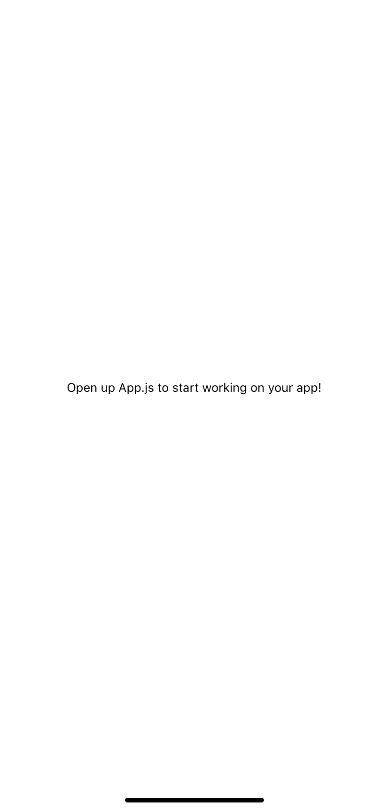

# 八、使用 React Native 和 Expo 构建房屋挂牌应用

React 的开发口号之一是*一次学习，随时随地写作，*，这是因为 React Native 的存在。使用 React-Native，您可以使用 JavaScript 和 React 编写本机移动应用，同时使用与 React 相同的功能进行状态管理。基于从本书中收集的 React 知识，您将从本章开始探索 React Native。由于 React 和 React Native 有很多相似之处，建议您在对 React 知识感到不安全时，再看一看前面的一些章节。

在本章中，您将使用 React Native 创建一个移动应用，该应用使用与前几章相同的语法和模式。您将设置基本路由，探索 iOS 和 Android 开发之间的差异，并了解如何使用`styled-components`设置 React 本机组件的样式。此外，名为**Expo**的工具链将用于运行和部署 React 本机应用。

本章将介绍以下主题：

*   创建本地项目
*   移动应用的路由
*   生物的生命周期
*   在 React Native 中设置组件的样式

# 项目概述

在本章中，我们将创建一个房屋列表应用，该应用显示可用房屋的概览，每个列表都有一个详细页面，`styled-components`用于样式设置，**React Navigation**用于路由。数据是从模拟 API 获取的。

构建时间为 1.5 小时。

# 开始

确保在 iOS 或 Android 设备上安装了 Expo 客户端应用，以便能够运行本章中创建的应用。Expo 客户端可在苹果应用商店和谷歌 Play 商店中使用。

下载应用后，您需要创建一个 Expo 帐户，以使开发过程更加顺利。请确保将您的帐户详细信息存储在安全的地方，因为您将在本章后面需要这些信息。**别忘了通过单击通过电子邮件发送给您的链接来验证您的电子邮件地址。**

本章的完整代码可在 GitHub 上找到：[https://github.com/PacktPublishing/React-Projects/tree/ch8](https://github.com/PacktPublishing/React-Projects/tree/ch8) [。](https://github.com/PacktPublishing/React-Projects/tree/ch7)

This application was created using **Expo SDK version 33.0.0** and so you need to make sure the version of Expo you're using on your local machine is similar. Since React Native and Expo are updated frequently, make sure that you're working with this version to ensure the patterns described in this chapter behave as expected. In case your application won't start or you're receiving errors, make sure to check the Expo documentation to learn more about updating the Expo SDK.

# 使用 React Native 和 Expo 构建房屋挂牌应用

在本节中，您将使用 React Native 和 Expo 构建一个房屋清单应用，它允许您使用 React 中已知的语法和模式，就像它使用 React 库一样。此外，Expo 还可以避免在您的机器上安装和配置 Xcode（用于 iOS）或 Android Studio 来开始创建本机应用。因此，您可以从任何机器为 iOS 和 Android 平台编写应用。

You can also run a React Native application in the browser using Expo web to create **Progressive Web Applications** (**PWAs**). However, developing for iOS, Android, and the web at the same time is still experimental and might need a lot of performance and architectural fixes. Also, not all the packages that work in React Native on mobile devices will work on Expo web as well.

Expo 将 React API 和 JavaScript API 与 React 本机开发过程相结合，以允许 JSX 组件、挂钩等功能以及摄像头访问等本机功能。大致上，Expo 工具链由多个帮助您使用 React 本机的工具组成，如 Expo CLI，它允许您从终端创建 React-Native 项目，以及运行 React-Native 所需的所有依赖项。使用 Expo 客户端，您可以从连接到本地网络的 iOS 和 Android 移动设备打开这些项目。Expo SDK 是一个包含所有库的包，这些库使您可以在多个设备和平台上运行应用

# 创建一个本地项目

以前，本书中每个新 React 项目的出发点都是使用 CreateReact 应用为您的应用创建样板文件。对于 React Native，提供了一个类似的样板文件，它是 Expo CLI 的一部分，可以轻松地进行设置：

您需要使用`npm`使用以下命令全局安装 Expo CLI：

```jsx
npm install -g expo-cli
```

这将启动安装过程，这可能需要一些时间，因为它将安装 Expo CLI 及其所有可帮助您开发移动应用的依赖项。在此之后，您可以使用 Expo CLI 中的`init`命令创建一个新项目：

```jsx
expo init house-listing
```

世博会现在将为您创建项目，但首先，它将要求您回答以下问题：

1.  它将询问您是只创建一个空白模板、一个带有 TypeScript 配置的空白模板，还是一个设置了一些示例屏幕的示例模板。对于本章，您需要选择第一个选项：空白（`expo-template-blank`。
2.  选择模板后，您需要输入应用的名称，在本例中为 house listing。此名称将与应用的配置信息一起添加到`app.json`文件中。
3.  Expo 会自动检测机器上是否安装了纱线。如果是这样，它将要求您使用 Thread 安装安装计算机所需的其他依赖项。如果已安装纱线，请选择`yes`；否则，默认使用`npm`。对于本章，建议使用`npm`代替纱线，以便与前几章保持一致。

现在，将使用您选择的设置创建您的应用。现在可以通过使用以下命令移动到 Expo 刚刚创建的目录来启动此应用：

```jsx
cd house-listing
npm start
```

这将启动 Expo，使您能够从终端或浏览器启动项目，从而可以在移动设备上运行应用，也可以使用 iOS 或 Android 仿真器。在终端中，有多种打开应用的方法：

*   使用 Android 或 iOS 上 Expo 客户端的用户名登录。您的项目将自动显示在移动设备的“项目”选项卡中。
*   从运行 Android 或 iOS 的移动设备扫描显示的二维码。如果您使用的是 Android 设备，则可以直接从 Expo 客户端应用扫描二维码。在 iOS 上，您需要使用相机扫描要求您打开 Expo 客户端的代码。
*   按`a`打开 Android Emulator，或按`i`打开 iOS Emulator。请记住，您需要安装 Xcode 和/或 Android Studio 才能使用其中一个模拟器。
*   通过按`e`以电子邮件方式向您发送链接，可以从安装了 Expo 客户端应用的移动设备上打开此链接。

或者，运行`npm start`命令将在`http://localhost:19002/`URL 上打开您的浏览器，显示 Expo 开发者工具。假设您安装了*入门*部分提到的 Expo SDK 版本，则此页面将如下所示：


在这个页面上，您可以在左侧看到一个侧栏，在右侧看到 React 本机应用的日志。此侧边栏包含按钮，以便您可以启动 iOS 或 Android Emulator，您需要为其安装 Xcode 或 Android Studio。否则，您还可以使用先前安装的 Expo 应用在移动设备上找到一个按钮，通过电子邮件或二维码发送链接以打开应用

此时，您的应用应该如下所示。此屏幕截图取自 iOS 设备。无论您是使用 iOS 或 Android 模拟器打开应用，还是从 iOS 或 Android 设备打开应用：



This application was created using **Expo SDK version 33.0.0** and so you need to make sure the version of Expo you're using on your local machine is similar. Since React Native and Expo are updated frequently, make sure that you're working with this version to ensure the patterns described in this chapter behave as expected. In case your application won't start or you're receiving errors, make sure to check the Expo documentation to learn more about updating the Expo SDK.

我们使用 Expo 创建的 React 本机应用的项目结构与您在前几章中创建的 React 项目非常相似。情况如下：

```jsx
house-listing
|-- .expo
|-- assets
    |-- icon.png
    |-- splash.png
|-- node_modules
.gitignore
App.js
app.json
babel.config.js
package.json
```

在`assets`目录中，您可以在移动设备上安装此应用后，在主屏幕上找到用于应用图标的图像，以及启动应用时显示的作为启动屏幕的图像。`App.js`文件是应用的实际入口点，在这里您将返回应用装载时将呈现的组件。例如，应用商店的应用配置位于`app.json`中，而`babel.config.js`包含特定的巴别塔配置。

# 在 React Native 中设置路由

如前所述，`App.js`文件是应用的入口点，由 Expo 定义。如果打开此文件，您将看到它由组件组成，`StyleSheet`是直接从`react-native`导入的。React Native 中书写样式的语法与浏览器中使用的 React 不同，因此您必须在本章后面安装`styled-components`。

# 使用 React 导航创建路线

让我们继续安装 React Navigation。在 React Native 中，有许多软件包可以帮助您处理路由，但这是最流行的软件包之一，建议 Expo 使用。除了 React Navigation，您还必须安装为您的应用创建导航器所需的相关软件包，称为`react-navigation-stack`和`react-navigation-tabs`。可通过运行以下命令安装 React 导航及其依赖项：

```jsx
npm install react-navigation react-navigation-stack react-navigation-tabs
```

要将路由添加到 React 本机应用，您需要了解浏览器中的路由与移动应用中的路由之间的区别。React Native 中的历史记录与浏览器中的不同，在浏览器中，用户可以通过更改浏览器中的 URL 导航到不同的页面，以前访问过的 URL 将添加到浏览器历史记录中。相反，您需要自己跟踪页面之间的转换，并在应用中存储本地历史记录。

使用 React 导航，您可以使用多个不同的导航器来帮助您完成这项工作，包括堆栈导航器和选项卡导航器。stack navigator 的工作方式与浏览器非常相似，它在页面之间转换后堆叠页面，并允许您使用 iOS 和 Android 的本机手势和动画进行导航：

1.  您可以通过将包含路由配置的对象传递给`createStackNavigator`方法来设置堆栈导航器，该方法可以从`App.js`文件中的`react-navigation-stack`导入。此外，您还需要从`react-navigation`导入`createAppContainer`，这有助于您返回一个封装所有路由的组件：

```jsx
import React from 'react';
import { StyleSheet, Text, View } from 'react-native';
+ import { createAppContainer } from 'react-navigation';
+ import { createStackNavigator } from 'react-navigation-stack';

export default function App() {
    ...
```

2.  您不需要返回名为`App`的组件，而需要返回使用`createStackNavigator`创建的组件，该组件保存应用的所有路由。此`StackNavigator`组件需要使用`createAppContainer`导出，如下所示：

```jsx
import React from 'react';
import { StyleSheet, Text, View } from 'react-native';
import { createAppContainer } from 'react-navigation';
import { createStackNavigator } from 'react-navigation-stack';

- export default function App() {
- return (
+ const Home = () => (
    <View style={styles.container}>
        <Text>Open up App.js to start working on your app!</Text>
    </View>
  );
- } const styles = StyleSheet.create({
  container: {
    flex: 1,
    backgroundColor: '#fff',
    alignItems: 'center',
    justifyContent: 'center',
  },
}); + const StackNavigator = createStackNavigator({
+  Home: {
+    screen: Home,
+  },
+ });

+ export default createAppContainer(StackNavigator);
```

3.  您的应用现在有一条路由，即`Home`，并呈现`Home`组件。您还可以通过使用以下代码设置传递给`createStackNavigator`的对象中的`navigationOptions`字段，为该屏幕添加`title`：

```jsx
...

const AppNavigator = createStackNavigator({
  Home: {
    screen: Home,
+   navigationOptions: { title: 'Home' },
  },
});

export default createAppContainer(AppNavigator);
```

4.  要创建另一个路由，您可以通过添加`Detail`组件复制此过程，并添加呈现此组件的路由：

```jsx
import React from 'react';
import { StyleSheet, Text, View } from 'react-native';
import { createAppContainer } from 'react-navigation';
import { createStackNavigator } from 'react-navigation-stack';

const Home = () => (
  <View style={styles.container}>
    <Text>Open up App.js to start working on your app!</Text>
  </View>
);

+ const Detail = () => (
+  <View style={styles.container}>
+    <Text>Open up App.js to start working on your app!</Text>
+  </View>
+ );

...

const AppNavigator = createStackNavigator({
  Home: {
    screen: Home,
    navigationOptions: { title: 'Home' },
  },
+ Detail: {
+   screen: Detail,
+   navigationOptions: { title: 'Detail' },
+ },
});

export default createAppContainer(AppNavigator);
```

5.  既然应用中有两个屏幕，那么还需要设置应用首次装载时呈现的默认路由。您可以使用以下代码扩展传递给`createStackNavigator`的路由配置对象：

```jsx
...

const AppNavigator = createStackNavigator({
  Home: {
    screen: Home,
    navigationOptions: { title: 'Home' },
  },
  Detail: {
    screen: Detail,
    navigationOptions: { title: 'Detail' },
  },
+ }, { initialRouteName: 'Home' });
- });

export default createAppContainer(AppNavigator);
```

通过将`initialRouteName`的值更改为`Detail`，并检查应用中呈现的屏幕是否具有标题`Detail`，您可以看到`Detail`路由也在呈现。

在本节的下一部分中，您将学习如何在此导航器创建的不同屏幕之间进行转换。

# 在屏幕之间转换

在 React Native 中的屏幕之间转换的工作方式也与在浏览器中的工作方式稍有不同，因为同样，没有 URL。相反，您需要使用`navigation`属性，该属性可从堆栈导航器渲染的组件获得。`navigation`道具可通过以下更改来处理布线：

1.  您可以从`Home`和`Detail`组件访问本例中的`navigation`道具：

```jsx
import React from 'react';
import { StyleSheet, Text, View } from 'react-native';
import { createAppContainer } from 'react-navigation';
import { createStackNavigator } from 'react-navigation-stack';

- const Home = () => (
+ const Home = ({ navigation }) => (
  <View style={styles.container}>
    <Text>Open up App.js to start working on your app!</Text>
  </View>
);

...
```

2.  `navigation`属性包含多个值，包括`navigate`函数，该函数将路由名称作为参数。您可以将此函数用作事件，例如，可以从`react-native`导入的`Button`组件。与您习惯的 React 相比，您可以通过调用`onPress`事件处理程序而不是`onClick`来单击按钮。此外，`Button`组件不将任何儿童作为道具，而是作为`title`道具。为此，请更改以下代码：

```jsx
import React from 'react';
- import { StyleSheet, Text, View } from 'react-native';
+ import { Button, StyleSheet, Text, View } from 'react-native';
import { createAppContainer } from 'react-navigation';
import { createStackNavigator } from 'react-navigation-stack';

const Home = ({ navigation }) => (
  <View style={styles.container}>
    <Text>Open up App.js to start working on your app!</Text>
+   <Button onPress={() => navigation.navigate('Detail')} title='Go to Detail' />
  </View>
);

...
```

3.  当您按下带有`Go to Detail`标题的按钮时，您将切换到`Detail`屏幕。此屏幕的标题也会显示一个`Return`按钮，当您按下该按钮时，它会将您送回`Home`屏幕。您还可以使用`navigation`道具中的`goBack`功能创建自定义返回按钮，如下所示：

```jsx
...

- const Detail = () => (
+ const Detail = ({ navigation }) => (
  <View style={styles.container}>
    <Text>Open up App.js to start working on your app!</Text>
+    <Button onPress={() => navigation.goBack()} title='Go to back to Home' />
  </View>
);

...
```

通常，最好将这些组件存储在不同的目录中，并且只使用`App.js`文件来提高应用的可读性。要实现这一点，您需要在应用的根目录中创建一个名为`Screens`的新目录，您需要为刚刚创建的两个屏幕中的每一个添加一个文件。让我们了解如何做到这一点：

1.  在`Screens`目录中创建一个名为`Home.js`的文件，并将`Home`组件添加到此文件中，包括所用模块的导入。`Home`部件的代码如下：

```jsx
import React from 'react';
import { Button, StyleSheet, Text, View } from 'react-native';

const Home = ({ navigation }) => (
  <View style={styles.container}>
    <Text>Open up App.js to start working on your app!</Text>
    <Button onPress={() => navigation.navigate('Detail')} title='Go to Detail' />
  </View>
);

const styles = StyleSheet.create({
  container: {
    flex: 1,
    backgroundColor: '#fff',
    alignItems: 'center',
    justifyContent: 'center',
  },
});

export default Home;
```

2.  您需要对`Detail`屏幕执行相同的操作，创建`Screens/Detail.js`文件，并将`Detail`组件和所用模块的代码添加到此文件中。可以通过将以下代码块添加到该新文件来完成此操作：

```jsx
import React from 'react';
import { Button, StyleSheet, Text, View } from 'react-native';

const Detail = ({ navigation }) => (
  <View style={styles.container}>
    <Text>Open up App.js to start working on your app!</Text>
    <Button onPress={() => navigation.goBack()} title='Go to back to Home' />
  </View>
);

const styles = StyleSheet.create({
  container: {
    flex: 1,
    backgroundColor: '#fff',
    alignItems: 'center',
    justifyContent: 'center',
  },
});

export default Detail;
```

3.  在`App.js`文件中，您需要导入`Home`和`Detail`组件，并删除之前创建这两个组件的代码块，如下所示：

```jsx
import React from 'react';
- import { Button, StyleSheet, Text, View } from 'react-native';
import { createAppContainer } from 'react-navigation';
import { createStackNavigator } from 'react-navigation-stack'; + import Home from './Screens/Home';
+ import Detail from './Screens/Detail';

- const Home = ({ navigation }) => (
-   <View style={styles.container}>
-     <Text>Open up App.js to start working on your app!</Text>
-     <Button onPress={() => navigation.navigate('Detail')} title='Go to Detail' />
-   </View>
- );

- const Detail = ({ navigation }) => (
-   <View style={styles.container}>
-     <Text>Open up App.js to start working on your app!</Text>
-     <Button onPress={() => navigation.goBack()} title='Go to back to Home' />
-   </View>
- );

- const styles = StyleSheet.create({
-  container: {
-   flex: 1,
-   backgroundColor: '#fff',
-   alignItems: 'center',
-   justifyContent: 'center',
-  },
- });

const AppNavigator = createStackNavigator({
  Home: {
    screen: Home,
    navigationOptions: { title: 'Home' },
  },
  Detail: {
    screen: Detail,
    navigationOptions: { title: 'Detail' },
  },
}, { initialRouteName: 'Home' });

export default createAppContainer(AppNavigator);
```

您的应用仅使用`App.js`文件创建路由并设置堆栈导航器。许多应用使用多种类型的导航器，这些导航器将在本节的下一部分中介绍。

# 同时使用多个导航器

对于更复杂的应用，您不希望所有路由都堆叠在一起；您只希望为彼此相关的路由创建这些堆栈。幸运的是，您可以在 React 导航中使用彼此相邻的不同类型的导航器。为应用使用多个导航器可以按如下方式完成：

1.  移动应用中最常见的导航方式之一是使用标签；React Navigation 还可以为您创建选项卡导航器。因此，您需要将路由对象传递给`createBottomTabNavigator`方法，您可以使用以下代码从`react-navigation-tabs`导入该方法：

```jsx
import React from 'react';
import { Button, StyleSheet, Text, View } from 'react-native';
import { createAppContainer } from 'react-navigation';
import { createStackNavigator } from 'react-navigation-stack';
+ import { createBottomTabNavigator } from 'react-navigation-tabs'; 
import Home from './Screens/Home';
import Detail from './Screens/Detail';

...
```

2.  假设您希望`Home`屏幕和相邻的`Detail`屏幕在同一选项卡上可用，则需要为这些屏幕重命名堆栈导航器。此堆栈导航器应添加到传递给`createBottomTabNavigator`的路由对象中，该对象创建选项卡导航器。加载的初始路线的声明现在也链接到选项卡导航器：

```jsx
import React from 'react';
import { Button, StyleSheet, Text, View } from 'react-native';
import { createAppContainer } from 'react-navigation'; 
import { createStackNavigator } from 'react-navigation-stack';
import { createBottomTabNavigator } from 'react-navigation-tabs';
import Home from './Screens/Home';
import Detail from './Screens/Detail';

- const AppNavigator = createStackNavigator({
+ const HomeStack = createStackNavigator({
    Home: {
      screen: Home,
      navigationOptions: { title: 'Home' },
    },
    Detail: {
      screen: Detail,
      navigationOptions: { title: 'Detail' },
    },
-  }, { initialRouteName: 'Home' });
+ });

+ const AppNavigator = createBottomTabNavigator({
+  Home: HomeStack
+ }, { initialRouteName: 'Home' });

export default createAppContainer(AppNavigator);
```

应用的主导航现在是选项卡导航器，它只有一个选项卡，称为`Home`。此选项卡将呈现包含`Home`和`Detail`路由的堆栈导航器，这意味着您仍然可以导航到`Detail`屏幕，而无需离开`Home`选项卡。

3.  您可以轻松地向选项卡导航器添加另一个选项卡，以呈现组件或另一个堆栈导航器。让我们创建一个名为`Settings`的新屏幕，首先需要在`Screens/Settings.js`文件中创建一个新组件：

```jsx
import React from 'react';
import { StyleSheet, Text, View } from 'react-native';

const Settings = ({ navigation }) => (
  <View style={styles.container}>
    <Text>Open up App.js to start working on your app!</Text>
  </View>
);

const styles = StyleSheet.create({
  container: {
    flex: 1,
    backgroundColor: '#fff',
    alignItems: 'center',
    justifyContent: 'center',
  },
});

export default Settings;
```

4.  在`App.js`中导入此组件，将新的`Screens`路由添加到选项卡导航器中。进行以下更改后，此屏幕将呈现`Settings`组件：

```jsx
import React from 'react';
import { Button, StyleSheet, Text, View } from 'react-native';
import { createAppContainer } from 'react-navigation';
import { createStackNavigator } from 'react-navigation-stack';
import { createBottomTabNavigator } from 'react-navigation-tabs';
import Home from './Screens/Home';
import Detail from './Screens/Detail';
+ import Settings from './Screens/Settings';

...

const AppNavigator = createBottomTabNavigator({
   Home: HomeStack,
+  Settings,
}, { initialRouteName: 'Home' });

export default createAppContainer(AppNavigator);
```

5.  您的应用现在有一个名为`Settings`的选项卡，它将呈现`Settings`组件。但是，例如，无法自定义此屏幕的`title`。因此，您需要使用以下代码创建另一个仅具有`Settings`路由的堆栈导航器：

```jsx
...

+ const SettingsStack = createStackNavigator({
+  Settings: {
+    screen: Settings,
+    navigationOptions: { title: 'Settings' },
+  },
+ });

const AppNavigator = createBottomTabNavigator({
   Home: HomeStack,
-  Settings,
+  Settings: SettingsStack,
}, { initialRouteName: 'Home' });

export default createAppContainer(AppNavigator);
```

现在，您已经在应用中添加了堆栈导航器和选项卡导航器，它允许您同时在屏幕和选项卡之间导航。如果您使用 iOS Emulator 或在运行 iOS 的设备上运行应用，它将与下面的屏幕截图完全相同。对于 Android，应用在这一点上应该非常相似：


在下一节中，您将从模拟 API 加载数据，并使用 React 生命周期在不同的屏幕中加载此数据。

# 在 React Native 中使用生命周期

在开始向 React 本机组件添加样式之前，需要在应用中获取这些组件将显示的一些数据。因此，您需要使用生命周期来检索此数据并将其添加到应用的本地状态。

要获取数据，您将再次使用`fetch`API，并将其与`useState`和`useEffect`钩子相结合，以在生命周期内检索此数据。一旦从模拟 API 中获取数据，它就可以显示在 React Native`FlatList`组件中。通过进行以下添加，可以使用挂钩将生命周期方法添加到 React 本机应用中：

1.  您将使用`useState`钩子设置加载指示器、错误消息和显示数据的常量，其中`loading`常量最初应为 true，`error`常量应为空，`data`常量应为空数组：

```jsx
...

- const Home = ({ navigation }) => (
+ const Home = ({ navigation }) => {
+  const [loading, setLoading] = React.useState(true);
+  const [error, setError] = React.useState('');
+  const [data, setData] = React.useState([]);

+  return (
    <View style={styles.container}>
      <Text>Open up App.js to start working on your app!</Text>
      <Button onPress={() => navigation.navigate('Detail')} title='Go to Detail' />
    </View>
   )
+ };
```

2.  接下来，您需要创建一个异步函数，从模拟 API 检索数据，并从应用装载时调用的`useEffect`钩子调用此函数。当 API 请求成功时，`fetchAPI`函数将更改`loading`、`error`和`data`的两个常量。否则，错误消息将添加到`error`常量中：

```jsx
...
const Home = ({ navigation }) => {
  const [loading, setLoading] = React.useState(true);
  const [error, setError] = React.useState('');
  const [data, setData] = React.useState([]);

+  const fetchAPI = async () => {
+    try {
+      const data = await fetch('https://my-json-server.typicode.com/PacktPublishing/React-Projects/listings');
+      const dataJSON = await data.json();

+      if (dataJSON) {
+        setData(dataJSON);
+        setLoading(false);
+      }
+    } catch(error) {
+      setLoading(false);
+      setError(error.message);
+    }
+  };

+  React.useEffect(() => {
+    fetchAPI();
+  }, []);

  return (
    ...
```

3.  该数据常量现在可以作为道具添加到`FlatList`组件，该组件迭代数据并呈现显示该数据的组件。`FlatList`返回一个对象，该对象包含一个名为`item`的字段，该字段包含每个迭代的数据，如下所示：

```jsx
import React from 'react';
- import { Button, StyleSheet, Text, View } from 'react-native';
+ import { FlatList, StyleSheet, Text, View } from 'react-native';

const Home = ({ navigation }) => {

  ...

  return (
    <View style={styles.container}>
-     <Text>Open up App.js to start working on your app!</Text>
-     <Button onPress={() => navigation.navigate('Detail')} title='Go to Detail' />
+     {!loading && !error && <FlatList
+       data={data}
+       renderItem={({item}) => <Text>{item.title}</Text>}
+     />}
    </View>
  )
};

...
```

4.  就像我们可以使用 React 一样，当使用`map`或`forEach`函数时，需要在每个迭代组件上指定`key`属性。`FlatList`自动在`data`对象中查找`key`字段，但如果您没有特定的`key`字段，则需要使用`keyExtractor`道具进行设置。重要的是要知道用于键的值应该是字符串，因此需要将模拟 API 返回的`id`字段转换为字符串：

```jsx
  ...

  return (
    <View style={styles.container}>
     {!loading && !error && <FlatList
       data={data}
+      keyExtractor={item => String(item.id)}
       renderItem={({item}) => <Text>{item.title}</Text>}
     />}
    </View>
  );
};

...
```

现在，您的应用将显示一个列表，其中包含来自 mockapi 的房屋清单的标题，而无需路由到特定的清单或样式。这将使您的应用看起来如下所示，其中 Android 和 iOS 之间的差异应该是有限的，因为我们尚未向应用添加任何重要的样式：


要再次将导航添加到`Detail`路线，您需要从`FlatList`返回一个支持`onPress`事件的组件。例如，您之前使用的`Button`组件和`TouchableOpacity`组件。最后一个组件可以用作不支持`onPress`事件的`View`组件的替代品。通过进行以下更改，可以在此处创建导航：

1.  您需要从`react-native`导入`TouchableOpacity`组件，并将`FlatList`返回的`Text`组件与此组件包装在一起。如果我们更改以下代码，`onPress`事件将从`navigation`道具调用`navigate`函数并导航到`Detail`路线：

```jsx
import React from 'react';
- import { FlatList, View, Text } from 'react-native';
+ import { FlatList, View, Text, TouchableOpacity } from 'react-native';

const Home = ({ navigation }) => {
  ...

  return (
    <View style={styles.container>
      {!loading && !error && <FlatList
        data={data}
        keyExtractor={item => String(item.id)}
-       renderItem={({item}) => <Text>{item.text}</Text>}
+       renderItem={({item}) => (
+         <TouchableOpacity onPress={() => navigation.navigate('Detail')}>
+           <Text>{item.title}</Text>
+         </TouchableOpacity>
+       )}
      />}
    </View>
  );
};

...
```

2.  当您单击应用中显示的任何标题时，您将导航到`Detail`路线。但是，您希望此屏幕显示您刚刚按下的项目。因此，一旦按下`TouchableOpacity`组件，您需要将参数传递到此路由。为此，您需要将对象内部的这些参数传递给`navigate`函数：

```jsx
  ...

  return (
    <View style={styles.container>
      {!loading && !error && <FlatList
        data={data}
        keyExtractor={item => String(item.id)}
        renderItem={({item}) => (
-         <TouchableOpacity onPress={() => navigation.navigate('Detail')}>
+         <TouchableOpacity onPress={() => navigation.navigate('Detail', { item })}>
           <Text>{item.title}</Text>
         </TouchableOpacity>
       )}
      />}
    </View>
  );
};

...
```

3.  从`Detail`路线渲染的组件中，您可以从`navigation`道具中获取此参数对象，并使用它来显示项目。要从`navigation`道具获取参数，可以使用`getParam`函数，其中需要指定要获取的参数的名称以及该参数的回退值。就像我们对`Home`路线所做的一样，您可以显示清单的`title`，在本例中，它应该是`item`参数中的`title`：

```jsx
import React from 'react';
- import { Button, StyleSheet, Text, View } from 'react-native';
+ import { StyleSheet, Text, View } from 'react-native';

- const Detail = ({ navigation }) => (
+ const Detail = ({ navigation }) => {
+   const item = navigation.getParam('item', {})

+   return (
      <View style={styles.container}>
-       <Text>Open up - App.js to start working on your app!</Text>
-       <Button onPress={() => navigation.goBack()} title='Go to back to Home' />
+       <Text>{item.title}</Text>
      </View>
    );
+ };

...

export default Detail;
```

Instead of passing the entire object containing the data from the item you've clicked, you could just send the ID of the item. That way, you could fetch the mock API to get the data for this listing and display it on the `Detail` route as well. To get an individual listing, you need to send a request to the `'listings/:id'` route.

现在，您可以查看模拟 API 中所有列表的列表和此 API 中的特定列表。将在下一节中使用`styled-components`添加样式。

# 设计本机应用的样式

到目前为止，您在该应用中用于设置 React 本机组件样式的语法看起来与您已经使用的有点不同。因此，您可以安装`styled-components`来使用您已经熟悉的书写风格语法。要安装此软件，您需要运行以下命令：

```jsx
npm install styled-components
```

这将安装`styled-components`软件包，之后您可以继续为应用中已经存在的组件创建样式：

1.  让我们首先将`Screens/Home.js`文件中的`View`和`FlatList`组件转换为`styled-components`。要做到这一点，您需要从`styled-components/native`导入`styled`，因为您只想导入包的特定本地部分：

```jsx
import React from 'react';
- import { FlatList, StyleSheet, Text, View, TouchableOpacity } from 'react-native';
+ import { FlatList, Text, View, TouchableOpacity } from 'react-native';
+ import styled from 'styled-components/native'; 
const Home = ({ navigation }) => {
  ...
```

2.  文件底部的`StyleSheet`为`View`组件创建样式，该组件应转换为具有`styled-components`样式的组件。正如我们在前几章中所看到的，您还可以扩展现有组件的样式。大多数样式规则可以复制并更改为`styled-components`语法，如以下代码块所示：

```jsx
... + const ListingsWrapper = styled(View)`
+  flex: 1;
+  background-color: #fff;
+  align-items: center;
+  justify-content: center;
+ `

- const styles = StyleSheet.create({
-   container: {
-     flex: 1,
-     backgroundColor: '#fff',
-     alignItems: 'center',
-     justifyContent: 'center',
-   },
- }); 
const Home = ({ navigation }) => {
  ...
  return (
-    <View style={styles.container}>
+    <ListingsWrapper>
      {!loading && !error && <FlatList
        data={data}
        keyExtractor={item => String(item.id)}
        renderItem={({item}) => (
          <TouchableOpacity onPress={() => navigation.navigate('Detail', { item })}>
            <Text>{item.title}</Text>
          </TouchableOpacity>
        )}
      />}
+    </ListingsWrapper>
-    </View>
  );
};

export default Home;
```

3.  对于`FlatList`组件也可以这样做，即通过`styled-components`中的`styled`扩展此组件的样式，并设置如下自定义样式规则：

```jsx
...

const ListingsWrapper = styled(View)`
  flex: 1;
  background-color: #fff;
  align-items: center;
  justify-content: center;
`

+ const Listings = styled(FlatList)`
+  width: 100%;
+  padding: 5%;
+ `; 
const Home = ({ navigation }) => {
  ...
  return (
    <ListingsWrapper>
-     {!loading && !error && <FlatList
+     {!loading && !error && <Listings
        data={data}
        keyExtractor={item => String(item.id)}
        renderItem={({item}) => (
          <TouchableOpacity onPress={() => navigation.navigate('Detail', { item })}>
            <Text>{item.title}</Text>
          </TouchableOpacity>
        )}
      />}
    </ListingsWrapper>
  );
};

export default Home;
```

4.  `FlatList`当前只返回一个带`title`的`Text`组件，可以显示更多数据。为此，您需要创建一个新组件，该组件返回多个包含来自模拟 API 的清单数据的组件。您可以在名为`Components`的新目录中执行此操作，该目录包含另一个名为`Listing`的目录。在此目录中，您需要创建`ListingItem.js`文件，并在其中放置以下代码块：

```jsx
import React from 'react';
import styled from 'styled-components/native';
import { Image, Text, View, TouchableOpacity } from 'react-native';

const ListingItemWrapper = styled(TouchableOpacity)`
 display: flex;
 flex-direction: row;
 padding: 2%;
 background-color: #eee;
 border-radius: 5px;
 margin-bottom: 5%;
`;

export const Title = styled(Text)`
 flex-wrap: wrap;
 width: 99%;
 font-size: 20px;
`

export const Price = styled(Text)`
 font-weight: bold;
 font-size: 20px;
 color: blue;
`

const Thumbnail = styled(Image)`
 border-radius: 5px;
 margin-right: 4%;
 height: 200px;
 width: 200px;
`

const ListingItem = ({ item, navigation }) => (
 <ListingItemWrapper onPress={() => navigation.navigate('Detail', { item })}>
   <Thumbnail
     source={{uri: item.thumbnail}}
   />
   <View>
     <Title>{item.title}</Title>
     <Price>{item.price}</Price>
   </View>
 </ListingItemWrapper>
);

export default ListingItem;
```

在这个代码块中，您从`styled-components/native`导入`styled`，并从 React Native 导入要设置样式的组件。文件底部导出的`ListingItem`组件使用`item`和`navigation`道具在创建的组件中显示此数据并处理导航。正如我们在样式化的`Image`组件中看到的，`source`道具被赋予了一个对象来显示模拟 API 中的缩略图。

5.  这个`ListingItem`组件现在应该导入`Screens/Home.js`中，`FlatList`将使用它来显示列表。该组件以`item`和`navigation`为道具，在以下代码块中完成：

```jsx
import React from 'react';
- import { FlatList, View, Text, TouchableOpacity } from 'react-native';
+ import { FlatList, View } from 'react-native';
import styled from 'styled-components/native';
+ import ListingItem from '../Components/Listing/ListingItem'

...
const Home = ({ navigation }) => {
  ...

  return (
    <ListingsWrapper>
      {!loading && !error && <Listings
        data={data}
        keyExtractor={item => String(item.id)}
-       renderItem={({item}) => (
-         <TouchableOpacity onPress={() => navigation.navigate('Detail', { item })}>
-           <Text>{item.title}</Text>
-         </TouchableOpacity>
-       )}
+       renderItem={({item}) => <ListingItem item={item} />}
      />}
    </ListingsWrapper>
  );
};

export default Home;
```

In React Native, styling rules are scoped to components, meaning a `Text` component can only take styling rules that are specified for this component by React Native. When you try to add a styling rule that isn't supported, you'll receive an error and a list of all the possible styling rules for this component. Note that `styled-components` automatically renames styling rules for you to match the syntax for styling in React Native.

在这些更改之后，您将在应用中添加第一个`styled-components`。当您使用 iOS Emulator 或在 iOS 上运行的设备时，应用应如下所示：


到目前为止，iOS 和 Android 上的样式应该是相似的，因为我们还没有在应用中添加任何特定于平台的样式。这将在本节的下一部分中完成，您将探索多种添加样式的方法，这些样式根据应用运行的平台而有所不同。

# iOS 和 Android 的风格差异

例如，在设置应用的样式时，您可能希望 iOS 和 Android 具有不同的样式规则，以便更好地匹配 Android 操作系统的样式。有多种方法可以将不同的样式规则应用于不同的平台；其中之一是使用`Platform`模块，该模块可以从 React Native 导入。

让我们通过在`navigator`选项卡的选项卡中添加图标来尝试这一点，并为 iOS 和 Android 添加不同的图标：

1.  首先，将图标从 Expo 导入到`App.js`文件中。世博会上有很多图标集。对于此应用，您将导入`Ionicons`图标集：

```jsx
import React from 'react';
+ import { Ionicons } from '@expo/vector-icons';
import { createAppContainer } from 'react-navigation';
import { createStackNavigator } from 'react-navigation-stack';
import { createBottomTabNavigator } from 'react-navigation-tabs';
import Home from './Screens/Home';
import Detail from './Screens/Detail';
import Settings from './Screens/Settings';

const HomeStack = createStackNavigator({
  ...
```

2.  创建选项卡导航器时，可以定义应为每条管线向选项卡添加哪些图标。因此，您需要在路由对象中创建一个`defaultNavigationOptions`字段，该字段应该包含一个`tabBarIcon`字段。在此字段中，您需要从`navigation`道具获取当前路线，并返回此路线的图标：

```jsx
...

const AppNavigator = createBottomTabNavigator({
  Home: HomeStack,
  Settings: SettingsStack,
- }, { initialRouteName: 'Home' });
+ }, {
+  initialRouteName: 'Home',
+  defaultNavigationOptions: ({ navigation }) => ({
+    tabBarIcon: () => {
+      const { routeName } = navigation.state;

+      let iconName;
+      if (routeName === 'Home') {
+        iconName = `ios-home`;
+      } else if (routeName === 'Settings') {
+        iconName = `ios-settings`;
+      }

+      return <Ionicons name={iconName} size={20} />;
+    }
+  })
});

export default createAppContainer(AppNavigator);
```

3.要区分 iOS 和 Android，您需要从`react-native`导入`Platform`模块。通过此模块，您可以通过检查`Platform.OS`的值是否为`ios`或`android`来检查您的移动设备是否运行 iOS 或 Android。必须将模块导入以下代码块：

```jsx
import React from 'react';
+ import { Platform } from 'react-native';
import { Ionicons } from '@expo/vector-icons';
import { createAppContainer } from 'react-navigation';
import { createStackNavigator } from 'react-navigation-stack';
import { createBottomTabNavigator } from 'react-navigation-tabs';
import Home from './Screens/Home';
import Detail from './Screens/Detail';
import Settings from './Screens/Settings';

const HomeStack = createStackNavigator({
  ...
```

4.  使用`Platform`模块，您可以更改为导航器中每个选项卡呈现的图标。除了为 iOS 设计的图标外，`Ionicons`还基于材质设计为 Android 设计了图标，可以这样使用：

```jsx
...

const AppNavigator = createBottomTabNavigator({
  Home: HomeStack,
  Settings: SettingsStack,
}, {
  initialRouteName: 'Home',
  defaultNavigationOptions: ({ navigation }) => ({
    tabBarIcon: () => {
      const { routeName } = navigation.state;

      let iconName;
      if (routeName === 'Home') {
-       iconName = `ios-home`;
+       iconName = `${Platform.OS === 'ios' ? 'ios' : 'md'}-home`;
      } else if (routeName === 'Settings') {
-       iconName = `ios-settings`;
+       iconName = `${Platform.OS === 'ios' ? 'ios' : 'md'}-settings`;
      }

      return <Ionicons name={iconName} size={20} />;
    }
  }),
});

export default createAppContainer(AppNavigator);
```

在 Android 移动设备上运行应用时，`navigator`选项卡将根据材料设计显示图标。如果你使用的是苹果设备，它会显示不同的图标；您可以将`Platform.OS === 'ios'`条件更改为`Platform.OS === 'android'`以将材质设计图标添加到 iOS

5.  显示的图标为黑色，而活动和非活动选项卡的标签具有不同的颜色。通过更改配置对象，可以指定处于活动和非活动状态的图标和标签的颜色。在`tabBarIcon`字段之后，您可以创建一个名为`tabBarOptions`的新字段，并将`activeTintColor`和`inActiveTintColor`字段添加到其中，如下所示：

```jsx
...
const AppNavigator = createBottomTabNavigator({
  Home: HomeStack,
  Settings: SettingsStack,
}, {
  initialRouteName: 'Home',
  defaultNavigationOptions: ({ navigation }) => ({
    tabBarIcon: () => {
      const { routeName } = navigation.state;

      let iconName;
      if (routeName === 'Home') {
        iconName = `${Platform.OS === 'ios' ? 'ios' : 'md'}-home`;
      } else if (routeName === 'Settings') {
        iconName = `${Platform.OS === 'ios' ? 'ios' : 'md'}-settings`;
      }

      return <Ionicons name={iconName} size={20} />;
    },
+   tabBarOptions: {
+      activeTintColor: 'blue',
+      inactiveTintColor: '#556',
+   },
  })
});

export default createAppContainer(AppNavigator);
```

6.  这只会更改标签的值，但在`tabBarIcon`字段中也可以使用`tintColor`属性的“活动”和“非活动”着色颜色的值。此值也可以传递到`Ionicons`以更改图标的颜色：

```jsx
...

const AppNavigator = createBottomTabNavigator({
  Home: HomeStack,
  Settings: SettingsStack,
}, {
  initialRouteName: 'Home',
  defaultNavigationOptions: ({ navigation }) => ({
-   tabBarIcon: () => {
+   tabBarIcon: ({ tintColor }) => {
      const { routeName } = navigation.state;

      let iconName;
      if (routeName === 'Home') {
        iconName = `${Platform.OS === 'ios' ? 'ios' : 'md'}-home`;
      } else if (routeName === 'Settings') {
        iconName = `${Platform.OS === 'ios' ? 'ios' : 'md'}-settings`;
      }

-     return <Ionicons name={iconName} size={20} />;
+     return <Ionicons name={iconName} size={20} color={tintColor} />;
    },
    tabBarOptions: {
      activeTintColor: 'blue',
      inactiveTintColor: '#556',
    },
  }),
});

export default createAppContainer(AppNavigator);
```

现在，当您查看主屏幕时，选项卡图标和标签均为蓝色，而设置选项卡将为灰色。此外，无论您是在模拟器上运行应用还是在移动设备上运行应用，iOS 或 Android 上显示的图标都会有所不同。如果您使用的是 iOS，则应用应如下所示：


另一个可以设置样式的页面是`Detail`屏幕。对于这个屏幕，您还可以选择在 iOS 和 Android 之间有不同的样式。如前所述，有多种方法可以做到这一点；除了使用`Platform`模块，您还可以使用特定于平台的文件扩展名。任何具有`*.ios.js`或`*.android.js`扩展名的文件将仅在扩展名中指定的平台上呈现。您不仅可以应用不同的样式规则，还可以在不同平台上更改功能：

1.  要为运行 Android 的移动设备创建一个特定的`Detail`屏幕，您需要创建一个名为`Components/Listing/ListingDetail.android.js`的新文件。此文件将包含以下代码：

```jsx
import React from 'react';
import styled from 'styled-components/native';
import { Image, Text, View, Dimensions } from 'react-native';

const ListingDetailWrapper = styled(View)`
  display: flex;
`;

const Details = styled(View)`
  padding: 5%;
`

export const Title = styled(Text)`
  flex-wrap: wrap;
  width: 99%;
  font-size: 30px;
`

export const Price = styled(Text)`
  font-weight: bold;
  font-size: 20px;
  color: blue;
`

const Thumbnail = styled(Image)`
  width: 100%;
  height: ${Dimensions.get('window').width};
`

const ListingDetail = ({ item }) => (
  <ListingDetailWrapper>
    <Thumbnail
      source={{uri: item.thumbnail}}
    />
    <Details>
      <Title>{item.title}</Title>
      <Price>{item.price}</Price>
    </Details>
  </ListingDetailWrapper>
);

export default ListingDetail;
```

如您所见，一些组件将由`ListingDetail`组件渲染。另外，`Dimensions`模块是从`react-native`导入的。此模块可帮助您获取运行应用的设备的屏幕大小。通过获取宽度，可以在用户屏幕的整个宽度上显示图像。

2.  对于运行 iOS 的设备，您也可以这样做，但这次您需要创建一个名为`Components/Listing/ListingDetail.ios.js`的新文件。此文件将包含 Android 上运行的代码变体，其中图像将使用`Dimensions`模块在整个屏幕高度上显示。iOS 的`ListingDetail`组件可以通过将以下代码块粘贴到该文件中来创建：

```jsx
import React from 'react';
import styled from 'styled-components/native';
import { Image, Text, View, Dimensions } from 'react-native';

const ListingDetailWrapper = styled(View)`
  display: flex;
`;

const Details = styled(View)`
  position: absolute;
  top: 0;
  padding: 5%;
  width: 100%;
  background: rgba(0, 0, 255, 0.1);
`

export const Title = styled(Text)`
  flex-wrap: wrap;
  width: 99%;
  font-size: 30px;
`

export const Price = styled(Text)`
  font-weight: bold;
  font-size: 20px;
  color: blue;
`

const Thumbnail = styled(Image)`
  width: 100%;
  height: ${Dimensions.get('window').height};
`

const ListingDetail = ({ item }) => (
  <ListingDetailWrapper>
    <Thumbnail
      source={{uri: item.thumbnail}}
    />
    <Details>
      <Title>{item.title}</Title>
      <Price>{item.price}</Price>
    </Details>
  </ListingDetailWrapper>
);

export default ListingDetail;
```

3.  要在应用中显示其中一个组件，需要对`Screens/Detail.js`文件进行一些更改。`ListingDetail`组件应导入到此文件中，并与`item`属性一起返回：

```jsx
import React from 'react';
import { StyleSheet, Text, View } from 'react-native';
+ import ListingDetail from '../Components/Listing/ListingDetail';

const Detail = ({ navigation }) => {
  const item = navigation.getParam('item', {});

  return (
-  <View style={styles.container}>
+  <ListingDetail item={item} />
-  </View>
  )
};

- const styles = StyleSheet.create({
-  container: {
-    flex: 1,
-    backgroundColor: '#fff',
-    alignItems: 'center',
-    justifyContent: 'center',
-  },
- });

export default Detail;
```

您的应用现在有两个不同版本的 iOS 和 Android 详细信息屏幕，React Native 将确保具有正确扩展名的文件将在该操作系统上运行。您可以通过将在 Android Emulator 或移动设备上运行的应用与以下截图（取自 iOS 设备）进行比较来检查这一点：


通过这些最后的更改，您创建了第一个 React 本机应用，该应用将在 Android 和 iOS 设备上运行，并实现了基本的路由和样式。

# 总结

在本章中，您使用 React Native 为 iOS 和 Android 移动设备创建了一个房屋清单应用。Expo 用于创建应用的第一个版本，并提供了许多功能来平滑开发人员体验。`react-navigation`包用于处理移动应用的各种路由，而`styled-components`则用于处理本机应用的样式。

因为这可能是您第一次介绍 React Native，如果不是从一开始就一切都很清楚，您也不应该感到不安。您在本章中学习的基础知识应该提供一个适当的基线，以便我们可以继续您进入移动应用开发世界的旅程。您将在下一章中创建的项目将进一步基于这些原则，并在我们创建*Tic Tac Toe*游戏时处理动画等功能。

# 进一步阅读

*   要了解有关 React 导航中自定义标题的更多信息，请查看此链接：[https://reactnavigation.org/docs/en/headers.html](https://reactnavigation.org/docs/en/headers.html) 。
*   您可以在此处找到世博会图标列表：[https://expo.github.io/vector-icons/](https://expo.github.io/vector-icons/) 。